# 第一章. 入门

在本章中，我们将介绍以下食谱：

+   开始使用 WebGL 渲染器

+   开始使用 Canvas 渲染器

+   开始使用 CSS 3D 渲染器

+   检测 WebGL 支持

+   设置动画循环

+   确定场景的帧率

+   控制场景中使用的变量

+   使用 Python 设置本地 Web 服务器

+   使用 Node.js 设置本地 Web 服务器

+   使用 Mongoose 设置本地 Web 服务器

+   解决 Chrome 中的跨域错误消息

+   解决 Firefox 中的跨域错误消息

+   添加键盘控制

+   异步加载纹理

+   异步加载模型

+   带进度加载模型

+   带进度异步加载其他资源

+   等待资源加载完成

+   将文件从桌面拖动到场景中

# 简介

在本章中，我们将向您展示一系列食谱，介绍 Three.js 的基本用法。我们将从一些简单的食谱开始，您可以用它们作为 Three.js 项目的起点。接下来，我们将向您展示您可以添加到项目中的几个功能，例如 WebGL 检测和定义动画循环。我们将以添加拖放支持和同步和异步加载资源等更多高级功能结束。

# 开始使用 WebGL 渲染器

当您想要创建一个使用 WebGL 进行渲染的初始 Three.js 项目时，您总是必须设置相同的几个变量。您需要一个 `THREE.WebGLRenderer` 对象，一个 `THREE.Scene` 对象，一个相机，以及渲染场景的方法。在本食谱中，我们将为您提供您可以在自己的项目中使用的标准模板，以便快速开始使用 WebGL 渲染器。

## 准备工作

确保您下载了本书的源代码。您可以通过以下两种方式之一来完成此操作：

+   首先，您可以通过克隆您可以在 [`github.com/josdirksen/threejs-cookbook`](https://github.com/josdirksen/threejs-cookbook) 找到的 Git 仓库来完成此操作。

+   或者，您可以从 Packt Publishing 网站下载源代码。当您解压缩 ZIP 文件或克隆存储库时，您将找到一组目录；每个目录对应本书的一章。对于这个食谱，您可以使用 `0` 作为参考。

您可以直接通过在浏览器中打开之前提到的文件来查看此食谱的最终结果。当您在浏览器中打开此示例时，您将看到以下截图：

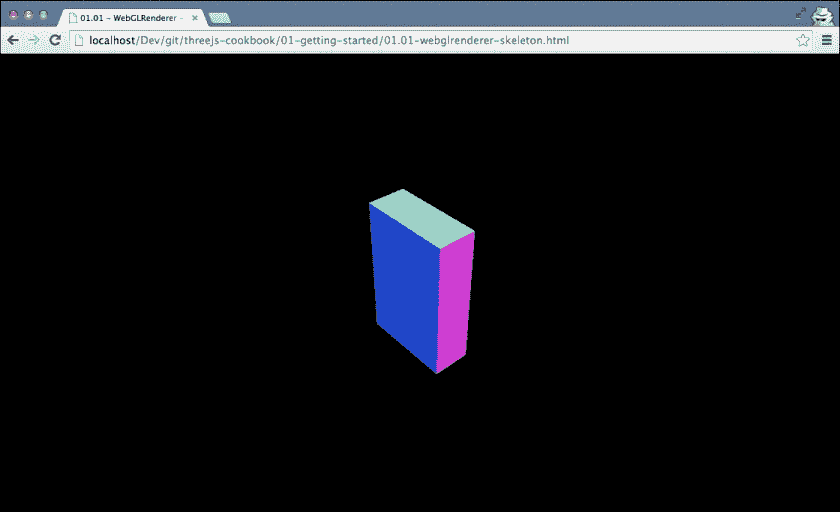

这是一个最小化的场景，使用 `THREE.WebGLRenderer` 对象渲染。

## 如何操作...

创建一个可以作为您项目基础的骨架很容易。通过几个简单的步骤，您将获得第一个基于 WebGLRenderer 的 Three.js 场景并开始运行：

1.  让我们先定义我们将要使用的基本 HTML：

    ```js
    <!DOCTYPE html>
    <html>
      <head>
        <title>01.01 - WebGLRenderer - Skeleton</title>
        <script src="img/three.js"></script>
        <style>
          body {
          margin: 0;
          overflow: hidden;
          }
        </style>
      </head>
      <body>
        <script>
          ...
        </script>
      </body>
    </html>
    ```

    ### 小贴士

    **下载示例代码**

    您可以从您在 [`www.packtpub.com`](http://www.packtpub.com) 的账户中下载示例代码文件，以获取您购买的所有 Packt Publishing 书籍。如果您在其他地方购买了这本书，您可以访问 [`www.packtpub.com/support`](http://www.packtpub.com/support) 并注册，以便将文件直接通过电子邮件发送给您。

    如您所见，这是一个简单的页面，其中包含一个 `script` 标签，它将包含我们的 Three.js 代码。唯一有趣的部分是 CSS 样式。

    我们将此样式添加到 `body` 元素中，以确保我们的 Three.js 场景将以全屏模式运行，并且不会显示任何滚动条。

1.  接下来，让我们先填写 `script` 标签。我们将要做的第一件事是创建一些全局变量，这些变量将在整个配方中使用：

    ```js
          // global variables
          var renderer;
          var scene;
          var camera;
    ```

    `renderer` 变量将保存对我们在下一步中将要创建的 `THREE.WebGLRenderer` 对象的引用。`scene` 变量是我们想要渲染的所有对象的容器，而 `camera` 变量决定了渲染场景时我们将看到的内容。

1.  通常，您希望在开始运行 JavaScript 之前等待所有 HTML 元素完成加载。为此，我们使用以下 JavaScript：

    ```js
          // calls the init function when the window is done loading.
          window.onload = init;
    ```

    通过这段代码，我们告诉浏览器在完整页面加载完毕后调用 `init` 函数。在下一步中，我们将展示这个 `init` 函数的内容。

1.  为了使您的骨架工作，您需要添加一个 `init` 函数，其外观如下：

    ```js
    function init() {

          // create a scene, that will hold all our elements 
          // such as objects, cameras and lights.
          scene = new THREE.Scene(); 
          // create a camera, which defines where we looking at.
          camera = new THREE.PerspectiveCamera(45, window.innerWidth / window.innerHeight, 0.1, 1000);
          // position and point the camera to the center
          camera.position.x = 15;
          camera.position.y = 16;
          camera.position.z = 13;
          camera.lookAt(scene.position);

          // create a renderer, set the background color and size
          renderer = new THREE.WebGLRenderer();
          renderer.setClearColor(0x000000, 1.0);
          renderer.setSize(window.innerWidth, window.innerHeight);

          // create a cube and add to scene
          var cubeGeometry = new THREE.BoxGeometry(10 * Math.random(), 10 * Math.random(), 10 * Math.random());

          var cubeMaterial = new THREE.MeshNormalMaterial();

          var cube = new THREE.Mesh(cubeGeometry, cubeMaterial);
          scene.add(cube);

          // add the output of the renderer to the html element
          document.body.appendChild(renderer.domElement);

          // call the render function
          renderer.render(scene, camera);

          }
    ```

    在这个 `init` 函数中，我们首先创建了一个 `THREE.Scene` 对象，其中包含我们想要渲染的所有对象的容器。接下来，我们创建了一个相机，它决定了将要渲染的视图范围。接下来，我们创建了 `THREE.WebGLRenderer` 对象，它用于使用 WebGL 渲染场景。`THREE.WebGLRenderer` 对象有许多属性。在这个配方中，我们使用了 `setClearColor` 属性将场景的背景设置为黑色，并告诉渲染器使用整个窗口作为其输出，使用 `window.innerWidth` 和 `window.innerHeight` 属性。为了检查我们的骨架页面是否正常工作，我们随后将一个简单的 `THREE.Mesh` 对象和一个 `THREE.BoxGeometry` 对象添加到场景中。在这个时候，我们可以将 WebGL 的输出作为 HTML `body` 元素的一个子元素添加。我们通过将渲染器的 DOM 元素附加到文档体来实现这一点。现在，剩下的只是通过调用 `renderer.render()` 来渲染场景。

通过这些步骤，您已经创建了一个基于 `WebGLRenderer` 的基本 Three.js 场景，您可以用它作为所有 Three.js 实验的基本起点。

## 参见

+   `THREE.WebGLRenderer`对象仅在您的浏览器支持 WebGL 时才工作。尽管大多数现代桌面浏览器（甚至大量移动浏览器）支持 WebGL，但在某些情况下，您可能需要寻找替代方案。Three.js 提供了一些其他渲染器，您可以使用。要获取支持 WebGL 的浏览器最新概述，您可以查看此主题的信息[`caniuse.com/webgl`](http://caniuse.com/webgl)。

+   除了使用`THREE.WebGLRenderer`对象来渲染您的场景外，您还可以使用在*Canvas 渲染器入门*配方中解释的`THREE.CanvasRenderer`对象，或者在*CSS 3D 渲染器入门*配方中解释的`THREE.CSS3DRenderer`对象。

# Canvas 渲染器入门

如果您的系统不支持 WebGL，您可以使用另一个渲染器来渲染您的场景：`CanvasRenderer`对象。这个渲染器不使用 WebGL 来渲染输出，而是直接使用 JavaScript 绘制 HTML5 canvas 元素。

## 准备就绪

在 Three.js 的 r69 版本中，canvas 渲染器已被从默认分发中删除。要使用此渲染器，我们首先必须导入以下两个文件：

```js
    <script src="img/CanvasRenderer.js"></script>
    <script src="img/Projector.js"></script>
```

对于这个配方，您可以查看本章源文件中的`01.02-canvasrenderer-skeleton.html`示例。如果您在浏览器中打开此示例，您将看到一个立方体，几乎就像上一个配方中的那样：

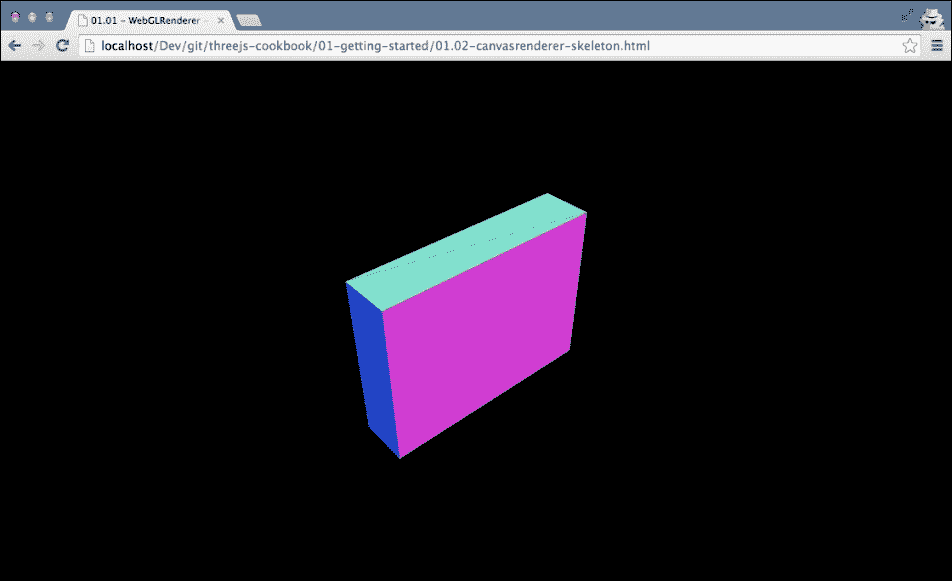

然而，这次这个立方体是用 HTML5 canvas 元素渲染的。HTML5 canvas 在许多设备上受到支持，但性能低于基于 WebGL 的解决方案。

## 如何操作...

要设置 WebGL 渲染器，您将遵循我们在上一个配方*WebGL 渲染器入门*中展示的 exactly the same steps，因此我们不会在本节中详细介绍，但我们会列出以下差异：

1.  要开始使用`THREE.CanvasRenderer`对象，我们唯一需要更改的是以下内容：

    +   在以下代码片段中替换`THREE.WebGLRenderer`对象：

        ```js
              renderer = new THREE.WebGLRenderer();
              renderer.setClearColor(0x000000, 1.0);
              renderer.setSize(window.innerWidth, window.innerHeight);
        ```

    +   将 THREE.WebGLRenderer 对象替换为以下`THREE.CanvasRenderer`对象：

        ```js
            renderer = new THREE.CanvasRenderer();
            renderer.setClearColor(0x000000, 1.0);
            renderer.setSize(window.innerWidth, window.innerHeight);
        ```

就这样。通过这个更改，我们从使用 WebGL 渲染转变为在 HTML5 canvas 上渲染。

## 它是如何工作的...

HTML5 canvas 渲染器和 WebGL 渲染器之间的主要区别在于，这种方法使用 JavaScript 直接在 HTML5 canvas 上绘制以渲染您的 3D 场景。这种方法的 主要问题是性能糟糕。当您使用`THREE.WebGLRenderer`对象时，可以使用硬件加速渲染。然而，使用`THREE.CanvasRenderer`对象时，您必须完全依赖基于软件的渲染，这会导致性能降低。`THREE.CanvasRenderer`的另一个缺点是，您无法使用 Three.js 的高级材料和功能，因为那需要 WebGL 特定的功能。

## 相关内容

+   如果你可以使用 *CSS 3D 渲染器入门* 菜谱中给出的 WebGL 方法，你应该真的使用它。它提供了比基于画布的方法更多的功能，并且性能更好。

+   在下面的菜谱中，*CSS 3D 渲染器入门*，这也会展示一种不同的方法，其中我们使用基于 CSS 3D 的渲染器来动画化 HTML 元素。CSS 3D 还提供了硬件加速渲染，但只支持有限的三维.js 功能。

# CSS 3D 渲染器入门

HTML 和 CSS 每天都在变得越来越强大。现代浏览器，无论是移动版还是桌面版，都对这两个标准提供了很好的支持。CSS 的最新版本也支持 3D 变换。使用 `THREE.CSS3DRenderer` 对象，我们可以直接访问这些 CSS 3D 功能，并在 3D 空间中变换任意 HTML 元素。

## 准备工作

要使用 CSS 3D 渲染器，我们首先必须从 Three.js 网站下载特定的 JavaScript 文件，因为它尚未包含在标准的 Three.js 分发中。你可以直接从 GitHub 下载此文件：[`raw.githubusercontent.com/mrdoob/three.js/master/examples/js/renderers/CSS3DRenderer.js`](https://raw.githubusercontent.com/mrdoob/three.js/master/examples/js/renderers/CSS3DRenderer.js)，或者查看本书提供的源代码的 lib 目录。

要查看 `CSS3DRenderer` 场景的实际效果，你可以在浏览器中打开示例 `01.03-cssrenderer-skeleton.html`：

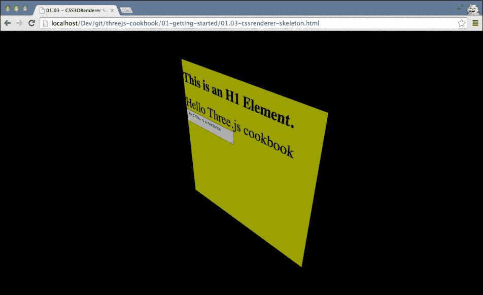

你在这里看到的是一个标准的 HTML div 元素，使用 `THREE.CSS3DRenderer` 对象以 3D 形式渲染。

## 如何做到这一点...

要设置一个基于 `THREE.CSS3DRenderer` 的场景，我们需要执行几个简单的步骤：

1.  在我们开始 `THREE.CSS3DRenderer` 特定信息之前，首先，你必须设置一个简单的 HTML 页面，就像我们在 *CSS 3D 渲染器入门* 菜谱中所做的那样。所以按照那个菜谱的前三个步骤进行，然后继续下一步。

1.  在初始设置之后，我们首先需要做的是在我们的 head 元素中添加正确的 JavaScript：

    ```js
        <script src="img/CSS3DRenderer.js"></script>
    ```

    接下来，我们将从定义所需的全局变量开始：

    ```js
        var content = '<div>' +
          '<h1>This is an H1 Element.</h1>' +
          '<span class="large">Hello Three.js cookbook</span>' +
          '<textarea> And this is a textarea</textarea>' +
        '</div>';

        // global variables, referenced from render loop
        var renderer;
        var scene;
        var camera;
    ```

1.  我们在这里定义的是我们想要渲染的元素的字符串表示。由于 `THREE.CSS3DRenderer` 对象与 HTML 元素一起工作，我们在这里不会使用任何标准的 Three.js 几何体，而只是纯 HTML。渲染器、场景和相机是相应的 Three.js 元素的简单变量，这样我们就可以轻松地从 `render()` 函数中访问它们，我们稍后会看到这个函数。

1.  与其他骨骼类似，我们将在 `init()` 函数中初始化场景。你需要添加到 `THREE.CSS3DRenderer` 对象中的函数如下所示：

    ```js
        function init() {

          scene = new THREE.Scene();
          camera = new THREE.PerspectiveCamera(45, window.innerWidth / window.innerHeight, 0.1, 1000);

     // create a CSS3DRenderer
     renderer = new THREE.CSS3DRenderer();
     renderer.setSize(window.innerWidth, window.innerHeight);
     document.body.appendChild(renderer.domElement);

          // position and point the camera to the center of the scene
          camera.position.x = 500;
          camera.position.y = 500;
          camera.position.z = 500;
          camera.lookAt(scene.position);

     var cssElement = createCSS3DObject(content);
     cssElement.position.set(100, 100, 100);
     scene.add(cssElement);

          render();
        }
    ```

1.  我们将关注这个代码片段中突出显示的部分。对于这个函数其他部分的解释，我们将参考 *使用 WebGL 渲染器入门* 菜谱。正如你在这个片段中看到的，这次我们将创建一个 `THREE.CSS3DRenderer` 对象。就像我们使用其他渲染器一样，我们还需要设置大小。由于我们想要填满屏幕，我们将使用 `window.innerWidth` 和 `window.innerHeight` 属性。其余的代码保持不变。

1.  现在，我们只需要添加一个元素来完成这个骨架。使用 CSS 3D 渲染器，我们只能添加 `THREE.CSS3DObject` 元素。对于这一步，只需添加以下函数：

    ```js
    function createCSS3DObject(content) 
        {
          // convert the string to dome elements
          var wrapper = document.createElement('div');
          wrapper.innerHTML = content;
          var div = wrapper.firstChild;

          // set some values on the div to style it.
          // normally you do this directly in HTML and 
          // CSS files.
          div.style.width = '370px';
          div.style.height = '370px';
          div.style.opacity = 0.7;
          div.style.background = new THREE.Color(Math.random() * 0xffffff).getStyle();

          // create a CSS3Dobject and return it.
          var object = new THREE.CSS3DObject(div);
          return object;
        }
    ```

    这个函数接受一个 HTML 字符串作为输入，将其转换为 HTML 元素，设置一些 CSS 样式，并使用它作为输入创建一个 `THREE.CSS3DObject` 对象，并将其添加到场景中。

如果你在这个浏览器中打开这个文件，你会看到类似于我们在本食谱 *准备阶段* 部分展示的示例。你可以使用这个 HTML 页面和 JavaScript 作为你整个 CSS 3D 渲染器项目的模板。

## 它是如何工作的...

使用 CSS 3D，你可以对 HTML 元素应用各种变换。例如，你可以使用 transform 属性在轴周围应用特定的旋转。有趣的是，你还可以应用矩阵变换。Three.js 使用矩阵变换在内部定位和旋转元素。通过 `THREE.CSS3DRenderer` 对象，Three.js 隐藏了内部 CSS 3D 特定的变换和样式，并提供了一个很好的抽象级别，你可以使用它来与 3D 中的 HTML 元素一起工作。

## 相关内容

+   如果你可以使用从 *使用 WebGL 渲染器入门* 菜单中获取的 WebGL 方法，你应该真的使用它。它提供了比基于 CSS 的方法更多的功能，但移动设备支持较少。另一方面，如果你想要操作屏幕上的 HTML 元素，`THREE.CSS3DRenderer` 对象是一个很好的解决方案。

# 检测 WebGL 支持

并非所有浏览器都支持 WebGL。当你创建一个使用 `THREE.WebGLRenderer` 对象的页面时，确保浏览器支持 WebGL 是一个好主意。如果一个浏览器不支持它，这将在 JavaScript 控制台中导致各种奇怪的 JavaScript 错误，并且最终用户将看到一个空白的屏幕。为了确保你的 WebGL 项目按预期工作，我们将在这个菜谱中解释如何在浏览器中检测 WebGL 支持。

## 准备阶段

在这个菜谱中，作为一个例子，我们将使用 `01.04-detect-webgl-support.html` 文件，你可以在这个书的源文件中找到它。如果你打开这个文件，如果你的浏览器不支持 WebGL，你会看到以下结果：

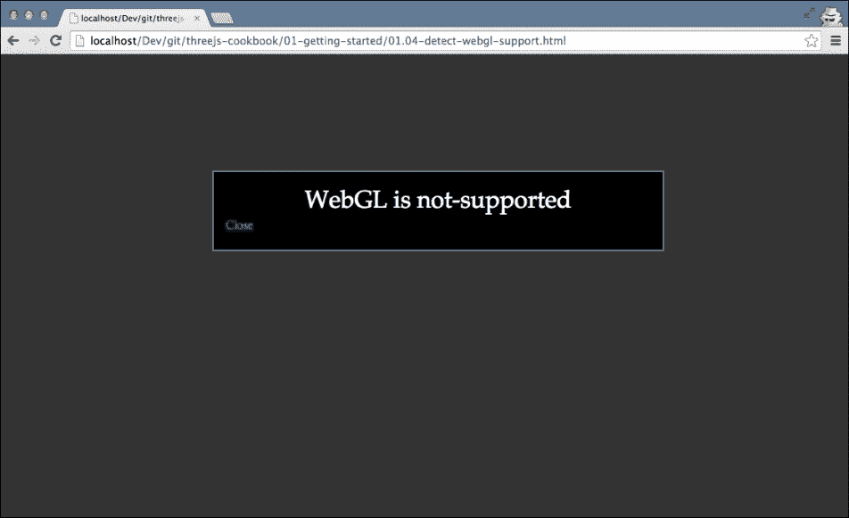

让我们来看看创建前面示例的菜谱。

## 如何做到这一点...

为了检测 WebGL 并创建消息 **WebGL is not-supported**，我们需要执行以下步骤：

1.  首先，我们将创建当 WebGL 不支持时的弹出窗口的 CSS。

1.  然后，我们需要检测浏览器是否支持 WebGL。为此，我们将编写一个返回 true 或 false 值的方法。

1.  最后，我们将使用上一步的结果来显示弹出窗口或继续执行。

    在下一节中，我们将详细查看这些步骤：

1.  您需要做的第一件事是设置我们将使用的 CSS：

    ```js
    <!DOCTYPE html>
    <html>
      <head>
        <style>
          .black_overlay {
            display: none;
            position: absolute;
            top: 0;
            left: 0%;
            width: 100%;
            height: 100%;
            background-color: black;
            z-index: 1001;
            opacity: .80;
          }

          .white-content {
            display: none;
            position: absolute;
            top: 25%;
            left: 25%;
            width: 50%;
            height: 70px;
            padding: 16px;
            border: 2px solid grey;
            background-color: black;
            z-index: 1002;
          }

          .big-message {
            width: 80%;
            height: auto;
            margin: 0 auto;
            padding: 5px;
            text-align: center;
            color: white;

            font-family: serif;
            font-size: 20px;
          }

        </style>
        <title></title>
      </head>
      <body>
    ```

    如您所见，这个 CSS 中没有特别之处。我们在这里要做的唯一一件事是创建一些我们将用于创建弹出消息和隐藏背景的类。接下来，我们将定义用于创建弹出窗口的 HTML。

1.  下面的代码片段展示了包含信息的 HTML 代码。使用我们之前定义的 CSS，我们可以显示或隐藏这个元素：

    ```js
        <!-- Lightbox to show when WebGL is supported or not-->
        <div id="lightbox" class="white-content">
        <div class="big-message" id="message">

        </div>
        <a href="javascript:void(0)" onclick="hideLightbox()">Close</a>
        </div>
        <div id="fade" class="black_overlay"></div>
    ```

    如您所见，我们只是创建了一些当前隐藏的 `div` 元素。当我们检测到 WebGL 不支持时，这两个 `div` 元素将通过改变它们的可见性来显示。

1.  接下来，让我们看看需要添加到检测 WebGL 的 JavaScript。我们将为它创建以下函数：

    ```js
        // loosely based on the http://get.webgl.org function detectWebGL() {

          // first create a canvas element
          var testCanvas = document.createElement("canvas");
          // and from that canvas get the webgl context
          var gl = null;

          // if exceptions are thrown, indicates webgl is null
          try {
            gl = testCanvas.getContext("webgl");
          } catch (x) {
            gl = null;
          }

          // if still null try experimental
          if (gl == null) {
            try {
            gl = testCanvas.getContext("experimental-webgl");
            } catch (x) {
            gl = null;
            }

        }
        // if webgl is all good return true;
        if (gl) {
          return true;
        } else {
          return false;
        }
    }
    ```

    如您所见，我们创建了一个 HTML `canvas` 元素，然后尝试使用 `getContext` 函数创建一个 WebGL 上下文。如果失败，`gl` 变量将被设置为 null，但如果成功，`gl` 变量将包含 WebGL 上下文。如果 `gl` 变量不为 null，它将返回 true。另一方面，如果它是 null，它将返回 false。

1.  现在我们能够检测浏览器是否支持 WebGL，我们将使用这个功能来显示一个弹出窗口。对于这个示例，当 WebGL 支持时，我们也会显示一个弹出窗口：

    ```js
        var hasGl = detectWebGL();
        if (hasGl) {
          showLightbox("WebGL is supported");
        } else {
        showLightbox("WebGL is not-supported");
        }

        function showLightbox(message) {
          var lightBox = document.getElementById('light');
          lightBox.style.display = 'block';

          var fadeBox = document.getElementById('fade');
          fadeBox.style.display = 'block'

          var msg = document.getElementById('message');
          msg.textContent = message;
        }

        function hideLightbox() {
          var lightBox = document.getElementById('light');
          lightBox.style.display = 'none';

          var fadeBox = document.getElementById('fade');
          fadeBox.style.display = 'none'
        }
    ```

这就是本示例的全部内容。如果我们把这个添加到网页中，支持 WebGL 的浏览器将显示一个包含 **WebGL is supported** 的弹出窗口，如果没有 WebGL 可用，将显示一个包含文本 **WebGL isn't supported** 的弹出窗口。除了这种方法，您还可以使用 Three.js 提供的检测器对象，在 [`github.com/mrdoob/three.js/blob/master/examples/js/Detector.js`](https://github.com/mrdoob/three.js/blob/master/examples/js/Detector.js)。如果您将此文件包含在您的 JavaScript 中，您可以通过检查 `Detector` 对象的 `webgl` 属性来检测 WebGL。

# 设置动画循环

在本章开头的菜谱中，我们向您展示了如何使用可用的渲染器之一设置基本的 Three.js 场景。如果您想为 Three.js 场景添加动画，例如移动相机或旋转对象，您需要多次调用`render`函数。在 JavaScript 的旧时代，您必须使用`setTimeout`或`setInterval`JavaScript 函数自行控制此操作。这些函数的问题在于它们没有考虑到浏览器中的情况。例如，您的页面可能被隐藏，或者 Three.js 场景可能被滚动出视图。对于动画来说，一个更好的解决方案，也是我们在本菜谱中使用的解决方案是`requestAnimationFrame`。使用此函数，浏览器将确定何时调用动画代码的最佳时机。

## 准备就绪

对于此菜谱，我们将使用`01.05-setup-animation-loop.html`示例 HTML 文件。要查看动画效果，只需在浏览器中打开此文件：

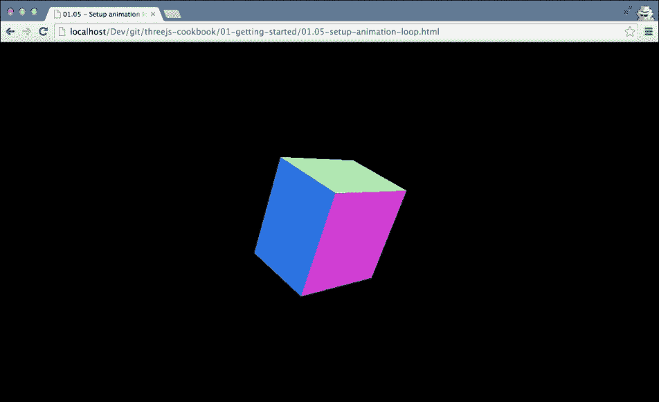

此示例使用 WebGL 渲染器。当然，你也可以将此相同的菜谱应用于本章中讨论的其他渲染器。

让我们看看设置此类动画循环所需的步骤。

## 如何操作...

要创建一个动画循环，你不需要在现有代码中做太多更改：

1.  让我们先看看如何使用`requestAnimationFrame`进行渲染。为此，我们创建了一个渲染函数：

    ```js
        function render() {
          renderer.render(scene, camera);
          scene.getObjectByName('cube').rotation.x += 0.05;
          requestAnimationFrame(render);
        }
    ```

    如你所见，我们将渲染函数作为参数传递以请求动画帧。这将导致`render`函数以固定间隔被调用。在`render`函数中，我们还将更新立方体的*x*轴旋转，以向你展示场景正在重新渲染。

1.  要使用本章开头提到的这个功能，我们只需替换这个调用：

    ```js
        function init() {
          ...
          // call the render function
          renderer.render(scene, camera);
        }
    With the following:
        function init() {
          ...
          // call the render function
          render();
        }
    ```

1.  现在，你将拥有自己的动画循环，因此对模型、相机或场景中的其他对象所做的任何更改现在都可以在`render()`函数内完成。

## 参见

+   我们提到，在这个菜谱中，我们使用了`THREE.WebGLRenderer`对象作为示例。当然，你也可以将此应用于*从 Canvas 渲染器入门*菜谱或*从 CSS 3D 渲染器入门*菜谱中的骨骼。

+   你可能还会对*确定场景帧率*菜谱感兴趣，我们将在此菜谱中为骨骼添加额外的功能，以便你可以轻松地看到`requestAnimationFrame`调用渲染函数的频率。

# 确定场景的帧率

当您创建包含许多对象和动画的大型 Three.js 应用程序时，关注浏览器可以渲染您的场景的帧率是很好的。您可以使用动画循环中的日志语句自己来做这件事，但幸运的是，已经有一个很好的解决方案可用，并且与 Three.js 集成得很好（这并不奇怪，因为它最初是为 Three.js 编写的）。

## 准备工作

对于这个菜谱，我们将使用可以从其 GitHub 仓库[`github.com/mrdoob/stats.js/`](https://github.com/mrdoob/stats.js/)下载的`stats.js` JavaScript 库。要使用这个库，您必须在 HTML 文件的顶部包含它，如下所示：

```js
    <script src="img/stats.min.js"></script>
```

我们还为此菜谱提供了一个现成的示例。如果您在浏览器中打开`01.06-determine-framerate.html`文件，您可以直接看到这个库如何显示当前的帧率，您可以在浏览器的左上角看到它，如下面的截图所示：

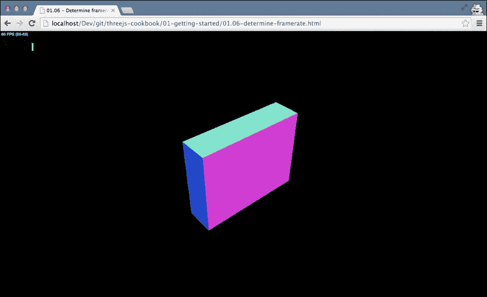

让我们看看您需要采取的步骤，将此功能添加到您的 Three.js 应用程序中。

## 如何做到这一点...

将此功能添加到您的场景中只需几个小步骤，具体如下：

1.  首先，我们必须创建`stats`对象并定位它。为此，我们创建了一个简单的函数：

    ```js
        function createStats() {
          var stats = new Stats();
          stats.setMode(0);

          stats.domElement.style.position = 'absolute';
          stats.domElement.style.left = '0';
          stats.domElement.style.top = '0';

          return stats;
        }
    ```

    我们通过调用`new Stats()`来创建统计对象。`Stats.js`库支持两种不同的模式，我们可以使用`setMode`函数来设置这些模式。如果我们传递`0`作为参数，您会看到最后一秒内渲染的帧数，如果我们设置模式为`1`，我们会看到渲染最后一帧所需的毫秒数。对于这个菜谱，我们想看到帧率，所以我们设置模式为`0`。

1.  现在我们已经创建了统计对象，我们需要添加在骨架菜谱中看到的`init`方法：

    ```js
        // global variables
        var renderer;
        var scene;
        var camera;
     var stats;

        function init() {
          ...
     stats = createStats();
     document.body.appendChild( stats.domElement );

          // call the render function
          render();
        }
    ```

    正如您所看到的，我们创建了一个名为`stats`的新全局变量，我们将使用它来访问我们的统计对象。在`init`方法中，我们使用我们刚刚创建的函数，并将`stats`对象添加到我们的 HTML 主体中。

1.  我们几乎完成了。我们现在唯一需要做的是确保在渲染函数被调用时更新`stats`对象。这样，`stats`对象就可以计算帧率或运行渲染函数所需的时间：

    ```js
        function render() {
          requestAnimationFrame(render);

          scene.getObjectByName('cube').rotation.x+=0.05;
          renderer.render(scene, camera);
     stats.update();
        }
    ```

## 它是如何工作的...

我们提到`Stats.js`提供了两种模式。它要么显示帧率，要么显示渲染最后一帧所需的时间。`Stats.js`库通过简单地跟踪调用之间的时间差及其`update`函数来工作。如果您正在监控帧率，它会计算在最后一秒内更新被调用的频率，并显示该值。如果您正在监控渲染时间，它只显示调用之间的时间和`update`函数。

# 控制场景中使用的变量

当您开发和编写 JavaScript 时，您通常需要调整一些变量以获得最佳的视觉效果。您可能需要更改球体的颜色，更改动画的速度，或者对更复杂的材质属性进行实验。您可以简单地更改源代码并重新加载 HTML，但这变得繁琐且耗时。在这个菜谱中，我们将向您展示一种快速且轻松地控制 Three.js 场景中变量的替代方法。

## 准备工作

对于这个菜谱，我们还需要一个名为`dat.gui`的外部 JavaScript 库。您可以从[`code.google.com/p/dat-gui/`](https://code.google.com/p/dat-gui/)下载最新版本，或者查看本书提供的源代码的`libs`目录。要使用这个库，您首先需要在 HTML 文件顶部包含它：

```js
    <script src="img/dat.gui.min.js"></script>
```

在本章的源文件夹中，还有一个现成的示例，我们将在以下几节中解释。当您打开`01.07-control-variables.html`文件时，您将看到以下内容：

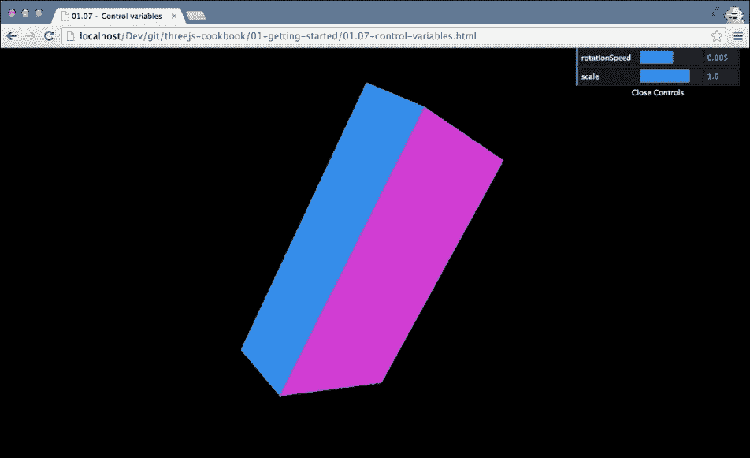

正如您在前一个屏幕截图中所见，右上角有一个菜单，您可以使用它来控制立方体的旋转速度和缩放。

## 如何操作...

要为自己使用这个库，您只需要做几件小事：

1.  您首先需要定义一个包含您想要控制的属性的 JavaScript 对象。在这种情况下，您需要将其添加到`init`函数中，并创建一个名为`control`的新全局 JavaScript 变量：

    ```js
        ...
        var control;
        function init() {
          ...

          control = new function() {
            this.rotationSpeed = 0.005;
            this.scale = 1;
          };
          addControls(control);

          // call the render function
          render();
        }
    ```

1.  上一段代码中的控制对象包含两个属性：`rotationSpeed`和`scale`。在`addControls`函数中，我们将创建前一个屏幕截图所示的 UI 组件：

    ```js
        function addControls(controlObject) {
          var gui = new dat.GUI();
          gui.add(controlObject, 'rotationSpeed', -0.1, 0.1);
          gui.add(controlObject, 'scale', 0.01, 2);
        }
    ```

    在这个`addControls`函数中，我们使用提供的包含`rotationSpeed`和`scale`属性的参数来创建控制 GUI。对于每个变量，我们指定四个参数：

    1.  **对象**：第一个参数是包含变量的 JavaScript 对象。在我们的例子中，它是传递给`addControls`函数的对象。

    1.  **名称**：第二个参数是我们想要添加的变量的名称。这应该指向第一个参数中提供的对象中可用的一个变量（或函数）。

    1.  **最小值**：第三个参数是 GUI 中应显示的最小值。

    1.  **最大值**：最后一个参数指定应显示的最大值。

1.  到目前为止，我们已经得到了一个可以用来控制变量的 GUI，正如您在以下屏幕截图中所见：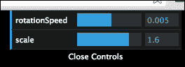

    我们现在唯一需要做的是确保我们在渲染循环中更新我们的对象，该循环基于 GUI 中的变量。我们可以在`render`函数中轻松地做到这一点，如下所示：

    ```js
        function render() {
          renderer.render(scene, camera);
          scene.getObjectByName('cube').rotation.x+= control.rotationSpeed;
          scene.getObjectByName('cube').scale.set (control.scale,
            control.scale,
            control.scale);
          requestAnimationFrame(render);
        }
    ```

## 还有更多...

在这个配方中，我们只是使用了`dat.gui`来更改数值。`dat.gui`库还允许你添加其他类型值的控件，如下所示：

+   如果你添加的变量是布尔值，将显示一个复选框

+   如果变量是字符串，你可以添加一个有效值的数组

+   如果变量是颜色，你可以使用添加颜色来创建颜色选择器

+   如果变量是函数，你会得到一个触发所选函数的按钮

此外，你还可以添加不同类型的事件监听器，当`dat.gui`管理的值发生变化时触发自定义回调。有关更多信息，请参阅[`workshop.chromeexperiments.com/examples/gui/#1--Basic-Usage`](http://workshop.chromeexperiments.com/examples/gui/#1--Basic-Usage)上的`dat.gui`库文档。

# 使用 Python 设置本地 Web 服务器

测试你的 Three.js 应用程序，或者任何 JavaScript 应用程序，最好的方法是在本地 Web 服务器上运行它。这样，你可以最好地展示你的用户最终将如何看到你的 Three.js 可视化。在本章中，我们将向您展示三种不同的方法，您可以在本地运行 Web 服务器。设置本地 Web 服务器的三种不同方法是：

+   一种方法是使用基于 Python 的方法，如果你已经安装了 Python，你可以使用

+   另一种方法是如果你使用 Node.js 或者已经尝试过 Node.js，你可以使用`npm`命令安装一个简单的 Web 服务器

+   第三种选择是，如果你不想使用`npm`命令或 Python，你也可以使用**Mongoose**，这是一个简单的便携式 Web 服务器，可在 OS X 和 Windows 上运行

本配方将重点关注基于 Python 的方法（第一个项目符号）。

## 准备工作

如果你已经安装了 Python，你可以非常容易地运行一个简单的 Web 服务器。首先，你需要检查你是否已经安装了 Python。最简单的方法是在控制台中输入`python`并按*回车*。如果你看到以下输出，你就可以开始了：

```js
> python
Python 2.7.3 (default, Apr 10 2013, 05:09:49) 
[GCC 4.7.2] on linux2
Type "help", "copyright", "credits" or "license" for more information.
>>>
```

## 如何操作...

1.  一旦安装了 Python ([`python.org`](http://python.org))，你只需执行以下 Python 命令即可运行一个简单的 Web 服务器。你需要在这个目录中执行此操作，即你想要托管文件的目录：

    ```js
    > python -m SimpleHTTPServer

    ```

1.  以下输出显示了在端口 8000 上运行的 Web 服务器：

    ```js
    Serving HTTP on 0.0.0.0 port 8000...

    ```

如果你没有安装 Python，请查看以下两个配方中的替代选项。

# 使用 Node.js 设置本地 Web 服务器

如果你想要测试你的 Three.js 应用程序，那么根据*如何使用 Python 设置本地 Web 服务器*配方中的描述，你可以以三种不同的方式运行它。本配方将重点关注 Node.js 方法。

## 准备工作

要使用 Node.js 运行本地网络服务器（[`nodejs.org`](https://nodejs.org)），我们首先必须检查我们是否已经安装了 `npm`（节点包管理器，与 Node.js 一起安装）。你可以通过在命令行中运行 `npm` 命令来检查：

```js
> npm

```

如果输出类似于以下代码片段，则表示你已经安装了 `npm`，并且可以开始食谱：

```js
Usage: npm <command>
where ...

```

## 如何操作...

1.  你可以使用它来运行一个简单的网络服务器：

    ```js
    Usage: npm <command>...

    ```

1.  现在，你准备好通过运行以下命令来安装网络服务器：

    ```js
    > npm install -g http-server

    ```

1.  最后，你可以通过在命令行中运行 `http-server` 来启动网络服务器：

    ```js
    > http-server
    Starting up http-server, serving ./ on port: 8080
    Hit CTRL-C to stop the server

    ```

在下一节中提供了一个运行你自己的网络服务器的最终食谱。在该食谱中，你不需要安装 Python 或 Node.js，但我们将向你展示如何下载一个可携带的网络服务器，你可以在不进行任何安装的情况下运行它。

# 使用 Mongoose 设置本地网络服务器

如果你想要测试你的 Three.js 应用程序，那么如 *如何使用 Python 设置本地网络服务器* 食谱中所述，你可以以三种不同的方式运行它。如果前两种方法失败，你始终可以使用一个简单的 Mongoose 可携带网络服务器。这个食谱将专注于 Mongoose 方法。

## 准备工作

在运行 Mongoose 之前，你首先必须下载它。你可以从 [`code.google.com/p/mongoose/downloads/list`](https://code.google.com/p/mongoose/downloads/list) 下载 Mongoose。

## 如何操作...

1.  你所使用的平台将影响你运行 Mongoose 的方式。如果你正在使用 Windows，你可以直接将下载的文件（一个可执行文件）复制到你想要托管文件的文件夹中（例如，你提取本书源代码的目录），然后双击可执行文件以在 8080 端口启动网络服务器。

1.  对于 Linux 或 OS X 平台，你还需要在包含你的文件的目录中有一个下载文件的副本，但你必须从命令行启动 Mongoose。

## 参见

+   如果你无法安装本地网络服务器，你可以查看 *解决 Chrome 中的跨域错误信息* 食谱。这个食谱为你提供了一个运行更高级 Three.js 示例的替代方法。

# 解决 Chrome 中的跨域错误信息

当你开发 Three.js 应用程序时，测试你的应用程序最简单的方法就是直接在浏览器中打开文件。对于许多场景，这将会工作，直到你开始加载纹理和模型。如果你尝试这样做，你会看到一个类似以下的错误：

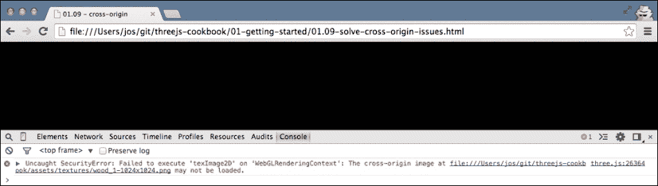

您可以通过将 `01.09-solve-cross-origin-issues.html` 拖动到浏览器中来轻松地重现此错误，错误信息中会有 **跨域** 或 **SecurityError** 等术语。这个错误意味着浏览器阻止当前页面从不同域加载资源。这是避免恶意网站访问个人信息的一个必要功能。然而，在开发过程中，这可能会有些不便。在本配方中，我们将向您展示如何通过调整浏览器的安全设置来绕过这类错误。

我们将探讨如何禁用对支持 WebGL 最好的两个浏览器的安全检查：Chrome 和 Firefox。在本配方中，我们将介绍如何在 Chrome 中实现这一点，而在下一个配方中，我们将向您展示如何在 Firefox 中实现这一点。然而，在继续配方之前，有一个重要的注意事项。如果您能的话，请运行一个本地 web 服务器。它要安全得多，并且不会导致您的浏览器设置安全级别过低。

## 如何操作...

1.  在 Chrome 安装完成后，我们还需要在 Chrome 中禁用安全设置，这需要传递一个命令行参数。然而，每个操作系统执行此操作的方式略有不同：

    +   对于 Windows，您需要在命令行中调用以下内容：

        ```js
        chrome.exe --disable-web-security
        ```

    +   在 Linux 上，请执行以下操作：

        ```js
        google-chrome --disable-web-security
        ```

    +   在 Mac OS 上，您可以通过以下方式禁用设置：启动 Chrome。

        ```js
        open -a Google\ Chrome --args --disable-web-security

        ```

1.  以这种方式启动 Chrome 后，即使是直接从文件系统运行它，也能正确加载资源，给您以下结果：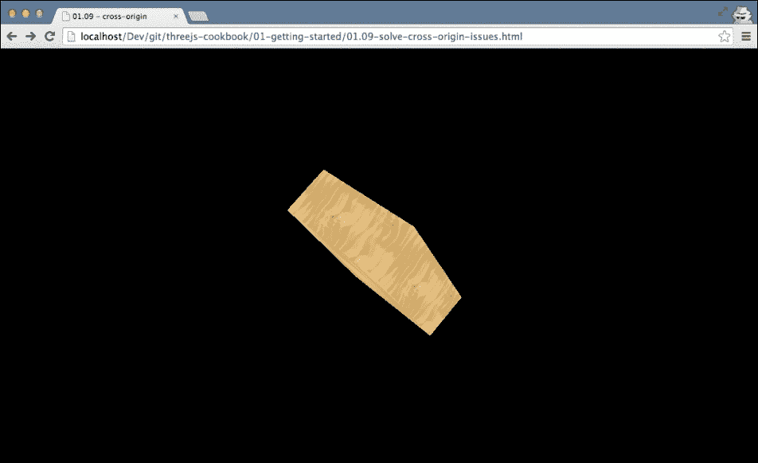

1.  请记住，在您完成使用 Three.js 进行实验或开发后，正常重启浏览器，因为您已经降低了浏览器的安全设置。

1.  对于 Firefox 用户，我们将在下面的配方中解释如何解决此浏览器的跨域问题。

# 解决 Firefox 中的跨域域错误信息

在上一个配方中，我们解释了当您从文件系统运行 Three.js 应用程序时，可能会发生跨域错误信息。在本配方中，我们向您展示了如何在 Chrome 中解决这类问题。在本配方中，我们将探讨如何在另一款流行的浏览器：Firefox 中解决这些问题。

## 如何操作...

1.  对于 Firefox，我们接下来需要直接从浏览器中禁用安全设置。如果您在地址栏中输入 `about:config`，您将看到以下内容：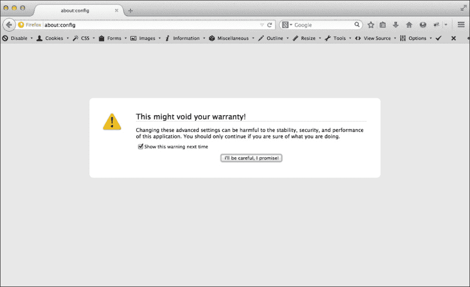

1.  在此屏幕上，只需单击 **我会小心，我保证** 按钮。这将带您到一个概述页面，显示 Firefox 中所有可用的内部属性。

1.  接着，在此屏幕上的搜索框中输入 `security.fileuri.strict_origin_policy` 并更改其值，如图所示：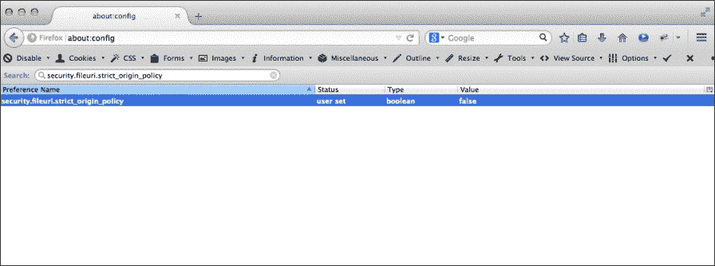

1.  现在，当您直接在浏览器中打开文件时，即使是通过异步加载器加载的资源也将正常工作。

1.  请记住，在完成实验或使用 Three.js 进行开发后，将这些设置改回原来的状态，因为你已经降低了浏览器的安全设置。

## 它是如何工作的...

我们必须设置这些属性的原因是，默认情况下，现代浏览器会检查你是否被允许从运行域之外请求资源。当你使用 Three.js 加载模型或纹理时，它使用 `XMLHTTPRequest` 对象来访问该资源。浏览器将检查正确头部的可用性，由于你从本地系统请求资源，而本地系统不提供正确的头部，因此会发生错误。即使在这个食谱中，你可以绕过这个限制，但最好始终使用本地 Web 服务器进行测试，因为这最接近你的用户在线访问的方式。

更多关于 CORS 的信息，请参阅 [`www.w3.org/TR/cors/`](http://www.w3.org/TR/cors/)。

## 参见

+   正如我们在上一节中提到的，处理这类错误的一个更好的方法是设置一个本地 Web 服务器。"使用 Python 设置本地 Web 服务器"食谱解释了如何完成这项工作。

# 添加键盘控制

如果你想要创建游戏或更高级的 3D 场景，你通常需要一个方法来使用键盘控制来控制场景中的元素。例如，你可能制作一个平台游戏，用户可以使用键盘上的箭头在游戏中移动。Three.js 本身并不提供处理键盘事件的具体功能，因为它非常容易将标准的 HTML JavaScript 事件处理连接到 Three.js。

## 准备工作

对于这个食谱，我们包含了一个示例，你可以使用键盘上的箭头旋转一个立方体，使其围绕其 *x* 和 *z* 轴旋转。如果你首先在浏览器中打开示例 `01.10-keyboard-controls.html`，你会看到一个简单的立方体：

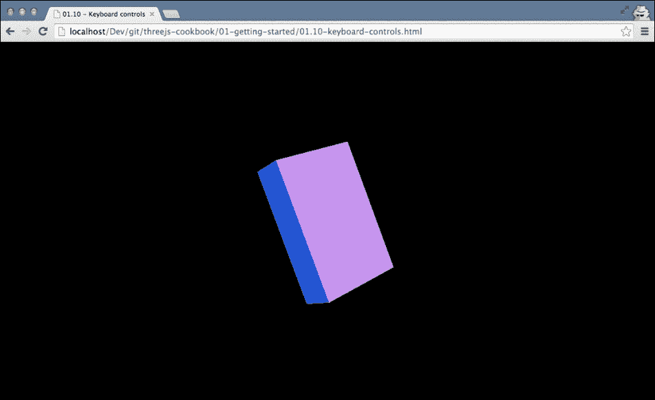

使用键盘上的上、下、左和右箭头，你可以旋转这个立方体。打开这个文件后，你现在就可以开始操作了。

## 如何操作...

在你的浏览器中添加键盘支持非常简单；你所要做的就是将事件处理器分配给 `document.onkeydown`。

1.  要做到这一点，我们需要将一个函数分配给 `document.onkeydown` 对象。这个函数将在按下任何键时被调用。以下代码，在 `setupKeyControls` 函数中封装，注册了这个监听器：

    ```js
        function setupKeyControls() {
          var cube = scene.getObjectByName('cube');
          document.onkeydown = function(e) {
            switch (e.keyCode) {
              case 37:
              cube.rotation.x += 0.1;
              break;
              case 38:
              cube.rotation.z -= 0.1;
              break;
              case 39:
              cube.rotation.x -= 0.1;
              break;
              case 40:
              cube.rotation.z += 0.1;
              break;
            }
          };
        }
    ```

1.  在这个函数中，我们使用传递的事件 `e` 中的 `keyCode` 属性来确定要做什么。在这个例子中，如果用户按下对应于键码 `37` 的左箭头键，我们就会改变场景中 Three.js 对象的 `rotation.x` 属性。我们将同样的原则应用于上箭头键（`38`）、右箭头（`39`）和下箭头（`40`）。

## 它是如何工作的...

使用事件处理器是标准的 HTML JavaScript 机制，它们是 DOM API 的一部分。此 API 允许您为所有不同的事件注册函数。每当发生特定事件时，提供的函数就会被调用。在这个菜谱中，我们选择使用`KeyDown`事件。当用户按下键时，此事件被触发。还有一个`KeyUp`事件可供使用，它在用户释放键时触发，使用哪个取决于您的用例。请注意，还有一个`KeyPress`事件可供使用。然而，此事件旨在与字符一起使用，并且不会注册任何非字符键的按下。

## 还有更多...

在这个菜谱中，我们只展示了箭头的键码值。当然，每个键盘上的键都有一个单独的键码。关于各种键如何映射的详细解释（特别是特殊键，如功能键），可以在[`unixpapa.com/js/key.html`](http://unixpapa.com/js/key.html)找到。如果您想了解特定键的键值，而且不想在列表中查找值，您也可以使用以下简单的处理器将键码输出到 JavaScript 控制台：

```js
    function setupKeyLogger() {
      document.onkeydown = function(e) {
        console.log(e);
      }
    }
```

这个小处理器记录了完整的事件。然后，在控制台的输出中，您可以查看所使用的键码，如下面的截图所示：

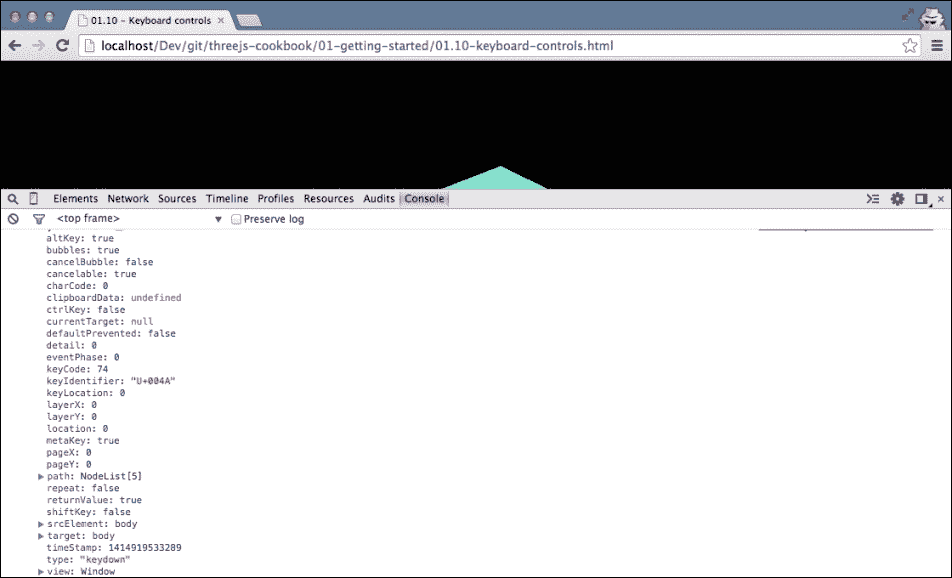

如您所见，您还可以看到很多其他有趣的信息。例如，您可以看到在事件发生的同时是否也按下了*Shift*或*Alt*键。

## 参见

+   如果您想了解更多关于键事件的信息，Mozilla 提供了一个关于所有可用事件的良好概述，请参阅[`developer.mozilla.org/en-US/docs/Web/Events`](https://developer.mozilla.org/en-US/docs/Web/Events)。

# 异步加载纹理

当您创建 Three.js 场景时，您通常需要加载资源。您可能需要为您的对象加载纹理，您可能有一些外部模型想要包含在您的场景中，或者可能有一些 CSV 数据，您想要将其用作可视化的输入。Three.js 提供了一系列不同的异步加载这些资源的方法，我们将在本菜谱和接下来的菜谱中探讨。

要运行这些菜谱并进行实验，我们在本章的源文件夹中包含了一个简单的示例，展示了这种加载的实际操作。如果您在浏览器中打开示例`01.11-load-async-resources.html`，并打开 JavaScript 控制台，您将看到加载资源的进度和结果。

请注意，由于我们直接从浏览器中加载文件，您需要安装本地 Web 服务器（请参阅 *使用 Python 设置本地 Web 服务器* 食谱或 *使用 Node.js 设置本地 Web 服务器* 食谱），或者禁用 *解决 Chrome 中的跨源域错误消息* 食谱或 *解决 Firefox 中的跨源域错误消息* 食谱中解释的一些安全检查。

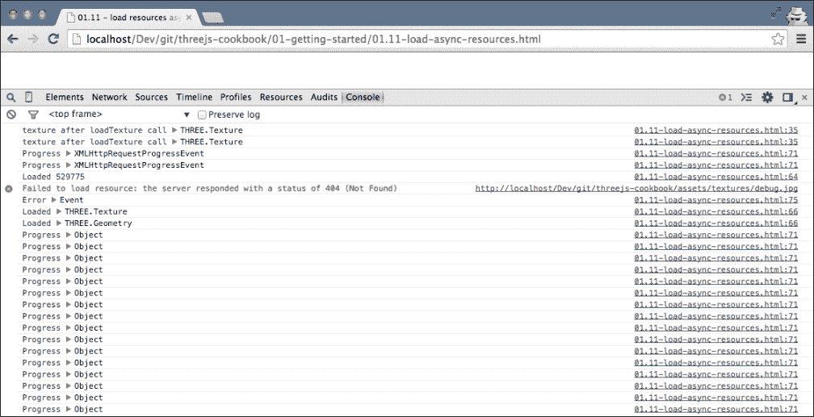

在这五个食谱中的第一个，我们将向您展示如何使用 Three.js 异步加载纹理。

## 准备中

在查看本食谱中的步骤之前，您需要创建一些标准回调，这些回调可以被所有不同的加载器使用。这些回调用于通知您资源何时加载完成、加载失败，以及如果有的话，当前请求的进度。

因此，对于加载资源，我们需要定义三个不同的回调：

+   `onload` 回调：每当资源加载完成时，此回调将带加载的资源作为参数被调用。

+   `onprogress` 回调：一些加载器在加载资源时会提供进度信息。在特定的时间间隔内，此回调将被调用以通知您已加载了多少资源。

+   `onerror` 回调：如果在加载资源的过程中出现问题，此回调将用来通知您发生的错误。

对于所有处理异步加载的食谱，我们将使用相同的加载器集。这些加载器只是向控制台输出一些信息，但当然，您可以根据特定的用例自定义这些回调。

首先，我们定义 `onLoadCallback` 函数，它在资源加载时被调用：

```js
    function onLoadCallback(loaded) {
      // just output the length for arrays and binary blobs
      if (loaded.length) {
        console.log("Loaded", loaded.length);
      } else {
        console.log("Loaded", loaded);
      }
    }
```

如从函数定义中可以看出，我们只是将传递的参数输出到控制台。其他两个回调，`onProgressCallback` 和 `onErrorCallback`，与它们所展示的方式完全相同：

```js
    function onProgressCallback(progress) {
      console.log("Progress", progress);
    }

    function onErrorCallback(error) {
      console.log("Error", error)
    }
```

### 注意

在以下章节和食谱中，当我们使用 Three.js 提供的功能来加载资源时，我们将引用这些回调。

## 如何操作...

1.  要异步加载纹理，我们使用 `THREE.ImageUtils` 中的 `loadTexture` 函数：

    ```js
        function loadTexture(texture) {
          var texture = THREE.ImageUtils.loadTexture(textureURL, null, onLoadCallback, onErrorCallback);
          console.log("texture after loadTexture call", texture);
        }
    ```

1.  `THREE.ImageUtils` 中的 `loadTexture` 函数接受以下四个参数：

    +   第一个参数指向您想要加载的图像位置

    +   第二个参数可以用来提供自定义的 UV 映射（UV 映射用于确定将纹理的哪个部分应用到特定的面上）

    +   第三个参数是纹理加载完成后要使用的回调

    +   最后一个参数是在发生错误时要使用的回调

    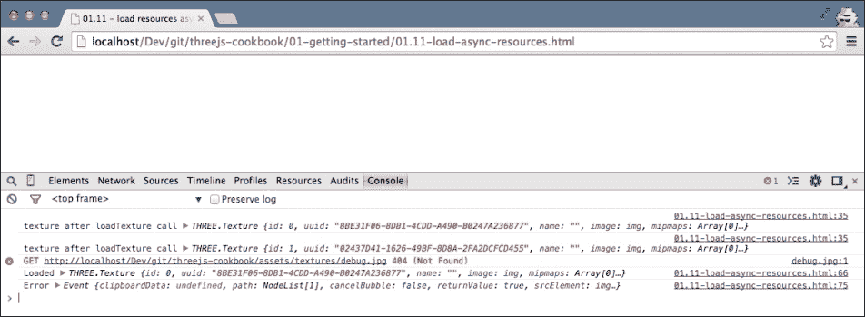

1.  注意，第一个控制台输出还显示了一个有效的纹理对象。Three.js 会这样做，因此您可以立即将此对象作为纹理分配给材质。然而，纹理内部的实际图像只有在 `onLoadCallback` 函数被调用后才会加载。

## 它是如何工作的...

Three.js 提供了一个很好的包装器来加载纹理。内部，Three.js 使用从 `XMLHTTPRequest` 网页加载资源的标准方式。使用 `XMLHTTPRequest` 网页，你可以为特定资源发出 HTTP 请求并处理结果。如果你不想使用 Three.js 提供的功能，你也可以自己实现一个 `XMLHTTPRequest` 函数。

## 参见

+   要运行这些示例并异步加载资源，我们需要运行一个本地 Web 服务器，如 *使用 Python 设置本地 Web 服务器* 食谱或 *使用 Node.js 设置 Web 服务器* 食谱中所述，或者禁用一些安全设置，如 *解决 Chrome 中的跨源域错误消息* 食谱或 *解决 Firefox 中的跨源域错误消息* 食谱中所述。

+   或者，如果你不想异步加载资源，而是等待所有资源加载完毕后再初始化场景，你可以查看下一个 *等待资源加载完成* 食谱。

# 异步加载模型

在 *加载纹理异步* 食谱中，我们解释了 Three.js 提供了辅助函数来异步加载不同类型的资源。在这个食谱中，我们将探讨如何使用 `THREE.JSONLoader` 对象异步加载模型。

## 准备工作

在你开始这个食谱之前，请确保你已经走过了在 *加载纹理异步* 食谱的 *准备就绪* 部分中解释的步骤。在下一节中，我们将参考该食谱 *准备就绪* 部分中定义的 JavaScript 回调。

## 如何操作...

1.  Three.js 还允许你轻松地加载外部模型。以下函数展示了如何为 Three.js 使用的 JSON 模型执行此操作。然而，同样的方法也适用于任何其他模型加载器：

    ```js
        function loadModel(modelUrl) {
          var jsonLoader = new THREE.JSONLoader();
          jsonLoader.load(modelUrl, onLoadCallback, null);
        }
    ```

1.  `jsonLoader.load` 函数接受以下三个参数：

    +   第一个是你要加载的模型的位置

    +   第二个是当模型成功加载时调用的回调函数

    +   最后一个参数是我们可以指定从哪里加载纹理图像的路径

1.  当我们调用此函数时，你将在控制台看到以下输出：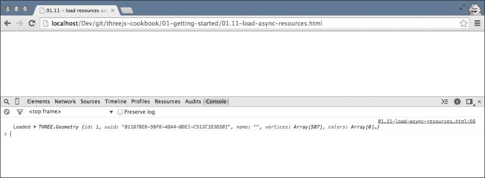

## 还有更多...

采用这种方法，`JSONLoader` 对象不会提供任何关于它加载了多少的反馈。如果你想要加载大型模型，了解进度情况会很好。`JSONLoader` 对象还提供了一种加载模型的方法，该方法也提供了进度信息。在 *异步加载模型并显示进度* 菜谱中，我们展示了如何加载模型并提供进度反馈。除了加载 Three.js 自有的专有模型外，Three.js 还附带了许多可以用于其他模型格式的加载器。有关 Three.js 提供的内容概述，请参阅 [`github.com/mrdoob/three.js/tree/master/examples/js/loaders`](https://github.com/mrdoob/three.js/tree/master/examples/js/loaders)。

# 异步加载模型并显示进度

在前面的 *异步加载模型* 菜谱中，我们加载了一个模型，但没有提供进度反馈。在这个菜谱中，我们将解释如何向该场景添加进度反馈。

## 开始

在开始这个菜谱之前，请确保你已经按照 *准备就绪* 部分中 *异步加载纹理* 菜谱中解释的步骤进行了操作。在接下来的部分中，我们将参考该菜谱 *准备就绪* 部分中定义的 JavaScript 回调函数。

## 如何操作...

1.  为了加载模型并显示进度，我们必须使用除 `THREE.JSONLoader` 之外的其他方法。如果我们使用 `loadAjaxJSON` 函数，我们也可以指定一个进度回调而不是仅仅加载回调：

    ```js
        function loadModelWithProgress(model) {
          var jsonLoader = new THREE.JSONLoader();
          jsonLoader.loadAjaxJSON(jsonLoader, model, onLoadCallback, null, onProgressCallback);
        }
    ```

1.  如果我们现在加载与之前相同的模型，我们会看到以下加载进度：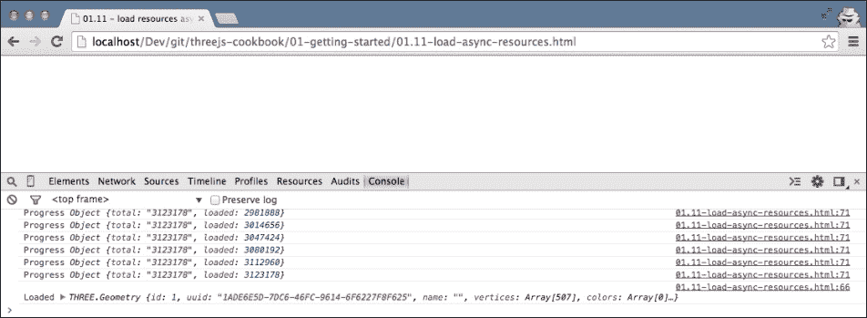

# 异步加载其他资源并显示进度

除了加载特定资源外，Three.js 还提供了一个简单的辅助对象来异步加载任何类型的资源。在这个菜谱中，我们将解释如何使用 `THREE.XHRLoader` 对象异步加载任何类型的资源。

## 准备就绪

在开始这个菜谱之前，请确保你已经按照 *准备就绪* 部分中 *异步加载纹理* 菜谱中解释的步骤进行了操作。在接下来的部分中，我们将参考该菜谱 *准备就绪* 部分中定义的 JavaScript 回调函数。

## 如何操作...

1.  在这个菜谱中，我们想要展示的最后一个资源加载器是 `THREE.XHRLoader` 对象。这个加载器允许你在 Three.js 场景中加载任何你可能需要的资源：

    ```js
        function loadOthers(res) {
          var xhrLoader = new THREE.XHRLoader();
          xhrLoader.load(res, onLoadCallback, onProgressCallback, onErrorCallback);
        }
    ```

1.  `XHRLoader.load` 函数的参数现在应该看起来很熟悉，因为它几乎与其他加载器相同。首先，我们传递我们想要加载的资源的位置，然后我们指定各种回调函数。这个函数的输出如下：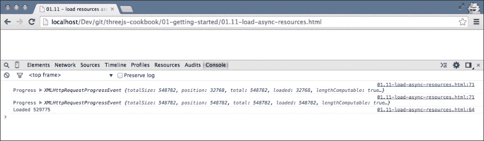

    在前面的屏幕截图中，你还可以看到资源正在加载时的进度。

# 等待资源加载

在 *异步加载资源* 的菜谱中，我们展示了如何异步加载外部 Three.js 资源。对于许多网站和可视化，异步加载资源是一种很好的方法。有时，您可能想要确保场景中所需的所有资源都已在之前加载。例如，当您创建游戏时，您可能希望在创建特定关卡之前加载所有数据。同步加载资源的一种常见方法是将之前菜谱中看到的异步回调嵌套。然而，这很快就会变得难以阅读，并且很难管理。在这个菜谱中，我们将使用不同的方法，并使用一个名为 Q 的 JavaScript 库。

## 准备就绪

对于我们使用的所有外部库，我们需要在我们的 HTML 中包含 Q 库。您可以从其 GitHub 仓库 [`github.com/kriskowal/q`](https://github.com/kriskowal/q) 下载此库的最新版本，或者使用本书源代码中的 `libs` 文件夹中提供的版本。要将此库包含到您的 HTML 页面中，请在您的 HTML 页面的 `head` 元素中添加以下内容：

```js
    <script src="img/q.js"></script>
```

在本章的源代码中，您还可以找到一个示例，展示了如何同步加载资源。在您的浏览器中打开 `01.12-wait-for-resources.html` 并打开 JavaScript 控制台：

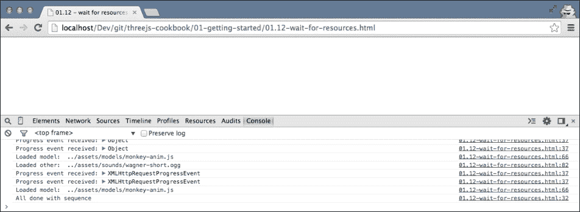

在控制台输出中，您将看到所需资源和模型一个接一个地加载。

## 如何操作...

1.  让我们先看看在这个菜谱中我们想要达到的目标。我们希望使用 Q 库同步加载资源，如下所示：

    ```js
        loadModel(model)
          .then(function(result) {return loadTexture(texture)})
          .then(function(result) {return loadModel(m)})
          .then(function(result) {return loadTexture(texture)})
          .then(function(result) {return loadOthers(resource)})
          .then(function(result) {return loadModelWithProgress(m)})
          .then(function(result) {return loadModel(model)})
          .then(function(result) {return loadOthers(resource)})
          .then(function(result) {return loadModel(model)})
          .then(function() {console.log("All done with sequence")})
          .catch(function(error) {
            console.log("Error occurred in sequence:",error);
          })
          .progress(function(e){
            console.log("Progress event received:", e);
           });
    ```

1.  这段代码的含义是：

    1.  首先，我们需要调用 `loadModel(model)`。

    1.  模型加载完成后，我们使用 `then` 函数和 `loadTexture(texture)` 函数加载一个纹理。一旦这个纹理加载完成，我们将加载下一个资源，依此类推。在这段代码片段中，您还可以看到我们调用了 `catch` 和 `progress` 函数。如果在加载过程中发生错误，提供给 `catch()` 的函数将被调用。对于 `progress()` 也是如此。如果其中一个方法想要提供有关其进度的信息，传递给 `progress()` 的函数将被调用。

    1.  然而，您会发现这不会与之前菜谱中的函数一起工作。为了使其正常工作，我们必须将这些函数的回调替换为 Q 构造函数中的一个特殊函数，称为延迟函数：

        ```js
            function loadTexture(texture) {

              var deferred = Q.defer();
              var text = THREE.ImageUtils.loadTexture
              (texture, null, function(loaded) {
                console.log("Loaded texture: ", texture);
                deferred.resolve(loaded);
              }, function(error) {
                deferred.reject(error);
              });

              return deferred.promise;
            }
        ```

    1.  在这个代码片段中，我们创建了一个名为`deferred`的新 JavaScript 对象。`deferred`对象将确保回调的结果，这次定义为匿名函数，以这种方式返回，这样我们就可以使用我们在本章开头看到的`then`函数。如果资源加载成功，我们使用`deferred.resolve`函数来存储结果；如果资源加载失败，我们使用`deferred.reject`函数来存储错误。

    1.  我们对`loadModel`、`loadOthers`和`loadModelWithProgress`函数也采用了相同的方法：

        ```js
            function loadModel(model) {

              var deferred = Q.defer();
              var jsonLoader = new THREE.JSONLoader();
              jsonLoader.load(model, function(loaded) {
                console.log("Loaded model: ", model);
                deferred.resolve(loaded);
              }, null);

              return deferred.promise;
            }

            function loadOthers(res) {
              var deferred = Q.defer();

              var xhrLoader = new THREE.XHRLoader();
              xhrLoader.load(res, function(loaded) {
                console.log("Loaded other: ", res);
                deferred.resolve(loaded);
              }, function(progress) {
                deferred.notify(progress);
              }, function(error) {
                deferred.reject(error);
              });

              return deferred.promise;
            }
        ```

    1.  在`loadOthers`函数中，我们也提供了进度信息。为了确保进度回调被正确处理，我们使用`deferred.notify()`函数并传入`progress`对象：

        ```js
            function loadModelWithProgress(model) {
              var deferred = Q.defer();

              var jsonLoader = new THREE.JSONLoader();
              jsonLoader.loadAjaxJSON(jsonLoader, model,
              function(model) {
                console.log("Loaded model with progress: ", model);
                deferred.resolve(model)
              }, null,
              function(progress) {
                deferred.notify(progress)
              });

              return deferred.promise;
            }
        ```

    1.  通过这些更改，我们现在可以同步地加载资源。

## 它是如何工作的...

要理解这是如何工作的，你必须了解 Q 的作用。Q 是一个承诺库。使用承诺，你可以用简单的步骤替换嵌套的回调（也称为[`calculist.org/blog/2011/12/14/why-coroutines-wont-work-on-the-web/`](http://calculist.org/blog/2011/12/14/why-coroutines-wont-work-on-the-web/)中的“末日金字塔”）。以下 Q 网站的示例很好地展示了这是如何实现的：

```js
step1(function (value1) {
  step2(value1, function(value2) {
    step3(value2, function(value3) {
      step4(value3, function(value4) {
        // Do something with value4
      });
    });
  });
});
```

使用承诺，我们可以将其简化为以下内容（就像我们在菜谱中做的那样）：

```js
Q.fcall(promisedStep1)
then(promisedStep2)
then(promisedStep3)
then(promisedStep4)
then(function (value4) {
  // Do something with value4
})
catch(function (error) {
  // Handle any error from all above steps
})
done();
```

如果我们要重写 Three.js 库，我们可以在 Three.js 内部使用承诺，但由于 Three.js 已经使用了回调，我们不得不使用 Q 提供的`Q.defer()`函数将这些回调转换为承诺。

## 还有更多...

我们只接触了 Q 承诺库可能实现的一小部分。我们用它来同步加载，但 Q 还有许多其他有用的功能。一个非常好的起点是可在[`github.com/kriskowal/q/wiki`](https://github.com/kriskowal/q/wiki)找到的 Q 维基百科。

## 参见

+   就像每个加载资源的菜谱一样，你必须确保你使用本地 Web 服务器运行它，参见*使用 Python 设置本地 Web 服务器*菜谱或*使用 Node.js 设置 Web 服务器*菜谱，或者禁用一些安全设置（参见*解决 Chrome 中的跨源域错误消息*菜谱或*解决 Firefox 中的跨源域错误消息*菜谱）。如果你想异步加载资源，你可以查看*异步加载任何资源*菜谱。

# 将文件从桌面拖动到场景中

当你创建可视化时，允许你的用户提供他们自己的资源是一个很好的特性。例如，你可能想让用户指定他们自己的纹理或模型。你可以通过传统的上传表单来实现这一点，但使用 HTML5，你也有选项让用户直接从桌面拖放资源。在这个菜谱中，我们将解释如何向用户提供这种拖放功能。

## 准备中

准备这个食谱的最简单方法是先查看我们为您创建的示例。在您的浏览器中打开示例`01.14-drag-file-to-scene.html`。

### 注意

请注意，这仅在运行自己的 Web 服务器或禁用安全异常时才有效。

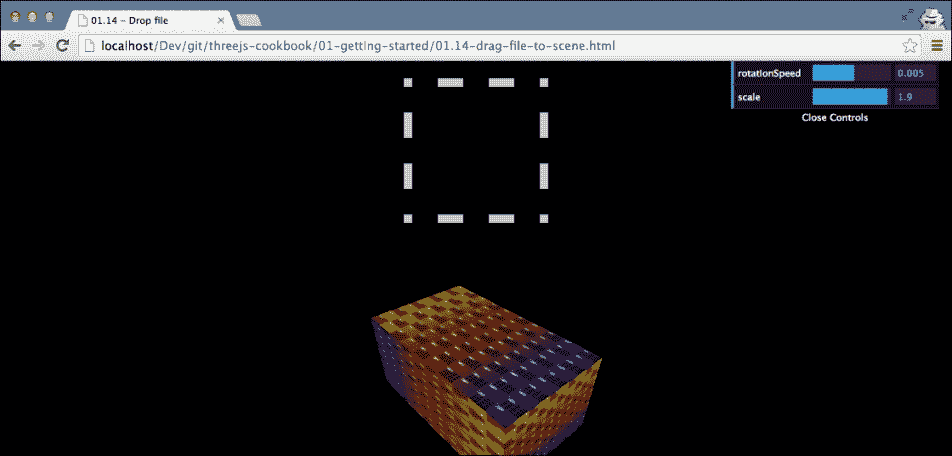

当您将图像文件拖放到掉落区域（虚线方块）时，您会立即看到旋转盒子的纹理发生了变化，并且您提供的图像被使用。

在接下来的部分中，我们将解释如何创建此功能。

## 如何操作...

要完成此操作，请执行以下步骤：

1.  首先，我们必须设置正确的 CSS 并定义掉落区域。要创建虚线掉落区域，我们将以下 CSS 添加到页面`head`元素中的`style`元素：

    ```js
        #holder { border: 10px dashed #ccc; 
        width: 150px; height: 150px; 
        margin: 20px auto;}
        #holder.hover { border: 10px dashed #333; #333}
    ```

    正如您在这段 CSS 中看到的，我们使用 ID 为`holder`的 HTML 元素来设置虚线边框。下面展示了`holder div`元素的 HTML 代码：

    ```js
      <body>
        <div id="holder"></div>
      </body>
    ```

    已经定义了掉落区域，所以下一步是向其添加拖放功能。

1.  然后，我们必须分配正确的事件处理器，以便我们可以响应各种拖放相关事件。

1.  就像我们之前的食谱一样，我们定义了一个包含所有必要逻辑的函数：

    ```js
        function setupDragDrop() {
          var holder = document.getElementById('holder');

          holder.ondragover = function() {
            this.className = 'hover';
            return false;
          };

          holder.ondragend = function() {
            this.className = '';
            return false;
          };

          holder.ondrop = function(e) {
            ...
          }
        }
    ```

    在这个代码片段中，我们定义了三个事件处理器。`holder.ondragover`事件处理器将 div 元素的类设置为`'hover'`。这样，用户就可以看到他们可以在此处掉落文件。`holder.ondragend`事件处理器在用户从掉落区域移开时被调用。在事件处理器中，我们移除`div`元素的类。最后，如果用户在指定区域掉落文件，将调用`holder.ondrop`函数，我们使用它来处理掉落的图像。

1.  最后一步是处理掉落的资源并更新盒子的材质。当用户掉落一个文件时，以下代码块被执行：

    ```js
          this.className = '';
          e.preventDefault();

          var file = e.dataTransfer.files[0],
          var reader = new FileReader();
          reader.onload = function(event) {
            holder.style.background = 
            'url(' + event.target.result + ') no-repeat center';

            var image = document.createElement('img');
            image.src = event.target.result;
            var texture = new THREE.Texture(image);
            texture.needsUpdate = true;

            scene.getObjectByName('cube').material.map = texture;
          };
          reader.readAsDataURL(file);
          return false;
    ```

    发生的第一件事是我们调用`e.preventDefault()`。我们需要这样做以确保浏览器不会仅仅显示文件，因为这是它的正常行为。接下来，我们查看事件并使用`e.dataTransfer.files[0]`检索掉落的文件。由于 Three.js 不能直接与这些文件工作，所以我们必须将其转换为`img`元素。为此，我们使用`FileReader`对象。当读取器加载完成后，我们使用内容来创建这个`img`元素。然后，这个元素被用来创建`THREE.Texture`对象，我们将它设置为盒子的材质。

    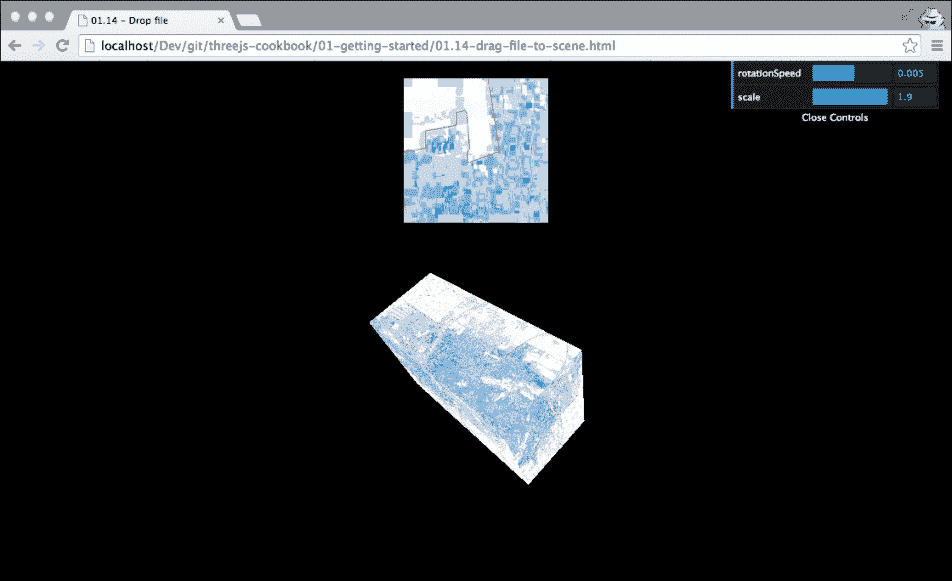

## 工作原理...

拖放功能不是 Three.js 默认支持的功能。正如我们在上一节中看到的，我们使用标准的 HTML5 拖放相关事件。关于可用的哪些事件的良好概述可以在官方 HTML5 文档中找到，网址为[`www.w3.org/TR/html5/editing.html#drag-and-drop-processing-model`](http://www.w3.org/TR/html5/editing.html#drag-and-drop-processing-model)。

值得注意的是，在`ondrop`事件处理程序中添加了`texture.needsUpdate = true`。我们需要设置纹理的此属性的原因是通知 Three.js 我们的纹理已更改。这是必需的，因为 WebGL 和 Three.js 出于性能原因都会缓存纹理。如果我们更改纹理，我们必须将此属性设置为`true`，以确保 WebGL 知道如何渲染。
