# 第三章 使用相机

在本章中，我们将涵盖以下配方：

+   让相机跟踪一个对象

+   缩放相机到对象

+   使用透视相机

+   使用正交相机

+   创建 2D 叠加层

+   围绕场景旋转相机

+   将渲染视图匹配到调整大小的浏览器

+   将世界坐标转换为屏幕坐标

+   在场景中选择一个对象

# 简介

在 Three.js 中，最重要的对象之一就是相机。通过相机，你定义了场景的哪一部分将被渲染，以及信息将如何投影到屏幕上。在本章中，我们将向您展示一些配方，这些配方将允许您向您的 Three.js 应用程序添加更复杂的相机功能。

# 让相机跟踪一个对象

当你创建包含许多移动对象的游戏或可视化时，你可能想让相机围绕对象移动。通常情况下，当你创建一个相机时，它会指向一个单一的位置，并显示其视野内的场景。在这个配方中，我们将解释如何创建一个可以围绕任何对象移动的相机。

## 准备就绪

这个配方仅使用核心 Three.js 函数，因此不需要在源代码中包含外部 JavaScript 库。如果你想看到这个配方的最终结果，你可以在浏览器中打开 `03.01-camera-follow-object.html`，你将看到以下截图所示的内容：

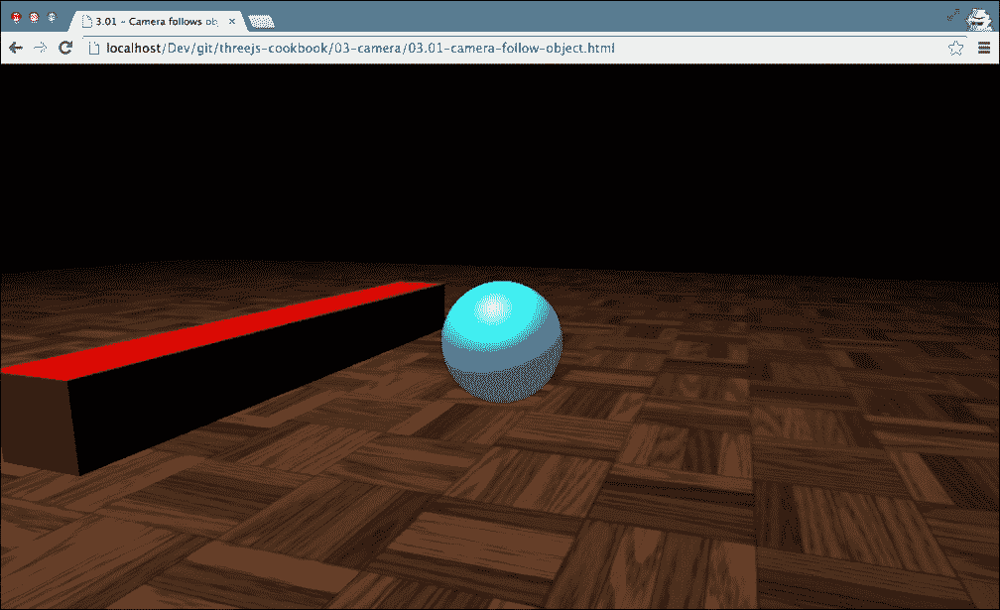

在这个例子中，你可以看到相机聚焦在球体上。随着球体在场景中移动，相机也会移动以保持对球体位置的聚焦。

## 如何操作...

对于这个配方，我们只需要采取三个简单的步骤：

1.  我们需要做的第一件事是创建我们想要跟踪的对象。对于这个配方，我们创建了一个简单的 `THREE.SphereGeometry` 对象，并将其添加到场景中，如下所示：

    ```js
      var sphereGeometry = new THREE.SphereGeometry(1.5,20,20);
      var matProps = {
        specular: '#a9fcff',
        color: '#00abb1',
        emissive: '#006063',
        shininess: 10
      }
      var sphereMaterial = new
      THREE.MeshPhongMaterial(matProps);
      var sphereMesh = new THREE.Mesh(sphereGeometry, sphereMaterial);
      sphereMesh.name = 'sphere';
      scene.add(sphereMesh);
    ```

    如你在下面的代码片段中所见，我们不需要对我们想要跟踪的对象做任何特殊处理。

1.  下一步是，我们需要一个渲染场景并保持聚焦于我们想要跟踪的对象的相机。以下 JavaScript 代码创建并定位了这个相机：

    ```js
      // create a camera, which defines where we're looking at.
      camera = new THREE.PerspectiveCamera(45, window.innerWidth / window.innerHeight, 0.1, 1000);
      // position and point the camera to the center of the scene
      camera.position.x = 15;
      camera.position.y = 6;
      camera.position.z = 15;
    ```

    这是一个标准的 `THREE.PerspectiveCamera` 对象，我们也在本章的许多其他示例中使用它。再次强调，不需要任何特殊配置。

1.  对于最后一步，我们定义了渲染循环，它将渲染场景，并确保相机在这个配方中的正确方向：

    ```js
      function render() {
        var sphere = scene.getObjectByName('sphere');
        renderer.render(scene, camera);
     camera.lookAt(sphere.position);
        step += 0.02;
        sphere.position.x = 0 + (10 * (Math.cos(step)));
        sphere.position.y = 0.75 * Math.PI / 2 + (6 * Math.abs(Math.sin(step)));
        requestAnimationFrame(render);
      }
    ```

在 `render` 函数中，我们使用 `camera.lookAt` 函数将相机指向球体的 `position` 函数。由于我们在每一帧渲染时都这样做，所以看起来相机正好跟随球体的位置。

## 它是如何工作的...

`THREE.PerspectiveCamera` 从 `THREE.Object3D` 对象扩展而来。`THREE.Object3D` 提供了 `lookAt` 函数。当这个函数使用要查看的目标位置调用时，Three.js 创建一个变换矩阵 (`THREE.Matrix4`)，使 `THREE.Object3D` 对象的位置与目标位置对齐。在摄像机的情况下，结果是目标对象被摄像机在场景中跟随，并在屏幕中间渲染。

## 还有更多...

在这个菜谱中，我们使用 `lookAt` 函数将摄像机指向一个特定的对象。您可以将这个相同的菜谱应用于所有从 Object3D 扩展的 Three.js 对象。例如，您可以使用它来确保 `THREE.SpotLight` 总是照亮特定的对象。或者，如果您正在创建动画，您可以使用这个效果来确保一个角色总是看着另一个角色的脸部。

## 相关内容

+   由于 `lookAt` 函数使用矩阵变换来指向一个对象，您也可以不使用 `lookAt` 函数来做这件事。为此，您将不得不自己创建一个变换矩阵。我们已经在 *应用矩阵变换* 菜谱中解释了如何做这件事，您可以在 第二章，*几何体和网格* 中找到它。

# 将摄像机缩放到物体

通常，当您在场景中定位摄像机时，您可能会移动它或让它聚焦在不同的物体上。在这个菜谱中，我们将向您展示如何缩放到一个物体，使其几乎填满渲染视图。

## 准备中

要进行缩放，我们使用 `THREE.PerspectiveCamera` 对象的标准功能。我们提供了一个示例，演示了您在本菜谱结束时将获得的结果。要尝试这个示例，请在您的浏览器中打开 `03.02-zoom-camera-to-object.html`。您将看到以下截图类似的内容：

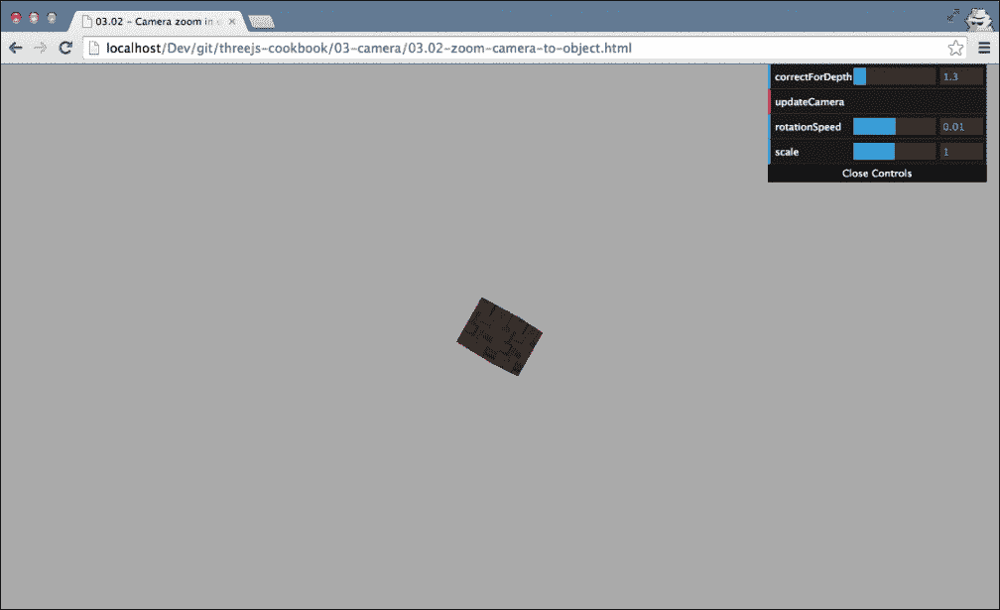

初始时，您将在场景中心看到一个小的旋转立方体。如果您点击右上角菜单中的 `updateCamera` 按钮，摄像机将更新并显示一个全屏的旋转立方体，如下所示：

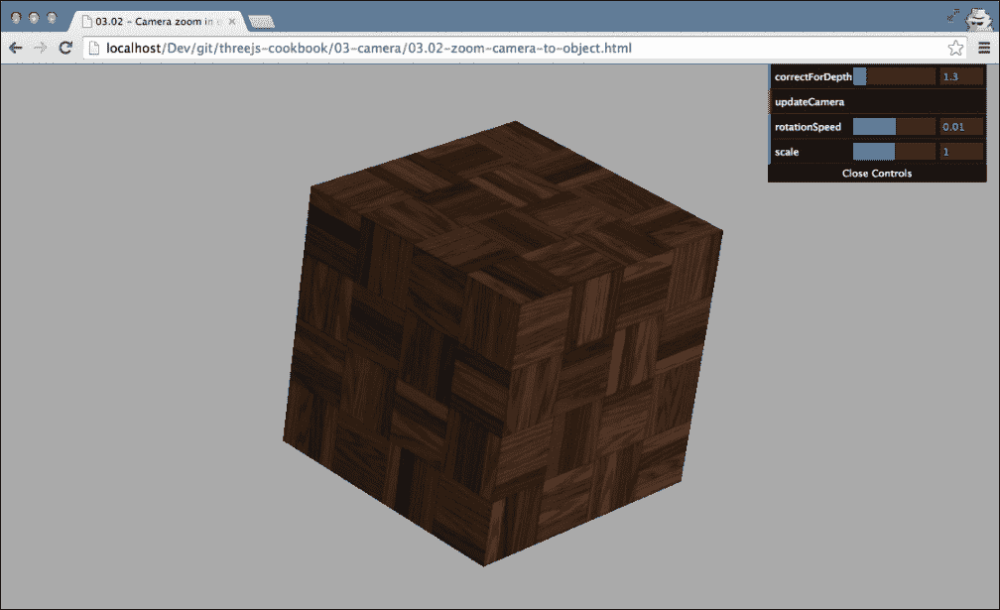

## 如何操作...

要将摄像机缩放到物体，我们需要采取以下步骤：

1.  我们需要做的第一件事是创建并定位我们用来缩放的摄像机：

    ```js
      camera = new THREE.PerspectiveCamera(45, window.innerWidth / window.innerHeight, 0.1, 1000);
      // position and point the camera to the center of the scene
      camera.position.x = 15;
      camera.position.y = 15;
      camera.position.z = 15;
      camera.lookAt(scene.position);
    ```

    如您所见，这是一个标准的 `THREE.PerspectiveCamera` 对象，我们给它一个位置并将其添加到场景中。

1.  要使用摄像机进行缩放，我们首先需要确定物体与摄像机之间的距离及其高度：

    ```js
      // create an helper
      var helper = new THREE.BoundingBoxHelper(cube);
      helper.update();
      // get the bounding sphere
      var boundingSphere = helper.box.getBoundingSphere();
      // calculate the distance from the center of the sphere
      // and subtract the radius to get the real distance.
      var center = boundingSphere.center;
      var radius = boundingSphere.radius;
      var distance = center.distanceTo(camera.position) - radius;
      var realHeight = Math.abs(helper.box.max.y - helper.box.min.y);
    ```

    在之前的代码片段中，我们使用了 `THREE.BoundingBoxHelper` 来确定立方体的 `realHeight` 函数及其与摄像机的距离。

1.  使用这些信息，我们可以确定摄像机的视场 (`fov`)，使其只显示立方体：

    ```js
      var fov = 2 * Math.atan(realHeight * control.correctForDepth / (2 * distance)) * (180 / Math.PI);
    ```

    在此代码片段中，您可以看到我们使用了一个额外的值，即 `control.correctForDepth`，来计算视场。此值在示例右上角的菜单中设置，略微增加了最终视场。我们这样做是因为在这个计算中，我们假设相机正对着对象。如果相机没有直视对象，我们需要补偿这个偏移。

1.  现在我们已经为相机设置了视场，我们可以将此值分配给 `camera.fov` 属性：

    ```js
      camera.fov = fov;
      camera.updateProjectionMatrix();
    ```

    由于 Three.js 缓存了相机的 `fov` 属性，我们需要通知 Three.js 相机配置有一些更改。我们通过 `updateProjectionMatrix` 函数来完成此操作。

到目前为止，相机已经完全缩放了对象。

## 它是如何工作的…

要理解它是如何工作的，我们需要了解 `THREE.PerspectiveCamera` 对象的视场属性。以下图显示了视场属性：


如图中所示，存在一个单独的水平和垂直视场。Three.js 只允许您设置垂直视场，水平视场基于您在相机上定义的纵横比确定。当您查看此图时，您还可以直接看到此菜谱是如何工作的。通过改变视场，我们缩小了近平面和远平面，并限制了渲染的内容，这样我们就可以进行缩放。

## 还有更多…

除了这里显示的缩放方式之外，还有另一种缩放方式。我们不仅可以改变相机的 `fov` 属性，还可以将相机移近对象。在 Three.js 的最新版本中，引入了一个 `zoom` 属性；您也可以使用此属性来缩放场景，但不能直接用于缩放单个对象。

# 使用透视相机

Three.js 提供了两种相机：一种是以透视投影（正如我们在现实世界中看到图像的方式）渲染场景的相机，另一种是以正交投影（常用于游戏的假 3D；有关此类相机的更多信息，请查看即将到来的 *使用正交相机* 菜谱）。在本菜谱中，我们将探讨这两种相机中的第一种，并解释您如何在您的场景中使用透视相机。

## 准备工作

与相机属性一起工作有时可能会有些困惑。为了帮助您更好地理解步骤或此菜谱，我们创建了一个简单的页面，展示了每个相机属性的效果。在浏览器中打开 `03.03-use-an-perspective-camera.html`，您将看到如下内容：

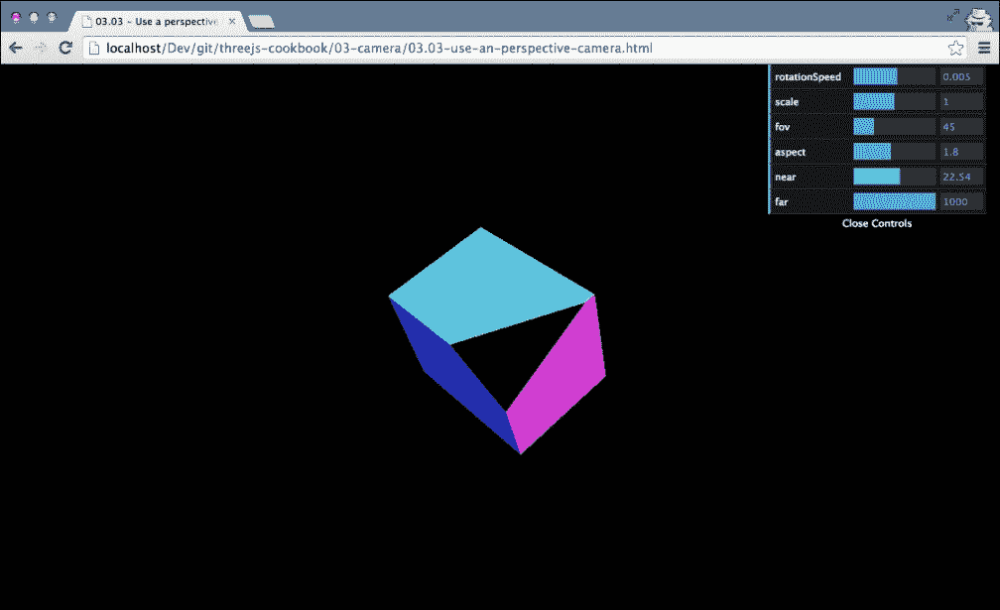

通过右上角菜单中可用的最后四个属性，您可以设置用于渲染此场景的 `THREE.PerspectiveCamera` 的属性，并立即看到每个属性的效果。

## 如何做到这一点…

在这个菜谱中，我们分别设置每个相机的属性。这些属性也可以通过 `THREE.PerspectiveCamera` 的构造函数传入。在这个菜谱的 *还有更多…* 部分中，我们将向您展示如何做到这一点。

要完全设置 `THREE.PerspectiveCamera`，我们需要执行几个步骤：

1.  我们需要做的第一件事是实例化相机：

    ```js
      camera = new THREE.PerspectiveCamera();
    ```

    这创建了相机实例，我们将在接下来的步骤中进行配置。

1.  现在我们已经有了相机，我们首先需要定义视口宽度和高度之间的宽高比：

    ```js
      camera.aspect = window.innerWidth / window.innerHeight;
    ```

    在我们的菜谱中，我们使用浏览器的完整宽度和高度，因此我们根据 `window.innerWidth` 和 `window.innerHeight` 属性指定相机的宽高比。如果我们使用具有固定宽度和高度的 `div` 元素，您应该使用这些值之间的比率作为相机的 `aspect` 函数。

1.  我们接下来需要定义的两个属性是 `near` 和 `far` 属性：

    ```js
      camera.near = 0.1;
      camera.far = 1000;
    ```

    这两个属性定义了相机将要渲染的场景区域。使用这两个值，相机将从距离相机 `0.1` 到 `1000` 的距离渲染场景。

1.  可以定义的最后一个属性是（垂直）视野：

    ```js
      camera.fov = 45;
    ```

    这个属性以度为单位定义了相机 *看到的* 区域。例如，人类有 120 度的水平视野，而在视频游戏中，通常使用大约 90 或 100 度的视野。

1.  每当您更新相机的这四个属性之一时，您必须通知 Three.js 关于这种变化。您可以通过添加以下行来完成此操作：

    ```js
      camera.updateProjectionMatrix();
    ```

1.  现在，剩下要做的就是放置相机并将其添加到场景中：

    ```js
      camera.position.x = 15;
      camera.position.y = 16;
      camera.position.z = 13;
      scene.add(camera);
    ```

到目前为止，我们可以使用这个相机与任何可用的渲染器一起渲染一个像这样的场景：`renderer.render(scene, camera)`。

## 它是如何工作的...

要理解这些属性如何影响屏幕上渲染的内容，最好的方法是查看以下图表，它展示了这些属性：

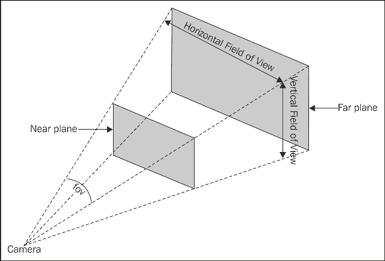

图中 **近平面** 的位置基于相机的 `near` 属性。**远平面** 基于相机的 `far` 属性和图中显示的 *fov*，这对应于 `fov` 属性。使用 `fov` 属性，您定义了垂直视野。水平视野基于宽高比，您可以通过相机上的 `aspect` 属性来定义。

## 还有更多…

在这个菜谱中，我们分别设置每个属性。`THREE.PerspectiveCamera` 还提供了一个构造函数，您可以使用它在一个语句中设置所有这些属性：

```js
  camera = new THREE.PerspectiveCamera(45, window.innerWidth / window.innerHeight, 0.1, 1000);
```

还要记住，`THREE.PerspectiveCamera` 是从标准的 Three.js `THREE.Object3D` 对象扩展而来的。这意味着这个相机可以像任何其他对象一样旋转和移动。

## 参见

+   在 *将相机缩放到对象* 配方中，我们使用了相机的 `fov` 属性来放大对象，而在 *使用正交相机* 配方中，我们将展示 Three.js 提供的两个相机中的第二个，即 `THREE.OrthographicCamera`。

# 使用正交相机

在大多数情况下，你会使用 `THREE.PerspectiveCamera` 来渲染你的场景。使用这种相机，结果是具有逼真视角的场景。Three.js 提供了一个替代相机 `THREE.OrthographicCamera`。这种相机使用正交投影来渲染场景。在这种投影类型中，所有对象的大小都相同，无论它们与相机的距离如何。这与 `THREE.PerspectiveCamera` 相比，在相机更远处的对象看起来更小。这常用于游戏中的假 3D 效果，如《模拟人生》或更早版本的《模拟城市》（图片来自 [`glasnost.itcarlow.ie/~powerk/GeneralGraphicsNotes/projection/projection_images/iosmetric_sim_city.jpg`](http://glasnost.itcarlow.ie/~powerk/GeneralGraphicsNotes/projection/projection_images/iosmetric_sim_city.jpg))。

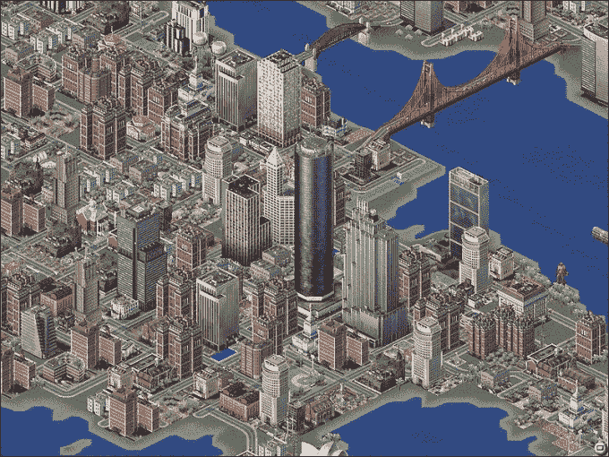

在本配方中，我们将向您展示如何配置 `THREE.OrthographicCamera`，以便您可以为您的场景创建这种假 3D 效果。

## 准备工作

对于这个配方，我们使用的唯一来自 Three.js 的对象是 `THREE.OrthographicCamera`。这个相机在标准的 Three.js 分发中可用，因此不需要包含任何外部 JavaScript 文件。我们提供了一个示例，展示了 Three.Orthographic Camera 的实际应用。你可以使用这个相机来更好地理解你可以用来配置相机的属性。如果你打开 `03.04-use-an-orthographic-camera.html`，你可以看到使用 `THREE.OrthographicCamera` 渲染的多个立方体。在右上角的菜单中，你可以调整相机的配置。

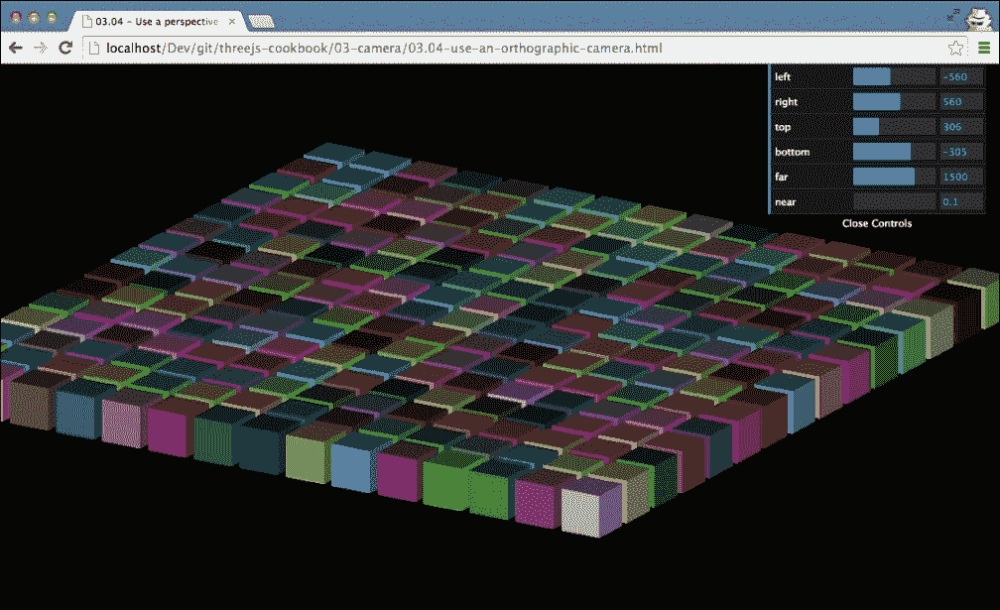

现在，让我们看看你需要采取哪些步骤来设置这个相机。

## 如何做到这一点...

在 Three.js 中设置正交相机需要执行几个非常简单的步骤：

1.  我们需要做的第一件事是创建相机实例：

    ```js
      camera = new THREE.OrthographicCamera();
    ```

    这将创建 `THREE.OrthographicCamera`，它使用一些默认值进行配置。

1.  下一步是定义这个相机的边界：

    ```js
      camera.left = window.innerWidth / -2;
      camera.right =  window.innerWidth / 2;
      camera.top = window.innerHeight / 2;
      camera.bottom = window.innerHeight / - 2;
    ```

    这定义了由这个相机渲染的区域。在本配方的 *还有更多…* 部分，我们将解释它是如何工作的。

1.  最后，我们必须设置相机的 `near` 和 `far` 属性。这些属性定义了从相机到渲染的距离：

    ```js
      camera.near = 0.1;
      camera.far = 1500;
    ```

1.  当我们在构造函数中不传递参数时，我们必须通知 Three.js 我们已更改相机的参数。为此，我们必须添加以下行：

    ```js
      camera.updateProjectionMatrix();
    ```

1.  最后一步是定位和调整相机：

    ```js
      camera.position.x = -500;
      camera.position.y = 200;
      camera.position.z = 300;
      camera.lookAt(scene.position);
    ```

1.  现在，我们只需像使用任何其他相机一样使用这个相机，并渲染出这样的场景：

    ```js
      renderer.render(scene, camera);
    ```

## 它是如何工作的...

理解这个相机的工作原理的最简单方法是通过查看以下图示：

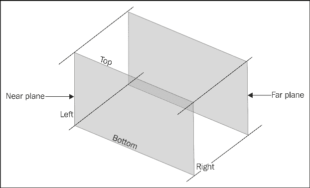

图中你看到的这个方块是正交相机渲染的区域。在这个图中，你还可以看到我们在相机上定义的`left`、`right`、`top`和`bottom`属性，这些属性定义了这个方块的边界。最后两个属性，即`near`和`far`，用于定义近平面和远平面。有了这六个属性，我们可以定义使用`THREE.OrthographicCamera`渲染的完整方块。

## 还有更多…

我们也可以通过在构造函数中传入这些参数来配置`THREE.OrthographicCamera`：

```js
  camera = new THREE.OrthographicCamera(window.innerWidth / -2, window.innerWidth / 2, window.innerHeight / 2, window.innerHeight / - 2, 0.1, 1500);
```

一个额外的优势是，这样你就不需要显式调用`camera.updateProjectionMatrix()`。

## 相关内容

+   Three.js 提供了两种类型的相机。如果你想使用`THREE.PerspectiveCamera`，请查看*使用透视相机*食谱，其中解释了创建和配置透视相机的步骤。

# 创建 2D 叠加

在大多数食谱中，我们只关注 Three.js 的 3D 方面。我们展示了解释 3D 对象和场景如何渲染、如何使用不同的相机来查看它们以及如何通过材质来改变它们外观的食谱。当你创建游戏时，通常也会在你的 3D 场景之上有一个 2D 层。你可以用它来显示生命值条、2D 地图、存货清单等等。在这个食谱中，我们将向你展示如何使用`THREE.OrthogonalCamera`和`THREE.PerspectiveCamera`一起创建 2D 叠加。

## 准备就绪

对于这个食谱，我们需要一个用作叠加层的图像。为了演示这个食谱，我们创建了一个简单的图像，看起来像这样：

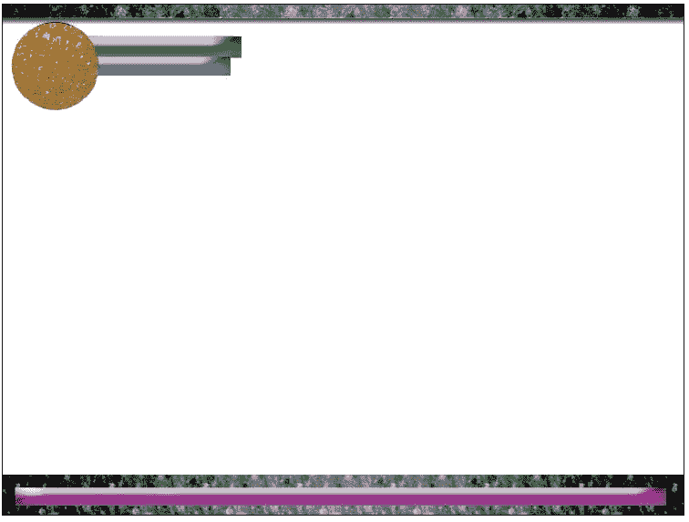

在这个食谱中，我们将结合这个静态图像和一个 3D 场景来创建在浏览器中打开`03.05-create-an-hud-overview.html`示例时可以看到的场景：

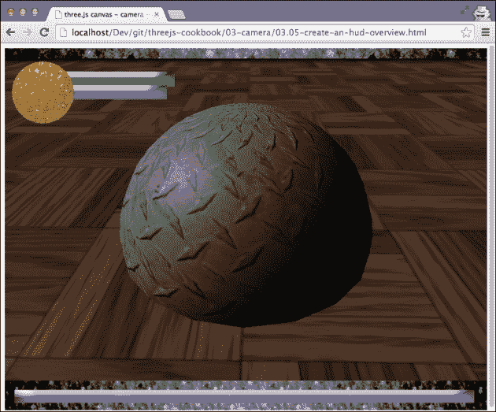

在这个示例中，你可以看到我们有一个 3D 旋转的场景，上面有一个静态的 2D 叠加层。

## 如何做…

让我们看看你需要采取的步骤：

1.  让我们从创建 2D 叠加开始。在这个食谱中，我们使用的叠加层具有固定的宽度和高度（800 x 600）。因此，在我们创建相机之前，让我们首先创建一个`div`变量，它作为渲染场景的容器：

    ```js
      container = document.createElement( 'div' );
      container.setAttribute(
        "style","width:800px; height:600px");
      document.body.appendChild( container );
    ```

1.  接下来，让我们创建用于渲染叠加层的相机。为此，我们需要`THREE.OrthographicCamera`:

    ```js
      orthoCamera = new THREE.OrthographicCamera( 
        WIDTH / - 2, WIDTH / 2,     HEIGHT / 2, HEIGHT / - 2, - 500, 1000 );
      orthoCamera.position.x = 0;
      orthoCamera.position.y = 0;
      orthoCamera.position.z = 0;
    ```

    `WIDTH`和`HEIGHT`属性被定义为具有 800 和 600 值的常量。这段代码创建并定位了一个标准的`THREE.OrthographicCamera`对象。

1.  对于 2D 叠加，我们创建了一个单独的场景，我们将 2D 元素放入其中：

    ```js
      orthoScene = new THREE.Scene();
    ```

1.  我们想要添加到 2D 场景中的唯一东西是我们在本食谱的*准备就绪*部分展示的叠加图像。由于它是一个 2D 图像，我们将使用一个`THREE.Sprite`对象：

    ```js
      var spriteMaterial = new THREE.SpriteMaterial({map: THREE.ImageUtils.loadTexture("../assets/overlay/overlay.png")});
      var sprite = new THREE.Sprite(spriteMaterial);
      sprite.position.set(0,0,10);
      sprite.scale.set(HEIGHT,WIDTH,1);
      orthoScene.add(sprite);
    ```

    `THREE.Sprite`无论其与摄像机的距离如何，总是以相同的大小（1x1 像素）渲染。为了使精灵全屏，我们将*x*轴缩放为 800（`WIDTH`），将*y*轴缩放为 600（`HEIGHT`）。使用我们在前面的代码片段中使用的`THREE.SpriteMaterial`，我们将叠加图像指向，以便在添加`THREE.Sprite`到场景时显示它。

1.  到目前为止，我们已经有了`THREE.OrthogonalCamera`和`THREE.Scene`，它们以 800x600 的图像显示叠加层。下一步是在我们想要应用此叠加层的 3D 屏幕上创建。在这里，你不需要做任何特别的事情；你可以通过定义`THREE.PerspectiveCamera`和`THREE.Scene`并添加一些灯光和对象来创建 3D 场景。对于这个配方，我们假设你已经有一个具有以下名称的相机和场景：

    ```js
      persCamera = new THREE.PerspectiveCamera(60, WIDTH / HEIGHT, 1, 2100 );
      persScene = new THREE.Scene();
    ```

1.  在我们将要进入的渲染循环中定义我们想要将 2D 场景作为叠加层渲染之前，我们需要在渲染器上配置一个额外的属性：

    ```js
      renderer = new THREE.WebGLRenderer();
      renderer.setClearColor( 0xf0f0f0 );
      renderer.setSize( 800, 600 );
     renderer.autoClear = false;
      container.appendChild( renderer.domElement );
    ```

    在`THREE.WebGLRenderer`上，我们将`autoclear`属性设置为`false`。这意味着在渲染器渲染场景之前，屏幕不会被自动清除。

1.  最后一步是修改渲染循环。我们首先想要渲染 3D 场景，并且在不清除 3D 渲染输出之前，在顶部渲染叠加层：

    ```js
      function render() {
        renderer.clear();
        renderer.render( persScene, persCamera );
        renderer.clearDepth();
        renderer.render( orthoScene, orthoCamera );
      }
    ```

    在渲染循环中，我们首先通过在渲染器上调用`clear`函数来清除当前输出。我们需要这样做，因为我们禁用了渲染器的`autoclear`。现在，我们渲染 3D 场景，在渲染 2D 叠加层之前，我们在渲染器上调用`clearDepth`函数。这确保 2D 叠加层完全渲染在顶部，并且不会与 3D 场景在位置上相交。所以最后，我们通过传递`orthoScene`和`orthoCamera`来渲染 2D 叠加层。

## 它是如何工作的...

这个配方的原理实际上非常简单。我们可以使用相同的渲染器在同一个渲染循环中渲染多个场景，每个场景使用多个不同的摄像机。这样，我们可以在彼此之上定位各种渲染结果。使用`THREE.OrthoGraphic`摄像机和`THREE.Sprite`，很容易将对象定位在屏幕上的绝对位置。通过将其缩放至所需大小并应用纹理，我们可以使用渲染器显示图像。这种输出与常规 3D 结果相结合，允许你创建这类叠加层。

## 参见

有几个配方使用正交摄像机和更高级的技巧来组合最终的渲染：

+   在本章中，我们探讨了如何在*使用正交摄像机*配方中设置`THREE.OrthographicCamera`。

+   在第四章中，我们将展示如何在*使用 HTML canvas 作为纹理*和*使用 HTML 视频作为纹理*配方中使用 HTML5 canvas 和 HTML5 视频作为纹理的输入。

+   在第六章中，*点云和后期处理*，我们在*设置后期处理管道*配方中向您展示了如何设置更复杂的渲染管道。

# 围绕场景旋转相机

在第二章中，*几何体和网格*，我们已经向您展示了多个配方，解释了如何旋转对象。在这个配方中，我们将向您展示如何在保持相机始终注视场景中心的同时旋转相机。

## 准备工作

对于这个配方，我们将使用标准的`THREE.PerspectiveCamera`对象，我们将它围绕一个简单的场景旋转。要查看最终结果，请在您的浏览器中打开`03.08-rotate-camera-around-scene-y-axis.html`示例。

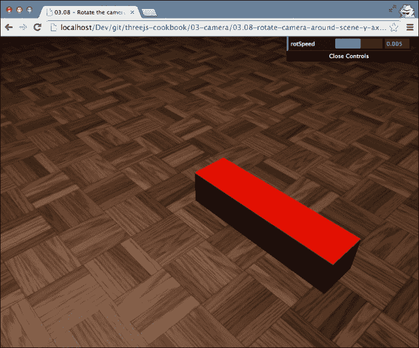

在这个网页上，你可以看到相机围绕场景旋转，而地板、箱子和灯光保持在同一位置。

## 如何操作...

要完成这个任务，我们只需要执行几个非常简单的步骤：

1.  我们需要做的第一件事是创建`THREE.PerspectiveCamera`并将其放置在场景中的某个位置：

    ```js
      // create a camera, which defines where we're looking at.
      camera = new THREE.PerspectiveCamera(45,window.innerWidth / window.innerHeight, 0.1, 1000);
      // position and point the camera to the center of the scene
      camera.position.x = 15;
      camera.position.y = 16;
      camera.position.z = 13;
      camera.lookAt(scene.position);
    ```

1.  要旋转相机，我们在渲染循环中重新计算其位置如下：

    ```js
      function render() {
        renderer.render(scene, camera);
        var x = camera.position.x;
        var z = camera.position.z;
        camera.position.x = x * Math.cos(control.rotSpeed) + z * Math.sin(control.rotSpeed);
        camera.position.z = z * Math.cos(control.rotSpeed) – x * Math.sin(control.rotSpeed);
        camera.lookAt(scene.position);
        requestAnimationFrame(render);
      }
    ```

    在这个渲染函数中，我们更新了`camera.position.x`和`camera.position.z`变量，并通过调用`camera.lookAt(scene.position)`，确保我们始终注视场景的中心。

## 工作原理...

我们在这里做的是一些基本的向量数学。我们使用旋转矩阵执行相机的一个非常小的旋转。然而，与其他配方中使用的 3D 和 4D 矩阵不同，这次我们只使用一个 2D 矩阵（用**渲染**循环中的两个计算表示）。旋转后，我们只需确保相机仍然注视正确的位置，所以我们使用`lookAt`函数（它再次内部使用矩阵计算来确定如何将相机对准场景）。

## 更多内容...

在这个配方中，我们围绕场景的*y*轴旋转。这产生了一个非常平滑的动画，其中相机围绕场景旋转。当然，我们也可以将此应用于其他轴。我们提供了一个可以在本书提供的源代码中查看的示例。如果你在浏览器中打开`03.08-rotate-camera-around-scene-x-axis.html`，相机会围绕*x*轴旋转而不是*y*轴。

你需要做的唯一改变是在渲染循环中更改计算：

```js
  function render() {
    renderer.render(scene, camera);
    var z = camera.position.z;
    var y = camera.position.y;
 camera.position.y = y * Math.cos(control.rotSpeed) + z * Math.sin(control.rotSpeed);
 camera.position.z = z * Math.cos(control.rotSpeed) – y * Math.sin(control.rotSpeed);
    camera.lookAt(scene.position);
    requestAnimationFrame(render);
  }
```

当你在浏览器中查看这个示例时，你可能会注意到一些奇怪的现象。在某个时刻，它看起来像相机在跳跃。原因是相机试图保持直立，所以当它旋转到顶部或底部时，它会迅速改变方向。

## 相关内容

在第二章中，*几何体和网格*，我们已经讨论了一些与旋转相关的食谱。如果你想要了解更多关于旋转或其所需的矩阵计算，请查看以下来自第二章，*几何体和网格*的食谱：

+   *围绕对象的自身轴旋转*

+   *在空间中的点周围旋转对象*

+   *应用矩阵变换*

# 将渲染视图与调整大小的浏览器匹配

当你在 Three.js 中定义一个相机时，你需要定义其纵横比；对于渲染器，你需要定义其输出大小。通常，你会在设置初始场景时只做一次。这工作得很好，直到用户调整浏览器的大小。在这种情况下，相机的纵横比可能会改变，渲染器的输出大小也可能会改变。在这个食谱中，我们将向你展示你需要采取的步骤来响应屏幕大小的变化。

## 准备中

与每个食谱一样，我们提供了一个示例，你可以用它来测试和实验这个食谱。在你的浏览器中打开`03.06-change-the-camera-on-screen-resize.html`，并将屏幕调得很小。

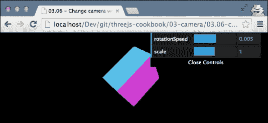

你会看到场景中显示的信息量相同——只是渲染得更小。当你现在再次增加屏幕大小时，你会看到 Three.js 总是使用完整的可用空间。

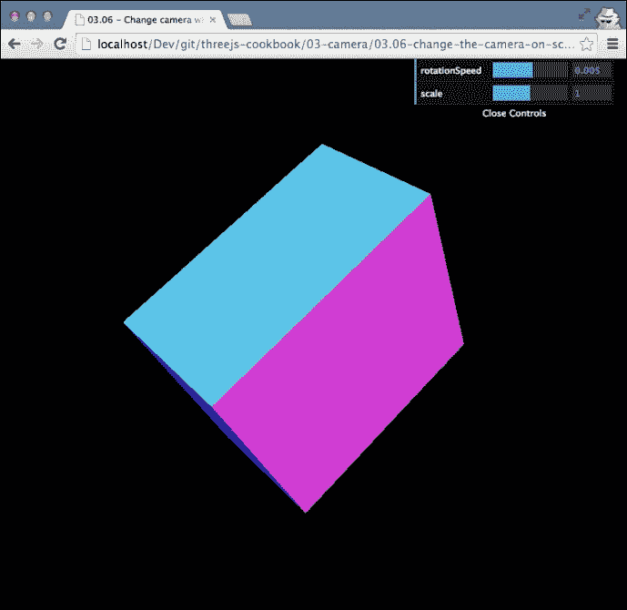

## 如何做到这一点...

在这个食谱中，我们将向网页添加一个调整大小处理程序，该处理程序会对调整大小事件做出反应。添加此处理程序只需要几个步骤：

1.  我们需要添加的第一件事是在调整大小事件发生时调用的函数。以下代码片段显示了我们将要调用的`onResize`函数：

    ```js
      function onResize() {
        camera.aspect = window.innerWidth / window.innerHeight;
        camera.updateProjectionMatrix();
        renderer.setSize(window.innerWidth, window.innerHeight);
      }
    ```

    在这个代码片段中，我们首先根据新的宽度和高度重新计算相机的纵横比。由于 Three.js 缓存了相机的某些方面，我们必须调用`updateProjectionMatrix()`函数以确保使用新的纵横比。我们还更改了渲染器的大小为新宽度和高度，以便使用完整的屏幕空间。

1.  现在我们已经有了我们的更新函数，我们需要定义一个事件监听器：

    ```js
      window.addEventListener('resize', onResize, false);
    ```

    如你所见，我们添加了一个对`resize`事件的监听器。所以每当屏幕调整大小时，提供的函数，即`onResize`，将被调用。

## 它是如何工作的...

当浏览器内发生某些事情（按钮被点击，鼠标移动，窗口大小调整等）时，浏览器会抛出一个事件。从 JavaScript 中，你可以注册监听器来响应这些事件。在这个菜谱中，我们使用 `resize` 事件来监听窗口大小的任何变化。有关此事件的更多信息，你可以查看 Mozilla 提供的出色文档，请参阅 [`developer.mozilla.org/en-US/docs/Web/Events/resize`](https://developer.mozilla.org/en-US/docs/Web/Events/resize)。

# 将世界坐标转换为屏幕坐标

如果你正在创建一个在 3D 世界之上提供 2D 界面的游戏，例如，如 *创建 2D 浮层* 菜谱中所示，你可能想知道 3D 坐标如何映射到你的 2D 浮层。如果你知道 2D 坐标，你可以在 2D 浮层上添加各种视觉效果，例如跟踪代码或让 2D 浮层与 3D 场景中的对象交互。

## 准备工作

你不需要执行任何步骤来为这个菜谱做准备。在这个菜谱中，我们可以使用 Three.js 中可用的 `THREE.Projector` 对象来确定正确的坐标。你可以通过在浏览器中打开 `03.07-convert-world-coordintate-to-screen-coordinates.html` 来查看这个菜谱的结果，如下截图所示：

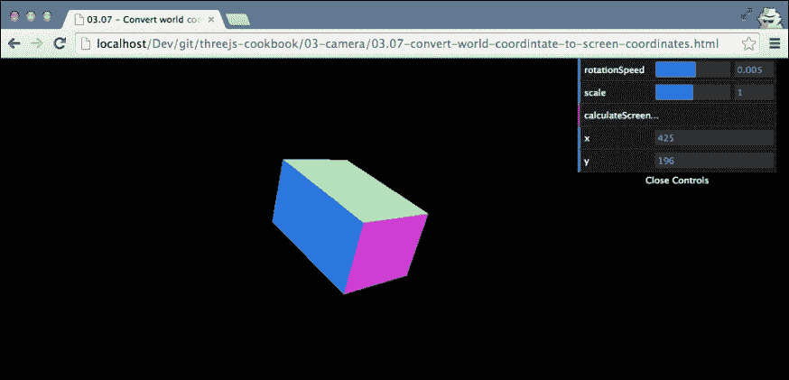

当你打开这个示例时，盒子出现在随机位置。当你点击右上角菜单中的 **calculateScreenCoordinate** 按钮时，盒子的中心 *x* 和 *y* 坐标将会显示出来。

## 如何做到这一点...

要将世界坐标转换为屏幕坐标，我们使用几个 Three.js 的内部对象：

1.  我们需要的第一个对象是 `THREE.Projector`：

    ```js
      var projector = new THREE.Projector();
    ```

1.  接下来，我们使用这个投影仪将立方体的位置投影到相机上：

    ```js
    var vector = new THREE.Vector3();
      projector.projectVector(
        vector.setFromMatrixPosition( object.matrixWorld ),
        camera );
    ```

    `vector` 变量现在将包含对象的位置，这是由 `camera` 对象看到的。

1.  当你投影一个向量，就像我们在第二步中做的那样，得到的 *x* 和 *y* 值范围从 -1 到 1。所以在这个最后一步中，我们将这些值转换为当前的屏幕宽度和高度：

    ```js
      var width = window.innerWidth;
      var height = window.innerHeight;
      var widthHalf = width / 2;
      var heightHalf = height / 2;
      vector.x = ( vector.x * widthHalf ) + widthHalf;
      vector.y = - ( vector.y * heightHalf ) + heightHalf;
    ```

    到目前为止，`vector` 变量将包含 `object` 中心的屏幕坐标。你现在可以使用这些坐标与标准的 JavaScript、HTML 和 CSS 结合，添加效果。

## 它是如何工作的...

在这个菜谱中，我们使用了 Three.js 渲染场景时使用的相同效果。当你渲染一个场景时，对象会被投影到一个相机上，这决定了需要渲染的区域以及对象出现的位置。通过投影器类，我们可以对单个向量执行这种投影。结果是，基于使用的相机，这个向量在二维空间中的位置。

## 参见

+   在这个食谱中，我们将世界坐标转换为屏幕坐标。这实际上相当简单，因为我们已经拥有了所有必要的信息（在三维空间中）来正确确定坐标（在二维空间中）。在`在场景中选择对象`食谱中，我们将屏幕坐标转换为世界坐标，这更难做到，因为我们没有可以使用任何深度信息。

# 在场景中选择对象

对于 Three.js 应用程序来说，一个常见的需求是与场景交互。你可能创建了一个射击游戏，其中你想要使用鼠标进行瞄准，或者一个角色扮演游戏，其中你需要与环境交互。在这个食谱中，我们将向你展示如何使用鼠标选择屏幕上渲染的对象。

## 准备工作

要应用这个效果，我们需要一个场景，其中我们可以选择一些对象。对于这个食谱，我们提供了一个示例，它是`03.10-select-an-object-in-the-scene.html`。如果你在浏览器中打开这个文件，你会看到许多对象在场景中移动。

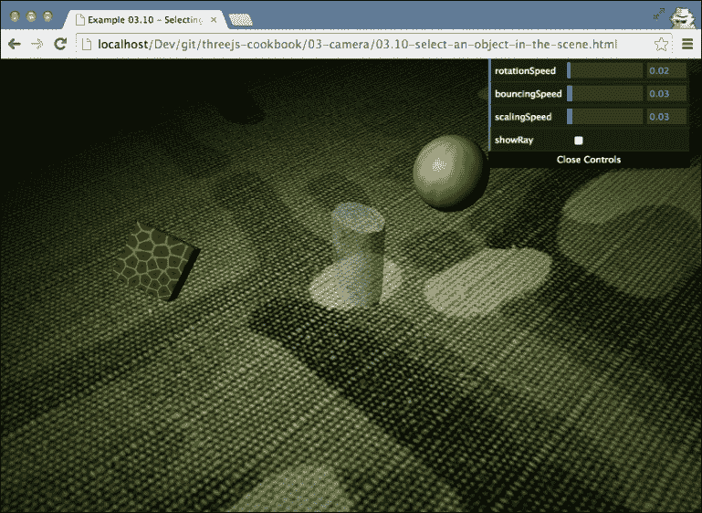

你可以用鼠标选择屏幕上的任何对象。第一次点击它们时，它们会变成透明，下一次点击时，它们又会变成实心。

## 如何操作...

为了完成这个食谱，我们需要完成几个步骤：

1.  我们首先需要做的是设置鼠标监听器。我们希望在每次鼠标按钮被点击时触发一个 JavaScript 函数。为此，我们注册以下监听器：

    ```js
      document.addEventListener('mousedown', onDocumentMouseDown, false);
    ```

    这将告诉浏览器在检测到`mousedown`事件时触发`onDocumentMouseDown`按钮。

1.  接下来，我们定义`onMouseDown`函数如下：

    ```js
    function onDocumentMouseDown(event) { ... }
    ```

    当你按下鼠标左键时，这个函数将被调用。在接下来的步骤中，我们将向你展示如何将内容放入这个函数以检测哪个对象被选中。

1.  我们首先需要做的是将鼠标点击的*x*和*y*坐标转换为`THREE.PerspectiveCamera`可以理解的坐标：

    ```js
    var projector = new THREE.Projector();
      var vector = new THREE.Vector3(
        (event.clientX / window.innerWidth) * 2 - 1,
        -(event.clientY / window.innerHeight) * 2 + 1,
        0.5);
      projector.unprojectVector(vector, camera);

    ```

    到目前为止，向量将包含*x*和*y*坐标，这些坐标是相机和 Three.js 理解的坐标。

1.  现在我们可以使用另一个 Three.js 对象，即`THREE.Raycaster`，来确定场景中哪些对象可能位于我们点击的位置：

    ```js
      var raycaster = new THREE.Raycaster(camera.position,vector.sub(camera.position).normalize());
      var intersects = raycaster.intersectObjects([sphere, cylinder, cube]);
    ```

    在这里，我们首先创建`THREE.Raycaster`并使用`intersectObjects`函数来确定是否选择了`sphere`、`cylinder`或`cube`。如果一个对象被选中，它将被存储在`intersects`数组中。

1.  现在我们可以处理`intersects`数组。第一个元素将是离相机最近的元素，在这个食谱中，这是我们感兴趣的：

    ```js
      if (intersects.length > 0) {
        intersects[0].object.material.transparent = true;
        if (intersects[0].object.material.opacity === 0.5) {
          intersects[0].object.material.opacity = 1;
        } else {
          intersects[0].object.material.opacity = 0.5;
        }
      }
    ```

    在这个食谱中，我们只是在对象被点击时切换其不透明度。

就这样。使用这个设置，你可以用鼠标选择对象。

## 它是如何工作的...

这个食谱通过使用 `THREE.RayCaster` 来工作。正如其名所示，使用 `THREE.RayCaster`，你会在场景中射出一束光线。这束光线的路径基于相机的属性、相机的位置以及提供给 `intersectObjects` 函数的对象。对于提供的每个对象，Three.js 会确定使用 `THREE.RayCaster` 射出的光线是否能击中指定的对象。

## 还有更多

可以添加的一个有趣的效果，并且能更好地可视化正在发生的事情，就是渲染由 `THREE.RayCaster` 射出的光线。你只需在本食谱的第 5 步中添加以下内容就可以很容易地做到这一点：

```js
  var points = [];
  points.push(new THREE.Vector3(camera.position.x, camera.position.y - 0.2, camera.position.z));
  points.push(intersects[0].point);
  var mat = new THREE.MeshBasicMaterial({
    color: 0xff0000,
    transparent: true,
    opacity: 0.6
  });
  var tubeGeometry = new THREE.TubeGeometry(new THREE.SplineCurve3(points), 60, 0.001);
  var tube = new THREE.Mesh(tubeGeometry, mat);
  scene.add(tube);
```

这段代码片段并没有什么特别之处。我们只是从相机的位置（在 *y* 轴上有一个小的偏移，否则我们什么也看不到）画一条线到光线相交的位置。结果，你可以在本食谱中 *准备就绪* 部分讨论的示例中看到，看起来像这样：

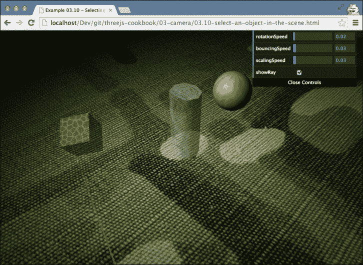

## 参见

+   在这个食谱中，我们将二维坐标转换为三维坐标。在 *将世界坐标转换为屏幕坐标* 的食谱中，我们解释了如何做相反的操作。
