# 第五章. 灯光和自定义着色器

在本章中，我们将介绍以下食谱：

+   使用`THREE.SpotLight`创建阴影

+   使用`THREE.DirectionalLight`创建阴影

+   通过添加环境光照来柔化灯光

+   使用`THREE.HemisphereLight`进行自然照明

+   添加一个全方向移动的灯光

+   沿路径移动光源

+   使光源跟随一个对象

+   创建自定义顶点着色器

+   创建自定义片段着色器

# 简介

Three.js 提供了大量的光源，无需额外依赖。在本章中，我们将展示一些关于灯光的食谱，并展示如何充分利用 Three.js 提供的照明选项。我们还将展示两个高级食谱，解释如何通过创建自己的自定义顶点和片段着色器来访问 WebGL 的原始功能。

# 使用`THREE.SpotLight`创建阴影

Three.js 提供了许多不同类型的灯光，你可以在场景中使用。其中一些灯光还允许你向场景添加阴影。当你使用`THREE.SpotLight`或`THREE.DirectionalLight`对象时，你可以让 Three.js 根据光源的位置添加阴影。在本食谱中，我们将展示如何使用`THREE.SpotLight`来实现这一点。

## 准备工作

对于这个食谱，你不需要任何外部依赖。Three.js 将所有可用的灯光直接包含在主 Three.js JavaScript 库中。我们创建了一个简单的示例，你可以使用它来查看在 Three.js 中如何结合`THREE.SpotLight`使用阴影。你可以在浏览器中打开`05.01-using-shadows-with-a-spotLight.html`来查看这个示例。你将看到以下截图类似的内容：

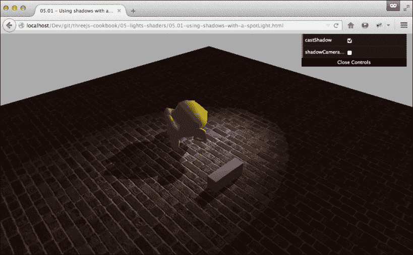

在这个场景中，你可以看到我们向场景中添加了两个网格，它们都在地板上投下了阴影。从这个例子中，你也可以直接看到`THREE.SpotLight`提供的独特光形状。

## 如何操作...

要使用`THREE.SpotLight`创建阴影，我们需要设置一些属性，这些属性定义了创建阴影的区域：

1.  在我们查看`THREE.SpotLight`之前，我们首先需要做的是告诉渲染器我们想要启用阴影。为此，在`THREE.WebGLRenderer`上设置以下属性：

    ```js
      renderer.shadowMapEnabled = true;
    ```

1.  下一步是通知 Three.js 哪些对象投下阴影，哪些对象接收阴影。如果你回顾一下*准备工作*部分中的截图，你可以看到猴子和立方体都投下了阴影，而地板接收了阴影。为此，你必须在应该投下阴影的`THREE.Mesh`对象上设置以下属性：

    ```js
    ..monkey.castShadow = true;
      cubeMesh.castShadow = true;
    ```

    对于接收阴影的对象，你必须在`THREE.Mesh`对象上设置以下属性：

    ```js
      floorMesh.receiveShadow = true;
    ```

1.  到目前为止，我们已经准备好创建`THREE.SpotLight`：

    ```js
      var spotLight = new THREE.SpotLight();
      spotLight.angle = Math.PI/8; // in radians
      spotLight.exponent = 30;
      spotLight.position = new THREE.Vector3(40,60,-50);
    ```

    这些是定义`THREE.SpotLight`如何向场景添加光的标准属性。

1.  下一步是设置与阴影相关的属性：

    ```js
      spotLight.castShadow = true;
      spotLight.shadowCameraNear = 50;
      spotLight.shadowCameraFar = 200;
      spotLight.shadowCameraFov = 35;
    ```

    第一个属性 `castShadow` 告诉 Three.js 这个光源可以投射阴影。由于投射阴影是一个昂贵的操作，我们需要定义阴影可以出现的位置。这是通过 `shadowCameraNear`、`shadowCameraFar` 和 `shadowCameraFov` 属性来完成的。

1.  Three.js 使用一种称为阴影图的技术来渲染阴影。如果您的阴影在边缘看起来有点块状，这意味着阴影图太小。要增加阴影图的大小，设置以下属性：

    ```js
      spotLight.shadowMapHeight = 2048;
      spotLight.shadowMapWidth = 2048;
    ```

    或者，您也可以尝试更改 `THREE.WebGLRenderer` 的 `shadowMapType` 属性。您可以将此设置为 `THREE.BasicShadowMap`、`THREE.PCFShadowMap` 或 `THREE.PCSSoftShadowMap`。

1.  最后一步是将 `THREE.SpotLight` 添加到场景中：

    ```js
      scene.add(spotLight);
    ```

确定各种 `THREE.SpotLight` 属性的正确属性可能很困难。在以下部分，我们将进一步解释这些属性如何影响阴影渲染的区域。

## 它是如何工作的...

当您想将 `THREE.SpotLight` 作为可以投射阴影的光源使用时，Three.js 需要知道这些阴影将影响哪些区域。您可以将其与您用于配置 `THREE.PerspectiveCamera` 的参数进行比较。因此，您通过 `shadowCameraNear`、`shadowCameraFar` 和 `shadowCameraFov` 属性所做的操作是定义 Three.js 应该在哪里渲染阴影。确定这些属性的值可能有点困难，但幸运的是，Three.js 可以可视化这个区域。如果您将 `THREE.SpotLight` 的 `shadowCameraVisible` 属性设置为 `true`，Three.js 将显示受影响的区域，如下面的截图所示：

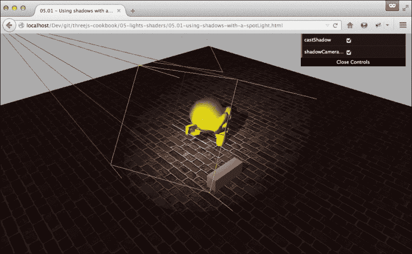

在这个截图中，区域的大小用橙色和红色线条表示。通过启用此 `shadowCameraVisible` 属性并尝试其他值，您可以快速确定正确的值。

## 参见

+   在 Three.js 中，有两种可以投射阴影的光源：`THREE.SpotLight` 和 `THREE.DirectionalLight`。在 *使用 THREE.DirectionalLight 创建阴影* 食谱中，我们解释了如何使用 `THREE.DirectionalLight` 投射阴影。在 第四章 *材料和纹理* 的 *使用阴影图创建固定阴影* 食谱中，解释了一种更高效但静态的创建阴影的方法。

# 使用 THREE.DirectionalLight 创建阴影

使用 `THREE.DirectionalLight`，您可以模拟一个远处的光源，其光线相互平行。一个很好的例子是从太阳接收到的光线。在这个食谱中，我们将向您展示如何创建 `THREE.DirectionalLight` 并使用它来创建阴影。

## 准备工作

对于这个食谱，我们创建了一个示例，展示了 `THREE.DirectionalLight` 对象产生的阴影的样子。在您的浏览器中打开 `05.02-using-shadows-with-a-directionalLight.html` 示例，您将看到以下截图所示的内容：

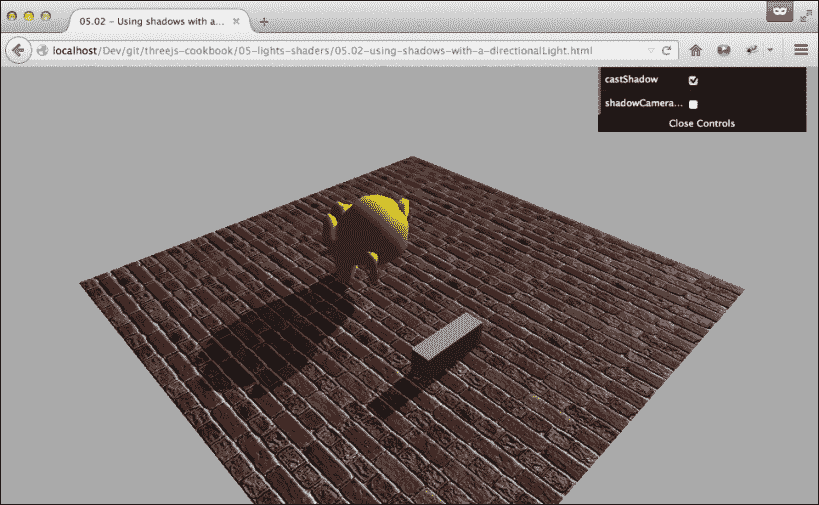

在这个截图中，一个单独的 `THREE.DirectionalLight` 对象提供了阴影和照明。

## 如何做到这一点...

使用 `THREE.DirectionLight` 作为阴影只需要几个步骤：

1.  要启用任何类型的阴影，我们首先需要将 `THREE.WebGLRenderer` 上的 `shadowMapEnabled` 设置为 `true`：

    ```js
      renderer.shadowMapEnabled = true;
    ```

1.  接下来，我们通知 Three.js 哪些对象应该接收阴影，哪些对象应该投射阴影。因此，对于应该投射阴影的对象，在 `THREE.Mesh` 上设置 `castShadow` 属性为 `true`：

    ```js
      monkey.castShadow = true;
      cubeMesh.castShadow = true;
    ```

    对于应该接收阴影的对象，在这个例子中是地板，在 `THREE.Mesh` 上设置以下属性为 `true`：

    ```js
      floorMesh.receiveShadow = true;
    ```

1.  现在，我们可以创建 `THREE.DirectionalLight` 并配置这个光源。添加以下代码以创建 `THREE.DirectionalLight`：

    ```js
      var directionalLight = new THREE.DirectionalLight();
      directionalLight.position = new THREE.Vector3(70,40,-50);
      directionalLight.castShadow = true;
    ```

1.  这将创建并定位 `THREE.DirectionalLight`，与 `castShadow` 属性一起，这个光源将被 Three.js 用于渲染阴影。

1.  下一步是配置应该渲染阴影的区域：

    ```js
      directionalLight.shadowCameraNear = 25;
      directionalLight.shadowCameraFar = 200;
      directionalLight.shadowCameraLeft = -50;
      directionalLight.shadowCameraRight = 50;
      directionalLight.shadowCameraTop = 50;
      directionalLight.shadowCameraBottom = -50;
    ```

    使用这些属性，我们创建了一个类似盒子的区域，Three.js 将在这个区域中渲染阴影。

1.  Three.js 使用两个额外的属性来确定渲染阴影的细节：`shadowMapWidth` 和 `shadowMapHeight`。如果你的阴影看起来有点粗糙或块状，你应该增加这些值，如下所示：

    ```js
      directionalLight.shadowMapWidth = 2048;
      directionalLight.shadowMapHeight = 2048;
    ```

1.  在设置完所有这些属性后，你可以将光源添加到场景中：

    ```js
      scene.add(directionalLight);
    ```

如从这些步骤中可以看出，正确配置 `THREE.DirectionalLight` 是有点复杂的。确定正确的值可能很困难。在下一节中，我们将更详细地解释这些属性的作用以及如何确定它们在场景中的最佳值。

## 工作原理...

如果你回顾到第三章 使用正交相机 中的 *使用正交相机* 菜谱，*使用相机*，你会注意到相机使用与 `THREE.DirectionalLight` 相同的属性。这两个对象都定义了一个边界框，在 `THREE.OrthographicCamera` 的情况下渲染，在 `THREE.DirectionalLight` 的情况下用于确定渲染阴影的位置。通过 `shadowCameraNear`、`shadowCameraFar`、`shadowCameraLeft`、`shadowCameraRight`、`shadowCameraTop` 和 `shadowCameraBottom`，你定义了这个区域。你还可以在 `THREE.DirectionalLight` 上设置一个额外的属性来可视化受影响区域。如果你将 `directionalLight.shadowCameraVisible` 设置为 `true`，Three.js 将绘制由 `shadowCameraXXX` 属性定义的框。以下截图显示了启用 `shadowCameraVisible` 属性的结果：

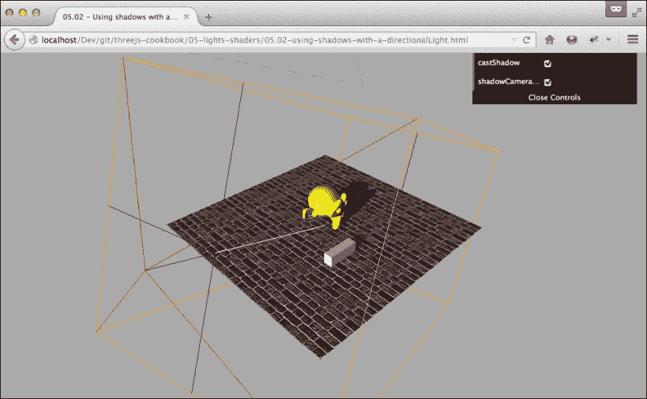

阴影只会在橙色框所包含的区域中渲染。

## 参见

+   在 Three.js 中，有两种可以投射阴影的光源：`THREE.SpotLight` 和 `THREE.DirectionalLight`。在 *使用 THREE.SpotLight 创建阴影* 的配方中，我们解释了如何使用 `THREE.SpotLight` 投射阴影。在 第四章 的 *使用阴影图创建固定阴影* 配方中，我们解释了另一种创建阴影的方法。

# 通过添加环境光照来柔化灯光

当你向场景中添加灯光时，结果可能看起来有点刺眼。你可以看到接受光照的区域和不接受光照的区域之间存在强烈的对比。当你观察现实生活中的照明时，一切都会显得柔和一些，几乎每个表面都会接收到一些光，通常是来自其他表面的反射。在这个配方中，我们将向你展示如何使用 `THREE.AmbientLight` 在你的场景中柔化灯光的使用。

## 准备工作

对于这个配方，没有需要准备的步骤。为了看到最终结果，我们提供了一个示例，你可以在浏览器中打开 `05.03-soften-lights.html` 示例来查看。你将看到以下截图类似的内容：

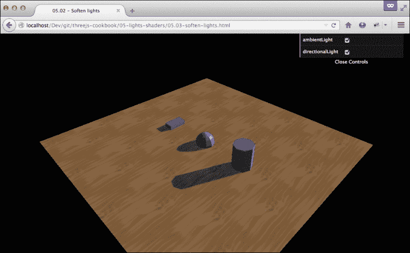

在右上角的菜单中，你可以启用或禁用 `THREE.AmbientLight` 来查看 `THREE.AmbientLight` 对象的效果。

## 如何操作...

`THREE.AmbientLight` 是最简单的灯光之一。因为它将光照应用到整个场景，所以不需要定位光源。你所要做的就是创建一个 `THREE.AmbientLight` 实例并将其添加到场景中：

1.  首先，创建 `THREE.AmbientLight` 的实例：

    ```js
      var ambientLight = new THREE.AmbientLight(0x332222);
    ```

    这将创建光源。当你创建环境光时，你可以指定其颜色为一个十六进制值。不要指定得太高；如果你这样做，你的整个场景将会非常明亮。

1.  剩下的唯一事情就是将这个灯光添加到场景中：

    ```js
      scene.add(ambientLight);
    ```

通过这两个非常简单的步骤，你就创建了 `THREE.AmbientLight`。

## 它是如何工作的...

`THREE.AmbientLight` 的工作方式非常简单。当你创建 `THREE.AmbientLight` 时，你将一个颜色（十六进制）传递给其构造函数。当场景渲染时，Three.js 只是将指定的颜色混合到你的网格的颜色中。

## 参见

+   尽管可以使用 `THREE.AmbientLight` 来柔化场景中的照明，但创建看起来自然的照明是困难的。在 *使用 THREE.HemisphereLight 进行自然照明* 的配方中，我们展示了如何使用不同的光源来创建自然的外部照明。

# 使用 THREE.HemisphereLight 进行自然照明

如果你观察外部的照明，你会看到灯光并不是真正来自单一方向。部分阳光被地球反射，其他部分被大气散射。结果是来自许多方向的一种非常柔和的光。在 Three.js 中，我们可以使用 `THREE.HemisphereLight` 创建类似的效果。

## 准备工作

就像 Three.js 提供的其他灯光一样，无需包含任何额外的 JavaScript 文件即可使用 `THREE.HemisphereLight`。你只需要一个包含一些对象的场景，然后就可以添加这个灯光。为了看到 `THREE.HemisphereLight` 对象的效果，我们提供了一个简单的示例。在浏览器中打开 `05.04-create-a-sun-like-light.html`。你将看到以下截图类似的内容：

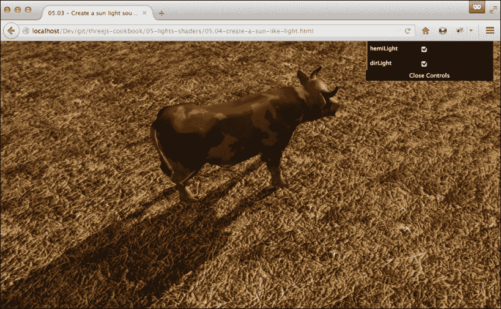

在右上角的控件中，你可以启用和禁用场景中使用的 `THREE.HemisphereLight` 和 `THREE.DirectionalLight`。

## 如何操作...

创建 `THREE.HemisphereLight` 的方法几乎与其他灯光相同：

1.  首先，你需要实例化一个 `THREE.HemisphereLight` 实例：

    ```js
      var hemiLight = new THREE.HemisphereLight(0xffffff, 0xffffff, 0.6 );
    ```

    第一个参数设置天空的颜色，第二个颜色设置从地板反射的颜色。在这两种情况下，我们只是设置了一种白光。通过最后一个属性，你可以控制 `THREE.HemisphereLight` 对象的强度。在这种情况下，我们将灯光减弱到 `0.6`。

1.  接下来，我们需要定位灯光：

    ```js
      hemiLight.position.set( 0, 500, 0 );
    ```

    当你定位 `THREE.HemisphereLight` 时，最好将其直接放置在场景上方以获得最佳效果。

1.  最后，在设置好位置后，最后一步是将灯光添加到场景中：

    ```js
      scene.add( hemiLight );
    ```

你可以将 `THREE.HemisphereLight` 作为场景的主光源，但通常情况下，这个光源会与另一个光源一起使用。为了获得最佳的户外效果，请与可以投射阴影的 `THREE.DirectionalLight` 一起使用。

## 它是如何工作的...

`THREE.HemisphereLight` 几乎等同于两个 `THREE.DirectionalLight` 对象：一个位于指定的位置，另一个位于完全相反的位置。因此，当场景渲染时，`THREE.HemisphereLight` 从顶部和相反方向照亮对象，以创建自然的外观效果。

## 还有更多…

当然，你也可以使用两个 `THREE.DirectionalLight` 对象来代替 `THREE.HemisphereLight`。经过仔细调整，你可以达到与使用 `THREE.HemisphereLight` 相同的效果。额外的优势是，你还可以使用这种方法创建非常微弱的阴影，因为 `THREE.DirectionalLight` 支持投射阴影，而 `THREE.HemisphereLight` 则不支持。

## 参见

+   在 *通过添加环境光照软化灯光* 的配方中，我们向您展示了一种更简单的方法来支持场景中的主光源。我们向您展示了如何使用 `THREE.AmbientLight` 作为额外的光源来软化灯光和阴影。

# 添加全方向移动的灯光

在很多情况下，你不需要投射阴影的光源，只需要照亮场景的光源。在 *使用 THREE.SpotLight 创建阴影* 和 *使用 THREE.DirectionalLight 创建阴影* 的食谱中，我们已经向你展示了如何使用 `THREE.SpotLight` 和 `THREE.DirectionalLight`。在这个食谱中，我们将展示第三种灯光，即 `THREE.PointLight`；这种灯光向所有方向发射光线，在这个食谱中，我们将向你展示如何创建一个并使其在场景中移动。

## 准备中

由于 Three.js 标准自带 `THREE.PointLight` 对象，因此不需要包含任何额外的 JavaScript。所有包含示例的食谱也是如此，你可以看到这个食谱的实际效果。对于这个食谱，请在浏览器中打开 `05.05-use-a-point-light.html` 示例，你会看到以下结果：

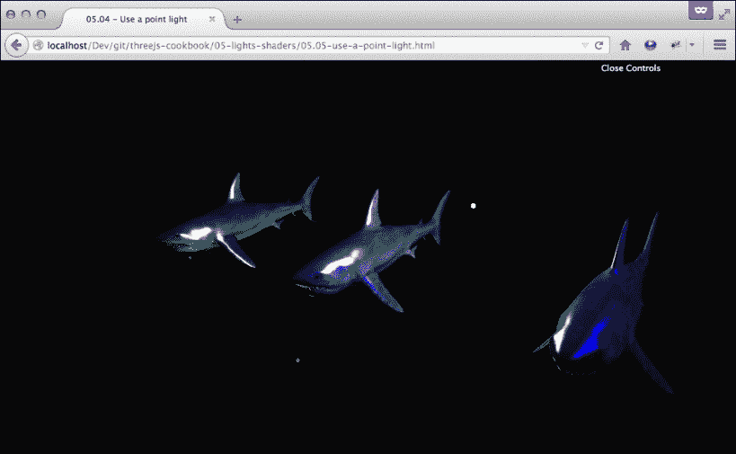

在这个例子中，有四个 `THREE.PointLight` 对象在三条鲨鱼模型之间从上到下移动。你可以使用鼠标在这个场景中移动，看看 `THREE.PointLight` 如何照亮模型。

## 如何操作...

创建一个移动的 `THREE.PointLight` 对象非常简单，只需几个步骤：

1.  首先要做的事情是创建一个 `THREE.PointLight` 实例：

    ```js
      var pointLight = new THREE.PointLight();
      pointLight.color = new THREE.Color(0xff0000);
      pointLight.intensity = 3;
      pointLight.distance = 60;
      pointLight.name = 'pointLight';
    ```

    使用 `color` 属性，我们设置 `THREE.PointLight` 对象发射的颜色，强度允许我们设置发射多少光线。最后，`distance` 属性用于计算被照亮的物体离灯光越远，强度降低的程度。在这种情况下，当距离灯光为 `60` 时，强度将为 `0`。

1.  `THREE.PointLight` 在所有方向上发射光线，因此我们需要设置 `position` 属性，然后我们可以将灯光添加到场景中：

    ```js
      pointLight.position = new THREE.Vector3(-30,0,0);
      scene.add(pointLight);
    ```

1.  对于这个食谱，我们最后需要做的是将 `THREE.PointLight` 在场景中移动。像所有动画一样，我们在渲染循环中这样做，通过在 `render` 函数中添加以下内容：

    ```js
      var light = scene.getObjectByName('pointLight');
      light.position.y = 15 * Math.sin(count+=0.005);
    ```

    在这个简短的代码片段中，我们首先获取 `THREE.PointLight` 对象的引用，然后更新其 `position.y` 属性。为了使这可行，我们还需要在 JavaScript 的顶部定义一个全局的 `count` 属性，如下所示：

    ```js
      var count = 0;
    ```

通过这些简单的步骤，你已经创建了 `THREE.PointLight`，它会在场景中上下移动。

## 它是如何工作的...

`THREE.PointLight` 在所有方向上发射光线；你可以将其与 `THREE.SpotLight` 进行比较，但拥有 360 度的视野。这也是为什么 `THREE.PointLight` 不能用来投射阴影的主要原因。由于 `THREE.PointLight` 发射了大量的光线，因此计算产生的阴影非常困难且资源密集。

因此，如果你想要阴影并且使用`THREE.PointLight`，你可以使用阴影贴图，如果你有一个静态的`THREE.PointLight`对象或额外的`THREE.SpotLight`对象，并且将其设置为仅通过`onlyShadow`属性投射阴影。

## 相关内容

有几个菜谱你可以参考这个菜谱：

+   在*使用 THREE.SpotLight 创建阴影*菜谱中，我们展示了如何使用`THREE.SpotLight`来创建阴影。你可以与`THREE.PointLight`一起使用。

+   在*使用 THREE.DirectionalLight 创建阴影*菜谱中，我们向你展示了如何设置和配置`THREE.DirectionalLight`。这种灯光可以投射阴影，可以与`THREE.PointLight`一起使用。

+   在第四章，*材质和纹理*中，我们展示了*使用阴影贴图创建固定阴影*菜谱。这个菜谱解释了如何使用阴影贴图来模拟阴影。如果你将这个菜谱与这个菜谱一起使用，你可以用它来模拟`THREE.PointLight`投射的阴影。

# 沿路径移动灯光源

在*添加一个全方向移动的灯光*菜谱中，我们将灯光源上下移动。虽然这些简单的路径通常已经足够，但在某些情况下，你可能希望对灯光源在场景中的移动有更多的控制。在这个菜谱中，我们将向你展示如何使灯光源沿着预定义的路径移动。

## 准备工作

要创建这个菜谱，我们将使用`THREE.SplineCurve3D`和`THREE.SpotLight`对象。由于这两个对象都包含在 Three.js 中，我们不需要采取任何准备步骤。然而，查看这个菜谱提供的示例是一个好主意，它将展示当你运行`05.06-move-a-light-through-the-scene.html`示例时，执行这个菜谱的步骤会得到什么结果：

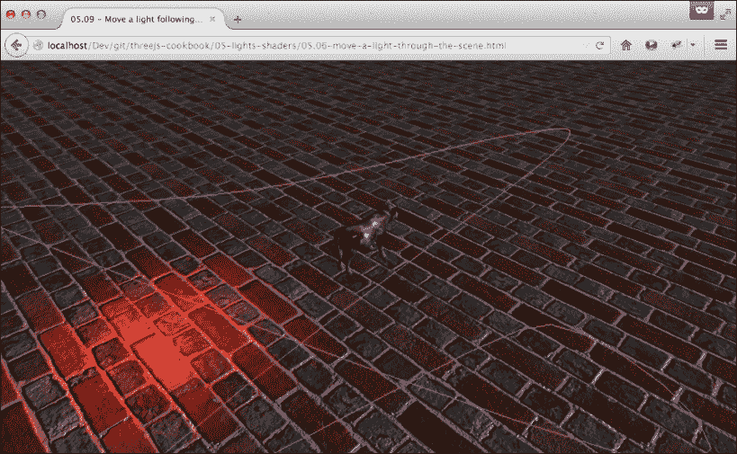

在截图上，你可以看到一个沿着紫色线条缓慢移动的光。在下一节中，我们将向你展示如何自己创建这样的效果。

## 如何操作...

对于这个菜谱，我们首先需要创建我们将要遵循的路径：

1.  对于这个路径，我们将创建`THREE.SplineCurve3`：

    ```js
      var spline = new THREE.SplineCurve3([
        new THREE.Vector3(-100, 20, 100),
        new THREE.Vector3(-40, 20, 20),
        new THREE.Vector3(0, 20, -100),
        new THREE.Vector3(20, 20, -100),
        new THREE.Vector3(40, 20, 100),
        new THREE.Vector3(70, 20, 10),
        new THREE.Vector3(100, 20, 30),
        new THREE.Vector3(-100, 20, 100)]);
    ```

    这将产生一个通过`THREE.SplineCurve3`对象构造函数中添加的点移动的曲线路径。

1.  在我们将灯光放置在`THREE.SplineCurve3`对象的路径上之前，让我们创建灯光：

    ```js
      var pointLight = new THREE.PointLight();
      pointLight.color = new THREE.Color(0xff0000);
      pointLight.intensity = 3;
      pointLight.distance = 60;
      pointlight.name = 'pointLight';
    ```

1.  现在，我们可以使用这个`SplineCurve3`对象来确定我们灯光的位置。为此，我们创建了一个名为`positionLight`的辅助函数：

    ```js
      var pos = 0;
      function positionLight() {
        light = scene.getObjectByName('pointLight');
        if (pos <= 1) {
          light.position = spline.getPointAt(pos);
          pos += 0.001
        } else {
          pos = 0;
        }
      }
    ```

    在这个函数中，我们使用`spline.getPointAt(pos)`来确定在`THREE.SplineCurve3`路径上的哪个位置放置我们的灯光。当`pos`为`0`时，我们在样条的起点，当`pos`为`1`时，我们在样条的终点。这样，我们以`0.001`的步长缓慢地移动灯光沿样条。

1.  剩下的就是从渲染函数中调用`positionLight`函数：

    ```js
      function render() {
        renderer.render(scene, camera);
        positionLight();
        orbit.update();
        requestAnimationFrame(render);
      }
    ```

由于渲染函数大约每秒调用 60 次，而我们为完整路径取了 1000 步，因此光线将在大约 17 秒内沿着完整路径移动。

## 它是如何工作的...

当你实例化一个 `THREE.SplineCurve3` 对象时，你传递一个 `THREE.Vector3` 对象的数组。Three.js 内部对这些点进行插值以创建一个穿过所有这些点的流畅曲线。一旦曲线创建完成，你有两种方式来获取位置。你可以使用 `getPointAt` 函数，就像我们在本配方中所做的那样，根据提供的参数获取相对位置，从 `0` 到 `1`，以及曲线的长度。或者，你也可以使用 `getPoints` 函数，其中你指定作为参数，线应该被分成多少点。

## 更多...

在本配方的 *准备工作* 部分，我们向你展示了光线在场景中移动的示例。你所看到的是，我们还展示了光线移动的路径。为了自己做到这一点，你可以使用创建的 `THREE.SplineCurve3` 对象的 `getPoints` 函数来创建一个 `THREE.Line` 对象：

```js
  var geometry = new THREE.Geometry();
  var splinePoints = spline.getPoints(50);
  var material = new THREE.LineBasicMaterial({
    color: 0xff00f0
  });
  geometry.vertices = splinePoints;
  var line = new THREE.Line(geometry, material);
  scene.add(line);
```

在这个配方中，我们使光线沿着特定的路径移动。然而，由于光线也是一个具有特定位置的对象，我们可以将这个相同的原理应用到场景中的所有其他对象上，例如 `THREE.Mesh`、`THREE.PerspectiveCamera` 或 `THREE.OrthographicCamera`。

# 使光源跟随对象

如果你场景中有一个你想要用聚光灯突出的移动对象，你需要能够改变光线指向的方向。在这个配方中，我们将向你展示如何做到这一点。我们将向你展示如何使场景中的 `THREE.SpotLight` 指向移动对象。

## 准备工作

运行这个配方不需要采取任何步骤。你可以在浏览器中打开 `05.07-make-a-light-follow-object.html` 示例来查看这个配方的最终结果。你将看到以下截图类似的内容：

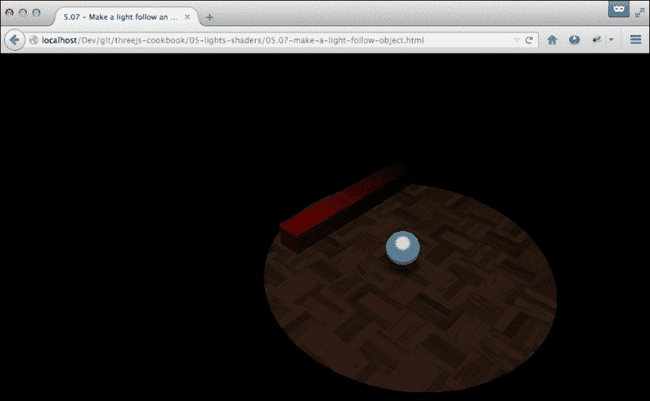

在这个例子中，你可以看到一个从左到右移动然后再返回的球体。场景中的 `THREE.SpotLight` 跟随这个球体的位置，使其始终直接指向该对象中心。

## 如何做到...

在 Three.js 中跟踪一个对象非常简单，只需要几个简单的步骤：

1.  我们需要做的第一件事是创建我们想要跟踪的对象。对于这个配方，这是 `THREE.SpotLight`：

    ```js
      var sphereGeometry = new THREE.SphereGeometry(1.5, 20,20);
      var matProps = {
        specular: 0xa9fcff,
        color: 0x00abb1,
        emissive: 0x006063,
        shininess: 10
      }
      var sphereMaterial = new THREE.MeshPhongMaterial(matProps);
      var sphereMesh = new THREE.Mesh(sphereGeometry, sphereMaterial);sphereMesh.name = 'sphere'; scene.add(sphereMesh);
    ```

1.  接下来，我们创建并添加 `THREE.SpotLight` 到场景中：

    ```js
      spotLight = new THREE.SpotLight();
      spotLight.position.set(20, 80, 30);
      spotLight.castShadow = true;
      spotLight.angle = 0.15;
      spotLight.distance = 160;
      scene.add(spotLight);
    ```

    注意，在这个步骤中，我们没有将创建的光指向球体。我们将在渲染循环的下一步中这样做。

1.  为了使光线指向球体，我们需要将 `target` 属性设置为正确的值。我们在场景的 `render` 函数中这样做：

    ```js
      var step = 0;
      function render() {
        step += 0.02;
        renderer.render(scene, camera);
        var sphere = scene.getObjectByName('sphere');
        sphere.position.x = 0 + (10 * (Math.cos(step)));
        sphere.position.y = 0.75 * Math.PI / 2 + (6 * Math.abs(Math.sin(step)));
        spotLight.target = sphere;
        requestAnimationFrame(render);
      }
    ```

    在最后一步中需要注意的一点是，我们将 `spotLight` 的目标属性设置为 `THREE.Mesh` 对象，而不是 `THREE.Mesh` 的位置属性。

## 更多...

要将 `THREE.SpotLight` 指向一个特定的位置，我们设置其 `target` 属性。正如你在食谱步骤中看到的，我们针对 `THREE.Object3D`，它是 `THREE.Mesh` 扩展的，而不是一个位置。如果我们想将 `THREE.SpotLight` 指向任意位置，我们需要首先创建一个空的 `THREE.Object3D` 对象：

```js
  var target = new THREE.Object3D();
  target.position = new THREE.Vector3(20,10,-10);
  scene.add(target);
  spotLight.target = target;
```

这样，你可以将 `THREE.SpotLight` 指向场景中的任意位置，而不仅仅是现有的对象。

## 相关内容

+   在这个食谱中，我们将灯光指向了特定的目标，我们也可以让相机围绕场景中的对象移动，就像我们在第三章的 *让相机跟随对象* 食谱中展示的那样，*与相机一起工作*，以及将一个对象指向另一个对象，就像在第二章的 *指向另一个对象* 食谱中展示的那样，*几何体和网格*。

# 创建自定义顶点着色器

当你想创建具有出色性能的高级 3D 效果时，你可以选择编写自己的着色器。**着色器**是直接影响你的结果看起来像什么以及用于表示它们的颜色的程序。着色器总是成对出现。顶点着色器确定几何体的外观，而片段着色器将确定最终的颜色。在这个食谱中，我们将向你展示如何在 Three.js 中使用你自己的自定义顶点着色器。

## 准备就绪

WebGL 和 GLSL，即你编写着色器的语言，被大多数现代浏览器支持。因此，对于这个食谱，在你开始这个食谱之前，不需要采取任何额外的步骤。关于 GLSL 的好资源总是 Khronos 网站 ([`www.khronos.org`](http://www.khronos.org))；他们有一个关于 WebGL 的优秀教程 ([`www.khronos.org/webgl/wiki/Tutorial`](http://www.khronos.org/webgl/wiki/Tutorial))，可以帮助你更好地理解在这个食谱中我们正在做什么。对于这个特定的食谱，我们提供了两个示例。第一个是我们将在本食谱中使用的示例，你可以通过在浏览器中打开 `05.09-custom-vertex-shader.html` 来查看这个示例。

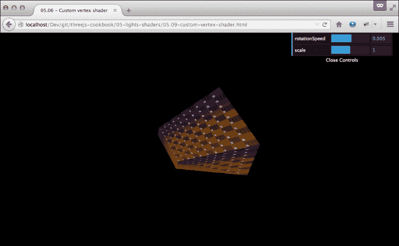

如前一个截图所示，这个示例展示了 `THREE.BoxGeometry`，其中其单个顶点的位置已被顶点着色器替换。一个更高级的示例可以在 `05.09-custom-vertex-shader-2.html` 中找到。

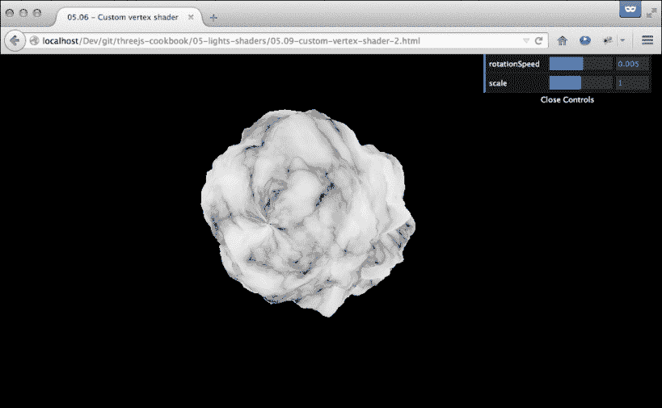

在这个例子中，我们再次改变了单个顶点的位置，但这次，我们使用 `THREE.SphereGeometry` 作为源，并结合一个 Perlin 噪声生成器。

## 如何操作...

要创建自定义顶点着色器，你需要遵循以下步骤：

1.  因为我们只想编写顶点着色器，我们将使用标准的片段着色器，这是 Three.js 中 `THREE.MeshBasicMaterial` 也使用的着色器。你可以通过从 `THREE.ShaderLib` 中选择正确的着色器来获取对这个着色器的引用：

    ```js
      var basicShader = THREE.ShaderLib['basic'];
    ```

1.  下一步是定义`Uniforms`对象。`Uniforms`是作为参数传递到着色器中的参数：

    ```js
      Var uniforms = {}
      uniforms = THREE.UniformsUtils.merge([basicShader.uniforms]);
      var texture = THREE.ImageUtils.loadTexture('../assets/textures/debug.png');
      uniforms['map'].value = texture;
      uniforms.delta = {type: 'f', value: 0.0};
      uniforms.scale = {type: 'f', value: 1.0};
    ```

    在这个代码片段中，我们首先`合并`了由片段着色器重用的标准统一变量，我们设置了一个纹理，最后两个统一变量是我们将在后面看到的自定义顶点着色器中访问的变量。

1.  现在，我们可以定义`THREE.ShaderMaterial`并告诉 Three.js 我们想要使用的着色器：

    ```js
      var defines = {};
      defines[ "USE_MAP" ] = "";
      var material = new THREE.ShaderMaterial({
        defines: defines,
        uniforms: uniforms,
        vertexShader: document getElementById('sinusVertexShader').text,
        fragmentShader: basicShader.fragmentShader
      });
    ```

    在这个代码片段中，你可以看到我们引用了在第 2 步中看到的`uniform`值，我们使用的`fragmentShader`是第 1 步中的`basicShader`，对于`vertexShader`参数，我们引用了我们将在下一步定义的自定义着色器。注意，我们还提供了一个`defines`元素；这是确保 Three.js 显示我们的纹理所必需的。

1.  到目前为止，我们可以定义我们自己的自定义顶点着色器。我们直接在 HTML 中这样做：

    ```js
      <script id="sinusVertexShader" type="x-shader/x-vertex">
        varying vec2 vUv;
        uniform float delta;
        uniform float scale;
        void main() {
          vUv = uv;
          vec3 p = position;
          p.z += sin(2.0 * p.y + delta) * 5.0;
          p.z += cos(2.0 * p.z + delta / 2.0) * 5.0;
          p.z += cos(2.0 * p.x + delta) * 5.0;
          p.x += sin(p.y + delta / 2.0) * 10.0;
          vec4 mvPosition = modelViewMatrix * vec4(scale * p, 1.0 );
          gl_Position = projectionMatrix * mvPosition;
        }
      </script>
    ```

    使用这个着色器，我们通过改变其位置中的`p.z`和`p.x`部分来改变顶点的位置。

1.  到目前为止，我们只需创建一个几何体，并使用我们在第 3 步中创建的材料：

    ```js
      var cubeGeometry = new THREE.BoxGeometry(5, 5, 5);
      var cube = new THREE.Mesh(cubeGeometry, material);
      scene.add(cube);
    ```

1.  如果你查看第 4 步中的着色器代码，你可以看到位置受到 delta 统一值的影响。我们使用`render`函数传递一个新的值给这个统一变量：

    ```js
      function render() {
        renderer.render(scene, camera);
        uniforms.delta.value += 0.01;
        requestAnimationFrame(render);
      }
    ```

这些都是你需要采取的步骤来创建和使用与简单的片段着色器结合的自定义顶点着色器。

## 它是如何工作的...

让我们更仔细地看看在这个食谱中使用的顶点着色器中发生了什么。在我们开始之前，我们将给你一个非常简短的介绍，说明你可以与着色器代码中的变量一起使用的限定符类型：

+   `uniform`限定符：这是一个全局变量，可以从 JavaScript 传递到着色器中。你可以在每个渲染循环中更改这个值，但不能在着色器本身中更改这个值。

+   `attribute`限定符：这是一个可以指定给每个单独顶点的值。`attributes`限定符被传递到顶点着色器中。

+   `varying`限定符：用于在顶点着色器和片段着色器之间传递数据。它可以在顶点着色器中写入，但只能在片段着色器中读取。

+   `const`限定符：这是一个常量值，它直接定义在你的着色器代码中。这个值在着色器执行过程中不能改变。

我们首先定义一些参数：

```js
  varying vec2 vUv;
  uniform float delta;
  uniform float scale;
```

`vUv`向量是一个变化变量，是一个传递到片段着色器中的值，对于 Three.js 中的基本着色器工作来说是必需的。其他两个参数作为统一变量从上一节中看到的 JavaScript 中传递进来。让我们看看主函数，这是为每个顶点执行的功能：

```js
  void main() {
    vUv = uv;
    vec3 p = position;
    p.z += sin(2.0 * p.y + delta) * 5.0;
    p.z += cos(2.0 * p.z + delta / 2.0) * 5.0;
    p.z += cos(2.0 * p.x + delta) * 5.0;
    p.x += sin(p.y + delta / 2.0) * 10.0;
    vec4 mvPosition = modelViewMatrix * vec4(scale * p, 1.0 );
    gl_Position = projectionMatrix * mvPosition;
  }
```

这里发生的主要事情是我们根据传入的 delta 值和一些`sin`和`cos`函数来改变顶点的位置。结果是我们的模型中的每个顶点都以某种方式偏移。最后，我们需要用我们顶点的新位置设置`gl_Position`变量。

## 还有更多...

当你寻找关于自定义着色器的信息时，你通常会看到片段着色器的示例。在许多用例中，顶点着色器不需要改变顶点的位置。当它确实需要改变时，通常是为了产生烟雾或火焰等效果。好的顶点着色器示例并不多。然而，以下两个网站提供了学习顶点着色器的良好起点：

+   想要了解更多关于顶点着色器的资源，可以参考来自 lighthouse3d 的着色器教程，链接为[`www.lighthouse3d.com/tutorials/glsl-tutorial/shader-examples/`](http://www.lighthouse3d.com/tutorials/glsl-tutorial/shader-examples/)

+   在 kickjs.org 上也有一个在线顶点着色器编辑器可用，你可以在这里找到它：[`www.kickjs.org/example/shader_editor/shader_editor.html`](http://www.kickjs.org/example/shader_editor/shader_editor.html)

## 参考资料也请查看

+   由于顶点着色器总是与片段着色器一起使用，因此了解它们的工作原理也是好的。在*创建自定义片段着色器*菜谱中，我们解释了你需要采取的步骤来设置自定义片段着色器。

# 创建自定义片段着色器

一个 WebGL 着色器始终由两部分组成：顶点着色器，它可以用来重新定位模型的各个顶点；以及片段着色器，它可以用来给模型添加颜色。在这个菜谱中，我们将向你展示使用自定义片段着色器所需的步骤。

## 准备中

在我们开始讨论片段着色器之前，有一件事你需要知道。就像顶点着色器一样，你不会用 JavaScript 编写片段着色器代码。这些着色器是用 GLSL 语言编写的。因此，如果你想了解更多关于这个例子中使用的函数和符号，请查看 WebGL 规范，可以在[`www.khronos.org/registry/webgl/specs/1.0/`](https://www.khronos.org/registry/webgl/specs/1.0/)找到。如果你想实验提供的着色器代码，你只需在浏览器中打开`05.10-custom-fragment-shader.html`即可。

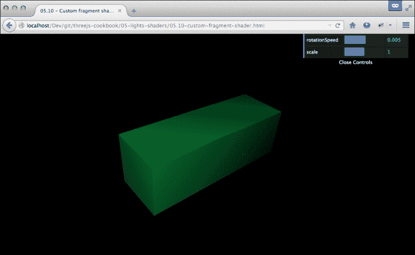

这个着色器根据法向量以及从相机到物体的距离来给物体上色。在接下来的章节中，我们将解释如何做到这一点。

## 如何做到这一点...

让我们从这个菜谱的 JavaScript 部分开始：

1.  着色器始终由顶点着色器和片段着色器组成。在这个菜谱中，我们将使用 Three.js 提供的标准顶点着色器，并为我们提供自己的自定义片段着色器。Three.js 将其所有着色器保存在`THREE.ShaderLib`中：

    ```js
      var basicShader = THREE.ShaderLib['normal'];
    ```

    在步骤 3 中，我们将引用这个`basicShader`对象来获取标准的顶点着色器。

1.  对于我们的自定义着色器，我们有一些配置选项。这些选项通过 uniform 传递到着色器中：

    ```js
      var uniforms = {};
      uniforms.delta = {type: 'f', value: 0.0};
      uniforms.mNear = { type: "f", value: 1.0 };
      uniforms.mFar = { type: "f", value: 60.0 };
    ```

    这意味着在我们的着色器代码中，我们可以访问`delta`、`mNear`和`mFar`值，这些都是浮点值，我们可以使用它们来计算我们想要渲染的颜色。

1.  接下来，我们可以创建着色器材料：

    ```js
      var material = new THREE.ShaderMaterial({
        uniforms: uniforms,
        vertexShader: basicShader.vertexShader,
        fragmentShader: document getElementById('simple-fragment').text,
      });
    ```

    在`THREE.ShaderMaterial`的配置中，我们引用了我们的`uniform`变量，Three.js 提供的标准顶点着色器`basicShader.vertexShader`以及我们自己的自定义片段着色器。我们将在第 5 步中展示我们自定义着色器的定义。

1.  我们最后需要做的是创建`THREE.BoxGeometry`并将其添加到场景中，使用上一步骤中创建的材料：

    ```js
      var boxGeometry = new THREE.BoxGeometry(5, 15, 5);
      var box = new THREE.Mesh(boxGeometry, material);
      scene.add(box);
    ```

1.  在第 3 步中，我们引用了一个具有简单片段名称的 DOM 元素。在你的 HTML 页面中，你应该这样定义它：

    ```js
      <script id="simple-fragment" type="x-shader/x-fragment">
        varying vec3 vNormal;
        uniform float delta;
        uniform float mNear;
        uniform float mFar;
        const float PI = 3.14159265358979323846264;
        void main()
        {
          float depth = gl_FragCoord.z / gl_FragCoord.w;
          float depthColor = smoothstep( mNear, mFar, depth );
          gl_FragColor = vec4(abs(sin(delta + 0.7*PI) + cos(normalize(vNormal).x)/2.0) - depthColor,abs(sin(delta + 1.0*PI) + cos(normalize(vNormal).y)/2.0) - depthColor,abs(sin(delta + 1.2*PI) + cos(normalize(vNormal).z)/2.0) – depthColor, 1.0);
        }
      </script>
    ```

    如果你想了解更多关于这个片段着色器的工作原理，请查看本食谱*如何工作...*部分中的解释。

1.  如果你已经查看了*准备就绪*部分中的示例，你可以看到颜色不断变化。这是因为我们在本页面的`render`循环中更新了 delta 属性，该属性传递到我们的自定义着色器中：

    ```js
      function render() {
        renderer.render(scene, camera);
     uniforms.delta.value += 0.005;
        requestAnimationFrame(render);
      }
    ```

## 它是如何工作的...

要了解这个着色器是如何工作的，让我们一步一步地查看代码。让我们首先看看在这个着色器中使用的变量：

```js
  varying vec3 vNormal;
  uniform float delta;
  uniform float mNear;
  uniform float mFar;
  float PI = 3.14159265358979323846264;
```

`vNormal`对象是一个从标准 Three.js 顶点着色器传入的变量，包含适用于此片段的法线向量的值。三个 uniform 值是从 JavaScript 传入的，正如我们在上一节中看到的。PI 变量是一个随时间不变的常数。每个片段着色器都应该设置`gl_fragColor`向量，该向量确定每个片段的颜色和透明度。对于这个着色器，我们设置向量如下：

```js
    void main()
    {
      float depth = gl_FragCoord.z / gl_FragCoord.w;
      float depthColor = smoothstep( mNear, mFar, depth );
      gl_FragColor = vec4(
        abs(sin(delta + 0.7*PI) + cos(normalize(vNormal).x)/2.0) – depthColor ,abs(sin(delta + 1.0*PI) + cos(normalize(vNormal).y)/2.0) – depthColor, abs(sin(delta + 1.2*PI) + cos(normalize(vNormal).z)/2.0) – depthColor, 1.0);
    }
```

不深入 GLSL 的细节，大致上采取以下步骤：

1.  首先，我们确定这个片段的深度。你可以将其视为这个片段与摄像机的距离。

1.  由于深度是一个绝对值，我们使用`smoothstep`函数将其转换为`0`到`1`的刻度。由于此函数也接受`mNear`和`mFar`统一变量作为其参数，我们可以通过 JavaScript 控制深度对片段颜色的影响程度。

1.  最后，我们通过设置`gl_FragColor`来定义片段的颜色。`gl_FragColor`变量是`vec4`类型，其中前三个值确定颜色的 RGB 值，最后一个值定义不透明度。这一切都是在`0`到`1`的刻度上。对于颜色的每一部分，我们使用一个包含`vNormal`向量和计算出的`depthColor`变量的函数来生成颜色。

这只是使用自定义片段着色器可以做到的事情的冰山一角。在接下来的部分中，你可以找到一些资源来了解更多关于这个的信息。

## 还有更多...

创建自定义片段着色器相当困难。这需要大量的实验、良好的数学掌握和大量的耐心。然而，有一些资源可以帮助您理解片段着色器并从他人的作品中学习：

+   您可以在 [`glslsandbox.com/`](http://glslsandbox.com/) 找到大量的片段着色器。

+   在 Shadertoy 网站上，您可以使用不同类型的输入进行片段着色器实验：[`www.shadertoy.com/`](https://www.shadertoy.com/)

+   您可以在 [`shdr.bkcore.com/`](http://shdr.bkcore.com/) 找到一个简单的在线着色器编辑器。

另一项极大的帮助可能是最新版本的 Firefox 开发者工具。这是一个特殊的 Firefox 版本，它提供了出色的调试支持，甚至包括一个着色器编辑器，您可以使用它来编辑着色器程序并直接查看结果。您可以从[`www.mozilla.org/en-US/firefox/developer/`](https://www.mozilla.org/en-US/firefox/developer/)下载这个版本。

当然，还有 khronos 网站 ([`www.khronos.org`](http://www.khronos.org))，这是一个查找特定函数实际做什么的极好资源。

## 参见

+   由于片段着色器总是与顶点着色器一起使用，因此了解它们的工作方式也是很好的。在 *创建自定义顶点着色器* 菜单中，我们解释了您需要采取的步骤来设置自定义顶点着色器。
