# 第七章：动画与物理

在这一章中，我们将介绍以下配方：

+   使用 Tween.js 创建动画

+   使用形变目标进行动画

+   使用骨骼进行动画

+   使用 Blender 创建的形变动画

+   使用 Blender 创建的骨骼动画

+   添加简单的碰撞检测

+   在 Chrome 中保存动画电影

+   在场景周围拖放对象

+   添加物理引擎

# 简介

在到目前为止的章节中，我们主要处理静态场景或有限动画的场景。在本章中，我们将向您展示一系列您可以用来使场景更加动态的配方。我们展示了关于如何添加高级动画、如何在场景周围拖放对象以及如何向场景添加物理效果（如重力碰撞检测）的配方。

# 使用 Tween.js 创建动画

在第一章，*入门*中，我们已经向你展示了如何设置动画循环，在第二章，*几何体和网格*中，我们展示了如何通过改变`THREE.Mesh`的属性来创建简单的动画。当你有很多或复杂的动画时，代码会迅速变得复杂，难以维护或理解。在这个配方中，我们将向你展示如何使用一个外部 JavaScript 库，它可以使动画的创建更容易、更易于维护。我们将使用**Tween.js**库来完成这个任务。

## 准备工作

对于这个配方，我们使用来自[`github.com/sole/tween.js/`](https://github.com/sole/tween.js/)的库。由于这是一个外部库，我们首先需要确保它包含在我们的 HTML 页面中。为此，首先在页面头部元素中添加以下内容：

```js
  <script src="img/tween.js"></script>
```

对于这个配方，我们将使用这个库创建一个简单的动画。如果你在浏览器中打开`07.01-animation-with-tweenjs.html`示例，你可以查看最终结果，它类似于以下截图所示：

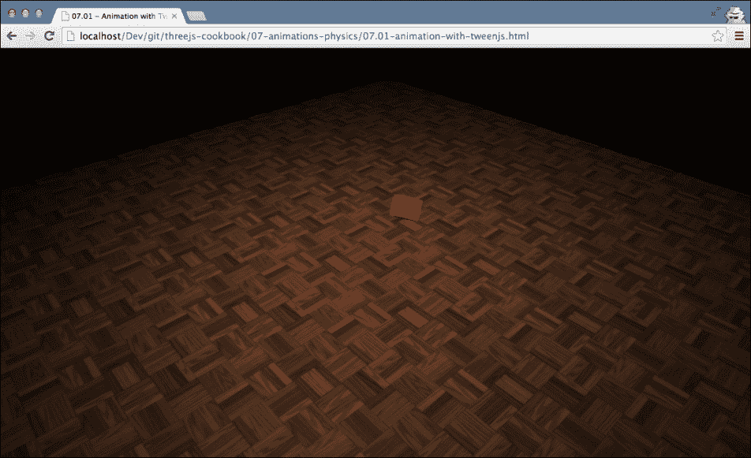

如果你在浏览器中打开这个示例，你会看到一个红色的立方体移动到不同的位置，并在移动过程中旋转。这个动画是通过`Tween.js`库配置的。

## 如何做…

一旦你将所需的库添加到你的 HTML 页面中，创建动画只需要几个简单的步骤：

1.  要使用这个库，我们首先需要创建一个`TWEEN.Tween`对象的实例：

    ```js
      var tween = new TWEEN.Tween({x:0 , y:1.25, z:0, rot: 0});
    ```

    这创建了一个`TWEEN.Tween`实例。我们可以使用这个实例将提供的属性从起始值（我们在这一步添加的值）移动到结束值。

1.  下一步是定义属性的靶值。我们通过使用`to`函数来完成：

    ```js
      tween.to({x:5, y:15, z:-10, rot: 2*Math.PI}, 5000);
    ```

    使用此功能，我们告诉`tween`对象，我们希望将构造函数中提供的值缓慢地改变到这些值。因此，我们将`x`属性从`0`改为`5`。第二个参数，即`5000`，定义了这种变化需要多少毫秒。

1.  我们还可以选择值随时间如何变化。例如，您可以使用线性缓动函数，它以恒定速率改变值，一个二次函数，它以小的变化开始并迅速增加，或者甚至使用一个在结束时弹跳（超过）的缓动函数。`TWEEN` 中预定义了更多缓动函数（有关更多信息，请参阅 *还有更多…* 部分）。您通过调用缓动函数来实现这一点：

    ```js
      tween.easing(TWEEN.Easing.Elastic.InOut);
    ```

1.  到目前为止，我们已经将这些属性的值从一值更改为另一值，但当一个值改变时，我们并没有真正做任何事情。在这个菜谱中，我们想要改变立方体的位置和旋转。您可以通过调用 `onUpdate` 函数并传入应在每次更改时调用的函数来实现这一点：

    ```js
      tween.onUpdate(function() {
        cube.position.set(this.x, this.y, this.z);
        cube.rotation.set(this.rot, this.rot, this.rot);
      });
    ```

    如您在这段代码片段中所见，我们使用提供的属性来设置立方体的旋转和位置属性。

1.  您可以在 `tween` 对象上使用许多其他设置来控制动画的行为。对于这个菜谱，我们告诉 `tween` 对象无限期地重复其动画，并使用一个每次重复时都会反转动画的悠悠球效果：

    ```js
      tween.repeat(Infinity);
      tween.yoyo(true);
    ```

1.  最后，我们可以通过调用起始函数来开始 `tween` 对象：

    ```js
      tween.start();
    ```

1.  在这一点上，您不会看到任何发生。您需要添加到 `render` 循环中的最后一个步骤是通知 `tween` 对象已经过去的时间，以便它可以计算您在步骤 1 中提供的属性的正确值：

    ```js
      TWEEN.update();
    ```

    这将更新您定义的所有 `TWEEN.Tween` 对象，并使用 `updated` 值调用 `onUpdate` 函数。

您定义起始值、结束值以及起始值应该如何过渡到结束值。

## 它是如何工作的…

每次调用 `TWEEN.update()` 时，`TWEEN` 库将确定从上一次调用 `TWEEN.update` 以来每个 `TWEEN.Tween` 对象（或对于第一次调用，从在 `TWEEN.Tween` 对象上调用 `start()` 以来）经过的时间。基于这个差异，`tween` 的起始时间和配置的 `easing` 属性，这个库会为传入的属性计算新的值。最后，它将调用传递给 `onUpdate()` 的函数，以便您可以对更改的值采取行动。

## 还有更多…

在这个菜谱中，我们没有展示您可以传递给 `TWEEN.Tween` 对象的所有配置。有关所有不同的缓动选项和 `TWEEN.Tween` 对象的其他属性的完整概述，请参阅 GitHub 项目网站 [`github.com/sole/tween.js/`](https://github.com/sole/tween.js/)。

在我们进入下一个菜谱之前，有一个关于 Tween.js 库的额外有趣方面。在我们的菜谱中，我们逐步配置了 `TWEEN.Tween` 对象。您也可以像这样在一次调用中配置对象：

```js
  var tween = new TWEEN.Tween({x:0 , y:1.25, z:0, rot: 0}).to({x:5, y:15, z:-10, rot: 2*Math.PI}, 5000).easing(TWEEN.Easing.Elastic.InOut).onUpdate(function() {
    cube.position.set(this.x, this.y, this.z);
    cube.rotation.set(this.rot, this.rot, this.rot);
  })
  .repeat(Infinity)
  .yoyo(true)
  .start();
```

这之所以可行，是因为 Tween.js 提供了一个流畅的 API。因此，对于每个函数调用，这个库都会返回原始的 `TWEEN.Tween` 对象。这意味着你可以像我们在前面的代码片段中那样轻松地链式调用。

## 相关内容

+   你可以在本书中几乎任何使用动画的地方使用 Tween.js 库。例如，在 第二章，*几何体和网格*中，我们展示了如何通过旋转对象绕其自身轴的食谱。旋转可以通过一个 `TWEEN.Tween` 对象轻松管理。在 第三章，*与相机一起工作*中，我们展示了如何在 *将相机缩放到对象* 食谱中放大对象。使用 Tween.js 库，我们可以轻松地动画化这个缩放功能。

# 使用形态目标进行动画化

在建模 3D 对象和角色时，通常有两种不同的创建动画的方式。你可以使用形态目标来动画化，或者使用基于骨骼和骨骼的动画。Three.js 促进了这两种方法。在本例中，我们将查看基于形态的动画。正如其名所示，基于形态的动画会将一个几何形状变形为另一个。这对于面部表情和其他非常详细的动画效果非常适用。

## 准备就绪

对于这个食谱，我们不需要任何额外的库，因为基于形态的动画由标准的 Three.js 分发支持。为了使这个食谱更易于理解，我们使用一个现有的 3D 模型来演示变形是如何工作的。当你打开浏览器中的 `07.02-animation-with-morphing.html` 示例时，你可以看到模型和可用的变形。你将看到以下截图所示的内容：

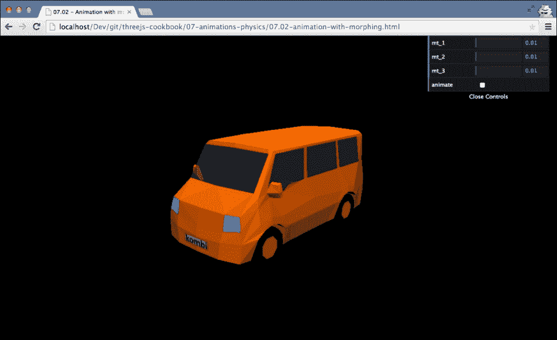

在这个例子中，你可以看到一个简单的汽车模型。使用右上角的滑块，你可以将这个汽车缓慢地变形为不同的模型，如下面的截图所示：

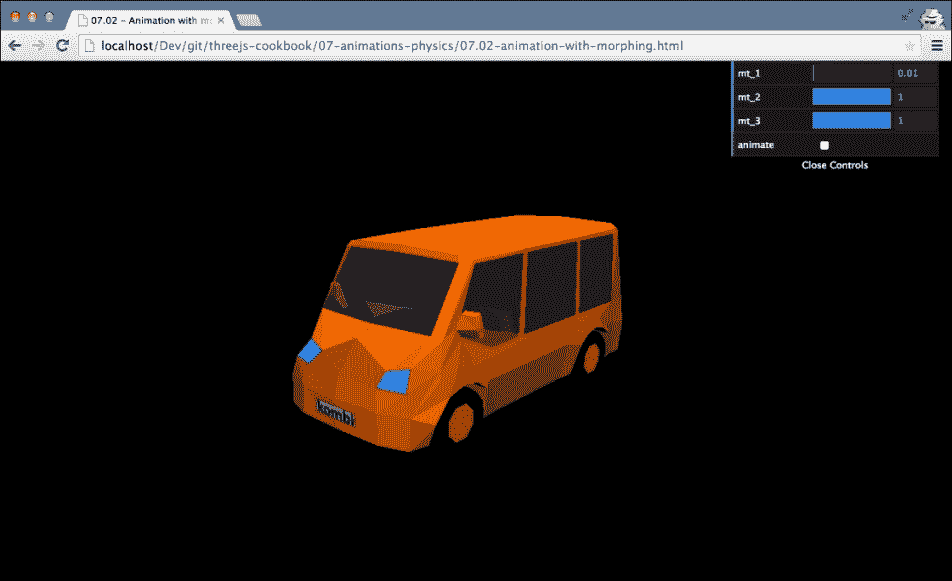

如果你勾选了 **animate** 复选框，一个自动变形的动画就会开始。

## 如何操作...

要使用变形动画，我们需要采取以下步骤：

1.  我们需要做的第一件事是加载包含形态目标的模型。对于这个食谱，我们有一个基于 `JSON` 的模型，我们这样加载它：

    ```js
      var jsonLoader = new THREE.JSONLoader();
      jsonLoader.load("../assets/models/morph/car.js",
      function(model, materials) {
        ...
      });
    ```

    在这里，我们使用 `THREE.JSONLoader` 来加载一个模型，一旦加载完成，我们就调用提供的函数。

1.  在我们创建 `THREE.Mesh` 之前，还有一步需要我们去做。我们需要将 `morphTargets` 属性设置为 `true` 的材质设置好：

    ```js
      materials.forEach(function(mat) {
        mat.morphTargets = true;
      });
    ```

1.  接下来，我们需要创建 `THREE.Mesh` 并将其添加到场景中：

    ```js
      car = new THREE.Mesh(model,new THREE.MeshFaceMaterial( materials ));
      scene.add(car);
    ```

    如你所见，我们遵循创建 `THREE.Mesh` 的标准方式，并将其添加到场景中，就像任何其他对象一样。

1.  现在我们已经有一个可以在场景中变形的对象，我们可以使用`morphTargetInfluences`属性来设置对象变形到特定方向的程度。在这个配方的示例中，我们使用 UI 来控制这个设置如下：

    ```js
      gui.add(control, 'mt_1', 0,1).step(0.01).listen().onChange(function(a){
        car.morphTargetInfluences[1] = a;
      });
      gui.add(control, 'mt_2', 0,1).step(0.01).listen().onChange(function(a){
        car.morphTargetInfluences[2] = a;
      });;
      gui.add(control, 'mt_3', 0,1).step(0.01).listen().onChange(function(a){
        car.morphTargetInfluences[3] = a;
      });
    ```

    在这个配方中，我们使用了具有四个形态目标（名称分别为`mt_0`、`mt_1`、`mt_2`和`mt_3`）的模型，其基础状态和三个其他汽车模型。通过增加其中一个其他模型的`morphTargetInfluence`对象，我们可以将模型变形到那个方向。

正如这个配方中所示，通过简单地改变一个特定的`morphTargetInfluences`值，你可以改变模型的外观。

## 它是如何工作的…

在支持多个形态目标的模型中，会存储额外的顶点集来表示每个目标的位置。因此，如果你有一个面部模型，它有一个微笑的形态目标、一个皱眉的形态目标和一个嘲笑的形态目标，你实际上存储了四倍的顶点位置。使用`morphTargetInfluences`属性，你可以告诉 Three.js 基础状态（`geometry.vertices`属性）应该向特定形态目标变形多远。然后 Three.js 将计算每个单独顶点的平均位置并渲染更新后的模型。一个非常有趣的事情是你可以组合形态目标。所以如果你有分别针对眼球运动和嘴部运动的独立形态目标，你可以轻松创建非常生动逼真的动画。

## 还有更多…

在这个配方中，我们加载了一个包含形态目标的模型。如果你已经有一个简单的几何体，你想用于基于形态的动画，你也可以轻松地做到这一点。例如，如果你有一个几何体，你可以使用以下代码添加`morphTargets`：

```js
  cubeGeometry.morphTargets[0] = {name: 't1', vertices:cubeTarget2.vertices};
  cubeGeometry.morphTargets[1] = {name: 't2', vertices:cubeTarget1.vertices};
```

这里的重要方面是确保你提供给`vertices`属性与`initial`几何体中相同的顶点数量。你现在可以使用`THREE.Mesh`上的`morphTargetInfluences`属性来控制各种目标之间的变形：

```js
  cube.morphTargetInfluences[0] = 0.4;
  cube.morphTargetInfluences[1] = 0.6;
```

## 参见

+   另一种动画模型的方法可以使用骨骼和骨头。我们在*使用骨骼进行动画*配方中解释了如何这样做。我们还在本章中提供了两个配方，其中我们在外部工具（在我们的例子中是 Blender）中定义基于形态和骨骼的动画，并在 Three.js 中播放动画。请参阅*使用在 Blender 中创建的形态动画*和*使用在 Blender 中创建的骨骼动画*配方以获取有关这些方法的更多信息。

# 使用骨骼进行动画

动画复杂模型的一种常见方法是使用骨骼和蒙皮。在这种方法中，我们定义一个几何体，添加一个骨骼，并将几何体绑定到该骨骼上。每当移动或旋转骨骼的任何一个部分时，几何体都会相应地变形。在这个配方中，我们将向您展示如何使用 Three.js 功能直接从 JavaScript 中移动和旋转骨骼。

## 准备工作

对于这个配方，我们使用一个外部模型，该模型已经包含我们可以移动的骨骼。为了加载此模型，我们使用`THREE.JSONLoader`，这是 Three.js 标准分布的一部分。因此，我们不需要导入任何额外的 JavaScript 文件来使这个配方工作。当然，我们提供了一个此配方在动作中的示例，您可以通过在浏览器中打开`07.03-animation-with-skeleton.html`示例来查看。您将看到以下截图所示的内容：

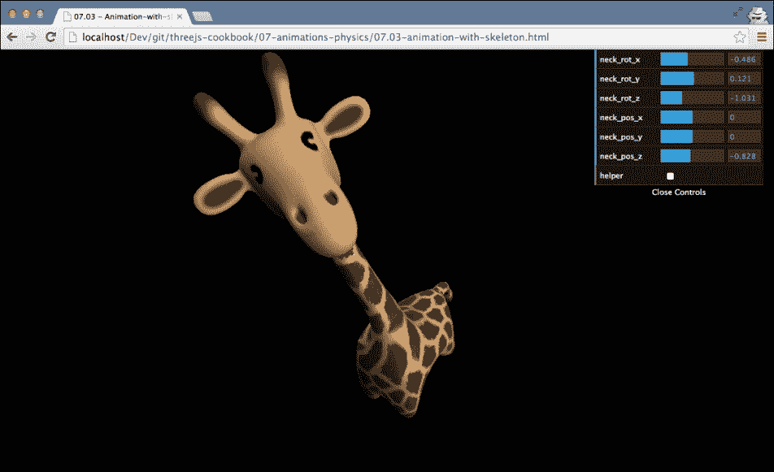

此示例向您展示了一头长颈鹿的模型，并提供了一个您可以用来移动颈部骨骼的界面。您可以更改颈部骨骼的旋转甚至其位置。当您这样做时，您会看到网格的一部分会响应该骨骼的运动。在这个配方中，我们将向您展示如何自己完成这项操作。

## 如何操作…

直接与骨骼一起工作并不困难，只需几个小步骤：

1.  我们需要做的第一件事是加载一个包含骨骼的模型。对于这个配方，我们再次使用`THREE.JSONLoader`：

    ```js
      var jsonLoader = new THREE.JSONLoader();
      jsonLoader.load("../assets/models/bones/giraffe.js",function(model, materials) {
        ...
      });
    ```

1.  一旦加载了步骤 1 中的模型，我们就可以设置材质并创建网格。让我们首先看看材质：

    ```js
      materials.forEach(function(mat) {
        mat.skinning = true;
      });
    ```

    在这里，我们将材质的`skinning`属性设置为`true`。这告诉 Three.js 该对象包含骨骼，当骨骼移动时，几何形状应该变形。

1.  接下来，我们创建网格并将其添加到场景中：

    ```js
      var giraffe = new THREE.SkinnedMesh(model, materials[0]);
      scene.add(giraffe);
    ```

    如您所见，我们为这个对象使用了不同类型的网格。我们使用的是`THREE.SkinnedMesh`对象，而不是`THREE.Mesh`对象。

1.  要访问骨骼，我们需要访问`THREE.SkinnedMesh`的子元素。如果骨骼没有明确命名，获取正确的骨骼进行动画可能需要进行一些实验。确定要使用哪个骨骼的最简单方法是查看 JavaScript 控制台的输出并浏览网格的子元素。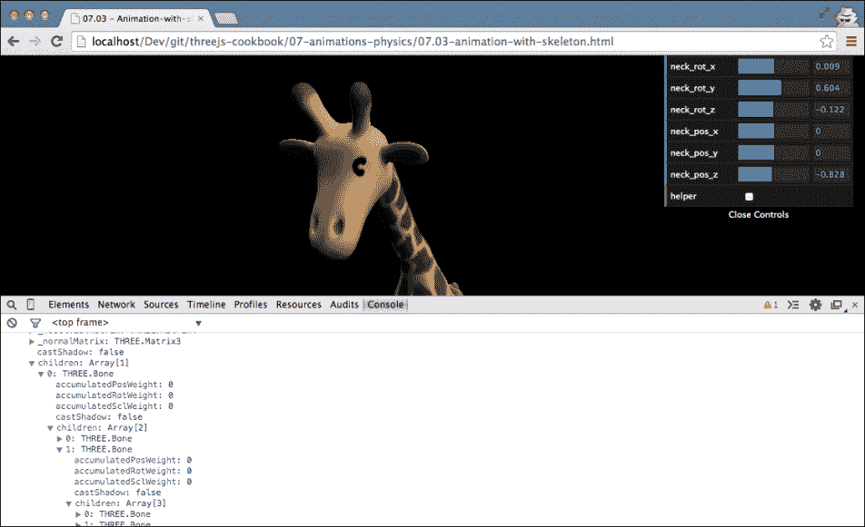

1.  在这种情况下，我们想要旋转尾巴骨骼并旋转和定位颈部。为此，我们在`render`循环中添加以下内容：

    ```js
      // the neck bone
      giraffe.children[0].children[1].children[0].children[0].rotation.x = control.neck_rot_x;
      giraffe.children[0].children[1].children[0].children[0].rotation.y = control.neck_rot_y;
      giraffe.children[0].children[1].children[0].children[0].rotation.z = control.neck_rot_z;
      giraffe.children[0].children[1].children[0].children[0].position.x = control.neck_pos_x;
      giraffe.children[0].children[1].children[0].children[0].position.y = control.neck_pos_y;
      giraffe.children[0].children[1].children[0].children[0].position.z = control.neck_pos_z;
      // the tail bone
      giraffe.children[0].children[0].children[0].rotation.z -= 0.1
    ```

    就这样！每当我们现在更改之前代码片段中使用的骨骼的位置或旋转时，几何形状将相应地变形。

与骨骼一起工作并不困难，但选择要更改和移动的正确骨骼可能需要一些实验。

## 它是如何工作的…

当你在材质上启用`skinning`属性时，Three.js 会将有关相关骨骼和位置的所有信息传递到其顶点着色器中。顶点着色器将使用这些信息根据相关骨骼的位置和旋转将顶点定位到新位置。更多信息和关于如何从顶点着色器执行骨骼动画的良好介绍可以在 OpenGL 网站上找到，链接为[`www.opengl.org/wiki/Skeletal_Animation`](https://www.opengl.org/wiki/Skeletal_Animation)。

## 还有更多…

如果你想快速了解模型中骨骼的排列方式，你可以使用 Three.js 提供的特定辅助类。以下代码片段展示了如何为我们在本配方中使用的模型创建`THREE.SkeletonHelper`：

```js
  var helper = new THREE.SkeletonHelper(giraffe);
  scene.add(helper);
```

这将可视化模型的骨骼，如下面的截图所示：

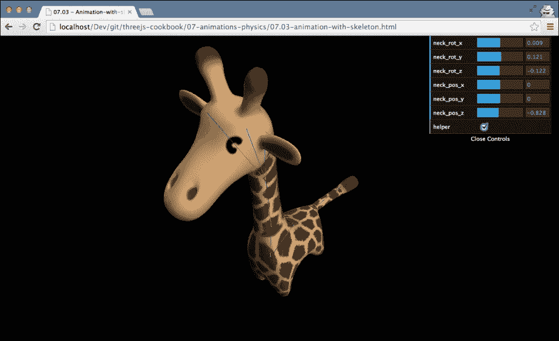

如果你移动骨骼，就像我们在配方中所做的那样，你还需要在你的`render`循环中添加以下行：

```js
  helper.update();
```

这样，`THREE.SkeletonHelper`将始终反映模型的最新状态。

## 参见

+   使用形态目标来动画化模型是一种更简单的方法。我们在“使用形态目标进行动画”的配方中解释了如何做到这一点。在本章中，我们还提供了两个配方，其中我们在外部工具（在我们的例子中是 Blender）中定义基于形态和骨骼的动画，并在 Three.js 中播放动画。有关这些方法的更多信息，请参阅“使用在 Blender 中创建的形态动画”和“使用在 Blender 中创建的骨骼动画”配方。

# 使用在 Blender 中创建的形态动画

在 Three.js 中手动创建形态动画是困难的。简单的变换可能可以处理，但通过编程创建高级动画非常困难。幸运的是，有许多外部 3D 程序可以用来创建模型和动画。在本配方中，我们将使用 Blender，我们在第二章，“几何体和网格”中已经使用过，来创建基于形态的动画，并使用 Three.js 回放。

## 准备中

要使用此配方，你必须安装 Blender 并启用 Three.js 导出插件。我们已经在第二章，“几何体和网格”中的“创建和导出从 Blender 模型”配方中解释了如何做到这一点。所以如果你还没有这样做，你应该首先安装 Blender，然后安装 Three.js 导出插件。一旦安装了 Blender，你应该创建一个使用形状键定义各种格式的动画。这超出了本书的范围，但为了确保，你可以测试本配方中解释的步骤——我们包含了一个 Blender 文件，它包含一个基于最小形状键的动画。所以在我们开始配方之前，我们将加载示例 Blender 模型。

为了做到这一点，请按照以下步骤操作：

1.  打开**Blender**并导航到**文件** | **打开**。

1.  在打开的窗口中，导航到与本书提供的资源，并打开位于`assets/models/blender`目录中的`simplemorph.blend`文件。

1.  一旦打开此文件，你将看到一个立方体位于一个空场景的中心，就像这样：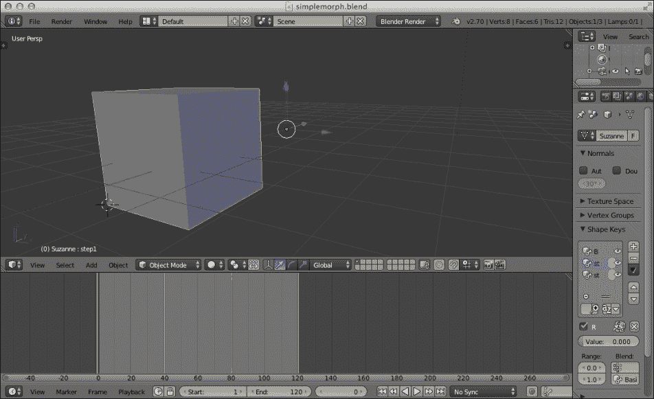

    这是我们开始配方的起点。

1.  如果你想要预览我们在这里创建的（非常简单）动画，只需点击**播放**按钮或使用*Alt* + *A*键组合。

1.  我们将在 Three.js 中加载此文件并播放我们在 Blender 中创建的动画。要查看最终结果，在你的浏览器中打开`07.04-create-morph-in-blender.html`示例。你将看到以下截图所示的内容：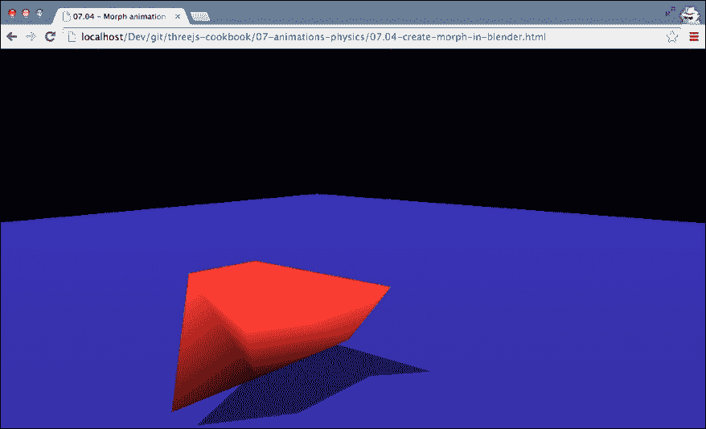

    你将看到一个使用形态目标（在 Blender 中定义为形状键）来将一个立方体变形为不同形状的动画立方体。

## 如何操作…

如果你已经按照本食谱中*准备就绪*部分所解释的步骤进行，你将看到一个简单的 Blender 工作区，其中有一个立方体和一个动画，该动画使用一系列形状键缓慢地变形立方体。要从 Blender 导出此动画并在 Three.js 中使用它，我们需要采取几个步骤：

1.  我们需要做的第一件事是导出模型和动画，这样我们就可以在 Three.js 中加载它。为此，导航到**文件** | **导出** | **Three.js**。

1.  在打开的窗口中，我们可以选择一个目的地和文件名。对于这个食谱，将文件命名为`simplemorph.js`并将目的地设置为`assets/models/morph`文件夹。

1.  在我们点击**导出**按钮之前，我们需要配置一些 Three.js 特定的属性。你可以在**导出 Three.js**部分的左侧面板中这样做。在该部分中，确保选中**形态动画**复选框。一旦选中复选框，点击**导出**按钮。

1.  现在我们已经完成了在 Blender 中的工作，可以加载导出的模型到 Three.js 中。为此，我们使用`THREE.JSONLoader`，如下所示：

    ```js
      var loader = new THREE.JSONLoader();
      loader.load("../assets/models/morph/simplemorph.js",function(model){
        ...
      });
    ```

    在这个代码片段中，我们使用`THREE.JSONLoader`加载模型。

1.  一旦模型被加载，我们需要创建一个材质，其中需要将`morphTargets`属性设置为`true`：

    ```js
      var mat = new THREE.MeshLambertMaterial({color: 0xff3333, morphTargets:true})
    ```

1.  使用这种材质，我们可以创建要添加到场景中的网格。这次，因为我们想使用从 Blender 提供的动画，我们创建`THREE.MorphAnimMesh`并将其添加到场景中：

    ```js
      mesh = new THREE.MorphAnimMesh(model, mat);
      mesh.castShadow = true;
      scene.add(mesh);
    ```

1.  在我们可以播放动画之前，我们需要采取最后一步：

    ```js
      mesh.parseAnimations();
      mesh.playAnimation('animation', 20);
      mesh.duration = 10;
      render();
    ```

    使用`parseAnimation()`函数，Three.js 将解析模型中提供的形态目标元素的名称，并使用它来创建一个动画。当你使用 Blender 中的 Three.js 插件导出时，动画的名称是`animation`。要播放动画，我们调用`playAnimation`函数，传入动画名称和帧率，最后设置动画的持续时间（以秒为单位）。请注意，你并不总是需要设置动画的持续时间。在某些情况下，模型本身提供了持续时间。

1.  我们需要在`render`函数本身中进行最后的更改：

    ```js
      var t = new THREE.Clock();
      function render() {
        renderer.render(scene, camera);
        mesh.updateAnimation(t.getDelta());
        requestAnimationFrame(render);
      }
    ```

    在这里，我们创建一个全局的`THREE.Clock()`实例，我们使用它来确定在连续调用`render`函数之间经过的时间。这个实例被传递到`THREE.MorphAnimMesh`的`updateAnimation`函数中，以便它可以计算要显示的帧。

如你所见，从 Blender 将动画播放到 Three.js 中并不困难。然而，这里需要注意的是，当模型具有高顶点数时，这可能会导致文件变得非常大。这是因为 Blender 导出插件为动画的每一帧创建一个新的形态目标。

## 更多内容…

在这个菜谱中，我们使用了 Blender 的 Three.js 导出功能来保存模型，以便 `THREE.JSONLoader` 可以加载。还有大量其他 3D 格式可供使用，可以用来存储 Three.js 支持的 3D 场景和动画。Three.js 中可用的文件格式概述可以在 [`github.com/mrdoob/three.js/tree/master/examples/js/loaders`](https://github.com/mrdoob/three.js/tree/master/examples/js/loaders) 的 Three.js GitHub 网站上找到。

## 相关内容

在这一章中，我们还有一些其他与动画相关的菜谱：

+   *使用形态目标进行动画制作*

+   *使用骨骼的动画*

+   *使用在 Blender 中创建的骨骼动画*

# 使用在 Blender 中创建的骨骼动画

在 *使用骨骼的动画* 菜单中，我们通过直接改变模型骨骼的位置和旋转来动画化一个模型。这在交互式场景中效果很好，但并不是创建动画的实用方法。使用 Blender 和其他 3D 工具，你可以获得一套创建基于特定骨骼和一系列骨骼的动画的工具。在这个菜谱中，我们将向你展示如何播放一个在 Blender 中创建的基于骨骼的动画。

## 准备中

要使用此菜谱，你需要安装 Blender 并启用 Three.js 导出插件。如果你还没有这样做，请按照 第二章 中 *从 Blender 创建和导出模型* 菜谱的步骤进行操作，*几何体和网格*。一旦 Blender 和 Three.js 导出插件已安装，我们需要创建一个基于骨骼的动画。在 Blender 中创建这个动画超出了本书的范围，因此我们提供了一个现有的模型来演示这个菜谱。要开始，请执行以下步骤：

1.  打开 **Blender** 并导航到 **文件** | **打开**。

1.  在打开的窗口中，导航到书中提供的资源并打开 `assets/models/blender` 目录中的 `crow-skeleton.blend` 文件。

1.  一旦打开此文件，你将看到一个乌鸦位于一个空场景的中心，如下所示：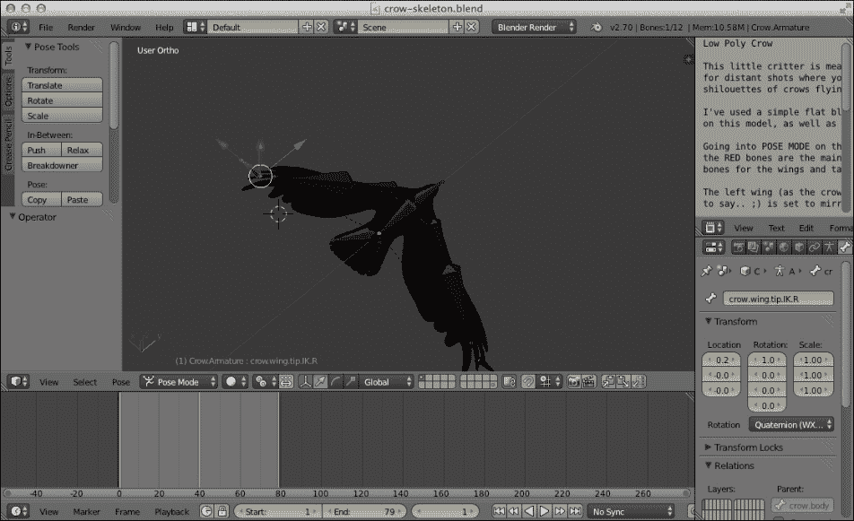

    这是本菜谱的起点。

1.  如果你想要预览乌鸦动画，请点击**播放**按钮或使用 *Alt* + *A* 键组合。

我们还提供了一个示例，你可以在浏览器中打开以查看 Three.js 场景中的相同动画。当你打开浏览器中的 `07.05-create-skeleton-animation-in-blender.html` 示例时，你应该会看到如下内容：

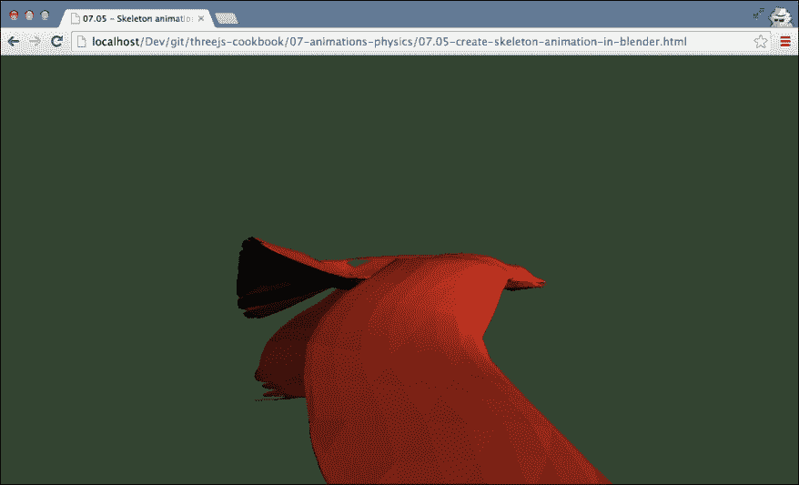

## 如何操作…

在我们能够在 Three.js 中使用模型之前，我们首先必须从 Blender 中导出它：

1.  要开始导出，首先导航到 **文件** | **导出** | **Three.js**。

1.  在打开的窗口中，我们可以选择一个目的地和文件名。对于这个食谱，将文件命名为 `crow.js` 并将目的地设置为 `assets/models/bones` 文件夹。

1.  在我们点击 **导出** 按钮之前，我们需要配置一些 Three.js 特定的属性。你可以在 **导出 Three.js** 部分的左侧面板中完成此操作。在该部分中，确保选中 **骨骼**、**皮肤** 和 **骨骼动画** 复选框。如果选中了 **形变动画** 复选框，请禁用它。一旦选中复选框，点击 **导出** 按钮。

1.  现在我们已经导出了模型，在 Three.js 中我们需要做的第一件事是使用 `THREE.JSONLoader` 加载模型：

    ```js
      var loader = new THREE.JSONLoader();
      loader.load("../assets/models/bones/crow.js",function(model){
        ...
      });
    ```

1.  一旦模型在 Three.js 中加载，我们就可以处理它了。从 `loader.load` 函数的回调中，我们首先做的事情是设置材质：

    ```js
      var mat = new THREE.MeshLambertMaterial({color: 0xf33f33,shading: THREE.FlatShading, skinning:true})
    ```

    这只是一个标准的 `THREE.MeshLambertMaterial` 对象。你需要确保的唯一事情是将材质的 `skinning` 属性设置为 `true`。

1.  现在我们已经得到了模型和材质，我们可以创建一个网格。由于我们正在处理骨骼，我们需要创建 `THREE.SkinnedMesh`：

    ```js
      mesh = new THREE.SkinnedMesh(model, mat);
    ```

1.  接下来，我们需要选择我们想要播放的动画。为此，你可以使用以下代码片段：

    ```js
      model.animation = "Crow.ArmatureAction";
      THREE.AnimationHandler.add(model.animations[0]);
      var animation = new THREE.Animation(mesh, model.animation );
      animation.play();
    ```

    你需要确保 `animation` 属性包含 `model.animations` 数组中某个动画的名称。在这种情况下，我们只有一个名为 `Crow.ArmatureAction` 的动画。基于骨骼的动画使用 `THREE.AnimationHandler` 处理。因此，我们将我们的模型中的动画添加到处理器中。接下来，我们需要创建一个 `THREE.Animation` 实例。该对象将我们的模型与想要播放的动画结合起来。当我们拥有这个对象时，我们可以调用 `play()` 函数来告诉 Three.js 播放动画。

1.  在动画播放之前，我们需要采取的最后一步是更新 `render` 循环：

    ```js
      var t = new THREE.Clock();
      function render() {
        renderer.render(scene, camera);
        THREE.AnimationHandler.update( t.getDelta() );
        requestAnimationFrame(render);
      }
    ```

    在这里，我们使用 `THREE.Clock()` 来确定这一帧和前一帧之间经过的时间 (`t.getDelta()`)。这个值被传递到 `THREE.AnimationHandler` 中，以更新所有注册的动画并移动网格到正确的位置。

## 它是如何工作的…

当导出动画时，Three.js 导出器将输出我们在 Blender 中指定的时刻骨骼的位置和旋转。然后，这些信息可以直接在 Three.js 中使用，以确定播放动画时骨骼的位置和旋转。这样，我们可以在不创建大型模型文件的情况下创建相当复杂的动画。

## 还有更多...

在 Blender 中处理骨骼并从中创建动画是一个被广泛讨论的主题。如果你对学习如何绑定模型和创建基于骨骼的动画感兴趣，以下是一些不错的起点资源：

+   Blender 教程：角色绑定基础[`www.youtube.com/watch?v=cGvalWG8HBU`](http://www.youtube.com/watch?v=cGvalWG8HBU)

+   Blender 手册：绑定[`wiki.blender.org/index.php/Doc:2.6/Manual/Rigging`](http://wiki.blender.org/index.php/Doc:2.6/Manual/Rigging)

+   Blender 大师：绑定介绍[`www.blenderguru.com/tutorials/introduction-to-rigging`](http://www.blenderguru.com/tutorials/introduction-to-rigging)

+   在 Blender 中构建基本低多边形角色绑定[`cgi.tutsplus.com/tutorials/building-a-basic-low-poly-character-rig-in-blender--cg-16955`](http://cgi.tutsplus.com/tutorials/building-a-basic-low-poly-character-rig-in-blender--cg-16955)

## 参见

在这一章中，我们还有一些其他处理动画的配方：

+   *使用形态目标进行动画*

+   *使用骨骼进行动画*

+   *使用 Blender 创建的形态动画*

# 添加简单的碰撞检测

当你创建游戏或交互式环境时，一个常见的需求是检测对象之间的碰撞。在*添加物理引擎*的配方中，我们使用外部库来处理碰撞（以及其他物理）。然而，如果你只需要检测碰撞的选项，这却是一个相当重的解决方案。在这个配方中，我们提供了一个简单的方案，如果你想在不需要使用外部库的情况下检测碰撞，你可以使用它。

## 准备工作

在这个配方中，我们使用`THREE.Raycaster`来检查碰撞。这个对象由标准的 Three.js 分发提供，所以你不需要任何额外的库。我们提供了一个简单的示例，展示了如何应用这个配方。为此，在你的浏览器中打开`07.06-add-simple-detection-collision.html`示例，你将看到以下截图所示的内容：

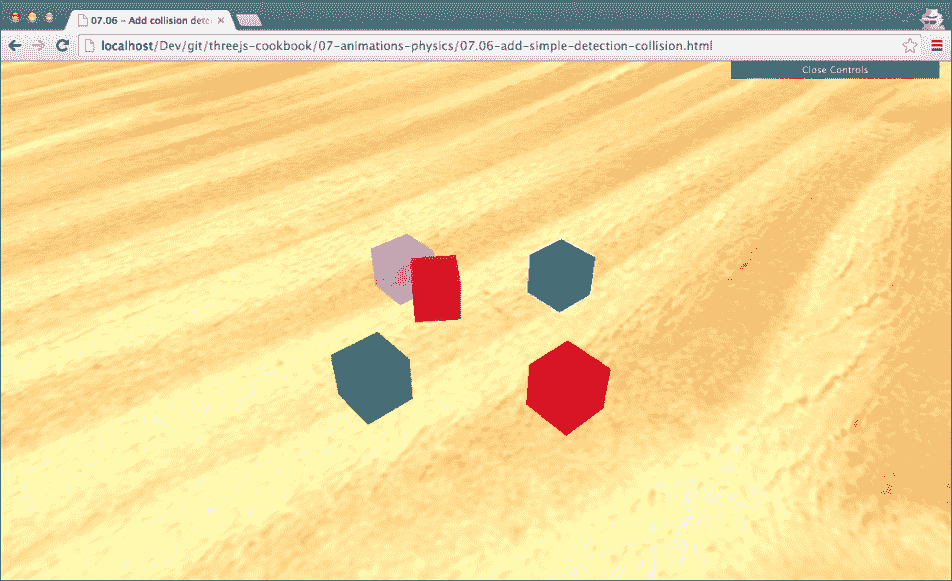

在这个示例中，你可以使用箭头键移动中央立方体，并使用*a*和*b*键绕*y*轴旋转它。每当与其他立方体发生碰撞时，我们将改变不透明度以指示碰撞。

## 如何做…

要实现碰撞检测，我们需要采取几个步骤：

1.  让我们从简单开始，创建我们将要移动的立方体。我们将检测这个立方体与我们定义的第 2 步中的立方体之间的碰撞：

    ```js
      var cubeGeometry = new THREE.BoxGeometry(2, 2, 2);
      var cubeMaterial = new THREE.MeshLambertMaterial({color: 0xff2255});
    var cube = new THREE.Mesh(cubeGeometry, cubeMaterial);
    cube.name='cube';
    scene.add(cube);
    ```

1.  现在，让我们创建一个数组来存储我们可以与之碰撞的所有对象，并向该数组添加一些立方体：

    ```js
    var cubes = [];
    var cubeMaterial2 = new THREE.MeshLambertMaterial({color: 0xff0000});
    var cube2 = new THREE.Mesh(cubeGeometry, cubeMaterial2);
    cube2.position.set(5,0,0);
    cube2.name='cube-red';
    scene.add(cube2);
    cubes.push(cube2);
    ...
    var cubeMaterial5 = new THREE.MeshLambertMaterial({color: 0xff00ff});
    var cube5 = new THREE.Mesh(cubeGeometry, cubeMaterial5);
    cube5.position.set(-5,0,0);
    cube5.name='cube-purple';
    scene.add(cube5);
    cubes.push(cube5);
    ```

1.  现在我们已经得到了可以移动的对象和可以检测碰撞的对象，我们可以添加代码来检测碰撞。在`render`循环中，我们需要添加以下内容：

    ```js
    // reset the opacity at the beginning of the loop
    cubes.forEach(function(cube){
        cube.material.transparent = false;
        cube.material.opacity = 1.0;

    });

    var cube = scene.getObjectByName('cube');
    var originPoint = cube.position.clone();

    for (var vertexIndex = 0; 
             vertexIndex < cube.geometry.vertices.length;
             vertexIndex++) {
        var localVertex = cube.geometry.
        vertices[vertexIndex].clone();
        var globalVertex = localVertex.applyMatrix4( 
                              cube.matrix);
        var directionVector = globalVertex.sub( 
                              cube.position);

        var ray = new THREE.Raycaster( 
                       originPoint,
                       directionVector.clone().normalize() );
        var collisionResults = ray.intersectObjects( cubes );
        if ( collisionResults.length > 0 
                     && collisionResults[0].distance < 
                             directionVector.length() ) {
             collisionResults[0].object
                        .material.transparent = true;
            collisionResults[0]
                        .object.material.opacity = 0.4;
        }
    }
    ```

    在这段代码中，我们简单地检查我们移动的立方体的一个顶点是否与`cubes`数组中的任何立方体相交。如果我们检测到碰撞，我们将改变与之碰撞的立方体的不透明度。

通过这些步骤，我们得到了一个基本的碰撞检测解决方案。这种方法非常适合检测平面物体之间的碰撞，但可能会错过类似小尖刺状物体的检测。你可以通过检查更多顶点来增强这个解决方案。例如，你可以通过增加立方体的`widthSegments`、`heightSegments`和`depthSegments`对象来添加更多顶点，或者你可以自己计算中间顶点。

## 它是如何工作的…

在这种方法中检测碰撞时，我们使用`THREE.RayCaster`从移动的立方体的中心向每个顶点发射射线。如果这条射线与从中心到顶点的路径上的`cubes`数组中的其他立方体相交，这意味着其中一个顶点位于另一个立方体内部。我们将此解释为碰撞，并可以采取适当的行动。

## 还有更多…

这个配方基于 Lee Stemkoski 所做的大量工作，他在 [`stemkoski.github.io/Three.js/Collision-Detection.html`](http://stemkoski.github.io/Three.js/Collision-Detection.html) 上提供了一个这种方法的初始实现。除了基于射线的碰撞检测方法之外，当然还有其他方法。一个非常常见的方法是使用网格的边界框来检测两个网格是否接触。Three.js 甚至在其`THREE.Box3`对象中提供了一个名为`isIntersectionBox`的函数。由于使用射线投射方法检测碰撞是一种计算成本相当高的方式，因此通常首先使用边界框方法，然后使用更精确的射线投射方法。

关于这种方法的几个好资源可以在这里找到：

+   *3D 理论 - 碰撞检测* 在 [`www.euclideanspace.com/threed/animation/collisiondetect/`](http://www.euclideanspace.com/threed/animation/collisiondetect/)

+   *C++中的 AABB 到 AABB 检测* 在 [`www.miguelcasillas.com/?p=30`](http://www.miguelcasillas.com/?p=30)

+   *使用扫掠 AABB 边界框进行 3D 碰撞检测和解决* 在 [`techny.tumblr.com/post/42125198333/3d-collision-detection-and-resolution-using-sweeping`](http://techny.tumblr.com/post/42125198333/3d-collision-detection-and-resolution-using-sweeping)

在 *添加物理引擎* 的配方中，我们将使用的物理引擎也采用基于形状的碰撞检测方法。除了边界框之外，它还提供了一系列不同的形状来检测碰撞。

## 参见

+   在 *添加物理引擎* 的配方中，我们使用物理引擎来检测碰撞。对于另一个使用`THREE.RayCaster`的配方，你也可以查看 *在场景中拖放对象* 的配方，这个配方也可以在本章中找到。

# 在 Chrome 中保存动画电影

在本章中，我们向您展示了创建动画的各种方法。然而，有时人们没有启用 WebGL 的浏览器，或者您只想分享生成的动画而不是 WebGL 网站。在这些情况下，能够将动画直接保存到本地文件系统并分享它将非常有帮助。在本菜谱中，我们向您展示了一种可以用于此场景的方法。

## 准备中

要使用这个菜谱，您需要确保使用 Google Chrome。我们使用一个内部功能将动画保存为 WebM 文件，不幸的是，这仍然只在 Google Chrome 上工作。我们不需要从头开始创建这个菜谱的完整功能，因为有一个库可以为我们处理底层技术细节：CCapture ([`github.com/spite/ccapture.js/`](https://github.com/spite/ccapture.js/))。要使用这个库，我们需要在 HTML 页面的顶部加载以下两个 JavaScript 文件：

```js
  <script src="img/CCapture.min.js"></script>
  <script src="img/Whammy.js"></script>
```

我们提供了一个非常简单的示例，展示了这个菜谱的实际应用。如果您在浏览器中打开 `07.07-save-a-movie-of-an-animation.html`，您将在浏览器中看到一个缓慢移动的立方体，如下面的截图所示：

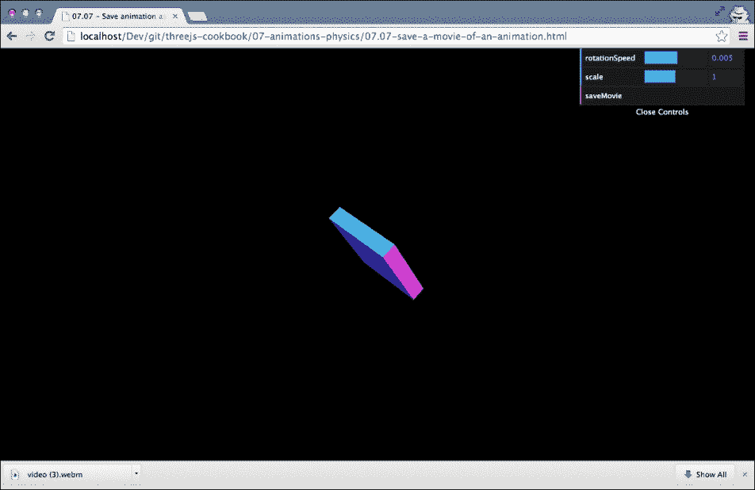

这个立方体移动得如此缓慢的原因是在后台正在保存一个电影。使用的库会减慢动画速度，以确保不会跳过任何帧。要保存电影，请点击屏幕顶部的**saveMovie**菜单按钮。

生成的电影现在可以在支持 WebM 的任何电影播放器中播放（例如，VLC 或 mPlayer），如下面的截图所示：

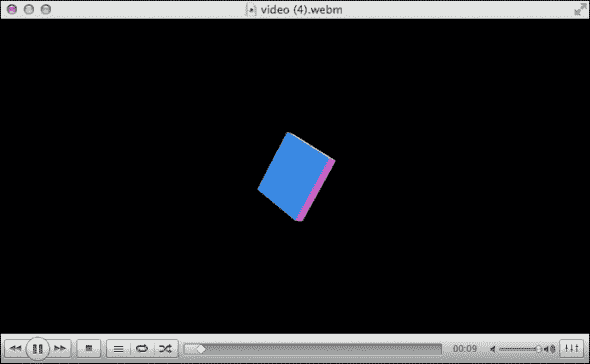

## 如何做到这一点…

一旦您在您的 HTML 页面中包含了适当的库，使用这个库实际上非常简单：

1.  我们需要做的第一件事是创建一个 `capture` 对象：

    ```js
      Var capturer = new CCapture({
        framerate: 20
      });
    ```

    在这里，我们创建了一个每秒捕获 20 帧的 `capturer`。

1.  在我们开始渲染场景之前，下一步是启动 `capturer`：

    ```js
      capturer.start();
      // call the render loop
      render();
    ```

1.  我们还需要在 `render` 循环中告诉 `capturer` 要捕获什么：

    ```js
      function render() {
        renderer.render(scene, camera);
        capturer.capture( renderer.domElement );
        requestAnimationFrame(render);
      }
    ```

    通过这些步骤，`capturer` 对象将开始以每秒 20 次的速度捕获我们的 WebGL 画布的输出。

1.  作为最后一步，我们需要添加一个保存电影的功能（在我们的例子中，这是通过点击**saveMovie**按钮触发的）：

    ```js
      this.saveMovie = function() {
        var videoUrl = capturer.save();
        var link = document.createElement("a");
        link.download = 'video.webm';
        link.href = videoUrl;
        link.click();
      };
    ```

    这将下载电影为 `video.webm` 并将其保存到您的本地磁盘。

当您运行这个程序时，您会注意到浏览器中的帧率显著下降。原因是 CCapture 库改变了 `requestAnimationFrame` 函数的行为，以确保它有足够的时间捕获屏幕并将其添加为电影的一帧。创建的电影文件将看起来如您预期，并且具有每秒帧数，正如本菜谱的第 1 步所指定的。

## 还有更多…

我们在食谱中展示的方法对于大多数类型的动画都非常好用。然而，当你想要记录用户与你的场景交互时，你不能使用这个库，因为它会减慢场景的渲染速度，这使得与场景交互变得困难。记录场景的另一种方法是使用后端服务，该服务收集截图并在服务器端创建电影。这种设置的示例可以在[`www.smartjava.org/content/capture-canvas-and-webgl-output-video-using-websockets`](http://www.smartjava.org/content/capture-canvas-and-webgl-output-video-using-websockets)找到。

## 参考以下内容

+   如果你只想保存屏幕截图而不是完整的电影，你可以使用*将 WebGL 输出保存到磁盘*的食谱，我们在第六章，*点云和后处理*中解释了它。

# 在场景中拖动和放置对象

当你创建一个交互式环境时，一个常见的需求是使用鼠标拖动对象。这种功能不是 Three.js 默认支持的。在这个食谱中，我们将向你展示实现此功能所需的步骤。

## 准备工作

对于这个食谱，我们只使用标准 Three.js 库中可用的功能。我们将使用`THREE.Raycaster`对象与`THREE.Projector`一起实现拖放功能。要查看拖放功能的效果，你可以在浏览器中打开`07.08-drag-n-drop-object-around-scene.html`示例，你将看到以下截图所示的内容：


在这个例子中，你可以看到大量的立方体，你可以单独移动它们。只需用鼠标点击一个，并将其拖动到新位置。这个场景也使用了`THREE.OrbitControls`，所以当你点击白色背景时，你可以使用鼠标旋转场景。

## 如何操作…

对于这个食谱，我们需要进行相当多的步骤：

1.  我们首先做的事情是创建一些全局变量，我们将在以下步骤中访问它们：

    ```js
      var plane;
      var selectedObject;
      var projector = new THREE.Projector();
      var offset = new THREE.Vector3();
      var objects =[];
    ```

    我们将在接下来的步骤中解释这些对象是如何使用的。

1.  当我们想要移动一个对象时，我们需要确定我们将要在哪个平面（围绕哪个轴）移动选定的立方体。鼠标在两个维度上移动，而我们的场景在三个维度上移动。为此，我们将使用一个不可见的辅助平面，我们定义如下：

    ```js
      plane = new THREE.Mesh( new THREE.PlaneGeometry( 2000, 2000, 18, 18 ), new THREE.MeshBasicMaterial() );
      plane.visible = false;
      scene.add( plane );
    ```

    这个平面被分配给了我们在步骤 1 中看到的全局平面变量。

1.  下一步是创建所有立方体。为了更容易理解这个食谱，我们列出了创建立方体的代码：

    ```js
      for (var i = 0 ; i < 200 ; i ++) {
        var cubeGeometry = new THREE.BoxGeometry(2, 2, 2);
        var cubeMaterial = new 
        THREE.MeshLambertMaterial({color: Math.random() * 0xffffff});
        cubeMaterial.transparent = true;
        cube = new THREE.Mesh(cubeGeometry, cubeMaterial);
     objects.push(cube);
        // randomize position, scale and rotation
        scene.add(cube);
      }
    ```

    最有趣的一行是突出显示的那一行，我们将创建的立方体添加到名为 objects 的全局数组中。只有这个数组中的立方体可以移动。

1.  现在我们已经处理了基础知识，我们需要告诉 Three.js 当鼠标移动、鼠标按钮被点击或释放时应该做什么。让我们首先看看 `onmousemove` 函数：

    ```js
      document.onmousemove = function(e) {
        ...
      };
    ```

    在我们可以访问鼠标移动的信息之前，我们需要注册一个监听器。如您在代码片段中看到的，我们通过将一个函数分配给 `document.onmousemove` 属性来完成此操作。在接下来的步骤中，我们将查看此 `onmousemove` 函数的内容。

1.  在 `onmousemove` 函数中，我们做了几件事情。我们首先需要做的第一件事是将鼠标位置转换为 3D 空间中的位置，并为此位置创建 `THREE.Raycaster`：

    ```js
      // get the mouse position in viewport coordinates
      var mouse_x = ( event.clientX / window.innerWidth ) * 2 - 1;
      var mouse_y = - ( event.clientY / window.innerHeight ) * 2 + 1;
      // get the 3D position and create a raycaster
      var vector = new THREE.Vector3( mouse_x, mouse_y, 0.5 );
      projector.unprojectVector( vector, camera );
      var raycaster = new THREE.Raycaster( camera.position, vector.sub( camera.position ).normalize() );
    ```

    在这一点上，我们可以使用 `THREE.Raycaster` 来选择鼠标位置的物体。

1.  下一步是，如果我们已经点击了一个对象，就拖动它（有关此操作的更多详细信息，请参阅步骤 7、8 和 9），或者重新定位我们在步骤 2 中创建的平面：

    ```js
      if (selectedObject) {
        var intersects = raycaster.intersectObject( plane );
        selectedObject.position.copy(intersects[ 0 ] .point.sub( offset ) );
      } else {
        var intersects = raycaster.intersectObjects(objects);
        if ( intersects.length > 0 ) {
          plane.position.copy( intersects[0]
            .object.position );
            plane.lookAt( camera.position );
        }
      }
    ```

    如果我们已选择一个对象并在其周围拖动，我们根据从鼠标发出的射线与不可见的辅助平面相交的位置设置该对象的位置，使用我们在步骤 9 中计算的偏移量。如果我们没有拖动对象，并且使用我们的射线确定我们与其中一个立方体相交，我们将我们的辅助 `plane` 对象移动到该对象的位置，并确保平面面向相机 (`plane.lookAt(camera.position)`)。如果选择了对象，它将沿着这个辅助 `plane` 对象移动。

1.  接下来，我们需要定义一个函数来处理 `onmousedown` 事件：

    ```js
      document.onmousedown = function(event) {
        ...
      };
    ```

1.  现在，让我们看看 `onmousedown` 事件应该填写什么：

    ```js
      var mouse_x = (event.clientX / window.innerWidth)* 2 - 1;
      var mouse_y = -(event.clientY / window.innerHeight)* 2 + 1;
      var vector = new THREE.Vector3(mouse_x, mouse_y, 0.5);
      projector.unprojectVector(vector, camera);
      var raycaster = new THREE.Raycaster(camera.position, vector.sub(camera.position).normalize());
      var intersects = raycaster.intersectObjects(objects);
    ```

    我们再次使用 `THREE.Raycaster` 来确定一个对象是否与从鼠标位置发出的射线相交。

1.  现在我们知道了相交点，我们可以使用它们来选择我们感兴趣的对象：

    ```js
      if (intersects.length > 0) {
        orbit.enabled = false;
        selectedObject = intersects[0].object;
        // and calculate the offset
        var intersects = raycaster.intersectObject(plane);
        offset.copy(intersects[0].point).sub(plane.position);
    }
    ```

    如您在这段代码片段中看到的，我们首先禁用了 `orbit` 控制器（因为我们想拖动对象而不是旋转场景）。接下来，我们将第一个相交的对象分配给 `selectedObject` 变量，我们在步骤 6 中使用它来移动选定的立方体。最后，我们需要确定我们点击的点与平面中心的偏移量。我们需要这个偏移量来在步骤 6 中正确地定位立方体。

1.  我们需要采取的最后一步是在释放鼠标按钮时启用轨道控制器，并将 `selectedObject` 属性设置回 null：

    ```js
      document.onmouseup = function(event) {
        orbit.enabled = true;
        selectedObject = null;
      }
    ```

如您所见，您需要采取许多步骤来实现这个食谱。您还可以查看来自 `07.08-drag-n-drop-object-around-scene.html` 的源代码，其中也包含有关为什么需要某些步骤的内置文档。

## 还有更多……

这个示例基于 Three.js 网站上的示例，您可以在[`threejs.org/examples/#webgl_interactive_draggablecubes`](http://threejs.org/examples/#webgl_interactive_draggablecubes)找到。因此，如果您想尝试另一个示例，可以查看该实现。

在这个示例中，我们向您展示了如何移动整个网格。您也可以使用相同的方法来移动单个顶点、面或线。因此，只需稍加努力，您就可以使用这种方法创建一种雕刻工具，可以直接从浏览器中修改几何形状。例如，您可以创建类似这样的东西 [`stephaneginier.com/sculptgl/`](http://stephaneginier.com/sculptgl/)。

## 相关内容

+   在本章中，我们还使用`THREE.Raycaster`为“添加简单碰撞检测”示例。如果您想将外部文件拖放到 Three.js 场景中，您可以参考第一章中的“从桌面拖动文件到场景”示例，*入门*。

# 添加物理引擎

在之前的示例中，我们手动添加了动画和检测碰撞到场景中。在这个示例中，我们将向您展示如何使用外部物理引擎添加重力、碰撞检测和其他物理效果到您的场景中。

## 准备工作

对于这个示例，我们需要使用几个外部库。在您的 HTML 页面顶部，您必须添加以下内容：

```js
  <script src="img/physi.js"></script>
```

该库包含物理引擎的主要实现。该库本身使用两个额外的库，需要提供。您首先需要确保`ammo.js`库存储在与`physi.js`库相同的目录中，并在您的 JavaScript 代码开头添加以下内容：

```js
  Physijs.scripts.worker = "../libs/physijs_worker.js";
```

这指向一个 Web Worker（[`www.w3.org/TR/workers/`](http://www.w3.org/TR/workers/）），它在一个单独的线程中处理物理计算。当然，这里有一个现成的示例，您可以将其用作参考或进行实验。这个示例的名称为`07.09-add-a-physics-engine.html`，当在浏览器中打开时，您将看到以下截图所示的内容：

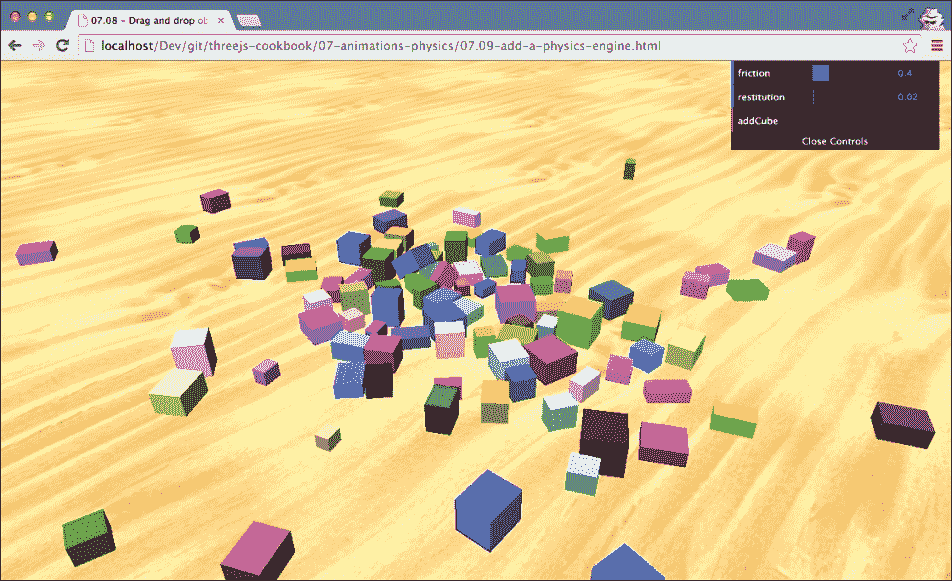

在这个示例中，您可以使用**添加立方体**按钮将立方体添加到场景中。这个立方体将被添加到地面平面之上，然后落下。物理引擎将确定下落的立方体如何与其环境交互。

## 如何操作…

在这个示例中，我们只设置了一个基本的物理启用场景。有关`Physijs`库提供的其他功能的详细信息，请参阅此示例的“更多内容…”部分。要创建一个基本场景，您需要执行以下步骤：

1.  首先要做的是，我们不会创建`THREE.Scene`，而是创建`Physics.Scene`：

    ```js
      scene = new Physijs.Scene;
      scene.setGravity(new THREE.Vector3( 0, -30, 0 ));
    ```

    在这个新创建的场景中，我们还需要设置`gravity`属性。在这种情况下，我们在*y*轴上设置了`-30`的重力，这意味着一个物体向下掉落的场景。

1.  接下来，让我们创建`THREE.Geometry`和`THREE.MeshLambertMaterial`，我们将使用它们来创建立方体：

    ```js
      var cubeGeometry = new THREE.BoxGeometry(
        4 * Math.random() + 2, 
        4 * Math.random() + 2, 
        4 * Math.random() + 2);
      var cubeMaterial = new THREE.MeshLambertMaterial(
        {
          color: 0xffffff * Math.random()
        }
      );
    ```

    在这个步骤中对于`Physijs`没有特殊的事情要做。

1.  下一步是创建一个网格对象。为了使对象能够与`Physijs`一起工作，我们需要创建一个`Physijs`库特定的网格和一个`Physijs`库特定的材料：

    ```js
      var box_material = Physijs.createMaterial(
        cubeMaterial, 
        control.friction, 
        control.restitution);
      var cube = new Physijs.BoxMesh(
        cubeGeometry,
        box_material,
        10
      );
      scene.add(cube);
    ```

    对于材料，我们使用`Physijs.createMaterial`函数。这个函数包裹我们在第 2 步中创建的材料，并允许我们定义摩擦和恢复属性。摩擦定义了物体的粗糙度，并影响它可以在另一个物体上滑动的距离。`restitution`对象用于定义物体的弹性。为了创建网格，我们使用`Physijs.BoxMesh`对象，提供我们刚刚创建的几何形状和材料，并添加对象的重量。`Physijs`提供了不同形状的网格；有关它们的信息，请参阅本配方中的*更多内容…*部分。

1.  我们需要采取的最后一步是更新`render`循环：

    ```js
      function render() {
        renderer.render(scene, camera);
        requestAnimationFrame(render);
        scene.simulate();
      }
    ```

    在这里，我们添加了`scene.simulate`函数。这个函数用于计算所有被包裹在`Physijs`库特定网格中的对象的新的位置。

通过这些基本步骤，你已经得到了一个完全工作的具有物理功能的 Three.js 场景。在使用这个引擎时需要考虑的一个重要方面是性能会有所下降。对于场景中的每个对象，`Physijs`都需要计算其下一个位置和旋转。这对于几十个对象来说效果很好，但当你处理数百个由 Physijs 管理的对象时，你会看到性能的严重下降。

## 它是如何工作的...

我们调用`scene.simulate()`，这是我们在第 4 步中添加到`render`循环中的，对于每个渲染的帧。当这个函数被调用时，`Physijs`将查看它所知道的所有对象，并且它还会查看场景上配置的重力，并将使用这些信息来计算每个对象的新位置和旋转。如果发生对象之间的碰撞，它将使用`Physijs`材料的`friction`和`restitution`属性以及对象的重量函数来确定该对象和与之碰撞的对象应该如何反应。这将在每个`render`循环中重复，从而在场景中模拟真实的物理效果。

## 更多内容…

在这个配方中我们所做的是这个物理引擎可能实现的一小部分。你可以在 Physijs 网站上找到更多信息：[`chandlerprall.github.io/Physijs/`](http://chandlerprall.github.io/Physijs/)。该网站上的有趣主题包括：

+   支持不同对象形状：[`github.com/chandlerprall/Physijs/wiki/Basic-Shapes`](https://github.com/chandlerprall/Physijs/wiki/Basic-Shapes)。

+   如何为你的对象添加约束。这使得你可以约束对象围绕一个轴（如滑块）、一个关节，甚至另一个对象的运动。关于这个特性的更多信息可以在[`github.com/chandlerprall/Physijs/wiki/Constraints`](https://github.com/chandlerprall/Physijs/wiki/Constraints)找到。

Physijs 使用外部物理库进行所有计算。关于该引擎的更多信息，请查看 ammo.js 网站([`github.com/kripken/ammo.js/`](https://github.com/kripken/ammo.js/))。注意，ammo.js 本身是 Bullet 物理引擎的 JavaScript 端口。所以，如果你真的想深入了解细节，你应该查看可以在[`bulletphysics.org/wordpress/`](http://bulletphysics.org/wordpress/)找到的 Bullet 文档。

## 参见

+   如果你不想在你的项目中包含完整的物理引擎，你也可以自己模拟物理引擎的部分。如何在场景中添加基本的碰撞检测在*添加简单的碰撞检测*菜谱中有解释。
