# 第一章：设置

在本章中，您将为本书的其余部分设置本地环境。无论您使用的是 macOS、Linux 还是 Windows，我们都将安装 MongoDB 和 Robomongo。

更具体地，我们将涵盖以下主题：

+   Linux 和 macOS 上的 MongoDB 和 Robomongo 安装

+   Windows 上的 MongoDB 和 Robomongo 安装

# 为 Linux 和 macOS 安装 MongoDB 和 Robomongo

这一部分是为 macOS 和 Linux 用户准备的。如果你使用的是 Windows，我已经为你写了一个单独的部分。

我们将首先下载并设置 MongoDB，因为这将是我们将使用的数据库。当我们最终将其部署到 Heroku 时，我们将使用第三方服务来托管我们的数据库，但在我们的本地机器上，我们需要下载 MongoDB，以便我们可以启动数据库服务器。这将让我们通过我们的 Node 应用程序连接到它，以读取和写入数据。

为了获取数据库，我们将前往[mongodb.com](https://www.mongodb.com/)。然后我们可以转到下载页面并下载适当的版本。

在这个页面上，向下滚动并选择 Community Server；这是我们将要使用的。此外，还有不同操作系统的选项，无论是 Windows、Linux、macOS 还是 Solaris。我使用的是 macOS，所以我会使用这个下载：

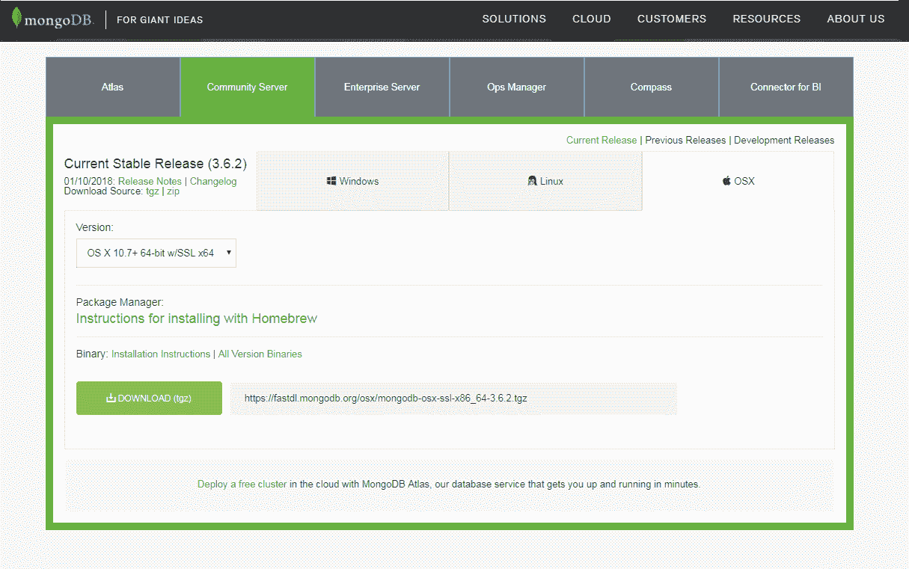

如果你在 Linux 上，点击 Linux；然后转到版本下拉菜单并选择适当的版本。例如，如果你在 Ubuntu 14.04 上，你可以从 Linux 选项卡下载正确的版本。然后，你只需点击下载按钮并跟随操作。

接下来你可以打开它。我们将只需提取目录，创建一个全新的文件夹在`Downloads`文件夹中。如果你在 Linux 上，你可能需要手动将该存档的内容解压到`Downloads`文件夹中。

现在这个文件夹包含一个`bin`文件夹，在那里我们有所有需要的可执行文件，以便做一些事情，比如连接到数据库和启动数据库服务器：

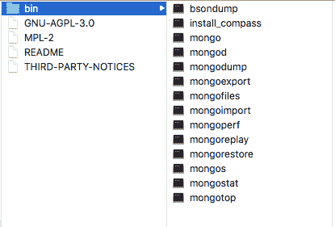

在我们继续运行任何命令之前。我们将把这个目录重命名为`mongo`，然后将它移动到`user`目录中。你可以看到现在在`user`目录中，我有`mongo`文件夹。我们还将在`mongo`旁边创建一个全新的目录，名为`mongo-data`，这将存储数据库中的实际数据：

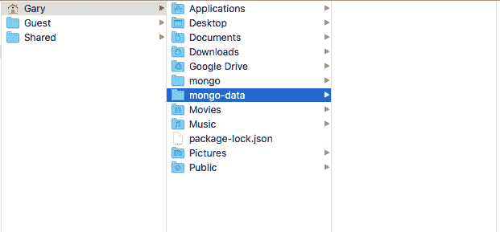

所以当我们向`Todos`表中插入新记录时，例如，它将存储在`mongo-data`文件夹中。一旦你将`mongo`文件夹移动到`user`目录中，并且你有了新的`mongo-data`文件夹，你就可以准备从终端实际运行数据库服务器了。我将进入终端并导航到`user`目录中的全新`mongo`文件夹，我当前所在的位置，所以我可以`cd`到`mongo`，然后我将通过在那里添加`bin`目录来`cd`进入`bin`目录：

```js
cd mongo/bin
```

从这里，我们有一堆可执行文件可以运行：

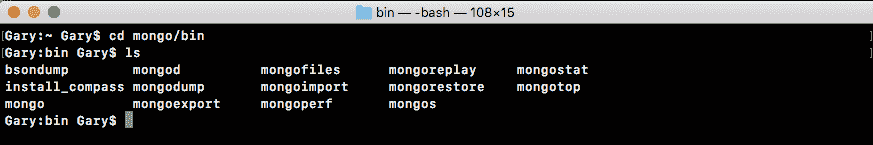

我们有一些东西，比如 bisondump 和 mongodump。在这一部分，我们将专注于：mongod，它将启动数据库服务器，以及 mongo，它将让我们连接到服务器并运行一些命令。就像当我们输入`node`时，我们可以在终端中运行一些 JavaScript 命令一样，当我们输入`mongo`时，我们将能够运行一些 Mongo 命令来插入、获取或对数据进行任何我们喜欢的操作。

不过首先，让我们启动数据库服务器。我将使用`./`来运行当前目录中的文件。我们将要运行的文件名为`mongod`；此外，我们需要提供一个参数：`dbpath`参数。`dbpath`参数将被设置为刚刚创建的目录的路径，即`mongo-data`目录。我将使用`~`（波浪号）来导航到用户目录，然后到`/mongo-data`，如下所示：

```js
./mongod --dbpath ~/mongo-data
```

运行这个命令将启动服务器。这将创建一个活动连接，我们可以连接到这个连接来操作我们的数据。当你运行命令时，你看到的最后一行应该是，等待在端口 27017 上连接：

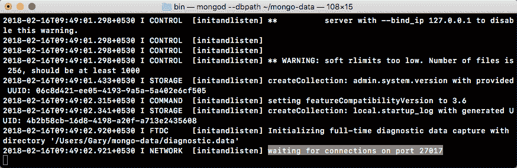

如果你看到这个，这意味着你的服务器已经启动了。

接下来，让我们打开一个新标签，它会在完全相同的目录中启动，这一次，不是运行`mongod`，而是运行`mongo`文件：

```js
./mongo
```

当我们运行`mongo`时，我们打开了一个控制台。它连接到我们刚刚启动的数据库服务器，从这里，我们可以开始运行一些命令。这些命令只是为了测试一切是否按预期工作。我们稍后将详细介绍所有这些内容。不过现在，我们可以访问`db.Todos`，然后我们将调用`.insert`来创建一个全新的 Todo 记录。我会像调用函数一样调用它：

```js
db.Todos.insert({})
```

接下来，在`insert`里，我们将传入我们的文档。这将是我们想要创建的 MongoDB 文档。现在，我们将保持事情非常简单。在我们的对象上，我们将指定一个属性，`text`，将其设置为一个字符串。在引号内，输入任何你想做的事情。我会说`Film new node course`：

```js
db.Todos.insert({text: 'Film new node course'})
```

只要你的命令看起来像这样，你可以按*enter*，然后你应该得到一个带有 nInserted 属性的 WriteResult 对象，这个属性是插入的数量的缩写：一个值设置为 1。这意味着创建了一个新的记录，这太棒了！

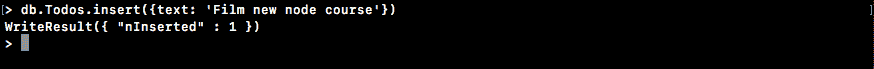

现在我们已经插入了一条记录，让我们获取一下记录，以确保一切都按预期工作。

我们将调用`find`而不带任何参数。我们想返回`Todos`集合中的每一个项目：

```js
db.Todos.find()
```

当我运行这个时，我们会得到什么？我们得到一个看起来像对象的东西：

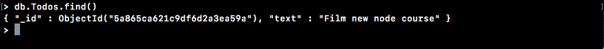

我们的`text`属性设置为我们提供的文本，我们有一个`_id`属性。这是每条记录的唯一标识符，我们稍后会讨论。只要你看到文本属性回到你设置的内容，你就可以放心了。

我们可以关闭`mongo`命令。但是，我们仍然会让`mongod`命令继续运行，因为我还想安装一件东西。它叫做 Robomongo，它是一个用于管理 Mongo 数据库的图形用户界面。当你开始玩 Mongo 时，这将非常有用。你将能够查看数据库中保存的确切数据；你可以操纵它并做各种各样的事情。

在**Finder**中，我们有我们的`mongo-data`目录，你可以看到这里有很多东西。这意味着我们的数据已经成功保存。所有的数据都在这个`mongo-data`目录中。要下载和安装 Robomongo，它适用于 Linux、Windows 和 macOS，我们将前往[robomongo.org](https://robomongo.org/)并获取适合我们操作系统的安装程序：

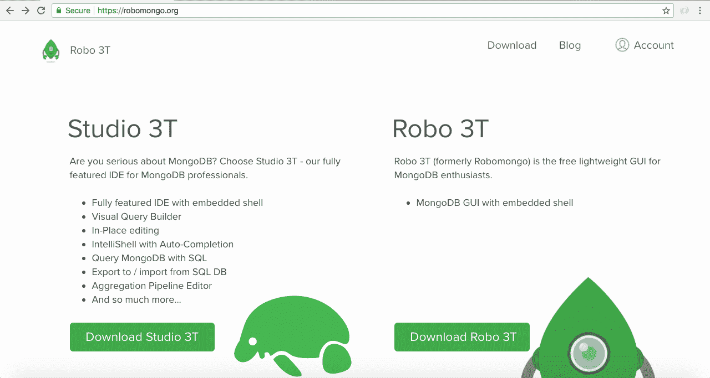

我们可以点击下载 Robo 3T 并下载最新版本；它应该会自动检测你的操作系统。下载适用于 Linux 或 macOS 的安装程序。macOS 的安装程序非常简单。这是其中一种你将图标拖到`Applications`文件夹中的安装程序。对于 Linux，你需要解压存档并在`bin`目录中运行程序。这将在你的 Linux 发行版上启动 Robomongo。

由于我使用的是 macOS，我只需快速将图标拖到 Applications 中，然后我们可以玩一下程序本身。接下来，我会在 Finder 中打开它。当你第一次打开 Robomongo 时，你可能会在 macOS 上收到如下警告，因为它是一个我们下载的程序，不是来自已识别的 macOS 开发者：

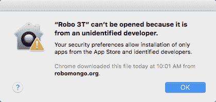

这没问题；大多数从网上下载的程序都不是官方的，因为它们不是来自应用商店。您可以右键单击下载的软件包，选择“打开”，然后再次点击“打开”来运行该程序。当您第一次打开它时，您会看到以下屏幕：

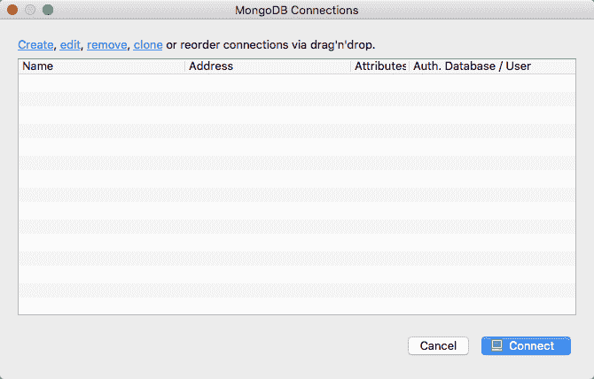

我们有一个小屏幕在后台和一个连接列表；目前该列表为空。我们需要做的是为我们的本地 MongoDB 数据库创建一个连接，以便我们可以连接到它并操作那些数据。我们有创建。我会点击这个，我们唯一需要更新的是名称。我会给它一个更具描述性的名称，比如`本地 Mongo 数据库`。我会将地址设置为`localhost`，`27017`端口是正确的；没有必要更改这些。所以，我会点击“保存”：

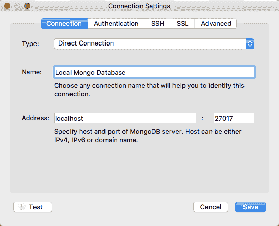

接下来，我将双击数据库以连接到它。在小窗口内，我们有我们的数据库。我们已经连接到它；我们可以做各种事情来管理它。

我们可以打开`test`数据库，在那里，我们应该看到一个`Collections`文件夹。如果我们展开这个文件夹，我们有我们的`Todos`集合，然后，我们可以右键单击该集合。接下来，点击“查看文档”，我们应该会看到我们的一个 Todo 项目，就是我们在 Mongo 控制台中创建的那个：

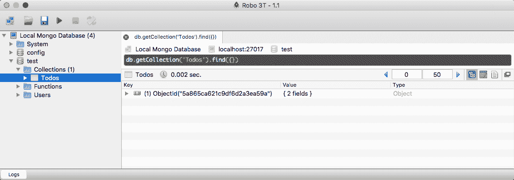

我可以展开它以查看文本属性。电影新节点课程出现了：

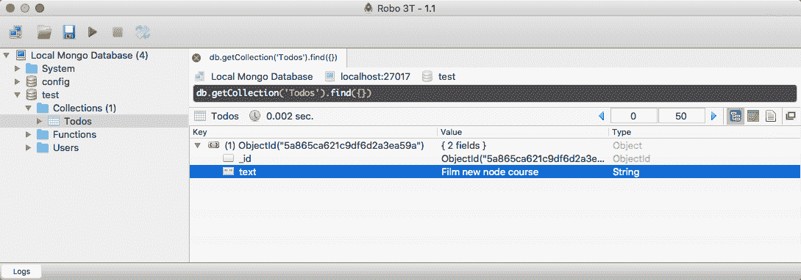

如果您看到这个，那么您已经完成了。

下一节是给 Windows 用户的。

# 为 Windows 安装 MongoDB 和 Robomongo

如果您使用的是 Windows，这是适合您的安装部分。如果您使用的是 Linux 或 macOS，前一节适合您；您可以跳过这一部分。我们的目标是在我们的计算机上安装 MongoDB，这将让我们创建一个本地 MongoDB 数据库服务器。我们将能够使用 Node.js 连接到该服务器，并且我们将能够读取和写入数据库中的数据。这对于 Todo API 来说将是非常棒的，它将负责读取和写入各种与 Todo 相关的信息。

要开始，我们将通过访问[mongodb.com](https://www.mongodb.com/)来获取 MongoDB 安装程序。在这里，我们可以点击大绿色的下载按钮；此外，我们还可以在此页面上看到几个选项：

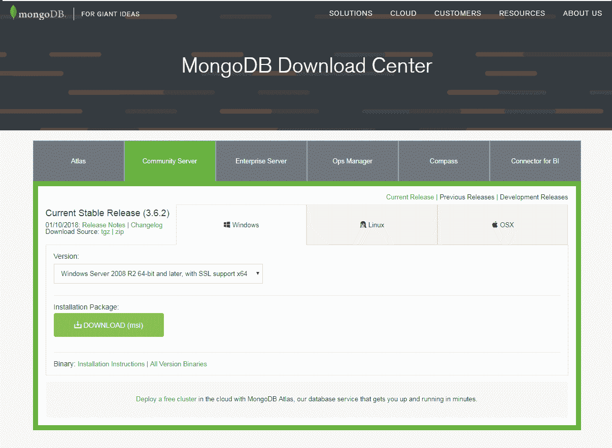

我们将使用 Community Server 和 Windows。如果您转到版本下拉菜单，那里的版本都不适合您。顶部的是我们想要的：Windows Server 08 R2 64 位及更高版本，支持 SSL。让我们开始下载这个。它稍微大一点；稍微超过 100 MB，所以下载需要一些时间才能开始。

我会启动它。这是一个基本的安装程序，您需要点击几次“下一步”并同意许可协议。点击“自定义”选项一会儿，尽管我们将继续选择“完整”选项。当您点击“自定义”时，它会显示您的计算机上将安装在哪里，这很重要。在这里，您可以看到对我来说它在`C:\Program Files\MongoDB\Server`，然后在`3.2`目录中：

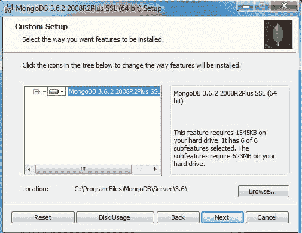

这将很重要，因为我们需要进入这个目录才能启动 MongoDB 服务器。我会返回，然后我将使用“完整”选项，这将安装我们需要的一切。现在我们实际上可以开始安装过程。通常，您需要点击“是”，以确认您要安装该软件。我会继续这样做，然后我们就完成了。

现在一旦它安装好了，我们将进入命令提示符并启动服务器。我们需要做的第一件事是进入`Program Files`目录。我在命令提示符中。我建议你使用命令提示符而不是 Git Bash。Git Bash 不能用来启动 MongoDB 服务器。我将使用`cd/`来导航到我的机器的根目录，然后我们可以使用以下命令来导航到那个路径：

```js
cd Program Files/MongoDB/Server/3.2
```

这是安装 MongoDB 的目录。我可以使用`dir`来打印出这个目录的内容，我们关心的是`bin`目录：

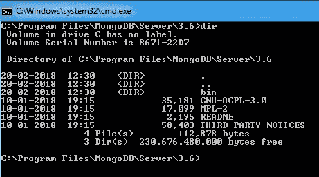

我们可以使用`cd bin`进入`bin`，并使用`dir`打印出它的内容。此外，这个目录包含了一大堆我们将用来启动服务器和连接到服务器的可执行文件：

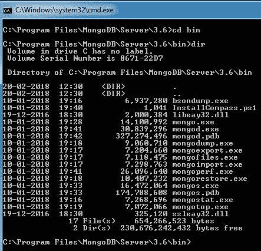

我们将运行的第一个可执行文件是`mongod.exe`。这将启动我们的本地 MongoDB 数据库。在我们继续运行这个`EXE`之前，我们还需要做一件事。在通用文件资源管理器中，我们需要创建一个目录，用来存储我们所有的数据。为了做到这一点，我将把我的放在我的用户目录下，通过转到`C:/Users/Andrew`目录。我将创建一个新文件夹，我会把这个文件夹叫做`mongo-data`。现在，`mongo-data`目录是我们所有数据实际存储的地方。这就是我们在运行`mongod.exe`命令时需要指定的路径；我们需要告诉 Mongo 数据存储在哪里。

在命令提示符中，我们现在可以启动这个命令。我将运行`mongod.exe`，作为`dbpath`参数传入，传入我们刚刚创建的文件夹的路径。在我的情况下，它是`/Users/Andrew/mongo-data`。现在如果你的用户名不同，显然是不同的，或者你把文件夹放在不同的目录中，你需要指定`mongo-data`文件夹的绝对路径。不过，一旦你有了这个，你就可以通过运行以下命令启动服务器：

```js
mongod.exe --dbpath /Users/Andrew/mongo-data
```

你会得到一个很长的输出列表：

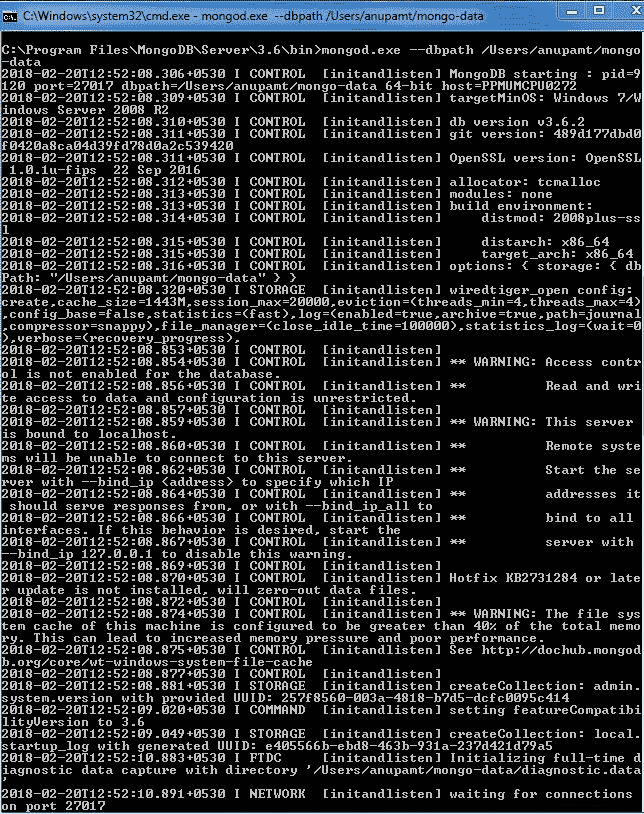

你需要关心的唯一一件事是，在最底部，你应该看到等待在端口 27017 上连接。如果你看到这个，那么你就可以开始了。但是现在服务器已经启动，让我们连接到它并发出一些命令来创建和读取一些数据。

# 创建和读取数据

为了做到这一点，我们将打开第二个命令提示符窗口，并使用`cd/Program Files/MongoDB/Server/3.2/bin`进入相同的`bin`目录。从这里，我们将运行`mongo.exe`。请注意，我们不是运行`mongod`命令；我们运行的是`mongo.exe`。这将连接到我们的本地 MongoDB 数据库，并且会让我们进入数据库的命令提示符视图。我们将能够发出各种 Mongo 命令来操作数据，有点像我们可以从命令提示符中运行 Node 来运行各种 JavaScript 语句一样。当我们运行这个命令时，我们将连接到数据库。在第一个控制台窗口中，你可以看到连接被接受的显示。我们确实有了一个新的连接。现在在第一个控制台窗口中，我们可以运行一些命令来创建和读取数据。现在我不指望你从这些命令中得到任何东西。我们暂时不讨论 MongoDB 的细节。我只是想确保当你运行它们时，它能按预期工作。

首先，让我们从控制台创建一个新的 Todo。这可以通过`db.Todos`来完成，在这个 Todos 集合上，我们将调用`.insert`方法。此外，我们将使用一个参数调用`insert`，一个对象；这个对象可以有我们想要添加到记录中的任何属性。例如，我想设置一个`text`属性。这是我实际需要做的事情。在引号内，我可以放一些东西。我会选择`创建新的 Node 课程`。

```js
db.Todos.insert({text: 'Create new Node course'})
```

现在当我运行这个命令时，它将实际地将数据插入到我们的数据库中，我们应该会得到一个`writeResult`对象，其中`nInserted`属性设置为`1`。这意味着插入了一条记录。

现在我们的数据库中有一个 Todo，我们可以尝试再次使用`db.Todos`来获取它。这一次，我们不会调用`insert`来添加记录，而是调用`find`，不提供任何参数。这将返回我们数据库中的每一个 Todo：

```js
db.Todos.find()
```

当我运行这个命令时，我们得到一个看起来像对象的东西，其中有一个`text`属性设置为`Create new Node course`。我们还有一个`_id`属性。`_id`属性是 MongoDB 的唯一标识符，这是他们用来给您的文档，比如说一个 Todo，在这种情况下，一个唯一的标识符。稍后我们会更多地讨论`_id`和我们刚刚运行的所有命令。现在，我们可以使用*Ctrl* + *C*来关闭它。我们已经成功断开了与 Mongo 的连接，现在我们也可以关闭第二个命令提示窗口。

在我们继续之前，我还想做一件事。我们将安装一个名为 Robomongo 的程序——一个用于 MongoDB 的图形用户界面。它将让您连接到本地数据库以及真实数据库，我们稍后会详细介绍。此外，它还可以让您查看所有数据，操纵它，并执行数据库 GUI 中可以执行的任何操作。这非常有用；有时您只需要深入数据库，看看数据的确切样子。

为了开始这个过程，我们将转到一个新的标签页，然后转到[robomongo.org](https://robomongo.org/)。

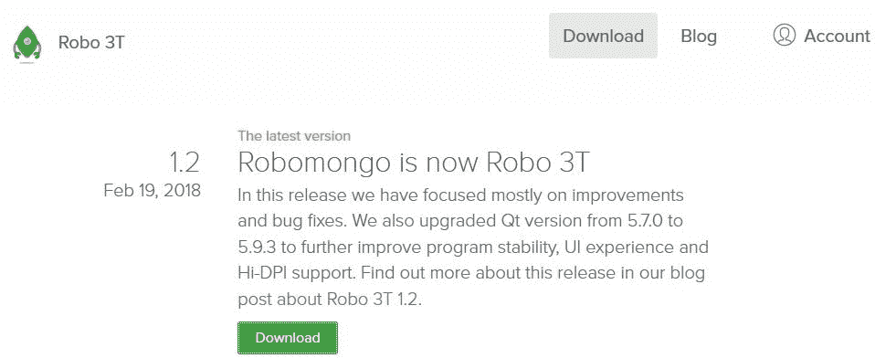

在这里，我们可以通过转到下载来获取安装程序。我们将下载最新版本，我使用的是 Windows。我需要安装程序，而不是便携式版本，所以我会点击这里的第一个链接：

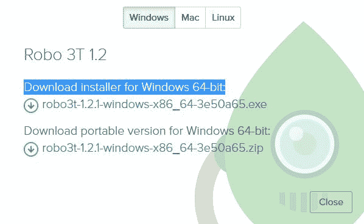

这将开始一个非常小的下载，只有 17MB，我们可以通过点击“下一步”几次来在我们的机器上安装 Robomongo。

我将开始这个过程，确认安装并点击“下一步”几次。在设置内没有必要进行任何自定义操作。我们将使用所有默认设置运行安装程序。现在我们可以通过完成安装程序中的所有步骤来实际运行程序。当您运行 Robomongo 时，您将会看到一个 MongoDB 连接屏幕：

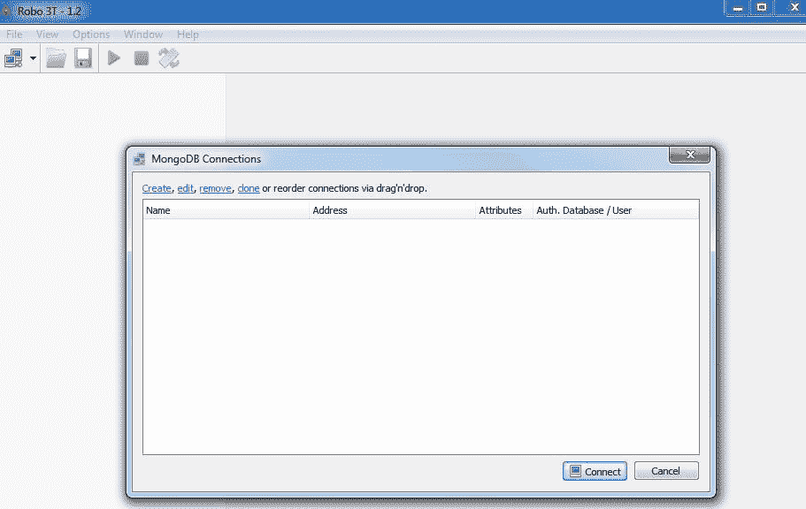

这个屏幕让您配置 Robomongo 的所有连接。您可能有一个用于本地数据库的本地连接，也可能有一个连接到实际生产数据存储的真实 URL。我们稍后会详细介绍这一切。

现在，我们将点击“创建”。默认情况下，您的`localhost`地址和`27017`端口不需要更改：

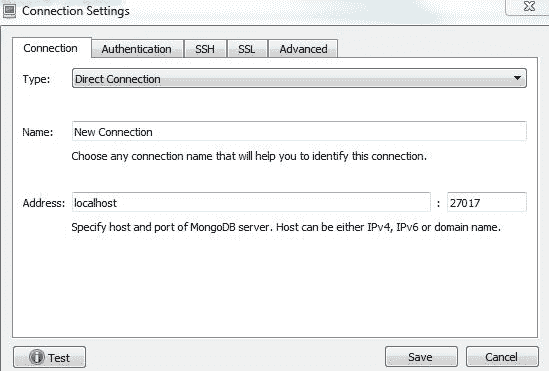

我要做的就是更改名称，使其更容易识别。我会选择`Local Mongo Database`。现在，我们可以保存我们的新连接，并通过双击连接到数据库。当我们这样做时，我们会得到一个数据库的树形视图。我们有这个`test`数据库；这是默认创建的一个，我们可以展开它。然后我们可以展开我们的`Collections`文件夹，看到`Todos`集合。这是我们在控制台内创建的集合。我会右键单击它，然后转到“查看文档”。当我查看文档时，我实际上可以查看到单独的记录：

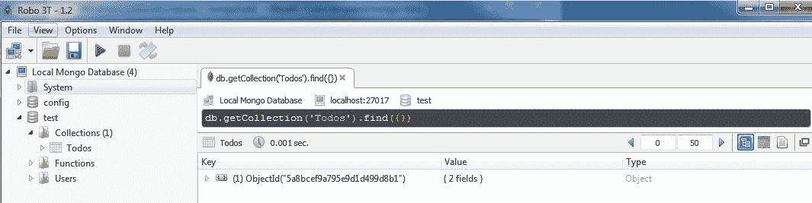

在这里，我看到了我的 _id 和 text 属性，它们在上面的图像中显示为 Create new Node course。

如果您看到这个，那么这意味着您有一个本地的 Mongo 服务器在运行，并且这也意味着您已经成功地向其中插入了数据。

# 总结

在这一章中，你下载并运行了 MongoDB 数据库服务器。这意味着我们有一个本地数据库服务器，可以从我们的 Node 应用程序连接到它。我们还安装了 Robomongo，它让我们连接到本地数据库，这样我们就可以查看和操作数据。当你调试或管理数据，或者对你的 Mongo 数据库进行其他操作时，这将非常方便。我们将在整本书中使用它，你将在后面的章节中开始看到它为什么是有价值的。不过，现在你已经准备好了。你可以继续开始构建 Todo API 了。
