# 第二章：MongoDB、Mongoose 和 REST API – 第一部分

在本章中，您将学习如何将您的 Node 应用程序连接到您在本地计算机上运行的 MongoDB 数据库。这意味着我们将能够在我们的 Node 应用程序内部发出数据库命令，执行诸如插入、更新、删除或读取数据等操作。如果我们要制作 Todo REST API，这将是至关重要的。当有人访问我们的 API 端点时，我们希望操作数据库，无论是读取所有的 Todos 还是添加一个新的。然而，在我们做任何这些之前，我们必须先学习基础知识。

# 连接到 MongoDB 并写入数据

要从 Node.js 内部连接到我们的 MongoDB 数据库，我们将使用 MongoDB 团队创建的一个 npm 模块。它被称为 node-mongodb-native，但它包括了你需要连接和与数据库交互的所有功能。要找到它，我们将谷歌搜索`node-mongodb-native`：

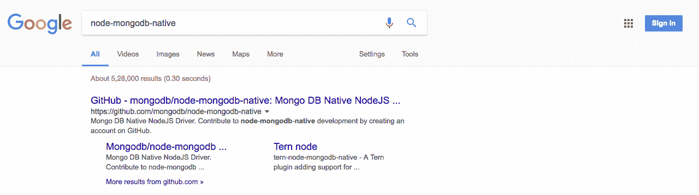

GitHub 仓库，应该是第一个链接，是我们想要的——node-mongodb-native 仓库——如果我们向下滚动，我们可以看一下一些重要的链接：

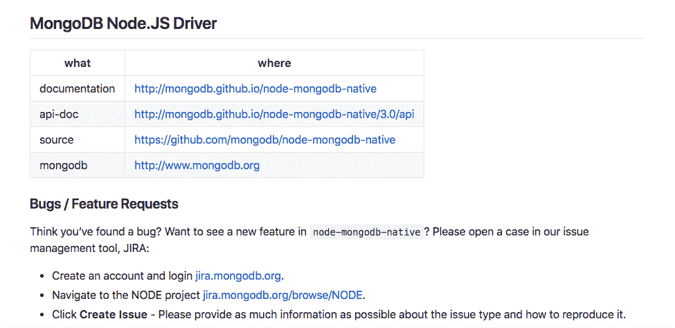

首先是文档，还有我们的 api-docs；当我们开始探索这个库内部的功能时，这些将是至关重要的。如果我们在这个页面上继续向下滚动，我们会发现大量关于如何入门的示例。我们将在本章中讨论很多这些内容，但我想让你知道你可以在哪里找到其他资源，因为 mongodb-native 库有很多功能。有整个课程专门致力于 MongoDB，甚至都没有涵盖这个库内置的所有功能。

我们将专注于 Node.js 应用程序所需的 MongoDB 的重要和常见子集。要开始，让我们打开上图中显示的文档。当你进入文档页面时，你必须选择你的版本。我们将使用 3.0 版本的驱动程序，有两个重要的链接：

+   **参考链接：** 这包括类似指南的文章，入门指南和其他各种参考资料。

+   **API 链接：** 这包括您在使用该库时可用的每个单独方法的详细信息。当我们开始创建我们的 Node Todo API 时，我们将在此链接上探索一些方法。

不过，现在我们可以开始为这个项目创建一个新目录，然后我们将安装 MongoDB 库并连接到我们正在运行的数据库。我假设您在本章的所有部分中都已经运行了您的数据库。我在我的终端中的一个单独标签页中运行它。

如果您使用的是 Windows，请参考 Windows 安装部分的说明来启动您的数据库，如果您忘记了。如果您使用的是 Linux 或 macOS 操作系统，请使用我已经提到的说明，并且不要忘记也包括`dbpath`参数，这对于启动 MongoDB 服务器至关重要。

# 为项目创建一个目录

首先，我要在桌面上为 Node API 创建一个新文件夹。我将使用`mkdir`创建一个名为`node-todo-api`的新文件夹。然后，我可以使用`cd`进入该目录，`cd node-todo-api`。从这里，我们将运行`npm init`，这将创建我们的`package.json`文件，并允许我们安装我们的 MongoDB 库。再次，我们将使用回车键跳过所有选项，使用每个默认值：

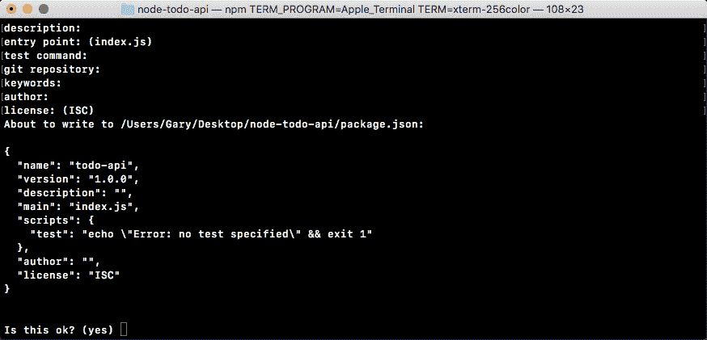

一旦我们到达结尾，我们可以确认我们的选择，现在我们的`package.json`文件已经创建。接下来我们要做的是在 Atom 中打开这个目录。它在桌面上，`node-todo-api`。接下来，在项目的根目录中，我们将创建一个新文件夹，我将称这个文件夹为`playground`。在这个文件夹里，我们将存储各种脚本。它们不会是与 Todo API 相关的脚本；它们将是与 MongoDB 相关的脚本，所以我希望将它们放在文件夹中，但我不一定希望它们成为应用的一部分。我们将像以前一样使用`playground`文件夹。

在`playground`文件夹中，让我们继续创建一个新文件，我们将称这个文件为`mongodb-connect.js`。在这个文件中，我们将通过加载库并连接到数据库来开始。现在，为了做到这一点，我们必须安装库。从终端，我们可以运行`npm install`来完成这项工作。新的库名称是`mongodb`；全部小写，没有连字符。然后，我们将继续指定版本，以确保我们都使用相同的功能，`@3.0.2`。这是写作时的最新版本。在版本号之后，我将使用`--save`标志。这将把它保存为常规依赖项，它已经是：

```js
npm install mongodb@3.0.2 --save
```

我们需要这个来运行 Todo API 应用程序。

# 将`mongodb-connect`文件连接到数据库。

现在安装了 MongoDB，我们可以将其移动到我们的`mongodb-connect`文件并开始连接到数据库。我们需要做的第一件事是从我们刚刚安装的库中提取一些东西，那就是`mongodb`库。我们要找的是一个叫做`MongoClient`的构造函数。`MongoClient`构造函数允许您连接到 Mongo 服务器并发出命令来操作数据库。让我们继续创建一个名为`MongoClient`的常量。我们将把它设置为`require`，并且我们将要求我们刚刚安装的库`mongodb`。从那个库中，我们将取出`MongoClient`：

```js
const MongoClient = require('mongodb').MongoClient; 
```

现在`MongoClient`已经就位，我们可以调用`MongoClient.connect`来连接到数据库。这是一个方法，它接受两个参数：

+   第一个参数是一个字符串，这将是您的数据库所在的 URL。现在在生产示例中，这可能是 Amazon Web Services URL 或 Heroku URL。在我们的情况下，它将是本地主机 URL。我们稍后会谈论这个。

+   第二个参数将是一个回调函数。回调函数将在连接成功或失败后触发，然后我们可以适当地处理事情。如果连接失败，我们将打印一条消息并停止程序。如果成功，我们可以开始操作数据库。

# 将字符串添加为第一个参数

对于我们的第一个参数，我们将从`mongodb://`开始。当我们连接到 MongoDB 数据库时，我们要使用像这样的 mongodb 协议：

```js
MongoClient.connect('mongodb://')
```

接下来，它将在本地主机上，因为我们在本地机器上运行它，并且我们已经探索了端口：`27017`。在端口之后，我们需要使用`/`来指定我们要连接的数据库。现在，在上一章中，我们使用了测试数据库。这是 MongoDB 给你的默认数据库，但我们可以继续创建一个新的。在`/`之后，我将称数据库为`TodoApp`，就像这样：

```js
MongoClient.connect('mongodb://localhost:27017/TodoApp'); 
```

# 将回调函数添加为第二个参数

接下来，我们可以继续提供回调函数。我将使用 ES6 箭头（`=>`）函数，并且我们将通过两个参数。第一个将是一个错误参数。这可能存在，也可能不存在；就像我们过去看到的那样，如果实际发生了错误，它就会存在；否则就不会存在。第二个参数将是`client`对象。这是我们可以用来发出读写数据命令的对象：

```js
MongoClient.connect('mongodb://localhost:27017/TodoApp', (err, client) => { 

});
```

# mongodb-connect 中的错误处理

现在，在写入任何数据之前，我将继续处理可能出现的任何错误。我将使用一个`if`语句来做到这一点。如果有错误，我们将在控制台上打印一条消息，让查看日志的人知道我们无法连接到数据库服务器，`console.log`，然后在引号内放上类似`Unable to connect to MongoDB server`的内容。在`if`语句之后，我们可以继续记录一个成功的消息，类似于`console.log`。然后，在引号内，我们将使用`Connected to MongoDB server`：

```js
MongoClient.connect('mongodb://localhost:27017/TodoApp', (err, client) => {
  if(err){
    console.log('Unable to connect to MongoDB server');
  }
  console.log('Connected to MongoDB server');
});
```

现在，当你处理这样的错误时，即使错误块运行，成功代码也会运行。我们要做的是在`console.log('Unable to connect to MongoDB server');`行之前添加一个`return`语句。

这个`return`语句并没有做什么花哨的事情。我们所做的只是使用它来阻止函数的其余部分执行。一旦从函数返回，程序就会停止，这意味着如果发生错误，消息将被记录，函数将停止，我们将永远看不到这条`Connected to MongoDB server`消息：

```js
if(err) { 
    return console.log('Unable to connect to MongoDB server'); 
  } 
```

使用`return`关键字的替代方法是添加一个`else`子句，并将我们的成功代码放在`else`子句中，但这是不必要的。我们可以只使用我更喜欢的`return`语法。

现在，在运行这个文件之前，我还想做一件事。在我们的回调函数的最底部，我们将在 db 上调用一个方法。它叫做`client.close`：

```js
MongoClient.connect('mongodb://localhost:27017/TodoApp', (err, client) => {
  if(err) { 
    return console.log('Unable to connect to MongoDB server'); 
  } 
  console.log('Connected to MongoDB server');
  const db = client.db('TodoApp');
  client.close(); 
}); 
```

这关闭了与 MongoDB 服务器的连接。现在我们已经有了这个设置，我们实际上可以保存`mongodb-connect`文件并在终端内运行它。它现在还没有做太多事情，但它确实会工作。

# 在终端中运行文件

在终端中，我们可以使用`node playground`作为目录运行文件，文件本身是`mongodb-connect.js`：

```js
node playground/mongodb-connect.js
```

当我们运行这个文件时，我们会得到`Connected to MongoDB server`打印到屏幕上：

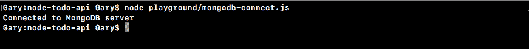

如果我们进入我们拥有 MongoDB 服务器的选项卡，我们可以看到我们有一个新的连接：连接已接受。正如你在下面的截图中所看到的，该连接已关闭，这太棒了：

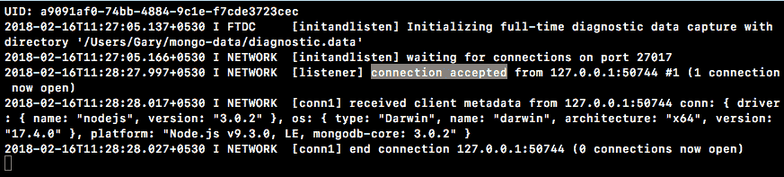

使用 Mongo 库，我们能够连接，打印一条消息，并从服务器断开连接。

现在，你可能已经注意到我们在 Atom 中的`MongoClient.connect`行中更改了数据库名称，但我们实际上并没有做任何事情来创建它。在 MongoDB 中，与其他数据库程序不同，你不需要在开始使用之前创建数据库。如果我想启动一个新的数据库，我只需给它一个名称，比如`Users`。

现在我有一个`Users`数据库，我可以连接到它并对其进行操作。没有必要先创建该数据库。我将继续将数据库名称更改回`TodoApp`。如果我们进入 Robomongo 程序并连接到我们的本地数据库，你还会看到我们唯一拥有的数据库是`test`。`TodoApp`数据库甚至从未被创建过，即使我们连接到它。Mongo 不会创建数据库，直到我们开始向其中添加数据。我们现在可以继续做到这一点。

# 向数据库添加数据

在 Atom 中，在我们调用`db.close`之前，我们将向集合中插入一条新记录。这将是 Todo 应用程序。在这个应用程序中，我们将有两个集合：

+   一个`Todos`集合

+   一个`Users`集合

我们可以继续通过调用`db.collection`向`Todos`集合添加一些数据。`db.collection`方法以要插入的集合的字符串名称作为其唯一参数。现在，就像实际数据库本身一样，您不需要首先创建此集合。您只需给它一个名称，比如`Todos`，然后可以开始插入。无需运行任何命令来创建它：

```js
db.collection('Todos')
```

接下来，我们将使用集合中可用的一个方法`insertOne`。`insertOne`方法允许您将新文档插入到集合中。它需要两个参数：

+   第一个将是一个对象。这将存储我们希望在文档中拥有的各种键值对。

+   第二个将是一个回调函数。当事情失败或顺利进行时，将触发此回调函数。

您将获得一个错误参数，可能存在，也可能不存在，您还将获得结果参数，如果一切顺利，将会提供：

```js
const MongoClient = require('mongodb').MongoClient;

MongoClient.connect('mongodb://localhost:27017/TodoApp', (err, client) => {
  if(err){
    console.log('Unable to connect to MongoDB server');
  }
  console.log('Connected to MongoDB server');
  const db = client.db('TodoApp');
  db.collection('Todos').insertOne({
    text: 'Something to do',
    completed: false
  }, (err, result) => {

  });
  client.close();
});
```

在错误回调函数本身内部，我们可以添加一些代码来处理错误，然后我们将添加一些代码来在成功添加时将对象打印到屏幕上。首先，让我们添加一个错误处理程序。就像我们之前做的那样，我们将检查错误参数是否存在。如果存在，那么我们将简单地使用`return`关键字打印一条消息，以阻止函数继续执行。接下来，我们可以使用`console.log`打印`无法插入 todo`。我将传递给`console.log`的第二个参数将是实际的`err`对象本身，这样如果有人查看日志，他们可以看到出了什么问题：

```js
db.collection('Todos').insertOne({ 
  text: 'Something to do', 
  completed: false 
}, (err, result) => { 
  if(err){ 
    return console.log('Unable to insert todo', err); 
  }
```

在我们的`if`语句旁边，我们可以添加我们的成功代码。在这种情况下，我们要做的只是将一些内容漂亮地打印到`console.log`屏幕上，然后我将调用`JSON.stringify`，我们将继续传入`result.ops`。`ops`属性将存储所有插入的文档。在这种情况下，我们使用了`insertOne`，所以它只会是我们的一个文档。然后，我可以添加另外两个参数，对于筛选函数是`undefined`，对于缩进是`2`：

```js
db.collection('Todos').insertOne({ 
  text: 'Something to do', 
  completed: false 
}, (err, result) => { 
  if(err){ 
    return console.log('Unable to insert todo', err); 
  }

  console.log(JSON.stringify(result.ops, undefined, 2)); 
}); 
```

有了这个，我们现在可以继续执行我们的文件，看看会发生什么。在终端中，我将运行以下命令：

```js
node playground/ mongodb-connect.js
```

当我执行命令时，我们会收到成功消息：`已连接到 MongoDB 服务器`。然后，我们会得到一个插入的文档数组：

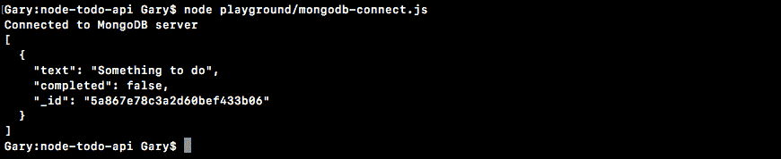

现在正如我所提到的，在这种情况下，我们只插入了一个文档，如前面的屏幕截图所示。我们有`text`属性，由我们创建；我们有`completed`属性，由我们创建；我们有`_id`属性，由 Mongo 自动添加。`_id`属性将是接下来部分的主题。我们将深入讨论它是什么，为什么存在以及为什么它很棒。

目前，我们将继续注意它是一个唯一标识符。这是一个仅分配给此文档的 ID。这就是使用 Node.js 将文档插入到您的 MongoDB 数据库中所需的全部内容。我们可以在 Robomongo 中查看此文档。我将右键单击连接，然后单击刷新：

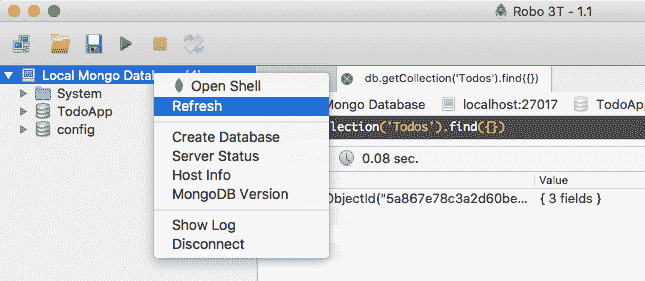

这显示了我们全新的`TodoApp`数据库。如果我们打开它，我们会得到我们的`Collections`列表。然后我们可以进入`Collections`，查看文档，我们得到了什么？我们得到了我们的一个 Todo 项目。如果我们展开它，我们可以看到我们有我们的 _id，我们有我们的文本属性，我们有我们的完成布尔值：

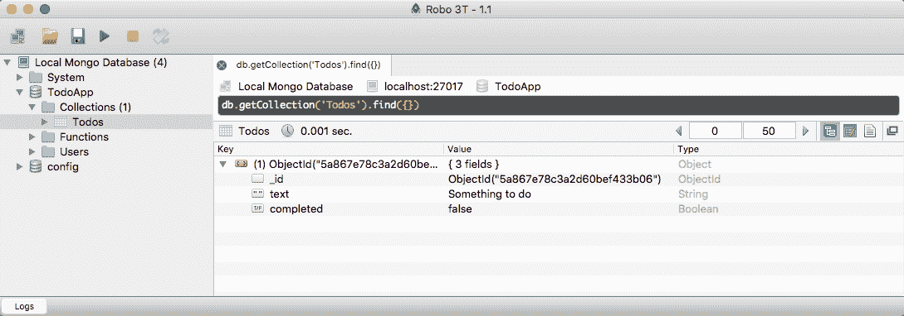

在这种情况下，Todo 未完成，因此`completed`值为`false`。现在，我希望您将一个新记录添加到集合中。这将是本节的挑战。

# 向集合中添加新记录

在 Atom 中，我希望您从`db.collection`一直到回调的底部，将代码注释掉。然后，我们将继续添加一些内容。在`db.close()`之前，您将输入`Insert new doc into the Users collection`。这个文档将有一些属性。我希望您给它一个`name`属性；将其设置为您的名字。然后，我们将给它一个`age`属性，最后但并非最不重要的是我们可以给它一个`location`字符串。我希望您使用`insertOne`插入该文档。您需要将新的集合名称传递给集合方法。然后，再往下，您将添加一些错误处理代码，并将操作打印到屏幕上。重新运行文件后，您应该能够在终端中查看您的记录，并且应该能够刷新。在 Robomongo 中，您应该看到新的 Users 集合，并且应该看到您指定的用户的名称、年龄和位置。

希望您能够成功将一个新文档插入到 Users 集合中。为了完成这个任务，您需要调用`db.collection`，这样我们就可以访问我们想要插入的集合，这种情况下是`Users`：

```js
//Insert new doc into Users(name, age, location)
db.collection('Users')
```

接下来，我们需要调用一个方法来操作`Users`集合。我们想要插入一个新文档，所以我们将使用`insertOne`，就像我们在上一小节中所做的那样。我们将把两个参数传递给`insertOne`。第一个是要插入的文档。我们将给它一个`name`属性；我将把它设置为`Andrew`。然后，我们可以设置`age`等于`25`。最后，我们将`location`设置为我的当前位置，`Philadelphia`：

```js
//Insert new doc into Users(name, age, location)
db.collection('Users').insertOne({
  name: 'Andrew',
  age: 25,
  location: 'Philadelphia'
}
```

我们要传入的下一个参数是我们的回调函数，它将在错误对象和结果一起被调用。在回调函数内部，我们将首先处理错误。如果有错误，我们将继续将其记录到屏幕上。我将返回`console.log`，然后我们可以放置消息：`Unable to insert user`。然后，我将添加错误参数作为`console.log`的第二个参数。接下来，我们可以添加我们的成功案例代码。如果一切顺利，我将使用`console.log`将`result.ops`打印到屏幕上。这将显示我们插入的所有记录：

```js
//Insert new doc into Users(name, age, location)
db.collection('Users').insertOne({
  name: 'Andrew',
  age: 25,
  location: 'Philadelphia'
}, (err, result) => {
  if(err) {
    return console.log('Unable to insert user', err);
  }
  console.log(result.ops);
});
```

现在我们可以继续使用*向上*箭头键和*回车*键在终端内重新运行文件：

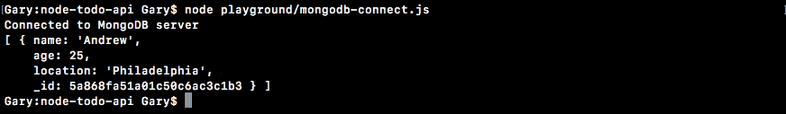

我们得到了我们插入的文档数组，只有一个。`name`、`age`和`location`属性都来自我们，`_id`属性来自 MongoDB。

接下来，我希望您验证它是否确实被插入到 Robomongo 中。通常，当您添加一个新的集合或新的数据库时，您可以右键单击连接本身，单击刷新，然后您应该能够看到添加的所有内容：

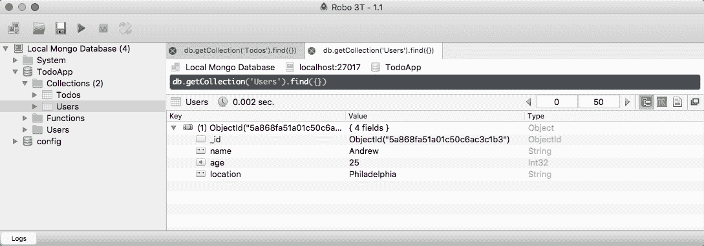

如前面的屏幕截图所示，我们有我们的 Users 集合。我可以查看 Users 的文档。我们得到了一个文档，其中名称设置为 Andrew，年龄设置为 25，位置设置为 Philadelphia。有了这个，我们现在完成了。我们已经能够使用 Node.js 连接到我们的 MongoDB 数据库，还学会了如何使用这个 mongo-native 库插入文档。在下一节中，我们将深入研究 ObjectIds，探讨它们究竟是什么，以及它们为什么有用。

# ObjectId

现在您已经将一些文档插入到 MongoDB 集合中，我想花一点时间谈谈 MongoDB 中的`_id`属性，因为它与您可能已经使用过的其他数据库系统（如 Postgres 或 MySQL）中的 ID 有些不同。

# MongoDB 中的 _id 属性

为了开始我们对`_id`属性的讨论，让我们继续重新运行`mongodb-connect`文件。这将向 Users 集合中插入一个新的文档，就像我们在`db.collection`行中定义的那样。我将通过在节点中运行文件来做到这一点。它在`playground`文件夹中，文件本身叫做`mongodb-connect.js`：

```js
node playground/mongodb-connect.js
```

我将运行命令，然后我们将打印出插入的文档：

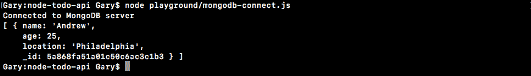

正如我们过去所看到的，我们得到了我们的三个属性，以及 Mongo 添加的一个属性。

关于这个的第一件事是，它不是一个自动递增的整数，就像对于 Postgres 或 MySQL 一样，第一条记录的 ID 是 1，第二条记录的 ID 是 2。Mongo 不使用这种方法。Mongo 被设计为非常容易扩展。扩展意味着你可以添加更多的数据库服务器来处理额外的负载。

想象一下，你有一个每天大约有 200 个用户的 Web 应用程序，你当前的服务器已经准备好处理这个流量。然后，你被某个新闻媒体选中，有 1 万人涌入你的网站。使用 MongoDB，很容易启动新的数据库服务器来处理额外的负载。当我们使用随机生成的 ID 时，我们不需要不断地与其他数据库服务器通信，以检查最高递增值是多少。是 7 吗？是 17 吗？这并不重要；我们只是简单地生成一个新的随机 ObjectId，并将其用于文档的唯一标识符。

现在，ObjectId 本身由几个不同的部分组成。它是一个 12 字节的值。前四个字节是时间戳；我们稍后会谈论这个。这意味着我们在数据中有一个内置的时间戳，指的是 ID 创建时刻的时间。这意味着在我们的文档中，我们不需要有一个`createdAt`字段；它已经编码在 ID 中了。

接下来的三个字节是机器标识符。这意味着如果两台计算机生成 ObjectId，它们的机器 ID 将是不同的，这将确保 ID 是唯一的。接下来，我们有两个字节，进程 ID，这只是另一种创建唯一标识符的方式。最后，我们有一个 3 字节的计数器。这类似于 MySQL 会做的。这只是 ID 的 3 个字节。正如我们已经提到的，我们有一个时间戳，它将是唯一的；一个机器标识符；一个进程 ID；最后，只是一个随机值。这就是 ObjectId 的组成部分。

ObjectId 是`_id`的默认值。如果没有提供任何内容，你确实可以对该属性做任何你喜欢的事情。例如，在`mongodb-connect`文件中，我可以指定一个`_id`属性。我将给它一个值，所以让我们用`123`；在末尾加上逗号；这是完全合法的：

```js
db.collection('Users').insertOne({
  _id: 123,
  name: 'Andrew',
  age: 25,
  location: 'Philadelphia'
}
```

我们可以保存文件，并使用*上*箭头键和*回车*键重新运行脚本：

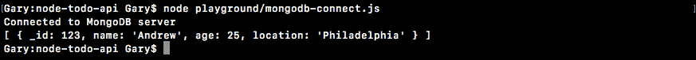

我们得到了我们的记录，其中`_id`属性是`123`。`ObjectId`是 MongoDB 创建 ID 的默认方式，但你可以为 ID 创建做任何你喜欢的事情。在 Robomongo 中，我们可以刷新我们的 Users 集合，然后得到我们的文档：

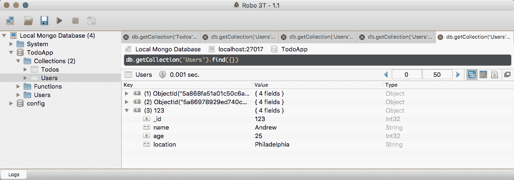

我们有我们在上一节中创建的一个，以及我们刚刚创建的两个，都有一个唯一的标识符。这就是为什么唯一的 ID 非常重要。在这个例子中，我们有三个属性：名称、年龄和位置，它们对所有记录都是相同的。这是一个合理的做法。想象两个人需要做同样的事情，比如买东西。仅仅那个字符串是不够唯一标识一个 Todo 的。另一方面，ObjectId 是唯一的，这就是我们将用来将诸如 Todos 之类的事物与诸如`Users`之类的事物关联起来的东西。

接下来，我想看一下我们在代码中可以做的一些事情。正如我之前提到的，时间戳被嵌入在这里，我们实际上可以将其提取出来。在 Atom 中，我们要做的是移除`_id`属性。时间戳只有在使用`ObjectId`时才可用。然后，在我们的回调函数中，我们可以继续将时间戳打印到屏幕上。

```js
db.collection('Users').insertOne({
  name: 'Andrew',
  age: 25,
  location: 'Philadelphia'
}, (err, result) => {
  if(err) {
    return console.log('Unable to insert user', err);
  }

  console.log(result.ops);
});
```

如果你记得，`result.ops`是一个包含所有插入的文档的数组。我们只插入一个，所以我将访问数组中的第一个项目，然后我们将访问`_id`属性。这将正如你所想的那样：

```js
console.log(result.ops[0]._id);
```

如果我们保存文件并从终端重新运行脚本，我们只会得到`ObjectId`打印到屏幕上：

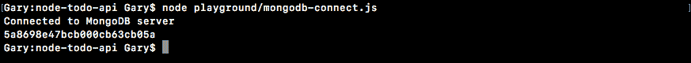

现在，我们可以在`_id`属性上调用一个方法。

# 调用`.getTimestamp`函数

我们要调用的是`.getTimestamp`。`getTimestamp`是一个函数，但它不需要任何参数。它只是返回 ObjectId 创建的时间戳：

```js
console.log(result.ops[0]._id.getTimestamp()); 
```

现在，如果我们继续重新运行我们的程序，我们会得到一个时间戳：

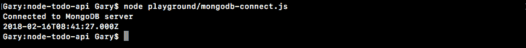

在前面的截图中，我可以看到 ObjectId 是在 2016 年 2 月 16 日 08:41 Z 创建的，所以这个时间戳确实是正确的。这是一个绝妙的方法，可以准确地确定文档是何时创建的。

现在，我们不必依赖 MongoDB 来创建我们的 ObjectIds。在 MongoDB 库中，他们实际上给了我们一个可以随时运行的函数来创建一个 ObjectId。暂时，让我们继续注释掉我们插入的调用。

在文件的顶部，我们将改变我们的导入语句，加载 MongoDB 的新内容，并且我们将使用 ES6 的对象解构来实现这一点。在我们实际使用它之前，让我们花一点时间来谈谈它。

# 使用对象解构 ES6

对象解构允许你从对象中提取属性以创建变量。这意味着如果我们有一个名为`user`的对象，并且它等于一个具有`name`属性设置为`andrew`和一个年龄属性设置为`25`的对象，如下面的代码所示：

```js
const MongoClient = require('mongodb').MongoClient;

var user = {name: 'andrew', age: 25};
```

我们可以很容易地将其中一个提取到一个变量中。比如说，我们想要获取名字并创建一个`name`变量。要在 ES6 中使用对象解构，我们将创建一个变量，然后将其包裹在花括号中。我们将提供我们想要提取的名字；这也将是变量名。然后，我们将把它设置为我们想要解构的对象。在这种情况下，那就是`user`对象：

```js
var user = {name: 'andrew', age: 25};
var {name} = user;
```

我们已经成功解构了`user`对象，取出了`name`属性，创建了一个新的`name`变量，并将其设置为任何值。这意味着我可以使用`console.log`语句将`name`打印到屏幕上：

```js
var user = {name: 'andrew', age: 25};
var {name} = user;
console.log(name);
```

我将重新运行脚本，我们得到`andrew`，这正是你所期望的，因为这是`name`属性的值：

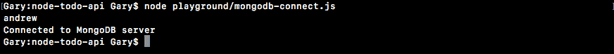

ES6 解构是从对象的属性中创建新变量的一种绝妙方式。我将继续删除这个例子，并且在代码顶部，我们将改变我们的`require`语句，以便使用解构。

在添加任何新内容之前，让我们继续并将 MongoClient 语句切换到解构；然后，我们将担心抓取那个新东西，让我们能够创建 ObjectIds。我将复制并粘贴该行，并注释掉旧的，这样我们就可以参考它。

```js
// const MongoClient = require('mongodb').MongoClient;
const MongoClient = require('mongodb').MongoClient;
```

我们要做的是在`require`之后删除我们的`.MongoClient`调用。没有必要去掉那个属性，因为我们将使用解构代替。这意味着在这里我们可以使用解构，这需要我们添加花括号，并且我们可以从 MongoDB 库中取出任何属性。

```js
const {MongoClient} = require('mongodb');
```

在这种情况下，我们唯一拥有的属性是`MongoClient`。这创建了一个名为`MongoClient`的变量，将其设置为`require('mongodb')`的`MongoClient`属性，这正是我们在之前的`require`语句中所做的。

# 创建 objectID 的新实例

现在我们有了一些解构，我们可以很容易地从 MongoDB 中取出更多的东西。我们可以添加一个逗号并指定我们想要取出的其他东西。在这种情况下，我们将取出大写的`ObjectID`。

```js
const {MongoClient, ObjectID} = require('mongodb');
```

这个`ObjectID`构造函数让我们可以随时创建新的 ObjectIds。我们可以随心所欲地使用它们。即使我们不使用 MongoDB 作为我们的数据库，创建和使用 ObjectIds 来唯一标识事物也是有价值的。接下来，我们可以通过首先创建一个变量来创建一个新的 ObjectId。我会称它为`obj`，并将其设置为`new ObjectID`，将其作为一个函数调用：

```js
const {MongoClient, ObjectID} = require('mongodb');

var obj = new ObjectID(); 
```

使用`new`关键字，我们可以创建`ObjectID`的一个新实例。接下来，我们可以使用`console.log(obj)`将其记录到屏幕上。这是一个普通的 ObjectId：

```js
console.log(obj); 
```

如果我们从终端重新运行文件，我们会得到你期望的结果：

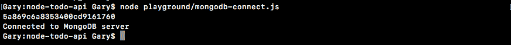

我们得到了一个看起来像 ObjectId 的东西。如果我再次运行它，我们会得到一个新的；它们都是唯一的：

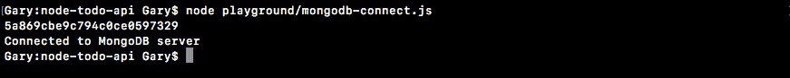

使用这种技术，我们可以在任何地方都使用 ObjectIds。我们甚至可以生成我们自己的 ObjectIds，将它们设置为我们文档的`_id`属性，尽管我发现让 MongoDB 为我们处理这些繁重的工作要容易得多。我将继续删除以下两行，因为我们实际上不会在脚本中使用这段代码：

```js
var obj = new ObjectID();
console.log(obj);
```

我们已经了解了一些关于 ObjectIds 的知识，它们是什么，以及它们为什么有用。在接下来的章节中，我们将看看我们可以如何与 MongoDB 一起工作的其他方式。我们将学习如何读取、删除和更新我们的文档。

# 获取数据

现在你知道如何向数据库插入数据了，让我们继续讨论如何从中获取数据。我们将在 Todo API 中使用这种技术。人们会想要填充一个他们需要的所有 Todo 项目的列表，并且他们可能想要获取有关单个 Todo 项目的详细信息。所有这些都需要我们能够查询 MongoDB 数据库。

# 在 Robomongo 文件中获取 todos

现在，我们将基于`mongodb-connect`创建一个新文件。在这个新文件中，我们将从数据库中获取记录，而不是插入记录。我将创建一个副本，将这个新文件称为`mongodb-find`，因为`find`是我们将用来查询数据库的方法。接下来，我们可以开始删除当前插入记录的所有注释掉的代码。让我们开始尝试从我们的 Todos 集合中获取所有的 Todos。现在，如果我转到 Robomongo 并打开`Todos`集合，我们只有一条记录：

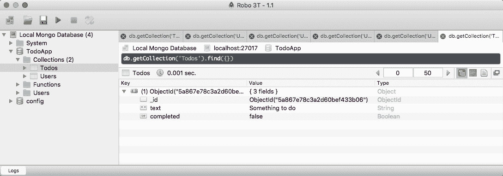

为了使这个查询更有趣一些，我们将继续添加第二个。在 Robomongo 窗口中，我可以点击插入文档。Robomongo 可以删除、插入、更新和读取所有的文档，这使它成为一个很棒的调试工具。我们可以随时添加一个新的文档，其中`text`属性等于`Walk the dog`，我们还可以附加一个`completed`值。我将`completed`设置为`false`：

```js
{
  text : "Walk the dog",
  completed : false
}
```

现在，默认情况下，我们不会提供`_id`属性。这将让 MongoDB 自动生成那个 ObjectId，而在这里我们有我们的两个 Todos：

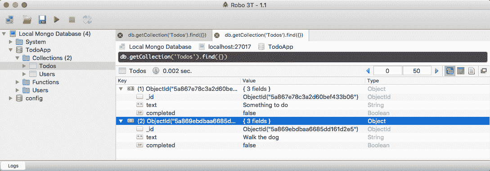

有了这个，让我们继续在 Atom 中运行我们的第一个查询。

# find 方法

在 Atom 中，我们要做的是访问集合，就像我们在`mongodb-connect`文件中使用`db.collection`一样，将集合名称作为字符串传递。这个集合将是`Todos`集合。现在，我们将继续使用集合上可用的一个叫做`find`的方法。默认情况下，我们可以不带参数地调用`find`：

```js
db.collection('Todos').find();
```

这意味着我们没有提供查询，所以我们没有说我们想要获取所有已完成或未完成的`Todos`。我们只是说我们想获取所有`Todos`：无论其值如何，一切。现在，调用 find 只是第一步。`find`返回一个 MongoDB 游标，而这个游标并不是实际的文档本身。可能有几千个，那将非常低效。它实际上是指向这些文档的指针，并且游标有大量的方法。我们可以使用这些方法来获取我们的文档。

我们将要使用的最常见的游标方法之一是`.toArray.`它确切地做了你认为它会做的事情。我们不再有游标，而是有一个文档的数组。这意味着我们有一个对象的数组。它们有 ID 属性，文本属性和完成属性。这个`toArray`方法恰好得到了我们想要的东西，也就是文档。`toArray`返回一个 promise。这意味着我们可以添加一个`then`调用，我们可以添加我们的回调，当一切顺利时，我们可以做一些像将这些文档打印到屏幕上的事情。

```js
db.collection('Todos').find().toArray().then((docs) => {

});
```

我们将得到文档作为第一个和唯一的参数，我们还可以添加一个错误处理程序。我们将传递一个错误参数，我们可以简单地打印一些像`console.log(无法获取 todos)`的东西到屏幕上；作为第二个参数，我们将传递`err`对象：

```js
db.collection('Todos').find().toArray().then((docs) => {

}, (err) => { 
  console.log('Unable to fetch todos', err); 
}); 
```

现在，对于成功的情况，我们要做的是将文档打印到屏幕上。我将继续使用`console.log`来打印一条小消息，`Todos`，然后我将再次调用`console.log`。这次，我们将使用`JSON.stringify`技术。我将传递文档，`undefined`作为我们的过滤函数和`2`作为我们的间距。

```js
  db.collection('Todos').find().toArray().then((docs) => {
    console.log('Todos');
    console.log(JSON.stringify(docs, undefined, 2));
  }, (err) => {
    console.log('Unable to fetch todos', err);
  });
```

我们现在有一个能够获取文档，将其转换为数组并将其打印到屏幕上的脚本。现在，暂时地，我将注释掉`db.close`方法。目前，那会干扰我们之前的代码。我们的最终代码将如下所示：

```js
//const MongoClient = require('mongodb').MongoClient;
const {MongoClient, ObjectID} = require('mongodb');

MongoClient.connect('mongodb://localhost:27017/TodoApp', (err, client) => {
  if(err){ 
    console.log('Unable to connect to MongoDB server');
  } 
  console.log('Connected to MongoDB server');
  const db = client.db('TodoApp');

  db.collection('Todos').find().toArray().then((docs) => {
    console.log('Todos');
    console.log(JSON.stringify(docs, undefined, 2));
  }, (err) => {
    console.log('Unable to fetch todos', err);
  });
  //client.close();
});
```

保存文件并从终端运行它。在终端中，我将继续运行我们的脚本。显然，由于我们用 Robomongo 连接到了数据库，它正在某个地方运行；它正在另一个标签页中运行。在另一个标签页中，我可以运行脚本。我们将通过`node`运行它；它在`playground`文件夹中，文件本身叫做`mongodb-find.js`：

```js
node playground/mongodb-find.js
```

当我执行这个文件时，我们将得到我们的结果：

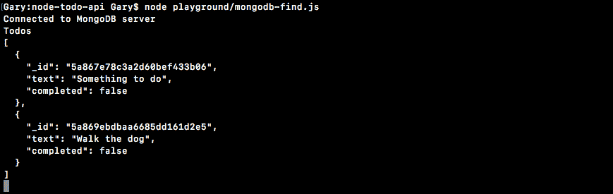

我们有我们的`Todos`数组和我们的两个文档。我们有我们的`_id`，我们的`text`属性和我们的`completed`布尔值。现在，我们有一种在 Node.js 中查询我们的数据的方法。现在，这是一个非常基本的查询。我们获取`Todos`数组中的所有内容，无论它是否具有某些值。

# 编写一个查询以获取特定值

为了基于某些值进行查询，让我们继续切换我们的`Todos`。目前，它们两个的`completed`值都等于`false`。让我们继续将`Walk the dog`的完成值更改为`true`，这样我们就可以尝试只查询未完成的项目。在 Robomongo 中，我将右键单击文档，然后单击编辑文档，然后我们可以编辑值。我将把`completed`值从`false`更改为`true`，然后我可以保存记录：

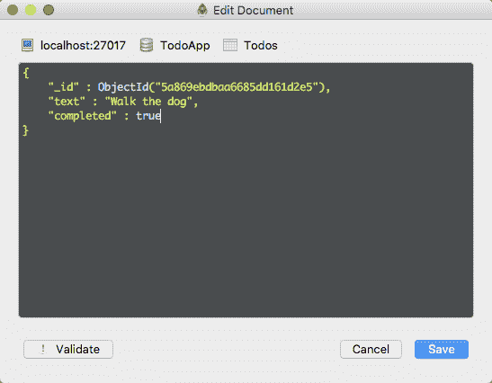

在终端内，我可以重新运行脚本来证明它已经改变。我将通过运行*control* + *C*关闭脚本，然后可以重新运行它：

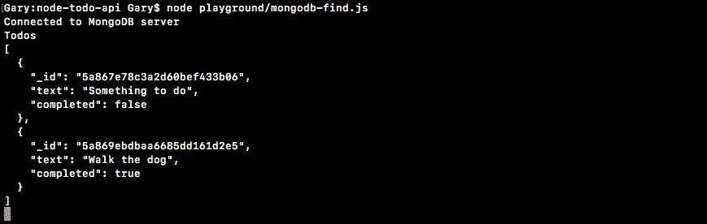

如前面的屏幕截图所示，我们有两个`Todos`，一个`completed`值为`false`，另一个`completed`值为`true`。默认情况下，待办事项应用程序可能只会显示您尚未完成的`Todos`集合。您已经完成的待办事项，比如`Walk the dog`，可能会被隐藏，尽管如果您点击了一个按钮，比如显示所有待办事项，它们可能是可访问的。让我们继续编写一个查询，只获取`completed`状态设置为`false`的`Todos`集合。

# 编写一个查询以获取已完成的待办事项

为了完成这个目标，在 Atom 中，我们将更改调用 find 的方式。我们不再传递`0`个参数，而是传递`1`个参数。这就是我们所谓的查询。我们可以开始指定我们想要查询`Todos`集合的方式。例如，也许我们只想查询`completed`值等于`false`的`Todos`。我们只需设置键值对来按值查询，如下所示：

```js
db.collection('Todos').find({completed: false}).toArray().then((docs) => {
```

如果我在终端中关闭脚本后重新运行我们的脚本，我们只会得到我们的一个待办事项：

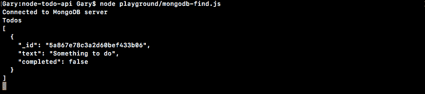

我们的项目有一个`text`等于`Something to do`。它的`completed`状态为`false`，所以它显示出来。我们的另一个待办事项，`Walk the dog`的`text`属性没有显示出来，因为它已经完成。它不匹配查询，所以 MongoDB 不会返回它。当我们开始根据已完成的值、文本属性或 ID 查询我们的文档时，这将会很有用。让我们花点时间来看看我们如何可以通过 ID 查询我们的`Todos`中的一个。

# 按 ID 查询待办事项

我们需要做的第一件事是从我们的查询对象中删除所有内容；我们不再想要按`completed`值查询。相反，我们将按`_id`属性查询。

现在，为了说明这一点，我将从终端获取`completed`值为`false`的待办事项的 ID。我将使用*command* + *C*进行复制。如果您使用的是 Windows 或 Linux，您可能需要在突出显示 ID 后右键单击，并单击复制文本。现在我已经将文本放入剪贴板，我可以转到查询本身。现在，如果我们尝试像这样添加 ID：

```js
db.collection('Todos').find({_id: ''}).toArray().then((docs) => {
```

它不会按预期工作，因为我们在 ID 属性中拥有的不是一个字符串。它是一个 ObjectId，这意味着我们需要使用之前导入的`ObjectID`构造函数来为查询创建一个 ObjectId。

为了说明这将如何发生，我将继续缩进我们的对象。这将使它更容易阅读和编辑。

```js
db.collection('Todos').find({
  _id: '5a867e78c3a2d60bef433b06'
}).toArray().then((docs) => {
```

现在，我要删除字符串并调用`new ObjectID`。`new ObjectID`构造函数确实需要一个参数：ID，在这种情况下，我们将其存储为字符串。这将按预期工作。

```js
db.collection('Todos').find({
  _id: new ObjectID('5a867e78c3a2d60bef433b06');
})
```

我们在这里所做的是查询`Todos`集合，寻找任何具有与我们拥有的 ID 相等的`_id`属性的记录。现在，我可以保存这个文件，通过重新运行脚本来刷新一下，我们将得到完全相同的待办事项：

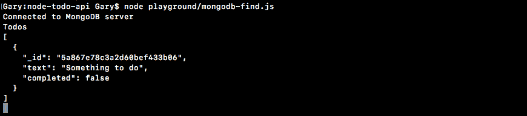

我可以继续将其更改为`Walk the dog`的待办事项，通过复制字符串值，将其粘贴到 ObjectID 构造函数中，并重新运行脚本。当我这样做时，我得到了`Walk the dog`的待办事项，因为那是我查询的 ObjectId。

现在，以这种方式查询是我们将使用 find 的方式之一，但除了`toArray`之外，我们的光标上还有其他方法可用。我们可以通过转到原生驱动程序的文档来探索其他方法。在 Chrome 中，打开 MongoDB 文档-这些是我在上一章中向您展示如何访问的文档-在左侧，我们有光标部分。

如果您点击，我们可以查看光标上可用的所有方法的列表：

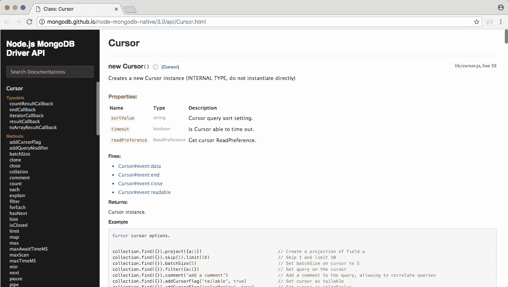

这是从 find 返回的内容。在列表的最底部，我们有我们的`toArray`方法。我们现在要看的是称为 count 的方法。从以前的内容，您可以继续并点击 count；它将带您到文档；原生驱动程序的文档实际上非常好。这里有您可以提供的所有参数的完整列表。其中一些是可选的，一些是必需的，通常有一个真实世界的例子。接下来，我们可以确切地找出如何使用`count`。

# 实现计数方法

现在，我们将继续在 Atom 中实现`count`。我要做的是将当前查询复制到剪贴板，然后将其注释掉。我将用一个调用`count`替换我们对`toArray`的调用。让我们继续删除我们传递给 find 的查询。我们要做的是计算`Todos`集合中的所有 Todos。我们将不再调用`toArray`，而是调用 count。

```js
db.collection('Todos').find({}).count().then((count) => {
```

正如您在 count 的示例中看到的那样，他们这样调用 count：调用 count，传递一个回调函数，该函数在出现错误或实际计数时调用。您还可以将 promise 作为访问数据的一种方式，这正是我们使用`toArray`的方式。在我们的情况下，我们将使用 promise 而不是传递回调函数。我们已经设置好了 promise。我们需要做的就是将`docs`更改为`count`，然后我们将删除打印 docs 到屏幕的`console.log`调用者。在我们打印 Todos 之后，我们将打印`Todos count`，并传入值。

```js
db.collection('Todos').find({}).count().then((count) => {
   console.log('Todos count:');
}, (err) => {
   console.log('Unable to fetch todos', err);
});
```

这不是一个模板字符串，但我将继续并用一个替换它，用`` ` ``替换引号。现在，我可以传入`count`。

```js
db.collection('Todos').find({}).count().then((count) => {
   console.log(`Todos count: ${count}`);
}, (err) => {
   console.log('Unable to fetch todos', err);
});
```

现在我们已经完成了这一步，我们有一个方法来计算`Todos`集合中的所有`Todos`的数量。 在终端中，我将关闭之前的脚本并重新运行它：

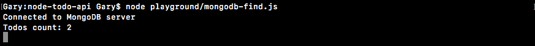

我们也得到了`Todos count`，这是正确的。 我们有一个调用 find 返回`Todos`集合中的所有内容的游标。 如果您将所有这些加起来，您将得到这两个 Todo 项目。

再次强调，这些是`count`和`toArray`；它们只是您可以使用的所有出色方法的一个子集。 我们将使用其他方法，无论是 MongoDB 本机驱动程序还是稍后将看到的 Mongoose 库，但现在让我们继续进行挑战，根据您的了解。

# 查询用户集合

要开始，让我们进入 Robomongo，打开`Users`集合，并查看我们在其中的所有文档。 目前我们有五个。 如果您的数量不完全相同，或者您的有点不同，也没关系。 我将突出显示它们，右键单击它们，并单击递归展开。 这将显示我每个文档的所有键值对：

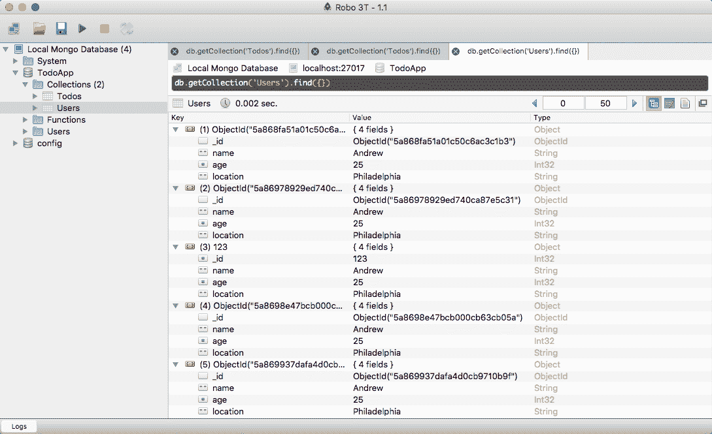

目前，除了 ID 之外，它们都是相同的。 名字都是 Andrew，年龄是 25，位置是费城。 我将调整其中两个的姓名属性。 我将右键单击第一个文档，并将名称更改为类似`Jen`的内容。 然后，我将继续对第二个文档执行相同的操作。 我将编辑该文档并将名称从`Andrew`更改为`Mike`。 现在我有一个名称为`Jen`的文档，一个名称为`Mike`的文档，还有三个名称为`Andrew`的文档。

我们将查询我们的用户，寻找所有名称等于您在脚本中提供的名称的用户。 在这种情况下，我将尝试查询`Users`集合中名称为`Andrew`的所有文档。 然后，我将它们打印到屏幕上，并且我期望会得到三个回来。 名称为`Jen`和`Mike`的两个不应该出现。

我们需要做的第一件事是从集合中获取。 这将是`Users`集合，而不是本章中使用的`Todos`集合。 在`db.collection`中，我们正在寻找`Users`集合，现在我们将继续调用`find`，传入我们的查询。 我们希望查询所有文档，其中`name`等于字符串`Andrew`。

```js
db.collection('Users').find({name: 'Andrew'})
```

这将返回游标。为了真正地获取这些文档，我们必须调用`toArray`。现在我们有一个 promise；我们可以将`then`调用附加到`toArray`上来对`docs`做一些事情。文档将作为我们成功处理程序的第一个参数返回，并且在函数本身内部，我们可以将文档打印到屏幕上。我将继续使用`console.log(JSON.stringify())`，传入我们的三个经典参数：对象本身，`docs`，`undefined`和`2`来进行格式化：

```js
db.collection('Users').find({name: 'Andrew'}).toArray().then((docs) => {
  console.log(JSON.stringify(docs, undefined, 2));
});
```

有了这个，我们现在就完成了。我们有一个查询，并且它应该可以工作。我们可以通过从终端运行它来进行测试。在终端中，我将关闭之前的连接，然后重新运行脚本：

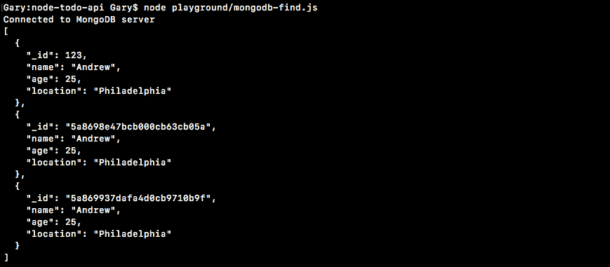

当我这样做时，我得到了三份文件。它们都有一个`name`等于`Andrew`，这是正确的，因为我们设置的查询。请注意，具有名称等于`Mike`或`Jen`的文档找不到了。

我们现在知道如何向数据库中插入和查询数据。接下来，我们将看看如何删除和更新文档。

# 设置存储库

在我们继续之前，我确实想为这个项目添加版本控制。在这一节中，我们将在本地创建一个新的存储库，创建一个新的 GitHub 存储库，并将我们的代码推送到该 GitHub 存储库中。如果你已经熟悉 Git 或 GitHub，你可以自行操作；你不需要通过这一节。如果你对 Git 还不明白，那也没关系。只需跟着进行，我们将一起完成整个过程。

这一部分将非常简单；这里涉及的内容与 MongoDB 无关。要开始，我将从终端使用`git init`初始化一个新的 Git 存储库。这将初始化一个新的仓库，我随时可以像这样运行`git status`来查看未跟踪的文件：

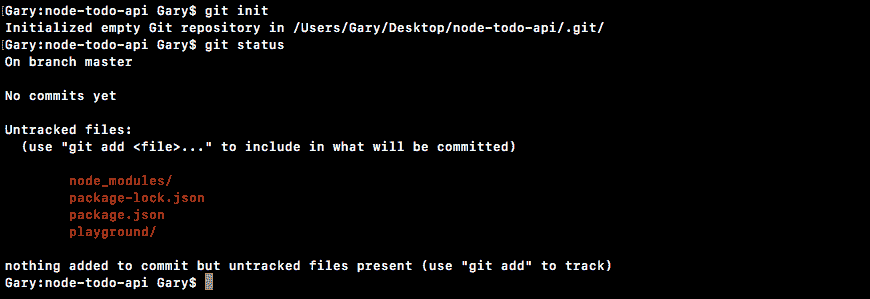

这里有我们的`playground`文件夹，我们希望将其添加到版本控制下，并且有`package.json`。我们还有`node_modules`。我们不想跟踪这个目录。这里包含了我们所有的 npm 库。要忽略`node_modules`，在 Atom 中我们将在项目的根目录下创建`.gitignore`文件。如果你记得的话，这可以让你指定你想要在版本控制之外的文件和文件夹。我将创建一个名为`.gitignore`的新文件。为了忽略`node_modules`目录，我们只需要像这里显示的那样输入它：

```js
node_modules/
```

我将保存文件并从终端重新运行`git status`。我们看到`.gitignore`文件出现了，而`node_modules`文件夹却不见了：

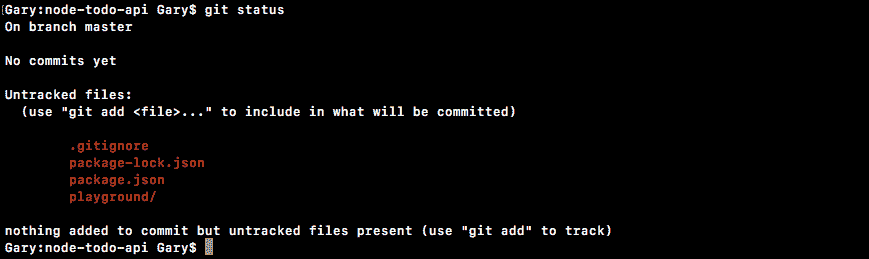

接下来，我们要做的是使用两个命令进行第一次提交。首先，我要使用 `git add .` 将所有内容添加到下一个提交中。然后，我可以使用带有 `-m` 标志的 `git commit` 进行提交。这次提交的一个好消息是 `初始提交`：

```js
git add .
git commit -m 'Init commit'
```

在我们离开之前，我想要创建一个 GitHub 仓库并将这段代码上传到上面。这将需要我打开浏览器并转到 [github.com](http://www.github.com)。一旦您登录，我们就可以创建一个新的仓库。我要创建一个新的仓库并给它一个名称：

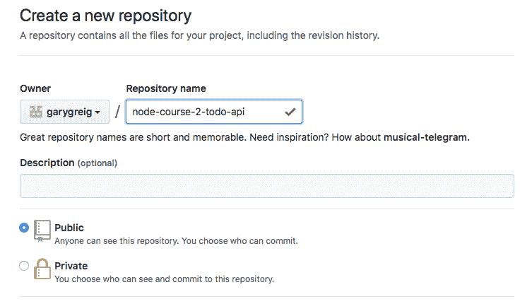

我将使用 `node-course-2-todo-api`。如果您愿意，您可以选择其他名称。我要选择这个来保持课程文件的组织。现在我可以继续创建这个仓库，并且正如您可能还记得的，GitHub 实际上给了我们一些有用的命令：

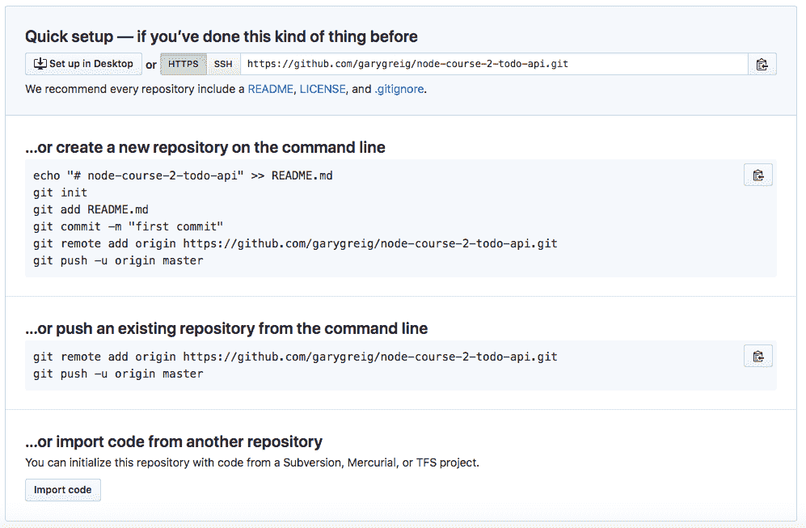

在这种情况下，我们正在从命令行推送一个现有仓库。我们已经经历了初始化仓库、添加文件和进行第一次提交的步骤。这意味着我可以复制以下两行，然后前往终端并将它们粘贴进去：

```js
git remote add origin https://github.com/garygreig/node-course-2-todo-api.git
git push -u origin master
```

取决于您的操作系统，您可能需要逐个执行这些命令。在 Mac 上，当我尝试粘贴多个命令时，它会运行所有命令，除了最后一个，然后我只需按回车键运行最后一个命令。花点时间为您的操作系统执行这些操作。您可能需要将它们作为一个命令运行，或者您可以粘贴所有内容并按*回车*键。无论哪种方式，我们的代码都被推送到了 GitHub。我可以通过刷新仓库页面来证明它已经推送上去了：

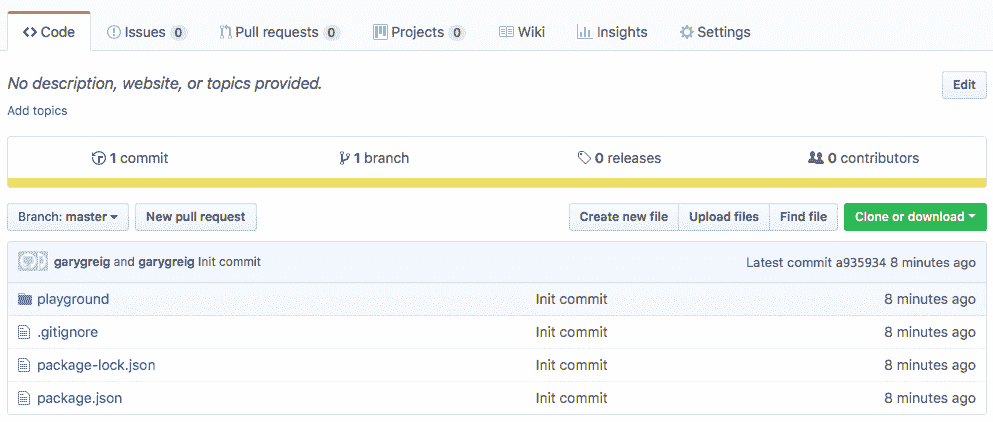

这里我们有所有的源代码、`.gitignore` 文件、`package.json`，还有我们的`playground`目录和我们的 MongoDB 脚本。

到此为止了。下一节我们将探讨如何从 MongoDB 集合中删除数据。

# 删除文档

在本节中，您将学习如何从 MongoDB 集合中删除文档。在深入探讨可以删除多个文档或只删除一个文档的方法之前，我们需要创建几个更多的 Todos。当前，`Todos` 集合仅有两个条目，我们需要更多的条目来演示这些涉及删除的方法。

现在，我有两个。我将继续创建第三个，可以通过右键单击然后转到插入文档...来完成。我们将使用 `text` 属性等于诸如 `吃午饭` 的新文档，并将 `completed` 设置为 `false`：

```js
{
   text: 'Eat lunch',
   completed: false
}
```

现在在保存之前，我会将它复制到剪贴板上。我们将创建一些重复的 Todos，这样我们就可以看到如何基于特定条件删除项目。在这种情况下，我们将删除具有相同文本值的多个 Todos。我将把它复制到剪贴板上，点击保存，然后我将创建两个具有完全相同结构的副本。现在我们有三个除了 ID 不同之外都相同的 Todos，以及两个具有唯一文本属性的 Todos：

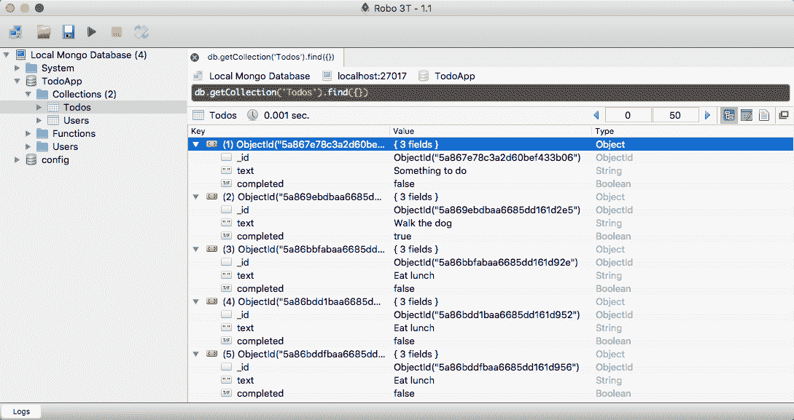

让我们继续进入 Atom 并开始编写一些代码。

# 探索删除数据的方法

我要复制`mongodb-find`文件，创建一个名为`mongodb-delete.js`的全新文件。在这里，我们将探索删除数据的方法。我还将删除我们在上一部分设置的所有查询。我将保留`db.close`方法的注释，因为我们不想立即关闭连接；这将干扰我们即将编写的这些语句。

现在，我们将使用三种方法来删除数据。

+   第一个将使用的是`deleteMany`。`deleteMany`方法让我们可以针对多个文档并将它们删除。

+   我们还将使用`deleteOne`，它可以定位一个文档并删除它。

+   最后，我们将使用`findOneAndDelete`。`findOneAndDelete`方法让您删除单个项目，并返回这些值。想象一下，我想删除一个 Todo。我删除了 Todo，但我也得到了 Todo 对象，所以我可以告诉用户确切地删除了哪一个。这是一个非常有用的方法。

# `deleteMany`方法

现在，我们将从`deleteMany`开始，并将针对我们刚刚创建的重复项。这一部分的目标是删除 Todos 集合中每一个`text`属性等于`吃午餐`的 Todo。目前，有五个中的三个符合这个条件。

在 Atom 中，我们可以通过执行`db.collection`来开始`db.collection`。这将让我们定位到我们的 Todos 集合。现在，我们可以继续使用`deleteMany`集合方法，传入参数。在这种情况下，我们只需要一个参数，就是我们的对象，这个对象就像我们传递给 find 的对象一样。有了这个，我们可以定位到我们的 Todos。在这种情况下，我们将删除所有`text`等于`吃午餐`的 Todo。

```js
//deleteMany 
db.collection('Todos').deleteMany({text: 'Eat lunch'});
```

在 RoboMongo 中我们没有使用任何标点符号，因此在 Atom 中我们也将避免使用标点符号；它需要完全相同。

现在我们可以添加`then`调用，当成功或失败时执行一些操作。现在，我们将只添加一个成功案例。我们将得到一个返回到回调的结果参数，并且我们可以将其打印到`console.log(result)`屏幕上，稍后我们将看一下这个结果对象的具体内容。

```js
//deleteMany 
db.collection('Todos').deleteMany({text: 'Eat lunch'}).then((result) => {
  console.log(result); 
});
```

有了这个，我们现在有一个可以删除所有`吃午饭`文本值的脚本。让我们继续运行它，看看发生了什么。在终端中，我将运行这个文件。它在`playground`文件夹中，我们刚刚称它为`mongodb-delete.js`：

```js
node playground/mongodb-delete.js
```

现在当我运行它时，我们会得到很多输出：

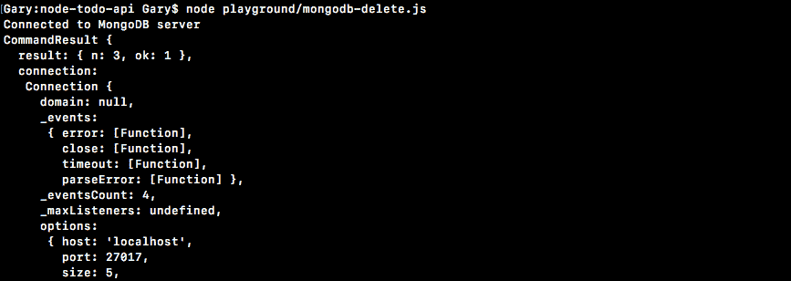

一个真正重要的输出部分，事实上是唯一重要的部分，就在顶部。如果你滚动到顶部，你会看到这个`result`对象。我们将`ok`设置为`1`，表示事情如预期般发生了，我们将`n`设置为`3`。`n`是已删除的记录数。在这种情况下，有三个符合条件的 Todos 被删除了。这就是你如何可以定位和删除许多 Todos。

# `deleteOne`方法

现在，除了`deleteMany`，我们还有`deleteOne`，`deleteOne`的工作方式与`deleteMany`完全相同，只是它删除它看到与条件匹配的第一项，然后停止。

为了确切地说明这是如何工作的，我们将创建两个项目并存放到我们的集合中。如果我刷新一下，你会看到我们现在只有两个文档：

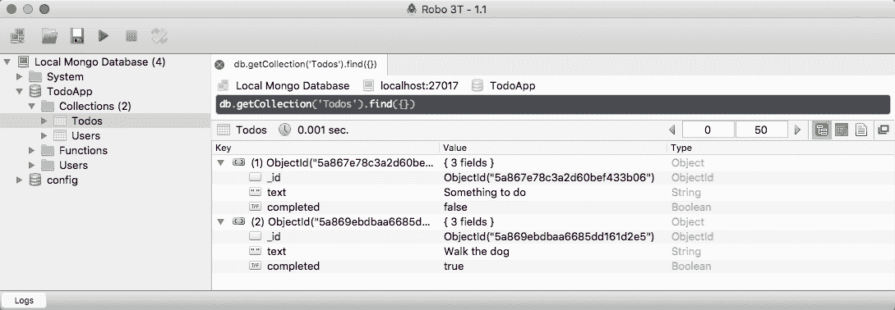

这些是我们开始的内容。我将再次使用剪贴板中的相同数据插入文档。这次我们只创建两个重复的文档。

# `deleteOne`方法

这里的目标是使用`deleteOne`删除文本等于`吃午饭`的文档，但因为我们使用的是`deleteOne`而不是`deleteMany`，其中一个应该保留，另一个应该被删除。

回到 Atom 中，我们可以通过调用`db.collection`并指定目标集合的名称开始工作。这次又是`Todos`，我们将使用`deleteOne`。`deleteOne`方法需要相同的条件。我们会对`text`等于`吃午饭`的文档进行操作。

这一次，我们只是要删除一个文档，而且我们依然会得到完全相同的结果。为了证明这一点，我会像之前用`console.log(result)`一样打印到屏幕上：

```js
//deleteOne 
db.collection('Todos').deleteOne({text: 'Eat lunch'}).then((result) => {
  console.log(result); 
});
```

有了这个，我们现在重新运行我们的脚本，看看发生了什么。在终端中，我将关闭当前的连接并重新运行它：

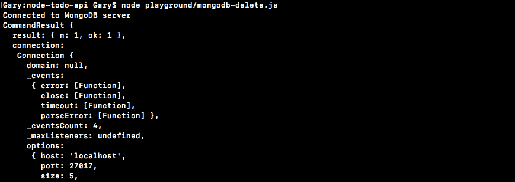

我们得到一个看起来类似的对象，一堆我们并不关心的无用东西，但是再次滚动到顶部，我们有一个`result`对象，其中`ok`为`1`，被删除的文档数量也是`1`。尽管有多个文档满足了这个条件，但它只删除了第一个，并且我们可以通过转到 Robomongo，右键单击上方，再次查看文档来证明这一点。这次，我们有三个 Todos。

我们仍然有一个带有`吃午饭`文本的 Todos:

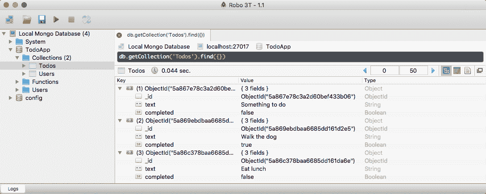

现在我们知道了如何使用这两种方法，我想来看看我最喜欢的方法。这就是`findOneAndDelete`。

# findOneAndDelete 方法

大多数时候，当我要删除文档时，我只有 ID。这意味着我不知道文本是什么或完成状态是什么，这取决于你的用户界面，这可能非常有用。例如，如果我删除了一个待办事项，也许我想显示，接着说*您删除了说吃午饭的待办事项*，并配备一个小的撤销按钮，以防他们不小心执行了该操作。获取数据以及删除它可以是非常有用的。

为了探索`findOneAndDelete`，我们将再次针对`text`等于`吃午饭`的待办事项进行操作。我将注释掉`deleteOne`，接下来我们可以通过访问适当的集合来开始。方法名为`findOneAndDelete`。`findOneAndDelete`方法接受一组非常相似的参数。我们唯一需要传递的是查询。这将与我们在上一屏幕截图中使用的相同。不过，这一次，让我们直接针对`completed`值设置为`false`的待办事项。

现在有两个符合此查询的待办事项，但再次使用的是`findOne`方法，这意味着它只会定位到它看到的第一个，即带有`text`属性为`有事情要做`的。回到 Atom 中，我们可以通过目标`completed`等于`false`的待办事项完成这个操作。现在，我们不再得到一个带有`ok`属性和`n`属性的结果对象，而是`findOneAndDelete`方法实际上获取了该文档。这意味着我们可以连接一个`then`调用，获取我们的结果，并再次使用`console.log(result)`打印到屏幕上：

```js
//findOneAndDelete
db.collection('Todos').findOneAndDelete({completed: false}).then((result) => {
  console.log(result);
});
```

现在我们有了这个方法，让我们在终端中测试一下。在终端中，我将关闭脚本，然后再次启动它：

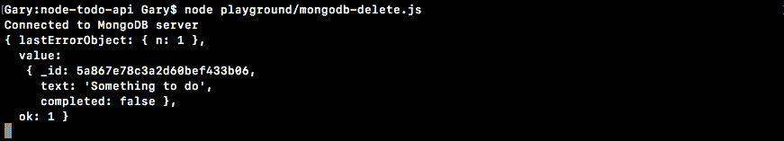

我们可以在结果对象中得到几种不同的东西。我们得到一个设置为`1`的`ok`，让我们知道事情进行得如计划。我们有一个`lastErrorObject`；我们马上就会讨论它；还有我们的`value`对象。这就是我们删除的实际文档。这就是为什么`findOneAndDelete`方法非常方便。它不仅得到了该文档，还删除了它。

现在在这种特殊情况下，`lastErrorObject`中再次只有我们的`n`属性，并且我们可以查看删除的待办事项数。`lastErrorObject`可能还包含其他信息，但只有在使用其他方法时才会发生，所以到时候我们再看。现在，当你删除待办事项时，我们只会得到一个数字。

有了这个方法，我们现在有三种不同的方法可以针对我们的 MongoDB 文档进行定位并删除它们。

# 使用 deleteMany 和 findOneAndDelete 方法

我们将进行一项快速挑战，以测试你的能力。在 Robomongo 中，我们可以查看`Users`集合中的数据。我将打开它，突出显示所有数据，并递归展开，以便我们可以查看：

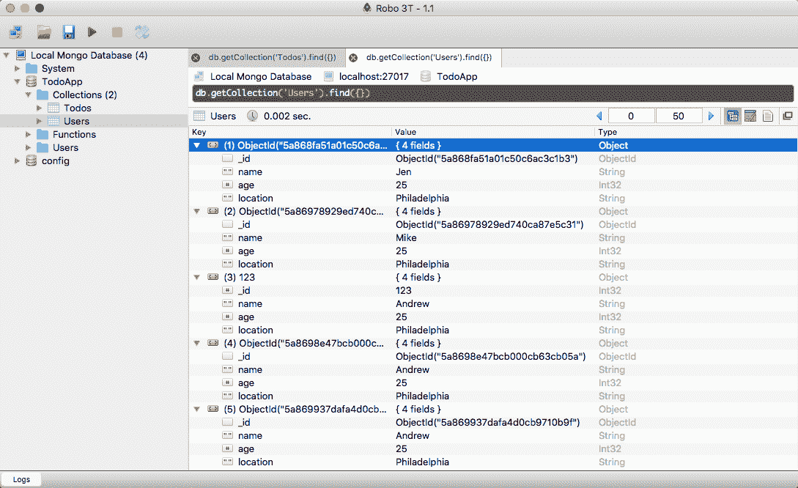

我们有 Jen 的名字；我们有 Mike；我们有 Andrew，Andrew 和 Andrew。这是完美的数据。你的数据可能看起来有些不同，但目标是使用两种方法。首先，查找任何重复项，任何具有与另一个文档名称相同的名称的文档。在这种情况下，我有三个名称为 Andrew 的文档。我想要使用`deleteMany`来定位并删除所有这些文档。我还想使用`findOneAndDelete`来删除另一个文档；无论哪一个都可以。而且我希望你通过 ID 来删除它。

最终，这两个语句都应该在 Robomongo 内显示它们的效果。当完成时，我希望看到这三个文档被删除。它们全部都叫 Andrew，我希望看到名为 Mike 的文档被删除，因为我打算用`findOneAndDelete`方法调用来定位它。

首先，我要编写我的脚本，一个用于删除名称为`Andrew`的用户，一个用于删除 ID 的文档。为了获取 ID，我将继续编辑，并简单地抓取引号内的文本，然后取消更新并移动到 Atom。

# 删除重复文档

首先，我们将尝试去除重复用户，我将使用`db.collection`来实现这一点。我们将针对`Users`集合进行操作，在这种特殊情况下，我们将使用`deleteMany`方法。在这里，我们将尝试删除所有`name`属性等于`Andrew`的用户。

```js
db.collection('Users').deleteMany({name: 'Andrew'});
```

现在我可以追加一个 then 调用来检查成功或错误，或者我可以像这样离开它，这就是我要做的。如果你使用回调或 promise 的 then 方法，那是完全可以的。只要删除发生了，你就可以继续。

# 使用 ID 定位文档

接下来，我将写另一个语句。我们再次针对`Users`集合进行操作。现在，我们将使用`findOneAndDelete`方法。在这种特殊情况下，我将删除`_id`等于我已复制到剪贴板的 ObjectId 的 Todo，这意味着我需要创建一个`new ObjectID`，并且我还需要在引号内传入剪贴板中的值。

```js
db.collection('Users').deleteMany({name: 'Andrew'});

db.collection('Users').findOneAndDelete({
  _id: new ObjectID("5a86978929ed740ca87e5c31")
})
```

单引号或双引号都可以。确保`ObjectID`的大写与你定义的内容完全相同，否则此创建将不会发生。

现在我们创建了`ID`并将其作为`_id`属性传递，我们可以继续添加`then`回调。因为我正在使用`findOneAndDelete`，我打算将那个文档打印到屏幕上。在这里，我将获得我的参数`results`，然后我将使用我们的漂亮打印方法将其打印到屏幕上，`console.log(JSON.stringify())`，传入这三个参数，`results`，`undefined`和间距，我将使用`2`。

```js
db.collection('Users').deleteMany({name: 'Andrew'});

db.collection('Users').findOneAndDelete({
  _id: new ObjectID("5a86978929ed740ca87e5c31")
}).then((results) => {
  console.log(JSON.stringify(results, undefined, 2));
});
```

有了这个，我们现在可以继续了。

# 运行 findOneAndDelete 和 deleteMany 语句

让我们首先注释掉`findOneAndDelete`。我们将运行`deleteMany`语句。在终端中，我可以关闭当前连接，然后再次启动它，如果我们进入 Robomongo，我们应该看到那三个文档已被删除。我将右键单击`Users`并查看文档：

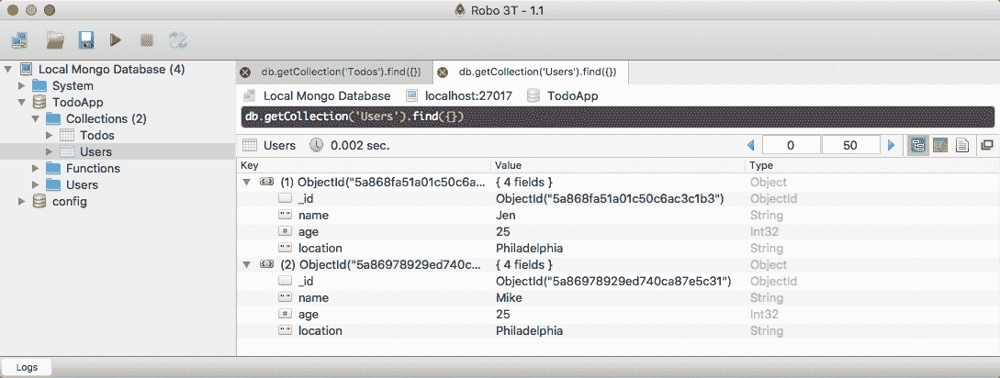

我们刚刚得到了两个文档。任何名为`Andrew`的都已被删除，这意味着我们的语句按预期运行了，这太棒了。

接下来，我们可以运行我们的`findOneAndDelete`语句。在这种情况下，我们期望那个`name`等于`Mike`的文档被删除。我将确保保存文件。一旦保存，我就可以进入终端并重新运行脚本。这一次，我们获得了`name`为`Mike`的文档。我们确实针对了正确的文档，并且似乎已经删除了一个项目：

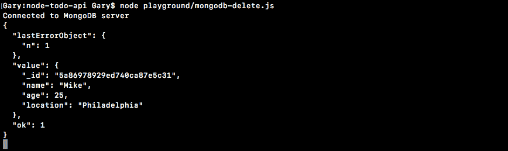

我可以随时通过刷新 Robomongo 中的集合来验证这一点：

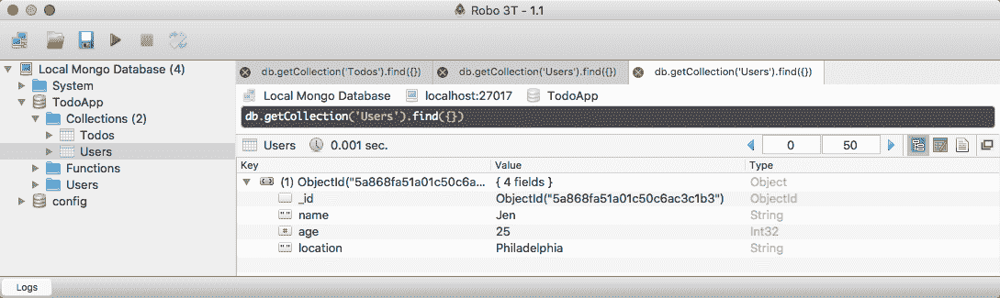

我得到了只有一个文档的集合。我们现在结束了。我们知道如何从我们的 MongoDB 集合中删除文档；我们可以删除多个文档；我们可以只针对一个，或者我们可以针对一个并获取其值。

# 为删除文档方法进行提交

在我们离开之前，让我们进行提交并将其推送到 GitHub。在终端中，我可以关闭脚本并运行`git status`以查看我们有未跟踪的文件。这里，我们有我们的`mongodb-delete`文件。我可以使用`git add .`添加它，然后我可以提交，使用带有`-m`标志的`git commit`。在这里，我可以提供提交消息，即`Add delete script`：

```js
git commit -m 'Add delete script'
```

我将进行提交并使用`git push`将其推送到 GitHub，默认情况下将使用 origin 远程仓库。当你只有一个远程仓库时，第一个将被称为 origin。这是默认名称，就像 master 是默认分支一样。有了这个，我们现在就结束了。我们的代码已经上传到 GitHub。下一节的主题是更新，你将学习如何更新集合中的文档。

# 更新数据

你知道如何向 MongoDB 中插入、删除和获取文档。在本节中，你将学习如何更新 MongoDB 集合中的文档。和往常一样，开始之前，我们将复制我们上次写的最后一个脚本，并将其更新用于本节。

我将复制`mongodb-delete`文件，重命名为`mongodb-update.js`，这就是我们将编写更新语句的地方。我还将删除我们写的所有语句，也就是被删除的数据。现在我们已经准备好了，接下来我们将探索本节将要学习的一个方法。这个方法叫做`findOneAndUpdate`。它有点类似于`findOneAndDelete`。它允许我们更新一项内容并获得新文档。所以，如果我更新一个待办事项，将其`completed`设置为`true`，我将在响应中得到那个文档。现在，为了开始，我们将更新我们 Todos 集合中的一项内容。如果查看文档，我们目前有两个。这里的目标将是更新第二项内容，即`text`等于`Eat lunch`的内容。我们将尝试将`completed`值设置为`true`，这将是一个很常见的操作。

如果我勾选一个待办事项，我们希望切换完成的布尔值。回到 Atom 中，我们将通过访问适当的集合来启动事情。那将是`db.collection`。集合名称是`Todos`，我们将使用的方法是`findOneAndUpdate`。现在，`findOneAndUpdate`将使用到目前为止我们使用过的最多参数，所以让我们去查找它的文档以备将来参考。

在 Chrome 中，我们目前打开了“Cursor”选项卡。这是我们定义`count`方法的地方。如果我们滚动到“Cursor”选项卡旁边，我们还有其他选项卡。我们正在寻找的是`Collection`。现在，在`Collection`部分，我们有我们的 typedefs 和方法。我们在这里看的是方法，所以如果我往下滚动，应该能找到`findOneAndUpdate`并单击它。现在，`findOneAndUpdate`需要传入一些参数。第一个是`filter`。`update`参数让我们可以指定要更新的文档。也许我们有文本，或者更有可能的是我们有文档的 ID。接下来是我们想要进行的实际更新。我们不想更新 ID，只想通过 ID 进行筛选。在这种情况下，更新的目标是更新“completed”布尔值。然后我们有一些选项，我们将对其进行定义。我们将仅使用其中之一。我们还有我们的`callback`。我们将继续遵循迄今为止的方式，忽略掉回调，而是使用 promises。正如您在文档页面上所看到的，如果没有传入回调，它会返回一个 promise，这正是我们所期望的。让我们开始填写适当的`findOneAndUpdate`参数，从`filter`开始。我要做的是通过 ID 进行筛选。在 Robomongo 中，我可以获取此文档的 ID。我将编辑它并将 ID 复制到剪贴板中。现在，在 Atom 中，我们可以开始查询第一个对象`filter`。我们只需要查找`_id`等于我们复制到剪贴板中的值的文档。这就是我们需要的`filter`参数。接下来要做的是要应用的实际更新，并且这并不是很直接。我们在这里要做的是了解 MongoDB 的更新操作符。

通过谷歌搜索`mongodb update operators`，我们可以查看完整的这些操作符列表以及它们的确切含义。当我这样做时，我们在寻找[mongodb.com](http://www.mongodb.com)文档：

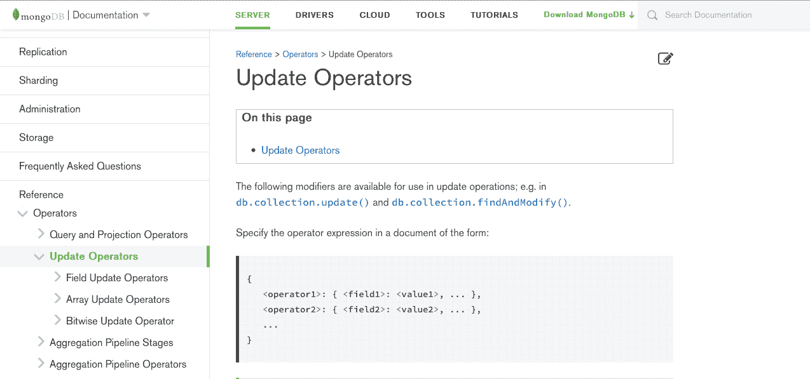

现在这个文档是专门针对 MongoDB 的，这意味着它适用于所有驱动程序。在这种情况下，它将与我们的 Node.js 驱动程序配合使用。如果我们继续向下滚动，我们可以查看我们可以访问的所有更新操作符。最重要的，也是我们要开始使用的是`$set`操作符。这让我们在更新中设置字段的值，这正是我们想要做的。还有其他操作符，比如增量。这个`$inc`让你增加字段的值，就像我们的`Users`集合中的`age`字段一样。虽然这些操作符非常有用，但我们要开始使用`$set`。要使用这些操作符之一，我们需要将其输入，并将其设置为一个对象。在这个对象中，这些就是我们实际要设置的东西。例如，我们想将`completed`设置为`true`。如果我们尝试像这样在对象的根目录下将`completed`设置为`true`，那么它不会按预期工作。我们必须使用这些更新操作符，这意味着我们需要这个。现在我们已经使用了设置更新操作符来更新我们的更新，我们可以继续提供我们的第三个和最后一个参数。如果你前往`findOneAndUpdate`的文档，我们可以快速查看一下`options`。我们关心的是`returnOriginal`。

`returnOriginal`方法默认为`true`，这意味着它返回原始文档，而不是更新后的文档，我们不希望如此。当我们更新文档时，我们希望得到更新后的文档。我们要做的就是将`returnOriginal`设置为`false`，这将在我们的第三个和最后一个参数中发生。这也将是一个对象，`returnOriginal`将被设置为`false`。

有了这个，我们就完成了。我们可以添加一个`then`调用来对结果进行操作。我将得到我的结果，并可以简单地将其打印到屏幕上，我们可以看一下具体返回了什么：

```js
db.collection('Todos').findOneAndUpdate({ 
  _id: new ObjectID('5a86c378baa6685dd161da6e') 
}, { 
  $set: { 
    completed:true 
  } 
}, { 
  returnOriginal: false 
}).then((result) => { 
  console.log(result); 
}); 
```

现在，让我们从终端运行这个。我将在终端中保存我的文件。我们将运行`node`。文件在`playground`文件夹中，我们将称它为`mongodb-update.js`。我将运行以下脚本：

```js
node playground/mongodb-update.js
```

我们得到了值属性，就像我们使用`findOneAndDelete`时一样，这里有我们的文档，其中`completed`值设置为`true`，这就是我们刚刚设置的全新值，这太棒了。

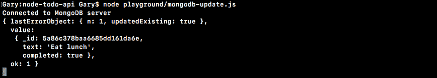

如果我们前往 Robomongo，我们可以确认值确实已经更新。我们可以在旧文档中看到这一点，在那里值为 false。我将为 Todos 打开一个新的视图：

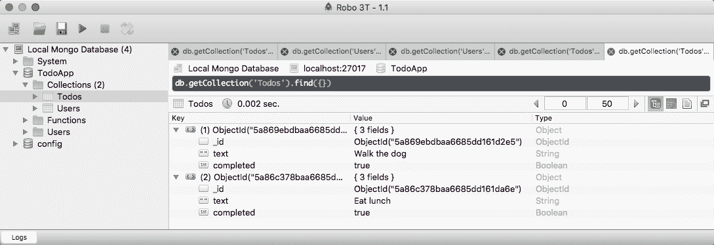

我们有一个包含值为 true 的吃午餐任务。既然我们已经完成了这一步，我们知道如何在 MongoDB 集合中插入、删除、更新和读取文档了。为了结束这一节，我想给你提供一个快速挑战。在 `Users` 集合中，你应该有一个文档。它应该有一个姓名。它可能不是 `Jen`；它可能是你设置的其他东西。我想让你把这个名字更新为你的名字。如果它已经是你的名字，那就没问题；你可以将它改为其他的东西。我还希望你使用 `$inc`，我们谈论过的增加运算符，将这个值增加 1。现在我不会告诉你增加运算符究竟是如何工作的。我希望你前往文档，点击 `运算符`，然后向下滚动查看示例。每个运算符都有示例。学会如何阅读文档对你变得非常有用。现在，各种库的文档并不总是一样的；每个人都有点不一样的做法；但是一旦你学会了如何阅读一个库的文档，那么阅读其他库的文档就会变得容易得多，而我在这门课程中只能教授一部分知识。这门课程的真正目的是让你编写自己的代码，进行自己的研究，并查阅自己的文档，所以你的目标再次是更新这个文档，将姓名设置为当前设置的其他名称，并将年龄增加 1。

要开始工作，我打算在 Robomongo 中获取文档的 ID，因为这是我想要更新的文档。我会将 ID 复制到剪贴板上，现在我们可以专注于在 Atom 中编写该语句了。首先，我们将更新姓名，因为我们已经知道如何做了。在 Atom 中，我将继续复制该语句：

```js
db.collection('Todos').findOneAndUpdate({
  _id: new ObjectID('57bc4b15b3b6a3801d8c47a2')
}, {
  $set: {
    completed:true
  }
}, {
  returnOriginal: false
}).then((result) => {
  console.log(result);
});
```

我会复制并粘贴它。回到 Atom 中，我们可以开始替换内容。首先，我们将使用新的 ID 替换旧的 ID，并更改我们传递给设置的内容。我们不想更新 `completed`，而是想要更新 `name`。我会将 `name` 设置为除了 `Jen` 之外的其他名称。我将使用我的名字 `Andrew`。现在，我们将保持 `returnOriginal` 设置为 `false`。我们想要拿回新文档，而不是原始文档。现在，我们需要做的另一件事是增加年龄。这将通过增加运算符来完成，你应该已经通过 Chrome 中的文档进行了探索。如果你点击 `$inc`，它会带你到文档的 `$inc` 部分，如果向下滚动，你应该能够看到一个示例。在这里，我们有一个增加的示例：

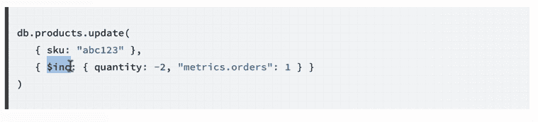

我们像设置 `set` 一样设置 `$inc`。然后，在对象内部，我们指定要递增的内容，以及要递增的程度。可以是`-2`，或者在我们的情况下，它将是正数，`1`。在 Atom 中，我们可以实现这一点，如下所示的代码：

```js
db.collection('Users').findOneAndUpdate({ 
  _id: new ObjectID('57abbcf4fd13a094e481cf2c') 
}, { 
  $set: { 
    name: 'Andrew' 
  }, 
  $inc: { 
    age: 1 
  } 
}, { 
  returnOriginal: false 
}).then((result) => { 
  console.log(result); 
}); 
```

我将 `$inc` 等于一个对象，并在其中，我们将 `age` 递增 `1`。有了这一点，我们现在完成了。在运行这个文件之前，我将把其他对 `findOneAndUpdate` 的调用注释掉，只留下新的。我还需要交换集合。我们不再更新 Todos 集合；我们正在更新`Users` 集合。现在，我们可以开始了。我们将 `name` 设置为 `Andrew`，并将 `age` 递增 `1`，这意味着我们期望 Robomongo 中的年龄为 26 而不是 25。让我们重启终端中的脚本来运行它：

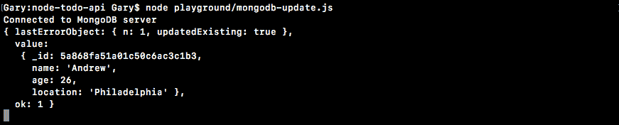

我们可以看到我们的新文档，其中名称确实为 `Andrew`，年龄确实为`26`，这太棒了。既然你知道如何使用递增运算符，你也可以去学习你在更新调用中可用的所有其他运算符。我可以在 Robomongo 中再次检查一切是否按预期工作。我将刷新`Users`集合：

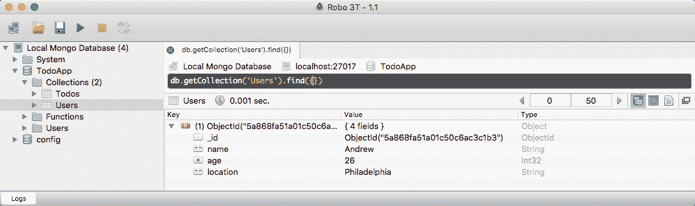

我们在这里有我们的更新文档。好了，让我们通过提交更改来结束本节。在终端中，我将运行 `git status` 以查看存储库的所有更改：

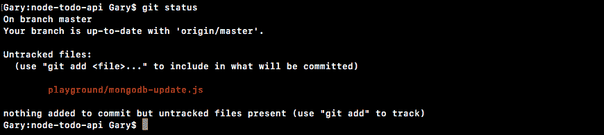

在这里，我们只有一个未跟踪的文件，我们的`mongodb-update`脚本。我将使用 `git add .` 将其添加到下一次提交中，然后使用 `git commit` 实际进行提交。我将为 `message` 提供 `-m` 参数，以便我们可以指定消息，这将是 `Add update script`：

```js
git add .
git commit -m 'Add update script'
```

现在我们可以运行提交命令并将其推送到 GitHub，这样我们的代码就备份到了 GitHub 存储库中：

```js
git push
```

更新完成后，我们现在已经掌握了所有基本的 CRUD（创建、读取、更新和删除）操作。接下来，我们将讨论一个叫做 Mongoose 的东西，我们将在 Todo API 中使用它。

# 总结

在本章中，我们从连接到 MongoDB 并写入数据开始。然后，我们继续了解了在 MongoDB 上下文中的`id`属性。在学习更多关于获取数据之后，我们探索了在文档中删除数据的不同方法。

在下一章中，我们将继续与 Mongoose、MongoDB 和 REST API 进行更多的操作。
