# 第三章：MongoDB，Mongoose 和 REST API - 第二部分

在本章中，您最终将离开`playground`文件夹，并且我们将开始使用 Mongoose。我们将连接到我们的 MongoDB 数据库，创建一个模型，讨论模型的确切含义，最后，我们将使用 Mongoose 向数据库保存一些数据。

# 设置 Mongoose

我们不需要在`playground`目录中打开的任何文件，所以我们可以关闭它们。我们还将使用 Robomongo 清除`TodoApp`数据库。Robomongo 中的数据将与我们将来使用的数据有些不同，最好从头开始。在删除数据库后，无需创建数据库，因为如果您记得，一旦开始向数据库写入数据，MongoDB 将自动创建数据库。有了这个准备，我们现在可以探索 Mongoose，我总是喜欢做的第一件事是查看网站。

你可以通过访问[mongoosejs.com](http://mongoosejs.com/)来查看网站：

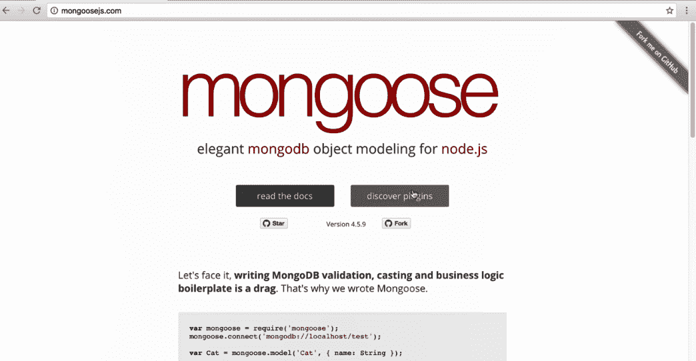

在这里，您可以找到示例，指南，插件的完整列表以及大量的优秀资源。我最常使用的是阅读文档资源。它包括类似教程的指南，具有示例，以及覆盖库的每个功能的文档。这真的是一个很棒的资源。

如果您想了解某些内容或者想使用书中未涵盖的功能，我强烈建议您来到这个页面，获取一些例子，复制和粘贴一些代码，玩弄一下，并弄清楚它是如何工作的。我们现在将介绍大部分基本的 Mongoose 功能。

# 设置项目的根目录

在我们实际在项目中使用 Mongoose 之前，我们需要做的第一件事是安装它。在终端中，我将使用`npm i`来安装它，这是`npm install`的缩写。模块名称本身称为`mongoose`，我们将安装最新版本，即`5.0.6`版本。我们将添加`--save`标志，因为我们将需要 Mongoose 用于生产和测试目的。

```js
**npm i mongoose@5.0.6 --save**
```

一旦我们运行这个命令，它就会开始执行。我们可以进入 Atom 并开始创建我们运行应用程序所需的文件。

首先，让我们在项目的根目录中创建一个文件夹。这个文件夹将被称为`server`，与我们的服务器相关的所有内容都将存储在`server`文件夹中。我们将创建的第一个文件将被称为`server.js`。这将是我们应用程序的根。当您想启动您的 Node 应用程序时，您将运行这个文件。这个文件将准备好一切。

我们在`server.js`中需要做的第一件事是加载 Mongoose。我们将创建一个名为`mongoose`的变量，并从`mongoose`库中获取它。

```js
var mongoose = require('mongoose');
```

现在我们已经有了`mongoose`变量，我们需要继续连接到数据库，因为在 Mongoose 知道如何连接之前，我们无法开始向数据库写入数据。

# 连接 mongoose 到数据库

连接的过程将与我们在 MongoDB 脚本中所做的非常相似；例如，`mongodb-connect`脚本。在这里，我们调用了`MongoClient.connect`，传入了一个 URL。对于 Mongoose，我们要做的是调用`mongoose.connect`，传入完全相同的 URL；`mongodb`是协议，调用`//`。我们将连接到我们的`localhost`数据库，端口为`27017`。接下来是我们的`/`，然后是数据库名称，我们将继续使用`TodoApp`数据库，这是我们在`mongodb-connect`脚本中使用的。

```js
var mongoose = require('mongoose');

mongoose.connect('mongodb://localhost:27017/TodoApp');
```

这就是这两个函数的不同之处。`MongoClient.connect`方法接受一个回调函数，那时我们就可以访问数据库。Mongoose 要复杂得多。这是好事，因为这意味着我们的代码可以简单得多。Mongoose 会随着时间维护连接。想象一下，我尝试保存一些东西，`save new something`。现在显然，当这个保存语句运行时，`mongoose.connect`还没有时间去发出数据库请求来连接。那至少需要几毫秒。这个语句几乎会立即运行。

在幕后，Mongoose 将等待连接，然后才会尝试进行查询，这是 Mongoose 的一个巨大优势之一。我们不需要微观管理事情发生的顺序；Mongoose 会为我们处理。

我还想在`mongoose.connect`的上面配置一件事。在这门课程中，我们一直在使用 promises，并且我们将继续使用它们。Mongoose 默认支持回调，但回调并不是我喜欢编程的方式。我更喜欢 promises，因为它们更容易链式、管理和扩展。在`mongoose.connect`语句的上面，我们将告诉 Mongoose 我们想要使用哪个 promise 库。如果你不熟悉 promise 的历史，它并不一定总是内置在 JavaScript 中的。Promise 最初来自像 Bluebird 这样的库。这是一个开发者的想法，他们创建了一个库。人们开始使用它，以至于他们将其添加到了语言中。

在我们的情况下，我们需要告诉 Mongoose 我们想要使用内置的 promise 库，而不是一些第三方的库。我们将把`mongoose.Promise`设置为`global.Promise`，这是我们只需要做一次的事情：

```js
var mongoose = require('mongoose');

mongoose.Promise = global.Promise;
mongoose.connect('mongodb://localhost:27017/TodoApp');
```

我们只需要把这两行放在`server.js`中；我们不需要在其他地方添加它们。有了这个配置，Mongoose 现在已经配置好了。我们已经连接到了我们的数据库，并设置它使用 promises，这正是我们想要的。接下来我们要做的是创建一个模型。

# 创建待办事项模型

现在，正如我们已经讨论过的，MongoDB 中，你的集合可以存储任何东西。我可以有一个具有年龄属性的文档的集合，就是这样。我可以在同一个集合中有一个不同的文档，具有一个名字属性；就是这样。这两个文档是不同的，但它们都在同一个集合中。Mongoose 喜欢保持事情比那更有组织性一些。我们要做的是为我们想要存储的每样东西创建一个模型。在这个例子中，我们将创建一个待办事项模型。

现在，待办事项将具有某些属性。它将有一个`text`属性，我们知道它是一个字符串；它将有一个`completed`属性，我们知道它是一个布尔值。这些是我们可以定义的。我们要做的是创建一个 Mongoose 模型，这样 Mongoose 就知道如何存储我们的数据。

在`mongoose.connect`语句的下面，让我们创建一个名为`Todo`的变量，并将其设置为`mongoose.model`。`model`是我们将用来创建新模型的方法。它接受两个参数。第一个是字符串名称。我将匹配左边的变量名`Todo`，第二个参数将是一个对象。

```js
mongoose.connect('mongodb://localhost:27017/TodoApp');
var Todo = mongoose.model('Todo', {

});
```

这个对象将定义模型的各种属性。例如，待办事项模型将有一个`text`属性，所以我们可以设置它。然后，我们可以将 text 设置为一个对象，并且可以配置 text 的具体内容。我们也可以为`completed`做同样的事情。我们将有一个 completed 属性，并且我们将要指定某些内容。也许它是必需的；也许我们有自定义验证器；也许我们想设置类型。我们还将添加一个最终的属性`completedApp`，这将让我们知道何时完成了一个待办事项：

```js
var Todo = mongoose.model('Todo', {
  text: {

  },
  completed: {

  },
  completedAt: {

  }
});
```

`createdApp`属性可能听起来有用，但如果你记得 MongoDB 的`ObjectId`，它已经内置了`createdAt`时间戳，所以在这里没有理由添加`createdApp`属性。另一方面，`completedAt`将增加价值。它让你确切地知道你何时完成了一个 Todo。

从这里开始，我们可以开始指定每个属性的细节，Mongoose 文档中有大量不同的选项可用。但现在，我们将通过为每个属性指定类型来保持简单，例如`text`。我们可以将`type`设置为`String`。它始终将是一个字符串；如果它是布尔值或数字就没有意义了。

```js
var Todo = mongoose.model('Todo', {
  text: {
    type: String
  },
```

接下来，我们可以为`completed`设置一个类型。它需要是一个布尔值；没有其他办法。我们将把`type`设置为`Boolean`。

```js
  completed: {
    type: Boolean
  },
```

我们最后一个属性是`completedAt`。这将是一个普通的 Unix 时间戳，这意味着它只是一个数字，所以我们可以将`completedAt`的`type`设置为`Number`。

```js
  completedAt: {
    type: Number
  }
});
```

有了这个，我们现在有一个可用的 Mongoose 模型。这是一个具有几个属性的 Todo 模型：`text`，`completed`和`completedAt`。

为了准确说明我们如何创建这些实例，我们将继续添加一个 Todo。我们不会担心获取数据、更新数据或删除数据，尽管这是 Mongoose 支持的功能。我们将在接下来的部分中担心这些问题，因为我们将开始为 API 的各个路由构建。现在，我们将简要介绍如何创建一个全新的 Todo 的示例。

# 创建一个全新的 Todo

我将创建一个名为`newTodo`的变量，尽管你可以给它取任何你喜欢的名字；这里的名字并不重要。但重要的是你运行 Todo 函数。这是从`mongoose.model`返回的构造函数。我们要在它前面加上`new`关键字，因为我们正在创建`Todo`的一个新实例。

现在，`Todo`构造函数确实需要一个参数。它将是一个对象，我们可以在其中指定一些这些属性。也许我们知道我们希望`text`等于`Cook dinner`之类的东西。在函数中，我们可以指定。`text`等于一个字符串，`Cook dinner`：

```js
var newTodo = new Todo({
  text: 'Cook dinner'
});
```

我们还没有要求任何属性，所以我们可以到此为止。我们有一个`text`属性；这已经足够了。让我们继续探讨如何将其保存到数据库。

# 将实例保存到数据库

仅仅创建一个新实例并不会实际更新 MongoDB 数据库。我们需要在`newTodo`上调用一个方法。这将是`newTodo.save`。`newTodo.save`方法将负责将`text`实际保存到 MongoDB 数据库中。现在，`save`返回一个 promise，这意味着我们可以添加一个`then`调用并添加一些回调。

```js
newTodo.save().then((doc) => {

}, (e) => {

});
```

我们将为数据保存成功或出现错误时添加回调。也许连接失败了，或者模型无效。无论如何，现在我们只是打印一个小字符串，`console.log(Unable to save todo)`。在上面的成功回调中，我们实际上将得到那个 Todo。我可以将参数称为`doc`，并将其打印到屏幕上，`console.log`。我将首先打印一条小消息：`Saved todo`，第二个参数将是实际的文档：

```js
newTodo.save().then((doc) => {
  console.log('Saved todo', doc);
}, (e) => {
  console.log('Unable to save todo');
});
```

我们已经配置了 Mongoose，连接到了 MongoDB 数据库；我们创建了一个模型，指定了我们希望 Todos 具有的属性；我们创建了一个新的 Todo；最后，我们将其保存到了数据库中。

# 运行 Todos 脚本

我们将从终端运行脚本。我将通过运行`node`来启动，我们要运行的文件位于`server`目录中，名为`server.js`：

```js
**node server/server.js** 
```

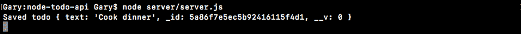

当我们运行文件时，我们得到`Saved todo`，这意味着事情进行得很顺利。我们在这里有一个对象，有一个预期的`_id`属性；我们指定的`text`属性；和`__v`属性。`__v`属性表示版本，它来自 mongoose。我们稍后会谈论它，但基本上它会跟踪随时间的各种模型更改。

如果我们打开 Robomongo，我们会看到完全相同的数据。我要右键单击连接并刷新它。在这里，我们有我们的`TodoApp`。在`TodoApp`数据库中，我们有我们的`todos`集合：

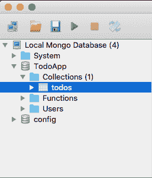

mongoose 自动将 Todo 转换为小写并复数形式。我要查看文档：

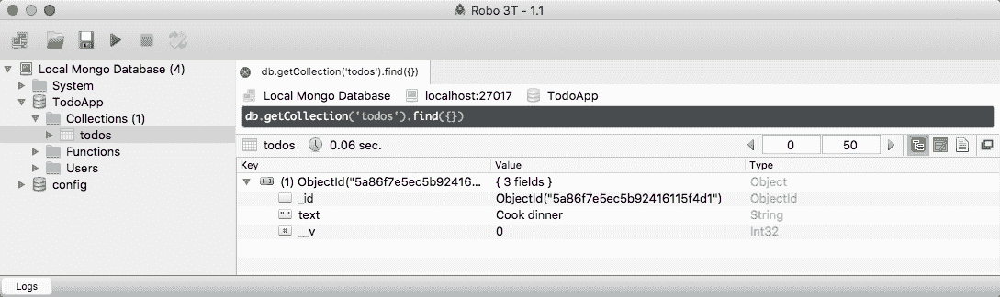

我们有一个文档，文本等于 Cook dinner，就是我们在 Atom 中创建的。

# 创建第二个 Todo 模型

我们使用我们的 mongoose 模型创建了一个 Todo。我希望你做的是创建第二个，填写所有三个值。这意味着你要创建一个新的 Todo，有一个`text`值，一个`completed`布尔值；继续设置为`true`；和一个`completedAt`时间戳，你可以设置为任何你喜欢的数字。然后，我希望你继续保存它；如果保存成功，将其打印到屏幕上；如果保存不好，打印一个错误。最后，运行它。

我首先要做的是在下面创建一个新变量。我要创建一个名为`otherTodo`的变量，将其设置为`Todo`模型的一个`new`实例。

```js
var otherTodo = new Todo ({

});
```

从这里，我们可以传入我们的一个参数，这将是对象，并且我们可以指定所有这些值。我可以将`text`设置为任何我喜欢的值，例如`Feed the cat`。我可以将`completed`值设置为`true`，我可以将`completedAt`设置为任何数字。任何小于 0 的值，比如-1，都会从 1970 年开始倒数。任何正数都将是我们所在的位置，我们稍后会更多地讨论时间戳。现在，我要选择类似`123`的东西，基本上是 1970 年的两分钟。

```js
var otherTodo = new Todo ({
  text: 'Feed the cat',
  completed: true,
  completedAt: 123
});
```

有了这个，我们现在只需要调用`save`。我要调用`otherTodo.save`。这实际上是要写入到 MongoDB 数据库的。我要添加一个`then`回调，因为我确实想在保存完成后做一些事情。如果`save`方法成功，我们将得到我们的`doc`，我要将其打印到屏幕上。我要使用我们之前谈到的漂亮打印系统，`JSON.stringify`，传入实际对象，`undefined`和`2`。

```js
var otherTodo = new Todo ({
  text: 'Feed the cat',
  completed: true,
  completedAt: 123
});

otherTodo.save().then((doc) => {
  console.log(JSON.stringify(doc, undefined, 2));
})
```

你不需要这样做；你可以以任何你喜欢的方式打印它。接下来，如果事情进行得不好，我要打印一条小消息：`console.log('Unable to save', e)`。它会传递那个错误对象，所以如果有人在阅读日志，他们可以看到调用失败的原因。

```js
otherTodo.save().then((doc) => {
  console.log(JSON.stringify(doc, undefined, 2));
}, (e) => {
  console.log('Unable to save', e);
});
```

有了这个，我们现在可以注释掉那个第一个 Todo。这将阻止创建另一个，我们可以重新运行脚本，运行我们全新的 Todo 创建调用。在终端中，我要关闭旧连接并启动一个新连接。这将创建一个全新的 Todo，我们就在这里：

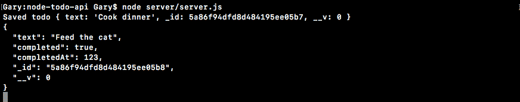

`text`属性等于`Feed the cat`。`completed`属性设置为布尔值`true`；注意它周围没有引号。`completedAt`等于数字`123`；再次，没有引号。我也可以进入 Robomongo 来确认这一点。我要重新获取 Todos 集合，现在我们有两个 Todos：

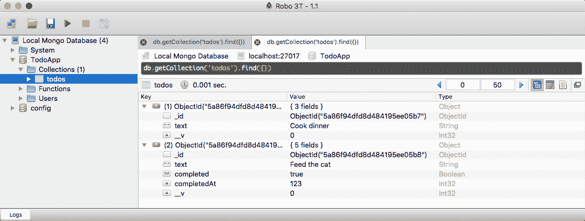

在值列的右侧，你还会注意到类型列。在这里，我们有 int32 用于 completedAt 和 __v 属性。completed 属性是一个布尔值，text 是一个字符串，_id 是一个 ObjectId 类型。

Robomongo 中隐藏了很多有用的信息。如果你想要什么，他们很可能已经内置了。就是这样。我们现在知道如何使用 Mongoose 建立连接，创建模型，最终将该模型保存到数据库中。

# 验证器、类型和默认值

在本节中，你将学习如何改进你的 Mongoose 模型。这将让你添加诸如验证之类的东西。你可以使某些属性成为必需项，并设置智能默认值。因此，如果没有提供类似已完成的东西，你可以设置一个默认值。所有这些功能都内置在 Mongoose 中；我们只需要学会如何使用它。

为了说明为什么我们要设置这些东西，让我们滚动到我们的`server`文件的底部，删除我们创建的`new Todo`上的所有属性。然后，我们将保存文件并进入终端，运行脚本。这将是在`server`目录中的`node`，文件将被称为`server.js`：

```js
**node server/server.js** 
```

当我们运行它时，我们得到了我们的新 Todo，但它只有版本和 ID 属性：

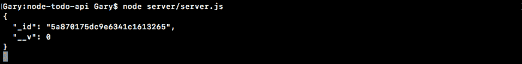

我们在模型中指定的所有属性，`text`，`completed`和`completedAt`，都找不到。这是一个相当大的问题。如果它们没有`text`属性，我们不应该将 Todo 添加到数据库中，`completed`之类的东西应该有智能默认值。如果没有人会创建一个已经完成的 Todo 项目，那么`completed`应该默认为`false`。

# Mongoose 验证器

现在，为了开始，我们将在 Mongoose 文档中打开两个页面，这样你就知道这些东西的位置，如果将来想深入了解的话。首先，我们将查找验证器。我将搜索“mongoose 验证器”，这将显示我们内置的所有默认验证属性：

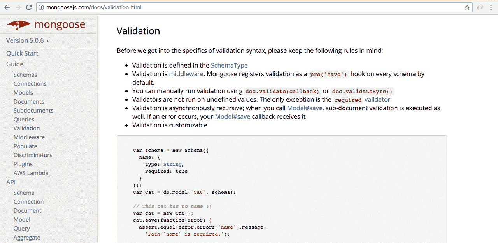

例如，我们可以将某些东西设置为“必需的”，所以如果没有提供，当我们尝试保存该模型时，它将抛出错误。我们还可以为数字和字符串设置验证器，为字符串设置`minlength`/`maxlength`值。

我们要查看的另一个页面是模式页面。要进入这个页面，我们将搜索“mongoose 模式”。这是第一个页面，`guide.html`文件：

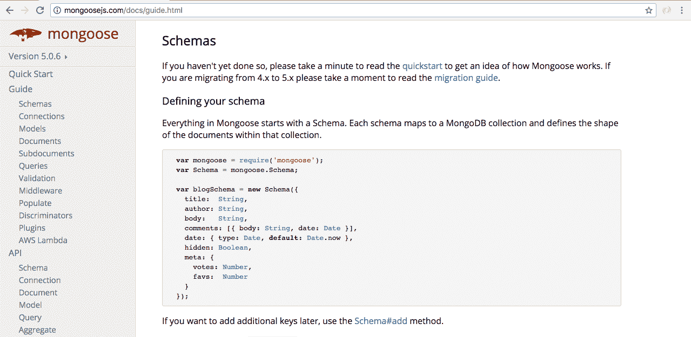

在这个页面上，你将看到与我们迄今为止所做的略有不同的东西。他们称之为“新模式”，设置所有属性。这不是我们到目前为止所做的事情，但将来我们会做。现在，你可以将这个对象，即“模式”对象，视为我们在 Atom 中拥有的对象，作为我们的`mongoose.model`调用的第二个参数传递过去。

# 自定义 Todo 文本属性

为了开始，让我们自定义 Mongoose 如何处理我们的`text`属性。目前，我们告诉 Mongoose 我们希望它是一个字符串，但我们没有任何验证器。我们可以为`text`属性做的第一件事是将`required`设置为`true`。

```js
var Todo = mongoose.model('Todo', {
  text: {
    type: String,
    required: true
  },
```

当你将`required`设置为`true`时，值必须存在，所以如果我尝试保存这个 Todo，它会失败。我们可以证明这一点。我们可以保存文件，转到终端，关闭一切，然后重新启动它：

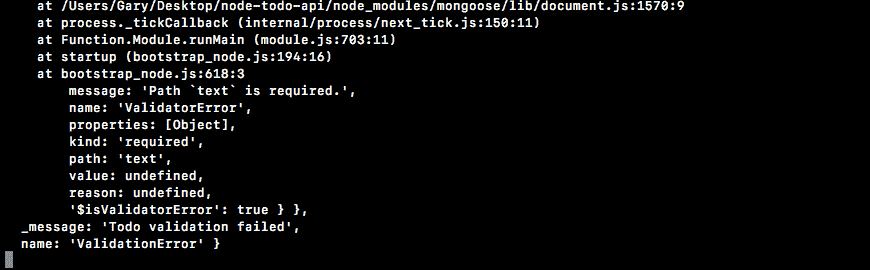

我们得到了一个难以理解的错误消息。我们将在一会儿深入研究这个问题，但现在你只需要知道的是，我们得到了一个验证错误：Todo 验证失败，这太棒了。

现在，除了确保`text`属性存在之外，我们还可以设置一些自定义验证器。例如，对于字符串，我们有一个`minlength`验证器，这很棒。你不应该能够创建一个文本为空字符串的 Todo。我们可以将`minlength`设置为最小长度，在这种情况下将是`1`：

```js
var Todo = mongoose.model('Todo', {
  text: {
    type: String,
    required: true,
    minlength: 1
  },
```

现在，即使我们在`otherTodo`函数中提供了一个`text`属性，假设我们将`text`设置为空字符串：

```js
var otherTodo = new Todo ({
  text: ''
});
```

它仍然会失败。它确实存在，但它没有通过`minlength`验证器，其中`minlength`验证器必须是`1`。我可以保存`server`文件，在终端重新启动，我们仍然会失败。

现在，除了`required`和`minlength`之外，文档中还有一些其他实用程序。一个很好的例子是称为`trim`的东西。它对字符串非常有用。基本上，`trim`会修剪掉值的开头或结尾的任何空格。如果我将`trim`设置为`true`，就像这样：

```js
var Todo = mongoose.model('Todo', {
  text: {
    type: String,
    required: true,
    minlength: 1,
    trim: true
  },
```

它将删除任何前导或尾随空格。因此，如果我尝试创建一个`text`属性只是一堆空格的 Todo，它仍然会失败：

```js
var otherTodo = new Todo ({
  text: '      '
});
```

`trim`属性将删除所有前导和尾随空格，留下一个空字符串，如果我重新运行，我们仍然会失败。文本字段无效。如果我们提供有效的值，事情将按预期工作。在`otherTodo`的所有空格中间，我将提供一个真正的 Todo 值，它将是`Edit this video`：

```js
var otherTodo = new Todo ({
  text: '    Edit this video    '
});
```

当我们尝试保存这个 Todo 时，首先会发生的是字符串开头和结尾的空格会被修剪。然后，它会验证这个字符串的最小长度为 1，它确实是，最后，它会将 Todo 保存到数据库。我将保存`server.js`，重新启动我们的脚本，这一次我们得到了我们的 Todo：

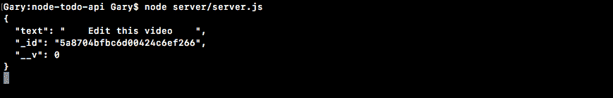

`Edit this video`文本显示为`text`属性。那些前导和尾随空格已经被移除，这太棒了。只使用三个属性，我们就能够配置我们的`text`属性，设置一些验证。现在，我们可以为`completed`做类似的事情。

# Mongoose 默认值

对于`completed`，我们不会`require`它，因为完成值很可能默认为`false`。相反，我们可以设置`default`属性，为这个`completed`字段设置一个默认值。

```js
  completed: {
    type: Boolean,
    default: false
  },
```

现在`completed`，正如我们在本节中讨论的那样，应该默认为`false`。如果 Todo 已经完成，就没有理由创建一个 Todo。我们也可以为`completedAt`做同样的事情。如果一个 Todo 开始时没有完成，那么`completedAt`就不会存在。只有当 Todo 完成时，它才会存在；它将是时间戳。我要做的是将`default`设置为`null`：

```js
  completed: {
    type: Boolean,
    default: false
  },
  completedAt: {
    type: Number,
    default: null
  }
```

太棒了。现在，我们为我们的 Todo 有一个相当不错的模式。我们将验证用户是否正确设置了文本，并且我们将自己设置`completed`和`completedAt`的值，因为我们可以使用默认值。有了这个设置，我现在可以重新运行我们的`server`文件，这样我们就可以得到一个更好的默认 Todo：

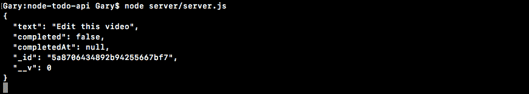

我们有用户提供的`text`属性，已经经过验证和修剪。接下来，我们将`completed`设置为`false`，`completedAt`设置为`null`；这太棒了。我们现在有一个无懈可击的模式，具有良好的默认值和验证。

# Mongoose 类型

如果您一直在玩各种类型，您可能已经注意到，如果您将`type`设置为除了您指定的类型之外的其他类型，在某些情况下它仍然可以工作。例如，如果我尝试将`text`设置为一个对象，我会得到一个错误。它会说，嘿，你试图使用一个字符串，但实际上出现了一个对象。但是，如果我尝试将`text`设置为一个数字，我会选择`23`：

```js
var otherTodo = new Todo ({
  text: 23
});
```

这将起作用。这是因为 Mongoose 会将您的数字转换为字符串，实质上是用引号包裹它。对于布尔值也是一样的。如果我传入一个布尔值，就像这样：

```js
var otherTodo = new Todo ({
  text: true
});
```

生成的字符串将是`"true"`。我将在将`text`设置为`true`后保存文件，并运行脚本：

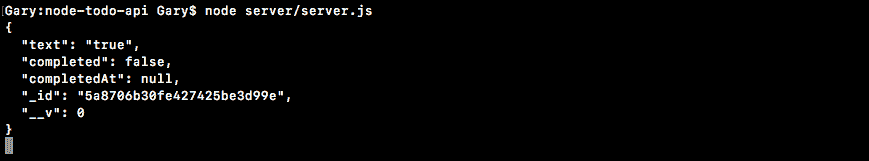

当我这样做时，我得到了`text`等于`true`，如前面的截图所示。请注意，它确实被引号包裹。重要的是要意识到，在 Mongoose 内部确实存在类型转换。它很容易让你犯错并导致一些意外的错误。但现在，我将把`text`设置为一个合适的字符串：

```js
var otherTodo = new Todo ({
  text: 'Something to do'
});
```

# 为身份验证创建 Mongoose 用户模型

现在，我们将创建一个全新的 Mongoose 模型。首先，你将创建一个新的`User`模型。最终，我们将用它进行身份验证。它将存储诸如电子邮件和密码之类的东西，而 Todos 将与该`User`关联，因此当我创建一个时，只有我可以编辑它。

我们将研究所有这些，但现在，我们将保持事情非常简单。在`User`模型上，你需要设置的唯一属性是`email`属性。我们以后会设置其他属性，比如`password`，但它将以稍有不同的方式完成，因为它需要是安全的。现在，我们只需坚持`email`。我希望你对其进行`require`。我也希望你对其进行`trim`，所以如果有人在之前或之后添加了空格，那些空格就会消失。最后但并非最不重要的是，继续将`type`设置为`String`，设置类型，并将`minlength`设置为`1`。现在，显然，你可以传入一个不是电子邮件的字符串。我们以后会探索自定义验证。这将让我们验证电子邮件是否为电子邮件，但现在这将让我们走上正确的轨道。

创建了你的 Mongoose 模型后，我希望你继续尝试创建一个新的`User`。创建一个没有`email`属性的`User`，然后创建一个具有`email`属性的`User`，确保当你运行脚本时，数据会如预期般显示在 Robomongo 中。这些数据应该显示在新的`Users`集合中。

# 设置电子邮件属性

首先，我要做的是创建一个变量来存储这个新模型，一个名为`User`的变量，并将其设置为`mongoose.model`，这是我们可以创建新的`User`模型的方法。第一个参数，你知道，需要是字符串模型名称。我将使用与我在变量中指定的完全相同的名称，尽管它可能会有所不同。我只是喜欢保持使用这种模式，其中变量等于模型名称。接下来，作为第二个参数，我们可以指定一个对象，其中我们配置`User`应该具有的所有属性。

```js
var User = mongoose.model('User', {

});
```

现在，正如我之前提到的，我们以后会添加其他属性，但是现在，添加对`email`属性的支持就足够了。有几件事我想在这封电子邮件上做。首先，我想设置`type`。电子邮件始终是一个字符串，因此我们可以将`type`设置为`String`。

```js
var User = mongoose.model('User', {
  email: {
    type: String,

  }
});
```

接下来，我们将对其进行`require`。你不能创建一个没有电子邮件的用户，所以我将把`required`设置为`true`。在`required`之后，我们将继续对该电子邮件进行`trim`。如果有人在它之前或之后添加了空格，显然是一个错误，所以我们将继续删除`User`模型中的那些空格，使我们的应用程序变得更加用户友好。最后但并非最不重要的是，我们要做的是设置一个`minlength`验证器。我们以后将设置自定义验证，但现在`minlength`为`1`就足够了。

```js
var User = mongoose.model('User', {
  email: {
    type: String,
    required: true,
    trim: true,
    minlength: 1
  }
});
```

现在，我将继续创建这个`User`的新实例并保存它。在运行脚本之前，我将注释掉我们的新 Todo。现在，我们可以创建这个`User`模型的新实例。我将创建一个名为`user`的变量，并将其设置为`new User`，传入我们想要在该用户上设置的任何值。

```js
var User = mongoose.model('User', {
  email: {
    type: String,
    required: true,
    trim: true,
    minlength: 1
  }
});

var user = new User({

});
```

我将首先不运行它，只是为了确保验证有效。现在，在用户变量旁边，我现在可以调用`user.save`。`save`方法返回一个 promise，因此我可以附加一个`then`回调。我将为此添加一个成功案例和一个错误处理程序。错误处理程序将获得该错误参数，成功案例将获得 doc。如果一切顺利，我将使用`console.log('User saved', doc)`打印一条消息，然后是`doc`参数。对于此示例，不需要为其进行格式化。对于错误处理程序，我将使用`console.log('无法保存用户')`，然后是错误对象。

```js
var user = new User({

});

user.save().then((doc) => {
  console.log('User saved', doc);
}, (e) => {
  console.log('Unable to save user', e);
});
```

由于我们正在创建一个没有属性的用户，我们希望错误会打印出来。我将保存`server.js`并重新启动文件：

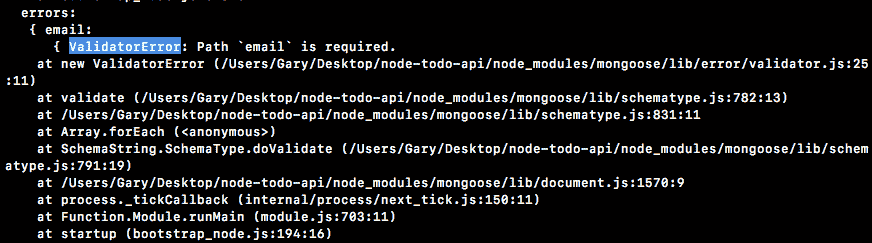

我们得到了错误。这是一个名为“路径'email'是必需的”验证错误。 Mongoose 让我们知道我们确实有一个错误。由于我们将`required`设置为`true`，因此电子邮件确实需要存在。我将继续放一个值，将`email`设置为我的电子邮件`andrew@example.com`，然后我会在后面放几个空格：

```js
var user = new User({
  email: 'andrew@example.com '
});
```

这一次，事情应该如预期那样进行，`trim`应该修剪该电子邮件的末尾，删除所有空格，这正是我们得到的结果：

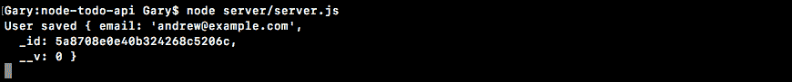

`User`确实已保存，这很好，`email`已经被正确格式化。显然，我也可以输入像`123`这样的字符串，它也可以工作，因为我们还没有设置自定义验证，但我们有一个相当不错的起点。我们有`User`模型，并且我们已经设置好并准备好使用`email`属性。

有了这个，我们现在要开始创建 API。在下一节中，您将安装一个名为**Postman**的工具，它将帮助我们测试我们的 HTTP 请求，然后我们将为我们的 Todo REST API 创建我们的第一个路由。

# 安装 Postman

在本节中，您将学习如何使用 Postman。如果您正在构建 REST API，Postman 是一种必不可少的工具。我从未与团队合作或在项目中使用 Postman 不是每个开发人员都大量使用的情况。Postman 允许您创建 HTTP 请求并将其发送。这使得测试您编写的所有内容是否按预期工作变得非常容易。显然，我们还将编写自动化测试，但使用 Postman 可以让您玩弄数据并在移动 API 时查看事物是如何工作的。这真的是一个很棒的工具。

我们将转到浏览器并转到[getpostman.com](https://www.getpostman.com/)，在这里我们可以获取他们的应用程序：

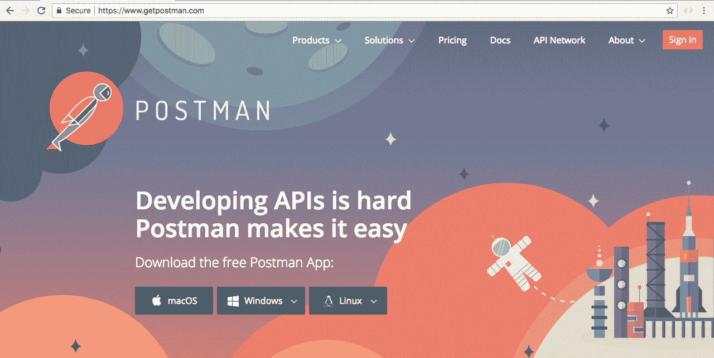

现在我将使用 Chrome 应用程序。要安装它，您只需从 Chrome 商店安装 Chrome 应用程序，单击“添加到 Chrome”，它应该会将您带到可以打开应用程序的页面。现在，要打开 Chrome 应用程序，您必须转到这种奇怪的 URL。它是`chrome://apps`。在这里，您可以查看所有应用程序，我们只需单击即可打开 Postman。

现在正如我之前提到的，Postman 允许您发出 HTTP 请求，因此我们将继续并进行一些操作以玩弄用户界面。您无需创建帐户，也无需注册付费计划。付费计划面向需要高级功能的开发团队。我们只是在我们的机器上进行基本请求；我们不需要云存储或类似的东西。我将跳过帐户创建，我们可以直接进入应用程序。

在这里，我们可以设置我们的请求；这是面板中发生的事情：

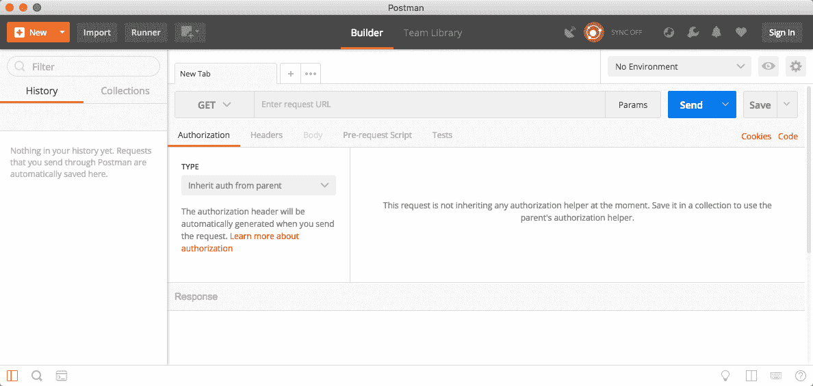

而且，在白色空间中，我们将能够查看结果。让我们继续向谷歌发出请求。

# 向谷歌发出 HTTP 请求

在 URL 栏中，我将输入`http://google.com`。我们可以点击发送来发送该请求。确保你选择了 GET 作为你的 HTTP 方法。当我发送请求时，它会返回，所有的返回数据都显示在白色空间中：

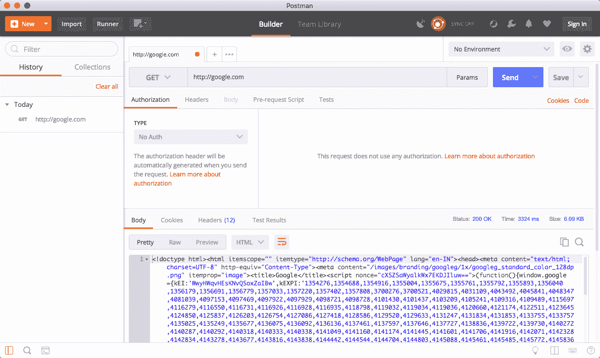

我们有一些状态码；我们有一个 200，表示一切顺利；我们有时间，大约花了四分之一秒；我们有来自 Google 的头部；我们有 Cookie，但在这种情况下没有；我们有我们的 Body 数据。`google.com`的 body 是一个 HTML 网站。在大多数情况下，我们在 Postman 中发送和接收的 body 将是 JSON，因为我们正在构建 REST API。

# 说明 JSON 数据的工作方式

所以为了说明 JSON 数据是如何工作的，我们将向我们在课程中早些时候使用过的地理编码 URL 发出请求。如果你还记得，我们能够传入一个位置，然后得到一些 JSON 数据，描述了诸如纬度和经度以及格式化地址之类的东西。现在这些应该还在你的 Chrome 历史记录中。

如果你删除了你的历史记录，你可以在地址栏中输入[`maps.googleapis.com/maps/api/geocode/json?address=1301+lombard+st+philadelphia`](https://maps.googleapis.com/maps/api/geocode/json?address=1301+lombard+st+philadelphia)。这是我将要使用的 URL；你可以简单地复制它，或者你可以获取任何 JSON API 的 URL。我将它复制到剪贴板中，然后返回到 Postman，用刚刚复制的 URL 替换掉原来的 URL：

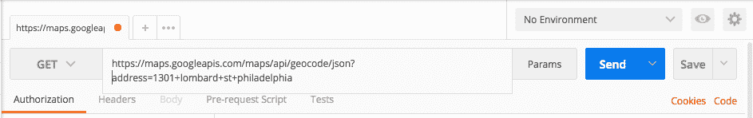

现在，我可以继续发送请求。我们得到了我们的 JSON 数据，这太棒了：

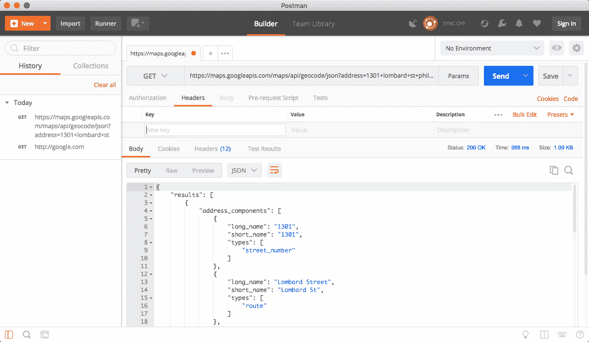

当我们发出这个请求时，我们能够看到确切的返回内容，这就是我们将要使用 Postman 的方式。

我们将使用 Postman 来发送请求，添加 Todos，删除 Todos，获取所有的 Todos，并登录；所有这些都将在这里发生。记住，API 不一定有前端。也许它是一个 Android 应用程序；也许它是一个 iPhone 应用程序或 Web 应用程序；也许它是另一个服务器。Postman 让我们能够与我们的 API 进行交互，确保它按预期工作。我们有所有的 JSON 数据返回。在 Body 下的 Raw 视图中，我们有原始数据响应。基本上，它只是未经美化的；没有格式化，没有着色。我们还有一个预览选项卡。预览选项卡对于 JSON 来说是相当无用的。当涉及到 JSON 数据时，我总是坚持使用漂亮的选项卡，这应该是默认的。

现在我们已经安装了 Postman 并且知道了一些如何使用它的知识，我们将继续进行下一部分，我们将实际创建我们的第一个请求。我们将发送一个 Postman 请求来访问我们将要创建的 URL。这将让我们可以直接从 Postman 或任何其他应用程序（无论是 Web 应用程序、移动应用程序还是另一个服务器）中创建新的 Todos。接下来就是这些内容，所以请确保你已经安装了 Postman。如果你能够完成本节的所有内容，那么你已经准备好继续了。

# 资源创建端点 - POST /todos

在本节中，你将为添加新的 Todos 创建你的`HTTP POST`路由。在我们深入讨论之前，我们首先要重构`server.js`中的所有内容。我们有数据库配置的东西，应该放在其他地方，我们有我们的模型，也应该放在单独的文件中。我们在`server.js`中想要的唯一的东西就是我们的 Express 路由处理程序。

# 重构 server.js 文件以创建 POST todos 路由

首先，在`server`文件夹中，我们将创建一个名为`db`的新文件夹，在`db`文件夹中，我们将创建一个文件，所有的 Mongoose 配置都将在其中进行。我将把那个文件命名为`mongoose.js`，我们需要做的就是将我们的 Mongoose 配置代码放在这里：

```js
var mongoose = require('mongoose');
mongoose.Promise = global.Promise;
mongoose.connect('mongodb://localhost:27017/TodoApp');
```

删除它，并将其移动到`mongoose.js`中。现在，我们需要导出一些东西。我们要导出的是`mongoose`变量。因此，当有人需要 mongoose.js 文件时，他们将得到配置好的 Mongoose，并且他们将得到它——他们将从库中得到的`mongoose`变量。我将设置`module.exports`等于一个对象，并且在该对象上，我们将`mongoose`设置为`mongoose`：

```js
mongoose.connect('mongodb://localhost:27017/TodoApp');

module.exports = {
  mongoose: mongoose
};
```

现在我们知道，在 ES6 中，这可以简化。如果你有一个属性和一个同名的变量，你可以缩短它，我们可以进一步将其放在一行上：

```js
module.exports = {mongoose};
```

现在我们有了一个单独的文件中的 Mongoose 配置，该文件可以在`server.js`文件中被引用。我将使用 ES6 解构来获取 mongoose 属性。基本上，我们正在创建一个名为`mongoose`的本地变量，该变量等于对象上的 mongoose 属性，并且该对象将是从我们刚刚创建的文件中获取的返回结果。它在`db`目录中，名为`mongoose.js`，我们可以省略扩展名：

```js
var mongoose = require('./db/mongoose');
```

现在 Mongoose 已经有了自己的位置，让我们对`Todo`和`User`做同样的事情。这将发生在服务器中的一个名为`models`的新文件夹中。

# 配置 Todo 和 Users 文件

在`models`文件夹中，我们将创建两个文件，一个用于每个模型。我将创建两个新文件，名为`todo.js`和`user.js`。我们可以从`server.js`文件中获取 todos 和 Users 模型，然后将它们简单地复制粘贴到相应的文件中。一旦模型被复制，我们可以从`server.js`中删除它。Todos 模型将如下所示：

```js
var Todo = mongoose.model('Todo', {
  text: {
    type: String,
    required: true,
    minlength: 1,
    trim: true
  },
  completed: {
    type: Boolean,
    default: false
  },
  completedAt: {
    type: Number,
    default: null
  }
});
```

`user.js`模型将如下所示。

```js
var User = mongoose.model('User', {
  email: {
    type: String,
    required: true,
    trim: true,
    minlength: 1
  }
});
```

我还将删除到目前为止我们所拥有的一切，因为`server.js`中的这些示例不再必要。我们可以简单地将我们的 mongoose 导入语句留在顶部。

在这些模型文件中，有一些事情我们需要做。首先，我们将在 Todos 和 Users 文件中调用`mongoose.model`，因此我们仍然需要加载 Mongoose。现在，我们不必加载我们创建的`mongoose.js`文件；我们可以加载普通的库。让我们创建一个变量。我们将称这个变量为`mongoose`，然后我们将`require('mongoose')`：

```js
var mongoose = require('mongoose');

var Todo = mongoose.model('Todo', {
```

我们需要做的最后一件事是导出模型，否则我们无法在需要这个文件的文件中使用它。我将设置`module.exports`等于一个对象，并且我们将`Todo`属性设置为`Todo`变量；这正是我们在`mongoose.js`中所做的：

```js
module.exports = {Todo};
```

我们将在`user.js`中做完全相同的事情。在`user.js`中，我们将在顶部创建一个名为`mongoose`的变量，需要`mongoose`，然后在底部导出`User`模型，`module.exports`，将其设置为一个对象，其中`User`等于`User`：

```js
Var mongoose = require('mongoose');

var User = mongoose.model('User', {
  email: {
    type: String,
    required: true,
    trim: true,
    minlength: 1
  }
});

module.exports = {User};
```

现在，我们的三个文件都已经格式化。我们有三个新文件和一个旧文件。剩下要做的就是加载`Todo`和`User`。

# 在`server.js`文件中加载 Todo 和 User 文件

在`server.js`文件中，让我们使用解构创建一个变量`Todo`，将其设置为`require('./models/todo')`，我们可以对`User`做完全相同的事情。使用 ES6 解构，我们将获取`User`变量，并且我们将从调用`require`返回的对象中获取它，需要`models/user`：

```js
var {mongoose} = require('./db/mongoose');
var {Todo} = require('./models/todo');
var {User} = require('./models/user');
```

有了这个设置，我们现在准备开始。我们有完全相同的设置，只是已经重构，这将使测试、更新和管理变得更加容易。`server.js`文件只负责我们的路由。

# 配置 Express 应用程序

现在，让我们开始，我们需要安装 Express。我们已经在过去做过了，所以在终端中，我们只需要运行`npm i`，然后是模块名称，即`express`。我们将使用最新版本，`4.16.2`。

我们还将安装第二个模块，实际上我们可以在第一个模块之后立即输入。没有必要两次运行`npm install`。这个叫做`body-parser`。`body-parser`将允许我们向服务器发送 JSON。服务器然后可以接收该 JSON 并对其进行处理。`body-parser`本质上解析主体。它获取该字符串主体并将其转换为 JavaScript 对象。现在，使用`body-parser`，我们将安装最新版本`1.18.2`。我还将提供`--save`标志，这将把 Express 和`body-parser`添加到`package.json`的依赖项部分：

```js
**npm i express@4.16.2 body-parser@1.18.2 --save** 
```

现在，我可以继续发送这个请求，安装这两个模块，并在`server.js`中开始配置我们的应用程序。

首先，我们必须加载刚刚安装的这两个模块。正如我之前提到的，我喜欢在本地导入和库导入之间保留一个空格。我将使用一个名为`express`的变量来存储 Express 库，即`require('express')`。我们将对`body-parser`做同样的事情，使用一个名为`bodyParser`的变量，将其设置为从`body-parser`中获取的返回结果：

```js
var express = require('express');
var bodyParser = require('body-parser');

var {mongoose} = require('./db/mongoose');
var {Todo} = require('./models/todo');
var {User} = require('./models/user');
```

现在我们可以设置一个非常基本的应用程序。我们将创建一个名为`app`的变量；这将存储我们的 Express 应用程序。我将把它设置为调用`express`：

```js
var {User} = require('./models/user');

var app = express();
```

我们还将调用`app.listen`，监听一个端口。我们最终将部署到 Heroku。不过，现在我们将有一个本地端口，端口`3000`，并且我们将提供一个回调函数，一旦应用程序启动，它就会触发。我们将使用`console.log`来打印`Started on port 3000`：

```js
var app = express();

app.listen(3000, () => {
  console.log('Started on port 3000');
});
```

# 配置 POST 路由

现在，我们有一个非常基本的服务器。我们只需要开始配置我们的路由，正如我承诺的那样，我们将在本节中专注于 POST 路由。这将让我们创建新的 Todos。现在，在您的 REST API 中，有基本的 CRUD 操作，CRUD 代表创建、读取、更新和删除。

当您想要创建一个资源时，您使用`POST HTTP`方法，并将该资源作为主体发送。这意味着当我们想要创建一个新的 Todo 时，我们将向服务器发送一个 JSON 对象。它将具有一个`text`属性，服务器将获取该`text`属性，创建新模型，并将带有 ID、completed 属性和`completedAt`的完整模型发送回客户端。

要设置路由，我们需要调用`app.post`，传入我们用于每个 Express 路由的两个参数，即我们的 URL 和我们的回调函数，该函数将使用`req`和`res`对象进行调用。现在，REST API 的 URL 非常重要，关于正确的结构有很多讨论。对于资源，我喜欢使用`/todos`：

```js
app.post('/todos', (req, res) => {

});
```

这是用于资源创建的，这是一个非常标准的设置。`/todos`用于创建新的 Todo。稍后，当我们想要读取 Todos 时，我们将使用`GET`方法，并且我们将使用`GET`从`/todos`获取所有 Todos 或`/todos`，一些疯狂的数字，以根据其 ID 获取单个 Todo。这是一个非常常见的模式，也是我们将要使用的模式。不过，现在我们可以专注于获取从客户端发送的主体数据。

# 从客户端获取主体数据

为此，我们必须使用`body-parser`模块。正如我之前提到的，`body-parser`将获取您的 JSON 并将其转换为一个对象，将其附加到此`request`对象上。我们将使用`app.use`配置中间件。`app.use`使用中间件。如果我们正在编写自定义中间件，它将是一个函数；如果我们正在使用第三方中间件，我们通常只是从库中访问某些内容。在这种情况下，它将作为函数调用`bodyParser.json`。这个 JSON 方法的返回值是一个函数，这就是我们需要给 Express 的中间件：

```js
var app = express();

app.use(bodyParser.json());
```

有了这个设置，我们现在可以向我们的 Express 应用程序发送 JSON。在`post`回调中，我想要做的就是简单地`console.log` `req.body`的值，其中`bodyParser`存储了 body。

```js
app.use(bodyParser.json());

app.post('/todos', (req, res) => {
  console.log(req.body);
});
```

现在我们可以启动服务器并在 Postman 中测试一下。

在 Postman 中测试 POST 路由

在终端中，我将使用`clear`清除终端输出，然后运行应用程序：

```js
**node server/server.js** 
```

服务器在端口 3000 上运行，这意味着我们现在可以进入 Postman：

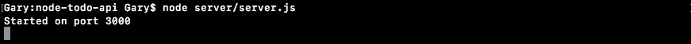

在 Postman 中，我们不会像在上一节中那样进行`GET`请求。这次，我们要做的是进行 POST 请求，这意味着我们需要将 HTTP 方法更改为 POST，并输入 URL。端口将是`localhost:3000`，路径将是`/todos`。这是我们要发送数据的 URL：

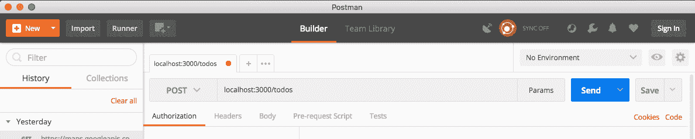

现在，为了向应用程序发送一些数据，我们必须转到 Body 选项卡。我们要发送 JSON 数据，所以我们将转到原始并从右侧的下拉列表中选择 JSON（application/json）：

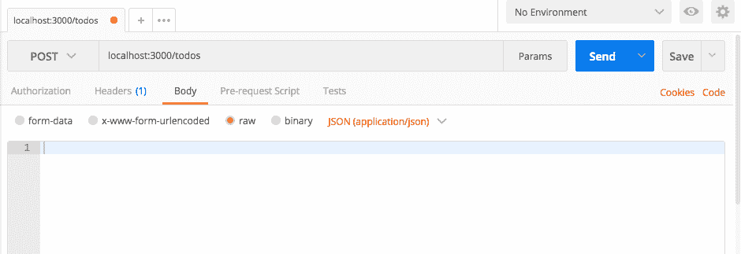

现在我们已经设置了头部。这是 Content-Type 头部，让服务器知道正在发送 JSON。所有这些都是由 Postman 自动完成的。在 Body 中，我要附加到我的 JSON 的唯一信息是一个`text`属性：

```js
{
  "text": "This is from postman"
}
```

现在我们可以点击发送来发送我们的请求。我们永远不会收到响应，因为我们还没有在`server.js`中回应它，但是如果我转到终端，你会看到我们有我们的数据：

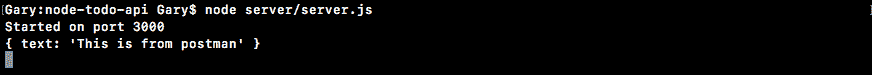

这是我们在 Postman 中创建的数据。现在它显示在我们的 Node 应用程序中，这太棒了。我们离实际创建 Todo 只差一步。在 post 处理程序中，唯一剩下的事情就是实际使用来自“用户”的信息创建 Todo。

# 创建 Mongoose 模型的实例

在`server.js`中，让我们创建一个名为`todo`的变量，以执行之前所做的操作，创建 Mongoose 模型的实例。我们将其设置为`new Todo`，传入我们的对象和要设置的值。在这种情况下，我们只想设置`text`。我们将文本设置为`req.body`，这是我们拥有的对象，然后我们将访问`text`属性，就像这样：

```js
app.post('/todos', (req, res) => {
  var todo = new Todo({
    text: req.body.text
  });
```

接下来，我们将调用`todo.save`。这将实际将模型保存到数据库，并且我们将为成功和错误情况提供回调。

```js
app.post('/todos', (req, res) => {
  var todo = new Todo({
    text: req.body.text
  });

todo.save().then((doc) => {

}, (e) => {

});
```

现在，如果一切顺利，我们将发送回实际的 Todo，它将显示在 then 回调中。我将获取`doc`，并在回调函数中使用`res.send`发送`doc`回去。这将为`User`提供非常重要的信息，例如 ID 和`completed`和`completedAt`属性，这些属性不是由`User`设置的。如果事情进展不顺利并且我们遇到错误，那也没关系。我们要做的就是使用`res.send`发送错误回去：

```js
todo.save().then((doc) => {
  res.send(doc);
}, (e) => {
  res.send(e);
});
```

稍后我们将修改如何发送错误。目前，这段代码将运行得很好。我们还可以设置 HTTP 状态。

# 设置 HTTP 状态码

如果你记得，HTTP 状态可以让你给别人一些关于请求进展情况的信息。它进行得顺利吗？它进行得不好吗？这种情况。你可以通过访问[httpstatuses.com](https://httpstatuses.com/)来获取所有可用的 HTTP 状态列表。在这里，你可以查看所有你可以设置的状态：

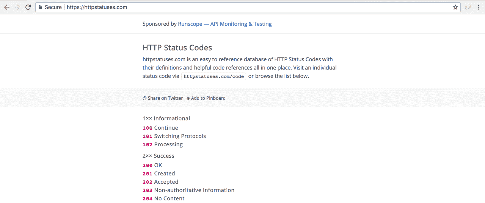

Express 默认设置的一个是`200`。这意味着事情进行得很顺利。我们将用于错误的是`400`。`400`状态意味着有一些错误的输入，如果模型无法保存，就会出现这种情况。也许`User`没有提供`text`属性，或者文本字符串为空。无论哪种情况，我们都希望返回`400`，这将会发生。在我们调用`send`之前，我们要做的就是调用`status`，传入`400`的状态：

```js
todo.save().then((doc) => {
  res.send(doc);
}, (e) => {
  res.status(400).send(e);
});
```

有了这个，我们现在准备在 Postman 中测试我们的`POST /todos`请求。

# 在 Postman 中测试 POST /todos

我将在终端中重新启动服务器。如果你喜欢，你可以用`nodemon`启动它。目前，我将手动重新启动它：

```js
**nodemon server/server.js** 
```

我们现在在本地主机 3000 上，进入 Postman，我们可以进行与之前完全相同的请求。我将点击发送：


我们得到了一个 200 的状态。这太棒了；这是默认状态，意味着事情进行得很顺利。JSON 响应正是我们所期望的。我们有我们设置的`text`；我们有生成的`_id`属性；我们有`completedAt`，它被设置为`null`，默认值；以及我们有`completed`被设置为`false`，默认值。

我们还可以测试当我们尝试创建一个没有正确信息的 Todo 时会发生什么。例如，也许我将`text`属性设置为空字符串。如果我发送这个请求，我们现在会得到一个 400 Bad Request：

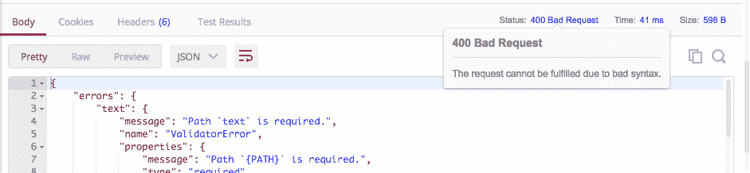

现在，我们有一堆验证代码说`Todo 验证失败`。然后，我们可以进入`errors`对象来获取具体的错误。在这里，我们可以看到`text`字段失败了，`message`是`Path 'text' is required`。所有这些信息都可以帮助某人修复他们的请求并做出正确的请求。

现在，如果我进入 Robomongo，我将刷新`todos`集合。看看最后一个，它确实是我们在 Postman 中创建的：

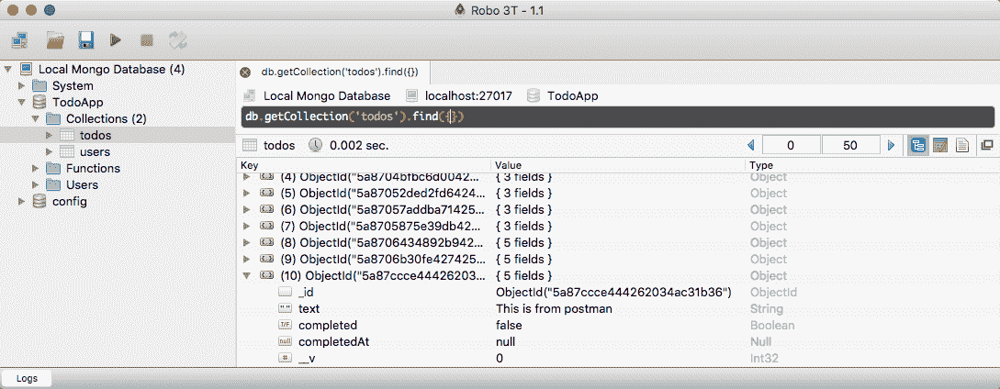

文本等于这是来自 Postman 的。有了这个，我们现在为 Todo REST API 设置了我们的第一个 HTTP 端点。

现在我还没有详细讨论 REST 是什么。我们稍后会谈论这个。现在，我们将专注于创建这些端点。当我们开始添加认证时，REST 版本将稍后出现。

# 向数据库添加更多的 Todos

在 Postman 中，我们可以添加更多的 Todos，这就是我要做的。`Charge my phone`—我想我从来没有需要被提醒过这个—我们将添加`Take a break for lunch`。在 Pretty 部分，我们看到`Charge my phone` Todo 已经创建了一个唯一的 ID。我将发送第二个，我们会看到`Take a break for lunch` Todo 已经创建：

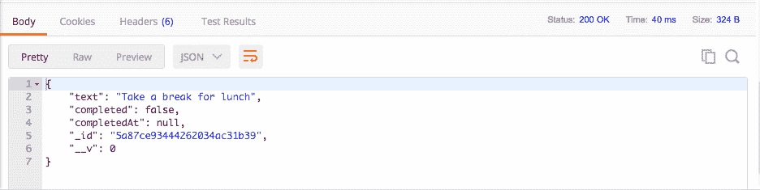

在 Robomongo 中，我们可以给`todos`集合进行最后一次刷新。我将展开最后三个项目，它们确实是我们在 Postman 中创建的三个项目：

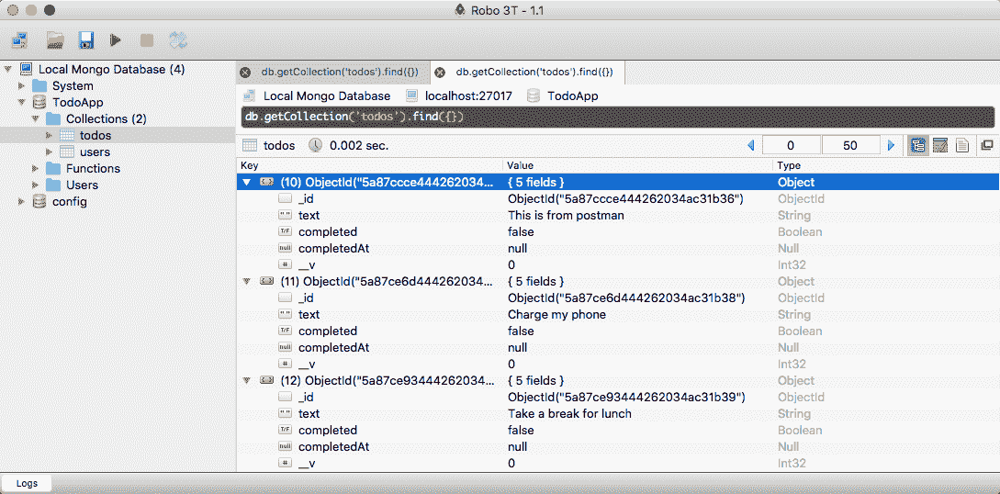

现在我们的项目中已经完成了一些有意义的工作，让我们继续提交我们的更改。你可以在 Atom 中看到，`server`目录是绿色的，意味着它还没有添加到 Git 中，`package.json`文件是橙色的，这意味着它已经被修改，尽管 Git 正在跟踪它。在终端中，我们可以关闭服务器，我总是喜欢运行`git status`来进行一次理智检查：

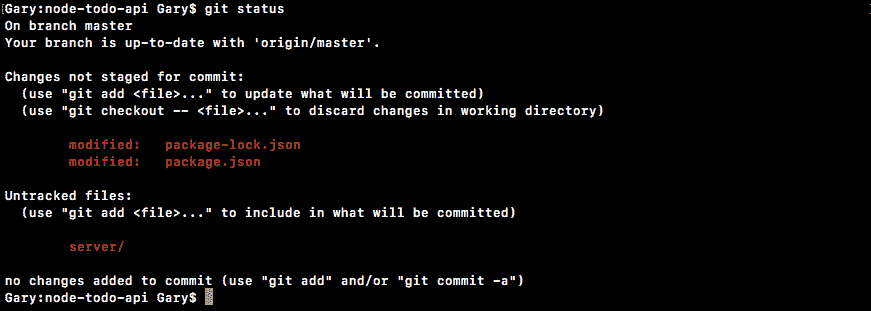

在这里，一切看起来都如预期。我可以使用`git add .`添加所有内容，然后再进行一次检查：

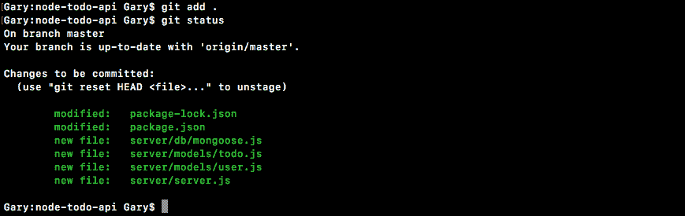

在这里，我们在`server`文件夹中有四个新文件，以及我们的`package.json`文件。

现在，是时候提交了。我要创建一个快速提交。我使用`-am`标志，通常会添加修改后的文件。由于我已经使用了 add，我可以简单地使用`-m`标志，就像我们在整个课程中一直在做的那样。对于这个，一个好的消息可能是`添加 POST /todos 路由和重构 mongoose`：

```js
**git commit -m 'Add POST /todos route and refractor mongoose'** 
```

有了提交，我们现在可以通过将其推送到 GitHub 来结束这些工作，确保它得到备份，并确保它对任何其他在项目上合作的人都可用。记住，仅仅创建一个提交并不能将其上传到 GitHub；您必须使用另一个命令`git push`将其推送上去。有了这个，现在是时候进入下一部分了，您将在那里测试您刚刚创建的路由。

# 测试 POST /todos

在这一部分，您将学习如何为 Todo API 设置测试套件，类似于我们在“测试”部分所做的，我们将为`/todos`编写两个测试用例。我们将验证当我们发送正确的数据作为主体时，我们会得到一个包括 ID 在内的`200`完成文档；如果我们发送错误的数据，我们期望得到一个包含错误对象的`400`。

# 为测试 POST /todos 路由安装 npm 模块

现在，在我们做任何这些之前，我们必须安装在“测试”部分中安装的所有模块，`expect`用于断言，`mocha`用于整个测试套件，`supertest`用于测试我们的 Express 路由，以及`nodemon`。`nodemon`模块将让我们创建`test-watch`脚本，这样我们就可以自动重新启动测试套件。现在我知道您已经全局安装了`nodemon`，但由于我们在`package.json`脚本中使用它，所以在本地安装它也是一个好主意。

我们将使用`npm i`安装`expect`版本`22.3.0`，最新版本。接下来是`mocha`。最新版本是`5.0.1`。之后是`nodemon`版本`1.15.0`，最后但并非最不重要的是`supertest`版本`3.0.0`。有了这些，我们只需要加上`--save-dev`标志。我们想要保存这些，但不作为常规依赖项。它们仅用于测试，因此我们将它们保存为`devDependencies`：

```js
**npm i expect@22.3.0 mocha@5.0.1 nodemon@1.15.0 supertest@3.0.0 --save-dev** 
```

现在，我们可以运行这个命令，一旦完成，我们就可以开始在 Atom 中设置测试文件。

# 设置测试文件

在 Atom 中，我现在在我的`package.json`文件中列出了我的`devDependencies`：

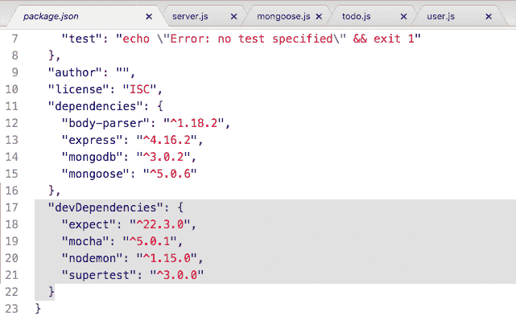

现在，我的命令输出可能与您的有些不同。npm 正在缓存我最近安装的一些模块，所以正如您在前面的截图中所看到的，它只是获取本地副本。它们确实被安装了，我可以通过打开`node_modules`文件夹来证明。

我们现在将在`server`中创建一个文件夹，用于存储所有测试文件，这个文件夹将被称为`tests`。我们要担心创建的唯一文件是`server.js`的测试文件。我将在 tests 中创建一个名为`server.test.js`的新文件。这是我们将在本章中使用的测试文件的扩展名。在`server.test`文件中，我们现在可以通过要求很多这些模块来启动事情。我们将要求`supertest`模块和`expect`。`mocha`和`nodemon`模块不需要被要求；这不是它们的使用方式。

我们将得到的`const expect`变量将等于`require('expect')`，我们将对`supertest`做同样的事情，使用`const`：

```js
const expect = require('expect');
const request = require('supertest');
```

既然我们已经准备好了，我们需要加载一些本地文件。我们需要加载`server.js`，这样我们就可以访问 Express 应用程序，因为我们需要它来进行超级测试，我们还想加载我们的 Todo 模型。正如您稍后将看到的，我们将查询数据库，并且访问此模型将是必要的。现在模型已经导出了一些东西，但`server.js`目前没有导出任何东西。我们可以通过在`server.js`文件的最底部添加`module.exports`并将其设置为一个对象来解决这个问题。在该对象上，我们要做的就是将`app`属性设置为`app`变量，使用 ES6 对象语法。

```js
module.exports = {app};
```

现在，我们已经准备好加载这两个文件了。

# 加载测试文件

首先，让我们创建一个名为`app`的本地变量，并且我们将使用 ES6 解构从服务器文件的返回结果中取出它。在这里，我们将从相对路径开始。然后，我们将从`tests`返回到`server`的上一级目录。文件名只是`server`，没有扩展名。我们也可以对 Todo 模型做同样的操作。

我们将创建一个名为`Todo`的常量。我们使用 ES6 解构从导出中取出它，文件来自相对路径，返回到上一级目录。然后我们必须进入`models`目录，最后，文件名为`todo`：

```js
const expect = require('expect');
const request = require('supertest');

const {app} = require('./../server');
const {Todo} = require('./../models/todo');
```

既然我们已经加载了所有这些，我们准备创建我们的`describe`块并添加我们的测试用例。

# 为测试用例添加描述块

我将使用`describe`来对所有路由进行分组。对于一些路由，我将有多个测试用例，添加一个`describe`块是很好的，这样您可以在终端中快速查看测试输出。POST Todos 的`describe`块将简单地称为`POST /todos`。然后，我们可以添加箭头函数(`=>`)，在其中我们可以开始列出我们的测试用例。第一个测试将验证当我们发送适当的数据时，一切都如预期般进行：

```js
const {Todo} = require('./../models/todo');

describe('POST /todos', () => {
  it('should create a new todo')
});
```

现在，我们可以添加我们的回调函数，这个函数将接受`done`参数，因为这将是一个异步测试。您必须指定`done`，否则这个测试将无法按预期工作。在回调函数中，我们将创建一个名为`text`的变量。这是我们真正需要的唯一设置数据。我们只需要一个字符串，并且我们将在整个过程中使用该字符串。随意给它任何值。我将使用`Test todo text`。

```js
describe('POST /todos', () => {
  it('should create a new todo',(done) => {
    var text = 'Test todo text';
  });
});
```

现在是时候开始通过`supertest`发出请求了。我们之前只发出了`GET`请求，但`POST`请求同样简单。

# 通过 supertest 进行 POST 请求

我们将调用请求，传入我们要发出请求的应用程序。接下来，我们将调用`.post`，这将设置一个`POST`请求。我们将前往`/todos`，新的事情是我们实际上要发送数据。为了随请求发送数据作为主体，我们必须调用`send`，并且我们将传入一个对象。这个对象将被`supertest`转换为 JSON，所以我们不需要担心这一点——这只是使用`supertest`库的另一个很好的理由。我们将把`text`设置为之前显示的`text`变量，并且我们可以使用 ES6 语法来完成这个操作：

```js
describe('POST /todos', () => {
  it('should create a new todo',(done) => {
    var text = 'Test todo text';

    request(app)
    .post('/todos')
    .send({text})
  })
});
```

现在我们已经发送了请求，我们可以开始对请求进行断言。

# 对 POST 请求进行断言

我们将从状态开始。我将`expect`状态等于`200`，当我们发送有效数据时，这应该是情况。之后，我们可以对返回的主体进行断言。我们希望确保主体是一个对象，并且它的`text`属性等于我们之前指定的属性。这正是它在发送主体时应该做的事情。

在`server.test.js`中，我们可以通过创建一个自定义的`expect`断言来完成这个操作。如果你还记得，我们的自定义`expect`调用确实传递了响应，并且我们可以在函数内部使用该响应。我们要`expect`响应体有一个`text`属性，并且`text`属性等于使用`toBe`定义的`text`字符串：

```js
    request(app)
    .post('/todos')
    .send({text})
    .expect(200)
    .expect((res) => {
      expect(res.body.text).toBe(text);
    })
```

如果是这样，很好，测试通过了。如果不是，也没关系。我们只需要抛出一个错误，测试就会失败。接下来我们需要做的是调用`end`来结束一切，但我们还没有完成。我们要做的是实际检查 MongoDB 集合中存储了什么，这就是我们加载模型的原因。与之前一样，我们不再像之前那样将`done`传递给 end，而是传递一个函数。这个函数将在有错误时被调用，并传递一个错误和响应：

```js
  request(app)
  .post('/todos')
  .send({text})
  .expect(200)
  .expect((res) => {
    expect(res.body.text).toBe(text);
  })
  .end((err, res) => {

});
```

这个回调函数将允许我们做一些事情。首先，让我们处理可能发生的任何错误。如果状态不是`200`，或者`body`没有一个等于我们发送的`text`属性的`text`属性，那么就会出现错误。我们只需要检查错误是否存在。如果存在错误，我们将把它传递给`done`。这将结束测试，将错误打印到屏幕上，因此测试确实会失败。我也会`return`这个结果。

```js
.end((err, res) => {
  if(err) {
    return done(err);
  }
});
```

现在，返回它并没有做任何特别的事情。它只是停止函数的执行。现在，我们将向数据库发出请求，获取所有的 Todos，并验证我们添加的一个`Todo`是否确实被添加了。

# 发出请求从数据库中获取 Todos

为此，我们必须调用`Todo.find`。现在，`Todo.find`与我们使用的 MongoDB 原生`find`方法非常相似。我们可以不带参数地调用它来获取集合中的所有内容。在这种情况下，我们将获取所有的 Todos。接下来，我们可以附加一个`then`回调。我们将使用这个函数调用所有的`todos`，并对其进行一些断言。

```js
.end((err, res) => {
  if(err) {
    return done(err);
  }

Todo.find().then((todos) => {

})
```

在这种情况下，我们要断言我们创建的 Todo 确实存在。我们将从期望`todos.length`等于数字`1`开始，因为我们添加了一个 Todo 项目。我们还要做一个断言。我们要`expect`这一个唯一的项目有一个`text`属性等于使用`toBe`在 server.test.js 中定义的`text`变量。

```js
Todo.find().then((todos) => {
  expect(todos.length).toBe(1);
  expect(todos[0].text).toBe(text);
})
```

如果这两个都通过了，那么我们可以相当肯定一切都按预期工作了。状态码是正确的，响应也是正确的，数据库看起来也是正确的。现在是时候调用`done`，结束测试用例了：

```js
Todo.find().then((todos) => {
  expect(todos.length).toBe(1);
  expect(todos[0].text).toBe(text);
  done();
})
```

我们还没有完成。如果其中任何一个失败，测试仍然会通过。我们必须添加一个`catch`调用。

# 为错误处理添加 catch 调用

`catch`将获取我们回调中可能发生的任何错误。然后，我们将能够获取到错误参数，并使用箭头函数将其传递给`done`，就像这样：

```js
Todo.find().then((todos) => {
  expect(todos.length).toBe(1);
  expect(todos[0].text).toBe(text);
  done();
}).catch((e) => done(e));
```

请注意，这里我使用的是语句语法，而不是箭头函数表达式语法。有了这个，我们的测试用例现在可以运行了。我们有一个很好的测试用例，我们需要做的就是在`package.json`中设置`scripts`来实际运行它。

# 在`package.json`中设置测试脚本

在运行测试之前，我们要设置`scripts`，就像我们在测试部分做的那样。我们将有两个：`test`，只运行测试；和`test-watch`，通过`nodemon`运行测试脚本。这意味着每当我们更改应用程序时，测试都会重新运行。

就在`test`中，我们将运行`mocha`，我们需要提供的唯一其他参数是测试文件的 globbing 模式。我们将获取`server`目录中的所有内容，这可能在一个子目录中（稍后会有），所以我们将使用两个星号（`**`）。它可以有任何文件名，只要以`.test.js`扩展名结尾。

```js
"scripts": {
  "test": "mocha server/**/*.test.js",
  "test-watch":
},
```

现在对于`test-watch`，我们要做的就是运行`nodemon`。我们将使用`--exec`标志来指定一个在单引号内运行的自定义命令。我们要运行的命令是`npm test`。单独的`test`脚本是有用的，`test-watch`只是在每次更改时重新运行`test`脚本：

```js
"scripts": {
  "test": "mocha server/**/*.test.js",
  "test-watch": "nodemon --exec 'npm test'"
},
```

在我们继续之前，我们需要修复一个重大缺陷。正如你可能已经注意到的，在`server.test`文件中，我们做出了一个非常大的假设。我们假设数据库中没有任何内容。我们之所以这样假设，是因为我们期望在添加 1 个待办事项后，待办事项的长度为 1，这意味着我们假设它从 0 开始。现在这个假设是不正确的。如果我现在运行测试套件，它会失败。我已经在数据库中有了待办事项。我们要做的是在`server.test`文件中添加一个测试生命周期方法。这个方法叫做`beforeEach`。

# 在 server.test.js 文件中添加测试生命周期方法

`beforeEach`方法将允许我们在每个测试用例之前运行一些代码。我们将使用`beforeEach`来设置数据库的有用方式。现在，我们要做的只是确保数据库是空的。我们将传入一个函数，该函数将使用`done`参数调用，就像我们的单独测试用例一样。

```js
const {Todo} = require('./../models/todo');    

beforeEach((done) => {

});
```

这个函数将在每个测试用例之前运行，只有在我们调用`done`后才会继续进行测试用例，这意味着我们可以在这个函数中做一些异步的事情。我要做的是调用`Todo.remove`，这类似于 MongoDB 的原生方法。我们只需要传入一个空对象；这将清除所有的待办事项。然后，我们可以添加一个`then`回调，在`then`回调中，我们将调用`done`，就像这样：

```js
beforeEach((done) => {
  Todo.remove({}).then(() => {
    done();
  })
});
```

现在，我们也可以使用表达式语法来缩短这个：

```js
beforeEach((done) => {
  Todo.remove({}).then(() => done());
});
```

有了这个，我们的数据库在每次请求之前都将是空的，现在我们的假设是正确的。我们假设我们从 0 个待办事项开始，并且确实从 0 个待办事项开始，因为我们刚刚删除了所有内容。

# 运行测试套件

我将继续进入终端，清除终端输出，现在我们可以通过以下命令开始运行测试套件：

```js
**npm run test-watch** 
```

这将启动`nodemon`，它将启动测试套件，然后我们得到一个通过的测试，应该创建一个新的待办事项：

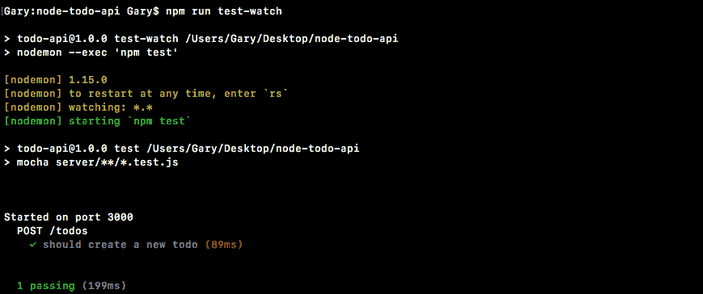

我们可以通过调整一些值来验证一切是否按预期工作。我可以添加`1`如下：

```js
request(app)
  .post('/todos')
  .send({text})
  .expect(200)
  .expect((res) => {
    expect(res.body.text).toBe(text + '1');
})
```

只是为了证明它实际上正在做它所说的。你可以看到我们得到了一个错误，因为这两个不相等。

对于我们的状态也是一样的。如果我将状态更改为其他值，比如`201`，测试套件将重新运行并失败。最后但并非最不重要的是，如果我将`toBe`更改为`3`，如下所示：

```js
expect(todos.length).toBe(3); 
```

这将失败，因为我们总是在清除数据库，因此这里唯一正确的值将是`1`。现在我们已经有了这个，我们可以添加我们的第二个测试用例。这将是验证当我们发送错误数据时，待办事项不会被创建的测试用例。

# 测试用例：不应该使用无效的主体数据创建待办事项

要开始使用这个，我们将使用`it`来创建一个全新的测试用例。这个测试用例的文本可能是`should not create todo with invalid body data`。我们可以传入带有`done`参数的回调函数，并开始进行超级测试请求。

这一次，不需要创建一个`text`变量，因为我们不会将文本传递进去。我们要做的是什么都不传递：

```js
it('should not create todo with invalid body data', (done) => {

});
```

现在，我想让你做的是，像之前一样发出一个请求。你将向相同的 URL 发出一个`POST`请求，但是你将发送一个空对象作为`send`。这个空对象会导致测试失败，因为我们无法保存模型。然后，你会期望我们得到一个`400`，这将是情况，我们在`server.js`文件中发送了一个 400。你不需要对返回的主体做出任何假设。

最后，你将使用以下格式；我们将传递一个回调给`end`，检查是否有任何错误，然后对数据库做出一些假设。你要做的假设是`todos`的长度是`0`。由于前面的代码块没有创建`Todo`，所以不应该有`Todo`存在。`beforeEach`函数将在每个测试用例运行之前运行，所以在我们的用例运行之前，`should create a new todo`中创建的`Todo`将被删除。继续设置。发出请求并验证长度是否为 0。你不需要在前一个测试用例中进行断言，因为这个断言是关于数组的某些内容，而数组将是空的。你也可以不使用以下断言：

```js
.expect((res) => {
  expect(res.body.text).toBe(text);
})
```

因为我们不会对主体做出任何断言。完成后，保存测试文件。确保你的两个测试都通过了。

我要做的第一件事是调用`request`，传入我们的`app`。我们想再次发出一个`post`请求，所以我会再次调用`.post`，URL 也将是相同的。现在，在这一点上，我们将调用`.send`，但我们不会传递无效的数据。这个测试用例的整个重点是看当我们传入无效数据时会发生什么。应该发生的是我们应该得到一个`400`，所以我期望从服务器得到一个`400`的响应。现在我们不需要对主体做出任何断言，所以我们可以继续进行`.end`，在那里我们将传递我们的函数，该函数将被调用并传入`err`参数，如果有的话，以及`res`，就像这样：

```js
it('should not create todo with invalid body data', (done) => {
  request(app)
  .post('/todos')
  .send({})
  .expect(400)
  .end((err, res) => {

  });
});
```

现在，我们要做的是处理任何潜在的错误。如果有错误，我们将`return`，这将停止函数的执行，然后我们将调用`done`，传入错误，以便测试正确地失败：

```js
.end((err, res) => {
  if(err) {
    return done(err);
  }
});
```

# 对`Todos`集合的长度做出断言

现在，我们可以从数据库中获取数据，并对`Todos`集合的长度做出一些断言。我将使用`Todo.find`来获取集合中的每一个`Todo`。然后，我将添加一个`then`回调，这样我就可以对数据做一些操作。在这种情况下，我将得到`todos`，并对其长度做出断言。我们将期望`todos.length`等于数字`0`。

```js
Todo.find().then((todos) => {
  expect(todos.length).toBe(0);
});
```

在这个测试用例运行之前，数据库中不应该有`Todo`，因为我们发送了错误的数据，所以这个测试用例不应该创建任何`Todo`。现在我们可以调用`done`，并且我们也可以添加我们的`catch`回调，就像之前一样。我们将调用`catch`，获取错误参数并将其传递给`done`：

```js
Todo.find().then((todos) => {
  expect(todos.length).toBe(0);
  done();
}).catch((e) => done(e));
```

现在，我们完成了。我可以保存文件了。这将重新启动`nodemon`，这将重新启动我们的测试套件。我们应该看到的是我们的两个测试用例，它们都通过了。在终端中，我们确实看到了这一点。我们有两个`POST /todos`的测试用例，两者都确实通过了：

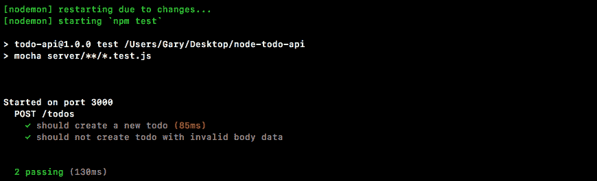

在这一节中，设置基本的测试套件花了一些时间，但是在将来，随着我们添加更多的路由，测试将会更容易。我们不需要设置基础设施；我们也不需要创建测试脚本或安装新的模块。

# 为`POST /todos`路由做出提交

最后要做的就是提交。我们添加了一些有意义的代码，所以我们要保存这项工作。如果我运行`git status`，您可以看到我们有一些更改的文件以及一些未跟踪的文件，所以我将使用`git add .`将所有这些添加到下一个提交中。现在，我可以使用`git commit`和`-m`标志来实际进行提交。对于这个提交，一个好的提交消息将是`测试 POST /todos 路由`。

```js
**git commit -m 'Test POST /todos route'** 
```

我将进行提交，最后，我将使用`git push`将其推送到 GitHub。您可以在这种特殊情况下使用`git push`。我需要使用`git push --force`，这将覆盖 GitHub 上的所有内容。这只是我在这种特定情况下需要做的事情。您应该只运行`git push`。运行后，您的代码应该被推送到 GitHub，然后就完成了。我们的路由有两个测试案例，现在是时候继续添加新的路由了。下一个路由将是一个`GET`请求，用于获取所有 Todos。

# 列出资源 - GET /todos

现在我们的测试套件已经就位，是时候创建我们的第二个路由了，即`GET /todos`路由，它将负责返回所有的 Todos。这对于任何 Todo 应用程序都是有用的。

# 创建 GET /todos 路由

您可能要向用户显示的第一个屏幕是他们所有的 Todos 列表。这是您用来获取信息的路由。这将是一个`GET`请求，所以我将使用`app.get`来注册路由处理程序，URL 本身将与我们的 URL 匹配，`/todos`，因为我们想要获取所有的 Todos。稍后当我们获取单个 Todo 时，URL 将看起来像`/todos/123`，但现在我们将其与 POST URL 匹配。接下来，我们可以在`server.js`中的`app.listen`上面添加我们的回调；这将给我们我们的请求和响应对象：

```js
app.get('/todos', (req, res) => {

});
```

我们所需要做的就是获取集合中的所有 Todos，这一步我们已经在测试文件中完成了。在`server.test.js`中，我们使用`Todo.find`来获取所有的 Todos。我们将在这里使用相同的技术，但是我们不会传入查询；我们想要返回所有内容。

```js
app.get('/todos', (req, res) => {
  Todo.find()
});
```

稍后当我们添加身份验证时，您将只获取您创建的`Todos`，但是现在，没有身份验证，您将获取`Todos`集合中的所有内容。

接下来，我们将添加一个`then`调用。这个`then`调用将使用两个函数，一个是成功案例函数，当承诺被解决时调用，另一个是当承诺被拒绝时调用的函数。成功案例将使用所有的`todos`调用，并且我们要做的就是使用`res.send`将这些信息发送回去。

```js
app.get('/todos', (req, res) => {
  Todo.find().then((todos) => {
    res.send()
  }, (e) => {

  })
});
```

我们可以传入`todos`数组，但这不是完成任务的最佳方式。当您返回一个数组时，您有点束缚自己。如果您想添加另一个属性，无论是自定义状态代码还是其他数据，您都不能，因为您有一个数组。更好的解决方案是创建一个对象，并在该对象上指定`todos`，使用 ES6 将其设置为`todos`数组：

```js
app.get('/todos', (req, res) => {
  Todo.find().then((todos) => {
    res.send({todos});
  }, (e) => {

  })
});
```

这将让您以后添加其他属性。例如，我可以添加某种自定义状态代码，将其设置为我喜欢的任何值。通过使用对象而不是发送一个数组回来，我们为更灵活的未来打开了可能性。有了这个，我们的成功案例就可以运行了。我们唯一需要做的就是处理错误，错误处理程序将与我们之前使用的一样，`res.status`。我们将发送一个`400`，并将发送回传入函数的错误对象：

```js
app.get('/todos', (req, res) => {
  Todo.find().then((todos) => {
    res.send({todos});
  }, (e) => {
    res.status(400).send(e);
  });
});
```

既然我们已经完成了这一步，我们可以启动服务器并在 Postman 中测试一下。

# 测试 GET /todos 路由

我将使用以下命令启动服务器：

```js
**node server/server.js** 
```

在 Postman 中，我们可以开始创建一些待办事项。目前，我们的应用程序和应用程序的测试使用相同的数据库。在上一节中我们运行的`beforeEach`方法调用不幸地擦除了一切，这意味着我们没有数据可获取。我在 Postman 中要做的第一件事是尝试获取我们应该得到的数据，我们应该得到一个空数组，这仍然可以工作。URL 将是`localhost:3000/todos`，确实将是一个 GET 请求。我可以点击发送，这将触发请求，然后我们得到我们的数据：

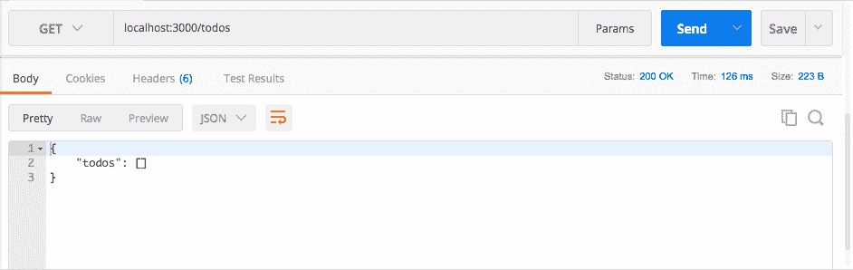

我们有一个对象，我们有我们的`todos`属性，我们有我们的空数组，这是预期的。

现在，您可能已经注意到，每次想要使用它时手动配置路由变得非常乏味，我们将一遍又一遍地使用相同的路由。通过 Postman，我们实际上可以创建一个路由集合，这样我们就可以重新发送请求，而不必手动输入所有信息。在右侧，我可以单击保存旁边的下拉箭头，然后单击另存为。在这里，我可以给我的请求一些详细信息：

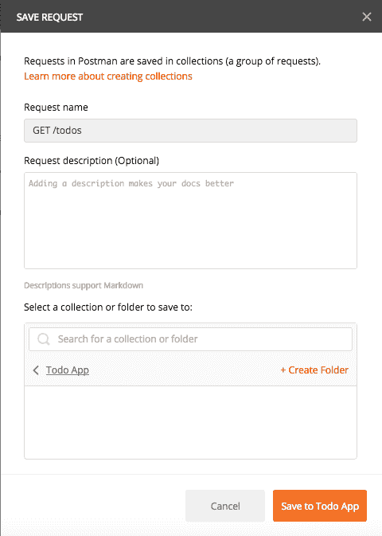

我将请求名称更改为`GET /todos`；这是我喜欢使用的命名约定，HTTP 方法后跟 URL。我们现在可以暂时将描述留空，并且我们可以创建一个新的集合，因为我们没有任何集合。Postman Echo 集合是 Postman 提供给您探索此功能的示例集合。我们将创建一个名为`Todo App`的集合。现在，每当我们想要运行该命令时，我们只需转到集合，点击 GET /todos，点击发送，请求就会触发。

让我们继续设置一个`POST`请求来创建一个待办事项，然后我们将运行它，保存它，并重新运行`GET`以确保返回新创建的待办事项。

# 设置 Post 请求以创建待办事项

要创建`POST`请求，如果您还记得，我们必须将方法更改为 POST，URL 将保持不变，`localhost:3000/todos`：

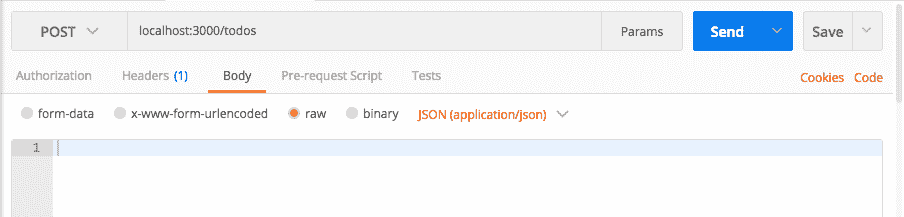

现在，为了使这个请求成功，我们还必须传递一个 Body 标签。这个标签将是一个原始的 JSON 主体。在这里，我们可以指定我们想要发送的数据。在这种情况下，我们要发送的唯一数据属性是`text`，我将其设置为`从 Postman 做的一些事情`：

```js
{ 
  "text": "Something to do from postman"
}
```

现在，我们可以继续执行此操作，然后在下面，我们得到了我们新创建的带有 200 状态代码的 Todo：

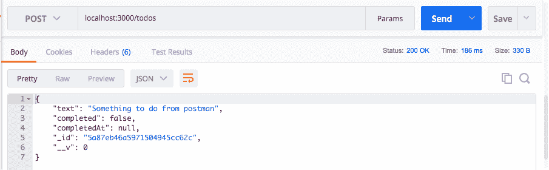

这意味着一切都进行得很顺利。我们可以将其保存到我们的集合中，以便稍后可以轻松地重新运行此操作。我将请求名称更改为`POST /todos`，遵循相同的语法。然后，我可以选择现有的集合，Todo App 集合，并保存它：

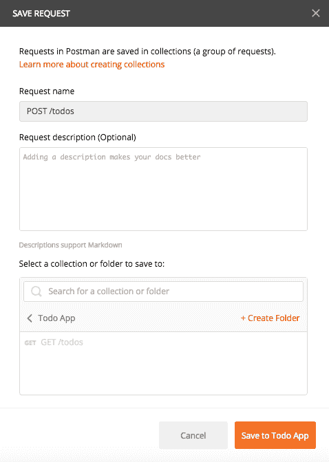

现在，我只需点击请求，使用*command* + *enter*，或单击发送按钮，即可发送请求，然后我得到了我的`todos`数组，一切看起来都很好。

我总是可以点击 POST，添加第二个，如果我喜欢，可以进行微调，添加数字`2`，然后我可以使用*command* + *enter*来发送它。我可以重新运行`GET`请求，然后在数据库中有两个`todos`：

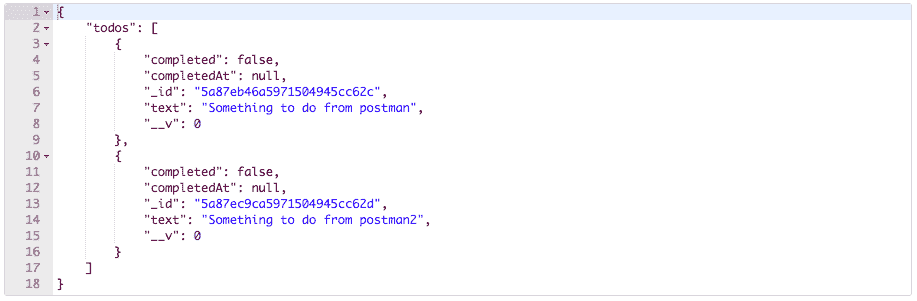

有了这个，我们的`GET /todos`请求现在已经完成。我们还在 Postman 中设置了我们的集合，这样就可以更快地触发任何这些 HTTP 请求。

我将通过在终端中进行提交来结束本节。我将关闭服务器并运行`git status`。这一次，你会看到我们只有一个文件被修改，这意味着我们可以简单地使用`git commit`和`-a`标志，而不是使用`git add`。`-a`标志将所有修改的文件添加到下一个提交中。它不适用于新的、未跟踪的文件，但修改的文件是完全可以的。然后，我可以添加`-m`标志来指定我的提交消息。对于这个来说，一个好的提交消息将是`Add GET /todos route`：

```js
**git commit -a -m 'Add GET /todos route'** 
```

最后，我们将使用`git push`将其推送到 GitHub，现在我们完成了。在下一节中，我们将为`GET /todos`编写测试用例。

# 测试 GET /todos

现在我们的`GET /todos`路由已经就位，是时候为它添加一个测试用例了。现在，我们实际上可以编写测试用例之前，我们必须处理一个不同的问题。我们在`server.test`文件中的第一件事是删除所有的 Todos，这发生在每个测试之前。`GET /todos`路由基本上依赖于数据库中有它可以返回的 Todos。它将处理 Node Todos，但对于我们的测试用例，我们希望数据库中有一些数据。

为了添加这些数据，我们要做的是修改`beforeEach`，添加一些种子数据。这意味着我们的数据库仍然是可预测的；当它启动时，它总是看起来完全一样，但它会有一些项目。

# 为 GET /todos 测试用例添加种子数据

现在，为了做到这一点，我们要做的第一件事是制作一个虚拟 Todos 数组。这些 Todos 只需要`text`属性，因为其他所有内容都将由 Mongoose 填充。我可以创建一个名为`todos`的常量，将其设置为一个数组，我们将有一个对象数组，其中每个对象都有一个`text`属性。例如，这个可以有一个文本为`First test todo`，然后我可以在数组的第二个项目中添加第二个对象，其`text`属性等于`Second test todo`：

```js
const todos = [{
  text: 'First test todo'
},{
  text: 'Second test todo'
}];
```

现在，我们实际上可以编写测试用例之前，我们必须使用一个全新的 Mongoose 方法`insertMany`修改`beforeEach`，它接受一个数组，如前面的代码块所示，并将所有这些文档插入集合中。这意味着我们需要快速调整代码。

不是使用一个简单的箭头函数调用`done`，我要加上一些花括号，在回调函数内部，我们将调用`Todo.insertMany`，并且我们将使用在前面的代码块中定义的数组调用`insertMany`。这将插入数组中的所有 Todos，我们的两个 Todos，然后我们可以做一些像调用`done`的事情。我将返回响应，这将让我们链接回调，然后我可以添加一个`then`方法，在那里我可以使用一个非常简单的基于表达式的箭头函数。我要做的就是使用表达式语法调用`done`：

```js
beforeEach((done) => {
  Todo.remove({}).then(() => {
    return Todo.insertMany(todos);
  }).then(() => done());
});
```

现在，让我们继续运行测试套件。我现在警告你，其他测试会出问题，因为它们断言的数字现在将不正确。在终端中，我将使用以下命令启动测试套件：

```js
**npm run test-watch** 
```

一旦测试套件启动，我将回到 Atom，正如承诺的那样，两个测试用例都失败了。我们期望`3`是`1`，我们期望`2`是`0`。现在所有的都错了`2`。

为了解决这个问题，我们将使用两种不同的技术。在 server.test.js 文件中，在 Post todos 测试中，对于第一个测试，我们要做的是只查找`text`属性等于`Test todo text`的 Todos：

```js
Todo.find({text}).then((todos) => {
  expect(todos.length).toBe(1);
  expect(todos[0].text).toBe(text);
  done();
}).catch((e) => done(e));
```

这意味着结果的长度仍然是`1`，第一项仍然应该有一个`text`属性等于上面的文本。对于第二个测试，我们将保持`find`调用不变；相反，我们将确保数据库的长度为`2`：

```js
Todo.find().then((todos) => {
  expect(todos.length).toBe(2);
  done();
}).catch((e) => done(e));
```

Todos 集合中应该只有两个文档，因为这是我们添加的所有内容，这是一个失败的测试，所以不应该添加第三个。有了这个设置，你可以看到我们的两个测试用例现在通过了：


我们现在准备继续并在测试用例中添加一个新的`describe`块。

# 在测试用例中添加一个描述块

我将添加一个`describe`块，描述`GET /todos`路由，传入我们的箭头函数，然后我们可以添加我们的单个测试用例，`it('should get all todos', )`。现在，在这种情况下，所有的`todos`都指的是我们之前添加的两个 Todos。我将传入一个带有`done`参数的箭头函数，我们准备好了。我们所要做的就是开始 super test 请求——我将在 express 应用程序上`request`一些东西——这将是一个 GET 请求，所以我们将调用`.get`，传入 URL`/todos`：

```js
describe('GET /todos', () => { 
  it('should get all todos', (done) => { 
    request(app) 
    .get('/todos') 
  )}; 
});
```

有了这个设置，我们现在准备做出我们的断言；我们没有在请求体中发送任何数据，但我们将对返回的内容做出一些断言。

# 在测试用例中添加断言

我们期望返回`200`，并且我们还将创建一个自定义断言，期望关于 body 的一些内容。我们将使用响应提供我们的回调函数，并期望`res.body.todos`的长度为`2`，`.toBe(2)`。现在我们有了这个设置，我们所要做的就是添加一个`end`调用，并将`done`作为参数传递。

```js
describe('GET /todos', () => {
  it('should get all todos', (done) => {
    request(app)
    .get('/todos')
    .expect(200)
    .expect((res) => {
      expect(res.body.todos.length).toBe(2);
    })
    .end(done);
  )};
});
```

不需要提供一个结束函数，因为我们不是异步地做任何事情。

有了这个设置，我们现在可以继续了。我们可以保存`server.test`文件。这将使用`nodemon`重新运行测试套件；我们应该看到我们的新测试，并且它应该通过。在终端中，我们就是这样得到的：

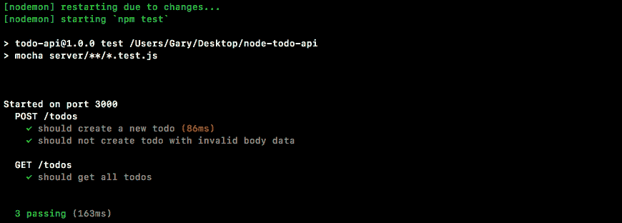

我们有`POST /todos`部分；这两个测试都通过了，我们有`GET /todos`部分，一个测试确实通过了。现在，如果我将状态更改为`201`，测试将失败，因为这不是返回的状态。如果我将长度更改为`3`，它将失败，因为我们只添加了 2 个 Todos 作为种子数据。

现在我们完成了，让我们继续提交，保存这段代码。我将关闭`test-watch`脚本，运行`git status`命令，我们有两个修改过的文件，这意味着我可以使用`git commit`与`-a`标志和`-m`标志。记住，`-a`标志将修改的文件添加到下一个提交。这次提交的好消息是`Add tests for GET /todos`：

```js
**git commit -a -m 'Add tests for GET /todos'**
```

我要提交，将其推送到 GitHub，然后我们就完成了。

# 总结

在本章中，我们致力于设置 mongoose，将 mongoose 连接到数据库。我们创建了一些 Todos 模型并运行了测试脚本。接下来，我们研究了 mongoose 验证器、默认值和类型，并自定义了 todo 模型的属性，如测试、完成和完成时间。然后，我们了解了 Postman 的基础知识，并向 Google 发出了 HTTP 请求。我们还研究了配置一些 todo 路由，主要是 POST /todos 和 GET /todos。我们还研究了创建测试用例和测试这些路由。

有了这个设置，我们现在准备继续添加一个全新的路由，这将在下一章中进行。
