# 第四章：MongoDB、Mongoose 和 REST API - 第三部分

在本章中，您将在玩弄 Mongoose 之后解决 Mongoose 查询和 ID 验证的问题。我们将深入了解不同类型的 todo 方法，然后将 API 部署到 Heroku。最后，在学习更多关于 Postman 环境和运行各种测试用例之后，我们将创建我们的测试数据库。

# Mongoose 查询和 ID 验证

在这一部分，你将学习一些使用 Mongoose 查询数据的替代方法。现在，在`server.test`文件中，我们已经看过一种方法，`Todo.find`。我们将再看两种方法，然后我们还将探讨如何验证 ObjectIDs。

为了做到这一切，我们将在`playground`文件夹中创建一个新文件。我将把这个文件命名为`mongoose-queries.js`，我们需要做的第一件事是加载`db`文件夹中的`mongoose`文件和`models`文件夹中的`todo`文件。我将使用 ES6 解构，就像我们在发生这种情况的所有文件中使用的那样，然后我们可以在本地文件中`require`。使用相对路径，我们需要返回到`playgroundserverdb`的上一级目录，最后我们要找的文件名叫做`mongoose`：

```js
const {mongoose} = require('./../server/db/mongoose');
```

我们可以对`todo`做同样的事情；我们将从`require`中使得常量`Todo`返回结果，文件将遵循相同的路径。我们需要返回到上一级目录并进入`server`，但是不是进入`db`而是进入`models`。然后我们会得到`todo`文件：

```js
const {Todo} = require('./../server/models/todo');
```

现在，在我们实际进行任何查询之前，我们将在 Robomongo 中获取一个现有 Todos 的 ID。在`TodoApp`数据库中，我将浏览所有文档，然后我会获取第一个文档的 ID：

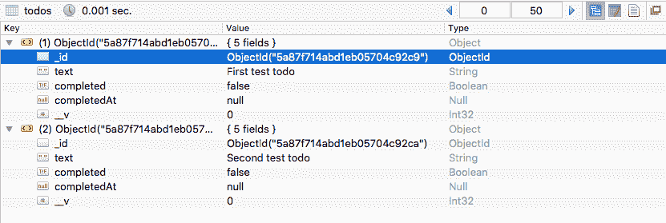

我会右键单击进行编辑，然后我可以获取 ID，不包括引号、括号和`ObjectId`标识符。有了这个 ID 在剪贴板中，回到 Atom 中我可以创建一个名为`id`的变量，并将其设置为我刚刚复制的 ID，然后我们就有了一个 ID，我们可以用它来进行所有的查询。

# Todo.find 方法

现在，我明白你之前已经使用过`Todo.find`，但我们将讨论一些其他事情。所以我们将从那里开始。`Todo.find`允许您查询尽可能多的 Todos。您可以不传递任何参数来获取所有的 Todos，或者您可以按任何条件查询。我们将按`_id`查询。现在，Mongoose 非常棒，它不需要您传递 ObjectIDs，因为它实际上可以为您做到这一点。在这种情况下，我们所做的是完全有效的。我们传递一个字符串作为值，Mongoose 将接受该字符串，将其转换为 ObjectID，然后运行查询。这意味着我们不需要手动将我们的字符串转换为 ObjectID。现在，在我们进行查询之后，我们可以附加一个`then`回调，我们将得到所有的 Todos，我们将命名该参数，然后可以继续将它们打印到屏幕上，`console.log('Todos',)`，第二个参数将是实际的`todos`数组：

```js
var id = '5a87f714abd1eb05704c92c9';

Todo.find({
   _id: id
}).then((todos) => {
   console.log('Todos', todos);
});
```

除了可以将`id`作为字符串传递之外，这里没有什么新的东西。

# Todo.findOne 方法

接下来我们要看的方法是一个叫做`Todo.findOne`的方法。现在，`Todo.findOne`非常类似于 find，唯一的区别是它最多返回一个文档。这意味着它只是简单地获取与您查询匹配的第一个文档。在我们的例子中，我们通过唯一的 ID 进行查询，所以它只会找到一个匹配的项目，但是如果有其他结果，例如，如果我们查询所有 completed 为 false 的 Todos，第一个文档将是唯一返回的，即使有两个匹配查询的。我们调用`findOne`的方式与我们用 find 的方式是一样的，为了证明这一点，我实际上要复制代码。我们只需要改变一些东西。我们不再是得到`todos`，而是得到`todo`，我们只是得到一个单独的文档而不是一组文档。这意味着我可以打印一个`Todo`字符串，然后是`todo`变量：

```js
Todo.findOne({
   _id: id
}).then((todo) => {
   console.log('Todo', todo);
});
```

有了这个，我们现在有足够的例子来运行文件并看看到底会发生什么。

在终端内部，我将通过运行这个文件来开始一些事情，并且我将使用以下命令来运行它：

```js
**nodemon playground/mongoose-queries.js**

```

当我们运行文件时，我们得到我们的`Todos`数组，我们得到一个文档的数组，我们得到我们的`Todo`对象：

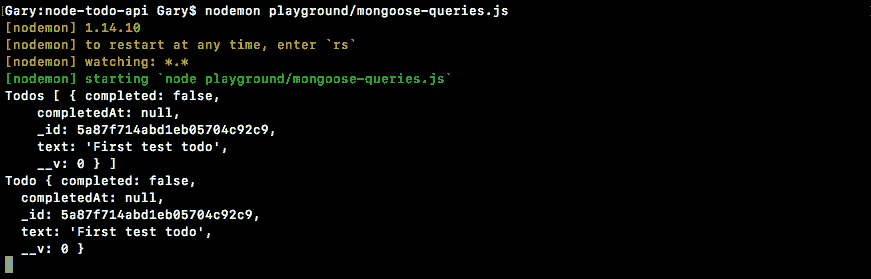

如果您知道您只是想获取一个单独的项目，我建议使用`findOne`而不是`find`。您会得到文档而不是数组。当您要查找的 Todo 的 ID 不存在时，这也会使得处理变得更加容易；与其得到一个空数组作为结果，您将得到`null`，然后您可以对此进行处理，做任何您喜欢的事情。也许这意味着您返回一个 404，或者也许您希望在找不到 ID 时做其他事情。

# Todo.findById 方法

我们要看的最后一个方法是`Todo.findById`。现在，`findById`非常棒，如果您只是想通过其标识符查找一个文档。除了 ID 之外，没有其他查询方式，您只需将 ID 作为参数传入。您不需��创建一个查询对象，也不需要设置`_id`提示。有了这个，我们现在可以做与`findOne`相同的事情。我将通过将`then`调用粘贴到`Todo.findById`中来证明这一点，并且只需将打印语句从`Todo`更改为`Todo By Id`：

```js
Todo.findById(id).then((todo) => {
   console.log('Todo By Id', todo);
});
```

现在如果我保存文件，`nodemon`将重新运行，我们将得到完全相同的结果：

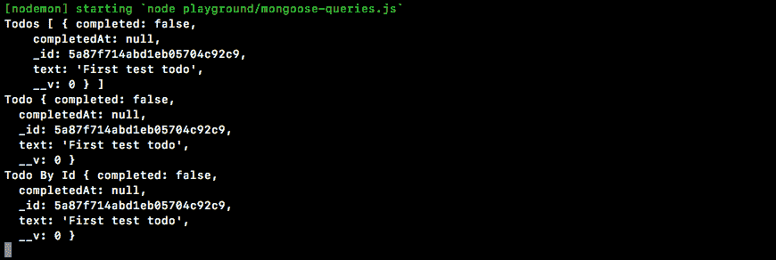

如果您想通过除 ID 之外的其他方式找到一个文档，我建议使用`findOne`。如果您想通过 ID 找到一个文档，我总是建议使用`findById`。现在，所有这些以及更多内容都可以在文档中找到，所以如果您想深入了解我在这里讨论的任何内容，您可以随时访问[mongoosejs.com](http://mongoosejs.com)。点击阅读文档链接，在左侧有一些链接；我们要找的是查询的链接：

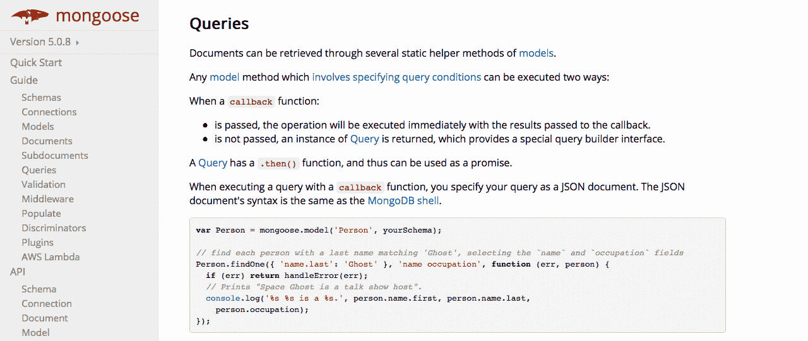

您可以了解更多关于如何查询文档的信息，但我们已经基本涵盖了这个页面所讨论的一切。

# 处理 ID 不存在的情况

现在，我想要谈论的下一件事是当 ID 不正确时会发生什么，这将是一个情况，因为请记住，我们的 API 将从用户那里获取这个 ID，这意味着如果 ID 不正确，我们不希望我们的代码失败，我们希望优雅地处理这些错误。为了证明这一点，我将继续调整 ID。ID 有特定的协议，所以我想让您在您的 ID 中找到一个数字。我将选择第一个字符，因为它恰好是一个数字，然后将其递增一。我将从`5`变为`6`。现在我们有一个有效的 ID，但是 ID 不会在数据库中，因为我调整了它，显然数据库中的其他 Todo 与此 ID 不匹配。

现在，有了这个设置，你可以看到当我们重新启动服务器时，我们得到了一个空数组的 find 调用，并且对于`findOne`和`findById`都得到了 null：

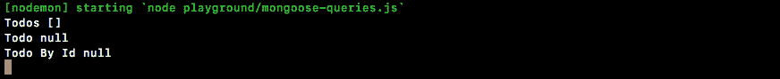

当你的 ID 在数据库中找不到匹配项时，不会抛出错误；它仍然会触发成功情况，只是会以一个空数组或 null 的形式触发，这意味着当我们想处理 ID 在数据库中不存在的情况时，我们只需要添加一个`if`语句。在`Todo.findById`语句中，我可以添加一个`if`语句。如果没有待办事项，我们将做一些事情，那个事情就是使用`return`来阻止函数的其余部分执行，并且我们会打印一个小消息，`console.log('Id not found')`：

```js
Todo.findById(id).then((todo) => {
   if(!todo) {
         return console.log('Id not found');
   }
   console.log('Todo By Id', todo);
});
```

现在，如果我保存文件，最后一个调用应该看起来有点不同：

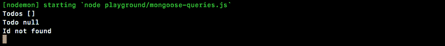

如前面的屏幕截图所示，我们得到了`Id not found`而不是 null 的 Todo，这很完美。现在我们知道如何使用`findOne`和`findById`进行查询，也知道如何处理查询的 ID 实际上不存在于集合中的情况。我将 ID 设置回原始值，将`6`改为`5`，如果我保存文件，nodemon 将重新启动，我们将得到我们的文档。

# 验证 ObjectID

现在，我想谈谈的最后一件事是如何验证 ObjectID。到目前为止，我们已经创建了一个有效的 ObjectID。它只是一个不在集合中的值，但如果我们做一些像加上两个`1`这样的事情，我们实际上会得到一个无效的 ID，这将导致程序出错。现在，你可能会想为什么会发生这种情况，但这可能是因为用户是指定 ID 的人。我们将在`findById`上添加一个`catch`调用。我们将获取错误并简单地使用`console.log`将其打印到屏幕上：

```js
Todo.findById(id).then((todo) => { 
  if(!todo) { 
    return console.log('Id not found'); 
  } 
  console.log('Todo By Id', todo); 
}).catch((e) => console.log(e));
```

现在，为了说明这一点，我们不需要所有三个查询。为了清理终端输出，我将注释掉`Todo.find`和`Todo.findOne`。有了这个设置，我们的无效 ID 和`catch`回调，我们可以保存文件，在终端中我们应该会得到一个非常长的错误消息：


对于给定值，我们有一个错误消息，`CastError: Cast to ObjectId failed`。这是在警告你，你的`ObjectID`不仅不存在于集合中，而且完全无效。现在，使用`catch`方法运行这个可以让我们处理错误。我们可以告诉用户，嘿，你发送的 ID 是无效的，但也有另一种方法可以完成。我们要做的是加载 MongoDB 原生驱动程序中的 ObjectID，这是我们以前做过的事情。在`mongodb-connect`中我们加载了`ObjectID`。在`mongoose-queries`中我们要做同样的事情。我将创建一个叫做`ObjectID`的常量，并且从`mongodb`库中获取它：

```js
const {ObjectID} = require('mongodb');
```

现在，在`ObjectID`上我们有很多实用方法。我们已经看过如何创建新的 ObjectIDs，但我们还可以访问一个叫做`ObjectId.isValid`的方法。`isValid`方法接受值，本例中是我们的字符串`id`，如果它是有效的则返回 true，如果无效则返回 false，这意味着我们可以在运行查询之前添加`if`条件来验证 ID。

我们将添加一个`if`语句，并检查值是否无效。我将使用感叹号翻转它，然后我们可以调用`ObjectID.isValid`。通过翻转它，我们实质上创建了一个测试 ObjectID 是否无效的方法。我要传入的值只是存储在`id`变量中的字符串，现在我们可以添加一些代码，当 ID 无效时运行，`console.log('ID 无效')`：

```js
if(!ObjectID.isValid(id)) {
   console.log('ID not valid');
}
```

现在，如果我保存文件，我们应该会收到`ID 无效`的消息，然后之后我们应该会收到错误消息打印到终端，因为我们仍然有我们的`catch`调用，这个查询仍然会运行。在这里我们就得到了。`ID 无效`打印到屏幕上：

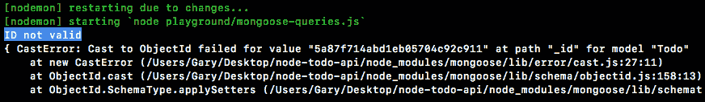

但现在我们知道如何验证 ID 了，这将在下一节中派上用场。

现在是时候挑战一下了。在设置挑战之前，我将注释掉`id`和我们的`isValid`调用，然后在下面我将注释掉`findById`。我将把它们留在这里；您可以将它们用作挑战中要做的参考。您的挑战是查询用户集合。这意味着您将要继续前进并移入 Robomongo，并从用户集合中获取一个 ID。这里我只有一个文档；如果由于某种原因您没有文档，您可以随时右键单击“插入文档”，然后只需指定电子邮件。

现在，为了在 Atom 内部进行该查询，您需要加载用户 Mongoose 模型，因为目前我们只有 Todo 一个，需要。在下面，我希望您使用`User.findById`来查询您在 Robomongo 中选择的 ID。然后，您将继续处理三种情况。将会有查询成功但没有用户的情况。在这种情况下，您将打印类似于`未找到用户`的内容。您还将处理找到用户的情况。我希望您继续将用户打印到屏幕上。最后，您将处理可能发生的任何错误。对于这个，您可以简单地将错误对象打印到屏幕上。这次不需要使用`isValid`，您只需填写`findById`调用即可。

现在，我要做的第一件事是导入用户文件。我将创建一个`const`，我将从 require 的返回结果中获取`User`变量，并且我们将按照这里的相同路径进行。我们必须从`playground`目录中出来，进入`server/models`目录，最后文件名是`user`：

```js
const {User} = require('./../server/models/user');
```

现在我们已经导入了用户，我们可以在下面查询它。在编写查询之前，我将在 Robomongo 中获取一个 ID：

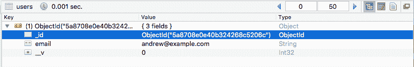

我可以编辑文档，突出显示它，复制它，并移回到 Atom。在 Atom 内部，我将设置我的`User.findById`调用。我所要做的就是传入 ID；我已经将它放在剪贴板中，并且我将用引号括起来。接下来是回调函数。我将附加一个`then`回调，传入两个函数。第一个是当承诺被解决时，第二个是当承诺被拒绝时。对于拒绝，我们要做的就是将错误对象打印到屏幕上，这意味着我们可以使用`console.log(e)`。现在，如果事情进展顺利，仍然有一些例外情况。我们要确保用户确实存在。如果 ID 与集合中找到的任何内容不匹配，查询仍将通过。如果没有用户，我们将使用`return`停止函数执行，然后我们将继续使用`console.log('无法找到用户')`进行打印：

```js
User,findById('57bdb0fcdedf88450bfa2d66').then((user) => {
   if(!user) {
         return console.log('Unable to find user');
   }
}, (e) => {
   console.log(e);
});
```

现在，我们需要处理的最后一种情况是，如果事情确实进展顺利，这意味着查询确实有效，并且 ID 确实在用户集合中找到了。我将添加`console.log`，使用我们的漂亮打印技术，`user`变量，`JSON.stringify`，传入我们的三个参数，`user`，`undefined`，和数字`2`：

```js
User.findById('5a8708e0e40b324268c5206c').then((user) => {
   if(!user) {
        return console.log('Unable to find user');
   }
   console.log(JSON.stringify(user, undefined, 2));
}, (e) => {
   console.log(e);
});
```

有了这个，我现在可以保存文件并打开终端，因为它目前是隐藏的，我们的用户出现在终端中：

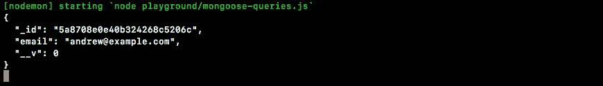

这太棒了；如果你看到这个，你已经成功完成了挑战。现在我也可以测试我的其他情况是否按预期工作。我将把 ID 末尾的`6`改为`7`并保存文件：

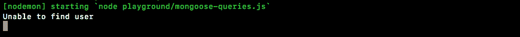

当它重新启动时，我得到`无法找到用户`，这是预期的。接下来，我将把它改回`6`，但我将添加几个`1`，或者其他任何字符。在这种情况下，我将使用两个`1`和两个`a`字符。这次我们确实得到了错误，我们无法将该值转换为 ObjectId。让我们撤消对 ID 的更改，现在我们完成了。

我将通过提交我们的更改来结束本节。我将关闭`nodemon`，运行`git status`命令，我们有一个新文件：


我可以使用`git add`将其添加到下一个提交，然后我可以使用`git commit`进行提交。这个的一个好消息是`Add queries playground file`：

```js
**git commit -m 'Add queries playground file'** 
```

有了这个，我将使用`git push`命令将其推送到 GitHub，我们完成了。在下一节中，您将负责创建一个完整的 API 请求。

# 获取个人资源 - GET /todos/:id

在本节中，您将创建一个用于获取单个待办事项的 API 路由。现在，本节的大部分内容都将是一个挑战，但在我们开始之前，有一件事我想向您展示，那就是**如何获取通过 URL 传递的变量**。现在，正如我提到的，这个 URL 的结构将是一个`GET`请求，`/todos`，然后我们将深入到 Todos，获取通过 URL 传递的单个项目的 ID，比如`/todos/12345`。这意味着我们需要使 URL 的 ID 部分是动态的。我希望能够获取该值，无论用户传入什么，然后使用它进行查询。我们在`mongoose-queries`文件中设置的查询，比如`User.findById`，用于通过 Id 获取待办事项。

现在，为了完成这个，让我们进入`server.js`文件，并调用`app.get`，传入 URL。

# 挑战接受

第一部分我们已经知道了，`/todos/`，但现在我们需要的是一个 URL 参数。URL 参数遵循这种模式：冒号后面跟着一个名称。现在我可以称这个为`:todoId`，或者其他任何名称，但是在本节中我们将称之为`:id`。这将创建一个`id`变量；它将在请求对象上，我们马上就会设置的那个对象上，我们将能够访问该变量。这意味着当有人发出`GET /todos/1234324`请求时，回调将触发，我们现在将指定的回调，我们将能够通过传入的 ID 进行查询。现在，我们仍然会得到请求和响应对象，唯一的区别是我们现在将使用请求的某些内容。这个是`req.params`。`req.params`对象将是一个对象，它将具有键值对，其中键是 URL 参数，比如 id，值是实际放在那里的任何值。为了演示这一点，我将简单地调用`res.send`，发送`req.params`对象回去：

```js
//GET /todos/12345
app.get('/todos/:id', (req, res) => {
   res.send(req.params);
});
```

这将让我们在 Postman 中测试这个���由，并确切地看到它是如何工作的。在终端中，我可以启动我们的服务器。我将使用以下命令启动：

```js
**nodemon server/server.js** 
```

现在服务器在`localhost:3000`上，我们可以对`/todos/:id`URL 进行`GET`请求。在 Postman 中，我将这样做；我们有 GET 方法，URL 是`localhost`，仍然在端口`3000/todos/`上，然后我们可以输入任何我们喜欢的东西，比如`123`。现在，当我发送这个请求时，我们得到的是`req.params`对象，在 Body 中你可以看到它有一个`id`属性设置为`123`：

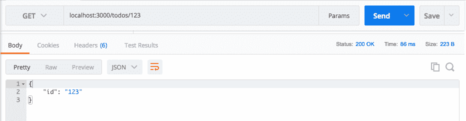

这意味着我们能够使用`req.params.id`访问 URL 中的值，这正是你需要为挑战做的事情。在 Atom 中，我将通过创建一个`var id = req.params.id`变量来开始这个过程。

有了这个准备，你现在知道了完成挑战所需的一切，这将是完成填写这个路由。首先，你将使用我们在`mongoose-queries`文件中探索过的 ObjectID `isValid`方法来验证 ID。我会留下一个小注释，`Valid id using isValid`。现在，如果它不是有效的，你将停止函数执行，并且你将回应一个`404`响应代码，因为传入的 ID 是无效的，而且永远不会在集合中。我们将回应一个`404`响应代码，让用户知道 Todo 没有找到，你可以发送回一个空的 body，这意味着你可以只调用 send 而不传递任何值。这将类似于没有错误的`res.status(400).send(e)`语句，你还会将`400`改为`404`。

接下来，你将开始查询数据库，这将使用`findById`来完成。我希望你拿到 ID 并查询`Todos`集合，寻找匹配的文档；有两种情况。有成功的情况，也有错误的情况。如果我们得到一个错误，那就很明显：我们将发送一个`400`响应代码，让用户知道请求无效，我们也将继续发送回空值。我们不会发送回错误参数，因为错误消息中可能包含私人信息。我们稍后会加强我们的错误处理。目前，正如你所看到的，我们在很多地方都重复了这个函数。稍后这将被移到一个位置，但现在你可以用`400`响应代码回应，并发送一个空的 body。这带我们来到成功的情况。现在，如果有一个 Todo，`if todo`，你将继续发送它。如果没有 Todo，`if no todo`，这意味着调用成功了，但在集合中找不到 ID。你将继续发送一个`404`响应代码和一个空的 body。

现在，这两个语句看起来非常相似；你将发送一个`404`，让用户知道他们传入的 ID 与`Todos`集合中的任何文档的 ID 都不匹配。现在你知道如何做到这一点，你可以使用任何你需要完成这个任务的东西。这意味着你可以使用`mongoose-queries`文件，你可以使用[mongoosejs.com](http://mongoosejs.com/)文档，你可以使用 Stack Overflow，Google，或者其他任何东西；这不是关于记住如何准确地完成任务，而是关于自己解决这些问题。最终，当这些技术一次又一次地出现时，你会记住很多这些技术，但现在你的目标只是让它工作。完成后，继续在 Postman 应用程序中发送这个请求。这意味着你要从 Robomongo 中获取一个有效的 ID，并将其粘贴到 URL 中。你还可以测试数据库中存在但无效的 ID 以及无效的 ID，比如`123`，这不是一个有效的 ObjectID。有了这个准备，你就可以开始挑战了。

# 挑战步骤 1 - 填写代码

我要做的第一件事是填写代码。我们将验证 ID，如果无效，我们将发送`404`响应代码。在文件的顶部，我没有导入 ObjectID，所以我需要去做。就在`bodyParser`下面，我可以创建一个变量`ObjectID`，并将其设置为`require`返回的结果；我们需要`mongodb`库。现在我们有了`ObjectID`，我们可以继续使用它。我们将编写一个`if`语句，`if (ObjectID.isValid())`。显然，我们只想在它无效时运行这段代码，所以我将使用感叹号翻转返回结果，然后我将传入`id`。现在我们有了一个`if`条件，只有在 ID 无效时才会通过。在这种情况下，我们将使用`return`来阻止函数执行，然后我将使用`res.status`进行响应，将其设置为`404`，然后我将调用`send`，不带参数，这样我就可以发送一个空的主体。我们完成了第一步。有了这个，我们现在可以继续创建查询了：

```js
//GET /todos/12345
app.get('/todos/:id', (req, res) => {
   var id = req.params.id;

   if(!ObjectID.isValid(id)) {
         return res.status(404).send();
   }
});
```

此时，我们实际上有一些可以测试的东西：我们可以传入无效的 ID，并确保我们得到了 404。在终端内部，我使用`nodemon`运行了应用程序，所以它会自动在 Postman 中重新启动。我可以重新运行`localhost:3000/todos/123`请求，我们得到了 404，这太棒了：

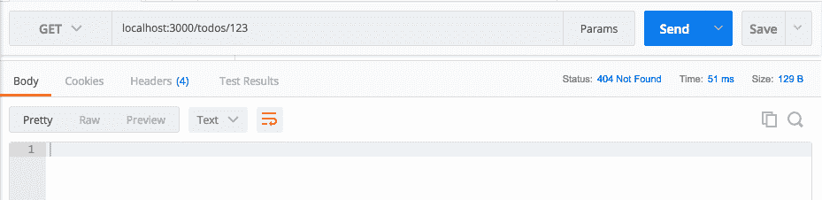

这不是一个有效的 ObjectID，条件失败了，404 确实返回了。

# 挑战步骤 2 - 进行查询

接下来，我们将进行查询`Todo.findById`。在这里，我们将传入 ID，我们在`id`变量中拥有，然后我们将附加我们的成功和错误处理程序，`.then`，传入我们的成功回调。这可能会调用个别的 Todo 文档，并且我也会调用`catch`，获取错误。我们可以先处理错误处理程序。如果有错误，我们将保持非常简单，`res.status`，将其设置为`400`，然后我们将继续调用`send`，有意地省略错误对象：

```js
Todo.findById(id).then((todo) => {

}).catch((e) => {
   res.status(400).send();
});
```

有了这个，唯一剩下的事情就是填写成功处理程序。我们需要确保实际上找到了一个 Todo。这个查询，如果成功，可能并不总是会返回一个实际的文档。我将使用一个`if`语句来检查是否没有 Todo。如果没有 Todo，我们希望用`404`响应代码进行响应，就像之前一样。我们将使用`return`来停止函数执行，`res.status`。这里的状态将是`404`，我们将使用`send`来响应没有数据：

```js
Todo.findById(id).then((todo) => {
   if(!todo) {
         return res.status(404).send();
   }
}).catch((e) => {
   res.status(400).send();
});
```

# 挑战步骤 3 - 成功路径

最后一种情况是快乐路径，成功的情况，当一切按计划进行时。ID 是有效的，我们在 Todos 集合中找到了一个与传入的 ID 匹配的文档。在这种情况下，我们要做的就是使用`res.send`进行响应，将 Todo 发送回去。现在，你可以像这样发送它`res.todo(todo)`；这确实可以工作，但我想稍微调整一下。我不是将 Todo 作为主体发送回去，而是将 Todo 作为`todo`属性附加到对象中，使用 ES6 对象定义，这与以下内容相同：

```js
res.send({todo: todo});
```

这给了我一些灵活性。我可以随时添加其他属性到响应中，比如自定义状态码或其他任何东西。这类似于我们用于`GET /todos`的技术。就在这里，`res.send({todos})`，不是用数组进行响应，而是用一个具有`todos`属性的对象进行响应，这就是数组：

```js
Todo.findById(id).then((todo) => {
   if(!todo) {
         return res.status(404).send();
   }
   res.send({todo});
}).catch((e) => {
   res.status(400).send();
});
```

现在我们已经完成了这一切，我们可以测试一下。我将保存文件，删除所有注释，根据需要添加分号，然后我们将从 Robomongo 中获取一个 ID。在 Robomongo 中，我可以获取一个我的 Todos 的 ID。我将选择第二个。我将编辑文档并将其复制到剪贴板。现在在 Postman 中，我们可以继续发出请求，将 ID 设置为我们刚刚复制的 ID 值：


我要发送它。我们在对象中有一个`todo`属性，在该`todo`属性上，我们有文档的所有属性，`_id`，`text`，`completedAt`和`completed`：

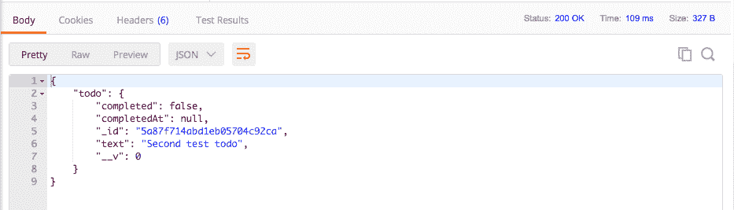

现在，我想测试的最后一种情况是，当我们请求一个具有有效 ObjectID 的 Todo，但恰好不存在时会发生什么。我将通过将 ID 中的最后一个数字从`a`更改为`b`来实现这一点：

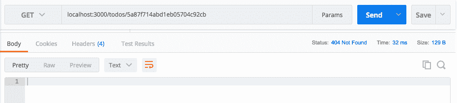

如果我发送这个，我们会得到`404`响应代码，这太棒了；这正是我在请求 Todo 时所期望发生的。ObjectID 是有效的，只是不在集合中。现在我们已经发出了这个请求，我们实际上可以将其保存在我们的 Todo App 集合中，这样以后就更容易触发这个请求。我将使用 Save As 保存它：


我们可以将请求描述留空，并将请求名称更改为`GET /todos/:id`。我将把它添加到我们现有的集合中，Todo App 集合。现在我们有三个路由；这个路由的唯一剩下的事情就是添加一些测试用例，这将是下一节的主题。

为了结束这一切，让我们提交我们的更改并将它们推送到 GitHub。我将关闭服务器并运行`git status`。

我们可以看到我们有我们修改过的文件；这意味着我可以运行带有`-a`标志和`-m`标志的`git commit`，然后我将提供我的提交消息。现在，如果您使用`-a`标志和`-m`标志，您实际上可以使用一个快捷方式，即`-am`标志，它执行完全相同的操作。它将把所有修改过的文件添加到提交中；它还将为我们提供一个添加消息的地方。这个的一个好消息将是`Add GET /todos/:id`：

```js
**git commit -am 'Add GET /todos/:id'** 
```

有了这个，我将提交并将其推送到 GitHub，我们完成了。在下一节中，我们将继续为这个路由编写测试用例。这将大致是像这个一样具有挑战性的。

# 测试 GET /todos/:id

在这一部分，我们将为这个路由创建三个测试用例，用于获取单个 Todo 项。一个是确保当我们传入无效的 ObjectID 时，我们会得到`404`响应代码。另一个是验证当我们传入有效的 ObjectID，但它不匹配文档时，我们会得到`404`响应代码，最后我们将编写一个测试用例，确保当我们传入与文档匹配的 ObjectID 时，该文档实际上会在响应体中返回。

我们将一起编写有效调用的测试用例，然后您将自己编写两个测试用例。这将是本节的挑战。

# 编写 GET/todos/:id 的测试用例

在`server.test.js`中，我们可以从最底部开始添加一个`describe`块。我将调用 describe，这个`describe`块将被命名为`GET /todos/:id`，我们可以将箭头函数(`=>`)添加为回调函数。在我们的`describe`回调中，我们现在可以设置我们将一起创建的测试用例，`it('should return todo doc')`。这将是一个确保当我们传入与文档匹配的有效 ID 时，文档会返回的测试。这将是一个异步测试，所以我们将指定`done`参数：

```js
describe('GET /todos/:id', () => {
   it('should return todo doc', (done) => {

   });
});
```

现在，为了运行这个测试用例，我们需要一个实际在集合中的 Todo 的 ID，如果你记得，我们确实向集合中添加了两个 Todos，但不幸的是我们没有这些 ID。这些 ID 是在幕后自动生成的；为了解决这个问题，我们要做的是添加 ID 属性，`_id`。这意味着我们将能够在我们的测试用例中访问 ID，并且一切都将按预期工作。现在，为了做到这一点，我们必须从 MongoDB 中加载一个 ObjectID，这是我们以前做过的。我将使用 ES6 解构来创建一个常量。我将从要求`mongodb`的返回结果中获取`ObjectID`：

```js
const {ObjectID} = require('mongodb');
```

现在，在`todos`数组中，我们可以为我们的两个`todos`添加一个`_id`属性，`new ObjectID()`，带有一个逗号-这是为第一个`todo`-在下面，我们也可以为第二个`todo`添加一个`_id`，`new ObjectID()`：

```js
const todos = [{
   _id: new ObjectID(),
   text: 'First test todo'
},{
   _id: new ObjectID(),
   text: 'Second test todo'
}];
```

现在我们有了 _ids，我们可以通过从`todos`数组中访问它们来访问这些 _ids，我们准备编写测试用例。

# 测试 1 - 超级测试请求

我们将开始创建我们的超级测试请求。我们将从`app` express 应用程序中`request`一些东西；这将是一个`get`请求，也就是我们要测试的 URL，实际的 URL 将是`/todos/id`，其中`id`等于`todos`中的一个这些 _ids。我将继续使用第一个`todo`的`_id`。在下面，我们可以通过将字符串更改为模板字符串来修复这个问题，这样我们就可以注入`_id`，`/todos/`然后我们将添加我们的语法来将一个值注入到模板字符串中。在这种情况下，我们从`todos`数组中访问一些东西。我们想要获取第一个项目，这是第一个`todo`，我们正在寻找它的`_id`属性。现在，这是一个 ObjectID；我们需要将其转换为字符串，因为这是我们将作为 URL 传递的内容。要将 ObjectID 转换为字符串，我们可以使用`toHexString`方法：

```js
describe('GET /todos/:id', () => {
   it('should return todo doc', (done) => {
         request(app)
         .get(`/todos/${todos[0]._id.toHexString()}`)
   });
});
```

现在我们已经生成了正确的 ID，我们可以开始对这个请求触发时应该发生的事情进行一些断言。首先，HTTP 状态码。那应该是`200`，所以我可以调用`expect`，传入`200`。下一步：我们确实希望验证返回的 body 与之前在`todos`数组中的 body 匹配，特别是`text`属性等于我们设置的`text`属性。我将创建一个自定义的`expect`调用来完成这个任务。我们将传入我们的函数，该函数将使用响应对象调用，现在我们可以使用`expect`库进行断言。我将使用`expect(res.body.todo)`，我们在`res.send({todo})`中设置了它，当我们使用 ES6 对象语法时，那个`todo`属性有一个`text`属性，它等于我们第一个`todo`的`text`属性。那将是`todos`，获取第一个，从零开始的 todo，我们将获取它的`text`属性。有了这个，我们所有的断言都完成了；我们可以调用`end`，传入`done`，这将结束测试用例。

```js
describe('GET /todos/:id', () => {
   it('should return todo doc', (done) => {
         request(app)
         .get(`/todos/${todos[0]._id.toHexString()}`)
         .expect((res) => {
               expect(res.body.todo.text).toBe(todos[0].text);
         })
         .end(done);
   });
});
```

现在我们可以继续在终端内运行这个测试，运行`npm run test-watch`。这将启动我们的测试套件，我们应该有我们的新部分和通过的测试用例：

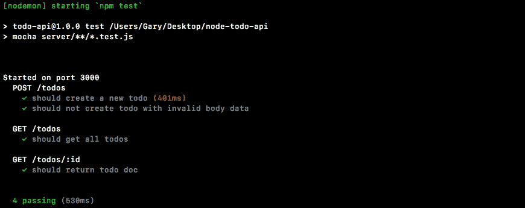

在这里，我们得到了`should return todo doc`，这是通过的，太棒了。现在是你自己写两个测试用例的时候了。我会给你 it 调用，这样我们就在同一个页面上，但你要负责填写实际的测试函数，`it('should return 404 if todo not found')`。这将是一个异步测试，所以我们将指定`done`参数，你的工作是使用一个真实的 ObjectID 发出请求，并调用它的`toHexString`方法。这将是一个有效的 ID，但它不会在集合中找到，所以我们应该得到一个 404。现在，你需要设置的唯一期望是状态码；确保你得到了`404`。

# 测试 2-验证无效的 ID

你要编写的第二个测试将验证当我们有一个无效的 ID 时，我们会得到一个`404`响应代码，`it('should return 404 for non-object ids')`。这也将是一个异步测试，所以我们将指定`done`。对于这个测试，你将传入一个 URL，类似于这样：`/todos/123`。这确实是一个有效的 URL，但当我们尝试将`123`转换为 ObjectID 时，它将失败，这应该触发`return res.status(404).send()`代码，我们应该得到一个`404`响应代码。再次，你需要为这个测试设置的唯一期望是当你向 URL 发出 get 请求时，状态码是`404`。花点时间来完成这两个测试用例，确保当你实际设置了调用时，它们能够按预期工作。如果你完成后在终端中所有的测试用例都通过了，那么你就可以继续了。

对于第一个，我将继续通过创建一个变量来获取`HexString`。现在，你不需要创建一个变量；你可以稍微不同地做。我将创建一个名为`hexId`的变量，将其设置为`new ObjectID`。现在在这个`ObjectID`上，我们确实想要调用之前使用过的`toHexString`方法。这将获取我们的 ObjectID 并给我们一个字符串，我们可以将该字符串指定为 URL 的一部分。现在，如果你在 get 调用内部执行了这个操作，就像我们在这里做的那样，那么这样做也是可以的；只要测试用例通过就可以。我们将调用`request`，传入我们的 app。接下来，我们将发出一个`get`请求，所以我会调用`get`方法并设置我们的 URL。这个 URL 将是`/todos/`，我们将在模板字符串中注入我们的`hexId`值。我们需要设置的唯一期望是返回一个`404`状态码。我们期望`404`。我们可以通过调用`end`并传入我们的`done`函数来结束这个测试用例：

```js
it('should return 404 if todo not found', (done) => {
   var hexId = new ObjectID().toHexString();

   request(app)
   .get(`/todos/${hexId}`)
   .expect(404)
   .end(done);
});

it('should return 404 for non-object ids', (done) => {
   // /todos/123
});
```

现在我们可以保存文件，这个测试用例应该重新运行。最后一个测试仍然会失败，但没关系，你可以看到这里，`should return todo doc`通过了，`should return 404 if todo not found`也通过了：

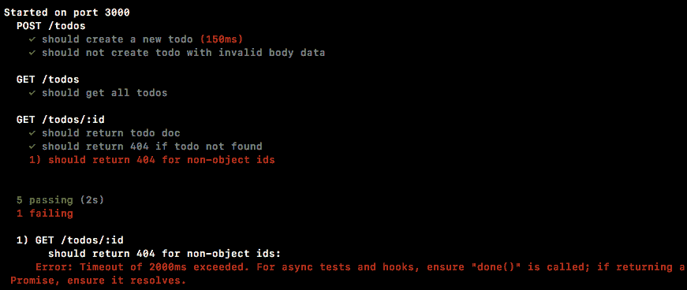

最后要编写的测试是当我们有一个无效的 ObjectID 时会发生什么。

# 测试 3-验证无效的 ObjectID

我将调用`request`，传入`app`，然后我将继续调用`get`，设置 URL。我们不需要在这里使用模板字符串，因为我们只会传入一个普通字符串，`/todos/123abc`。确实是一个无效的 ObjectID。正如我们所讨论的，ObjectIDs 具有非常特定的结构，而这个不符合这个标准。要了解更多关于 ObjectIDs 的信息，你可以随时回到本章开头的 ObjectID 部分。接下来，我们将开始设置我们的断言，通过调用`expect`并期望返回`404`，然后我们可以通过调用`end`方法并传入`done`来结束这个测试：

```js
it('should return 404 for non-object ids', (done) => {
   request(app)
   .get('/todos/123abc')
   .expect(404)
   .end(done);
});
```

有了这个，我们对`GET /todos/:id`的测试套件就完成了。在终端中它刚刚重新运行，所有的测试用例都通过了，这太棒了：

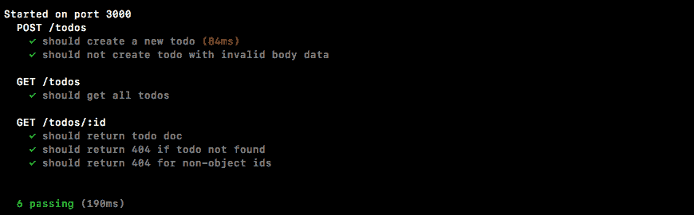

我们现在已经为路由设置了一个完整的测试套件，这意味着我们已经完成了，如果数据返回不正确，例如，如果 body 数据附加了一个额外的字符，比如字符`1`，测试用例将失败。一切都运行得非常非常好。

剩下要做的就是提交我们的更改。在终端中，我将关闭`nodemon`并运行`git status`。这里我们唯一的更改是对`server.test`文件的更改，这是一个修改过的文件—git 已经在跟踪它，这意味着我可以使用`git commit`与`-a`或`-m`标志或组合的`-am`标志，提供一个消息，`Add test cases for GET /todos/:id`：

```js
**git commit -am 'Add test cases for GET /todos/:id'** 
```

我将提交并将其推送到 GitHub。在下一节中，我们将稍微改变一下。我们不会继续添加新的路由，而是稍后再做，我们将使用真实的 MongoDB 数据库将我们的应用程序部署到 Heroku。这意味着我们在 Postman 中进行的所有调用都可以在真实服务器上进行，任何人都可以进行这些调用，而不仅仅是我们本地机器上的人，因为 URL 将不再位于本地主机上。

# 将 API 部署到 Heroku

在本节中，您将把 Todo API 部署到 Heroku，这样任何人都可以访问这些路由，添加和获取 Todo 项目。现在，在我们将其推送到 Heroku 之前，有很多事情需要改变，需要进行一些小的调整，以便为 Heroku 服务器做好准备。其中一个较大的调整是设置一个真实的 MongoDB 数据库，因为目前我们使用的是本地主机数据库，一旦我们将应用程序部署到 Heroku 上，这将不再可用。

首先，我们将进入`server`文件并设置`app`变量以使用 Heroku 将设置的`environment`端口变量，这是我们在上一节部署到 Heroku 时所做的。如果您还记得，我们创建了一个名为`port`的变量，并将其设置为`process.env.PORT`。这是一个可能设置或可能未设置的变量；如果应用程序在 Heroku 上运行，它将被设置，但如果在本地运行，它将不会被设置。我们可以使用我们的`||`（或）语法来设置一个值，如果端口未定义。这将在本地主机上使用，并且我们将坚持使用端口`3000`：

```js
var app = express();
const port = process.env.PORT || 3000;
```

如果`process.env.PORT`变量存在，我们将使用它；如果没有，我们将使用`3000`。现在，我们需要在`app.listen`中用`port`替换`3000`，这意味着我们调用`app.listen`将传入`port`，我们的字符串将被切换为模板字符串，这样我们就可以注入实际的端口。在`app.listen`中，我将使用`Started up at port`，然后我将把实际的端口变量注入到模板字符串中：

```js
app.listen(port, () => {
   console.log(`Started on port ${port}`);
});
```

好了，端口已经设置好了，现在我们可以进入`package.json`文件。有两件事我们需要调整。首先，我们需要告诉 Heroku 如何启动项目。这是通过`start`脚本完成的。`start`脚本是 Heroku 要运行以启动应用程序的命令。在我们的情况下，它将是`node`，然后我们将进入`server`目录并运行`server.js`文件。我在末尾加了一个逗号，`start`脚本就准备好了：

```js
"scripts": {
  "start": "node server/server.js",
  "test":"mocha server/**/*.test.js",
  "test-watch":"nodemon --exec 'npm test'"
}
```

我们需要做的下一件事是告诉 Heroku 我们想要使用哪个版本的 Node。目前默认版本是 Node 的 v5 版本，这将会导致一些问题，因为我们在这个项目中利用了很多 ES6 功能，而这些功能在 Node 的 v6 中是可用的。为了确切地了解您正在使用的 Node 版本，您可以从终端运行`node -v`：


这里我使用的是 9.3.0；如果您使用的是不同的 v6 版本，那是完全可以的。在`package.json`内部，我们将告诉 Heroku 使用我们在这里使用的相同版本。这是通过设置一个`engines`属性来完成的，`engines`让我们指定 Heroku 让我们配置的各种版本。其中之一是`node`。属性名将是`node`，值将是要使用的 Node 版本，`6.2.2`：

```js
"engines": {
  "node": "9.3.0"
},
```

现在我们的`package.json`文件已经准备好用于 Heroku。Heroku 知道如何启动应用程序，它也知道我们想要使用哪个 Node 版本，所以当我们部署时，我们不会遇到任何奇怪的错误。

有了`package.json`，我们需要做的最后一件事就是设置一个数据库，我们将使用 Heroku 的一个插件来完成这个任务。如果您转到 Heroku 的网站并点击任何一个您的应用程序，我们还没有为这个创建一个，所以点击上一节中的一个应用程序。我将继续点击我的一个应用程序。您将看到一个小仪表板，您可以在其中做很多事情：

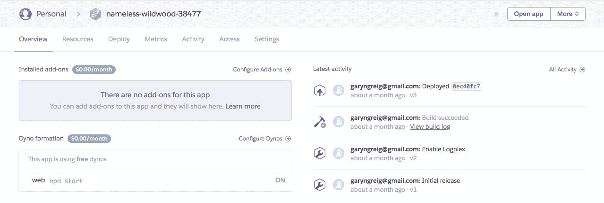

如前面的截图所示，您可以看到有一个已安装的插件部分，但我们真正想要的是配置我们的插件。当您配置您的插件时，您可以添加各种内置到 Heroku 中的非常酷的工具。现在，并不是所有这些都是免费的，但其中大多数都有一个很好的免费计划：


您可以看到我们有各种与数据库相关的项目；在下面，我们有数据存储工具，我们有监控工具，还有很多非常酷的东西。我们将使用一个名为 mLab 的插件：

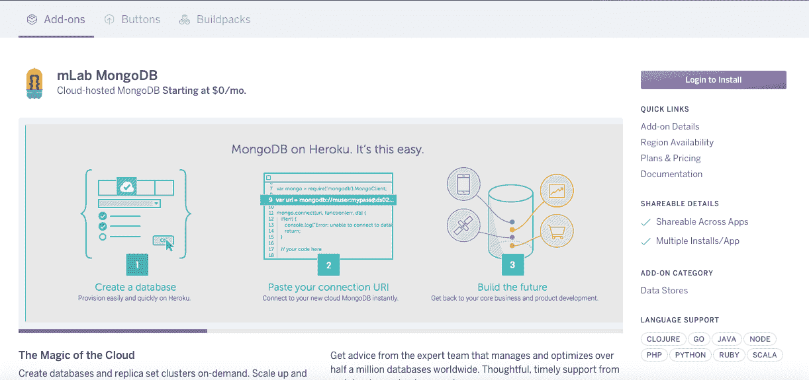

这是一个 MongoDB 数据库服务；它有一个很好的免费计划，它将让我们将 MongoDB 与我们的 Heroku 应用程序集成起来。现在，您实际上不需要从网站上做任何事情，因为我们将从终端上做所有的事情。我只是想让您确切地知道这个位于哪里。在下面，您可以看到他们有一个免费的 Sandbox 计划，他们还有一些计划，最高达每月 5000 美元。我们将坚持零美元计划。

# 创建 Heroku 应用程序

为了进行设置，在终端内部，我们将创建一个新的 Heroku 应用程序，因为目前我们还没有一个。`heroku create`是完成这个任务的命令：

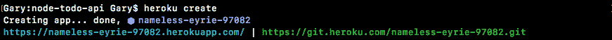

应用程序创建完成后，我们需要告诉应用程序我们想要使用`mLab`，这是 Mongo Lab 的缩写。为了添加这个插件，我们将运行以下命令：

```js
**heroku addons:create**
```

现在，这个插件是`mongolab:`，在`:`之后，我们将指定我们想要使用的计划。我们将使用免费的 Sandbox 计划：

```js
**heroku addons:create mongolab:sandbox** 
```

当我们运行这个命令时，它将配置`mLab`与我们的 Heroku 应用程序，我们就可以开始了。现在，如果您运行`heroku config`命令，您实际上可以获得您的 Heroku 应用程序的所有配置变量的列表：

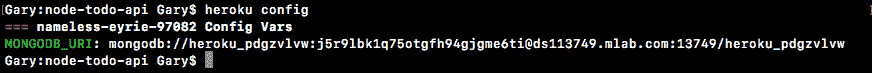

现在，我们只有一个配置变量；它是一个 MONGODB_URI。这是`mLab`给我们的数据库 URL。这是我们需要连接的，也是我们应用程序唯一可用的。现在，这个 MONGODB_URI 变量，实际上是在`process.env`上，当应用程序在 Heroku 上运行时，这意味着我们可以使用类似的技术来处理我们在`mongoose.js`文件中所做的事情。在`mongoose.js`中，在我们的`connect`调用中，我们可以检查`process.env.MONGODB_URI`是否存在。如果存在，我们将使用它；如果不存在，在我们的`||`语句之后，我们将使用本地主机 URL：

```js
mongoose.connect(process.env.MONGODB_URI || 'mongodb://localhost:27017/TodoApp');
```

这将确保我们的 Heroku 应用程序连接到实际的数据库，因为连接到本地主机将失败，导致应用程序崩溃。有了这个设置，我们现在准备好开始了。

在终端内部，我将运行`git status`来检查我们的更改文件：

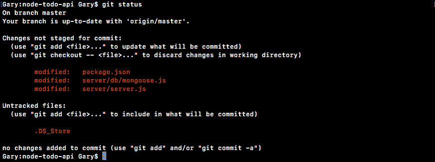

我们有三个；一切看起来都很好。我可以运行`git commit`，带上`-am`标志。这将让我们指定我们的提交消息，`为 heroku 设置应用程序`：

```js
**git commit -am 'Setup app for heroku'**
```

我将提交并将其推送到 GitHub。现在，我们需要将我们的应用程序推送到 Heroku。我将使用以下命令来做到这一点：

```js
**git push heroku master** 
```

记住，当你创建一个 Heroku 应用程序时，它会自动添加 Heroku 远程，并且我们将其发布到主分支。主分支是唯一一个 Heroku 实际上会处理的分支。应用程序正在被推送上去；它应该在几秒钟内准备好。一旦完成，我们可以在浏览器中打开 URL，看看我们得到了什么。

# Heroku 日志

我想简要谈一下另一个命令，叫做`heroku logs`。`heroku logs`命令会显示应用程序的服务器日志。如果出现任何问题，通常会在终端内收到错误消息：

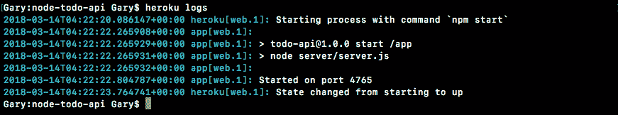

现在，正如你所看到的，我们在底部打印了端口 4765 上启动的消息，这很好；你的端口会有所不同。只要你有这个消息，一切都应该正常。我将运行`heroku open`。

这将在我的浏览器中打开应用程序。我将选择复制 URL。然后我会进入 Chrome，并访问它：

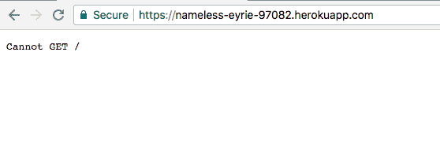

现在，访问应用程序的根应该什么也不会发生，因为我们还没有设置根 URL，但如果我们转到`/todos`，我们应该会得到我们的`todos JSON`返回：

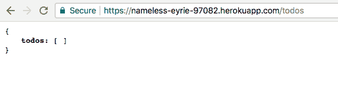

在这里，你可以看到我们有一个空数组，这是预期的，因为我们还没有添加任何 Todo 项目，所以让我们继续做。

我想做的是获取 URL 并转到 Postman。在 Postman 中，我们将进行一些调用。我将创建一个`POST /todos`请求；我只需要取出 URL 并将其替换为我刚刚复制的 URL，然后我可以发送该请求，因为请求体数据已经配置好了。我将发送请求。我们得到了我们的 Todo 项目，这不是来自我们的本地机器，而是来自我们的 Heroku 应用，它正在与我们的 Mongo Lab MongoDB 数据库交互：

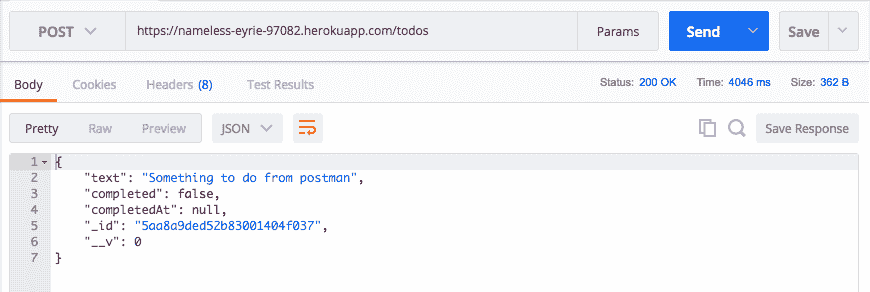

现在，所有其他命令也应该有效。我将转到`GET /todos`，粘贴 URL，然后我们应该能够获取所有的 Todo 项目：

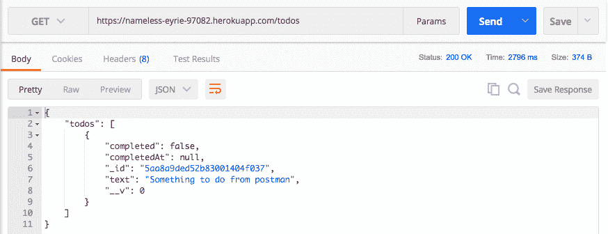

我还要检查当我们尝试获取单个 Todo 时会发生什么。我会复制`_id`，将其添加到 URL 上，并发送该请求：

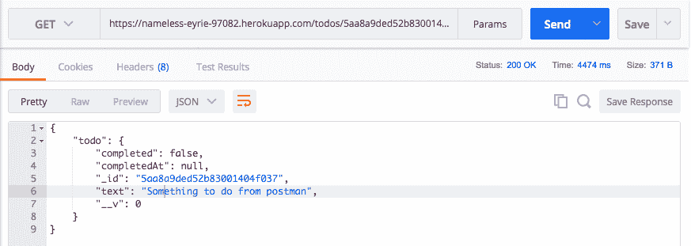

我得到了单个 Todo 项目。所以，无论我们使用哪个调用，一切都按预期工作，这太棒了。我们的应用程序现在在 Heroku 上运行，使用真实的生产数据库，就是这样。现在我们对 Heroku 有了一定了解，在下一节中，我将向你展示一些我们可以在 Postman 中使用的调整和技巧，以便更轻松地在我们的本地环境和 Heroku 环境之间切换。

# Postman 环境

在我们回到创建 express 路由之前，我们将花一点时间来探索 Postman 的一个功能，这将使在本地环境和 Heroku 应用之间切换变得更容易。这就是所谓的 Postman 环境。

# 管理 Postman 环境

现在，为了说明这一点，我将通过运行`node server/server.js`命令启动我的本地服务器，在 Postman 中我们将开始发出一些请求。现在，如果你记得，在上一节中，我们向我们的 Heroku 应用程序发出了请求。我点击`GET /todos` URL 上的发送，我得到了预期的`todos`数组。问题是，实际保存在集合选项卡中的项目，它们都使用了本地主机 URL，没有很好的方法在两者之间切换。为了解决这个问题，我们将创建环境，一个用于我们的本地机器，一个用于 Heroku。这将让我们创建一个变量作为 URL，并且我们可以通过在无环境下拉菜单中切换来更改该变量。为了准确说明这将如何工作，我现在将复制 Heroku URL，然后我将转到无环境下拉菜单，并点击管理环境：

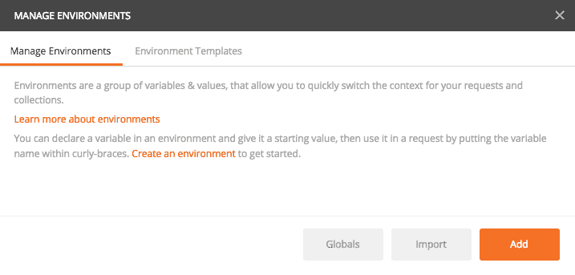

在这里，我们目前没有，但我们可以继续添加两个。

# Todo App 本地环境

对于第一个环境，我将称之为`Todo App Local`。这将是本地 Todo 应用程序，我们可以设置一组键值对。现在，我们要设置的唯一键是 url。我们将为 Todo App Local 环境设置本地主机 URL，并为 Todo App Heroku 环境设置 Heroku URL，我们将在接下来创建。我们将输入`url`为`localhost:3000`：

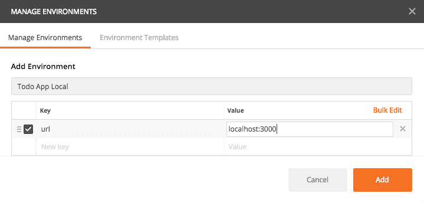

我们不包括路径，因为这将取决于个别路线。我将继续添加该环境。

# Todo App Heroku 环境

我们可以创建第二个；这个将被称为`Todo App Heroku`，我们将再次设置`url`键。不过这一次，我们将其设置为我复制到剪贴板的值，即 Heroku 应用程序 URL：

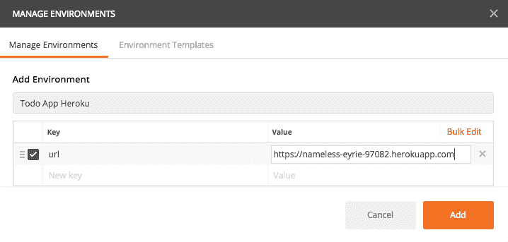

我将添加，现在我们有了两个环境，我可以关闭那个窗口管理器。

我将关闭所有标签，不保存任何更改，然后我将转到`GET /todos`。现在，当前，`GET /todos`自动从`localhost`获取。我们要做的是用以下语法替换 URL，斜杠之前的所有内容，这将看起来类似于任何模板引擎：两个大括号，后面跟着变量名`url`，然后是两个闭合括号，`{{url}}`。这将注入 URL，这意味着`GET /todos`请求现在是动态的。我们可以根据环境更改它从哪个端点请求，localhost 或 Heroku。我将保存此请求并发送它，你会注意到当你尝试发送此请求时，我们会收到一个错误：

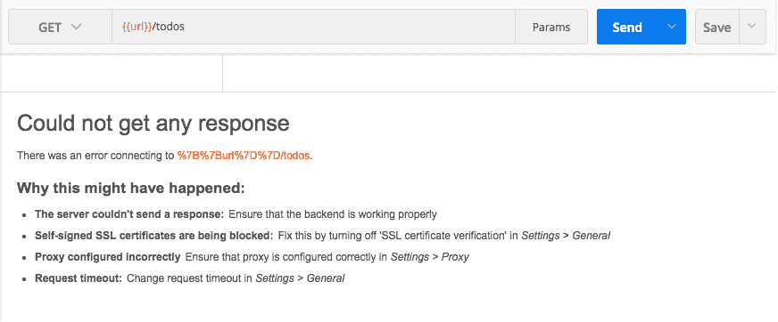

它试图向以大括号开头的 URL 发出请求；这是编码字符，`url`，闭合大括号和 todos。这是因为`url`变量目前未定义。我们需要切换到一个环境。在环境列表中，我们现在有 Todo App Heroku 和 Todo App Local。如果我点击 Todo App Local 并发送该请求，我会在本地数据库中得到两个项目：

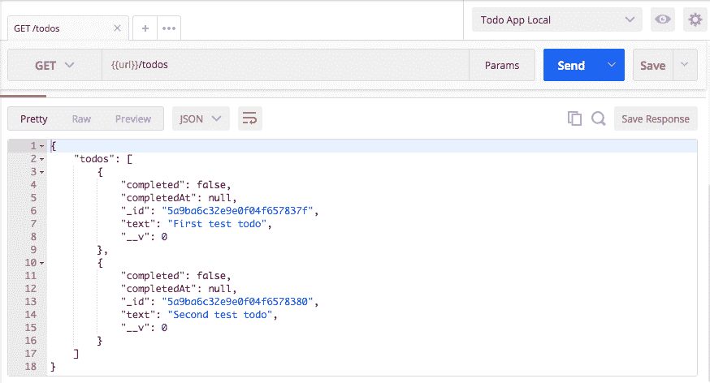

如果我切换到 Todo App Heroku，这将向 Heroku 应用程序发出请求。它将更新 URL，当我们发出请求时，我们会得到不同的数据：

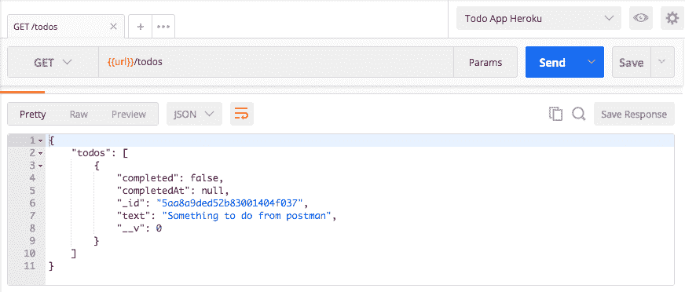

这一次，我们只有一个 Todo 项目，即 Heroku 应用程序上可用的项目。有了这个，`GET /todos`现在可以轻松地用来获取本地主机或 Heroku 项目，我们也可以用我们的`POST /todos`请求做同样的事情。我将用花括号替换 URL，并在这些花括号中放入`url`变量。现在我可以保存这个请求，发送它，它将在 Heroku 应用程序上创建一个新的 Todo：

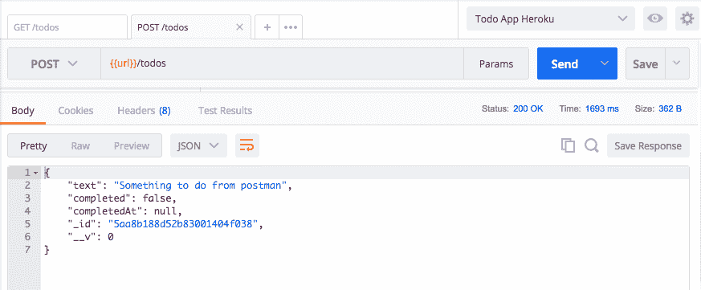

如果我切换到 Todo App Local，我们可以发送它，现在我们在本地环境中有一个新的 Todo：

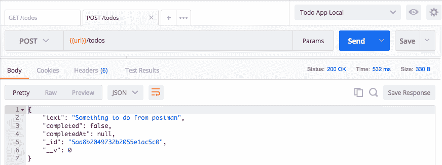

最后要更改的请求是`GET /todos/:id`请求。我们将再次使用`localhost:3000`，然后我们将用`url`替换它，就像这样，`{{url}}`，现在我们完成了。我们可以保存这个请求，然后发送它。现在，这个有第二个变量：


这是实际的 Todo ID；您也可以将其添加为变量。不过，由于随着我们添加和删除 Todos，它将发生变化，所以我将简单地从本地数据库中获取一个，移动到`GET /todos`请求中，替换它，然后发送它，我们就可以得到我们的 todo：

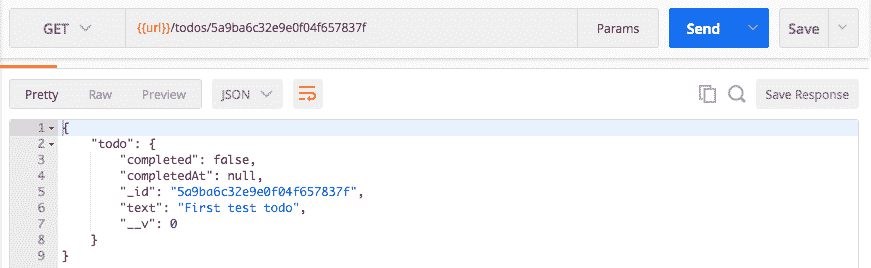

如果我将它设置为一个不存在的 Todo ObjectID，通过将其中一个数字改为`6`，我会得到一个`404`状态码。一切仍然按预期工作，它也将在 Heroku 环境中工作。我将从 Heroku 环境中获取所有的 todos，获取一个`_id`，移动到`GET /todos/:id`请求，替换 ID，发送它，我们就可以得到 todo 项目。

希望您开始看到为什么这些 Postman 环境是如此方便。您可以轻松地在两个环境之间切换，精确地改变请求的发生情况。现在，在这种情况下，我们碰巧只有一个变量`url`；您可以添加其他变量，稍后我们会添加。不过，现在就是这样，我们有一种在 Postman 中在两个环境之间切换的方法。既然我们已经做到了这一点，我们将回到 Atom 编辑器，开始添加新的路由。还有两个要做。在下一节中，您将学习如何通过 ID 删除 Todos。

# 删除资源 - DELETE /todos/:id

在这一部分，我们将探讨如何使用 Mongoose 从我们的 MongoDB 集合中删除文档。然后您将负责填写`delete`路由，该路由将允许某人通过 ID 删除一个 Todo。

要开始，我们将复制`mongoose-queries`文件，将新文件命名为`mongoose-remove`。在文件中，我们可以删除初始导入以下的所有内容。我将突出显示文件中的所有内容，包括未注释的代码，然后删除它，我们最终得到一个看起来像这样的文件：

```js
const {ObjectID} = require('mongodb');

const {mongoose} = require('./../server/db/mongoose');
const {Todo} = require('./../server/models/todo');
const {User} = require('./../server/models/user');
```

Mongoose 为我们提供了三种删除记录的方法；第一种方法允许您删除多个记录。

# Todo.remove 方法

这个是`Todo.remove`，`Todo.remove`的工作方式类似于`Todo.find`。您传入一个查询，该查询匹配多个记录，然后删除所有匹配的记录。如果没有匹配，就不会删除任何记录。现在，`Todo.find`和`Todo.remove`之间的区别，除了删除文档之外，还有一个区别，就是您不能传入一个空参数，然后期望所有文档都被删除。如果您想要从集合中删除所有内容，您需要像这样运行它`Todo.remove({})`。如果我们运行这个，我们将删除所有内容。我将添加`then`。我们将得到我们的结果，我们可以使用`console.log(result)`将结果打印到屏幕上，就像这样：

```js
Todo.remove({}).then((result) => { 
   console.log(result); 
});
```

现在我们可以运行`mongoose-remove`文件，它将从我们的数据库中删除所有的 Todos：

```js
**node playground/mongoose-remove.js**
```

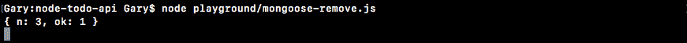

现在当我们运行`remove`方法时，我们再次得到一个`result`对象；其中很多内容对我们来说并不有用，但在顶部有一个`result`属性。我们可以看到删除确实起作用了，我们得到了`1`而不是`0`，并且我们知道删除了多少条记录。在这种情况下，记录的数量恰好是`3`。

# Todo.findOneAndRemove 方法

还有两种其他删除文档的方法，这些方法对我们在本节中将会更有用。第一种将是`Todo.findOneAndRemove`。现在，`findOneAndRemove`的工作方式类似于`findOne`：它将匹配第一个文档，只是它将删除它。这也将返回文档，因此您可以对已删除的数据进行操作。数据将从数据库中删除，但您将获得对象，因此可以将其打印到屏幕上或将其发送回给用户。这与`remove`方法不同。在`remove`方法中，我们不会得到已删除的文档，我们只会得到一个数字，表示删除了多少个。使用`findOneAndRemove`我们会得到这些信息。

# Todo.findByIdAndRemove 方法

另一种方法是`Todo.findByIdAndRemove`。`findByIdAndRemove`方法的工作方式与`findById`类似：您将 ID 作为参数传递，然后将其删除。现在，这两种方法都将返回文档，这正是我们想要的。没有必要同时运行它们，我们只需要运行一个。`Todo.findByIdAndRemove`方法，这将让我们删除一个`Todo ById`，一些 ID 像`asdf`，我们将能够附加一个`then`方法提供我们的回调，回调将获得文档。您可以称其为文档，或者在这种情况下，我们可以称其为`todo`，因为它是一个 Todo 项目：

```js
Todo.findByIdAndRemove('asdf').then((todo) => {

});
```

现在我们已经有了这个，我们只需要创建一个 Todo，因为我们删除了所有的 Todo，并包括 ID。在 Robomongo 中，我可以右键单击`todos`集合并插入一个文档。我们将设置一个`text`属性，我将把`text`属性设置为`Something to do`，然后我们可以保存该记录。我将确保当我点击查看文档时，我们会得到我们的一个文档。

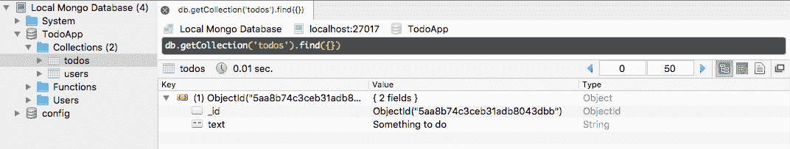

现在显然它缺少一些属性，因为我是在 Robomongo 中创建的，但对我们的目的来说这没关系。我现在要编辑该文档并获取 ID，这是我们可以添加到我们的 playground 文件中以确保文档被删除。在 Atom 中，`findByIdAndRemove`方法中，我们将传入我们的字符串。这是字符串 ID，在我们的`then`回调中，我们将使用`console.log`将 todo 打印到控制台。我将注释掉之前的删除调用，否则它会删除我们要删除的文档：

```js
//Todo.remove({}).then((result) => {
// console.log(result);
//});
Todo.findByIdAndRemove('5aa8b74c3ceb31adb8043dbb').then((todo) => {
   console.log(todo);
});
```

有了这个，我现在可以保存文件，进入终端，并重新运行脚本。我将关闭它然后再次启动：

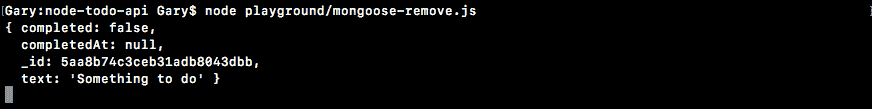

我们得到了我们的文档，这太棒了，如果我进入 Robomongo 并尝试获取 todos 中的文档，我们将收到一个错误，即没有文档；我们曾经有一个，但我们已经删除了它。现在，在 Atom 中，我们还可以玩`findOneAndRemove`。`findOneAndRemove`方法与`findByIdAndRemove`完全相同，只是它接受查询对象。这将是`Todo.findOneAndRemove`；我们将传入查询对象，然后附加我们的`then`回调，该回调将使用文档调用：

```js
Todo.findOneAndRemove({_id: '57c4670dbb35fcbf6fda1154'}).then((todo) => {

});
```

这两者工作方式非常相似，但最大的区别是是否需要查询除了 ID 之外的更多内容。现在你知道如何使用`findByIdAndRemove`，我们将进入`server`文件并开始填写实际的路由。这将是让我们删除 Todo 的路由。我会为你设置路由，但你需要负责填写回调函数内的所有内容。

# 创建一个删除路由

创建一个删除路由，我们将使用`app.delete`。然后我们将提供 URL，它看起来与我们用于通过 Id 获取单个 Todo 的 URL 相同，`/todos/:id`。这将是我们可以在回调函数内访问的 ID。回调函数将获得相同的请求和响应参数，并且我会在内部留下一些注释来指导你朝正确的方向前进，但你需要负责填写每一件事情。首先，获取 id。你将像我们在上面做的那样获取 ID，并且我们这样做是因为接下来你要做的事情是验证 id。如果它无效，返回`404`。如果它无效，你将像我们在上面做的那样发送 404。接下来，你将通过 id 删除 todo，这将需要你使用我们刚刚在`mongoose-remove`文件中讨论过的函数。你将通过 ID 删除它，有两种可能。我们可能会成功，也可能会出现错误。如果出现错误，你可以以通常的方式回应，发送一个带有空主体的`400`状态码。现在，如果成功了，我们需要确保通过检查返回的 doc 来确保 Todo 实际上已被删除；如果没有 doc，则发送`404`，以便对方知道找不到 ID 并且无法删除，如果有`doc`，则发送带有`200`的`doc`。现在，我们需要检查 doc 是否存在的原因是因为即使没有删除任何 Todo，`findByIdAndRemove`函数仍然会调用其成功情况。

我可以通过删除具有该 ID 的项目后重新运行文件来证明这一点。我将注释掉`findOneAndRemove`，进入终端，然后重新运行脚本：


我们得到的 Todo 的值为 null。这意味着如果实际上没有删除任何项目，你希望设置一个`if`语句来执行特定的操作。有了这个设置，你就准备好了。你知道如何做所有这些，大部分是在上面的路由中完成的，而删除项目的所有特定内容都是在`playground`文件中完成的。

我们需要做的第一件事是从请求对象中获取 ID。我将创建一个名为`id`的变量，将其设置为`req.params`；这是我们存储所有 URL 参数的地方，然后我们按值获取它。我们已经设置了 id，所以我们将获取`id`属性。我将删除注释，然后在下面我们可以验证 ID，`if(ObjectID.isValid)`。现在，我们正在检查这个 ID 是否有效，如果有效，我们实际上不想做任何事情，我们只关心它是否无效。所以，我将翻转布尔值，并且在`if`条件内，我们现在可以运行一些代码，当 ID 无效时。这段代码将发送回一个`404`状态码。我将使用`return`来防止函数的其余部分被执行，然后我们将继续响应，设置状态，`res.status`等于`404`，然后调用`send`来启动没有主体数据的响应。现在 ObjectID 有效了，我们可以继续下面实际删除它。

我们将通过调用`Todo.findByIdAndRemove`来开始。现在，`findByIdAndRemove`只需要一个参数，即要删除的实际`id`，我们可以调用`then`，传入我们的成功回调，正如我们所知，将使用单个`todo`文档调用。现在，在成功的情况下，我们仍然必须确保待办事项实际上已被删除。如果没有待办事项，我们将发送一个 404；如果没有待办事项，我们将使用`return`并使用`res.status`设置状态为`404`，并调用`send`来启动响应。现在，如果这个 if 语句不运行，这意味着待办事项实际上已被删除。在这种情况下，我们希望用`200`回应，让用户知道一切都进行得很顺利，我们将把`todo`参数返回，`res.send`，传入`todo`。这个待办事项挑战的唯一剩下的事情就是调用`catch`。我们将调用 catch，以便处理任何潜在的错误。我们要做的就是使用`res.status`进行响应，将其设置为`400`，然后调用`send`，不带参数发送一个空响应：

```js
app.delete('/todos/:id', (req, res) => {
   var id = req.params.id;

   if(!ObjectID.isValid(id)) {
         return res.status(404).send();
   }

   Todo.findByIdAndRemove(id).then((todo) => {
         if(!todo) {
               return res.status(404).send();
         }
         res.send(todo);
   }).catch((e) => {
         res.status(400).send();
   });
});
```

有了这个，我们现在可以开始了。我们已经按照我们想要的方式设置了一切，这意味着我们可以从下面删除注释，你会注意到我们下面的方法看起来与上面的方法非常相似，对于我们管理单个待办事项的许多路由来说，情况都是如此。我们总是想要获取那个 ID，我们总是想要验证 ObjectID 确实是一个真正的 ObjectID，在我们的成功和错误情况中，也会发生类似的事情。我们要确保文档实际上已被删除。如果没有，我们将发送`404`，有了这个，我们现在可以验证这个路由是否有效。

现在我们可以保存文件并在终端中启动服务器。我将使用`clear`命令清除终端输出，然后我们可以运行以下命令：

```js
**node server/server.js** 
```

一旦服务器启动，我们就可以进入 Postman 并开始发送一些请求。首先，我要创建一些待办事项。我将发送`POST /todos`，然后我会更改`text`属性并再次发送。我将把正文文本更改为`Some other todo item`，发送后，现在我们应该有两个待办事项。如果我去`GET /todos`并获取它们，我们会得到我们的两个`todos`：

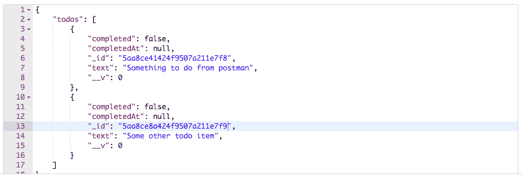

现在，我需要其中一个 ID；这将是我们要删除的待办事项，所以我要做的是将其复制到剪贴板，然后我们可以继续创建我们的新路由。这个新路由将使用`delete`方法，所以我们将从 GET 切换到 DELETE，然后我们可以提供 URL，使用我们在上一节中创建的环境变量 URL。路由是`/todos/id`。我将把 ID 粘贴进去：

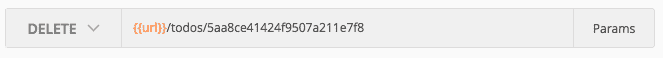

现在我可以继续运行请求。当我们运行它时，我们得到了一个状态码 200 OK；一切都进行得很顺利，我们有了我们删除的文档：

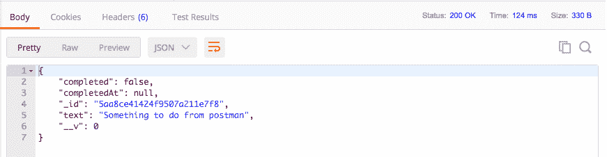

如果我回到`GET /todos`并重新运行它，现在我们只有一个文档；我们传递给删除的项目确实已被删除。我将保存这个请求到我们的集合中，这样我们就可以不必手动输入所有这些信息就可以发送它。让我们保存为`DELETE`，后面跟着路由`/todos/:id`：

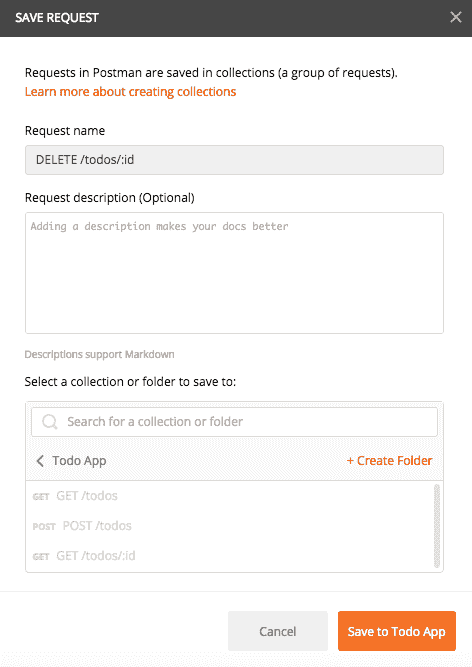

我们将保存到一个现有的集合，Todo App 集合。现在我们有一个`DELETE /todos/:id`路由坐在集合中，我们随时可以访问它。现在，从这里，我们将继续发送请求，这将尝试删除一个 ID 有效但与集合中的 ID 不匹配的 Todo，我们得到`404`。现在，如果我通过删除一堆字符使此 ID 无效，并发送它，我们也会得到`404`状态码，因为 ID 无效，这太棒了。

有了这个，我们现在可以进行提交。在终端内，我将关闭服务器，运行`git status`，您将看到我们有两个文件。

我们有一个新文件，Mongoose playground 文件，以及我们修改过的`server`文件。我将使用`git add .`将所有这些添加到下一个提交中，并使用`git commit`与`-m`标志进行提交，`Add DELETE/todos/:id route`：

```js
**git commit -m 'Add DELETE /todos/:id route'** 
```

我将提交并将其推送到 GitHub。我们还可以使用以下命令部署我们的应用程序：

```js
**git push heroku master** 
```

现在我们将能够在 Heroku 应用程序中删除我们的 Todos。有了这个，我们现在完成了。在下一节中，我们将为我们刚刚设置的路由编写一些测试用例。

# 测试 DELETE /todos/:id

在本节中，您将编写一些测试用例，以验证我们的`delete`路由是否按预期工作。现在，在我们开始之前，我们要做的是对删除路由进行一些快速更改，以使其与我们的其他路由匹配。我们的其他路由返回一个对象，在该对象上，响应主体上有一个`todo`属性，我们对`todos`调用也是如此。在响应主体上，我们有`todos`属性，它存储数组。对于删除请求，我们从未这样做过。

我要做的是将一个对象作为响应主体发送回来，其中`todo`属性等于已删除的`todo`，尽管我们将使用 ES6 语法将其发送回来：

```js
Todo.findByIdAndRemove(id).then((todo) => {
   if(!todo) {
         return res.status(404).send();
   }
   res.send({todo});
}).catch((e) => {
   res.status(400).send();
});
```

有了这个，我们现在可以继续编写一些测试用例，以验证`delete`路由是否按预期工作，这将发生在我们的`server.test`文件的最底部。我将为`DELETE /todos/:id`路由创建一个新的`describe`块。我们将提供箭头函数，并可以继续调用它三次。

# 测试用例 1 - 应删除一个 todo

第一个测试用例，`it('应删除一个 todo')`，这将是第一个测试用例；它将验证当我们传入一个在 Todos 集合中存在的 ID 时，该项目将被删除：

```js
describe('DELETE /todos/:id', () => {
   it('should remove a todo', (done) => {

   });
});
```

# 测试用例 2 - 如果未找到 todo，则应返回 404

接下来，`it('如果未找到 todo，则应返回 404')`。如果我们尝试删除 Todo，但实际上没有删除任何东西，我们将发送`404`状态码，以便用户知道调用可能不像预期那样工作。是的，调用并没有真正失败，但您从未删除您想要删除的项目，因此我们将认为这是一个失败，这就是我们在发送`404`状态码时所做的：

```js
describe('DELETE /todos/:id', () => {
   it('should remove a todo', (done) => {

   }); 
   it('should return 404 if todo not found', (done) => {

   });
});
```

# 测试用例 3 - 如果对象 id 无效，则应返回 404

我们要写的最后一个测试是`it('如果对象 id 无效，则应返回 404')`。这个测试将验证当我们有一个无效的 ObjectID 时，我们确实会得到一个`404`状态码，这是预期的响应状态码：

```js
describe('DELETE /todos/:id', () => {
   it('should remove a todo', (done) => {

   }); 
   it('should return 404 if todo not found', (done) => {

   });
   it('should return 404 if object id is invalid', (done) => {

   });
});
```

现在，这两个测试我们稍后会填写一些内容；我们将继续专注于第一个，因为这是我们需要做一些复杂事情的地方。我们不仅需要发送请求，而且在请求返回后，我们还希望断言一些关于它的事情，并且我们还希望查询数据库，确保待办事项实际上已从`Todos`集合中删除。我要做的第一件事是弄清楚我想要删除哪个待办事项。我们在上面有两个选项。我将继续删除第二个待办事项，尽管这个选择是无关紧要的；你也可以轻松地用第一个来做这个。在下面，我们将创建一个`hexId`变量，就像我们为前一个测试用例所做的那样。我们将把它设置为`todos`数组中的第二个项目，然后我们将继续并获取它的`_id`属性，调用`toHexString`方法：

```js
var hexId = todos[1]._id.toHexString();
```

现在我们已经有了第二个待办事项的`hexId`，我们可以开始担心如何发出请求。我将调用`request`，传入我们要发出请求的`app`，然后我们可以调用`delete`，这将触发一个删除 HTTP 请求。以下 URL 将注入一些变量，所以我将使用模板字符串：它是`/todos/`后跟 ID。我将注入`hexId`变量。现在我们已经设置好了我们的`delete`方法，我们可以继续并开始制定我们的期望。我们期望得到一个`200`状态码；我们应该得到一个`200`状态码，因为`hexId`将存在于数据库中。接下来，我们可以断言数据作为响应体返回。我将进行自定义的`expect`调用，传入我们的函数，在这里我们有响应参数发送进来，我们要做的就是断言 ID 就是`hexId`变量中的 ID。我们期望`res.body`属性有一个`todo`属性，其中`_id`属性等于`hexId`，`toBe(hexId)`。如果是这种情况，那么我们可以验证调用基本上按预期工作了：

```js
request(app)
.delete(`/todos/${hexId}`)
.expect(200)
.expect((res) => {
   expect(res.body.todo._id).toBe(hexId);
})
```

我们需要做的最后一件事是查询数据库，确保该项目实际上已被删除。我将调用`end`，传入一个回调，这样我们可以在结束测试用例之前做一些异步的事情，如果你记得的话，它会被调用并传入一个错误和响应。如果有错误，我们需要处理它，否则就没有必要查询数据库，`if (err)`。我们将`return`以防止函数执行，`done`，传入该错误，以便 Mocha 渲染错误。现在我们可以继续并进行查询，这实际上将是本节的挑战。

我希望你使用`findById`查询数据库。你将尝试查找具有存储在`hexId`变量中的 ID 的 Todo 项目。当你尝试查找该 ID 时，它应该失败，并且你应该得到空值。你将在`then`调用中创建`Todo`变量，并确保它不存在。你可以使用`toNotExist`断言来确保某些内容不存在。这将看起来像这样，我们`expect(null).toNotExist()`。尽管，你将传入`Todo`参数，它将在你的成功处理程序中。现在，这通常会包含 Todo 项目，但由于我们刚刚删除它，它不应该存在；这将完成所有这些。现在，如果有错误，你将执行与我们为`POST /todos`测试用例中所做的完全相同的操作。我们只需添加一个`catch`子句，将错误传递给`done`。现在你知道该怎么做了，你的工作就是完成它。我希望你填写这个，填写查询，确保处理错误，确保调用`done`，然后你可以继续运行测试套件，验证这个测试用例是否通过。最后两个测试用例将失败，所以目前我只是将它们注释掉；它们将失败，因为我们指定了一个`done`参数，但我们从未调用它，所以测试将在两秒后超时。

首先要做的是调用`Todo.findById`，传入`hexId`。这是应该已经被删除的项目。现在我们可以调用`then`，传入我们的回调，它将使用文档、`todo`变量调用，我们要做的就是验证它不存在。我们刚刚删除了它，所以`findById`应该返回文档的空值。我们将使用`toNotExist`方法来`expect` `todo`变量不存在，该方法可用于`expect`库。现在，我们需要调用`done`来完成测试用例。从这里开始，我们可以继续调用`catch`。我将调用`catch`，获取错误参数并将其传递给`done`。这里不需要提供花括号；我们只有一个语句，所以我们可以使用 ES6 中可用的错误函数的快捷方式。有了我们实际的查询，我们可以删除概述应该发生的内容的注释，并运行测试用例：

```js
.end((err, res) => {
   if(err){
         return done(err);
   }

   Todo.findById(hexId).then((todo) => {
         expect(todo).toBeFalsy();
         done();
   }).catch((e) => done(e));
});
```

在终端内，我们现在可以运行测试套件，以验证我们设置的一切是否按预期工作。在终端内，我将运行以下命令启动我们的测试套件与 Nodemon：

```js
**npm run test-watch**  
```

当它运行时，我们看到我们在`DELETE`描述块下有一个测试，并且它通过了；它应该在没有任何错误的情况下删除一个传递的 todo：

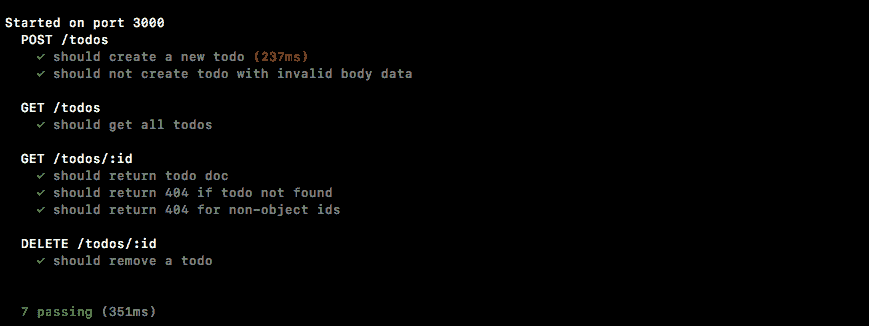

现在我们已经有了一个测试用例，我们可以填写另外两个。这些测试用例基本上与我们为`GET /todos/:id`路线编写的测试用例相同。当你：

+   确切地知道代码的作用；我们知道它的作用，因为我们编写了它

+   实际上确实需要它-我们无法重用它，我们需要稍微调整它，因此复制它是有道理的。

# 测试用例 4 - 如果未找到 todo，则应返回 404

我将复制`应返回 404`测试用例，用于`如果未找到 todo，则应返回 404`测试，然后我们将粘贴到`delete`路线的完全相同的测试中，我们只需要将`.get`更改为`.delete`，然后保存文件。这将重新运行测试套件，现在我们在删除下有两个测试；它们都通过了：

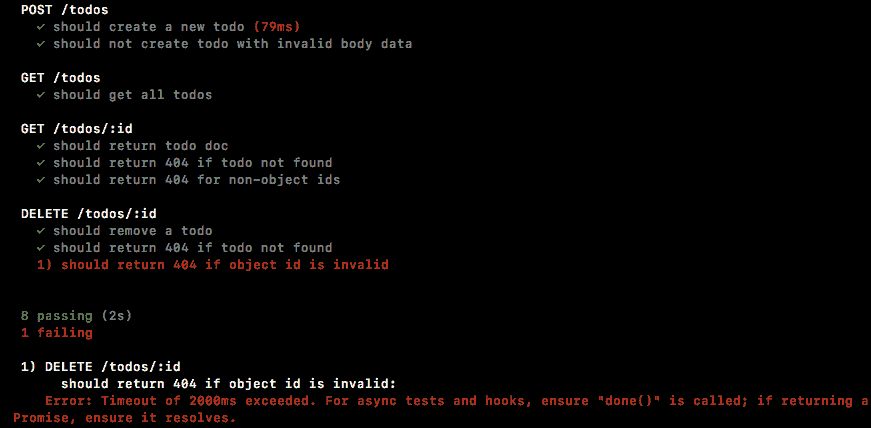

您可以看到我们上一个测试仍然失败，所以我们可以继续做同样的事情。我将从`should return 404 for non-object ids`中复制代码，该代码验证非 ObjectID 会导致`404`状态码。我将把它粘贴到最后一个测试用例中，将`.get`方法调用更改为`.delete`。如果我保存文件，它将重新运行测试套件，这一次所有 9 个测试用例都通过了：

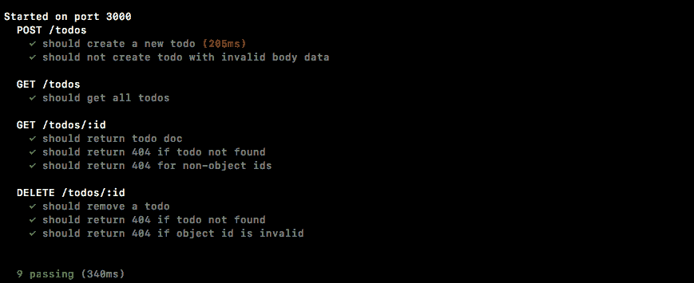

有了这个，我们现在已经测试了`DELETE /todos`。让我们通过在终端内进行提交来结束这一切。

我要运行`git status`来查看我所做的更改。我们对`server`文件进行了一些小改动，并将我们的测试添加到`server.test`文件中。我可以使用`git commit`和`-am`标志进行提交，对于这个提交，一个好的消息将是`测试 DELETE /todos/:id 路由`：

```js
**git commit -am 'Test the DELETE /todos/:id route'** 
```

我将提交并推送到 GitHub，因为我们还没有创建任何视觉上的不同，所以没有必要部署到 Heroku。我们只是稍微调整了`server`代码，但这是稍后的事情。现在，一切都很好；我们可以继续下一节，您将在其中创建管理 Todos 的最终路由。这将是一个允许您更新 Todo 的路由。

# 更新资源 - PATCH /todos/:id

`delete`路由现在已经设置并测试完成，所以现在是时候开始管理我们的 Todo 资源的最终路由了。这将是一个路由，让您更新一个 Todo 项目，无论您是想将文本更改为其他内容，还是想将其标记为已完成。现在，这将是我们编写的最复杂的路由；到目前为止，一切都相对简单。我们需要做一些额外的工作才能使这个更新路由按预期工作。

在我们继续创建下面的路由之前，我想要做的第一件事就是安装我们在本课程的前几节中使用过的 Lodash 库。

# 安装 Lodash 库

如果您记得，Lodash 提供了一些非常好的实用函数，我们将利用其中一些函数来完成我们的更新路由。在终端中，我将使用`npm i`和`--save`标志来安装它；模块名称本身叫做`lodash`，我们将使用最新版本`@4.15.0`：

```js
**npm i --save lodash@4.17.5** 
```

现在，一旦这个安装完成，我们可以在顶部`require`它，然后我们可以继续添加我们的路由。在`server.js`文件的顶部，我们可以创建一个常量；我们将使用下划线作为存储 Lodash 库的变量的名称，然后我们将继续`require`它，`require('lodash')`。现在，我已经使用常量而不是常规变量来进行其他导入，所以我也可以将这些变量切换为常量：

```js
const _ = require('lodash');

const express = require('express');
const bodyParser = require('body-parser');
const {ObjectID} = require('mongodb');
```

现在我们已经准备就绪，可以转到文件底部并开始添加新的路由。这个路由将使用 HTTP 的`patch`方法；`patch`是在想要更新资源时使用的方法。现在记住，这一切都不是铁板钉钉的。我可以有一个`delete`路由来创建新的 Todos，我也可以有一个`post`路由来删除 todos，但这只是 API 开发的一般准则和最佳实践。我们将通过调用`app.patch`来设置一个`patch`方法路由。这将允许我们更新 Todo 项目。现在，URL 将与我们管理单个 Todo 项目时的 URL 完全相同，`/todos/:id`。然后我们可以设置我们的回调函数，带有我们的请求和响应参数。在回调函数中，我们首先需要做的事情之一是像我们为所有其他路由做的那样获取那个 id。我将创建一个名为`id`的变量，并将其设置为`req.params.id`。现在，在下一行，我们将创建一个名为`body`的变量，这就是我加载 Lodash 的原因。请求体，更新将存储在这里。如果我想将 Todos 的文本设置为其他内容，我将发出一个`patch`请求。我将把`text`属性设置为我想要的 Todo 文本。问题在于，有人可以发送任何属性；他们可以发送不在 Todo 项目上的属性，或者他们可以发送我们不希望他们更新的属性，例如`completedAt`。`completedAt`属性将被更新，但不会被用户更新，当用户更新完成的属性时，它将由我们更新。`completedAt`将由程序生成，这意味着我们不希望用户能够更新它。

为了只获取我们希望用户更新的属性，我们将使用`pick`方法，`_.pick`。`pick`方法非常棒；它接受一个对象，我们将传入`req.body`，然后它接受一个你想要提取的属性数组，如果它们存在的话。例如，如果`text`属性存在，我们希望从`req.body`中提取出来，添加到 body 中。这是用户应该能够更新的内容，我们将对 completed 做同样的处理。这是用户唯一能够更新的两个属性；我们不需要用户更新 ID 或添加任何在 Mongoose 模型中未指定的其他属性。

```js
app.patch('/todos/:id',(req, res) => {
   var id = req.params.id;
   var body = _.pick(req.body, ['text', 'completed']);
});
```

现在我们已经准备就绪，可以开始按照通常的路径进行，首先通过验证我们的 ID 来启动。没有必要重写代码，因为我们以前已经写过了，我们知道它的作用；我们可以简单地从`app.delete`块中复制并粘贴到`app.patch`中。

```js
if(!ObjectID.isValid(id)){
   return res.status(404).send();
}
```

现在我们可以继续进行`patch`的稍微复杂的部分，这将检查`completed`值并使用该值来设置`completedAt`。如果用户将 Todos 的`completed`属性设置为`true`，我们希望将`completedAt`设置为时间戳。如果他们将其设置为`false`，我们希望清除该时间戳，因为 Todo 将不会被完成。我们将添加一个`if`语句来检查`completed`属性是否为布尔值，并且它在`body`中。我们将使用`_.isBoolean`实用方法来完成这个任务。我们要检查`body.completed`是否为布尔值；如果它是布尔值并且该布尔值为 true，`body.completed`，那么我们将继续运行一些代码。如果它是布尔值并且为 true，那么这段代码将运行，否则如果它不是布尔值或者不是 true，我们将运行一些代码。

如果它是一个布尔值并且是`true`，我们将设置`body.completedAt`。我们在 body 上设置的一切最终都将在模型中更新。现在，我们不希望用户更新所有内容，所以我们从`req.body`中挑选了一些内容，但我们可以进行一些修改。我们将`body.completedAt`设置为当前时间戳。我们将创建一个新的日期，这是我们以前做过的，但是不再调用`toString`，这是我们在前一节中使用的方法，而是使用一个叫做`getTime`的方法。`getTime`方法返回一个 JavaScript 时间戳；这是自 1970 年 1 月 1 日午夜以来的毫秒数。它只是一个普通的数字。大于零的值是从那一刻开始的毫秒数，小于零的值是过去的，所以如果我有一个-1000 的数字，那就是在 Unix 纪元之前 1000 毫秒，这是那个日期的名称，1970 年 1 月 1 日午夜：

```js
if(_.isBoolean(body.completed) && body.completed) {
   body.completedAt = new Date().getTime();
} else {

}
```

既然我们已经有了这个，我们可以继续填写`else`子句。在`else`子句中，如果它不是布尔值或者不是`true`，我们将继续设置`body.completed = false`，我们还将清除`completedAt`。`body.completedAt`将被设置为`null`。当你想要从数据库中删除一个值时，你可以简单地将它设置为 null：

```js
if(_.isBoolean(body.completed) && body.completed) {
  body.completedAt = new Date().getTime();
} else {
  body.completed = false;
  body.completedAt = null;
}
```

现在我们将按照通常的模式进行：我们将查询以实际更新数据库。我们将要进行的查询与我们在`mongodb-update`文件中进行的查询非常相似。在`mongodb-update`中，我们使用了一个叫做`findOneAndUpdate`的方法。它接受一个查询、更新对象和一组选项。我们将使用一个叫做`findByIdAndUpdate`的方法，它接受一个非常相似的参数集。在`server`中，我们将调用`Todo.findByIdAndUpdate`。`findByIdAndUpdate`的第一个参数将是`id`本身；因为我们使用了`findById`方法，我们可以简单地传入`id`，而不是传入一个查询。现在我们可以设置我们对象的值，这是第二个参数。记住，你不能只设置键值对——你必须使用那些 MongoDB 操作符，比如增量或者在我们的情况下`$set`。现在，`$set`，正如我们所探讨的，接受一组键值对，这些将被设置。在这种情况下，我们已经生成了对象，如下面的代码所示：

```js
$set: {
   completed:true
}
```

我们刚好在`app.patch`块中生成了它，它刚好被称为`body`。所以我将`$set`操作符设置为`body`变量。现在我们可以继续进行最终的选项。这些只是一些选项，让你调整函数的工作方式。如果你记得，在`mongodb-update`中，我们将`returnOriginal`设置为`false`；这意味着我们得到了新的对象，更新后的对象。我们将使用一个类似的选项，但名字不同；它叫做`new`。它有类似的功能，只是名字不同，因为这是 Mongoose 开发者选择的名字。有了查询，我们就完成了，我们可以添加一个`then`回调和一个`catch`回调，并添加我们的成功和错误代码。如果一切顺利，我们将得到我们的`todo`文档，如果一切不顺利，我们将得到一个错误参数，我们可以继续发送一个`400`状态码，`res.status(400).send()`：

```js
Todo.findByIdAndUpdate(id, {$set: body}, {new: true}).then((todo) => {

}).catch((e) => {
   res.status(400).send();
})
```

现在，我们需要检查`todo`对象是否存在。如果不存在，如果没有`todo`，那么我们将继续以`404`状态码做出响应，`return res.status(404).send()`。如果`todo`存在，那意味着我们能够找到它并对其进行更新，所以我们可以简单地将其发送回去，`res.send`，我们将其作为`todo`属性发送回去，其中 todo 等于`todo`变量，使用 ES6 语法：

```js
Todo.findByIdAndUpdate(id, {$set: body}, {new: true}).then((todo) => {

if(!todo)
{
   return res.status(404).send();
}
res.send({todo});
}).catch((e) => {
   res.status(400).send();
})
```

现在，我们已经完成了。这并不太糟糕，但比以前的任何路线都要复杂一些，所以我想一步一步地带你走过来。让我们花一点时间来回顾一下我们做了什么以及为什么这样做。首先，我们做的第一件不寻常的事情是创建了`body`变量；这包含了用户传递给我们的一部分内容。我们不希望用户能够更新他们选择的任何内容。接下来，我们根据`completed`属性更新了`completedAt`属性，最后我们调用了`findByIdAndUpdate`。通过这三个步骤，我们成功地更新了我们的 Todos。

# 测试 patch 调用的 Todos

现在，为了测试这个，我将保存`server`文件并在终端中启动服务器。我将使用`clear`清除终端输出，然后运行`npm start`启动应用程序。应用程序正在 3000 端口上运行，所以在 Postman 中，我们可以进行一些请求来看看这是如何工作的。我将切换到 Todo App Local 环境，并进行一个`GET /todos`请求，以便我们可以获得一个真正的 ID 用于我们的 Todo 项目，你可以看到我们的测试中有一些旧数据：


我将拿到第二个，它的`text`属性等于`Second test todo`，然后我将继续创建一个新的请求，将方法从 GET 更改为 PATCH。我们将提供我们的 URL，它将是`{{url}}`，然后我们将有`/todos/`我们复制的 ID：

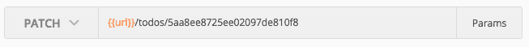

现在记住，PATCH 请求完全是关于更新数据，所以我们必须提供数据作为请求体。我将转到 Body | raw | JSON 来做到这一点。让我们继续对 Todo 进行一些更新。我将设置`"completed": true`，如果你在 GET /todos 选项卡中查看，你会发现第二个 Todo 的`completed`值为`false`，所以它应该改变，`completedAt`属性应该被添加。请求设置好后，我将发送它：

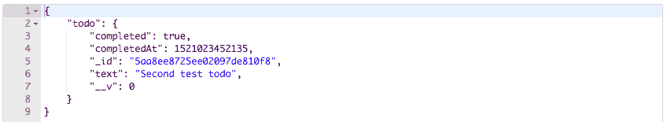

我们得到了我们的`todo`，`completed`设置为`true`，`completedAt`设置为时间戳。现在我也可以继续调整这个，将`"completed": true`改为`"completed": false`发送请求；这会将`"completed": false`设置并清除`completedAt`。最后，我们可以继续做一些像设置`text`属性的事情。我将把它设置回`true`，并添加第二个属性，`text`，将其设置为`Updates from postman`。我可以发送这个请求，然后在下面我们得到了我们的 Todo，看起来正如我们所期望的那样：

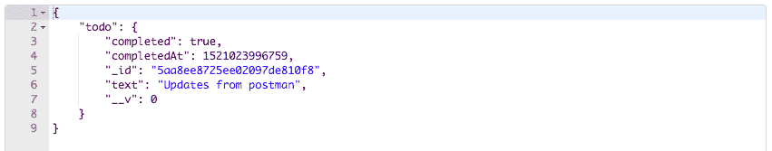

我们有我们的`text`更新；我们还有我们的`completed`更新和时间戳显示在`completedAt`字段中。有了这个，我们现在有了获取、删除、更新和创建 Todo 项目的能力——这些是四个主要的 CRUD 操作。

接下来，我们要做的是编写一些测试来验证`patch`是否按预期工作，这样我们就可以自动运行它们并捕捉到我们代码中的任何回归。目前就是这样，我们将继续在终端中提交并推送我们的更改。我们将把它们推送到 Heroku 并测试一下。`git status`显示我们只有这两个更改的文件，这意味着我们可以使用`git commit`和`-am`标志来进行提交。对于这个，一个好的消息是，`Add PATCH /todos/:id`：

```js
**git commit -am 'Add PATCH /todos/:id'** 
```

我要提交并将其推送到 GitHub，一旦它在 GitHub 上，我们就可以使用以下命令将其推送到 Heroku：

```js
**git push heroku master** 
```

请记住，主分支是 Heroku 唯一可以访问的分支；我们不会在本书中使用分支，但是如果你已经了解分支并且遇到任何问题，你需要推送到 Heroku 主分支以重新部署你的应用。就像我说的，如果你使用的命令和我一样，这不是一个问题。

现在应用已经部署，我们可以打开它；我们将通过在 Postman 中发出请求来打开它。我将切换到 Todo App Heroku 环境，然后我将继续在 GET /todos 中发出请求：

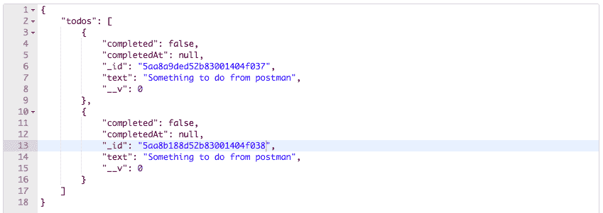

这些是在 Heroku 上可用的所有待办事项。我将拿到第一个。我将转到 PATCH 请求，替换 ID，并保持相同的主体。我将设置`"completed": true`和`"text": "来自 Postman 的更新"`：

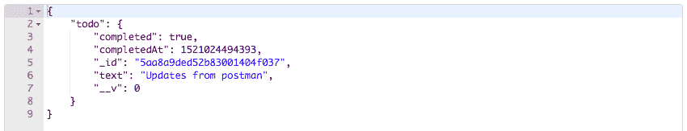

当我们发送请求后，我们会收到更新后的待办事项。`completed`看起来很好，`completedAt`也很好，`text`也很好。现在我将把它添加到我的集合中；在以后，patch 调用会派上用场，所以我会点击保存为，给它一个我们用于所有的名称，即 HTTP 方法后跟 URL。我将保存到我们现有的集合 Todo App 中：


现在，我们已经完成了这一步；我们的`patch`路由已经可以工作了，现在是时候进入下一部分，我们将在那里测试这段代码。

# 测试 PATCH /todos/:id

在这一部分中，我们，或者更恰当地说是你，将编写两个测试用例来验证`patch`是否按预期工作。我们将拿一个未完成的待办事项并将其标记为完成，然后拿一个已完成的待办事项并将其标记为未完成。

为了做到这一点，我们需要调整`server.test`文件中的种子数据。`server.test`文件中的种子数据是两个待办事项；它们都没有指定`completed`属性，这意味着它将默认为`false`。对于第二个项目，我们将继续设置它。我们将设置`completed: true`，并且我们还将设置`completedAt`等于我们想要的任何值。你可以选择任何数字。我将继续使用`333`：

```js
const todos = [{
   _id: new ObjectID(),
   text: 'First test todo'
},{
   _id: new ObjectID(),
   text: 'Second test todo',
   completed: true,
   completedAt: 333
}];
```

现在我们有两个待办事项，可以让我们双向切换。在下面开始之前，我将帮助你创建一个描述和一个`It`块，以便我们在同一个页面上，但你将负责填写实际的测试用例。这一部分基本上是一个挑战，因为我们之前已经做了很多这样的事情。首先是`describe`块。我们将`describe`这组测试；我们将使用方法后跟 URL 来做到这一点，然后我们可以继续添加我们的函数，然后定义我们的两个测试用例：

```js
describe('PATCH /todos/:id', () => {

});
```

第一个测试将获取我们的第一个待办事项，并将其`text`设置为其他内容，我们将把`completed`从`false`更改为`true`，`it('should update the todo')`。我们可以为我们的函数提供`done`参数，并且我将在接下来的一刻内留下一些注释，让你知道我希望你如何完成这个任务。第二个测试将用于切换第二个待办事项，其中`completed`值已经等于`true`，然后`it('should clear completedAt when todo is not completed')`。这个测试用例将确保当我们去除`completed`状态，将其设置为`false`时，`completedAt`被清除。现在，对于第一个测试用例，你要做的是获取第一项的 ID，`获取第一项的 ID`，然后你将发出我们的 patch 请求；你将提供带有 ID 的正确 URL，并且你将使用 send 发送一些数据作为请求体。对于这个，我希望你更新文本，将其设置为你喜欢的任何内容，然后你将`设置 completed 为 true`。现在，一旦你发送出去，你将准备好进行断言，你将使用基本系统进行一次断言，断言你得到了一个`200`状态码，并且你将进行一次自定义断言。自定义断言将验证响应体是否具有一个`text`属性等于你发送的文本，`文本已更改`。你将验证`completed`是否为`true`，并且你还将验证`completedAt`是否为一个数字，你可以使用`expect`中可用的`.toBeA`方法来完成。现在，对于第二个测试，我们将做类似的事情，但我们只是朝着另一个方向前进；我们将`获取第二个待办事项的 ID`，你将将`text`更新为不同的内容，并且你将将`completed`设置为`false`。然后你可以进行断言。再次，我们将期望这个得到`200`，并且我们将期望响应体现在这些更改，文本被更改为你选择的任何内容。我还希望你检查`completed`现在是否为`false`，并且检查`completedAt`是否为`null`，你可以使用`expect`上可用的`.toNotExist`方法进行断言。这就是你需要完成测试套件的内容。完成后，我希望你运行`npm test`，确保两个测试用例都通过。

# 测试 1 - 完成未完成的待办事项

让我们先填写第一个测试用例，我将首先获取正确的 ID。让我们创建一个名为`hexId`的变量，将其设置为第一个待办事项的`_id`属性，并调用`toHexString`以获取我们可以传递到 URL 的字符串。接下来，我将创建一些虚拟文本；这将是新的更新文本。让我们创建一个名为`text`的变量，并将其设置为你喜欢的任何内容。`这应该是新文本`。现在我们可以使用`request`实际发出请求到我们的 express 应用程序。我们将使用`patch`方法；希望你能自己找出，如果你找不到，也许你使用了 super test 的文档，因为我没有明确告诉你如何进行`patch`调用。接下来，我们将使用模板字符串作为我们的 URL，`/todos/`，然后我们将注入`hexId`。现在，在我们进行断言之前，我们确实需要发送一些数据，所以我将调用`send`，传递数据。这将是我们想要更改的内容。对于这个测试，我们确实希望将`completed`设置为`true`。我将设置`completed: true`，我们确实希望更新文本，所以我将`text`设置为上面的`text`变量，并且我可以使用 ES6 略去这部分：

```js
it('should update the todo', (done) => {
   var hexId = todos[0]._id.toHexString();
   var text = 'This should be the new text';

   request(app)
   .patch(`/todos/${hexId}`)
   .send({
         completed: true,
         text
   })
});
```

现在我们已经设置好了发送，我们可以开始做出断言。第一个很容易，我们只是期望 200。我将期望 `200` 作为返回状态码，并在添加自定义断言之前，我们可以调用 `end`，传入 `done`。现在，我们需要做的最后一件事就是对返回的数据进行断言。我将调用 `expect`，传入一个函数；这个函数我们现在知道会被响应调用，我们可以进行自定义断言。我们将对 `text`、`completed` 和 `completedAt` 进行断言。首先是 `text`。我们使用 `expect(res.body.todo.text).toBe(text)`，这是我们上面定义的变量。如果这等于返回的数据，那么我们就可以继续了。

接下来，让我们对 `completed` 属性进行一些断言。我们将使用 `expect(res.body.todo.completed)` 并检查它是否为 `true`，使用 `.toBe(true)`。我们将 `completed` 设置为 `true`，所以它应该从 `false` 变为 `true`。现在，在我们自定义的 `expect` 调用中，我们要做的最后一个断言是关于 `completedAt`，确保它是一个数字。我们将使用 `expect(res.body.todo.completedAt)` 等于一个数字，使用 `.toBeA`，在引号中是 `number` 类型。

```js
it('should update the todo', (done) => {
   var hexId = todos[0]._id.toHexString();
   var text = 'This should be the new text';

   request(app)
   .patch(`/todos/${hexId}`)
   .send({
         completed: true,
         text
   })
   .expect(200)
   .expect((res) => {
         expect(res.body.todo.text).toBe(text);
         expect(res.body.todo.completed).toBe(true);
         expect(res.body.todo.completedAt).toBeA('number');
   })
   .end(done);
});
```

现在，我们的第一个测试已经完成。我们可以继续删除那些注释，并通过在终端中运行来验证它是否工作。我们的第二个测试将失败；没关系，只要第一个通过，我们就可以继续。我将运行 `npm test`，这将触发测试套件。我们可以看到我们的第一个 `PATCH` 测试成功了；这是我们刚刚填写的，而我们的第二个测试失败了。两秒后我们得到了一个超时，这是预期的，因为我们从未调用 `done`。

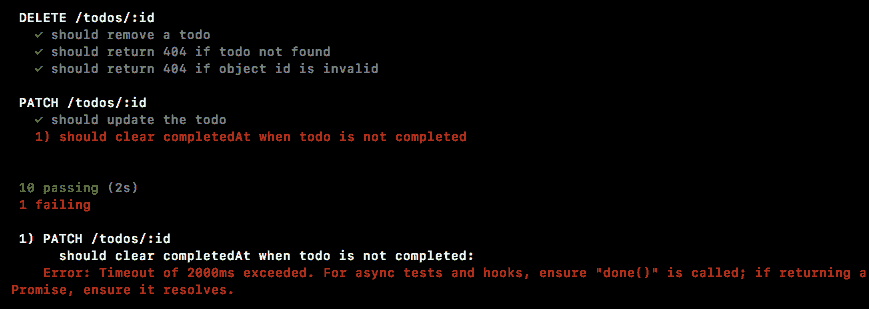

现在第一个已经设置好了，我们可以继续填写第二个。这两个测试的代码将非常相似。既然我们刚刚编写了代码并且知道它的作用，我们可以复制粘贴。我不喜欢复制粘贴我不理解的代码，但我喜欢高效。既然我知道那段代码的作用，我可以直接粘贴到第二个测试用例中，然后我们可以继续进行一些更改。

# 测试 2 - 使完成的待办事项变为未完成

我们不想获取 `hexId` 变量或第一个待办事项，而是想获取第二个待办事项的 `hexId` 变量，然后我们需要更新发送的数据。我们不想将 `completed` 设置为 `true`；我们已经在上面手动完成了。这次我们要设置为 `false`。我们还要更新 `text`，所以我们可以保留它。我将继续调整文本值，末尾添加一些感叹号。接下来是断言。我们仍然期望返回 `200` 作为状态码。这部分很好，我们仍然期望 `text` 等于 `text`。不过，对于 `completed`，我们期望它是 `false`，并且我们不期望 `completedAt` 是一个数字；它原来是一个数字，但在此更新后应该已经清除，因为待办事项不再完成。我们可以使用 `toNotExist` 来断言 `completedAt` 不存在。

```js
it('should clear completedAt when todo is not completed', (done) => {
   var hexId = todos[1]._id.toHexString();
   var text = 'This should be the new text!!';

   request(app)
   .patch(`/todos/${hexId}`)
   .send({
         completed: false,
         text
   })
   .expect(200)
   .expect((res) => {
         expect(res.body.todo.text).toBe(text);
         expect(res.body.todo.completed).toBe(false);
         expect(res.body.todo.completedAt).toNotExist();
   })
   .end(done);
});
```

现在我们的测试用例已经完成。我们现在可以删除那些注释，保存文件，并从终端重新运行。我将重新运行测试套件。

我们让两个`PATCH`测试都通过了。现在，你可能已经注意到，对于`patch`，我们没有编写那些无效的 ObjectIDs 或者找不到 ObjectIDs 的测试用例；你可以添加这些，但我们迄今为止已经做了很多次，我不认为这是必要的练习。不过，这两个测试用例确实验证了我们的`patch`方法是否按预期工作，特别是当涉及到`patch`需要完成的稍微复杂的逻辑时。有了这个设置，我们已经完成了对最后一个路由的测试。

我们可以继续进行提交，并进入本章的最后一节。在终端中，我将运行`git status`。我们会看到有一个修改过的文件，`server.test`文件，看起来很好。我们可以使用`git commit`和`-am`标志进行提交，`Add tests for PATCH /todos/:id`：

```js
**git commit -am 'Add tests for PATCH /todos/:id'**  
```

我将进行提交，然后我会花一点时间将其推送到 GitHub 上，有了这个设置，我们就完成了。在下一节，也是本章的最后一节，你将学习如何在本地使用一个单独的测试数据库，这样你在运行测试时就不会总是清空开发数据库中的数据。

# 创建一个测试数据库

现在我们所有的待办事项路由都已设置并测试完成，在这最后一部分，我们将探讨如何为我们的应用程序创建一个单独的测试数据库。这意味着当我们运行测试套件时，我们不会删除`TodoApp`数据库中的所有数据。我们将在`Test`和`TodoApp`旁边有一个单独的数据库，用于测试 DB。

为了设置好这一切，我们需要一种区分在本地运行应用程序和在本地运行测试套件的方法，这正是我们将要开始的地方。这个问题的根源在于在我们的`mongoose.js`文件中，我们要么使用`MONGODB_URI`环境变量，要么使用 URL 字符串。这个字符串用于测试和开发，当我说测试时，我指的是当我们运行我们的`test`脚本时，当我说开发时，我指的是当我们在本地运行我们的应用程序，这样我们就可以在 Postman 等工具中使用它。我们真正需要的是一种在本地设置环境变量的方法，这样我们总是使用`MONGODB_URI`变量，而不是像在`mongoose.js`文件中那样有一个默认字符串。为了做到这一点，我们将看一下一个非常特殊的环境变量：`process.env.NODE_ENV`，你不必编写这段代码。我马上就要删除它。这个`NODE_ENV`环境变量是由 Express 库广泛使用的，但现在几乎所有的 Node 托管公司都已经采用了它。例如，Heroku 默认将这个值设置为字符串`production`。这意味着我们将总共有三个环境。我们已经有了一个`production`环境。这是我们在 Heroku 上称呼我们的应用程序的方式；当我们在本地运行应用程序时，我们将有一个`development`环境，当我们通过 Mocha 运行应用程序时，我们将有一个`test`环境。这意味着我们将能够为这三个环境分别设置`MONGODB_URI`的不同值，从而创建一个单独的测试数据库。

让我们开始添加一些代码到`server.js`文件的顶部。稍后我们会将这些代码移出`server.js`，但现在我们先把它放在顶部。让我们创建一个名为`env`的变量，并将其设置为`process.env.NODE_ENV`：

```js
var env = process.env.NODE_ENV;
```

现在，这个变量目前只在 Heroku 上设置；我们在本地没有设置这个环境变量。环境变量通常用于远不止 Node。你的计算机可能有接近两打的环境变量，告诉计算机各种各样的东西：某些程序的存在位置，你想使用的库的版本，这类的东西。然而，`NODE_ENV`变量是我们需要在`package.json`文件中为开发和测试环境进行配置的东西。然后，在下面，我们将能够添加一些`if else`语句来根据环境配置我们的应用。如果我们在开发中，我们将使用一个数据库，如果我们在测试中，我们将使用另一个。现在，为了在`package.json`中启动这些东西，我们需要调整`test`脚本，设置`NODE_ENV`环境变量。你可以通过链接多个命令来设置环境变量。我们即将编写的代码也将为 Windows 提供备用方案，因此，无论你是在 macOS、Linux 还是 Windows 上，你都可以编写完全相同的代码。这将在包括 Heroku 在内的所有地方都能够工作。这里的目标只是在运行测试套件之前将`NODE_ENV`设置为`test`。为了做到这一点，我们将首先使用`export`命令。`export`命令在 macOS 和 Linux 中可用。这是完成的方式，即使你在 Windows 上也要输入这个，因为当你部署到 Heroku 时，你将使用 Linux。我们将导出`NODE_ENV`，将其设置为`test`：

```js
"scripts": {
   "start": "node server/server.js",
   "test": "export NODE_ENV = test mocha server/**/*.test.js",
   "test-watch": "nodemon --exec 'npm test'"
}
```

现在，如果你在 Windows 上，`export`命令将失败；`export`将触发一个错误，类似于 export 命令未找到。对于 Windows 用户，我们将添加这个`||`块，我们将调用`SET`。`SET`与 export 相同，只是它是该命令的 Windows 版本。在最后的测试之后，我们将添加两个和号来链接这些命令：

```js
"scripts": {
   "start": "node server/server.js",
   "test": "export NODE_ENV = test || SET NODE_ENV = test && mocha server/**/*.test.js",
   "test-watch": "nodemon --exec 'npm test'"
}
```

所以，让我们来详细分析一下将会发生什么。如果你在 Linux 上，你将运行`export`命令；`SET`命令永远不会运行，因为第一个已经运行了。然后我们将链接第二个命令，运行`mocha`。如果你在 Windows 上，`export`命令将失败，这意味着你将运行第二个命令；无论如何，你都会设置`NODE_ENV`变量，然后最后你将链接一个调用`mocha`的命令。有了这个设置，我们现在有了一种在`package.json`中直接设置`NODE_ENV`变量的方法。

这是一个快速的跨操作系统更新；正如你在这里所看到的，我们有一个修改过的`test`脚本的版本：

`"test": "export NODE_ENV=test || SET \"NODE_ENV=test\" && mocha server/**/*.test.js"`

原始的测试脚本在 Windows 端有一个问题：它会将环境变量设置为带有末尾空格的字符串 test，而不是只有字符串`test`。为了正确地将`env`变量设置为`test`，而不是`test`，我们将把整个设置参数放在引号内，并且我们会转义这些引号，因为我们在 JSON 文件中使用引号。这个命令将在 Linux、macOS 和 Windows 上都能够工作。

现在我实际上不会为`scripts`添加一个`start`脚本。`start`脚本，用于开发环境，将只是默认值。我们将在 Heroku 上将其设置为生产环境，我们将在`test`脚本中将其设置为`test`，在这种情况下，我们将在`server.js`中将其设置为默认值，因为我们倾向于在不经过`start`脚本的情况下运行文件。在`server.js`文件中，我将默认设置为`development`。如果我们处于生产环境，`NODE_ENV`将被设置，如果我们处于测试环境，`development`将被设置，如果我们处于开发环境，`NODE_ENV`将不会被设置，将使用`development`，这意味着我们准备添加一些`if`语句。如果`env`是`development`，我们要做一些事情。我们要做的事情是设置 MongoDB URL。否则，如果`env`是`test`环境。在这种情况下，我们还要设置一个自定义数据库 URL：

```js
if(env === 'development') {

} else if(env === 'test') {

}
```

现在我们可以继续设置我们的环境变量。我们在整个应用程序中使用了两个环境变量，这两个环境变量都在 Heroku 上设置，因此不必担心生产环境。我们有我们的`PORT`环境变量，和我们的`MONGODB_URI`变量。在`server.js`中，如果我们处于开发环境，我们将继续设置`process.env.PORT=3000`。这意味着我们实际上可以删除`port`变量的默认值；没有必要设置默认值，因为`PORT`已经被设置。它将在 Heroku 上设置为生产环境，它将在本地设置为`development`，然后在`else if`块中，我们将为我们的最终环境，测试环境，设置为`3000`。在`mongoose.js`中，我们将为`development`和`test`设置一个`MONGODB_URI`环境变量，这与我们在生产环境上使用的变量名称完全相同。我将删除我们的默认值，将字符串剪切出来，这样它就在我的剪贴板中，然后我可以删除所有设置默认值的多余代码，我们剩下的就是对环境变量的引用：

```js
mongoose.connect(process.env.MONGODB_URI);
```

现在在`server.js`内部，我们可以为两个环境设置环境变量`process.env.MONGODB_URI`，我们将把它设置为我刚刚复制的字符串`mongodb://localhost:27017/TodoApp`。我们正在使用`TodoApp`数据库。

现在，在`else if`块下面，我们可以将`process.env.MONGODB_URI`设置为我们刚刚复制的字符串，但是不再将其设置为`TodoApp`数据库，而是将其设置为`TodoAppTest`数据库：

```js
if(env === 'development') {
  process.env.PORT = 3000;
  process.env.MONGODB_URI = 'mongodb://localhost:27017/TodoApp';
} else if(env === 'test') {
  process.env.PORT = 3000;
  process.env.MONGODB_URI = 'mongodb://localhost:27017/TodoAppTest';
}
```

当我们以测试模式运行我们的应用程序时，我们将使用一个完全不同的数据库，因此不会清除我们用于开发的数据库。为了测试一切是否按预期工作，我将在`env`变量下方使用`console.log`记录环境变量。我将打印带有几个星号的字符串`env`，以便在终端输出中易于识别，然后我将把`env`变量作为第二个参数传递：

```js
console.log('env *****', env);
```

现在我们可以继续测试一切是否按预期工作。在终端中，我将使用以下命令启动我们的应用程序：

```js
**node server/server.js** 
```

我们得到一个等于`development`的`env`，这正是我们所期望的：

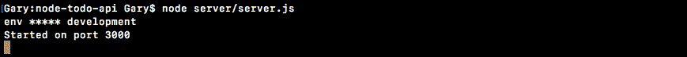

现在我们可以在 Postman 中进行测试。在 Postman 中，我将切换到我的本地环境，Todo App Local，然后我将获取所有的 Todos，您可以看到我们有一些剩下的测试数据：

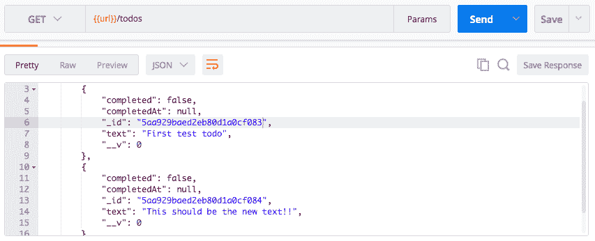

我想要做的是继续调整第一个，使其不同。然后我们将运行我们的测试，并确保调整后的待办事项仍然显示出来，因为当我们运行测试时，我们不应该访问相同的数据库，因此这些数据都不应该被更改。我将复制第一项的 ID，将其移入我的`PATCH`调用。我正在更新`text`属性和`completed`属性，所以很好，我不需要更改。我将继续更改 URL 中的 ID，发送调用，现在我们有了`text`属性为`Updates from postman`的更新后的待办事项：

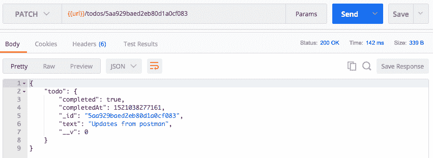

接下来，我将进入终端，关闭节点服务器，并使用`npm test`运行我们的测试：

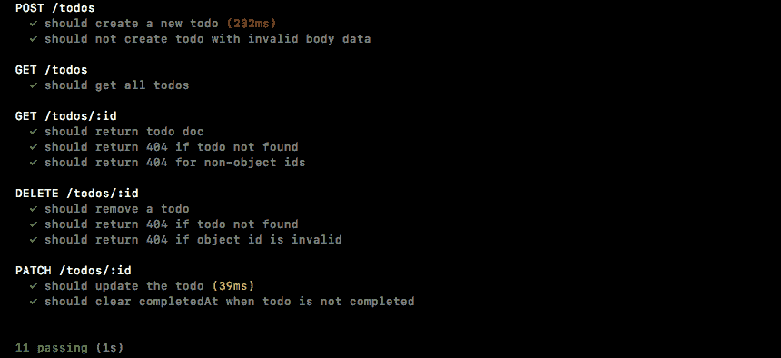

我们将`env`变量设置为`test`，然后运行测试套件；我们所有的测试都通过了，这太棒了。我们设置的一切是否有效的真正测试是，如果我们再次启动服务器并尝试从`development`数据库中获取数据。

在 Postman 中，我将最后一次进行`GET /todos`请求，我们的待办事项数据仍然如预期般显示出来。尽管测试套件确实运行了，但这并不重要，因为它不再清除这个数据库，而是现在清除了一个全新的数据库，您可以在 Robomongo 中查看。如果我点击连接并点击刷新，我们现在有两个`TodoApp`数据库：我们有`TodoApp`和`TodoAppTest`。这太棒了；一切都设置好了，我们准备好开始了。

现在，在我们离开之前，我想把`server.js`中的所有代码移到其他地方；它并不真正属于这里，它只会使服务器文件变得比必要的更复杂。在`server`文件夹中，我将创建一个名为`config`的全新文件夹，在`config`文件夹中，我将创建一个名为`config.js`的新文件，在其中我们可以进行所有的环境变量配置。我将复制所有代码并用一个`require`调用替换它。这是一个相对文件，所以我们将转到`/config/config`：

```js
require('./config/config');
```

在`config.js`内部，我们现在可以复制代码并删除与`console.log`相关的行。让我们通过提交更改并部署到 Heroku 来结束这一部分。

在终端中，我将清除终端输出，然后我们可以运行`git status`来查看我们更改了哪些文件，我们改变了相当多的文件。

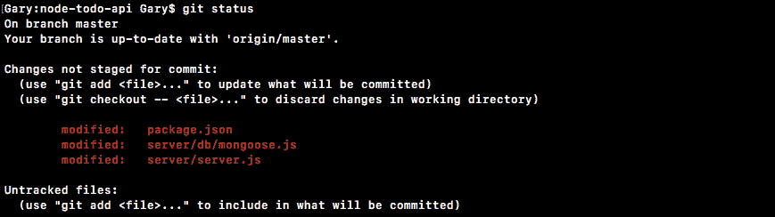

我们还在`server`目录中有一些新文件。我将使用`git add .`将所有内容添加到下一个提交中，然后再次使用`git status`确认一切看起来都很好。现在我们准备提交，我可以继续进行，使用`git commit`并使用`-m`标志提供我们的消息，`设置单独的测试和开发环境`：

```js
**git commit -m 'Setup separate test and development envs'**
```

我还要将其部署到 Heroku，以便我们可以验证我们在那里没有破坏任何东西：

```js
**git push heroku master**
```

完成后，我们将通过进入 Postman 并向我们的 Heroku 应用程序发出`GET /todos`请求来结束这一部分。在 Postman 中，我将从 Todo App Local 切换到 Todo App Heroku 环境，然后我们可以发送请求：

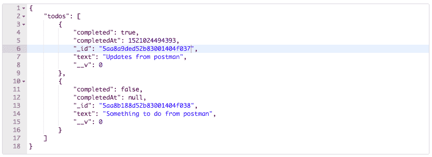

现在，如前面的屏幕截图所示，我们从真实数据库中获取了两个`todo`项目，这意味着 Heroku 应用程序上没有出现任何问题，也不应该有——从技术上讲，我们什么都没有改变。在 Heroku 中，我们所做的就是运行`config`文件，但我们不使用默认值，因为它已经设置好了，并且不会通过任何那些语句，因为`env`变量将等于字符串 production，因此就 Heroku 而言，没有任何变化，并且它显示出来，因为数据仍然如预期般返回。

这就是本节的全部内容，也是本章的全部内容。在本节中，我们学习了关于 MongoDB、Mongoose API、Postman、测试、路由等各种重要功能。在下一章中，我们将通过添加身份验证来完成 Todo 应用程序。

# 总结

在本章中，我们学习了 Mongoose 查询和 ID 验证。接下来，我们研究了获取单个资源并进行了一些挑战。在将 API 部署到 Heroku 并探索 Postman 环境之后，我们了解了不同的删除资源的方法。最后，我们研究了创建测试数据库。

在下一章中，我们将学习使用 Socket.io 创建实时 Web 应用程序
