# 第五章：使用 Socket.io 实时 Web 应用程序

在本章中，您将学习有关 Socket.io 和 WebSockets 的知识，它们可以在服务器和客户端之间进行双向通信。这意味着我们不仅要设置一个 Node 服务器，还要设置一个客户端。这个客户端可以是一个 web 应用程序，iPhone 应用程序或 Android 应用程序。对于本书来说，客户端将是一个 web 应用程序。这意味着我们将连接这两个，允许数据在浏览器和服务器之间无缝流动。

现在，我们的 todo 应用程序数据只能单向流动，客户端必须初始化请求。使用 Socket.io，我们将能够立即来回发送数据。这意味着对于实时应用程序，比如电子邮件应用程序，食品订购应用程序或聊天应用程序，服务器不需要等待客户端请求信息；服务器可以说，“嘿，我刚刚收到了一些你可能想要向用户显示的东西，所以在这里！”这将开启一系列可能性，我们将从如何将 Socket.io 集成到 Node 应用程序中开始。让我们开始吧！

# 创建一个新的 web 应用项目

在您可以将套接字添加到您的 Web 应用程序之前，您需要一个 Web 应用程序来添加它们，这正是我们将在本节中创建的。我们将创建一个基本的 Express 应用程序，并将其上传到 GitHub。然后，我们将部署到 Heroku，这样我们就可以在浏览器中实时查看它。

现在，这个过程的第一步是创建一个目录。我们将一起做一些事情，让我们都朝着正确的方向前进。从桌面开始的过程的第一步是运行`mkdir`来为这个项目创建一个新目录；我将把它叫做`node-chat-app`。

然后，我们可以使用`cd`命令导航到该目录，然后运行一些命令：

```js
mkdir node-chat-app
cd node-chat-app
```

首先是`npm init`。和本书中的所有项目一样，我们将利用 npm，所以我们将运行以下命令：

```js
npm init
```

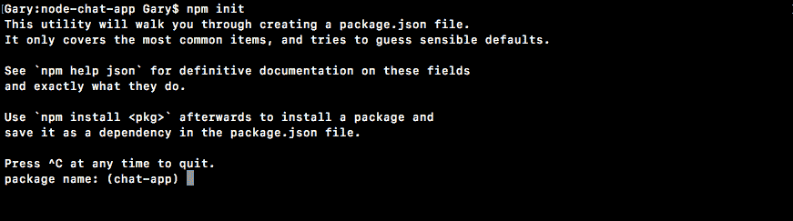

然后，我们将使用*enter*键来使用每个选项的默认值：

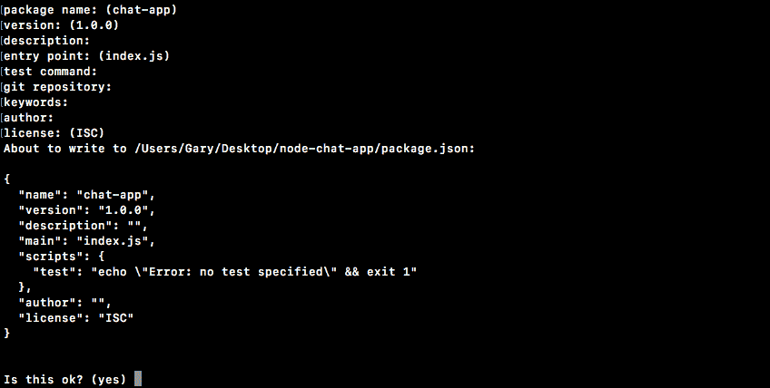

当我们完成后，我们可以输入`yes`，现在我们有了一个`package.json`文件。在我们进入 Atom 之前，我们将运行以下命令来初始化一个新的 Git 仓库：

```js
git init
```

我们将使用 Git 对这个项目进行版本控制，并且我们还将使用 Git 推送到 GitHub 和 Heroku。有了这个设置，我可以使用`clear`命令来清除终端输出，然后我们可以进入 Atom。我们将从打开文件夹并设置我们的基本应用程序结构开始。

# 设置我们的基本应用程序结构

为了设置基本的应用程序结构，我将打开桌面上刚创建的文件夹，名为`node-chat-app`：

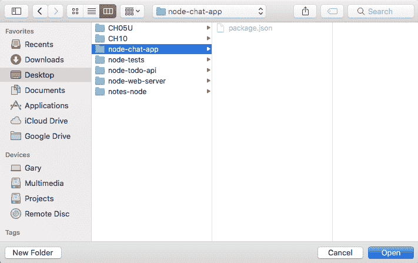

在这个文件夹中，我们将开始创建一些目录。现在，不像前几章的其他应用程序，聊天应用程序将有一个前端，这意味着我们将编写一些 HTML。

我们还将添加一些样式和编写一些在浏览器中运行的 JavaScript 代码，而不是在服务器上运行。为了使这个工作，我们将有两个文件夹：

+   一个将被称为`server`，它将存储我们的 Node.js 代码

+   另一个将被称为`public`，它将存储我们的样式，我们的 HTML 文件和我们的客户端 JavaScript

现在，在`server`文件夹中，就像我们为 todo API 所做的那样，我们将有一个`server.js`文件，它将是我们的 Node 应用程序的根：

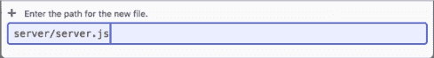

这个文件将做一些事情，比如创建一个新的 Express 应用程序，配置公共目录为 Express 提供的静态文件夹，并调用`app.listen`来启动服务器。

在`public`文件夹中，我们将在本节中创建一个文件，名为`index.html`：

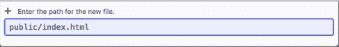

`index.html`文件将是我们在应用程序中访问时提供的标记页面。现在，我们将制作一个非常简单的页面，只是在屏幕上打印一条消息，以便我们可以确认它被正确地提供出来。在下一节中，我们将担心在客户端集成 Socket.io。

# 为 DOCTYPE 设置 index.html 文件

不过，现在，在我们的`index.html`文件中，我们将提供`DOCTYPE`，这样浏览器就知道我们要使用哪个版本的 HTML。我们告诉它使用 HTML，这是指 HTML5。接下来，我们将打开并关闭我们的`html`标签：

```js
<!DOCTYPE html>
<html>

</html>
```

这个标记将让我们提供`head`和`body`标签，这正是我们需要让事情运转起来的。

+   首先是`head`。在`head`内，我们可以提供各种配置标签。现在我们只使用一个，`meta`，这样我们就可以告诉浏览器我们想要使用哪个`charset`。在`meta`标签中，我们将提供`charset`属性，将其设置为`utf-8`，放在引号内：

```js
      <!DOCTYPE html>
      <html>
      <head>
 <meta charset="utf-8">
 </head>
      </html>
```

+   接下来，我们将在`html`标签内提供`body`标签。这包含了我们实际要呈现到屏幕上的 HTML，对于这个，我们将呈现一个`p`标签，用于段落，然后我们会有一些简单的文本，比如`Welcome to the chat app`：

```js
      <!DOCTYPE html>
      <html>
      <head>
        <meta charset="utf-8">
      </head>
      <body>
 <p>Welcome to the chat app</p>
 </body>
      </html>
```

这就是目前要显示的全部内容。现在，我们可以离开`html`文件，回到`server`文件。

# 为公共目录设置 server.js 文件

在我们的`server`文件中，我们想要设置这个服务器来提供`public`文件夹。现在，在这种情况下，`server.js`文件不在项目的根目录中，这意味着我们必须从`server`进入`node-chat-app`的上一级目录。然后，我们必须进入`public`文件夹。这将使设置 Express 中间件有点困难。我们将看一下一个内置的 Node 模块，它可以很容易地转换路径。

现在，为了向你展示我在说什么，让我们继续使用两个`console.log`调用：

```js
console.log();
console.log();
```

第一个`console.log`调用将向我们展示我们以前是如何做的，第二个将向我们展示更好的做法。

在第一个`console.log`调用中，我们将提供我们为我们的第一个 Express 应用程序提供的相同路径。我们使用`__dirname`来引用当前目录，这种情况下是`server`目录，因为文件在`server`文件夹内。然后，我们连接它，`/public`。现在，在这种情况下，我们在`server`文件夹中没有一个`public`文件夹；`public`文件夹和`server`文件夹在完全相同的级别，这意味着我们需要使用`..`来进入上一级目录，然后我们需要进入`public`：

```js
console.log(__dirname + '/../public');
console.log();
```

这是旧的做事情的方式，如果我们从终端运行这个，我们可以看到为什么它看起来有点奇怪。我将运行`server/server.js`：

```js
nodemon server/server.js
```

我们得到的是这个路径，如下面的截图所示：

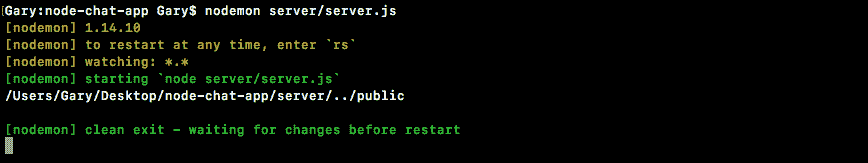

我们进入了`Users/Andrew/Desktop/`项目文件夹，这是预期的，然后我们进入`server`，离开`server`，然后进入`public`——这是完全不必要的。我们想要做的是直接从`project`文件夹进入`public`，保持一个干净、跨操作系统兼容的路径。为了做到这一点，我们将使用一个随 Node 一起提供的名为`path`的模块。

# join 方法

现在，让我们看一下`path`的文档，因为`path`有很多方法在这一节中我们不会使用。我们将前往[nodejs.org](https://nodejs.org/en/)，在那里我们可以找到 Docs 选项卡。我们将进入 Docs 页面，然后进入 API 参考页面：

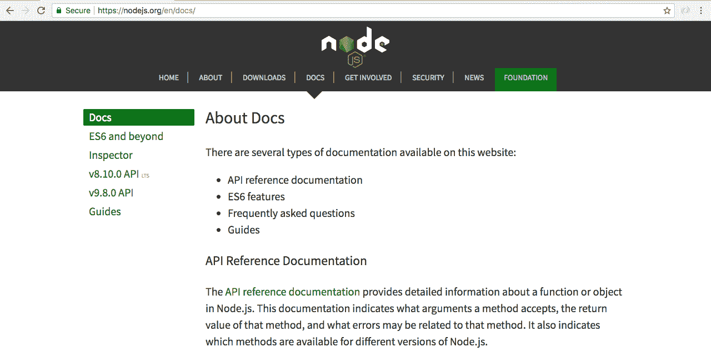

这是我们可以使用的所有模块的列表。我们正在使用 Path 模块：

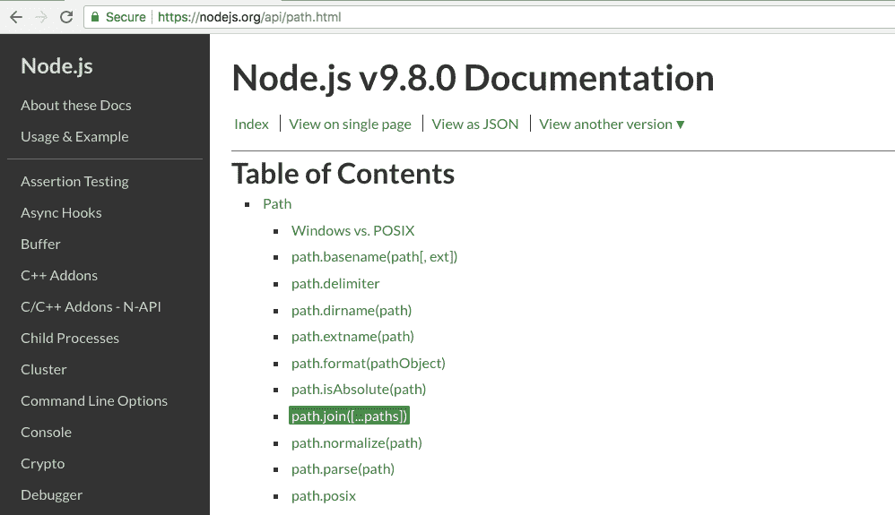

在 Path 中，我们将使用的方法是`join`，你可以在前面的截图中看到。如果你点击这个方法，你可以看到`join`如何工作的一个小例子：

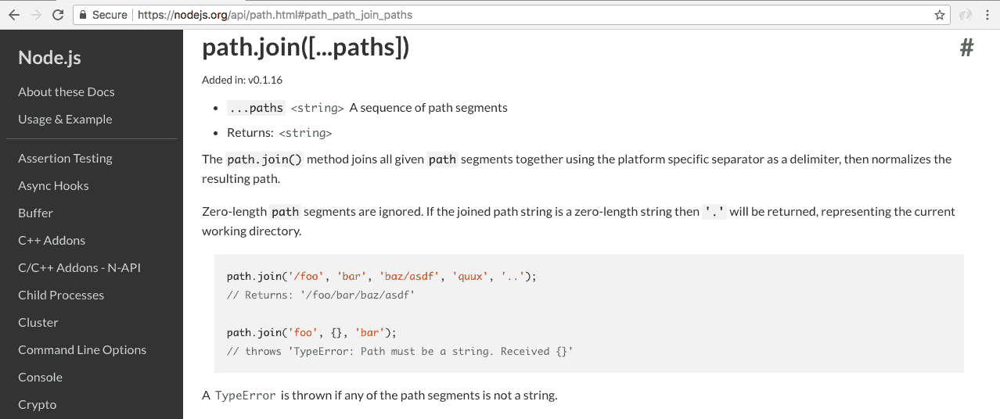

`join`方法接受您的部分路径并将它们连接在一起，这意味着在前面截图中显示的示例会得到更简单的路径。在这个例子中，我们可以看到我们从`foo`开始。然后我们进入`bar`，这也显示出来；然后我们进入`baz/asdf`，这确实显示出来。接下来是有趣的部分：我们进入`quux`目录，然后我们使用`..`退出，您可以看到结果路径并没有显示我们进入和退出，就像我们在终端内的路径一样；相反，它将其解析为最终路径，`quux`目录不见了。

我们将使用完全相同的方法来清理我们的路径。在 Atom 中，我们可以通过创建一个名为`path`的常量并要求它来加载`path`模块：

```js
const path = require('path');
```

记住，这个不需要安装：它是一个内置模块，您可以在不使用`npm`的情况下访问它。接下来，我们将创建一个名为`publicPath`的变量。我将使其成为一个常量变量，因为我们将对其进行任何更改，并将调用`path.join`：

```js
const path = require('path');
const publicPath = path.join();
```

我们将在一会儿将一些参数传递给`path.join`。在我们这样做之前，我将调用`console.log(publicPath)`：

```js
const path = require('path');
const publicPath = path.join();

console.log(__dirname + '/../public');
console.log(publicPath);
```

现在，在`path.join`内，我们要做的是取两个路径`__dirname`和`'/../public'`，并将它们作为单独的参数传递。我们仍然希望从`dirname`目录的`server`文件夹开始。然后，作为第二个参数，我们将在引号内指定相对路径。我们将使用`..`退出目录，然后使用斜杠进入`public`文件夹：

```js
const path = require('path');
const publicPath = path.join(__dirname, '../public');
```

我将保存`server`文件，现在我们应该能够返回终端并看到我们的新路径-在这里：

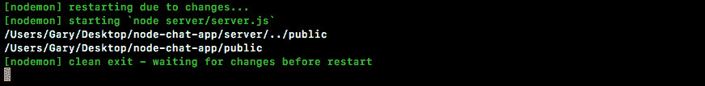

我们不是进入`server`然后退出，而是直接进入`public`目录，这是理想的。这是我们要提供给 Express 静态中间件的路径。

现在我们已经设置了这个`public`路径变量，让我们在本地设置 Express。在我们开始之前，我们将使用`npm i`进行安装。模块名称是`express`，我们将使用最新版本`@4.16.3`，带有`--save`标志。

```js
npm i express@4.16.3 --save
```

我们将运行安装程序，然后我们可以继续在`server.js`中实际使用它。在`package.json`中，我们现在将其放在依赖对象中。

# 配置基本服务器设置

安装 Express 安装程序后，您将创建一个全新的 Express 应用程序，并配置 Express 静态中间件，就像我们之前做的那样，以提供`public`文件夹。最后，您将在端口`3000`上调用`app.listen`。您将提供其中一个小回调函数，以在终端上打印消息，例如`服务器在端口 3000 上运行`。

一旦您创建了服务器，您将在终端内启动它，并在浏览器中转到`localhost:3000`。如果我们现在去那里，我们会得到一个错误，因为该端口上没有运行服务器。您应该能够刷新此页面并看到我们在`index.html`内的段落标签中键入的小消息。

我要做的第一件事是在`server.js`内加载 Express，创建一个名为`express`的常量并要求我们刚刚安装的库：

```js
const path = require('path');
const express = require('express');
```

接下来，您需要创建一个`app`变量，我们可以在其中配置我们的 Express 应用程序。我将创建一个名为`app`的变量，并将其设置为调用`express`：

```js
const path = require('path');
const express = require('express');

const publicPath = path.join(_dirname, '../public');
var app = express();
```

记住，我们不是通过传递参数来配置 Express；相反，我们通过在`app`上调用方法来配置 Express，以创建路由、添加中间件或启动服务器。

首先，我们将调用`app.use`来配置我们的 Express 静态中间件。这将提供`public`文件夹：

```js
const path = require('path');
const express = require('express');

const publicPath = path.join(_dirname, '../public');
var app = express();

app.use();
```

你需要做的是调用`express.static`并传入路径。我们创建一个`publicPath`变量，它存储了我们需要的路径：

```js
app.use(express.static(publicPath));
```

最后要做的一件事是调用`app.listen`。这将在端口`3000`上启动服务器，并且我们将提供一个回调函数作为第二个参数，以在服务器启动后在终端上打印一条小消息。

我将使用`console.log`来打印`Server is up on port 3000`：

```js
app.listen(3000, () => {
  console.log('Server is up on port 3000');
});
```

有了这个，我们现在可以在终端内启动服务器，并确保我们的`index.html`文件出现在浏览器中。我将使用`clear`命令清除终端输出，然后我将使用`nodemon`运行服务器，使用以下命令：

```js
nodemon server/server.js
```

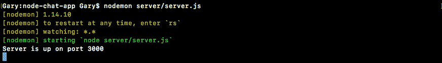

在这里，我们得到了我们的小消息，`Server is up on port 3000`。在浏览器中，如果我刷新一下，我们就会得到我们的标记，`Welcome to the chat app`，如下面的截图所示：

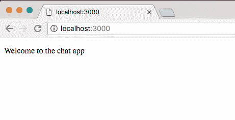

现在我们已经建立了一个基本的服务器，这意味着在下一节中，我们实际上可以在客户端和后端都添加 Socket.io。

# 设置 gitignore 文件

现在，在我们开始在 GitHub 和 Heroku 上进行操作之前，我们将首先在 Atom 中设置一些东西。我们需要设置一个`.gitignore`文件，我们将在项目的根目录中提供它。

在`.gitignore`中，我们唯一要忽略的是`node_modules`文件夹。我们不想将任何这些代码提交到我们的仓库，因为它可以使用`npm install`生成，并且可能会发生变化。管理这种东西真的很痛苦，不建议你提交它。

接下来我们要做的是为 Heroku 配置一些东西。首先，我们必须使用`process.env.PORT`环境变量。我将在`publicPath`变量旁边创建一个名为`port`的常量，将其设置为`process.env.PORT`或`3000`。我们将在本地使用它：

```js
const publicPath = path.join(__dirname, '../public');
const port = process.env.PORT || 3000;
```

现在，我们可以在`app.listen`中提供`port`，并且可以通过将常规字符串更改为模板字符串来在以下消息中提供它，以获得`Server is up on`。我将注入`port`变量值：

```js
app.listen(port, () => {
  console.log(`Server is up on ${port}`);
});
```

现在我们已经准备好了，接下来我们需要改变的是为了让我们的应用为 Heroku 设置好，更新`package.json`文件，添加一个`start`脚本并指定我们想要使用的 Node 版本。在`scripts`下，我将添加一个`start`脚本，告诉 Heroku 如何启动应用程序。为了启动应用程序，你必须运行`node`命令。你必须进入`server`目录，启动它的文件是`server.js`：

```js
"scripts": {
  "start": "node server/server.js",
  "test": "echo \"Error: no test specified\" && exit 1"
},
```

我们还将指定`engines`，这是我们以前做过的。正如你所知，`engines`可以让你告诉 Heroku 要使用哪个版本的 Node：

```js
"engines": {

},
```

这将是重要的，因为我们正在利用一些仅在最新版本的 Node 中才能使用的功能。在`engines`中，我将提供与之前使用的完全相同的键值对，将`node`设置为`9.3.0`：

```js
"engines": {
  "node": "9.3.0"
},
```

如果你使用的是不同版本的 Node，你可以提供这里添加的版本的替代版本。

# 使用当前未提交的文件进行提交

现在我们已经准备好用所有当前未提交的文件进行提交了。然后你将进入 GitHub 并创建一个 GitHub 仓库，将你的本地代码推送上去。确保代码实际上被推送到 GitHub；你可以通过刷新 GitHub 仓库页面来做到这一点。你应该在仓库中看到你的目录结构。

接下来你需要做的是创建一个 Heroku 应用并部署到它。一旦你的应用部署完成，你应该能够在浏览器上访问应用的 URL。你应该看到与我们在`localhost:3000`上看到的完全相同的消息。`Welcome to the chat app`消息应该会打印出来，但不是在`localhost:3000`上，而是在实际的 Heroku 应用上。

现在我们已经在项目内进行了所有必要的更改。我们已经配置了`port`变量，并设置了我们的`scripts`和`engines`，所以你不需要再进行任何代码更改；你只需要在浏览器和终端中施展你的魔法来完成这个。

第一步是创建一个新的 GitHub 存储库。我们需要一个地方来推送我们的代码。我们可以前往[github.com](https://github.com/)，点击那个大大的新存储库按钮，然后创建一个新的。我会把我的存储库命名为`node-course-2-chat-app`。我会将其设置为公共并创建：

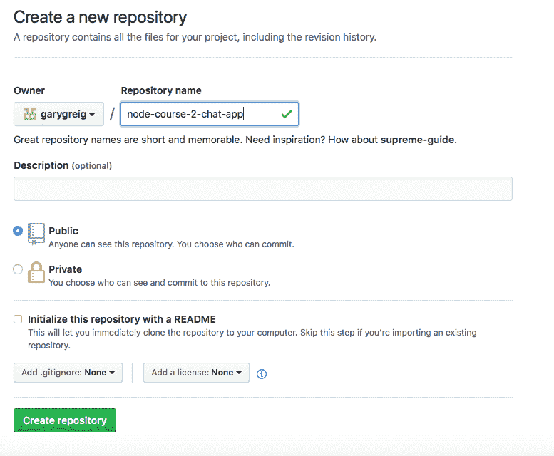

现在我们已经创建了存储库，我们有一系列可以使用的命令。我们有一个现有的存储库要推送，所以我们可以复制这些行：

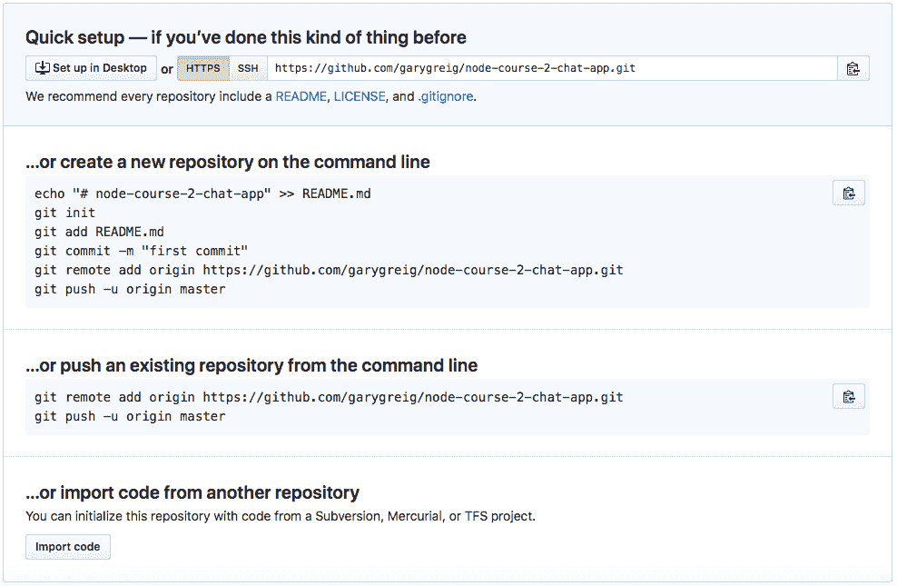

在终端中，在我们实际推送任何东西之前，我们需要进行提交。我会关闭`nodemon`并运行`git status`命令：

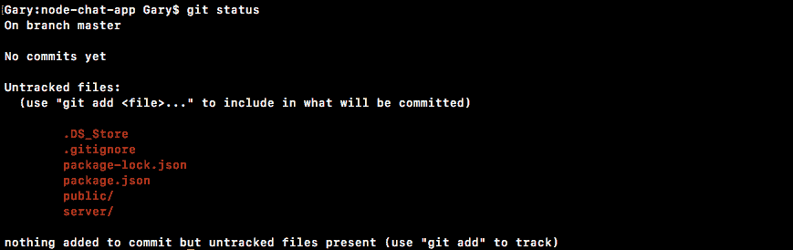

在这里，你可以看到我们有我们预期的文件，我们有`public`和`server`文件夹，我们有`.gitignore`，我们有`package.json`。然而，`node_modules`不见了。然后，你需要使用`git add .`将这些未跟踪的文件添加到下一个提交中。

如果你再次运行`git status`命令，你会看到一切看起来都很好：

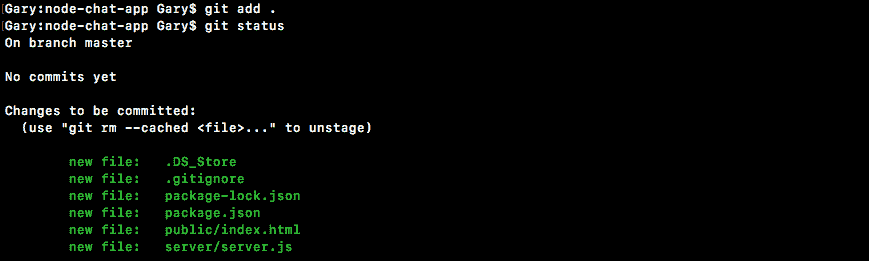

我们有四个要提交的更改：四个新文件。我会运行`git commit`并使用`-m`标志来指定消息。由于所有文件都已经添加，所以不需要`-a`标志。在引号中，`Init commit`就可以完成任务：

```js
git commit -m 'Init commit'
```

一旦你有了提交，你可以通过运行他们给你的两行将其推送到 GitHub。我会运行这两行：

```js
git remote add origin https://github.com/garygreig/node-course-2-chat-app.git 
git push -u origin master
```

如图所示，它现在已经在 GitHub 上了。我们可以通过刷新页面来确认，而不是看到说明，我们看到了我们创建的文件：

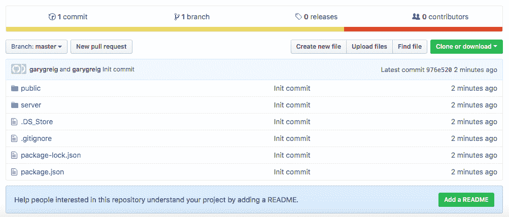

接下来要做的最后一件事是将应用程序放在 Heroku 上。实际上，你不需要去 Heroku 网站应用程序去完成这个；我们可以在终端内运行`heroku create`：

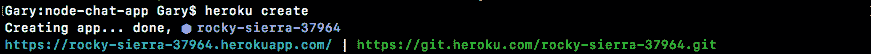

让我们继续创建应用程序。我们可以使用以下命令来部署应用程序。我将继续运行它：

```js
git push heroku master
```

这将把我的本地代码推送到 Heroku。Heroku 将看到新代码被推送，然后会部署它：

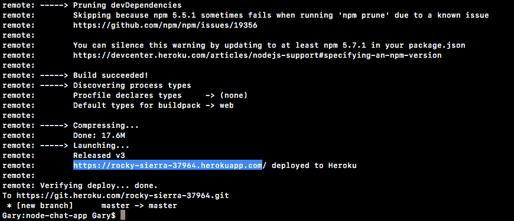

一旦它上线了，我们可以使用`heroku open`命令在浏览器上打开应用程序的 URL。或者，你也可以随时从终端获取 URL。我会复制在前面截图中显示的 URL，进入浏览器，然后粘贴它：

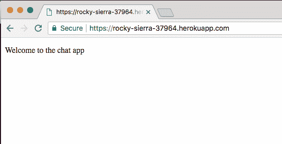

如前面的屏幕截图所示，我们应该看到我们的应用程序。欢迎使用聊天应用程序显示在屏幕上，有了这个，我们就完成了！我们有一个基本的 Express 服务器，我们有一个后端和一个前端，它已经在 GitHub 上，也已经在 Heroku 上了！

我们已经准备好进入下一节，我们将真正开始集成 Socket.io。

# 向应用程序添加 Socket.io

现在你已经有一个基本的 Express 应用程序在运行，在本节中，你将配置服务器以允许传入的 WebSocket 连接。这意味着服务器将能够接受连接，我们将设置客户端进行连接。然后，我们将有一个持久连接，我们可以来回发送数据，无论是从服务器到客户端的数据，还是从客户端到服务器的数据。这就是 WebSocket 的美妙之处——你可以在任何方向发送数据。

现在，为了设置 WebSockets，我们将使用一个名为 Socket.io 的库。就像 Express 使设置 HTTP 服务器变得非常容易一样，Socket.io 使设置支持 WebSockets 的服务器和创建与服务器通信的前端变得非常简单。Socket.io 有一个后端和前端库；我们将使用两者来设置 WebSockets。

# 设置 Socket.io

首先，在终端中，让我们继续安装最新版本的 Socket.io，使用`npm i`。模块名是`socket.io`，撰写时的最新版本是`@2.0.4`。我们将使用`--save` dev 标志来更新`package.json`文件：

```js
npm i socket.io@2.0.4 --save
```

一旦这个设置好了，我们可以继续对我们的`server`文件进行一些更改。首先，我们将加载库。我将创建一个叫做`socketIO`的常量，并将其设置为`socket.io`库的`require`语句：

```js
const path = require('path');
const express = require('express');
const socketIO = require('socket.io');
```

有了这个设置，我们现在需要将 Socket.io 集成到我们现有的 Web 服务器中。目前，我们使用 Express 来创建我们的 Web 服务器。我们创建一个新的 Express 应用程序，配置我们的中间件，并调用`app.listen`：

```js
var app = express();

app.use(express.static(publicPath));

app.listen(port, () => {
  console.log(`Server is up on ${port}`);
});
```

现在，在幕后，Express 实际上是在使用一个内置的 Node 模块叫做`http`来创建这个服务器。我们需要自己使用`http`。我们需要配置 Express 来与`http`一起工作。然后，只有这样，我们才能添加 Socket.io 支持。

# 使用 http 库创建服务器

首先，我们将加载`http`模块。所以，让我们创建一个叫做`http`的常量，这是一个内置的 Node 模块，所以不需要安装它。我们可以简单地输入`require('http')`，就像这样：

```js
const path = require('path');
const http = require('http');
const express = require('express');
const socketIO = require('socket.io');
```

从这里开始，我们将使用这个`http`库创建一个服务器。在我们的`app`变量下面，让我们创建一个叫做`server`的变量。我们将调用`http.createServer`：

```js
const path = require('path');
const http = require('http');
const express = require('express');
const socketIO = require('socket.io');

const publicPath = path.join(_dirname, '../public');
const port = process.env.PORT || 3000;
var app = express();
var server = http.createServer()
```

现在，你可能不知道，但实际上你已经在幕后使用`createServer`方法。当你在 Express 应用程序上调用`app.listen`时，它实际上调用了这个完全相同的方法，将应用程序作为`createServer`的参数传递。`createServer`方法接受一个函数。这个函数看起来非常类似于我们的 Express 回调之一，并且会被调用以请求和响应：

```js
var server = http.createServer((req, res) => {

})
```

现在，正如我所提到的，Express 实际上在幕后使用了`http`。它被集成得如此之深，以至于你实际上可以将`app`作为参数提供，然后我们就完成了：

```js
var server = http.createServer(app);
```

在集成 Socket.io 之前，让我们继续完成这个更改。我们将使用 HTTP 服务器而不是 Express 服务器，所以我们将调用`server.listen`而不是`app.listen`：

```js
server.listen(port, () => {
  console.log(`Server is up on ${port}`);
});
```

再次强调，不需要更改传递给`server.listen`方法的参数——它们完全相同，并且非常接近彼此，因此`server.listen`的参数与 Express 的`app.listen`的参数相同。

现在我们已经完成了这一步，我们实际上并没有改变任何应用程序功能。我们的服务器仍然会在端口`3000`上工作，但我们仍然无法访问 Socket.io。在终端中，我可以通过清除终端输出并使用`nodemon`命令启动我们的服务器来证明这一点：

```js
nodemon server/server.js
```

然后，我将在浏览器 URL 中加载`localhost:3000`，看看我得到了什么：

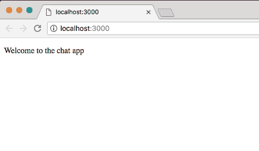

如前面的屏幕截图所示，我们得到了我们的 HTML，欢迎来到聊天应用程序。这意味着我们的应用程序仍然在工作，即使我们现在使用的是 HTTP 服务器。

# 配置服务器使用 Socket.io

接下来要做的事情是配置服务器使用 Socket.io——这就是我们进行这个更改的整个原因。在`server`变量旁边，我们将创建一个名为`io`的变量。

我们将它设置为调用`socket.io`并传入`server`，这是我们想要与我们的 WebSockets 一起使用的：

```js
var server = http.createServer(app);
var io = socketIO(server);
```

现在我们通过 `server` 变量可以访问服务器，所以我们将它作为第一个且唯一的参数传递进去。现在，我们得到的是我们的 WebSockets 服务器。在这里，我们可以做任何我们想做的事情，无论是发出还是监听事件。这就是我们将在服务器和客户端之间进行通信的方式，我们稍后会在本节中详细讨论。

有了这一切，我们的服务器已经准备就绪；我们已经准备好接受新的连接。问题是我们没有任何连接可以接受。当我们加载我们的网页时，我们什么也没做。我们实际上没有连接到服务器。我们需要手动运行一些 JavaScript 代码来启动连接过程。

现在，当我们将 Socket.io 与我们的服务器集成时，我们实际上获得了一些很酷的东西。首先，我们获得了一个接受传入连接的路由，这意味着我们现在可以接受 WebSocket 连接。此外，我们获得了一个 JavaScript 库，这使得在客户端上使用 Socket.io 变得非常容易。这个库可以在以下路径找到：`localhost:3000/socket.io/socket.io.js`。如果你在浏览器中加载这个 JavaScript 文件，你会发现它只是一个非常长的 JavaScript 库。

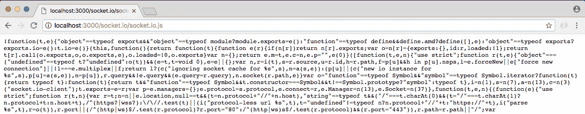

这包含了我们在客户端需要的所有代码，以建立连接和传输数据，无论是从服务器到客户端，还是从客户端到服务器。

为了从我们的 HTML 文件建立连接，我们将加载它。我将返回到 `localhost:3000`。现在，我们可以继续进入 Atom，打开 `index.html`，并在 `body` 标签的底部附近，添加一个 `script` 标签来加载我们刚刚在浏览器中打开的文件。

首先，我们将创建 `script` 标签本身，打开和关闭它，为了加载外部文件，我们将使用 `src` 属性来提供路径：

```js
<body>
  <p>Welcome to the chat app</p>

  <script src=""></script>
</body>
```

现在，这个路径是相对于我们的服务器的。它将是 `/socket.io/socket.io.js`，这正是我们之前在浏览器中输入的。

```js
<script src="img/socket.io.js"></script>
```

通过添加 `script` 标签，我们现在加载了这个库。在浏览器中，由于 `socket` 库的存在，我们可以访问各种可用的方法。其中一个方法将让我们发起连接请求，这正是我们将在下一行中做的。让我们添加第二个 `script` 标签。这一次，我们不是加载外部脚本，而是直接在这一行中编写一些 JavaScript：

```js
<script src="img/socket.io.js"></script>
<script>

</script>
```

我们可以添加任何我们喜欢的 JavaScript，这个 JavaScript 将在 Socket.io 库加载后立即运行。稍后，我们将把它拆分成自己的文件，但目前，我们可以简单地将我们的 JavaScript 代码放在 HTML 文件中。我们将调用 `io`：

```js
<script src="img/socket.io.js"></script>
<script>
  io();
</script>
```

`io` 是一个可用的方法，因为我们加载了这个库。它不是浏览器的原生方法，当我们调用它时，实际上是在发起请求。我们从客户端向服务器发出请求，打开一个 WebSocket 并保持连接。现在，我们从 `io` 得到的东西非常重要；我们将把它保存在一个叫做 `socket` 的变量中，就像这样：

```js
<script src="img/socket.io.js"></script>
<script>
  var socket = io();
</script>
```

这创建了我们的连接并将 socket 存储在一个变量中。这个变量对于通信至关重要；这正是我们需要的，以便监听来自服务器的数据并向服务器发送数据。现在我们已经做好了这一切，让我们继续保存我们的 HTML 文件。我们将进入浏览器并打开 Chrome 开发者工具。

无论你使用什么浏览器，无论是 IE、Safari、Firefox 还是 Chrome，你都可以访问一组开发者工具，这使得在你的网页背后轻松调试和查看发生的事情。我们将在这里使用 Chrome 开发者工具进行一些调试，我强烈建议在课程中使用 Chrome，这样你可以完全跟上。

要打开开发者工具，我们转到设置|更多工具|开发者工具。您也可以使用特定于您的操作系统的键盘快捷键。打开开发者工具后，您将看到一个令人震惊的选项集，如下所示：

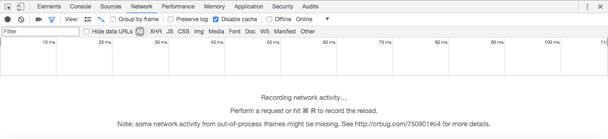

如果您以前从未使用过 Chrome 开发者工具，您很可能会被带到元素面板。我们现在要使用的面板是网络面板。

网络面板跟踪您的网页发出的所有请求。因此，如果我请求 JavaScript 文件，我将在一个漂亮的列表中看到它，就像前面的屏幕截图所示的那样。

我们将不得不刷新页面才能看到网络请求列表；在这里，我们有五个：

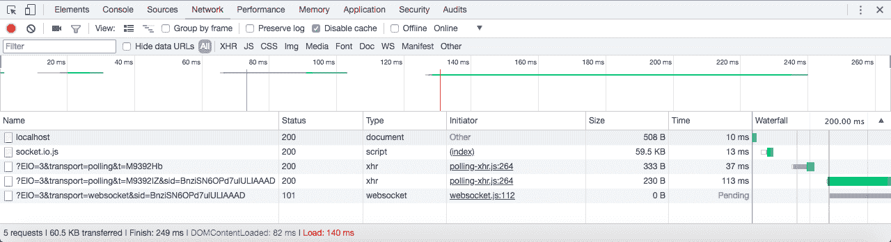

顶部的网络请求是第一个发出的请求，底部的是最后一个发出的请求。第一个是`localhost:3000`页面的请求，用于加载`欢迎来到聊天应用`的 HTML 文件。第二个是我们在浏览器上看到的 JavaScript 文件的请求，它为我们提供了库，并让我们调用启动连接过程的`io`方法。接下来的四个都与启动和维护该连接有关。有了这个，我们现在在客户端和服务器之间有了实时连接，我们可以开始传达任何我们想要传达的内容。

# 客户端和服务器之间的通信

现在，通信可以是任何东西。在这种情况下，它以事件的形式出现。事件可以从客户端和服务器发出，并且客户端和服务器都可以监听事件。让我们来谈谈在电子邮件应用中可能发生的事件。

在电子邮件应用中，当新邮件到达时，服务器可能会发出一个名为`newEmail`的事件。然后客户端将监听该事件。当它触发时，它将获取`newEmail`数据并将邮件呈现在其他邮件下方的屏幕上。同样的事情也可能发生在另一个方向上：也许客户端想要创建一封新的电子邮件并将其发送给其他人。它将要求输入收件人的电子邮件地址和消息的内容，然后将在客户端上发出一个事件，服务器将监听该事件。因此，整个服务器/客户端关系完全通过这些事件来运行。

现在，我们将在本章中为我们的特定应用程序创建自定义事件；但现在，我们将看一下一些默认内置事件，让您可以跟踪新用户和断开连接的用户。这意味着我们将能够做一些像在用户加入我们的应用程序时问候用户的事情。

# io.on 方法

为了在 Atom 中玩耍，我们将在`server.js`中调用`io`上的一个方法，称为`io.on`：

```js
app.use(express.static(publicPath));

io.on();
```

`io.on`方法允许您注册事件侦听器。我们可以监听特定事件，并在该事件发生时执行某些操作。我们将要使用的一个内置事件是最受欢迎的，称为`connection`。这使您可以监听客户端与服务器的新连接，并在该连接到来时执行某些操作。为了执行某些操作，您需要提供一个回调函数作为第二个参数，这个回调函数将使用`socket`被调用：

```js
io.on('connection', (socket) => {

});
```

这个`socket`参数与我们在`index.html`文件中访问的`socket`参数非常相似。这代表了单个 socket，而不是连接到服务器的所有用户。现在，有了这个，我们可以做任何我们想做的事情。例如，我可以使用`console.log`打印一条消息，比如`新用户已连接`：

```js
io.on('connection', (socket) => {
  console.log('New user connected');
});
```

每当用户连接到我们的应用时，我们将在控制台上打印一条消息。我将保存`server.js`文件，进入终端，您将看到消息实际上已经存在：

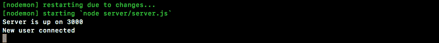

为了解释原因，我们需要了解有关 WebSockets 的一件事。正如我提到的，WebSockets 是一种持久技术，这意味着客户端和服务器都会保持通信渠道打开，只要它们中的任何一个希望保持打开。如果服务器关闭，客户端实际上没有选择，反之亦然。如果我关闭浏览器选项卡，服务器无法强迫我保持连接打开。

现在，当连接断开客户端时，它仍会尝试重新连接。当我们使用`nodemon`重新启动服务器时，大约有四分之一秒的时间服务器是关闭的，客户端会注意到这一点。它会说，“哇，哇，哇！服务器宕机了！让我们尝试重新连接！”最终它会重新连接，这就是为什么我们会看到消息`New user connected`。

继续关闭服务器，在客户端内部，您将看到网络请求正在 Chrome 开发者工具中进行：

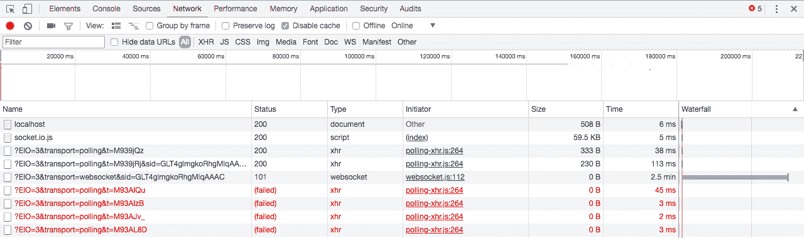

他们正在尝试重新连接到服务器，您可以看到他们失败了，因为服务器没有启动。现在，回到终端，像这样重新启动服务器：

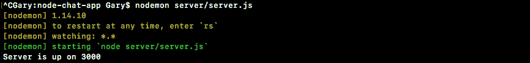

在客户端内部，我们将尝试再次重新连接。我们将从服务器获得成功的结果，然后我们就回来了！就像这样：

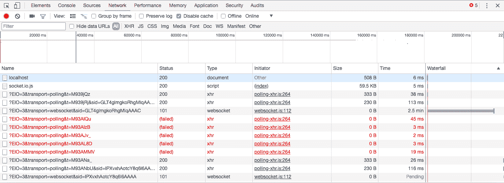

现在，当我们重新连接时，您可以看到我们再次收到了消息，这就是我们第一次将其添加到`server.js`文件时看到它的原因。

# 在客户端添加连接事件

现在，连接事件也存在于客户端。这意味着在客户端，当我们成功连接到服务器时，我们可以执行一些操作。它可能不会立即发生；可能需要一点时间。在 Atom 内部，我们可以在`index.html`中添加此事件，就在我们对`io`的调用下面。如图所示，我们将调用`socket.on`：

```js
var socket = io();

socket.on
```

我们想要监听一个事件，这个事件与我们在`server.js`文件中的事件有些不同。它不是`on('connection')`，而是`on('connect')`：

```js
var socket = io();

socket.on('connect');
```

这里的`on`方法与我们在`server.js`中使用的方法完全相同。第一个参数是事件名称，第二个参数是回调函数。在这种情况下，我们不会获得`socket`参数的访问权限，因为我们已经将其作为`socket`变量。

在这种情况下，我要做的就是使用`console.log`在控制台中打印一条小消息，`Connected to server`：

```js
socket.on('connect', () => {
  console.log('Connected to server');
});
```

既然我们已经做到了这一点，我们可以进入浏览器并转到开发者工具中的新选项卡。我们将加载控制台选项卡。控制台选项卡有点像 Node 内部的终端。如果我们在客户端 JavaScript 代码中使用`console.log`，这些消息将显示在那里。正如您在前面的屏幕截图中所看到的，我们还有一些错误。这些错误发生在我们的服务器关闭时，我正在向您展示它是如何重新连接的；但是如果我们刷新页面，正如您将看到的，`Connected to server`会显示出来，如下所示：

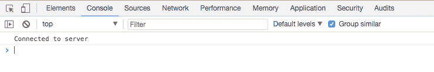

一旦连接发生，客户端和服务器都会触发该事件。客户端打印`Connected to server`，服务器打印`New user connected`。

有了这个设置，我们现在已经在 Socket.io 中使用了事件系统。我们还没有设置自己的自定义事件，但我们已经利用了一些内置事件。

# 断开连接事件

在本节中我们要讨论的最后一件事是`disconnect`事件，它允许您在连接断开时在服务器和客户端上执行某些操作。我们将在客户端上添加一个事件侦听器，并在服务器上执行相同的操作。

在客户端，紧挨着我们的`connect`事件，我们可以再次调用`socket.on`来监听一个新事件。再次强调，这里的事件名称是一个内置事件的名称，所以只有在您正确输入时才会起作用。这个事件叫做`disconnect`：

```js
socket.on('disconnect');
```

`disconnect`事件将在连接断开时触发。如果服务器宕机，客户端将能够执行某些操作。目前，这个操作只是记录一条消息，`console.log('与服务器断开连接')`：

```js
socket.on('disconnect', () => {
  console.log('Disconnected from server');
});
```

现在我们已经有了这条消息，我们可以保存我们的`index.html`文件。转到浏览器并刷新以加载我们的新 JavaScript 文件。继续让你的浏览器屏幕小一点，这样我们可以在终端的背景中看到它。

我将转到终端，通过关闭服务器关闭连接，在浏览器内，我们得到`与服务器断开连接`打印到屏幕上：

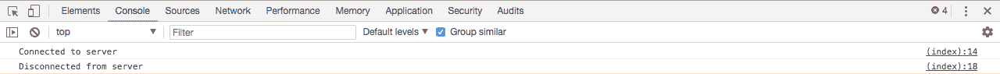

如果我在终端内重新启动服务器，你可以看到我们已经自动连接，因为`连接到服务器`打印到屏幕上：

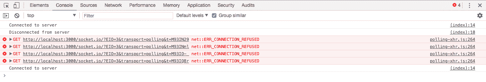

现在，服务器上也存在完全相同的事件。我们可以监听断开连接的客户端，并在他们离开时执行某些操作。为了注册这个事件，你需要进入`server.js`，在我们的回调内，你需要像在`index.html`文件中一样调用`socket.on`在`server.js`内。它的签名完全相同。第一个参数是事件名称，`disconnect`。回调函数应该做一些简单的事情，比如打印`客户端断开连接`。

一旦你做到了这一点，我希望你打开浏览器并打开终端，然后关闭浏览器标签。你应该看到消息在服务器上打印出来——无论你在这里输入了什么消息。打开另一个浏览器标签，关闭它，并确保你得到相同的消息。假设浏览器标签有一个打开的连接，每次关闭一个浏览器标签时，这条消息都应该打印出来。

现在，要做到这一点，你只需要复制`io.on`方法中使用的完全相同的签名。`socket.on`接受两个参数：第一个是我们要监听的事件名称，`disconnect`；第二个参数是事件触发时要运行的函数：

```js
socket.on('disconnect', () => {

});
```

在这种情况下，我们要做的只是使用`console.log`打印`用户已断开连接`，就像这样：

```js
socket.on('disconnect', () => {
  console.log('User was disconnected');
});
```

然后，我们将保存文件，这将自动重新启动我们的应用程序。切换到终端，然后切换到浏览器，这样你就可以看到后台的终端。我将打开一个新标签，这样当我关闭当前打开的标签时，Chrome 浏览器不会完全关闭。关闭具有打开连接的标签，并且如下截图所示，在终端内，我们得到`用户已断开连接`：

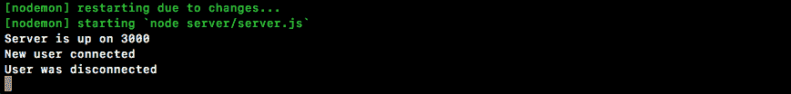

如果我打开一个新标签并转到`localhost:3000`，那么将打印`新用户已连接`。一旦我关闭它，服务器屏幕上将打印`用户已断开连接`。希望你开始看到为什么 WebSockets 如此强大——即时的双向通信使任何实时应用程序都变得轻而易举。

现在，让我们用一个提交来结束这一切。我将关闭我们的服务器并运行`git status`。我们可以看到我们只有修改过的文件：

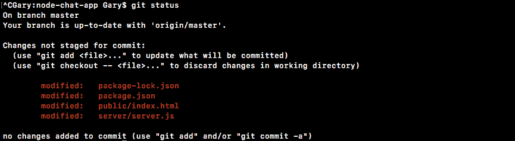

所以，使用`git commit`和`-am`标志将完成工作。我们可以添加我们的消息，`添加连接和断开事件处理程序`：

```js
git commit -am 'Add connect and disconnect event handlers'
```

我将提交并使用`git push`命令将其推送到 GitHub。

有了这个，我们就完成了。在下一节中，我们将进入非常有趣的内容——你将学会如何发出和监听自定义事件。这意味着你可以从服务器向客户端发送任何你喜欢的数据，反之亦然。

# 发出和监听自定义事件

在前一节中，你学会了如何监听那些内置事件——诸如连接事件和断开连接事件。这些都很好，是一个很好的起点，但在这一节中，我们想要讨论的是发出和监听自定义事件，这就是 Socket.io 变得非常有趣的地方。

当你能够发出和监听自定义事件时，你可以从服务器向客户端发送任何你想要的东西，或者从客户端向服务器发送任何你想要的东西。现在，让我们快速看一下这将是什么样子的一个例子，我们将使用一个示例应用程序，这将是一个电子邮件应用程序：

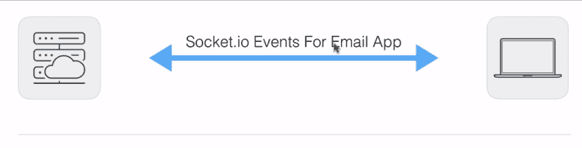

在左边，我们有我们的服务器，它正在启动一个 Socket.io web 服务器。在右边，我们有我们的电子邮件应用程序，它显示了我们所有当前电子邮件的列表。现在，我们的应用可能需要的一个自定义事件是`newEmail`事件：

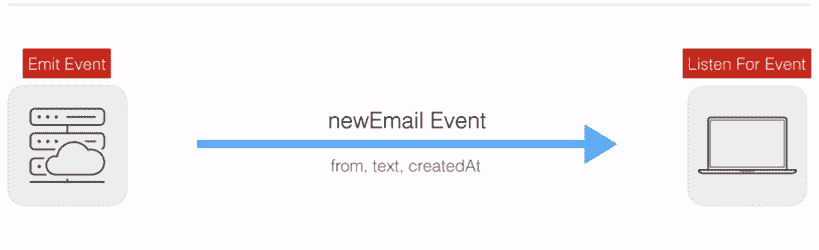

当有电子邮件到达时，服务器将发出`newEmail`事件。例如，如果我注册了一个新服务，该服务会发送一封电子邮件给我确认我的电子邮件。然后，服务器最终收到了那封电子邮件，并发出了一个客户端监听的事件。客户端将监听`newEmail`事件，并能够使用 jQuery、React、Ember 或者任何它正在使用的库重新渲染浏览器中的电子邮件列表，向我展示新的电子邮件。

除了只发送事件发生的消息之外，最重要的是发送数据，我们实际上可以做到这一点。当你创建并发出自定义事件时，你可以从服务器向客户端发送任何你喜欢的信息，或者从客户端向服务器发送任何你喜欢的信息。通常，这采用一个具有各种属性的对象的形式。在获取新电子邮件的情况下，我可能想知道电子邮件是谁发来的。我肯定需要知道电子邮件的文本，我还想知道电子邮件何时到达我的服务器，这样我就可以在浏览器中为使用电子邮件应用程序的人渲染所需的内容。

现在，这是从服务器流向客户端的数据，这是我们无法通过 HTTP 请求实现的，但使用 Socket.io 是可以实现的。现在，另一个事件，`createEmail`事件，将从客户端流向服务器：

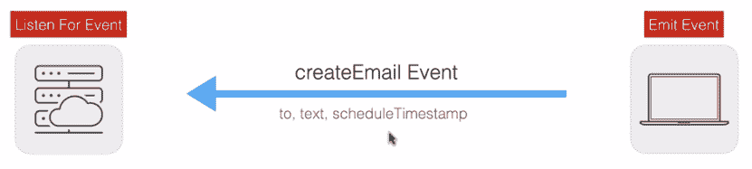

当我在网页浏览器中创建一个新的电子邮件时，我需要从客户端发出该事件，服务器将监听该事件。再次，我们将发送一些数据。虽然数据会有所不同，但我们想知道电子邮件需要发送给谁，我们需要电子邮件的文本，也许我们想要安排它在未来的某个时间发送，所以可以使用`scheduleTimestamp`字段。

显然，这些只是示例字段；你真正的电子邮件应用程序的字段可能会有所不同。不过，有了这个，我们已经准备好在我们的应用程序中实际创建这两个事件了。

# 在应用程序中创建自定义事件

让我们开始在我们的应用程序中创建自定义事件，首先创建`newEmail`和`createEmail`事件。在我们开始发出或监听自定义事件之前，让我们对我们的客户端 JavaScript 进行一些调整。

# 将 JavaScript 移到一个单独的文件中

正如你在上一节中可能已经注意到的，我在我们的客户端 JavaScript 代码中意外地使用了 ES6 箭头函数。正如我提到的，我们要避免这样做；项目将在 Chrome 中正确工作，但如果你尝试在手机、Internet Explorer、Safari 或某些版本的 Firefox 上加载它，程序将崩溃。因此，我们将使用常规函数来代替箭头函数，即删除箭头并在参数之前添加`function`关键字。我将对`on('connect'`监听器和`on('disconnect'`监听器进行此操作，添加`function`关键字并删除箭头：

```js
socket.on('connect', function () {
  console.log('Connected to server');
});

socket.on('disconnect', function () {
  console.log('Disconnected from server');
});
```

我还将把我们的 JavaScript 移动到一个单独的文件中。不再直接在我们的 HTML 文件中编辑客户端 JavaScript，而是有一个单独的文件来存放那些代码。这是一个更好的方法来完成事情。

在`public`文件夹中，我们可以为这个 JavaScript 文件创建一个新文件夹。我会创建一个叫做`js`的文件夹（当这个应用程序结束时，我们将有多个 JavaScript 文件，所以创建一个文件夹来存放所有这些文件是一个好主意）。不过，现在我们只需要一个`index.js`。`index.js`文件将在加载`index.html`时加载，并且它将包含所有所需的 JavaScript 代码，从我们在上一节中编写的 JavaScript 开始。剪切`script`标签中的所有代码，并将其粘贴到`index.js`中：

```js
var socket = io();

socket.on('connect', function () {
  console.log('Connected to server');
});

socket.on('disconnect', function () {
  console.log('Disconnected from server');
});
```

我们可以保存文件并更新我们的`script`标签。不再将代码放在一行中，而是通过提供`src`属性加载它，路径为`/js/index.js`：

```js
  <script src="img/socket.io.js"></script>
  <script src="img/index.js"></script>
</body>
```

现在我们已经有了这个，我们有了与之前完全相同的功能——只是这一次，JavaScript 已经被拆分成了自己的文件。使用`nodemon server/server.js`启动服务器。一旦启动，我们可以通过浏览器打开`localhost:3000`来加载应用程序。我也会打开开发者工具，这样我们就可以确保一切都按预期工作。在控制台中，我们看到`Connected to server`仍在打印：

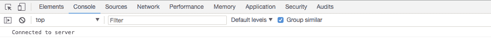

这是存在于`index.js`中的代码，它出现在这里的事实证明文件已经被加载。有了这个，我们现在可以继续进行自定义事件。

现在，我们为我们的示例电子邮件应用程序讨论了两个事件：我们有`newEmail`，它是从服务器到客户端的；我们还有`createEmail`，它是客户端发出并由服务器监听的事件。我们将从`newEmail`开始，为了启动这些事情，我们将进入我们的客户端 JavaScript 并监听该事件。

当该事件触发时，我们想要做一些事情：我们想要获取数据并使用 jQuery、React 或其他一些前端框架将其呈现到浏览器中，以便用户可以在收到电子邮件时立即看到它。

# 添加一个 newEmail 自定义事件

现在，为了监听自定义事件，我们仍然将使用`socket.on`；不过，我们不再指定内置事件的名称，而是提供引号内的第一个参数作为我们自定义事件的名称。在这种情况下，该名称将是`newEmail`：

```js
socket.on('newEmail');
```

现在，`socket.on`的第二个参数与内置事件监听器的第二个参数相同。我们将提供一个函数，当事件触发时，这个函数将被调用：

```js
socket.on('newEmail', function () {

});
```

现在，我们在函数内部要做的就是使用`console.log`打印一条消息，`New email`：

```js
socket.on('newEmail', function () {
  console.log('New email');
});
```

每当客户端听到这个事件传过来时，这将在 Web 开发者控制台中打印出来。现在我们已经为`newEmail`设置了监听器，让我们继续在`server.js`中发出这个事件。

# emit 方法

在`server.js`中，我们要做的是在`socket`上调用一个方法。`socket`方法有一个叫做`emit`的方法，我们将在客户端和服务器上都使用它来发出事件：

```js
io.on('connection', (socket) => {
  console.log('New user connected');

  socket.emit('');
});
```

`emit`方法与监听器非常相似；不过，与监听事件不同，我们是创建事件。第一个参数是相同的。它将是您要发出的事件的名称。在这种情况下，我们必须与我们在`index.js`中指定的完全匹配，即`newEmail`。现在，如下面的代码所示，我们将提供`newEmail`：

```js
io.on('connection', (socket) => {
  console.log('New user connected');

  socket.emit('newEmail');
});
```

现在，这不是一个监听器，所以我们不会提供回调函数。我们要做的是指定数据。现在，默认情况下，我们不必指定任何数据；也许我们只是想发出`newEmail`而没有任何内容，让浏览器知道发生了某事。如果我们这样做，在浏览器中刷新应用程序，我们会得到`New email`，如下面的屏幕截图所示：

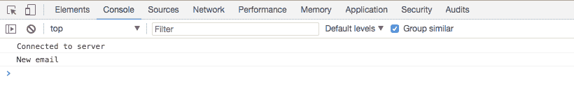

即使我们没有发送任何自定义数据，事件仍在发生。如果您确实想发送自定义数据，这很可能是情况，那很容易。您只需为`newEmail`提供第二个参数。现在，您可以提供三个、true 或其他任何参数，但通常您希望发送多个数据，因此对象将成为您的第二个参数：

```js
socket.emit('newEmail', {

});
```

这将让您指定任何您喜欢的内容。在我们的情况下，我们可能通过指定`from`属性来指定电子邮件的发件人；例如，它来自`mike@example.com`。也许我们还有电子邮件的`text`属性，`嘿。发生了什么`，我们可能还有其他属性。例如，`createdAt`可以是服务器收到电子邮件的时间戳，如下所示：

```js
socket.emit('newEmail', {
  from: 'mike@example.com',
  text: 'Hey. What is going on.',
  createdAt: 123
});
```

在服务器和客户端之间，前面代码块中显示的数据将随着`newEmail`事件一起从服务器发送到客户端。现在，保存`server.js`，在我们的客户端 JavaScript `index.js`文件中，我们可以对该数据进行操作。与您的事件一起发出的数据将作为回调函数的第一个参数提供。如下面的代码所示，我们有`newEmail`的回调函数，这意味着我们可以将第一个参数命名为`email`并对其进行任何操作：

```js
socket.on('newEmail', function (email) {
  console.log('New email');
});
```

我们可能会将其附加到真实网络应用程序中的电子邮件列表中，但就我们的目的而言，我们现在要做的就是将其作为`console.log`的第二个参数提供，将其呈现到屏幕上：

```js
socket.on('newEmail', function (email) {
  console.log('New email', email);
});
```

有了这个，我们现在可以测试一切是否按预期工作。

# 测试 newEmail 事件

如果我去浏览器，使用*command* +* R*进行刷新，我们在控制台中看到`New email`，在这之下我们有`Object`。我们可以点击`Object`来展开它，然后我们可以看到我们指定的所有属性：

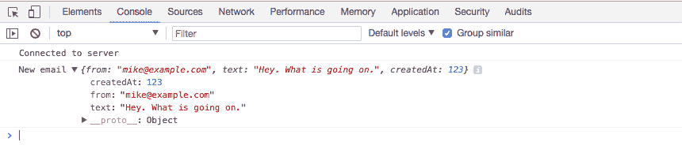

我们有我们的`from`属性，`text`属性和我们的`createdAt`属性。所有这些都如预期般显示，这太棒了！实时地，我们能够将事件和事件数据从服务器传递到客户端，这是我们无法通过 HTTP API 实现的。

# 添加一个 createEmail 自定义事件

另一方面，我们有一个情况，我们希望从客户端发出事件，尝试向服务器发送一些数据。这是我们的`createEmail`事件。在这种情况下，我们将在`server.js`中使用`socket.on`添加我们的事件监听器，就像我们为任何其他事件监听器所做的那样，就像我们在`server.js`中所做的那样。

我们用于连接事件的`io.on`方法是一个非常特殊的事件；通常您不会将任何内容附加到`io`，也不会调用`io.on`或`io.emit`，除了我们在此函数中提到的内容。我们的自定义事件监听器将在以下语句中发生，通过调用`socket.on`来实现，就像我们为`disconnect`所做的那样，传递您要监听的事件的名称——在本例中是`createEmail`事件：

```js
socket.emit('newEmail', {
  from: 'mike@example.com',
  text: 'Hey. What is going on.',
  createdAt: 123
});

socket.on('createEmail');
```

现在，对于`createEmail`，我们确实想要添加一个监听器。我们在我们的 Node 代码中，所以我们可以使用箭头函数：

```js
socket.on('createEmail', () => {

});
```

我们可能期望一些数据，比如要创建的电子邮件，所以我们可以命名第一个参数。我们根据事件发送的数据命名它，所以我将称其为`newEmail`。对于这个示例，我们将只是将其打印到控制台，以便我们可以确保事件从客户端正确地传递到服务器。我将添加`console.log`并记录事件名称`createEmail`。作为第二个参数，我将记录数据，以便我可以在终端中查看它，并确保一切按预期工作：

```js
socket.on('createEmail', (newEmail) => {
  console.log('createEmail', newEmail);
});
```

现在我们已经放置了我们的监听器，并且我们的服务器已经重新启动；但是，我们实际上从未在客户端发出事件。我们可以通过在`index.js`中调用`socket.emit`来解决这个问题。现在，在我们的`connect`回调函数中调用它。我们不希望在连接之前发出事件，`socket.emit`将让我们做到这一点。我们可以调用`socket.emit`来发出事件。

事件名称是`createEmail`：

```js
socket.on('connect', function () {
  console.log('Connected to server');

  socket.emit('createEmail');
});
```

然后，我们可以将任何我们喜欢的数据作为第二个参数传递。在电子邮件应用程序的情况下，我们可能需要将其发送给某人，因此我们将为此提供一个地址——类似于`jen@example.com`。显然，我们需要一些文本——类似于`嘿。我是安德鲁`。此外，我们可能还有其他属性，比如主题，但现在我们将只使用这两个：

```js
socket.emit('createEmail', {
  to: 'jen@example.com',
  text: 'Hey. This is Andrew.'
})
```

所以，我们在这里所做的是创建一个客户端脚本，将其连接到服务器，一旦连接，就会触发这个`createEmail`事件。

现在，这不是一个现实的例子。在真实世界的应用程序中，用户很可能会填写表单。您将从表单中获取先前提到的数据片段，然后发出事件。稍后我们将稍微处理 HTML 表单；不过，现在我们只是调用`socket.emit`来玩这些自定义事件。

保存`index.js`，在浏览器中，我们现在可以刷新页面。一旦连接，它将触发该事件：

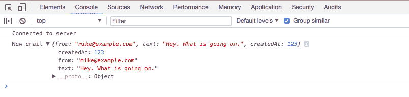

在终端中，您会看到`createEmail`打印：

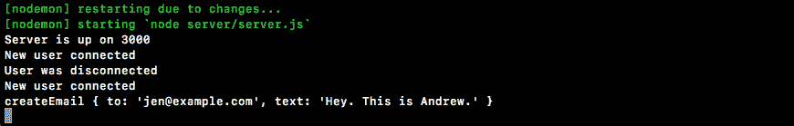

事件是从客户端发出到服务器。服务器收到了数据，一切都很好。

# 开发者控制台中的 socket.emit

现在，控制台的另一个很酷的功能是，我们可以访问应用程序创建的变量；最重要的是 socket 变量。这意味着在 Google Chrome 中，在开发者控制台中，我们可以调用`socket.emit`，并发出我们喜欢的任何内容。

我可以发出一个动作，`createEmail`，并且我可以将一些数据作为第二个参数传递，一个对象，其中我有一个等于`julie@example.com`的 to 属性。我还有其他属性——类似于`text`，我可以将其设置为`Hey`：

```js
socket.emit('createEmail', {to: 'julie@example.com', text: 'Hey'});
```

这是一个示例，说明我们如何使用开发者控制台使调试应用程序变得更加容易。我们可以输入一个语句，按*enter*，它将继续发出事件：

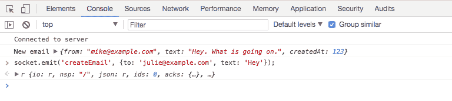

在终端中，我们将得到该事件并对其进行处理——无论是创建电子邮件还是执行其他任何我们可能需要的操作。在终端中，您可以看到`createEmail`出现了。我们将把它发送给朱莉，然后有文本`Hey`。所有这些都从客户端到服务器了：

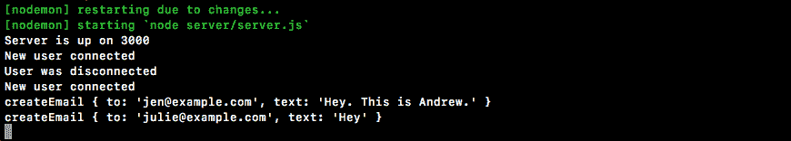

现在我们已经做好了这一切，并且已经玩过了如何使用这些自定义事件，是时候从电子邮件应用程序转移到我们将要构建的实际应用程序了：*聊天应用*。

# 聊天应用中的自定义事件

现在你知道如何触发和监听自定义事件，我们将继续创建两个在聊天应用中实际使用的事件。这些将是`newMessage`和`createMessage`：

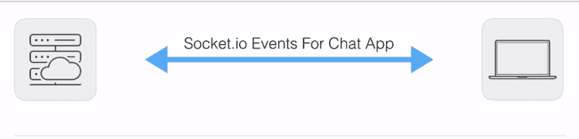

现在，对于聊天应用程序，我们再次有我们的服务器，这将是我们构建的服务器；还有我们的客户端，这将是在聊天应用程序中的用户。很可能会有多个用户都想互相交流。

现在，我们将要处理的第一个事件是`newMessage`事件。这将由服务器发出，并在客户端上进行监听：

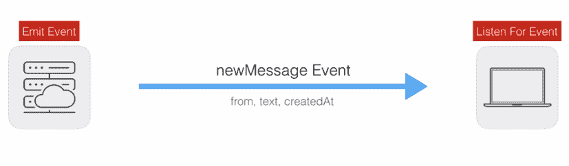

当有新消息进来时，服务器会将其发送给连接到聊天室的所有人，这样他们就可以在屏幕上显示出来，用户可以继续回复。`newMessage`事件将需要一些数据。我们需要知道消息是谁发出的；一个人名的字符串，比如`Andrew`，消息的文本，比如`嘿，你能六点见面吗`，还有一个`createdAt`时间戳。

所有这些数据都将在我们的聊天应用程序中在浏览器中呈现。我们马上就要真正做到这一点，但现在我们只是将其打印到控制台。所以，这是我要你创建的第一个事件。你将创建这个`newMessage`事件，从服务器发出它——现在，当用户连接时，你可以简单地发出它——并在客户端上进行监听。现在，在客户端上，当你收到数据时，你可以用`console.log`打印一条消息。你可以说一些像`收到新消息`的话，打印传递的对象。

接下来，我们要处理的第二个事件是`createMessage`。这将从客户端发送到服务器。所以如果我是用户 1，我将从浏览器中触发一个`createMessage`事件。这将发送到服务器，服务器将向其他人发出`newMessage`事件，这样他们就可以看到我的消息，这意味着`createMessage`事件将从客户端发出，服务器将监听该事件：

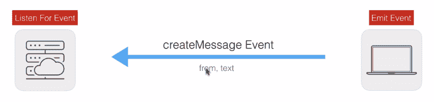

现在，这个事件将需要一些数据。我们需要知道消息是谁发出的，还有文本：他们想说什么？我们需要这两个信息。

现在，请注意这里的一个不一致之处：我们将`from`、`text`和`createdAt`属性发送到客户端，但当他们创建消息时，我们并没有要求客户端提供`createdAt`属性。这个`createdAt`属性实际上将在服务器上创建。这将防止用户能够伪造消息创建的时间。有一些属性我们将信任用户提供给我们；还有一些我们将不信任他们提供给我们，其中之一将是`createdAt`。

现在，对于`createMessage`，你所要做的就是在服务器上设置一个事件监听器，等待它触发，然后，你可以再次简单地打印一条消息，例如`创建消息`，然后你可以提供传递给`console.log`的数据，将其打印到终端上。现在，一旦你放置了监听器，你将想要发出它。你可以在用户首次连接时发出它，你还可以从 Chrome 开发者工具中发出一些`socket.emit`调用，确保所有的消息都显示在终端上，监听`createMessage`事件。

我们将从`server.js`开始，通过监听`createMessage`事件来进行处理，这将发生在`server.js`中`socket.emit`函数的下面。现在，我们有一个来自`createEmail`的旧事件监听器；我们可以删除它，并调用`socket.on`来监听我们全新的事件`createMessage`：

```js
socket.on('createMessage');
```

`createMessage`事件将需要一个在事件实际发生时调用的函数。我们将想要对消息数据进行一些处理：

```js
socket.on('createMessage', () => {

});
```

目前，你只需要使用`console.log`将其打印到终端，以便我们可以验证一切是否按预期工作。我们将得到我们的消息数据，其中包括`from`属性和`text`属性，并将其打印到屏幕上。你不必指定我使用的确切消息；我只会说`createMessage`，第二个参数将是从客户端传递到服务器的数据：

```js
socket.on('createMessage', (message) => {
  console.log('createMessage', message);
});
```

现在我们已经准备好了监听器，我们可以在`index.js`中的客户端发出这个事件。现在，我们目前有一个发出`createEmail`事件的调用。我将删除这个`emit`调用。我们将首先调用`socket.emit`，然后调用`emit('createMessage')`：

```js
socket.on('connect', function () {
  console.log('Connected to server');

  socket.emit('createMessage');
});
```

接下来，我们将使用必要的数据发出`createMessage`。

记住，当你发出自定义事件时，第一个参数是事件名称，第二个是数据。

对于数据，我们将提供一个带有两个属性的对象：`from`，这个是`Andrew`；和`text`，这是消息的实际文本，可能是`是的，对我来说没问题`：

```js
socket.emit('createMessage', {
  from: 'Andrew',
  text: 'Yup, that works for me.'
});
```

这将是我们发出的事件。我将保存`index.js`，转到浏览器，我们应该能够刷新应用程序并在终端中看到数据：

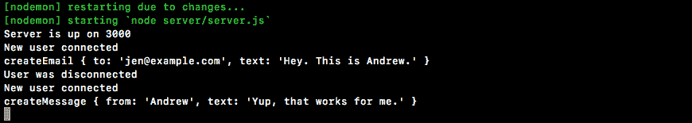

如前面的截图所示，在终端中，我们有`createMessage`和我们指定的`from`属性，以及文本`是的，对我来说没问题`。

现在，我们还可以从 Chrome 开发者工具中发出事件，以便使用 Socket.io 进行调试。我们可以添加`socket.emit`，并且可以发出任何我们喜欢的事件，传入一些数据：

```js
socket.emit('createMessage', {from: 'Jen', text: 'Nope'});
```

我们将发出的事件是`createMessage`，数据是一个`from`属性；这个是`Jen`，和一个文本属性，`Nope`：

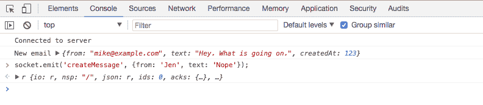

当我发送这条消息时，消息会实时显示在服务器上，如下截图所示，你可以看到它来自`Jen`，文本是`Nope`，一切都按预期工作：

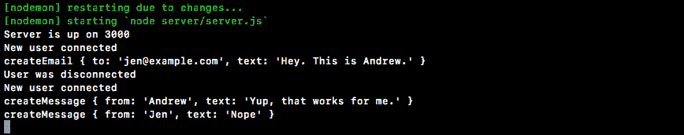

现在，这是第一个事件；另一个是`newMessage`事件，将由服务器发出并由客户端监听。

# 新消息事件

要开始这个，我们将在`index.js`中添加我们的事件监听器。我们有旧的`newEmail`事件监听器。我将继续删除它，然后我们将调用`socket.on`来监听新事件`newMessage`。`newMessage`事件将需要一个回调函数：

```js
socket.on('newMessage', function () {

});
```

目前，我们将使用`console.log`将消息打印到控制台，但稍后，我们将获取这条消息并将其添加到浏览器中，以便用户实际上可以在屏幕上看到它。现在，我们将获取消息数据。我将暂时创建一个名为`message`的参数，然后我们可以简单地使用`console.log`将其打印到屏幕上，打印事件的名称，以便在终端中易于跟踪，以及从服务器传递到客户端的实际数据：

```js
socket.on('newMessage', function (message) {
  console.log('newMessage', message);
});
```

现在，我们唯一需要做的是简单地从服务器发出`newMessage`，确保它显示在客户端。在`server.js`中，我们将调用`socket.emit`，发出我们的自定义事件`newMessage`，而不是发出`newEmail`：

```js
io.on('connection', (socket) => {
  console.log('New user connected');

  socket.emit('newMessage');
});
```

现在，我们需要一些数据——那条消息的数据。我们也将作为第二个参数提供。它将是一个带有`from`属性的对象。它可以来自任何人；我会选择`John`：

```js
socket.emit('newMessage', {
  from: 'John',
});
```

接下来，我们将提供`text`属性。这也可以是任何东西，比如`再见`，最后我们将提供`createdAt`属性。这将稍后由服务器生成，以便用户无法伪造消息创建的时间，但现在，我们将只使用某种随机数，比如`123123`：

```js
socket.emit('newMessage', {
  from: 'John',
  text: 'See you then',
  createdAt: 123123
});
```

现在，一旦用户连接到服务器，我们将发出该事件。在浏览器中，我可以继续刷新。我们的`newMessage`事件显示出来，数据与我们在`server.js`文件中指定的完全一样：

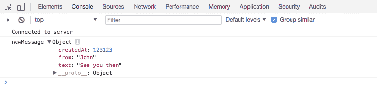

我们有我们的`createdAt`时间戳，我们的`from`属性和我们的`text`属性。将来，我们将直接将这些数据渲染到浏览器中，以便显示出来，某人可以阅读并回复，但现在我们已经完成了。我们在服务器上为`createMessage`有了事件监听器，并在客户端为`newMessage`有了事件监听器。

这就是本节的全部内容！既然我们已经完成，我们将进行快速提交。我将关闭服务器并运行`git status`命令：

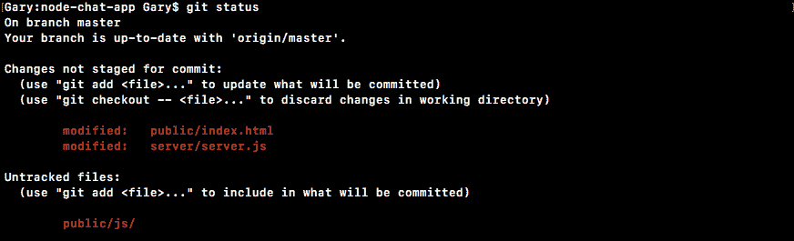

如前面的屏幕截图所示，我们这里有很多变化。我们在`public.js`文件夹中有我们的新的`js`文件，我们还改变了`server.js`和`index.html`。我将运行`git add .`命令将所有内容添加到下一个提交中，然后我将使用`git commit`和`-m`标志创建一个提交。这个提交的一个好消息是`Add newMessage and createMessage events`：

```js
git commit -m 'Add newMessage and createMessage events'
```

有了这个，我们现在可以将我们的代码推送到 GitHub 上。目前不需要在 Heroku 上做任何事情，因为我们还没有任何可视化的东西；我们将推迟到以后再处理。

在下一节中，我们将连接消息，所以当标签页 1 发出消息时，标签页 2 可以看到。这将使我们更接近在不同的浏览器标签页之间实际实时通信。

# 广播事件

现在我们已经放置了自定义事件监听器和发射器，是时候实际连接消息系统了，所以当一个用户向服务器发送消息时，它实际上会发送给每个连接的用户。如果我打开两个标签页并从一个标签页发出`createMessage`事件，我应该在第二个标签页中看到消息到达。

本地测试时，我们将使用单独的标签页，但在 Heroku 上使用单独的浏览器和单独的网络也可以实现相同的效果；只要每个人在浏览器上有相同的 URL，他们就会连接在一起，无论他们在哪台机器上。现在，对于本地主机，我们显然没有正确的权限，但是当我们部署到 Heroku 时，我们将在本节中进行，我们将能够在您的手机和在您的机器上运行的浏览器之间进行测试。

# 为所有用户连接创建`createMessage`监听器

首先，我们将更新`createMessage`监听器。目前，我们只是将数据记录到屏幕上。但是在这里，我们不仅要记录它，我们实际上要发出一个新事件，一个`newMessage`事件，给每个人，这样每个连接的用户都会收到从特定用户发送的消息。为了完成这个目标，我们将在`io`上调用一个方法，即`io.emit`：

```js
socket.on('createMessage', (message) => {
  console.log('createMessage', message);
  io.emit
});
```

`Socket.emit`向单个连接发出事件，而`io.emit`向每个连接发出事件。在这里，我们将发出`newMessage`事件，将其指定为我们的第一个参数。与`socket.emit`一样，第二个参数是要发送的数据：

```js
socket.on('createMessage', (message) => {
  console.log('createMessage', message);
  io.emit('newMessage', {

  })
});
```

现在，我们知道我们将从客户端得到`from`属性和`text`属性——这些出现在`index.js`中`createMessage`事件的`socket.emit`中——这意味着我们需要做的是传递这些属性，将`from`设置为`message.from`，将`text`设置为`message.text`：

```js
io.emit('newMessage', {
  from: message.from,
  text: message.text
})
```

现在，除了`from`和`text`，我们还将指定一个`createdAt`属性，这将由服务器生成，以防止特定客户端伪造消息创建的时间。`createdAt`属性设置为`new Date`，我们将调用`getTime`方法来获取时间戳，这是我们以前做过的：

```js
io.emit('newMessage', {
  from: message.from,
  text: message.text,
  createdAt: new Date().getTime()
});
```

现在我们已经完成了这一步，我们实际上已经连接了消息。我们可以继续删除`server.js`和`index.js`中的发出调用——`server.js`和`index.js`中的`newMessage`发出调用和`createMessage`发出调用，确保保存两个文件。有了这个，我们可以继续测试，打开两个连接到服务器并发出一些事件。

# 测试消息事件

我将使用`nodemon server/server.js`命令在终端中启动服务器：

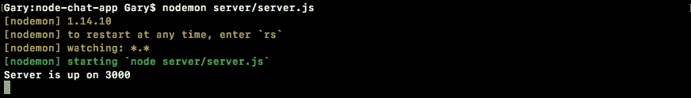

在浏览器中，我们现在可以打开两个标签页，都在`localhost:3000`。对于两个标签页，我将打开开发者工具，因为那是我们应用程序的图形用户界面。我们目前还没有任何表单，这意味着我们需要使用 Console 标签来运行一些语句。我们将对第二个标签页做同样的事情：

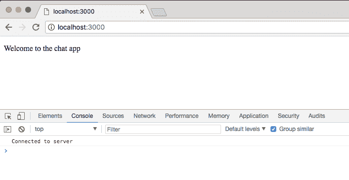

请注意，一旦我们打开标签页，我们将在终端中收到`New user connected`的消息：

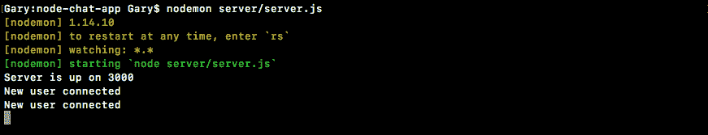

现在我们有两个标签页打开了，我们可以继续从任何一个标签页发出`createMessage`事件。我将从第二个标签页发出，通过调用`socket.emit`来发出一个自定义事件。事件名称是`createMessage`，它接受我们刚刚讨论过的这两个属性——`from`属性和`text`属性——我都会在`socket.emit`对象中指定。`from`属性将设置为第一个名字`Andrew`，`text`属性将设置为`'This should work'`：

```js
socket.emit('createMessage', {from: 'Andrew', text: 'This should work!'});
```

有了这个，我们现在可以从浏览器中发出我的事件。它将发送到服务器，服务器将把消息发送给每个连接的用户，包括当前连接的用户发送的消息。我们将按下*enter*，它就会触发，我们会看到我们收到了`newMessage`。我们有刚刚创建的消息，但很酷的是，在另一个标签页中，我们也有这条消息：一个用户的消息已经传达到另一个标签页的用户那里：

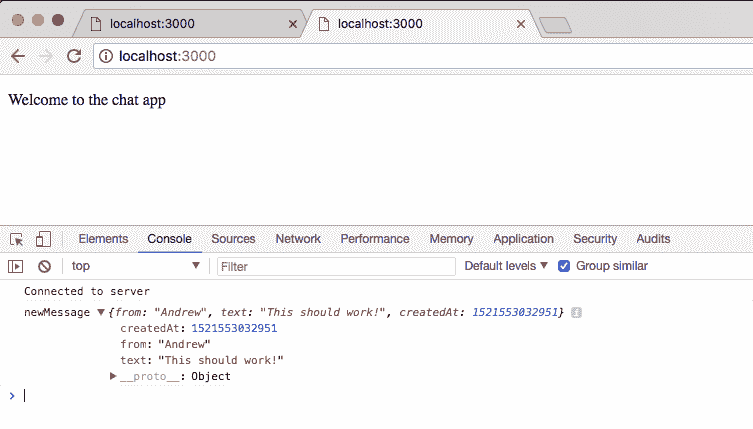

有了这个，我们现在有了一个非常基本的消息系统：用户发出一个事件，它传递到服务器，服务器将其发送给所有其他连接的用户。有了这个，我想进行提交并部署到 Heroku，这样我们就可以测试一下。

# 提交并将消息部署到 Heroku

如果我在终端中运行`git status`命令，我会看到我有两个预期的更改文件：

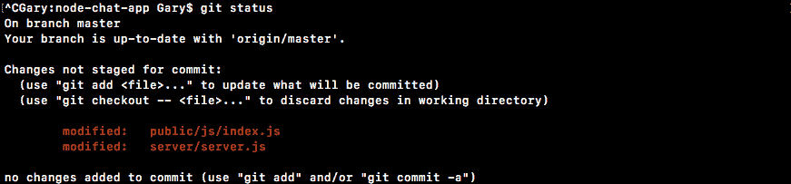

然后我可以使用`git commit`命令和`-am`标志来指定此提交的消息，比如`Emit newMessage on createMessage`就可以完成任务：

```js
git commit -am 'Emit newMessage on createMessage'
```

然后，我可以继续实际进行提交，将其推送到 GitHub 和 Heroku。`git push`命令将把它推送到 GitHub 上。

`git push heroku master`命令将把它部署到网络上。 

我们将能够打开我们的聊天应用程序，并确保它在任何浏览器、计算机或其他变量下都能正常工作：

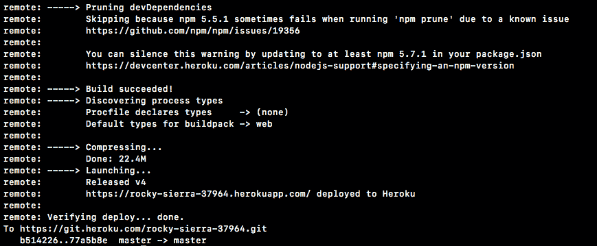

如前面的截图所示，我们正在压缩并启动应用程序。看起来一切都完成了。我将使用`heroku open`命令打开它。这将在我的默认浏览器中打开它，如下面的截图所示，您将看到我们有`Welcome to the chat app`：

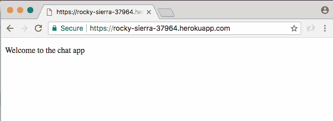

# 在 Firefox 浏览器中使用 Heroku 测试消息传递

现在，为了演示这一点，我将打开一个单独的浏览器。我将打开 Firefox 并输入完全相同的 URL。然后，我将复制这个 URL 并打开 Firefox 浏览器，使其变小，这样我们可以快速在两者之间切换，打开 Heroku 应用程序：

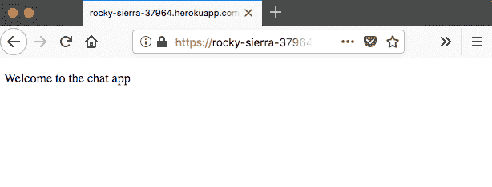

现在，Firefox 也可以通过右上角的菜单访问开发者工具。在那里，我们有一个 Web Developer 部分；我们要找的是 Web Console：

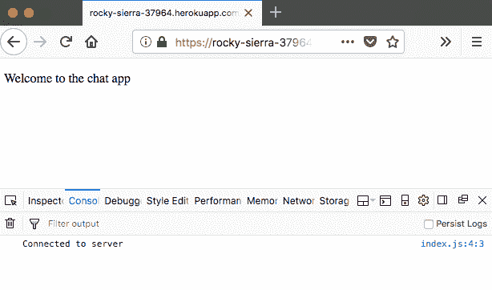

现在我们打开了这个，我们可以进入我们连接到 Heroku 应用程序的 Chrome 标签的开发者工具，我们将使用`socket.emit`发出一个事件。我们将发出一个`createMessage`事件。我们将在对象内指定我们的自定义属性，然后我们可以继续设置`from`为`Mike`，并且我们可以将`text`属性设置为`Heroku`：

```js
socket.emit('createMessage', {from: 'Mike', text: 'Heroku'});
```

现在，当我继续发出这个事件时，一切应该如预期般工作。我们调用`socket.emit`并发出`createMessage`。我们有我们的数据，这意味着它将发送到 Heroku 服务器，然后发送到 Firefox。我们将发送这个，这应该意味着我们在 Chrome 开发者工具中得到`newMessage`。然后，在 Firefox 中，我们也有这条消息。它是来自`Mike`，文本是`Heroku`，并且我们的服务器添加了`createdAt`时间戳：

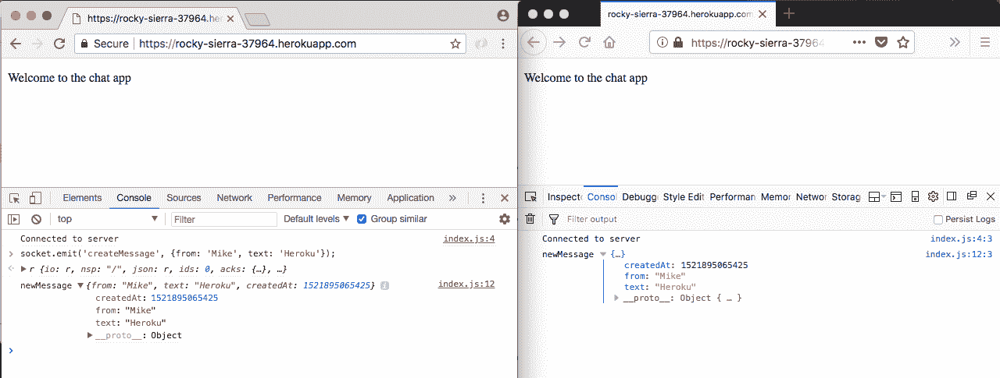

有了这个，我们有了一个消息系统——不仅在本地工作，而且在 Heroku 上也可以工作，这意味着世界上的任何人都可以访问这个 URL；他们可以发出事件，而所有其他连接的人都将在控制台中看到该事件。

现在我们已经在各个浏览器中测试过了，我将关闭 Firefox，然后我们将继续进行本节的第二部分。

# 向其他用户广播事件

在本节的这一部分，我们将讨论一种不同的发出事件的方法。有些事件你希望发送给每个人：新消息应该发送给每个用户，包括发送者，这样它才能显示在消息列表中。另一方面，其他事件应该只发送给其他人，所以如果用户一发出一个事件，它不应该返回给用户一，而应该只发送给用户二和用户三。

一个很好的例子是当用户加入聊天室时。当有人加入时，我想打印一条小消息，比如`Andrew joined`，当实际加入的用户加入时，我想打印一条消息，比如`welcome Andrew`。所以，在第一个标签中，我会看到`welcome Andrew`，在第二个标签中，我会看到`Andrew joined`。为了完成这个目标，我们将看一种在服务器上发出事件的不同方法。这将通过广播来完成。广播是向除了一个特定用户之外的所有人发出事件的术语。

我将再次使用`nodemon server/server.js`命令启动服务器，并且在 Atom 中，我们现在可以调整我们在`server.js`中的`io.emit`方法中发出事件的方式。现在，这将是我们做事情的最终方式，但我们也会玩一下广播，这意味着我会将其注释掉，而不是删除它：

```js
socket.on('createMessage', (message) => {
  console.log('createMessage', message);
  //io.emit('newMessage', {
  //  from: message.from,
  //  text: message.text,
  //  createdAt: new Date().getTime()
  //});
});
```

要进行广播，我们必须指定单个套接字。这让 Socket.io 库知道哪些用户不应该收到事件。在这种情况下，我们在这里调用的用户将不会收到事件，但其他人会。现在，我们需要调用`socket.broadcast`：

```js
socket.on('createMessage', (message) => {
  console.log('createMessage', message);
  //io.emit('newMessage', {
  //  from: message.from,
  //  text: message.text,
  //  createdAt: new Date().getTime()
  //});
  socket.broadcast
});
```

广播是一个具有自己发射功能的对象，它的语法与`io.emit`或`socket.emit`完全相同。最大的区别在于它发送给谁。这将把事件发送给除了提到的套接字之外的所有人，这意味着如果我触发一个`createMessage`事件，`newMessage`事件将发送给除了我自己之外的所有人，这正是我们在这里可以做的。

它将是相同的，这意味着我们可以继续传递消息事件名称。参数将是相同的：第一个将是`newMessage`，另一个将是具有我们属性的对象，`from: message.from`和`text: message.text`。最后，我们有`createdAt`等于一个新的时间戳，`new Date().getTime`：

```js
socket.broadcast.emit('newMessage', {
  from: message.from,
  text: message.text,
  createdAt: new Date().getTime()
});
```

有了这个，我们将看不到我们发送的消息，但其他人会看到。我们可以通过转到 Google Chrome 来证明这一点。我会给两个标签都刷新一下，然后从第二个标签再次发出一个事件。我们实际上可以在 Web 开发者控制台中使用上箭头键重新运行我们之前的命令，这正是我们要做的：

```js
socket.emit('createMessage', {from: 'Andrew', text: 'This should work'});
```

在这里，我们正在发出一个`createMessage`事件，其中`from`属性设置为`Andrew`，`text`属性等于`This should work`。如果我按*enter*发送这条消息，你会注意到这个标签不再接收消息：

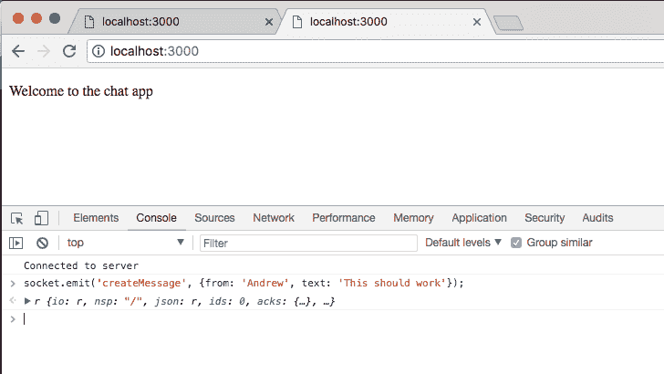

然而，如果我去`localhost:3000`，我们将看到`newMessage`显示出消息数据：

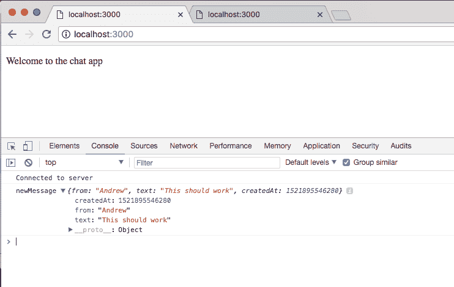

这是因为标签二广播了事件，这意味着它只被其他连接接收，比如标签一或任何其他连接的用户。

# 当用户连接时发出两个事件

有了广播，让我们进入最后一种发出消息的方式。我们将在`socket.io`中发出两个事件，就在用户连接时。现在，在这种情况下，我们实际上不会使用广播，所以我们将注释掉广播对象，并取消注释我们的旧代码。它应该看起来像这样：

```js
socket.on('createMessage', (message) => {
  console.log('createMessage', message);
  io.emit('newMessage', {
    from: message.from,
    text: message.text,
    createdAt: new Date().getTime()
  });
  // socket.broadcast.emit('newMessage', {
  // from: message.from,
  // text: message.text,
  // createdAt: new Date().getTime()
  //});
});
```

你将首先调用`socket.emit`来向加入的用户发出消息。你的消息应该来自管理员，`from Admin`，文本应该说一些像`Welcome to the chat app`的东西。

现在，除了`socket.emit`，你还将调用`socket.broadcast.emit`，这将被发送给除了加入的用户之外的所有人，这意味着你可以继续将`from`设置为`Admin`，并将`text`设置为`New user joined`：

```js
// socket.emit from Admin text Welcome to the chat app
// socket.broadcast.emit from Admin text New user joined
```

这意味着当我们加入聊天室时，我们会看到一条问候我们的消息，其他人会看到一条消息，告诉他们有人加入了。这两个事件都将是`newMessage`事件。我们将不得不指定`from`（即`Admin`），`text`（即我们说的任何内容）和`createdAt`。

# 向个人用户问候

为了开始，我们将填写第一个调用。这是对`socket.emit`的调用，这个调用将负责问候个别用户：

```js
// socket.emit from Admin text Welcome to the chat app
socket.emit
```

我们仍然会发送一个`newMessage`类型的事件，以及来自`text`和`createdAt`的完全相同的数据。这里唯一的区别是，我们将生成所有属性，而不是像之前那样从用户那里获取其中一些。让我们从`from`开始。这个将来自`Admin`。每当我们通过服务器发送消息时，我们将调用`Admin`，文本将是我们的小消息，`Welcome to the chat app`。接下来，我们将添加`createdAt`，它将被设置为通过调用`Date().getTime`方法的`new Date`：

```js
socket.emit('newMessage', {
  from: 'Admin',
  text: 'Welcome to the chat app',
  createdAt: new Date().getTime()
});
```

稍后，我们将以姓名问候他们。目前我们没有这些信息，所以我们将坚持使用通用的问候语。有了这个调用，我们可以删除注释，然后继续进行第二个调用。这是广播调用，将提醒除了加入的用户之外的所有其他用户，有新人来了。

# 在聊天中广播新用户

为了在聊天中广播新用户，我们将使用`socket.broadcast.emit`，并发出一个`newMessage`事件，提供我们的属性。`from`属性再次将被设置为`Admin`字符串；`text`将被设置为我们的小消息，`New user joined`；最后是`createdAt`，它将通过调用`Date().getTime`方法设置为`new Date`：

```js
// socket.broadcast.emit from Admin text New user joined
socket.broadcast.emit('newMessage', {
  from: 'Admin',
  text: 'New user joined',
  createdAt: new Date().getTime()
})
```

现在我们可以删除第二个调用的注释，一切应该如预期的那样工作。你需要做的下一件事是测试所有这些是否按预期工作，进入浏览器。你可以有几种方法来做到这一点；只要你做到了，实际上并不重要。

# 测试用户连接

我将关闭我的两个旧标签，并在访问页面之前打开开发者工具。然后，我们可以去`localhost:3000`，我们应该在开发者工具中看到一条小消息：

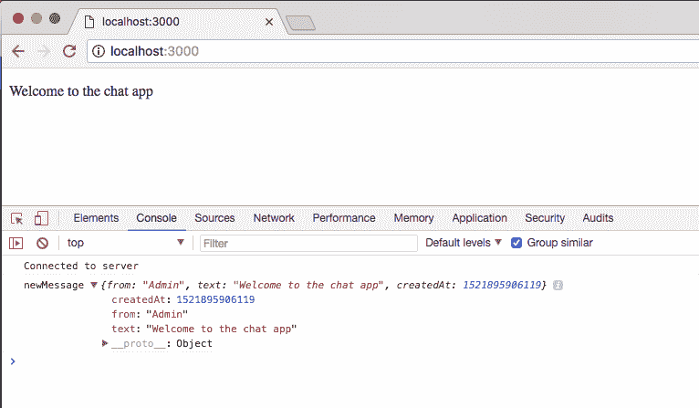

在这里，我们看到了一条新消息，`Welcome to the chat app`，打印出来，这太棒了！

接下来，我们想要测试广播是否按预期工作。对于第二个标签，我还会打开开发者工具并再次转到`localhost:3000`。再次，我们收到了我们的小消息，“欢迎来到聊天应用”：

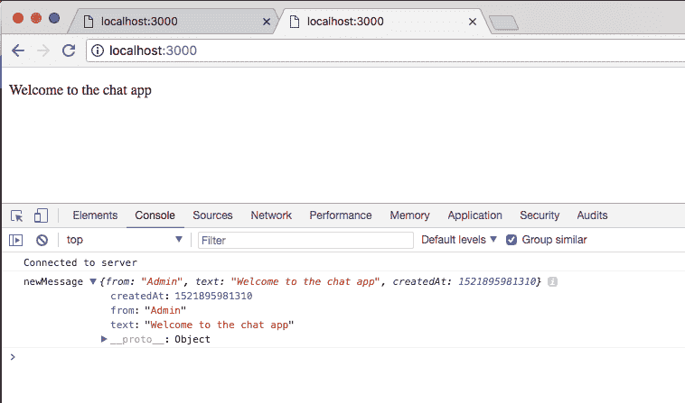

如果我们转到第一个标签，我们还会看到有新用户加入，这也太棒了！

现在，我将提交以保存这些更改。让我们关闭服务器并使用`git status`命令：

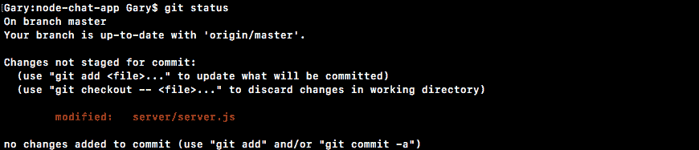

然后，我们可以继续运行带有`-am`标志的`git commit`命令，并指定消息，“向新用户打招呼并提醒其他人”：

```js
git commit -am 'Greet new user, and alert others'
```

一旦提交就位，我们可以使用`git push`命令将其推送到 GitHub。

现在没有必要立即部署到 Heroku，尽管如果你感兴趣，你可以轻松部署和测试。有了这个，我们现在完成了！

# 总结

在本章中，我们研究了 Socket.io 和 WebSockets，以实现服务器和客户端之间的双向通信。我们致力于设置一个基本的 Express 服务器、后端和前端，并将其提交到 GitHub 和 Heroku。接下来，我们研究了如何向应用程序添加`socket.io`以建立服务器和客户端之间的通信。

然后，我们研究了在应用程序内发出和监听自定义事件。最后，我们通过广播事件来连接消息系统，这样当一个用户向服务器发送消息时，实际上会发送给每个连接的用户，但不包括发送消息的用户。

有了这一切，我们现在有了一个基本但有效的消息系统，这是一个很好的开始！在下一章中，我们将继续添加更多功能并构建用户界面。
