# 第六章：生成 newMessage 和 newLocationMessage

在上一章中，我们研究了 Socket.io 和 WebSockets，以实现服务器和客户端之间的双向通信。在本章中，我们将讨论如何生成文本和地理位置消息。我们研究了生成`newMessage`和`newLocationMessage`对象，然后为两种类型的消息编写了测试用例。

# 消息生成器和测试

在本节中，您将把`server.js`中的一些功能分解成一个单独的文件，并且我们还将设置我们的测试套件，以便我们可以验证这些实用函数是否按预期工作。

目前，我们的目标是创建一个帮助我们生成`newMessage`对象的函数。我们将不再需要每次都定义对象，而是只需将两个参数传递给一个函数，即名称和文本，它将生成对象，这样我们就不必做这项工作了。

# 使用实用函数生成 newMessage 对象

为了生成`newMessage`，我们将制作一个单独的文件，然后将其加载到`server.js`中，而不是定义对象。在`server`文件夹中，我们将创建一个名为`utils`的新目录。

在`utils`中，我们将创建一个名为`message.js`的文件。这将存储与消息相关的实用函数，而在我们的情况下，我们将创建一个名为`generateMessage`的新函数。让我们创建一个名为`generateMessage`的变量。这将是一个函数，并将使用我之前提到的两个参数，`from`和`text`：

```js
var generateMessage = (from, text) => {

};
```

然后它将返回一个对象，就像我们在`server.js`中作为第二个参数传递给 emit 的对象一样。现在我们需要做的就是`return`一个对象，指定`from`作为 from 参数，`text`作为 text 参数，以及`createdAt`，它将通过调用`new Date`并调用其`getTime`方法来生成：

```js
var generateMessage = (from, text) => { 
  return { 
    from, 
    text, 
    createdAt: new Date().getTime() 
  }; 
}; 
```

有了这个，我们的实用函数现在已经完成。我们需要做的就是在下面导出它，`module.exports`。我们将把它设置为一个对象，该对象具有一个`generateMessage`属性，该属性等于我们定义的`generateMessage`变量：

```js
var generateMessage = (from, text) => { 
  return { 
    from, 
    text, 
    createdAt: new Date().getTime() 
  }; 
}; 

module.exports = {generateMessage}; 
```

最终，我们将能够将其集成到`server.js`中，但在这样做之前，让我们先编写一些测试用例，以确保它按预期工作。这意味着我们需要安装 Mocha，并且还需要安装 Expect 断言库。然后我们将设置我们的`package.json`脚本并编写测试用例。

# 编写测试用例

首先，在终端中，我们将使用`npm install`安装两个模块。我们需要 Expect，这是我们的断言库，版本为`@1.20.2`，以及`mocha`来运行我们的测试套件，版本为`5.0.5`。然后，我们将使用`--save-dev`标志将它们添加为开发依赖项：

```js
npm install expect@1.20.2 mocha@5.0.5 --save-dev
```

让我们运行这个命令，一旦完成，我们就可以进入`package.json`并设置这些测试脚本。

它们将与我们在上一章的上一个项目中使用的测试用例相同。

在`package.json`中，我们现在有两个`dev`依赖项，在脚本中，我们可以通过删除旧的测试脚本来开始。我们将添加这两个脚本，`test`和`test-watch`：

```js
"scripts": {
  "start": "node server/server.js",
  "test": "echo "Error: no test specified" && exit 1",
  "test-watch": ""
},
```

# 添加 test-watch 脚本

让我们先填写基础知识。我们将把`test`设置为空字符串，然后是`test-watch`。我们知道，`test-watch`脚本只是调用`nodemon`，调用`npm test`脚本，`nodemom --exec`，然后在单引号内调用`npm test`：

```js
"scripts": {
  "start": "node server/server.js",
  "test": "",
  "test-watch": "nodemon --exec 'npm test'"
},
```

这将完成任务。现在当我们在这里运行`nodemon`时，我们实际上正在运行全局安装的`nodemon`；我们也可以在本地安装它来修复这个问题。

为了完成这个任务，我们要做的就是运行`npm install nodemon`，添加最新版本，即版本`1.17.2`，并使用`--save-dev`标志进行安装：

```js
npm install nodemon@1.17.2 --save-dev
```

现在当我们像这样安装 `nodemon` 时，我们的应用程序不再依赖于全局的 `nodemon` 安装。因此，如果其他人从 GitHub 获取这个应用程序，他们将能够开始而无需全局安装任何东西。

# 添加测试脚本

接下来是 `test` 脚本。它首先必须设置我们将要配置的环境变量；我们稍后会这样做。现在，我们要做的只是运行 `mocha`，传入我们要测试的文件的模式。

我们想要测试的文件在 `server` 目录中。它们可以在任何子目录中，所以我们将使用 `**`，而文件，无论它们的名称如何，都将以 `test.js` 结尾：

```js
"scripts": {
  "start": "node server/server.js",
  "test": "mocha server/**/*.test.js",
  "test-watch": "nodemon --exec 'npm test'"
},
```

有了这个设置，我们就完成了。现在我们可以运行我们的测试套件。

# 运行消息实用程序的测试套件

在终端中，如果我运行 `npm test`，我们将看到的是我们没有任何测试：

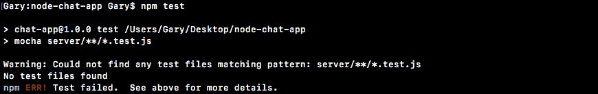

这里有 `server-test` 文件的 globbing 模式；它无法解析任何文件。我们可以通过简单地添加一个测试文件来解决这个问题。我将为消息实用程序添加一个测试文件，`message.test.js`。现在我们可以继续重新运行 `npm test` 命令。这一次它确实找到了一个文件，我们看到我们没有通过测试，这是一个很好的起点：

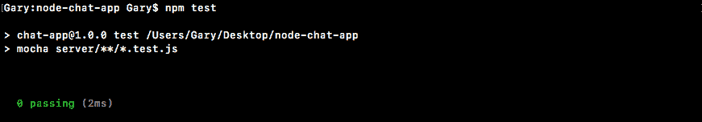

在 `message.test.js` 中，我们需要为刚刚定义的消息函数添加一个测试。现在这个测试将验证我们得到的对象是否符合我们根据传入的参数所期望的。我们将一起设置测试文件的基本结构，然后你将编写单个测试用例。

首先，我们需要使用 `var expect = require('expect')` 加载 Expect。这将让我们对从我们的 `generateMessage` 函数返回的值进行断言：

```js
var expect = require('expect');
```

接下来我们要做的是添加一个 `describe` 块。在这里，我们将为函数 `generateMessage` 添加一个 `describe` 块，并在回调函数中添加该函数的所有测试用例：

```js
describe('generateMessage', () => {

});
```

在我们实际创建测试用例并填写之前，我们确实需要加载我们正在测试的模块。我将创建一个变量并使用 ES6 解构。我们将取出 `generateMessage`，然后我们可以使用 `require` 来引入它，指定本地路径 `./message`：

```js
var expect = require('expect');
var {generateMessage} = require('./message');

describe('generateMessage', () => {

});
```

它与我们当前所在的测试文件相同的目录中，所以没有理由进行任何目录移动。有了这个设置，我们现在可以添加单个测试用例，`it ('should generate the correct message object')`。这将是一个同步测试，因此无需提供 done。你只需要调用 `generateMessage` 传入两个值，`from` 和 `text`。你将得到响应，并将响应存储在变量中：

```js
describe('generateMessage', () => {
  it('should generate correct message object', () => {
    //store res in variable
  });
});
```

然后你将对响应进行一些断言。首先，断言 from 是正确的，断言 from 与你传入的值匹配。你还将断言文本匹配，最后你将断言 `createdAt` 值是一个数字：

```js
var expect = require('expect');
var {generateMessage} = require('./message');

describe('generateMessage', () => {
  it('should generate correct message object', () => {
    // store res in variable
    // assert from match
    // assert text match
    // assert createdAt is number
  });
});
```

它不管是什么数字；你将使用 `toBeA` 方法来检查类型并断言 `createdAt` 是数字。为了完成这个任务，我将首先定义一些变量。

首先，我将创建一个 from 变量来存储 from 的值。我将使用 `Jen`。我还将创建一个 `text` 变量来存储文本值，`Some message`。现在我想做的是创建我的最终变量，它将存储响应，即从 `generateMessage` 函数返回的 `message`，这正是我要调用的。我将调用 `generateMessage`，传入两个必要的参数，`from` 参数和 `text` 参数：

```js
describe('generateMessage', () => {
  it('should generate correct message object', () => {
    var from = 'Jen';
    var text = 'Some message';
    var message = generateMessage(from, text);
```

接下来，最后一件事，我们需要对返回的对象进行断言。我期望`message.createdAt`是一个使用`toBeA`和传入类型`number`的数字：

```js
describe('generateMessage', () => {
  it('should generate correct message object', () => {
    var from = 'Jen';
    var text = 'Some message';
    var message = generateMessage(from, text);

    expect(message.createdAt).toBeA('number');
```

这是你需要做的第一个断言，以验证属性是否正确。接下来，我们将期望该消息内部具有某些属性。我们将使用`toInclude`断言来做到这一点，尽管你可以创建两个单独的语句：一个用于`message.from`，另一个用于`message.text`。所有这些都是有效的解决方案。我将只使用`toInclude`并指定消息应该包含的一些内容：

```js
expect(message.createdAt).toBeA('number');
expect(message).toInclude({

});
```

首先，它应该有一个`from`属性等于`from`变量。我们可以继续使用 ES6 来定义；对于`text`，`text`应该等于`text`，我们将使用 ES6 来设置。我们甚至可以使用`from, text`来进一步简化这个过程：

```js
expect(message.createdAt).toBeA('number');
expect(message).toInclude({from, text});
```

有了这个，我们的测试用例现在已经完成，我们可以继续删除这些注释轮廓，你需要做的最后一件事是通过在终端运行`npm test`来运行测试套件。当我们这样做时，我们会得到什么？我们得到了我们在`generateMessage`下的一个测试，应该生成正确的消息对象，它确实通过了，这太棒了：

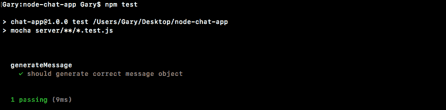

现在我们有一些测试来验证我们的函数是否按预期工作，让我们继续将其集成到我们的应用程序中，方法是进入`server.js`，并用我们的新函数调用替换传递给 emit 函数的所有对象。

# 将实用函数集成到我们的应用程序中

这个过程的第一步是导入我们刚刚创建的函数。我将在`server.js`中创建一个常量来做到这一点。我们将使用 ES6 解构来获取`generateMessage`，并且我们将从`require`的调用中获取它。现在我们正在要求一个不同目录中的本地文件。我们将从`./`开始，进入`utils`目录，因为我们当前在`server`目录中，然后通过指定文件名`message`来获取它：

```js
const socketIO = require('socket.io');

const {generateMessage} = require('./utils/message');
```

现在我们可以访问`generateMessage`，而不是创建这些对象，我们可以调用`generateMessage`。在`socket.emit`中，我们将用参数`generateMessage ('Admin', 'Welcome to the chat app')`替换`Welcome to the chat app`和`Admin`变量：

```js
socket.emit('newMessage', generateMessage('Admin', 'Welcome to the chat app'));
```

我们有完全相同的功能，但现在我们使用一个函数来为我们生成该对象，这将使得扩展变得更容易。这也将使得更新消息内部的内容变得更容易。接下来，我们可以更改下面的*New user joined*。我们也将用对`generateMessage`的调用来替换这个。

这次也是来自`Admin`，所以第一个参数将是字符串`Admin`，第二个参数是文本`New user joined`：

```js
socket.emit('newMessage', generateMessage('Admin', 'Welcome to the chat app'));
```

这个也完成了，最后一个是实际从用户那里发送给用户的，这意味着我们有`message.from`和`message.text`；这些将是我们的参数。我们将使用这两个参数`message.from`和`message.text`调用`generateMessage`作为第二个参数：

```js
socket.on('createMessage', (message) => {
  console.log('createMessage', message);
  io.emit('newMessage', generateMessage('Admin', 'New user joined'));                                
```

有了这个，我们就完成了。这一部分剩下的最后一件事是测试它是否按预期工作。我将使用`nodemon`启动服务器，`node`和`mon`之间没有空格，`server/server.js`：

```js
nodemon server/server.js
```

一旦服务器启动，我们可以通过打开几个带有开发者工具的标签页来测试一下。

对于第一个标签页，我将访问`localhost:3000`。在控制台中，我们应该看到我们的新消息打印出来，即使它现在是由函数生成的，对象看起来是一样的，我们也可以通过打开第二个标签页并打开其开发者工具来测试其他一切是否按预期工作：

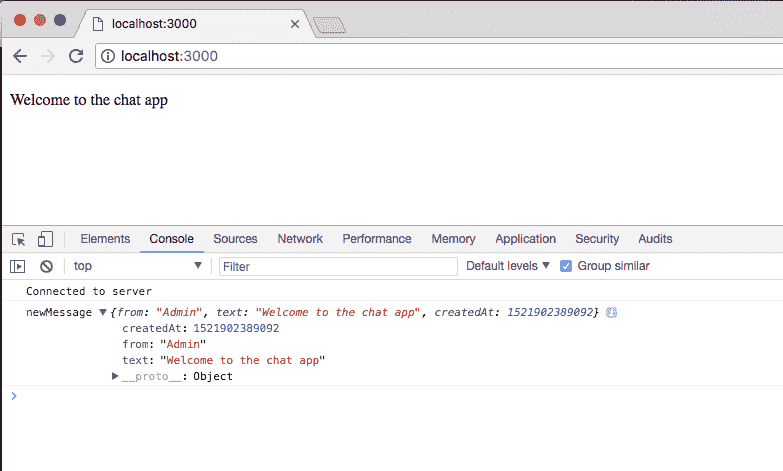

这一次，第一个选项卡应该看到一个新消息，这里有一个`New user joined`的文本，仍然有效。如果我们从第二个选项卡发出自定义消息，它应该出现在第一个选项卡中。我将使用上箭头键运行我们之前的`createMessage`事件发射器之一。

我将触发这个函数，如果我去第一个选项卡，我们确实会收到消息，这太棒了：

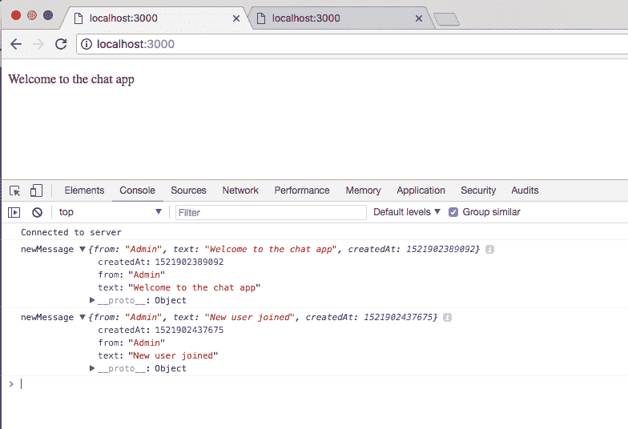

这应该有效，在第一个选项卡中打印，也会在第二个选项卡中打印，因为我们调用的是`io.emit`而不是广播方法。

现在一切都正常了，我们完成了；我们可以提交并结束这一部分。我将从终端调用`git status`。这里我们有新文件和修改过的文件，这意味着我们需要调用`git add .`。接下来，我们可以调用`git commit`并使用消息标志，`create generateMessage utility`：

```js
git commit -m 'create generateMessage utility'
```

我将把这个推送到 GitHub，这就是这个部分的全部内容。在下一节中，我们将看一下`Socket.io`的确认。

# 事件确认

在这一节中，你将学习如何使用事件确认。这是`Socket.io`中的一个很棒的功能。为了准确说明它们是什么以及为什么你想要使用它们，我们将快速浏览一下聊天应用程序的图表。这是我们应用程序中实际存在的两个事件，如果你还记得，第一个是 newMessage 事件，它由服务器发出，并由客户端监听，它发送 from、text 和 createdAt 属性，所有这些属性都是必需的，以便将消息呈现到屏幕上。

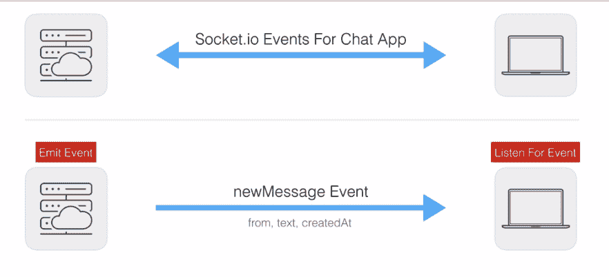

我们要更新的事件是 createMessage 事件。这个事件由客户端发出，服务器监听：

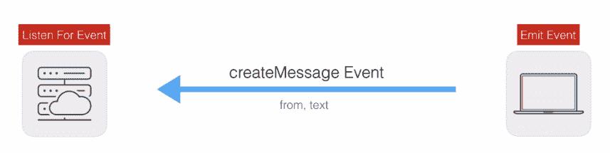

我们再次从文本中发送一些数据。现在我们的 createMessage 事件存在的问题是数据只能单向流动。数据来自浏览器内的表单，然后发送到服务器，服务器就有点卡住了。当然，数据可能是有效的，from 和 text 字段可能设置正确。在这种情况下，我们可以发出 newMessage 事件，将其呈现给连接到服务器的每个浏览器，但是如果服务器接收到无效数据，它就无法让客户端知道出了什么问题。

我们需要一种确认我们收到请求并有选项发送一些数据的方法。在这种情况下，我们将为 createMessage 添加一个确认。如果客户端发出有效的请求，并且 from 和 text 属性有效，我们将确认它，发送回无错误消息。如果从客户端发送到服务器的数据无效，我们将确认它，发送回错误消息，这样客户端就知道需要做什么才能发送有效的请求。现在结果看起来会有点像这样，服务器到客户端的数据流将通过回调完成：

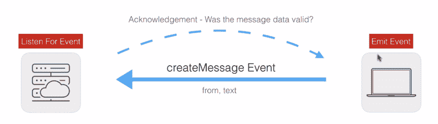

你的确认可以是任何你喜欢的。在我们的情况下，它可能是消息数据有效吗？如果你正在创建一个电子邮件应用程序，你可能只在成功发送电子邮件时向客户端发送确认。当有效数据通过管道发送时，你不需要发送数据，这就是当有效数据发送时我们要做的。我们只需要说，嘿，我们收到了那条消息，一切都很顺利，客户端可以对此做出响应。

既然我们已经完成了这一部分，让我们继续将其实现到我们的应用程序中。

# 设置确认

如果你已经有一个监听器，设置确认真的不难。你只需要快速更改监听器和发射器，一切都会按预期工作。

现在，在这种情况下，监听器恰好在服务器上，发射器将在客户端上，但确认也可以在另一个方向上工作。我可以从服务器发射一个事件，并且可以在客户端上确认它。

为了设置这个，我们将使用`socket.emit`在`index.js`中发射一个`createMessage`事件，并且我们将传递相同的参数。第一个是事件名称，`createMessage`，然后我们将传递一些有效的数据，一个具有这两个属性的对象。我们可以将`from`设置为`Frank`，并且我们可以将`text`属性设置为`Hi`：

```js
socket.emit('createMessage', {
  from: 'Frank',
  text: 'Hi'
});
```

现在有了这个，我们有了一个标准的事件发射器和一个标准的事件监听器。我可以继续使用`nodemon`启动应用程序，确保一切都按预期工作，`nodemon server/server.js`：

```js
nodemon server/server.js
```

一旦服务器启动，我们可以在浏览器中访问它，我也会打开开发者工具。然后我们将转到`localhost:3000`，你可以看到在终端中我们有`createMessage`显示出来，我们还有`newMessage`显示在这里。我们有`newMessage`用于我们的小`Welcome to the chat app`问候语，以及我们从`Frank`那里发射的`newMessage`：

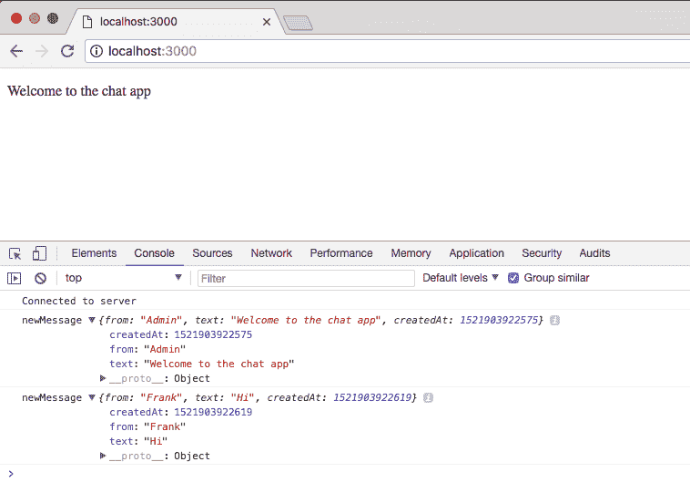

现在这里的目标是从服务器发送一个确认回到客户端，证明我们已经收到了数据。

# 从服务器发送确认到客户端

为了完成这个任务，我们必须对监听器和发射器进行更改。如果你只对其中一个进行更改，它将不会按预期工作。我们将从事件发射器开始。我们希望在从服务器发送确认到客户端时运行一些代码。

# 更新事件发射器

为了从服务器向客户端发送确认，我们将添加一个第三个参数，这将是一个回调函数。当确认到达客户端时，这个函数将被触发，我们可以做任何我们喜欢的事情。现在我们只是使用`console.log('Got it')`打印：

```js
socket.emit('createMessage', { 
  from: 'Frank', 
  text: 'Hi' 
}, function () { 
  console.log('Got it'); 
}); 
```

现在这就是我们需要做的最基本的事情，为客户端添加一个确认。

# 更新事件监听器

在服务器上也很简单；我们将在`callback`参数列表中添加第二个参数。第一个仍然是被发射的数据，但第二个将是一个我们将称之为`callback`的函数。我们可以在`socket.on`中的任何地方调用它来确认我们已经收到了请求：

```js
socket.on('createMessage', (message, callback) => {
  console.log('createMessage', message);
  io.emit('newMessage', generateMessage(message.from, message.text));
  callback();
```

当我们调用这个函数时，就像我们现在要调用它一样，它将会向前端发送一个事件，然后会调用`index.js`中的事件发射器中的函数。

这意味着如果我保存这两个文件，我们可以在浏览器中玩一下确认。我将刷新应用程序，我们会得到什么？我们得到了 Got it：

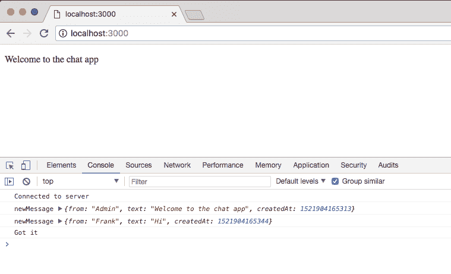

这意味着我们的数据成功传输到了服务器；我们可以通过在终端中看到`console.log`语句来证明这一点，服务器通过调用回调函数确认它已经收到了数据：

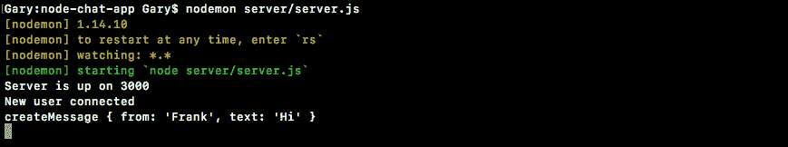

在开发者工具中，Got it 打印出来了。

现在确认是非常有用的，但当你发送数据回去时，它们会更有用。例如，如果消息的数据无效，我们可能会想要发送一些错误回去，这是我们稍后将要做的事情。不过，现在我们可以通过发送任何我们想要的东西来玩一下确认。

通过向回调提供一个参数来发送数据回去，如果你想添加多个东西，只需指定一个对象，添加尽可能多的属性。不过，在我们的情况下，我们可以将一个字符串作为`callback`的唯一参数发送。我将把我的字符串设置为`This is from the server`：

```js
socket.on('createMessage', (message, callback) => {
  console.log('createMessage', message);
  io.emit('newMessage', generateMessage(message.from, message.text));
  callback('This is from the server.');
});
```

这个字符串将被传递到回调函数中，并最终出现在我们的`index.js`回调中。这意味着我可以为该值创建一个变量，我们可以称之为`data`或者其他你喜欢的名称，并且我们可以将其打印到屏幕上或者对其进行操作。现在我们只是打印到屏幕上：

```js
socket.emit('createMessage', {
  from: 'Frank',
  text: 'Hi'
}, function (data) {
  console.log('Got it', data);
});
```

如果我保存`index.js`，我们可以测试一切是否按预期工作。我将继续刷新应用程序，我们会看到什么？

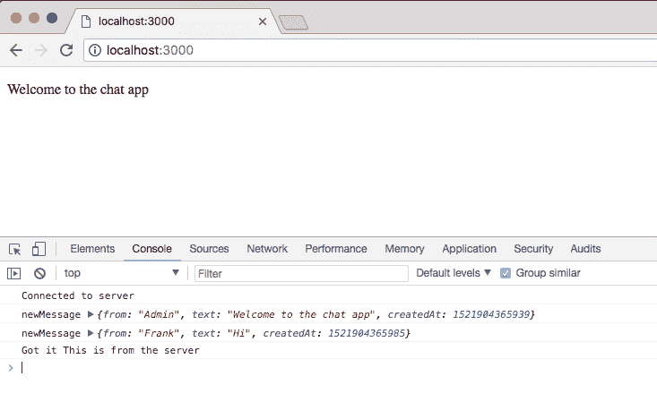

我们看到了“收到”，这意味着我们收到了确认，我们也看到了数据，从服务器发送到客户端的数据。

确认在实时应用程序中扮演着重要的角色。让我们回到电子邮件应用程序的例子，想象一下，当我发送电子邮件时，我键入了一些值，比如收件人和文本值。我希望得到一个确认，要么是电子邮件成功发送，要么是电子邮件未发送，这种情况下我想知道原因；也许是表单错误，我可以向用户显示一些错误消息，或者服务器正在维护中等等。

无论如何，确认允许请求监听器向请求发射器发送一些内容。现在我们知道如何使用确认，我们将把它们整合到我们的应用程序中。这将在下一节中进行，我们将在`index.html`文件中添加一个实际的表单字段，用户可以提交新消息并查看它们。

# 消息表单和 jQuery

在这一节中，你将向你的`index.html`文件中添加一个表单字段。这将在屏幕上呈现一个输入字段和一个按钮，用户将能够与之交互，而不是必须从开发者工具中调用`socket.emit`，这对于真实用户来说并不是一个可持续的选项。这只对我们开发人员有效。

现在，为了开始，我们将编辑`index.html`，然后我们将转到`index.js`。我们将添加一个监听器，等待表单提交，然后在该监听器回调中，我们将使用表单中键入的数据来触发`socket.emit`。我们还将花一些时间将所有传入的消息呈现到屏幕上。在本节结束时，我们将拥有一个丑陋但工作的聊天应用程序。

# 使用 jQuery 库

在我们做任何操作之前，我们将使用一个名为 jQuery 的库来进行 DOM 操作，这意味着我们希望能够处理我们呈现的 HTML，但我们希望能够从我们的 JavaScript 文件中进行操作。我们将使用 jQuery 来使跨浏览器兼容性更容易。为了获取这个库，我们将前往 Google Chrome，转到[jquery.com](http://jquery.com/)，然后你可以获取最新版本。版本对于这里并不重要，因为我们使用的是所有版本中可用的非常基本的功能：

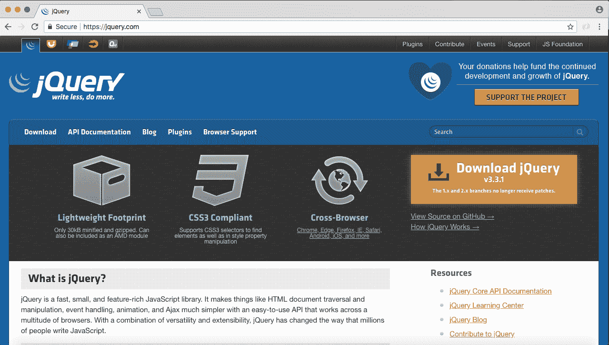

我将获取最新版本 3.3.1。然后我将右键单击并在新标签中打开压缩的生产版本进行下载：

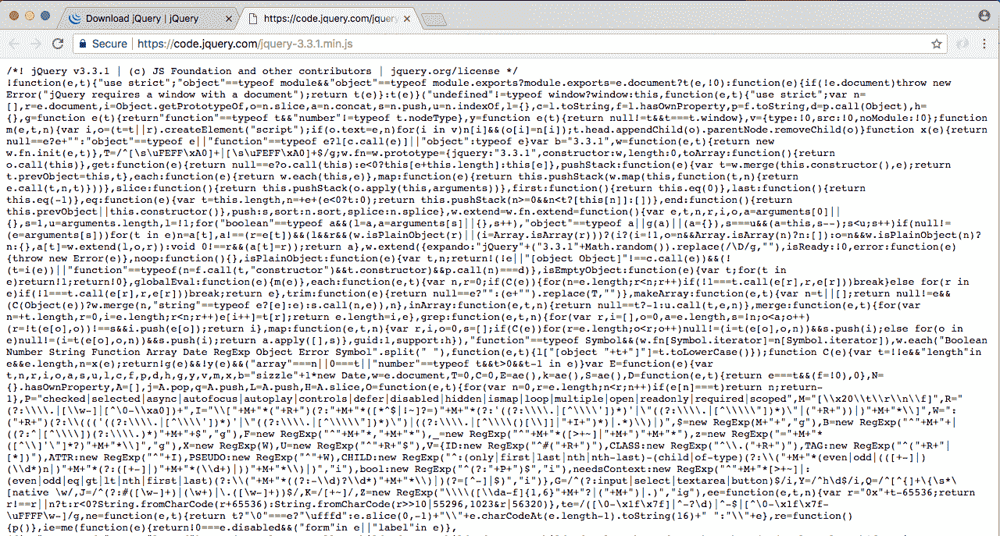

这里有我们想要加载到我们应用程序中的实际 JavaScript，这意味着我们可以右键单击某个空白区域，点击“另存为”，然后进入我们的项目文件夹，`桌面` | `node-chat-app` | `public` | `js`。在`js`文件夹中，我将创建一个名为`libs`的新目录，我们将在其中存储第三方 JavaScript。在这个目录中保存，关闭标签以及下载区域，现在我们可以继续加载到`index.html`中并添加我们的表单。

# 在 index.html 中添加表单字段

在这里，就在`socket.io`和`index.js`之间，我们要添加一个新的脚本标签来加载 jQuery。我们必须指定`src`属性，路径是`/js/libs`，后面跟着一个斜杠和文件名`jquery-3.3.1.min.js`：

```js
<script src="img/socket.io.js"></script>
<script src="img/jquery-3.3.1.min.js"></script>
<script src="img/index.js"></script>
```

现在让我们设置我们的`form`标签；这将把我们的表单字段呈现到浏览器上。如果你对这些标签不熟悉，那没关系，跟着做，我会一边解释。

# 设置表单标签

第一步，我们需要一个`form`标签；这会创建一个用户可以提交的表单。这正是我们要用来提交我们的消息的。在这个`form`标签上，我们要添加一个属性；就是`id`属性，它让我们给这个元素一个唯一的标识符，这样以后用 JavaScript 就很容易定位它：

```js
<form id>

</form>
```

记住，我们要给这个元素添加一个监听器。当表单被提交时，我们要在我们的 JavaScript 文件中做一些事情。特别是我们要做的是调用`socket.emit`。

我要把`id`设置为，引号内，`message-form`：

```js
<form id="message-form">

</form>
```

现在我们的表单标签完成了，我们可以在里面添加一些标签。首先，我们要添加一个`button`，它会出现在`form`的`底部`。这个`button`在点击时会提交`form`。我打开并关闭我的标签，然后在里面可以输入任何我想要出现在`button`上的文本。我要选择`Send`：

```js
<form id="message-form">
  <button>Send</button>
</form>
```

# 添加文本字段

现在我们的`button`就位了，唯一需要做的就是添加一个小文本字段。这将是用户输入消息的文本字段。这将需要我们使用一个`input`标签，而不是打开和关闭一个`input`标签，我们将使用自关闭的语法：

```js
<form id="message-form">
  <input/>
  <button>Send</button>
</form>
```

因为我们不需要像`button`或`form`那样在里面放任何东西，我们要给`input`添加很多属性，首先是`name`，我们要给这个字段一个唯一的名称，类似`message`就可以了。我们还要设置类型。`input`标签有很多不同的类型。类型可以包括复选框之类的，或者在我们的情况下，我们要在引号内使用的类型是`text`：

```js
<input name="message" type="text"/>
```

我们要添加到`input`的最后一个属性叫做`placeholder`。我们要把这个值设置为，引号内，一个字符串。在用户实际输入值之前，这个字符串会以浅灰色呈现在字段中。我要告诉用户这就是他们的`Message`的地方：

```js
<form id="message-form">
  <input name="message" type="text" placeholder="Message"/>
  <button>Send</button>
</form>
```

有了这个，我们实际上可以测试一下我们表单的渲染。

# 测试表单的渲染

我们可以通过启动服务器使用`nodemon`来进行测试：

```js
nodemon server/server.js
```

服务器已经启动，我要访问 Google Chrome，然后转到`localhost:3000`。你会注意到一些很酷的东西，我实际上还没有访问过这个 URL，但你可以看到连接已经发生了。Chrome 进行了一些懒加载，如果它认为你要去一个 URL，它实际上会发出请求；所以当我访问它时，它加载得更快。现在如果我访问`localhost:3000`，我们会得到什么？

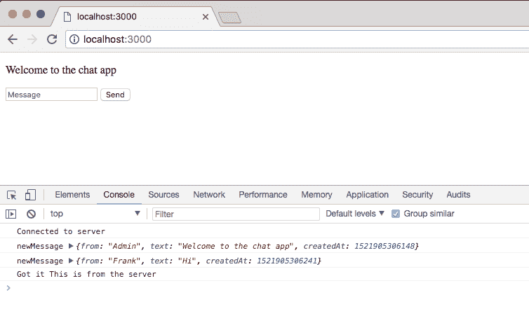

我们得到了我们的小表单，我们可以输入一个消息，比如`Test`，然后发送出去。现在默认情况下，表单非常老式。如果我试图提交这个表单，它实际上会进行完整的页面刷新，然后会把数据，比如我们的消息文本，作为查询字符串添加到 URL 上。这不是我们想要做的，我们想要在表单提交时运行一些自定义 JavaScript。所以我们要附加一个自定义事件监听器并覆盖默认行为。为了完成这个，我们需要使用 jQuery，并且需要选择这个`form`字段。

# 使用 jQuery 选择元素

在我们深入研究`index.js`之前，让我们简要谈一下如何使用`jQuery`来选择元素。`jQuery`，可以通过`jQuery`变量访问，将您的选择器作为其参数。然后，我们将添加一个字符串，我们可以选择我们的元素。例如，如果我们想在屏幕上选择所有段落标签，我们将在引号中输入`p`：

```js
jQuery('p');
```

这些与 CSS 选择器非常相似，如果您熟悉它们的话，如图所示，我们已经选择了我们的段落标签。

我还可以选择程序中的所有`div`，或者可以按 ID 或类选择元素，这就是我们要做的。为了通过 ID 选择元素，我们首先以井号（`#`）开始，然后输入名称。在我们的情况下，我们有一个名为`message-form`的`form`，如果我执行这个操作，我们确实会得到它：

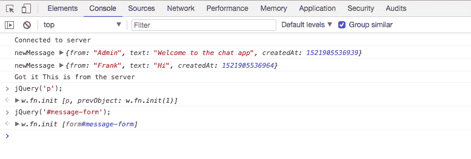

这将允许我们添加一个事件监听器。

# 将选择器元素添加到 index.js

在`index.js`中，我们将在底部附近添加完全相同的选择器，`jQuery`，使用我们的选择器`#message-form`进行调用。现在我们将添加一个事件监听器，事件监听器看起来与我们的`Socket.io`事件监听器非常相似。我们将调用`on`，并且我们将提供这两个参数，事件名称在引号内，`submit`，和一个`function`，当用户尝试提交`form`时将触发该`function`：

```js
jQuery('#message-form').on('submit', function(){

});
```

现在，与我们的`Socket.io`事件监听器不同，我们将在`function`中得到一个参数，一个`e`事件参数，并且我们需要访问它。我们需要访问这个事件参数，以覆盖导致页面刷新的默认行为。在这里，我们将调用`e.preventDefault`：

```js
jQuery('#message-form').on('submit', function(){
  e.preventDefault();
});
```

`preventDefault`方法可以阻止事件的默认行为，默认情况下，提交事件会经过页面刷新过程。

我们可以通过进入 Google Chrome，刷新页面来测试一切是否正常。我还将从 URL 中删除查询字符串。现在我们可以输入一些消息，比如`test`，点击发送，您会看到什么都没有发生。之所以什么都没有发生，是因为我们覆盖了默认行为，要使某些事情发生，我们只需要在`index.js`中调用`socket.emit`。我们将发出`createMessage`：

```js
jQuery('#message-form').on('submit', function(){
  e.preventDefault();

  socket.emit('createMessage', {

  });
});
```

然后，我们将继续提供我们的数据。现在，`from`字段的名称暂时只是大写的`User`。我们暂时将其保留为匿名，尽管稍后我们将对其进行更新。现在对于文本字段，这将来自`form`。我们将要添加一个选择器并获取值。让我们使用`jQuery`来做到这一点：

```js
  socket.emit('createMessage', { 
    from: 'User', 
    text: jQuery('')
  })
});
```

我们将再次调用`jQuery`，并且我们将选择`index.html`文件中的输入。我们可以通过其名称`name="message"`来选择它：

```js
<input name="message" type="text" placeholder="Message"/> 
```

为了完成这个任务，我们将在`index.js`中的`socket.emit`中打开括号，将`name`设置为`message`。这将选择任何具有`name`属性等于`message`的元素，这就是我们的一个元素，我们可以使用`.val`方法获取其值：

```js
  socket.emit('createMessage', { 
    from: 'User', 
    text: jQuery('[name=message]').val();
  })
});
```

由于我们在对象创建内部，不需要分号。有了这个，我们现在可以继续添加我们的回调函数以进行确认。目前它实际上并没有做任何事情，但这完全没问题。我们必须添加它以满足我们当前设置的确认：

```js
jQuery('#message-form').on('submit', function (e) {
  e.preventDefault();

  socket.emit('createMessage', {
    from: 'User',
   text: jQuery('[name=message]').val()
  }, function () {

  })
});
```

现在我们已经设置了事件监听器，让我们继续测试一下。

# 测试更新事件监听器

我将回到 Chrome，刷新页面，输入一些消息，比如`This should work`，当我们提交表单时，我们应该在这里看到它显示为新消息：

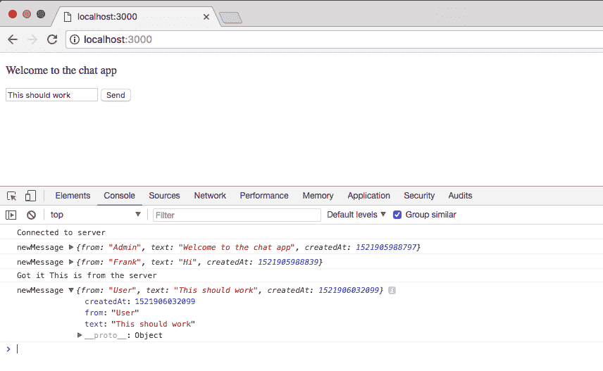

我将发送它，你可以看到在终端内，我们有一个用户发送`This should work`，它也显示在 Chrome 中：

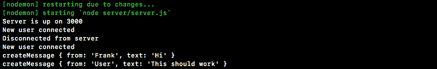

如果我打开第二个连接，情况也是如此，我将打开开发者工具，这样我们就可以看到幕后发生了什么。我将输入一些消息，比如`From tab 2`，发送出去：

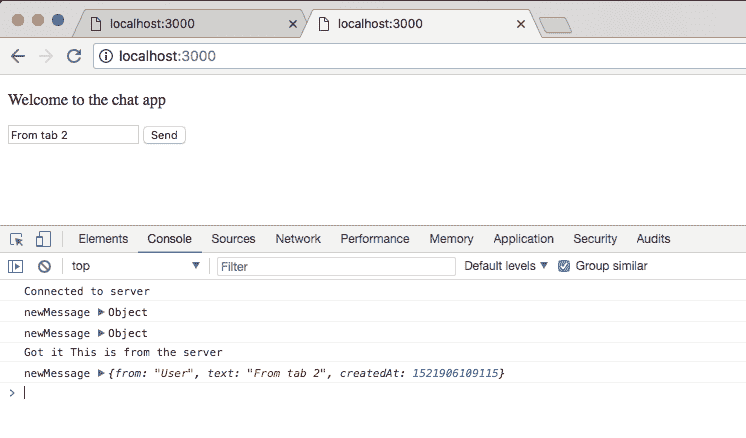

我们应该在选项卡 1 中看到它，我们确实看到了：

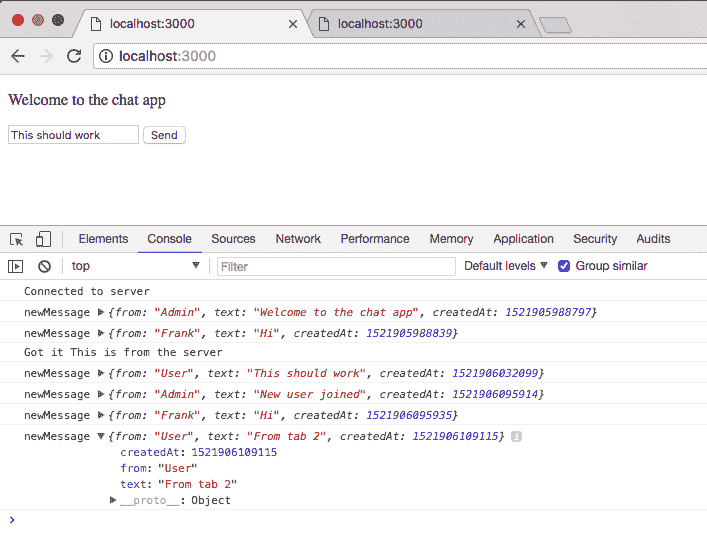

完美，一切都按预期工作。现在显然设置还没有完成；我们希望在发送消息后清除表单值，并且我们希望处理一些其他与用户界面相关的事情，但目前它运行得相当好。

有了一个基本的表单，我们要做的第二件事是将传入的消息渲染到屏幕上。现在再次看起来可能会很丑，但它会完成工作。

# 将传入的消息渲染到屏幕上

为了完成这个任务，我们必须在我们的`index.html`文件内创建一个地方，我们可以在其中渲染消息。再次，我们将给这个元素一个 ID，这样我们就可以在`index.js`内部轻松访问它，以便渲染这些消息。

# 创建一个有序列表来渲染消息

首先，我们要做的是创建一个有序列表，方法是创建一个`ol`标签，就像这样：

```js
<body>
  <p>Welcome to the chat app</p>
  <ol></ol>
```

这个列表将允许我们向其中添加项目，这些项目将是单独的消息。现在我们将给它一个`id`属性。在这种情况下，我将称之为`messages`：

```js
<ol id="messages"></ol>
```

现在这就是我们在`index.html`中需要做的全部，所有的重活将在`index.js`内部进行。当有新消息到达时，我们希望在有序列表内添加一些内容，以便将其渲染到屏幕上。

在`index.js`内部，当新消息到达时，我们可以通过修改回调函数来完成这个任务。

# 使用 jQuery 在 index.js 中创建元素

我们要做的第一件事是创建一个列表项，我们将再次使用 jQuery 来完成这个任务。我们将创建一个变量，这个变量将被称为`li`，然后我们将稍微不同地使用 jQuery：

```js
socket.on('newMessage', function (message) {
  console.log('newMessage', message);
  var li = jQuery();
});
```

我们不再使用`jQuery`来选择元素，而是使用`jQuery`来创建一个元素，然后我们可以修改该元素并将其添加到标记中，使其可见。在引号内，我们将打开和关闭一个`li`标签，就像我们在`index.html`中一样：

```js
socket.on('newMessage', function (message) {
  console.log('newMessage', message);
  var li = jQuery('<li></li>');
});
```

现在我们已经完成了这一步，我们必须继续设置它的文本属性，我将通过调用`li.text`来设置`li.text`，并传入我想要使用的值。

在这种情况下，文本将要求我们设置一个小模板字符串，在模板字符串内，我们将使用返回的数据。现在我们将使用`from`属性和`text`属性。让我们从`from`开始，然后添加一个小冒号和一个空格来将其与实际的`message`分开，最后，我们将在末尾注入`message.text`：

```js
var li = jQuery('<li></li>');
li.text(`${message.from}: ${message.text}`);
```

现在，我们已经创建了一个元素，但我们还没有将它渲染到 DOM 中。我们将使用`jQuery`来选择我们创建的全新元素，我们给它一个 ID 为`messages`，然后我们将通过调用`append`方法向其添加一些内容：

```js
var li = jQuery('<li></li>');
li.text(`${message.from}: ${message.text}`);

jQuery('#messeges').append
```

这将把它添加为其最后一个子元素，因此列表中已经有三个项目；最新的项目将显示在这三个项目下方，作为有序列表中的第四个项目。我们只需要调用`append`作为一个函数，传入我们的列表项：

```js
var li = jQuery('<li></li>');
li.text(`${message.from}: ${message.text}`);

jQuery('#messeges').append(li);
});
```

有了这个设置，我们就完成了。现在，如果你不熟悉`jQuery`，这可能有点令人不知所措，但我保证我们在这里使用的技术将贯穿整本书。到最后，你会更加舒适地选择和创建元素。

# 测试传入的消息

让我们继续在 Google Chrome 中测试。我将刷新标签 1，当我这样做时，你可以看到我们的两条消息，欢迎来到聊天应用显示出来，Frank 说 Hi：

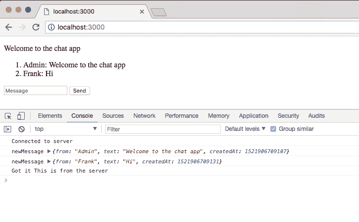

现在欢迎来到聊天应用应该显示出来。Frank Hi 消息来自`index.js`中的`socket.emit`：

```js
socket.emit('createMessage', { 
  from: 'Frank', 
  text: 'Hi' 
}, function (data) { 
  console.log('Got it', data); 
}); 
```

我们实际上可以去掉它，我们不再需要自动发送消息，因为我们已经设置了一个`form`来完成这项工作。再次保存文件，刷新浏览器，这一次我们有了一个很好的设置，欢迎来到聊天应用：

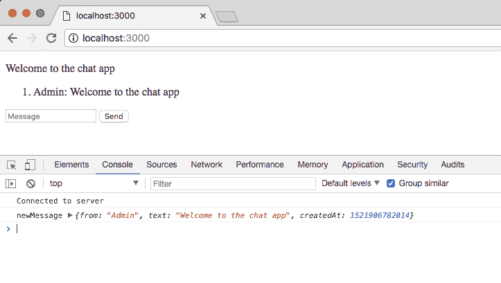

我将为我们的第二个标签做同样的事情。这一次我们会得到欢迎来到聊天应用，在第一个标签中我们会得到新用户加入；这太棒了：

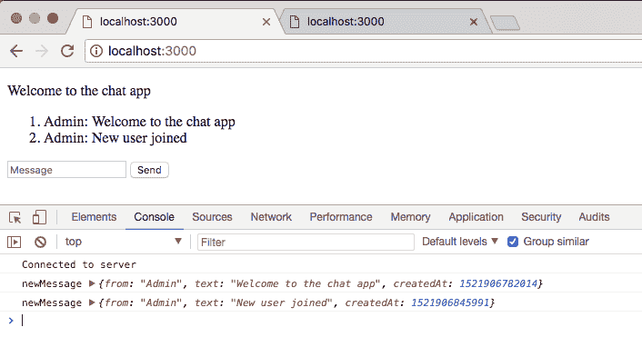

现在真正的测试将是从一个标签发送消息到另一个标签，“这应该发送到标签 2”。我将发送这条消息，当我点击这个按钮时，它将触发事件发送到服务器，服务器将把它发送给所有连接的人：

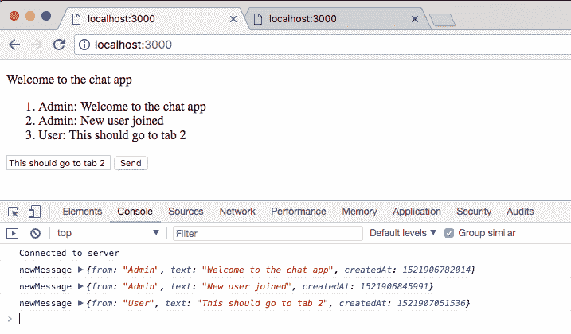

在这里，我可以看到“This should go to tab 2”被渲染出来，在我的第二个标签中也收到了这条消息：

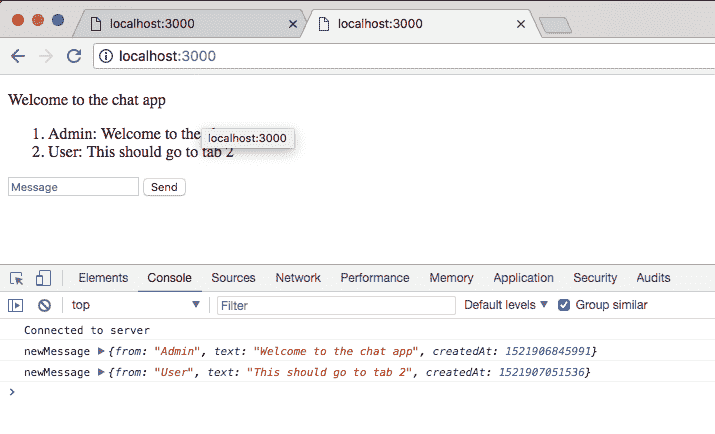

现在我们的 UI 或实际用户体验还没有完成；自定义名称和时间戳即将到来，但我们已经有了一个很棒的开始。现在我们有一个表单，我们可以提交消息，并且我们可以在浏览器中看到所有传入的消息，这意味着我们不需要在开发者工具中再做任何关于发送或阅读消息的工作。就是这样，让我们继续通过做出一些工作变更来做出提交。

# 为消息表单做出提交

我将关闭服务器，清除输出，并运行`git status`，以便我们可以仔细检查所有的更改；一切看起来都很好：

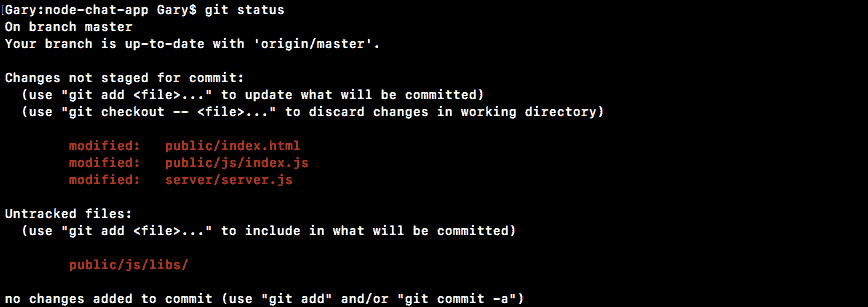

我将使用`git add`命令将所有文件添加到仓库中，包括我的未跟踪的 jQuery 文件。然后我使用`git commit`进行`commit`。我将在这里使用`-m`标志，这次的好消息是`添加消息表单并在浏览器中显示传入消息`：

```js
git commit -m 'Add form for messages and show incoming messages in browser'
```

一旦我们完成这一步，我们就可以将其`push`到 GitHub 上。现在我们有了一些真实的、可见的、有形的东西可以使用，我要花一点时间部署到 Heroku，`git push heroku master`就可以搞定：

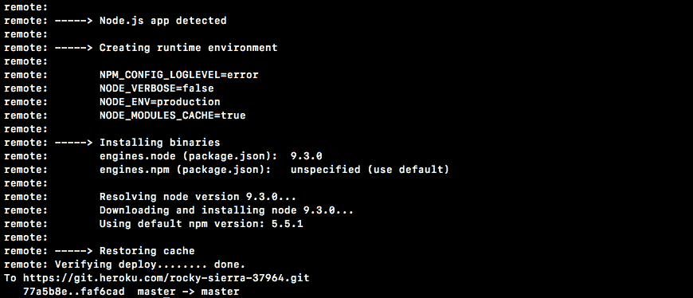

一旦这个就绪，我们就可以在浏览器中访问它。正如你在我的控制台中看到的，`Socket.io`正在尝试重新连接到服务器。不幸的是，我们不会再次将其带回来，所以它会尝试更长时间。

我们在这里，正在验证部署，一切都正常运行。你可以运行`heroku open`或直接复制 URL。我将关闭我的两个本地主机标签，然后打开实际的 Heroku 应用。

在这里，我们得到了欢迎来到聊天应用的消息，我们也得到了我们的表单；一切看起来都很好。我将继续打开另一个浏览器，比如 Safari。我也会去聊天应用，然后把这些窗口并排放在一起。在 Safari 中，我会输入一条小消息，“这是在 Heroku 上实时的”，点击发送或按下*enter*键，它立即出现在另一个浏览器的另一个标签中。这是因为我们的实时 socket 服务器正在传输这些数据：

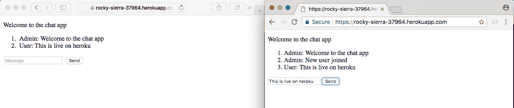

这可能发生在世界上的任何一台计算机上，你不需要在我的机器上，因为我们使用的是真实的 Heroku URL。现在在 Heroku 上一切都正常了，我们完成了。

# 地理位置

在本节中，您将开始地理位置的两部分系列的第一部分。我们不仅仅是互发文本，还将设置它，以便我可以将我的实际坐标，即我的经度和纬度，发送给连接到聊天应用程序的其他所有人。然后我们可以呈现一个链接，该链接可以指向任何我们喜欢的地方；在我们的情况下，我们将设置它以打开一个 Google 地图页面，其中标记了发送其位置的用户的实际位置。

现在，为了实际获取用户的位置，我们将使用地理位置 API，在客户端 JavaScript 中可用，并且实际上是一个非常受支持的 API。它在所有现代浏览器上都可用，无论是移动设备还是桌面设备，可以通过谷歌搜索“地理位置 API”找到文档，并查找 MDN 文档页面。

MDN 文档，或者 Mozilla 开发者网络，是我最喜欢的客户端技术文档，例如您的 Web API、CSS 和 HTML 指南：

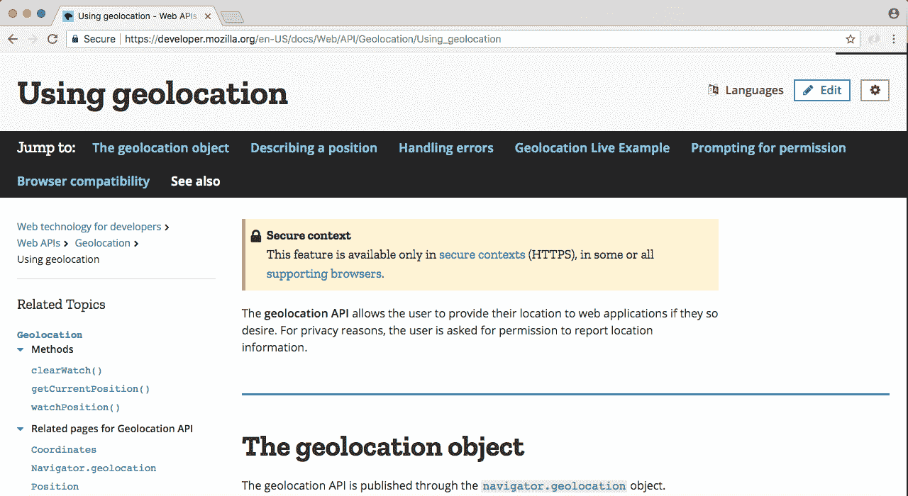

现在，正如我所提到的，这是一个受支持的功能，除了较旧版本的 Internet Explorer 和 Opera Mini 浏览器外，您几乎可以在任何地方使用它。但是，所有主要的桌面和移动浏览器都将支持此功能，如果浏览器过旧，我们将设置一个小消息来告诉他们他们的浏览器不支持地理位置。如果您想了解更多关于地理位置的信息，或者探索我们在本节中未涵盖的功能，您可以参考此页面，尽管我们将使用地理位置提供的大多数功能。

# 将发送位置按钮添加到应用程序

首先，我们要做的是向我们的应用程序添加一个新按钮。它将与发送按钮并排，并且会显示类似“发送位置”的内容。当用户点击发送位置按钮时，我们将使用地理位置 API。通常，这将需要用户确认他们是否要与浏览器中的此标签共享其位置，弹出框将会出现，这将由浏览器触发，没有其他方法可以绕过这一点。

您需要确保用户确实希望共享他们的位置。一旦您获得了坐标，您将发出一个事件，该事件将发送到服务器，服务器将将其发送给所有其他连接的用户，我们将能够以一个良好的链接呈现该信息。

首先，我们将添加该按钮，这将是启动整个过程的按钮。在 Atom 中的`index.html`中，我们将在我们现有的`form`标签下方添加一个按钮。它将位于我们现有的表单之外。我们将添加`button`标签，并为其分配`send-location`的 ID。至于可见的`button`文本，我们可以使用`Send Location`作为我们的字符串，并保存文件：

```js
  <form id="message-form"> 
    <input name="message" type="text" placeholder="Message"/> 
    <button>Send</button> 
  </form> 
  <button id="send-location">Send Location</button> 
```

如果我们继续在浏览器中刷新应用程序，现在应该会看到我们的发送位置按钮显示出来：

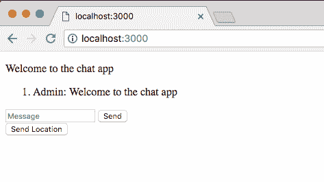

稍后我们将在添加默认样式时修复所有这些问题，但现在这确实完成了工作。

目前，单击此按钮不会执行任何操作，它与`form`没有关联，因此不会执行任何奇怪的`form`提交或页面重新加载。我们只需要向此按钮添加一个`click`监听器，就可以运行任何我们喜欢的代码。在我们的情况下，我们将运行地理位置代码。

# 给发送位置按钮添加点击监听器

我们将在 Atom 中的`index.js`中添加一个`click`监听器，并在底部附近添加一些代码。

现在我想做的第一件事是创建一个变量，我将把这个变量称为`locationButton`；这将存储我们的选择器。这是一个 jQuery 选择器，它指向我们刚刚创建的按钮，因为我们需要多次引用它，并且将它存储在一个变量中可以节省再次调用的需要。我们将像我们为其他选择器所做的那样调用`jQuery`，传入一个参数，一个字符串，我们通过 ID 选择了某个东西，这意味着我们必须以`#`开始，并且实际的 ID 是`send-location`：

```js
var locationButton = jQuery('#send-location');
```

现在我们已经准备就绪，可以做任何我们喜欢的事情。在我们的情况下，我们要做的是添加一个点击事件，并且我们希望当有人点击按钮时做一些事情。为了完成这个目标，我们将转到`locationButton.on`：

```js
var locationButton = jQuery('#send-location');
locationButton.on
```

这与执行`jQuery`相同，选择 ID`send-location`，这两者都会做同样的事情。第一个解决方案的好处是我们有一个可重用的变量，以后我们会引用它。对同一个选择器进行两次 jQuery 调用会浪费时间，因为它需要 jQuery 来操作 DOM，获取信息，这是很昂贵的。

`locationButton.on`将是我们的事件监听器。我们正在监听`click`事件，第一个参数是引号内的`click`事件，第二个参数像往常一样将是我们的`function`：

```js
var locationButton = jQuery('#send-location');
locationButton.on('click', function () {

});
```

当有人点击按钮时，这个函数将被调用。

# 检查对地理位置 API 的访问权限

现在我们要做的只是检查用户是否有访问地理位置 API 的权限。如果没有，我们希望继续打印一条消息。

我们将创建一个`if`语句。地理位置 API 存在于`navigator.geolocation`上，如果它不存在，我们想运行一些代码：

```js
var locationButton = jQuery('#send-location');
locationButton.on('click', function () {
  if(navigator.geolocation){

  }
});
```

所以我们要翻转它。如果`navigator`上没有地理位置对象，我们要做一些事情。我们将使用`return`来防止函数的其余部分执行，并且我们将调用在所有浏览器中都可用的`alert`函数，弹出一个默认的警报框，让你点击`OK`：

```js
if(navigator.geolocation){
  return.alert()
}
```

我们将使用这个，而不是一个更复杂的模态框。如果你使用类似 Bootstrap 或 Foundation 的东西，你可以实现它们内置的工具。

不过，现在我们将使用`alert`，它只需要一个参数（一个字符串，你的消息）`您的浏览器不支持地理位置`：

```js
var locationButton = jQuery('#send-location');
locationButton.on('click', function ()
  if (!navigator.geolocation) {
    return alert('Geolocation not supported by your browser.');
  }
```

现在，不支持此功能的用户将看到一条小消息，而不是想知道是否真的发生了什么。

# 获取用户的位置

为了实际获取用户的位置，我们将使用地理位置上可用的一个函数。为了访问它，我们将在`locationButton.on`函数中的`if`语句旁边添加`navigator.geolocation.getCurrentPosition`。`getCurrentPosition`函数是一个启动过程的函数。它将主动获取用户的坐标。在这种情况下，它将根据浏览器找到坐标，并且这需要两个函数。第一个是你的`success`函数，我们可以在这里添加我们的第一个回调。这将使用位置信息调用，我们将把这个参数命名为`position`：

```js
  navigator.geolocation.getCurrentPosition(function (position) { 
  } 
}); 
```

`getCurrentPosition`的第二个参数将是我们的错误处理程序，如果出现问题。我们将创建一个`function`，当我们无法使用`alert`获取位置时，我们将向用户发出一条消息。让我们继续调用`alert`第二次，打印一条消息，比如`无法获取位置`：

```js
  navigator.geolocation.getCurrentPosition(function (position) { 

  }, function() {
    alert('Unable to fetch location.');
  });
});
```

这将打印`if`有人被提示与浏览器共享位置，但他们点击了拒绝。我们将说`嘿，如果你不给我们那个权限，我们就无法获取位置`。

现在唯一剩下的情况是成功的情况。这是我们要“发出”事件的地方。但在这之前，让我们继续简单地将其记录到屏幕上，这样我们就可以窥探一下“位置”参数内部发生了什么：

```js
  navigator.geolocation.getCurrentPosition(function (position) {
    console.log(position);
      }, function () {
    alert('Unable to fetch location.');
  });
});
```

我将把这个记录到屏幕上，我们的服务器将重新启动，在 Google Chrome 中，我们可以打开开发者工具，刷新页面，然后点击“发送位置”按钮。现在这将在桌面和移动设备上运行。一些移动浏览器可能需要您使用 HTTPS，这是我们将为 Heroku 设置的内容，正如您所知，Heroku 的 URL 是安全的，这意味着它在本地主机上不起作用。您可以通过将应用程序部署到 Heroku 并在那里运行来测试移动浏览器。不过，现在我将能够点击“发送位置”。这将继续进行该过程；该过程最多可能需要一秒钟：

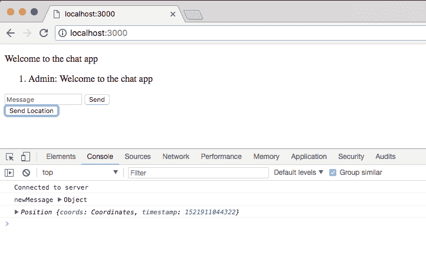

现在您可以看到，我确实获得了我的地理位置。但我从未被询问是否要共享我的位置；那是因为我已经获得了许可。在右上角，我可以点击“清除这些设置以供将来访问”，这意味着我需要重新授权。如果我刷新页面并再次点击“发送位置”，您将看到这个小框，这可能会出现在您的页面上。您可以选择阻止它，如果我阻止它，它将打印“无法获取位置”；或者您可以接受它。

我将再次清除这些设置，刷新页面，这次我将接受位置共享，然后我们将在控制台中打印出地理位置：

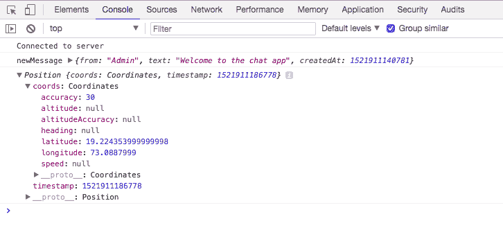

现在一旦我们得到它，我们就可以继续深入，对象本身非常简单，我们有一个时间戳，精确记录了我们获取数据的时间，如果您要跟踪用户的活动，这将非常有用，但我们不需要。我们还有我们的坐标，还有一些我们不打算使用的属性，比如“准确度”，“高度”，这些都不存在，还有其他相关的属性。我们还有“速度”，它是`null`。我们将从这个对象中使用的唯一两个是“纬度”和“经度”，它们确实存在。

这是我们想要传递给服务器的信息，以便服务器可以将其发送给其他人。这意味着我们将进入`position`对象，进入`coords`对象，并获取这两个。

# 在用户位置中添加坐标对象

让我们在 Atom 中继续进行，我们将调用`socket.emit`并`emit`一个全新的事件，一个我们尚未注册的事件。我们将称之为`createLocationMessage`：

```js
navigator.geolocation.getCurrentPosition(function (position) {
  socket.emit('createLocationMessage', {
  });
});
```

`createLocationMessage`事件不会采用标准文本；相反，它将采用那些“经度”和“纬度”坐标。我们将指定它们两个，从“纬度”开始；我们要将“纬度”设置为`position.coords.latitude`。这是我们在控制台内探索的变量，我们将对“经度”做同样的操作，将其设置为`position.coords.longitude`：

```js
navigator.geolocation.getCurrentPosition(function (position) {
  socket.emit('createLocationMessage', {
    latitude: position.coords.latitude,
    longitude: position.coords.longitude
  });
```

既然我们已经做好了准备，我们实际上可以继续在服务器上监听这个事件，当我们收到它时，我们要做的是将上述数据传递给所有连接的用户。

# 将坐标数据传递给连接的用户

让我们继续在`server.js`中注册一个新的事件监听器。我将删除旧的已注释掉的`broadcast`调用，因为在`createMessage`中不再需要。就在`createMessage`下面，我们将再次调用`socket.on`，指定一个监听器来监听这个事件`createLocationMessage`，就像我们在`index.js`中定义的那样。现在我们使用 ES6，因为我们在 Node 中，这意味着我们可以设置箭头函数。我们将有一个参数，这将是`coords`，然后我们可以继续完成箭头函数。

```js
  socket.on('createMessage', (message, callback) => { 
    console.log('createMessage', message); 
    io.emit('newMessage', generateMessage(message.from, message.text)); 
    callback('This is from the server.'); 

}); 

  socket.on('createLocationMessage', (coords) => { 

}); 
```

在这里，我们将能够运行任何我们喜欢的代码。目前我们要做的只是通过调用`emit`一个`newMessage`事件传递坐标，尽管在本章的后面，我们将会做得更好，设置谷歌地图的 URL。不过，现在我们要调用`io.emit`，`emit`一个`newMessage`事件，并通过调用`generateMessage`提供必要的数据：

```js
socket.on('createLocationMessage', (coords) => {
  io.emit('newMessage', generateMessage)
});
```

目前，`generateMessage`将采用一些虚假的用户名，我将输入`管理员`，并且我们将设置文本，目前我们只是将其设置为坐标。让我们使用模板字符串来设置它。我们将首先注入`纬度`，它在`coords.latitude`上可用，然后我们将继续添加逗号、空格，然后我们将注入`经度`，`coords.longitude`：

```js
socket.on('createLocationMessage', (coords) => {
  io.emit('newMessage', generateMessage('Admin', `${coords.latitude}, ${coords.longitude}`));
});
```

现在我们已经设置了这个调用，位置信息将在用户之间传递，我们可以继续证明这一点。

在浏览器中，我将刷新此页面，并且我还将打开第二个标签页。在第二个标签页中，我将点击“发送位置”。它不会提示我是否要共享我的位置，因为我已经告诉它我要与这个标签页共享我的位置。您可以看到我们有我们的管理员消息和我们的`纬度`和`经度`：

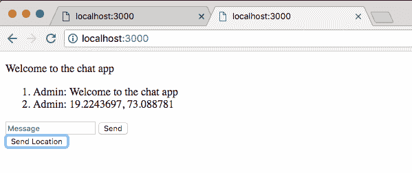

我们也在第二个标签页中有它。如果我拿到这些信息，我们实际上可以谷歌一下，证明它按预期工作。在本章的后面，我们将设置一个漂亮的链接，因此这些信息不可见；它会在那里，但用户实际上不需要知道坐标，他们真正想要的是地图的链接。这就是我们要设置的，但现在我们可以把这个放在谷歌上，谷歌会准确显示我们的位置，坐标确实是正确的。我在费城，这意味着这些本地主机标签的位置被正确获取。

# 呈现可点击链接，而不是文本坐标

到目前为止，我们已经让数据流动起来，现在我们要让它变得更有用。我们不再将“纬度”和“经度”信息呈现为文本，而是要呈现为可点击的链接。用户将能够点击该链接；当他们从他人那里收到位置时，它将把他们带到谷歌地图上，他们将能够准确查看其他用户的位置。这比简单输出文本“纬度”和“经度”要有用得多。

为了完成这个，我们需要调整如何传输坐标数据。我们发送数据的方式在`index.js`中仍然可以，我们仍然会`emit`，`createLocationMessage`。但是在`server.js`中，我们不再需要发出新消息，而是需要完全发出其他内容。我们将设置一个名为`newLocationMessage`的新事件，我们将`emit`它，然后在`index.js`中，我们将编写一个处理程序`newLocationMessage`，类似于`newMessage`但有明显不同。它不会呈现一些文本，而是帮助我们呈现一个链接。

# 整理 URL 结构

为了开始之前，我们必须确切地弄清楚我们将使用什么样的 URL 结构来获取数据，`纬度`和`经度`信息，在 Google 地图中正确显示。实际上有一种非常统一的设置 URL 的方式，这将使得这个过程非常容易。

为了向您展示我们将要使用的确切 URL，让我们继续打开一个新标签。URL 将转到`https://www.google.com/maps`。现在从这里我们将提供一个查询参数，查询参数将指定；它被称为`q`：

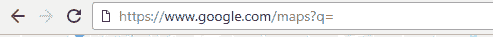

它将期望`纬度`和`经度`是由逗号分隔的值。现在我们实际上在`localhost:3000`标签中有这个。虽然逗号之间会有一点空间，但无论如何我们都可以复制该值，返回到另一个标签，粘贴进去，并删除空格。

有了这个，我们现在有一个可以在我们的应用程序中使用的 URL。现在当我按下*enter*，我们将在正确的位置看到地图，但您会注意到 URL 已经改变了。这完全没问题；只要我们将用户发送到这个 URL，它最终变成什么并不重要。我要按下*enter*；您可以立即看到我们得到了一个谷歌地图，当页面加载时，URL 确实会改变。

现在我们看到的与我们输入的完全不同，但实际的图钉，红色的图钉，它在几栋房子内是正确的。有了这个知识，我们可以生成一个遵循相同格式的 URL，在网站内部输出它，我们将有一个可点击的链接，别人可以查看别人的位置。

# 发出 newLoactionMessage

要开始，让我们继续进入 Atom 到`server.js`，而不是发出`newMessage`事件，我们将发出`newLocationMessage`：

```js
socket.on('createLocationMessage', (coords) => { 
  io.emit('newLocationMessage', generateMessage('Admin', `${coords.latitude}, ${coords.longitude}`)); 
});
```

现在我们在`index.js`中没有处理程序，但这完全没问题，我们稍后会在本节中设置。现在我们还需要改变我们发送的数据。目前，我们发送的是纯文本数据；我们想要生成一个 URL。我们实际上将创建一个完全独立的函数来生成位置消息，并且我们将称之为`generateLocationMessage`。

```js
io.emit('newLocationMessage', generateLocationMessage('Admin', `${coords.latitude}, ${coords.longitude}`));
```

现在这个函数将需要一些参数来生成数据；就像我们为`generateMessage`函数所做的那样，我们将从名称开始，然后转到这个函数特定的数据，那将是`纬度`和`经度`。

我要删除我们的模板字符串，我们将传入原始值。第一个值将是`coords.latitude`，第二个值将是`coords.longitude`。现在是第二个坐标值，但确实是第三个参数：

```js
io.emit('newLocationMessage', generateLocationMessage('Admin', coords.latitude, coords.longitude));
```

有了这个参数列表设置，我们实际上可以继续定义`generateLocation`。我们将能够导出它，在这个文件中要求它，然后一切都会按预期工作。让我们继续在添加到消息文件之前在顶部加载它。我们将同时加载`generateLocationMessage`和`generateMessage`：

```js
const {generateMessage, generateLocationMessage} = require('./utils/message');
```

让我们保存`server.js`并进入我们的`message`文件。

# 在 message.js 文件中添加 generateLocationMessage

现在我们即将创建的函数将看起来非常类似于这个，我们将输入一些数据，然后返回一个对象。最大的区别是我们也将生成该 URL。而不是`from`，`text`和`createdAt`，我们将有`from`，`URL`和`createdAt`。

我们可以创建一个新变量，我们可以称这个变量为`generateLocationMessage`，然后我们可以设置它等于一个接受这三个参数`from`，`latitude`和`longitude`的函数：

```js
var generateLocationMessage = (from, latitude, longitude)
```

现在我们可以完成箭头函数(`=>`)添加箭头和我们的花括号，里面我们可以开始通过返回空对象：

```js
var generateLocationMessage = (from, latitude, longitude) => {
  return {

  };
};
```

现在我们将设置来自属性的这三个属性，URL 属性和`createdAt`。这里`from`将很容易；就像我们为`generateMessage`所做的那样，我们只需引用参数。URL 将会有点棘手；现在我们将把它设置为一个空的模板字符串，我们稍后会回来。最后，`createdAt`，我们以前做过；我们将把它设置为通过获取`new Date`并调用`getTime`来获得时间戳：

```js
var generateLocationMessage = (from, latitude, longitude) => {
  return {
    from,
    from,
    url: ``,
    createdAt: new Date().getTime()
  };
};
```

现在对于 URL，我们需要使用刚刚在浏览器中输入的完全相同的格式，[`www.google.com/maps`](https://www.google.com/maps)。然后我们必须设置我们的查询参数，添加我们的问号和`q`参数，将其设置为`latitude`后跟一个逗号，然后是`longitude`。我们将注入`latitude`，添加一个逗号，然后注入`longitude`：

```js
var generateLocationMessage = (from, latitude, longitude) => { 
  return { 
    from, 
    url: `https://www.google.com/maps?q=${latitude},${longitude}`, 
    createdAt: new Date().getTime() 
  }; 
}; 
```

现在我们完成了！`generateLocationMessage`将按预期工作，尽管您稍后将编写一个测试用例。现在我们可以简单地导出它。我将导出`generateLocationMessage`，就像这样：

```js
var generateLocationMessage = (from, latitude, longitude) => { 
  return { 
    from, 
    url: `https://www.google.com/maps?q=${latitude},${longitude}`, 
    createdAt: new Date().getTime() 
  }; 
}; 

module.exports = {generateMessage, generateLocationMessage}; 
```

现在数据将通过调用`emit`从客户端流出，传入`generateLocationMessage`。我们将获取`latitude`和`longitude`。在`server.js`中，我们将使用我们刚刚在`generateLocationMessage`中定义的对象`emit` `newLocationMessage`事件：

```js
socket.on('createLocationMessage', (coords) => {
  io.emit('newLocationMessage', generateLocationMessage('Admin', coords.latitude, coords.longitude));
});
```

# 为`newLocationMessage`添加事件监听器

将最后一块拼图真正使所有这些工作起来的是为`newLocationMessage`事件添加一个事件监听器。在`index.js`中，我们可以调用`socket.on`来做到这一点。我们将传入我们的两个参数。首先是我们想要监听的事件名称`newLocationMessage`，第二个和最后一个参数是我们的`function`。一旦事件发生，这将被调用与`message`信息：

```js
socket.on('newLocationMessage', function (message) { 

}); 
```

现在我们有了这个，我们可以开始生成我们想要输出给用户的 DOM 元素，就像我们上面做的一样，我们将制作一个列表项，并在其中添加我们的锚标签，我们的链接。

我们将创建一个名为`list item`的变量，并使用`jQuery`创建一个新元素。作为第一个参数，我们将传入我们的字符串，并将其设置为列表项：

```js
socket.on('newLocationMessage', function (message) {
  var li = jQuery('<li></li>');
});
```

接下来，我们可以继续创建我们需要的第二个元素。我将创建一个变量，将这个变量称为`a`，用返回值再次设置为对`jQuery`的调用。这一次我们将创建锚标签。现在锚标签使用`a`标签，标签内的内容，那就是链接文本；在我们的情况下，我们将选择`My current location`：

```js
socket.on('newLocationMessage', function (message) {
  var li = jQuery('<li></li>');
  var a = jQuery('<a>My current location</a>');
});
```

现在我们将在锚标签上指定一个属性。这将是一个非动态属性，意味着它不会来自消息对象，这个将被称为`target`，我们将把`target`设置为`"_blank"`：

```js
var a = jQuery('<a target="_blank">My current location</a>');
```

当你将目标设置为`_blank`时，它告诉浏览器在新标签页中打开 URL，而不是重定向当前标签页。如果我们重定向当前标签页，我将被踢出聊天室。如果我点击了其中一个目标设置为`blank`的链接，我们将简单地打开一个新标签页来查看 Google 地图信息：

```js
socket.on('newLocationMessage', function (message) { 
  var li = jQuery('<li></li>'); 
  var a = jQuery('<a target="_blank">My current location</a>'); 

}); 
```

接下来，我们将设置这些属性的一些属性。我们将使用`li.text`设置文本。这将让我们设置人的名字以及冒号。在模板字符串中，我们将注入值`message.from`。在该值之后，我们将添加一个冒号和一个空格：

```js
var a = jQuery('<a target="_blank">My current location</a>');

li.text(`${message.from}: `);
```

接下来，我们将继续更新我们的锚标签，`a.attr`。你可以使用这种方法在你选择的 jQuery 元素上设置和获取属性。如果你提供一个参数，比如`target`，它会获取值，这种情况下它会返回字符串`_blank`。如果你指定两个参数，它实际上会设置值。在这里，我们可以将`href`的值设置为我们在`message.url`下的 URL：

```js
li.text(`${message.from}: `);
a.attr('href', message.url)
```

现在你会注意到，对于所有这些动态值，我不是简单地将它们添加到模板字符串中。相反，我使用这些安全方法，比如`li.text`和`a.attribute`。这可以防止任何恶意行为；如果有人试图注入 HTML，他们不应该使用这段代码进行注入。

有了这个，我们现在可以将锚标签附加到列表项的末尾，这将在我们使用`li.append`设置文本后添加它，并且我们将附加锚标签。现在我们可以使用完全相同的语句将所有这些添加到 DOM 中，以便在`newLocagtionMesaage`事件监听器中进行复制和粘贴：

```js
socket.on('newLocationMessage', function (message) {
  var li = jQuery('<li></li>');
  var a = jQuery('<a target="_blank">My current location'</a>);

  li.text(`${message.from}: `);
  a.attr('href', message.url);
  li.append(a);
  jQuery('#messages').append(li);
});
```

有了这个，我们就完成了。现在我要保存`index.js`并在浏览器中重新启动。我们做了很多改动，所以如果你有一些拼写错误也没关系；只要你能找到它们，就没什么大不了的。

我将在 Chrome 浏览器中刷新我的两个标签页；这将使用最新的客户端代码启动新的连接，并开始发送一个简单的消息从第二个标签到第一个标签。它在第二个标签中显示出来，如果我切换到第一个标签，我们会看到用户：测试。现在我可以点击“发送位置”，这将花费一到三秒钟来获取位置。然后它将通过`Socket.io`链，我们得到了什么？我们得到了链接“我的当前位置”显示给用户一：

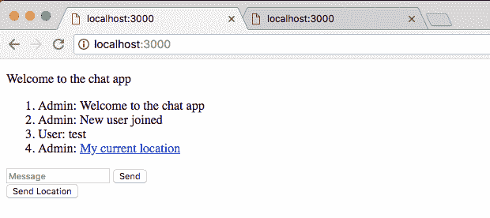

对于用户二也是一样。现在如果我点击那个链接，它应该在一个全新的标签页中打开，里面包含正确的 URL、`纬度`和`经度`信息。

就在这里，我们有了点击“发送位置”按钮的用户的位置。有了这个，我们有了一个很棒的地理位置功能。你所要做的就是点击按钮；它会获取你当前的位置，无论你在哪里，然后渲染一个可点击的链接，这样任何其他人都可以在 Google 地图中查看它。现在在我们离开之前，我希望你为这个全新的`generateLocationMessage`函数添加一个单独的测试用例。

# 为`generateLocationMessage`添加测试用例

在终端中，我可以关闭服务器并使用`clear`来清除输出。如果我使用`npm test`运行我们的测试套件，我们会看到我们有一个测试，并且它通过了：

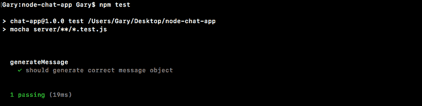

你的工作是在`message.test.js`中添加第二个测试用例。

我们将一起开始。就在这里，我们将添加一个`describe`块，描述`generateLocationMessage`函数，你将负责在回调函数内添加一个测试用例：

```js
describe('generateLocationMessage', () => {

});
```

在这里，你将调用`it ('should generate correct location object')`。接下来，我们可以继续添加我们的函数，这将是一个同步测试，所以不需要添加`done`参数：

```js
describe('generateLocationMessage', () => {
  it('should generate correct location object', () => {

  });
});
```

现在，我们将编写一个与`generateMessage`事件非常相似的测试用例，尽管不是传递`from`和`text`，而是传递`from`、`latitude`和`longitude`。然后你将对返回的值进行一些断言。然后我们将运行测试用例，确保一切都通过了终端。

# 为测试用例添加变量

首先，我将创建两个变量。我将创建一个`from`变量，并将其设置为`Deb`之类的内容。然后我们可以继续创建一个`latitude`变量，我将其设置为`15`。然后我们可以创建一个`longitude`变量，将其设置为`19`之类的内容：

```js
describe('generateLocationMessage', () => {
  it('should generate correct location object', () => {
    var from = 'Deb';
    var latitude = 15;
    var longitude = 19;
  });
});
```

然后我将最终创建一个`url`变量。`url`变量将是最终结果，我期望得到的 URL。现在该 URL 将在引号内[`www.google.com/maps`](https://www.google.com/maps)，然后我们将根据我们要传入的信息添加适当的查询参数。如果纬度是`15`，我们期望在等号后得到`15`，如果经度是`19`，我们期望在逗号后得到`19`：

```js
describe('generateLocationMessage', () => {
  it('should generate correct location object', () => {
    var from = 'Deb';
    var latitude = 15;
    var longitude = 19;
    var url = 'https://www.google.com/maps?q=15,19';
  });
});
```

现在我们已经准备好了，我们可以调用我们的函数存储响应。我将创建一个名为`message`的变量，然后我们将调用`generateLocationMessage`，目前不需要，我们可以在下一秒钟内完成。然后我们将传入我们的三个参数`from`，`latitude`和`longitude`：

```js
describe('generateLocationMessage', () => {
  it('should generate correct location object', () => {
    var from = 'Deb';
    var latitude = 15;
    var longitude = 19;
    var url = 'https://www.google.com/maps?q=15,19';
    var message = generateLocationMessage(from, latitude, longitude);
  });
});
```

现在让我们继续并且也执行`generateLocationMessage`和`generateMessage`：

```js
var expect = require('expect');

var {generateMessage, generateLocationMessage} = require('./message');
```

现在唯一剩下的事情就是进行我们的断言。

# 为`generateLocationMessage`进行断言

我们将以类似的方式开始。我实际上要将这两行从`generateMessage`复制到`generateLocationMessage`的测试用例中：

```js
expect(message.createdAt).toBeA('number');
expect(message).toInclude({from, text});
```

我们期望`message.createdAt`属性是一个数字，它应该是，然后我们期望消息包含一个`from`属性等于`Deb`，我们期望它有一个`url`属性等于我们定义的`url`字符串：

```js
describe('generateLocationMessage', () => {
  it('should generate correct location object', () => {
    var from = 'Deb';
    var latitude = 15;
    var longitude = 19;
    var url = 'https://www.google.com/maps?q=15,19';
    var message = generateLocationMessage(from, latitude, longitude);

    expect(message.createdAt).toBeA('number');
    expect(message).toInclude({from, url});
  });
});
```

如果这两个断言都通过了，那么我们就知道从`generateLocationMessage`返回的对象是正确的。

# 运行`generateLocationMessage`的测试用例

我将在终端中重新运行测试套件，一切都应该如预期般工作：

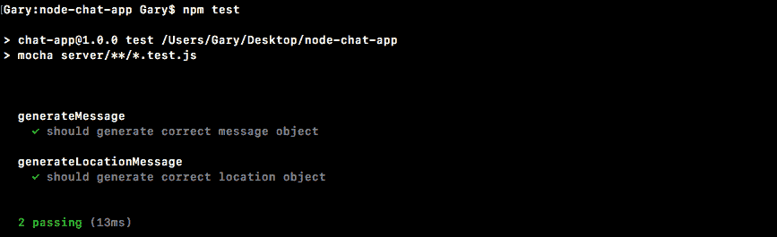

就是这样了！我们已经设置好了地理位置，我们的链接已经呈现，我们可以继续进行。我将在终端中添加一个`commit`。我将运行`clear`命令来清除`Terminal`输出，然后我们将运行`git status`来查看所有更改的文件，然后我们可以使用`git commit`和`-am`标志为此添加一条消息，`Add geolocation support via geolocation api`：

```js
git commit -am 'Add geolocation support via geolocation api'
```

我将继续提交并将其推送到 GitHub，并且我们还可以花一点时间将其部署到 Heroku，使用`git push heroku master`。

这将部署我们最新的代码，其中包含地理位置信息。我们将能够运行此代码，因为我们将在 HTTPS 上运行，这将在 Chrome 移动浏览器等上运行。Google Chrome 的移动浏览器和其他移动浏览器对何时发送地理位置信息有相当严格的安全准则。它需要通过 HTTPS 连接，这正是我们现在所拥有的。我将在几个标签中打开我们的 Heroku 应用程序。我们将在标签一中打开它，然后在第二个标签中也打开它。我将点击“发送位置”按钮。我需要批准这一点，因为它是不同的 URL，是的，我希望他们能够使用我的位置。它将获取位置，发送位置，第一个标签获取链接。我点击链接，希望我们得到相同的位置。

# 总结

在本章中，我们致力于生成文本和位置消息。我们研究了生成`newMessage`对象，然后为其编写了一个测试用例。然后，我们学习了如何使用事件确认。然后我们添加了消息表单字段，并在屏幕上呈现了一个输入字段和一个按钮。我们还讨论了 jQuery 的概念，并使用它来选择和创建传入消息元素。

在地理位置部分，我们为用户提供了一个新按钮。这个新按钮允许用户发送他们的位置。我们为发送位置按钮设置了一个`click`监听器，这意味着每当用户点击它时，我们会根据他们对地理位置 API 的访问执行一些操作。如果他们没有访问地理位置 API，我们只是打印一条消息。如果他们有访问权限，我们会尝试获取位置。

在下一章中，我们将研究如何为我们的聊天页面设置样式，使其看起来更像一个真正的网络应用程序。
