# 第七章：将我们的聊天页面设置为 Web 应用程序

在上一章中，您了解了 Socket.io 和 WebSockets，它们使服务器和客户端之间实现了双向通信。在本章中，我们将继续讨论如何为我们的聊天页面设置样式，使其看起来更像一个真正的 Web 应用程序。我们将研究时间戳和使用 Moment 方法格式化时间和日期。我们将创建和渲染`newMessage`和`newLocation`消息的模板。我们还将研究自动滚动，使聊天不那么烦人。

# 设置聊天页面的样式

在这一部分，我们将设置一些样式，使我们的应用看起来不那么像一个未经样式处理的 HTML 页面，而更像一个真正的 Web 应用程序。现在在下面的截图中，左边是 People 面板，虽然我们还没有连接它，但我们已经在页面中给它了一个位置。最终，这将存储连接到个人聊天室的所有人的列表，这将在稍后完成。

在右侧，主要区域将是消息面板：

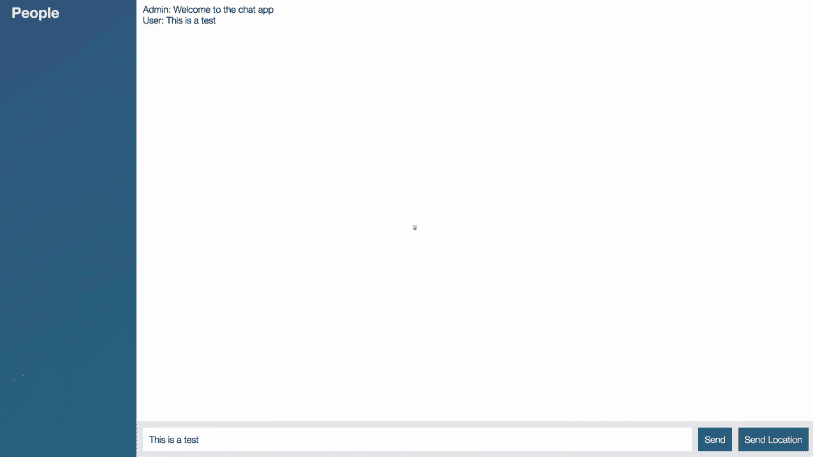

现在个别的消息仍然没有样式，这将在稍后完成，但我们有一个放置所有这些东西的地方。我们有我们的页脚，这包括我们发送消息的表单，文本框和按钮，还包括我们的发送位置按钮。

现在为了完成所有这些，我们将添加一个我为这个项目创建的 CSS 模板。我们还将向我们的 HTML 添加一些类；这将让我们应用各种样式。最后，我们将对我们的 JavaScript 进行一些小的调整，以改善用户体验。让我们继续深入。

# 存储模板样式

我们要做的第一件事是创建一个新文件夹和一个新文件来存储我们的样式。这将是我们马上要获取的模板样式，然后我们将加载它到`index.html`中，这样在渲染聊天应用程序时就会使用这些样式。

现在我们要做的第一件事是在`public`中创建一个新文件夹，将这个文件夹命名为`css`。我们将向其中添加一个文件，一个名为`styles.css`的新文件。

现在在我们去获取任何样式之前，让我们将这个文件导入到我们的应用程序中，并为了测试和确保它工作，我们将编写一个非常简单的选择器，我们将使用`*`选择所有内容，然后在大括号内添加一个样式，将所有内容的`color`设置为`red`：

```js
* {
   color: red;
}
```

继续制作你的文件，就像这个一样，我们将保存它，然后在`index.html`中导入它。在`head`标签的底部跟随我们的`meta`标签，我们将添加一个`link`标签，这将让我们链接一个样式表。我们必须提供两个属性来完成这个操作，首先我们必须告诉 HTML 我们要链接到什么，通过指定`rel`或关系属性。在这种情况下，我们要链接一个`style sheet`，所以我们将提供它作为值。现在我们需要做的下一件事是提供`href`属性。这类似于`script`标签的`src`属性，它是要链接的文件的路径。在这种情况下，我们在`/css`中有一个`styles.css`文件：

```js
<head>
  <meta charset="utf-8">
  <link rel="stylesheet" href="/css/styles.css">
</head>
```

现在我们可以保存`index.html`，在浏览器中刷新页面或者首次加载页面，我们看到的是一个丑陋的页面：

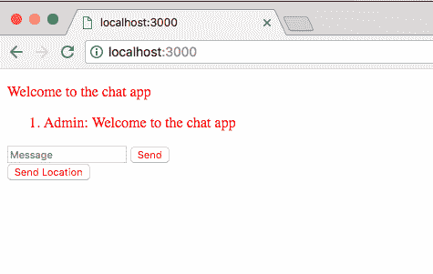

我们设法使它比以前更丑，但这很好，因为这意味着我们的样式表文件被正确导入了。

为了获取我们将在聊天应用程序中使用的实际模板，我们将访问一个 URL，[`links.mead.io/chat-css`](http://links.mead.io/chat-css)。这只是一个将重定向您到一个 Gist 的 bitly 链接，这里有两个选项，我们可以获取压缩的样式模板或未压缩的样式模板：

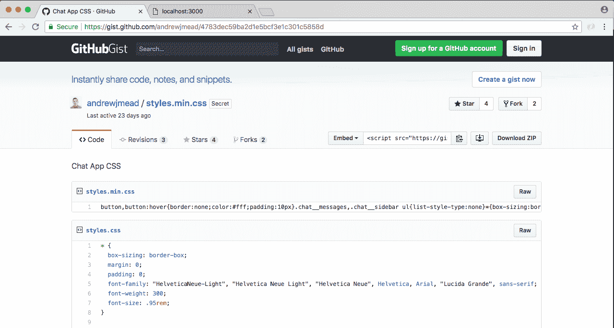

我将继续获取压缩的文件，可以通过高亮它或点击原始链接来获取，这将带我们到文件。我们将获取我们在那里看到的全部内容，然后转到 Atom 并将其粘贴到我们的`styles.css`文件中，显然删除之前的选择器。

现在我们已经完成了这一步，我们可以刷新页面，尽管我们不会看到太多改进。在`localhost:3000`中，我将刷新浏览器，显然事情已经有所不同：

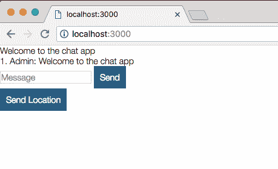

这是因为我们需要在我们的 HTML 中应用一些类，以便一切都能正确工作。

# 调整结构以对齐

我们需要调整结构，添加一些容器元素来帮助对齐。在 Atom 中，我们可以在短短几分钟内完成这项工作。这个模板是围绕一些关键类构建的。第一个类需要应用到`body`标签上，通过将`class`属性设置为，引号内的`chat`：

```js
<body class="chat">
```

这告诉样式表为这个聊天页面加载这些样式，我们将继续删除`Welcome to the chat app`，这已经不再需要了。现在我们要做的下一件事是创建一个`div`标签，这个`div`将包含我们在左侧看到的`People`列表。目前它是空的，但没关系，我们仍然可以继续创建它。

我们将创建一个`div`，并给这个`div`添加一个类，这个`class`将被设置为`chat__sidebar`：

```js
<body class ="chat">

  <div class="chat">

  </div>
```

这是一种在一些样式表模板中使用的命名约定，这实际上是一个偏好的问题，当你创建样式表时，你可以随意命名它，我碰巧称它为`chat__sidebar`。这是一个更大的聊天应用程序中的子元素。

现在在`div`标签中，我们将使用`h3`标签添加一个小标题，我们将给它一个标题`People`，或者你想给侧边栏列表起的任何名字，我们还将提供一个`div`，最终将包含个人用户，尽管我提到我们暂时不会将其连接起来。现在我们可以给它一个`id`，将其设置为`users`，这样我们稍后就可以定位它。这就是我们目前聊天侧边栏所需要的一切：

```js
<div class ="chat__sidebar">
  <h3>People</h3>
  <div id="user"></div>
</div>
```

接下来，我们要做的是创建一个`div`标签，这个`div`将包含主要区域，这意味着它不仅包含我们的聊天消息，还包含底部的小表单，以及侧边栏右侧的所有内容。

这也需要为一些样式创建一个自定义类，这个类叫做`chat__main`，在这里我们不仅要添加无序列表，还要添加我们的`form`和`button`。让我们继续拿出我们当前的标记，从无序列表到发送位置按钮，把它剪切出来，粘贴到`chat__main`中：

```js
<div class="chat__main">
  <ol id="messages"></ol>

  <form id="message-form">
    <input name="message" type="text" placeholder="Message"/>
    <button>Send</button>
  </form>
  <button id="send-location">Send Location</button>
</div>
```

现在我们还没有完成，还有一些需要调整的地方。首先，我们必须为我们的有序列表添加一个类，我们将把`class`设置为`chat__messages`，这将提供必要的样式，我们需要创建的最后一个`div`是底部的灰色条，其中包含`form`和`Send Location`按钮。我们将创建一个`div`来帮助对齐，并且我们将把`form`和`button`标签放在里面，通过剪切并粘贴到有序列表的`div`中：

```js
<div class="chat__main">
  <ol id="messages" class="chat__messages"></ol>

  <form id="message-form">
    <input name="message" type="text" placeholder="Message"/>
    <button>Send</button>
  </form>
  <button id="send-location">Send Location</button>
</div>
```

现在我们也需要在这里添加一个类，正如你可能已经猜到的那样，将`class`属性设置为字符串`chat__footer`：

```js
<div class="chat__footer">
  <form id="message-form">
    <input name="message" type="text" placeholder="Message"/>
    <button>Send</button>
  </form>
  <button id="send-location">Send Location</button>
</div>
```

现在我们所有的类都已经就位，我们可以转到浏览器，看看当我们刷新页面时会得到什么。

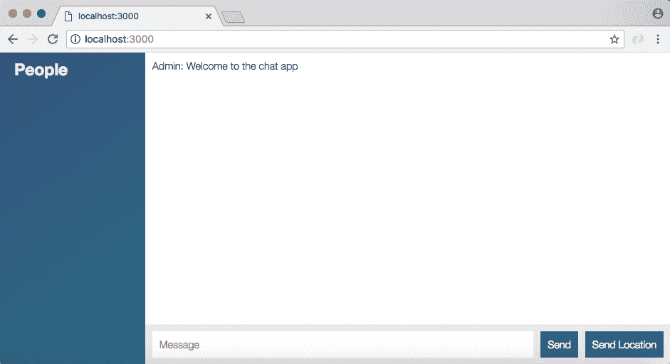

我们有我们样式化的聊天应用程序，我们仍然可以做以前能做的任何事情。我可以发送一条消息，`嘿，这应该仍然有效`，按*enter*，`嘿，这应该仍然有效`会显示在屏幕上：

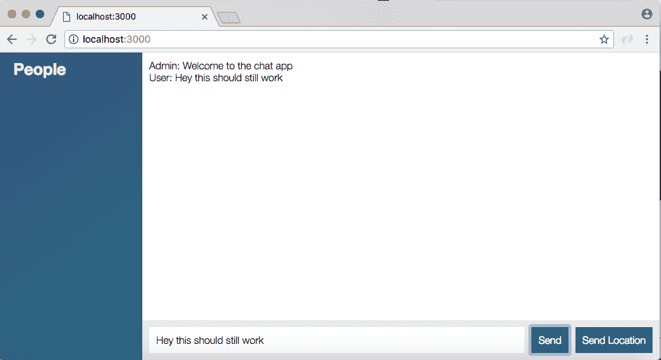

对于发送位置也是一样，我可以发送我的位置，这会发送到服务器，发送到所有客户端，我可以点击我的当前位置链接，位置会显示在 Google 地图上。我们保留了所有旧的功能，同时添加了一套漂亮的样式：

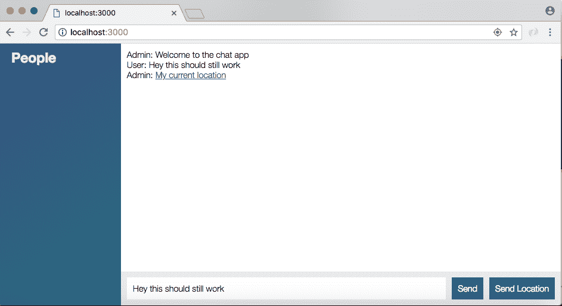

# 改进用户体验

现在在本节的第二部分中，我想对表单进行一些用户体验改进。

我们要做的一个改进是在成功发送消息后清除文本值。我们还将对发送位置做类似的操作。正如你可能已经注意到的，发送位置的地理位置调用实际上可能需要一秒或两秒的时间才能完成，我们将禁用此按钮，以防有人不知道发生了什么而进行垃圾邮件式的点击。我们还将更新文本，以便显示`正在发送位置`，这样某人就知道背景中正在发生一些事情。

为了完成这两件事，我们只需要修改`index.js`内的几行。在文件底部附近，我们有两个 jQuery 事件监听器，这两个都将被更改。

# 更改表单提交监听器

现在我们要改变的第一件事是表单提交监听器。在`socket.emit`中，我们从字段中获取值，这就是我们传递的值。接下来我们想要做的是在确认回调函数内清除该值。一旦服务器接收到请求，就没有理由继续保留它，所以我们可以添加相同的`jQuery`选择器，定位`name`属性等于`message`的字段。我们将继续通过再次调用`val`来清除它的值，但是不同于不提供参数获取值，我们将通过传递空字符串作为第一个参数来将值设置为空字符串：

```js
jQuery('#message-form').on('submit', function (e) {
  e.prevenDefault();

  var messageTextbox =

  socket.emit('createMessage', {
    from: 'User',
    text: jQuery('[name=message]').val()
 }, function () {
    jQuery('[name=message]').val('')
  });
});
```

你可以将值设置为任何你喜欢的东西，但在这种情况下，我们只想清除它，所以我们将使用以下方法调用。

我们两次使用相同的选择器以加快速度，我们将创建一个变量，我们将称该变量为`messageTextbox`，然后我们可以将其设置为我们刚刚创建的选择器，现在我们可以在任何需要访问该输入的地方引用`messageTextbox`。我们可以像这样引用它，`messageTextbox`，接下来，`messageTextbox`：

```js
var messageTextbox = jQuery('[name=message]'); 

socket.emit('createMessage', { 
  from: 'User', 
  text: messageTextbox.val() 
}, function() { 
  messageTextbox.val('') 
}); 
```

现在`createMessage`的监听器，位于`server.js`内，我们确实使用一个字符串调用回调函数。现在，我们将只是删除那个虚假的传递零参数的值，就像这样：

```js
socket.broadcast.emit('newMessage', generateMessage('Admin, 'New user joined'));

socket.on('createMessage', (message, callback) => {
  console.log('createMessage', message);
  io.emit('newMessage', generateMessage(message.form, message.text));
  callback();
});
```

这意味着确认函数仍然会被调用，但实际上我们不需要任何数据，我们只需要知道服务器何时响应。现在我们已经做好了，我们可以继续在`localhost:3000`内刷新，输入一条消息，`这是一条消息`，然后按下*enter*键，我们会得到清除的值，而且确实已经发送了：

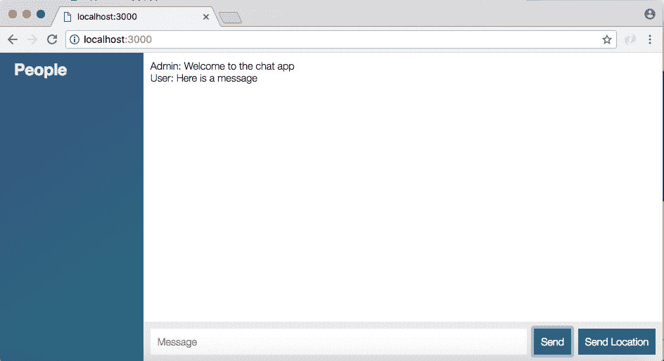

如果我输入一条消息，`安德鲁`，然后点击发送按钮，同样的事情也会发生。

# 更新输入标签

现在我们要做的一件事是快速更新文本框的`input`标签。如果我刷新页面，我们当前并没有直接进入消息字段，这样做会很好。关闭自动完成也会很好，因为你可以看到，自动完成并不是一个有用的功能，里面的值通常都是垃圾。

在 Atom 内部，我们要做的是添加两个属性来自定义输入。第一个是`autofocus`，它不需要一个值，当 HTML 被渲染时，`autofocus`会自动对焦在输入上，第二个我们要添加的是`autocomplete`，我们将把它设置为字符串`off`：

```js
<div class="chat__footer">
<form id="message-form">
  <input name="message" type="text" placeholder="Message" autofocus autocomplete="off"/>
  <button>Send</button>
<form>
<button id="send-location">Send Location</button>
```

有了这个设置，我们可以保存`index.html`，回到 Chrome，刷新页面并测试一下。我会输入`test`，我们没有自动完成，这很好，我们关闭了它，如果我点击发送按钮，我确实还在发送消息。当我重新加载页面时，我也直接进入了文本框，我不需要做任何事情就可以开始输入。

# 自定义发送位置

接下来我们要做的是使用更多的 jQuery 来自定义发送位置按钮。现在我们对 jQuery 还不太熟悉，这也不是一个 jQuery 课程。这里的目标是改变按钮文本，并在进行过程时禁用它。当过程完成时，也就是位置被发送或未发送时，我们可以将按钮恢复到正常状态，但在地理位置调用发生时，我们不希望有人不断点击。

为了完成这个任务，我们将对`index.js`中的最终监听器进行一些调整，在我们的提交监听器旁边，我们有一个点击监听器。在这里，我们需要对按钮进行一些更改，我们定义的`locationButton`变量。我们将设置一个属性来禁用按钮。

为了完成这个任务，我们将引用选择器`locationButton`，并调用一个 jQuery 方法。

现在我们只会在确认他们甚至支持它之后禁用它，如果他们不支持这个功能，就没有理由去禁用它。在这里，`locationButton.attr`将让我们设置一个属性，我们将把`disabled`属性设置为值`disabled`。现在这个`disabled`也需要加上引号：

```js
var locationButton = jQuery('#send-location');
locationButton.on('click', function () {
  if (!navigator.geolocation) {
    return alert('Geolocation not supported by your browser.');
  }

  locationButton.attr('disabled', 'disabled');
```

现在我们已经禁用了按钮，我们可以实际测试一下，我们从未取消禁用它，所以在点击一次后它就会出现问题，但我们可以确认这行代码有效。在浏览器中，我将刷新一下，点击发送位置，你会立刻看到按钮被禁用了：

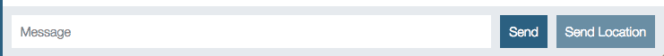

现在它会发送位置一次，但如果我再试图点击它，按钮就会被禁用，永远不会再次触发`click`事件。这里的目标是只在实际发生过程中禁用它，一旦像这样发送了，我们希望重新启用它，这样别人就可以发送更新的位置。

为了在 Atom 内部完成这个任务，我们将在成功处理程序和错误处理程序中添加一行 jQuery。如果事情进展顺利，我们将引用`locationButton`，并使用`removeAttr`来移除禁用属性。这只需要一个参数，属性的名称，在这种情况下，我们有一个字符串`disabled`：

```js
locationButton.attr('disabled', 'disabled');

navigator.geolocation.getCurrentPosition(function (position) {
  locationButton.removeAttr('disabled');
  socket.emit('createLocationMessage', {
    latitude: position.coords.latitude,
    longitude: position.coords.longitude
  });
```

这将移除我们之前定义的`disabled`属性，重新启用按钮。我们可以做完全相同的事情，简单地复制并粘贴下一行到`function`中。如果由于某种原因我们无法获取位置，也许用户拒绝了对地理位置的请求，我们仍然希望禁用该按钮，以便他们可以再次尝试：

```js
navigator.geolocation.getCurrentPosition(function (position){ 
  locationButton.removeAttr('disabled'); 
  socket.emit('createLocationMessage', { 
    latitude: position.coords.latitude, 
    longitude: position.coords.longitude 
  }); 
}, function(){ 
   locationButton.removeAttr('disabled');
   alert('Unable to fetch location'); 
}); 
```

现在我们已经设置好了，我们可以通过刷新浏览器并尝试发送我们的位置来测试该代码。我们应该看到按钮在一小段时间内被禁用，然后重新启用。我们可以点击它来证明它按预期工作，并且按钮已重新启用，这意味着我们可以在以后的时间再次点击它发送我们的位置。

# 更新按钮文本

现在我们要做的最后一件事是在过程发生时更新按钮文本。为了完成这个任务，在 Atom 中我们将使用过去使用过的`text`方法。

在`locationButton.attr`行中，我们将把`text`属性设置为`Sending location...`。现在，在`index.js`文件中，真正的按钮文本是`Send Location`，我将把`location`转换为小写以保持统一。

```js
var locationButton = jQuery('#send-location');
locationButton.on('click', function (){
  if (!navigator.geolocation){
    return alert('Geolocation not supported by your browser.');
  }
  locationButton.attr('disabled', 'disabled').text('Sending location...');
```

现在我们已经设置好了，我们正在更新过程发生时的文本，唯一剩下的事情就是通过将`text`设置为字符串`Send location`来将其调整回原始值，我们将在错误处理程序中做完全相同的事情，调用`text`传入字符串`Send location`：

```js
locationButton.attr('disabled', 'disabled').text('Sending location...'); 

navigator.geolocation.getCurrentPosition(function (position){ 
  locationButton.removeAttr('disabled').text('Send location'); 
  socket.emit('createLocationMessage', { 
    latitude: position.coords.latitude, 
    longitude: position.coords.longitude 
  }); 
}, function(){ 
    locationButton.removeAttr('disabled').text('Send location'); 
    alert('Unable to fetch location'); 
}); 
```

现在我们可以继续测试这是否按预期工作，这两行（成功和错误处理程序中）是相同的，无论成功与否，我们都会做同样的事情。

在 Chrome 中，我将再次刷新我的页面，我们将点击发送位置按钮，您可以看到按钮被禁用并且文本已更改，显示“正在发送位置...”：

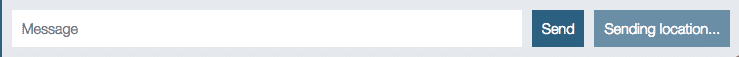

一旦过程完成并且位置实际上已发送，按钮将返回到其默认状态。

有了这个设置，我们现在比以前有了更好的用户体验。我们不仅拥有一套漂亮的样式，还为我们的表单和发送位置按钮提供了更好的 UI。这就是我们在本节中要停止的地方。

让我们继续通过关闭服务器，运行`git status`，运行`git add .`来快速提交所有这些文件，最后我们将继续运行`git commit`，并使用`-m`标志提供消息，`Add css for chat page`：

```js
**git commit -m 'Add css for chat page'**
```

我们可以使用`git push`将其推送到 GitHub，并且我现在不打算部署到 Heroku，尽管您可以部署并测试您的应用程序。

# Moment 中的时间戳和格式化

在整个课程中，我们已经相当多地使用了时间戳，在待办事项应用程序中生成了它们，并且在聊天应用程序中为所有消息生成了它们，但我们从未将它们格式化为可读的形式。这将是本节的主题，在下一节中我们将把它付诸实践。

到下一节结束时，我们将拥有一个格式化的消息区域，其中包括名称、时间戳和消息，并且我们也将为其提供一些更好的样式。现在在本节中，一切都将围绕时间和时间戳展开，我们不会对应用程序的前端进行任何更改，我们只是要学习 Node 中的时间是如何工作的。

# Node 中的时间戳

为了探索这一点，我们将创建一个新的`playground`文件，在 Atom 中我们将创建一个`playground`文件夹来存储这个文件，在`playground`文件夹中我们可以创建一个名为`time.js`的新文件。在这里，我们将玩转时间，并将在下一节将我们在这里学到的内容带入应用程序的前端。

我们对时间戳并不陌生，我们知道它们只是整数，无论是正数还是负数，像`781`这样的数字是一个完全有效的时间戳，就像几十亿或任何数字一样，所有都是有效的，甚至`0`也是一个完全有效的时间戳。现在所有这些数字都是相对于历史上的某一时刻的，这个时刻被称为 Unix 纪元，即 1970 年 1 月 1 日午夜 0 时 0 分 0 秒。这是存储在 UTC 中的，这意味着它与时区无关：

```js
// Jan 1st 1970 00:00:00 am

0
```

现在我的时间戳`0`实际上完美地代表了历史上的这一刻，而像 1000 这样的正数则表示未来，而像-1000 这样的负数则表示过去。时间戳-1000 将代表 1969 年 12 月 31 日 11 点 59 分 59 秒，我们已经从 1970 年 1 月 1 日过去了一秒。

现在，在 JavaScript 中，这些时间戳以毫秒存储自 Unix 纪元以来的时间，而在常规的 Unix 时间戳中，它们实际上是以秒存储的。由于我们在本课程中使用 JavaScript，我们将始终使用毫秒作为我们的时间戳值，这意味着像 1000 这样的时间戳代表了 1 月 1 日的一秒，因为一秒钟有 1000 毫秒。

像 10000 这样的值将是这一天的十秒，依此类推。现在对我们来说，问题从来不是获取时间戳，获取时间戳非常容易，我们只需要调用`new Date`调用它的`getTime`方法。然而，当我们想要格式化一个类似于之前的人类可读值时，情况将变得更加困难。

我们将要在我们的 Web 应用程序中打印一些不仅仅是时间戳的东西，我们将要打印一些像五分钟前这样的东西，让用户知道消息是五分钟前发送的，或者你可能想打印实际的日期，包括月份、日期、小时、分钟和上午或下午的值。无论你想打印什么，我们都需要谈一谈格式化，这就是默认的`Date`对象不足的地方。

是的，有一些方法可以让你从日期中获取特定的值，比如年份、月份或日期，但它们非常有限，定制起来是一个巨大的负担。

# 日期对象

要讨论确切的问题，让我们继续查看日期的文档，通过谷歌搜索`mdn date`，这将带我们到 Mozilla 开发者网络文档页面上的*Date*，这是一个非常好的文档集：

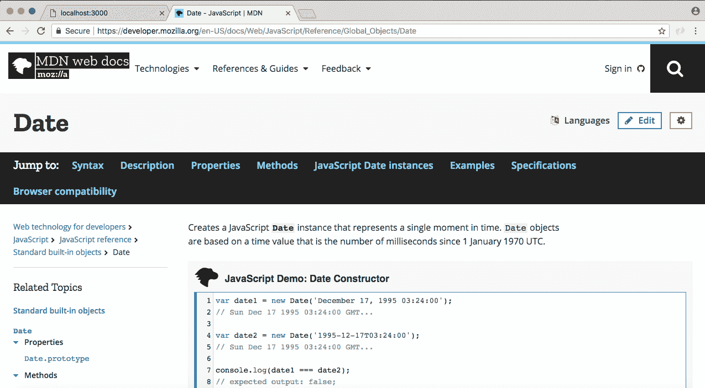

在这个页面上，我们可以访问所有可用的方法，这些方法都类似于`getTime`，返回关于日期的特定信息：

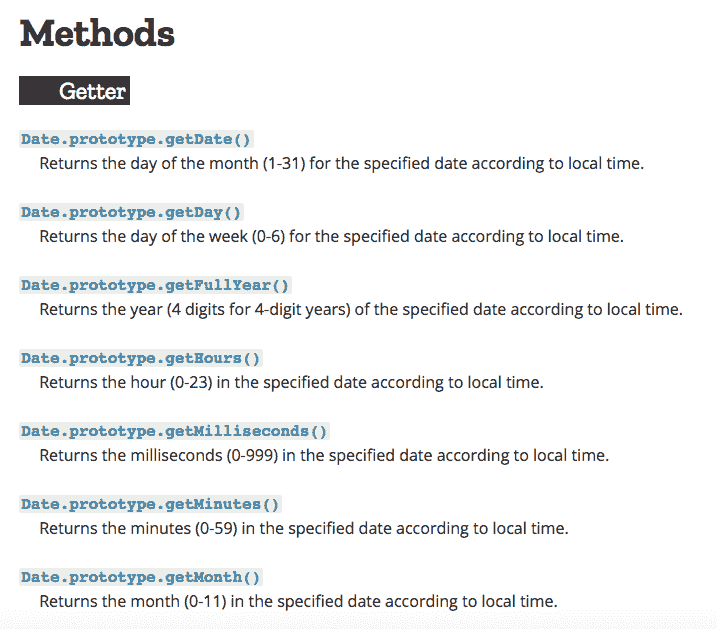

例如，如前面的屏幕截图所示，我们有一个`getDate`方法，返回月份的日期，一个从 1 到 31 的值。我们有像`getMinutes`这样的方法，返回时间戳的当前分钟数。所有这些都存在于`Date`中。

现在问题是这些方法非常不灵活。例如，在 Atom 中，我们有这个小日期，`1970 年 1 月 1 日 00:00:10`。这是 1 月的简写版本。现在我们可以获取实际的月份来展示给你，我们将创建一个名为`date`的变量。我们将创建`new Date`，然后我们将调用一个方法。我将使用`console.log`将值打印到屏幕上，我们将调用`date.getMonth`：

```js
// Jan 1st 1970 00:00:10 am

var date = new Date();
console.log(date.getMonth());
```

如文档中所定义的`getMonth`方法将返回一个基于 0 的月份值，从 0 到 11，其中 0 是一月，11 是十二月。在终端中，我将使用`nodemon`启动我们的应用程序，因为我们将经常重启它。Nodemon 在`playground`文件夹中而不是`server`文件夹中，文件本身称为`time.js`：

```js
**nodemon playground/time.js**
```

一旦它运行起来，我们看到我们得到了`2`，这是预期的：

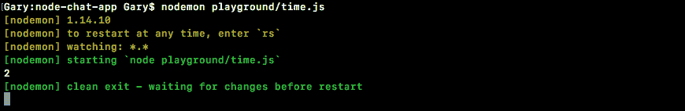

现在是 2018 年 3 月 25 日，而 3 月的`0`索引值将是`2`，尽管你通常认为它是 3。

现在前面的结果很好。我们有数字 2 来表示月份，但要获得实际的字符串 Jan 或 January 将会更加困难。没有内置的方法来获取这个值。这意味着如果你想要获得这个值，你将不得不创建一个数组，也许你称这个数组为`months`，并且存储所有这样的值：

```js
var date = new Date();
var months = ['Jan', 'Feb']
console.log(date.getMonth());
```

这将是很好的，对于月份可能看起来并不是那么重要，但是对于月份的日期，比如我们有的`1st`，我们只能得到数字 1。实际上将其格式化为 1st、2nd 或 3rd 将会更加困难。对于格式化日期，确实没有一个好的方法集。

当你想要一个相对时间字符串时，事情变得更加复杂，比如三分钟前。在 web 应用程序中打印这个信息会很好，打印实际的月份、日期和年份并不特别有用。如果我们能够说，嘿，这条消息是三小时前发送的，三分钟前发送的，或者三年前发送的，就像很多聊天应用程序所做的那样，那就太酷了。

# 使用 Moment 进行时间戳

现在当你涉及到这样的格式化时，你的第一反应通常是创建一些实用方法来帮助格式化日期。但是没有必要这样做，因为我们在这一部分要看的是一个名为**Moment**的了不起的时间库。Moment 几乎是其类别中唯一的库。它被普遍认为是处理时间和 JavaScript 的首选库，我从来没有在一个没有使用 Moment 的 Node 或前端项目上工作过，当你以任何方式处理日期时，它确实是必不可少的。

为了展示 Moment 为什么如此出色，我们首先要在终端内安装它。然后我们将玩弄它的所有功能，它有很多。我们可以通过运行`npm i`来安装它，我将使用当前版本`moment@`版本`2.21.0`，并且我还将使用`--save`标志将其添加为一个依赖项，这是我们在 Heroku 上以及本地都需要的一个依赖项：

```js
**npm i moment@2.21.0 --save**
```

一旦它安装好了，我可以使用`clear`来清除终端输出，然后我们可以继续重新启动`nodemon`。在`playground`文件夹内，是时候引入 Moment 并且看看它对我们能做什么。

首先，让我们试着解决我们之前尝试解决日期问题。我们想要打印月份的简写版本，比如 Jan、Feb 等。第一步将是将之前的代码注释掉，并在顶部加载之前的 Moment，需要它。我将创建一个名为`moment`的变量，并通过`require`来加载`moment`库：

```js
var moment = require('moment');

// Jan 1st 1970 00:00:10 am

//var date = new Date();
//var months = ['Jan', 'Feb']
//console.log(date.getMonth());
```

然后在这段代码旁边，我们将通过创建一个新的 moment 来开始。现在就像我们创建一个新的日期来获得一个特定的日期对象一样，我们将用 moment 做同样的事情。我将把这个变量称为`date`，并且我们将把它设置为调用`moment`的结果，之前我们加载的函数，不带任何参数：

```js
var moment = require('moment');

// Jan 1st 1970 00:00:10 am

//var date = new Date();
//var months = ['Jan', 'Feb']
//console.log(date.getMonth());

var date = moment();
```

这将创建一个代表当前时间点的新 moment 对象。从这里，我们可以尝试使用它非常有用的`format`方法来格式化东西。`format`方法是我喜欢 Moment 的主要原因之一，它使得打印任何你想要的字符串变得非常简单。现在在这种情况下，我们可以访问我们的`date`，然后我们将调用我刚才谈到的方法，`format`：

```js
var moment = require('moment');
var date = moment(); 
console.log(date.format());
```

在我们讨论传递给格式的内容之前，让我们继续运行它就像这样。当我们在终端内运行时，`nodemon`将会重新启动自己，然后我们就有了我们格式化后的日期：

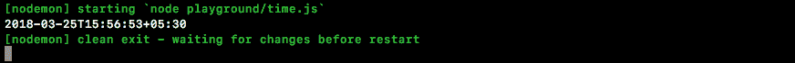

我们有年份、月份、日期和其他值。它仍然不是非常用户友好，但这是朝着正确方向迈出的一步。`format`方法的真正威力是当你在其中传递一个字符串时。

现在我们传递到格式方法中的是模式，这意味着我们可以访问一组特定的值，我们可以用来输出某些东西。我们将在接下来的一秒钟内探索所有可用的模式。现在，让我们继续使用一个；就是三个大写的`M`模式：

```js
var date = moment(); 
console.log(date.format('MMM'));
```

当 Moment 看到格式中的这个模式时，它将继续抓取月份的简写版本，这意味着如果我保存这个文件，并再次在终端中重新启动它。我们现在应该看到当前月份九月的简写版本，即`Mar`：

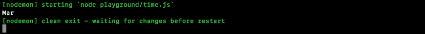

这里我们得到了`Sep`，正如我们所期望的那样，我们能够通过使用格式方法来简单地实现这一点。现在格式返回一个字符串，其中只包含你指定的内容。在这里，我们只指定了我们想要月份的简写版本，所以我们得到的只是月份的简写版本。我们还可以添加另一个模式，四个 Y，它打印出完整的年份；在当前情况下，它将以数字形式打印出 2016：

```js
console.log(date.format('MMM YYYY')); 
```

我将继续节省时间，这里我们得到了`Mar 2018`：

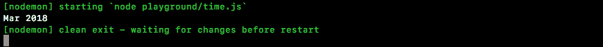

现在 Moment 有一套很棒的文档，所以你可以使用任何你喜欢的模式。

# Moment 文档

在浏览器中，我们可以通过访问[momentjs.com](http://momentjs.com/)来查看。Moment 的文档非常棒。它可以在文档页面上找到，并且为了开始弄清楚如何使用格式，我们将转到显示部分：

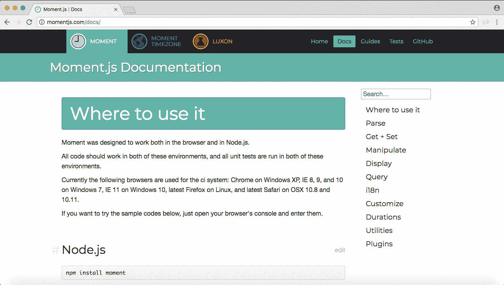

显示中的第一项是格式。有一些关于如何使用格式的示例，但真正有用的信息是我们在这里拥有的：

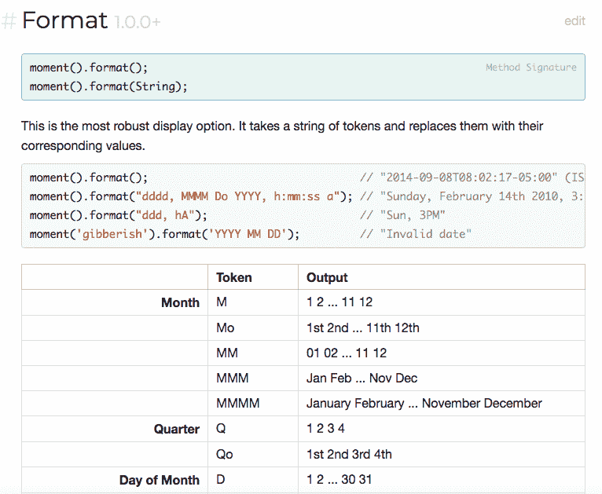

这里有我们可以放入字符串中以我们喜欢的方式格式化日期的所有标记。在上面，你可以看到你可以使用尽可能多的这些标记来创建非常复杂的日期输出。现在我们已经探索了两个。我们探索了`MMM`，它就在月份标题下面定义，你可以看到有五种不同的表示月份的方式。

我们用于年份的`YYYY`模式也在这里定义了。有三种使用年份的方式。我们刚刚探索了其中一种。每个部分都有，年份、星期几、月份中的日期、上午/下午、小时、分钟、秒，所有这些都有定义，都可以像我们为当前值所做的那样放入格式中：

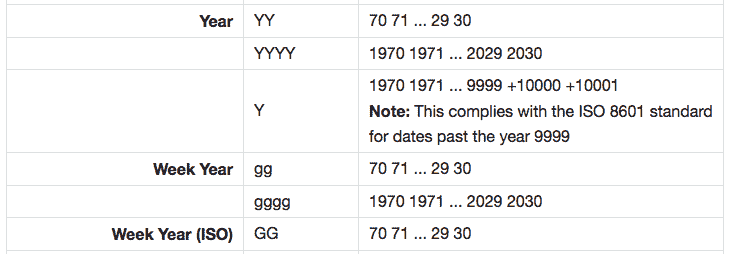

现在，为了更深入地探索一下，让我们回到 Atom，并利用其中的一些功能。我们要尝试的是打印日期，如`Jan 1st 1970`，我们已经有了简写的月份和年份，但现在我们还需要将月份的日期格式化为 1st、2nd、3rd，而不是 1、2、3。

# 使用 Moment 格式化日期

为了做到这一点，如果我以前没有使用过 Moment，我会在文档中查找日期部分，然后查看可用的选项。我有打印 1 到 31 的 D 模式，打印我们想要的 1st、2nd、3rd 等的 Do 模式，以及对于小于 10 的值，打印带有 0 的数字的 DD 模式。 

现在在这种情况下，我们想使用 Do 模式，所以我们只需要在格式中输入它。我将打开终端和 Atom，这样我们就可以看到后台中的刷新，然后我们将输入：

```js
console.log(date.format('MMM Do YYYY')); 
```

保存文件，当它启动时，我们得到了`March 25th 2018`，这确实是正确的：

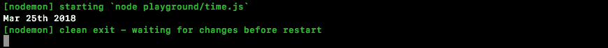

现在我们还可以添加其他字符，比如逗号：

```js
console.log(date.format('MMM Do, YYYY'));
```

逗号不是格式期望的一部分，所以它只是简单地通过，这意味着逗号会像我们输入的那样显示在 `March 25th, 2018` 中：

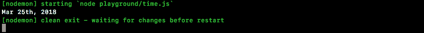

以这种方式使用 `format` 给了我们很大的灵活性，以便我们可以打印日期。现在 `format` 只是众多方法中的一个。Moment 有很多方法可以做几乎任何事情，尽管我发现我在大多数项目中使用的方法基本相同。大多数情况下并不需要它们，尽管它们存在是因为它们在某些情况下很有用。

# 在 Moment 中的 Manipulate 部分

为了快速了解 Moment 还能做些什么，让我们回到文档并转到 Manipulate 部分：

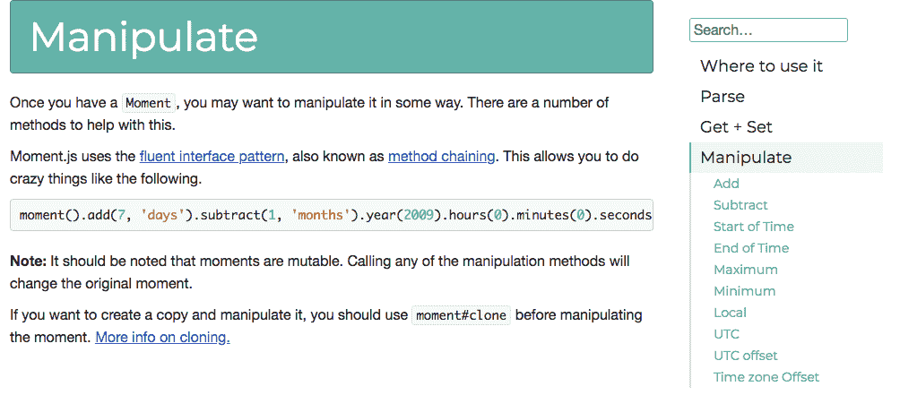

在 Manipulate 下定义的前两个方法是 `add` 和 `subtract`。这让你可以轻松地添加和减去时间。我们可以调用 `add` 添加七天，我们可以调用 `subtract` 减去七个月，就像这个例子中所示的那样：

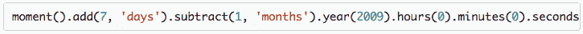

通过这个例子，你可以快速了解你可以添加和减去什么，年份、季度、月份、周数，几乎任何时间单位都可以被添加或减去。

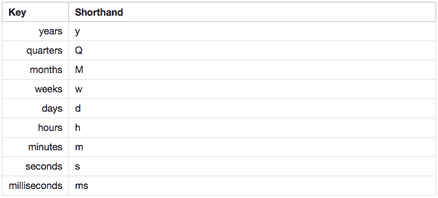

现在来看看这对时间戳的确切影响，我们可以添加和减去一些值。我将调用 `date.add`，然后我们将添加一年，将 `1` 作为值，`year` 作为单位：

```js
var date = moment();
date.add(1, 'years')
console.log(date.format('MMM Do, YYY'));
```

现在无论你使用单数还是复数版本都没关系，两者都会起同样的作用。在这里你可以看到我们在终端中得到了 `2019`：


如果我将它改为单数形式，我也会得到相同的值。我们可以添加任意多的年份，我将继续添加 `100` 年：

```js
var date = moment();
date.add(100, 'year')
console.log(date.format('MMM Do, YYY'))
```

现在我们到了 `2118`：

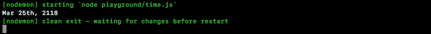

`subtract` 也是一样的。我们可以链接调用，也可以将其添加为单独的语句。我要像这样减去：

```js
date.add(100, 'year').subtract(9, 'months');
```

而我们现在是在九月，当我们减去 9 个月时，我们回到了六月：


现在你会注意到我们从 `2118` 到 `2117`，因为减去那 9 个月需要我们改变年份。Moment 真的很擅长处理你扔给它的任何事情。现在我们将继续玩一下 `format`。我要添加一个我想要的输出，然后我们需要在文档内部找出要使用的模式。

现在写作的当前时间是 10:35，而且是上午，所以我有一个小写的上午。你的目标是打印一个这样的格式。现在显然，如果你运行代码时是 12:15，你会看到 12:15 而不是 10:35；只有格式很重要，实际值并不那么重要。现在当你尝试打印小时和分钟时，你会有很多选项。对于它们两个，你会有一个像 01 这样的填充版本，或者像 1 这样的未填充版本。

我希望你使用填充版本的分钟和未填充版本的小时，就像这样，6 和 01。如果你填充了小时，它看起来有点奇怪，如果你不填充分钟，它看起来就很糟糕。所以如果碰巧是上午 6:01，我们会想要打印出这样的东西。现在对于小时，你也可以选择使用 1 到 12 或 1 到 24，我通常使用 12 小时制，所以我会使用上午。

在我们开始之前，我要注释掉之前的代码，我希望你从头开始写。我将通过调用没有参数的 `moment` 来创建一个新变量 `date`，然后我们还将调用 `console.log` 中的 `format`，这样我们就可以将格式化的值打印到屏幕上，`date.format`：

```js
var date = moment();
console.log(date.format(''))
```

在引号内，我们将提供我们的模式，并从未填充的小时和填充的分钟开始。我们可以通过查看文档，返回到 Display，然后查看一下，来获取这两个模式。如果我们滚动到下一个，我们将遇到的第一个是 Hour，我们有很多选项：

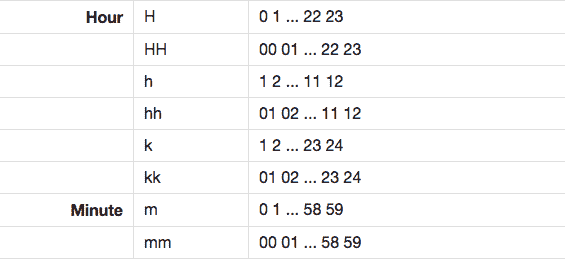

我们有 24 小时制的选项，我们有 1 到 12；我们想要的是小写的 h，即 1 到 12 不填充。填充版本，即 hh，就在旁边，这不是我们想要的。我们将通过添加一个 h 来开始：

```js
var date = moment(); 
console.log(date.format('h')); 
```

我也要保存文件，然后在终端中查看：

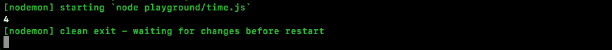

我们有`4`，看起来很好。接下来是填充的分钟，我们将继续找到紧挨着的模式。对于分钟，我们的选择要少得多，要么填充，要么不填充，我们要使用 mm。在我添加 mm 之前，我要添加一个冒号。这将以纯文本形式传递，意味着它不会被更改。我们将添加两个小写的 ms：

```js
console.log(date.format('h:mm')); 
```

然后我们可以保存`time.js`，确保在终端中打印出正确的内容，确实是这样，`4:22`显示出来了：

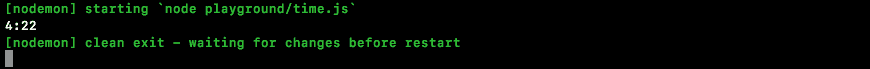

接下来要做的是获取小写的 am 和 pm 值。我们可以在 Google Chrome 中找到这个模式，就在小时之前：

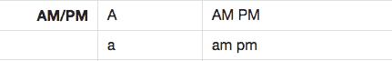

在这里，我们可以使用大写 A 表示大写的 AM 和 PM，或者使用小写 a 表示小写的版本。我将在一个空格后面使用小写的`a`来使用小写的版本：

```js
var date = moment();
console.log(date.format('h:mm a'))
```

我可以保存文件，然后在终端中，我确实打印出了`4:24`，并且后面有`pm`：

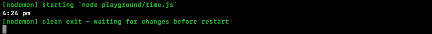

一切看起来都很好。这就是本节的全部内容！在下一节中，我们将实际将 Moment 集成到我们的服务器和客户端中，而不仅仅是在`playground`文件中。

# 打印消息时间戳

在这一部分，您将格式化时间戳，并将它们与聊天消息一起显示在屏幕上。目前，我们显示了消息的发送者和文本，但`createdAt`时间戳没有被使用。

现在我们需要弄清楚的第一件事是，我们如何将时间戳转换为 Moment 对象，因为归根结底，我们想要调用`format`方法来按我们的喜好格式化它。为了做到这一点，你所要做的就是拿到你的时间戳。我们将创建一个名为`createdAt`的变量来表示这个值，并将其作为`moment`的第一个参数传递进去，这意味着我只需传入`createdAt`，就像这样：

```js
var createdAt = 1234; 
var date = moment(createdAt); 
```

当我这样做时，我们创建了一个具有与 format、add 和 subtract 相同方法的 moment，但它代表的是不同的时间点。默认情况下，它使用当前时间。如果传入一个时间戳，它就使用那个时间。现在这个数字`1234`，只是比 Unix 纪元晚了一秒，但如果我们运行文件，我们应该看到正确的东西打印出来。使用`nodemon`命令，在`playground`文件夹中，我们将运行`time.js`，并且我们会得到`5:30 am`，如下面的截图所示：

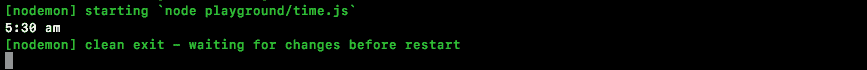

这是预期的，因为它考虑了我们的本地时区。

# 从时间戳中获取格式化的值

现在我们已经做好了准备，我们已经拥有了实际获取这些时间戳并返回格式化值所需的一切。我们还可以使用 Moment 创建时间戳，它的效果与我们使用的`new Date().getTime`方法完全相同。

为了做到这一点，我们只需调用`moment.valueOf`。例如，我们可以创建一个名为`someTimestamp`的变量，将其设置为对`moment`的调用。我们将生成一个新的 moment，并调用它的`valueOf`方法。

这将继续返回自 Unix 纪元以来的毫秒时间戳，`console.log`。我们将记录`someTimestamp`变量，以确保它看起来正确，这里是我们的时间戳值：

```js
var someTimestamp = moment().valueOf(); 
console.log(someTimestamp);
```

# 更新 message.js 文件

我们要做的第一件事是调整我们的`message.js`文件。目前在`message.js`中，我们使用`new Date().getTime`生成时间戳。我们将切换到 Moment，不是因为它会改变任何东西，而是因为我希望在使用时间时保持一致使用 Moment。这将使维护和弄清楚发生了什么变得更容易。在`message.js`的顶部，我将创建一个名为`moment`的变量，将其设置为`require('moment')`：

```js
var moment = require('moment');

var generateMessage = (from, text) => {
  return {
    from,
    text,
    createAt: new Date().getTime()
  };
};
```

我们将继续用`valueOf`替换`createdAt`属性。我希望你继续做到这一点，调用`moment`，在`generateMessage`和`generateLocationMessage`中调用`valueOf`方法，然后继续运行测试套件，确保两个测试都通过。

我们需要做的第一件事是调整`generateMessage`的`createdAt`属性。我们将调用`moment`，调用`valueOf`获取时间戳，对`generateLocationMessage`也是同样的操作：

```js
var moment = require('moment');

var generateMessage = (from, text) => {
  return {
    from,
    text,
    createdAt: moment().valueOf()
  };
};

var generateLocationMessage = (from, latitude, longitude) => {
  return {
    from,
    url: `https://www.google.com/maps?q=${latitude},${longitude}`,
    createdAt: moment().valueOf()
  }
};
```

现在我们可以保存`message.js`。进入终端并使用以下命令运行我们的测试套件：

```js
**npm test**
```

我们得到了两个测试，它们仍然都通过了，这意味着我们得到的值确实是一个数字，就像我们的测试所断言的那样：

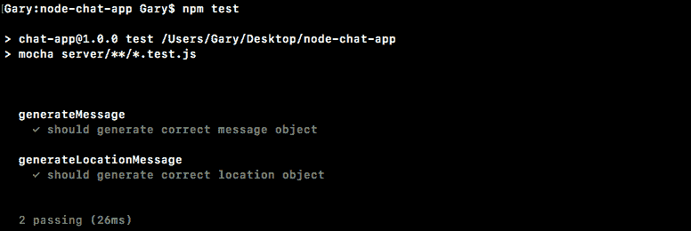

现在我们在服务器上集成了 Moment，我们将继续在客户端上做同样的事情。

# 在客户端集成 Moment

我们需要做的第一件事是加载 Moment。目前，我们在前端加载的唯一库是 jQuery。我们可以通过几种不同的方式来做到这一点；我将实际上从`node_modules`文件夹中获取一个文件。我们已经安装了 Moment，版本为 2.15.1，我们实际上可以获取我们在前端需要的文件，它位于`node_modules`文件夹中。

我们将进入`node_modules`，我们有一个非常长的按字母顺序排列的文件夹列表，我正在寻找一个名为`moment`的文件夹。我们将进入`moment`并获取`moment.js`。我将右键单击复制它，然后向上滚动到最顶部，关闭`node_modules`，然后将其粘贴到我们的`js` | `libs`目录中。现在我们有了`moment.js`，如果你打开它，它是一个非常长的库文件。不需要对该文件进行任何更改，我们只需要加载`index.js`。就在我们的 jQuery 导入旁边，我们将添加一个全新的`script`标签，然后设置`src`属性等于`/js/js/moment.js`，就像这样：

```js
<script src="img/socket.io.js"></script>
<script src="img/jquery-3.1.0.min.js"></script>
<script src="img/moment.js"></script>
<script src="img/index.js"></script>
```

现在我们已经有了这个设置，我们在客户端上就可以访问所有这些 Moment 函数，这意呈现出在`index.js`中可以正确格式化消息中返回的时间戳。在做任何更改之前，让我们使用以下命令启动我们的服务器：

```js
**nodemon server/server.js**
```

我们可以继续进入浏览器，转到`localhost:3000`并刷新，我们的应用程序正在按预期工作。如果我打开开发者工具，在控制台选项卡中，我们实际上可以使用 Moment。我们可以通过 moment 访问它，就像我们在 Node 中做的那样。我可以使用`moment`，调用`format`：`moment().format()`。

我们得到了我们的字符串：

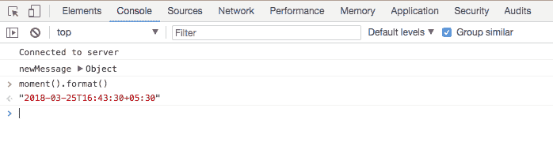

如果你成功导入了 Moment，你应该能够进行这个调用。如果你看到这个，那么你就准备好继续更新`index.js`了。

# 更新 newMessage 属性

如果你还记得，在 message 上我们有一个`createdAt`属性，分别用于`newMessage`和`newLocationMessage`。我们所需要做的就是获取该值，传递给`moment`，然后生成我们格式化的字符串。

我们可以创建一个名为`formattedTime`的新变量，并将其设置为调用`moment`传入时间戳`message.createdAt`的结果：

```js
socket.on('newMessage', function (message) {
  var formattedTime = moment(message.createAt)
```

现在我们可以继续做任何我们喜欢的事情。我们可以调用 format，传入我们在`time.js`中使用的完全相同的字符串，小时，分钟和上午/下午；`h:`，两个小写的`m`，后面跟着一个空格和一个小写的`a`：

```js
var formattedTime = moment(message.createdAt).format('h:mm a'); 
```

有了这个，我们现在有了格式化的时间，我们可以继续将其添加到`li.text`中。现在我知道我在客户端代码中使用模板字符串。我们很快就会删除这个，所以还不需要进行调整，因为我还没有在 Internet Explorer 或其他浏览器中进行测试，尽管应用程序的最终版本将不包括模板字符串。在`from`语句之后，我们将继续注入另一个值，即我们之前创建的`formattedTime`。因此，我们的消息应该是像 Admin 这样的名称，后面跟着时间和文本：

```js
socket.on('newMessage', function (message) {
  var formattedTime = moment(message.createAt).format('h:mm a');
  var li = jQuery('<li></li>');
  li.text('${message.from} ${formattedTime}: ${message.text}');
```

我将继续保存`index.js`，并刷新浏览器以加载客户端代码：

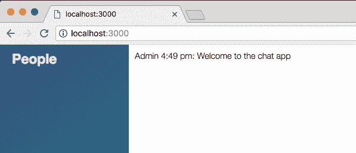

如前面的屏幕截图所示，我们看到 Admin 4:49 pm: 欢迎来到聊天应用程序，这就是正确的时间。我可以发送一条消息，`这是来自用户`，发送出去，我们可以看到现在是下午 4:50：

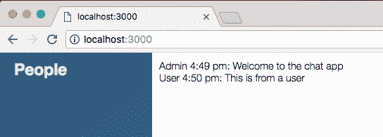

这是来自用户的消息，一切都很顺利。

# 更新 newLocationMessage 属性

现在对于发送位置，我们目前不使用 Moment；我们只更新了`newMessage`事件监听器。这意味着当我们打印位置消息时，我们没有时间戳。我们将修改`newLocationMessage`，你可以继续使用我们之前使用的相同技术来完成工作。现在在哪里实际上呈现格式化的时间，你可以简单地将其放在`li.text`中，就像我们在`newMessage`属性的情况下所做的那样。

过程中的第一步将是创建名为`formattedTime`的变量。我们实际上可以继续复制以下行：

```js
var formattedTime = moment(message.createdAt).format('h:mm a'); 
```

并将其粘贴在`var li = jQuery('<li></li>');`行的上面，就像这样：

```js
socket.on('newLocationMessage', function(message) {
  var formattedTime = moment(message.createAt).format('h:mm a');
```

我们想要做的事情与之前完全相同，我们想要获取`createdAt`字段，获取一个 moment 对象，并调用`format`。

接下来，我们必须修改显示的内容，显示这个`formattedTime`变量，并将其放在`li.text`语句中：

```js
socket.on('newLocationMessage', function(message) {
  var formattedTime = moment(message.createAt).format('h:mm a');
  var li = jquery('<li></li>');
  var a = jQuery('<a target="_blank">My current location</a>');

  li.text(`${message.from} ${formattedTime}: `);
```

现在我们可以继续刷新应用程序，我们应该看到我们的时间戳用于常规消息。我们可以发送一条常规消息，一切仍然正常：

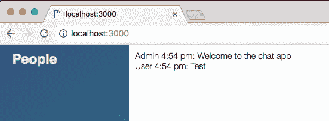

然后我们可以发送一条我们刚刚更改的位置消息。它应该只需要一秒钟就可以运行起来，我们有我们当前的位置链接。我们有我们的名称和时间戳，这太棒了：

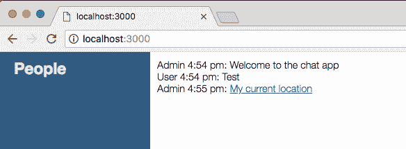

这就是本节的全部内容。让我们继续进行提交以保存我们的更改。

尽管我们还没有完成消息区域，但所有数据都正确显示出来了。只是以一种不太令人愉悦的方式显示出来。不过，现在我们将进入终端并关闭服务器。我将运行`git status`，我们有新文件以及一些修改过的文件：

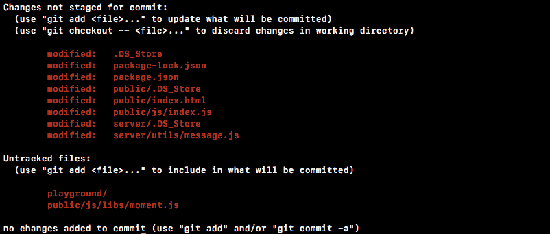

然后，`git add .`将会处理所有这些。然后我们可以进行提交，`git commit`带有`-m`标志，这次的好消息是`使用 momentjs 格式化时间戳`：

```js
git commit -m 'Format timestamp using momentjs'
```

我将使用`git push`命令将其推送到 GitHub，然后我们就完成了。

在下一节中，我们将讨论一个模板引擎 Mustache.js。

# Mustache.js

现在我们的时间戳已经正确地呈现在屏幕上。我们将继续讨论一个叫做**Mustache.js**的模板引擎。这将使定义一些标记并多次呈现它变得更容易。在我们的情况下，我们的消息将具有相同的一组元素，以便正确呈现。我们将为用户的名称添加一个标题标记，将文本添加到段落中，所有这些都是一样的。

现在，我们不会像目前在 `index.js` 中那样，而是在 `index.html` 中创建一些模板、一些标记，并渲染它们，这意味着我们不需要手动创建和操作这些元素。这可能是一个巨大的负担。

# 将 mustache.js 添加到目录

现在，为了在实际创建任何模板或渲染它们之前开始，我们确实需要下载库。我们可以通过打开谷歌浏览器并搜索 `mustache.js` 来获取它，我们要找的是 GitHub 仓库，这种情况下恰好是第一个链接。你也可以访问 [mustache.github.io](http://mustache.github.io/) 并点击 JavaScript 链接以到达相同的位置：

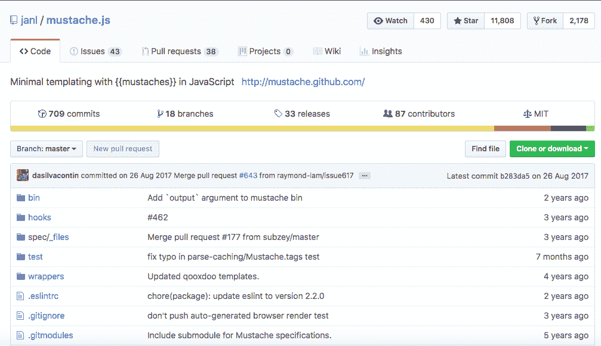

现在一旦你到了这里，我们需要获取库的特定版本。我们可以转到分支下拉菜单，从分支切换到标签。这将显示所有已发布的版本；我将在这里使用的版本是最新的 2.3.0。我会获取它，它会刷新仓库，我们要找的是一个名为 `mustache.js` 的文件。这是我们需要下载并添加到 `index.html` 中的库文件：

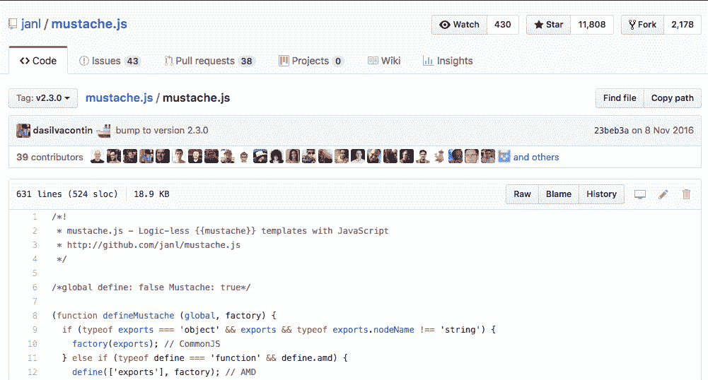

我可以点击&nbsp;Raw 来获取原始的 JavaScript 文件，并可以右键单击并点击&nbsp;另存为... 将其保存到项目中。我将进入桌面上的项目，`public` | `js` | `libs` 目录，然后在那里添加文件。

现在一旦你把文件放好了，我们可以通过在 `index.html` 中导入它来开始。在底部附近，我们目前有 `jquery` 和 `moment` 的 `script` 标签。这个看起来会很相似。它将是一个 `script` 标签，然后我们将添加 `src` 属性，以便加载新文件，`/js/libs`，最后是 `/mustache.js`：

```js
<script src="img/moment.js"></script>
<script src="img/mustache.js"></script>
```

现在有了这个，我们可以继续创建一个模板并渲染它。

# 创建和渲染 newMessage 的模板

创建一个模板并渲染它，这将让你对 Mustache 能做什么有一个很好的了解，然后我们将继续将其与我们的 `newMessage` 和 `newLocationMessage` 回调实际连接起来。为了在 `index.html` 中开始，我们将通过在 `chat__footer` div 旁边定义一个 `script` 标签来创建一个新模板。

现在在`script`标签内，我们将添加我们的标记，但在我们这样做之前，我们必须在`script`上提供一些属性。首先，这将是一个可重用的模板，我们需要一种访问它的方式，所以我们会给它一个 `id`，我会称这个为 `message-template`，我们要定义的另一个属性是一个叫做 `type` 的东西。`type` 属性让你的编辑器和浏览器知道 `script` 标签内存储了什么。我们将把 `type` 设置为，引号内，`text/template`：

```js
<script id = "message-template" type="text/template">

</script>
```

现在我们可以编写一些标记，它将按预期工作。让我们首先简单地创建一个段落标记。我们将在 `script` 标签内创建一个 `p` 标签，并在其中添加一些文本，`这是一个模板`，然后我们将关闭段落标记，就是这样，这是我们要开始的地方：

```js
<script id="message-template" type="text/template"> 
  <p>This is a template</p> 
</script>
```

我们有一个 message-template `script`标签。我们可以通过注释掉`newMessage`监听器内的所有代码，将其渲染到`index.js`中。我将注释掉所有那些代码，现在我们可以实现 Mustache.js 渲染方法。

# 实现 Mustache.js 渲染方法

首先，我们必须获取模板，创建一个名为`template`的变量来做到这一点，我们要做的就是使用我们刚刚提供的 ID`#message-template`来用`jQuery`选择它。现在我们需要调用`html`方法，它将返回`message-template`内的标记，也就是模板代码，这种情况下是我们的段落标签：

```js
socket.on('newMessage', function (message) {
  var template = jquery('#message-template').html();
```

一旦我们有了这个，我们可以实际上在 Mustache 上调用一个方法，这是因为我们添加了那个`script`标签。让我们创建一个名为`html`的变量；这是我们最终要添加到浏览器的东西，我们将其设置为对`Mustache.render`的调用。

现在`Mustache.render`接受你想要渲染的`template`：

```js
socket.on('newMessage', function (message) {
  var template = jquery('#message-template').html();
  var html = Mustache.render(template);
```

我们将继续渲染它，现在我们可以通过将其添加到`messages` ID 中将其显示在浏览器中，就像我们之前做的那样。我们将选择具有 ID 为 messages 的元素，调用`append`，并附加我们刚刚渲染的模板，我们可以在 HTML 中访问到它：

```js
socket.on('newMessage', function (message) {
  var template = jQuery('#message-template').html();
  var html = Mustache.render(template);

  jQuery('#messages').append(html);
```

现在有了这个设置，我们的服务器重新启动了，我们可以通过刷新浏览器来实际操作。我要刷新浏览器：

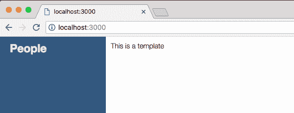

我们得到了这是我们欢迎消息的模板，如果我输入其他内容，我们也会得到这是一个模板。不是很有趣，也不是很有用，但很酷的是 Mustache 让你注入值，这意味着我们可以设置模板中我们期望传入值的位置。

例如，我们有`text`属性。为了引用一个值，你可以使用双大括号的语法，就像这样：

```js
<script id="message-template" type="text/template">
  <p>{{text}}</p>
</script>
```

然后你可以继续输入名称，比如`text`。现在为了实际提供这个值，我们必须向 render 方法发送第二个参数。我们不仅仅传递模板，还要传递模板和一个对象：

```js
socket.on('newMessage', function (message) {
  var template = jquery('#message-template').html();
  var html = Mustache.render(template, {

  });
```

这个对象将拥有你可以渲染的所有属性。现在我们目前期望`text`属性，所以我们应该继续提供它。我将把`text`设置为`message.text`返回的值：

```js
var html = Mustache.render(template, { 
  text: message.text 
}); 
```

现在我们以动态方式渲染模板。模板作为可重用的结构，但数据总是会改变，因为它在调用 render 时被传递进来：

有了这个设置，我们可以继续刷新 Chrome，然后在这里我们看到“欢迎来到聊天应用”，如果我输入一条消息，它将显示在屏幕上，这太棒了：

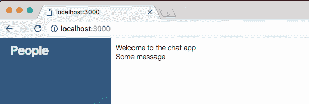

# 获取所有显示的数据

现在，这个过程的下一步是让所有数据显示出来，我们有一个`from`属性和一个`createdAt`属性。我们实际上可以通过`formattedTime`访问到`createdAt`属性。

我们将取消注释`formattedTime`行，这是我们实际要转移到新系统的唯一行。我将把它添加到`newMessage`回调中：

```js
socket.on('newMessage', function (message) {
  var formattedTime = moment(message.createAt).format('h:mm a');
  var template = jQuery('#message-template').html();
  var html = Mustache.render(template, {

  });
```

因为我们仍然希望在渲染时使用`formattedTime`。在我们对模板做任何其他操作之前，让我们简单地传递这些值。我们已经传递了`text`值。接下来，我们可以传递`from`，它可以通过`message.from`访问，我们还可以传递一个时间戳。你可以随意命名该属性，我将继续称其为`createdAt`并将其设置为`formattedTime`：

```js
var html = Mustache.render(template, { 
  text: message.text, 
  from: message.from, 
  createdAt: formattedTime 
}); 
```

# 提供自定义结构

现在有了这个系统，所有的数据确实都被传递了。我们只需要实际使用它。在`index.html`中，我们可以使用所有这些，并且还将提供自定义结构。就像我们之前设置代码时一样，我们将使用我在此项目模板中定义的一些类。

# 添加列表项标签

我们将从使用`li`标签开始。我们将添加一个类，并将这个类命名为`message`。在其中，我们可以添加两个`div`。第一个`div`将是标题区域，我们在其中添加`from`和`createdAt`的值，第二个`div`将是消息的正文：

```js
<script id="message-template" type="text/template">
  <li class="message">
    <div></div>
    <div></div>
  </li>
</script>
```

对于第一个`div`，我们将提供一个类，这个类将等于`message__title`。这是消息标题信息将要放置的地方。我们将在这里开始，通过提供一个`h4`标签，为屏幕呈现一个漂亮的标题，我们将在`h4`内放置`from`数据，我们可以通过使用那些双花括号`{{from}}`来实现：

```js
<script id="message-template" type="text/template">
  <li class="message">
    <div class="message__title">
      <h4>{{from}}</h4>
    </div>
```

对于`span`，情况完全相同，这将在下一步发生。我们将添加一个`span`标签，在`span`标签内，我们将注入`createdAt`，添加我们的双花括号，并指定属性名称：

```js
<script id="message-template" type="text/template">
  <li class="message">
    <div class="message__title">
      <h4>{{from}}</h4>
      <span>{{createAt}}</span>
    </div>
```

# 添加消息正文标签

现在我们可以继续进行实际的消息正文。这将在我们的第二个`div`内进行，我们将为其指定一个类。第二个`div`的类将等于`message__body`，对于基本消息，即非基于位置的消息，我们将只需添加一个段落标签，并通过提供两个花括号后跟`text`来在其中呈现我们的文本：

```js
<script id="message-template" type="text/template"> 
  <li class="message"> 
    <div class="message__title"> 
      <h4>{{from}}</h4> 
      <span>{{createdAt}}</span> 
    </div> 
    <div class="message__body"> 
      <p>{{text}}</p> 
    </div> 
  </li> 
</script> 
```

有了这个系统，我们实际上有一个非常好的消息模板渲染系统。代码，标记，都在`message-template`内定义，这意味着它是可重用的，而且在`index.js`内。我们只需要一点点代码来把一切都连接起来。这是一个更可扩展的解决方案，比起像我们为`newLocationMessage`那样管理元素要容易得多。我将保存`index.js`，进入浏览器，然后刷新一下。

当我们这样做时，我们现在可以看到消息`This is some message`的样式很好。我将发送它；我们得到了名称，时间戳和文本的打印。它看起来比之前好多了：

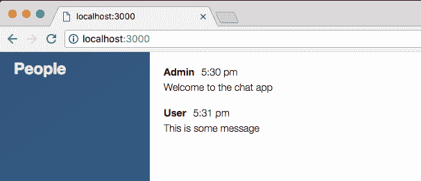

# 为 newLocation 消息创建模板

现在我们的发送位置消息看起来仍然很糟糕。如果我点击发送位置，需要几秒钟才能完成，然后就是这样！它没有样式，因为它没有使用模板。我们要做的是为`newLocationMessage`添加一个模板。我们将为模板设置标记，然后呈现它并传入必要的值。

在`index.html`内，我们可以通过创建第二个模板来开始这样做。第二个模板将与第一个非常相似。我们实际上可以通过复制并粘贴此模板来创建第二个模板。我们只需要将`id`属性从`message-template`更改为`location-message-template`：

```js
<script id="location-message-template" type="text/template">
  <li class="message">
    <div class="message__title">
    <h4>{{from}}</h4>
    <span>{{createAt}}</span>
  </div>
  <div class="message__body">
    <p>{{text}}</p>
  </div>
</li>
</script>
```

现在标题区域将是相同的。我们将有我们的`from`属性以及`createdAt`；正文将会改变。

而不是呈现带有文本的段落，我们将呈现带有链接的段落，使用锚标签。现在，我们将添加锚标签。然后在`href`属性内，我们将注入值。这将是从服务器传递到客户端的 URL。我们将添加等号，花括号，我们要添加的值是`url`：

```js
<div class="message__body">
  <p>
    <a href="{{url}}"
  </p>
</div>
```

接下来，我们将继续使用`target`属性，将其设置为`_blank`，这将在新标签页中打开链接。最后，我们可以关闭锚标签，并在其中添加链接的文本。这个链接的好文本可能是`我的当前位置`，就像我们现在的一样：

```js
<script id="location-message-template" type="text/template"> 
  <li class="message"> 
    <div class="message__title"> 
      <h4>{{from}}</h4> 
      <span>{{createdAt}}</span> 
    </div> 
    <div class="message__body"> 
      <p> 
        <a href="{{url}}" target="_blank">My current location</a> 
      </p> 
    </div> 
  </li> 
</script> 
```

这就是我们为模板需要做的全部。接下来，我们将在`index.js`中连接所有这些内容，这意味着在`newLocationMessage`中，你要做的事情与我们之前在`newMessage`中做的事情非常相似。你不再使用 jQuery 来渲染所有内容，而是要渲染模板，传入必要的数据、文本、URL 和格式化的时间戳。

# 渲染 newLocation 模板

我们要做的第一件事是注释掉我们不再需要的代码；那就是除了变量`formattedTime`之外的所有内容：

```js
socket.on('newLocationMessage', function (message) {
  var formattedTime = moment(message.createAt).format('h:mm a');
  // var li = jQuery('<li></li>');
  // var a = jQuery('<a target="_blank">My current location</a>');
  // 
  // li.text(`${message.from} ${formattedTime}: `);
  // a.attr('href', message.url);
  // li.append(a);
  // jQuery('#message').append(li);
});
```

接下来，我们将从 HTML 中获取模板，创建一个名为`template`的变量，并使用`jQuery`通过 ID 选择它。在引号内部，我们将添加我们的选择器。我们要通过 ID 选择，所以我们会添加这个。&nbsp;`#location-message-template`是我们提供的 ID，现在我们要调用`html`来获取它的内部 HTML：

```js
socket.on('newLocationMessage', function (message) {
  var formattedTime = moment(message.createAt).format('h:mm a');
  var template = jQuery('#location-message-template').html();
```

接下来，我们将实际渲染模板，创建一个名为`html`的变量来存储返回值。我们将调用`mustache.render`。这需要两个参数，你要渲染的模板和你要渲染到该模板中的数据。现在数据是可选的，但我们确实需要传递一些数据，所以我们也会提供那个。`template`是我们的第一个参数，第二个参数将是一个对象：

```js
socket.on('newLocationMessage', function (message) {
  var formattedTime = moment(message.createAt).format('h:mm a');
  var template = jQuery('#location-message-template').html();
  var html = Mustache.render(template, {

  });
```

我将从`from`设置为`message.from`开始，我们也可以用`url`做同样的事情，将其设置为`message.url`。对于`createdAt`，我们将使用`formattedTime`变量，`createdAt`设置为`formattedTime`，这在`newMessage`模板中已经定义：

```js
socket.on('newLocationMessage', function (message) {
  var formattedTime = moment(message.createAt).format('h:mm a');
  var template = jQuery('#location-message-template').html();
  var html = Mustache.render(template, {
    from: message.from,
    url: message.url,
    createdAt: formattedTime
  });
```

现在我们可以访问我们需要渲染的 HTML。我们可以使用 jQuery 选择器来选择 ID 为 messages 的元素，并且我们将调用 append 来添加一个新消息。我们要添加的新消息可以通过`html`变量获得：

```js
socket.on('newLocationMessage', function(message) { 
  var formattedTime = moment(message.createdAt).format('h:mm a'); 
  var template = jQuery('#location-message-template').html(); 
  var html = Mustache.render(template, { 
    from: message.from, 
    url: message.url, 
    createdAt: formattedTime 
  }); 

  jQuery('#messages').append(html);
}); 
```

既然我们已经完全转换了我们的函数，我们可以删除旧的注释掉的代码，保存文件，并在 Chrome 中测试一下。我将刷新页面以加载最新的代码，我会发送一条文本消息来确保它仍然有效，现在我们可以发送一个位置消息。我们应该在短短几秒内看到新数据的渲染，它确实按预期工作：

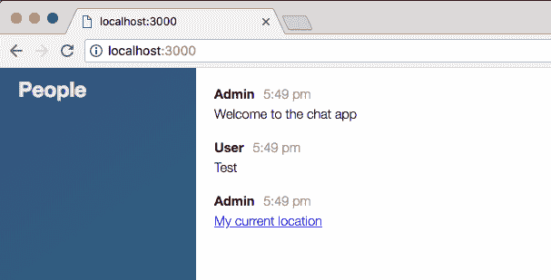

我们有名字、时间戳和链接。我可以点击链接，确保它仍然有效。

有了这个设置，我们现在有了一个更好的前端模板创建设置。我们不再需要在`index.js`中做繁重的工作，我们可以在`index.html`中做模板，只需传入数据，这是一个更可扩展的解决方案。

既然我们已经完成了这一切，我们可以关闭服务器并运行`git status`提交我们的更改。我们有一个新文件以及一些修改过的文件，`git add .`会为我们处理所有这些，然后我们可以进行提交，`git commit`带有`-am`标志。实际上，我们已经添加了，所以我们可以只使用`-m`标志，`Add mustache.js for message templates`：

```js
**git commit -m 'Add mustache.js for message templates'**
```

我将把这个推送到 GitHub，然后我们可以继续快速部署到 Heroku，使用`git push heroku master`。我要把这个推上去，只是为了确保所有模板在 Heroku 上的渲染与本地一样。部署应该只需要一秒钟。一旦部署完成，我们可以通过运行`heroku open`或者像以前一样获取 URL 来打开它。这里正在启动应用程序：

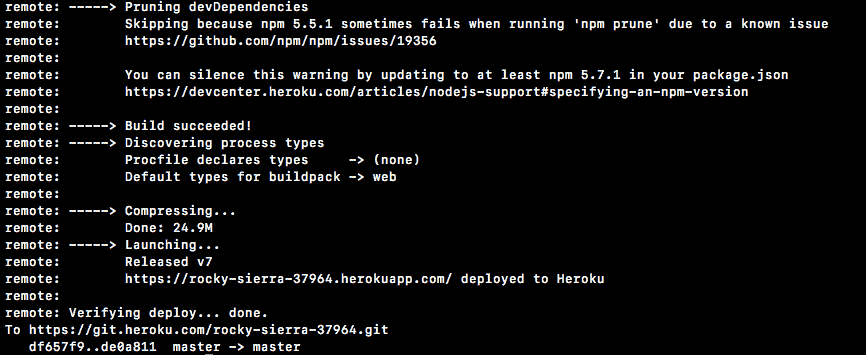

看起来一切都如预期那样进行。我要获取应用程序的 URL，切换到 Chrome，并打开它：

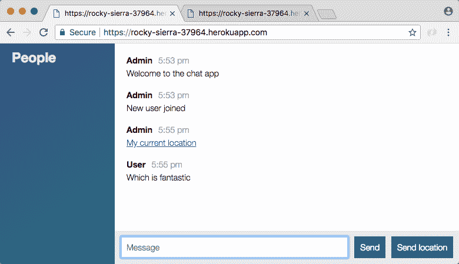

现在我们正在实时查看我们的应用程序在 Heroku 中，消息数据如预期显示出来。发送位置时也应该是如此，发送位置消息应该使用新的设置，而它确实如预期般工作。

# 自动滚动

如果我们要构建一个前端，我们最好做到完美。在这一部分，我们将添加一个自动滚动功能。所以如果有新消息进来，它会在消息面板中可见。现在立即来看，这并不是问题。我输入一个`a`，按下*enter*，它就出现了。然而，当我们滚动列表到底部时，你会看到消息开始消失在底部的栏中：

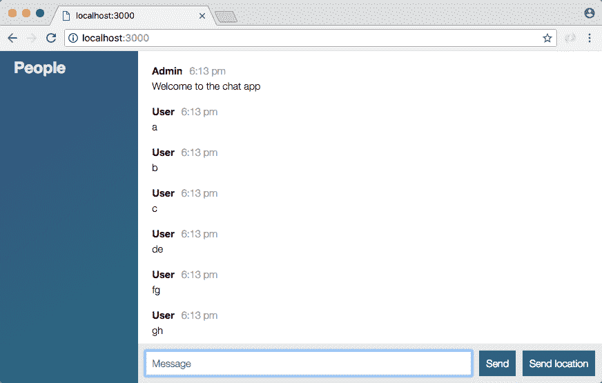

现在我确实可以向下滚动查看最近的消息，但如果能自动滚动到最近的消息就更好了。所以如果有新消息进来，比如`123`，我会自动滚动到底部。

显然，如果有人向上滚动阅读旧消息，我们会希望让他们留在那里；我们不会想要把他们滚动到底部，那会和一开始看不到新消息一样让人讨厌。这意味着我们将继续计算一个阈值。如果有人能看到最后一条消息，我们将在有新消息进来时滚动他们到底部。如果我在那条消息之前，我们将继续让他们保持原样，没有理由在他们查阅档案时把他们滚动到底部。

# 运行高度属性计算

为了做到这一点，我们将不得不进行计算，获取一些属性，主要是各种东西的高度属性。现在来谈谈这些高度属性，确切地弄清楚我们将如何进行这个计算，我已经准备了一个非常简短的部分。让我们继续深入。为了说明我们将如何进行这个计算，让我们看一下以下示例：


我们有这个浅紫色的框，比深紫色的要高。这是整个消息容器。它可能包含的消息要比我们在浏览器中实际看到的要多得多。深紫色区域是我们实际看到的部分。当我们向下滚动时，深紫色区域会向下移动到底部，当我们向上滚动时，它会向上移动到顶部。

现在我们可以访问三个高度属性，这些属性将让我们进行必要的计算，以确定是否应该向用户滚动到底部。这些属性如下：

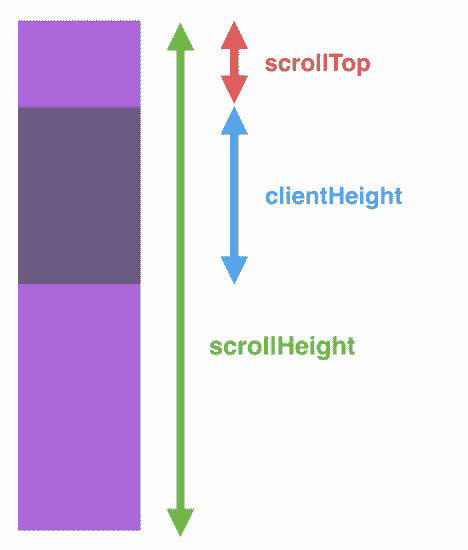

+   首先是`scrollHeight`。这是我们消息容器的整个高度，不管在浏览器中实际可见多少。这意味着如果我们在可见部分之前和之后有消息，它们仍然会在`scrollHeight`中计算。

+   接下来是`clientHeight`。这是可见高度容器。

+   最后，我们有`scrollTop`。这是我们向紫色容器滚动的像素数。

在当前情况下，我们想做什么？我们什么都不想做，用户实际上并没有滚动得那么远。如果每次有新消息进来就把他们带到底部，这对他们来说是一种负担。

在下一个场景中，我们再向下滚动一点：

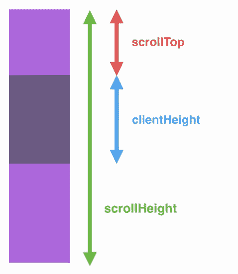

`scrollTop`增加了，`clientHeight`保持不变，`scrollHeight`也是如此。现在如果我们继续向下滚动列表，最终我们会到达底部。目前，我们不应该做任何事情，但当我们到达底部时，计算看起来会有些不同：

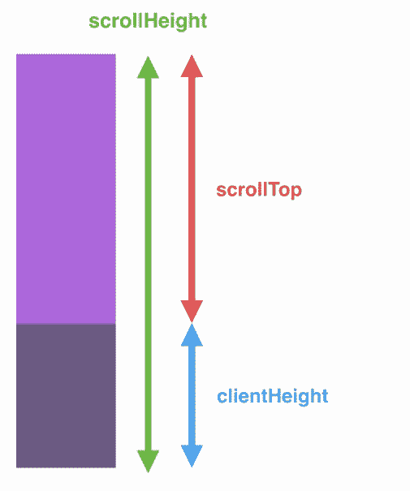

在这里，您可以看到`scrollTop`值，即我们可以看到的前一个空间，加上`clientHeight`值等于`scrollHeight`。这将是我们方程的基础。如果`scrollTop`加上`clientHeight`等于`scrollHeight`，我们确实希望在新消息进来时将用户滚动到底部，因为我们知道他们已经在面板的底部。在这种情况下，我们应该怎么做？当新消息进来时，我们应该滚动到底部。现在有一个小小的怪癖：

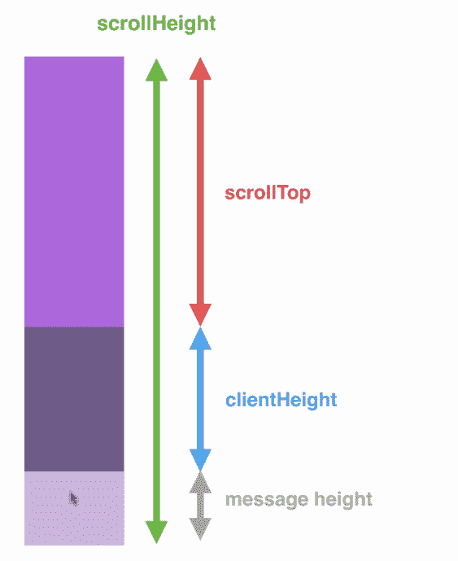

我们将考虑到新的`messageHeight`，在我们的计算中添加`scrollTop`，`clientHeight`和`messageHeight`，将该值与`scrollHeight`进行比较。使用这个方法，我们将再次能够将用户滚动到底部。

让我们继续在 Atom 中连接这个。现在我们知道了如何运行这个计算，让我们继续在`index.js`中实际执行。我们将创建一个新的函数，它将为我们完成所有这些繁重的工作。它将根据用户的位置确定是否应该将用户滚动到底部。让我们在`index.js`的顶部创建一个函数。它不会接受任何参数，我们将把这个函数称为`scrollToBottom`：

```js
var socket = io();

function scrollToBottom () {

}
```

每次向聊天区域添加新消息时，我们将调用`scrollToBottom`，这意味着我们需要在`newMessage`和`newLocationMessage`中各调用一次。在`newLocationMessage`回调函数中，我可以调用`scrollToBottom`，不传入任何参数：

```js
socket.on('newMessage', function (message) {
  var formattedTime = moment(message.createAt).format('h:mm a');
  var template = jQuery('#message-template').html();
  var html = Mustache.render(template, {
    text: message.text,
    from: message.from,
    createdAt: formattedTime
  });

  jQuery('#message').append(html);
  scrollToBottom();
}); 
```

当我们附加`scrollToBottom`时，我会做同样的事情：

```js
socket.on('newLocationMessage', function (message) {
  var formattedTime = moment(message.createAt).format('h:mm a');
  var template = jQuery('#message-template').html();
  var html = Mustache.render(template, {
    from: message.from,
    url: message.url,
    createdAt: formattedTime
  });

  jQuery('#message').append(html);
  scrollToBottom();
}); 
```

现在我们需要做的就是将这个函数连接起来：

+   确定是否应该将它们滚动到底部，以及

+   如果有必要，将它们滚动到底部。

# 创建一个新变量将消息滚动到底部

首先，我们将选择消息容器，并创建一个新变量来存储它。我们实际上将创建相当多的变量来运行我们的计算，所以我将添加两个注释，`选择器`和`高度`。这将帮助我们分解这长长的变量列表。

我们可以创建一个变量，我们将把这个变量称为`messages`，然后我们将把`messages`设置为一个`jQuery`选择器调用。我们将选择所有 ID 等于`messages`的元素，这只是我们的一个元素：

```js
function scrollToBottom () {
  // Selectors
  var message = jQuery('#message');
```

现在我们已经准备好了消息，我们可以专注于获取这些高度。我们将继续获取`clientHeight`，`scrollHeight`和`scrollTop`。首先，我们可以创建一个名为`clientHeight`的变量，将其设置为`messages`，然后我们将调用`prop`方法，这给了我们一种跨浏览器的方法来获取属性。这是一个没有 jQuery 的 jQuery 替代方法。这确保它在所有浏览器中都能正常工作，无论他们如何调用`prop`。我们将继续提供，用引号括起来，`clientHeight`来获取`clientHeight`属性：

```js
function scrollToBottom () {
  // Selectors
  var message = jQuery('#message'); 
  // Heights
  var clientHeight = message.prop('clientHeight');
}
```

我们将为另外两个值做完全相同的事情两次。`scrollTop`将被设置为`messages.prop`获取`scrollTop`属性，最后`scrollHeight`。一个名为`scrollHeight`的新变量将存储该值，我们将把它设置为`messages.prop`，传入我们想要获取的属性`scrollHeight`：

```js
function scrollToBottom() { 
  //selectors 
  var messages = jQuery('#messages'); 
  //Heights 
  var clientHeight = messages.prop('clientHeight'); 
  var scrollTop = messages.prop('scrollTop'); 
  var scrollHeight = messages.prop('scrollHeight');
}
```

现在我们已经准备就绪，可以开始计算了。

# 确定计算

我们想要弄清楚`scrollTop`加上`clientHeight`是否大于或等于`scrollHeight`。如果是，那么我们就要滚动用户到底部，因为我们知道他们已经接近底部了，`if (clientHeight + scrollTop is >= scrollHeight)`：

```js
var scrollHeight = message.prop('scrollHeight');

if (clientHeight + scrollTop >= scrollHeight) {

}
```

如果是这样的话，我们将继续做一些事情。现在，我们将使用`console.log`在屏幕上打印一条小消息。我们将只打印`Should scroll`：

```js
if (clientHeight + scrollTop >= scrollHeight) {
  console.log('Should scroll');
}
```

现在我们的计算还没有完成，因为我们正在运行这个函数。在我们附加新消息之后，我们确实需要考虑到这一点。正如我们在 Atom 中看到的那样，如果我们可以看到最后一条消息，我们确实希望将它们滚动到底部；如果我在列表中更靠上，我们就不会将它们滚动。但是如果我离底部很近，前面几个像素，我们应该将它们滚动到底部，因为这很可能是他们想要的。

# 考虑新消息的高度

为了完成这个任务，我们必须考虑新消息的高度和上一条消息的高度。在 Atom 中，我们将首先添加一个选择器。

我们将创建一个名为`newMessage`的变量，这将存储最后一个列表项的选择器，在滚动到底部之前刚刚添加的选择器。我将使用`jQuery`来完成这个任务，但我们不需要创建一个新的选择器，实际上我们可以基于之前的选择器`messages`进行构建，然后调用其`children`方法：

```js
function scrollToBottom () {
  // Selectors
  var message = jQuery('#message'); 
  var newMessage = message.children();
```

这使您可以编写一个特定于消息子级的选择器，这意味着我们有了所有的列表项，因此我们可以在另一个上下文中选择我们的列表项，也许我们想选择所有的段落子级。但在我们的情况下，我们将使用`last-child`修饰符选择最后一个子级的列表项：

```js
var newMessage = messages.children('li:last-child');
```

现在我们只有一个项目，列表中的最后一个列表项，我们可以继续通过创建一个名为`newMessageHeight`的变量来获取其高度，就在`scrollHeight`变量旁边。我们将把它设置为`newMessage`，然后调用其`innerHeight`方法：

```js
var scrollHeight = messages.prop('scrolHeight');
var newMessageHeight = newMessage.innerHeight();
```

这将计算消息的高度，考虑到我们通过 CSS 应用的填充。

现在我们需要考虑第二个到最后一个消息的高度。为此，我们将创建一个名为`lastMessageHeight`的变量，并将其设置为`newMessage`，然后调用`prev`方法。这将使我们移动到上一个子元素，因此如果我们在最后一个列表项，现在我们在倒数第二个列表项，我们可以再次调用`innerHeight`来获取其高度：

```js
var newMessageHeight = newMessage.innerHeight();
var lastMessageHeight = newMessage.prev().innerHeight();
```

现在我们也可以在`if`语句中考虑这两个值。我们将把它们相加，`newMessageHeight`，我们还将考虑到`lastMessageHeight`，并将其加入我们的计算中：

```js
function scrollToBottom() { 
  //selectors 
  var messages = jQuery('#messages'); 
  //Heights 
  var clientHeight = messages.prop('clientHeight'); 
  var scrollTop = messages.prop('scrollTop'); 
  var scrollHeight = messages.prop('scrollHeight'); 
  var newMessageHeight = newMessage.innerHeight(); 
  var lastMessageHeight = newMessage.prev().innerHeight(); 

  if(clientHeight + scrollTop + newMessageHeight + lastMessageHeight >= scrollHeight) { 
    console.log('Should scroll'); 
  }
}
```

现在我们的计算完成了，我们可以测试一下是否一切都按预期工作。我们应该在应该滚动时看到`Should scroll`。

# 测试计算

在浏览器中，我将继续刷新，然后打开开发者工具，这样我们就可以查看我们的`console.log`语句。您会注意到在较小的屏幕上，样式会移除侧边栏。现在我要按*enter*几次。显然，我们不应该发送空消息，但现在我们可以，您会看到`Should scroll`正在打印：

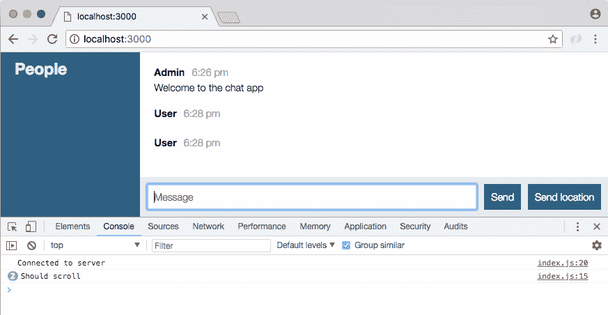

实际上不会滚动，因为我们的消息容器的高度实际上并没有超过浏览器空间给定的高度，但它确实满足条件。现在随着我们继续向下滚动，消息开始从屏幕底部消失，您会注意到消息前面的计数停止增加。每次打印`Should scroll`时计数都会增加，但现在即使我添加了新消息，它仍然停留在 2。

在这种情况下，我们可以滚动到底部并添加一条新消息`abc`。这应该会导致浏览器滚动，因为我们离底部很近。当我这样做时，`Should scroll`增加到 3，这太棒了。

如果我滚动到列表顶部，输入`123`并按*回车*键，应该不会滚动到 4，这是正确的。如果用户在顶部，我们不希望将其滚动到底部。

# 在必要时滚动用户

现在唯一剩下的事情就是在必要时实际滚动用户。这将发生在我们的`if`语句中，我们可以删除`console.log('Should scroll')`的调用，并将其替换为对`messages.scrollTop`的调用，这是设置`scrollTop`值的 jQuery 方法，我们将其设置为`scrollHeight`，这是容器的总高度。这意味着我们将移动到消息区域的底部：

```js
if(clientHeight + scrollTop + newMessageHeight + lastMessageHeight >= scrollHeight) {
  messages.scrollTop(scrollHeight);
}
```

在 Google Chrome 中，我们现在可以刷新页面以获取最新的`index.js`文件，然后我会按住*回车*键一小会儿。正如你所看到的，我们正在自动滚动列表。如果我添加新消息，它将正确显示。

如果我靠近顶部，新消息进来，比如`123`，我不会滚动到列表底部，这是正确的。现在，如果我不是在底部，但很接近，新消息进来，我会滚动到底部。但如果我稍微超过最后一条消息，我们将不会滚动到底部，这正是我们想要的。所有这些都是因为我们的计算。

# 提交与计算相关的更改

让我们在终端中用一个提交来结束这一切。如果我们运行`git status`，你会看到我们只有一个更改的文件。我可以使用`git commit -am`来进行提交，`如果用户接近底部，则滚动到底部`：

```js
**git commit -am 'Scroll to bottom if user is close to bottom'**
```

我将继续使用`git push`命令将其推送到 GitHub，这被认为是项目的第一部分结束。

# 总结

在本章中，我们研究了如何在 HTML 格式中为基本聊天应用程序添加样式。我们还讨论了时间戳和使用 Moment 方法格式化页面。之后，我们学习了 Mustache.js 的概念，创建和渲染消息模板。最后，我们了解了自动滚动和使用消息高度属性进行计算。有了这些，我们已经有了一个基本的聊天应用程序。

在下一章中，目标是添加聊天室和名称，所以我去注册页面。我输入我想加入的房间和我想使用的名称。然后我被带到一个聊天页面，但只针对特定的房间。因此，如果有两个房间，房间 1 的用户将无法与房间 2 的用户交谈，反之亦然。
