# 第八章：加入页面和传递房间数据

在上一章中，我们研究了如何将我们的聊天页面样式更像一个真正的 Web 应用程序，而不是一个未经样式化的 HTML 页面。在本章中，我们将继续讨论有关聊天页面的内容，并研究加入页面和传递房间数据。我们将更新我们的 HTML 文件，并为聊天页面添加表单字段。

我们将获取名称和房间数值，并将它们从客户端传递到服务器，以便服务器可以跟踪谁在哪个房间，我们可以建立私人通信。我们还将为数据验证创建测试用例。

# 添加加入页面

这一部分的目标是添加一个加入页面，就像您在下面的截图中看到的那样，您可以在那里提供一个名称，然后提供您想要加入的房间名称。

然后您将能够加入指定的房间，与该房间中的任何其他人交谈，您将无法与其他房间中的其他人进行通信：

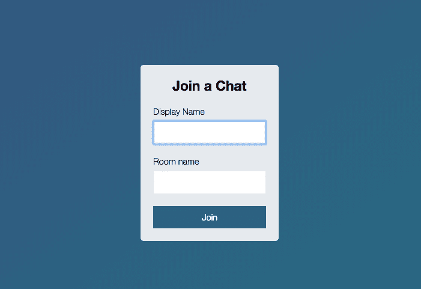

这意味着当您点击这个表单时，您将点击`Join`，我们将一些自定义信息传递到 URL 中，就像我们知道的那样，它看起来像这样的聊天应用程序：

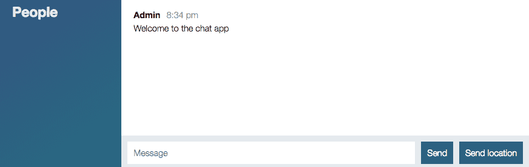

# 更新 HTML 文件

为了完成这个目标，我们要做的第一件事是调整当前的 HTML 文件。现在，`index.html`将首先加载。实际上，我们不希望这样，当我们转到`localhost:3000`时，我们希望显示我们的新加入页面。所以我要做的是将这个页面移动，通过重命名。我们将把`index.html`重命名为`chat.html`。我将用相同的方法重命名`index.js`，将其重命名为`chat.js`。

最后但同样重要的是，我将更新加载`index.js`的脚本中的引用；相反，我们将加载`chat.js`。既然我们已经有了这个，当您访问该站点时，将不再加载 HTML 页面。如果我尝试转到`localhost:3000`，我们将收到一个错误，说我们无法获取该路由，服务器没有返回任何内容：

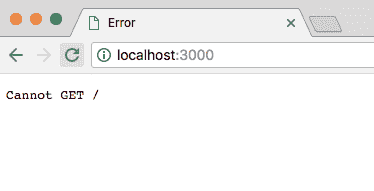

为了解决这个问题，我们将创建一个全新的页面作为`index.html`。这将是用户访问应用时加载的页面。现在我们将从非常基本的模板开始，指定我们以前做过的事情，比如`DOCTYPE`，将其设置为 HTML5，然后我们将添加我们的`html`标签。在这里面，我们可以添加我们的`head`和`body`标签：

```js
<!DOCTYPE html>
<html>
  <head>
  </head>
  <body>
  </body>
</html>
```

# 在 HTML 文件中添加头标签

我将首先添加我的`head`标签，然后可以继续添加`body`标签。然后我们将通过在头部添加一些标签来启动一些事情，比如`meta`，这样我们就可以设置我们的字符集，它将具有一个值为`utf-8`。我们还将设置一些其他属性：

```js
<head>
  <meta charset="utf-8">

</head>
```

我将设置一个`title`标签，这将显示在标签的`title`中，我们可以将我们的设置为`Join`，然后我们可以添加一个空格，使用`|`添加一个竖线，以及我们的应用名称，类似于`ChatApp`：这将显示在任何标签标题中。然后我们可以继续链接我们的样式表，就像我们为`chat.html`所做的那样。我将从`chat.html`中获取样式表引用，复制到头部中：

```js
<head>
  <meta charset="utf-8">
  <title>Join | ChatApp</title>
  <link rel="stylesheet" href="/css/styles.css">
</head>
```

我将在`chat.html`中添加一个`title`标签。在`chat.html`中，我们可以指定标题，就像我们在`index.html`中所做的那样。我们可以给这个页面一个`Chat`的标题，中间用空格包围，我们还将给它相同的应用名称，`ChatApp`：

```js
<!DOCTYPE html>

<html>

<head>
  <meta charset="utf-8">
  <title>Chat | ChatApp</title>
  <link rel="stylesheet" href="/css/styles.css">
</head>
```

既然我们已经有了这个，开始更新`body`之前，我想做的最后一件事是设置一个`viewport`标签。`viewport`标签允许您指定有关如何呈现您的站点的某些信息。我即将添加的`viewport`标签将使我们的网站在移动设备上显示得更好。它不会被放大，而是会适应您的手机、平板电脑或任何其他设备的宽度。

当我们完成后，我们将把这个标签从`index.html`复制到`chat.html`，但现在我们将通过添加一个`meta`标签来开始。

这一次，与过去不同的是，我们不再指定字符集，而是将其命名为`viewport`：

```js
<head> 
  <meta charset="utf-8"> 
  <title>Join | ChatApp</title> 
  <meta name="viewport" content=""> 
  <link rel="stylesheet" href="/css/style.css"> 
</head> 
```

现在我们可以继续添加一些关于我们想要对`viewport`做的选项。所有这些都将发生在内容内。这将是一个以逗号分隔的键值对列表，例如`width`将是`device-width`。这告诉您的浏览器使用设备的`宽度`作为网页的`宽度`，然后我们可以添加一个逗号，一个空格，并指定我们的下一个键值对。我将使用`initial-scale`并将其设置为`1`。这将适当地缩放网站，使其看起来不会被放大，最后`user-scalable`将设置为`no`：

```js
<head>
  <meta charset="utf-8">
  <title>Join | ChatApp</title>
  <meta name="viewport" content="width=device-width, initial-scale=1, user-scalable=no">
  <link rel="stylesheet" href="/css/styles.css">
</head>
```

我们已经设置了样式，使文本变大，并确保用户始终可以看到所有内容，因此没有理由让用户有能力进行缩放。现在，正如前面提到的，我们将复制这个`meta`标签到剪贴板，并在`chat.html`中也添加它。现在我们已经为`index.html`设置好了`head`标签，我们可以继续处理`body`。

# 在 HTML 文件中添加 body 标签

我们将使用一组类似的类来设计与此页面配合使用。首先，在`body`标签上，我们将添加一个名为`centered-form`的类：

```js
  <body class="centered-form">
  </body>
</html>
```

这将使表单在屏幕中居中，并为整个网站提供蓝色渐变的背景。接下来，我们可以继续提供小框。这将是我们的表单所在的居中白色框。这将通过`div`实现，我们将给这个`div`一个类。我们将把这个类设置为，用引号括起来，`centered-form__form`：

```js
<!DOCTYPE html>
<html>

<head>
  <meta charset="utf-8">
  <title>Join | ChatApp</title>
  <meta name="viewport" content="width=device-width, initial-scale=1, user-scalable=no">
  <link rel="stylesheet" href="/css/styles.css">
</head>

<body class="centered-form">
  <div class="centered-form__form">
  </div>
</body>

</html>
```

现在我们已经设置好了这两个类，我们准备继续添加一些将放在白色框中的字段，首先是标题`Chat`。

# 为聊天页面添加表单字段

为了做到这一点，我们将创建一些`div`。它们都将看起来相同，所以我们将制作一次并复制它们。我们将添加一个等于`form-field`的类。现在我们将使用这个四次：标题，名称，房间名称和按钮。为了完成这个任务，我们将简单地复制这一行并粘贴它四次：

```js
<body class="centered-form">
  <div class="centered-form__form">
    <div class="form-field"></div>
    <div class="form-field"></div>
    <div class="form-field"></div>
    <div class="form-field"></div>
  </div>
```

现在所有这些都需要放在一个`form`标签内。这个页面的整个目标是获取数据并提交它，将用户重定向到聊天页面，然后使用他们提供的名称将他们带入特定的聊天室。这意味着我们希望将这些`form`字段包裹在一个`form`标签内，通过在`div`标签的上方打开它，并在下方关闭它，就像这样：

```js
<body class="centered-form">
  <div class="centered-form__form">
    <form>
      <div class="form-field"></div>
      <div class="form-field"></div>
      <div class="form-field"></div>
      <div class="form-field"></div>
    </form>
  </div>
</body>
```

现在我们之前看到的`form`标签的默认行为是重新加载当前页面，将数据作为查询字符串发布。我们要做的是指定一个`action`属性，这样可以自定义要去哪个页面。在这种情况下，我们将转到`/chat.html`，这就是我们刚刚设置的页面。这意味着当有人填写完表单字段后，他们将被重定向到`chat`页面，并且下面的数据也将被传递。

现在标题`div`很容易，我们要做的是添加一个带有你想要的标题的`h3`标签；你可以说`聊天`或`加入聊天`。然后，我可以继续关闭我的`h3`：

```js
<form action="/chat.html">
  <div class="form-field">
    <h3>Join a Chat</h3>
  </div>
```

然后，我可以继续处理下一个表单字段，即显示名称。我将使用一个标签，标签将描述一个字段，这个字段将是`显示名称`，所以我们将像这样打开和关闭`label`标签：

```js
<div class="form-field">
  <label>Display name</label>
</div>
```

接下来，我们可以添加一个`input`。我们将添加一个`input`，就像我们为消息`form`上的`input`所做的那样。我们将指定`type`等于`text`。我们希望用户能够输入一些文本。我们还将给它一个`name`等于`name`。我们将再次使用`autofocus`，这将确保当用户首次访问应用时，他们的光标会放在名字字段内：

```js
<div class="form-field">
  <label>Display name</label>
  <input type="text" name="name" autofocus/>
</div>
```

接下来是房间名称的字段，它看起来会与上面的字段非常相似，我们将再次从`label`开始。这个`label`将是一个字符串，类似于`Room name`，我们还将添加一个输入，以便用户可以指定房间名称，`type="text"`，`name`将等于`room`：

```js
<div class="form-field">
  <label>Room name</label>
  <input type="text" name="room"/>
</div>
```

这个不需要`autofocus`，因为在前面的代码中我们已经有了一个`autofocus`输入。

既然我们已经做好了这一点，我们可以继续填写最终的`form`字段，这将是我们表单的提交按钮，只需创建`button`标签，并给它一个文本值。我们可以将我们的设置为`Join`：

```js
<div class="form-field">
  <button>Join</button>
</div>
```

有了这个，我们的`index.html`文件实际上已经完成了。我们可以在浏览器中加载它。我们的服务器已经自动重新启动，所以快速刷新应该会显示我们的页面 加入聊天应用：

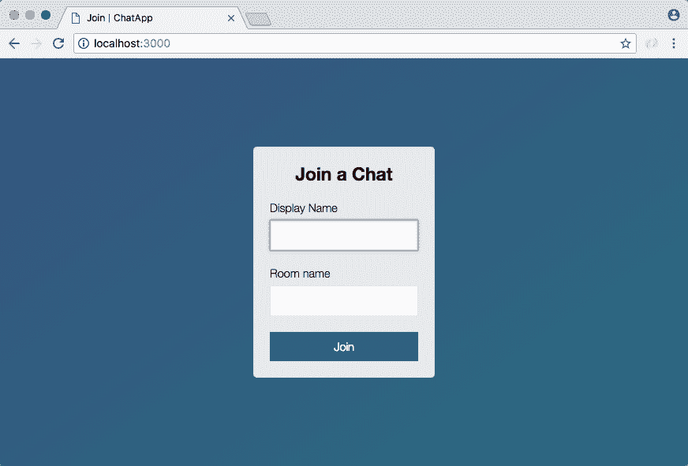

目标是设置这个来接受一个名字，比如`Andrew`，和一个房间名，比如`Node Course Students`：

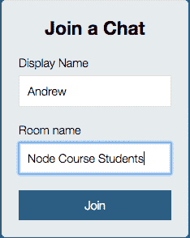

点击加入，它会将您加入到这个带有这个名字的房间。目前，它只会将我们重定向到`chat.html`，但正如你所看到的，它确实传递了数据：

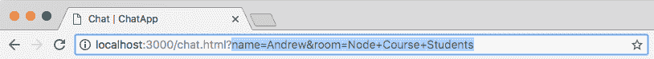

在这里，我们有`name`等于`Andrew`，我们有`room`名称等于`Node Course Students`，就像我们在`index.html`中指定的那样。有了这个，我们现在准备开始讨论如何加入`Socket.io`中的特定房间，确保我们发出的事件只传递给连接到该房间的其他人。我们已经准备好完成这些工作，所以我们将在下一节开始所有这些工作。

目前我们有一个看起来相当不错的加入页面，这是我们可以加入一个房间的地方。让我们用一个提交来结束这一切，提交我们的更改。

# 提交更改到 index.html

如果我运行`git status`，你会看到我们有一个修改过的文件`index.html`，它还认为我们删除了`index.js`，尽管我们在下面添加了一些东西，但当我们运行`git add .`并重新运行`git status`时，它会完全理解发生了什么：

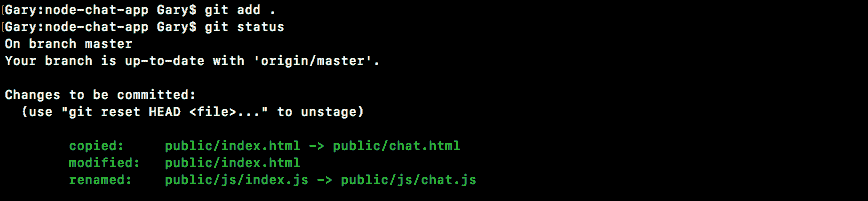

在这里，你可以看到我们复制了`index.html`到`chat.html`，然后修改了`index.html`并将`index.js`重命名为`chat.js`，这正是我们所做的。我将继续使用`git commit`进行提交，使用`-m`标志，`Add join page that submits to chat.html`：

```js
git commit -m 'Add join page that submits to chat.html'
```

然后我们可以进行提交，将其推送到 GitHub，就到此为止。

# 传递房间数据

在上一节中，我们创建了一个小的聊天页面。我们可以输入一个名字，比如`Andrew`，和一个房间，比如`Node Course`，然后我们可以加入那个房间：

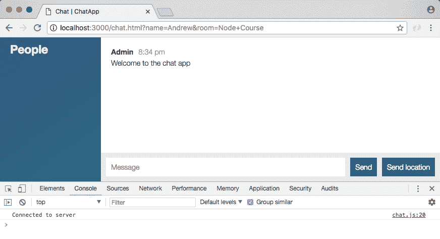

现在当我们这样做时，我们被带到了聊天页面，但实际上在幕后并没有发生任何事情来使用这些值，它们出现在 URL 中，但仅此而已。本节的目标是将这些值从客户端传递到服务器，以便服务器可以跟踪谁在哪个房间，并且我们可以建立私人通信。目前，如果用户一在 Node 课程中，用户二在 React 课程中，他们两个都可以互相交谈，因为这些数据没有被使用。

# 将数据传递到服务器

现在将这些数据发送到服务器的第一步是找出它在哪里；实际上它在`location`对象中。我们将使用控制台来玩一下。

`location`是浏览器提供的全局对象，在它上面我们有很多有趣的东西，比如`host`，`hostname`，`href`，`origin`和`pathname`。我们将使用的是`search`。

正如您在下面的截图中所看到的，`search`是查询字符串，从问号到单词“course”的末尾，我在这里标出了：

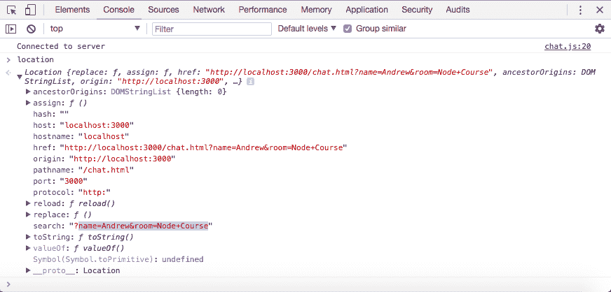

目标是将其转换为更有用的格式。现在我们只有字符串，我们需要解析它。既然我们知道它在哪里，我们实际上将使用一个库来做到这一点。我们可以访问`window.location.search`来获取这个值：

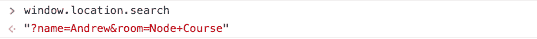

我在`location.search`前面添加了 window，只是为了确保我们访问全局位置属性，而不是可能存在或不存在的名为 location 的局部变量。这将是获取查询字符串的最可靠方法。

# params 和 deparams

现在我们要做的下一件事是讨论 params 和 deparams。在 jQuery 内部，我们实际上可以访问一个函数，我们可以通过调用`jQuery.param`来访问它，并且我们可以传入一个对象。我们将设置`name`等于您的名字，我将其设置为`Andrew`，并且我们将设置`age`等于`25`之类的东西。现在当我运行这个语句时，jQuery 将把该对象转换为一组可以添加到 URL 上的参数：

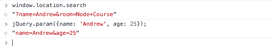

在这里，您可以看到我们有`name=Andrew`和`age=25`。这与我们在 URL 中的格式相似，减去了问号。我们只需要在开头添加一个问号，我们就会得到一个完整的搜索字符串。现在 jQuery 的问题是它不能以另一个方向进行操作；也就是说它不能将字符串转换回对象，这正是我们想要的。

我们希望能够轻松访问这些数据，目前这是不可能的。还有一些编码和`+`字符之类的怪癖。这原本是一个空格，但它被表单转换为`a +`。我们也希望解码所有这些。幸运的是，我们可以包含一个简单的库，我们可以通过访问[links.mead.io/deparam](https://gist.github.com/andrewjmead/b71e03d8df237983285892f9a265d401)来获取它：

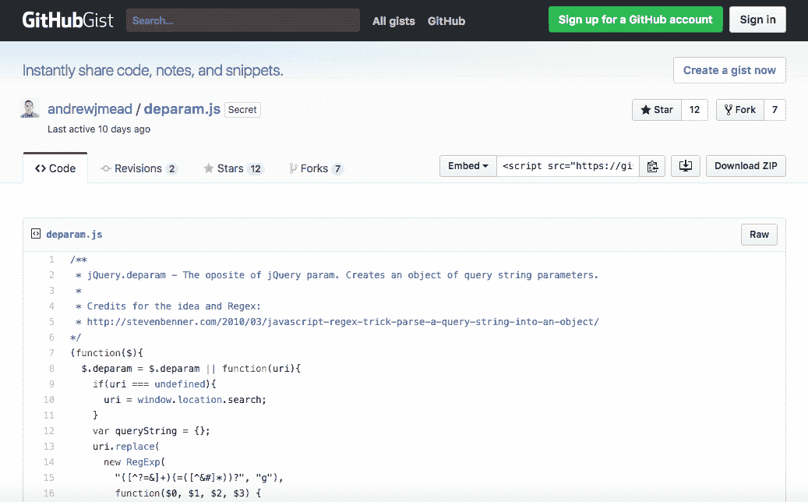

`param`接受您的对象并返回字符串，`deparam`接受字符串并返回对象。在上面的截图中，我们有一个简单的 Gist。这是一个非常简短的函数，我们将要添加到我们的项目中。让我们转到此页面的原始版本。我们将使用右键点击“另存为”保存它，并将其添加到项目中。我们有我们的`public`，`js`和`libs`文件夹。就在`libs`文件夹中，我们将简单地将其保存为`deparam.js`：

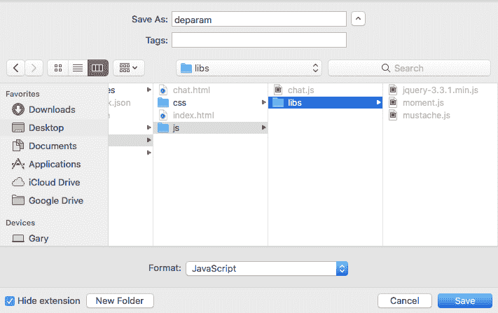

现在一旦我们保存了那个文件，我们就可以包含它。这将使处理搜索数据变得更加容易。在 Atom 中，我将转到`chat.html`。我们不需要在`index.html`中使用它，但在`chat.html`中，我们将在`mustache.js`脚本下面加载它。我们将创建一个新的`script`标签，并且我们将设置`src`等于，引号内，`/js/libs/deparam.js`：

```js
<script src="img/socket.io.js"></script>
<script src="img/jquery-3.3.1.min.js"></script>
<script src="img/moment.js"></script>
<script src="img/mustache.js"></script>
<script src="img/deparam.js"></script>
<script src="img/chat.js"></script>
```

现在当我们保存`chat.html`并返回浏览器时，我们实际上可以刷新页面，并在添加到我们的代码之前在控制台中尝试这个。我们现在可以访问`jQuery.deparam`。如果我运行这个语句，我们将得到我们的函数返回，确认它确实存在，我们只需要传递这个字符串，这就是搜索字符串，`window.location.search`：

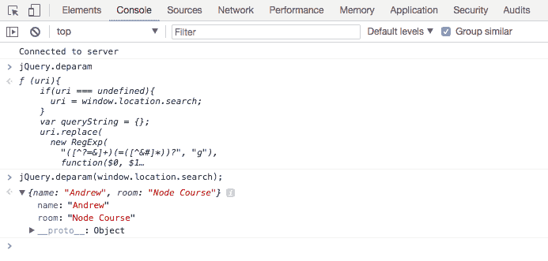

所以我们将搜索字符串传递给`deparam`，得到的对象正是我们想要的。我们有一个`name`属性等于`Andrew`，我们有一个`room`属性等于`Node Course`。所有那些特殊字符，如`&`符号，问号和`+`字符，都已被移除并替换为这个格式化的对象。这是我们将在客户端代码中使用的内容，以获取这些值并将它们传递给服务器，这就是我们现在要做的。

Atom 内部所有的事情都将在`chat.js`中发生。在这个文件中，我们有我们的`connect`回调函数。当我们第一次连接时，就会发生这种情况，当我们连接时，我们将发出一个事件，这将启动加入房间的过程：

```js
socket.on('connect', function () {
  console.log('Connected to server');
});
```

现在`Socket.io`内置支持房间的概念，创建小的隔离区域，只有特定的人可以发出和监听事件。所有这些都在服务器上设置，这意味着就在这个函数中。当我们连接到服务器时，我们要做的就是发出一个名为`join`的事件；这将开始这个过程。

首先，让我们继续获取我们的参数，就是我们刚学会如何在控制台中`deparam`的参数，`var params = jQuery.deparam`，然后我们将`window.location.search`传递进去，就像我们之前在开发者控制台中做的那样。现在我们有了我们的对象，我们可以继续发出一个事件。接下来，我们将调用`socket.emit`，我们要发出的事件将是我们将创建的自定义事件，它将被称为`join`：

```js
socket.on('connect', function () {
  var params = jQuery.deparam(window.location.search);

  socket.emit('join')
});
```

这将从客户端发出，并将被服务器监听。当服务器听到这个`join`事件时，它将开始设置房间的过程。现在，并不是所有的事情都会在这一部分发生，但我们可以开始。我们要发送的数据只是`params`对象：

```js
socket.emit('join', params)
```

它可能包括或不包括我们需要的一切。我们将在服务器上进行一些验证，最后但并非最不重要的是，我们将为此设置确认。

如果有人加入房间，我们想知道。我们也想知道如果有人没有加入。这是因为如果他们没有加入房间，很可能是因为他们提供了无效的数据，这意味着我们希望将他们踢回到加入表单，强迫他们提供姓名和房间名。我们可以继续设置我们的`function`，这个`function`可以带一个参数。我们将自己设置它，所以我们可以决定它是否带有参数，而且它确实有意义带一个参数。在这种情况下，我们将继续提供任何错误。如果有错误，那没问题，我们将能够处理它。如果没有错误，那也很好；我们将继续做其他事情：

```js
socket.on('connect', function () {
  var params = jQuery.deparam(window.location.search);

  socket.emit('join', params, function (err) {
  });
});
```

在这个函数中，如果存在错误，我们可以使用`if (err)`来处理。我们还可以添加一个`else`子句；如果没有错误，我们想做另一件事：

```js
socket.on('connect', function () {
  var params = jQuery.deparam(window.location.search);

  socket.emit('join', params, function (err) {
    if(err) {

   } else {

  });
});
```

现在我们暂时不会填写这部分，我们现在要做的是在`server.js`中设置`join`的监听器。

# 在 server.js 中设置监听器

这将在`server.js`中发生。我们可以将它作为第一个事件放在`createMessage`的上面，`socket.on('join')`：

```js
socket.on('join');
```

现在我们已经知道我们将在回调函数中获取一些参数。我们将得到我们的参数。我们可以称这些为`params`，并获取`callback`函数，因为我们正在设置确认：

```js
socket.on('join', (params, callback) => {

});
```

在`join`函数内，我们要做的第一件事实际上是验证传递过来的数据，包括名称和房间。这两者都是`params`上的潜在属性。我们真正关心的是它们都是非空字符串；这意味着它不仅仅是一个空格，不仅仅是一个空字符串，也不是一个非字符串类型，比如数字或对象。

# 定义 isRealString 函数

为了设置这个验证，我们将在其他地方也要做，比如`createMessage`，我们将创建一个单独的`utils`文件。在这里，我将称之为`validation.js`，这是我们可以放一些我们在整个项目中需要的验证器的地方。

在这一部分，我们将创建一个叫做`isRealString`的函数。这将验证一个值是否是字符串类型，而不仅仅是一堆空格；它实际上在其中有真正的字符。我们将把这个设置为一个接受字符串的函数。这将是我们要验证的字符串，实际上并不会太困难。我们将`return`，并且我们将`return`以下条件。如果它是一个真实的字符串，它将返回`true`，如果不是，它将返回`false`。首先，我们将使用`typeof`。这将获取字符串变量的类型，这需要等于，用引号括起来，`string`：

```js
var isRealString = (str) => {
  return typeof str === 'string';
};
```

现在，当前这个对于任何字符串都将返回`true`，对于任何非字符串值都将返回`false`，但它没有考虑到空格。我们要做的是使用字符串上可用的`trim`方法，它接受这样的字符串：

```js
''
```

并将其转换为这样的字符串，修剪所有空格：

```js
'   '
```

如果你传入这样的字符串，它会将其转换为这样的字符串：

```js
' f  '
```

仅修剪前导和尾随空格：

```js
'f'
```

它不会修剪任何内部空格，所以如果我有`f`空格`r`像这样：

```js
' f r  '
```

我仍然会得到`f`和`r`之间的空格，但所有前导和尾随空格都被移除了：

```js
'f r'
```

我们将像这样使用它：

```js
var isRealString = (str) => {
  return typeof str === 'string' && str.trim().length > 0;
};
```

在我们调用`trim`之后，我们确实需要一个长度大于`0`，否则我们就有了一个空字符串。这将是我们的`isRealString`函数，我们将继续导出它，`module.exports`，将其设置为一个对象，其中我们将`isRealString`设置为`isRealString`函数：

```js
var isRealString = (str) => {
  return typeof str === 'string' && str.trim().length > 0;
};

module.exports = {isRealString};
```

现在我可以继续保存这个文件。我也要继续在`server.js`内部调用这个函数。

# 在 server.js 中调用 isRealString 函数

我们需要先导入`isRealString`函数，然后我们才能验证这两个属性。我们可以在`generateMessage`常量的下面创建一个`const`，并使用 ES6 解构来获取`isRealString`，我们将使用`require`来获取它。我们需要一个本地文件`./`。它在`utils`目录中，文件名是`validation`，就像这样：

```js
const {generateMessage, generateLocationMessage} = require('./utils/message');
const {isRealString} = require('./utils/validation');
```

现在我们可以在`join`内部调用`isRealString`；这正是我们要做的。我们要检查它们中的任何一个是否不是真实的字符串。如果一个或多个不是真实的字符串，我们将调用`callback`并传入错误。我们将添加`if (params.name)`作为第一个，并将其传递给`isRealString(params.name)`：

```js
socket.on('join', (params, callback) => {
  if(isRealString(params.name))
});
```

现在我们想要检查它是否不是一个真实的字符串。所以我们要翻转它，或者（`||`），然后我们要检查另一个属性，房间名，是否不是一个真实的字符串。现在在查询字符串内，房间名属性被称为`room`。所以如果它不是`isRealString`传入正确的值`params.room`，那也会是一个错误：

```js
socket.on('join', (params, callback) => {
  if(!isRealString(params.name) || !isRealString(params.room))
});
```

接下来，我们可以通过添加错误处理程序函数来处理该错误。对于这个，我要做的是用一个小字符串消息`Name and room name are required`调用`callback`：

```js
socket.on('join', (params, callback) => {
  if(!isRealString(params.name) || !isRealString(params.room)) {
    callback('Name and room name are required.');
  }
});
```

现在如果不是这种情况，我们仍然希望调用`callback`，但我们不希望传递任何参数：

```js
socket.on('join', (params, callback) => {
  if(!isRealString(params.name) || !isRealString(params.room)) {
    callback('Name and room name are required.');
  }

  callback();
});
```

因为记住我们在`chat.js`中设置的第一个参数是错误参数，如果两者都有效，我们不想传递任何错误。在`server.js`中，我们现在设置了一些非常基本的验证，并且在这里实际上我们不会做任何事情，这将在即将到来的部分中进行。

# 在 chat.js 中添加错误处理程序

我们要做的就是在`chat.js`中添加一些案例：

```js
socket.on('connect', function () {
  var params = jQuery.deparam(window.location.search);

  socket.emit('join', params, function (err) {
    if(err) {

    } else {

    } 
  });
});
```

如果这是一个错误，那就是一个相当大的问题，我们将希望通过更改位置下的一个属性将用户发送回应用程序的根部，`window.location.href`。在这里，我们可以操纵用户所在的页面，基本上我们将通过将斜杠(`/`)值设置为`href`属性来将其重定向回到根页面：

```js
socket.on('connect', function () {
  var params = jQuery.deparam(window.location.search);
  socket.emit('join', params, function (err) {
    if(err) {
      window.location.href = '/';
    } else {

    }
  });
});
```

现在在我们做任何事情之前，我们可以做任何我们喜欢的事情，也许我们想使用我们选择的框架显示一个模态框，无论是 Foundation、Bootstrap 还是其他任何东西。为了保持简单，我们要做的就是调用`alert`传递错误，就像这样：

```js
if(err) {
  alert(err);
    window.location.href = '/';
  } else {
```

用户将看到一个小小的警报框，然后点击确定，然后被重定向回到主页。现在如果没有错误，我们目前要做的就是使用`console.log`打印`No error`：

```js
socket.on('connect', function () {
  var params = jQuery.deparam(window.location.search);

  socket.emit('join', params, function (err) {
    if(err) {
      alert(err);    
      window.location.href = '/';    
    } else {
      console.log('No error');
    }
  });
});
```

有了这个，让我们继续测试一切是否按预期工作。在浏览器中，我要刷新当前页面。现在，在这里，我们有一个有效的名称和一个有效的房间，所以当我点击刷新按钮时，我们应该看到控制台中没有错误打印，这正是我们得到的：

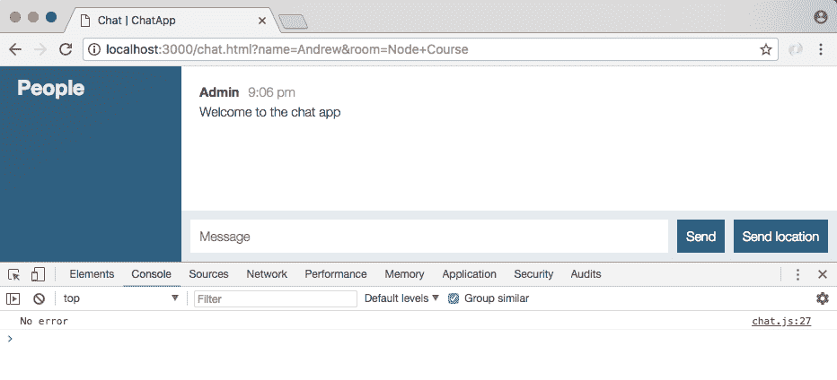

我们传递的数据确实是有效的。现在我们可以继续转到页面的根部并尝试一些无效的数据。

为了证明这一点，我要做的就是点击加入而不提供任何值。这将带我们到聊天应用程序，你可以看到我们得到了一个小小的警报框，需要名称和房间名称。我们点击确定，这是我们能做的一切，然后我们立即被重定向回到加入聊天：

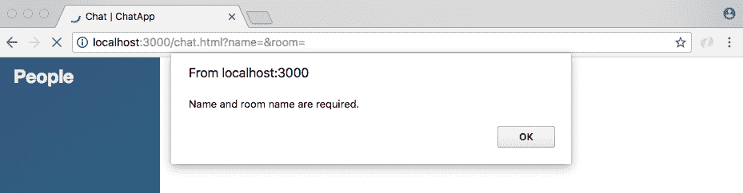

如果我提供一些有效的数据，比如显示名称为`Mike`和房间名称为`Developers`，我们将被带到聊天页面，我们将看不到任何错误显示，这太棒了：

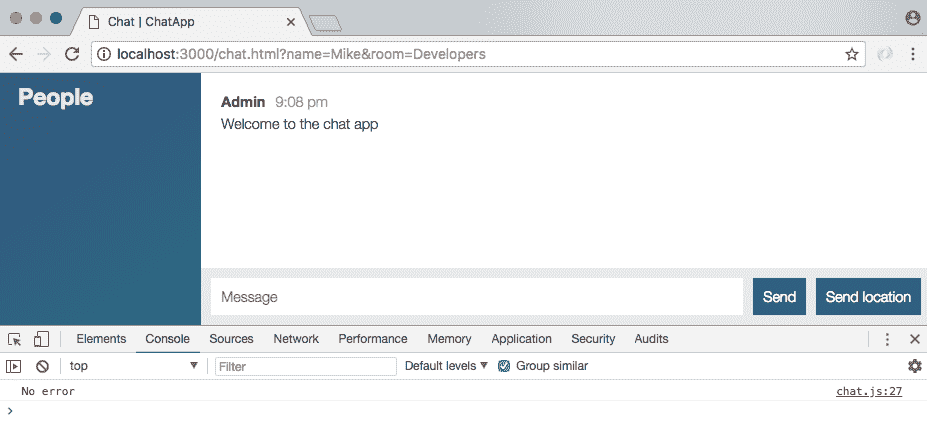

现在最后一个快速测试！如果我们只有空格，我将把房间名更改为一堆空格。现在我们点击加入，即使我们在 URL 空间上方有一堆加号表示空格，我们仍然会收到错误：

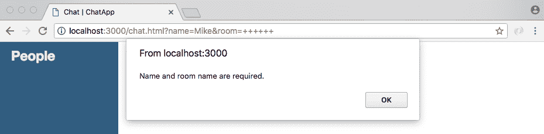

当我们通过`deparam`运行我们的代码时，这些将被替换为空格，错误仍然会发生。现在我们已经有了这个，我们在一个非常好的位置来实际整合下一节的房间。

# 为新验证函数添加测试用例

首先要做的是为我们刚刚创建的全新验证函数编写一些测试用例，这意味着我们将创建一个名为`validation.test.js`的新测试文件。

在这里，我们将加载一个变量称为`expect`的期望。我们也可以将其设置为常量。我们将把它设置为`require`，并且我们将`require` `expect`库：

```js
const expect = require('expect');
```

接下来，我们将加载`RealString`，导入`isRealString`，并添加三个测试用例。`describe`块应该是`isRealString`，三个测试用例将如下所示：

+   第一个是`应该拒绝非字符串`值，在这种情况下，我希望你将一个数字对象或其他任何东西传递给`isRealString`函数，你应该得到 false。

+   接下来，`应该拒绝只有空格的字符串`。如果我有一个只有一堆空格的字符串，那么它不应该通过`isRealString`函数的验证。这也将失败；修剪将删除所有这些空格，长度将为 0。

+   最后，`应该允许包含非空格字符的字符串`。在这种情况下，你可以传入任何你喜欢的东西，一些有效的值。你可以有空格空格 LOTR 代表指环王，开始的空格将被修剪掉，所以这并不重要。你可以添加字母 a，任何有效的字符串都会通过这个。

继续设置这三个测试用例，确保从`isRealString`返回正确的布尔值。当你完成后，从终端运行`npm test`，确保你的三个测试都通过了。

我们要做的第一件事是通过创建一个变量来导入`isRealString`。我们可以将这个变量设置为常量或变量，我会选择常量，我们将使用 ES6 解构来获取`isRealString`，并且我们将从 require 调用中获取它，这个 require 调用是我们本地文件`./validation`，它就在当前文件`validation.test.js`的旁边：

```js
const expect = require('expect');

  // import isRealString
  const {isRealString} = require('./validation');
```

现在我们可以添加我们在下面的东西，从我们的`描述`块开始。

# 测试用例 1 - 应该拒绝非字符串值

我们将`描述`这个`isRealString`函数。然后我们可以添加我们的箭头函数（`=>`），在里面，我们可以提供我们的各个测试用例，`it`，我将直接复制它，`应该拒绝非字符串值`：

```js
describe('isRealString', () => {
  it('should reject non-string values')
});
```

这将是一个同步测试，所以没有理由添加`done`参数。在这里，我们将传入一个非字符串值。我将创建一个名为响应的变量，它将存储从`isRealString`返回的结果。我们将调用它，传入一些非字符串值。任何值都可以，我将使用一个数字，`98`：

```js
describe('isRealString', () => {
  it('should reject non-string values', () => {
    var res = isRealString(98);
```

现在在下面，我们可以使用 expect 来断言响应变量是否等于 false，这应该是情况。我们期望响应`toBe(false)`：

```js
describe('isRealString', () => {
  it('should reject non-string values', () => {
    var res = isRealString(98);
    expect(res).toBe(false);
  });
});
```

# 测试用例 2 - 应该拒绝只有空格的字符串

接下来，`it('should reject string with only spaces')`。我将粘贴这个文本到我们的`it`名称中。然后我们可以继续添加我们的箭头函数（`=>`），对于这种情况，我们要做的是创建一个名为响应的变量，传入一些只有空格的字符串。我们仍然会调用`isRealString`，然后我们会断言响应为`false`，`expect(res).toBe(false)`，因为我们没有一个有效的字符串：

```js
it('should reject string with only spaces', () => {
  var res = isRealString(' ');
  expect(res).toBe(false);
});
```

# 测试用例 3 - 应该允许包含非空格字符的字符串

接下来，最后一个测试用例，`it ('should allow strings with non-space characters')`。我将把这个文本粘贴到`it`函数中，然后我们可以实际设置测试用例。你可以提供一堆不同的值作为`isRealString`的参数。我们仍然会创建响应变量。我们仍然会调用`isRealString`，但是在这里，我选择传入`(' Andrew ')`，这是有效的。`trim`函数将在验证过程中删除这些空格：

```js
it('should allow string with non-space characters', () => {
  var res = isRealString('  Andrew  ');
});
```

在下面，我们可以`期望`响应为 true，`toBe(true)`。这就是你需要做的，我们可以继续删除注释，因为我们已经有了实际的代码，并且要做的最后一件事是运行测试用例，以确保我们的代码实际上起作用：

```js
const expect = require('expect');

const {isRealString} = require('./validation');

describe('isRealString', () => {
  it('should reject non-string values', () => {
    var res = isRealString(98);
    expect(res).toBe(false);
  });

  it('should reject string with only spaces', () => {
    var res = isRealString('    ');
    expect(res).toBe(false);
  });

  it('should allow string with non-space characters', () => {
    var res = isRealString('D');
    expect(res).toBe(true);
  });
});
```

`npm test`就可以完成了。这将运行我们的测试套件，现在我们有了`isRealString`的三个测试用例，它们都通过了，这太棒了：

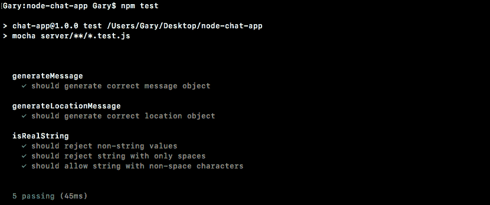

现在正如我所提到的，你几乎可以传入任何东西。字母`D`将作为一个有效的房间名称或用户名。如果我用`D`作为我的字符串重新运行测试套件，测试用例仍然通过。实际上，你传入的内容并不重要，只要它有一个真实的非空格字符。现在我们已经完成了这一步。我们还没有做出提交，因为我们只完成了一半的功能，等我们完成更多之后再提交。

# Socket.io 房间

在上一节中，我们在服务器上设置了一个事件监听器，监听加入事件，并进行了一些验证。这至少确保我们有`name`和`room`名称，这两者都是必需的。

真正的下一步是实际使用`Socket.io`库加入房间，这不仅让我们加入房间，还会给我们一组不同的方法。我们可以选择向连接到服务器的每个人发送`emit`，或者只向特定房间的人发送，这正是我们要做的。我们希望只向也在“房间”中的其他人发送`emit`聊天消息。

现在，为了加入，你要调用`socket.join`。`socket.join`需要一个字符串`name`，我们在`params.room`下有这个`name`，就像我们在上一节中使用的那样：

```js
socket.on('join', (params, callback) => {
  if(!isRealString(params.name) || !isRealString(params.room)) {
    callback('Name and room name are required.');
  }

  socket.join(params.room);

  callback();
});
```

现在我们有一个特殊的地方供在同一个“房间”里的人交谈。现在这是一个字符串，所以它可能是像`The Office Fans`这样的东西，或者其他任何东西，你必须通过字符串值加入。不过，现在`params.room`就可以完成任务了。

现在你也可以选择使用`socket.leave`离开一个房间。`socket.leave`，通过它的名称离开房间，例如`The Office Fans`，这将把你踢出那个群组，你将不会收到那些私人消息，也就是专门发送给该群组的消息。现在这个过程的下一步是弄清楚如何真正利用这一点：

```js
socket.on('join', (params, callback) => {
  if(isRealString(params.name) || !isRealString(params.room)) {
    callback('Name and room name are required.');
  }

  socket.join(params.room);
  // socket.leave('The Office Fans');

  callback();
});
```

# 针对特定用户

将用户添加到房间是很好的，但如果我们不能具体地针对他们和房间中的其他人，那就没有什么用了。事实证明，我们有几种方法可以做到这一点。为了说明我们如何针对特定用户，让我们看看我们在服务器上发送事件的所有方法。

我们使用了`io.emit`。这将向每个连接的用户发送事件，这是我们目前对于像`createMessage`这样的事情所做的。新消息进来，我们就会将其发送给所有连接的人。接下来，我们使用了`socket.broadcast.emit`。我们在`newMessage`中使用它，正如我们所知，这会将消息发送给连接到套接字服务器的每个人，除了当前用户。我们在`server.js`中使用的最后一个是`socket.emit`。这将专门向一个用户发送一个事件。现在我们可以将这些事件转换成它们的房间对应事件。为了将其发送到特定的房间，我们将链接到`to`方法。

这将看起来有点像这样。假设我们想向连接到一个房间的每个人发送一个事件，让我们暂时将这个房间称为`The Office Fans`。为了做到这一点，我们将调用`io.to`。`.to`是一个方法，它接受房间名称，就像在加入调用中提供的那样。在我们的情况下，那将是`The Office Fans`，就像这样：

```js
socket.join(params.room);
// socket.leave('The Office Fans');

// io.emit ->io.to('The Office Fans')
```

然后我们将调用`emit`。这将向连接到房间`The Office Fans`的每个人发送一个事件：

```js
socket.join(params.room);
// socket.leave('The Office Fans');

// io.emit ->io.to('The Office Fans').emit
```

现在我们也可以用广播做同样的事情，也就是说我们想向房间中的每个人发送一个事件，除了当前用户。为了做到这一点，我们将使用`socket.broadcast.to`。这与之前定义的`to`方法的工作方式相同，例如传入`The Office Fans`，然后我们将调用`emit`：

```js
socket.join(params.room); 
// socket.leave('The Office Fans'); 

// io.emit ->io.to('The Office Fans').emit
// socket.broadcast.emit -> socket.broadcast.to('The Office Fans') 
```

这将向`The Office Fans`房间中的每个人发送一个事件，除了当前用户，也就是实际调用`socket.broadcast`的人。

现在我们使用`emit`的最后一种方式是`socket.emit`。当我们想要发送一些东西给特定用户时，我们仍然会使用它。没有理由通过房间来定位他们，因为我们只想定位他们：

```js
socket.join(params.room);
  // socket.leave('The Office Fans');
  // io.emit ->io.to('The Office Fans').emit
  // socket.broadcast.emit -> socket.broadcast.to('The Office Fans').emit
  // socket.emit
```

这是我们要向特定房间发出的两种方式。现在为了实际开始连接一些东西，我们可以采取以下两个调用，并将它们移到`join`内部，这意味着我们不会告诉某人有人加入了一个房间，直到他们通过调用`join`实际加入了房间：

```js
socket.emit('newMessage', generateMessage('Admin', 'Welcome to the chat app'));

socket.broadcast.emit('newMessage', generateMessage('Admin', 'New user joined'));
```

我们也不会告诉用户他们已经加入了一个房间，直到通话实际上已经进行。如果数据无效，比如名称或房间名称，通话可能不会进行。让我们把这两个调用都删掉，我们只是按原样接受它们并将它们移到下面的加入。暂时我们可以把它们移到我们的评论下面；我会留下评论，这样你以后可以作为参考。现在就在`socket.join`行的下面，我们调用`socket.emit`，我们`emit`一个新消息，`欢迎来到聊天应用`：

```js
socket.emit('newMessage', generateMessage('Admin', 'Welcome to the chat app'));
```

这一行实际上将保持不变，我们仍然只想定位任何特定用户。

下一行将会改变。我们不再广播给每个连接的用户，而是只广播给我们刚刚加入的房间内的用户，使用`socket.broadcast.to`，传入`params.room`。我们将发出一个新消息，这将让每个人都知道有新用户加入了。

```js
socket.broadcast.to(params.room).emit('newMessage', generateMessage('Admin', 'New user joined'`));
```

而不是新用户，我们实际上可以指定名称。我们可以访问到。就在这里，我将使用模板字符串首先注入名称，`params.name`，然后是`已加入`：

```js
socket.broadcast.to(params.room).emit('newMessage', generateMessage('Admin', `${params.name} has joined.`));
```

# 测试特定用户设置

现在我们已经准备就绪，我们可以实际测试一下。我们要做的是加入一个房间，然后我们要让第二个用户加入，我们应该看到消息：**他们的名字已经加入**。我们还要添加第三个用户进来，以确保它实际上只发送消息给一个房间。

在浏览器中，让我们开始创建一个名为`用户一`的用户。这个用户将加入一个名为大写`A`的房间：

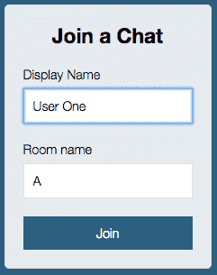

现在我们要继续创建第二个用户，前往`localhost:3000`。这个可以叫`用户二`，我们要加入房间`B`：

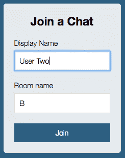

如果我在房间`A`和房间`B`之间切换，你会看到没有加入消息打印出来，因为我们没有加入相同的房间。我们在完全不同的房间，所以我们不应该收到那些消息。

接下来我们要添加第三个用户，这个用户也要加入房间`A`，`用户三`，房间名称，房间`A`，然后我们点击加入。当我们点击加入时，我们可以在标签之间切换并查看我们得到的数据：

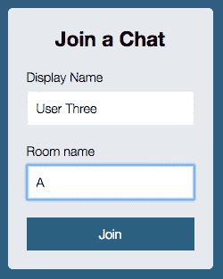

这里我们得到了预期的欢迎来到聊天应用。这只会发生是因为我们已经成功加入了房间：


然后在第二个标签中，我们也会收到欢迎来到聊天应用的消息。没有消息欢迎其他用户，因为其他用户加入了房间`A`，第一个标签有我们的用户三已加入的消息。这太棒了：

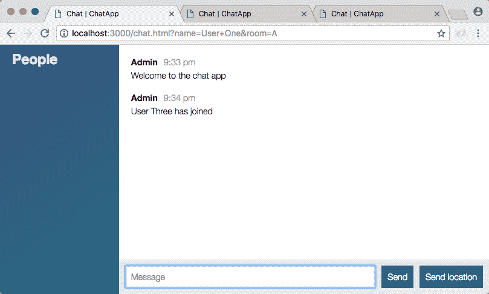

两个用户都在房间`A`，所以当有新用户加入时，这个用户应该会收到一条消息，我们已经在这里注入了名称，这是预期的。

# 摘要

在本章中，我们研究了添加聊天页面。我们建立了一个 HTML 文件，并根据我们的要求定义了`head`和`body`标签。然后，我们继续传递房间数据。我们研究了`params`和`deparams`的概念，并创建了用于验证数据的测试用例。在最后一节中，我们讨论了`socket.io`房间。我们针对聊天室中的特定用户进行了测试并测试了设置。

对于我们的`join`事件监听器来说，事情相对容易，因为我们可以访问到 name 变量和 room 变量。它们实际上是作为参数传递进来的。对于`createMessage`和`createLocationMessage`来说，情况会更加困难。我们需要找出一种方法来获取给定 socket 的房间，这样我们就可以只向该房间发出`emit`。

我们还需要在左侧边栏设置“人员列表”。我们需要弄清楚如何使用`io`对象来获取按房间分类的所有人员及其姓名的列表。所有这些都非常重要，因为目前我们发出的消息，例如，将显示给所有用户，而不管他们在哪个房间。为了使其正常工作，为了建立私人房间，我们将持久化这些数据，这将在下一章中讨论。
