# 第九章：ES7 类

正如我们在上一章中讨论的，我们有我们的 socket `join`监听器，但问题是监听器内部的信息。一旦回调完成，这些信息就会丢失，比如用户名和房间名，它们没有被持久化在任何地方。我们需要这些信息来完成我们的事件监听器。`createMessage`需要知道用户的名称以及房间名称，以便将消息发送到特定的房间，`createLocationMessage`也是如此。我们将在本章讨论这一点。

我们将开始学习 ES6 类语法，并在创建`users`类和其他一些方法中使用它。我们还将看到如何连接用户列表，在任何用户加入或离开聊天时更新 People 列表。我们还将研究如何向特定房间发送消息，而不是发送给所有用户。

# 使用 ES6 类存储用户 - 第 I 部分

我们无法访问`join`中的数据（用户名和房间名），但我们可以访问一个共同的东西，那就是 socket ID。我们可以访问 socket 变量，`socket.id`，并且我们也可以在其他事件监听器中访问它。这将是我们即将创建的数据结构中要使用的内容。我们将创建一个用户数组，可以在其中存储这些信息，当我们想要查找用户时，比如在`createMessage`和`createLocationMessage`中。我们只需将 ID 传递给某个函数，获取名称和房间名称，然后按照我们的意愿发出事件。

为了完成这项工作，我们将在`utils`中创建一个全新的文件。我们将称这个文件为`users.js`，这是我们将存储与用户数据结构相关的所有内容的地方。

它将是一个对象数组，每个对象上都会有 ID，这将是 socket ID，一种非常长的字符串：

```js
[{
  id: '/#12hjwjhwfcydg',

}]
```

我们还将有我们的名称。这是用户的显示名称，我的可能是`Andrew`；最后是用户加入的房间，这可能是类似于`The Office Fans`的东西：

```js
[{
  id: '/#12hjwjhwfcydg',
  name: 'Andrew',
  room: 'The Office Fans'
}]
```

这是我们需要存储在我们的数据结构中的所有信息，以便用户能够连接一切。

现在真正的工作将在我们将要创建的方法中进行。我们将有四种方法：

+   我们希望能够通过`addUser`方法添加用户；这将需要三个信息，ID、名称和房间名称。

+   当用户离开房间时，我们还需要一种方法来移除用户；记住我们想要在聊天室的左侧边栏中更新 People 列表。我们需要一种方法来添加和移除用户，`removeUser`，我们将通过 socket ID 来移除用户。

+   接下来，我们将有一种方法来获取用户，当我们尝试发送消息时，这将非常方便，就像我们在`createMessage`监听器中所做的那样。我们将希望访问用户的名称以及房间，以便触发`newMessage`事件。这将通过一个`getUser`方法来实现，它将接受一个 ID，并返回我们在上面定义的对象。

+   我们将要添加的最后一个是`getUserList`。`getUserList`方法将获取房间名称，确定在该房间中的确切用户，并返回一个名称数组，并将这些名称打印到客户端。

这四种方法就是我们需要完成这项工作的全部内容。现在我们有几种方法可以做到这一点。我们可以创建一个名为`users`的数组，将其设置为空数组，然后定义我们的函数。我们将添加`var addUser`，并将其设置为一个接受`id`、`name`和`room`的函数：

```js
var users = [];

var addUser = (id, name, room) => {

}
```

然后在函数内部，我们将做一些类似于使用`users.push`来操作`users`数组的操作。然后我们将使用`modules.export`导出它，将`addUser`函数作为`addUsers`属性导出：

```js
var users = [];

var addUser = (id, name, room) => {
  users.push({});
}

modules.export = {addUsers};
```

然后我们会在`server.js`中调用`addUser`。这种方法也可以，但我们不打算使用这种方法。在这里，我们有一个`users`数组，我们可以操作这个数组。它确实完成了工作，但我们打算使用 ES6 类语法。这将让我们创建一个`users`类。我们将能够创建该类的新实例，并调用我们将要定义的所有方法。

我要这样做，而不是创建所有用于处理一条信息的特定函数。现在为了完成这个，我们将不得不学习一些新东西；我们将学习关于 ES6 类的知识。

# ES6 类语法

为了讨论 ES6 类，让我们继续简单地创建一个。现在创建一个新类的语法一开始看起来可能有点奇怪，它是独特于我们即将做的事情。但我保证一旦你创建了一个或两个类，并添加了一些方法，你会真的习惯于定义方法和类本身。

# 创建一个人的 ES6 类

为了开始，我们将为一个人创建一个简单的类。这意味着我们正在创建一组数据和一组有用于操作`Person`的方法。现在为了开始，我们将使用`class`关键字，后面跟着类名`Person`。我们将使用大写字母开头来定义我们的类，因为我们将使用`new`关键字创建它们的新实例。你不需要使用大写 P；这只是 JavaScript 中的常见约定。如果一个函数是用来与`new`一起使用的，比如`new Person`，`new Object`，或其他任何东西，它应该有一个大写字母开头；这只是一种样式约定。

现在在我们的名字后面，我们可以简单地打开和关闭一些大括号，就这样：

```js
class Person {

}
```

我们有一个全新的类，甚至可以创建它的一个实例。我们可以创建一个名为`me`的变量，并将其设置为`new Person`，就像这样调用它作为一个函数：

```js
class Person {

}
var me = new Person();
```

现在我们有了一个类的新实例，我们可以随心所欲地使用它。目前它什么也不做，但我们已经创建了一个实例。

# 构造函数

关于类的第一件很棒的事情之一是能够添加一个构造函数。构造函数是一个特殊的函数，它是特定于类的，会自动触发，并允许你初始化你的类的实例。在这种情况下，我们想要在创建`new Person`时对个体进行一些自定义。

要定义一个构造函数，我们从名称`constructor`开始，但我们不是添加冒号或其他任何东西，我们直接进入我们的函数参数，然后进入大括号：

```js
class Person {
  constructor () {

  }
}
```

这是我们的函数，就像一个普通的函数。里面的代码将被执行，括号里是我们的参数，但设置它的语法看起来与我们在对象或其他任何地方所做的事情非常不同。

现在这个`constructor`函数会被默认调用。你不需要手动调用它，它实际上会使用你在`Person`中指定的参数调用，这意味着我们的`Person`构造函数可以接受两个参数；也许我们想要用`name`和`age`初始化一个新的人。这意味着我们会传入 name 和 age，我可以说 name 是一个字符串，我会把它设置为我的名字，age 是一个像`25`这样的数字：

```js
class Person { 
   constructor (name, age){ 

   } 
} 

var me = new Person('Andrew', 25); 
```

`constructor`函数现在将使用这些数据进行调用，我们可以通过使用`console.log`来证明这一点，打印出名字，作为第二个参数年龄：

```js
class Person { 
  constructor (name, age){ 
    console.log(name, age); 
  } 
} 

var me = new Person('Andrew', 25); 
```

现在让我们继续运行这个文件，看看我们得到了什么；它位于`server/utils`中。我要关闭`nodemon`，并使用以下命令运行它：

```js
**node server/utiles/users.js** 
```

当我运行文件时，我们得到`Andrew 25`，因为参数已经正确传递到构造函数中：

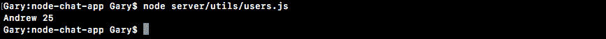

现在传递数据实际上并不有用，我们想要做的是修改特定的实例。我们想要设置这个人的名字和年龄，而不是所有人的名字和年龄。为了做到这一点，我们将使用`this`关键字。在类方法和构造函数中，`this`指的是实例，而不是类，这意味着我们可以在这个个人实例上设置属性，就像这样：`this.name = name`。

```js
class Person {
  constructor (name, age) {
    this.name = name;
  }
}
```

我们可以对年龄做同样的事情，`this.age = age`：

```js
class Person {
  constructor (name, age) {
    this.name = name;
    this.age = age;
  }
}
```

使用这种方法可以自定义个体实例。现在我们有了一个对象，我们实际上可以访问这些属性。我们定义的`me`变量与`this`变量相同，这意味着我们实际上可以访问这些属性。我们将添加`console.log`，我将仅打印字符串`this.name`以进行格式化，然后我将引用实际的`me.name`属性。对于年龄，我们将做同样的事情；我们将打印我们放入的`this.age`，只是我们将通过`me.age`访问它：

```js
var me = new Person('Andrew', 25);
  console.log('this.name', me.name);
  console.log('this.age', me.age);
```

现在我们可以使用`nodemon server/utils/users.js`重新运行文件，我们得到了我们期望的结果：

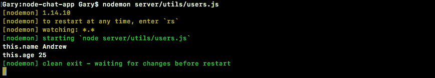

个人已更新；`this.name`设置为`Andrew`，并且确实显示出来。现在我们对如何初始化类有了基本的了解，让我们继续谈论方法。

# 方法函数

方法可以是任何函数，它们可以接受参数，也许它们不会接受参数，我们只需要定义它们。在不添加逗号的情况下，我们指定我们的方法名称。我将创建一个名为`getUserDescription`的方法：

```js
getUserDescription () {

}
```

这个方法不会接受任何参数，所以我们可以将参数列表留空。在函数本身内部，我们将返回一个描述，因为方法毕竟被称为`getUserDescription`。我们将返回一个模板字符串，将一些值注入其中，一般的流程将是`Jen is 1 year(s) old`。

```js
getUserDescription () {
  return `Jen is 1 year(s) old`;
}
```

这就是我们想要打印的内容，但我们想要为这个个人使用那些特定的值，为了做到这一点，我们将再次访问这些属性。我们将注入`this.name`，而不是静态名称；而不是静态年龄，我们将注入年龄`this.age`：

```js
getUserDescription () {
  return `${this.name} is ${this.age} year(s) old`;
}
```

现在我们可以继续测试`getUserDescription`，通过在下面调用它。我们可以创建一个名为`description`的变量，将其设置为`me.getUserDescription`，然后可以对返回值进行操作，比如使用`console.log`将其打印到屏幕上。在 log 参数列表中，我只会传入`description`：

```js
class Person {
  constructor (name, age){
    this.name = name;
    this.age = age;
  }
  getUserDescription() {
    return `${this.name} is ${this.age} year(s) old`;
  }
}

var me = new Person('Andrew', 25);
var description = me.getUserDescription();
console.log(description);
```

现在我们可以保存文件，我们应该在终端中看到我们的`description`；在这种情况下，`Andrew`和`25`，`Andrew is 25`岁。当我保存文件时，`nodemon`会重新启动，然后我们就会在屏幕上看到`Andrew is 25 year(s) old`。


这是类的基础知识，有很多与类相关的特性我们暂时不会探索，但是现在这给了我们一切我们需要开始的东西。我们将创建一个`users`类，而不是`Person`类，我们将创建自定义方法，而不是像`getUserDescription`这样的方法。我们还将在进行时添加测试用例，以确保它们按预期工作。

# 添加`users`类

首先，我们将开始添加`users`类，然后。我们将完成添加所有的方法。不过，我们现在可以开始定义这个类，我将注释掉我们刚刚添加的`Person`类，因为我们确实希望它作为文档存在。但我们不会在应用程序中确切使用它。一旦我们对类更加熟悉，我们稍后会删除它。

现在，我们将开始使用`class`关键字创建我们的`users`类，`class Users`。然后我们将打开和关闭大括号，在这里我们可以指定任何我们喜欢的方法，比如`constructor`函数。我们将定义一个`constructor`函数，尽管在创建类时它们是完全可选的。我们将通过名称设置我们的`constructor`函数，然后是参数列表，然后是打开和关闭大括号：

```js
class Users {
  constructor () {

  }
}
```

现在，与`person`不同，`users`的构造函数不会接受任何参数。当我们创建一个新的`users`实例时，我们只想从一个空的用户数组开始。我们将在`server.js`中创建这个新实例，当我们首次启动应用程序时，这将发生在代码的顶部。在下面，当有人加入房间、离开房间或以任何方式操纵房间时，我们将实际使用这些方法。这意味着我们需要做的就是将`this.users`，即`users`属性，设置为一个空数组：

```js
class Users {
  constructor () {
    this.users = [];
  }
}
```

这将是我们在`users.js`文件顶部定义的数组。接下来，我们要做的事情是，既然我们已经有了`constructor`函数，那么我们要创建`addUser`方法。我们将在`constructor`函数的下方创建它，就像我们为`getUserDescription`所做的那样。我们将设置参数列表，这个方法将使用一些参数，我们稍后会指定这些参数，并且我们将打开和关闭大括号来编写实际的函数代码：

```js
class Users {
  constructor () {
    this.users = [];
  }
  addUser () {

  }
}
```

我们需要的三个参数是`id`，`name`和`room`。为了将用户添加到`users`数组中，我们需要这三个信息。一旦我们有了它们，将它们添加到列表中就会变得非常容易。

我将首先创建一个变量`user`，这样我们就可以创建一个对象并将其推送到数组中。在`users`中，我们将设置一个`id`属性等于`id`参数，对于`name`和最后对于`room`也是同样的操作：

```js
  addUser (id, name, room) {
    var user = {id, name, room};
  }
}
```

现在我们有一个`user`对象，具有这三个属性，我们可以继续将其推送到数组中，`this.users.push`，将一个对象添加到末尾，我们要添加到数组中的是`user`变量：

```js
addUser (id, name, room) {
  var user = {id, name, room};
  this.users.push(user);
}
```

既然我们已经准备就绪，基本上我们已经完成了。我要做的最后一件事是继续返回成功创建的用户，`return user`就像这样：

```js
addUser (id, name, room) {
  var user = {id, name, room};
  this.users.push(user);
  return user;
}
```

现在，`addUser`已经完成。我们还没有将其连接起来，但我们可以为`addUser`添加一个测试用例。

# 为`addUser`添加测试用例

我们将在一个全新的名为`users.test.js`的文件中添加测试用例。在这里，我们可以加载用户，对其进行测试，以及进行任何其他可能需要做的事情。现在，第一步是实际导出用户。

目前，在`user.js`文件中，我们已经定义了类，但我们没有导出它。导出它与导出其他任何内容都是一样的，没有什么特别的地方。

我们将添加`module.exports`，并且我们将在大括号内导出一个对象，其中`users`属性等于我们的`Users`类定义，确保匹配大小写：

```js
  addUser (id, name, room) {
    var user = {id, name, room};
    this.users.push(user);
    return user;
  }
}
module.exports = {Users};
```

既然我们已经准备就绪，我们现在可以在`users.test`文件中要求我们的类并创建新的实例了。

# 在`users.test`文件中添加新的实例

让我们开始加载`expect`，`const expect = require('expect')`，我们还可以继续加载我们的用户文件，`const`。使用 ES6 解构，我们将通过本地文件`./users`获取`Users`：

```js
const expect = require('expect'); 

const {Users} = require('./users'); 
```

现在，我们只是要为添加用户添加一个测试用例。我们将快速创建一个`describe`块，大部分繁重的工作将在后面进行。我们将`describe`我们的`Users`类，然后我们可以添加我们的箭头函数，然后我们可以继续添加一个测试用例，`it`，在引号内，`should add new user`。我将为这个设置函数。这将是一个同步函数，所以不需要`done`参数，我们可以创建一个新的用户实例，`var users`，等于一个`new Users`：

```js
describe('Users', () => {
  it('should add new user', ()=> {
    var users = new Users();
  });
});
```

现在，由于我们在`constructor`函数中没有传入任何参数，所以在实际创建实例时我们也不会传入任何参数。

接下来要做的是创建一个用户，然后将其属性传递给`addUser`，确保最终显示出适当的内容。让我们创建一个名为`user`的变量，然后将其设置为一个对象：

```js
it('should add new user', ()=> {
  var users = new Users();
  var user = {

  }
});
```

我将继续在这个对象上设置三个属性，一个`id`等于`123`之类的东西，一个`name`属性等于像`Andrew`这样的名字，你可以使用你的名字，比如`Andrew`，还有一个房间名。我将使用`The Office Fans`：

```js
describe('Users', () => {
  it('should add new user', ()=> {
    var users = new Users();
    var user = {
      id: '123',
      name: 'Andrew', 
      room: 'The office fans'
    };
  });
});
```

现在我们已经有了用户，我们可以调用我们刚刚创建的方法，`addUser`方法，使用三个必要的参数，`id`，`name`和`room`。我将把响应存储在一个名为`resUser`的变量中，并将其设置为`users.addUser`，传入这三个信息，`user.id`，`user.name`和`user.room`作为第三个参数：

```js
describe('Users', () => {
  it('should add new user', ()=> {
    var users = new Users();
    var user = {
      id: '123',
      name: 'Andrew',
      room: 'The office fans'
    };
    var resUser = users.addUser(user.id, user.name, user.room);
  });
});
```

有了这个调用，我们现在可以开始做出我们的断言。

# 为用户调用做出断言

我们想要做的一个断言是实际的`users`数组已经更新，当我们调用`this.users.push`时，它应该已经更新。我期望通过调用`expect`来期望一些关于`users.users`的内容：第一个用户是指`users`变量，第二个实际上访问了`users`文件中定义的`users`数组。然后我们将调用`toEqual`。记住对于数组和对象，你必须使用`toEqual`而不是`toBe`。我们期望它是一个只有一个项目的数组。这个项目应该看起来像我们在代码中定义的`user`对象：

```js
var resUser = users.addUser(user.id, user.name, user.room);

expect(users.users).toEqual([user]);
```

如果这通过了，那么我们知道我们的用户确实被添加到了`users`数组中。我将继续保存文件并关闭`nodemon`。

# 运行 addUser 测试用例

我将清除终端输出并运行`npm test`，以确保我们全新的测试用例通过：

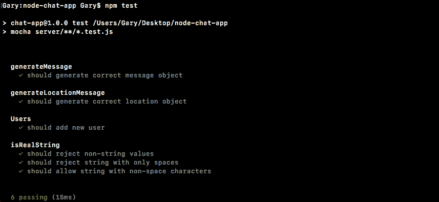

当我运行它时，它确实通过了。我们有我们的`Users`块，`should add new user`按预期工作。

# 添加 removeUser、getUser 和 getUserList 方法

在我们将用户集成到我们的应用程序之前，让我们继续完成它。我们还有三种方法要添加和测试。第一个是`removeUser`，它将接受一个参数，要删除的用户的 ID。这也将返回刚刚删除的用户，所以如果我删除 ID 为 3 的用户，我想把它从列表中删除，但我确实想返回这个对象。

我们将留下一个关于`返回被删除的用户`的小注释：

```js
removeUser (id) { 
  //return user that was removed 
} 
```

接下来我们要填写的下一个方法是`getUser`。`getUser`方法将接受与`removeUser`完全相同的参数。我们将通过 ID 找到一个用户并返回用户对象，但我们不会从数组中删除它：

```js
getUser (id) { 

} 
```

我们要创建的最后一个方法，如上所述，是一个名为`getUserList`的方法。这将获取所有用户的列表，只显示他们的名字和房间名：

```js
getUserList (room){ 

} 
```

这意味着我们将遍历`users`数组，寻找所有房间与指定房间匹配的用户。这将返回一个数组，类似于：`'Mike', 'Jen', 'Caleb'`，假设这些人在房间里：

```js
getUserList (room) {
  ['Mike', 'Jen', 'Caleb']
}
```

现在，请注意，我们没有指定房间或 ID 属性；我们只是返回一个字符串数组。

# 为测试文件添加种子数据

现在让我们在测试文件中添加一件事。为了使这些方法起作用，我们需要种子数据，我们需要已经存在的用户，否则我们无法删除一个或获取一个，绝对不能获取这些不存在用户所在的房间列表。

为了解决这个问题，在`user.test.js`中，我们将添加一个`beforeEach`调用，这是我们过去使用过的。`beforeEach`调用，正如我们所知，将在每个测试用例之前调用。它将帮助我们初始化一些数据。现在我们要初始化的数据将在`beforeEach`调用的上面定义，一个名为`users`的变量中：

```js
describe('Users', () => {
  var users;

  beforeEach(() => {

  });
```

我在`beforeEach`之外定义它的原因是为了让它在`beforeEach`内部和测试用例内部都可以访问到。

在`beforeEach`内部，我们将`users`设置为`new Users`，我们还将设置`users.users`数组。在这里，我们可以指定一个对象数组，这将让我们添加一些初始化数据：

```js
beforeEach(() => {
  users = new Users();
  users.users = [{

  }]
});
```

让我们提供三个对象。第一个将有一个`id`属性等于`2`，我们将把`name`属性设置为类似`Mike`的东西，然后我们可以把`room`属性设置为任何我们喜欢的东西，我将使用一个房间名`Node Course`：

```js
var users;

beforeEach(() => {
  users = new Users();
  users.users = [{
    id: '1',
    name: 'Mike',
    room: 'Node Course'
  }]
});
```

我们可以拿这个对象并复制两次。我要加一个逗号，粘贴刚刚复制的内容，然后再做同样的事情，逗号后面是一个粘贴。我要把第二个用户的 id 改成`2`，我们会把名字改成`Jen`，把房间名改成`React Course`。现在对于最后一个用户，我们要改变`id`和`name`，我们会把`id`设为`3`，名字设为`Julie`，但是我们会把房间名留为`Node Course`，这样我们可以测试我们的`getUserList`函数是否确实返回了正确的结果：

```js
beforeEach(() => { 
  users = new Users(); 
  users.users = [{ 
    id: '1', 
    name: 'Mike', 
    room: 'Node Course' 
  },{ 
    id: '2', 
    name: 'Jen', 
    room: 'React Course' 
  },{ 
    id: '3', 
    name: 'Julie', 
    room: 'Node Course' 
  }] 
}); 
```

测试用例不需要使用我们在这里定义的`users`变量。我们仍然可以定义一个自定义的变量，就像我们在添加新用户的情况下定义的那样。如果我运行`test-watch`脚本，`npm run test-watch`，我们会看到我们的一个测试用例仍然通过：

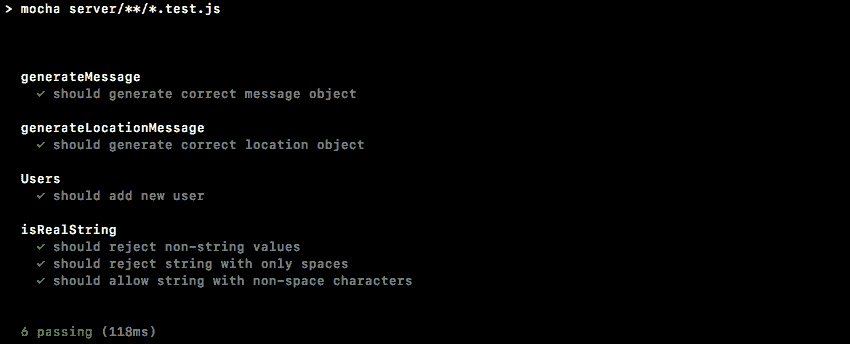

我要保存文件以重新运行测试套件，现在我们有 6 个通过的测试用例。无论我们是否使用这个，我们仍然可以使用自定义的测试用例。

既然我们已经准备就绪，我们可以继续填写一些这些方法。我们将一起填写`getUserList`，你将负责`removeUser`和`getUser`。

# 填充 getUserList

为了填写`getUserList`，我们将首先找到所有房间与指定`room`匹配的用户。为了做到这一点，我们将使用数组的`filter`方法，这是我们过去使用过的。让我们创建一个变量，我们将称之为`users`，然后将其设置为`this.users`，这是`users.filter`的数组：

```js
getUserList (room) {
  var users = this.users.filter((user) => {

  })
}
```

现在如果你记得，`filter`接受一个函数作为它的参数。这个函数会被每个单独的用户调用。我们可以返回`true`来保留数组中的这个项目，或者我们可以返回`false`来将其从数组中移除。我将返回`user.room`，然后我们会检查它是否等于，使用三个等号，`room`参数：

```js
getUserList (room) {
  var users = this.users.filter((user) => {
    return user.room === room;
  })
}
```

如果它们相等，`user.room === room`将返回`true`，该值将被返回；如果它们不相等，它将返回`false`，用户将不会被添加到上面的列表中。现在我们可以使用 ES6 箭头函数的快捷方式。我们将使用这样的简写，而不是添加`return`关键字并指定实际的箭头：

```js
getUserList (room){
  var users = this.users.filter((user) => user.room === room)
}
```

这是完全相同的功能，只是不同的技术。现在我们有了所有符合条件的用户的列表。过程的下一步是将对象数组转换为字符串数组。我们只关心获取那个名单。为了做到这一点，我们将使用`map`。我将创建一个名为`namesArray`的变量，我们将把它设置为`users.map`：

```js
getUserList (room){
  var users = this.users.filter((user) => user.room === room);
  var namesArray = users.map
}
```

现在我们过去使用了`map`，因为我们知道`map`也需要一个类似于`filter`的函数。它也会被调用以处理单个项目。在这种情况下，是单个用户，但`map`让我们返回我们想要使用的值。所以我们将得到一个对象，它将有`id`属性、`room`属性和`name`属性，我们只想要`name`属性，所以我们将返回`user.name`。我们甚至可以使用箭头函数的简写来进一步简化它。`user.name`将被隐式返回：

```js
var users = this.users.filter((user) => user.room === room); 
var namesArray = users.map((user) => user.name); 
```

现在我们有了`namesArray`数组，我们需要做的就是通过返回`namesArray`来返回它：

```js
getUserList (room){
  var users = this.users.filter((user) => user.room === room);
  var namesArray = users.map((user) => user.name);

  return namesArray;
}
```

现在这将完成任务，在我们进一步简化之前，让我们继续编写一个测试用例以确保它有效。

# 为`getUserList`添加测试用例

在`users.test.js`中，我们可以在其他测试用例下面添加测试用例，`it ('should return names for node course')`。我们将编写返回`Node`课程中所有用户的用例，我们应该得到两个用户，`Mike`和`Julie`。我们将创建一个变量，我们将称这个变量为`userList`，然后我们将调用已经定义的`users`变量：

```js
it('should return names for node course', () => {
  var userList = users
});
```

这是我们种子数据的一个。我们不需要像为其他测试用例`users.getUserList`那样创建一个自定义的。我们知道`getUserList`需要一个参数，你想要获取列表的房间的名称，这个叫做`Node Course`。确保你的大写字母对齐。然后我们可以继续在末尾添加一个分号：

```js
it('should return names for node course', () => {
  var userList = users.getUserList('Node Course');
});
```

最后要做的是添加我们的断言，确保我们得到的是预期的结果。我们将`expect` `userList`等于，使用`toEqual`，以下数组。它将是一个数组，其中第一项是`Mike`，第二项是`Julie`：

```js
it('should return names for node course', () => {
  var userList = users.getUserList('Node Course');

  expect(userList).toEqual(['Mike', 'Julie']);
});
```

如果该断言通过，我们知道`getUserList`按预期工作，因为这正是我们在上面定义的。

现在我们可以继续复制这个测试用例。对`React Course`做完全相同的事情应该返回`react`课程的名称，我们将把`Node`改为`React`，然后我们将更新我们的`expect`。React 课程只有一个用户，该用户的`name`等于`Jen`：

```js
it('should return names for react course', () => {
  var userList = users.getUserList('React Course');

  expect(userList).toEqual(['Jen']);
});
```

现在这是一个相当不错的测试用例。如果我们保存`users.test.js`，它将重新运行整个测试套件。我们应该看到我们在`users`描述块下有三个测试，它们都应该通过，确实是这样的：

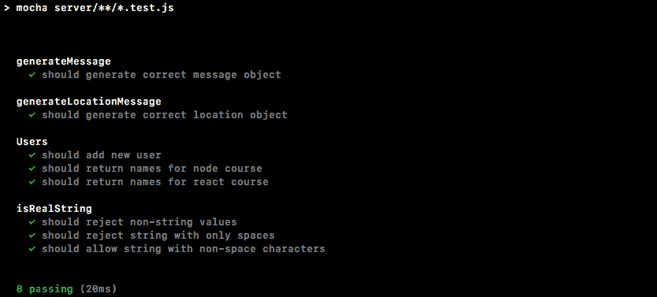

我们要创建的下两个方法是`removeUser`和`getUser`。让我们继续一起编写测试用例的`it`语句，你将负责填写方法和填写测试用例：

```js
it('should remove a user', () => {

});
```

这个方法将获取我们种子用户的 ID，无论是 1、2 还是 3。它将把它传递给`removeUser`函数，你的工作是断言用户确实被移除了。接下来，`it('should not remove user')`：

```js
it ('should not remove user', () => {

});
```

在这种情况下，我希望你传入一个不是我们种子`user`数组的一部分的 ID，这意味着类似于 44、128 或者基本上任何不是 1、2 或 3 的字符串。在这种情况下，你应该断言数组没有改变；我们仍然应该有这三个项目。

现在这些是我们的`removeUser`方法的两个测试用例，接下来是`getUser`。我们将添加两个类似的测试用例。首先是`it('should find user')`，你应该传入一个有效的 ID，然后你应该得到用户对象。另一个将是`it ('should not find user')`，就像`it('should not remove a user')`一样。传入一个无效的 ID，并确保你没有得到用户对象。

# 填写 getUser

我将从`getUser`开始，这里的目标是返回 ID 与`getUser`中传入的参数的 ID 匹配的用户对象。为了完成这个目标，我将使用`filter`。我们将返回`this.users.filter`的结果，我们将按 ID 进行过滤，这里我们按房间进行过滤。我们将传入我们的箭头函数，使用表达式语法，参数将是`user`，我们将继续返回`true`，如果用户的`id`属性等于参数的 ID。如果是这种情况，我们确实希望在数组中保留这个`user`。最后，我们应该只有一个用户或 0 个用户，我们要做的就是返回第一个项目：

```js
getUser (id){
  return this.users.filter((user) => user.id === id)[0]
}
```

如果数组中有一个用户，我们将得到它的对象；如果没有用户，我们将得到 undefined，这正是我们想要的。现在我们有了`getUser`，我们可以为此编写测试用例。我们有两个测试用例，`it('should find user')`和`it('should not find user')`。

# 测试用例-应该找到用户

对于`it('should find user')`，我将首先创建一个名为`userId`的变量，并将其设置为我想要使用的 ID。我需要一个有效的 ID，所以我将继续使用`2`。`1`、`2`或`3`在这里都可以工作：

```js
it('should find user', () => {
  var userId = '2';
});
```

接下来，我将继续创建一个`user`变量，这将是从`getUser`返回的结果。我将把它设置为`users.getUser`，我们将尝试通过传入`userId`来获取 ID 为`2`的用户：

```js
it('should find user', () => {
  var userId = '2';
  var user = users.getUser(userId);
});
```

现在我们要做的下一件事是对我们得到的结果进行断言，我们应该得到我们的对象，并且我们可以`expect` `user.id`等于，使用`toBe`，和 ID，`userId`变量：

```js
it ('should find user', () => {
   var userId = '2';
   var user = users.getUser(userId);
   expect(user.id).toBe(userId);
});
```

我将保存测试套件，你可以看到我们所有的测试用例仍然通过，这太棒了。如果它不等于 ID，也许 ID 是`3`，你将看到测试用例失败，我们会得到一个非常清晰的错误消息：

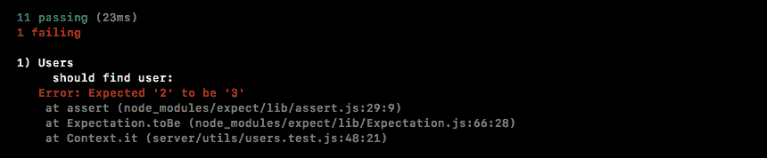

我们得到了`预期为 2 实际为 3`，显然不是这样。这是最后的测试用例，我们可以继续进行`it('should not find user')`。

# 测试用例-不应该找到用户

在这种情况下，我们将遵循与应该找到用户相似的格式，创建`userId`变量，并将其设置为内置用户中不存在的用户 ID，类似于`99`将完成任务：

```js
it('should not find user', () => {
  var userId = '99';
});
```

接下来，我们将创建一个`user`变量，再次存储从`getUser`中返回的结果，`users.getUser`，传入我们的`userId`：

```js
it('should not find user', () => {
  var userId = '99';
  var user = users.getUser(userId);
});
```

现在在这种情况下，我们期望得到 undefined，`filter`应该返回空，如果你尝试获取空数组中的第一个项目，你将得到 undefined。我们可以通过在终端中运行`node`来证明这一点，在我们的小控制台中，我们可以创建一个空数组，然后访问第一个项目：

```js
**>[][0]** 
```

我们得到了`undefined`。我将关闭它，重新启动我们的测试套件，在`inside users.test.js`文件中，我们将继续进行断言。我们将`expect(user).toNotExist`：

```js
it ('should not find user', () => {
  var userId = '99';
  var user = users.getUser(userId);

  expect(user).toNotExist();
});
```

我将保存文件，我们所有的测试用例应该仍然通过：

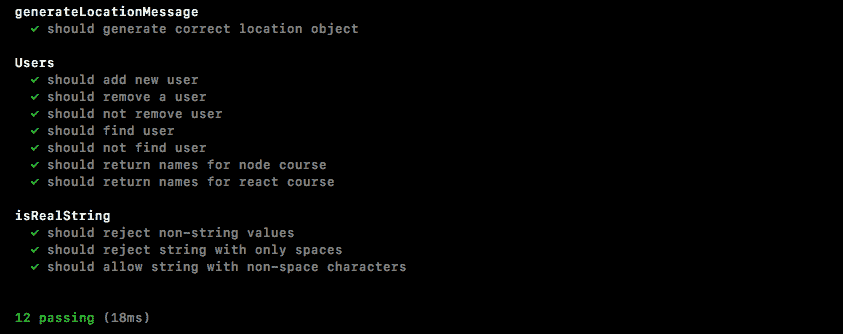

太好了。接下来，我们需要编写`removeUser`方法，还需要填写测试用例。

# 填写 removeUser 方法

在`user.js`中，我们可以开始查找用户，如果有的话。这意味着，我们将使用与`getUser`方法类似的技术。我将从`getUser`方法中复制以下行，并将其粘贴到`removeUser`中。

```js
return this.users.filter((user) => user.id === id) [0]
```

创建一个名为`user`的变量，将其设置为前一行。现在你也可以继续调用`getUser`。我可以调用`this.getUser`，传入`id`，就像这样：

```js
removeUser (id) {
  var user = this.getUser(id);
}
```

这两种解决方案都将按预期工作。接下来，如果有用户，我们想要删除它，`if(user)`，我们将做一些特殊的事情，无论用户是否存在，我们都将返回`user`值：

```js
removeUser (id) {
  var user = this.getUser(id);

  if (user) {

  }

  return user;
}
```

如果它不存在，我们将返回 undefined，这很好，如果它存在，我们将在删除用户后返回对象，这也是我们想要的。我们需要做的就是弄清楚如何从列表中删除它。

为了做到这一点，我将把`this.users`设置为`this.users`，然后我们将调用`filter`找到所有 ID 与上面指定的 ID 不匹配的用户。我们将调用 filter，传入我们的箭头函数，我们将得到单个`user`，在箭头表达式语法中，我们要做的就是添加`user.id`不等于`id`：

```js
if (user) {
  this.users = this.users.filter((user) => user.id !== id);
}
```

这将创建一个新数组，将其设置为`this.users`，并且将删除项目，如果有的话。如果没有项目，那就没关系；这个语句永远不会运行，我们将能够继续返回 undefined。

现在我们已经做好了这个准备，我们可以继续编写一个测试用例，以确保它按预期工作。我将保存`user.js`，然后在`users.test`中，我们将填写`it ('should remove a user')`和`it ('should not remove user')`测试用例。让我们从`should remove a user`开始。

# 测试用例-应删除用户

我将创建一个变量`userId`来存储理想的 ID，可以是`1`、`2`或`3`，我将选择`1`，然后我们可以继续并实际删除它，将返回结果存储在一个`user`变量中。我将调用`users.removeUser`，传入我的`userId`变量，即`1`：

```js
it('should remove a user', () => {
  var userId = '1';
  var user = users.removeUser(userId); 
});
```

现在我们有了可能被删除的用户，我们应该能够继续断言一些东西。我们将期望`user`对象存在。我们还将期望它的`id`等于上面的`id`，并且期望被删除的用户具有`id`属性，使用`toBe(userId)`：

```js
it('should remove a user', () => {
  var userId = '1';
  var user = users.removeUser(userId);

  expect(user.id).toBe(userId);
});
```

接下来，我们将确保用户已从数组中删除。在这种情况下，我们将期望`users.users.length`为`2`：

```js
it('should remove a user', () => {
  var userId = '1';
  var user = users.removeUser(userId);

  expect(user.id).toBe(userId);
  expect(users.users.length).toBe(2);
});
```

一开始应该是`3`，一旦我们删除了一个用户，它应该是`2`。

# 测试用例-不应删除用户

在`should not remove user`的情况下，我们将做一些类似的事情，只是我们将调整`userId`。我可以复制我们第一个测试用例的内容，粘贴到第二个测试用例中，我们只需要做一些调整。我将把 ID 更改为无效的 ID，比如`99`。我们仍然将使用该 ID 调用`removeUser`。在这种情况下，我们不再期望`user`具有`id`属性，而是使用`toNotExist`来判断`user`不存在。接下来，我们将期望长度没有改变，并确保长度仍然等于`3`：

```js
it ('should not remove user', () => {
  var userId = '99';
  var user = users.removeUser(userId);

  expect(user).toBe(userId);
  expect(users.users.length).toBe(3);
});
```

现在我可以保存`users.test`文件。这将重新启动`nodemon`中的所有内容，我们应该得到一个通过的测试套件。看起来好像已经运行了，尽管内容没有改变，所以很难弄清楚是否发生了什么。我将关闭它并运行`npm test`来验证，你可以看到这里有 12 个测试用例都通过了：

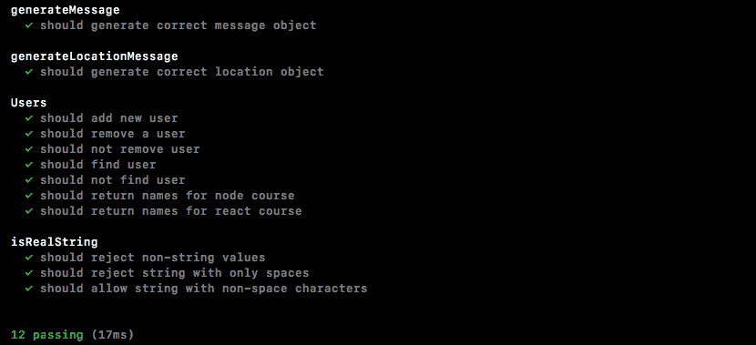

现在我们已经拥有了所有我们需要的方法来跨不同的事件监听器持久化用户；无论他们是发送消息、位置消息，无论他们是连接还是离开，我们都将能够跟踪他们并向正确的人发送正确的东西。

# 连接用户列表

在这一部分，我们将开始连接我们创建的用户类，并且为了开始，我们将连接`People`列表，这意味着当用户加入和离开时，我们需要做一些事情。我们希望保持列表最新，并且每次更新时，我们都希望给客户端一个新的列表副本。这意味着服务器需要向客户端发出一个事件，然后客户端将监听该事件并更新标记。

现在我们可以通过以下命令启动服务器来查看这将发生在哪里：

```js
**nodemon server/server.js** 
```

然后，我将前往`localhost:3000`并打开聊天页面。我将输入`Andrew`作为显示名称，`LOTR`作为房间名称。现在一旦我们进入，我们有我们的 People 列表，当前应该显示我们，因为我们在房间里，当一个新用户加入时，它应该自动显示该用户：

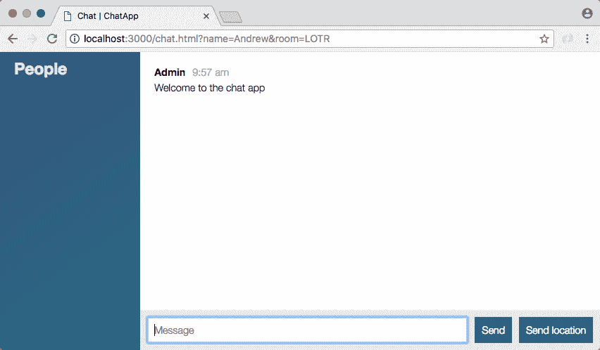

现在没有任何这些正在发生，但是有了我们的新事件，这一切都将发生。

# 在聊天室中添加 People 列表

现在我们要做的第一件事是确切地弄清楚这个事件会是什么样子。在`chat.js`中，我们可以添加一个监听器来弄清楚对我们有用的是什么，客户端真正需要做什么？然后我们可以继续连接服务器来满足这些需求。

就在`chat.js`中，就在`disconnect`下面，我们将添加一个新的监听器，`socket.on`，我们将监听一个全新的事件。这个事件将被称为`updateUserList`：

```js
socket.on('disconnect', function() {
  console.log('Disconnected from server');
});

socket.on('updateUserList')
```

现在`updateUserList`需要传递一些信息。我们需要显示用户列表而不是当前显示的用户，这意味着我们将期望一个参数，一个`users`数组。这个`users`数组将只是一个名字数组，就像我们在`users`类中返回的那样。

回到`chat.js`，目前，我们只是在数据通过时将列表记录到屏幕上，`console.log('Users list')`，第二个参数将是实际的`users`数组：

```js
socket.on('updateUserList', function(users){
  console.log('Users list', users);
});
```

一旦我们连接好这个，我们只需要添加一些 jQuery 来更新 DOM。更难的部分将是将更新和最新的列表返回给客户端。

# 添加 jQuery 来更新 DOM

在`server.js`中，这个过程的第一步是导入我们努力创建的类。我将继续完成这个，就在我们加载`isRealString`的下面。

我们可以创建一个常量，我将继续使用`users`属性，这是我们在`users.js`底部导出的属性，我们可以使用`require`导入它。我将要求本地文件`./`。它在`utils`文件夹中，这个文件叫做`users`：

```js
const {Users} = require('./utils/users');
```

现在我们已经有了`Users`，我们可以创建一个新的实例。这将是`users`实例。我们需要一种方法来运行这些方法，所以就在我们的`io`变量下面，我们可以创建一个名为`users`的新变量，将其设置为`new Users`，就像这样：

```js
var users = new Users();
```

现在我们将能够调用所有用户方法来添加、删除、获取和否则操作数据。

# 将用户添加到用户列表

这个过程的第一步将是在用户加入聊天室时将用户添加到列表中。我们可以在调用`socket.join`之后立即执行。我将删除旧的注释，尽管如果您发现它们是一个很好的参考，您可以选择保留它们。在`socket.join`下面，我们将调用`users.addUser`，添加我们全新的用户，我们需要传入这三个信息，socket ID，存储在`socket.id`中，名称，在`params.name`上，最后我们将传入房间名，`params.room`：

```js
socket.join(params.room);
users.addUser(socket.id, params.name, params.room);
```

现在您注意到，如果存在验证错误，即名称或房间名称未提供，这段代码不应该运行，但目前情况并非如此。我们实际上没有停止函数执行，我将使用`return`来确保如果数据无效，则下面的代码不会执行：

```js
socket.on('join', (params, callback) => {
  if(!isRealString(params.name) || !isRealString(params.room)){
    return callback('Name and room name are required.');
  }
});
```

# 使用唯一 ID 添加用户

这个过程的下一步将是确保没有具有相同 ID 的用户。我将调用`users.removeUser`来完成这个任务，传入唯一的参数需要`socket.id`就像这样：

```js
socket.join(params.room);
users.removeUser(socket.id);
users.addUser(socket.id, params.name, params.room);
```

这意味着用户加入房间，我们将他们从任何可能的以前的房间中移除。最后，我们将他们添加到新的房间。现在我们已经做到了这一点，我们可以继续发出那个事件。

# 向客户端发出事件

我们将发出客户端期望的事件`updateUserList`，带有`users`数组。如果我们不发出事件，客户端将永远无法获得新列表，而我们刚刚更新了列表，所以我们肯定希望他们获得一个新的副本。这意味着我们希望通过`io.to`向聊天室中的每个人发出事件。我们将传入房间名，然后调用`emit`，发出事件。

现在我们可以继续填写第一步，我们要传入房间名，`params.room`中有这个信息，接下来我们要发出事件，我们刚刚在`chat.js`中定义的事件名是`updateUserList`。我们需要做的最后一件事是获取用户列表。我们已经有了，`users.getUserList`，传入我们想要获取列表的房间名。再次，`params.room`，这将是我们传入的唯一参数：

```js
socket.join(params.room);
users.removeUser(socket.id);
users.addUser(socket.id, params.name, params.room);

io.to(params.room).emit('updateUserList', users.getUserList(params.room));
```

有了这个调用，我们应该能够在终端中查看这个。

我将保存这个文件，这将在终端中重新启动服务器。

# 在聊天室中测试用户列表

在浏览器中，我可以打开开发者工具查看`控制台日志`，然后我将刷新应用程序。如果我刷新应用程序，我们会看到一个`用户`列表，我们有`Andrew`打印两次：

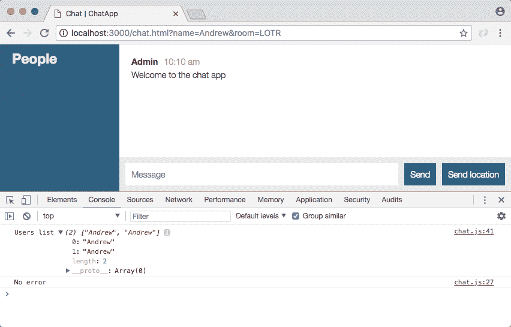

如果我第二次刷新页面，我们有`Andrew`打印三次：


正如您所看到的，这是因为当用户离开聊天应用程序时，我们没有从列表中移除用户。这是本节中的第二个目标。我们目前有一个用户列表。当用户离开时，我们只需要更新它，这将发生在`disconnect`监听器的底部附近。

# 当他们离开聊天室时移除用户

在断开连接的监听器中，我们想要移除用户，然后再次更新用户列表。我将通过几个单独的步骤来实现这一点。首先，我们将创建一个名为`user`的变量，存储任何可能被移除的用户，记住`removeUser`方法会返回被移除的用户，`users.removeUser`传入 ID，`socket.id`：

```js
socket.io('disconnect', () => {
  var user = users.removeUser(socket.id);
});
```

现在我们只想在实际移除用户时才执行某些操作，如果这个人没有加入房间，实际上没有理由做任何事情。如果用户被移除，我们将发出两个事件，并且我们将把它们发出给连接到聊天室的每个人，这意味着我们将使用`io.to().emit`，就像我们在前面的代码中所做的那样。我们将这样做两次，所以我将复制这行并粘贴，就像这样：

```js
socket.io('disconnect', () => {
  var user = users.removeUser(socket.id);

  if (user){
    io.to().emit();
    io.to().emit();
  }
});
```

# 当有人离开聊天室时更新用户列表

第一个将更新`user`列表，第二个将打印一条小消息，比如`Andrew 已经离开房间`。第一个将以用户房间属性作为唯一参数，`user.room`存储房间字符串，我们将为两者提供这个参数，现在我们可以开始发出我们的事件。

我将首先发出`updateUserList`事件，在引号内，`updateUserList`，然后我们将继续调用我们在上面刚刚做过的完全相同的方法，`users.getUserList`，传入房间，`user.room`：

```js
if (user){
  io.to(user.room).emit('updateUserList', users.getUserList(user.room));
  io.to(user.room).emit();
}
```

现在当有人离开房间时，他们将从列表中被移除，我们将不再看到那些在 Web 开发者控制台中出现的重复。

# 发出自定义消息

我们要做的下一件事是发出一条消息。我们将从管理员向所有人发出一条消息，就像我们在上面做的那样。我们向用户致以问候，并告诉所有其他用户有人加入了，现在我们将`emit('newMessage')`，并且我们将调用`generateMessage`，就像我们以前做过的那样。我们将传入这两个参数，第一个是`Admin`。这将是一条管理员消息，第二个可以是一个模板字符串，我们将注入用户的名字，`user.name`，然后我们将说用户已经离开：

```js
io.to(user.room).emit('updateUserList', users.getUserList(user.room)); 
io.to(user.room).emit('newMessage', generateMessage('Admin', `${user.name} has left.`)); 
```

现在我们已经做好了一切应该按预期工作。希望在 Chrome 中我们不再看到重复的用户。我将刷新页面，我们看到用户列表只有一个用户，`Andrew`：

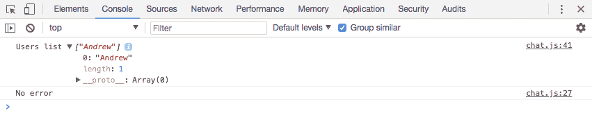

如果我刷新页面，我们不再会得到重复的用户，因为当我离开时，我被移除了，当我回来时，我被添加了。当页面最终完成刷新时，我被添加了。如果我添加一个新用户，情况也是一样的。暂时，我将把浏览器切换到屏幕的一半宽度。我将打开第二个标签并将其拖到另一半，这样我们可以并排查看这两个标签。我还将打开第二个标签的开发者工具，并且我们将加入完全相同的房间。

让我们去`localhost:3000`，我将以`Mike`加入，房间名将是相同的，`LOTR`。现在当我点击`加入`，我应该在两个控制台中看到更新后的列表。我将点击`加入`。在右边的浏览器窗口中，我们得到`Andrew`，`Mike`，在左边的浏览器窗口中，我们也有`Andrew`，`Mike`，这太棒了：

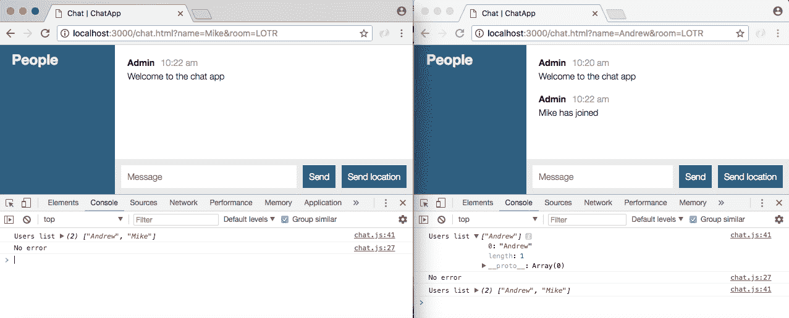

我还收到一条小消息，说 Mike 已经加入，这是之前的情况；真正的测试是当用户离开时会发生什么。我将把 Andrew 踢出聊天室，在我们的另一个聊天窗口中，我们看到 Andrew 已经离开打印到屏幕上，我们的新用户列表只有一个用户，`Mike`：

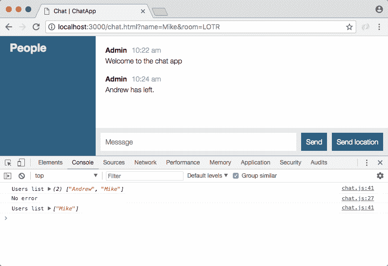

这太棒了。我们现在可以跟踪用户的进出，这让我们可以做一些很酷的事情，比如打印自定义消息和更新用户列表。

# 将用户的名字呈现到聊天室

最后要做的事情是实际将名称呈现到屏幕上。我们不只是在控制台中打印它们，我们想要将这些名称添加到列表中，这将在`server.js`的事件监听器中发生。我们将像以前一样使用 jQuery。在`chat.js`中，我们将对这些`users`做一些操作。

# 添加 jQuery 以将用户添加到列表中

首先让我们创建一个新的 jQuery 元素。我们将创建一个名为`ol`的变量。这将使用 jQuery 存储一个新元素。我们将创建一个有序列表。我们将创建`ol`标签：

```js
socket.on('updateUserList', function(users){
  var ol = jQuery('<ol></ol>');
});
```

现在我们需要遍历每个用户并对该用户进行一些操作，`users.forEach`将让我们完成这个任务。我们将传入我们的函数，并在该函数内部添加单个用户：

```js
socket.on('updateUserList', function(users){
  var ol = jQuery('<ol></ol>');

  users.forEach(function () {

  });
});
```

函数的参数是名称，`user`字符串，我们要做的就是向上面的有序列表附加一些东西。那就是`ol.append`：

```js
socket.on('updateUserList', function(users){
  var ol = jQuery('<ol></ol>');

  users.forEach(function () {
    ol.append();
  });
});
```

现在我们想要附加什么？我们想要附加一个列表项，列表项的`text`属性将等于名称，这样就可以正确呈现所有内容。我们可以使用 jQuery 通过打开和关闭列表项标签来创建一个新的列表项。然后在 jQuery 的关闭括号后，我们将调用`text`，这样我们可以安全地将`text`属性设置为用户的名称：

```js
socket.on('updateUserList', function(users){
  var ol = jQuery('<ol></ol>');

  users.forEach(function (user) {
    ol.append(jQuery('<li></li>').text(user));
  });
});
```

现在我们有一个更新的列表，但实际上它并没有呈现到屏幕上，最后一步是通过将其添加到 DOM 来呈现它。

# 呈现更新的用户列表

现在在`chat.html`中，我们有一个地方可以放置它。这是具有`id`为`users`的`div`标签，这意味着我们可以选择它，`jQuery`，选择器将以井号(`#`)开头，因为我们是按 ID 选择的，我们选择`users`，然后我们可以实际添加列表。我将把`html`属性设置为我们的有序列表`ol`，而不是使用 append，我们不想更新列表，我们想完全清除列表，用新版本替换它：

```js
socket.on('updateUserList', function(users){
  var ol = jQuery('<ol></ol>');

  users.forEach(function (user) {
    ol.append(jQuery('<li></li>').text(user));
  });

  jQuery('#users').html(ol);
});
```

现在我们可以保存`chat.js`并测试一下。

# 在聊天室中测试用户名称

在浏览器中，我将关闭控制台，刷新页面，我们会看到数字 1，后面是 Mike：

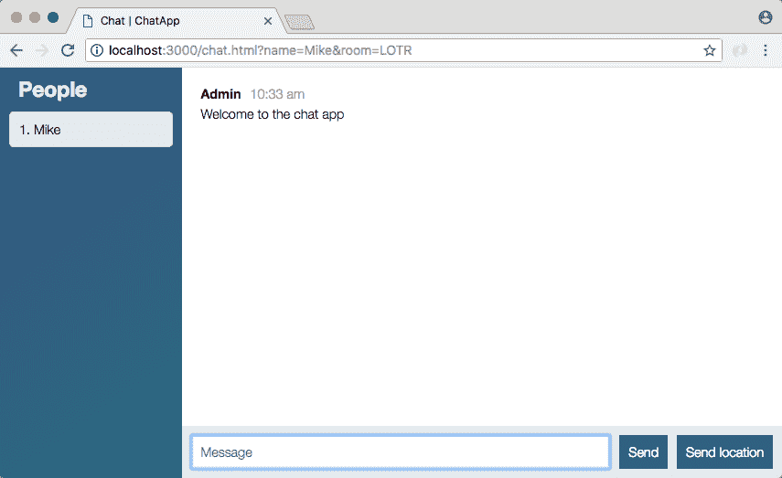

现在数字 1 来自于我们使用有序列表。如果我添加第二个用户，我们将看到第二个用户。让我们创建第二个用户，我们将给它一个显示名称`Jen`，然后我们将进入相同的房间`LOTR`，当我们加入时，我们会收到一条小消息，我们会得到我们的两个用户，同样的东西也显示出来：

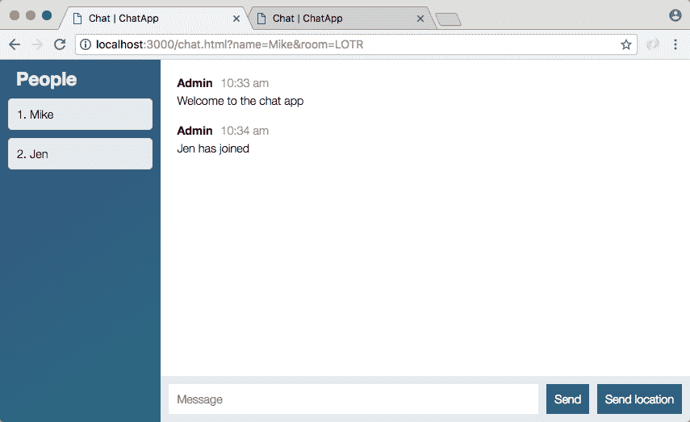

现在我将转到第二个标签，然后关闭第一个标签。当我这样做时，您的列表会自动更新，我们还会收到消息，说 Mike 已经离开了：

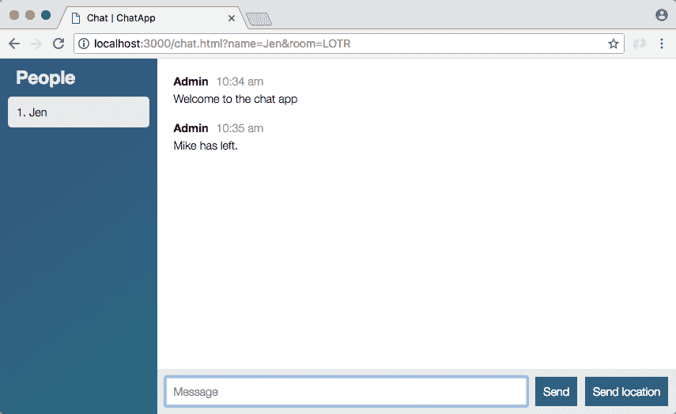

有了这个，我们离完成还有一步。消息仍然发送给每个人，它们不是特定于房间的，但这是我们将在下一节中处理的事情。目前我们完成了。我将进行提交，已经过了一段时间，我们有一个完成的功能，所以让我们继续进行。

# 为更新的用户列表做出提交

首先，我们将运行`git status`，我们有一些新文件以及一些现有文件，我将使用`git add .`将所有这些文件添加到下一个提交中。最后，我们可以使用`git commit`来实际进行提交，我将使用`-m`标志来添加我们的消息，并在引号内添加`Add Users class and updateUserList event`：

```js
git commit -m 'Add Users class and updateUserList event'
```

我们可以继续进行这个提交并将其推送到 GitHub，如果你愿意，可以推送到 Heroku，我会再等一会儿，那里的一切应该也能正常工作。

在下一节中，我们将确保消息，无论是文本消息还是位置消息，只发送给房间里的人。

# 只向房间发送消息

在上一节中，我们连接了 People 列表，确保新用户进入和离开时列表会更新。在本节中，我们将确保我们的文本和位置消息只发送给同一个房间的用户。目前，它会发送给所有人。我们可以通过打开一个新连接来证明，我将使用`Mike`，我们将加入一个不同的房间，`The Office Fans works`。当我加入房间时，您可以看到 People 列表确实是正确的，一个房间的用户不会更新另一个房间的 People 列表。不同的是，文本消息不遵循这些规则，基于位置的消息也不遵循这些规则：

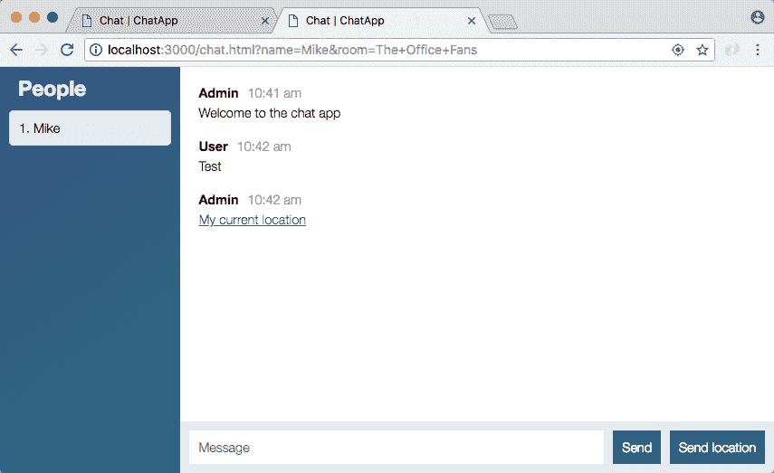

我们将有文本消息和位置消息，如果我转到另一个房间的聊天应用程序，我们会得到这两个消息。这是一个问题。我们还有一个名称问题，当前文本消息显示为 User，位置消息显示为 Admin，我们希望确保使用实际用户的名称，无论是 Jen 还是 Andrew。为了完成这个任务，我们需要对`server.js`和`chat.js`进行一些更改，这实际上是我们要开始的地方。

# 更新 chat.js 和 server.js 文件

当前，名称`User`，我们在浏览器中看到的错误名称来自`chat.js`中的`socket.emit`函数：

```js
socket.emit('createMessage', {
  from: 'User',
  text: messageTextbox.val('')
}, function() {
  messageTextbox.val('')
});
```

客户端最初发送了名称，但这将不再是情况，名称由服务器存储，因此我们将从`createMessage`中删除这个必需的属性，我们只会发送文本。

```js
socket.emit('createMessage', {
  text: messageTextbox.val('')
}, function() {
  messageTextbox.val('')
});
```

现在，我们可以修改`server.js`中的事件监听器。在`server.js`中，`createMessage`获取这两个属性，并将它们直接放入`generateMessage`中。相反，我们将使用`users.getUser`找到用户，并对其进行操作。

在`createMessage`中，我们可以删除`createMessage`的`console.log`语句，并且我们将创建一个变量 user，将其设置为`users.getUser`。这是我们在`users.js`中创建的方法，`getUser`，它接受`id`参数。我们可以像这样传入 ID `socket.id`：

```js
socket.on('createMessage', (message, callback) => {
  var user = users.getUser(socket.id);

  io.emit('newMessage', generateMessage(message.from, message.text));
  callback();
});
```

现在我们可以对`user`进行操作。我们只希望在用户实际存在时执行操作，这意味着我们将使用`if`语句检查用户是否存在，并确保传递的文本是真实的字符串，使用`&&`之后的`isRealString`。然后传入`message.text`：

```js
socket.on('createMessage', (message, callback) => {
  var user = users.getUser(socket.io);

  if(user && isRealString(message.text)){

  }

  io.emit('newMessage', generateMessage(message.from, message.text));
  callback();
});
```

这意味着如果有人试图发送空消息或一堆空格，它不会发送给其他人。现在在`if`语句中，我们要做的就是实际发出消息。我们知道它是有效的，所以我们确实想要发出一些东西，我们将`io.emit`行剪切出来，并粘贴到`if`语句中：

```js
if(user && isRealString(message.text)){
  io.emit('newMessage', generateMessage(message.from, message.text));
}
```

现在，当前的`io.emit`行会向所有人发出，而不仅仅是用户连接到的房间，但我们也使用`message.from`。我们真的想要使用用户的`name`属性。我们现在要做这两个更改，只向用户连接的房间发出此事件，并确保提供他们的名称，而不是`message.from`。

# 向单独的房间发出事件

首先，我们想要发出到特定的房间，我们知道我们可以在`io.emit`行中添加一个调用来完成这个操作，传入房间名称，通过`user`对象`user.room`访问。现在我们只是发出到单独的房间，我们也想要更改我们使用的名称。我们将访问`user`对象上的名称，而不是`message.from`，`user.name`，就这样：

```js
io.to(user.room).emit('newMessage', generateMessage(user.name, message.text)); 
```

现在我们有一个更好的系统来发送这些文本消息。我将刷新我的第一个标签和第二个标签，然后我们将发送一些文本消息。我将从我的第二个标签发送数字`1`，我们会看到 Andrew，我们会看到数字 1：

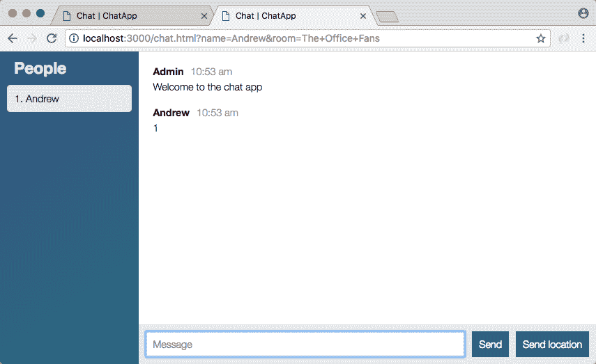

在我们的另一个标签页中，消息无处可寻，因为我们只是将它发送给“办公室粉丝”房间的用户：

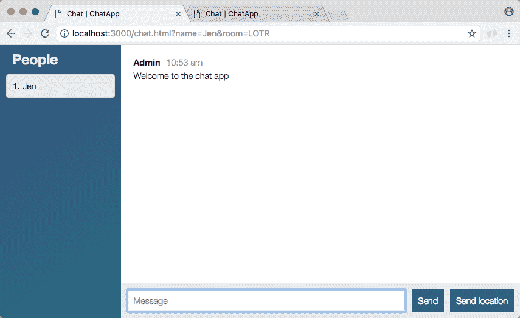

如果我尝试从第一个标签发送消息，我们将在那里看到它的名字是 Jen，第二个标签看起来也不错；我们没有看到 Jen 的消息。

现在我可以继续加入一个房间。我将使用名字`Mike`，我们将再次加入`The Office Fans`。当我加入房间时，我看到 Andrew 和 Mike 都连接了：

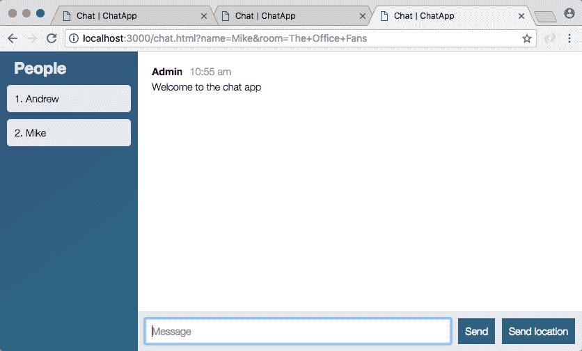

如果我发送一条消息，比如`应该工作`，我会在那里看到它，并且也会在连接到`The Office Fans`房间的其他用户的标签中看到它。再一次，它对连接到不同房间的其他人是不可见的。这就是我们需要做的一切，以确保我们的消息发送正确。最后要做的就是为`createLocationMessage`进行连接。

现在，正如我们刚才看到的，我们还能够解决验证问题，如果我现在尝试按*enter*，什么也不会发生。我不会被移出框，焦点不会改变，也不会发送消息，这很好。

# 为个别房间连接 createLoactionMessage

现在我们要修复`createLocationMessage`。你将想要像我们在上面做的那样找到用户，以防出现 createMessage。如果有用户，你将想要将位置发送给同一房间的人。而不是提供`Admin`作为名称，你还将想要使用用户的真实姓名。我们需要确保它仍然发送给同一房间的用户，并确保不会发送给其他房间的用户。

为了做到这一点，我将首先获取用户，因为我们需要使用该对象上的信息。我们将创建一个名为 user 的变量，调用`users.getUser`，并传入 socket ID，`socket.id`。这与我们在`createMesssage`中使用的行相同。现在我们只想在找到用户时发送消息，所以我要检查用户对象是否存在。如果存在，我们可以将`io.emit`行剪切出来，并将其复制到`if`语句内。如果存在，我们将发出`newLocationMessage`：

```js
if(user){
  io.emit('newLocationMessage', generateLocationMessage('Admin', coords.latitude, coords.longitude));
}
```

现在我们仍然需要将其发出到特定的房间，通过添加一个调用`to`并传入房间名称，`user.room`存储了那些信息，最后但并非最不重要的是我们想要更新名称。我们将使用用户的真实姓名，而不是发送静态的`Admin`名称，`user.name`：

```js
io.to(user.room).emit('newLocationMessage', generateLocationMessage(user.name, coords.latitude, coords.longitude));
```

有了这个`createLocationMessage`，现在已经连接到私人，并发送了正确的信息。在 Chrome 中，我将逐个刷新我的标签，然后在第二个标签上，我将发送位置。这将需要几秒钟来获取，我看到它的名字显示正确：

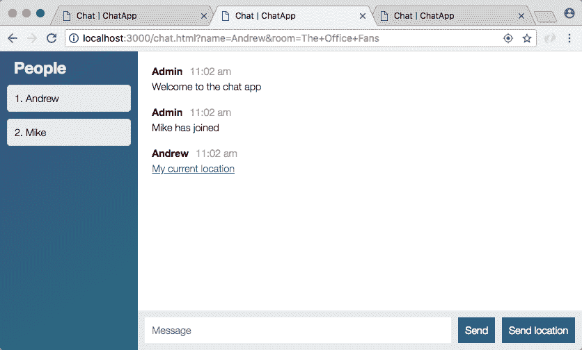

我们有 Andrew，我们有一个链接，可以在 Google 地图中查看位置。现在，如果我转到第二个标签，也连接到`The Office Fans`的用户，我会看到完全相同的位置消息：

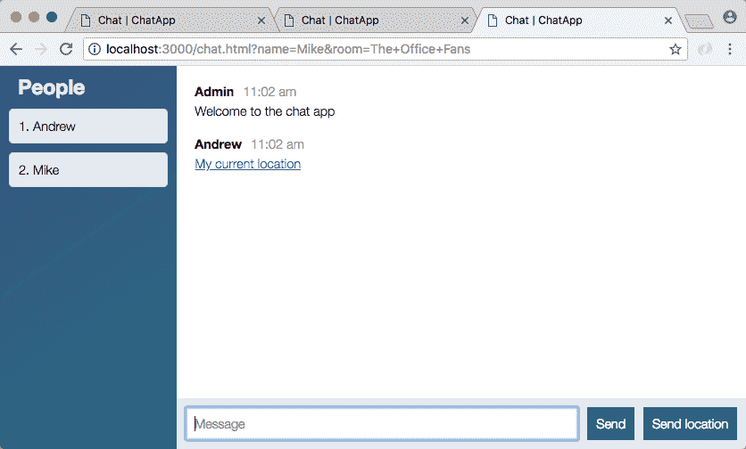

如果我去第一个，你会看到 Jen 无法访问那条消息，因为她在另一个房间：

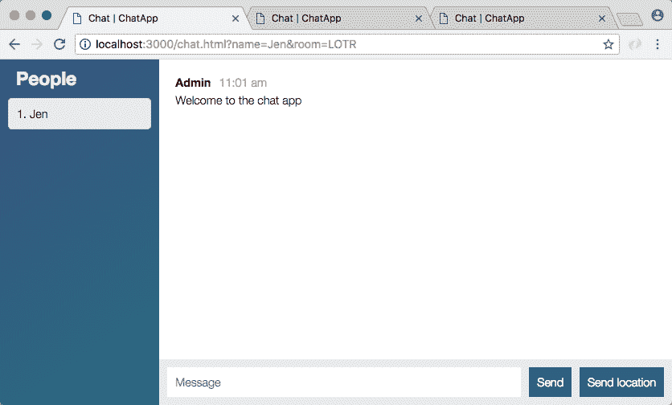

她可以随时与房间里的任何人分享她的位置，但实际上没有人，这条消息不会出现在任何地方，因为没有其他人连接到`LOTR`。

有了这个设置，我们现在完成了，我们的消息是私密的，只有在同一房间的人才能看到。让我们继续提交这些更改。

# 提交单独的房间更改

我将关闭`nodemon`服务器，使用`clear`，然后我们可以运行`git status`来查看我们有什么样的更改：

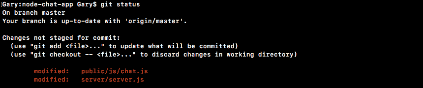

这里我们只有两个文件。它们被修改了，这意味着我们可以使用`git commit`和`-am`标志，无论是分开还是相同，它们都有相同的功能集，然后我们提供我们的消息字符串，`只向同一房间的人发送消息`：

```js
**git commit -am 'Send messages to only people in same room'** 
```

有了这个设置，我们可以继续使用`git push`将其推送到 GitHub，我还将使用`git push heroku master`将其部署到 Heroku。一旦在 Heroku 上部署完成，我们可以花一点时间来确保我们刚刚添加的所有这些功能仍然按预期工作。我期望它们仍然可以工作，但肯定值得检查，因为环境有些不同，总是有可能出错。

现在，如果出现问题，提醒一下，你总是可以使用`heroku logs`，这将显示服务器上的日志，通常有点神秘，但当出现错误时，你会看到一个非常大的块。通常很容易发现，通常包含有用的信息，说明出了什么问题：

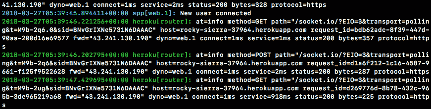

看起来我们的应用成功部署了，所以我可以使用`heroku open`在浏览器中打开它，一旦打开，我们实际上可以访问一些聊天室。我将关闭我的本地主机标签，然后以`Andrew`的身份加入房间`Philadelphia`：

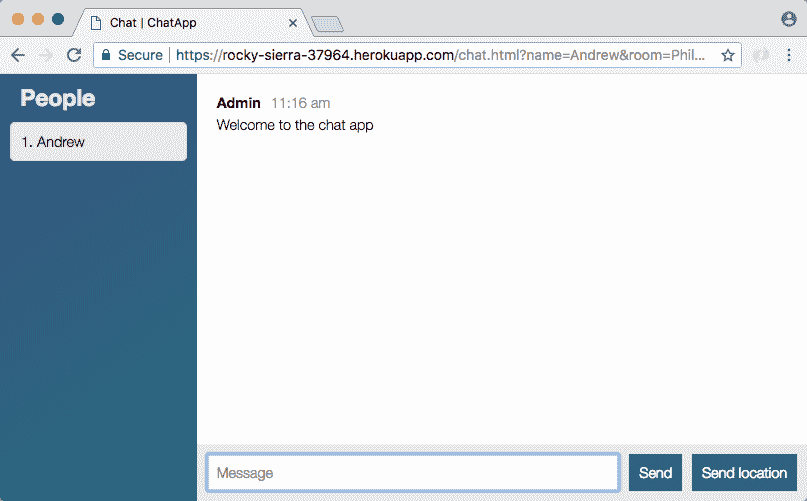

一旦我进入房间，我会发送一条消息，然后我会将第二个用户添加到房间。我们想访问我们的 Heroku 应用网站。我将访问那个，我们将以`Vikram`的身份加入房间，我们可以加入完全相同的房间`Philadelphia`。当我加入时，我看到人员列表对两者都进行了更新，并且发送消息仍然有效：


第二个标签页的消息确实出现在第一个标签页中，这很好。所有这些都是可能的，因为我们已经连接了`server.js`，随时跟踪用户。当他们第一次加入时，我们将他们添加到列表中，当他们发送消息时，我们确保使用他们的信息，当他们离开时，我们将他们从列表中移除。这确保了人员列表始终是最新的，并且消息只发送给了同一房间的其他人。

# 新功能点子

现在我们已经有了我们的人员列表，并且我们的消息只发送给了同一聊天室的用户，我们完成了。但这并不意味着你必须停止开发聊天应用，学生们总是喜欢添加新功能。

我想给你一些关于你现在可以构建的想法。在添加这些功能时，你可能会遇到困难。这可能会非常痛苦，可能需要很长时间，但我向你保证，在你自己做事情的过程中，你会学到很多。现在你有了所有的技能来做这些功能，所以让我们快速地按照列表进行。

+   一个很棒的想法是使聊天室不区分大小写。目前，如果我以小写`r`去`LOTr`，我实际上并不在与我朋友在`LOTR`大写`R`中的同一个聊天室。不管大小写如何，我们都在同一个房间中会很好。 

+   接下来，我想让用户名唯一。目前，我可以复制 URL 并粘贴到新标签页中，现在我有两个名为 Jules 的人：

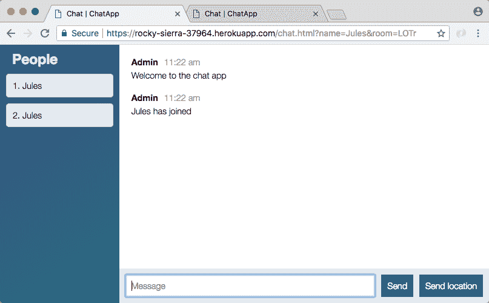

+   拒绝具有与现有用户相同名称的新用户将是很酷的。

+   接下来，一个想法是在下面添加当前活动聊天室的列表。这可以是一个下拉选择，它将重新填充，类似于 People 列表的重新填充。

+   这绝对是最难的功能，但我认为这将非常酷。这意味着我会在加入按钮和房间名称输入框之间看到一个下拉菜单，其中将列出两个当前活动的房间，`LOTr`和`LOTR`，尽管希望如果您首先实现了第一个功能，我们只会看到一个房间。然后，我可以从下拉菜单中选择一个，输入一个名称并以这种方式加入。

这些只是一些关于如何继续使用聊天应用程序的想法。

# 总结

在本章中，我们看了如何在 ES6 中使用`class`关键字创建类。我们创建了一个`Person`类，这只是一个例子，然后我们创建了我们将在整本书中实际使用的`Users`类。我们看了如何添加自定义方法以及设置我们的`constructor`函数。然后，我们以类似的方式创建了`removeUser`、`getUser`和`getUserList`方法。

接下来，我们研究了如何连接我们创建的`users`类，并在用户加入或离开聊天室时更新`People`列表。然后我们研究了如何向特定房间发送消息，而不是向所有用户发送。最后，我们添加了一些想法，您可以查看以增强聊天室的功能。

在本章中，我们将学习有关 Async/Await 项目设置的内容。
