# 第十章：异步/等待项目设置

在这一章中，我们将学习异步/等待的工作过程，它到底是什么，以及它将如何融入我们已经了解的 Node 知识中。**异步/等待**是一个不是在所有 Node 版本中都可用的功能。您必须使用 7.6 或更高版本。所以如果您使用的是 V7，只需确保您使用的是 7.6 或更高版本。如果我们转到[nodejs.org](https://nodejs.org/en/)，您会看到 v9 实际上已经发布了，所以我们现在可以升级到 V9：

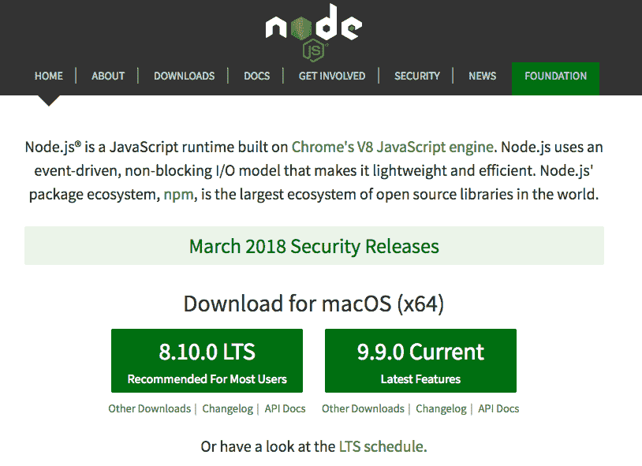

如果有更新版本也是完全可以的。只要是 7.6 或更高版本就可以。所以 6.10 不会有我们即将深入研究的语法。

# 使用异步/等待功能在承诺中

现在，在我们实际使用异步/等待之前，我们将先通过一个只使用承诺的示例来运行。我们将使用我们已经知道的技术来设置一个小的示例项目。现在，当人们听说异步/等待时，他们认为他们需要忘记他们对回调和承诺的所有了解，这是不正确的。异步/等待不是第三个选择；它更像是承诺的增强。我们将通过一个例子来使用普通的承诺，这些是您已经知道如何做的事情。然后我们将看到异步/等待如何增强该代码。因此，为了开始，我们确实需要一个地方来放置所有这些。我将在我的桌面上创建一个全新的项目，`async-await`。

我们可以在我们的编辑器中打开它，并确保在您的终端中也打开它。现在，这里的目标是只做一个非常简单的项目。对于这个项目，我们不需要任何 Node 模块，我们只需要一个文件。这个文件可以放在项目的根目录，我们将把它命名为`app-promises.js`：


这将是我们的应用程序的版本，只使用承诺。现在，在我们继续之前，我想给你一个快速的想法，关于这一章将会是什么样子。我们将经历三个不同的事情：首先，我们将创建一个非常牵强的例子，这将使我们学会如何在没有太多开销或负担的情况下使用异步/等待。因此，我们将创建常量，比如`users`，它只是一个对象数组和常量，比如`grades`；也是一个对象数组，这将是数据库的样子。

```js
const users = [];
const grades = [];
```

显然，从数组中访问某个属性并没有任何异步性，因此我们将继续创建一些新的承诺，将同步过程转换为异步过程。

# 设置 getUser 项目

因此，第一个项目并不是非常现实，但它将是学习新语法的好方法。然后我们将继续进行另一个小项目，您将需要从我挑选出来的一些 API 中进行两个实际的 API 调用。这些将是异步的，我们将在那里使用异步/等待。最后，我们将把一点异步/等待代码添加回 todo API 中。

因此，我们将通过这个非常牵强的例子开始，我们可以开始创建一些要处理的用户。每个用户对象将有一些属性；我们将从一个`id`开始，就像它们在真实数据库中一样。我将给这个一个 id 为`1`：

```js
const users = [{
  id: 1,

}];

const grades = [];
```

我们还会有一个名字，一个用户的字符串名字。我要叫第一个`Andrew`，然后我们将继续到最后一个属性，一个`schoolId`，一个 ID，当学生从一所学校转到另一所学校时会改变。我们可以为这个再编一个 id。我将从`101`开始：

```js
const users = [{
  id: 1,
  name: 'Andrew',
  schoolId: 101
}];

const grades = [];
```

现在我们已经创建了用户编号为 `1`，让我们继续克隆他。我将复制它，加上逗号，然后粘贴，我们将为这个示例创建一个更多的用户。这个用户的 `id` 将是 `2`。我们将把名字从 `Andrew` 改成类似 `Jessica` 的名字，然后给她一个 `schoolId` 为 `999`。

```js
const users = [{
  id: 1,
  name: 'Andrew',
  schoolId: 101
}, {
  id: 2,
  name: 'Jessica',
  schoolId: 999
}];

const grades = [];
```

现在我们已经有了一些用户，我们将在这一部分中创建我们的第一个三个函数之一。这个函数叫做 `getUser`。它将获取用户的 `id`，找到该用户，并返回用户对象：

```js
const grades = [];

const getUser = [id] => {
};
```

所以，如果 `id` 是 `1`，我们将得到这个对象：

```js
const users = [{
  id: 1,
  name: 'Andrew',
  schoolId: 101
}, 
```

如果是 `2`，我将得到这个对象：

```js
{
  id: 2,
  name: 'Jessica',
  schoolId: 999
}];
```

如果是 `3` 或其他不存在的 id，我将会抛出一个错误。所以，如果 `id` 与其中一个用户匹配，它将返回一个解析的 promise，否则将返回一个拒绝的 promise。

现在，正如我所提到的，这是一个人为的例子，所以我们将显式地创建新的 promises。我将创建一个新的 promise，传入那个 promise 函数，你记得，它会调用 `resolve` 和 `reject`：

```js
const getUser = (id) => {
  return new Promise((resolve, reject) => { 

 });
};
```

然后我们将在函数中添加一点逻辑。

# 数组的 find 方法

我们需要做的第一件事是尝试找到一个匹配项，我将使用数组的 find 方法来完成这个任务。我们将创建一个 `const user` 来存储匹配项，然后将其设置为 `users.find`，传入我们的函数：

```js
const getUser = (id) => {
 return new Promise((resolve, reject) => { 
  const user = user.find(() = { 

  }); 
 });
};
```

现在，这个函数会被数组中的每个项目调用一次。这是一个用户数组，所以我们可以称单个项目为 `user`。如果我们返回 `true`，它将被视为匹配。它将停止并将该对象设置为用户。如果我们返回 `false`，它将继续遍历数组，如果没有匹配，用户的值将是未定义的。所以，我们将返回 `user.id`，检查它是否等于传入的 `id`。

```js
const getUser = (id) => {
  return new Promise((resolve, reject) => { 
    const user = user.find((user) => {
   return user.id === id;
  });
 });
};
```

现在，我们在这里有一个很好的简写语法的候选者。我们只有一个返回某个值的箭头函数。它只提供值，并且会被隐式返回：

```js
const getUser = (id) => {
 return new Promise((resolve, reject) => { 
   const user = user.find((user) => user.id === id); 
```

这里我们有完全相同的功能。现在，在我们使用它之前，让我们调用 `resolve` 或 `reject`。如果有用户，我们将做一件事；如果没有用户，那没关系，我们将做其他事。在 `else` 语句中，我们将调用 `reject`，在 `if` 语句中，我们将调用 `resolve`：

```js
const getUser = (id) => {
 return new Promise((resolve, reject) => { 
   const user = user.find((user) => user.id === id); 

   if (user) {
     resolve();
   } else {
     reject();
   } 
 });
};
```

现在，`resolve` 只是将用户传入，对于 `reject`，我们可以提供一个错误消息，帮助用户找出问题出在哪里。我们可以添加 `无法找到 id 为 . 的用户`，然后，我们会把 `id` 放在旁边。在模板字符串中，我将引用 `id`。这是传入 `getUser` 变量的确切值。

```js
const getUser = (id) => {
  return new Promise((resolve, reject) => { 
    const user = user.find((user) => user.id === id); 

    if (user) {
      resolve(user);
    } else {
      reject('Unable to find user with id of ${id}.');
    } 
  });
};
```

现在，在我们继续运行之前，让我们快速使用 `getUser`。我将使用 `id` 为 `2` 调用 `getUser`，应该返回 `Jessica`。然后我会添加 `then` 和 `catch`。在 `catch` 中，我们可以捕获错误。我们将获取错误并将其记录下来，`console.log(e)`。

```js
getUser(2).then().catch((e) => {
  console.log(e);
});
```

然后我们可以设置我们的 `then` 回调；在 `then` 中，我们将获得对用户的访问，现在，我们将把它记录下来：

```js
getUser(2).then((user) => {
  console.log(user);
}).catch((e) => {
  console.log(e);
});
```

# 运行 getUser 对象测试

要实际运行这个，我们将转到终端，确保我们得到预期的结果。我将使用 `nodemon` 来完成这个任务。如果你刚刚更新了 Node，它也更新了 `npm`，最终意味着你不再可以访问这些全局模块。你可能需要重新运行 `npm install -g nodemon`，然后才能使用 `nodemon` 命令。我将使用 `nodemon` 运行 `app-promises.js` 文件，然后，我们有了输出：

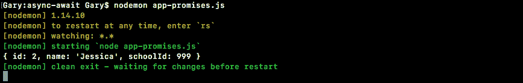

我们打印出了 `schoolId` 为 `999`，`id` 为 `2` 的 Jessica。这是因为我在 `getUser` 中传入了 `2`：

```js
getUser(2).then((user) => {
  console.log(user);
}).catch((e) => {
  console.log(e);
});
```

如果我将这个替换为`1`，我应该看到`Andrew`。我确实看到了`Andrew`。最后，让我们传入一个不存在的 ID，比如`21`：

```js
getUser(21).then((user) => {
  console.log(user);
}).catch((e) => {
  console.log(e);
});
```

在这里我确实收到消息：`无法找到 id 为 21 的用户`：

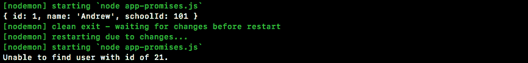

这是我们要构建的三个项目中的第一个。让我们快速完成其他两个。

# 设置 getGrades 项目

这将使我们能够实际探索 async/await 语法，使用`const getGrades`。`getGrades`将与`getUsers`非常相似。但是，它不会使用用户数组，而是使用成绩数组：

```js
const getGrades = () => {

};
```

现在，我们没有设置任何成绩，所以让我们继续设置一些。

# 为 getGrades 项目创建成绩

我们将继续创建一些成绩。首先，让我们创建一个 id 为`1`的成绩。现在，这个`1`将附加到`Andrew`，所以我们将使用`schoolId`来做到这一点。在这种情况下，对于`Andrew`，`schoolId`是`101`。然后，我们将输入实际的`grade`。在这种情况下，我将给自己一个`86`：

```js
const grades = [{
  id: 1,
  schoolId: 101,
  grade: 86
}];
```

这是第`1`个成绩；让我们继续创建三个成绩。我将复制它，放入一个逗号，并粘贴两次。这个将有一个 id 为`2`。我们可以将这个与`Jessica`关联起来，所以我们将给她`schoolId`值为`999`。她非常聪明，所以我们给她`100`。最后，id 为`3`：我们将保留这个与`Andrew`相关联，接下来，我们将给他一个`80`的成绩：

```js
const grades = [{
  id: 1,
  schoolId: 101,
  grade: 86
}, {
  id: 2,
  schoolId: 999,
  grade: 100
}, {
  id: 3,
  schoolId: 101,
  grade: 80
}];
```

所以，我们已经设置了一些成绩，目标是根据他们的`schoolId`返回特定学生的所有成绩。如果我传入`101`，我期望得到一个包含与 Andrew 相关的对象的数组。如果我传入`999`，我期望得到一个包含与 Jessica 相关的对象的数组，如果我传入像`55`这样的值，那么该学生将没有成绩，所以我们将返回一个空数组。

# 返回一个新的 promise

现在，在`getGrades`变量中，我们将得到我们用于查找的`schoolId`。然后我们将继续返回一个新的 promise；这都是虚构的例子，`resolve`和`reject`是我们的两个参数：

```js
const getGrades = (schoolId) => {
  return new Promise((resolve, reject) => {

  });
};
```

然后，在这里，我们将继续`resolve`筛选后的成绩数组，即`grades.filter`。我们将通过传递一个箭头函数来筛选这个数组。它将被调用与单个成绩，而不是用户，并且我们将继续隐式返回一些东西。如果我们返回`true`，它将被视为匹配，并且该成绩将被解析。如果我们返回`false`，那么该成绩将从被解析的数组中删除。在这种情况下，如果`grade.schoolId`等于函数调用时的`schoolId`，我们希望保留该成绩。

```js
const getGrades = (schoolId) => {
  return new Promise((resolve, reject) => {
    resolve(grades.filter((grade) => grade.schoolId === schoolId));
  });
};
```

在这种情况下，这就是`getGrades`的全部内容；我们可以继续测试。我将调用`getGrades`而不是`getUser`。我将传入一个有效的`schoolId`，比如`101`，而不是用户，我们将有`grades`，接下来：

```js
getGrades(101).then((grades) => {
  console.log(grades);
}).catch((e) => {
  console.log(e);
});
```

如果我保存这个，我们得到什么？我们得到一个包含两个对象的数组，正如预期的那样：

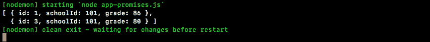

我们有`Andrew`的所有成绩，分别是`86`和`80`。我将继续传入`999`；我们得到 Jessica 的成绩，最后，我们传入`12`：

```js
getGrades(12).then((grades) => {
  console.log(grades);
}).catch((e) => {
  console.log(e);
});
```

如果我传入`12`，我们得到一个空数组，这正是我希望的。只剩下一个函数了，然后我们就完成了这一部分，可以继续下一部分了。

# 设置 getStatus 项目

这个项目将被称为`const getStatus`。`getStatus`将是一个函数，它将获取`userId`，即要获取其状态的用户的`id`。现在，这个项目的目标只是返回一条字符串。我们将从他们的名字开始，比如`Andrew`，然后我们将添加一些信息；`Andrew has a`，在这种情况下，我在课堂上有一个`83`的平均分（所以我拿`80`，我再加上`86`，然后除以`2`来生成这个平均分）。因此，我们希望在实际运行`getUser`和`getGrades`后，从`getStatus`中解析出以下字符串：

```js
const getGrades = (schoolId) => {
  return new Promise((resolve, reject) => {
    resolve(grades.filter((grade) => grade.schoolId === schoolId));
  });
};

// Andrew has a 83% in the class
const getStatus = (userId) => {

};
```

# 解决`getStatus`字符串

我们将继续完成这个，然后就完成了。这意味着我们将使用`userId`调用`getStatus`。我们将获取状态并将状态记录下来：

```js
getStatus(1).then((status) => {
  console.log(status);
}).catch((e) => {
  console.log(e);
});
```

现在，让我们开始，我们需要做什么？首先，我们必须继续`return`以保持 promise 链的活动状态，因为我们使用`getStatus`函数附加了`then`和`catch`回调。

接下来，我们将调用`getUser`。在我们实际使用`getGrades`之前，我们必须获取`userId`，找到用户对象，并获取他们的`schoolId`。我们还想确保在消息中有姓名的访问权限，因此我们需要从该对象中获取两条信息：`getUser`和`userId`。我们将添加我们的`then`回调。在这个回调中，我们将获得对该用户对象的访问权限，其中包含一些有用的信息。其中一条信息将允许我们实际调用`getGrades`。我将在这里`return getGrades`，然后我们将传入学生的学校 ID，即`user.schoolId`：

```js
// Andrew has a 83% in the class
const getStatus = (userId) => {
  return getUser(userId).then((tempUser) => {
    return getGrades(user.schoolId);
  })
};
```

现在我们已经调用了`getGrades`，我们将接下来访问这些成绩。`getGrades` promise 的成功回调将获得`grades`数组。然后我们可以继续创建一个`average`变量，我们将在下一步中完成，然后我们可以`return our string`。因此，这是这个函数的目标，但这是我们在使用 promise 时可能遇到的第一个问题之一：

```js
// Andrew has a 83% in the class
const getStatus = (userId) => {
  return getUser(userId).then((tempUser) => {
    return getGrades(user.schoolId);
  }).then((grades) => {
    // average
    // return our string 
  });
};
```

我们有`getStatus`的 promise 链；我们必须调用一个 promise 才能实际启动另一个 promise，而且最终，我想对来自两者的值做一些处理。嗯，我们不能；我们无法在第二个`then`函数内访问用户。它是在另一个函数中创建的，即第一个`then`回调，这是一个相当常见的问题。

那么，我们该如何解决这个问题呢？我们可以有几种方法来解决。其中大多数都是有点丑陋的解决方法。就在`getStatus`变量下面，我可以创建一个名为`user`的变量，并首先将其设置为未定义。

```js
const getStatus = (userId) => {
  var user;
```

然后，在第一个`then`回调中，当此函数运行时，我将给它一个值。现在，我不能有两个具有相同内容的变量。如果我尝试输入`user = user`，我们将遇到一些问题：

```js
const getStatus = (userId) => {
  var user;
  return getUser(userId).then((user) => {
    user = user;
```

它将获取`user`的值并将其设置为`then`回调中的用户值。它根本不会使用用户变量。因此，我们必须添加另一个小的解决方法：`tempUser`。

```js
const getStatus = (userId) => {
  var user;
  return getUser(userId).then((tempUser) => {
    user = tempUser;
```

然后我们将继续设置`user = tempUser`，这在技术上可以工作。我们现在将可以访问用户变量并完成一些工作。

# 计算平均值

因此，我们可以在第二个`then`回调函数中计算我们的`average = 0`的平均值：

```js
// Andrew has a 83% in the class
const getStatus = (userId) => {
  var user;
  return getUser(userId).then((tempUser) => {
    user = tempUser;
    return getGrades(user.schoolId);
  }).then((grades) => {
    var average = 0;

    // average
    // return our string
  });
};
```

在整个课程中，我们一直在使用 const。我们实际上可以将我们的`var`改为`let`；`let`是 ES6 中`var`的等价物，因此这是一个其值可以更改的变量：

```js
// Andrew has a 83% in the class
const getStatus = (userId) => {
  let user;
  return getUser(userId).then((tempUser) => {
    user = tempUser;
    return getGrades(user.schoolId);
  }).then((grades) => {
    let average = 0;

    // average
    // return our string
  });
};
```

现在我们将从平均值`0`开始，然后继续计算更好的平均值，如果有`grades`：`grades.length`。如果`grades.length`大于`0`，我们将继续实际运行计算。

```js
 }).then((grades) => {
   let average = 0;

   if (grades.length > 0) {

   }
   // average
   // return our string
});
```

现在，我们要在这里使用一些数组方法。首先，我们将把平均值设置为某个值。我们将从对象数组开始，将其转换为数字数组。

我们将使用 map 来做到这一点；就是`grades.map`。在这里，我们将继续访问单个 grade，我们要做的就是隐式返回`grade.grade`。

```js
  if (grades.length > 0) {
    average = grades_map((grade) => grade.grade)
  }
```

所以，我们有单个`grade`对象，我们正在尝试访问它的`grade`属性。在这一点上，我们有一个数字数组。我们需要将这些数字转换为总和，然后我们必须将其除以数组的长度。我们将在这里使用`reduce`，所以我们在数字数组上调用`reduce`。`reduce`的工作方式与您过去可能见过的其他一些数组方法有些不同。这个方法接受两个参数，`a`和`b`；

```js
if (grades.length > 0) {
  average = grades.map((grade) => grade.grade).reduce((a, b) => {

  });
};
```

所以，第一次通过时，它将获取前两个成绩，我们将能够对这些成绩做些什么。我们想要做什么？我们想要返回`a + b`。然后它将获取前两个成绩的总和，然后再次调用 reduce 函数，将该总和和第三个成绩放在一起。我们将取`a + b`来获得添加到新`b`上的值，然后我们将继续生成该总和。现在，你实际上可以简化`a + b`：

```js
if (grades.length > 0) {
  average = grades.map((grade) => grade.grade).reduce((a, b) => a + b); 
}
```

现在，这仅仅给我们提供了总和，所以在`Andrew`的情况下，我们还没有计算出平均值`83`；我们只是把这两个数字加起来了。你还想要除以`grades.length`；这将给我们平均值。我们可以通过打印`average`变量来测试这一点，`console.log(average)`。

```js
  if (grades.length > 0) {
    average = grades.map((grade) => grade.grade).reduce((a, b) => a + b) / grades.length; 
  }

  console.log(average);
});
```

我要保存它。我们有`getStatus`和`getStatus` for `1`。这完全没问题，我们可以继续使用。在终端中，我们得到`83`的打印，这是正确的平均值。

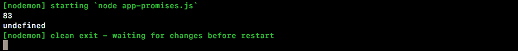

如果我继续为用户`2`重新运行，我们会得到`100`的打印。一切都运行得非常顺利；`undefined`只是出现，因为我们没有返回任何东西，所以状态等于`undefined`，这会在`console.log`语句中打印出来。所以，我们不仅仅把平均值倒出来，让我们实际返回我们的模板字符串。这是我们在本节中要做的最后一件事情。

# 返回模板字符串

在平均值的`console.log`语句上面，我们将按照这种格式开始，首先是名字，也就是`user.name`。然后我们将继续下一部分，有一个，后面跟着他们的成绩。那就是`average`。我们将在班级期间加上`%`：

```js
return `${user.name} has a ${average}% in the class.`;
```

现在我们正在返回一些东西，这个值将可以被调用`getStatus`的人访问。在这种情况下，就是这里。在终端中，我们看到`Jessica 在班级中有 100%`打印到屏幕上：


如果我继续到`1`，我们会看到`Andrew`有一个`83`，如果我输入其他的`id`，我们会看到打印`无法找到 id 为 123 的用户`。所以，这就是我们构造的起始示例。我知道这里没有太多有趣的东西，但我保证有一个示例可以让理解 async/await 变得更容易。所以，下一节的目标是使用这种新的语法将代码片段简化为大约三行代码：

```js
// Andrew has a 83% in the class
const getStatus = (userId) => {
  let user;
  return getUser(userId).then((tempUser) => {
    user = tempUser;
    return getGrades(user.schoolId);
  }).then((grades) => {
    let average = 0;

    if (grades.length > 0) {
      average = grades.map((grade) => grade.grade).reduce((a, b) => a + b) / grades.length;
    }

    return `${user.name} has a ${average}% in the class.`;
  });
};
```

这将是三行代码，更容易阅读和处理。它看起来像同步代码，而不是回调和 promise 链。

# Async/await 基础知识

在这一部分，你终于将要使用新的 async/await 功能。我们将创建`getStatus`函数的另一个版本并称之为`getStatusAlt`，所以我们可以继续并实际定义它：一个 const `getStatusAlt`。现在，它仍然是一个函数，所以我们将开始创建一个箭头函数(`=>`)。我们仍然会接受一个参数，所以我们将定义`userId`：

```js
const getStatusAlt = (userId) => {

};
```

现在，我们要改变一下。不再使用旧的例子，我们将使用新的 async/await 功能。为了探索这一点，让我们暂时注释掉`getStatus`-`then`和`catch`块代码。我们将用`getStatusAlt`的调用来重新创建它，而不是用`getStatus`的调用，但我确实想留下旧代码，这样我们可以直接比较和对比差异。

新的 async/await 功能将允许我们以看起来像同步代码的方式编写旧代码，这意味着我们将能够避免像`then`回调、promise 链和变通方法之类的东西。使用 async/await，我们将能够避免所有这些东西，创建一个更容易阅读、修改、处理和测试的函数。现在，`getStatusAlt`将以一种非常无聊的方式开始。

我们将返回一个字符串，`Mike`：

```js
const getStatusAlt = (userId) => {
  return 'Mike';
};
```

这是 JavaScript 的基础知识。你期望得到`Mike`。如果我使用`consult.log`，他的名字应该通过`getStatusAlt`弹出。

```js
const getStatusAlt = (userId) => {
  return 'Mike';
};

console.log(getStatusAlt());
```

让我们继续进行这个，所以我们将保存文件，`nodemon`将重新启动，然后我们就可以了。我们在屏幕上打印出`Mike`：


这正是我们所期望的。现在，使用 async/await，我们实际上将我们的函数标记为特殊函数。我这里有几个函数。我们将把`return 'Mike'`标记为一个特殊的 async 函数。所以在未来，`async/await`将是两个单词`async`和`await`。这不仅仅是单词，而是我们将要输入的实际关键字。

# 使用异步函数

第一个`await`将最终在我们的`async`函数内部使用，但在我们能够使用`await`之前，我们必须将该函数标记为`async`，所以我们将首先这样做。我们将探索它，然后继续使用`await`。在`getStatusAlt`变量行中，我们要做的就是在参数列表前面加上`async`并加上一个空格：

```js
const getStatusAlt = async (userId) => {
  return 'Mike';
};
```

现在，这实际上会改变`console.log`的工作方式；为了探索这一点，我们要做的就是保存文件并查看我们得到了什么。我们不再得到字符串`Mike`，你可以看到我们现在得到了一个`Promise`：


我们得到一个解析为字符串`Mike`的 promise，这就是常规函数和`async`函数之间的第一个重大区别。常规函数返回字符串并返回字符串；`async`函数总是返回 promise。如果你从`async`函数返回了某些东西，实际上它返回的是一个 promise 并且解析了这个值。所以这个函数等同于以下代码。你不必写出这个；这只是为了理解。它等同于创建一个返回新 promise 的函数，这个新 promise 得到`resolve`和`reject`，然后用`Mike`调用 resolve：

```js
() => {
  return new Promise((resolve, reject) => {
  resolve('Mike')
  })
}
```

这两者是相同的，它们具有完全相同的功能。我们创建一个新的 promise，我们解析`Mike`或者使用一个简单返回某些东西的`async`函数。

所以，这是第一课：当你有一个`async`函数时，你返回的任何东西实际上都将被解析，这意味着我们可以改变这种用法。

在`console.log`语句的位置，我将调用`getStatusAlt`。这次我们得到一个 promise，我们知道，所以我们可以使用`then`回调。我们将得到什么？我们将得到返回值作为我们的解决值。

如果我返回字符串，我会得到一个字符串；这里是一个数字，我会得到一个数字；一个布尔值，一个对象，一个函数；无论你从这个函数中明确返回什么，都将作为已解决的值可用，这意味着我可以创建一个名为`console.log(name)`的变量：

```js
const getStatusAlt = async (userId) => {
  return 'Mike';
};

getStatusAlt().then((name) => {
  console.log(name);
});
```

现在，在`nodemon`中我们将得到什么？我们将再次得到`Mike`，普通的字符串。因为我们添加了一个基于 promise 的链条，然后我们得到名字并将其打印出来，这里`Mike`再次打印出来：


因此，如果返回一个值等同于解决，那么我们如何拒绝？

# 使用`async`函数拒绝错误

如果我想要拒绝一个错误（`'This is an error'`），我该如何使用新的`async`功能来做到这一点？我们只需使用标准的 JavaScript 技术抛出一个新的错误。使用消息抛出一个新的错误（`'This is an error'`）：

```js
const getStatusAlt = async (userId) => {
  throw new Error('This is an error');
  return 'Mike';
};
```

这相当于在新的 Promise 中使用`reject`参数。当你从`async`函数中抛出一个新的错误时，它与拒绝某个值完全相同。因此，在这种情况下，我们可以继续使用该错误，通过添加`catch`，就像我们处理常规的 promise 一样。我们将得到错误，如果发生，我将使用`console.log`将其打印到屏幕上：

```js
getStatusAlt().then((name) => {
  console.log(name);
}).catch(e) => {
  console.log(e);
});
```

它总是会发生，因为我在第 1 行抛出了它。如果我保存文件，`nodemon`会重新启动，我们会得到`Error: This is an error`打印到屏幕上：

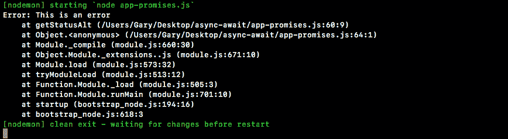

这些是在继续使用`await`之前，你需要了解的`async`函数的前两个重要事项。返回某些东西等同于解决，抛出错误等同于拒绝；我们总是得到一个 promise。

# 使用`await`函数

到目前为止，我们只使用了功能的一半。我们使用了`async`部分，单独使用并不特别有用。当我们将其与`await`结合使用时，它变得非常有用，所以让我们继续开始看一下。

`await`函数将允许我们重新引入其他函数，`getGrades`和`getUser`。我们将继续使用`await`，然后我们将讨论确切发生了什么。所以，暂时跟我一起，只需输入这一行：`const user =`，然后我们将其设置为`await`关键字。我们将在接下来讨论这一点；我们将调用`getUser`并传入`userId`。所以让我们开始分解这一行：

```js
 const getStatusAlt = async (userId) => {
   const user = await getUser(userId);
};
```

我们以前做过这个；我们使用`userId`调用`getUser`。它返回一个 promise。我们创建一个新的变量 user，它是一个常量；新的部分是`await`。所以`await`关键字，正如我之前提到的，必须在`async`函数中使用。我们满足了这个标准。我们有一个`async`函数，这意味着我们可以在其中使用`await`。

我们在一个 promise 之前使用`await`，所以这里我们得到一个 promise。因此，我们正在等待该 promise 要么`resolve`要么`reject`。如果该 promise 被解决，这个表达式的结果将是解决的值，这意味着解决的值将被存储在用户变量中。如果 promise 被拒绝，它将等同于抛出一个错误，这意味着永远不会创建用户变量。函数将停止执行，我们将在`catch`中得到该错误。

让我们继续实际操作一下。我要把一个`id`传递给`getStatusAlt`。让我们使用`Jessica`；我们要做的就是将`user`打印到屏幕上。现在，`nodemon`将在后台重新启动，我的`nodemon`在之前被清除了：

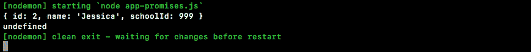

在这里，我们有一个`id`为`2`的对象，名为`Jessica`，学校 id 为`999`。

现在，没有`await`，我们将得到一个 promise；有了`await`，我们实际上能够得到那个值，这相当于我们之前所做的。这相当于我们获得了用户的访问权并对其进行了操作，但是，使用`async/await`，我们能够以看起来非常同步的方式做到这一点。

现在，我们可以将这个确切的技术应用到获取成绩上。在`user`常量旁边，我们将创建一个名为`grades`的常量。我们想要那些成绩。我们不想创建愚蠢的临时变量，添加复杂的链接和嵌套。我们只想得到成绩，所以我们将等待以下 promise，要么`resolve`要么`reject`。对于从`getGrades`返回的那个，我们传入一个有效的学校 id，`user.schoolId`：

```js
const getStatusAlt = async (userId) => {
  const user = await getUser(userId);
  const grades = await getGrades(user.schoolId);

  console.log(user, grades);
};
```

这将返回该用户的`grades`数组，我们将能够将它们显示在屏幕上。

所以，在终端中，我们正在获取`Jessica`的对象和成绩：

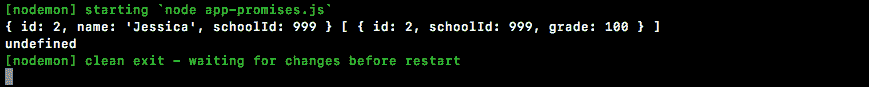

她只有一个成绩，所以我们有一个包含单个对象的数组。我们得到的不是一个 promise；我们得到的是一个普通的数组。对于`Andrew`也是一样；他将有这两个成绩：

```js
getStatusAlt(123).then((name) => {
  console.log(name);
}).catch((e) => {
  console.log(e);
});
```

它们都会回来，如果我把这个切换到一个无效的`id`，我们会得到我们的错误：`无法找到 id 为 123 的用户`：


这是因为`await`函数会拒绝，这相当于抛出一个错误。我们看到当我们从具有访问权限的`async`函数中抛出错误时，可以通过`catch`访问它。所以，在这一点上，我们有了我们的用户，我们有了我们的成绩，我们准备继续进行最后一步，也就是真正重要的事情。到目前为止，我们只是获取数据，需要嵌套几行代码。在这一点上，我们可以采用平均值的代码片段，就像它所在的位置一样：

```js
let average = 0;

if (grades.length > 0) {
  average = grades.map((grade) => grade.grade).reduce((a, b) => a + b) / grades.length;
}

return `${user.name} has a ${average}% in the class.`;
```

这段代码依赖于一个`user`变量，我们有，还有一个`grades`变量，同样，我们也有。我们可以把它复制到`async`函数中，像这样：

```js
const getStatusAlt = async (userId) => {
  const user = await getUser(userId);
  const grades = await getGrades(user.schoolId);
  let average = 0;

  if (grades.length > 0) {
    average = grades.map((grade) => grade.grade).reduce((a, b) => a + b) / grades.length;
  }

  return `${user.name} has a ${average}% in the class.`;
};
```

现在，我们设置了我们的平均变量。如果有成绩，我们计算平均值并返回我们的状态：

```js
getStatusAlt(2).then((status) => {
  console.log(status);
}).catch((e) => {
  console.log(e);
});
```

在这一点上，我们可以使用状态，并使用`console.log`语句打印出来。让我们把它改回一个有效的`id`，要么是`1`要么是`2`，一些存在的`id`。这一次，当 JavaScript 运行`getStatusAlt`时，它实际上会返回正确的状态：`Andrew 在课堂上得了 83 分`或`Jessica 在课堂上得了 100 分`：


我们能够做到所有这一切，没有一个回调，没有链接，没有嵌套，只是看起来像同步代码的常规旧代码。

这段代码比我们上面的更可读，更易维护，更易理解。使用`async`/`await`，我们将能够做到这一点。我们将能够编写更好、更简洁的基于 promise 的代码。现在，你会注意到我在上面的函数中没有使用`await`。没有必要，因为我们不需要在其中使用`async`。还有一件重要的事情要注意，就是没有顶层的`await`。你必须在`async`函数中使用`await`，所以在我们的情况下，这意味着我们在最后使用了一点点链接，但是当我们处理复杂的链式结构时，我们可以使用`async/await`来完成工作。

此时，我不指望你能够自己使用`async`/`await`。我们将通过另一个使用真实 API 的例子来获得更多真实世界的经验。我很兴奋。

# 一个真实世界的例子

在这一部分，我们将从我们编造的例子中迈出，然后我们将看一个使用两个真实的 HTTP API 的例子。在此之前，重要的是要注意箭头函数(`=>`)并不是唯一支持`async`的函数。我碰巧使用了箭头函数(`=>`)。我也可以使用带有`function`关键字的 ES5 函数；这同样有效：

```js
const getStatusAlt = async function (userId) {
  const user = await getUser(userId);
  const grades = await getGrades(user.schoolId);
  let average = 0;
```

我可以保存文件，仍然会打印出`Jessica has 100%`：


我也可以`async`一个 ES6 对象方法，但我会继续使用箭头函数(`=>`)。现在，我们将把这个文件抛在脑后，然后转到一个全新的文件来进行我们的真实世界的例子。

# 使用 async/await 函数创建货币转换器

这个文件将被称为`currency-convert.js`，你可能已经猜到，我们将创建一个货币转换器。

基本上，这只是一个带有三个参数的函数。我们将从我们要开始的货币代码开始；在这种情况下，假设我有美元。然后是我们要转换的货币代码；假设我要去加拿大，想知道我的钱值多少；以及我们要转换的金额。

因此，这本质上是在询问`23 美元`的加拿大等值物：

```js
// USD CAD 23
```

我们将能够使用任何我们想要的代码和任何我们想要的值。现在，为了真正获得所有这些信息，我们将使用两个 API。我们基本上会说`23 美元相当于 28 加拿大元。你可以在以下国家使用这些`：

```js
// USD CAD 23
// 23 USD is worth 28 CAD. You can spend these in the following countries:
```

然后我们将列出所有实际接受加拿大元的国家。现在，为了真正获得所有这些信息，我们将使用这两个 API，并且我想在 Chrome 中探索它们。然后，我们将安装 Axios，发出请求，并将所有这些集成到货币转换器中。

# 探索货币汇率的 API

我们将要使用的第一个 API 在[fixer.io](http://fixer.io/)上：

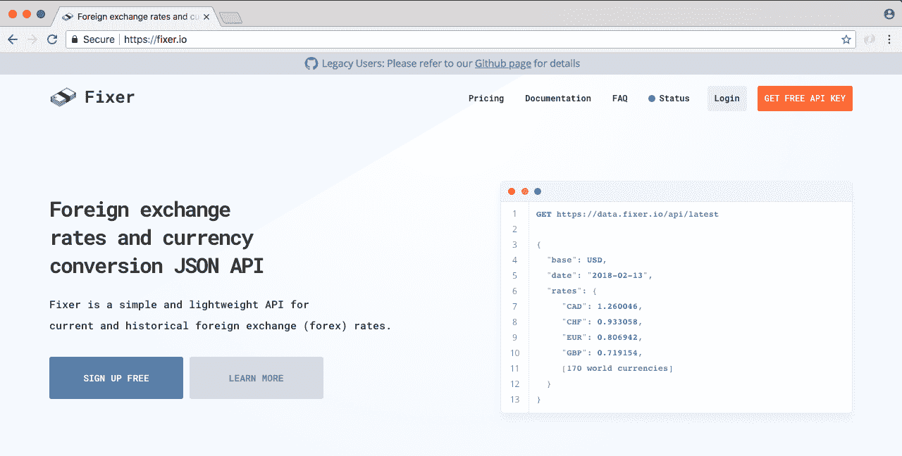

这将给我们当前货币数字，所以我们将能够获得这些汇率。如果我们去他们的网站，他们有一个很好的使用页面。你可以点击 URL；它会显示你如果发出了 HTTP 请求会得到的确切数据。

这个 API 和我们将要使用的另一个 API，它们不需要身份验证，所以我们将能够轻松地集成它们。在这里，我们看到基本货币是欧元，我们可以看到欧元在其他货币中的价值。因此，€1 目前价值 1.2411 美元或 1.5997 加拿大元：

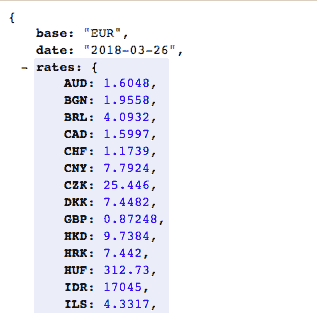

这是我们将要使用的第一个端点，我们实际上将使用一个替代方案。在这里，我们可以指定基本查询参数，这将使我们从我们选择的货币开始。这是我们要转换的货币，然后我们得到汇率。

因此，如果我想将美元转换为加拿大元，我将得到基本美元转换图表。我会找到这个数字，然后将`23`乘以这个数字，或者我想要转换的任何值。所以这是 API 编号一；让我们去获取 URL，在浏览器中打开它，然后我们将保持它开着。

我们将要使用的另一个 API，你可以在[restcountries.eu](http://restcountries.eu/)找到。这个 API 包含一些有关国家的有用信息。如果你去 All 示例，我们可以得到这个 URL：

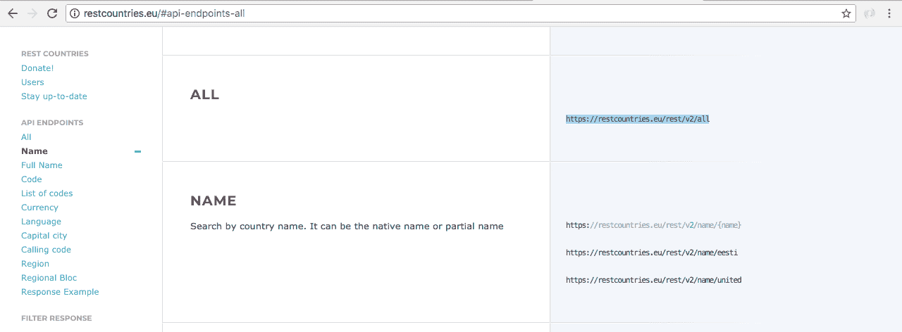

我们可以在浏览器中打开它，然后我们可以看到 API 返回的国家和国家数据的详尽列表，从`阿富汗`开始：关于它的各种信息，顶级域，替代拼写，`地区`，纬度和经度，`人口`，很多非常好的信息：

！[](img/a6ff62d0-642b-4be6-a7d5-81730f992e4c.png)

它还包括那些货币代码，所以我们实际上将使用不同的端点。他们支持货币端点：

！[](img/f2fe1c21-e741-4e4d-8592-89304582a399.png)

这让您找到使用特定货币的国家，因此让我们使用此 URL 并在浏览器中打开它。这里我们使用`cop`；让我们继续将其替换为`usd`：

！[](img/c2ec3da1-d9d6-455b-bdd2-9fc43b274cb6.png)

现在，有多个国家使用美元。我们有`美属萨摩亚`。

在下面，如果我们向下滚动列表，我们将得到其他东西；例如，这里有津巴布韦。然后，我们有美利坚合众国-这是一个明显的例子-特克斯和凯科斯群岛：

！[](img/c380bfce-b017-4b6e-8d8c-6fba9a14b850.png)

因此，有很多不同的地方使用美元。如果我们将其替换为`cad`-加拿大；只有一个：

！[](img/3a9f94bb-8a3e-423e-8d08-d20afdf77a75.png)

因此，使用这两个端点，我们将能够转换货币并找出哪些国家支持该货币。我们将把所有这些连接在一起，然后我将让您自己使用 async/await 来获取该信息。

# 在我们的应用程序中利用 axios

让我们通过关闭事物，清除输出并安装必要的依赖项来在终端内启动事物。我将运行`npm init`：

！[](img/f7551dc3-cf00-4304-be21-38dc2e2b092d.png)

我们可以使用默认值快速生成一个`package.json`文件，然后使用`npm install axios`。Axios 的当前版本是`0.18.1`，我们将添加`save`标志：

```js
npm install axios@0.18.0 --save
```

它将确保将其作为依赖项，并且一切都按预期工作。现在我们可以清除此输出，并且实际上可以在我们的应用程序中利用 Axios。因此，让我们从第一个开始。我们将继续设置一个函数，该函数调用 Fixer 并获取汇率。

# getExchangeRate 函数

为此，在 Atom 内部，我们将通过创建一个`const axios`来启动事物；我们将`require axios`，然后我们将为我们的两个函数之一创建`const`。这是第一个端点`getExchangeRate`。现在，`getExchangeRate`将获取两个信息：`from`货币代码和`to`货币代码：

```js
// USD CAD 23
// 23 USD is worth 28 CAD. You can spend these in the following countries:

const axios = require('axios');

const getExchangeRate = (from, to)
```

这将是一个函数。我们将只使用`axios`。这是`axios.get`，然后我们将传入我刚从浏览器中复制的 URL：

```js
// USD CAD 23
// 23 USD is worth 28 CAD. You can spend these in the following countries:

const axios = require('axios');

const getExchangeRate = (from, to) => {
  axios.get(`http://api.fixer.io/latest?base=USD)
}
```

现在我们想将基础设置为我们来自的任何货币。因此，我可以使用模板字符串，将静态基本值替换为动态值，访问`from`和`then`函数。我们将快速使用`then`。我们将在这里使用`then`来操纵值。这将返回 Axios 的承诺，并提供有关 HTTP 请求的大量信息。`getExchangeRate`的调用者不关心这一点。他们甚至不应该知道已经发出了 HTTP 请求。他们需要的只是一个数字，这正是我们将给他们的。

在`then`回调中，我们将可以访问`response`，并且在`response`上，我们将能够获取该货币代码。我们将`return response.data`。这将使我们进入 JSON 对象。现在，在这里我们有一个`rates`对象，其中包含键值对，其中键是货币，因此我们确实要访问`rates`并获取`to`变量的汇率：

```js
// USD CAD 23
// 23 USD is worth 28 CAD. You can spend these in the following countries:

const axios = require('axios');

const getExchangeRate = (from, to) => {
  axios.get(`http://api.fixer.io/latest?base=USD).then((response) => {
    return response.data.rates[to]
  });
}
```

因此，在这种情况下，我们将有美元兑加拿大元。我们将使用`USD`调用此 URL，然后我们将得到这个值：`1.2889`。这正是我们要返回的确切值。让我们在下面测试一下，`getExchangeRate`。我将把`USD`传递给`CAD`（加拿大）元，然后我们将得到我们的`rate`并将其记录下来，`console.log(rate)`：

```js
// USD CAD 23
// 23 USD is worth 28 CAD. You can spend these in the following countries:

const axios = require('axios');

const getExchangeRate = (from, to) => {
  return axios.get(`http://api.fixer.io/latest?base=USD).then((response) => {
    return response.data.rates[to]
  });
};

getExchangeRate('USD', 'CAD').then((rate) => {
  console.log(rate);
});
```

我将继续保存这个。在后台，在终端中，我们可以再次启动`nodemon`，然后运行`currency-convert`文件。在这里，我们得到了值`1.2889`是当前的货币汇率：

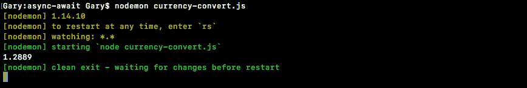

我可以在代码中放入`EUR`：

```js
getExchangeRate('USD', 'EUR').then((rate) => {
  console.log(rate); 
});
```

我可以弄清楚欧元的汇率是`0.80574`，所以我们可以：


我们已经完成了第一个。现在，我们要快速创建的另一个是`getCountries`。

# `getCountries`函数

`getCountries`函数将获取一个国家列表，只包括它们的名称，并且我们将通过`currencyCode`来获取它：

```js
const getCountries = (currencyCode) => {

};
```

这个，就像`getExchangeRate`一样，也将从`axios.get`返回一个 promise，我们要获取的 URL 位于浏览器中：


因此，我们在这里有我们的 URL。我们有一个地方可以将我们的`currencyCode`输出，所以我们可以完成这一步。它将是一个模板字符串，我们将去掉`CAD`并注入`currencyCode`参数：

```js
const getCountries = (currencyCode) => {
  return axios.get(`https://restcountries.eu/rest/v2/currency/${currencyCode}`)
};
```

在这一点上，再次，我们确实想对数据进行一些操作，所以我可以继续使用`then`。在`then`回调中，我可以继续访问`response`。我想对`response`做的是，我只想循环遍历它。我想找出所有支持我的货币的国家，然后我想返回一个数组：

```js
const getCountries = (currencyCode) => {
  return axios.get(`https://restcountries.eu/rest/v2/currency/${currencyCode}`).then((response) => {

  });
};
```

现在你知道我们将得到所有这些国家，对吧？因此，对于`cad`，我们有一个包含单个对象的数组。对于`usd`，我们有一个包含多个对象的数组，因此我们将把这个对象数组转换为一个字符串数组。

我们将从`美属萨摩亚`开始：

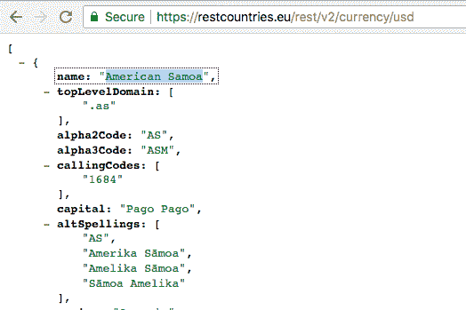

为了做到这一点，我们将使用`map`。回到 Atom 中，我们可以通过返回`response.data`来快速完成这个任务，它是一个数组，这意味着它可以访问`map`方法。然后我们将使用`map`。每个单独的项目将是一个`country`；每个`country`都有一个`name`属性，所以我们可以返回`country.name`，给我们一个支持该`currency`的国家名称数组。在这种情况下，我们可以通过隐式返回`country.name`来简化这个过程。现在，让我们在这里测试一下；`getCountries`。我们将得到`countries`并将其输出到屏幕上。我们只提供一个参数：

```js
const getCountries = (currencyCode) => {
  return axios.get(`https://restcountries.eu/rest/v2/currency/${currencyCode}`).then((response) => {
    return response.data.map((country) => country.name);
  });
};

getCountries('USD').then((countries) => {
  console.log(countries);
});
```

因此，如果我们保存并在终端中检查，我们应该看到确切的返回内容。这里有一个我们可以在其中使用该货币的所有国家的列表，在这种情况下是美元：


我们可以去`EUR`看看哪些国家支持它：

```js
getCountries('EUR').then((countries) => {
  console.log(countries);
});
```

如果我们保存文件，我们将在片刻后得到那个列表。

这里有所有支持它的国家，从`比利时`一直到`津巴布韦`和`西班牙`：


所有这些国家都包括在内。接下来是 CAD：

```js
getCountries('CAD').then((countries) => {
  console.log(countries);
});
```

你应该只有一个，加拿大，它确实显示在那里：


因此，此时我们已经有了实际完成任务所需的所有数据。因此，我们将一起在我们的 promises 中构建这个函数的等价物，而你将构建`async`的函数。

在这里，让我们开始吧：`const convertCurrency`。这将是我们要构建的函数。这是您最终将使`async`的函数，但是现在，我们将其保留为常规箭头函数（`=>`）。我们将获取我们要转换的货币代码`from`和`to`，以及我们要转换的金额。

```js
const getCountries = (currencyCode) => {
  return axios.get(`https://restcountries.eu/rest/v2/currency/${currencyCode}`).then((response) => {
    return response.data.map((country) => country.name);
  });
};

const convertCurrency = (from, to, amount) => {

};
```

在这里，我们可以通过获取这些国家来开始。我将返回`getCountries`。我将用我们要转换的货币调用它，然后我们可以添加`then`，然后我们将得到`countries`列表。接下来，我们将返回一个调用`getExchangeRates` - 传入`from`和`to`，我们也将得到一个承诺，这意味着我们可以添加另一个`then`调用。在这里，我们将得到那个汇率：

```js
const convertCurrency = (from, to, amount) => {
  return getCountries(to).then((tempCountries) => {
    return getExchangeRate(from, to);
  }).then((rate) => {

  });
};
```

现在，在`then`回调中，我们可以继续计算我们要计算的所有内容。在这种情况下，我们将生成我所说的那个长字符串。

让我们首先创建一个`const`；这个常量将被称为`exchangedAmount`。我们要做的就是取用户传入的`amount`并乘以汇率；所以，在这种情况下，我们成功地将美元从加拿大元转换过来。现在，在下面，我们可以开始处理那个字符串。我们将返回一个模板字符串，在这里，我们将做很多事情。

首先，我们将从`amount`开始。`from`货币中的`amount`是`worth`。然后我们将把`amount`放在你要去的货币中，它是`exchangedAmount`。然后我们将加上`to`：

```js
const convertCurrency = (from, to, amount) => {
  return getCountries(to).then((countries) => {
    return getExchangeRate(from, to);
  }).then((rate) => {
    const exchangedAmount = amount * rate;

    return `${amount} ${from} is worth ${exchangedAmount} ${to}`;
 });
};
```

这是第一部分。我们实际上可以在继续之前测试一下。接下来，我要将`getCountries`调用切换到`convertCurrency`调用。我们将把加拿大元转换成美元。让我们转换一百个。现在我们将得到`status`，而不是实际得到国家列表：

```js
const convertCurrency = (from, to, amount) => {
  return getCountries(to).then((countries) => {
  return getExchangeRate(from, to);
}).then((rate) => {
  const exchangedAmount = amount * rate;

  return `${amount} ${from} is worth ${exchangedAmount} ${to}`;
 });
};

convertCurrency('CAD', 'USD', 100).then((status) => {
  console.log(status);
});
```

我们可以保存 currency-convert 并查看在终端中发生了什么。在这里，我们得到`100 CAD 值 73.947 USD`，这是一个很好的第一步。


现在，我们还将添加那个国家列表，这在这个函数中我们无法访问。我们可以通过上次使用的相同步骤。我们将创建`tempCountries`。在上面，我们可以创建一个名为 countries 的新变量，并将 countries 设置为`tempCountries`，就像这样：

```js
const convertCurrency = (from, to, amount) => {
  let countries;
  return getCountries(to).then((tempCountries) => {
    countries = tempCountries;
    return getExchangeRate(from, to);
  }).then((rate) => {
    const exchangedAmount = amount * rate;

    return `${amount} ${from} is worth ${exchangedAmount} ${to}.`;
  });
};
```

现在我们将能够访问这些国家并对它们进行操作。我们要做什么？我们只是将它们全部连接在一起，用逗号分隔，创建一个漂亮的列表。那将是我们谈论的货币。

然后，我们将添加一个冒号，然后我们将插入以下内容。所以，我们将获取所有这些国家，我们将获取那个数组，然后我们将使用`join`将其转换为字符串。我们想在它们之间放什么？我们将放一个逗号和一个空格，我们将创建一个逗号分隔的国家列表，该货币可以在其中使用：

```js
const convertCurrency = (from, to, amount) => {
  let countries;
  return getCountries(to).then((tempCountries) => {
    countries = tempCountries;
    return getExchangeRate(from, to);
  }).then((rate) => {
    const exchangedAmount = amount * rate;

    return `${amount} ${from} is worth ${exchangedAmount} ${to}. ${to} can be used in the following countries: ${countries.join(', ')}`;
  });
};
```

现在我们可以保存 currency-convert 并查看在`nodemon`重新启动时发生了什么，`100 CAD 值 73 USD。USD 可以在以下国家使用`：

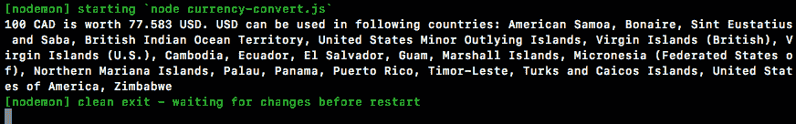

然后我们有一个我们可以在其中使用的所有国家的列表。让我们继续测试一个不同的变体。让我们将美元换成加拿大元：

```js
convertCurrencyAlt('USD', 'CAD', 100).then((status) => {
  console.log(status);
});
```

这一次，我们将得到以下不同的输出：


在这种情况下，加拿大元可以在以下国家使用，这种情况下只有`Canada`。一切都按预期运行。问题在于我们使用 promise chaining 来完成所有工作。我们需要使用`async`函数而不是那样。

# 创建 convertCurrencyAlt 作为 async/await 函数

我们将把这个转换成 async/await，并且你将在`convertCurrency`函数的末尾完成这个过程。我们将使用`创建 convertCurrencyAlt 作为 async 函数`。所以，就像我们在 app-promises 中所做的那样，你将创建一个`async`函数。然后你将使用`await`获取两个数据片段：`使用 await 获取国家和汇率以及我们的两个函数`。所以，你将等待这两个 promise，然后将该值存储在某个变量中。你可以创建一个国家变量和一个`rate`变量。最后，你将能够将这两行代码添加到最后：

```js
const exchangedAmount = amount * rate;

return `${amount} ${from} is worth ${exchangedAmount} ${to}. ${to} can be used in the following countries: ${countries.join(', ')}`;
 });
```

这将计算`exchangedAmount`并返回正确的信息：`计算 exchangedAmount`和`返回状态字符串`。你有两个语句来获取数据，一个用来计算交换金额，最后一个用来实际打印出来。

我们将继续创建`const convertCurrencyAlt`。这将是一个`async`函数，所以我们必须标记它。然后我们可以继续我们的参数列表，与另一个函数完全相同：`from`，`to`和`amount`。然后我们将放置箭头和箭头函数（`=>`），然后打开和关闭大括号。

```js
const convertCurrencyAlt = async (from, to, amount) => {

});
```

现在我们可以继续进行第一步，即获取国家和获取汇率。我将从国家开始；`const countries`等于。我们将等待从`getCountries`返回的 promise。我们想要获取哪些国家？那些可以使用`to`货币的国家。然后我们将继续获取汇率。所以，`const rate`。在这种情况下，我们也要尝试`await`一些东西；我们要等待从`getExchangeRate`返回的 promise。我们要在这里获取汇率，`from`和`to`：

```js
const convertCurrencyAlt = async (from, to, amount) => {
  const countries = await getCountries(to);
  const rate = await getExchangeRate(from, to);
};
```

所以，此时，我们已经有了所有的数据，我们可以继续计算交换金额并返回字符串。我们已经构建好了，没有必要重新创建。我们可以复制这两行代码，粘贴到下面，然后就完成了。一切都完成了：

```js
const convertCurrencyAlt = async (from, to, amount) => {
  const countries = await getCountries(to);
  const rate = await getExchangeRate(from, to);
  const exchangedAmount = amount * rate;

  return `${amount} ${from} is worth ${exchangedAmount} ${to}. ${to} can be used in the following countries: ${countries.join(', ')}`;
};
```

现在，在下面，我们可以调用`convertCurrencyAlt`，而不是调用`convertCurrency`，传入完全相同的参数并返回状态。

```js
convertCurrencyAlt('USD', 'CAD', 100).then((status) => {
  console.log(status);
});
```

不同之处在于我们的函数使用`async`；更易读，更容易使用。我们将继续保存 currency-convert。这将运行整个过程，获取所有数据，转换它，然后我们将打印状态。最终我们得到什么？在这里，我们得到与输出中显示的完全相同的东西：


在下一节中，我们将讨论在这个示例中可以使用`async`的其他一些地方，并且我们还将讨论如何处理和处理错误。

# 处理错误和等待 async 函数

我们将首先将`getExchangeRate`和`getCountries`转换为`async`函数。它们是很好的候选者，因为我们有 promise，我们可以等待这些 promise。然后我们将讨论错误，我们如何抛出错误以及如何自定义其他代码抛出的错误。这将使它非常有用，并且在实际需要处理错误的现实世界中，使用`async`/`await`会更容易。

# 将 getExchangeRate 和 getCountries 转换为 async 函数

所以我们要做的第一件事是转换`getExchangeRate`和`getCountries`。我要采取的第一步是将其转换为`async`函数，否则我们无法使用`await`。然后我们将继续设置一个变量，一个`const` response，并将其设置为`await`。然后我们将等待以下承诺，来自`axios.get`返回的承诺。我将复制它，粘贴它，末尾加上一个分号，唯一剩下的事情就是返回这个值。我将取出`return`语句，移动到那里，然后我们可以删除之前的所有代码：

```js
const getExchangeRate = async (from, to) => {
  const response = await axios.get(`http://api.fixer.io/latest?base=${from}`);
  return response.data.rates[to];
}
```

现在我们有完全相同的功能，而且更好一些。现在，好处并不像从`convertCurrency`到`convertCurrencyAlt`那样显著，但确实很好，我建议您尽可能使用`async`。现在我们需要使用刚刚遵循的相同步骤来转换`getCountries`：

1.  将`currencyCode`标记为`async`：

```js
const getCountries = async (CurrencyCode) => {
```

1.  创建`response`变量并实际等待承诺。我们将等待以下承诺：

```js
axios.get(`https://restcountries.eu/rest/v2/currency/${currencyCode}`);
```

1.  最后一步就是返回完全相同的东西。就是这样：

```js
return response.data.map((country) => country.name);
```

现在这两个都转换了，我们只需通过保存文件来测试我们的工作，只要我们得到完全相同的输出，我们就会继续讨论错误；如何捕捉它们，如何抛出它们，以及一般来说，我们如何改进出现在我们应用程序中的错误。

好的，新的结果刚刚出现：


这与其他两个是相同的，这意味着我们可以继续进行。现在，我想把讨论转移到错误上。

# 异步函数中的错误处理

我们要做的是让端点触发错误。我们将看看我们如何处理这些端点，以及如何调整它们成为更有用的东西，因为目前我们将得到一大堆垃圾。

# 将错误打印到屏幕上

第一步是实际上将错误打印到屏幕上，这样我们就可以看到我们正在处理的是什么。我们将`catch`错误，并打印错误，`console.log(e)`：

```js
convertCurrencyAlt('USD', 'CAD', 100).then((status) => {
  console.log(status);
}).catch((e) => {
  console.log(e);
});
```

现在让我们开始让一些东西失败。我们将通过使`getCountries`失败来开始；那是第一个调用。

现在，这个只使用了`to`，所以我们要做的就是让它失败，发送一个错误的`countryCode`。我将使用`MMM`：

```js
convertCurrencyAlt('USD', 'MMM', 100).then((status) => {
  console.log(status);
}).catch((e) => {
  console.log(e);
});
```

保存文件，我们将看到在浏览器中得到什么。现在我们将得到一大堆垃圾：

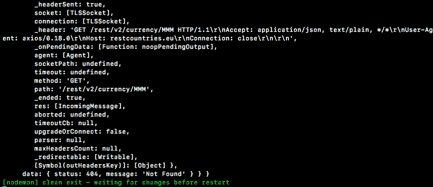

这里返回的实际上是`axios`的响应。这里有错误信息；它有状态码之类的东西。你可以看到它是 404。我们有一条消息说未找到。这让我们知道我们提供的`countryCode`没有被该端点找到。现在这并不特别有用。

我们想要得到一些更有用的东西，比如一条消息：`无法获取使用 MMM 的国家`。那将很好。所以，为了做到这一点，我们将调整`getCountries`。我们将继续使用一个普通的`try catch`块，并设置如下：

```js
const getCountries = async (CurrencyCode) => {
  try{

  } catch (e){

  }
```

如果`try`块中的代码引发错误，`catch`块将运行，否则`catch`将永远不会运行。我们要做的就是取`const response`和`return statement`代码，并将其移动到`try`内部：

```js
const getCountries = async (currencyCode) => {
  try {
    const response = await axios.get(`https://restcountries.eu/rest/v2/current/${currencyCode}`);
    return response.data.map((country) => country.name);
  } catch(e){

  }
};
```

所以，我们的意思是，每当这两行中的任何一行引发错误时，运行`catch`块中的代码并提供错误。现在我们知道错误是什么。它并不包含太多东西，所以我们要做的就是抛出我们自己的错误；一些人类可读的东西：`throw new Error`。在这种情况下，我们将坚持使用模板字符串，并且我们将继续设置它：`无法获取使用的国家`。然后我们将在句号之前注入`currencyCode`：

```js
const getCountries = async (currencyCode) => {
  try {
    const response = await axios.get(`https://restcountries.eu/rest/v2/current/${currencyCode}`);
    return response.data.map((country) => country.name);
  } catch(e){
    throw new Error(`Unable to get countries that use
${currencyCOde}.`);
  }
};
```

现在，如果我们使用错误的`countryCode`保存 currency-convert 应用程序，我们将看到错误`无法获取使用 MMM 的国家`。我们可以直接使用`e.message`访问消息。

```js
convertCurrencyAlt('USD', 'MMM', 100).then((status) =>{
  console.log(status);
}).catch((e) => {
  console.log(e.message);
});
```

这将进一步改善输出。现在我们只有一个字符串。我们可以对该字符串做任何我们想做的事情。非常清楚：`无法获取使用 MMM 的国家`。

# getExchangeRate 函数的错误处理

现在，让我们继续看我们列表中的下一个，即`getExchangeRate`函数。这里实际上有两件事情可能出错；`axios`请求本身可能会失败，我们也可能得到一个有效的响应，但`to`状态码无效。在这种情况下，就不会有汇率。

现在我们可以通过注释掉一些代码行来实际模拟这一点，这将允许我们测试`getExchangeRate`的隔离：

```js
const convertCurrencyAlt = async (from, to, amount) => {
  //const countries = await getCountries(to);
  const rate = await getExchangeRate(from, to);
  //const exchangedAmount = amount * rate;
  //
  //return `${amount} ${from} is worth ${exchangedAmount} ${to}. ${to} can be used in the following`;
};
```

现在，如果我将`USD`弄乱成`QWE`，我们可以保存文件，然后会得到另一个错误请求失败，状态码为 422：


我们要做的是再次进行完全相同的过程。所以，我们将这两行代码放在`try catch`块中。然后，如果`catch`运行，你将使用以下格式抛出一个新的错误：`无法获取 USD 和 CAD 的汇率`。这将是从 USD 货币代码到 CAD 货币代码。我们将通过设置`try catch`块来启动这些事情。我们将尝试运行以下代码：

```js
const response = await axios.get(`http://api.fixer.io/latest?base=${from}`);
return response.data.rates[to];
```

如果它运行将会非常好，但是如果没有，我们也希望通过抛出新的错误来处理。在`catch`块内，我们将提供我们的消息；它将只是一个模板字符串。现在，我想提供的消息是`无法获取${from}和${to}的汇率`，后面跟一个句号：

```js
const getExchangeRate = async(from, to) =>{
  try{
    const response = await axios.get(`http://api.fixer.io/latest?base=${from}`);
    return response.data.rates[to];
  } catch(e){
    throw new Error(`Unable to get exchange rate for ${from} and ${to}.`);
  }
};
```

现在我们可以保存这个并查看浏览器中发生了什么：


我们得到`无法获取 QWE 和 MMM 的汇率`。现在目前失败是因为`from`无效，但是如果`from`有效呢？如果我们试图从`USD`到`MMM`？这一次我们将得到不同的东西：


这里我们只得到`undefined`。这是因为`getExchangeRate`中的`return`语句有`response.data.rates`。我们有一个有效的`from countryCode`，所以返回有效数据，但`to countryCode`不存在，这就是 undefined 的来源。

我们可以通过创建一个变量`const rate`来修复这个问题，并将其设置为`response.data.rates[to]`。然后，一点点的`if`逻辑。如果有`rate`，我们将继续返回它。如果没有`rate`，我们将继续`throw`一个新的错误，这将触发`catch`块，将消息打印到屏幕上：

```js
const getExchangeRate = async(from, to) =>{
  try{
    const response = await axios.get(`http://api.fixer.io/latest?base=${from}`);
    const rate = response.data.rates[to];

    if(rate){
      return rate;
    } else{
      throw new Error();
    }
  } catch(e){
    throw new Error(`Unable to get exchange rate for ${from} and ${to}.`);
  }
};
```

现在，如果我们使用相同的代码保存代码，我们再次收到消息：`无法获取 USD 和 MMM 的汇率`：


如果`from`无效，如果`to`无效，或者两者都无效，这条消息将显示出来。

现在，我们已经设置了一些小的错误处理，并且可以将应用程序的其余部分重新引入。如果我们使用这里的错误数据运行应用程序，将打印`无法获取使用 MMM 的国家`：


让我们切换回到有效的国家代码，比如`USD`和`CAD`。让我们实际上使用欧元`EUR`来进行一些改变，在浏览器中，我们应该得到有效的值，因为这两个国家代码确实是有效的：

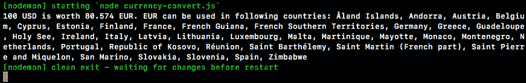

在这里，我们得到了汇率，我们得到了所有使用欧元的国家，我们没有得到任何错误消息，这太棒了。因此，通过使用常规技术，例如 JavaScript 中的`try`、`catch`和`throw`新错误，我们能够使用这些`async`函数创建一个非常好的设置。

这就是本节的全部内容，也是我们小小的货币转换示例的全部内容。因此，到目前为止，我们已经经历了两个示例：我们经历了应用承诺示例，其中我们有一组人为设置的数据；我们创建了一些函数，并且了解了`async`/`await`的基础知识。然后我们经历了货币转换示例，我们在其中使用了两个真实的 API，并且增加了更健壮的错误处理。归根结底，它们都将使用完全相同的`async`和`await`技术。希望您开始看到这如何适用于我们的 Node 应用程序。在下一节，也是最后一节中，我们实际上将使用`async`和`await`对 Node API 进行一些更改。

# 总结

在本章中，我们研究了一个新的语法`async`/`await`。我们研究了项目设置、`async`/`await`的基础知识和一个真实的示例。我们还研究了使用`async`/`await`进行错误处理。
