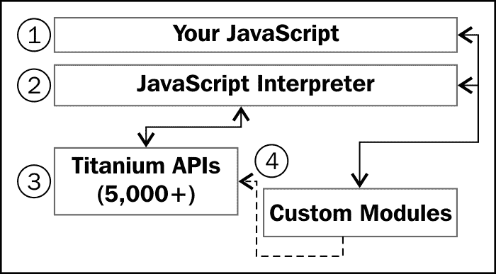
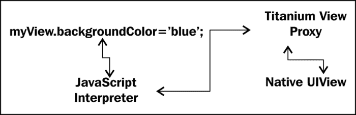
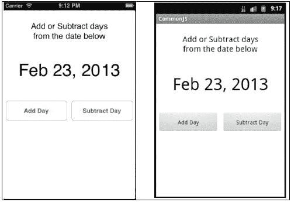
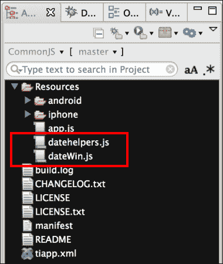
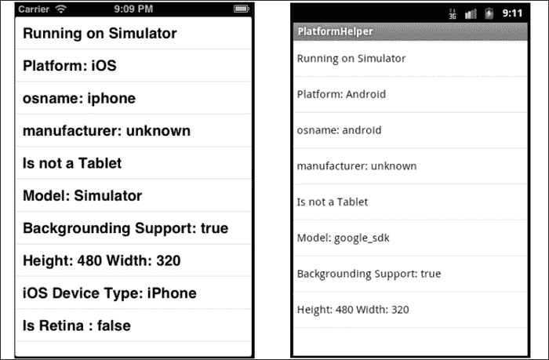
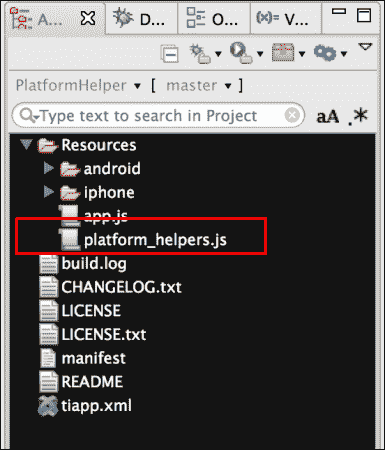
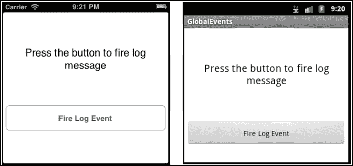
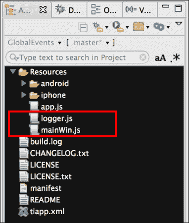

# 第一章。模式和平台工具

在本章中，我们将涵盖：

+   定义应用程序命名空间

+   实践中的 CommonJS

+   使用平台指示器

+   使用 Ti.App.Listener 进行全局日志记录

# 简介

对于许多人来说，构建钛金属应用程序将是他们第一次接触大型、完整的 JavaScript 项目。无论你是设计一个小型费用跟踪系统还是完整的 CRM 工具，在钛金属中实施适当的设计模式都将提高你应用程序的性能和可维护性。

钛金属的跨平台特性和底层架构影响了众多常见设计模式的应用。在本章中，我们将展示如何应用这些模式以加快开发速度，并在支持多设备时实施最佳实践。

## 介绍钛金属

Appcelerator 钛金属移动平台是一个使用现代网络技术（如 JavaScript、CSS 和 HTML）构建跨平台原生移动应用程序的平台。钛金属移动平台是由 Appcelerator Inc 开发的开源项目，并许可在 OSI 批准的 Apache 公共许可证（版本 2）下。

钛金属移动项目是 GitHub 上最活跃的项目之一，每天有大量的提交。GitHub 仓库是社区中许多人的焦点，包括模块开发者、需要夜间构建的应用程序开发者以及钛金属项目的个人贡献者。

钛金属生态系统是行业内最大的之一，拥有超过 45 万全球开发者，他们的应用程序运行在世界 10%的设备上。Appcelerator 拥有最大的移动市场之一，为钛金属移动平台提供第三方组件。

## 钛金属架构

钛金属是一个基于模块的移动开发平台，由 JavaScript 和本地平台代码（Java、Objective-C 和 C++）组成。钛金属的架构目标是提供一个跨平台的 JavaScript 运行时和 API，用于移动开发；这与其他框架构建“原生包装”网络应用程序的方法不同。

钛金属使用 JavaScript 解释器在您的应用程序 JavaScript 代码和底层本地平台之间建立桥梁。这种方法允许钛金属公开大量 API 和本地 UI 小部件，而不会牺牲性能。钛金属的 UI 控件真正是原生的，而不是通过 CSS 进行视觉模拟。因此，当您创建一个`Ti.UI.Switch`时，它实际上是在 iOS 上使用本地的 UISwitch 控件。

每个钛金属应用程序都组织成分层架构，包括以下主要组件：

+   **您的 JavaScript 代码**：在编译时，这将编码并插入到 Java 或 Objective-C 文件中

+   **钛金属的 JavaScript 解释器**：在 Android 上为 V8 或 iOS 上的 JavaScriptCore

+   **钛金属 API**：这是为在 Java、Objective-C 或 C++中创建的特定平台创建的

+   **原生自定义模块**：有大量开源和商业模块可供选择

在运行时，嵌入您应用程序中的 Titanium SDK 创建了一个原生代码 JavaScript 执行上下文。然后，此执行上下文用于评估您的应用程序 JavaScript 代码。随着 JavaScript 的执行，它将创建代理对象以访问原生 API，如按钮和视图。这些代理是存在于 JavaScript 和原生环境中的特殊对象，充当两个环境之间的桥梁。

例如，如果我们有一个 `Ti.UI.View` 对象，并将 `backgroundColor` 更改为 `blue`，该属性在 JavaScript 中发生变化，然后代理更新了底层原生层中的正确属性，如下所示图所示：



## 构建跨平台应用

Titanium 提供了一个高级跨平台 API，但它不是一个“一次编写，到处运行”的框架。在构建跨平台应用程序时，建议采用“一次编写，适应所有地方”的哲学。使用 Titanium，您可以添加特定于平台的代码来处理每个平台的不同的 UI 要求，同时保持您的业务逻辑 100% 跨平台兼容。

构建最佳跨平台应用程序，Titanium 提供了以下工具：

+   在运行时识别平台和型号

+   能够在构建时处理特定于平台和设备的资源

+   应用平台和设备特定的样式

除了平台工具之外，Titanium API 还旨在协助跨平台开发。每个主要组件，如 `Maps`、`Contacts` 和 `FileSystem`，都被分离到顶级命名空间 `Ti` 或 `Titanium` 下的单独组件命名空间中。这些组件命名空间然后有自己的子命名空间来分割特定于平台的行为。

这种分段的例子是 `Ti.UI 命名空间`，其中包含所有 UI 组件。此命名空间包含常见的 API，例如 `Ti.UI.View` 和 `Ti.UI.TableView`。此外，`Ti.UI` 命名空间还有特定于平台的子命名空间，例如包含 `Ti.UI.iPad.Popover` 等控件的 `Ti.UI.iPad`。同样的设计也适用于非视觉 API，如 `Ti.Android` 命名空间，它包含 Android 特定的行为。

# 定义应用程序命名空间

在 Titanium 应用程序开发中，使用命名空间非常重要，因为它有助于组织您的代码，同时不会污染全局命名空间。创建与命名空间或其他作用域条件无关的变量和方法的做法被称为**污染全局命名空间**。由于这些函数和对象的作用域是全局的，它们将不会在全局命名空间在应用程序关闭时失去作用域之前被收集。这通常会导致内存泄漏或其他不希望出现的副作用。

## 如何操作...

以下示例展示了如何在`app.js`中为我们的应用程序创建一个名为`my`的命名空间，其中包含三个子命名空间，分别称为`ui`、`tools`和`controllers`。

```js
var my = {ui:{},tools:{},controllers:{}}
```

在我们构建食谱的过程中，我们将继续向先前的命名空间添加功能。

# 实践中的 CommonJS

使用 CommonJS 模块组织您的应用程序代码是 Titanium 开发中的最佳实践。CommonJS 是创建可重用 JavaScript 模块的流行规范，并被 Node.js 和 MongoDb 等几个主要平台和框架所采用。

CommonJS 模块有助于解决 JavaScript 作用域问题，将每个模块放置在其自己的命名空间和执行上下文中。变量和函数在模块内部是局部作用域的，除非明确导出供其他模块使用。

除了帮助解决 JavaScript 作用域问题外，CommonJS 还提供了一个模式，用于公开稳定的接口以供程序使用。信息隐藏设计模式允许模块开发者更新模块的内部结构，而不会破坏公共契约或接口。在 JavaScript 中维护稳定的公共接口是编写可维护代码的关键部分，这些代码将在应用程序和团队之间共享。

Titanium 以类似于 Node.js 的方式实现了 CommonJS，即您使用`require`方法返回一个 JavaScript 对象，该对象具有属性、函数和其他数据分配给它，这些数据形成了模块的公共接口。

以下截图展示了用于演示本书中将使用的 CommonJS 高级概念的示例应用程序。



## 准备工作

将本食谱中使用的 CommonJS 模块添加到项目中很简单，包括将`datahelper.js`和`dateWin.js`文件复制到 Titanium 项目的根目录，如下面的截图所示：



## 如何操作...

以下食谱展示了如何使用 CommonJS 创建`UI`和`Tools`模块。在下面的示例中，创建了一个简单的应用程序，允许用户增加或减少日期一天。

### 创建项目的 app.js

在我们的`app.js`中，我们创建应用程序命名空间。这些命名空间变量将在示例的后续部分用于引用我们的 CommonJS 模块。

```js
//Create our application namespace
var my = {
  ui:{
    mod : require('dateWin')
  },
  tools:{},
  controllers:{}
};
```

### 小贴士

**下载示例代码**

您可以从您在[`www.PacktPub.com`](http://www.PacktPub.com)的账户中下载您购买的所有 Packt 书籍的示例代码文件。如果您在其他地方购买了这本书，您可以访问[`www.PacktPub.com/support`](http://www.PacktPub.com/support)并注册以直接将文件通过电子邮件发送给您。

然后使用已添加到我们应用程序命名空间的`my.ui.mod`创建`Ti.UI.Window`。然后在我们的`win`对象上调用`open`方法以打开示例应用程序的主窗口。

```js
my.ui.win = my.ui.mod.createWindow();

my.ui.win.open();
```

### 构建 datehelpers 模块

在我们项目的 `Resources` 文件夹中，有一个 CommonJS 模块 `datehelpers.js`。此模块包含以下代码：

1.  `helpers` 方法是在 `datahelpers` 模块中创建的。默认情况下，此函数是私有的，直到使用 `exports` 对象暴露它。

    ```js
    var helpers = function(){
      var createAt = new Date();
    ```

1.  `createdOn` 方法被添加到 `helpers` 函数中。此函数返回 `createAt` 变量。此函数用于提供时间戳值，以展示模块可以初始化多次。每次为模块创建新会话时，`createAt` 变量将显示新的初始化时间戳。

    ```js
    this.createdOn = function(){
        return createAt;
      };
    ```

1.  `addDays` 方法被添加到 `helpers` 函数中。此方法通过 `n` 参数提供的天数增加提供的日期值。

    ```js
    this.addDays = function(value,n){
        var tempValue = new Date(value.getTime()); 
        tempValue.setDate(tempValue.getDate()+n);
        return tempValue;
      }
    };
    ```

`module.exports` 是在 `require` 调用结果中返回的对象。通过将 `helpers` 函数赋值给 `module.exports`，我们能够使私有的 `helpers` 函数公开访问。

```js
module.exports = helpers;
```

### 日期 Win 模块

同样包含在我们项目的 `Resources` 文件夹中还有一个 CommonJS 模块 `dateWin.js`。以下代码部分讨论了此模块的内容。

1.  使用 `require` 关键字导入 `datehelpers` CommonJS 模块。这个模块在 `mod` 模块级别变量中被导入，以便后续使用。

    ```js
    var mod = require('datehelpers');
    ```

1.  `createWindow` 函数返回 `Ti.UI.Window`，允许用户与食谱一起工作。

    ```js
    exports.fetchWindow=function(){
    ```

1.  接下来创建 `dateHelper` 模块的新实例。

    ```js
      var dateHelper = new mod();
    ```

1.  构建 `createWindow` 函数的下一步是将 `currentDateTime` 模块属性设置为当前日期/时间的默认值。

    ```js
      var currentDateTime = new Date();
    ```

1.  `createWindow` 函数将返回的 `Ti.UI.Window` 对象，然后创建。这将用于附加所有我们的 UI 元素。

    ```js
      var win = Ti.UI.createWindow({
        backgroundColor:'#fff'
      });
    ```

1.  `dateDisplayLabel` 用于显示用户增加或减少日期值时 `datehelper` 模块的结果。

    ```js
      var dateDisplayLabel = Ti.UI.createLabel({
        text:String.formatDate
        (exports.currentDateTime,"medium"),
        top:120, height:50, width:Ti.UI.FILL, 
        textAlign:'center', color:'#000', font:{fontSize:42}
      });
      win.add(dateDisplayLabel);
    ```

1.  `addButton` 在此食谱的后续步骤中被用来调用 `datehelper` 模块，并给当前模块值添加天数。

    ```js
      var addButton = Ti.UI.createButton({
        title:"Add Day", top:220, left:5, width:150, height:50
      });
      win.add(addButton);
    ```

1.  `subtractButton` 在此食谱的后续步骤中被用来调用 `datehelper` 模块，并减少当前模块值的日期。

    ```js
      var subtractButton = Ti.UI.createButton({
        title:"Subtract Day", top:220, right:5, 
      	 width:150, height:50
      });
      win.add(subtractButton);
    ```

1.  在 `addButton` 和 `subtractButton` 点击处理程序中的以下代码显示了如何调用 `AddDays` 方法来增加模块的 `currentDateTime` 属性。

    ```js
      addButton.addEventListener('click',function(e){
    ```

1.  以下行演示了如何通过一天来增加 `currentDateTime` 的值：

    ```js
        exports.currentDateTime = 
        dateHelper.addDays(currentDateTime,1);
    ```

1.  使用新的模块值更新 `dateDisplayLabel`。

    ```js
        dateDisplayLabel.text = String.formatDate(
        exports.currentDateTime,"medium");
      });    
      subtractButton.addEventListener('click',function(e){
    ```

1.  以下代码片段演示了如何通过一天来减少 `currentDateTime`：

    ```js
        exports.currentDateTime = 
        _dateHelper.addDays(currentDateTime,-1);
    ```

1.  使用新的模块值更新 `dateDisplayLabel`。

    ```js
        dateDisplayLabel.text = String.formatDate(
        currentDateTime,"medium");
      });
      return win;
    };
    ```

## 它是如何工作的...

创建模块很简单。你只需将一个 JavaScript 文件添加到你的项目中，并编写你的应用程序代码。默认情况下，任何变量、对象或函数都是私有的，除非你将它们添加到 `module` 或 `exports` 对象中。`module` 和 `exports` 对象是由 Titanium 创建的特殊 JavaScript 对象，并由 `require` 方法返回。

### 需要

要使用 CommonJS 模块，你必须使用全局可用的 `require` 函数。此函数有一个单一参数，通过该参数你提供 JavaScript 模块的路径。以下行演示了如何加载位于 Titanium 项目根目录的名为 `datehelpers.js` 的 CommonJS 模块。

```js
var myModule = require('datehelpers');
```

### 注意

当向 `require` 函数提供绝对路径时，Titanium 将从你的项目的 `Resources` 文件夹开始。

Titanium 已经优化了模块加载过程，当模块首次使用 `require` 方法加载时，它将被缓存以避免重新评估模块的 JavaScript。这种方法显著提高了具有共同依赖项的模块的加载性能。如果你需要在加载时管理/修改模块，请记住 JavaScript 不会被重新评估。

### 属性

向你的 CommonJS 模块添加属性很容易。你只需将一个变量附加到 `exports` 对象上。

以下代码片段演示了如何创建具有默认值的基本 CommonJS 属性。

```js
exports.myProperty = "I am a property";
```

也可以创建更复杂的对象属性，例如如下所示：

```js
exports.myObjectProperty = {
  foo:1,
  bar:'hello'
};
```

你还可以使用私有变量来设置初始属性的值。这通常会使代码更易读和简洁。

创建一个反映你业务需求的局部变量。

```js
var _myObjectProperty = {
  foo:1,
  bar:'hello'
};
```

然后，你可以将局部变量分配给附加到 `exports` 对象上的属性，例如如下所示：

```js
exports.myObjectProperty = _myObjectProperty
```

### 注意

记住这些只是 `exports` JavaScript 对象上的属性，可以被任何调用者更改。

### 函数

在 CommonJS 中创建公共函数很容易，你只需将一个函数添加到 `exports` 对象中。将 `Adddays` 方法作为 `exports` 对象的一部分创建。此函数接受一个日期作为 `value` 参数和一个整数作为 `n` 值。

```js
exports.AddDays = function(value,n){
```

创建一个新变量以避免提供的值被修改。

```js
  var workingValue = new Date(value.getTime());
```

使用提供的 `n` 值增加日期。这可以是正数或负数。负数值会减少提供的日期值。

```js
  workingValue.setDate(workingValue.getDate()+n);
```

返回调整后的新值。

```js
  return workingValue;
};
```

你也可以将 `exports` 方法分配给私有作用域的函数。这有助于管理大型或复杂的函数。

创建一个名为 `addDays` 的局部作用域函数。

```js
function addDays(value,n){
  var workingValue = new Date(value.getTime());
  workingValue.setDate(workingValue.getDate()+n);
  return workingValue;
};
```

然后，将 `addDays` 函数分配给 `exports.AddDays`，使其对模块外部的调用者可见。

```js
exports.AddDays = addDays;
```

### 注意

记住这些只是 `exports` JavaScript 对象上的方法，可以被任何调用者更改。

### 使用 module.exports 创建实例对象

Titanium 提供了使用 `module.exports` 创建模块实例对象的能力。这允许你创建与 `module.exports` 相关联的函数或对象的新实例。这有助于描述一个特定的对象，实例方法代表这个特定对象可以执行的操作。

这种模式鼓励开发者更加模块化地思考，并遵循单一职责原则，因为只有一个对象或函数可以被分配给 `module.exports`。

以下代码片段演示了如何使用此模式创建和调用模块：

1.  使用 Titanium Studio，创建员工（`employee.js`）模块文件。

1.  接下来创建 `employee` 函数。

    ```js
    var employee = function(name,employeeId,title){
      this.name = name;
      this.employeeId = employeeId;
      this.title = title;
      this.isVIP = function(level){
        return (title.toUpperCase()==='CEO');
      }
    };
    ```

1.  然后将 `employee` 函数分配给 `module.exports`。这将使 `employee` 函数可以通过 `require` 公开调用。

    ```js
    module.exports = employee;
    ```

1.  使用 `require`，创建了一个模块的引用并将其分配给 `employee` 变量。

    ```js
    var employee = require('employee');
    ```

1.  接下来，使用之前创建的 `employee` 对象的新实例创建了 `bob` 和 `chris` 对象。

    ```js
    var bob = new employee('Bob Smith',1234,'manager');
    var chris = new employee('Chris Jones',001,'CEO');
    ```

1.  最后，调用 `bob` 和 `chris` 对象上的属性和函数，以演示每个对象的实例信息。

    ```js
    Ti.API.info('Is ' + bob.name + ' a VIP? ' + bob.isVIP());
    Ti.API.info('Is ' + chris.name + ' a VIP? ' + chris.isVIP());
    ```

### CommonJS 全局作用域反模式

在 Android 和 iOS 上的 CommonJS 实现基本上是相同的，只有一个主要的范围异常。如果您使用的是低于版本 3.1 的 Titanium 框架版本，Android 将所有变量访问范围限定在模块本身，而 iOS 允许模块访问执行上下文中已加载的模块之外的对象。这应该被视为一种反模式，因为它破坏了许多 CommonJS 规范旨在防止的封装原则。

在 Titanium 版本 3.1 中，已经决定弃用 iOS 和 Android 中的全局作用域访问，以支持新的 `Alloy.Globals` 对象。您可以在 [`docs.appcelerator.com/titanium/latest/#!/api/Alloy`](http://docs.appcelerator.com/titanium/latest/#!/api/Alloy) 中了解更多关于 `Alloy.Globals` 对象的信息。

以下食谱演示了这种常见的反模式，并突出了 iOS 和 Android 在此领域的 CommonJS 实现差异。

```js
//Create our application namespace
var my = {
  tools: require('scope_test'),
  session:{
    foo: "Session value in context"
  }
};
```

在 `tools` 模块上调用 `testScope` 方法。这演示了 CommonJS 模块作用域反模式是如何工作的。

```js
my.tools.testScope();
```

包含 `testScope` 方法的 `tools` 模块是本食谱代码的一部分，可以在我们项目的 `scope.js` 文件根目录中找到。此模块包含以下代码：

```js
exports.testScope = function(){
 Ti.API.log
 ("Test Module Scope - Foo =  " + my.session.foo);
 return my.session.foo;
};
```

在调用 `my.tools.testScope()` 方法时，会显示出范围访问的反模式。在 iOS 中，`my.tools.testScope()` 返回 `"Session Value in context"`，因为它可以从当前执行上下文中访问 `my.session.foo`。在 Android 中，在 Titanium SDK 版本 3.1 之前，未定义的对象通常会被返回，因为模块没有访问 `my.session.foo` 对象的权限。在 Titanium SDK 版本 3.1 及更高版本中，Android 现在返回 `"Session Value in context"`，因为它可以访问 `my.session.foo` 对象。

从 Titanium SDK 版本 3.1 开始，在两个平台上对全局作用域的访问已经弃用，并且将在 SDK 的未来版本中删除。如果您之前实现了这种反模式，建议采取纠正措施，因为该功能的弃用将在您的应用程序中引起破坏性更改。

## 参见

+   要了解更多关于 CommonJS 规范的信息，请访问 CommonJS.org 上的 wiki，网址为[`wiki.commonjs.org/wiki/CommonJS`](http://wiki.commonjs.org/wiki/CommonJS)。

+   要了解更多关于 Titanium 实现 CommonJS 规范的具体细节和示例，请查看他们的指南，网址为[`docs.appcelerator.com/titanium/latest/#!/guide/CommonJS_Modules_in_Titanium`](http://docs.appcelerator.com/titanium/latest/#!/guide/CommonJS_Modules_in_Titanium)。

# 使用平台指示器

处理不同的设备、平台和模型是跨平台开发中最大的挑战之一。Titanium 提供了`Ti.Platform`命名空间，以帮助您在代码中做出决策，如何处理运行时执行。

在以下菜谱中，我们将逐步介绍如何创建一个包含便利方法的`PlatformHelpers` CommonJS 模块，这些方法可以解决许多与平台相关的查询。以下截图展示了在 iPhone 和 Android 平台上运行此菜谱的情况。



## 准备工作

`Ti.Platform`命名空间对于提供平台和设备特定细节很有帮助，但通常您需要更高级别的细节，例如当您的应用在一个平板电脑上运行时，以及它是否是一个 iPad Mini。

### 将菜谱组件添加到您的项目中

将`PlatformHelpers`模块添加到您的项目中很简单。只需将`platform_helpers.js`文件复制到您的项目中，如下截图所示：



## 如何做...

以下`app.js`演示了本章前面描述的`PlatformHelpers`模块。这个示例应用展示了一个包含设备详情的窗口。请在您的所有 Android 和 iOS 设备上尝试一下。

1.  要创建我们的相同应用，首先我们声明我们的应用命名空间并导入我们的`PlatformHelper`模块。

    ```js
    //Create our application namespace
    var my = {
      platformHelpers : require('platform_helpers')
    };

    (function(){
    ```

1.  接下来，我们创建一个窗口，我们将在此窗口中展示设备信息。

    ```js
    var win = Ti.UI.createWindow({
      backgroundColor:'#fff'
    });
    ```

1.  接下来，我们创建一个空数组来存储我们的设备详情。

    ```js
    var deviceData = [];
    ```

    如果您的设备正在模拟器上运行，则会将条目添加到`deviceData`。

    `isSimulator`属性用于显示模拟器消息，仅当菜谱当前正在平台模拟器或仿真器上运行时。

    ```js
    if(my.platformHelpers.isSimulator){
      deviceData.push({
        title:'Running on Simulator', child:false
      });
    }
    ```

1.  接下来，将平台、操作系统名称和制造商添加到`deviceData`。

    ```js
    deviceData.push({
      title:'Platform: ' + 
      (my.platformHelpers.isAndroid ? 'Android' : 'iOS'), 
      child:false
    });

    deviceData.push({
      title:'osname: ' +  my.platformHelpers.osname, 
      child:false
    });

    deviceData.push({
      title:'manufacturer: ' +  
      my.platformHelpers.manufacturer, child:false
    });
    ```

1.  以下语句向`deviceData`添加一个标志，指示当前设备是否为平板电脑形态：

    ```js
    deviceData.push({
      title:(my.platformHelpers.isTablet ? 
      'Is a Tablet' : 'Is not a Tablet'), child:false
    });
    ```

1.  接下来，我们在`deviceData`数组中添加设备型号，并指定它是否支持后台任务。

    ```js
    deviceData.push({
      title:'Model: ' + my.platformHelpers.deviceModel, 
      child:false
    });

    deviceData.push({
      title:'Backgrounding Support: ' + 
      my.platformHelpers.supportsBackground,
      child:false
    });
    ```

1.  屏幕尺寸是最常用的属性。以下代码片段将屏幕的高度和宽度添加到`deviceData`数组中：

    ```js
    deviceData.push({
      title:'Height: ' + my.platformHelpers.deviceHeight +
      ' Width: ' + my.platformHelpers.deviceWidth,
      child:false
    });
    ```

1.  如果您的应用当前正在 iOS 设备上运行，以下代码片段会将设备类型添加到`deviceData`数组中，并指定是否启用 retina。

    ```js
    if(my.platformHelpers.isIOS){
      deviceData.push({
        title:'iOS Device Type: ' + 
        (my.platformHelpers.iPad ? 
        (my.platformHelpers.iPadMiniNonRetina ? 
        'iPad Mini' : 'Is an iPad') : 'iPhone'),
        child:false
      });

      deviceData.push({
        title:'Is Retina : ' + my.platformHelpers.isRetina,
        child:false
      });				
    }
    ```

1.  `PlatformHelper`模块提供了大量数据。为了最佳显示，我们将使用`Ti.UI.TableView`和我们在早期代码片段中构建的`deviceData`数组。

    ```js
    var tableView = Ti.UI.createTableView({top:0, 
    data:deviceData});

      win.add(tableView);
      win.open();
    })(); 
    ```

## 它是如何工作的...

设备平台查找将频繁地在您的应用中访问。为了避免通过重复跨越 JavaScript 桥接导致的性能问题，我们将导入我们将要使用的值并将它们分配给我们的 CommonJS `PlatformHelpers`模块中的属性。

```js
exports.osname = Ti.Platform.osname;
exports.manufacturer = Ti.Platform.manufacturer;
exports.deviceModel = Ti.Platform.model;
exports.deviceHeight = Ti.Platform.displayCaps.platformHeight;
exports.deviceWidth = Ti.Platform.displayCaps.platformWidth;
exports.densitylevel = Ti.Platform.displayCaps.density;
exports.deviceDPI = Ti.Platform.displayCaps.dpi;
```

对于您正在工作的平台，有一个布尔指示器通常很有帮助。以下代码片段展示了如何创建`isAndroid`和`isIOS`属性来完成此操作：

```js
exports.isAndroid = exports.osname === 'android';
exports.isIOS = (exports.osname === 'ipad' || 
exports.osname === 'iphone');
```

### 模拟器检查

根据您的平台，某些功能可能在该平台的模拟器或仿真器中无法工作。通过使用`isSimulator`属性，检测您所在的环境并根据情况分支您的代码。

```js
exports.isSimulator = (function(){
  return (Ti.Platform.model.toUpperCase() === 'GOOGLE_SDK' || 
  Ti.Platform.model.toUpperCase()  === 'SIMULATOR' || 
  Ti.Platform.model.toUpperCase()  === 'X86_64')
})();
```

### 后台功能

移动应用通常需要在后台执行任务。此配方演示了如何执行基于版本的特性检查，以确定您的应用正在运行的设备是否支持后台处理/多任务处理。

```js
exports.supportsBackground = (function(){
```

现在，执行以下步骤：

1.  首先，检查用户是否正在 Android 上运行。如果是，则返回`true`，因为大多数 Android ROM 默认支持后台处理。

    ```js
      if(exports.osname === 'android'){
        return true;
      }
    ```

1.  接下来，确认该配方是否在 iOS 设备上运行。

    ```js
      if(exports.osname === 'iphone'){
    ```

1.  已检查版本以确保设备正在运行 iOS 4 或更高版本。这确认了操作系统支持后台处理。

    ```js
        var osVersion = Ti.Platform.version.split(".");
        //If no iOS 4, then false
        if(parseInt(osVersion[0],10) < 4){
          return false;
        } 
    ```

1.  最后，该配方确认设备版本高于 iPhone 3GS。这确认了硬件支持后台处理。

    ```js
        var model = exports.deviceModel.toLoweCase()
        .replace("iphone","").trim();
        var phoneVersion = Ti.Platform.version.split(".");
        if(parseInt(phoneVersion[0],10) < 3){
          return false;
        } 		
      }
      //Assume modern device return true
      return true;

    })();
    ```

    ### 注意

    根据平台，此功能可能被用户关闭。还建议进行二级容量检查。

#### 检测平板电脑

在 Android 和 iOS 上，通用应用开发是一个常见的需求。以下助手提供了一个布尔指示器，如果您的应用正在平板电脑形态上运行，则返回`true`：

```js
//Determine if running on a tablet
exports.isTablet = (function() {
```

检查设备是否为 iPad 或至少有一个维度大于 700 像素的 Android 设备。

```js
  var tabletCheck = exports.osname === 'ipad' || 
    (exports.osname === 'android' && 
    (!(Math.min(
    exports.deviceHeight,
    exports.deviceWidth
    ) < 700)));
    return tabletCheck;
})();
```

### 注意

对于 Android，此检查是否有高度或宽度大于 700 像素。您可能希望根据您的目标设备更改此值。例如，如果您正在针对一些大屏幕的 Android 手机，则需要将默认的 700 像素/点更新为反映它们具有大屏幕但仍被视为手机形态。

#### 一款 4 英寸的 iPhone

随着 iPhone 5 的推出，我们需要注意两种不同的 iPhone 屏幕尺寸。以下代码片段展示了如何创建一个属性来指示您的应用是否运行在具有这种新屏幕尺寸的 iPhone 上。

```js
exports.newIPhoneSize = (function(){
```

首先，验证该配方是否在 iPhone 设备上运行。

```js
  if(exports.osname !== 'iphone'){
    return false;
  }
```

接下来，检查尺寸以查看是否有任何维度大于 480 点。

```js
  return (Math.max(
    exports.deviceHeight,
    exports.deviceWidth
  ) > 480);
});
```

### 注意

请注意，前面的 `newIPhoneSize` 方法只有在应用已完全支持 4 英寸显示屏时才会返回 `true`。否则，它将返回 `false`，因为您的应用正在以信封模式运行。

#### iPad

Titanium 允许您在 iOS 上创建通用应用程序。使用以下属性，您可以为 iPad 用户分支代码以显示不同的功能：

```js
exports.iPad = exports.osname === 'ipad';
```

#### iPad Mini

iPad Mini 的设计分辨率与第一代和第二代 iPad 相同。虽然设计为无需修改即可运行 iPad 应用，但较小的屏幕尺寸通常需要调整 UI 以适应较小的触摸目标。以下代码演示了如何确定您的应用是否在 iPad Mini 上运行：

```js
exports.iPadMiniNonRetina= (function() {
```

现在执行以下步骤：

1.  首先检查配方是否在非视网膜 iPad 上运行。

    ```js
      if((exports.osname !== 'ipad')||
      (exports.osname === 'ipad' &&
      exports.densitylevel==='high')){
        return false;
      }
    ```

1.  接下来验证非视网膜 iPad 不是 iPad 1 或 iPad 2。如果不是这些模块中的任何一个，假设配方正在 iPad Mini 上运行。

    ```js
      var modelToCompare = exports.deviceModel.toLowerCase();
      return !(
        (modelToCompare==="ipad1,1")||
        (modelToCompare==="ipad2,1")||
        (modelToCompare==="ipad2,2")||
        (modelToCompare==="ipad2,3")||	
        (modelToCompare==="ipad2,4")		
      );
    })();
    ```

### 注意

苹果目前不提供 iPad Mini 的平台指示器。此检查使用型号编号，可能不是未来的解决方案。

# 使用 Ti.App.Listener 进行全局日志记录

Titanium 具有内置的触发和监听应用程序级事件的能力。这个强大的功能非常适合创建松散耦合的组件。这种模式可以提供解耦的日志记录方法，这对于特定情况（如分析、日志记录和处理监控模块）非常有帮助。

此配方详细说明了如何使用 `Ti.App.Listener` 创建一个解耦的可重用应用程序组件。以下截图展示了此配方在 iPhone 和 Android 平台上运行的情况：



## 准备工作

将此配方中使用的 CommonJS 模块添加到项目中非常简单，只需将 `logger.js` 和 `mainWin.js` 文件复制到钛项目根目录，如下截图所示：



## 如何做到这一点...

应用程序级别的事件允许您在应用程序中全局实现发布/订阅模式，即使在执行上下文中也是如此。通过简单地添加如下监听器，您可以从应用程序的任何地方接收消息：

```js
Ti.App.addEventListener('app:myEvent', myFunctionToHandleThisEvent);
```

在 Titanium 中触发自定义事件非常简单。您只需使用 `Ti.App.fireEvent` 并提供事件名称和可选的参数负载。此示例展示了如何调用我们之前定义的 `app:myEvent` 监听器。

```js
Ti.App.fireEvent('app:myEvent',"My parameter objects");
```

### 小贴士

建议您使用描述性约定命名事件。例如，`app:myEvent` 表示这是一个应用程序事件，并在我的 `app.js` 文件中定义。

### 使用事件设计全局日志记录

以下配方展示了如何使用应用程序级别的自定义事件在应用程序的不同上下文中实现日志记录。

#### 定义我们的 app.js

在 `app.js` 中，我们定义了应用程序命名空间并导入日志和 UI CommonJS 模块。

```js
//Create our application namespace
var my = {
  ui:{
    mainWindow : require('mainWin').createWindow()
  },
  logger : require('logger')
};
```

在我们的 `app.js` 中，接下来调用 `logger` 模块的 `setup` 方法。这确保我们的数据库日志表被创建。

```js
//Run setup to create our logging db
my.logger.setup();
```

在我们的 `app.js` 中定义应用程序级监听器。此监听器将等待触发 `app:log` 事件，然后使用提供的有效负载调用日志器的 `add` 方法。

```js
//Add a global event to listen for log messages
Ti.App.addEventListener('app:log',function(e){
 //Provide Log Message to CommonJS Logging Component
 my.logger.add(e);
});

//Open our sample window
my.ui.mainWindow.open();
```

#### 日志模块

以下代码片段演示了如何创建基本 CommonJS 模块 `logger.js`，该模块用于我们的全局监听器配方。此模块有两个方法；`setup`，用于创建我们的数据库对象，以及 `add`，监听器调用它来记录我们的消息。

创建一个具有日志数据库名称的常量。

```js
var LOG_DB_NAME = "my_log_db";
```

创建 `setup` 模块级方法。此方法用于创建 `LOG_HISTORY` 表，该表将用于记录所有日志语句。

```js
exports.setup=function(){
  var createSQL = 'CREATE TABLE IF NOT EXISTS LOG_HISTORY '; 
  createSQL +='(LOG_NAME TEXT, LOG_MESSAGE TEXT, ';
  createSQL += 'LOG_DATE DATE)';
  //Install the db if needed
  var db = Ti.Database.open(LOG_DB_NAME);
  //Create our logging table if needed
  db.execute(createSQL);
  //Close the db
  db.close();
};
```

创建 `add` 模块级方法。此方法用于记录要添加到日志表中的信息。

```js
exports.add=function(logInfo){
  var insertSQL ="INSERT INTO LOG_HISTORY ";
  insertSQL +=" (LOG_NAME,LOG_MESSAGE,LOG_DATE)"; 
  insertSQL +=" "VALUES(?,?,?)";
  var db = Ti.Database.open(LOG_DB_NAME);
  //Create our logging table if needed
  db.execute(insertSQL,logInfo.name,logInfo.message, 
  new Date());
  //Close the db
  db.close();
};
```

### 将所有内容整合在一起

以下部分展示了我们的 `mainWin.js` 模块的内容。此模块返回一个包含单个按钮的窗口，当按钮被按下时，会触发我们的日志事件。

#### 窗口和模块变量设置

`fetchWindow` 函数返回一个简单的窗口，展示了如何触发应用程序级事件。为了演示，每次都会发送一条新消息，并且我们添加一个名为 `_press_Count` 的模块级变量，每次点击都会增加。

创建模块级变量 `_press_Count` 以记录 `addLogButton` 被按下的次数。

```js
var _press_Count = 0;
```

`fetchWindow` 方法返回一个包含此配方 UI 元素的 `Ti.UI.Window`。

```js
exports.fetchWindow=function(){
```

为所有 UI 元素创建一个 `Ti.UI.Window`。

```js
  var win = Ti.UI.createWindow({
    backgroundColor:'#fff'
  });
```

创建 `addLogButton Ti.UI.Button`。此按钮将用于触发用于在此配方中演示全局监听器的 `Ti.App.fireEvent`。

```js
  var addLogButton = Ti.UI.createButton({
    title:"Fire Log Event", top:180, 
    left:5,right:5, height:50
  });
```

#### 触发应用程序级事件

当点击 `addLogButton` 按钮时，`_press_Count` 变量增加一，并创建一个日志对象。以下代码演示了如何调用 `Ti.App.fireEvent` 方法来触发 `app:log` 事件，并提供包含我们的日志详细信息的 JavaScript 对象。然后，我们在 `app.js` 中定义的监听器将接收此消息并记录我们的结果。

```js
  addLogButton.addEventListener('click',function(e){		
```

用户点击 `addLogButton` 后采取的第一个动作是将 `_pressCount` 增加。

```js
    _press_Count ++;
```

接下来创建包含要提交的日志信息的 `logObject`。

```js
    var logObject = {
      name:'test log',
      message:'example message ' + 
      _press_Count
    };
```

最后，调用 `Ti.App.fireEvent` 以触发 `app:log` 事件。在调用此应用程序全局事件时，还提供了 `logObject` 作为参数。

```js
    Ti.App.fireEvent('app:log',logObject);
  });    
  win.add(addLogButton);

  //Return window
  return win;
};
```

### 注意

应用程序日志记录只是众多示例之一，展示了您如何使用应用程序级事件来解耦应用程序的组件。在整个书籍的阅读过程中，当需要解耦组件交互时，此模式将被多次使用。

## 更多...

由于应用程序级别的监听器是全局作用域的，你在定义它们的位置和时间需要格外小心。一个一般性的规则是，在应用程序始终可用且永远不会重新加载的区域定义应用程序级别的监听器，例如你的`app.js`文件，这是一个只加载一次的 CommonJS 文件，或者另一种引导方法。

如果你必须在窗口或其他重复加载的模块内定义它们，确保当对象不再需要时移除监听器。要移除事件监听器，你需要使用与创建时相同的参数调用`Ti.App.removeEventListener`方法。以下代码片段展示了如何移除之前创建的`app:myEvent`监听器：

```js
Ti.App.removeEventListener('app:myEvent', myFunctionToHandleThisEvent);
```

### 小贴士

如果你没有移除监听器，所有相关的 JavaScript 对象将不符合垃圾回收的条件，这通常会导致内存泄漏。
