# 第五章. 图表和文档

在本章中，我们将介绍以下内容：

+   打开 PDF 文档

+   使用 iPad 进行文档签名

+   从图像或屏幕截图创建 PDF 文档

+   使用 jsPDF 生成 PDF 文档

+   使用 RGraph 创建调度图表

+   使用 Google 仪表板显示信息

# 简介

通过移动设备的便利性，您的客户和员工能够随时随地访问数据、文档和相关信息。本章提供了配方，以帮助开发一目了然和便携式信息。

根据您的行业，创新的移动文档策略可以提供关键的竞争优势。表格、合同、配方和发票都是移动文档策略可以降低成本并更好地吸引用户注意力的领域示例。在本章中，我们将介绍几种处理跨平台文档的策略。

使用图表和图形创建仪表板，以绘制引人入胜的画面，这是管理团队常见的请求，并且是利用移动技术提供商业价值的一种强大方式。这种价值主张的一个例子是移动性，它使您的营销、销售或运营团队能够以一目了然的方式获取当前市场数据，从而使管理团队能够做出更快的决策。在本章中，我们将展示如何使用 Titanium 创建强大的交互式图表体验。

# 打开 PDF 文档

在企业级应用开发中，能够打开、查看和交换 PDF 文档是一个常见的要求。本配方讨论了如何使用 openPDF 的`CommonJS`模块以跨平台的方式查看 PDF 文档。

以下截图展示了该配方在 iPhone 和 Android 设备上的运行情况：

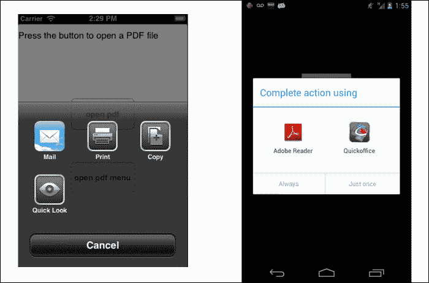

## 准备工作

该配方同时使用`CommonJS`和 Android 原生模块。这些可以从本书提供的源代码中下载，或者通过本配方末尾的*另请参阅*部分提供的链接单独下载。将这些模块安装到您的项目中很简单。只需将`openPDF.js`文件和`bencoding.android.tools`文件夹复制到您的 Titanium 项目中，如下面的截图所示：

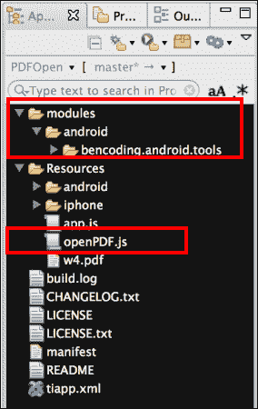

在复制模块文件夹后，您需要在 Titanium Studio 中点击您的`tiapp.xml`文件，并添加对`bencoding.android.tools`模块的引用，如下面的截图所示：

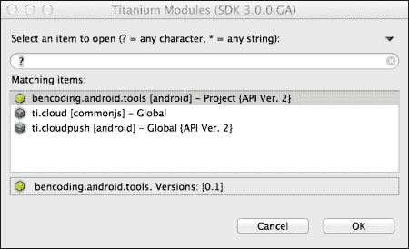

## 如何操作…

一旦您已将`openPDF.js`和原生 Android 模块添加到您的项目中，您需要创建您的应用程序命名空间，并使用`require`将模块导入到您的代码中，如下面的代码片段所示：

```js
//Create our application namespace
var my = {
  pdfOpener : require('openPDF'),
  isAndroid : (Ti.Platform.osname === 'android')
};
```

### 创建指向 PDF 文件的链接

此食谱的下一步是创建一个变量，包含我们的 PDF 文件的路径。为了示例目的，我们使用一个名为`w4.pdf`的 PDF 文件，该文件位于我们项目的`resources`目录中。以下代码片段演示了如何创建此路径变量：

```js
my.pdfFile = Ti.Filesystem.resourcesDirectory + 'w4.pdf';
```

### 创建我们的示例 UI

此食谱提供了一个基本的用户界面，以帮助说明如何使用`openPDF`模块。这个简单的屏幕包含一个按钮，该按钮打开一个对话框，提供用户可以选择以打开 PDF 文件的不同选项。如果此食谱在 iOS 设备上运行，则用户将有一个第二个按钮，演示如何在应用内部打开 PDF 文件。

1.  我们首先创建一个`Ti.UI.Window`窗口，将所有 UI 元素附加到该窗口上：

    ```js
    var win = Ti.UI.createWindow({
        exitOnClose: true, title:"Open PDF Example", backgroundColor:'#fff' 
    });
    ```

1.  接下来，我们添加一个标签，指示用户按下哪个按钮：

    ```js
    var infoLabel = Ti.UI.createLabel({
        text:'Press the button to open a PDF file', top:10, left:10, right:10, height:40, textAlign:'center'
    });
    win.add(infoLabel);
    ```

1.  接下来，将启动我们第一个示例的按钮添加到`Ti.UI.Window`窗口中：

    ```js
    var goButton = Ti.UI.createButton({
        title: 'open pdf', height: '60dp', width: '150dp', top: '140dp'
    });
    win.add(goButton);
    ```

### 在按钮点击时打开 PDF 文件

使用`openPDF`模块的第一个示例如下面的`goButton`点击事件代码片段所示：

```js
goButton.addEventListener('click', function(e) {
```

1.  首先，调用`isSupported`方法以确定设备是否支持 PDF 文件。如果支持，则此方法将返回`true`，如果不支持，则返回`false`。

    ```js
      if(my.pdfOpener.isSupported()){
    ```

1.  接下来，将我们的 PDF 文件的文件路径提供给`open`方法。然后，将向用户展示一个`options`对话框，询问他们希望如何查看文件：

    ```js
        my.pdfOpener.open(my.pdfFile);
      }else{
    ```

1.  如果`isSupported`方法返回`false`，则可以调用`isSupportedDetail`方法以获取更多关于为什么无法显示 PDF 文件的信息。如下面的代码片段所示，可以使用`isSupportedDetail`方法返回的`reason`属性来提醒用户具体问题。您还可以使用`code`属性来创建自己的自定义消息。

    ```js
        alert(my.pdfOpener.isSupportedDetail().reason);
      }
    });
    ```

### 在你的 iOS 应用中打开 PDF 文件

iOS 平台内置了对 PDF 文件的支持。`openPDF`模块利用这个平台，在您的应用中提供创建 PDF 对话框查看器的功能，如下面的截图所示：

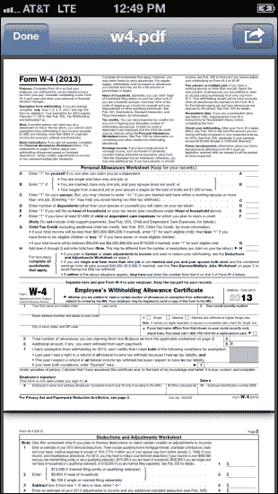

1.  在本节中，进行了一次检查以确保食谱在 iOS 设备上运行。如果是这样，则将按钮`goButton2`添加到我们的`Ti.UI.Window`窗口中：

    ```js
    if(!my.isAndroid){
        var goButton2 = Ti.UI.createButton({
        title: 'open pdf menu', height: 60, width: 150d, bottom: 140
      });
      win.add(goButton2);
    ```

1.  `goButton2`点击事件演示了如何在对话框窗口中打开 PDF 文件：

    ```js
      goButton2.addEventListener('click', function(e) {
    ```

1.  接下来，调用`isSupported`方法以验证设备是否可以读取 PDF 文件：

    ```js
        if(!my.pdfOpener.isSupported()){
    ```

1.  如果设备不支持显示 PDF 文件，则调用`isSupportDetail`方法以返回无法显示 PDF 文件的原因：

    ```js
          alert(my.pdfOpener.isSupportedDetail().reason);
          return;
        }
    ```

1.  最后，调用`openDialog`方法以显示 PDF 文件。`openDialog`方法需要两个参数。第一个是要显示的 PDF 文件的路径。第二个是一个包含一个 UI 对象的配置对象，该对象指定了查看器应显示的视图相对位置。在以下示例中，我们提供之前创建的`infoLabel`标签作为我们的`view`对象：

    ```js
        my.pdfOpener.openDialog(my.pdfFile,
          {view:infoLabel, animated:true}
        );
      });
    }
    ```

    ### 小贴士

    可以向配置对象添加其他元素，例如 `animated` 属性，以确定在打开和关闭 PDF 文件时是否应该应用动画。

要程序化地关闭 PDF 对话框，请使用 `closeDialog` 方法，如下面的代码片段所示：

```js
my.pdfOpener.closeDialog();
```

### 关闭窗口时的文件清理

`openPDF` 模块创建缓存对象和临时文件以协助显示过程。当不再需要 PDF 操作时，调用 `dispose` 方法很重要：

```js
win.addEventListener('close', function(e) {
  my.pdfOpener.dispose();
});
```

### 小贴士

如果您在 iOS 上使用 `openDialog` 选项，调用 `dispose` 也会关闭 PDF 对话框。

## 另请参阅

要了解更多关于本食谱中使用的库和框架的信息，请访问以下链接：

+   **iOS DocumentViewer**：`openPDF` 模块使用 `Ti.UI.iOS.DocumentViewer` 对象在 iOS 平台上处理 PDF 文件。有关更多详细信息，请查阅 Titanium 的在线文档 [`docs.appcelerator.com`](http://docs.appcelerator.com)。

+   **与 Android Intent 一起工作**：`openPDF` 模块使用 `Ti.Android.intent` 对象在用户设备上启动 PDF 查看器。有关使用 `Ti.Android.intent` 的更多信息，请访问此 Appcelerator 博客文章 [`developer.appcelerator.com/blog/2011/09/sharing-project-assets-with-android-intents.html`](http://developer.appcelerator.com/blog/2011/09/sharing-project-assets-with-android-intents.html)。

+   **Android Intent 支持**：`openPDF` 库使用 `bencoding.android.tools` 模块的项目来检查用户设备上是否有可用的意图来打开 PDF 文档。要了解更多关于这个项目的信息，请访问 [`github.com/benbahrenburg/benCoding.Android.Tools`](https://github.com/benbahrenburg/benCoding.Android.Tools)。

# 使用 iPad 进行文档签名

平板和其他触摸设备为处理文档提供了一个自然沉浸式环境。通过使用几个开源模块和我们的示例 PDF，本食谱说明了如何为您的组织创建一个文档签名应用程序。

以下截图展示了本食谱在 iPad 上的运行情况：

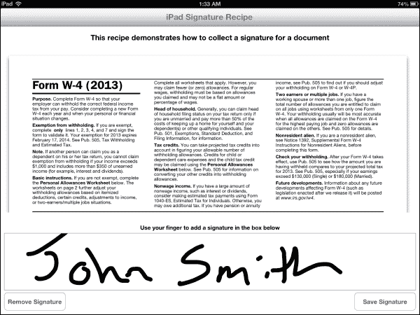

### 小贴士

本食谱仅适用于 iPad。

## 准备就绪

本食谱使用 `CommonJS` 和本地模块。这些模块可以从本书提供的源代码中下载，或者通过本食谱末尾的 *另请参阅* 部分的链接单独下载。安装过程简单，只需复制几个文件夹和文件。只需将 `library.js` 文件和 `modules` 文件夹复制到您的 Titanium 项目中，如下面的截图所示：

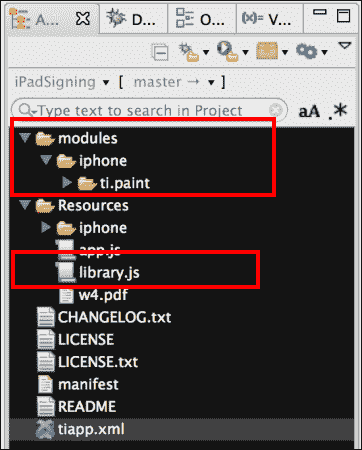

在复制 `modules` 文件夹后，您需要在 Titanium Studio 中点击您的 `tiapp.xml` 文件，并添加对 `ti.paint` 模块的引用，如下面的截图所示：

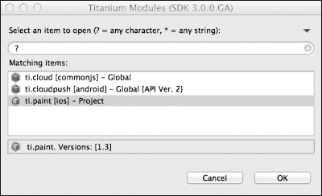

## 如何操作…

一旦您已将`library.js`和原生模块添加到项目中，您需要创建应用程序命名空间，并使用`require`将模块导入到`app.js`文件中，如下代码片段所示：

```js
//Create our application namespace
var my = {
  paint : require('ti.paint'),
  library : require('library')
};
```

### 创建菜谱窗口

以下代码片段演示了如何创建一个`Ti.UI.Window`窗口来容纳此菜谱中使用的所有控件：

```js
  var win = Ti.UI.createWindow({
    title:"iPad Signature Recipe", backgroundColor:'#fff' 
  });
```

### 添加文档视图

添加到`Ti.UI.Window`的第一个 UI 元素用于显示菜谱的文档。在 iOS 上，`Ti.UI.WebView`对象内置了对显示 PDF 文件的支持。此示例演示了如何从 Titanium 项目的`Resources`文件夹中加载单个 PDF 文档。

```js
  var docView = Ti.UI.createWebView({
    top:60, bottom:250, left:10, right:20, url:'w4.pdf'
  });
  win.add(docView);
```

### 添加签名视图

接下来添加到`Ti.UI.Window`窗口的下一个 UI 元素是`PaintView`。这个`UIView`是在设置过程中添加的`Ti.Paint`模块提供的。此视图允许用户通过触摸在屏幕上绘制。以下代码片段演示了如何设置此视图，以便用户可以使用黑色色调和 10 点的笔触大小进行绘制：

```js
  var vwSign = my.paint.createPaintView({
      bottom:60, left:10, right:10, height:140, strokeColor:'#000', strokeAlpha:255, strokeWidth:10, eraseMode:false, borderColor:'#999'
  });
  win.add(vwSign);
```

### 添加按钮

下一步是创建用于保存或清除签名的按钮。`bClear`按钮被添加到屏幕的左下角。此按钮将提供用户清除签名区域的能力。此按钮还可以用于删除已保存的签名。

```js
  var bClear = Ti.UI.createButton({
      title:'Remove Signature', left:10, bottom:10, width:150, height:45
  });
  win.add(bClear);
```

当点击`bClear`按钮的事件被触发时，签名将被清除，并且任何已保存的签名文件都将被移除：

```js
  bClear.addEventListener('click',function(e){
```

1.  在`vwSign`上调用`clear`方法。这将移除`PaintView`中的所有内容。

    ```js
        vwSign.clear();
    ```

1.  接下来，在库`CommonJS`模块上调用`deleteSignature`方法。这将移除存储的签名图像。

    ```js
        my.library.deleteSignature();
    ```

1.  然后，`vwSign`启用触摸功能，并通知用户他们的签名已被移除。完成此操作后，用户将能够创建新的文档签名。

    ```js
        vwSign.touchEnabled = true;
        alert("Signature has been reset.");
      });
    ```

1.  接下来，将`bSave`按钮添加到 iPad 屏幕的右下角。此按钮允许用户保存签名的副本以供以后使用。

    ```js
      var bSave = Ti.UI.createButton({
        title:'Save Signature', right:10, bottom:10, width:150, height:45
      });
      win.add(bSave);
    ```

1.  当点击`bSave`按钮的事件被触发时，用户的签名图像将被保存到设备上的一个库文件夹中。

    ```js
      bSave.addEventListener('click',function(e){
    ```

执行以下步骤以完成保存过程：

1.  将签名视图的内容转换为图像 blob。然后，将此 blob 提供给库`CommonJS`模块的`saveSignature`方法，以便将其持久保存到设备的文档文件夹中。

    ```js
        my.library.saveSignature(vwSign.toImage());
    ```

1.  一旦签名图像已保存到磁盘，签名表面将被设置为只读，因此无法执行任何额外的更新：

    ```js
        vwSign.touchEnabled = false;
        alert("You have successfully signed this document.");
      });
    ```

### 重新加载已保存的签名

本菜谱的最后一部分描述了在打开窗口时，如何检查文档是否已签名并加载存储的签名以供显示。

```js
  win.addEventListener('open',function(e){
```

首先在`library`模块上调用`isSigned`方法。此方法将检查签名文件是否存在于设备的`library`文件夹中。

```js
    if(my.library.isSigned()){
```

`signatureUrl`方法用于向视图提供签名的图像路径以供显示：

```js
      vwSign.image = my.library.signatureUrl();
```

由于文档已经被签署，因此签名视图随后被禁用，因此在没有清除现有签名的情况下无法进行任何额外的更新。

```js
      vwSign.touchEnabled = false;
    }
  });

  win.open({modal:true});
```

## 相关内容

+   这个食谱使用了 `Ti.Paint` 开源模块。在这个食谱中，`Ti.Paint` 模块被用来为用户提供签署文档的能力。要了解更多关于这个项目的信息，请访问 [`github.com/appcelerator/titanium_modules/tree/master/paint/mobile/ios`](https://github.com/appcelerator/titanium_modules/tree/master/paint/mobile/ios)。

# 从图像或屏幕截图创建 PDF 文档

移动设备是 PDF 文档的绝佳消费者。但是，创建它们怎么办？许多场景，例如发布食谱或发票，需要设备创建 PDF 文件。实现这一目标的一个简单方法是将图像转换为 PDF 文件。这种方法与 Titanium 强大的图像创建和维护功能配合得很好。

这个食谱演示了如何将 `Ti.UI.View` 转换为 PDF 文档。还演示了如何使用 Titanium 的 `Ti.Media.takeScreenshot` API 将应用程序的全屏图像转换为 PDF 文件。这可能对希望“打印”屏幕的消费者有所帮助。

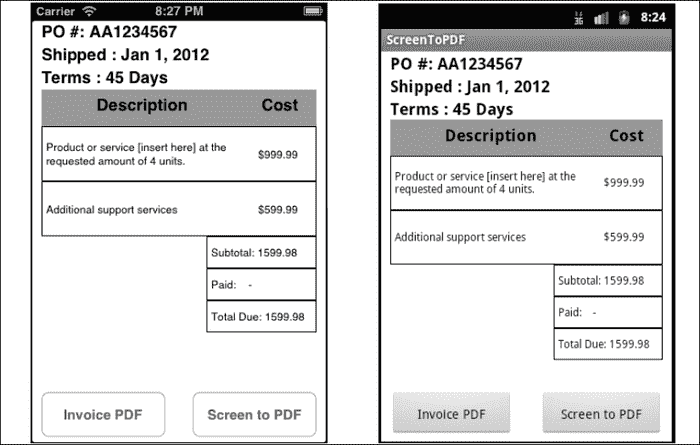

## 准备就绪

这个食谱利用了 `bencoding.pdf` 原生模块。这个模块及其支持源代码可以从本书提供的源代码中下载，或者通过本食谱末尾的 *相关内容* 部分的链接单独下载。这个食谱的安装过程很简单，只需将两个 `bencoding.pdf` 文件夹复制到相应的 `modules` 文件夹中，如本节末尾的截图所示。如果你的 Titanium 项目当前没有 `modules` 文件夹，你可以简单地将这个食谱中的完整 `modules` 文件夹复制到你的项目中。除了这两个原生模块，你还需要复制 `sampleUI.js` 文件，如下面的截图所示：

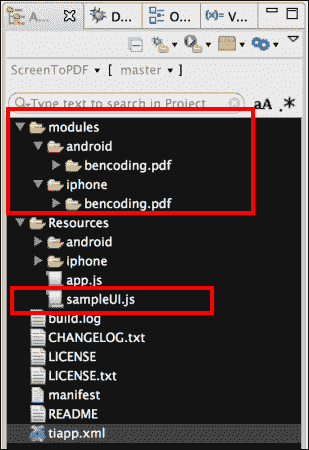

在复制 `modules` 文件夹后，你需要在 Titanium Studio 中点击你的 `tiapp.xml` 文件，并添加对 `bencoding.pdf` 模块的引用，如下面的截图所示。请注意，对于 `bencoding.pdf`，将只出现一个模块条目，但一旦选择，iOS 和 Android 都将被添加到你的 `tiapp.xml` 文件中。

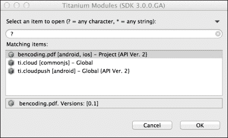

## 如何操作...

一旦你将 `sampleUI.js` 文件和原生模块添加到你的项目中，你需要在 `app.js` 文件中创建你的应用程序命名空间，并使用 `require` 将模块导入到你的代码中，如下面的代码片段所示：

```js
//Create our application namespace
var my = {
    PDF : require('bencoding.pdf'),sampleUI : require('sampleUI'),isAndroid : Ti.Platform.osname === 'android'
};
```

### 为食谱创建 UI

现在，我们创建一个 `Ti.UI.Window` 窗口来承载食谱的 UI 元素：

```js
var win = Ti.UI.createWindow({
  title:'PDF Screenshot', backgroundColor:'#fff'
});
```

一旦创建了`Ti.UI.Window`，样本发票的内容由我们的`sampleUI`模块提供。`sampleUI`模块使用几个`Ti.UI.View`和`Ti.UI.Label`控件来生成样本发票布局。

```js
var vwContent = my.sampleUI.fetchInvoiceUI();
win.add(vwContent);
```

### 从视图创建 PDF

接下来，将`makeImageButton`按钮添加到菜谱的`Ti.UI.Window`中。此按钮将稍后用于创建 PDF 样本发票。

```js
var makeImageButton = Ti.UI.createButton({
    title:'Invoice PDF', bottom:5, left:10, width:135, height:50	
});
win.add(makeImageButton);
```

当`makeImageButton`按钮的点击事件被触发时，将生成一个包含`Ti.UI.View`内容的 PDF。

```js
makeImageButton.addEventListener('click',function(e){
```

1.  生成 PDF 的第一步是从包含发票布局的`Ti.UI.View`创建一个图像。以下代码片段演示了如何在 iOS 和 Android 上完成此操作：

    ```js
      var image = ((my.isAndroid)? vwContent.toImage().media : vwContent.toImage());
    ```

1.  然后，将发票`Ti.UI.View`的图像 blob 提供给`PDF Converters`模块中的`convertImageToPDF`方法。此方法将提供的图像转换为 PDF `Ti.File` blob。除了 iOS 上的图像外，您还可以提供用于转换过程的分辨率。以下示例使用分辨率为 100：

    ```js
      var pdfBlob = my.PDF.createConverters().convertImageToPDF(image,100);
    ```

1.  然后，可以使用标准`Ti.FileSystem`方法将发票 PDF `Ti.File` blob 保存，如下所示：

    ```js
      var pdfFile = Ti.Filesystem.getFile(Ti.Filesystem.applicationDataDirectory, 'invoice.pdf'
      );
      pdfFile.write(pdfBlob);
    });
    ```

### 从截图创建 PDF 文档

可以使用类似的技术来创建包含应用截图的 PDF 文档。执行此操作的第一步是在菜谱的`Ti.UI.Window`中添加一个名为`ssButton`的按钮：

```js
var ssButton = Ti.UI.createButton({
    title:'Screen to PDF', bottom:5, right:10, width:135, height:50
});
win.add(ssButton);
```

当我们点击`ssButton`按钮时，将进行截图并将其转换为 PDF 文件：

```js
ssButton.addEventListener('click',function(e){
```

此过程的第一步是使用`Ti.Media.takeScreenshot` API 对应用进行截图：

```js
  Ti.Media.takeScreenshot(function(event){
```

截图 API 返回设备屏幕的图像 blob：

```js
    var image = event.media;
```

然后，将截图图像 blob 提供给`PDF Converters`模块中的`convertImageToPDF`方法。此方法将提供的图像转换为 PDF `Ti.File` blob。除了 iOS 上的图像外，您还可以提供用于转换过程的分辨率。此示例使用分辨率为 96 点：

```js
    var pdfBlob = my.PDF.createConverters().convertImageToPDF(image,96);
```

然后，可以使用标准`Ti.FileSystem`方法将截图 PDF `Ti.File` blob 保存：

```js
    var pdfFile = Ti.Filesystem.getFile(
      Ti.Filesystem.applicationDataDirectory, 'screenshot.pdf'
);
    pdfFile.write(pdfBlob);
  });
});
```

## 参见

+   要了解更多关于此菜谱中使用的模块的信息，请访问[`github.com/benbahrenburg/benCoding.PDF`](https://github.com/benbahrenburg/benCoding.PDF)。

# 使用 jsPDF 生成 PDF 文档

在移动设备上创建格式化的 PDF 文档可能很困难。将跨平台添加到等式中只会使这一挑战更加复杂。jsPDF JavaScript 库及其相关的 jsPDF Titanium 模块提供了一种强大且纯 JavaScript 的跨平台方法。

此菜谱演示了如何使用强大的 JavaScript API 创建格式化的 PDF 文档，类似于以下截图：

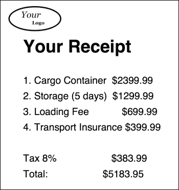

## 准备工作

这个菜谱使用 Titanium 的`jsPDF`模块来创建 PDF 文件。此模块及其支持源代码可以从本书提供的源代码中下载，或者通过此菜谱末尾的“也见”部分提供的链接单独下载。此菜谱的安装过程简单直接，只需将`jsPDFMod`文件夹复制到您的 Titanium 项目的`Resources`文件夹中，如下截图所示：

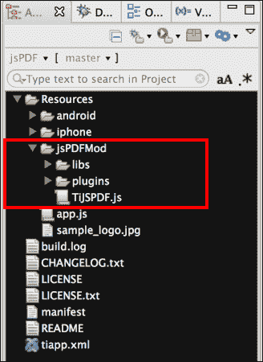

## 如何做…

将`jsPDFMod`文件夹添加到您的项目后，您需要在`app.js`文件中创建您的应用程序命名空间，并使用`require`将模块导入到您的代码中，如下面的代码片段所示：

```js
//Create our application namespace
var my = {
    jsPDF : require('./jsPDFMod/TiJSPDF'),isAndroid : Ti.Platform.osname === 'android'
};
```

### 创建菜谱的 UI

此菜谱包含一个基本的用户界面，允许用户生成菜谱 PDF 并打开电子邮件对话框。

1.  创建一个`Ti.UI.Window`窗口来容纳所有 UI 控件：

    ```js
        var win = Ti.UI.createWindow({
            backgroundColor: '#eee', title: 'jsPDF Sample',layout:'vertical'
        });
    ```

1.  接下来，将`goButton`按钮添加到菜谱的`Ti.UI.Window`中：

    ```js
        var goButton = Ti.UI.createButton({
          height: '50dp', title: 'Email a receipt', left:'20dp', right:'20dp', top:'40dp'
        });
        win.add(goButton);
    ```

1.  `goButton`按钮的点击事件通过调用`generatePDFExample`方法启动 PDF 创建过程：

    ```js
        goButton.addEventListener('click', function (e) {
          generatePDFExample();
        });
    ```

### 使用 jsPDF 创建 PDF 文档

下面的代码片段描述了如何使用`generatePDFExample`通过`jsPDF`模块创建 PDF 文档：

```js
    function generatePDFExample(){
```

下一行演示了如何创建`jsPDF`模块的新实例。这创建了一个新的虚拟 PDF 文档。

```js
        var doc = new my.jsPDF();
```

下面的代码片段演示了如何向 PDF 文档对象添加文档属性：

```js
        doc.setProperties({
            title: 'Title', subject: 'This is the subject', author: 'add author', keywords: 'one, two, three', creator: 'your organization'
        });
```

下面的代码片段演示了如何将图像嵌入到 PDF 文档中。重要的是图像必须包含完整的本地路径，如所示，否则在保存时文档将生成错误：

```js
        var imgSample1 = Ti.Filesystem.resourcesDirectory + 'sample_logo.jpg';
        doc.addImage(imgSample1, 'JPEG', 10, 20, 35, 17);
```

我们然后使用`Helvetica`粗体和字体大小`32`创建一个标题：

```js
        doc.setFont("helvetica");
        doc.setFontType("bold");
        doc.setFontSize(32);
        doc.text(20, 50, 'Your Receipt);
```

下面的代码片段使用`normal`字体和大小`18`创建了一个项目符号菜谱部分：

```js
        doc.setFontType("normal");
        doc.setFontSize(18);
        doc.text(20, 70, '1\. Cargo Container $2399.99');
        doc.text(20, 80, '2\. Storage (5 days) $1299.99');
        doc.text(20, 90, '3\. Loading Fee $699.99');
        doc.text(20, 100, '4\. Transport Insurance $399.99');
```

创建一个指向我们希望保存`recipe.pdf`的位置的`Ti.File`对象：

```js
        var myFile = Ti.Filesystem.getFile(Ti.Filesystem.applicationDataDirectory,'recipe.pdf');
```

然后将`Ti.File`对象传递给`jsPDF`模块的`save`方法。`save`方法将生成一个具有先前创建的属性的 PDF 文件：

```js
        doc.save(myFile);
```

将保存的 PDF 文件的`Ti.File`引用作为附件提供给`Ti.UI.EmailDialog`并打开，以便用户可以编写电子邮件：

```js
        var emailDialog = Ti.UI.createEmailDialog();
        emailDialog.addAttachment(myFile);
        emailDialog.open();
      };
```

## 也见

+   要了解更多关于 James Hall 创建的 jsPDF 项目的信息，请访问 GitHub 仓库[`github.com/MrRio/jsPDF`](https://github.com/MrRio/jsPDF)。

+   此菜谱使用 Titanium 的 jsPDF 模块。有关模块的附加文档、示例和指南，请参阅以下链接：

    作者：Malcolm Hollingsworth

    仓库：[`github.com/Core-13`](https://github.com/Core-13)

    赞助组织：Core13；网站：[core13.co.uk](http://core13.co.uk)

# 使用 RGraph 创建调度图

一图胜千言，在当今快节奏的商业环境中，使用图形来显示信息可以是一个竞争优势。本菜谱演示了您如何使用流行的 RGraph JavaScript 库创建反映项目调度的图表。以下截图显示了完成此菜谱后的样子：

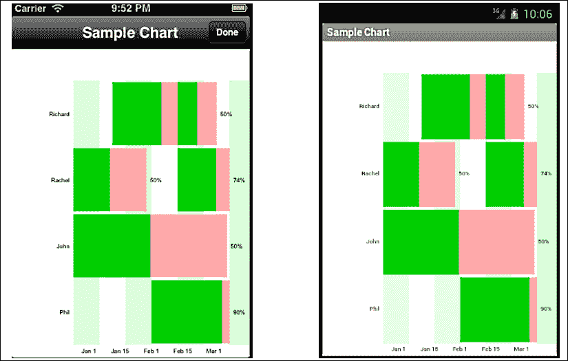

## 准备工作

本菜谱使用 RGraph 和几个非原生组件来显示图表。这些组件可以从本书提供的源代码中下载，或者通过本菜谱末尾的“也见”部分提供的链接单独下载。

设置此菜谱的第一步是将以下截图中的`web`文件夹（突出显示）复制到项目文件夹的`Resources`文件夹中。在复制`web`文件夹后，您需要将`teamBuilder.js`、`chartLauncher.js`、`sampleUI.js`和`scheduleBuilder.js`文件复制到 Titanium 项目的`Resources`文件夹中，如下截图所示：

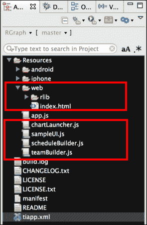

## 如何操作…

在前面讨论的添加`web`文件夹和 CommonJS 模块之后，您需要在`app.js`文件中创建您的应用程序命名空间，并使用`require`将模块导入到您的代码中，如下面的代码片段所示：

```js
//Create our application namespace
var my = {
    schedule : require('scheduleBuilder'),team : require('teamBuilder'),chartDisplay : require('chartLauncher'),sampleUI : require('sampleUI')
};
```

### 为菜谱创建 UI

本菜谱的下一步是创建主`Ti.UI.Window`窗口。此`Ti.UI.Window`将用于启动菜谱的功能。

```js
var win = Ti.UI.createWindow({
  backgroundColor: '#fff', title: 'RGraph Sample'
});
```

在创建`Ti.UI.Window`窗口后，我们在`sampleUI`模块上调用`fetchDemoView`方法。这向用户显示菜谱的说明：

```js
win.add(my.sampleUI.fetchDemoView());
```

### 创建调度和分配任务

本部分菜谱演示了如何创建调度，并将任务分配给项目中的个人。

1.  第一步是为团队成员创建一个调度。这是通过创建一个新的调度对象并提供个人的名字来完成的。以下行演示了如何为理查德创建一个调度：

    ```js
    var richard = new my.schedule('Richard');
    ```

1.  接下来，使用`createTask`方法为个人创建一个任务。

    ```js
    richard.addTask({
        taskName:'Website',startDay:15,
        duration:28,percentageComplete:67,
        comment:'Work on website'
    });
    richard.addTask({
        taskName:'Fix Web Servers',startDay:40,
        duration:15,percentageComplete:50,
        comment:'Work with vendor'
    });
    ```

    `createTask`方法有以下参数：

    +   **任务名称**: 包含任务名称的字符串

    +   **开始于某天**: 这是任务开始的位置（天）

    +   **持续时间**: 任务所需的天数

    +   **完成百分比**: 任务的完成百分比

    +   **注释**: 任务的注释

1.  最后，将团队成员的调度添加到团队中：

    ```js
    my.team.add(richard);
    ```

下面的代码片段演示了如何执行前面讨论的步骤，为另一位团队成员：

```js
var rachel = new my.schedule('Rachel');
rachel.addTask({
    taskName:'Mock-up',startDay:0, 
    duration:28, percentageComplete:50,
    comment:'Create initial product mock-ups'
});
rachel.addTask({
    taskName:'Mobile Images',startDay:40,
    duration:25, percentageComplete:74,
    comment:'Create mobile assets'
});
my.team.add(rachel);
```

### 提示

您可以通过以下详细说明的模式添加额外的个人。

### 启动示例

执行以下步骤以启动我们在上一节中创建的示例：

1.  第一步是将`goButton`按钮添加到`Ti.UI.Window`窗口中，以便用户可以启动图表示例：

    ```js
    var goButton = Ti.UI.createButton({
        title:'View schedule', bottom:'40dp',left:'25dp',right:'25dp', width:Ti.UI.FILL, height:'60dp'
    });
    win.add(goButton);
    ```

1.  `goButton` 按钮的点击事件通过在 `chartLauncher` 模块上使用 `openDialog` 方法启动图表示例。`openDialog` 方法使用之前创建的 `my.team` 对象生成包含团队预定的甘特图。

    ```js
        goButton.addEventListener('click',function(e){
    ```

    在以下片段中展示了调用 `openDialog` 方法：

    ```js
          my.chartDisplay.openDialog(my.team);
        });
    ```

## 工作原理…

`chartLauncher` 模块（`chartLauncher.js`）用于显示团队的预定任务。以下行展示了该模块如何使用 RGraph 创建包含结果的甘特图。首先，将 `openDialog` 方法添加到 `exports` 对象中：

```js
exports.openDialog = function(team){
```

此食谱本部分的下一步是创建一个窗口以向用户显示：

```js
  var win = Ti.UI.createWindow({
      backgroundColor: '#fff', title: 'Sample Chart',barColor:'#000'
  });
```

在创建 `Ti.UI.Window` 之后，附加一个 `Ti.UI.WebView` 对象。RGraph 图表信息包含在 `Ti.UI.WebView` 显示的 `index.html` 文件中：

```js
  var webView = Ti.UI.createWebView({
    height:Ti.UI.FILL, width:Ti.UI.FILL, url:'web/index.html'
  });
  win.add(webView)
```

在 `Ti.UI.Window` 打开事件中，将团队的预定信息传递到包含 RGraph 方法的 `index.html` 文件中：

```js
  win.addEventListener('open',function(e){
```

在团队对象上调用 `createSchedules` 和 `createComments` 方法。这些方法格式化预定和评论信息，以便 RGraph 可以显示详细信息。

```js
    var schedules = JSON.stringify(team.createSchedule());
    var comments = JSON.stringify(team.createComments());
```

在 `Ti.UI.Window` 窗口打开后，向 `Ti.UI.WebView` 添加一个加载事件监听器。这允许在注入信息之前，`Ti.UI.WebView` 的内容完全加载。

```js
    webView.addEventListener('load',function(x){
```

使用 `evalJS` 方法将格式化的团队信息传递到当前在 `Ti.UI.WebView` 中显示的 `addGraph` 方法。您可以通过打开此食谱支持的 `index.html` 文件来查看 `addGraph` 方法的具体内容。

```js
      webView.evalJS('addGraph(' + schedules + ',' + comments  + ')');
    });
    win.open({modal:true});
  };
```

## 参见

+   此食谱使用强大的 RGraph HTML5/JavaScript canvas 库来创建显示的甘特图。我鼓励您访问他们的网站 [`rgraph.net`](https://rgraph.net)，了解更多关于 RGraph 和提供的不同图表选项。

# 使用 Google 仪表显示信息

仪表是显示速度、状态或简单测量的强大方式。此食谱演示了如何使用 Google 仪表图表控件来显示达成月销售目标的进度。以下截图显示了此完成的食谱在 iOS 和 Android 上的运行情况：

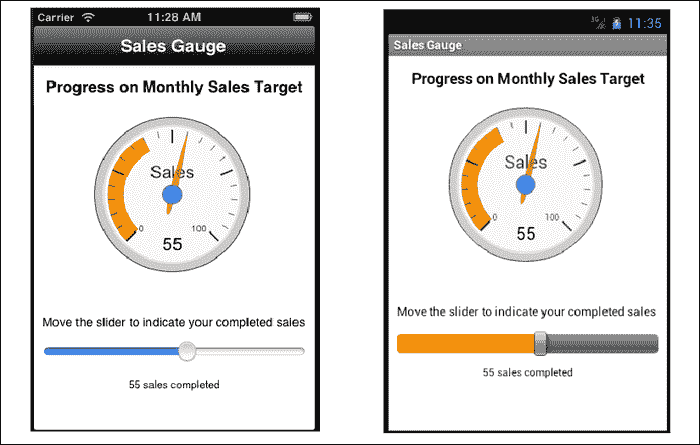

### 提示

在 Android 上运行此食谱时，请注意需要 Android 4.0 或更高版本。

## 准备工作

此菜谱使用 Google Charts 来显示仪表盘。当将此菜谱添加到您的应用程序时，您需要设计网络依赖项，因为 Google Charts 需要连接来渲染图表信息。这些组件可以从本书提供的源代码中下载，或者通过此菜谱末尾的 *另请参阅* 部分的链接单独下载。设置此菜谱的第一步是将以下截图中的 `web` 文件夹复制到您的项目文件夹的 `Resources` 文件夹中。在复制 `web` 文件夹后，您需要将 `persist.js` 文件复制到您的 Titanium 项目的 `Resources` 文件夹中，如下截图所示：

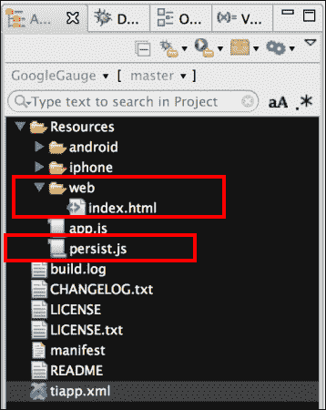

## 如何操作…

在上一节中讨论的将 `web` 文件夹和 `persist.js` CommonJS 模块添加到应用程序后，您需要创建您的应用程序命名空间，并使用 `require` 将模块导入到您的代码中，如下代码片段所示：

```js
//Create our application namespace
var my = {
  persist : require('persist'),
  session:{},
  isAndroid : Ti.Platform.osname === 'android'
};
```

### 加载已保存的销售信息

在创建我们的命名空间后，第一步是加载我们保存的销售信息。如果没有保存之前的数据，将提供一个默认值 10。

```js
my.session.sales = my.persist.load();
```

### 为菜谱创建 UI

现在我们创建 UI 来显示我们的销售数据。

1.  首先，创建一个 `Ti.UI.Window` 窗口来承载所有我们的 UI 元素：

    ```js
    var win = Ti.UI.createWindow({
        backgroundColor: '#fff', title: 'Sales Gauge', barColor:'#000', layout:'vertical',fullscreen:false
    });
    ```

1.  接下来，创建一个 `Ti.UI.WebView` 来显示 Google 仪表盘。此 `Ti.UI.WebView` 用于显示一个本地 html 页面，该页面承载 Google Chart 控件。以下代码片段演示了如何从项目的 `web` 文件夹中加载本地 html 页面（`index.html`）：

    ```js
    var webView = Ti.UI.createWebView({
      top:10, height:200, width:200, url:'web/index.html'
    });
    win.add(webView)
    ```

1.  最后，将一个 `Ti.UI.Slider` 添加到菜谱的 `Ti.UI.Window` 中。用户可以使用这个滑块来调整他们的月度销售。

    ```js
    var slider = Ti.UI.createSlider({
        min:0, max:100, value:my.session.sales, left:10, right:10, height:'30dp', top:10
    });
    win.add(slider);
    ```

### 调整销售

当用户调整 `Ti.UI.Slider` 时，以下方法被用来使用新的销售数字更新 Google 仪表盘。`updateSales` 方法使用新的销售数字更新 `Ti.UI.WebView` 的内容：

```js
function updateSales(sales){
```

传入的 `sales` 值被放置到会话的 `my.session.sales` 属性中，以供后续使用：

```js
  my.session.sales = sales;
```

在 `Ti.UI.WebView` 上调用 `evalJS` 方法，以将新的销售信息提供给示例 `index.html` 文件中包含的 `updateGauge` 方法。此方法用于更新 Google 仪表盘。有关更多详细信息，请参阅此菜谱的 `index.html` 文件内容。

```js
  webView.evalJS('updateGauge(' + my.session.sales + ')');
```

在更新 `Ti.UI.WebView` 后，新的销售值被保存到 `Ti.App.Properties` 中以供后续使用：

```js
  my.persist.save(my.session.sales);
};
```

菜谱的 `Ti.UI.Slider` 方法上的更改事件在用户移动滑块时调整 Google 仪表盘：

```js
  slider.addEventListener('change',function(e){
```

每当触发更改事件时，新的 `Ti.UI.Slider` 值会被提供给 `updateSales` 方法，以便在菜谱的 `Ti.Ui.WebView` 中反映出来。

```js
  updateSales(Math.round(e.value));
});
```

### 重新加载已保存的销售信息

每次加载 `Ti.Ui.Window` 时，以下代码用于显示保存的销售值并初始化 Google 仪表。下一个片段演示了如何在打开 `Ti.UI.Window` 时重新加载销售信息：

```js
win.addEventListener('open',function(e){
```

首先，执行网络连接。由于这个食谱使用 Google Charts，显示这些信息需要网络连接：

```js
  if(!Ti.Network.online){
    alert('Network connection required.');
    return;
  }
```

最后，向 `Ti.UI.WebView` 添加一个加载事件监听器。一旦加载完成，`updateSales` 函数被调用以初始化任何之前保存的销售信息：

```js
  webView.addEventListener('load',function(x){
    assist.updateSales(my.session.sales); 
  });
```

## 参见

+   这个食谱使用 Google Charts 来提供显示的仪表。要了解更多关于 Google 的图表工具，请访问他们的开发者网站，[`google-developers.appspot.com/chart/`](https://google-developers.appspot.com/chart/).
