# 第七章. 线程、队列和消息传递

在本章中，我们将涵盖：

+   队列多个下载

+   从一个应用启动另一个应用

+   跨平台 URL 方案

+   在 BOOT_COMPLETED 时打开您的 Android 应用

+   使用 Web Workers 进行 iOS 多线程

# 简介

大小、复杂性和体积是开发和维护企业应用时常见的问题。Titanium 提供了对几种常见模式的支持，用于分离操作责任模式。

本章讨论了如何在 Titanium 中使用消息传递、队列和多线程功能。然后可以使用这些分步菜谱将这些设计原则融入现有的 Titanium 企业应用中。

# 队列多个下载

对于企业应用来说，需要从组织的文件服务器下载文档和内容是很常见的。在这种情况下使用队列有助于确保顺序和交付，同时避免与生成多个异步请求相关的常见陷阱。此菜谱使用`Ti.Queue` CommonJS 模块来创建一个持久、命名的队列以执行文件下载。

为了演示如何实现持久队列，此菜谱将从 Github 下载 5 MB 的样本文件到您的设备。以下截图显示了此菜谱在 iPhone 和 Android 设备上运行时的样子。

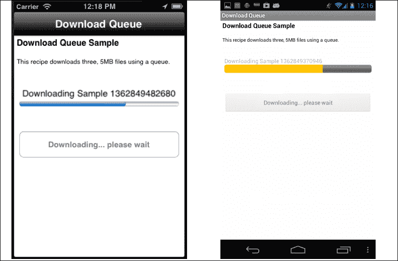

## 准备中

此菜谱使用`Ti.Queue` CommonJS 模块。此模块和其他代码资源可以从本书提供的源代码下载，或者通过此菜谱末尾的“另请参阅”部分提供的链接单独下载。将这些安装到您的项目中很简单。只需将`Ti.Queue.js`文件复制到您的项目中，如下面的截图所示：

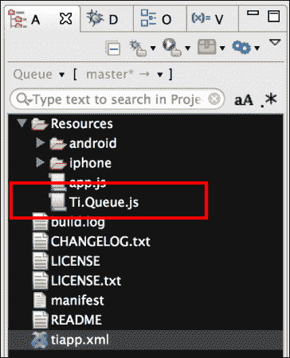

### 网络连接

此菜谱需要网络连接以从 Github 下载文件。请确保设备或模拟器有适当的网络连接性。

## 如何操作...

一旦将`Ti.Queue`模块添加到您的项目中，您需要在`app.js`文件中创建您的应用程序命名空间，并使用`require`将模块导入到您的代码中，如下面的代码片段所示：

```js
//Create our application namespace
var my = {
  qMod : require('Ti.Queue'),
  jobInfo:{total:0,completed:0}
};
```

### 创建菜谱的 UI

以下步骤概述了如何创建此菜谱中使用的 UI：

1.  首先，创建一个`Ti.UI.Window`以附加所有 UI 元素。

    ```js
    var win = Ti.UI.createWindow({
      backgroundColor: '#fff', title: 'Download Queue', 
      barColor:'#000',layout:'vertical',fullscreen:false
    });
    ```

1.  接下来，向`Ti.UI.Window`添加一个`Ti.UI.ProgressBar`。这将用于显示队列的状态。

    ```js
    var progress = Ti.UI.createProgressBar({
      top:30, height:50,min:0,max:3, value:0, left:10, 
      right:10, message:'Tap button to start download'
    });
    win.add(progress);
    ```

1.  立即调用我们的`Ti.UI.ProgressBar`的`show`方法，以确保它正确地显示在`Ti.UI.Window`上。

    ```js
    progress.show();
    ```

1.  接下来，向`Ti.UI.Window`添加一个`Ti.UI.Button`。此控件将用于触发队列下载逻辑。

    ```js
    var downloadButton = Ti.UI.createButton({
      title:'Run Download Queue', top:40,
      left:10, right:10, height:50, 
    });
    win.add(downloadButton);
    ```

### 创建队列

菜谱的下一步是创建一个命名队列，如下面的代码片段所示。默认情况下，任何命名队列都是持久的，将在会话之间存储所有作业。

```js
//Create a new version of the queue
var queue = new my.qMod("demo");
```

### 注意

如果在创建新队列时没有提供名称，则队列不会在应用程序重启之间保存任务。

### 将任务添加到队列

在创建队列之后，下一步是为队列创建一系列任务以进行管理。以下代码块为队列创建了三个下载任务。

1.  创建的第一个任务是下载来自 Github 的 ZIP 文件。使用时间戳提供唯一的名称。

    ```js
    var sample1Name = new Date().getTime();
    queue.enqueue({
      title:'Sample ' + sample1Name,
      url:"https://github.com/benbahrenburg/
      Ti.Queue/blob/master/5MB.zip",
      downloadPath:Ti.Filesystem.applicationDataDirectory + 
      sample1Name + '.zip',
      attempts:0
    });
    ```

1.  再次，创建第二个任务以从 Github 下载 ZIP 文件。使用时间戳提供唯一的名称。

    ```js
    var sample2Name = new Date().getTime();
    queue.enqueue({
      title:'Sample ' + sample2Name,
      url:"https://github.com/benbahrenburg/
      Ti.Queue/blob/master/5MB.zip",
      downloadPath:Ti.Filesystem.applicationDataDirectory + 
      sample2Name + '.zip',
      attempts:0
    });
    ```

1.  再次，创建第三个任务以从 Github 下载 ZIP 文件。使用时间戳提供唯一的名称。

    ```js
    var sample3Name = new Date().getTime();
    queue.enqueue({
      title:'Sample ' + sample3Name,
      url:"https://github.com/benbahrenburg/
      Ti.Queue/blob/master/5MB.zip",
      downloadPath:Ti.Filesystem.applicationDataDirectory + 
      sample3Name + '.zip',
      attempts:0
    });
    ```

### 菜谱的辅助函数

`assist` 对象用于管理下载过程。以下是对 `assist` 对象如何工作以及如何在您的应用程序中利用它的讨论：

```js
var assist = {
```

1.  `progressSetup` 方法用于在初始化新的下载系统时重启进度条。

    ```js
      progressSetup : function(min,max){
        progress.min = min;
        progress.max = max;
        progress.value = 0;
        progress.message = 'Starting download';
        downloadButton.title = "Downloading... please wait";
      },
    ```

1.  `updateProcess` 方法用于更新进度条信息并提醒用户整体下载任务的状态。

    ```js
      updateProgress : function(value,text){
        progress.value = value;
        progress.message = text;
      },
    ```

1.  所有 `Ti.Queue` 任务完成或生成错误后，调用 `whenFinished` 方法。此方法用于更新 UI 以提醒用户已处理队列中的任务。

    ```js
      whenFinish : function(){
        downloadButton.text = "Tap button to start download";
        alert('Finished Download');
        downloadButton.enabled = true;
      },
    ```

1.  `next` 方法用于处理 `Ti.Queue` 中的下一个任务。

    ```js
      next : function(){
    ```

1.  在 `next` 方法中的此步骤是检查是否有任何任务可用。这是通过在队列上调用 `getLength` 方法来完成的，以检索队列中当前存储的任务数量。

    ```js
        if(queue.getLength() == 0){
    ```

1.  如果队列中没有剩余的任务，则调用 `whenFinish` 方法并退出下载过程。

    ```js
          assist.updateProgress(my.jobInfo.total,
          'Download Completed');
          assist.whenFinish();
          return;
        }
    ```

1.  如果队列中有可用的任务，下一步是更新 `progressValue` 以显示当前处理状态，如下面的代码片段所示。

    ```js
        var progressValue = 
        (my.jobInfo.total - queue.getLength());
    ```

1.  下一步是调用队列上的 `peek` 方法。这允许我们获取队列中的下一个项目，而不将其从队列本身中弹出。这用于将信息写入 Titanium Studio 控制台进行调试。

    ```js
        var pkItem = queue.peek();
        Ti.API.info('Peek value: ' + JSON.stringify(pkItem));
    ```

1.  下一步是调用队列上的 `dequeue` 方法。此函数从队列中弹出下一个项目并返回该项目。在下面的代码片段中，调用 `dequeue` 方法将下一个队列任务提供给 `item` 变量。

    ```js
        var item = queue.dequeue();
    ```

1.  然后调用 `updateProgress` 方法以提醒用户下载进度。

    ```js
        assist.updateProgress(progressValue,'Downloading ' +
        item.title);
    ```

1.  接下来调用 `download` 方法以启动下载过程。为了创建递归函数，将 `next` 方法作为回调参数传递给 `download` 方法。

    ```js
        assist.download(item,assist.next);

      },
    ```

1.  `download` 方法包含从 Github 下载队列中任务所需的所有逻辑。

    ```js
      download :function(item,callback){
    ```

1.  从 Github 下载文件的第一步是创建 `Ti.Network.HTTPClient`。

    ```js
        var done = false;
        var xhr = Ti.Network.createHTTPClient();
        xhr.setTimeout(10000);
    ```

1.  当 `Ti.Network.HTTPClient` 收到成功响应时，触发 `onload` 回调。

    ```js
        xhr.onload = function(e){
          if (this.readyState == 4 && !done) {
            done=true;
    ```

1.  如果响应没有提供 `200` 状态码，则生成错误。

    ```js
            if(this.status!==200){
              throw('Invalid http reply status code:' + 
              this.status);
              return;
            }
    ```

1.  如果返回了适当的状态代码，则创建一个`Ti.Filesytem`对象，并将`responseData`保存到提供的输出路径。

    ```js
            var saveToFile =
            Ti.Filesystem.getFile(item.downloadPath);
            if(saveToFile.exists()){
              saveToFile.deleteFile();
            }
            saveToFile.write(this.responseData);
            saveToFile = null;
    ```

1.  在`responseData`被持久化到文件系统后，回调方法被触发。这允许配方递归地遍历队列。

    ```js
            callback();
          }
        };
    ```

1.  当`Ti.Network.HTTPClient`收到错误时，触发`onerror`回调。

    ```js
        xhr.onerror = function(e){
    ```

1.  当收到错误时，通过在`assist`对象上调用`requeue`方法，将提供的作业重新排队以进行另一次尝试。

    ```js
          assist.requeue(item,callback)
        };
    ```

1.  通过在`Ti.Network.HTTPClient`上调用`open`和`send`方法，并使用队列项目的`url`详细信息，开始下载进度，如下代码片段所示：

    ```js
        xhr.open('GET', item.url);
        xhr.send();
      },
    ```

1.  使用`requeue`方法将项目重新添加到队列中。该配方旨在在将工作视为永久性错误之前提供三次下载尝试。

    ```js
      requeue :function(item,callback){
        Ti.API.info('requeue is called on download fail.'); 
        Ti.API.info('Allowed to retry 3 times');
    ```

1.  该项目的`attempt`属性被检查以确定工作是否尝试了超过三次。

    ```js
        if(item.attempts > 3){
    ```

1.  如果工作尝试次数超过三次，则项目不会被重新添加到队列中。

    ```js
          Ti.API.info('Max removed from queue.')
        }else{
    ```

1.  如果工作出错次数少于三次，则增加`attempts`属性，并将项目再次添加到队列中。

    ```js
          item.attempts++; 
          queue.enqueue(item);
        }
    ```

1.  最后，触发`callback`方法，将下载过程移动到其生命周期的下一个步骤。

    ```js
        callback();
      }
    };
    ```

### 开始下载

当按下`downloadButton`时，配方开始处理队列中的工作。

```js
downloadButton.addEventListener('click',function(e){
```

1.  下载过程的第一步是检查配方是否有网络连接。如果网络不可用，配方将提醒用户退出进程。

    ```js
      if(!Ti.Network.online){
        alert('This recipe requires a network');
        return;
      }
    ```

1.  下载过程的下一步是禁用`downloadButton`。这避免了用户在作业开始后再次处理按钮。

    ```js
      downloadButton.enabled = false;
    ```

1.  然后，`my.jobInfo`对象被更新为当前的计数和状态信息。这将用于跟踪整体下载状态。

    ```js
      my.jobInfo.total = queue.getLength();
      my.jobInfo.completed = 0;
    ```

1.  接下来调用`processSetup`方法，使用正确的`min`和`max`值初始化`Ti.UI.ProgressBar`。

    ```js
      assist.progressSetup(my.jobInfo.completed,
      my.jobInfo.total);
    ```

1.  最后，在`assist`对象上调用`next`方法。这开始下载过程并创建一个递归循环，直到队列空为止。

    ```js
      assist.next();

    });
    ```

## 参见

+   要了解更多关于在此配方中使用的`Ti.Queue`模块的信息，请访问[`github.com/benbahrenburg/Ti.Queue`](https://github.com/benbahrenburg/Ti.Queue)。

# 从一个应用启动另一个应用

大多数移动企业应用都是围绕特定任务设计的，例如时间报告。通过使用 URL 方案或 Android 意图过滤器，您可以在用户的设备上打开并通信不同的应用。例如，您可以为组织的时间报告应用提供一个选项，当员工出差并需要记录额外信息时，打开费用应用。

此配方演示了如何使用原生平台的集成模式启动不同的应用。以下屏幕截图显示了该配方在 iOS 和 Android 设备上运行的情况：

。

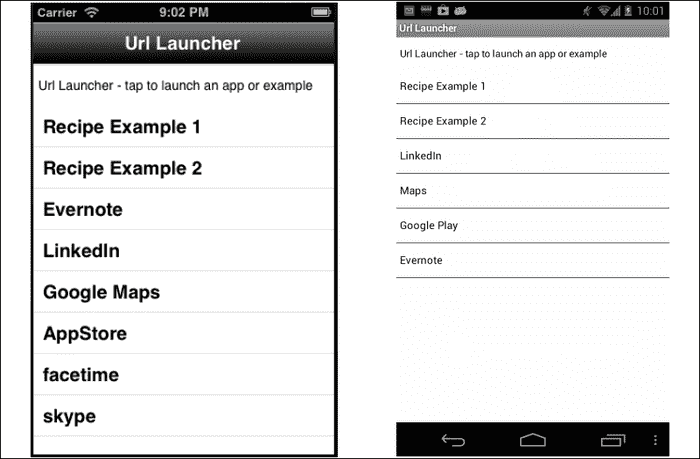

### 注意

此菜谱必须在设备上运行，才能完全体验所有功能。需要设备，因为模拟器或仿真器不允许运行来自不同应用商店的应用。

## 准备工作

此菜谱使用`schemeList` CommonJS 模块。此模块和其他代码资源可以从本书提供的源代码中下载。在项目中安装这些资源很简单。只需将`schemeList.js`文件复制到您的项目中，如下面的截图所示：

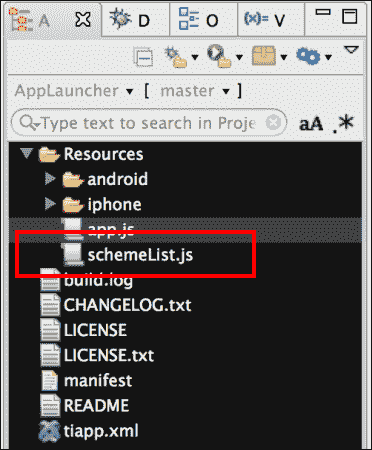

### 网络连接

此菜谱要求在您的设备上安装以下应用：

+   LinkedIn

+   Evernote

+   Google Maps（在 iOS 和 Android 上）

+   本章后面将讨论的 URL Scheme 示例

## 如何做到这一点...

在添加`schemaList`模块后，您需要在`app.js`文件中创建您的应用程序命名空间，并使用`require`将模块导入到您的代码中，如下面的代码片段所示：

```js
//Create our application namespace
var my = {
  schemes : require('schemeList'),
  isAndroid : Ti.Platform.osname === 'android'
};
```

### iOS 更新 tiapp.xml

添加允许其他 iOS 应用启动您的应用的功能很简单。以下代码片段演示了如何将名为`bencoding-linkLauncher`的自定义方案添加到此菜谱中。这允许任何 iOS 应用以类似的方式启动此示例，正如本菜谱后面所讨论的。

```js
<ios>
  <plist>
    <dict>
```

`CFBundleURLlTypes`节点是一个字典数组，描述了该包支持的 URL 方案。在此节点下，您将列出您的应用将响应的所有 URL 和方案名称。

```js
    <key>CFBundleURLTypes </key>
    <array>
      <dict>
```

`CFBundleURLName`是包含此 URL 类型抽象名称的键。这是引用特定类型的主要方式。为确保唯一性，建议您使用 Java 包风格的标识符。

```js
        <key>CFBundleURLName </key>
        <string>bencoding-linkLauncher</string>
```

`CFBundleURLSchemes`是包含字符串数组的键，每个字符串都标识由该类型处理的 URL 方案。

```js
        <key>CFBundleURLSchemes</key>
        <array>
          <string>bencoding-linkLauncher</string>
        </array>
      </dict>
     </array>
   </dict>
  /plist>
</ios>
```

### 创建应用启动列表

`schemeList` CommonJS 模块，添加到`my.scheme`属性中，提供了 iOS 和 Android 方案示例列表。以下几节将描述如何在两个平台上创建方案。

#### iOS 方案列表

在 iOS 上，URL 方案就像网页上的 URL 一样工作。唯一的区别是应用注册的 URL 方案用作协议。以下步骤提供了具体 URL 格式的详细示例。

1.  `getiOSList`提供了一个对象数组，设计用于绑定到`Ti.UI.TableView`，并随后用于启动其他应用。

    ```js
    exports.getiOSList = function(){
      var apps =[];
    ```

1.  最基本的 URL 方案类型仅仅是应用的`CFBundleURLName`。以下示例展示了 Evernote 和 LinkedIn 的此属性。

    ```js
      apps.push({
        title:'Evernote',
        url:'evernote://',
        errorMessage:'Check Evernote is installed'
      });

      apps.push({
        title:'LinkedIn',
        url:'linkedin://',
        errorMessage:'Check Linkedin is installed'
      });
    ```

1.  更复杂的 URL 方案可以使用，如下面的示例所示，它包括`about`路由的 URL 方案。

    ```js
      apps.push({
        title:'Recipe Example 1',
        url:'bencoding-linkrecipe://about',
        errorMessage:'Check Link Receiver Recipe is installed'
      });
    ```

1.  URL 方案也可以包含类似于网页的查询参数，如下面的代码片段所示：

    ```js
      apps.push({
        title:'Recipe Example 2',    
          url:'bencodinglinkrecipe: //'+'login?user=chris&token=12345',
        errorMessage:'Check Link Receiver Recipe is installed'
      });

      return apps;
    };
    ```

#### Android 方案列表

Android 有能力以多种方式启动应用。本食谱侧重于如何使用类似于 iOS 的 URL 方案和意图来实现应用集成。

`getAndroidList` 提供了一个对象数组，这些对象旨在绑定到 `Ti.UI.TableView` 并用于稍后启动其他应用。

```js
exports.getAndroidList = function(){
  var apps =[];
```

1.  与 iOS 应用类似，您可以使用基于路由的 URL 来启动第三方应用。以下代码片段展示了如何构建一个带有 `about` 路由的 URL。

    ```js
      apps.push({
        title:'Recipe Example 1',
        type:'url',
        color:'#000',
        url:'bencoding-linkrecipe://com.bencoding/about',
        errorMessage:'Check Link Receiver Recipe is installed'
      });
    ```

1.  就像网页一样，您可以使用查询字符串参数构建更复杂的 URL。以下代码片段演示了如何在传递查询字符串信息的同时调用登录界面。

    ```js
      apps.push({
        title:'Recipe Example 2',
        type:'url',
        color:'#000',
        url:'bencoding-linkrecipe://'+'login?user=chris&token=12345',
        errorMessage:'Check Link Receiver Recipe is installed'
      });
    ```

1.  在 Android 上启动应用的一个更受欢迎的方式是使用意图。以下示例展示了如何创建一个意图以启动 LinkedIn 应用。

    ```js
      var linkedInIntent = Ti.Android.createIntent({
        action: Ti.Android.ACTION_SEND,
     packageName :'com.linkedin.android',
     className:
     'com.linkedin.android.home.UpdateStatusActivity'
      });
    ```

1.  一旦创建了 LinkedIn 意图，它将以意图类型添加到应用的数组中。这将被用于稍后启动 LinkedIn 应用。

    ```js
      apps.push({
        title:'LinkedIn',
        type:'intent',
        color:'#000',
        intentObject :linkedInIntent
      });
    ```

    ### 注意

    为了让意图启动应用，LinkedIn 应用必须在用户的设备上安装。如果应用未安装，将会生成一个异常。

1.  在 Android 上启动应用的一个更受欢迎的方式是使用意图。以下示例展示了如何创建一个意图以启动 Evernote 应用。

    ```js
      var everNoteIntent = Ti.Android.createIntent({
     action: "com.evernote.action.CREATE_NEW_NOTE"
      });
    ```

    ### 注意

    为了让意图启动应用，Evernote 应用必须在用户的设备上安装。如果应用未安装，将会生成一个异常。

1.  一旦创建了 Evernote 意图，它将以意图类型添加到应用的数组中。这将被用于稍后启动 Evernote 应用。

    ```js
      apps.push({
        title:'Evernote',
        type:'intent',
        color:'#000',
        intentObject :everNoteIntent
      });

      return apps;	
    };
    ```

### 食谱的 UI

本食谱的这一部分是用于启动第三方应用的 UI。

1.  首先，创建一个 `Ti.UI.Window` 来附加所有 UI 元素。

    ```js
    var win = Ti.UI.createWindow({
      backgroundColor: '#fff', title: 'App Launcher', 
      barColor:'#000',layout:'vertical',fullscreen:false
    });
    ```

1.  接下来调用 `schemeList` CommonJS 模块以返回要启动的应用列表。

    ```js
    var schemeData = ((my.isAndroid) ? 
    my.schemes.getAndroidList() : my.schemes.getiOSList())
    ```

1.  然后，将 `schemaData` 对象格式化并绑定到 `Ti.UI.TableView` 以进行显示。

    ```js
    var tableView = Ti.UI.createTableView({
      data : my.schemes.format(schemeData),
      top:10, bottom:0, width:Ti.UI.FILL
    });
    win.add(tableView);
    ```

本食谱的最后一部分演示了如何使用在 `Ti.UI.TableView` 中显示的列表来启动第三方应用。

1.  在 `Ti.UI.TableView` 上添加了一个 `click` 事件。当用户在 `Ti.UI.TableView` 中的某一行上点击时，此事件将被触发。

    ```js
    tableView.addEventListener('click',function(e){
    ```

1.  事件触发后，第一步是检查食谱正在运行的平台。

    ```js
      if(my.isAndroid){

        try{
    ```

1.  如果在 Android 下运行，必须执行检查以确定启动类型是意图还是 URL。

    ```js
          if(e.rowData.type == "intent"){
    ```

1.  如果启动类型是意图，则使用提供的意图调用 `Ti.Android.currentActivity.startActivity`，如下面的代码片段所示。如果第三方应用已安装在用户的设备上，这将启动该应用。

    ```js
            Ti.Android.currentActivity.startActivity(
            e.rowData.intentObject);
          }else{
    ```

1.  如果启动类型是 URL，则使用 `Ti.Platform.openURL` 方法通过提供的 `url` 属性打开应用，如下面的代码片段所示。如果第三方应用已安装在用户的设备上，这将启动该应用。

    ```js
            Ti.Platform.openURL(e.rowData.url);
          }
        }catch(err){
          alert(e.rowData.errorMessage);
        }

      }else{
    ```

    ### 注意

    如果应用未安装，将会生成一个异常。

1.  iOS 平台通过类似于使用`Ti.Platform.openURL`方法加载网页的方式，使用 URL 方案启动第三方应用。以下代码片段展示了如何使用`schemeList` CommonJS 模块提供的`url`属性启动第三方应用：

    ```js
        if(Ti.Platform.canOpenURL(e.rowData.url)){
          Ti.Platform.openURL(e.rowData.url);
        }else{
          alert(e.rowData.errorMessage);
        }
      }
    });
    win.open({modal:true});
    ```

## 参见

+   要了解更多关于在 Titanium 中使用 Android 意图的信息，请访问[Forging Titanium 第 9 集](http://developer.appcelerator.com/blog/2011/10/forging-titanium-episode-9-android-intent-cookbook.html)。

# 跨平台 URL 方案

iOS 上的 URL 方案和 Android 上的意图过滤器为你提供了一个开放集成点，让你可以将你的应用功能暴露给他人。如果你正在构建一套企业应用，如单独的里程和费用应用，并希望允许它们之间有集成点，这将特别有帮助。

此配方演示了如何在 Titanium 企业应用中创建跨平台 URL 方案。我们将展示如何使用这个开放集成点来访问 Titanium 应用中的功能。

## 准备就绪

此配方使用`demoUI`和`Ti.SchemeTools` CommonJS 库来帮助管理和演示如何创建跨平台 URL 方案。此模块和其他代码资源可以从书中提供的源代码下载。要安装这些模块，只需将它们复制到 Titanium 项目的`Resources`文件夹中，如下截图所示：

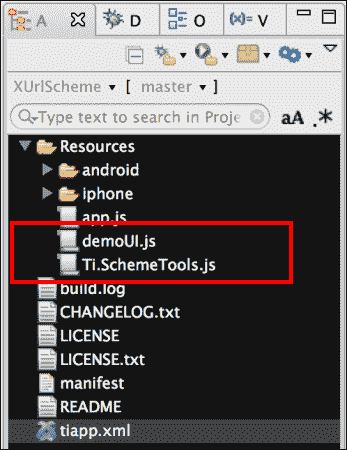

### AppLauncher 要求

此配方的另一个要求是 AppLauncher 应用，该应用是在本章前面讨论的*从一个应用启动另一个应用*配方中创建的。此应用将用于启动此配方中包含的不同 URL 示例。

## 如何做到...

在添加了`demoUI`和`Ti.SchemeTools`模块之后，你需要创建你的应用程序命名空间，并使用`require`将模块导入到你的`app.js`中，如下代码片段所示：

```js
//Create our application namespace
var my = {
  isAndroid : Ti.Platform.osname === 'android',
  scheme : require('Ti.SchemeTools'),
  ui : require('demoUI')
};
```

### iOS 更新 tiapp.xml

要使其他应用能够启动此配方，你必须对`tiapp.xml`文件进行一些更新。以下步骤讨论了如何创建`bencoding-linkrecipe`自定义 URL 方案：

1.  首先，打开你的项目`tiapp.xml`文件，并对`ios`节点进行以下修改：

    ```js
    <ios>
      <plist>
        <dict>
    ```

1.  接下来，添加`CFBundleURLTypes`节点。这是一个描述应用程序支持的 URL 方案的字典数组。在此节点下，你将列出你的应用将响应的所有 URL 和方案名称。

    ```js
        <key>CFBundleURLTypes</key>
          <array>
            <dict>
    ```

1.  然后添加`CFBundleURLName`键。此键包含此 URL 类型的抽象名称。这是引用特定应用的主要方式。为确保唯一性，建议使用 Java 包风格的标识符。

    ```js
              <key>CFBundleURLName </key>
              <string>bencoding-linkrecipe</string>
    ```

1.  最后，添加`CFBundleURLSchemes`键。这些键包含一个字符串数组，每个字符串都标识由该类型处理的 URL 方案。以下代码片段显示了应用的登录、关于和根活动的 URL：

    ```js
     <key>CFBundleURLSchemes</key>
     <array>
     <string>bencoding-linkrecipe</string>
     <string>bencoding-linkrecipe://about</string>
     <string>bencoding-linkrecipe://login</string>
     </array>
            </dict>
          </array>                
        </dict>
      </plist>
    </ios>
    ```

### Android 更新 tiapp.xml

要在 Android 上创建自定义 URL 方案，您需要编辑`tiapp.xml`文件以添加一个 intent 过滤器来监听特定的`android:scheme`和`android:host`。

1.  首先打开`tiapp.xml`文件并编辑 android 配置节点。

    ```js
    <android >
    ```

1.  接下来，添加`manifest`节点。

    ```js
      <manifest>
    ```

1.  添加`application`节点。此节点将用于生成项目的`AndroidManifest.xml`文件，因此请确保属性正确匹配您的项目。

    ```js
        <application 
        android:debuggable="false" android:icon=
        "@drawable/appicon" android:label=
        "XUrlScheme" android:name="XurlschemeApplication">
    ```

1.  接下来添加应用的根活动。

    ```js
          <activity 
          android:configChanges="keyboardHidden|orientation" 
          android:label="XUrlScheme" 
          android:name=".XurlschemeActivity" 
          android:theme="@style/Theme.Titanium">
    ```

1.  然后添加应用的主要 intent 过滤器。这将用于启动您的应用。

    ```js
            <intent-filter>
              <action android:name=
              "android.intent.action.MAIN"/>
              <category android:name=
              "android.intent.category.LAUNCHER"/>
            </intent-filter>
    ```

1.  接下来添加一个带有自定义 URL 信息的第二个 intent 过滤器。

    ```js
            <intent-filter>
    ```

1.  然后添加包含您的`android:scheme`和`android:host`信息的 data 节点。这些值在`Ti.Platform.openURL`用于启动 URL 方案时用作协议。以下高亮代码允许您使用类似`bencoding-linkrecipe://com.bencoding`的 URL 启动应用。

    ```js
              <data android:scheme="bencoding-linkrecipe" 
              android:host="com.bencoding"/>
    ```

1.  接下来必须向 intent 过滤器添加一个类别，以便应用能够正确地暴露给第三方启动器，并在 URL 方案被调用时打开应用。以下高亮代码片段显示了实现自定义 URL 方案所需的类别信息。

    ```js
              <category android:name=
              "android.intent.category.DEFAULT" />
              <category android:name=
              "android.intent.category.BROWSABLE" />
              <action android:name=
              "android.intent.action.VIEW" />

            </intent-filter>

          </activity>
        </application> 
      </manifest>
    </android>
    ```

### 创建菜谱 UI

这个菜谱有一个简单的 UI，用于演示如何实现不同的 URL 方案功能。

1.  首先，创建一个`Ti.UI.Window`；这是应用的根`Ti.UI.Window`。

    ```js
    var win = Ti.UI.createWindow({
      backgroundColor: '#fff', title: 'Url Receiver', 
      barColor:'#000',layout:'vertical',fullscreen:false
    });
    ```

1.  接下来，如果菜谱在 iOS 设备上运行，将添加一个`Ti.UI.Button`，允许 URL 接收器应用启动本章前面讨论的*从另一个应用启动*菜谱中创建的应用启动器应用。

    ```js
    if(!my.isAndroid){
      var launcherButton = Ti.UI.createButton({
        title:'Press to open AppLauncher Sample', 
        top:30, left:10, right:10, height:45
      });
      win.add(launcherButton);
    ```

1.  当点击`launcherButton`时，如果设备上安装了应用启动器，应用将尝试打开应用启动器。以下高亮代码演示了如何使用`Ti.Platform.openURL`方法来启动应用。

    ```js
      launcherButton.addEventListener('click',function(e){
        if(Ti.Platform.canOpenURL(
        "bencoding-linkLauncher://")
        ){
          Ti.Platform.openURL(
          "bencoding-linkLauncher://");
        }else{
          alert("Please install the AppLauncher Recipe");
        }
      });
    }
    ```

### 启动辅助函数

这个菜谱使用`assist object`来帮助启动不同的 URL。

```js
var assist = {
```

1.  `openWindow`方法根据提供的 URL 和参数值打开一个特定的窗口。

    ```js
      openWindow : function(url,params){
        if(url == 'about'){
          my.ui.openAboutWindow();
        }
        if (url =='login'){
          my.ui.openLoginWindow(params);
        }
      },
    ```

1.  当应用打开或恢复时，会调用`openPageFromUrl`方法以确定应用是否是从第三方应用打开的，如果是，提供了哪些路由信息。

    ```js
      openPageFromUrl : function(){
    ```

1.  第一步是确定应用是否是从第三方应用打开的。这是通过检查`hasLaunchUrl`方法来完成的。

    ```js
        if(!my.scheme.hasLaunchUrl()){
    ```

1.  如果应用不是从另一个应用启动的，菜谱的主页将被显示，并且任何会话变量将被重置。

    ```js
          my.scheme.session.reset();
          return;
        }
    ```

1.  如果应用是由另一个应用启动的，我们首先需要检查启动 URL 是否已更改。这可以避免在请求相同窗口时重新加载应用。这可以通过调用以下代码片段中突出显示的`hasChanged`方法来完成：

    ```js
     if(!my.scheme.session.hasChanged()){
          return;
        }
    ```

1.  接下来，通过调用`getLaunchUrl`方法获取要启动的 URL，如下面的代码片段所示。然后，此 URL 将被加载到`session`变量中供以后使用。

    ```js
        my.scheme.session.launchUrl = 
        my.scheme.getLaunchUrl();
    ```

1.  然后使用`getCurrentPage`函数获取请求的页面。这将用于确定使用`openWindow`方法加载哪个页面。

    ```js
        var requestedPage = my.scheme.getCurrentPage();
    ```

1.  接下来，获取任何启动参数。以下代码块演示了如何检查是否提供了启动参数，并将它们解析为格式化的对象。

    ```js
        my.scheme.session.launchParams = null;
        if(my.scheme.hasParams()){
          my.scheme.session.launchParams = 
          my.scheme.getParams();
        }
    ```

1.  最后，使用在前面步骤中创建的`requestedPage`和`launchParams`调用`openWindow`方法。`openWindow`方法将随后在应用中打开请求的窗口。

    ```js
        assist.openWindow(requestedPage,
        my.scheme.session.launchParams);
      }
    };
    ```

### 当从另一个应用启动时

为了让食谱启动请求的窗口，必须在恢复和打开事件中添加监听器。以下步骤详细说明了如何将适当的事件监听器添加到您的应用中：

1.  如果食谱在 iOS 上运行，则添加恢复事件监听器。请注意，在实现您自己的应用时，必须将其添加到`app.js`中。

    ```js
    if(!my.isAndroid){

      Ti.App.addEventListener( 'resumed', function(e) {
    ```

1.  每次应用恢复时，都会调用`assist.openPageFromUrl`方法。如果没有提供 URL 信息，则将显示主窗口。

    ```js
        assist.openPageFromUrl();
      });

    }
    ```

1.  在主窗口的打开事件上添加了一个监听器。此事件将在应用首次启动时触发。

    ```js
    win.addEventListener('open',function(e){
    ```

1.  在首次启动时，会调用`assist.openPageFromUrl`方法以确定应用是否被第三方应用打开。

    ```js
      assist.openPageFromUrl();
    ```

1.  如果食谱在 Android 上运行，则会在主窗口的`resume`事件上添加一个监听器。这允许食谱检测在应用在后台运行时是否有第三方应用尝试打开食谱。

    ```js
      if(my.isAndroid){
        win.activity.addEventListener('resume', function(){
          assist.openPageFromUrl();
        });
      }

    });

    win.open();
    ```

## 它是如何工作的...

跨平台自定义 URL 方案是提供第三方集成点的低成本好方法。以下部分详细说明了使用“从一个应用启动另一个应用”食谱访问不同应用路由的端到端过程，而无需此食谱的示例应用。

### 启动关于窗口

本节提供了逐步说明，说明您如何在从应用启动器食谱启动时，在 URL 接收器食谱中启动**关于**窗口。

1.  打开应用启动器应用程序，并在表格视图中轻触**食谱示例 1**行，如以下截图中的红色方框所示。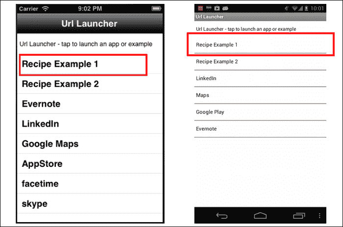

1.  应用启动器应用运行以下代码块。

    +   **在 iOS 上**：

        ```js
        Ti.Platform.openURL('bencoding-linkrecipe://about');
        ```

    +   **在 Android 上**：

        ```js
        Ti.Platform.openURL('bencoding-linkrecipe://com.bencoding/about');
        ```

1.  然后将在您的设备上启动 URL 接收器食谱。

1.  然后恢复或打开事件处理程序将解析提供的 URL 信息。当调用`getCurrentPage`方法时，`requestedPage`值将被设置为包含`about`值的字符串。

    ```js
    var requestedPage = my.scheme.getCurrentPage();
    ```

1.  接下来，调用`my.scheme.hasParams`方法以确定是否在提供的 URL 中传递了任何参数。在这种情况下，没有提供任何附加参数，因此`session`参数对象保持为`null`。

1.  然后调用`openWindow`方法，并打开以下**关于**窗口：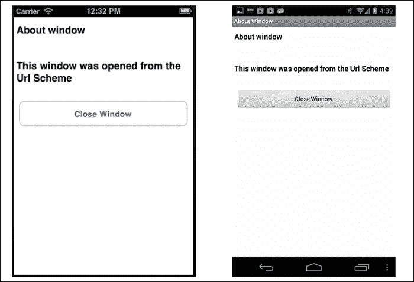

### 启动登录窗口

本节提供了从应用启动器食谱启动 URL 接收器食谱中**登录**窗口的逐步描述。作为启动过程的一部分，用户和令牌参数由应用启动器食谱提供，然后在 URL 接收器食谱应用中用于完成表单。

1.  打开应用启动器应用程序，并在表格视图中点击**食谱示例 2**行，如下截图中的红色方框所示：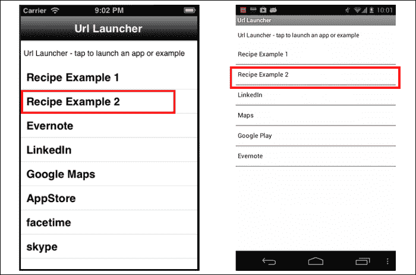

1.  应用启动器应用程序运行以下代码块。

    +   **在 iOS 上**:

        ```js
        Ti.Platform.openURL('bencoding-linkrecipe://login?user=chris&token=12345');
        ```

    +   **在 Android 上**:

        ```js
        Ti.Platform.openURL(
        'bencoding-linkrecipe://com.bencoding/'+
        login?user=chris&token=12345');
        ```

1.  然后在您的设备上启动 URL 接收器食谱。

1.  然后恢复或打开事件处理程序将解析提供的 URL 信息。当调用`getCurrentPage`方法时，`requestedPage`值将被设置为包含`login`值的字符串。

    ```js
    var requestedPage = my.scheme.getCurrentPage();
    ```

1.  接下来，调用`my.scheme.hasParams`方法以确定是否在提供的 URL 中传递了任何参数。

1.  下面的参数对象是使用调用 URL 中包含的查询字符串参数创建的。

    ```js
    { user:"chris",
     token:12345 }
    ```

1.  然后调用`openWindow`方法，提供`requestedPage`和`parameter`对象。这将打开**登录**页面，并使用用于完成表单的参数，如下截图所示：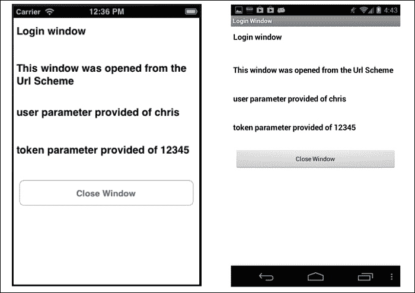

# 使用 BOOT_COMPLETED 打开您的 Android 应用

许多企业应用都有始终在后台运行的要求。这些应用最常见的类别包括路线管理、物品跟踪或客户调度应用。在您的 Android Titanium 应用中，您可以使用`BOOT_COMPLETED`动作的 intent 过滤器来通知您的应用设备已重新启动。`BOOT_COMPLETED`动作的事件生命周期如下图中所示：

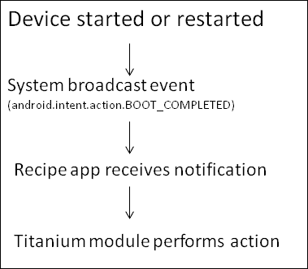

## 准备就绪

此食谱使用`bencoding.android.tools`本地模块来帮助订阅`BOOT_COMPLETED`广播。此模块和其他代码资产可以从本书提供的源代码中下载，或者通过此食谱末尾的“也见”部分提供的链接单独下载。要安装此模块，只需将以下截图所示的`modules`文件夹复制到您的项目中。

示例配方还包括一系列示例`tiapp.xml`和`app.js`文件，展示了处理接收`BOOT_COMPLETED`广播的不同选项。您需要将以下截图突出显示的文件复制到您的项目中，因为它们将被用于演示不同的可用选项。

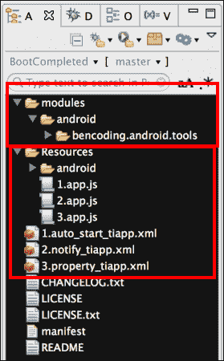

复制提到的文件后，您需要在 Titanium Studio 中点击您的**tiapp.xml**文件，并添加对`bencoding.android.tools`模块的引用，如下截图所示：

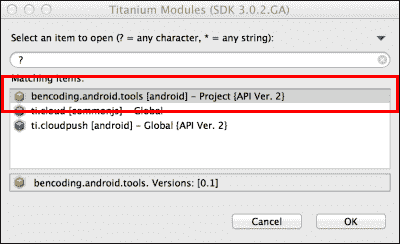

## 如何操作...

此配方演示了如何实现以下场景：

+   在接收到`BOOT_COMPLETED`广播时自动重启您的应用

+   向接收`BOOT_COMPLETED`广播的用户发送通知

+   使用 Titanium 属性配置您的应用如何处理`BOOT_COMPLETED`广播

### 必需的 tiapp.xml 更新

当 Titanium Android 应用启动时，Titanium 框架必须首先初始化，然后您的应用才能运行。当应用由其他服务（如`BOOT_COMPLETED`广播）启动时，您将收到一条消息，表明应用需要重启。为了避免此问题，您必须在您的`tiapp.xml`文件中添加以下属性：

```js
<property name="ti.android.bug2373.finishfalseroot" type="bool">true</property>
<property name="ti.android.bug2373.disableDetection" type="bool">true</property>
<property name="ti.android.bug2373.restartDelay" type="int">500</property>
<property name="ti.android.bug2373.finishDelay" type="int">0</property>
<property name="ti.android.bug2373.skipAlert" type="bool">true</property>
<property name="ti.android.bug2373.message">Initializing</property>
<property name="ti.android.bug2373.title">Restart Required</property>
<property name="ti.android.bug2373.buttonText">Continue</property>
```

### 场景 A – 自动重启

`Android.Tools.Receiver`模块提供的第一个`BOOT_COMPLETED`选项是能够重启您的应用。典型用例是在用户重启其设备时重启 Titanium 应用。

### 小贴士

要使用配方源将此场景部署到您的设备上，将`1.auto_start_tiapp.xml`文件重命名为`tiapp.xml`，将`1.app.js`重命名为`app.js`。这将使配方应用使用以下场景详情。

#### 自动重启步骤 1：将接收器添加到 tiapp.xml

启用此场景的第一步是将接收器条目添加到我们项目中的 Android 配置节点，该节点位于您的 Titanium 项目根目录下的`tiapp.xml`文件中。

```js
<receiver android:exported="true" android:name="bencoding.android.receivers.BootReceiver">
```

1.  首先，必须在我们的接收器中添加一个 intent 过滤器，这将使我们的应用订阅`BOOT_COMPLETED`广播。

    ```js
      <intent-filter>
        <action android:name=
        "android.intent.action.BOOT_COMPLETED"/>
      </intent-filter>
    ```

1.  接下来添加一个名为`bootType`的元数据节点。此节点由`Android.Tools`模块使用，以确定应采取什么启动操作。以下代码片段演示了如何配置模块以重启应用。

    ```js
      <meta-data android:name=
      "bootType" android:value="restart"/>
    ```

1.  然后添加一个名为`sendToBack`的元数据节点。此节点由`Android.Tools`模块使用，以确定如果设置为`true`，则应用应在后台重启，如果设置为`false`，则应在前台重启。

    ```js
      <meta-data android:name=
      "sendToBack" android:value="true"/>
    </receiver>
    ```

1.  最后添加了`RECEIVE_BOOT_COMPLETED`权限。

    ```js
    <uses-permission android:name="android.permission.RECEIVE_BOOT_COMPLETED"/>
    ```

#### 自动重启步骤 2：测试

以下步骤概述了如何最好地测试此配方场景：

1.  清理您的 Titanium 解决方案并将其推送到设备。

1.  确保应用未在您的设备上运行。您可以使用**设置**中的**强制停止**选项停止应用。

1.  重启您的设备。

1.  在设备重启后，确认配方主屏幕上显示的日期和时间。

### 场景 B – 重启时通知

`Android.Tools.Receiver` 模块提供的第二个 `BOOT_COMPLETED` 选项是在用户重启其设备时创建通知消息的能力。这可以用于向用户提供提醒或说明。

### 小贴士

要使用配方源将此场景部署到您的设备上，将 `2.auto_start_tiapp.xml` 文件重命名为 `tiapp.xml`，将 `2.app.js` 文件重命名为 `app.js`。这将使配方应用切换到使用以下场景详情。

#### 重启通知步骤 1：将接收器添加到 tiapp.xml

启用此场景的第一步是将接收器条目添加到我们项目 `tiapp.xml` 文件中的 Android 配置节点。

```js
<receiver android:exported="true" android:name="bencoding.android.receivers.BootReceiver">
```

1.  首先，必须向我们的接收器添加一个意图过滤器，这将使我们的应用订阅 `BOOT_COMPLETED` 广播。

    ```js
      <intent-filter>
        <action android:name=
        "android.intent.action.BOOT_COMPLETED"/>
      </intent-filter>
    ```

1.  接下来，添加一个名为 `bootType` 的元数据节点。此节点由 `Android.Tools` 模块用于确定应采取什么启动操作。以下片段演示了如何配置模块在设备重启时发送通知消息。

    ```js
      <meta-data android:name=
      "bootType" android:value="notify"/>
    ```

1.  然后添加一个名为 `title` 的元数据节点。此节点包含将要使用的通知标题。

    ```js
      <meta-data android:name="title" 
      android:value="Title Sample from tiapp.xml"/>
    ```

1.  然后添加一个名为 `message` 的元数据节点。此节点包含将要使用的通知消息。

    ```js
      <meta-data android:name="message" 
      android:value="Message Sample from 
      tiapp.xml"/></receiver>
    ```

1.  最后，添加了 `RECEIVE_BOOT_COMPLETED` 权限。

    ```js
    <uses-permission android:name="android.permission.RECEIVE_BOOT_COMPLETED"/>
    ```

#### 重启通知步骤 2：测试

以下步骤概述了测试此配方场景的最佳方法：

1.  清理您的钛金解决方案并将其推送到设备。

1.  确保应用在您的设备上没有运行。您可以使用 **设置** 下的 **强制停止** 选项停止应用。

1.  重启您的设备。

1.  在设备重启后的几秒钟内，您将在通知托盘中看到一条新消息。

### 场景 C – 属性控制

`Android.Tools.Receiver` 模块提供的最终 `BOOT_COMPLETED` 选项是能够重启您的应用。典型用例是在用户重启其设备时重启钛金应用。

### 小贴士

要使用配方源将此场景部署到您的设备上，将 `3.auto_start_tiapp.xml` 文件重命名为 `tiapp.xml`，将 `3.app.js` 文件重命名为 `app.js`。这将使配方应用切换到使用以下场景详情。

#### 属性控制步骤 1：将接收器添加到 tiapp.xml

启用此场景的第一步是将接收器条目添加到我们项目 `tiapp.xml` 文件中的 Android 配置节点。

```js
<receiver android:exported="true" android:name="bencoding.android.receivers.BootReceiver">
```

1.  必须向我们的接收器添加一个意图过滤器，这将使我们的应用订阅 `BOOT_COMPLETED` 广播。

    ```js
      <intent-filter>
        <action android:name=
        "android.intent.action.BOOT_COMPLETED"/>
      </intent-filter>
    ```

1.  接下来，添加一个名为 `bootType` 的元数据节点。此节点由 `Android.Tools` 模块用于确定应采取什么启动操作。以下代码片段演示了如何配置模块以使用钛金属性来确定应采取的操作。

    ```js
        <meta-data android:name="bootType" 
        android:value=" propertyBased"/>
    ```

1.  然后添加元数据节点来配置 `BOOT_COMPLETED` 接收器。每个节点都用于将一个 Titanium 属性映射到一个接收器配置元素。例如，`bootType_property_to_reference` 包含用于确定 `bootType` 的属性名称。

    ```js
    <meta-data android:name="enabled_property_to_reference" android:value="my_enabled"/>
    <meta-data android:name="bootType_property_to_reference" android:value="my_bootType"/>
    <meta-data android:name="sendToBack_property_to_reference" android:value="my_sendtoback"/>
    <meta-data android:name="icon_property_to_reference" android:value="my_notify_icon"/>
    <meta-data android:name="title_property_to_reference" 
    ndroid:value="my_notify_title"/>
    <meta-data android:name="message_property_to_reference" android:value="my_notify_message"/></receiver>
    ```

1.  最后，添加 `RECEIVE_BOOT_COMPLETED` 权限。

    ```js
    <uses-permission android:name="android.permission.RECEIVE_BOOT_COMPLETED"/>
    ```

#### 属性控制步骤 2：创建 recipe app.js

`Android.Tools` 模块允许通过 Titanium 属性配置 `BOOT_COMPLETED` 接收器。以下代码片段（`app.js`）演示了如何通过简单地更新正确的 Titanium 属性来创建两种不同的配置。

1.  首先，创建一个 `Ti.UI.Window` 来附加所有 UI 元素。

    ```js
    var win = Ti.UI.createWindow({
      backgroundColor: '#fff', title: 'BOOT_COMPLETED Example', 
      layout:'vertical',fullscreen:false, exitOnClose:true
    });
    ```

1.  接下来，创建一个 `Ti.UI.Button` 来演示如何创建前台重启。

    ```js
    var button1 = Ti.UI.createButton({
      title:'Foreground Restart',
      top:25, height:45, left:5, right:5
    });
    win.add(button1);
    ```

1.  在我们第一个按钮的 `click` 事件上，用于配置我们的 `BOOT_COMPLETED` 接收器的属性被更新。

    ```js
    button1.addEventListener('click',function(e){
    ```

1.  在 `click` 事件中执行的第一项操作是将 `BOOT_COMPLETED` 接收器设置为启用。

    ```js
      Ti.App.Properties.setBool('my_enabled',true);
    ```

1.  接下来，将 `bootType` 设置为重启。这将使我们的 Titanium 应用在设备重启时重启。

    ```js
      Ti.App.Properties.setString("my_bootType", "restart");
    ```

1.  然后，将 `sendToBack` 属性设置为 `false`。这将使用户在重启其设备时，我们的 Titanium 应用在前台重启。

    ```js
      Ti.App.Properties.setBool("my_sendtoback",false);
    });
    ```

1.  接下来，创建第二个按钮来演示如何配置通知。

    ```js
    var button2 = Ti.UI.createButton({
      title:'Restart Notification',
      top:25, height:45, left:5, right:5
    });
    win.add(button2);
    ```

1.  接下来创建第二个按钮来演示如何在设备重启时生成通知的配置。

    ```js
    button2.addEventListener('click',function(e){
    ```

1.  在 `click` 事件中执行的操作是将 `BOOT_COMPLETED` 接收器设置为 `enabled`。

    ```js
      Ti.App.Properties.setBool('my_enabled',true);
    ```

1.  接下来，将 `bootType` 设置为 `notify`。这将接收 `BOOT_COMPLETED` 广播后发送一条消息。

    ```js
      Ti.App.Properties.setString("my_bootType", "notify");
    ```

1.  接下来，创建通知图标资源标识符。此资源标识符将用于在创建通知时创建图标。如果没有提供资源标识符，则默认使用星形图标。

    ```js
      .App.Properties.setInt("my_notify_icon", 17301618);
    ```

1.  最后，将链接到通知标题和消息的属性设置为新的字符串值。这些属性将在设备重启时生成通知时使用。

    ```js
      Ti.App.Properties.setString(
      "my_notify_title", "Title from property");
      Ti.App.Properties.setString(
      "my_notify_message","Message from property");
    });
    ```

#### 属性控制步骤 3：测试

以下步骤概述了如何最好地测试此配方场景：

1.  清理您的 Titanium 解决方案并将其推送到设备。

1.  打开应用，并按下第一个按钮（`button1`）。这将更新属性以执行前台重启。

1.  接下来停止应用；您可以在 **设置** 下的 **强制停止** 选项中停止应用。

1.  重启您的设备。

1.  设备启动后，配方应用将在前台启动。

1.  按下第二个按钮（`button2`）。这将更新属性以在重启时发送通知。

1.  重启您的设备。

1.  在设备重启后的几秒钟内，您将在通知托盘中看到一条新消息。

## 参见

在本食谱中使用了`Android.Tools`模块来提供`BOOT_COMPLETED`功能。有关此模块的更多信息，请访问 GitHub 上的项目[`github.com/benbahrenburg/benCoding.Android.Tools`](https://github.com/benbahrenburg/benCoding.Android.Tools)。

有关 BootReceiver 的完整文档，请访问[`github.com/benbahrenburg/benCoding.Android.Tools/tree/master/documentation/bootreceiver.md`](https://github.com/benbahrenburg/benCoding.Android.Tools/tree/master/documentation/bootreceiver.md)。

# 使用 Web Workers 进行 iOS 多线程

企业应用程序通常需要执行大量的处理。为了在充分利用有限的设备资源的同时提供最佳的用户体验，您必须在后台线程上执行计算操作。

在本食谱中，我们将讨论如何使用`Ti.WebWorkerWrapper`模块执行后台计算操作。为了模拟计算任务，对随机数字计算斐波那契序列并在并行中进行处理。以下截图显示了在 iPhone 上运行这些 Web Worker 任务的食谱。

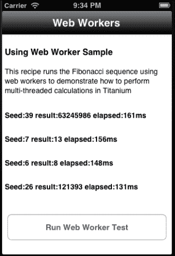

### 注意

本食谱是一个仅适用于 iOS 的食谱，因为它需要 Web Workers，而 Web Workers 目前尚不支持 Titanium Android。

## 准备就绪

本食谱使用`Ti.WebWorkerWrapper` CommonJS 模块和`fibonacci.js` Web Worker。这些模块和其他代码资产可以从本书提供的源代码中下载，或者通过本食谱末尾的“另请参阅”部分提供的链接单独下载。要将`Ti.WebWorkerWrapper`模块和 Web Worker 安装到您的项目中，只需将`Ti.WebWorkerWrapper.js`和`fibonacci.js`文件复制到您的 Titanium 项目中的`Resources`文件夹，如下截图所示：

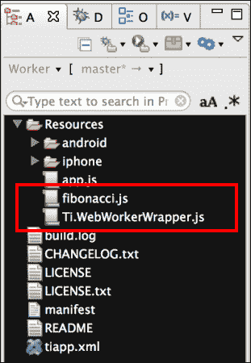

## 如何操作...

一旦您已将`Ti.WebWorkerWrapper`模块和`fibonacci.js`文件添加到您的项目中，接下来您需要创建您的应用程序命名空间，并使用`require`将模块导入到您的`app.js`文件中，如下代码片段所示：

```js
//Create our application namespace
var my = {
  workerMod : require('Ti.WebWorkerWrapper'),
  isAndroid : Ti.Platform.osname === 'android'
};
```

### 创建食谱 UI

本食谱提供了一个基本的 UI，用于启动和跟踪 Web Workers 执行斐波那契序列的过程。以下步骤详细说明了如何创建前面截图所示的主要组件：

1.  首先创建一个`Ti.UI.Window`。此窗口将用于附加和显示所有 UI 元素。

    ```js
    var win = Ti.UI.createWindow({
      backgroundColor: '#fff', title: 'web Workers', 
      barColor:'#000',layout:'vertical',fullscreen:false
    });
    ```

1.  接下来，一系列`Ti.UI.Label`控件被添加到`Ti.UI.Window`中。这些控件将用于显示 Web Workers 的进度和结果。

    ```js
    var worker1 = Ti.UI.createLabel({
      top:20, height:25, left:5, right:5,color:'#000',
      textAlign:'left',text:'Not yet processed - Press Button', 
      font:{fontSize:14, fontWeight:'bold'}
    });
    win.add(worker1);
    ```

    ### 注意

    使用与前面代码片段中显示的`worker1`标签相同的模板，添加了三个额外的 Web Worker 标签。

1.  最后，在`Ti.UI.Window`中添加了一个`Ti.UI.Button`。此按钮用于启动本食谱中使用的四个 Web Worker 进程。

    ```js
    var runButton = Ti.UI.createButton({
      title:'Run Web Worker Test', top:40,
      left:10, right:10, height:50, 
    });
    win.add(runButton);
    ```

### 测试函数

本菜谱使用一个 `tests` 对象来帮助处理时间和显示 Web Worker 斐波那契数列处理的结果。以下部分讨论了 `tests` JavaScript 对象中的功能。

```js
var tests = {
```

1.  `updateLabel` 方法用于将格式化模板应用于每个标签，以显示斐波那契数列回调结果。

    ```js
      updateLabel : function(label,e){
        label.text = "Seed:" + e.seed + " result:" + 
        e.result + " elapsed:" + e.elapsed + "ms";
      },
    ```

1.  `worker1` 至 `worker4` 方法是作为回调方法提供给每个 Web Worker 的，以便它在处理斐波那契数列时使用。这些回调接收计算过程中的结果。

    ```js
      worker1 : function(e){
        tests.updateLabel(worker1,e);
      },
      worker2 : function(e){
        tests.updateLabel(worker2,e);
      },
      worker3 : function(e){
        tests.updateLabel(worker3,e);
      },
      worker4 : function(e){
        tests.updateLabel(worker4,e);
      },
    ```

1.  `random` 方法用于在给定范围内生成随机数。此方法用于生成发送给斐波那契数列的随机数。

    ```js
      random : function(from,to){
        return Math.floor(Math.random()*(to-from+1)+from);
      }
    };
    ```

### 使用 Web Workers 进行多线程

当用户点击 `runButton` 按钮时，将运行多线程示例。以下部分演示了如何在后台创建四个 Web Workers。一旦每个 Web Worker 完成处理，结果将提供给本菜谱前面讨论过的测试回调方法。

```js
runButton.addEventListener('click',function(e){
```

1.  首先，通过初始化 `Ti.WebWorkerWrapper` 模块的新实例来创建一个新的 worker 对象。

    ```js
      var worker1 = new my.workerMod();
    ```

1.  接下来，在 `worker` 对象上调用 `start` 方法。`start` 方法需要以下参数：

    +   Web Worker 应该执行的 JavaScript 文件路径

    +   作为 Web Worker `postMessage` 传递的随机数

    +   当 Web Worker 完成处理时使用的回调方法

        ```js
          worker1.start('fibonacci.js',tests.random(1,50),
          tests.worker1);
        ```

1.  使用与 `worker1` 创建相同的模式创建了三个额外的 Web Workers。

    ```js
      var worker2 = new my.workerMod();
      worker2.start('fibonacci.js',tests.random(1,50),
      tests.worker2);

      var worker3 = new my.workerMod();
      worker3.start('fibonacci.js',tests.random(1,50),
      tests.worker3);

      var worker4 = new my.workerMod();
      worker4.start('fibonacci.js',tests.random(1,50),
      tests.worker4);

    });
    ```

## 参见

+   在这个菜谱中，使用 `Ti.WebWorkerWrapper` CommonJS 模块为 `fibonacci.js` 计算提供多线程支持。有关更多详细信息，请访问 Github 上的模块 [`github.com/benbahrenburg/Ti.WebWorkerWrapper`](https://github.com/benbahrenburg/Ti.WebWorkerWrapper)。
