# 第八章.基本安全方法

在本章中，我们将涵盖：

+   在 Titanium 中实现 iOS 数据保护

+   使用 JavaScript 进行 AES 加密

+   使用 Ti.Network.HTTPClient 进行基本身份验证

+   实现跨平台密码屏幕

+   在 iOS 上处理受保护的 ZIP 文件

# 简介

安全性、隐私和知识产权保护是我们这些构建 Titanium 企业应用的人心中的首要任务。Titanium 允许您结合底层平台工具和第三方 JavaScript 库，以帮助您满足您的安全需求。

本章提供了一系列方法，介绍如何利用 JavaScript、Titanium 模块和底层平台，帮助您创建分层安全方法，以协助您实现组织整体安全开发目标。每个配方都旨在提供构建块，帮助您实现您所在行业的现有安全和隐私标准。

# 在 Titanium 中实现 iOS 数据保护

从 iOS 4 开始，苹果引入了应用使用数据保护功能以在磁盘上存储的数据添加额外安全层的能力。数据保护使用内置的硬件加密来加密设备上存储的文件。当用户的设备被锁定并使用密码锁保护时，此功能可用。在此期间，所有文件都受到保护且无法访问，直到用户明确解锁设备。

### 注意

当设备被锁定时，没有任何应用可以访问受保护的文件。这甚至适用于创建该文件的应用。

## 准备就绪

此配方使用`securely`原生模块以增强安全性功能。此模块和其他代码资产可以从本书提供的源代码中下载。将这些安装到您的项目中很简单。只需将`modules`文件夹复制到您的项目中，如图所示：

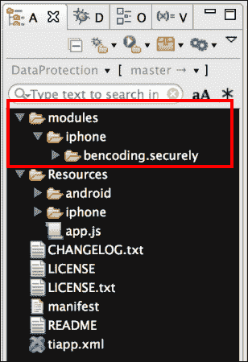

在复制提到的文件夹后，您需要在 Titanium Studio 中点击您的**tiapp.xml**文件，并将对`bencoding.securely`模块的引用添加到其中，如图所示：

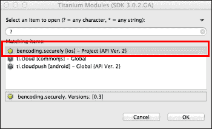

### 启用数据保护

此配方需要您的 iOS 设备启用数据保护。您需要一个设备，因为模拟器不支持数据保护。以下步骤涵盖了如何在您的设备上启用此功能：

1.  前往**设置** | **通用** | **密码**。

1.  按提示设置密码。

1.  添加密码后，滚动到屏幕底部并验证是否可以看到如图所示的文本**数据保护已启用**：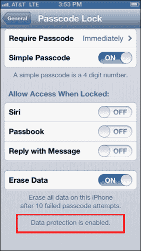

### iOS 设备浏览器

需要一个第三方 iOS 设备浏览器来验证示例配方应用的数据保护是否已成功启用。本配方讨论了如何使用流行的 iExplorer 应用来验证数据保护。可以使用 iExplorer 应用的评估版本来跟随本配方。有关更多信息以及下载 iExplorer，请访问[`www.macroplant.com/iexplorer`](http://www.macroplant.com/iexplorer)。

## 如何操作...

为了启用 iOS 数据保护，需要将`DataProtectionClass`和`com.apple.developer.default-data-protection`键添加到你的`tiapp.xml`中，如下代码片段所示：

1.  首先，如果你的项目中还没有包含这个元素，请添加`ios`配置节点。

    ```js
    <ios>
      <plist>
        <dict>
    ```

1.  然后在`dict`节点顶部添加以下突出显示的键。

    ```js
     <key>DataProtectionClass</key>
     <string>NSFileProtectionComplete</string>
     <key>com.apple.developer.
     default-data-protection</key>
     <string>NSFileProtectionComplete</string>
         </dict>
      </plist>
    </ios>
    ```

1.  在保存`tiapp.xml`的更新后，你必须清理你的 Titanium 项目，以便更新生效。这可以在 Titanium Studio 中通过选择**项目** | **清理**来完成。

### 创建命名空间和导入

一旦你添加了`securely`模块并更新了项目中的`tiapp.xml`，你需要在`app.js`文件中创建你的应用程序命名空间，并使用`require`将模块导入到你的代码中，如下代码片段所示：

```js
//Create our application namespace
var my = {
  secure : require('bencoding.securely')
};
```

### 创建配方 UI

以下步骤概述了如何创建本配方中使用的 UI：

1.  首先，创建一个`Ti.UI.Window`来附加所有 UI 元素。

    ```js
    var win = Ti.UI.createWindow({
      backgroundColor: '#fff', 
      title: 'Data Protection Example', 
      barColor:'#000',layout:'vertical'
    });
    ```

1.  接下来，向`Ti.UI.Window`中添加一个`Ti.UI.Button`。这将用于触发我们的示例。

    ```js
    var button1 = Ti.UI.createButton({
      title:'Create Test File',
      top:25, height:45, left:5, right:5
    });
    win.add(button1);
    ```

### 创建一个文件以验证数据保护

为了验证应用中是否启用了数据保护，该配方会在`Ti.Filesystem.applicationDataDirectory`目录中创建一个带时间戳的文件。使用 iOS 设备浏览器，我们可以验证当设备锁定时测试文件是否受到保护。以下步骤描述了配方如何创建这个测试文件：

1.  `button1`的`click`事件创建一个带时间戳的文件，使我们能够验证应用是否已正确启用了数据保护。

    ```js
    button1.addEventListener('click',function(e){
    ```

1.  接下来，在`securely`上调用`isProtectedDataAvailable`方法。这提供了一个布尔结果，指示数据保护允许应用从或向文件系统读写。

    ```js
      if(!my.secure.isProtectedDataAvailable()){
        alert('Protected data is not yet available.');
        return;
      }
    ```

1.  为了确保文件中有一个唯一的标识符，使用当前日期和时间创建了一个令牌。然后，将此令牌添加到以下消息模板中：

    ```js
      var timeToken = String.formatDate(new Date(),"medium") +
      String.formatTime(new Date());
      var msg = "When device is locked you will not be able";
      msg += " to read this file. Your time token is ";
      msg += timeToken;
    ```

1.  第 3 步创建的消息随后被写入到位于`Ti.Filesystem.applicationDataDirectory`目录中的`test.txt`文件。如果文件已存在，则将其删除，以便最新的消息可用于测试。

    ```js
      var testfile = Ti.Filesystem.getFile(
      Ti.Filesystem.applicationDataDirectory, 'test.txt');
      if(testfile.exists()){
        testfile.deleteFile();
      }
      testfile.write(msg);
      testfile = null;
    ```

1.  一旦将`test.txt`文件写入设备，就会向用户显示一条消息，通知他们锁定设备并使用 iOS 设备浏览器来确认数据保护已启用。

    ```js
      var alertMsg = "Please lock your device.";
      alertMsg+= "Then open an iOS Device Browser.";
      alertMsg+= "The time token you are looking for is ";
      alertMsg+= timeToken;
      alert(alertMsg);
    ```

## 它是如何工作的...

在您的 `tiapp.xml` 文件中添加了 `DataProtectionClass` 和 `com.apple.developer.default-data-protection` 键之后，当设备锁定时，iOS 设备将处理保护您的文件。以下步骤讨论了如何测试此食谱是否正确实现了数据保护：

1.  验证过程的第一步是在您的 iOS 设备上构建和部署食谱应用程序。

1.  一旦应用程序已加载到您的设备上，打开应用程序并点击 **创建测试文件** 按钮。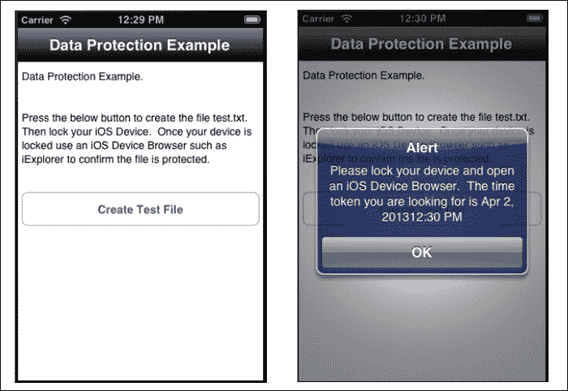

1.  一旦收到表示测试文件已创建的警报消息，请按主页按钮并锁定您的设备。

1.  将您的设备连接到已安装 iExplorer 的计算机。

1.  打开 iExplorer 并导航，以便您可以在设备上查看应用程序。

1.  在以下截图中的红色方框中标记的 **DataProtection** 应用程序中选择。然后右键单击位于 **Documents** 文件夹中的 **test.txt** 文件，并选择与绿色方框中标记的 **Quick Look** 相同的选项：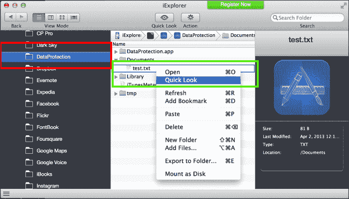

1.  选择 **Quick Look** 后，iExplorer 将尝试打开 `test.txt` 文件。由于它受到保护，无法打开，**Quick Look** 将显示进度指示器，直到达到超时。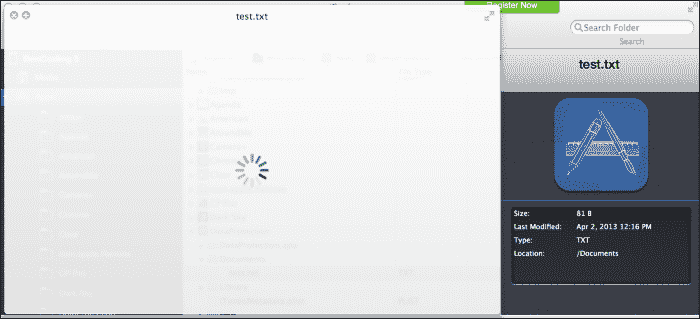

1.  然后，您可以解锁您的设备并重复前面的步骤以在 **Quick Look** 中打开文件。

# 使用 JavaScript 进行 AES 加密

**高级加密标准** (**AES**) 是美国国家标准与技术研究院（NIST）于 2001 年建立的电子数据加密规范。此加密算法用于美国政府机构保护敏感但未分类的材料。AES 已被企业广泛采用，并已成为许多商业敏感交易的事实上的加密标准。

本食谱讨论了如何在 JavaScript 中实现 AES 并将其集成到您的 Titanium 企业应用程序中。

## 准备工作

此食谱使用 `Ti.SlowAES` CommonJS 模块作为 `SlowAES` 开源项目的包装器。此模块和其他代码资产可以从本书提供的源代码中下载，或者通过此食谱末尾的 *另请参阅* 部分的链接单独下载。将这些内容安装到您的项目中很简单。只需将 `SlowAES` 文件夹复制到您的项目中的 `Resources` 文件夹，如下面的截图所示：

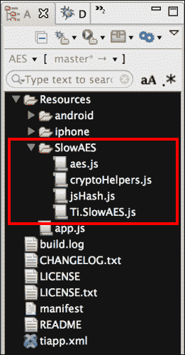

## 如何操作...

一旦将 `SlowAES` 文件夹添加到您的项目中，接下来您需要在 `app.js` 文件中创建您的应用程序命名空间，并使用 `require` 将模块导入到您的代码中，如下面的代码片段所示：

```js
//Create our application namespace
var my = {
  mod : require('SlowAES/Ti.SlowAES')
};
```

### 创建食谱 UI

本食谱通过一个示例应用程序展示了如何使用 `Ti.SlowAES` CommonJS 模块，该应用程序使用两个 `Ti.UI.TextField` 控件进行输入。

1.  首先，创建一个 `Ti.UI.Window` 来附加所有 UI 元素。

    ```js
    var win = Ti.UI.createWindow({
      backgroundColor: '#fff', title: 'AES Crypto Example',
      barColor:'#000',layout:'vertical',fullscreen:false
    });
    ```

    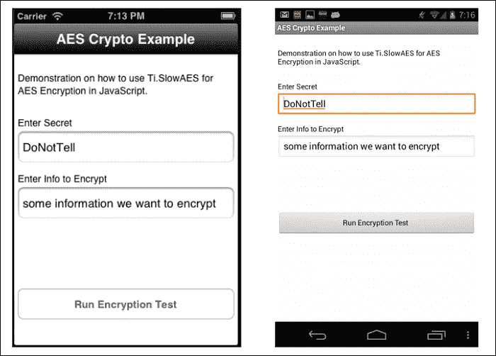

1.  接着，在 `Ti.UI.Window` 中添加了一个 `Ti.UI.TextField` 控件，用于收集用户的密钥。

    ```js
    var txtSecret = Ti.UI.createTextField({
      value:'DoNotTell',hintText:'Enter Secret',
      height:45, left:5, right:5,
      borderStyle:Ti.UI.INPUT_BORDERSTYLE_ROUNDED
    });
    win.add(txtSecret);
    ```

1.  另外添加了一个 `Ti.UI.TextField` 到 `Ti.UI.Window` 中，用于从用户那里收集要加密的字符串。

    ```js
    var txtToEncrypt = Ti.UI.createTextField({
      value:'some information we want to encrypt',
      hintText:'Enter information to encrypt',
      height:45, left:5, right:5,
      borderStyle:Ti.UI.INPUT_BORDERSTYLE_ROUNDED
    });
    win.add(txtToEncrypt);
    ```

1.  接下来，在 `Ti.UI.Window` 中添加了一个 `Ti.UI.Label`。这个 `Ti.UI.Label` 将用于向用户显示加密值。

    ```js
    var encryptedLabel = Ti.UI.createLabel({
      top:10, height:65, left:5, right:5,color:'#000',
      textAlign:'left',font:{fontSize:14}
    });
    win.add(encryptedLabel);
    ```

1.  最后，在 `Ti.UI.Window` 中添加了一个 `Ti.UI.Button`。这个 `Ti.UI.Button` 将在后面的菜谱中用于执行加密测试。

    ```js
    var btnEncrypt = Ti.UI.createButton({
      title:'Run Encryption Test', top:25, 
      height:45, left:5, right:5
    });
    win.add(btnEncrypt);
    ```

### 加密和解密值

本节演示了如何使用 `Ti.SlowAES` 模块，通过在 `txtSecret`、`Ti.UI.TextField` 中输入的密钥来加密 `txtToEncrypt`、`Ti.UI.TextField` 中的内容。一旦完成，加密值随后被解密并与原始输入进行比较。结果以警报消息的形式显示给用户，如下述截图所示：

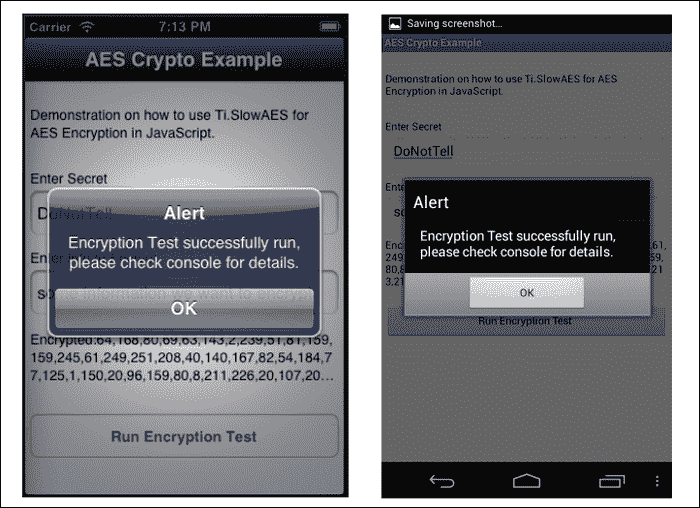

当 `btnEncrypt` 控件的点击事件触发时执行加密测试，如下述代码片段所示：

```js
btnEncrypt.addEventListener('click',function(x){
```

1.  加密过程的第一步是创建 `SlowAES` 模块的新实例，如以下代码片段所示。

    ```js
      var crypto = new my.mod();
    ```

1.  接下来，使用加密函数，将 `txtSecret` 控件中提供的密钥用于加密 `txtToEncrypt` 控件中的值。加密结果随后返回到 `encryptedValue`，如下述语句所示：

    ```js
      var encryptedValue = 
      crypto.encrypt(txtToEncrypt.value,txtSecret.value);
    ```

1.  然后，将 `encryptedLabel.text` 属性更新以向用户显示加密值。

    ```js
      encryptedLabel.text = 'Encrypted:' + encryptedValue;
    ```

1.  接着，使用 `decrypt` 方法演示如何解密之前加密的字符串值。此方法需要加密的字符串值和密钥，如下述代码片段所示：

    ```js
      var decryptedValue = 
      crypto.decrypt(encryptedValue,txtSecret.value);
    ```

1.  最后，将原始输入值与解密值进行比较，以确保我们的加密测试成功。测试结果随后通过消息警报和 Titanium Studio 控制台显示给用户。

    ```js
      alert((txtToEncrypt.value ===decryptedValue) ? 
      'Encryption Test successfully ran check console for details.': 
      'Test failed, please check console for details.');

    });
    ```

## 参见

您还可以参考以下资源：

+   理解 JavaScript 加密的一些弱点是很重要的。在决定加密方法时，我建议阅读 Matasano Security 在此主题上的文章，该文章可在 [`www.matasano.com/articles/javascript-cryptography`](http://www.matasano.com/articles/javascript-cryptography) 找到。

+   本菜谱使用 `SlowAES` 项目实现 AES 算法。要阅读许可证并了解更多关于 `SlowAES` 项目的信息，请访问 [`code.google.com/p/slowaes`](http://code.google.com/p/slowaes)。

+   要下载 `Ti.SlowAES` CommonJS 模块并了解更多关于如何实现其功能的信息，请访问 [`github.com/benbahrenburg/Ti.SlowAES`](https://github.com/benbahrenburg/Ti.SlowAES)。

# 使用 Ti.Network.HTTPClient 进行基本身份验证

大多数企业网站或服务都通过基本访问认证提供内容访问。基本认证是一种 HTTP 用户代理在请求时提供用户名和密码的方法。重要的是要记住，基本认证将您的凭据 base64 编码，而不是加密它们。因此，建议在创建网络连接时使用 HTTPS。

Titanium 通过 SDK 的 `Ti.Network` 功能完全支持基本认证。本配方描述了如何使用 `Ti.Network.HTTPClient` 代理通过基本认证头连接到网站。

## 准备就绪

此配方使用 `Ti.BA` CommonJS 模块作为 Titanium 的原生 `Ti.Network.HTTPClient` 的辅助工具。此模块和其他代码资源可以从本书提供的源代码中下载。在您的项目中安装此模块很简单。只需将 `Ti.BA.js` 文件复制到项目中的 `Resources` 文件夹，如图所示：

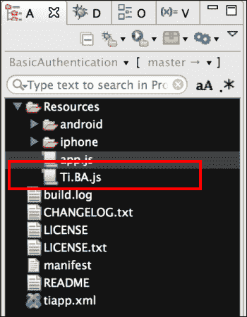

## 如何操作...

一旦将 `Ti.BA.js` 文件添加到您的项目中，您需要在 `app.js` 文件中创建您的应用程序命名空间，并使用 `require` 将模块导入到您的代码中，如下代码片段所示：

```js
//Create our application namespace
var my = {
  mod : require('Ti.BA')
};
```

### 创建配方 UI

此配方使用简单的用户界面来展示如何建立基本的认证网络连接。本节中的代码片段说明了如何构建以下截图所示的基本认证测试应用程序：

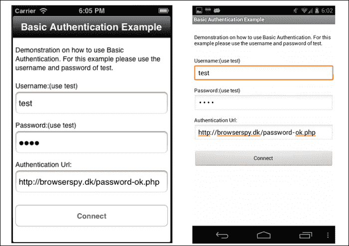

现在执行以下步骤：

1.  首先，创建一个 `Ti.UI.Window` 来附加所有 UI 元素。

    ```js
    var win = Ti.UI.createWindow({
      backgroundColor: '#fff', title: 'AES Crypto Example', 
      barColor:'#000',layout:'vertical',fullscreen:false
    });
    ```

1.  接下来，将 `txtUsername Ti.UI.TextField` 添加到 `Ti.UI.Window` 中。默认值设置为 `test`，因为它是用于创建我们的模拟测试连接的 `browserspy.dk` 测试网站的默认值。

    ```js
    var txtUsername = Ti.UI.createTextField({
      value:'test',hintText:'Enter username',
      height:45, left:5, right:5,
      borderStyle:Ti.UI.INPUT_BORDERSTYLE_ROUNDED
    });
    win.add(txtUsername);
    ```

1.  然后将 `txtPassword Ti.UI.TextField` 添加到 `Ti.UI.Window` 中。默认值设置为 `test`，因为它是用于创建我们的模拟测试连接的 `browserspy.dk` 测试网站的默认值。

    ```js
    var txtPassword = Ti.UI.createTextField({
      value:'test',hintText:'Enter password',
      passwordMask:true,height:45, left:5, right:5,
      borderStyle:Ti.UI.INPUT_BORDERSTYLE_ROUNDED
    });
    win.add(txtPassword);
    ```

1.  接下来，将 `txtUrl Ti.UI.TextField` 添加到 `Ti.UI.Window` 中。默认值设置为 `"http://browserspy.dk/password-ok"`。`txtUrl` 的值可以更新为任何需要基本认证的服务。为了演示目的，此配方使用 `browserspy.dk` 测试网站。

    ```js
    var txtUrl = Ti.UI.createTextField({
      value:'http://browserspy.dk/password-ok.php',
      hintText:'Enter Url',
      height:45, left:5, right:5,
      borderStyle:Ti.UI.INPUT_BORDERSTYLE_ROUNDED
    });
    win.add(txtUrl);
    ```

1.  最后，将 `btnConnect Ti.UI.Button` 添加到 `Ti.UI.Window` 中。在本配方后面的部分，将使用 `btnConnect` 控件来初始化认证网络连接。

    ```js
    var btnConnect = Ti.UI.createButton({
      title:'Connect', top:25, height:45, left:5, right:5
    });
    win.add(btnConnect);
    ```

### 创建服务连接

在放置好示例 UI 之后，本配方下一步是执行使用基本认证的安全网络连接。以下代码片段用于创建网络连接并显示以下截图所示的结果：

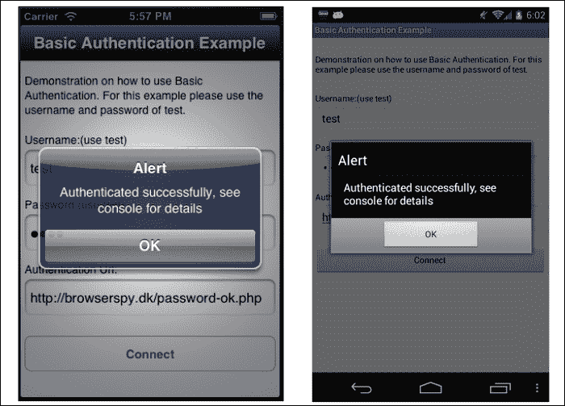

当 `btnConnect` 控件的 `click` 事件触发时，执行基本认证测试网络连接，如下面的代码片段所示：

```js
btnConnect.addEventListener('click',function(x){
```

1.  首先，检查 `Ti.Network.online` 属性以确保设备有网络连接。如果没有网络连接，则提醒用户并退出函数。

    ```js
      if(!Ti.Network.online){
        alert('Network connection is required');
        return;
      }
    ```

1.  接下来创建 `onDone` 函数。此函数用作认证网络连接结果的回调。

    ```js
      function onDone(d){
    ```

1.  当在 `onDone` 函数中时，首先执行的操作是检查 `d.success` 属性提供的结果。如果此属性为 `true`，则网络连接成功完成。否则，将 `d.error` 消息打印到控制台，并通知用户。

    ```js
        if(d.success){
          Ti.API.info('Results = ' + 
          JSON.stringify(d.results));
          alert('Authenticated successfully');
        }else{
          Ti.API.info('error = ' + JSON.stringify(d.error));
          alert('Authenticated Failed');
        }
      };
    ```

1.  然后创建 `credentials` 对象。此对象包含在创建我们的认证连接时使用的用户名和密码。请注意，这些值应与从屏幕上的 `Ti.UI.TextField` 控件直接获取的值一样为纯文本。

    ```js
      var credentials = {
        username:txtUsername.value,
        password:txtPassword.value
      };
    ```

1.  `Ti.BA 模块` 允许您配置所有 `Ti.Network.HTTPClient` 选项，并控制和服务输出格式。以下代码片段演示了如何配置请求以将超时设置为 9 秒，并指定 `responseText` 为返回的响应。

    ```js
      var options = {format:'text', timeout:9000};
    ```

1.  最后创建 `Ti.BA` 模块的新实例，并提供以下内容：

    +   **方法**：执行 `GET` 或 `POST` 操作。在本示例中，提供了 `POST` 方法。

    +   **URL**：模块用于连接的 URL。

    +   **凭据**：`credentials` 对象包含用于创建基本认证连接的用户名和密码。

    +   **回调**：此参数需要提供一个回调方法。在本示例中，将 `onDone` 方法提供给模块，并将返回连接响应。

    +   **选项**：这是 `Ti.Network.HTTPClient` 和要返回的结果类型的配置选项。如果没有提供，则返回模块的默认值。

        ```js
          var basicAuth = new 
          my.mod('POST',txtUrl.value,credentials, onDone,options);
        });
        ```

# 实现跨平台通行码屏幕

密码和通行码屏幕是企业应用中常见的验证工具。这些屏幕提供交互模式，有助于解决认证和确认场景。

此配方演示了如何实现类似于在 iOS 和 Android 网络屏幕上看到的跨平台通行码屏幕。

## 准备工作

此配方使用 `Ti.Passcode` CommonJS 模块来实现跨平台通行码屏幕。此模块和其他代码资产可以从本书提供的源代码下载，或者通过此配方末尾的 *也见* 部分的链接单独下载。在项目中安装此模块很简单。只需将 `Ti.Passcode.js` 文件复制到项目中的 `Resources` 文件夹，如下面的截图所示：

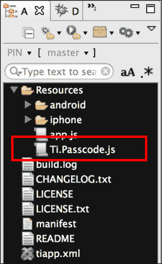

## 如何操作...

将`Ti.Passcode.js`文件添加到您的项目后，您需要在`app.js`文件中创建您的应用程序命名空间，并使用`require`将模块导入到您的代码中，如下面的代码所示：

```js
//Create our application namespace
var my = {
  mod : require('Ti.Passcode')
};
```

### 创建食谱 UI

本食谱使用`Ti.UI.Windows`向用户展示信息。本节讨论了创建第一个`Ti.UI.Window`的代码。本节详细介绍了如何启动`Ti.Passcode`模块，并提供了验证它的代码。

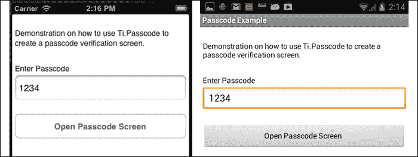

现在执行以下步骤：

1.  首先，创建一个`Ti.UI.Window`来附加所有 UI 元素。

    ```js
    var win = Ti.UI.createWindow({
      backgroundColor: '#fff', title: 'Passcode Example', 
      layout:'vertical',fullscreen:false, exitOnClose:true
    });
    ```

1.  接下来，将`txtPasscode Ti.UI.TextField`添加到`Ti.UI.Window`中。此控件用于收集`Ti.Passcode`模块将验证的密码。

    ```js
    var txtPasscode = Ti.UI.createTextField({
      value:'1234',hintText:'Enter Passcode',
      height:45, left:5, right:5,
      borderStyle:Ti.UI.INPUT_BORDERSTYLE_ROUNDED
    });
    win.add(txtPasscode);
    ```

1.  最后，将`bntRunPasscode Ti.UI.Button`添加到`Ti.UI.Window`中。此按钮将在食谱中稍后用于启动密码屏幕。

    ```js
    var btnRunPasscode = Ti.UI.createButton({
      title:'Open Passcode Screen', top:25, height:45, 
      left:5, right:5	
    });
    win.add(btnRunPasscode);
    ```

### 启动密码屏幕

本食谱中的第二个`Ti.UI.Window`是由`Ti.Passcode`模块创建的。此`Ti.UI.Window`负责展示和验证应用程序密码。本节描述了如何使用此模块的显示元素配置、创建和确认您的应用程序密码，以下截图显示了该模块：

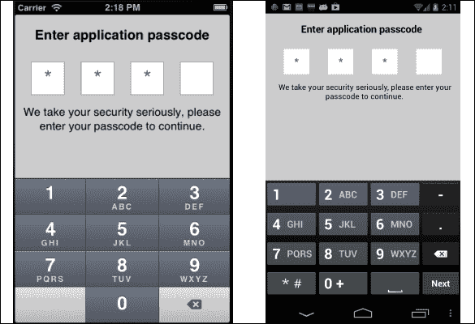

当用户点击`btnRunPasscode Ti.UI.Button`并触发`click`事件时，会启动密码验证屏幕。以下代码片段讨论了在`click`事件触发后执行的操作：

```js
btnRunPasscode.addEventListener('click',function(x){
```

1.  在`btnRunPasscode`按钮的`click`事件中的第一个代码块是创建我们的配置和其他变量。`options`对象包含配置`Ti.Passcode`窗口所需的所有设置。

    ```js
      var codeWindow  = null, 
      options = {
    ```

1.  `window`配置元素允许使用所有标准的`Ti.UI.Window`属性。以下片段展示了如何在密码验证窗口上设置`backgroudnColor`和`navBarHidden`属性。

    ```js
        window:{
          backgroundColor:'#ccc',
          navBarHidden:true
        },
    ```

1.  `view`配置元素允许配置`Ti.Passcode`窗口中显示的大多数组件。以下片段演示了如何设置`passcode`标题属性和显示错误信息的代码。

    ```js
        view:{
          title:'Enter application passcode',
          errorColor:'yellow'
        }
      };
    ```

    ### 提示

    请查阅`Ti.Passcode`模块以获取完整的配置属性列表。

1.  接下来，定义`onCompleted`回调函数。此函数将用作提供给`Ti.Passcode`模块的回调方法。密码验证结果将作为字典提供给`d`输入参数。

    ```js
      function onCompleted(d){
    ```

1.  `d`参数是一个包含验证结果的对象。`d.success`属性提供了一个指示器，表示输入的密码是否与启动时提供的密码匹配。以下代码片段会在用户输入正确的密码或需要再次尝试过程时提醒用户。

    ```js
        if(d.success){
          alert('Passcode entered is correct');
          codeWindow.close();
        }else{
          Alert('Invalid passcode, please try again');
        }
      };
    ```

1.  本食谱这一部分的下一步是创建一个新的密码模块实例。以下代码片段展示了如何完成此操作：

    ```js
      var passcode = new my.mod();
    ```

1.  然后在新的密码实例上调用 `createWindow` 方法。此方法提供了从 `txtPasscode` 控制器验证的密码，并提供了之前创建的回调和选项对象。然后此方法返回一个 `Ti.UI.Window`。一旦输入密码，回调方法 `onCompleted` 将发送验证结果。

    ```js
      var codeWindow =
      passcode.createWindow(txtPasscode.value,
      onCompleted,options);
    ```

1.  `createWindow` 方法返回的 `Ti.UI.Window` 然后以模态标志打开。密码 `Ti.UI.Window` 将保持打开状态，直到被前面讨论的 `onCompleted` 回调方法关闭。

    ```js
      codeWindow.open({modal:true});
    });
    ```

以下截图说明了用户成功输入其密码后，代码的这一部分在设备上的外观：

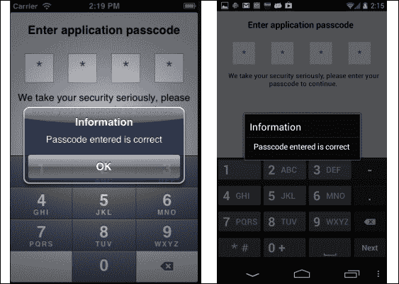

## 参见

+   本食谱使用 `Ti.Passcode` CommonJS 模块。要阅读文档并了解更多关于此项目的信息，请访问 [`github.com/benbahrenburg/Ti.Passcode`](https://github.com/benbahrenburg/Ti.Passcode)。

# 在 iOS 上处理受保护的 ZIP 文件

受保护的 ZIP 文件是交换、存储和传输企业数据的一种常见方式。ZIP 文件通常用于将多个文件捆绑在一起以进行传输或存储。作为额外的一层安全措施，所有此类文件都应该始终使用强密码进行保护。

以下食谱讨论了如何在 iOS 上创建和解压受保护的压缩文件。

## 准备工作

本食谱使用 `bencoding.zip` 本地模块来处理受保护的 ZIP 文件。此模块和其他代码资源可以从本书提供的源代码下载，或者通过本食谱末尾的 *参见* 部分的链接单独下载。在您的项目中安装此模块很简单。只需将 `modules` 文件夹复制到项目的根目录，然后将 `data` 文件夹复制到项目的 `Resources` 目录中，如图下所示：

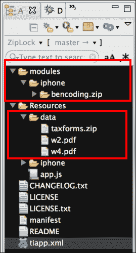

在复制提到的文件夹后，您需要在 Titanium Studio 中点击您的 **tiapp.xml** 文件，并添加对 `bencoding.zip` 模块的引用，如图下所示：

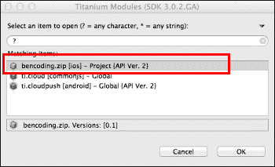

## 如何操作...

一旦您将 `modules` 和 `data` 文件夹添加到您的项目中，您需要在 `app.js` 文件中创建您的应用程序命名空间，并使用 `require` 将模块导入到您的代码中，如下代码片段所示：

```js
//Create our application namespace
var my = {
  zip : require('bencoding.zip')
};
```

### 创建食谱 UI

本食谱使用简单的 UI 来说明如何创建（压缩）和解压受保护的 ZIP 文件。本节讨论的代码展示了如何构建如图下所示的食谱 UI：

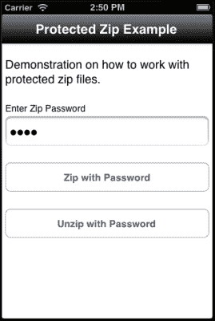

以下步骤概述了如何创建食谱的 UI：

1.  首先，创建一个 `Ti.UI.Window` 以附加所有 UI 元素。

    ```js
    var win = Ti.UI.createWindow({
      backgroundColor: '#fff', title: 'Protected Zip Example', 
      barColor:'#000',layout:'vertical'
    });
    ```

1.  然后添加 `txtPassword Ti.UI.TextField` 控件。此控件将用于提供创建受保护 ZIP 文件或解压它们的密码。默认设置为 `foo123`。这也是包含的示例文件的密码。

    ```js
    var txtPassword = Ti.UI.createTextField({
      value:'foo123',hintText:'Enter Password',
      height:45, left:5, right:5, passwordMask:true,
      borderStyle:Ti.UI.INPUT_BORDERSTYLE_ROUNDED
    });
    win.add(txtPassword);
    ```

1.  然后将 `btnZip Ti.UI.Button` 添加到 `Ti.UI.Window`。此按钮将用于在讨论本食谱时演示如何创建受保护的 ZIP 文件。

    ```js
    var btnZip = Ti.UI.createButton({
      title:'Zip with Password', 
      top:25, height:45, left:5, right:5
    });
    win.add(btnZip);
    ```

1.  接下来将 `btnUnzip Ti.UI.Button` 添加到 `Ti.UI.Window`。此按钮将用于在讨论本食谱时演示如何解压受保护的 ZIP 文件。

    ```js
    var btnUnzip = Ti.UI.createButton({
      title:'Unzip with Password', top:25, height:45, 
      left:5, right:5	
    });
    win.add(btnUnzip);
    ```

### 创建密码保护的 ZIP 文件

本食谱的这一部分演示了如何创建受保护的 ZIP 文件。以下截图显示了本食谱的实际操作，创建受保护的 ZIP 文件并提示用户输出文件路径：

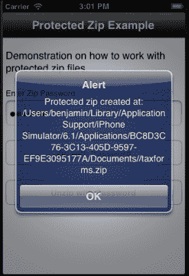

当用户点击 `btnZip Ti.UI.Button` 并触发 `click` 事件时，执行创建的 ZIP 文件。以下代码片段讨论了在 `click` 事件触发后执行的操作：

```js
btnZip.addEventListener('click',function(x){
```

1.  压缩过程的第一步是创建 `onZipCompleted` 回调方法。当压缩过程完成时，模块将结果发送到这个回调方法：

    ```js
      function onZipCompleted(d){
    ```

1.  `d` 方法参数提供了模块的结果。处理模块结果的第一步是检查 `d.success` 属性，以查看压缩过程是否成功。如果是这样，用户会收到完成 ZIP 文件的路径提示。否则，用户会收到创建文件时生成的错误提示。

    ```js
        if(d.success){
          alert('Protected zip created at: ' + d.zip);
        }else{
          alert('failed due to: ' + d.message);
        }
      };
    ```

1.  接下来创建 `writeToZip` 和 `inputDirectory` 变量。`writeToZip` 变量包含应用 `Documents` 目录中 `taxforms.ZIP` 输出文件的路径。`inputDirectory` 创建了对在食谱的 *准备就绪* 部分创建的 `Resources/data` 的引用。

    ```js
      var writeToZip = Ti.Filesystem.applicationDataDirectory + 
      '/taxforms.zip';
      var inputDirectory = Ti.Filesystem.resourcesDirectory + 
      'data/';
    ```

1.  最后调用 `zip` 方法，并在此方法中提供在 `click` 事件处理程序中构建的参数。一旦完成，`zip` 方法将结果提供给提供的 `onZipCompleted` 回调方法。

    ```js
      my.zip.zip({
        zip: writeToZip, 
        password:txtPassword.value,
        files: [inputDirectory + 'w2.pdf',
        inputDirectory + 'w4.pdf'],
        completed:onZipCompleted
      });
    });
    ```

    ### 小贴士

    `files` 参数使用 `inputDirectory` 变量提供了一个文件数组。在本例中，包含的文件是 `Resources/data` 文件夹中的 `w2.pdf` 和 `w4.pdf` 文件，这些文件是在食谱的 *准备就绪* 部分创建的。

### 解压受保护的 ZIP 文件

本食谱的这一部分演示了如何解压受保护的 ZIP 文件。以下截图显示了本食谱的实际操作，将受保护文件的文件内容解压到应用的 `Documents` 目录中：

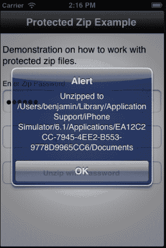

当用户点击 `btnUnzip Ti.UI.Button` 并触发 `click` 事件时，执行解压示例。以下代码片段讨论了在 `click` 事件触发后执行的操作。

```js
btnUnzip.addEventListener('click',function(x){
```

1.  解压过程的第一步是创建 `onUnzipCompleted` 回调方法。当解压过程完成后，模块会将结果发送到这个回调方法。

    ```js
      function onUnzipCompleted(e){
    ```

1.  `d` 方法参数提供了模块的结果。处理模块结果的第一步是检查 `d.success` 属性，以查看解压过程是否成功。如果是这样，用户会收到解压文件目录路径的提示。否则，用户会收到生成文件的错误提示。

    ```js
        if(e.success){
          alert('Unzipped to ' + e.outputDirectory);
        }else{
          alert('failed due to: ' + e.message);
        }
      };
    ```

1.  接下来创建 `outputDirectory` 和 `zipFileName` 变量。`outputDirectory` 变量包含应用 `Documents` 目录中输出目录的路径。`zipFileName` 变量创建了对在食谱的 *准备就绪* 部分创建的 `Resources/data/taxform.zip` 文件的引用。

    ```js
      var outputDirectory = 
      Ti.Filesystem.applicationDataDirectory;
      var zipFileName = Ti.Filesystem.resourcesDirectory + 
      'data/taxforms.zip';
    ```

1.  最后，调用 `unzip` 方法，并在此方法中提供在 `click` 事件处理程序中先前构建的参数。一旦完成，`unzip` 方法将结果提供给提供的 `onUnzipCompleted` 回调方法。

    ```js
      my.zip.unzip({
        outputDirectory:outputDirectory, 
        zip:zipFileName, 
        overwrite:true,
        completed:onUnzipCompleted
      });
    });
    ```

    ### 注意

    `zipFileName` ZIP 文件中包含的所有文件都将解压到 `outputDirectory` 参数提供的目录根目录中。

## 参见

+   本食谱使用 `benCoding.Zip` 原生模块。要阅读文档并了解更多关于这个项目的信息，请访问 [`github.com/benbahrenburg/Zipper`](https://github.com/benbahrenburg/Zipper)。
