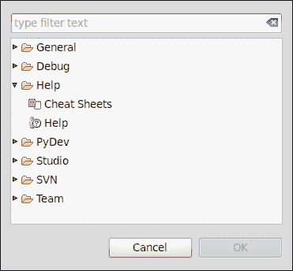
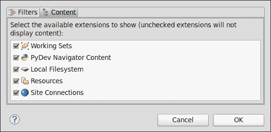

# 第二章. 基础知识以及如何使用视角和视图

*在我们熟悉了安装和更新 Aptana，以及将附加插件集成到 Aptana Studio 中之后，我们将查看 IDE 的主要功能。*

在本章中，我们将涵盖：

+   定义一些组件

+   自定义视角

+   创建、保存和删除视角

+   自定义子菜单

+   自定义菜单和工具栏

+   查看一些最常用的视图，例如**应用资源管理器**、**项目资源管理器**和**大纲**视图

+   在文件内搜索和替换

+   自定义 Aptana Studio

总的来说，在阅读本章后，您将了解关于视角的最重要的事情，包括您可以在哪里找到不同的菜单以及最常用的视图。

# 行动时间 – 更改颜色主题

我一直从不同的 Aptana Studio 用户那里听说，当他们第一次尝试 IDE 时，他们不喜欢默认在 Aptana 的新安装中选择的深色颜色和语法高亮主题。这些人更喜欢传统的语法高亮显示和白色背景等。没问题，让我们通过几个简单的步骤将主题改回经典的 Eclipse 主题。

1.  导航到**窗口** | **首选项**，然后在**Aptana Studio**条目下选择**主题**树项。

1.  在选择框内选择您喜欢的主题。

1.  在您选择了一个您觉得令人愉快的主题后，您将能够调整一些颜色并更改编辑器的字体。请慢慢来，尝试一下不同的设置可能性。

## *发生了什么？*

我们已经更改了主题，因此 Aptana 现在具有所需的外观。

### 小贴士

**保存您的主题**

在开始个性化您的主题之前，请按主题名称右侧的**+**按钮以创建其副本。最后，当您完成自定义后，最好通过导出保存您的主题。现在您将能够与团队成员共享它或在重新安装 Aptana 后恢复它。

# 行动时间 – 配置 Tab 行为

*Tab*键是开发者最常用的键之一，每个开发者的首选配置都大不相同。在以下步骤中，您将看到如何在 Aptana Studio 中调整 Tab 首选项：

1.  导航到**窗口** | **首选项**，然后在**通用**条目下选择**文本编辑器**树项。

1.  在**显示制表符宽度**字段中，您可以更改用于*Tab*键宽度的空格数。

1.  此外，您还可以勾选**为 Tab 插入空格**复选框，这样*Tab*键现在将插入您首选的空格数而不是单个*Tab*字符。

## *发生了什么？*

我们已经更改了 Tab 的行为，因此 Aptana Studio 现在会按照您的喜好处理*Tab*键的按下。

# 定义

首先，我们将定义一些术语，以便你熟悉我们正在讨论的组件。这些术语与以下截图相关。

+   **导航**：当我们谈论导航栏时，我们指的是 Aptana Studio 窗口顶部的菜单栏。

+   **工具栏**：工具栏是位于导航栏下方直接下的按钮行，它提供了一些最常用的操作按钮。

+   **视角菜单**：视角菜单位于工具栏的右侧，允许你在不同的视角之间切换。

+   **视角**：视角指的是一组视图、编辑器和首选项，它们针对特定类型的开发活动进行了优化。

+   **编辑器**：编辑器是一个你可以编辑和保存文件的空间。

+   **视图**：视图是在视角内可以进行操作的区域。Aptana Studio 提供了许多不同的视图，可以收集来自定义视角。

+   **状态栏**：状态栏位于 Aptana Studio 窗口的底部，主要提供信息。

## 导航

导航栏是一个菜单元素，正如你在许多其他软件程序中所知。我们只想指出的是，导航栏中的项目会随着视角的切换而改变。如何影响哪个菜单项出现在哪个视角中，我们将在*自定义视角*配方中讨论。

导航栏还依赖于当前焦点。例如，如果**编辑器**视图拥有焦点，导航栏将通过一个名为**源**的菜单元素进行扩展。

## 工具栏

正如刚才提到的，工具栏提供了一些选定的操作按钮。所有相关的按钮都被视为一个组，可以通过拖放轻松移动，并且可以通过**自定义** **视角...**选项控制每个按钮的可见性。

这种功能使你能够为每个视角创建一个完整的依赖工具栏，其中只集成了所需的按钮。

此工具栏的附加功能是你可以将你的按钮组放置在多行中。如果你的系统显示不是很大，以至于所有所需的按钮都只能安排在一行中，这将非常有用。

### 提示

**你知道吗？**

这种按钮分组且可以添加和移动各种项目的工具栏被称为**Coolbar**。

在以下表格中，你可以找到可用工具栏按钮的结构和功能的小部分摘录。完整的列表可以通过在**窗口** | **自定义视角...**选项卡上的**工具栏结构**中找到。如果你在你的当前视角中找不到所需的工具栏按钮，也应该查看这个部分。我们将在本章后面的*自定义视角*配方中讨论如何自定义视角以及工具栏。

因此，在 **图标** 列中，您可以看到我们正在讨论的工具栏按钮。**组** 列显示了按钮所属的组。最后，**描述** 列提供了关于按钮能做什么的简要说明。

| 图标 | 组 | 描述 |
| --- | --- | --- |
|  | **文件** | **新建** 工具栏按钮允许您创建项目、文件夹、文件等。 |
|  | **文件** | **保存** 工具栏按钮保存当前打开的文件。 |
|  | **文件** | **保存所有** 工具栏按钮保存所有打开的文件。 |
|  | **文件** | **打印** 工具栏按钮允许您打印当前打开的文件。 |
|  | **Aptana** | **切换显示或隐藏大纲视图** 工具栏按钮显示或隐藏 **大纲** 视图。 |
|  | **Aptana** | **切换显示或隐藏应用资源管理器视图** 工具栏按钮显示或隐藏 **应用资源管理器** 视图。 |
|  | **Aptana** | **Aptana Studio 启动页面** 工具栏按钮打开 Aptana Studio 启动页面，显示来自 Aptana 的最新新闻。 |
|  | **Aptana** | **显示预览编辑器** 工具栏按钮打开当前打开文件的预览。 |
|  | **Aptana** | **打开终端** 工具栏按钮打开一个新的 **终端** 视图。 |
|  | **Aptana** | **主题** 工具栏按钮在小的三角形上提供了一个菜单，用于切换到当前使用的主题，或者通过点击颜色按钮打开主题偏好设置窗口。 |
|  | **启动** | **打开 URL...** 工具栏按钮允许您通过输入 URL 打开文件。 |
|  | **启动** | **在所选行设置或清除断点** 工具栏按钮在当前所选行设置或清除断点。 |
|  | **启动** | **调试** 工具栏按钮允许您调试当前应用程序。 |
|  | **启动** | **运行** 工具栏按钮允许您运行当前应用程序。 |
|  | **启动** | **外部工具** 工具栏按钮允许您运行外部工具。 |
|  | **搜索** | **搜索** 工具栏按钮打开搜索窗口。小三角形允许您直接导航到搜索窗口内的特殊搜索标签页。 |
|  | **编辑器展示** | **标记出现** 工具栏按钮标记当前使用文件中所有类似的选择。 |
|  | **编辑器展示** | **切换块选择模式** 工具栏按钮启用或禁用块选择模式，允许您选择字符块。 |
|  | **编辑器展示** | **显示空白字符**工具栏按钮允许你显示字符，例如空白或制表符。 |
|  | **导航** | **下一注释**工具栏按钮将跳转到下一个配置的注释。 |
|  | **导航** | **上一个注释**工具栏按钮将跳转回上一个配置的注释。 |
|  | **导航** | **最后编辑位置**工具栏按钮将跳转回你最后编辑的文件。 |
|  | **导航** | **后退**工具栏按钮将跳转回最后一个有焦点的文件。 |
|  | **导航** | **前进**工具栏按钮将跳转回有焦点的文件。 |

## **视角**

视角是一组视图、编辑器和首选项，它们针对特定的活动或开发过程进行了优化。视角可以很容易地适应你的需求。

但为什么需要定义不同的视角？

由于不同编程语言的发展，你需要不同的视图和编辑器。也可以为特定项目定义一个视图，例如，经常使用终端进行 shell 操作的项目应默认包含在**终端**视图中。

### 小贴士

**使用视角在不同显示器上工作**

如果你使用笔记本，但同时也经常使用额外的显示器，那么你可能在不同的显示分辨率之间工作。因此，为每个显示分辨率定义一个视角是有可能的用例。

你如何使用视角菜单来更改视角，我们将在下一节中介绍。但如果你转到**窗口** | **导航**，还有更多可能性。除了打开、关闭和更改功能外，还有重置、保存和自定义视角的选项。

如果你通过拖放、打开或关闭新视图，或者只是调整了视图区域的大小，视角将不再像你之前定义的那样。因此，你可以将视角重置为你之前保存的那个。所有位置、视图等都将恢复。

例如，如果你向你的视角添加了一个新视图并保存了它，Aptana Studio 将在每次打开此视角时显示新视图。此外，你还可以保存一个视角的副本，并使用新名称，这样就可以创建非常相似但仍有区别的视角。

最后，有一个选项可以自定义你的视角。这是一个非常强大的功能，我们将在稍后详细讨论。

### 小贴士

**视角中的可用快捷键**

如果你不确定在视角内可以使用哪个快捷键，只需按*Ctrl* + *Shift* + *L*，即可查看当前可用的所有键绑定列表。

## 视角菜单

视图菜单允许您打开、关闭和切换不同的视图。

第一个左侧按钮打开一个新的视图。为了打开一个新的视图，您可以点击它，并弹出一个包含几个视图和最终名为**其他...**的条目的菜单。现在您可以直接打开列出的视图，或者通过使用**其他...**按钮打开使用频率较低的视图。

### 小贴士

**自定义视图菜单**

众多自定义可能性之一是选择应显示在此菜单中的视图条目。您如何选择您最常用的视图并让它们出现在此菜单中，您将在本章稍后学习，当我们开始创建自己的视图时。

只需选择一个条目并点击**确定**，Aptana Studio 将显示该视图定义的所有视图、编辑器和首选项。

在**打开视图**按钮的右侧将列出所有打开的视图。您可以通过简单地点击此视图按钮来切换到打开的视图。

### 小贴士

**切换视图快捷键**

为了快速在视图之间切换，您可以使用快捷键 *Ctrl* + *F8* 来向前切换视图，以及 *Ctrl* + *Shift* + *F8* 来向后切换视图。

如果没有足够的显示空间并列出所有打开的视图，它将显示为一个带有两个箭头的按钮，位于其右侧。此按钮将提供一个下拉菜单，让您从所有打开的视图中选择当前使用的视图。但您也可以通过右键单击来自定义菜单，通过点击**显示文本**条目来禁用文本标签，以节省更多空间并防止下拉菜单占用空间。

### 小贴士

**更多视图功能**

视图菜单仅代表一个快速菜单。为了打开或关闭一个视图，您也可以导航到**窗口** | **打开视图**或**窗口** | **关闭视图**。

### 注意

如果您在性能较低的环境中使用 Aptana，最好同时打开较少的视图。关闭当前未使用的视图。

## 编辑器

Aptana Studio 提供了许多针对其编程语言专门化的不同编辑器。例如，XML 和 HTML 编辑器提供了适应的语法高亮和展开或折叠当前打开文件节点的选项。

一些受支持的最好编辑器如下：

+   JavaScript 开发

+   Ruby 开发

+   Rails 开发

+   PHP 开发

+   HTML 开发

+   CSS 开发

### 小贴士

**转到行**

使用快捷键 *Ctrl* + *L*，您能够打开**转到**行对话框。只需打开对话框，输入行号，然后按*Enter*键，编辑器光标就会跳转到输入的行号。

提供的编辑器及其支持的完整列表可以在 Aptana Studio 网站上找到，网址为 [`wiki.appcelerator.org/display/tis/Editor+Feature+Matrix`](https://wiki.appcelerator.org/display/tis/Editor+Feature+Matrix)。

## 视图

视图是包含来自 Aptana Studio 或来自 Aptana Studio 集成插件的某些分组功能的小容器。每个视图的基本功能都是相同的。可以通过导航到 **窗口** | **显示视图** 来打开一个视图。让我们详细看看**大纲**视图，这是一个非常简单的视图。

每个视图都是一个容器，左侧有一个标签，其中包含视图菜单的图标，然后是标签（在我们的例子中是**大纲**），最后是一个**关闭**按钮，它可以从视图中移除。但视图标签还有额外的功能。您可以将其拖放到视图中另一个区域（顶部、右侧、底部或左侧）。如果您双击它，视图将被最大化到 Aptana Studio 窗口的整个大小。如果同一区域有多个视图，视图标签将连在一起。

在视图的右上角，您会发现一些额外的功能。在最右边有一个额外的最大化按钮，它具有与在标签上双击相同的功能。从右数第二个按钮可以最小化一个视图，这样您就有更多空间用于其他视图，如编辑器。其他按钮因视图而异。这些按钮控制每个视图的外观和功能。

### 小贴士

**帮助提示**

如果您不知道哪个按钮有什么功能，只需将鼠标悬停在按钮上，就会显示一个带有其功能描述的小提示。

在使用 Aptana Studio 的时候，任何时候只能有一个视图处于活动状态。这意味着活动视图是拥有焦点以接收键盘操作等的视图。

在本章的最后，我们将向您展示一些最常用的视图及其最有用的功能。

### 小贴士

**视图间切换的快捷键**

如果您想在不同视图之间切换或打开一个新视图，只需按下 *Alt* + *Shift* + *Q* 以显示所有可用的视图快捷键列表。在这个列表中，您可以使用上键和下键选择所需的视图，或者直接按下快捷键的最后一个键。

## 状态栏

最后，是状态栏，它主要提供信息。在这里，有不同视图放置的消息和一些功能，如堆状态，它显示了我们在第一章中激活的内存使用情况。但还有一个非常实用的功能，称为**快速视图栏**。它看起来如下截图所示：

### 小贴士

**快速视图栏在哪里？**

如果您在状态栏中没有找到这个栏，它可能已被禁用。只需导航到**窗口** | **首选项**，然后在**通用**条目下选择**视角**树项，并在**快速视图**部分取消选择**隐藏空快速视图栏**复选框。

快速视图栏是一个小的视图选择按钮，后面跟着一个图标列表，包含所有用于快速视图操作所选视图。这对于我们有时只需要执行快速操作的观点非常有用。如果快速视图已打开，并且您在视图外部点击某处，快速视图会自动隐藏。

还包括文件相关的功能，如命令菜单和文件信息，这些仅在**编辑器**视图获得焦点时可见。它显示有关文件是否可写以及光标当前所在的列和行的信息。

# 自定义视角

Aptana Studio 允许您以非常高的细节自定义您使用的视角。您有多种设置和编译选项，可以将所有需要的功能和动作收集到 IDE 的理想位置。

您可以通过导航到**窗口** | **自定义视角...**来找到允许您进行大部分设置以自定义视角的窗口。**自定义视角...**窗口分为四个标签页，我们可以在这里自定义工具栏、导航、命令组和快捷键。

第一个标签页用于**工具栏可见性**选项。在这里，您可以选择每个按钮组应可见的按钮。

第二个标签页用于**菜单可见性**选项。在这里，您也可以在您视角的导航中选择所需的功能。

第三个标签页用于**命令组可用性**选项。在此标签页中，您可以将命令组添加到您的视角中。例如，如果您想将一些操作，如 SVN 插件的提交或更新，添加到工具栏或导航中，您必须在此标签页的**可用命令组**选项中选择 SVN 条目。现在您可以在工具栏和菜单标签中选中 SVN 功能。

第四个也是最后一个标签页用于**快捷键**选项。此标签页提供了通过导航到**文件** | **新建**、**打开视角**和**显示视图**菜单来修改子菜单的能力。

## 创建自定义视角

现在我们想创建我们自己的自定义视角。因此，我们将首先创建一个与我们的目标自定义视角最相似的视角的副本。这很快就能完成。例如，只需激活**Web 视角**，导航到**窗口** | **另存为视角...**，并以不同的名称保存视角。因此，我们使用相同的名称，并在其后加上单词**customized**。

在我们按下**确定**按钮后，Aptana 将创建当前激活视角的完整副本，我们现在可以开始对其进行自定义。

## 安排视角视图

从新工作区的**Web 视角**选项开始，我们首先将安排所需的视图。因此，我们通过单击此标签激活**示例**视图。视图获得焦点，**关闭**按钮将可见。现在，通过单击标签右侧的**关闭**按钮，将**示例**视图从你的视角中隐藏。

此外，以同样的方式关闭所有其他你不需要的视图。

因此，现在，在我们刚刚移除了所有不必要的视图之后，我们有足够的空间放置真正必要的视图，并且我们可以重新排列这些剩余的视图，使其结构更有用。

# 安排视图的时间

将视图移动到视角的另一个区域可以通过不同的方式完成。最简单、最快的方式是通过拖放操作。

1.  将鼠标移至视图的标签上，通过按下并保持鼠标左键开始拖动操作。

1.  当你在 Aptana Studio 窗口的不同区域拖动视图时，请注意鼠标光标。当你将视图放置在当前位置时，光标将变为箭头，表示视图将附加在该区域。

1.  释放鼠标左键，以便将视图放置在当前位置。

移动视图的另一个选项是使用上下文菜单。

1.  在标签上右键单击，出现上下文菜单。

1.  前往**移动** | **视图**，仅将标签移动到新区域。

1.  如果你想一次性移动整个标签组，请转到**移动** | **标签组**。

1.  选择**操作**视图或**标签组**视图后，光标将变为帮助你放置视图的图标。

1.  如果光标显示的图标表明视图将在目标区域附加，只需单击鼠标即可完成移动操作。

## **发生了什么？**

现在我们已经将所有视图放置在我们需要的区域。

最后，如果我们遗漏了一些额外的视图，我们可以通过添加更多视图来补充我们的视角。

# 添加新视图的时间

要将新视图添加到我们的视角中非常简单；只需按照以下步骤操作：

1.  导航到**窗口** | **显示视图**。

1.  如果所需的视图不在菜单中，只需单击**其他...**，你将获得一个包含所有可用视图的选择窗口，按模块或插件分组。

1.  只需选择所需的视图，然后通过点击**确定**来接受它。

1.  选择窗口会自动关闭，新视图会出现在视角的随机区域。

1.  现在，您只需将视图移动到视角所需的区域。

## *发生了什么事？*

在您完成所需视图的重新排列后，您的视角可能看起来像以下截图：

## 定制选择菜单

现在，在我们收集了视角所需的视图之后，我们将考虑那些我们只偶尔使用的视图。因此，我们可以以快速的方式访问这些视图。我们可以自定义**快速视图**菜单的选择，正如您所记得的，它位于状态栏的左侧，以及位于**窗口**导航条下的**显示视图**菜单中的选择。

# 操作时间 - 定制视图选择菜单

在第一步，我们想要定制视图选择菜单。

1.  导航到**窗口** | **自定义视角...**并选择**快捷方式**选项卡。

1.  在此选项卡的左上角，您将找到一个复选框，允许您选择要定制的子菜单。我们选择**显示视图**条目，并查看选项卡的其他内容。

1.  在左侧，我们看到快捷方式类别。如果您在左侧选择一个类别，内容区域将显示该类别中所有可用的视图条目。

1.  现在您必须遍历类别并选择或取消选择所需的视图。在这个时候，我们想要取消选择**大纲**和**应用探索器**视图，因为如您所记得，Aptana Studio 提供了这两个视图及其自己的工具栏按钮。因此，激活**通用**类别并禁用**大纲**条目。进一步，激活**工作室**类别并禁用**应用探索器**条目。

1.  如果您准备好了，通过点击**确定**来接受更改，并查看结果。

## *发生了什么事？*

现在我们已经用所有必要的视图项填充了**快速视图**和**显示视图**菜单。

以同样的方式，我们也可以自定义视角菜单。

1.  再次导航到**快捷方式**选项卡，并选择**打开视角**子菜单。

1.  这里没有可用的类别，所以我们只选择最常用的视角，例如，**SVN 仓库探索**、**Web**和**Web 定制**。结果可能看起来像以下截图：

在这些步骤之后，我们已经将所有常用的视角项填充到视角菜单中。

# 操作时间 - 定制新子菜单

我们可以定制的最后一个子菜单是在导航到**文件** | **新建**或点击**新建**工具栏按钮右侧的小三角形时找到的新子菜单。

1.  再次导航到**快捷键**选项卡并选择**新建**子菜单。

1.  例如，如果我没有在 Ruby 和 Rails 项目中工作，我将取消选择**Other**类别中的**Rails Project**条目和**Ruby**类别中的**Ruby Project**条目。

1.  代替被删除的两个条目，我在**Web**类别中选择了**PHP 项目**条目。

## *发生了什么？*

我们现在创建了一个最常用项目类型的快捷方式，以便快速访问。

## 命令组可用性

在**自定义视角**窗口的第三个选项卡**命令组可用性**选项卡中，您可以选择要添加到您视角中的命令组。

命令组提供菜单项、工具栏按钮和键盘绑定的命令。在一个视角中使命令组不可用会移除这些执行命令的方法。在您使命令组可用后，您能够详细调整哪些功能应该可用以及它们在什么上下文中可用。

# 操作时间 – 添加和删除命令组可用性

我们现在将添加 SVN 插件到命令组，因为我们想在后面的章节中使用它。

1.  导航到**窗口** | **自定义视角...**并选择**命令组可用性**选项卡。

1.  在**可用命令组**列的左侧选择**SVN**条目，**菜单栏详情**和**工具栏详情**列将填充相关的命令。

1.  其他不必要的条目，如可能不需要的**Ruby Debug**条目，可以取消选择。

1.  在您通过点击**确定**接受更改后，窗口会自动关闭，并且您的视角工具栏和菜单正在刷新。

## *发生了什么？*

最后，如果您仔细查看工具栏和菜单，您会看到已经添加了新的 SVN 条目。我们现在将看到如何自定义它们。

## 工具栏可见性

现在我们想要自定义工具栏的可见性。这意味着我们可以选择工具栏提供的可用功能。

# 操作时间 – 自定义工具栏

1.  再次导航到**窗口** | **自定义视角...**并切换到**工具栏可见性**选项卡。

    ### 小贴士

    **禁用条目**

    **工具栏可见性**和**菜单可见性**选项卡中的灰色条目已被禁用，因为它们的命令组不可用。只需切换到**命令组可用性**选项卡并激活所需的组。

1.  在这里，您可以找到所有可用的工具栏按钮，以及通过使用复选框来启用和禁用它们的选项。作为默认设置，大多数工具栏按钮已经被选中。但是，因为我们想减小工具栏的大小，所以我们取消选中了**从 SVN 检出**选项的工具栏按钮。因此，我们搜索**SVN**选项卡并删除了完整的条目，因为其中只包含**从 SVN 检出**。

## *发生了什么？*

经过这些步骤，您将有一个精心挑选的工具栏按钮。

## 菜单可见性

现在我们将定制菜单可见性。这意味着我们可以选择导航栏提供的可用功能。

# 行动时间 - 定制菜单

1.  再次导航到**窗口** | **自定义视角...**并切换到**菜单可见性**选项卡。

1.  在这里，您可以找到所有可用的菜单条目，以及通过使用复选框来启用和禁用它们的选项。就像**工具栏可见性**选项一样，菜单可见性也有一个默认设置，即所有附近的条目都已经选中。但是在菜单的情况下，这是可以的——我们可以保持不变。

1.  如果您已经取消选中了一些条目，您可以导航到相关的菜单点，您会看到这些条目已经消失了。

## 保存视角

在您花费一些时间通过创建一些视角来定制 Aptana Studio 之后，有一个重要的事情需要添加。

不要忘记在所有更改完成后保存视角。如果您忘记了，Aptana Studio 将在关闭 IDE 后丢失所有这些更改！

# 行动时间 – 保存视角

为了保存您的视角，只需按照以下步骤操作：

1.  导航到**窗口** | **另存为视角...**并选择要保存的视角。

1.  如果您想保存现有的视角，通过点击**是**来确认保存操作。

    现在，您个性化视角的所有更改都已保存。如果您现在移动一些视图或更改其他内容，在执行重置后，您的视角将看起来并表现得像保存的那个。

## 视角首选项

但还有更多。如果您导航到**窗口** | **首选项**，然后在树中转到**常规** | **视角**，您可以配置更多视角的行为。

例如，您可以决定新视角是在同一个窗口中打开还是在新的窗口中打开，等等。我们将保持这个设置不变，并查看这个窗口中的其他可能性。

## 删除视角

在本节中，我们将了解如何删除一个视角。

# 行动时间 – 删除视角

如果您想删除一些未使用的视角，只需按照以下步骤操作：

1.  再次导航到**窗口** | **首选项**，然后在树中转到**常规** | **视角**。

1.  在这里，你可以找到所有可用视角的完整列表。现在你可以选择一个不再需要的视角，并通过点击**删除**按钮将其删除。

我们已经删除了一个未使用的视角；并且它已经完全从 Aptana Studio 中移除，不再出现在任何地方。

## 标记默认视角

在我们创建了自己想要经常使用的视角之后，我们应该将这个视角标记为默认视角。

# 操作时间 – 标记默认视角

1.  再次导航到**窗口** | **首选项**，然后在树中转到**通用** | **视角**。

1.  在这里，你可以找到所有可用视角的完整列表。现在你可以选择一个派生视角，并通过点击**设置为默认**按钮将其标记为默认视角。

## *发生了什么？*

我们已经将我们自己创建的视角标记为 Aptana Studio 的默认视角。

# 最常用的视图

在下一节中，我们将查看 Aptana Studio 中最常用的几个视图。

## 应用资源管理器视图

**应用资源管理器**视图通过处理项目中的文件来帮助你。在这个视图的头部，你可以选择要工作的项目，然后是一个与系统搜索链接的文件搜索。所以如果你使用这个搜索字段进行搜索，搜索视图将显示结果。

在视图菜单中，你可以通过点击小三角形按钮打开它，Aptana Studio 为你提供了与编辑器链接的功能。这是一个很好的功能，它总是选择与你在编辑器中选择相同的**应用资源管理器**视图中的文件。

但是，你可以通过点击**自定义视图...**标签来在这个视图中进行更多自定义。视图菜单的自定义对话框由两个标签组成。首先是**过滤器**标签。**过滤器**标签允许你，正如其名称所暗示的，过滤视图菜单中列出的文件。

因为我们经常处理隐藏文件，例如`.htaccess`文件，所以我们禁用了`.*资源`条目，这隐藏了所有以**.**开头的资源。

此外，还有一个**内容**标签，它允许你显示扩展的内容。

但是，就像在大多数其他视图中一样，在这个视图中也有特定的视图按钮可用。从左边开始，有一个可用的按钮可以折叠所有打开的元素。接下来是一个部署按钮，我们将在后面的章节中讨论。最后，命令菜单提供了其他一些功能；但我们还没有讨论这一点。

## 项目资源管理器视图

**项目资源管理器**视图与**应用资源管理器**视图类似。区别在于**项目资源管理器**视图跨越所有项目，因此我们只讨论额外的功能。

**自定义**视图对话框在**内容**选项卡中提供了一些更多可用的扩展。

其他差异在于视图特定的按钮。在这里，与编辑器链接的功能有自己的按钮。此外，还有**同步**、**上传**和**下载**按钮，这些对于远程工作至关重要。

## 属性视图

**属性**视图根据当前打开的文件和编辑器中光标的位置显示信息。如果你选择了某些字符，它也会受到影响。以下信息包括选定的文本、长度、偏移量等：

但**属性**视图也会显示如果你在文件树中选择一个文件时的一些信息，例如关于**应用资源管理器**视图或**项目资源管理器**视图的信息。在这种情况下，信息包括名称、位置和最后修改时间。

## 大纲视图

**大纲**视图显示当前打开和聚焦文件中代码元素的分层分组。包含的元素取决于相关文件的文件类型。因此，如果相关文件是一个标记文件，如 HTML 或 XML 文件，**大纲**视图将显示其节点的结构。

在这种情况下，**大纲**视图允许你展开和折叠文件的节点。还有一个过滤功能，允许你搜索节点，如果你通过双击**大纲**视图选择一个节点，编辑器将跳转到相关行。

HTML 文件的**大纲**视图除了提供显示结构内文本节点按钮外，还提供了一些其他功能。

如果你打开一个脚本文件，例如 JavaScript 或 PHP 文件，**大纲**视图将显示包含的变量、函数、类等。**大纲**视图可以显示的信息量太大，难以一一列举。

但每个文件类型都有一些功能。**A-Z**按钮按字母顺序对所有级别的元素进行排序。在视图菜单中，你可以通过点击小三角形按钮打开它，你还可以展开或折叠所有元素。

因此，**大纲**视图是快速导航大型文件中最有帮助的视图之一。

# 搜索和替换

Aptana Studio 中的**搜索**工具是一个强大的工具，它由一个搜索对话框组成，你可以在这里配置并启动搜索，以及一个搜索视图，其中列出了搜索结果。此外，还有一个替换匹配项的功能和一个搜索首选项部分。

## 搜索对话框

**搜索**对话框可以通过使用**搜索**菜单项或点击**搜索**工具栏按钮来打开。但根据当前活动视图，有时也可以通过快捷键*Ctrl* + *F*访问。

对话框本质上包含三个部分。首先，是搜索模式，换句话说，要搜索的字符。在这里，您可以选择区分大小写或不区分大小写的搜索。但搜索模式也可以是正则表达式，这使得搜索更强大。

此外，您可以定义一个文件名模式，以决定 Aptana Studio 应在哪些文件中搜索。这非常有用，例如，如果您已经知道相关的搜索模式可以存在于一个 PHP 文件中，您可以使用`*.php`作为文件名模式。

最后是范围，它可以限制检查的文件数量。此值的默认设置是**工作区**范围。这意味着，如果您以**工作区**范围开始搜索，Aptana Studio 将在**工作区**中的所有文件和所有项目中查找模式。在某些情况下，这可能是非常多的文件。因此，最好从一开始就限制范围，例如，通过选择一个资源。这很快就能完成。在您打开搜索对话框之前，导航到您的**应用资源管理器**或**项目资源管理器**视图，并选择您想要搜索的文件夹。现在打开搜索对话框，并在**范围**部分选择**选定的** **资源**条目，然后您就可以在有限范围内进行搜索了。

## 搜索视图

**搜索**视图与搜索对话框紧密相关，我们刚刚已经描述过。在您开始搜索并启动它之后，**搜索**视图将可见，并列出所有匹配的文件。

在我们示例搜索**第一个**模式在**工作区**范围内之后，我们得到了以下搜索结果：

如果视图菜单设置**显示为树状**被选中，列表结构将像文件树一样构建，并相应地展开和折叠。在每个文件条目之后是匹配项的数量。如果您展开一个文件节点，您将得到一个列表，其中列出了找到匹配项的行。因此，当您双击搜索结果行时，编辑器将在相关行打开文件。

**搜索**视图提供了一系列不同的视图特定按钮，这些按钮通过有用的功能扩展了搜索。

从左侧开始，有**显示下一个匹配项**按钮和**显示上一个匹配项**按钮，如果您正在搜索搜索结果的特殊匹配项，这两个按钮非常有用。

### 小贴士

**快速访问下一个和上一个匹配项**

使用快捷键*Crtl* + *.*快速切换到下一个匹配项，或使用*Crtl* + *,*切换到上一个匹配项。

**删除所选匹配项（删除）**按钮和**删除所有匹配项**按钮允许你从列表中删除匹配项。**删除所选匹配项（删除）**按钮仅删除单个匹配项，而**删除所有匹配项**按钮则删除所有匹配项。

**展开全部**按钮和**折叠全部**按钮仅在将搜索结果显示为树时可见，并允许你展开或折叠所有条目。

**再次运行当前搜索（F5）**按钮允许你再次启动相同的搜索。如果你已经更改了匹配项，以便这些匹配项可以通过新的搜索被省略，这很有用。

**取消当前搜索**按钮在你在大量文件中运行搜索且搜索似乎花费了很长时间的情况下取消搜索。

我们将要看到的最后一个按钮是**显示上一个搜索**，它通过一个小三角形扩展，提供包含最近搜索的列表。

## 搜索首选项

就像 Aptana Studio 的许多其他主要功能一样，**搜索**视图在**首选项**标签页中有一个部分。为了进行一些更改，导航到**窗口** | **首选项**，然后在树中选择**通用** | **搜索**节点。

在这里，你将找到其他选项，例如**重用编辑器以显示匹配项**。此选项控制 Aptana Studio 是否为每个选定的文件打开自己的编辑器，或者始终重用相同的编辑器。

当你激活此选项时，有时它可能很有用，例如，当你使用**显示下一个匹配项**或**显示上一个匹配项**功能在搜索结果中进行导航时。这样，你就不需要为每个打开的文件分配一个专门的编辑器，每次也必须关闭它。

但另一方面，如果你为每次搜索打开一个文件，查看该文件，并想要查看另一个文件，那么如果 Aptana Studio 使用一个新的编辑器而不是相同的编辑器，你可以在其中进一步查看或工作，那就更好了。

## 替换匹配项

如果你想在项目中替换一些字符模式，你也可以使用**搜索**功能来完成此操作。

按照刚才描述的模式进行搜索，不同之处在于你按下**替换...**按钮而不是**搜索**对话框中的**搜索**按钮。我们的搜索示例`firstDataNode`模式开始，并在另一个对话框中显示替换。

在对话框的标题栏中，你可以获得有关在多少个文件中找到多少个匹配项的信息。在**替换**字段中，你会恢复你的搜索模式，后面是必须输入替换内容的字段，如果搜索模式也是一个正则表达式，则该替换内容也可以是正则表达式。

最后，在大量文件中替换某些内容之前，你可以先查看预览。当你不知道你的模式是否可能包含不想要的匹配项时，这很有用。

如果你不需要预览，只需点击**确定**来替换所有出现。

# 自定义 Aptana Studio 3

在以下步骤中，我们希望自定义我们的 Aptana Studio 安装，以便你能在舒适的环境中工作。

## 尝试一下英雄配置 – 配置 Aptana Studio

你的第一个任务是进入你的 Aptana Studio 安装，并尝试创建你自己的视角。继续按照你的喜好进行个性化设置，并按照你的需求安排包含的视图。

最后，别忘了保存你的更改；否则，在你重启 Aptana Studio 后，所有更改都将丢失。

## 快速测验 – 测试你新学到的 Workspace 知识

Q1. 按钮分组并可以添加和移动各种项目的工具栏叫什么？

1.  工具栏

1.  Foolbar

1.  Coolbar

Q2. 你可以在哪个菜单中切换视角？

1.  主菜单

1.  视角菜单

1.  右键菜单

Q3. 你如何获取未知按钮的描述？

1.  你将鼠标悬停在按钮上，等待工具提示

1.  你只需按下它，看看会发生什么

1.  你右键点击它，并获取一些关于它的信息

Q4. 哪些元素可以在视角中分组？

1.  视图、导航和工具栏

1.  视图、编辑器和首选项

1.  编辑器、窗口和状态栏

Q5. 为什么你不能选择工具栏和菜单可见性选项卡中的灰色条目？

1.  因为所需的命令组不可用

1.  因为该功能未安装

1.  因为你没有所需的授权

Q6. 为什么你应该在做出一些更改后保存你的视角？

1.  因为这些更改会立即丢失

1.  因为操作系统重启后更改会丢失

1.  因为 Aptana Studio 重启后更改会丢失

Q7. 哪个功能让你可以在视图中快速执行操作？

1.  快速视图菜单

1.  快速食品菜单

1.  快速树菜单

Q8. 你如何加快搜索速度？

1.  通过使用更小的范围

1.  通过减少搜索模式长度

1.  通过使用更简单的搜索模式

# 摘要

在阅读本章后，你应该能够使用所有需要的功能来自定义 Aptana 和你的视角。此外，你应该能够创建一个包含所有所需功能的自定义视角。

你应该知道如何使用视图，以及如何在你的工作空间或更小的范围内搜索和替换某些字符模式。

在下一章中，你将开始创建你的第一个工作空间和项目，并学习如何使用它们。
