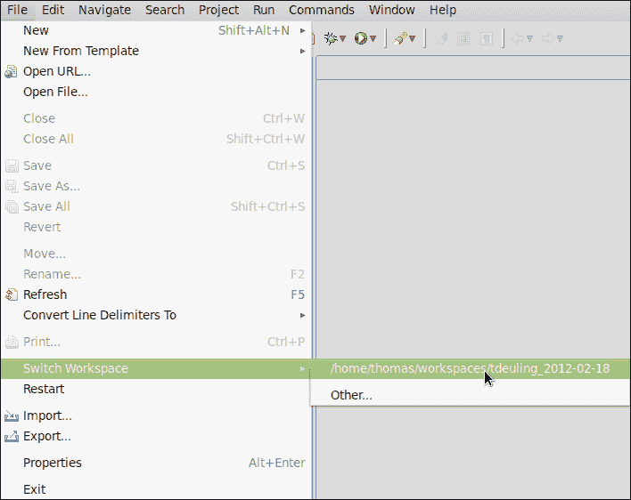

# 第三章. 使用工作区和项目

*现在我们已经熟悉了 Aptana Studio 的基本结构和主要功能，让我们继续探讨两个最重要的功能，即工作区和项目。*

*工作区和项目允许您将所有项目和作业文件分割和分组成逻辑上和用户友好的单元，通常使工作更加高效。让我们直接开始，看看工作区是什么以及它们有什么好处。*

本章我们将涵盖的主题包括：

+   工作区是什么以及它们有什么好处

+   创建和删除工作区

+   如何在不同的工作区之间切换

+   导入和导出 Aptana Studio 首选项

+   在 Aptana Studio 中可用的项目类型

+   创建单个项目

+   常见的导入项目方式

+   删除不必要的项目

+   更改项目类型

+   关闭和打开项目的原因

+   在处理大型项目时提高性能

+   在项目中创建新文件

# 工作区

工作区允许您将许多可能相互关联的项目和源代码分组在一起。工作区还包含一系列首选项，例如配置的主题、快捷键设置和代码格式配置。请注意您工作区的大小；它不应该太大，否则系统的性能可能会受到影响。Aptana Studio 可以处理的项目数量和大小取决于您的系统内存和 Aptana Studio 配置的内存设置。

### 小贴士

**更高的性能**

如果您注意到随着您项目的增长，系统的性能在下降，您可能需要将工作区分成多个独立的工作区或关闭一些当前未使用的项目。关闭项目的具体方法将在本章后面解释。

对于开发者来说，操作工作区的方式有很多种。有些人使用单一的工作区来管理所有项目。在这种情况下，他们通常必须关闭不需要的项目或增加内存以保持良好的性能。

其他开发者反过来，会使用很多不同的工作区，并进一步将其作为分组的机会。

但为什么你应该将项目分组到不同的工作区中呢？

有很多原因。比如说，你用不同的编程语言编码。例如，你为一位或多位客户间歇性地在不同的项目上工作。客户组 1 正在基于 Zend 框架/PHP 的项目上进行开发，而客户组 2 正在基于 OpenLaszlo/Flash 的项目上进行开发。在这里，我们将所有属于 ZendFramework/PHP 类别的项目放在一个工作区中，而将所有其他项目放在 OpenLaszlo/Flash 类别的另一个工作区中。如果你需要知道如何在类似的项目中解决特定问题，你可以快速找到答案。由于我现在以自由职业者的身份工作，我自己使用根据个别客户分组的不同工作区。这意味着我经常不得不改变我的工作环境。对于一些客户，我在现场帮助他们，而对于其他客户，我在自己的办公室工作。

我们与许多客户合作完成了不同的项目，但这些项目的方法完全不同。在这里，为每个客户创建一个单独的工作区非常有用。如果你为不同的客户开始一个新的工作部分，你可以简单地更改工作区，一切都将保持你离开时的状态。

## 当前工作区

如果你经常在不同的工作区中工作，你可能想知道：我现在在哪个工作区？或者当前工作区在我的本地文件系统中的位置在哪里？我如何定位当前工作区？

1.  导航到**文件** | **切换工作区...** | **其他...**。

1.  在这里，您可以在**工作区**字段中找到当前活动工作区的路径。

1.  按**取消**关闭此窗口。

## 创建工作区

现在我们想开始使用项目。首先，我们必须定义一个工作区。

# 行动时间 - 创建新的工作区

1.  导航到**文件** | **切换工作区** | **其他...**。

1.  窗口要求我们选择一个文件夹，以便我们存储新的工作区。因此，由于我支持使用多个小型工作区而不是一个大型工作区，我在我的主目录中首先创建了一个名为`workspaces`的文件夹。

1.  第一个工作区应该包含我的个人项目，因此我给它们命名为`tdeuling`并附加创建日期。

1.  在**复制设置**选项卡中，您可以选择哪些设置应该复制到新工作区。**工作区布局**将复制所有打开的视图、它们的尺寸和选定的视角到新工作区。**工作集**将复制所有用户定义的工作集到新工作区。

1.  通过点击**确定**，Aptana Studio 会自动保存打开的工作区并关闭它。此后，Aptana Studio 会自动启动到新创建的工作区。

## *发生了什么？*

我们刚刚创建了一个额外的工作区，你可以在这里定位一些项目，可能是针对某种特殊的编程语言，或者用于分组客户项目。

## 导入和导出首选项

仔细观察后，我们发现所有设置都丢失了。这可能会相当令人烦恼，尤其是如果您已经做了很多个性化设置并需要创建一个新的工作空间。为了避免每次创建新工作空间时都需要设置偏好，Aptana Studio 提供了导入和导出设置的选项。

# 操作时间 – 导出 Aptana Studio 偏好设置

1.  导航到**文件** | **导出...**。

1.  在窗口中，选择**通用**条目下的**偏好设置**条目，然后点击**下一步**。

1.  选择要导出的偏好设置。我们希望导出所有设置，因此我们将选择**导出全部**复选框。

1.  文件名必须以`.epf`（Eclipse 偏好设置文件）后缀结尾，这样就可以选择文件并在以后导入偏好设置。

1.  点击**完成**按钮以完成导出。

## **发生了什么？**

现在，我们已经将所有偏好设置保存到了本地文件。如果您现在创建一个新的工作空间或设置 Aptana Studio 的新安装，您将能够恢复所有偏好设置。

但您如何将保存的偏好设置导入回来？看看这是多么简单。

# 操作时间 – 导入 Aptana Studio 偏好设置

1.  导航到**文件** | **导入...**。

1.  在窗口中选择**通用** | **偏好设置**条目，然后点击**下一步**。

1.  选择您想要导入的偏好设置。如果我们想导入之前导出的所有设置，我们将选择**导入全部**复选框。

1.  现在，您必须选择包含偏好设置的文件。

1.  点击**完成**按钮以完成导入。

## **发生了什么？**

这非常简单。我们只是导入了之前导出的所有设置。让我们看看 Aptana Studio 并分析调整后的偏好设置的行为和外观。

例如，如果您已更改 Aptana Studio 的主题，您的新工作空间应显示该主题，并且所有其他偏好设置也应已恢复。

## 在不同工作空间之间切换

现在，您肯定想知道如何在不同工作空间之间切换。在不同工作空间之间切换与创建新工作空间一样简单。

# 操作时间 – 切换到另一个工作空间

1.  导航到**文件** | **切换工作空间...**，从列表中选择所需的工作空间。

1.  如果您所需的工作空间不在列表中，只需点击**其他...**。

1.  最后选择工作空间目录，然后点击**确定**以完成选择。

1.  在创建新的工作区时，Aptana Studio 会自动保存当前打开的工作区并关闭它。之后，Aptana Studio 会自动以新选择的工作区启动。

## *刚才发生了什么？*

您刚刚通过单次选择切换了工作区、项目和偏好设置到另一个——如此简单，不是吗？

## 删除不必要的工区

删除现有工作区非常简单。您只需删除文件系统中的工作区目录即可。

### 注意

在您删除工作区之前，您必须切换到另一个工作区。如果您不这样做，Aptana Studio 将尝试使用已删除的工作区启动，并在找不到它们时崩溃。结果是 Aptana Studio 将无法再启动。如果发生这种情况，请参考第十二章，*故障排除*，以修复它。

# 行动时间——删除工作区

1.  打开 Aptana Studio，并确保您想要删除的工作区中没有包含您将来可能需要的项目或文件。

1.  切换到另一个工作区，就像我们在本章前面学到的。

1.  在您偏好的文件浏览器中导航到您的工作区，然后删除该目录。

## *刚才发生了什么？*

您已从系统中删除了不再必要的工作区。

### 小贴士

**同时从最近的工作区列表中移除工作区**

为了从最近的工作区列表中移除已删除的工作区（您将在**文件** | **工作区**下找到该列表），请导航到**窗口** | **首选项**，并从**通用**选项卡下的**启动**和**关闭**选项中选择**工作区**树项。只需从列表中选择您已删除的工作区，然后点击**移除**。

## 工作区偏好设置

Aptana Studio 提供了许多偏好设置，以便根据您的需求调整工作区。您可以通过导航到**窗口** | **首选项**来找到所有这些设置。在本节中，您必须在左侧树中选择**通用** | **工作区**。因为 Aptana Studio 提供了很多偏好设置，所以我们无法检查所有这些。只需花时间仔细查看可用的偏好设置。我提到了一个有用的设置，该设置调整 Aptana Studio，使其每次启动时都会提示您选择工作区。

# 行动时间——在启动时提示选择工作区

如果您正在使用很多工作区，当 Aptana Studio 启动时选择了错误的工作区而不是您需要的工作区，有时会有些烦恼。

因此，您必须等待 Aptana Studio 启动完成，然后才能更改工作区。之后，您必须等待 Aptana Studio 再次关闭。之后，Aptana Studio 将以所需的工作区启动。这需要很多时间，每次都很烦人。

但幸运的是，你可以教会 Aptana Studio 在每次启动前询问你所需的要加载的工作空间。这可以通过执行以下步骤快速完成：

1.  导航到**窗口** | **首选项**并选择**通用** | **启动和关闭** | **工作空间**树项。

1.  现在选中**启动时刷新工作空间**复选框。

1.  应用更改并关闭**首选项**窗口，通过点击**确定**。

## *发生了什么？*

我们更改了启动首选项，所以 Aptana Studio 会在每次启动前询问你想要在哪个工作空间中工作。如果你需要在不同工作空间之间多次切换，这个设置将为你节省很多时间。

## 快速问答 - 测试你新学到的项目知识

Q1. 文件应该以什么结尾才能成为首选项导出文件？

1.  .epf

1.  .pef

1.  .ini

Q2. 在删除工作空间之前，你必须做什么？

1.  打开你想要删除的工作空间。

1.  关闭你想要删除的工作空间。

1.  关闭当前工作空间的全部视角。

# 与项目一起工作

在 Aptana Studio 中，一个项目就像是一组源代码文件，这些文件共同属于一个网络应用程序、网站或类似的东西。

但在我们开始创建第一个项目之前，让我们看看 Aptana Studio 提供的项目性质。

## 项目性质

项目性质允许我们指定项目的性质。通过为项目分配性质，你可以为其启用额外的功能。

项目性质有助于识别文件中存在的源代码类型。项目性质影响许多事情，主要是代码助手。

这主要取决于项目是如何被索引的；好吧，一些项目类型实际上是几个其他类型的组合，正如你可以在以下表格中看到的那样。所以，实际上，你可以在你的项目中拥有任何文件类型，但项目性质定义了在特定项目中不同文件是如何被评估的。现在，在以下表格中，你将找到一个具有特定性质的文件类型：

| 类型/性质 | CSS | HTML | JavaScript | Ruby | ERB | PHP |
| --- | --- | --- | --- | --- | --- | --- |
| Web | x | x | x |   |   |   |
| Ruby | x | x | x | x | x |   |
| Rails | x | x | x | x | x |   |
| PHP | x | x | x |   |   | x |

如前表所示，PHP 性质的项目是为 PHP 开发量身定制的，Rails 性质的项目是为 Rails 开发定制的，Ruby 性质的项目是为 Ruby 开发定制的，Web 性质的项目是为 Web 开发定制的，使用 HTML、CSS 和 JavaScript 等技术。

如果你使用的是**项目资源管理器**视图，你可以通过扩展项目文件夹的小图标来识别项目的性质，如图所示：

## 创建新项目

现在我们想在我们的工作区中创建我们的第一个项目。Aptana Studio 提供了不同的方法来做这件事。最快的方法是使用工具栏。只需点击新建按钮左侧的小三角形。它显示为一个小的菜单，我们可以直接选择新项目的项目类型。

### 小贴士

**快捷键**

为了更快地创建一个新项目，你可以使用键盘快捷键 *Shift* + *Alt* + *N*。它直接提供一个选择菜单，类似于新菜单，你可以使用箭头键选择所需的项目类型。

因此，从选择项目类型的各种方式中，我们将选择此示例的 **Web 项目**。

打开此项目创建选择的一个替代方法是导航到 **文件** | **新建**。但显示的项目条目列表并不是所有可用项目的完整列表。如果你选择 **项目...** 项，你将收到一个包含所有项目类型的窗口。

现在我们可以通过点击 **下一步 >** 来跳到下一步，在那里我们可以为我们的新项目选择一个模板。

在选择项目模板后，我们将进行下一步，在那里我们必须定义项目名称并选择其在磁盘上的位置。

好的，现在我们开始了。项目的名称应该清楚地描述项目包含的内容。因此，我在 `www` 文件夹中的网络项目总是按照域名命名。默认位置是当前工作区中的一个文件夹，其名称与项目名称相同。

### 小贴士

**自定义位置**

有时候，将项目文件定位在工作区之外的位置是有用的。例如，你可能有一个本地、Apache 网络服务器正在运行，它始终在你的 `www` 文件夹中提供你项目的当前版本。没问题；只需将位置更改为工作区之外的文件夹，你的项目仍然会与你的工作区相关联。

### 小贴士

**文件同步**

作为默认设置，Aptana Studio 在 Aptana Studio 外发生修改时自动刷新或同步工作区中的文件。如果你想禁用此行为，只需导航到 **首选项** | **通用** | **工作区** 并取消选择访问复选框上的 **刷新** 按钮。

为了展示如何创建项目的另一个示例，我们将查看 **提升到项目** 功能。此功能允许你从文件系统中选择一个文件夹并将其转换为新的项目。

# 行动时间 - 使用提升到项目功能

1.  首先，导航到 **项目资源管理器** 视图。

1.  现在展开文件系统节点，导航到文件夹，它应该是一个项目。

1.  右键单击文件夹并选择 **提升到项目...** 选项。

1.  只需为新项目输入一个名称并选择与项目相关的性质。

1.  最后，点击**完成**以完成创建。

## *发生了什么？*

现在我们已经通过使用**提升为项目...**功能将一个简单的文件夹转换成了一个项目。从此以后，你将在你的工作区中看到这个项目，但文件仍然位于它们的文件系统位置。

## 导入现有项目

如果你想从另一个 IDE 切换到 Aptana Studio，或者需要开发一个从其他开发者或项目获取的现有项目，该项目仍然集成在另一个工作区中，你可以选择将它们作为项目导入。

将项目导入到 Aptana Studio 中有两种常见方式：

+   将现有文件夹作为新项目导入

+   将现有项目导入工作区

现在我们将查看这两个函数。

# 操作时间 – 将现有文件夹作为新项目导入

1.  导航到**文件** | **导入...**。

1.  选择**通用** | **将现有文件夹作为新项目**并点击**下一步**。

1.  选择项目所在的文件夹。使用**浏览...**按钮，导航到源代码文件夹，然后点击**确定**。

1.  现在在**项目名称**字段中为新项目输入一个名称。

1.  选择你的项目的**项目类型**。

1.  最后，通过点击**完成**来完成导入。

## *发生了什么？*

我们现在已创建了一个基于现有源代码基础的新项目。你将在你的**项目资源管理器**或**应用资源管理器**视图中找到新项目。

但在后台发生了什么？源代码文件夹仍然位于相同的位置。Aptana Studio 只是在源代码文件夹的根目录中添加了一个名为`.project`的隐藏文件，并将项目与你的工作区连接起来。

然而，现有项目的导入也进行得很快。所以，例如，你可以将同一个项目集成在不同的工作区中。

# 操作时间 – 将现有项目导入工作区

1.  导航到**文件** | **导入...**。

1.  选择**通用** | **将现有项目导入工作区**并点击**下一步**。

1.  选择你想要导入项目的位置。这可能是一个目录或存档文件，但选择方法相同。我们想要使用**选择根目录**选项，并通过**浏览...**按钮选择源。

1.  现在，你将能够依次选择多个项目并将它们收集在列表中。

1.  在我们选择了所有必需的项目后，我们必须决定是否将项目源代码复制到我们的工区，或者项目仍然保持在当前位置。

1.  如果我们愿意，我们可以将我们的项目添加到工作集中。

1.  最后，您必须通过点击**完成**来结束导入过程。

## *发生了什么？*

目前我们已一次性将几个项目导入到我们的工区中。如果我们查看**项目资源管理器**视图，我们会看到所有选定的项目都已成功导入。

## 删除现有项目

有时候可能会发生这样的情况，您有一个不再必要的项目。那么让我们看看我们如何删除一个项目。

# 操作时间 - 删除项目

1.  导航到**项目资源管理器**视图。

1.  右键单击您想要删除的项目，并选择**删除**选项。

1.  出现一个对话框询问您是否想要同时删除文件系统中的文件。如果您不勾选复选框，Aptana 将仅从您的工区中删除项目。

1.  最后，如果您确定要删除项目，请点击**确定**。

## *发生了什么？*

您已从您的工区中删除了一个项目，并且根据您是否决定在文件系统中删除文件的决定，源代码也将被删除。

## 更改项目的类型

如果您想更改或添加与项目关联的类型，也许是因为您已创建了一个作为 Web 项目的项目，现在您想向其中添加一些额外的 PHP 代码，请参阅以下*操作时间 - 更改项目的类型*部分。

# 操作时间 - 更改项目的类型

1.  首先，导航到**项目资源管理器**视图，然后右键单击您想要更改类型的项目。

1.  在项目上下文菜单中，点击**属性**，然后在对话框的左侧选择**项目类型**。

1.  选择最适合您项目的类型。

1.  如果您选择多个类型，您将能够通过点击相关类型的**设为默认**按钮将该类型设置为默认类型。

1.  最后点击**确定**。为了使类型的更改立即生效，只需在出现的对话框中点击是，Aptana 将重新打开您的项目。

## *发生了什么？*

在 Aptana Studio 重新打开您当前更改的项目后，项目的类型将被假定，项目将提供相应的附加功能。

## 关闭或打开项目

如果您的工区随着越来越多的项目而增长，Aptana Studio 的性能可能会越来越慢，因为系统解析器，如错误或样式检查器，有更多的事情要做。因此，关闭当前不需要的项目是最佳实践。

当项目在您的 workspace 中关闭时，它将无法更改。关闭项目的资源在 workspace 中不再可见，但它们仍然在文件系统中。因此，如果项目已关闭，Aptana Studio 中所需的内存会更少。您还可以通过关闭项目来提高构建时间，因为关闭的项目在构建过程中不会被检查。

### 小贴士

**改进启动时间**

如果您在完成工作后以及在关闭 Aptana Studio 之前关闭项目，那么当您以打开项目启动 Aptana Studio 时，下一次启动将会更快。

因此，让我们看看如何在**项目资源管理器**视图中关闭和重新打开项目。

# 行动时间 – 关闭项目

1.  导航到**项目资源管理器**视图。

1.  右键单击您想要关闭的项目并选择**关闭项目**。

就这样；您现在已经关闭了项目，项目根节点的图标已切换到关闭文件夹的图标。

作为一种反向功能，您也可以在项目上下文菜单中点击**关闭无关项目**条目，这将关闭您工作空间中与所选项目无关的所有项目。

如果您想重新打开一个项目，您也可以以相同的方式操作。只需右键单击您想要重新打开的项目，并选择**打开项目**。

在处理大型项目以及处理大量项目时提高性能通常很成问题，但如果您正在处理非常大的项目，那么问题将会更加严重。如果您的项目太大，Aptana Studio 可能会变得非常缓慢。

现在我们将看看如何通过处理大型项目来提高性能。

解决这个问题的方法是将大型项目从索引中排除。

# 行动时间 – 从索引中排除项目

1.  打开**项目资源管理器**或**应用资源管理器**视图。

1.  选择您需要提高性能的项目。

1.  右键单击并选择**索引** | **从索引中排除**。

    通过选择**从索引中排除**选项，您已经标记了项目，这样 Aptana Studio 就可以排除包含的文件进行索引，并帮助提高性能。

提高性能的另一种可能性是禁用**自动构建**选项。这比之前从索引中排除项目的选项更容易。

1.  导航到菜单**项目** | **自动构建**。

1.  取消选择菜单条目。

现在，我们已经禁用了**自动构建**选项。这意味着在文件中保存时不再触发项目的构建。

## 在项目中创建新文件

现在我们已经创建了不同项目性质的一些项目，是时候在我们的项目中创建一些新的源代码文件了。

# 行动时间 – 创建新的项目文件

1.  导航到**应用资源管理器**或**项目资源管理器**视图，并选择您想要添加文件的项目。

1.  右键单击项目并选择**新建** | **文件**以打开**新建文件**窗口。

1.  如果你想通过模板创建一个新文件，一个替代的方法是选择**新建模板** | **编程语言** | **模板文件**。

1.  在**新建文件**窗口中，在屏幕顶部的文本框中指定父文件夹。

1.  在**文件名**字段中输入新文件的名称。确保不要忘记添加适当的扩展名，例如，`.html`、`.css`或`.js`。

1.  最后，只需单击**完成**按钮即可完成创建。

## *刚才发生了什么？*

经过这个过程，文件将被创建并添加到你的项目所选位置。此外，Aptana Studio 将在关联的编辑器中打开新文件，这样你就可以直接开始编码。

## 动手实践英雄 - 创建至少包含两个不同项目的自己的工作区

在阅读本章后，你的任务是创建你自己的系统工作区。如果你完成了，开始创建具有不同项目性质的一些项目。到那时，你必须至少有一个 Web 项目和 PHP 项目。当项目创建完成后，继续在 Web 项目（HTML、CSS、JavaScript 文件）和 PHP 项目（PHP 文件）中创建一些适当的文件。

此外，你可以尝试使用`提升为项目`功能，从你的文件系统中现有的源代码文件夹创建项目。

## 快速问答

Q1. 如果你在工作区中使用许多项目，你该如何提高性能？

1.  打开所有可用的项目。

1.  删除所有不必要的项目。

1.  关闭所有不必要的项目。

Q2. 如果你在工作区中使用一些大型项目，你该如何提高性能？

1.  将文件夹或整个项目包含到索引中。

1.  从索引中排除大型项目或文件夹。

1.  删除你不再需要的最大项目中的所有文件。

# 摘要

完成本章后，你应该熟悉不同的工作区项目。

你应该能够创建工作区并在它们之间切换。你应该知道如何导出和导入 Aptana Studio 首选项，以便在创建新工作区后能够恢复它们。

此外，你应该能够创建项目并根据你的需求调整它们的性质。此外，你应该知道如何提高工作区的性能。

总的来说，我们可以这样说，我们已经准备好开始下一章，学习如何在 Aptana Studio 中调试 JavaScript 项目。
