# 第六章. 使用 Firebug 检查代码

*本章将向您展示如何检查您的代码。Aptana Studio 本身不提供检查代码的功能，但几乎每个浏览器都提供了一到多个用于此目的的优秀工具。在本章中，我们将探讨如何使用 Firefox 扩展 Firebug 来实现这一点。*

在本章中，我们将详细探讨以下内容：

+   什么是 Firebug

+   检查网站的源代码

+   检查和编辑 HTML 代码

+   检查和编辑 CSS 代码

+   使用 Firebug 控制台

+   分析代码性能

# 什么是 Firebug

Firebug 是 Firefox 最受欢迎的扩展之一，它帮助您检查和调试网站。它已被下载超过 300 万次，并在 [addons.mozilla.org](http://addons.mozilla.org) 网站上获得 5 星评价。该 [addons.mozilla.org](http://addons.mozilla.org) 网站拥有大量的扩展，您几乎可以在这里找到任何 Firefox 扩展。

Firebug 正在持续开发中，并包含许多有用的功能，例如以下这些：

+   一个 **控制台** 模块，其中 Firebug 列出来自 JavaScript、CSS 等的错误、警告和跟踪信息。

+   一个 **HTML** 模块，您可以在其中检查和编辑当前显示网站的 HTML 代码。

+   一个 **CSS** 模块，您可以在其中检查和编辑当前显示网站的 CSS 代码。

+   一个 **脚本** 模块，您可以在其中检查和调试当前显示网站的 JavaScript 代码。

+   一个 **DOM** 模块，您可以在其中检查和更改当前显示网站的 **文档对象模型**（DOM）。

+   一个 **网络** 模块，您可以在其中监控所有网络活动并检查其请求和响应。

您可以在 [`getfirebug.com/`](http://getfirebug.com/) 下载 Firebug，在那里您将始终找到实际版本以及许多有用的东西，如文档或社区支持。

# 操作时间 – 安装 Firebug

在我们开始之前，我们需要安装 Firebug。

1.  启动 Firefox 并导航到 [`getfirebug.com`](http://getfirebug.com)，然后点击 **安装** 并之后点击 **下载**；或者直接导航到 [`addons.mozilla.org/en-US/firefox/addon/firebug/`](https://addons.mozilla.org/en-US/firefox/addon/firebug/)。

1.  点击 **添加到 Firefox**。

1.  通过点击 **安装** 来确认安装。![操作时间 – 安装 Firebug]

1.  最后，重新启动 Firefox。

## *发生了什么？*

我们刚刚将 Firebug 扩展安装到 Firefox 中。安装成功后，您将在 Firefox 窗口的右上角找到 Firebug 菜单。

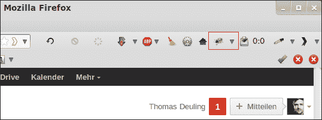

现在，我们可以开始探索我们的网站和 Web 应用程序。

正如您在前面的图片中看到的，Firefox 图标目前是灰色的。这意味着 Firebug 目前是禁用的。您可以点击此图标以打开和激活 Firebug。作为替代和更快的方式，您只需按下 *F12*。

如果 Firebug 处于活动状态，图标将以彩色显示。

# 行动时间——启用和配置 Firebug

那么，让我们开始使用 Firebug，看看如何启用和禁用 Firebug 的主要模块。

1.  打开 Firefox 并浏览任何网站。

1.  按*F12*以打开 Firebug。

1.  Firebug 默认在 Firefox 的底部打开，并在左侧以 Firebug 符号的形式提供一个主菜单。在 Firebug 的顶部中心，你会找到一个标签栏，允许你在 Firebug 的主要模块之间切换。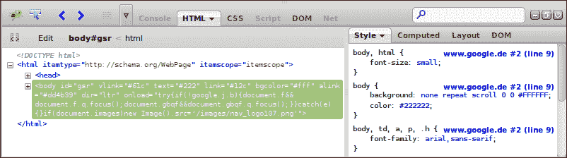

1.  当激活每个模块标签时，它还有一个自己的菜单，你可以在这里激活一些特定的设置（看看标签标签右侧的小三角形）。

1.  你还必须知道，出于性能原因，**控制台**、**脚本**和**网络**模块可以被启用和禁用。如果此标签的标签是灰色，则模块当前已禁用；如果标签是黑色，则已启用。所有三个模块都可以通过它们各自的菜单启用和禁用。试试看吧！！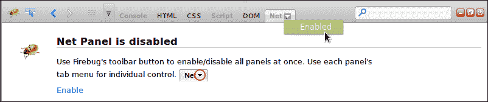

    ### 小贴士

    **禁用不必要的 Firebug 模块**

    很不幸，Firebug 有点儿像内存吞噬者。如果你已经启用了所有 Firebug 模块，甚至可能打开了多个 Firefox 标签页，Firefox 很快就会使用几百 MB 的内存。所以最好禁用你现在不需要的所有 Firebug 功能。

## *发生了什么？*

我们已经打开了 Firebug 在任何网站上，并查看配置 Firebug 及其标签页的可能性。此外，我们现在知道如何启用和禁用 Firebug 模块。

### 小贴士

**独立窗口中的 Firebug**

要在独立窗口中打开 Firebug，只需使用快捷键*Ctrl* + *F12*

# 检查 HTML 代码

我们想要详细查看的第一个模块是 HTML 标签。它不是 Firebug 标签行中的第一个，但它为我们使用 Firebug 提供了一个良好的起点。

在第一步中，我们将检查网站的 HTML 代码，并尝试选择特定的 HTML 标签。

# 行动时间——检查 HTML 代码

1.  打开 Firefox 并导航到任何网站，例如[google.com](http://google.com)。

1.  按*F12*以打开 Firebug。

1.  选择 HTML 标签。

1.  在左下角，你可以找到当前加载站点的完整 HTML 代码。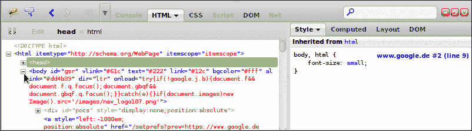

1.  在这里，你可以通过点击小加号图标来展开节点，在 HTML 树中进行导航。

1.  在 HTML 树中，鼠标悬停的 HTML 节点将在浏览器窗口中突出显示为蓝色。如果悬停的元素有边距（就像前面的截图中的顶部边距一样），它将被突出显示为黄色；如果悬停的元素有填充（就像截图中的底部填充一样），它将被突出显示为紫色。

1.  通过简单点击来选择 body 元素。如果你选择了一个元素，**HTML** 模块的右侧区域将显示有关该元素的信息。这个区域也被一个小标签组分隔，其中你可以找到我们在这个章节的检查 CSS 部分使用的 **样式** 标签，一个 **计算** 标签，你可以在下面的屏幕截图中看到（它包含来自元素的当前所有属性的列表），一个 **布局** 标签，你可以检查和调整所选元素的尺寸（边距、边框、填充以及元素本身），最后是 **DOM** 标签，你可以检查所有 DOM 属性。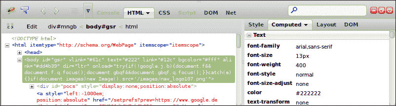

## *发生了什么事？*

我们已经使用了 Firebug 的 **HTML** 模块来检查一个网站。因此，我们打开了 Firebug，选择了 **HTML** 模块，并且还选择了我们想要检查的 HTML 元素。我们看到了网站的完整 HTML 树；进一步地，在 **计算** 标签中看到了所有 HTML 属性，在 **布局** 标签中看到了布局尺寸，在 **DOM** 标签中看到了 DOM 属性。

### 小贴士

**为什么 HTML 视图中的一些属性有时会以黄色闪烁？**

如果你正在检查一个由 JavaScript 驱动的网站，并且当前查看的 HTML 代码的作用域内有属性，这些属性在那个时刻正被 JavaScript 操作，Firebug 允许这些属性以黄色闪烁。

现在，我们想要看看如何使用 Firebug 来编辑或删除一些 HTML 代码。

# 行动时间 – 使用鼠标选择器编辑 HTML

1.  我们将从上一个 *行动时间* 部分结束的位置开始。所以，打开 Firefox，导航到任何网站，然后按 *F12* 以打开 Firebug。

1.  现在，如果你在网站上搜索特定的元素，你也可以使用鼠标选择器。这是一个蓝色的矩形按钮，里面有一个鼠标图标，位于 Firebug 主菜单的右侧。只需激活按钮，将鼠标移到网站上，以找到你想要检查的元素。一旦点击，该元素将在 Firebug 中被选中，并且鼠标选择器按钮将被禁用。

1.  当你选中一个元素时，你可以右键点击以打开上下文相关的菜单。在这个上下文菜单中，Firebug 为你提供了对所选 HTML 元素的一些操作。你可以附加新的属性，编辑元素节点，删除整个节点，或执行其他操作。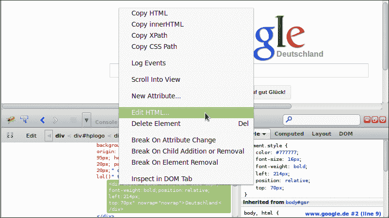

1.  在这一点上，我们使用鼠标选择器选择 Google 标志右侧的国家名称。之后，我们在选中的 `div` 节点上右键单击，并点击 **编辑 HTML** 按钮。

1.  现在，我们能够编辑包含所有其他节点的完整 HTML 节点。为了进行一个小测试，我们将 CSS 属性的颜色更改为红色。通过更改 HTML 代码，Firebug 会实时刷新网站，因此您可以直接看到更改的结果。

1.  如果您已经完成了所有更改，只需在左上角按 **Edit** 按钮即可完成编辑。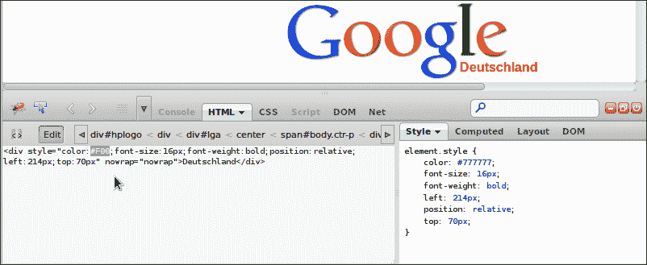

## *刚才发生了什么？*

我们已经从一个网站中选择了一个特殊元素并对其进行了更改。我们看到了 Firebug 如何在当前网站中实时显示这些更改。

同样，就像我们现在编辑 HTML 代码一样，您也可以删除节点或快速添加单个属性。

因此，一个常见的流程是选择一个 HTML 节点并编辑它，编辑完成后，只需通过右键单击它来复制 HTML 节点。现在包含在剪贴板中的复制的 HTML 节点可以简单地粘贴到您的源文件中。

# 检查 CSS 代码

为了检查和编辑 CSS 代码，Firebug 主要提供了两种方法。第一种方法是在 **HTML** 模块的 **Style** 选项卡中。在这里，您可以检查和调整当前选定的 HTML 元素的 CSS 代码。另一方面，您也可以直接使用 **CSS** 模块。在 **CSS** 模块中，您可以直接在单个 CSS 文件的结构中检查和编辑 CSS 代码。

在这一点上，我们将查看两种处理 CSS 的方法。

# 实践时间 – 使用 HTML 模块编辑 CSS 代码

1.  我们就像在之前的 *Time for action* 部分做的那样重新开始。所以，打开 Firefox，导航到任何网站（我们再次使用 Google 网站），然后按 *F12* 以在 **HTML** 模块中打开 Firebug。

1.  通过右键单击 Google 标志右侧的国家名称来选择国家名称。

1.  现在 Firebug 显示了当前 HTML 元素的所有信息。我们选择 **Style** 选项卡，并详细查看 CSS 信息。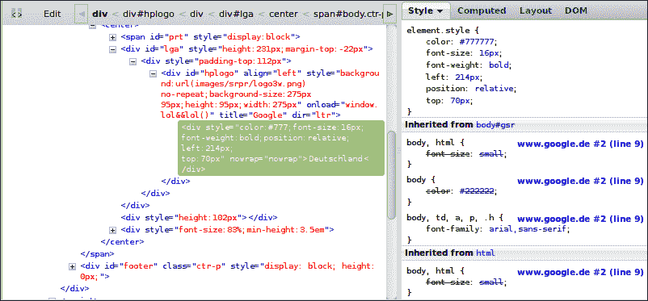

1.  如我们在 **Style** 选项卡中所见，元素接收到一个指令，将其字体大小增加三倍。您可以看到元素的哪个属性来自哪里。您还可以看到在每个元素块中它从哪里继承而来；在每个选择器部分中，选择器是在哪个文件和行号定义的。因此，从下到上，指令将被覆盖。

1.  现在，当我们想要调整标签的水平位置时，我们只需双击顶部定义的值。该字段变为可写状态，您就可以调整它。就像所有其他更改一样，结果将实时可见。

    ### 小贴士

    **调整值**

    如果您想逐步调整值，您也可以使用键盘上的上箭头和下箭头键。

1.  当你完成修改 CSS 属性后，你也可以选择 CSS 代码并将其复制粘贴到你的源代码文件中。

## *刚才发生了什么？*

我们检查了特殊 HTML 元素的 CSS 指令，并查看我们如何轻松调整这些值。

现在我们想看看另一种可能性，即使用 Firebug 检查 CSS 代码。

# 实践时间 – 使用 CSS 模块编辑 CSS 代码

1.  我们将再次从上一个 *实践时间* 部分开始。因此，我们打开 Firefox，在这个例子中，加载 [aptana.com](http://aptana.com) 网站。当网站完全加载后，按 *F12* 以在 **CSS** 模块中打开 Firebug。

1.  在 **CSS** 模块的头部，你可以看到一个文件区域，其中当前已选择 `aptana.css` 文件。如果网站中包含更多 CSS 文件，你可以更改显示的文件。

1.  在主区域中，你可以找到所选 CSS 文件的内容。就像在 **HTML** 模块中的 **样式** 选项卡一样，你可以更改所有属性或添加新需要的属性。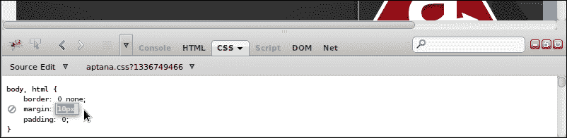

1.  最后，当你完成整个 CSS 文件的编辑后，只需按下 *Ctrl* + *A* 来选择整个 CSS 文件，使用 *Ctrl* + *C* 复制它，然后使用 *Ctrl* + *V* 在 Aptana Studio 的源代码文件中粘贴它。

## *刚才发生了什么？*

我们检查了整个 CSS 文件中的 CSS 代码。在这里，你看到也可以在整个文件中编辑属性，并学习了如何复制完整的 CSS 内容，以便你可以直接将更改后的 CSS 代码粘贴到源代码文件中。

# 使用 Firebug 控制台

Firebug 控制台允许你读取记录的信息、警告、错误等。例如，你可以像我们在 第四章 中看到的 *调试 JavaScript* 一样，将 `console.log()` 写入你的 JavaScript 文件中以调试它们。

让我们看看控制台如何通过开发 Web 应用程序来帮助我们。

# 实践时间 – 使用 Firebug 控制台

1.  我们将再次从上一个 *实践时间* 部分开始。切换回 Firefox，导航到 [aptana.com](http://aptana.com) 网站，并按 *F12* 以在控制台模块中打开 Firebug。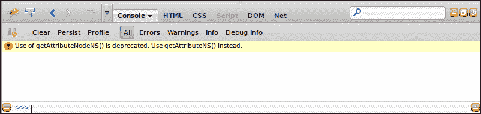

1.  在控制台模块的头部，你可以找到一些按钮，允许你过滤显示的消息。

1.  所有消息都列在主区域中。正如你所见，已经列出了一个警告，因为该网站使用了一个已弃用的函数。

1.  在底部区域，你可以实时触发自己的操作。这有时非常有用。你可以触发自己的函数，或者尝试 jQuery 选择器，并检查哪些节点被匹配。通过输入 `console.log` `(document.title)` 来亲自尝试。

    ### 小贴士

    **输入多行命令**

    如果你需要输入多行——没问题。只需按住命令行右侧的红色三角形图标，命令行就会移动到右侧的多行命令行。现在你也能够一次性将完整的脚本行粘贴到 Firebug 中并执行它们。

1.  另一个不错的特性是，控制台模块提供了你的命令历史记录。你可以通过点击命令行左侧的红色列表图标来显示之前的操作。此外，如果你将焦点放在命令行上，可以使用上箭头和下箭头键导航到之前的记录。

1.  你也可以在控制台模块中写入自己的消息、错误、警告或仅仅是调试信息。因此，Firebug 在控制台对象上提供了四个方法，如下所示：

    +   `console.log(object[, object, …])`

    +   `console.error(object[, object, …])`

    +   `console.warning(object[, object, …])`

    +   `console.debug(object[, object, …])`

1.  我们在这里想要展望的最后一个特性是完成建议（注意，此功能仅通过使用单行命令行可用）。如果你在单行命令行中输入 `doc`，控制台将建议你可能想要输入的对象或函数。如果有多个成功的建议，你可以使用键盘上的上箭头和下箭头键来选择你需要的。如果你的所需对象或函数已经暗示，只需按 *Tab* 键来选择它。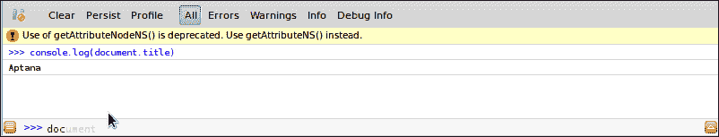

    ### 提示

    **你知道吗？**

    控制台模块还能够进行计算。如果你正在创建布局，并且需要计算属性或尺寸，你不需要启动你的系统计算器。只需使用 Firebug 控制台即可。

## *刚才发生了什么？*

我们已经检查了控制台模块的主要功能。现在你应该知道如何过滤输出并在运行时执行 JavaScript 命令。

# 代码性能分析

当你的开发工作向前推进，你的网络应用越来越大时，性能可能会越来越慢。这是由于浏览器必须执行的 JavaScript 代码量不断增加所导致的。

这是思考优化代码的最佳时刻。因此，你必须对你的源代码的许多部分进行性能分析，以找出哪些函数或代码块是最大的性能消耗者。

Firebug 提供了一些有用的功能，你可以使用它们来定位这些性能消耗者。

要找出单个代码块或函数的性能如何，一个简单的方法是将它包裹在 `time` 和 `timeEnd` 函数中。我们具体是如何做到的，将在下一节中讨论。

# 使用 `console.time()` 进行代码性能分析的时间到了

在本节中，我们将讨论使用 `console.time()` 函数进行代码性能分析的步骤。

1.  首先，我们需要一些可以分析的 JavaScript 代码。在这个简单的例子中，我们只使用一个小函数（包含一些需要一点时间的操作），如下面的代码所示：

    ```js
    <script type="text/javascript">
    	function loop() {
    		var sum =0;
    		for(var i=0 ; i<1000 ; i++) {
    			sum += i*Math.random();
    		}
    		return sum;
    	}
    </script>
    ```

1.  我们将这个函数嵌入到一个 HTML 文件中。

1.  当我们现在想要确定执行时间时，我们必须将函数调用包裹在两个控制台函数中。第一个是用于注册开始时间，将由 `console.time('unique_identifier')` 设置。请注意第一个参数；这必须是每个分析的唯一标识符。

1.  之后，我们调用我们将要分析的函数。

1.  最后，我们必须注册我们的时间测量已完成。因此，我们必须调用第二个函数，它需要与第一个函数相同的唯一标识符 `console.timeEnd('unique_identifier')`。毕竟，我们的代码应该看起来像以下代码：

    ```js
    <script type="text/javascript">
    	function loop() {
    		var sum =0;
    		for(var i=0 ; i<1000 ; i++) {
    			sum += i*Math.random();
    		}
    		return sum;
    	}
    	console.time('timer1');
    	console.log('loop: ', loop());
    	console.timeEnd('timer1');
    </script>
    ```

1.  现在，我们在 Firefox 中打开我们的 HTML 文件，并通过按 *F12* 打开 Firebug，然后打开控制台模块。

1.  可能我们需要启用控制台。如果是这样，我们必须通过按 *F5* 重新加载我们的网站。

1.  最后，我们查看控制台输出，看到我们的代码块执行耗时 4 毫秒。

## *发生了什么？*

我们将函数调用包裹在 `console.time()` 和 `console.timeEnd()` 函数中，以确定我们的函数的确切执行时间。重要的是这两个包装函数必须获得相同的唯一参数，这是控制台用来识别计时器的。

另一种获取更多关于您的应用程序和性能损失最严重的位置的信息的方法是使用 `console.profile` 函数分析一些代码块或函数。

让我们在下一节中看看。

# 行动时间 - 使用 console.profile() 分析代码性能

在本节中，我们将讨论使用 `console.profile()` 函数分析代码性能的步骤。

1.  我们从上一个“行动时间”部分获取 HTML 文件并扩展 JavaScript 代码。

1.  首先，我们将 `Math.random` 函数调用移动到一个名为 `getRandom` 的单独函数中。我们这样做是为了在我们的循环函数中创建更多的函数调用。

1.  `console.time` 和 `console.timeEnd` 函数不再需要；但不要删除这些行。`console.profile` 函数的工作方式类似。

1.  因此，我们将 `console.time` 函数更改为 `console.profile` 函数。唯一标识符仍然是必需的，因为您可以在同一时间运行多个分析。

1.  这一步有助于将 `console.timeEnd` 函数更改为 `console.profileEnd` 函数——就这样。经过所有这些步骤，您的代码应该看起来像以下这样：

    ```js
    <script type="text/javascript">
    	function loop() {
    		var sum =0;
    		for(var i=0 ; i<100 ; i++) {
    			sum += i*getRandom();
    		}
    		return sum;
    	}
    	function getRandom() {
    		return Math.random();
    	}
    	console.profile('timer1');
    	console.log('loop: ', loop());
    	console.profileEnd('timer1');
    </script>
    ```

1.  现在，我们将在 Firefox 中加载我们的 HTML 文件，并通过按 *F12* 并选择控制台模块来打开 Firebug。

1.  可能我们需要启用控制台。如果是这样，我们必须通过按 *F5* 重新加载我们的网站。

1.  最后，我们查看控制台输出，看到我们的分析代码块使用了 533 毫秒和 101 次函数调用。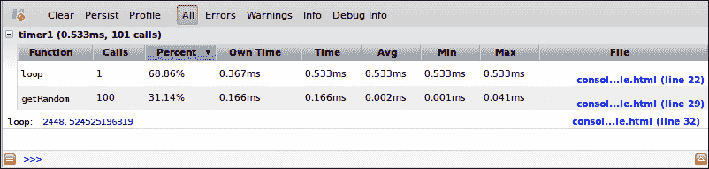

## *发生了什么？*

我们将函数调用包装在`console.profile()`和`console.profileEnd()`函数中。在执行过程中，控制台记录`profile()`和`profileEnd()`函数之间的每个函数调用，并生成一个完整的分析表，你可以看到哪些函数在何时被调用，以及它们花费了多长时间。

### 小贴士

**手动启动分析**

你也可以手动启动分析过程。如果你查看控制台模块中的顶部按钮，你会找到一个名为**Profile**的按钮。如果你第一次按下它，它将启动一个分析过程，就像`console.profile()`函数一样。如果你第二次按下它，分析过程将停止，你将在控制台输出中获得分析结果。

## 尝试英雄 - 详细检查网站

现在的任务是选择一个网站并在 Firefox 中打开它。打开 Firebug 并详细检查这个网站。查看 HTML 和 CSS 代码的结构。还要仔细查看单个 CSS 类如何覆盖其他 CSS 类。

尝试不同的值并自定义它们，以便了解它们的作用。在探索了 HTML 代码结构和 CSS 样式后，查看网站内的 JavaScript 代码。启用分析并检查哪些函数被调用等。

## 突击测验

Q1\. 哪个键盘快捷键可以打开 Firebug？

1.  *F7*

1.  *F12*

1.  *F13*

Q2\. 为什么禁用不必要的 Firebug 模块更好？

1.  这确保了良好的性能

1.  没关系

1.  最好启用所有模块

Q3\. 当你检查 HTML 文件并悬停在某些 HTML 元素上时，突出显示元素中的黄色和紫色颜色代表什么？

1.  没有黄色或紫色突出显示颜色

1.  这些颜色显示与其他元素的距离

1.  黄色突出显示显示元素的边距，紫色突出显示显示元素的填充

Q4\. 你在 Firebug 中更改后，何时可以看到更改？

1.  重新加载页面后

1.  更改立即可见

1.  保存你的更改后

Q5\. 你为什么将`console.time()`和`console.timeEnd()`函数以及`console.profile()`和`console.profileEnd()`函数的第一个参数和唯一标识符设置为？

1.  如果你多次启动或分析进程，Firebug 需要它们来识别在何时停止哪个进程

1.  它只是一个标签，不是必需的

1.  这些函数中没有参数

# 摘要

在阅读本章后，你应该能够使用 Firebug 检查网站和 Web 应用程序。此外，你应该详细了解如何编辑 HTML 元素，更改它们的 CSS 属性，以及检查 JavaScript 代码。

现在我们想要向前迈进，在下一章中我们将探讨如何与 JavaScript 库协同工作以及如何将它们集成到我们的项目中。
