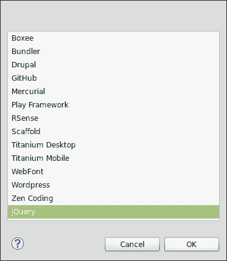
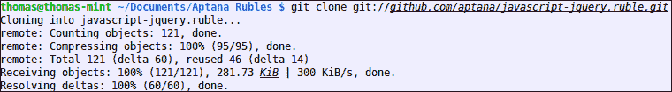
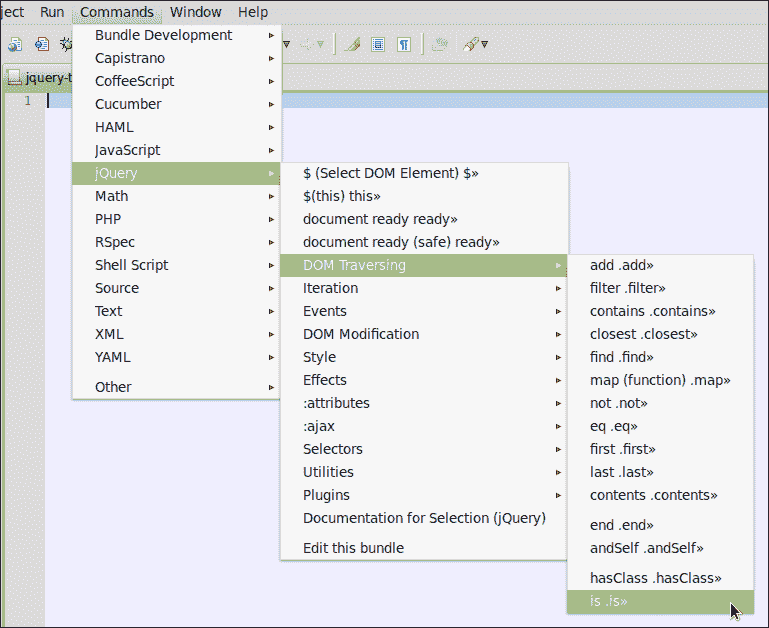
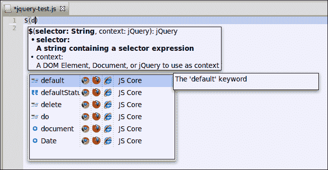
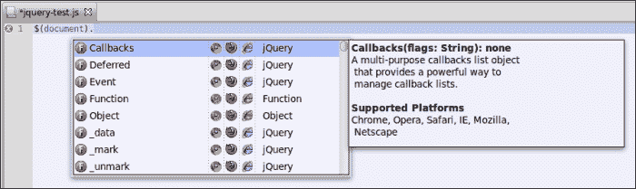
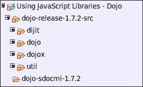
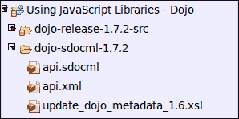
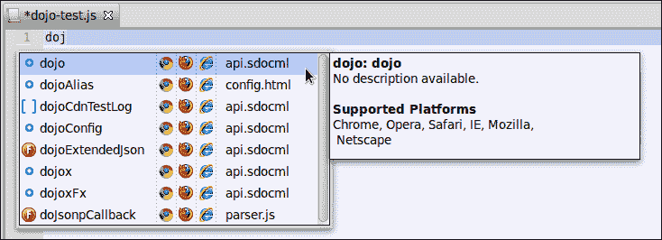
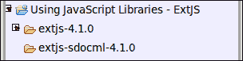
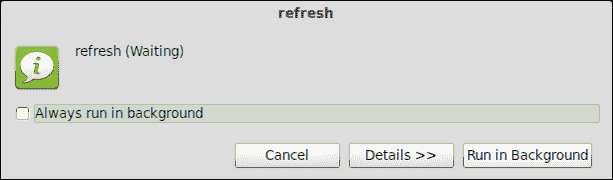

# 第七章。使用 JavaScript 库

*在开发一个网络应用程序时，几乎每个开发者都会使用他们自己的或另一个公共 JavaScript 框架或库，因为没有人愿意一遍又一遍地编写所有必需的脚本代码。没有必要重新发明轮子！*

*另一个优点当然是，像 Dojo Toolkit、jQuery 或 ExtJS 这样的流行 JavaScript 框架已经在浏览器中得到了验证，这使得它们的使用更具吸引力。*

*因此，我们希望能够轻松地集成其他开发者的库或使用我们自己的现有库。*

在本章中，我们将介绍包含 JavaScript 库的要求：

+   使用 jQuery

+   使用 Dojo Toolkit

+   使用 ExtJS

# 包含 JavaScript 库的要求

为了使 Aptana Studio 能够与 JavaScript 库一起工作，必须满足一些要求，以便该库可以向 Aptana Studio 内容辅助提供信息。

您想要集成的库必须具有以下之一：

+   一个 JSCA 1.0 规范文件。您可以在 [`wiki.appcelerator.org/display/tis/JSCA+1.0+Specification`](https://wiki.appcelerator.org/display/tis/JSCA+1.0+Specification) 上了解更多信息。

+   脚本注释也可以使用 ScriptDoc 规范进行读取，正如我们在前一章中已经描述的。

+   一个针对 JavaScript 的 **虚拟工作室文档**（**VSDoc**）。

### 小贴士

**使用 Aptana Studio 2.X 代码辅助 XML 文件**

您还可以使用一个 Aptana Studio 2.X 代码辅助 XML 文件。在这种情况下，您只需将文件扩展名重命名为 `.sdocml`。

另一个要求是项目必须具有以下类型之一：

+   网络

+   PHP

+   Python

+   Ruby

+   Rails

我们需要这些项目类型中的一个的原因是（如第三章 Chapter 3 中讨论的，*使用工作空间和项目*），它们中的每一个都能够访问并向项目添加不同的功能。

在 第三章，*使用工作空间和项目*中，您可以了解如何创建这些类型之一的项目，或者如何更改项目的类型。

# 使用 jQuery

jQuery 是最受欢迎的 JavaScript 库之一。jQuery 是一个免费且非常广泛的库，它提供了许多方便的函数用于 DOM 操作和导航。

正如其名所示，它最初是一个 JavaScript 查询库，如今提供了大量的插件甚至一个完整的 UI 包。

您可以从 jQuery 网站下载它，链接为 [`docs.jquery.com/Downloading_jQuery`](http://docs.jquery.com/Downloading_jQuery)。

在我们开始集成 jQuery 之前，我们还可以安装额外的 jQuery 包。这不会花费很长时间，并且只需要安装一次。安装后，内容辅助将为我们提供额外的有用 jQuery 片段和命令。

# 行动时间 - 安装 jQuery 包

要安装 jQuery 包，请按照以下步骤操作：

1.  在菜单中，导航到**命令** | **包开发** | **安装包**。

1.  选择**jQuery**条目并点击**确定**。

1.  现在，Aptana Studio 从 github 拉取 jQuery 库并将其集成到系统中。

### 小贴士

**克隆 Git 仓库失败？**

如果你收到诸如**致命：无法查找 github.com**的错误，请检查你的 DNS 设置并确保 github 域名正确解析。

## *发生了什么？*

我们已经直接从 Aptana Git 仓库安装了 jQuery 包。Aptana Studio 已自动将其集成到系统中，以便你收到许多进一步的 jQuery 特定内容辅助条目。从现在起，你将在**命令**菜单中找到一个**jQuery**条目，其中包含所有片段和一些命令。



现在我们已经安装了 jQuery 包，我们将继续集成 jQuery 库。

# 行动时间 – 集成 jQuery

在本节中，我们将看到如何集成 jQuery。为此，请参考以下步骤：

1.  创建一个名为`Using JavaScript Libraries - jQuery`的新 Web 项目。

1.  下载 jQuery 源并将其保存到`jquery-release-1.7.2-src`。

1.  创建一个名为`jquery-vsdoc-*version*`（将`*version*`替换为你的 jQuery 版本），在我们的例子中是`jquery-vsdoc-1.7.2`的文件夹。

1.  现在，我们必须下载相关的 VSDoc 文件。你可以从[`appendto.com/community/jquery-vsdoc`](http://appendto.com/community/jquery-vsdoc)网站下载此文件。现在只需选择你的版本并点击**VSDOC**链接，在我们的例子中是**jQuery 1.7.2 VSDOC**，并将文件保存到`jquery-vsdoc-1.7.2`目录中。

1.  最后，你必须将 VSDOC 文件拖放到你的`项目`文件夹中，否则内容辅助将不会为你提供 VSDOC 文件中的信息。

为什么内容辅助不起作用？如果内容辅助没有提供任何 jQuery 函数或其他函数，可能你没有通过拖放将 VSDoc 文件集成到你的项目中。作为一个快速解决方案，你可以将文件拖放到另一个项目中，然后再拖回到当前项目中。

## *发生了什么？*

我们已经将 jQuery VSDoc 文件集成到我们的 Web 项目中。从现在起，内容辅助将为我们提供当前作用域中所有可用的 jQuery 函数。

所以，例如，如果你输入`$(d)`并将光标放在`d`变量后面，你可以通过按*Ctrl* + 空格键来触发内容辅助；内容辅助将随后为你提供一些建议。



你可以将光标放在例如`$(document)`条目后面，并再次触发内容辅助。现在内容辅助也将为你提供所有可用的 jQuery 函数。



简单，不是吗？不再需要在文档中搜索，因为您不知道哪些函数可用或应该如何编写它们——现在您可以直接浏览所有函数和属性的列表，并选择所需的项。

# 使用 Dojo Toolkit

Dojo Toolkit 是一个可靠的 JavaScript 工具包，提供了许多自制的组件、插件和小部件。所有这些都具有国际化特性，正如 Dojo 团队所说，它们是**无与伦比的**。它已经在所有主流浏览器中进行了彻底测试，适用于编写各种应用程序，从大型网络应用程序到移动应用程序。

您可以从 Dojo Toolkit 网站获取它，网址为 [`dojotoolkit.org/download/`](http://dojotoolkit.org/download/)。

# 行动时间 - 集成 Dojo Toolkit

以下步骤展示了如何集成 Dojo Toolkit：

1.  创建一个名为 `Using JavaScript Libraries - Dojo` 的新网络项目。

1.  下载 Dojo Toolkit 源代码并将其解压到一个文件夹中，例如，`dojo-release-1.7.2-src`。

1.  将包含 Dojo Toolkit 源代码的文件夹复制到您的 `项目` 文件夹中。

1.  创建一个名为 `dojo-sdocml-*version*` 的文件夹（将 `*version*` 替换为您的 Dojo Toolkit 版本），在我们的例子中是 `dojo-sdocml-1.7.2`。

    在完成前面的步骤后，您的项目在 **项目资源管理器** 视图中应该看起来像以下截图：

    

1.  为了在 Aptana Studio 中使用 Dojo Toolkit，我们必须为其创建一个 SDOCML 文件，因为它的文档不是在 ScriptDoc 中创建的。

1.  如果您想使用 Dojo Toolkit 的 1.6.0 版本，可以从 [`raw.github.com/aptana/dojo.ruble/master/support/dojo.1.6.0.sdocml`](https://raw.github.com/aptana/dojo.ruble/master/support/dojo.1.6.0.sdocml) 下载，1.7.0 版本可以从 [`github.com/gigi81/studio3-sdk/blob/master/tools/frameworks/dojo/1.7/api.sdocml`](https://github.com/gigi81/studio3-sdk/blob/master/tools/frameworks/dojo/1.7/api.sdocml) 下载。

1.  如果您想使用其他版本，可能需要自己创建。但不必害怕，这非常简单。如果您打算使用 Dojo Toolkit 的 SDOCML 文件之一，请跳到步骤 10。

1.  第一步是下载当前的 API 文件。API 文件包含 Dojo Toolkit 所有包和函数的完整列表，超过 7 MB，有超过 213,000 行。您可以在 Dojo Toolkit 网站上找到此文件，网址为 [`download.dojotoolkit.org/release-*version*/api.xml`](http://download.dojotoolkit.org/release-*version*/api.xml)。只需将 `*version*` 替换为您的 Dojo Toolkit 版本。在我们的例子中，我们使用的是当前版本，即 1.7.2；因此，我们从 [`download.dojotoolkit.org/release-1.7.2/api.xml`](http://download.dojotoolkit.org/release-1.7.2/api.xml) 下载以下文件，并将其保存到 `dojo-sdocml-1.7.2` 目录中。

1.  我们需要将 API 文件转换为所需的 SDOCML 文件。因为 API 文件是一个简单的 XML 文件，我们可以使用 XSL 转换来完成这个任务。你可以在此处下载用于转换的 XSL 文件：[`raw.github.com/aptana/studio3-sdk/master/tools/frameworks/dojo/1.6/update_dojo_metadata_1.6.xsl`](https://raw.github.com/aptana/studio3-sdk/master/tools/frameworks/dojo/1.6/update_dojo_metadata_1.6.xsl)。这个 XSL 文件是为 Dojo Toolkit 的 1.6.0 版本创建的，但它也适用于更新的版本。只需将其保存到与 API 文件相同的目录（`dojo-sdocml-1.7.2` 目录）中。要使用 XSL 文件将 API 文件转换为所需的 SDOCML 文件，你需要 `xsltproc` 包。如果你还没有安装，可以使用 `apt-get` 简单地安装它：

    ```js
    sudo apt-get install xsltproc
    ```

    如果你使用的是 Windows 操作系统，只需导航到 [`xmlsoft.org/XSLT/downloads.html`](http://xmlsoft.org/XSLT/downloads.html) 网站。在这里，你可以找到一个指向该库 Windows 版本（由 Igor Zlatkovic 提供）的链接。安装完包后，你可以使用以下简单的 shell 操作来创建 SDOCML 文件：

    ```js
    xsltproc update_dojo_metadata_1.6.xsl api.xml > api.sdocml
    ```

1.  最后，你只需将下载或创建的 SDOCML 文件拖放到你的项目中的某个位置。我们将此文件拖放到 `dojo-sdocml-1.7.2` 目录中。

    经过所有这些步骤后，你的项目可能看起来像这样：

    

## *发生了什么？*

我们已经将 Dojo Toolkit 源代码集成到我们的一个项目中。此外，我们创建了一个 Dojo Toolkit SDOCML 文件，它提供了必要的信息以便内容辅助功能能够提供当前作用域内所有可用的功能。

让我们进行一个简单的检查。在我们的 Dojo 项目中创建一个 JavaScript 文件。打开文件，输入 `dojo`，然后通过按 *Ctrl* + 空格键触发内容辅助。内容辅助将为你建议 `dojo` 对象以及其他以相同字母开头的选项。在右侧列中，你可以看到内容辅助从哪个文件获取了此对象的信息。



现在，让我们继续输入 `dojo`。内容辅助将列出 `dojo` 对象的所有可用方法。当我们进一步指定输入，例如 `dojo.q` 时，内容辅助会更新其列表并删除所有不再匹配的条目。


这次，方法所属的对象显示在右侧列中。列表右侧有一个工具提示，显示该方法的文档。

# 使用 ExtJS

ExtJS 是一个 JavaScript 框架，就像 Dojo Toolkit 一样，它提供了许多丰富、现代的 UI 小部件。ExtJS 是从 **Yahoo 用户界面**（**YUI**）库中收集的功能扩展集合，随着时间的推移，它变得越来越受欢迎。通过不断增加的复杂性和受欢迎程度，它发展成为一个独立的库，称为 **ExtJS**。

你可以从 Sencha 网站获取它 [在 http://www.sencha.com/products/extjs/download/](http://at http://www.sencha.com/products/extjs/download/)。

# 执行时间 – 集成 ExtJS

集成 ExtJS 需要以下步骤：

1.  创建一个名为 `Using JavaScript Libraries - ExtJS` 的新网络项目。

1.  下载 ExtJS 软件包。在我们的例子中，我们将选择 `ext-4.1.0-gpl.zip` 软件包。

1.  将 ExtJS 软件包提取到你的 `项目` 文件夹中。

1.  创建一个名为 `extjs-sdocml-4.1.0`（将 `*version*` 替换为你的 ExtJS 版本），在我们的例子中为 `extjs-sdocml-4.1.0` 的文件夹。

    在完成前面的步骤后，你的项目应该看起来像下面的截图：

    

1.  通过在“项目资源管理器”文件夹中右键单击项目名称并点击**刷新**来刷新你的项目。现在，Aptana Studio 将索引新文件并读取内容辅助所需的信息。这可能需要一点时间，因为 ExtJS 有很多文件。

1.  现在我们必须获取所需的 ScriptDoc 文件。如果你想使用 ExtJS 的 3.3.0 版本，你可以在 [`raw.github.com/aptana/sencha.ruble/master/support/ext-js-3.3.0.sdocml`](https://raw.github.com/aptana/sencha.ruble/master/support/ext-js-3.3.0.sdocml) 找到该文件。如果你想使用 4.0 或 4.1 版本（如我们的示例所示），你可以从网络博客 [`www.thekuroko.com/aptana-sdocml-code-hinting-support/`](http://www.thekuroko.com/aptana-sdocml-code-hinting-support/) 下载 ScriptDoc 文件。John Crosby 开发了一个工具，该工具使用 Adobe AIR 和 jsduck 创建必要的 ScriptDoc 文件。到目前为止，我们可以感谢 John 的工作。我们下载所需的文件并将其拖入 `sdocml` 目录。

## *刚才发生了什么？*

我们已经将 ExtJS 集成到我们自己的项目中。这和 jQuery 以及 Dojo Toolkit 的集成方式相同。再次强调，非常重要的一点是将文件拖入项目中，否则内容辅助功能将不会提供 ScriptDoc 文件中的任何信息。

你将能够以类似于我们在 jQuery 和 Dojo Toolkit 案例中测试的方式测试它。

## 尝试一下英雄般的操作 – 将 JavaScript 库集成到你的当前项目中

现在你的任务是选择你当前使用我们在本章中处理过的库之一的项目。看看这个库是如何目前集成的，并调整其集成方式，以便你可以在进一步开发中使用内容辅助。

完成后，尝试使用代码补全，看看是否提供了所有库功能。

## 快速问答

Q1. 为了使用内容辅助与 JavaScript 库一起使用，必须满足哪些要求？

1.  库 API 必须以 XML 或 JSON 格式可用

1.  无，内容辅助直接从您的源代码文件中读取

1.  库必须在 ScriptDoc 格式、虚拟工作室文档（VSDoc）或具有 JSCA 1.0 规范文件中进行文档记录。

Q2. 你可以使用 Aptana Studio 2.X 代码辅助 XML 文件与 Aptana Studio 3 一起使用吗？

1.  是的，只需将 XML 文件扩展名重命名为 SDOCML 文件扩展名

1.  不，在 Aptana Studio 3 中无法使用它们

1.  是的，但必须使用 XSLT 转换

Q3. 为了使内容辅助与您的库一起工作，绝对必要的是什么？

1.  必须将 ScriptDoc 文件复制并粘贴到您的项目中

1.  必须将 ScriptDoc 文件拖入您的项目

1.  没有内容

Q4. jQuery 包提供了什么？

1.  完整的 jQuery 内容辅助信息，以启用所有内容辅助功能

1.  只有 jQuery 片段和一些命令

1.  jQuery 本身——不再需要 jQuery 库的单独副本

# 摘要

在阅读本章之后，您应该能够将几个 JavaScript 库集成到您的项目中，以便内容辅助提供所有必要的信息，使您的工作更加高效。此外，您应该详细了解除了本章中已经讨论的 JavaScript 库之外，还需要哪些内容才能进行集成。

在下一章中，我们将学习如何使用 FTP 在远程服务器上工作。
