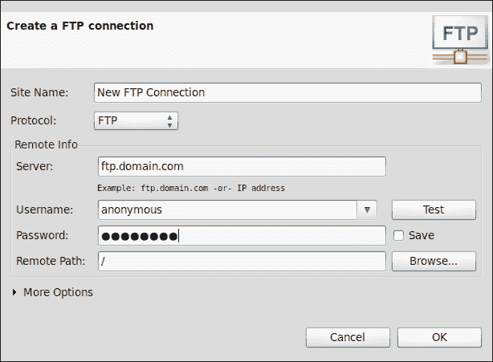

# 第八章.远程使用 FTP

*许多网站和 Web 应用程序都位于远程 Web 服务器上，可能在某个计算机中心或类似平台上的遥远地方。这有时会有些问题，因为在远程服务器上开发网站或 Web 应用程序时，您必须手动上传每个更改的文件。在这种情况下，工作流程非常长，对代码进行一些更改，切换到第三方 FTP 软件，试图记住您刚刚编辑了哪些文件，选择它们，然后最终上传它们可能会非常令人烦恼。当这些文件上传后，您将能够测试您开发项目中更改的结果。因此，您网站或 Web 应用程序的每个小更改都需要许多步骤。*

*但是，使用 Aptana Studio 在远程 Web 服务器上开发项目有一个更简单的方法。Aptana Studio 允许您以远程方式处理项目。这比使用第三方 FTP 软件要简单得多。您不需要记住您更改了哪些文件，您只需更改文件并保存即可，这就足够了！Aptana Studio 会意识到您已更改文件，并使用同步功能上传您的更改。所有这些都会自动完成。*

*让我们试试吧！*

在本章中，我们将介绍：

+   使用远程视图创建、修改和删除 FTP 连接

+   使用 Web 部署向导

+   使用**连接管理器**窗口创建、修改和删除连接

+   导出和导入 FTP 设置

# 远程视图

我们首先需要查看的是远程视图。远程视图用于管理 FTP 连接，因此提供了所有当前可用的 FTP 连接的完整列表。我们将看到您如何打开此视图，您将能够创建新的 FTP 连接，以及如何修改和删除现有连接。

要打开远程视图，只需导航到**窗口** | **显示视图...**并选择**远程**条目。现在，**远程**视图应该出现在 Aptana Studio 的左侧，与**项目资源管理器**和**应用资源管理器**视图一起分组，如以下截图所示：

# 动手时间 - 创建 FTP 连接

1.  打开远程视图。

1.  点击远程视图右上角的小地球图标。

1.  首先为新的 FTP 连接输入一个名称。理想情况下，选择一个包含 IP 地址或主机名的名称。

1.  然后您必须选择用于连接的协议。只需选择 FTP、SFTP 或 FTPS。在我们的示例中，我们将选择 FTP。

1.  此外，您必须输入连接的宿主、用户名和密码。

1.  在您输入账户数据后，您可以使用**测试**按钮立即测试输入的访问数据。

1.  此外，如果连接测试成功，你可以选择一个远程目录作为新连接的默认目录。

1.  最后，你可以展开 **更多选项** 部分，以便进行更详细的设置，例如选择不同的 **端口** 或 **编码** 选项，如下截图所示：

1.  通过点击 **确定** 保存新的 FTP 连接后，新的连接出现在远程视图连接列表中，如下截图所示：

## *发生了什么？*

我们已经通过远程视图创建了一个新的 FTP 连接。现在我们可以在 **连接管理器** 窗口中使用此 FTP 连接，或者直接从项目中进行连接，以便与远程服务器连接。

# 操作时间 - 修改 FTP 连接

1.  打开远程视图。

1.  在连接列表中选择你想要修改的 FTP 连接。

1.  右键单击它并选择 **属性** 选项。

1.  现在，将出现一个窗口，你可以修改连接数据。

1.  最后，通过点击 **确定** 确认更改。

将出现以下对话框，我们可以编辑我们的连接设置：

## *发生了什么？*

我们已修改现有的 FTP 连接（可能有一个新密码的连接）并确认了新的连接数据。从现在起，该连接使用当前修改后的账户数据。

## 删除 FTP 连接

FTP 连接可以非常快速地删除。只需打开远程视图，选择你想要删除的连接列表中的 FTP 连接。现在右键单击此条目并选择 **删除** 选项。

Aptana Studio 会询问你是否确定要删除此连接。如果你确定，只需点击 **确定** 确认删除。以下截图显示了如何删除一个 FTP 连接：

从现在起，此删除的连接在 Aptana Studio 中不再可用。

由于你现在已经熟悉了使用远程视图管理 FTP 连接，我们将继续探讨如何将这些 FTP 连接与本地项目或本地目录连接起来。为此，我们将使用 **Web 部署向导**。

## 使用 Web 部署向导

**Web 部署向导** 帮助你使用 FTP 连接将本地项目与远程服务器连接起来。让我们看看在接下来的几个步骤中有多简单。

# 操作时间 - 将项目与远程服务器连接

1.  首先，我们创建一个小的项目，我们想要用于我们的示例。我们像往常一样做，然后你可以在项目资源管理器中选择项目根目录，或者在应用资源管理器中打开它。在这个例子中，我们在应用资源管理器中打开项目。

1.  现在我们必须启动 Web 开发向导。此向导位于 App Explorer（项目资源管理器在此位置也有此符号）顶部的包符号后面。我们可以通过单击包符号并选择**运行 Web 开发向导...**条目来打开此向导，如下截图所示：

1.  在 Web 开发向导的第一步中，您必须选择一个部署提供程序。因为我们想将我们的项目与 FTP 连接，所以我们选择示例中的**FTP/SFTP/FTPS**选项，如下截图所示：

1.  之后，您必须输入您的 FTP 连接数据。第一步是为此连接输入一个名称。这个名称应该与网站或 Web 应用程序相关，这样您就可以轻松地识别连接。

1.  协议的选择是一个重要的步骤。根据此选择，后续的字段数量和类型将自动更改。可能的选项是 FTP、SFTP 和 FTPS。只需选择所需的协议。我们想设置一个简单的 FTP 账户，因此我们只选择 FTP。

1.  在此步骤中，我们输入 FTP 连接的服务器主机、用户名和密码。输入这些数据后，您将能够使用 Aptana Studio 的另一个不错功能——一个连接**测试**按钮。单击此按钮，Aptana Studio 将尝试连接到您刚才指定的 Web 服务器。如果 Aptana Studio 能够连接到 Web 服务器，您将收到一条适当的消息；如果不能，您将收到来自内部 FTP 客户端的错误消息。成功消息如下截图所示：

1.  如果您已输入正确的连接数据并且连接测试成功，您现在将能够选择远程 Web 服务器上的一个目录，该目录用作您源代码的根目录，如下截图所示：

1.  此外，还有一个**更多选项**部分，您可以调整一些更特殊的行为，例如使用的端口或编码。

1.  此窗口中的最终配置是同步设置。如果您正在创建与项目相关的 FTP 连接，此选项在此阶段可用。在这里，您可以设置同步的行为。一旦您激活了同步，您将看到以下截图中的设置：

    这些同步设置如下截图所示：

    

    ### 小贴士

    **为什么同步设置如此重要？**

    同步设置非常重要。如果您与不同的开发者一起在同一个远程项目上工作，并且某个开发者更改了您已经作为本地副本下载的文件，怎么办？没问题，您不需要考虑这个问题，Aptana Studio 使用同步功能来识别差异。

1.  通过完成 Web 部署向导，Aptana Studio 会自动启动第一次同步。在这里，您必须最初选择哪些文件应该被同步。下面的截图显示了同步窗口：

    ### 小贴士

    **跳过 .project 文件**

    在开始同步之前，请从 `.project` 文件中勾选 **跳过** 复选框，因为您只需要这个文件在您的本地 Aptana Studio 项目中。

1.  点击 **同步** 按钮开始同步。完成后，您的远程项目将包含当前源代码，您可以关闭同步窗口。

## *发生了什么？*

我们已经创建了一个 PHP 项目并将其与远程 Web 服务器连接起来。之后，我们相互同步了它。

现在，我们能够在本地项目中处理远程文件。如果您现在修改一个文件然后保存它，Aptana Studio 会自动启动同步并上传修改后的文件。

您还可以手动启动同步，如下面的截图所示：

也快速查看一下 **App Explorer** 视图中的 **发布** 菜单。

## 使用连接管理器

**连接管理器** 窗口允许您配置本地容器与远程站点或另一个本地容器之间的连接。

远程视图与 **连接管理器** 窗口之间的区别在于，您在远程视图中仅定义 FTP 连接，而在 **连接管理器** 窗口中，您管理的是 FTP 连接与一些本地项目或目录的组合。

因此，您可以为 Web 服务器创建单个 FTP 连接，并在许多不同的连接、本地项目或目录中使用它。

# 操作时间 – 打开连接管理器并创建新的连接

1.  导航到项目资源管理器。

1.  选择一个项目并展开它。

1.  您应该看到项目中的 **连接** 节点作为最后一个节点，如下面的截图所示：

1.  但如果你没有看到这个**连接**节点怎么办？没问题，在这种情况下，连接节点只是不可见。为了激活连接节点，点击**视图**菜单并选择**自定义视图...**条目。在**可用自定义**窗口中，您需要切换到**内容**选项卡并激活如图所示的**网站连接**复选框：

1.  如果您在项目中看到**连接**部分，右键单击它并选择如图所示的**连接管理器...**条目：

1.  现在为了创建一个新的连接，我们在左侧列表下方，底部点击绿色的加号符号（**+**）。**连接管理器**窗口在**连接**列表中创建一个新的条目并自动选择它，这样我们就可以立即输入连接数据。

1.  您必须在视图顶部位于**名称**文本字段中输入新连接的适当名称。

1.  在下一步中，您必须选择一个本地源。这可能是一个已经存在的 Aptana Studio 项目，或者也可能是您本地驱动器上的目录。您可以使用**浏览...**按钮来选择它。继续并选择您的源。

1.  最后，您必须选择连接的目标。在这里，您可以选择到一个已经创建的远程服务器的 FTP 连接。您也可以通过点击**新...**来创建一个新的 FTP 连接，或者直接选择您本地驱动器上的本地项目目录。

## *发生了什么？*

在第一步中，我们只是打开了**连接管理器**窗口。在某些情况下，**连接管理器**节点是不可见的，因此我们必须看看我们如何使其可见。无论如何，您必须在屏幕上看到**连接管理器**节点。

之后，我们在**连接管理器**窗口中创建了一个新的连接。这意味着我们已将一个本地项目与另一个项目连接起来，该项目可能也位于远程系统上，如图所示：

## 在连接管理器中修改现有的连接

首先，如果连接管理器窗口尚未打开，请打开它。在连接列表中选择您想要修改的连接。通过选择连接，**连接管理器**将连接数据填写到右侧表单字段中。现在您可以通过点击**应用**按钮来更改它们的值并应用更改。

现在，我们已经在**连接管理器**窗口中选择了现有的连接并修改了连接的值。调整值后，我们通过点击**应用**按钮保存它们。

## 在连接管理器中删除现有的连接

首先，如果尚未打开，请打开**连接管理器**窗口。在连接列表中选择您想要删除的连接。现在点击连接列表末尾的红色符号。之后，Aptana Studio 会询问您是否确定要删除此连接。如果您确定，只需点击**确定**以完成删除。

现在，我们已经在**连接管理器**窗口中删除了一个现有的连接。这个连接现在将不再在 Aptana Studio 中可用。

## 导出和导入 FTP 设置

Aptana Studio 允许您导出创建的连接并在将来再次导入。这是一个非常有用的功能。您可以从连接创建备份并在设置 Aptana Studio 的新安装时恢复它们。但对于拥有大量连接的公司或开发团队来说，这也很有用。他们可以在只有一个 Aptana Studio 安装的情况下创建当前连接，并将它们导出到一个导出文件中。之后，他们将在所有其他 Aptana Studio 安装中轻松导入这些连接。

# 操作时间 – 导出 FTP 设置

1.  为了导出当前的 FTP 设置，在主菜单中导航到**文件** | **导出...**。

1.  在窗口中展开“**Aptana Studio**”条目，选择如图所示的“**连接设置**”条目，然后点击“**下一步**”按钮：

1.  选择一个文件以导出您的连接设置。如果您想创建一个新文件，只需选择路径并输入您自己的文件名。

1.  如果您以前已经导出了连接设置，并且想要覆盖旧设置，可以选择**不警告覆盖现有文件**选项，如图所示的以下对话框中所示：

1.  通过点击“**完成**”按钮来最终化导出。

## *发生了什么？*

我们已经导出了所有当前现有的连接设置。现在，我们创建的所有连接都保存在一个文件中，并准备好重新导入到另一个或新的 Aptana Studio 安装中。

让我们继续看看如何将导出的数据重新导入到 Aptana Studio 中。

# 操作时间 – 导入 FTP 设置

1.  为了将导出的连接设置重新导入到 Aptana Studio 中，在主菜单中导航到**文件** | **导入...**。

1.  在窗口中展开“Studio”条目，选择“**连接设置**”条目，然后点击“**下一步**”按钮。

1.  在以下视图中，您可以选择从另一个工作区或文件导入，您可能以前已导出。我们将选择“**文件**”选项，并点击“**浏览...**”按钮来选择我们的导出文件，如图所示：

1.  最后，我们通过点击 **完成** 按钮来最终完成导入过程，其中我们已选择要导入的文件。

## *刚才发生了什么？*

我们已经将导出的连接设置导入到 Aptana Studio 中。现在，所有来自导出文件的连接都应该已经恢复并准备好在 Aptana Studio 中使用。

这很简单，不是吗？

## 尝试连接远程项目与本地项目

现在的任务是选择一个现有的远程项目，这通常是你在使用第三方 FTP 软件时使用的。为它创建一个新的 Aptana Studio 项目，并选择必要的项目类型。之后，通过配置 FTP 连接或使用 Web 部署向导来将此项目与远程 Web 服务器连接起来。

此外，从你创建的连接中导出，以便你将来在创建新的 Aptana Studio 安装时能够恢复它们。

## 突击测验

Q1. Aptana Studio 提供哪些连接协议？

1.  只有 FTP。

1.  FTP 和 SFTP。

1.  FTP、SFTP 和 FTPS。

Q2. 你如何创建一个 FTP 连接，以便自动获得同步选项？

1.  当你创建与项目相关的 FTP 连接时。

1.  当你在远程视图中创建 FTP 连接时。

1.  在这两种创建方式中，你都可以自动获得同步选项。

Q3. 你在哪里可以切换项目资源管理器视图中站点连接节点的可见性？

1.  只需在 **窗口** | **首选项** 下的 **系统偏好设置** 选项卡中。

1.  在 **项目资源管理器** 视图下的 **自定义视图...** 中。

1.  此节点始终可见，无法使其不可见。

# 摘要

到本章结束时，你应该能够通过使用 **连接管理器** 窗口来管理你的 FTP 连接。这意味着你知道如何创建、修改和删除连接。此外，你应该详细了解如何将项目与远程 Web 服务器连接，以及如何配置自动同步。我们还看到了在 Aptana Studio 中 FTP 连接如何与我们的小型项目良好工作；但如果你正在开发大型项目，其中有一个完整的开发团队在协作，那么使用版本控制，如 SVN 或 Git，是一个更好的用例。

在下一章中，我们将学习如何与 SVN 仓库和 Git 仓库一起工作。
