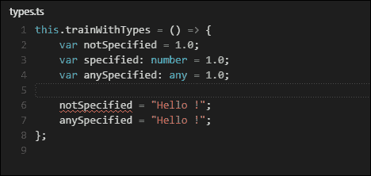

# 第一章. Babylon.js 和 TypeScript 语言

Babylon.js 是一个允许你为 Web 创建完整的 3D 应用程序和 3D 视频游戏的框架。Babylon.js 拥有一个日益增长的社区；一个积极为项目做出贡献、添加更多功能的社区。本章简要介绍了框架的愿景和 TypeScript 语言，因为 Babylon.js 就是使用这个语言开发的。

Babylon.js 框架集成了处理特定 3D 应用所需的所有工具。它允许你加载和绘制 3D 对象，管理这些 3D 对象，创建和管理特殊效果，播放和管理空间化声音，创建游戏玩法，等等。Babylon.js 是一个易于使用的框架，因为你可以用最少的代码行设置这些事情（你稍后就会看到）。

Babylon.js 是一个使用 TypeScript 开发的 JavaScript 框架。TypeScript 是一种编译型和多平台语言，它生成纯 JavaScript 文件。

本章将涵盖以下主题：

+   Babylon.js 简介

+   Babylon.js 使用 TypeScript 的原因

+   TypeScript 简介

# 创始人

Babylon.js 是由 David Catuhe (`@deltakosh`)、David Rousset (`@davrous`)、Pierre Lagarde (`@pierlag`) 和 Michel Rousseau (`@rousseau_michel`) 创建的。它是一个本质上在他们的业余时间开发的开源项目。当他们开始 Babylon.js 时，他们希望它设计得**易于使用**，然后为每个人提供一个可访问的 3D 引擎。官方网站 ([`www.babylonjs.com/`](http://www.babylonjs.com/)) 包含了大量针对初学者（甚至是在 3D 方面）到更高级用户的教程，每个功能都有示例，场景作为示例。

## Babylon.js 解决方案提供的在线工具

Babylon.js 为你提供了几个在线工具，以帮助开发者和艺术家进行实验和尝试他们的作品：

+   对于开发者来说，游乐场 ([`www.babylonjs-playground.com/`](http://www.babylonjs-playground.com/)) 允许你进行实验和训练。它展示了一个带有自动补全（Monaco）的代码编辑器和画布来查看结果。它还提供了一些代码示例供你训练使用。

+   对于艺术家来说，沙盒 ([`www.babylonjs.com/sandbox/`](http://www.babylonjs.com/sandbox/)) 允许你将导出的 Babylon.js 场景（Blender 和 3ds Max）拖放到浏览器中，以实时查看结果。沙盒为你提供了调试工具，可以激活/停用功能并查看对实时性能的影响。

+   **创建您的自定义着色器**（**CYOS**）允许开发者开发着色器并实时查看结果。还有几个现成的着色器可供训练和实验。

# 为什么 Babylon.js 使用 TypeScript 开发？

Babylon.js 是一个自 GitHub 上创建以来贡献不断增加的大项目。它为你提供了许多功能，有时也提供了许多参数以实现更多灵活性。TypeScript 语言对于编写健壮的代码很有用，因为它的目标是改进和保障 JavaScript 代码的生产。

## TypeScript 语言

TypeScript (**TS**) 是由微软开发的一个免费和开源的语言。它是一个编译语言，用于生成 JavaScript（实际上，TS 代码是转编译的），并提供一个可选的静态类型系统。类型系统在 Babylon.js 中使用，以获得更干净和更具描述性的代码。这意味着如果一个函数有很多参数，那么填写和理解它们比总是使用文档作为参考要容易得多。此外，它允许开发者声明类（如 ECMAScript 6 规范所做的那样）和接口，以获得更好的可理解架构和代码结构。

## TypeScript 的功能

类型系统非常强大，因为它允许开发者创建接口、枚举类型和类，并处理泛型和联合类型。总的来说，开发者使用类型系统来更好地理解和保障他们构建和使用的库。

TS 语言支持继承（类）并提供访问修饰符（私有 / 公共 / 受保护）来修改类的成员的访问权限。然后，开发者可以一目了然地看到他们可以使用和修改的成员。

# TypeScript 简介 - 你必须知道的内容

让我们通过一些功能示例和配置来介绍 TypeScript：如何将 TS 文件编译成 JS 文件，与类 / 类型 / 联合类型、函数、继承和接口一起工作。

## 使用 Gulp 进行编译

Gulp 是一个可用的 npm 包的任务运行器。它提供了一个插件来处理 TypeScript 编译。唯一要做的就是使用 gulp 和 gulp-typescript 配置一个任务。

要下载 gulp 包，你必须安装 Node.js ([`nodejs.org/`](https://nodejs.org/)) 以获取对 npm 包的访问权限：

1.  使用以下命令行安装 Gulp：

    ```js
        npm install gulp
    ```

1.  使用以下命令行安装 Gulp-Typescript：

    ```js
        npm install gulp-typescript
    ```

1.  要配置 Gulp 任务，只需提供一个名为 `gulpfile.js` 的 JS 文件，其中包含任务描述。

1.  导入 Gulp 和 Gulp-TypeScript：

    ```js
        var gulp = require("gulp"); 
        var ts = require("gulp-typescript");
    ```

1.  定义默认任务以转编译你的 TS 文件：

    ```js
        gulp.task('default', function() { // Default task 
          var result = gulp.src([ // Sources 
              "myScript1.ts", 
              "myScript2.ts", 
              // Other files here 
            ]) 
            .pipe(ts({ // Trans-compile 
              out: "outputFile.js" // Merge into one output file 
            })); 
          return result.js.pipe(gulp.dest("./")); // output file desti        nation
        });
    ```

1.  一旦默认任务列出了所有需要转编译的 TS 文件，只需使用以下命令行调用 Gulp：

    ```js
        gulp
    ```

## 使用类型变量进行工作

使用 TypeScript 进行工作与 JS 非常相似，因为类型系统是可选的。尽管如此，TS 中的常见类型如下：

+   字符串

+   数字

+   布尔值

+   任何

+   无效

+   枚举

+   数组

使用 JS，你应该编写以下内容：

```js
var myVar = 1.0;// or 
var myVar = "hello !"; 

```

在这里，你可以用 TS 写出完全相同的内容。TS 编译器将处理类型推断并为你猜测变量类型：

```js
var myVar = 1.0; // Which is a number 
// or 
var myVar = "hello !"; // Which is a string 

```

要使用 TS 指定变量的类型，输入以下命令：

```js
    var myVar: type = value;

```

然后，在先前的示例中，添加以下代码：

```js
var myVar: number = 1.0; 
// or 
var myVar: string = "hello !"; 
// etc. 

```

然而，即使没有提及类型，也不允许使用不同类型的值来分配新值：

```js
var myVar = 1.0; // Now, myVar is a number 
// and 
myVar = "hello !"; // Forbidden, "hello" is a string and not a number 

```

为了获得具有变量灵活性的 JS，让我们引入 `any` 类型。`any` 类型允许开发者创建没有任何静态类型的变量。以下是一个示例：

```js
var myVar: any = 1.0; // Is a number but can be anything else 
myVar = "Hello !"; // Allowed, myVar's type is "any" 

```

以下是 `types.ts` 文件的截图：



让我们介绍一些特定的类型。这是介绍 TypeScript 中的泛型和枚举类型的时机。数字、布尔值和字符串的使用在 TypeScript 和 JavaScript 中相同。因此，无需学习更多。

### 枚举类型

使用枚举类型（`enum`）就像使用数字一样。语法如下：

```js
enum FileAccess {Read, Write}; 

```

这生成了以下 JS 代码：

```js
var FileAccess; 
(function (FileAccess) { 
    FileAccess[FileAccess["Read"] = 0] = "Read"; 
    FileAccess[FileAccess["Writer"] = 1] = "Writer"; 
})(FileAccess || (FileAccess = {})); 

```

在两种语言中访问枚举类型如下：

```js
var myVar: FileAccess = FileAccess.Read; // Equivalent to 0 

```

### 数组

使用 TypeScript 定义数组与 JS 类似。以下是一个示例：

```js
// In both languages 
var myArray = []; 
// or 
var myArray = new Array(); 

```

在 TypeScript 中，数组是一个泛型类。然后，您可以指定数组中包含的项目类型，如下所示：

```js
var myArray = new Array<number>(); 

```

### 注意

注意：在 TypeScript 中，使用 `new Array()` 等同于 `new Array<any>()`。

您现在可以按如下方式访问常用函数：

```js
var myArray = new Array<any>(); 
myArray.push("Hello !");   
myArray.push("1"); 
myArray.splice(0, 1); 
console.log(myArray); // "[1]" 

```

## 使用类和接口

类和接口允许您构建类型，就像 `Array` 类一样。一旦创建了一个类，您就可以使用关键字 `new` 创建实例，这将在内存中创建一个对象。

以下是一个示例：

```js
var myArray = new Array<any>(); // Creates a new instance 

```

### 创建类

在 TypeScript 中定义类的语法如下：

```js
class Writer { 
  constructor() { 
    // initialize some things here 
  } 
} 

```

这在 JS 中生成以下内容：

```js
var Writer = (function () { 
    function Writer() { 
    } 
    return Writer; 
})(); 

```

在两种语言中，您都可以创建 `Writer` 的实例：

```js
var myInstance = new Writer(); 

```

您还可以使用作为命名空间的模块：

```js
module MY_MODULE { 
  class Writer { 
    ... 
  } 
} 

```

访问：

```js
var writer = new MY_MODULE.Writer(...); 

```

### 创建类成员

使用 JS 和约定，您可以编写以下内容：

```js
function Writer() { 
  this.myPublicMember = 0.0; // A public member 
  this._myPrivateMember = 1.0; // A member used as private 
} 

```

在 TypeScript 中，您可以显式指定成员的访问修饰符（公共、私有和受保护），如下所述：

+   **公共**：任何代码块都可以访问成员进行读写

+   **私有**：只有这个可以访问此成员进行读写

+   **受保护**：外部代码块无法访问成员；只有这个和特殊化者（继承）可以访问此成员进行读写

让我们通过 Writer 类进行实验：

```js
// declare class 
class Writer { 
  // Union types. Can be a "string" or 
// an array of strings "Array<string>" 
  public message: string|string[]; 
  private _privateMessage: string = "private message"; 
  protected _protectedMessage: string; 

  // Constructor. Called by the "new" keyword 
  constructor(message: string|string[]) { 
    this.message = message; 
    this._protectedMessage = "Protected message !"; // Allowed 
} 

// A public function accessible from everywhere. 
// Returns nothing. Then, its return type is "void". 
public write(): void { 
  console.log(this.message); // Allowed 
  console.log(this._privateMessage); // Allowed 
  console.log(this._protectedMessage); // Allowed 
} 
} 

var writer = new Writer("My Public Message !"); 
console.log(writer.message); // Allowed 
console.log(writer._privateMessage); // Not allowed 
console.log(writer._protectedMessage); // Not allowed 

```

### 使用继承

让我们创建一个专门扩展 `Writer` 类的新类。由于继承，专门的类可以访问基类的所有公共和受保护成员。`extends` 关键字表示继承。

让我们创建一个名为 `BetterWriter` 的新类，该类专门（扩展）了 `Writer` 类：

```js
// The base class is "Writer" 
class BetterWriter extends Writer { 
  constructor(message: string|string[]) { 
    // Call the base class' constructor 
    super(message); 
} 

// We can override the "write" function 
public write(): void { 
  if (typeof this.message === "string") { 
    // Call the function "write" of the base class 
    // which is the "Writer" class 
    super.write(); 
  } 
  else { 
    for (var i=0; i < this.message.length; i++) { 
      console.log(this.message[i]); // Allowed 
      console.log(this._privateMessage); // Not allowed 
      console.log(this._protectedMessage); // Allowed 
    } 
  } 
} 
} 

```

### 使用接口

接口用于创建合约。这意味着如果一个类实现了接口，该类必须提供接口中定义的所有函数和成员。如果不这样做，它不遵守合约，编译器将输出错误。

所有的定义函数都是公开的，所有的定义成员也都是公开的。

使用 Babylon.js 时，一个很好的例子是使用 `IDisposable` 接口。这意味着用户可以调用名为 `dispose()` 的方法。这个函数的职责是停用和/或释放所使用的系统。

以下是一个示例：

```js
interface IWriter { 
  // The class "Writer" must have the "message" member 
  message: string|string[]; 
  // The class "Writer" must provide the "resetMessages" function. 
  resetMessages(): void; 
} 

class Writer implements IWriter { 
  public message: string|string[]; 
... 
  constructor(...) { 
    ... 
} 
... 
// All functions declared in the interface are public. 
public resetMessages(): void { 
  this.message = this._privateMessage = this._protectedMessage = ""; 
} 
} 

```

# 摘要

在本章中，你获得了使用 Babylon.js 开发程序所需的必要知识。你会发现，在大多数情况下，使用 TypeScript 可以更高效、更安全。此外，一些开发者可能会更习惯使用类型，因为他们已经习惯了使用类型进行开发。

不要犹豫，使用附带的示例文件操作 TypeScript。别忘了安装 gulp 并运行命令行。

你也可以运行以下命令行：

```js
    gulp watch

```

这将自动跟踪并重新编译每次修改的 TS 文件。

在下一章中，让我们直接进入主题，通过介绍 Babylon.js 框架以及如何创建引擎和场景实体（如灯光、相机和网格（3D 对象））来了解 Babylon.js。你将使用 Babylon.js 构建你的第一个 3D 场景，并快速理解框架的架构！
