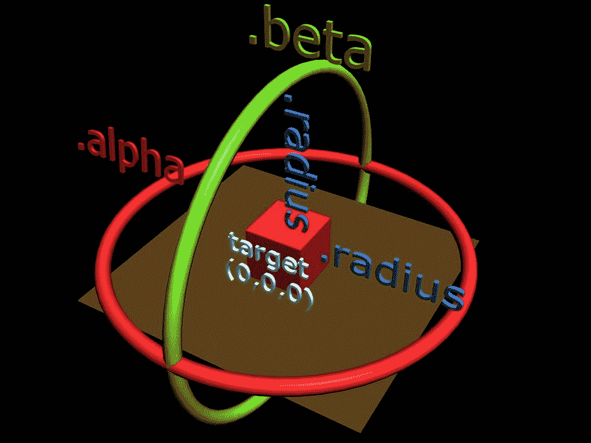
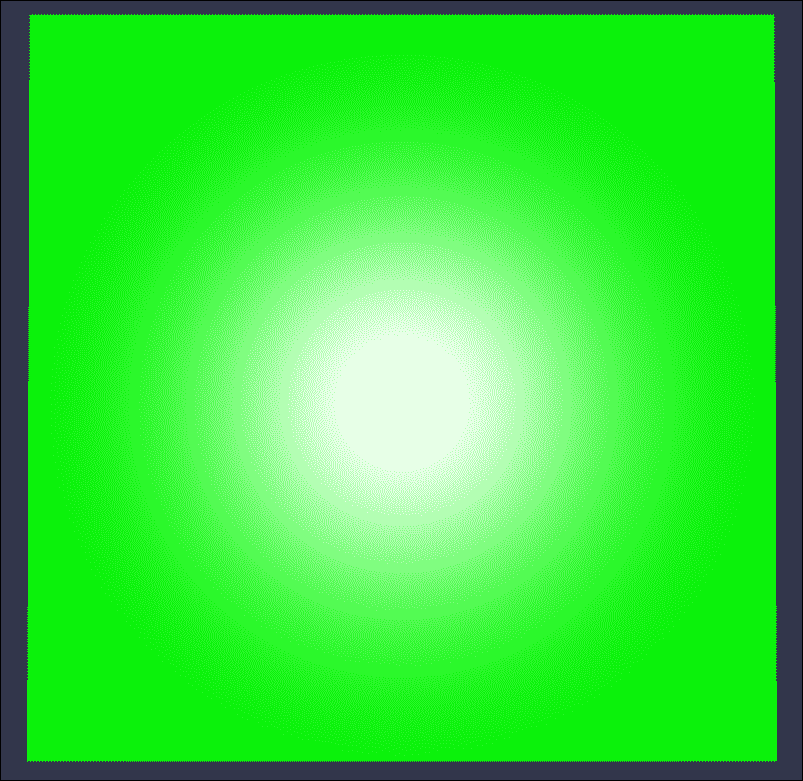
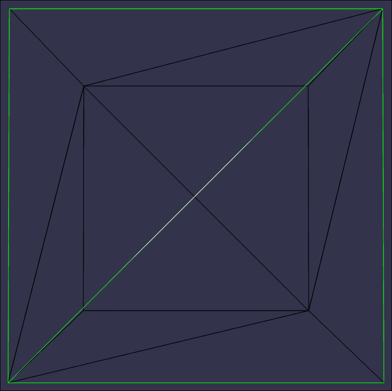
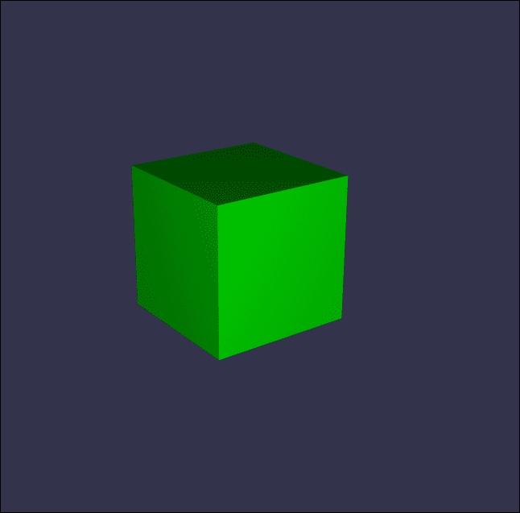
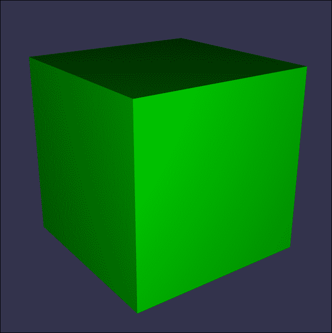
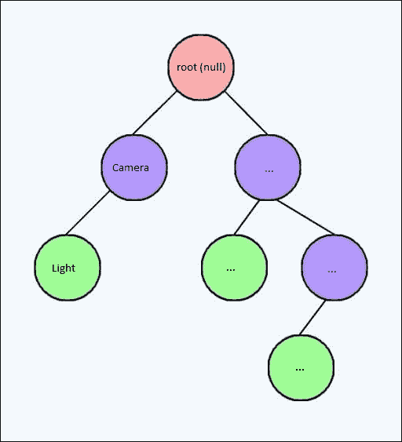

# 第二章。Babylon.js 的基础和可用工具

本章介绍了 Babylon.js 的基础。它包括 *引擎*、*场景*、*相机*、*灯光*、*网格* 等概念。通过实践，你会了解 3D 中使用的基工具，如向量以及它们在 3D 引擎中如何/在哪里使用。你还将使用图结构进行实践，并了解 Babylon.js 的架构。

本章将涵盖以下主题：

+   讨论 Babylon.js 的结构和图

+   创建你的第一个场景

# Babylon.js 的结构和图

首先，让我们创建并解释在屏幕上绘制东西所需的必要工具，例如一个处理场景以绘制 3D 对象并使用相机和灯光的引擎。

## 引擎和场景

引擎是 Babylon.js 的核心，场景允许你创建和管理你将在屏幕上绘制的实体（对象、灯光、相机等），这得益于引擎。你可以将引擎视为与视频卡（GPU）通信的网关，而场景是一个高级接口，处理以下多个实体：

+   3D 对象（更多内容请参考第三章，*在屏幕上创建、加载和绘制 3D 对象*)

+   相机

+   灯光

+   粒子系统（烟雾、雨等）

+   纹理

+   骨骼（动画 3D 对象）

+   后处理（效果）

+   材质（更多内容请参考第四章，*使用材质自定义 3D 对象的外观*)

+   精灵

换句话说，一个场景处理多个实体，并将调用引擎在屏幕上绘制这些实体。

要在屏幕上绘制，网页（`index.html`）必须包含一个画布。画布用于创建引擎将使用的 WebGL 上下文。创建引擎所需的唯一参数是画布，创建场景所需的唯一参数是引擎。

网页中的画布如下所示：

```js
<canvas id="renderCanvas"></canvas> 

```

以下代码在整个页面上执行以进行渲染：

```js
<style> 
    html, body { 
        overflow: hidden; 
        width: 100%; 
        height: 100%; 
        margin: 0; 
        padding: 0; 
    } 

    #renderCanvas { 
        width: 100%; 
        height: 100%; 
    } 
</style> 

```

要创建一个引擎，你必须将画布引用作为参数。获取 DOM 对象的引用如下：

```js
var canvas = document.getElementById("renderCanvas"); 

```

通过传递画布引用来创建一个引擎：

```js
var engine: BABYLON.Engine = new BABYLON.Engine(canvas); 

```

创建场景如下：

```js
var scene: BABYLON.Scene = new BABYLON.Scene(engine); 

```

每创建一个新的场景，都会存储在 `engine.scenes` 中，它是一个 `BABYLON.Scene` 的数组。

一旦创建了一个场景，你就可以渲染每一帧（在理想情况下每秒 60 帧，如果硬件不足则更少）。要执行此操作，你必须调用 `engine.runRenderLoop(function)` 函数。匿名函数 `function` 在每一帧被调用，这是绘制场景的地方：

```js
// runRenderLoop with TypeScript. The anonymous function doesn't 
// have any parameter 
engine.runRenderLoop(() => { 
    scene.render(); 
}); 

```

在每一帧绘制屏幕上的每个对象时，都会调用 `scene.render()` 函数。

## 添加相机和灯光

一旦创建了一个场景，你就可以创建诸如灯光和相机等对象。最小场景需求由一个相机（用于在场景中获取视图）和灯光（照亮场景中的 3D 对象，但如果场景中的对象是自发光的，则此不是必需的）组成。

### 添加相机

有几种类型的相机和灯光。Babylon.js 框架为你提供了固定相机（无移动）、FPS 相机、旋转相机（围绕一个点旋转）、游戏手柄相机（XBOX 360 游戏手柄）和触摸相机（用于触摸设备）。所有这些相机都可以用最少的代码行在场景中创建。例如，让我们从一个位置在坐标(`x=10`,`y=20`,`z=30`)的免费相机（FPS）开始。这是介绍`BABYLON.Vector3`类的好机会：

```js
var camera =  new BABYLON.FreeCamera("cameraName", new BABYLON.Vector3(10, 20, 30), scene); 

```

构造函数需要一个名称（`cameraName`），相机的位置以及场景引用（在哪里添加相机）。位置是`BABYLON.Vector3(x, y, z)`类型，它是 Babylon.js 的 3D 向量类。`Vector3`对象提供了加法、减法、乘法、除法等数学函数。

一旦创建了相机，让我们改变相机的位置并执行`Vector3`加法：

```js
camera.position = new BABYLON.Vector3(10, 0, 10).addInPlace(new BABYLON.Vector3(0, 10, 0)); 

```

`.addInPlace`方法修改了当前的`Vector3`实例，但你也可以调用`.add`方法，它将返回一个应用了加法的新`Vector3`实例。

现在相机的新的位置是 (`x=10`,`y=10`,`z=10`)。修改`.position`属性并不适用于所有相机，特别是旋转相机（`BABYLON.ArcRotateCamera`）。旋转相机围绕一个点（即相机的目标点）旋转，可以解释如下：



立方体位于位置 (`x=0`,`y=0`,`z=0`)，并且是相机的目标。要改变相机的位置，你必须调用`camera.setPosition(position)`函数。此函数将计算 alpha（围绕 Y 轴的角度）、beta（围绕 X 轴的角度）和半径的适当值。然后，`.position`属性仅用于读取。

### 添加灯光

一旦你创建了你的相机，让我们添加一个灯光。不同的灯光允许你在场景中使用不同的功能进行照明。点光源和半球光源倾向于照亮场景中的对象，而聚光灯和方向光源也提供了实时阴影的支持。

让我们从点光源开始。灯光的工作方式类似于相机，这意味着你必须提供场景引用（在哪里添加灯光）：

```js
var light = new BABYLON.PointLight("lightName", BABYLON.Vector3.Zero(), scene); 

```

第二个参数是灯光的位置。`BABYLON.Vector3.Zero()`是一个静态方法，它是创建一个坐标为(`x=0`,`y=0`,`z=0`)的`Vector3`实例的快捷方式。现在，让我们玩一下灯光的参数：

```js
light.position = new BABYLON.Vector3(20, 20, 20); 
light.diffuse = new BABYLON.Color3(0, 1, 0); 
light.specular = new BABYLON.Color3(1, 0, 0); 
light.intensity = 1.0; 

```

以下是对前面代码的参数说明：

+   `.diffuse`参数表示光的固有颜色，在示例中是绿色。

+   `.specular` 参数表示表面反射的光的颜色，这里为红色

+   `.intensity` 参数是灯光的强度，默认值为 1.0

将以下参数应用于 3D 对象的结果如下：


通过修改反射颜色为红色和蓝色，以下效果得以实现：



## 添加网格

网格是什么？实际上，3D 对象就是我们所说的网格。它们的结构相当简单，因为它们在内存中有两个重要的缓冲区：

+   顶点缓冲区是一个 3D 点的数组：顶点。顶点表示构建几何形状（如立方体、球体、角色、武器等）所需的 3D 点。例如，一个立方体有八个顶点。

+   索引缓冲区是一个数字数组，表示顶点缓冲区中的索引，用于构建三角形。实际上，图形卡被优化来计算和渲染屏幕上的三角形。例如，一个立方体的面将使用两个三角形来渲染，如下面的图像所示，其中绿色线条显示了面：

图形卡的工作分为两个步骤：

+   它们将顶点缓冲区的顶点（3D 点）投影（变换）到屏幕上。这些操作由一个名为顶点着色器的 GPU 程序执行。换句话说，顶点着色器计算每个三角形的 2D 位置。

+   它们使用一个名为像素着色器的 GPU 程序用颜色填充与三角形相关的像素。

为了总结图形卡的工作，顶点着色器计算屏幕上的 2D 三角形，像素着色器用不同的颜色照亮像素。

## 使用 Babylon.js 创建网格

Babylon.js 在 `BABYLON.Mesh` 类中提供了静态方法，允许您创建基本网格，如盒子、球体和环面。每个创建的网格都是 `BABYLON.Mesh` 的一个实例。让我们从一个盒子开始：

```js
var box = BABYLON.Mesh.CreateBox("boxName", size, scene); 

```

`size` 参数表示顶点之间的距离（例如，5）和 `scene` 参数是场景引用（在哪里添加网格）。一旦创建了网格，您就可以像以下这样访问其属性和方法：

```js
box.position = new BABYLON.Vector3(0, 2.5, 0); 
box.rotation = new BABYLON.Vector3(0, Math.PI / 4, 0); 
box.scaling = new BABYLON.Vector3(2, 2, 2); 

```

`.rotation` 参数表示网格的旋转，以弧度表示 `[0, 2π]`，然后以度数表示，`π = 180 度` 和 `2π = 360 度`。

`.scaling` 参数表示网格在三个方向上的缩放（*x*、*y*、*z*）。在示例中，网格是原来的两倍大。

如果您只修改其旋转，看看结果会怎样：



以下图像是应用新的缩放（`x=2`、`y=2`、`z=2`）的结果：



### 一些其他的基本网格

存在多个基本网格，`BABYLON.Mesh` 可以为您创建，例如球体和平面。让我们使用 `BABYLON.Mesh` 类创建一个球体和平面：

```js
var sphere = BABYLON.Mesh.CreateSphere("sphereName", segments, size, scene); 
var plane = BABYLON.Mesh.CreatePlane("planeName", size, scene); 

```

球体的 `segments` 参数表示球体的细节级别，例如，10。

平面的 `size` 参数表示顶点之间的距离，例如，10。

## 管理场景图

场景可以通过名为场景图的节点图来管理。在 Babylon.js 中，每个网格、灯光和摄像机都扩展了 `BABYLON.Node` 类。换句话说，每个 `BABYLON.Node` 都在场景图中。

每个节点都有一个子节点数组和唯一的一个父节点。每个创建的节点默认是图根的子节点。

要修改节点的父节点，只需修改节点的引用：

```js
light.parent = camera; 

```

现在，因为灯光是摄像机的子节点，所以灯光的位置取决于摄像机的位置。确实，灯光空间是摄像机的一个子空间。换句话说，你可以将位置（`x=0`,`y=0`,`z=0`）视为摄像机的位置。

当设置父节点时，子节点的变换属性（位置、旋转和缩放）会受到父节点的影响。

### 示例

让我们使用两个节点（`node1` 和 `node2`）来管理场景图，并比较如果你手动操作时等效的代码：

```js
node1.position = new BABYLON.Vector3(0, 0, 0); 
node1.parent = node2; 

```

这与以下代码等效：

```js
engine.runRenderLoop(() => { 
  node1.position = node2.position; 
  node1.rotation = node2.rotation; 
  node1.scaling = node2.scaling; 
}); 

```

以下架构解释了前面的代码：



# 创建你的第一个场景

现在，你已经拥有了构建第一个场景所需的所有必要元素。在这里，场景将由旋转摄像机、点光源和盒子组成。让我们使用 TypeScript 创建一个类并使用 Babylon.js 进行练习。

## 创建类和场景节点

以下类在构造函数中直接创建 Babylon.js 元素：

```js
export class BasicScene { 
  public camera: BABYLON.ArcRotateCamera; // Our camera 
  public light: BABYLON.PointLight; // Our light 
  public box: BABYLON.Mesh; // Our box 

  private _engine: BABYLON.Engine; // The Babylon.js engine 
  private _scene: BABYLON.Scene; // The scene where to add the nodes 

  // Our constructor. The constructor provides the canvas reference 
  // Then, we can create the Babylon.js engine 
  constructor(canvas: HTMLCanvasElement) { 
    // Create engine 
    this._engine = new BABYLON.Engine(canvas); 

    // Create the scene 
    this._scene = new BABYLON.Scene(this._engine); 

    // Create the camera 
    this.camera = new BABYLON.ArcRotateCamera("camera", 0, 0, 30,        BABYLON.Vector3.Zero(), 
        this._scene); 
    this.camera.attachControl(canvas, true); 

    // Create the light 
    this.light = new BABYLON.PointLight("light",new BABYLON.Vector3(20, 20, 20), 
        this._scene); 
    this.light.diffuse = new BABYLON.Color3(0, 1, 0); 
this.light.specular = new BABYLON.Color3(1, 0, 1); 
this.light.intensity = 1.0; 

// Create the box 
this.box = BABYLON.Mesh.CreateBox("cube", 5, this._scene); 
  } 
} 

```

## 调用 runRenderLoop 方法

让我们在类中添加一个方法来调用 `runRenderLoop` 方法：

```js
public runRenderLoop(): void { 
  this._engine.runRenderLoop(() => { 
    this._scene.render(); 
  }); 
} 

```

这个场景与之前提到的图像完全相同——有一个盒子和绿色的灯光。

## 管理场景图

为了练习场景图，让我们创建一个方法，该方法将灯光设置为摄像机的子节点。该方法将灯光的位置设置为坐标（`x=0`,`y=0`,`z=0`）并将灯光的父节点设置为摄像机：

```js
public setCameraParentOfLight(): void { 
  this.light.parent = this.camera; 
} 

```

# 摘要

在本章中，你学习了如何创建一个最小的 HTML 页面来处理 Babylon.js 引擎并绘制场景。你还学习了如何使用 Babylon.js 的内置节点，如灯光、摄像机和网格。

不要犹豫，使用内置网格如环面、环面结和球体进行练习，并玩转场景图和节点的属性，如位置。

在下一章中，你将学习场景是如何由设计师构建的，以及它们是如何使用 Babylon.js 导入的。你还将看到，使用 Babylon.js 创建场景与 3D 软件接口相当简单，因为所有工具都由 Babylon.js 解决方案提供（如导出器和导入器）。

下一章也将解释艺术家如何创建用于网络的 3D 场景，因为他们的问题与控制台和 PC 游戏等桌面软件不同。
