# 第三章：在屏幕上创建、加载和绘制 3D 对象

在上一章中，你了解到 3D 对象，即网格，由一系列 3D 点（顶点缓冲区）和索引（索引缓冲区）组成，这些点创建出屏幕上绘制的三角形。为了创建如角色或建筑等复杂网格，3D 艺术家使用能够处理我们的顶点缓冲区和索引缓冲区的建模软件，包括许多易于创建的强大工具。

Babylon.js 解决方案附带 Blender ([`www.blender.org/`](https://www.blender.org/)) 和 3ds Max ([`www.autodesk.fr/products/3ds-max/overview`](http://www.autodesk.fr/products/3ds-max/overview)) 的插件，这两款建模器是艺术家所熟知的。这些插件旨在为 3D 艺术家使用，用于将这些建模器中构建的场景导出为 Babylon.js 能够加载的格式。导出的文件是具有 `.babylon` 扩展名的 JSON 文件。有关格式的更多信息，请参阅 [`doc.babylonjs.com/generals/File_Format_Map_(.babylon)`](http://doc.babylonjs.com/generals/File_Format_Map_(.babylon))。

在本章中，我们将涵盖以下主题：

+   使用 Blender 导出场景

+   使用 3ds Max 导出场景

+   使用 Babylon.js 编程加载场景

# 使用 Blender 导出场景

Blender 是一个免费的开源建模器，使用专用工具创建 3D 模型。Blender 以其跨平台（在 Windows、Mac OS X 和 Linux 上运行）而闻名，并在开源领域被誉为更好的 3D 建模器（拥有强大的 3D 渲染、动画、纹理化等工具）。有关其功能和演示的更多信息，您可以访问 [`www.blender.org`](https://www.blender.org)。

此外，Blender 允许开发者使用 Python 语言编写插件，这一特性使得 Babylon.js 团队能够开发 Blender 的导出器。实际上，Babylon.js 导出器将允许你直接在 Blender 中构建场景（包括网格、灯光、相机等），并轻松地将场景导出为 Babylon.js 格式，你可以在项目中加载。让我们看看以下步骤，看看你如何（仍然很容易）做到这一点。

## 为 Blender 设置 Babylon.js 导出器

在 Babylon.js GitHub 存储库中，你将找到一个包含 Blender 插件的文件夹，位于 `Exporters/Blender/`。`io_scene_map` 文件夹和 `io_export_babylon.py` 文件需要复制到 Blender 的 `addons` 文件夹中（通常位于 `C:\Program Files\Blender Foundation\2.75\scripts\addons\`）：

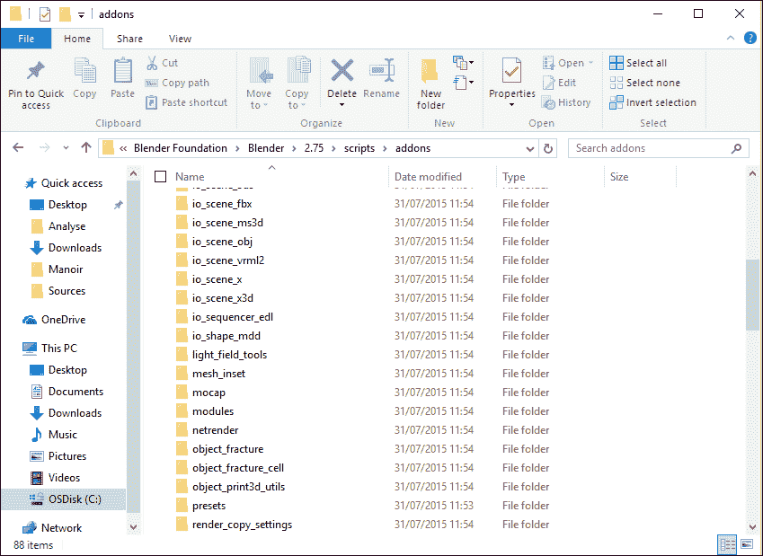

文件复制完成后，只需激活插件，使其出现在导出器菜单中。激活后的结果如下所示：

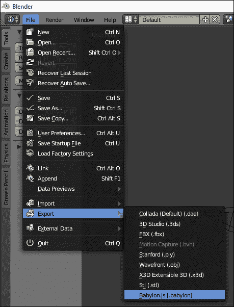

## 在 Blender 中激活 Babylon.js 导出器

要激活插件，请按照以下步骤操作：

1.  前往**用户首选项...**：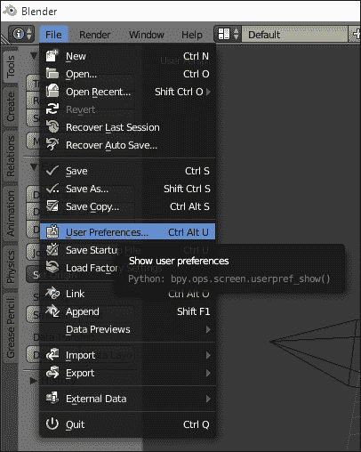

1.  点击**插件**标签。

1.  在搜索栏中搜索`babylon`。

1.  激活插件。

1.  保存用户设置：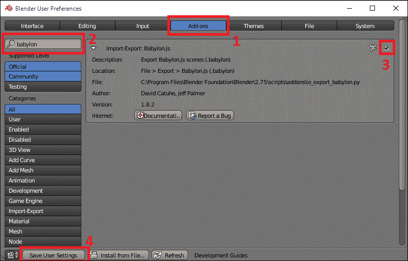

一旦插件被激活，插件就会出现在导出器菜单中。你现在可以导出 Babylon.js 的场景。

## 导出场景

让我们从默认创建的初始场景开始：一个立方体、相机和灯光。右键单击立方体以选择它。现在，让我们看看右侧的属性。（参考以下截图。）多亏了插件，有一个专门用于 Babylon.js 的区域。这些属性在导出时是针对 Babylon.js 框架的，并且不会干扰 Blender 的渲染（这是要告诉你的 3D 艺术家的一些有趣的事情）：

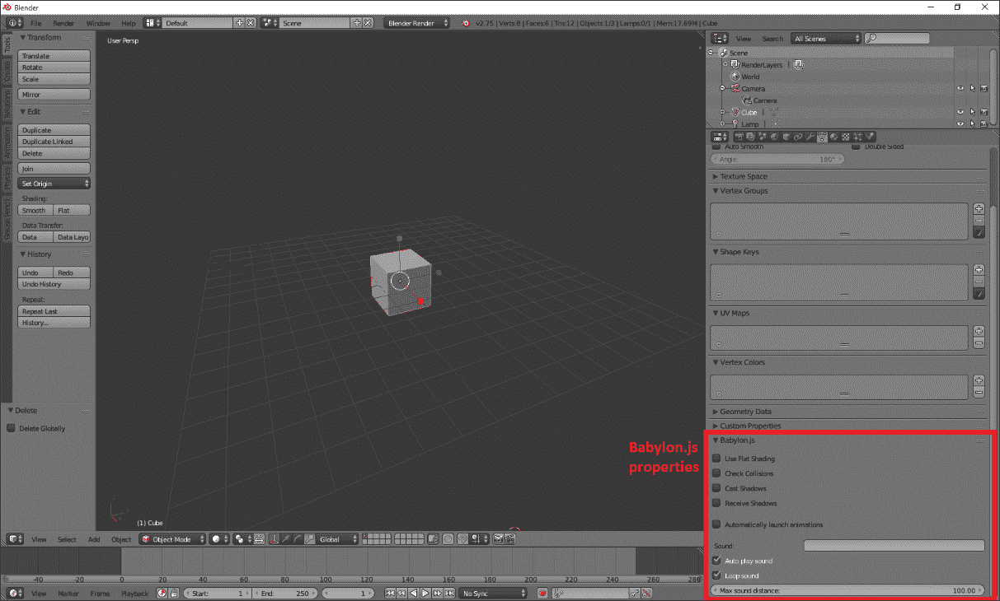

放大属性：

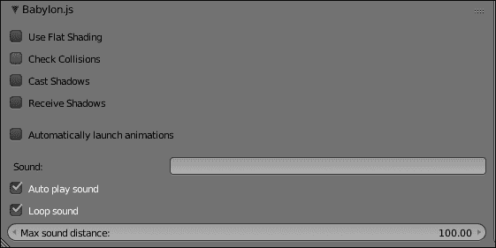

对于网格（如立方体），属性如下：

+   **使用平面着色**：这是使用平面着色而不是平滑网格

+   **检查碰撞**：这是检查相机是否与网格碰撞

+   **投射阴影**：这是为了检查如果场景中存在阴影光（另一种类型的光），对象是否会在其他网格上投射阴影

+   **接收阴影**：这是检查如果场景中存在阴影光，对象是否接收来自投射阴影的其他对象的阴影

+   **自动启动动画**：如果网格是动画的，它会在开始时自动启动网格的动画

现在，在 Blender 中选择相机并查看以下截图：

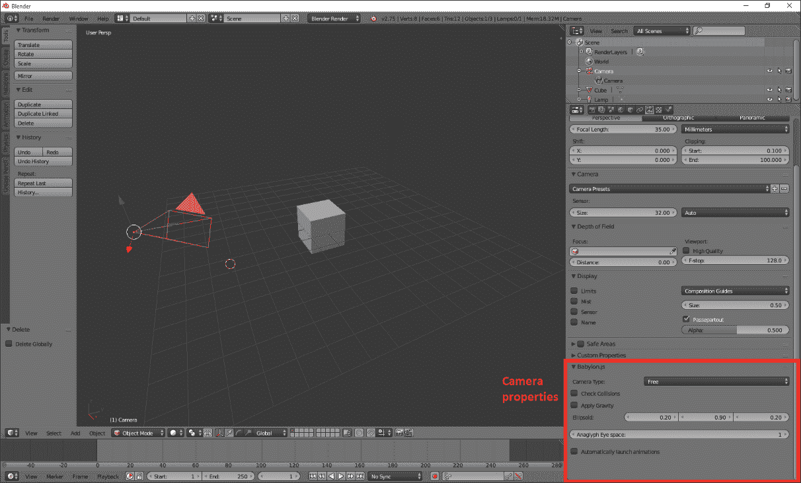

放大属性：

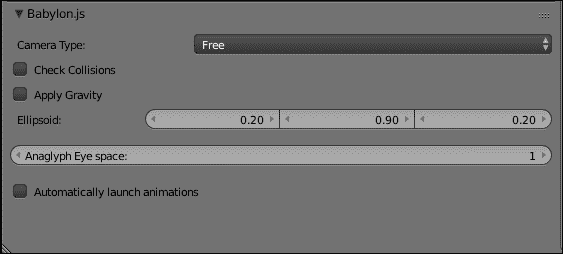

对于相机，属性如下：

+   **相机类型**：这是相机的类型，例如自由相机（FPS）、弧形旋转相机等

+   **检查碰撞**：这是检查相机是否应该检查启用了检查碰撞属性的对象的碰撞

+   **应用重力**：如果重力应该吸引相机，则应用此选项

+   **椭球体**：这是围绕相机的半径，你可以在这里检查轴（*X*、*Y*和*Z*）上的碰撞

+   **立体眼镜空间**：这是立体相机（可以在相机类型属性中选择立体相机）

+   **自动启动动画**：如果相机是动画的，它会在开始时自动启动相机的动画

在 Blender 中选择灯光并查看以下截图：

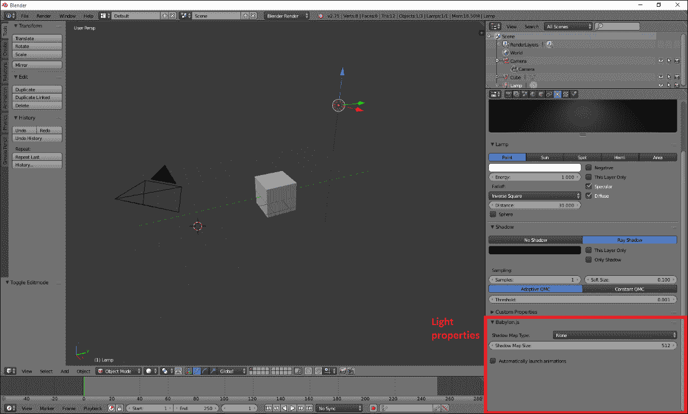

放大属性：

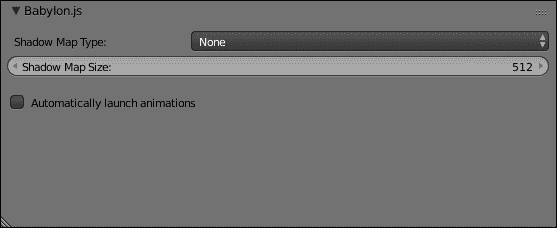

对于灯光，属性如下：

+   **阴影贴图类型**：如果选择不是 None，灯光将变成阴影灯光。方差阴影贴图比标准阴影贴图更占用空间，但它们更真实。

+   **阴影贴图大小**：这相当于阴影的质量，必须是 2 的幂。1024 是阴影的良好质量。

+   **自动启动动画**：如果灯光是动画的，它将在开始时自动启动灯光的动画。

让我们添加一个平面来创建地面并导出场景：

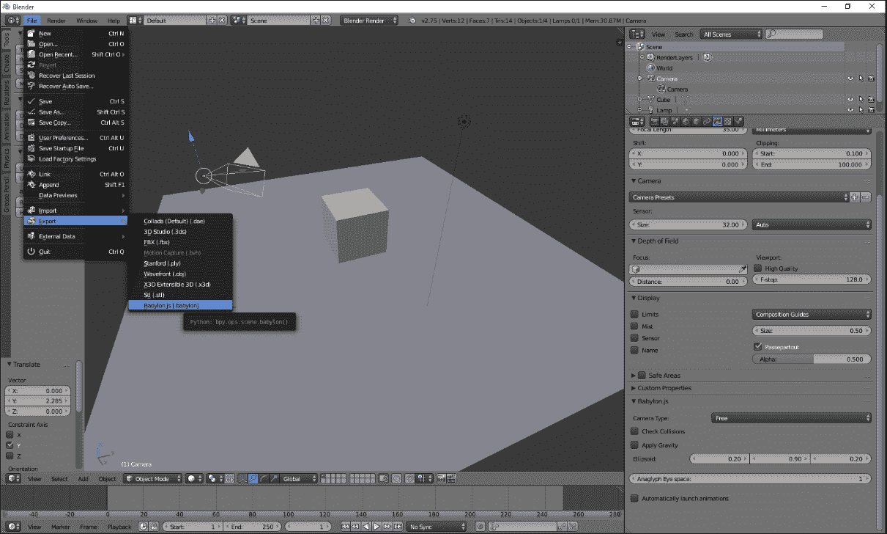

一旦启动导出器，Blender 会显示一个带有左侧选项和文件浏览器（用于保存场景文件）的界面。选项如下：

+   **仅导出当前层**：Blender 可以处理多个图层。勾选此项以仅导出当前图层。

+   **无顶点着色**：这是禁用或启用顶点着色。关于这一点，将在后续章节中关于特殊效果的部分提供更多信息。

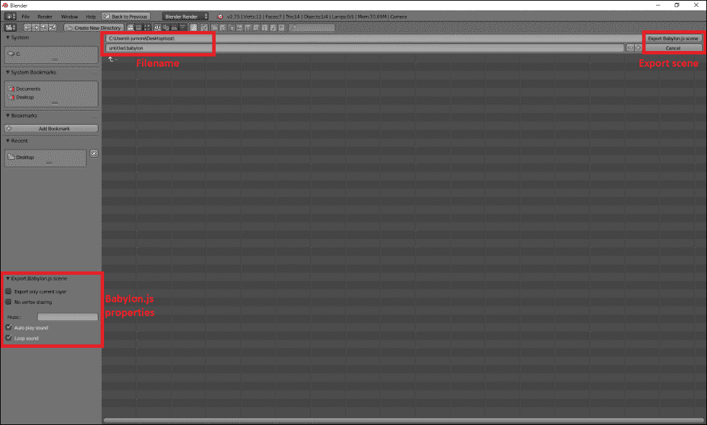

要导出场景，只需单击**导出 Babylon.js 场景**按钮。

一旦导出场景，不要犹豫使用 Sandbox 工具([`www.babylonjs.com/sandbox/`](http://www.babylonjs.com/sandbox/))来测试您的场景。只需将`.babylon`文件拖放到浏览器中。以下是结果：

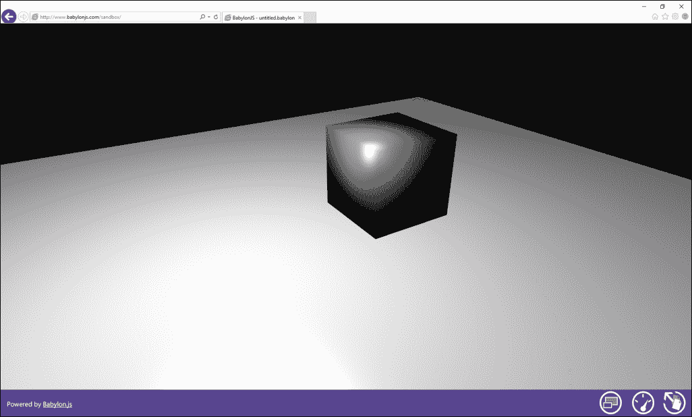

# 使用 3ds Max 导出场景

对于 Blender，您可以在 Babylon.js GitHub 仓库的`Exporters`/`3Ds Max`/`Max2Babylon*.zip`中找到 3ds Max 插件（用 C#编写），其中`*`是导出器的版本。在存档中，您将找到两个文件夹：`2013`和`2015`，这是`Max2Babylon`导出器目前支持的 3ds Max 版本。

3ds Max 是 3D 艺术家用来创建 3D 场景的另一个工具，例如 Blender。3ds Max 是最著名的 3D 建模器，因为它被用于许多专业的 3D 视频游戏，并且所有 3D 艺术家都知道它。

## 安装 3ds Max 的 Babylon.js 导出器

一旦确定要使用的正确版本（`2013`或`2015`），只需将二进制文件复制/粘贴到`bin/assemblies`文件夹中，然后启动 3ds Max（通常位于`C:\Program Files\Autodesk\3ds Max 201*\bin\assemblies\`）：

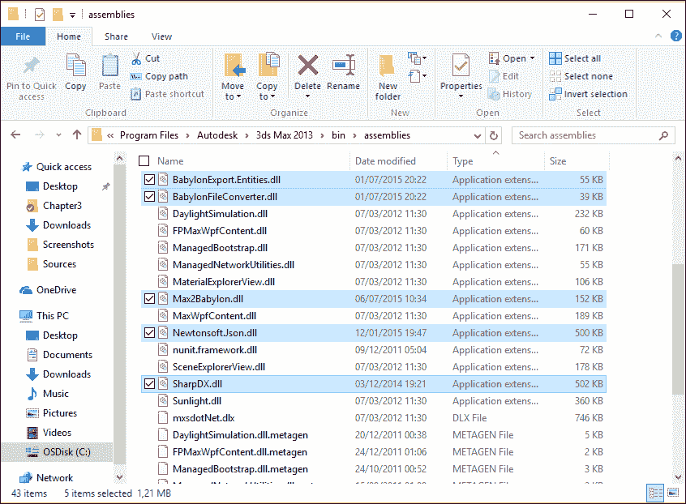

一旦启动 3ds Max，顶部菜单中就会出现一个名为**Babylon**的新菜单。此菜单用于将场景导出为`.babylon`文件。至于 Blender，您可以通过在 3ds Max 中右键单击对象来修改 Babylon.js 属性：

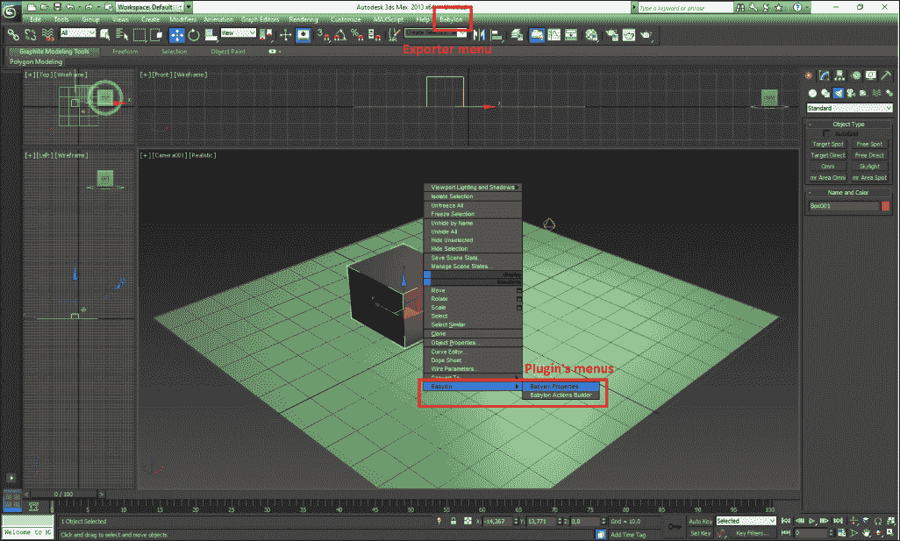

+   在工具栏上放大查看：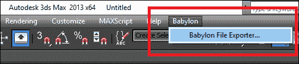

+   在上下文菜单中放大查看：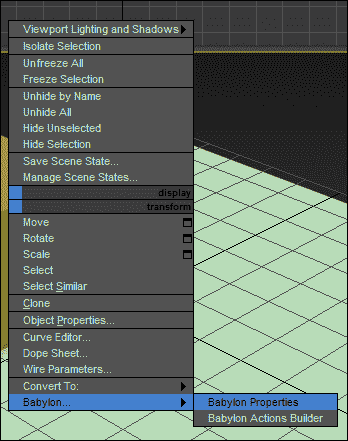

## 修改属性

Max2Babylon 插件由于右键点击增加了两个菜单：**Babylon 属性**和**Babylon 动作构建器**。

Actions Builder 是一个帮助在对象上创建动作的工具。让我们等待第七章，*在对象上定义动作*，以了解更多关于如何在场景中的对象上创建动作的信息。例如，Actions Builder 被用于在 Mansion 场景中的对象上创建动作，该场景可在[`babylonjs.com/demos/mansion/`](http://babylonjs.com/demos/mansion/)找到。

这些属性可以在网格、灯光、相机和场景中修改（未选择对象）。您将检索到与 Blender 相同的属性。只需点击**Babylon 属性**菜单。

### 注意

注意：包括物理和声音在内的某些属性将在第五章，*在对象上创建碰撞*和第六章，*在 Babylon.js 中管理音频*中分别介绍。

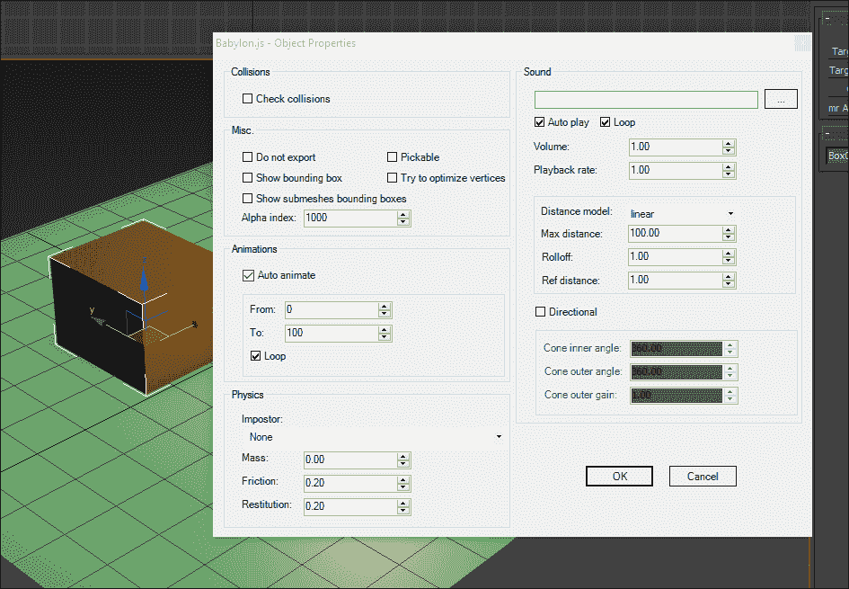

对于网格，有以下新属性：

+   **不导出**：如果网格应该导出到场景文件，则使用此选项。

+   **显示边界框**：这是用于调试的，显示一个代表网格外壳的线框框。

+   **显示子网格边界框**：与**显示边界框**选项类似，此选项将显示所选网格的子网格的边界框。

+   **可拾取**：如果 Babylon.js 应该能够拾取网格，则使用此选项。Babylon.js 允许你在场景中发射射线并找到射线与场景中网格的交点。勾选此选项以允许拾取。例如，网格拾取可以在用户点击时选择场景中的网格。

+   **自动动画**：如果对象（灯光、网格或相机）在开始时被动画化，则使用此选项。

+   **从**和**到**：这是动画开始时的起始帧和结束帧。

+   **循环**：如果动画应该循环，则使用此选项。

在 3ds Max 中选择灯光，让我们看看下面的截图：

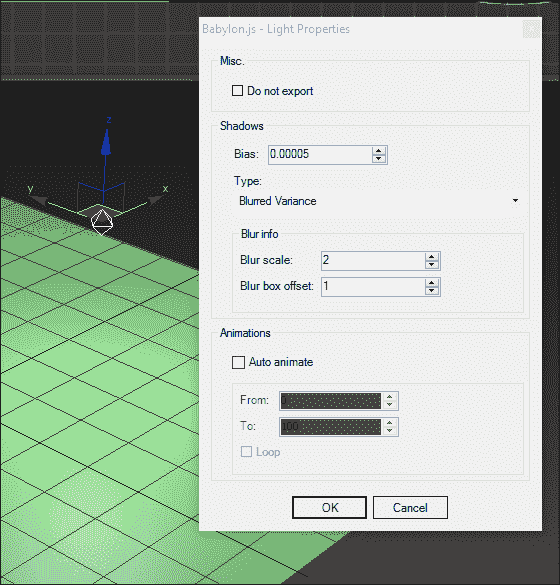

对于灯光，属性与 Blender 相当：

+   **不导出**：如果灯光应该导出到场景文件，则使用此选项。

+   **偏差**：用于移除阴影效果可能产生的可能伪影。默认值在大多数情况下应该是足够的。

+   **类型**：与 Blender 类似，表示灯光是否应在场景中计算阴影。`方差`和`模糊方差`阴影贴图比标准阴影贴图更复杂，但更真实。

+   **模糊信息**：当阴影贴图类型为**模糊方差**时使用。**方差阴影贴图**（**VSM**）比硬阴影更真实，并且可以模糊以抑制伪影。

在 3ds Max 中选择相机，让我们看看下面的截图：

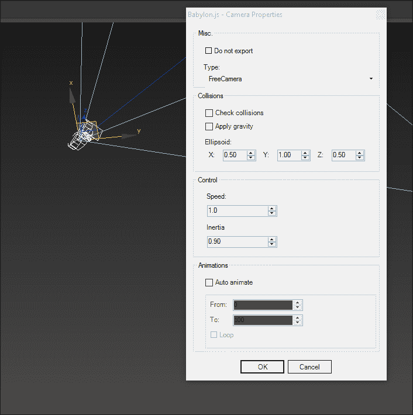

对于相机，添加的属性如下：

+   **速度**：这是相机的速度。

+   **惯性**：Babylon.js 中的所有相机都带有惯性，这代表相机的惯性。这意味着当你移动 Babylon.js 中的相机时，你给它一个运动速度，这个速度会根据其惯性值减慢。（`0`表示直接减慢，没有惯性，而大于`0`表示相机需要更多时间才能减慢。）

## 导出场景

让我们创建与 Blender 相同的场景：一个平面、一个立方体、一个相机和一个灯光：

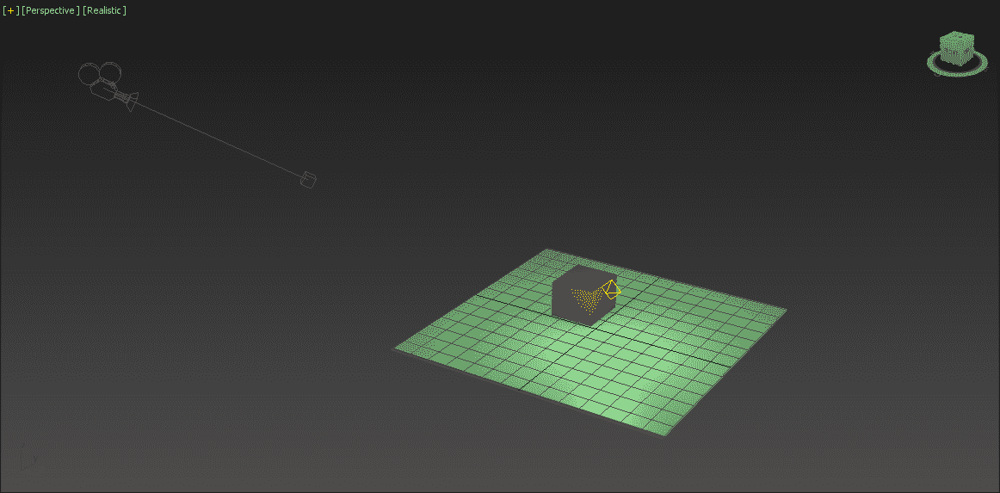

要导出此场景，只需使用顶部菜单打开导出窗口，**Babylon**：

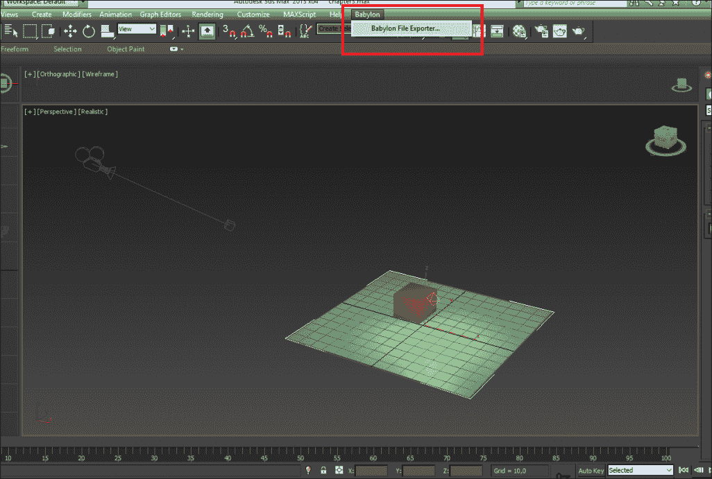

放大顶部菜单：


将会弹出导出窗口，让我们看一下以下截图：

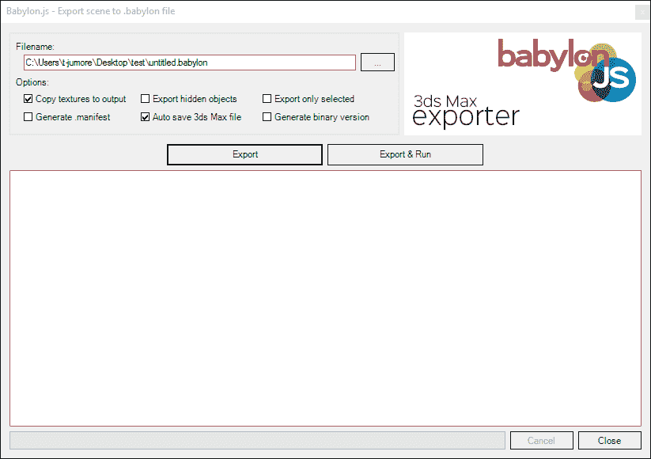

选项如下：

+   **将纹理复制到输出目录**：勾选此选项以导出纹理（如果有任何网格至少有一个纹理）到场景文件的输出目录。换句话说，3ds Max 场景的所有纹理（应用于网格）都将复制到与导出的 Babylon.js 场景文件相同的文件夹中。

+   **生成.manifest 文件**：manifest 文件用于 Babylon.js 的离线模式。导出的场景可以通过互联网和浏览器缓存加载，以节省连接。manifest 文件告诉客户端场景是否已更改。如果已更改，它将通过互联网重新加载整个场景。

+   **导出隐藏对象**：在 3ds Max 中，对象可以被隐藏（不绘制）。此选项配置导出器以保留或导出隐藏对象。

+   **自动保存 3ds Max 文件**：每次导出时，都会保存 3ds Max 项目。

+   **仅导出所选内容**：这仅将所选对象（网格、相机、灯光等）导出到场景文件中。

+   **生成二进制版本**：这会将场景导出到一个二进制文件（增量加载）。

选择文件位置，就像为 Blender 保存 Babylon.js 场景时一样，然后点击**导出**。3ds Max 插件还提供通过启动默认浏览器并使用本地服务器来导出和运行场景的功能。结果如下：

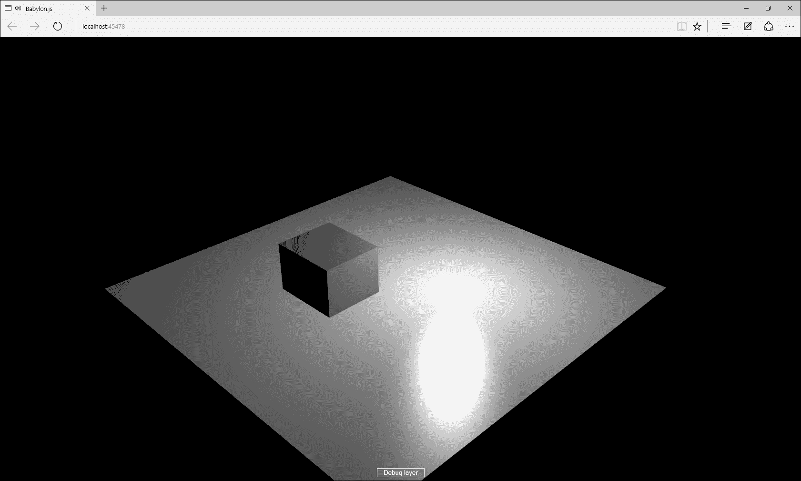

# 使用 Babylon.js 编程加载场景

要使用 TypeScript 加载场景，Babylon.js 为你提供了一个名为`BABYLON.SceneLoader`的类。这个类包含静态方法，允许你加载场景（创建新的）、附加场景和加载网格。

基本上，作为一个开发者，你会使用这些方法来加载文件。`.Load` 方法为你创建一个新场景并加载一切（网格、光源、粒子系统、相机等），并返回新场景。`.Append` 方法接受一个现有场景作为参数，并将其附加到现有场景上（用于混合多个场景）。最后，`.ImportMesh` 方法仅导入网格、骨骼（参考第九章创建和播放动画; 

```

第一个参数，`./`，是场景文件文件夹。第二个参数，`awesome_scene.babylon`，是要加载的场景文件名。最后，最后一个参数是引擎。实际上，加载器需要一个引擎来创建一个新场景。

**附加场景**：将场景附加到另一个场景的方式几乎相同；只需调用 `BABYLON.SceneLoader.Append` 方法而不是 `.Load`。

以下是一个示例：

```js
BABYLON.SceneLoader.Load("./", "another_awesome_scene.babylon", scene); 

```

前两个参数与 `.Load` 方法等效。最后一个场景参数是原始场景。实际上，由加载器创建的新场景将与原始场景合并（附加）。

**导入网格**：在这里，方法不同，但仍然位于 `SceneLoader` 类中的 `.ImportMesh` 方法。一个场景文件（`.babylon`）包含范围 [0, *n*] 内的多个网格。默认情况下，`.Load` 和 `.Append` 方法导入场景文件中定义的所有网格。使用 `.ImportMesh`，你可以通过给出它们的名称来指定加载器导入的网格。

以下是一个示例：

```js
BABYLON.SceneLoader.ImportMesh("", "./", "awesome_meshes.babylon", scene); 

```

第一个参数，名为 `meshesNames`，是 `any` 类型。在这里，空字符串告诉加载器导入所有网格。要指定要导入的网格，只需将它们的名称添加到一个数组中，例如，`["awesome_mesh1", "awesome_mesh2"]`。第二个和第三个参数与 `.Load` 和 `.Append` 方法等效。最后一个参数是要导入网格的场景。

## 回调

这三个方法，`.Load`、`.Append` 和 `.ImportMesh`，在成功、进度和错误上提供回调，默认为 null。它们用于控制加载过程。

对于 `.Load` 和 `.Append`，回调是相同的。

### 加载和附加

让我们看看以下示例：

```js
// Same for append 
BABYLON.SceneLoader.Load("./", "awesome_scene.babylon", engine, 
(scene: BABYLON.Scene) => { 
  // Success, with "scene" as the new scene created by the loader 
  // We can load another scenes here 
}, () => { 
  // progress 
}, (scene: BABYLON.Scene) => { 
  // error, with "scene" as the new scene created by the loader 
} 

```

成功和错误回调提供了由加载器创建的新场景。实际上，如果你查看 Babylon.js 的源代码，你会看到 .Load 方法只是通过创建一个新场景来调用 `.Append` 方法。

### 导入网格

让我们看看以下示例：

```js
BABYLON.SceneLoader.ImportMesh("", "./", "awesome_meshes.babylon", scene, 
(meshes, particleSystems, skeletons) => { 
  // Success, the callback provide access to the new imported meshes, 
  // particle systems and skeletons. 
}, () => { 
  // Progress 
}, (scene: BABYLON.Scene, e: any) => { 
  // Error callback, access the error with "e" 
}); 

```

在成功回调中，网格、`particleSystems`和`skeletons`参数分别是`BABYLON.Mesh`、`BABYLON.ParticleSystem`和`BABYLON.Skeletons`的数组，并且只包含添加的对象：

+   网格参数包含从场景文件中导入的所有网格。

+   `particleSystems`参数包含所有导入的粒子系统（烟雾、雨等）。

+   骨骼参数包含所有导入的骨骼。骨骼是用于创建动画的实体，并与网格相关联。让我们以一个角色为例：骨骼代表角色的骨架，用于创建腿部、手部、头部等动作。最后，角色可以通过骨骼行走和奔跑。

# 概述

现在，所有工具都已安装并准备好使用。不要犹豫，查看示例文件以实验场景加载器。有一些示例（场景）文件包括一个头骨和用 3ds Max 构建的场景。自然地，你会在代码中找到如何使用场景加载器，然后获得适当的架构。

作为下一步，这是一个很好的机会来介绍材料和如何使用这些材料自定义 3D 对象的的外观。当然，Babylon.js 已经为你提供了一个默认的材料，这使得创建材料的工作比你自己创建材料要容易。
