# 第五章。在对象上创建碰撞

上一章介绍了 3D 编程基础和 Babylon.js。你现在理解了完整的流程，可以轻松地使用设计师提供的材料和网格创建和自定义你的场景。

在本章中，让我们来玩一下游戏本身，通过创建碰撞和物理模拟与场景中的对象进行交互。如果你想在场景中行走而不穿越墙壁，碰撞对于增加场景的真实感非常重要。此外，让我们通过 Babylon.js 引入物理模拟，并最终看看将这两个概念集成到场景中有多容易：

+   检查场景中的碰撞

+   模拟物理

# 检查场景中的碰撞

从概念出发，配置和检查场景中的碰撞可以不使用数学符号。我们都有重力和椭球体的概念，即使“椭球体”这个词不一定熟悉。

## 在 Babylon.js 中碰撞是如何工作的？

让我们从以下场景开始（一个相机、光源、平面和盒子）：

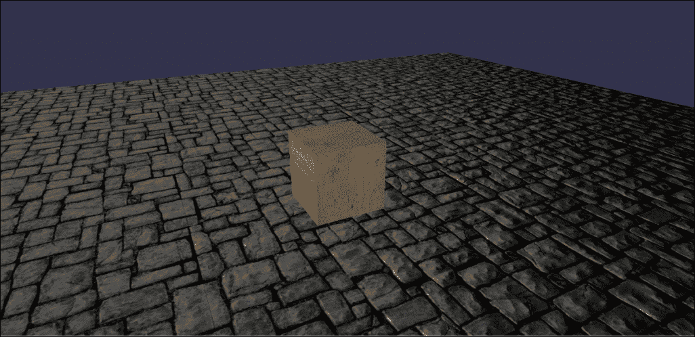

目标是防止场景中当前活动的相机穿越场景中的对象。换句话说，我们希望相机保持在平面上方，并在与盒子碰撞时停止前进。

为了执行这些操作，Babylon.js 提供的碰撞系统使用一个**碰撞器**。一个碰撞器可以用简单对象的`边界框`来表示，它看起来类似于以下图片：

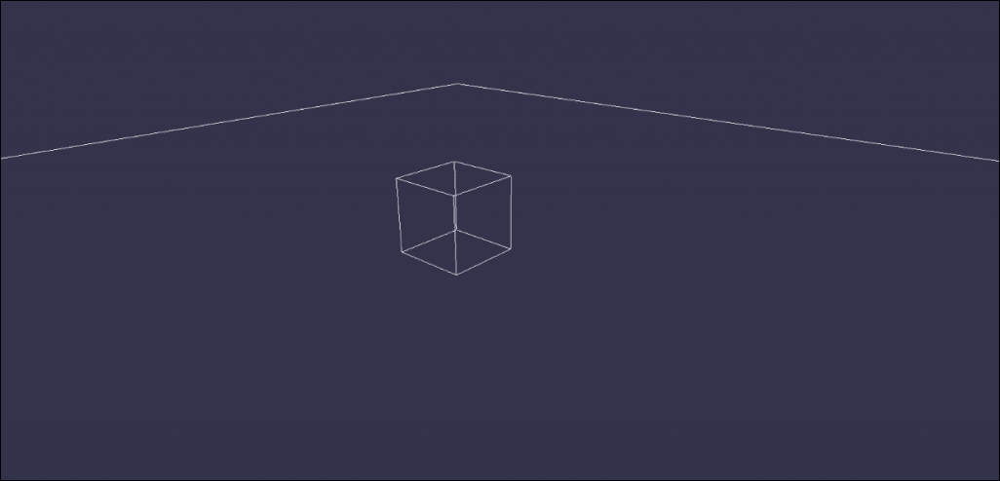

为了信息，边界框简单地表示网格顶点的最小和最大位置，并且由 Babylon.js 自动计算。

如第三章中所述，“创建、加载和绘制 3D 对象在屏幕上”，网格由通过索引缓冲区连接在一起的顶点组成，最终构建成三角形；更确切地说，碰撞是基于这些三角形，并由 Babylon.js 自动管理/计算。这意味着你不需要做任何特别复杂的事情来配置对象的碰撞。

总结来说，所有碰撞都是基于每个网格的三角形，以确定是否应该阻止相机。

### 注意

你还会看到物理引擎使用相同类型的碰撞器来模拟简单网格（边界框）的物理。

在这种情况下，复杂的工作在于设计师。他们必须优化所有网格以与碰撞良好配合。这意味着他们必须借助 3D 模型器将大网格分割成多个或子网格。

实际上，在渲染场景时，Babylon.js 的碰撞系统将根据相机的全局位置测试场景中每个网格是否应该进行碰撞测试。这就是 3D 引擎倾向于优化碰撞的原因，因为主要问题在于碰撞是在 CPU 端计算的。

例如，一些 3D 引擎提供了一种通过提供特定类型的碰撞来配置网格碰撞的方法；即使网格很复杂，你也可以选择是否想要使用边界框作为碰撞体（以节省 CPU 性能）或直接使用网格的三角形（实现真实碰撞）。

## 配置场景中的碰撞

让我们通过 Babylon.js 的碰撞引擎本身来练习。你会发现引擎特别隐藏，因为你只需要在场景和对象上启用检查。

首先，配置场景以启用碰撞，然后唤醒引擎。如果以下属性为 `false`，则 Babylon.js 将忽略所有后续属性，并且碰撞引擎将处于 *待机* 模式。然后，可以很容易地在场景中启用或禁用碰撞，而无需修改更多属性，如下所示：

```js
scene.collisionsEnabled = true; // Enable collisions in scene
```

接下来，配置相机以检查碰撞。碰撞引擎将检查所有已启用碰撞的渲染相机。在这里，我们只需要配置一个相机：

```js
camera.checkCollisions = true; // Check collisions for THIS camera
```

为了完成，将每个网格的 `.checkCollisions` 属性设置为 `true` 以激活碰撞（这里指的是平面和盒子），如下所示：

```js
plane.checkCollisions = true;
box.checkCollisions = true;
```

现在，碰撞引擎将检查场景中平面和盒子网格上的碰撞。

如果你只想在平面上启用碰撞，并希望相机穿过盒子，你必须将盒子的 `.checkCollisions` 属性设置为 `false`，如下所示：

```js
plane.checkCollisions = true;
box.checkCollisions = false;
```

## 配置重力和椭球体

**重力**

在上一节中，相机检查了平面和盒子的碰撞；然而，这并没有提交给一个著名的力，即 **重力**。为了丰富场景中的碰撞，你可以应用重力力，例如，从楼梯上下来。

首先，通过将 `.applyGravity` 属性设置为 `true` 来在相机上启用重力，如下所示：

```js
camera.applyGravity = true; // Enable gravity on the camera
```

最后，通过将 `BABYLON.Vector3` 设置为场景的 `.gravity` 属性来自定义重力方向，如下所示：

```js
scene.gravity = new BABYLON.Vector3(0.0, -9.81, 0.0); // To stay on earth
```

当然，空间中的重力应该如下所示：

```js
scene.gravity = BABYLON.Vector3.Zero(); // No gravity in space
```

不要犹豫，尝试调整值以调整重力到你的场景参考系。

**椭球体**

最后一个参数是用来丰富场景中碰撞的相机椭球体。椭球体表示相机在场景中的尺寸。换句话说，它根据椭球体的 x、y 和 z 轴调整碰撞（椭球体由 `BABYLON.Vector3` 表示）。

例如，相机必须测量 1.8 米（y 轴）并且与 x（侧面）和 z（前方）轴的最小碰撞距离必须是 1 米。然后，椭球体必须设置为（`x = 1`，`y = 1.8`，和 `z = 1`）。简单来说，设置相机的 `.ellipsoid` 属性，如下所示：

```js
camera.ellipsoid = new BABYLON.Vector3(1, 1.8, 1);
```

### 注意

相机的椭球体的默认值是（`x = 0.5`，`y = 1.0`，和 `z = 0.5`）

至于重力，不要犹豫，根据场景的比例调整 `x`、`y` 和 `z`。

# 模拟物理

物理模拟与碰撞系统有很大不同，因为它不是发生在相机上，而是发生在场景本身的物体上。换句话说，如果一个盒子启用了（并且配置了）物理，那么这个盒子将会与场景中的其他网格交互，并尝试表示真实的物理运动。

例如，让我们考虑一个空中的球体。如果你将物理定律应用于球体，球体将会落下，直到它与另一个网格碰撞，根据给定的参数，它将在场景中弹跳和滚动。

### 注意

示例文件重现了场景中间的盒子上的球体落下的行为。

## 在 Babylon.js 中启用物理

在 Babylon.js 中，物理模拟只能通过插件来完成。目前有两个可用的插件：Cannon.js 框架和 Oimo.js 框架。这两个框架包含在 Babylon.js 的 GitHub 仓库中的 `dist` 文件夹内。

每个场景都有自己的物理模拟系统，可以通过以下行来启用：

```js
var gravity = new BABYLON.Vector3(0, -9.81, 0);
scene.enablePhysics(gravity, new BABYLON.OimoJSPlugin());
// or
scene.enablePhysics(gravity, new BABYLON.CannonJSPlugin());
```

`.enablePhysics(gravity, plugin)` 函数接受以下两个参数：

+   场景中作用在对象上的重力力

+   要使用的插件：

    +   Oimo.js: `new BABYLON.OimoJSPlugin()`

    +   Cannon.js: `new BABYLON.CannonJSPlugin()`

要在场景中禁用物理，只需调用 `.disablePhysicsEngine()` 函数，如下所示：

```js
scene.disablePhysicsEngine();
```

## 模拟器

一旦在场景中启用了物理模拟，就可以配置场景网格的物理属性（或物理状态）。要配置网格的物理属性，`BABYLON.Mesh` 类提供了一个 `setPhysicsState(impostor, options)` 函数。

参数如下：

+   `impostor`：每种网格类型都有其对应的模拟器，根据其形状。例如，一个盒子可能会滑动，而一个球体会滚动。有几种类型的模拟器。

+   `options`：这些选项定义了在物理方程中使用的值。包括质量、摩擦和恢复。

让我们考虑一个质量为 `1` 的名为 `box` 的盒子，并设置其物理属性，如下面的代码片段所示：

```js
box.setPhysicsState(BABYLON.PhysicsEngine.BoxImpostor, { mass: 1 });
```

就这些了，现在盒子已经配置好了，可以通过物理方程与其它配置好的网格进行交互。让我们想象一下，盒子在空中，将会落下直到与另一个配置好的网格碰撞。

现在，让我们考虑一个质量为 `2` 的名为 `sphere` 的球体，并设置其物理属性，如下面的代码片段所示：

```js
sphere.setPhysicsState(BABYLON.PhysicsEngine.SphereImpostor, { mass: 2 });
```

您会注意到，球体，作为一种特殊的网格，有自己的模拟器（`SphereImpostor`）。与盒子相比，插件的物理方程将使球体滚动，而盒子将在其他网格上滑动。

根据它们的重量，如果盒子和球体相撞，那么球体将倾向于更强烈地推动盒子。

在 Babylon.js 中可用的模拟器如下：

+   盒子模拟器：`BABYLON.PhysicsEngine.BoxImpostor`

+   球体模拟器：`BABYLON.PhysicsEngine.SphereImpostor`

+   平面模拟器：`BABYLON.PhysicsEngine.PlaneImpostor`

+   圆柱形模拟器：`BABYLON.PhysicsEngine.CylinderImpostor`

### 注意

事实上，在 Babylon.js 中，根据 Cannon.js 和 Oimo.js 插件，盒子、平面和圆柱形模拟器是相同的。Babylon.js 的物理引擎中还存在其他尚未支持（但可能很快就会支持）的物理体类型；例如，软体（如因风而变形的旗帜）和流体体（根据物体的质量和水的特性，如清澈或水状，模拟物体在水表面的行为）。目前只支持刚体。

无论 `impostor` 参数如何，`options` 参数都是相同的。您可以通过提供以下参数来自定义网格的物理状态：

+   **质量**：这是网格在世界的质量。网格越重，停止其运动就越困难。

+   **摩擦系数**：这表示与网格接触的阻力。换句话说，这表示网格的滑溜程度。为了给您一个顺序，冰的摩擦系数等于 `1.0`。我们可以确定摩擦系数在 `[0, 1]` 范围内。

+   **恢复系数**：这表示网格将如何反弹到其他物体上。考虑乒乓球及其桌面；如果桌面的材料是地毯，恢复系数将很小。然而，如果桌面的材料是玻璃，恢复系数将是最大的。恢复系数的实际范围是 `[0, 1]`。

在示例文件中，这些参数被设置，如果您玩弄它们，您会看到这三个参数在物理方程中相互关联。

## 对网格施加力

在任何时刻，您都可以向配置好的网格施加新的力或冲量。以爆炸为例，一个盒子位于坐标 (`x = 0`, `y = 0`, `z = 0`)，爆炸发生在盒子上方坐标 (`x = 0`, `y = -5`, `z = 0`)。在现实生活中，盒子会被推上去；通过调用 `BABYLON.Mesh` 类提供的 `applyImpulse(force, contactPoint)` 函数，这个动作是可能的。

一旦网格配置了其选项和模拟器，您就可以在任何时刻调用此函数来对对象施加力。此函数的参数如下：

+   `force`：这表示 x、y 和 z 轴上的力

+   `接触点`：这表示力在 x、y 和 z 轴上的起点。

例如，爆炸只在`y`轴上产生力（为什么不呢？），其值为`10`（`10`是一个任意值），并且其原点位于坐标（`x = 0`，`y = -5`，`z = 0`），如下所示：

```js
mesh.applyImpulse(new BABYLON.Vector3(0, 10, 0), new BABYLON.Vector3(0, -5, 0));
```

一旦对网格应用了冲量（只应用一次），箱子将被推起，并会根据其物理参数（质量、摩擦和恢复）下落。

# 在 Blender 中配置

回到艺术家使用的 3D 软件，如 Blender 和 3ds Max，也可以配置碰撞和物理模拟。

## Blender 中的碰撞

从这个场景开始，碰撞的配置变得容易，如下面的截图所示：

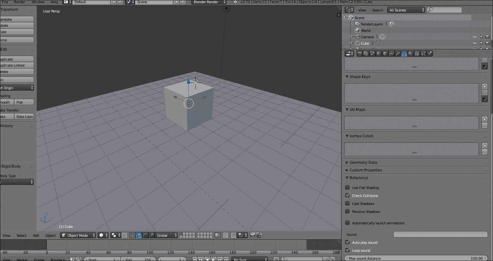

对于第三章, *在屏幕上创建、加载和绘制 3D 对象*，让我们聚焦于 Babylon.js 属性，如下面的图像所示：

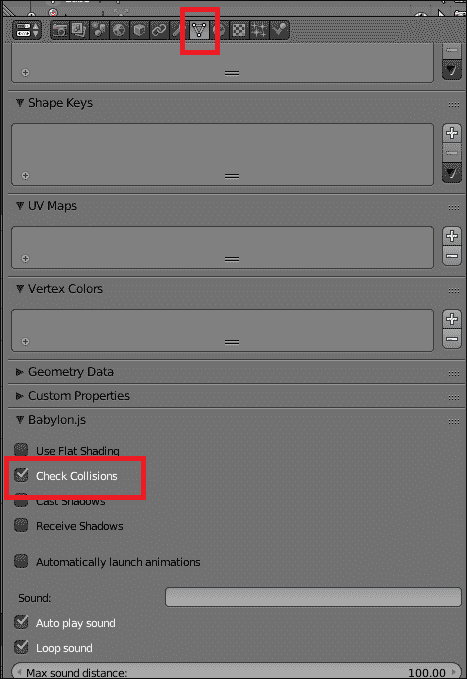

首先，点击选项按钮（在顶部），然后对于选中的对象，在这里是立方体，通过勾选**检查碰撞**复选框来启用碰撞。对于每个网格，勾选复选框以启用碰撞。

现在，让我们在 Blender 中配置相机。在场景中选择相机，点击相机选项（在顶部），如果你想要应用重力，请勾选**启用碰撞**和**应用重力**复选框，如下面的图像所示：

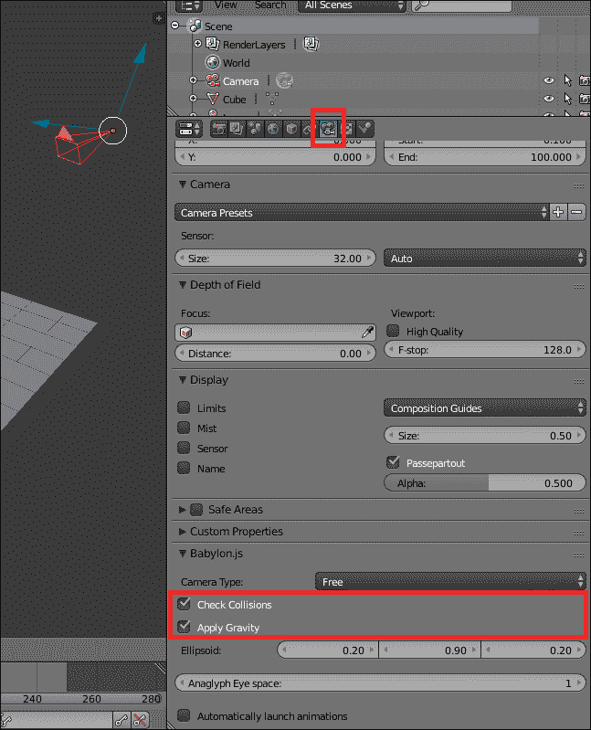

要配置相机的椭球体，两个复选框下方有一个`BABYLON.Vector3`对话框可用。你可以按照相同的顺序配置相机椭球的`x`、`y`和`z`值。

最后，如果你想为相机应用重力，最后要配置的参数是场景的重力。首先，点击场景菜单（在顶部）并修改重力值。在 Blender 中，`y`轴和`z`轴是互换的，因此，Blender 中重力的`z`轴对应于 Babylon.js 中的`y`轴，如下面的图像所示：

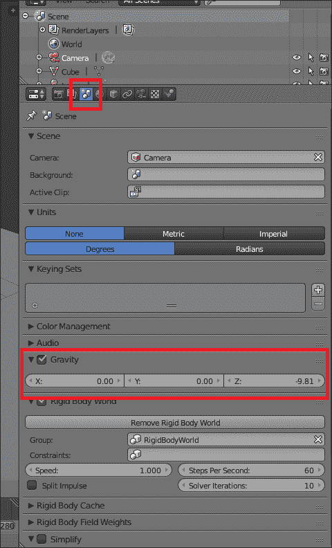

现在，你可以导出 Blender 项目并测试它；重力将被应用，相机将检查立方体和平面的碰撞。

## 在 Blender 中配置物理模拟

至于碰撞系统，你可以在 Blender 中配置网格以模拟物理。你会找到模拟者、质量、摩擦和恢复等概念，并且所有这些参数都可以在 Blender 中配置。一旦选择了一个网格，点击物理选项（在顶部）并点击**刚体**按钮（只支持刚体），如下面的图像所示：

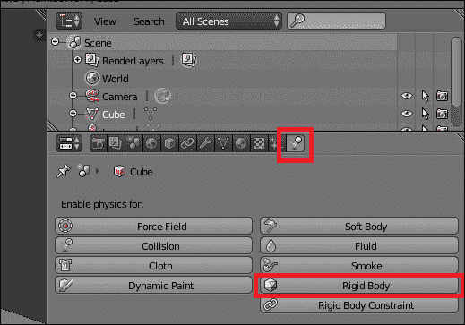

一旦点击按钮，将出现更多选项。其中一些选项与 Blender 相关；然而，只有其中一些会吸引我们的注意，如下所示：

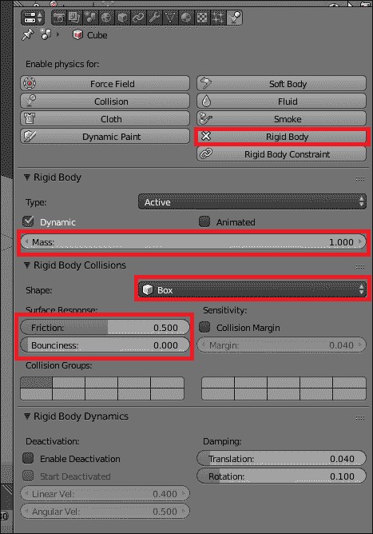

您将找到三个参数（选项）：质量、摩擦和弹性（弹性表示恢复）。在 Blender 中，模拟者被称为形状，您将找到相同的模拟者：盒子和球体。

## 在 3ds Max 中配置碰撞

对于 Blender，您也可以在 3ds Max 中配置碰撞。要启用对象的碰撞，只需打开网格的 Babylon 属性，如图所示：

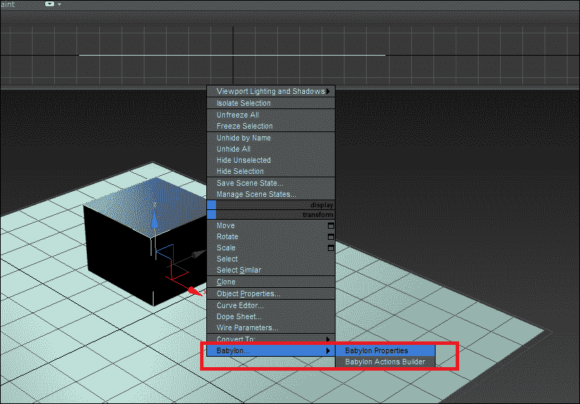

要在网格上启用碰撞，只需勾选以下图像所示的**检查碰撞**复选框：

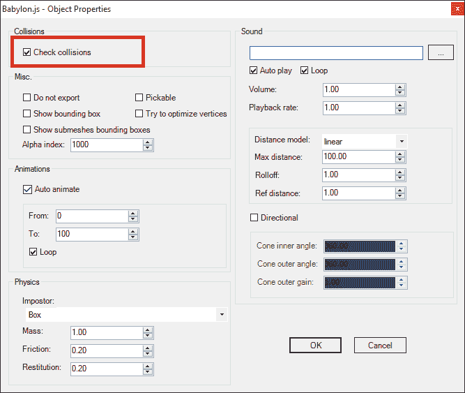

对于 Blender，您还必须配置相机以检查碰撞并应用重力（或不应用）。对于网格，打开相机的 Babylon 属性并勾选**检查碰撞**和**应用重力**复选框。您还可以以相同的顺序在`x`、`y`和`z`轴上配置相机的椭球体，如图所示：

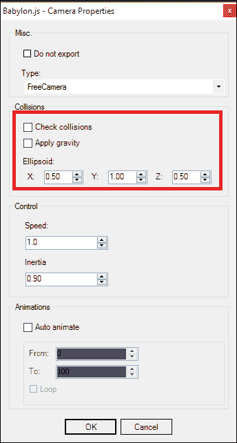

最后，打开 3ds Max 场景的 Babylon 属性，以配置重力，如果您想将重力应用于相机，操作如下：

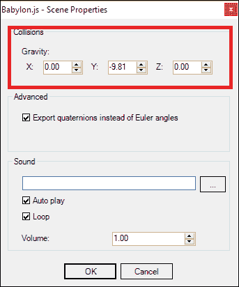

## 在 3ds Max 中配置物理模拟

与 Blender 不同，在 3ds Max 中，物理属性位于 Babylon 网格属性中。只需选择一个网格并打开 Babylon 属性，您会发现与以下截图所示相同的概念：模拟者、质量、摩擦和恢复，如下所示：

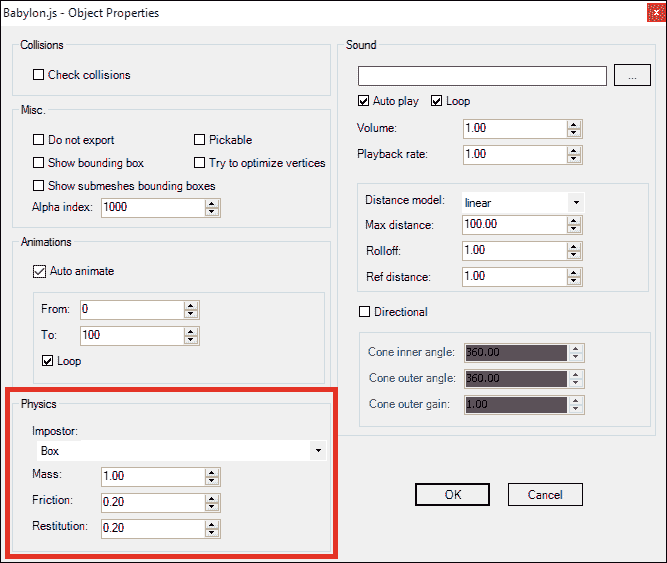

# 摘要

您现在可以配置场景的碰撞并模拟物理。无论是通过代码还是通过艺术家，您都可以理解流程，以便使您的场景更加生动。不要犹豫去操作示例文件。有三个重要的函数，如下所示：

+   `createScene()`: 此函数创建网格和材质

+   `createCollisions()`: 此函数配置场景、相机和网格上的碰撞

+   `createPhysics()`: 此函数配置网格的物理属性并应用冲量

在下一章，是时候通过添加音频轨道使您的场景更加生动了。您可以通过代码或借助 3ds Max 和 Blender 中的声音支持，由艺术家帮助，为您的场景添加声音，无论是有空间化的还是无空间化的。
