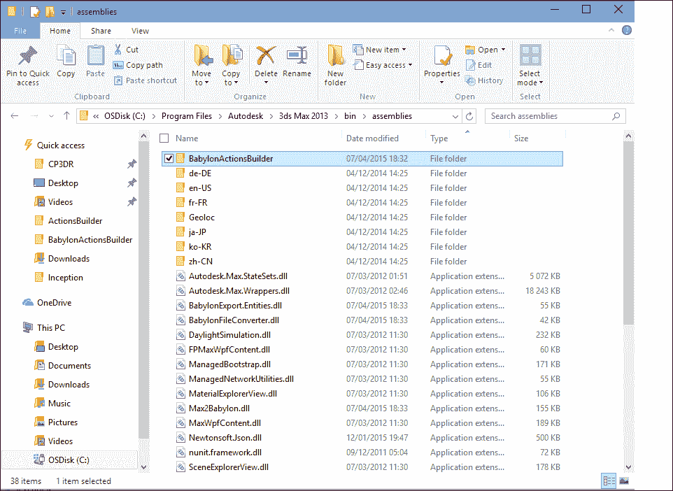
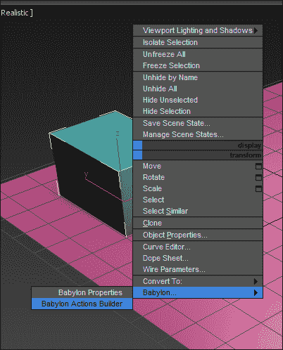
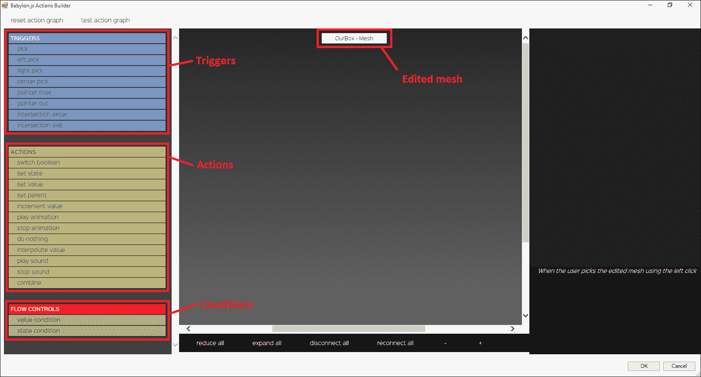
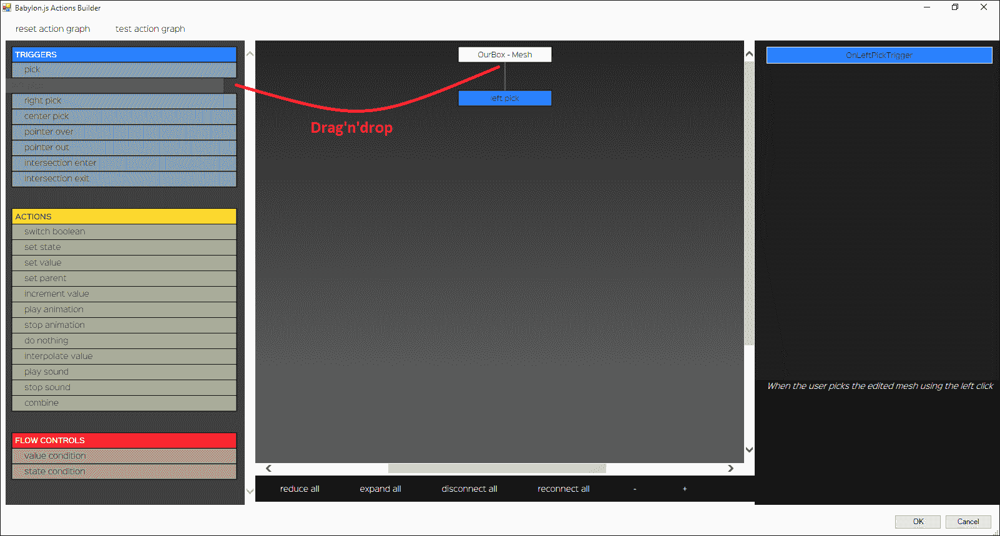
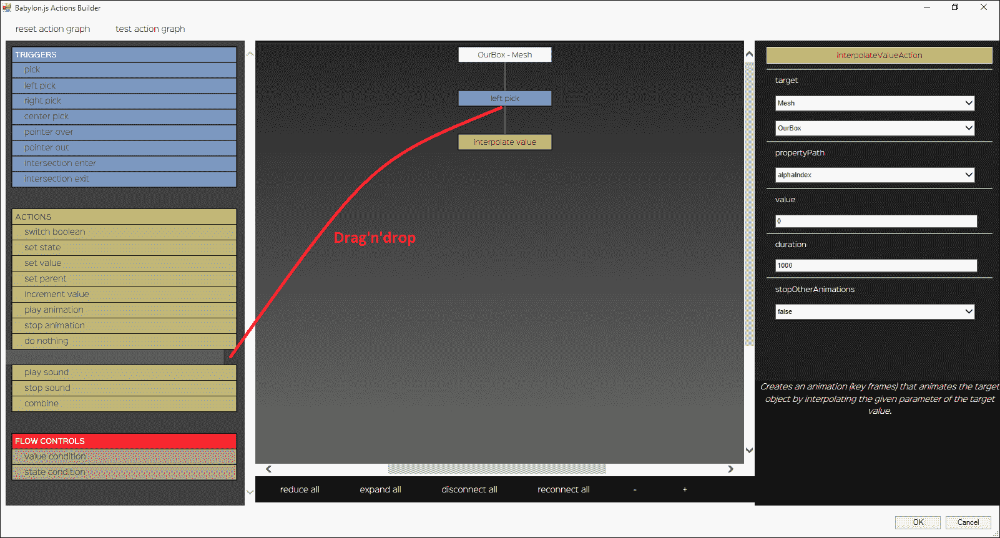
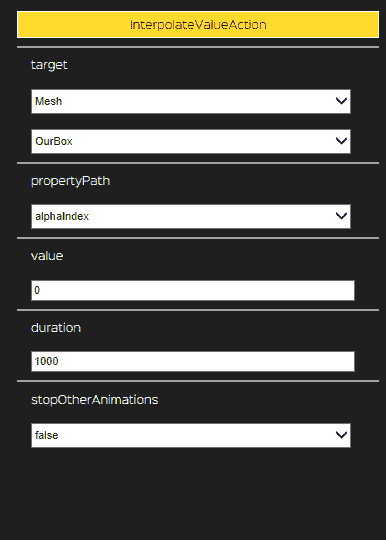
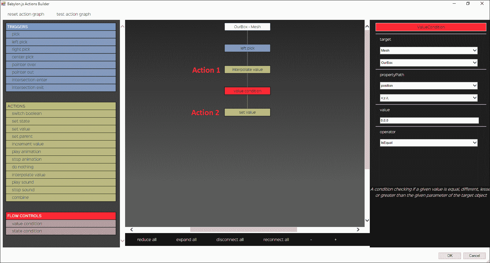
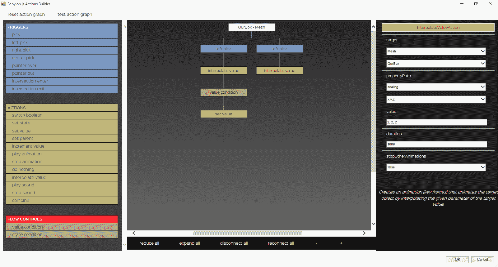

# 第七章。在对象上定义动作

让我们进一步探讨 Babylon.js 中的游戏玩法。该框架提供了一个 `ActionManager` 类，允许我们在引擎触发器时管理和执行动作。

例如，想象一个有按钮的场景。当按钮被按下（左键点击）时，场景中的灯光应该关闭，除了一个。这只是一个例子。在本章中，我们将涵盖以下主题：

+   在对象上定义动作

+   使用条件来控制动作图

+   在 3ds Max 中使用动作构建器

# 在对象上定义动作

Babylon.js 框架附带了一系列不同的动作。你可以找到可以播放声音、停止声音、插值对象属性、设置对象属性值等动作。

## 在对象上启用动作

能够处理 `ActionManager` 的唯一实体是场景和场景中的网格。每个 Babylon.js 网格都有自己的动作管理器引用。要在一个网格上启用动作，只需创建一个新的网格引用，如下所示：

```js
myMesh.actionManager = new BABYLON.ActionManager(scene);
```

`ActionManager` 构造函数只接受场景作为参数。

让我们在由一个盒子和一个平面组成的场景中创建你的第一个动作。当用户左键点击盒子时，这个动作必须将盒子的位置在 *y* 轴上从 `0` 改变到 `6`。唯一需要做的事情就是在盒子的 `ActionManager` 上调用 `.registerAction` 函数，如下所示：

```js
myMesh.actionManager = new BABYLON.ActionManager(scene);
myMesh.actionManager.registerAction(new BABYLON.SetValueAction(
  // The trigger type
  BABYLON.ActionManager.OnLeftPickTrigger,
  // The target
  myMesh,
  // Property to modify
  "position.y",
  // The new value
  6,
  // The condition
  null
));
```

让我们暂时将条件视为 `null` 并在下一个主题中解释它。

如果我们更仔细地看，一个动作是由触发器触发的（在这里，`BABYLON.ActionManager.OnLeftPickTrigger`）。只有网格有几种类型的触发器，如下所示：

+   `OnPickTrigger`：当对象被选中（点击）时。

+   `OnLeftPickTrigger`：当对象被选中（仅左键点击）时。

+   `OnRightPickTrigger`：当对象被选中（仅右键点击）时。

+   `OnCenterPickTrigger`：当对象被选中（仅鼠标滚轮点击）时。

+   `OnPointerOverTrigger`：当指针在对象上（进入）时。

+   `OnPointerOutTrigger`：当指针离开对象（退出）时。

+   `OnIntersectionEnterTrigger`：当对象与另一个对象相交时。

+   `OnIntersectionExitTrigger`：当对象完成与另一个对象的相交时。

+   `NothingTrigger`：仅用于链式动作。让我们看看下一个子主题。

### 注意

**注意**：所有选择触发器都需要网格是可选择的：`myMesh.isPickable = true;`

此外，场景上还有几种仅在场景中可用的触发器。确实，场景也可以有自己的 `ActionManager`，如下所示：

+   `OnEveryFrameTrigger`：这会在 Babylon.js 渲染的每一帧中触发相关的动作

+   `OnKeyDownTrigger`：当用户按下键（键盘）

+   `OnKeyUpTrigger`：当用户完成按键（键盘）时

如你所猜，一些触发器需要参数。例如`OnIntersectionEnterTrigger`、`OnIntersectionExitTrigger`、`OnKeyDownTrigger`和`OnKeyUpTrigger`。要配置需要参数的触发器，只需提供一个包含触发类型和参数的 JavaScript 对象，而不是直接在动作构造函数的参数中给出触发类型。以下是一个使用`OnIntersectionEnterTrigger`的先前例子：

```js
myMesh.actionManager.registerAction(new BABYLON.SetValueAction(
  // The trigger, the structure is the same for
  // OnIntersectionExitTrigger
  {
    trigger: BABYLON.ActionManager.OnIntersectionEnterTrigger,
    parameter: myOtherMeshReference
  },// The target
  myMesh,
  // Property to modify
  "position.y",
  // The new value
  6,
  // The condition
  null
));
```

对于`OnKeyDownTrigger`和`OnKeyUpTrigger`，结构相同，参数是键。以下是一个例子：

```js
myMesh.actionManager.registerAction(new BABYLON.SetValueAction(
  // The trigger, the structure is the same for
  // OnKeyUpTrigger
  {
    trigger: BABYLON.ActionManager.OnKeyDownTrigger,
    parameter: "d" // When the user pushes the key "d"
  },
  // The target
  myMesh,
  // Property to modify
  "position.y",
  // The new value
  6,
  // The condition
  null
));
```

让我们更仔细地看看以下操作参数：

+   **触发器**：这决定了动作何时由动作管理器触发。您可以将触发器视为事件类型。

+   **目标**：这代表将被动作修改的对象（不一定在所有情况下都是网格或场景；然而，通常是一个 JavaScript 对象）。

+   **要修改的属性**：这代表目标将被动作修改的属性。

+   **新值**：这代表影响目标属性的新值。这可以是一个数字、字符串、对象等。

几乎所有可用的操作都使用这些参数。

## 对象上的链式操作

Babylon.js 的`ActionManager`类允许您构建一个操作图。所有注册的操作都将同时检查（以验证触发器）并执行（如果检查得出结论）。然而，想象以下场景：

当用户左键单击盒子时，新的*y*轴位置是`0`，当用户再次左键单击盒子时，新的*y*轴旋转是`PI / 4`。

第二个动作（再次左键单击）只有在第一个动作执行时才必须执行。要执行此操作，您可以在动作中调用`.then`函数。以下是一个例子：

```js
myMesh.actionManager.registerAction(new BABYLON.SetValueAction(
  BABYLON.ActionManager.OnLeftPickTrigger,
  myMesh,
  "position.y",
  6,
  null
  )
  // Will be executed on the second left-click
  .then(new BAYBLON.SetValueAction(
  BABYLON.ActionManager.NothingTrigger,
  myMesh,
  "rotation.y",
  Math.PI / 4,
  null
));
```

此方法适用于所有动作。

## 可用的操作

现在，让我们列举所有可用的操作，如下所示：

+   `BABYLON.SwitchBooleanAction`: 这将切换布尔属性（从假变为真，或从真变为假）。以下是一个例子：

```js
      new BABYLON.SwitchBooleanAction(trigger, target, 
        propertyToModify (boolean), condition);
```

+   `BABYLON.SetValueAction`: 这将设置属性的新值，类似于前面的例子。

+   `BABYLON.IncrementValueAction`: 这将按指定的值增加属性的值（仅适用于数字值）。以下是一个例子：

    ```js
           new BABYLON.IncrementValueAction(trigger, target, 
             propertyToModify (number), valueToIncrement)
    ```

+   `BABYLON.PlayAnimationAction`: 这将播放对象中可用的动画，例如角色或按钮必须是`BABYLON.Node`。第九章，*创建和播放动画*中介绍了如何设置和播放动画。以下是一个例子：

    ```js
            new BABYLON.PlayAnimationAction(trigger, target, startFram
              e, endFrame, loop);
    ```

    动画与帧一起工作，例如从 0 到 200。动作指定起始帧和结束帧（例如 25 到 35）。循环参数是一个布尔值，指定播放的动画是否循环。

+   `BABYLON.StopAnimationAction`: 这将停止目标对象的动画。考虑以下示例：

```js
        new BABYLON.StopAnimationAction(trigger, target);
```

+   `BABYLON.DoNothingAction:` 这什么都不做。它用于控制图并绕过点击，例如。考虑以下示例：

```js
        new BABYLON.DoNothingAction(trigger);
```

+   `BABYLON.ExecuteCodeAction`: 这将执行您自己的函数。考虑以下示例：

```js
      new BABYLON.ExecuteCodeAction(trigger, (evt: ActionEvent) =>      {
        console.log("executing action !");
        console.log(evt.source);
        console.log(evt.pointerX);
        console.log(evt.pointerY);
        console.log(evt.meshUnderPointer);
        console.log(evt.sourceEvent);
        console.log(evt.additionalData);
      });
```

+   `BABYLON.SetParentAction`: 这为目标对象设置一个新的父对象。目标必须是 BABYLON.Node（网格、光源、相机等）。考虑以下示例：

```js
         new BABYLON.SetParentAction(trigger, target, 
            theParentReference);
```

+   `BABYLON.PlaySoundAction`: 这将播放一个声音。只需提供 `BABYLON.Sound` 引用。考虑以下示例：

```js
      new BABYLON.PlaySoundAction(trigger, theSoundReference);
```

+   `BABYLON.StopSoundAction`: 这将停止一个声音。只需提供 `BABYLON.Sound` 引用。考虑以下示例：

```js
       new BABYLON.StopSoundAction(trigger, theSoundReference);
```

+   `BABYLON.InterpolateValueAction`: 这将插值目标对象 `BABYLON.Node` 的值（创建动画）。考虑以下示例：

    ```js
           new BABYLON.InterpolateValueAction(trigger, target, 
             propertyToInterpolate, finalValue, durationInMS);
    ```

    要插值的属性必须是 `number`、`BABYLON.Color3`、`BABYLON.Vector3` 或 `BABYLON.Quaternion` 类型。

    例如，要插值的属性可以是 `position`，值是 `new BABYLON.Vector3(0, 6, 0)`。

+   `BABYLON.CombineAction`: 这是一个特殊动作。它允许在任何地方同时执行多个动作。考虑以下示例：

    ```js
           new BABYLON.CombineAction(trigger, childrenActions);
    ```

    `childrenActions` 是 `BABYLON.Action` 的数组。它包含同时执行的动作。

# 使用条件来控制动作图

在前面的子主题（可用的动作）中，动作中的条件被绕过了。实际上，每个动作都可以有一个条件来控制是否执行 ActionManager 中的动作。条件可以检查一个值是否与另一个值比较时处于以下状态之一：

+   相等

+   较小

+   大于

+   不同

有三种类型的条件，如下所示：

+   状态条件：这检查 `BABYLON.Node` 的 `.state` 属性是否等于给定的状态。状态是一个字符串。

+   **值条件**: 这检查属性是否等于、小于、大于或不同于给定的值。

+   **谓词条件**: 这将调用一个自定义方法，该方法将返回 `true` 或 `false`。

如果一个动作有一个条件，那么只有当条件返回 `true` 时，该动作才会被执行。

向您的动作图添加条件显示了 Actions Builder 的所有功能，这在下一个主题中介绍。为了理解以下示例，在练习条件之前，您可以访问艺术家 Michel Rousseau 制作的这个演示（[`www.babylonjs.com/Demos/ActionBuilder/`](http://www.babylonjs.com/Demos/ActionBuilder/)），他仅使用动作和条件来创建场景中的交互。

原则是必须按顺序激活三个按钮才能关闭主光源。

作为开发者，理论如下：

+   当用户点击按钮时（每个按钮的`OnLeftPickTrigger`）：

    +   如果按钮被按下（`StateCondition`），则取消按按钮并关闭灯光（`SetValueAction`）

    +   如果按钮没有被按下（`StateCondition`），则按按钮并打开灯光(`SetValueAction`)

+   在每一帧（`OnEveryFrameTrigger`）：

    +   如果三个按钮都被按下（链式`StateCondition`），则将主灯光的漫反射颜色设置为黑色（关闭）(`SetValueAction`)

    +   如果三个按钮中的任何一个没有被按下（每个按钮的`StateCondition`），则将主灯光的漫反射颜色设置为白色（打开）(`SetValueAction`)

该理论可以通过在图中通过链式连接条件（检查是否按下三个按钮）和动作来执行。当然，动作构建器将允许你在图上获得实际表示，而不是仅仅在脑海中想象。你只需操作它来训练和学习使用动作的正确思考方式。

## 状态条件

状态条件检查`BABYLON.Node`的`.state`属性是否等于给定的状态。

考虑以下使用`BABYLON.StateCondition`的示例：

```js
myMesh.state = "isUp";
// If mesh state is "isDown", make position.y up
var condition1 = new BABYLON.StateCondition(myMesh.actionManager,
myMesh, "isDown");
myMesh.actionManager.registerAction(new BABYLON.SetValueAction(
  BABYLON.ActionManager.OnLeftPickTrigger, myMesh,
    "position.y", 6, condition1);
// Else if mesh state is "isUp", make position.y down
var condition2 = new BABYLON.StateCondition(myMesh.actionManager,
  myMesh, "isUp");
myMesh.actionManager.registerAction(new BABYLON.SetValueAction(
  BABYLON.ActionManager.OnLeftPickTrigger, myMesh,
    "position.y", 0, condition2);
```

## 断言条件

断言条件执行一个自定义函数，该函数将返回 true 或 false。如果条件需要测试多个值或在使用 TypeScript 操作对象后返回 true 或 false，则特别有用。让我们使用断言条件创建一个与之前相同的示例，如下所示：

```js
myMesh.position.y = 6;
// If mesh position.y is 6, set it to 0
var condition1 = new BABYLON.PredicateCondition(myMesh.actionManag
er, () => {
  return myMesh.position.y === 6;
});
myMesh.actionManager.registerAction(new BABYLON.SetValueAction(
  BABYLON.ActionManager.OnLeftPickTrigger, myMesh,
    "position.y", 0, condition1);
// Else if mesh position.y is 0, set it to 6
var condition2 = new BABYLON.PredicateCondition(myMesh.actionManag
er, () => {
  return myMesh.position.y === 0;
});
myMesh.actionManager.registerAction(new BABYLON.SetValueAction(
  BABYLON.ActionManager.OnLeftPickTrigger, myMesh,
    "position.y", 6, condition2);
```

## 值条件

值条件是一种自动检查值是否等于、小于、大于或不同的方法，而无需编写断言条件。让我们再次使用`BABYLON.ValueCondition`创建之前的示例，如下所示：

```js
myMesh.position.y = 6;
// If mesh position.y is 6, set it to 0
var condition1 = new BABYLON.ValueCondition(myMesh.actionManager,   myMesh, "position.y", 6, BABYLON.ValueCondition.IsEqual);
myMesh.actionManager.registerAction(new BABYLON.SetValueAction(
  BABYLON.ActionManager.OnLeftPickTrigger, myMesh, "position.y", 0    , condition1);
// Else if mesh position.y is 0, set it to 6
var condition2 = new BABYLON.ValueCondition(myMesh.actionManager, myMesh, "position.y", 0, BABYLON.ValueCondition.IsEqual);
myMesh.actionManager.registerAction(new BABYLON.SetValueAction(
  BABYLON.ActionManager.OnLeftPickTrigger, myMesh, "position.y", 6    , condition2);
```

值条件的工作方式类似于动作，你必须指定目标（`myMesh`）、属性（`position.y`）以及要测试的值（`0`和`6`）。

# 在 3ds Max 中使用动作构建器

创建动作可以节省代码行数。Babylon.js 解决方案还提供了一种方式，让 3ds Max 艺术家和开发者创建动作，包括条件，而无需任何代码。

动作构建器允许 Michel Rousseau 在他的场景中创建动作和场景，而无需任何代码，如下所示：

+   大厦场景：[`www.babylonjs.com/?MANSION`](http://www.babylonjs.com/?MANSION)

+   动作构建器场景：[`www.babylonjs.com/?AB`](http://www.babylonjs.com/?AB)

要做到这一点，你可以简单地使用动作构建器，它是 Babylon.js 3ds Max 插件的组成部分。动作构建器位于 GitHub 仓库中 3ds Max 插件中的`BabylonActionsBuilder`文件夹。你可以将文件夹复制并粘贴到 3ds Max 插件目录中，该目录通常位于`C:\Program Files\Autodesk\3ds Max 2013\bin\assemblies`，如下面的截图所示：



## 它是如何工作的

要使用动作构建器，只需在 3ds Max 中选择一个对象，右键单击它，选择**Babylon...**菜单，然后打开**Babylon Actions Builder**。

### 注意

**注意：**要编辑场景动作，在 3ds Max 场景中选择“无”，右键单击空白处，选择**Babylon...**菜单，然后打开**Babylon Actions Builder**。



动作构建器窗口出现。你现在可以添加动作到你的对象，而无需任何代码行。在动作构建器中，所有动作都可用，除了执行代码的动作（`BABYLON.ExecuteCodeAction`和`BABYLON.PredicateCondition`）。



在左侧，有一个触发器、动作和条件的列表。要添加一个动作或条件，你必须从一个触发器开始。只需将所需的触发器拖放到根节点（ourMesh）上。



现在，子动作将在用户左键单击**ourBox**对象（一个网格）时执行。

一旦添加了所需的触发器，你可以在图中*拖放*任何动作或条件。例如，让我们添加`BABYLON.InterpolateValueAction`，如图所示：



如果你点击添加的动作，右侧将出现几个菜单。这些菜单将对应于动作构造函数的参数。你将检索目标、属性和值参数，如图所示：



动作构建器中`.then`函数的等价操作是在动作中添加一个子动作。

让我们也在图中添加一个条件，以及一个插值值动作的子动作（相当于`.then`）。至于触发器和动作，*拖放*一个值条件（`BABYLON.ValueCondition`）到插值值动作上，如图所示：



在这里，当用户左键单击网格时，将执行动作 1。一旦动作 1 执行，只有当值条件返回`true`时，才会执行动作 2。

## 管理多个管道

使用 TypeScript，你可以通过在`ActionManager`对象中调用`.registerAction`函数，向你的对象添加多个动作分支。使用动作构建器，你可以简单地添加另一个触发器来处理新的动作图，如图所示：



在这种配置下，每个触发器的第一个动作将同时执行，除非有条件，并且动作的条件返回 false。

# 摘要

现在，你可以在你的项目中创建动作并节省大量代码行。你已了解如何使用`BABYLON.ActionManager`类，如何添加动作，不同的触发器，以及如何使用条件来控制图。你还能使用动作构建器与艺术家和 3ds Max 协作，从而节省更多代码行。

在下一章中，让我们专注于使用后处理（效果）的渲染部分。这将是一个介绍 HDR、SSAO、模糊、光晕等概念的良机。这是 3D 开发者们最喜欢的部分之一，用于创建如后处理等特殊效果。
