# 第八章. 使用内置后处理添加渲染效果

记得第四章，关于材质的内容吗？在材质背后是称为**着色器**的 GPU 程序。着色器是两个链接程序的组合：顶点着色器和像素着色器。顶点着色器在顶点上工作（将它们的 3D 位置转换为屏幕上的 2D 位置），而像素着色器在像素上工作（确定每个像素的最终颜色）。在这里，你可以看到后处理只是一个像素着色器，因为顶点着色器对所有后处理都是相同的。

最后，后处理倾向于只在视图空间中创建效果。换句话说，后处理永远不会应用于如网格等对象，它们只应用于相机本身。在本章中，我们将涵盖以下主题：

+   使用 Babylon.js 的后处理

+   使用 Babylon.js 的后处理渲染管线

+   讨论内置的后处理

# 使用 Babylon.js 的后处理

幸运的是，你不必自己创建后处理，即使你可以使用 Babylon.js 来做。Babylon.js 中已经有一些后处理可用，并且在大多数情况下，只需写一行代码即可使用！

## 从你的第一个后处理开始

在 Babylon.js 中，你可以使用后处理创建模糊、辉光、HDR、SSAO、体积光后处理等。

让我们从以下场景开始：

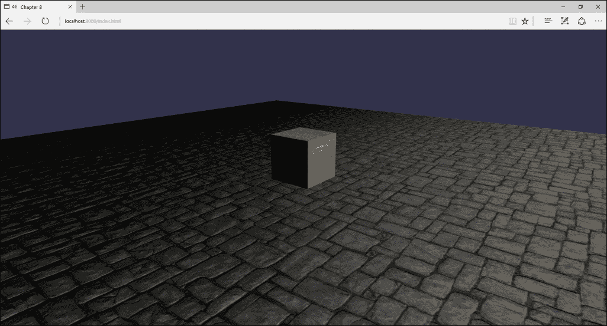

对于第一个例子，让我们使用内置后处理创建一个垂直模糊后处理。模糊后处理可以通过创建`BABYLON.BlurPostProcess`类的新实例来获取，如下所示：

```js
var blurV = new BABYLON.BlurPostProcess(
  "blurV", // Name of the post-process
  new BABYLON.Vector2(0, 1), // Direction of the blur (vertical)
  4, // The blur width
  0.5, // The ratio of the post-process
  camera // The camera to attach to
);
```

结果如下所示：

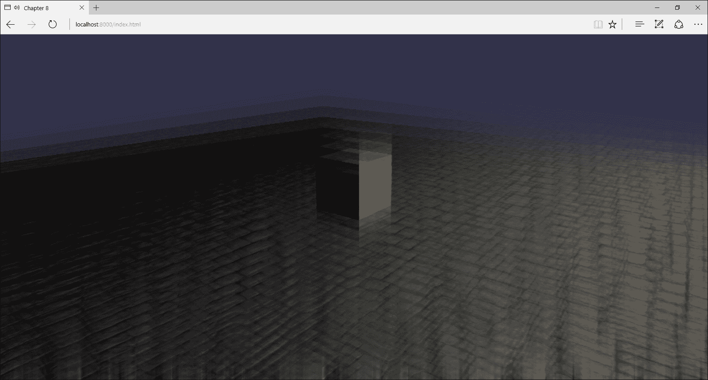

Babylon.js 中大多数可用的后处理将具有以下相同的参数：

+   **名称**: 这是后处理的名称。

+   **比例**: 这是后处理在`[0, 1]`区间内的比例。比例用于在较低分辨率下计算后处理以节省性能。换句话说，如果比例为`0.5`，后处理将应用于画布分辨率除以 2。

+   **相机**: 后处理应用于相机。然后，你只需提供相机引用，后处理的构造函数就会自动附加到相机上。

以另一个例子为例，让我们创建一个`黑白`后处理，它将场景完全转换为黑白，如下所示：

```js
var bw = new BABYLON.BlackAndWhitePostProcess(
  "blackAndWhite", // name of the post-process
  1.0, // ratio of 1.0, keep the full resolution
  camera // the camera to attach to
);
```

以下截图显示了结果：

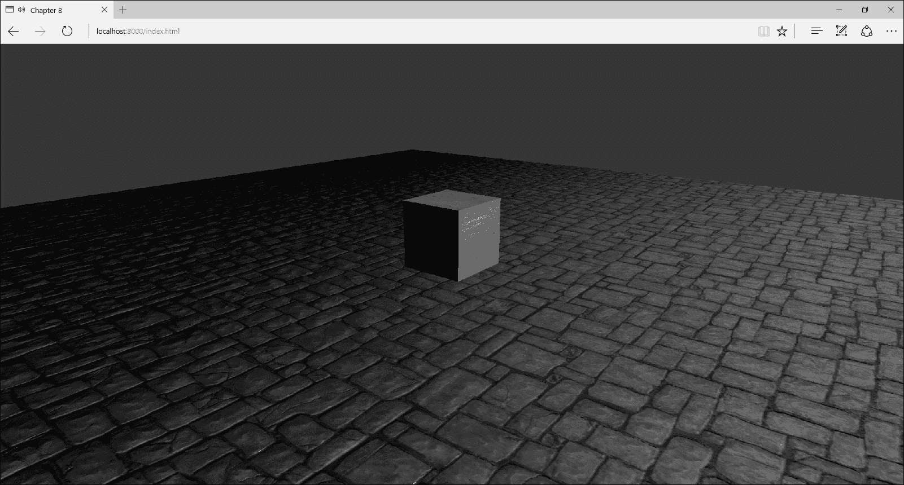

## 后处理链

使用 Babylon.js，您可以链式后处理。这意味着对于某个后处理，前一个后处理将作为参考。例如，两个模糊后处理可以用来水平垂直模糊场景；第一个后处理水平模糊场景，第二个使用水平模糊后处理垂直模糊场景。

让我们创建第一个后处理，即水平模糊后处理：

```js
var blurH = new BABYLON.BlurPostProcess(
  "blurH",
  new BABYLON.Vector2(1, 0),
  8,
  0.5,
  camera
);
```


现在，让我们在水平模糊后处理之后创建垂直模糊后处理，如下所示：

```js
var blurV = new BABYLON.BlurPostProcess(
  "blurV",
  new BABYLON.Vector2(0, 1),
  8,
  0.5,
  camera
);
```

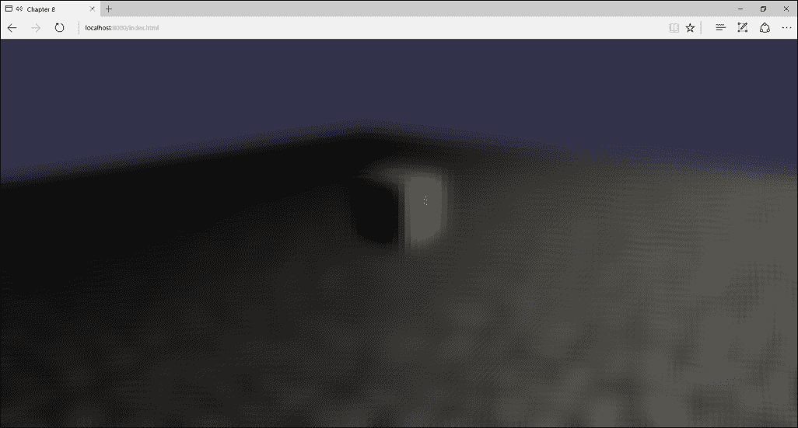

最后，为什么不添加“黑白”后处理，如下所示：

```js
var bw = new BABYLON.BlackAndWhitePostProcess("bw", 1.0, camera);
```

最终结果显示在下述截图：

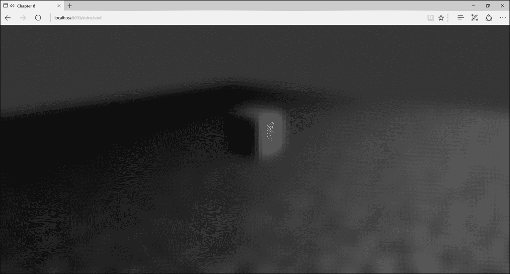

## 移除和检索后处理

要从相机中移除后处理，您可以直接在某个后处理上调用`.dispose`函数。该函数会移除内部资源并将后处理从相机中分离。

例如，考虑以下链式后处理：

```js
blurH.dispose();
blurV.dispose();
bw.dispose();
```

相反，您可以从/到相机中分离和附加后处理而不删除内部资源。只需在相机上调用`.attachPostProcess`或`.detachPostProcess`函数即可。考虑以下示例：

```js
camera.detachPostProcess(blurH); // Detach
camera.attachPostProcess(blurH); // Re-attach the post-process
```

要检索可用的后处理，您可以访问相机的`._postProcesses`属性。考虑以下示例：

```js
for (var i=0; i < camera._postProcesses.length; i++) {
  console.log(camera._postProcesses[i].name);
}
```

# 使用 Babylon.js 的后处理渲染管线

现在，您能够创建后处理并将它们附加到相机上。问题是如果您在项目中管理多个相机，那么您将不得不销毁或分离后处理以便重新附加到新的相机上。为了简化任务，您可以使用渲染管线。换句话说，您可以将渲染管线视为后处理列表，您可以将它们附加到多个相机上。

## 创建渲染管线

这些步骤包括创建管线引用，将管线添加到场景中，并将管线附加到相机上。

创建一个渲染管线，如下所示：

```js
var pipeline = new BABYLON.PostProcessRenderPipeline(
  engine, // The Babylon.js engine
  "renderingPipeline" // The name of the rendering pipeline
);
```

一旦管线被创建，将其添加到场景的后处理渲染管线管理器中（由创建渲染管线构造函数时传入的引擎引用），如下所示：

```js
scene.postProcessRenderPipelineManager.addPipeline(pipeline);
```

一旦管线被添加到后处理渲染管线管理器中，您就可以添加效果。这个过程包括通过调用管线的`.addEffect`方法向管线中添加一个新的`BABYLON.PostProcessRenderEffect`对象，如下所示：

```js
// Create the post-process (horizontal blur)
var blurH = new BABYLON.BlurPostProcess(
  "blurH",
  new BABYLON.Vector2(1, 0), 8, 0.5,
  null, // The camera is null
  null, // Keep the bilinear filter as default
  engine // Because the camera is null, we must provide the engine
);
// Create the render effect
var blurHEffect = new BABYLON.PostProcessRenderEffect(
  engine, // The Babylon.js engine
  "blurHEffect", // The name of the post-process render effect
  () => { // The function that returns the wanted post-process
    return blurH;
  }
);
// Add the render effect to the pipeline
pipeline.addEffect(blurHEffect);
```

如您所见，构建后处理的方法必须更改。现在，后处理将不会接受任何相机作为参数，因为它们不是应用于特定相机。这就是为什么我们必须提供所有参数的原因，例如过滤器类型（默认为双线性，然后可以是 null）和引擎。这种方法适用于所有后处理，您可以轻松地将后处理渲染效果添加到管道中，如下所示：

```js
var blurH = new BABYLON.BlurPostProcess(..);
var blurV = new BABYLON.BlurPostProcess(..);
var bw = new BABYLON.BlackAndWhitePostProcess(..);
// The horizontal blur post-process render effect
var blurHEffect = new BABYLON.PostProcessRenderEffect(
  engine, // The Babylon.js engine
  "blurHEffect",
  () => {
    return blurH;
  }
);
// The vertical blur post-process render effect
var blurVEffect = new BABYLON.PostProcessRenderEffect(
  engine, // The Babylon.js engine
  "blurVEffect",
  () => {
    return blurV;
  }
);
// The black and white post-process render effect
var bwEffect = new BABYLON.PostProcessRenderEffect(
  engine,
  "bwEffect",
  () => {
    return bw;
  }
);
// And finally add the render effects to the pipeline by
// following the desired order
pipeline.addEffect(blurHEffect);
pipeline.addEffect(blurVEffect);
pipeline.addEffect(bwEffect);
```

最后，让我们将管道连接到相机或相机列表。现在，后处理将应用于相机，如下面的代码片段所示：

```js
scene.postProcessRenderPipelineManager.attachCamerasToRenderPipeline(
  "renderingPipeline", // The name of the pipeline to attach
  camera // the camera to attach to. Can be an array of cameras
);
```

您还可以按照以下方式从相机或相机列表中分离管道：

```js
scene.postProcessRenderPipelineManager.detachCamerasFromRenderPipeline(
  "renderingPipeline", // The name of the pipeline to detach
  camera // the camera to detach. Can be an array of cameras
);
```

结果看起来完全一样；然而，现在更容易在多个相机之间共享后处理，如下面的屏幕截图所示：


## 在管道中启用和禁用效果

后处理渲染管道的另一个特点是禁用和启用效果的可能性，这是一个有用的功能，允许您高度调试项目的渲染部分。

假设，在您的项目中，您可以在两个相机之间切换（`scene.activeCamera = theNewCamera`）。第一个相机是模糊的，第二个是模糊的并且是`黑白`。目标是两个相机可以共享相同的后处理渲染管道引用，除了第一个相机必须禁用`黑白`后处理。

要在渲染管道中禁用效果，您可以在场景的后处理渲染管道管理器上调用`.disableEffectInPipeline`方法。所需的唯一参数是管道的名称、效果的名称以及将不再启用后处理的相机。如果我们以之前的例子为例，让我们禁用`黑白`后处理，如下所示：

```js
scene.postProcessRenderPipelineManager.disableEffectInPipeline(
  "renderingPipeline", // The name of the render pipeline
  "bwEffect", // The name of the "black and white" effect to disable
  camera // The camera attached to the pipeline
);
```

换句话说，这种方法允许您仅对作为参数传递的相机禁用渲染效果。

相反，您可以在任何时候通过在场景的后处理渲染管道管理器上调用`.enableEffectInPipeline`方法来启用之前已禁用的渲染效果。让我们启用`黑白`渲染效果，如下所示：

```js
scene.postProcessRenderPipelineManager.enableEffectInPipeline(
  "renderingPipeline", // The name of the render pipeline
  "bwEffect", // The name of the "black and white" effect to enable
  camera // The camera attached to the pipeline
);
```

# 内置的后处理

让我们从本章最有趣的部分开始；在 Babylon.js 中使用内置的后处理。有几个后处理可以通过以下元素美化您的场景：

+   **体积光散射**：这展示了如何轻松散射给定光源（如太阳或月亮）的光线。

+   **SSAO 渲染管道**：屏幕空间环境遮挡。换句话说，这个渲染管道倾向于通过仅使用后处理来近似场景的环境遮挡，以获得更逼真的效果。

+   **HDR 渲染管线**：高动态范围渲染。此渲染管线与场景中的光照直接相关，并倾向于模拟视网膜在现实世界中的工作方式。

## 体积光散射后处理

让我们从有趣的**体积光散射**（**VLS**）后处理开始。VLS 后处理倾向于模拟光源根据光与相机之间的障碍物散射光线的现象。

让我们考虑以下原始场景：

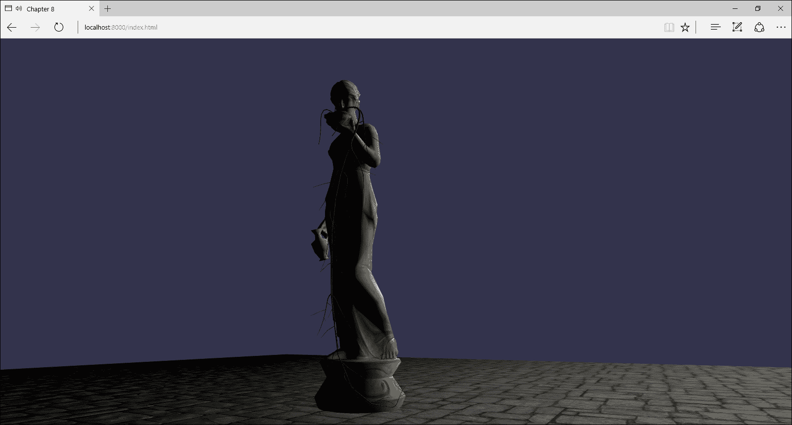

VLS 后处理接受一个代表光色的网格作为参数。实际上，光源并不是真正的光源（`BABYLON.Light`），而是一个配置了材质的网格，通过漫反射纹理或颜色来模拟光的颜色。

例如，考虑一个由广告牌表示的白色太阳。使用 VLS 后处理，结果看起来类似于以下截图：

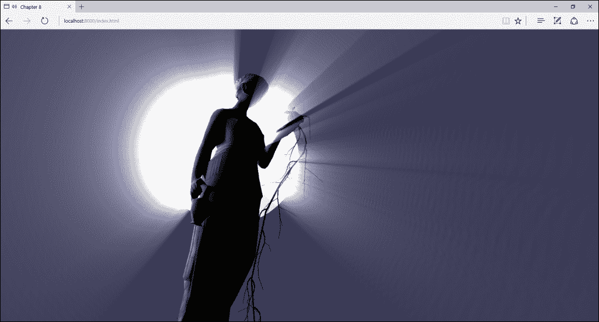

没有后处理的场景看起来类似于以下截图：

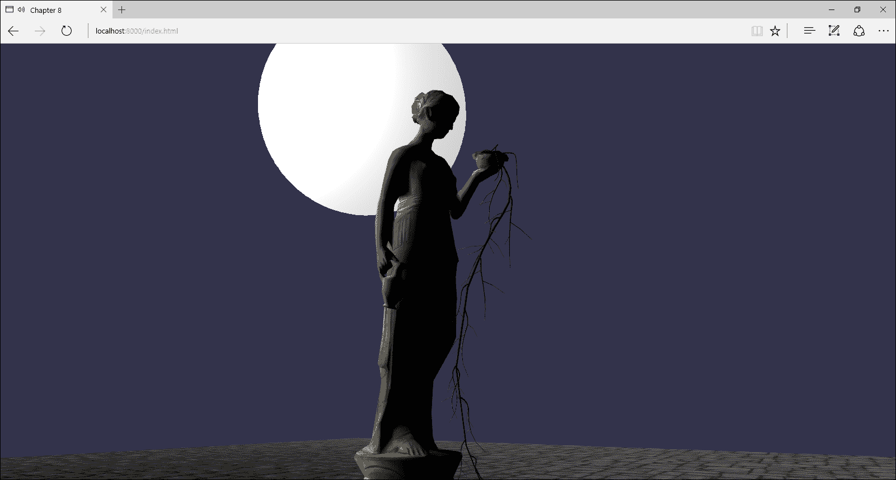

实际上，那个圆形的白色网格是一个包含 alpha 的漫反射纹理的平面。漫反射纹理可以在示例文件中找到，命名为`sun.png`。

让我们创建 VLS 后处理，如下所示：

```js
var vls = new BABYLON.VolumetricLightScatteringPostProcess(
  "vls", // The name of the post-process
  1.O, // The ratio of the post-process
  camera, // The camera to attach to
  null, // The mesh used as light source
  100 // Number of samples. Means the quality of the post-process
);
```

在 VLS 构造函数中，如果网格参数为 null，后处理将创建一个默认网格，该网格是一个渲染为广告牌的平面。在任何时候，如果你想，你可以像以下所示访问该方法：

```js
BABYLON.VolumetricLightScatteringPostProcess.CreateDefaultMesh(
  "vlsMesh", // The name of the billboard plane mesh
  scene // The scene where to add the billboard plane mesh
);
```

例如，Babylon.js 的豪宅场景使用了 VLS 后处理来散射月光的射线。结果如下所示图像：

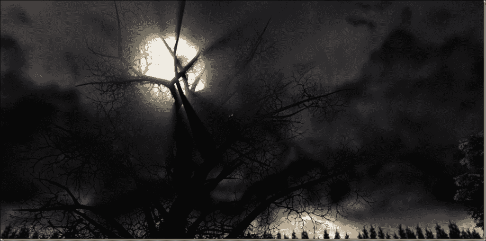

该方法相当简单，他们只是获取了月球网格参考，并通过将月球网格参考作为参数创建 VLS 后处理，如下所示：

```js
var moon = scene.getMeshByName("moon");
var vls = new BABYLON.VolumetricLightScatteringPostProcess(
  "vls", // The name of the post-process
  1.O, // The ratio of the post-process
  camera, // The camera to attach to
  moon, // The mesh used as light source
  75 // Number of samples. Means the quality of the post-process
);
```

样本数通常在`[30, 100]`区间内，并定义了后处理结果的品质。在 Babylon.js 的豪宅场景中，样本数设置为`65`以节省性能，因为该场景已经由引擎渲染得相当大且非常漂亮。

为了节省更多性能，后处理的比率可以更加定制化。实际上，VLS 后处理使用一个内部遍历，在纹理（渲染目标纹理）中渲染场景以创建光线的散射。你可以轻松配置内部遍历以在较低分辨率下渲染。只需将一个对象作为参数传递给比率，如下面的代码片段所示：

```js
var ratio = {
  passRatio: 0.25, // Ratio of the internal pass. Render in a texture
  // with a size divided per 4
  postProcessRatio: 1.0 // Ratio of the post-process
};
var vls = new BABYLON.VolumetricLightScatteringPostProcess(
  "vls", // The name of the post-process
  ratio, // The ratio object
  camera, // The camera to attach to
  moon, // The mesh used as light source
  100 // Number of samples. Means the quality of the post-process
);
```

你还可以自定义与 VLS 后处理本身相关的参数。

曝光控制效果的整体强度（默认`0.3`），如下所示：

```js
vls.exposure = 0.7; // Exaggerated value
```

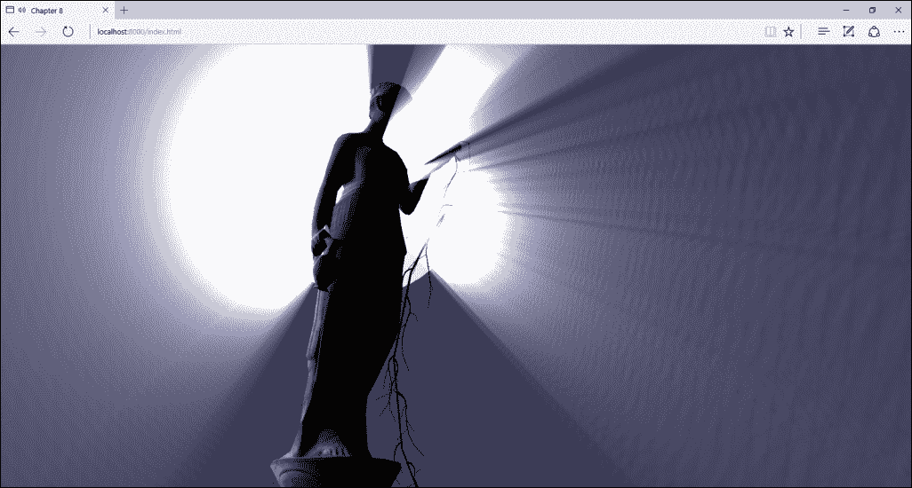

衰减会消散每个样本的贡献（默认`0.96815`），如下面的代码所示：

```js
vls.decay = 0.9;
```

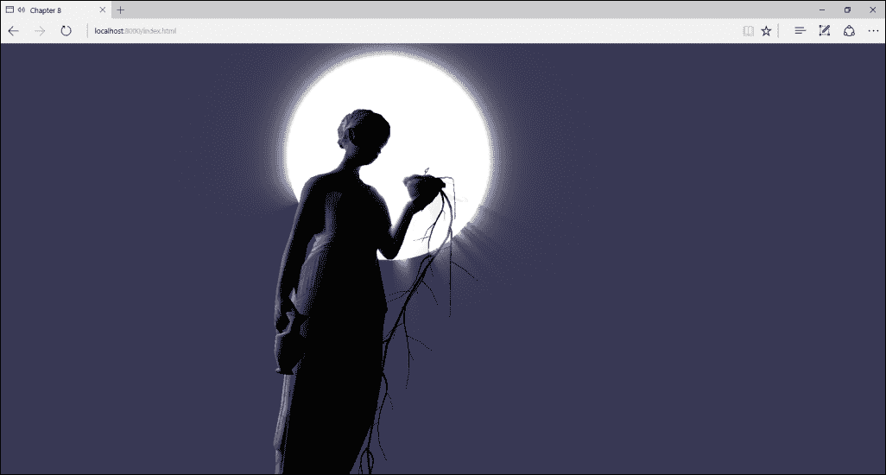

权重控制每个样本的整体强度（默认`0.58767`），如下面的代码所示：

```js
vls.weight = 0.8;
```

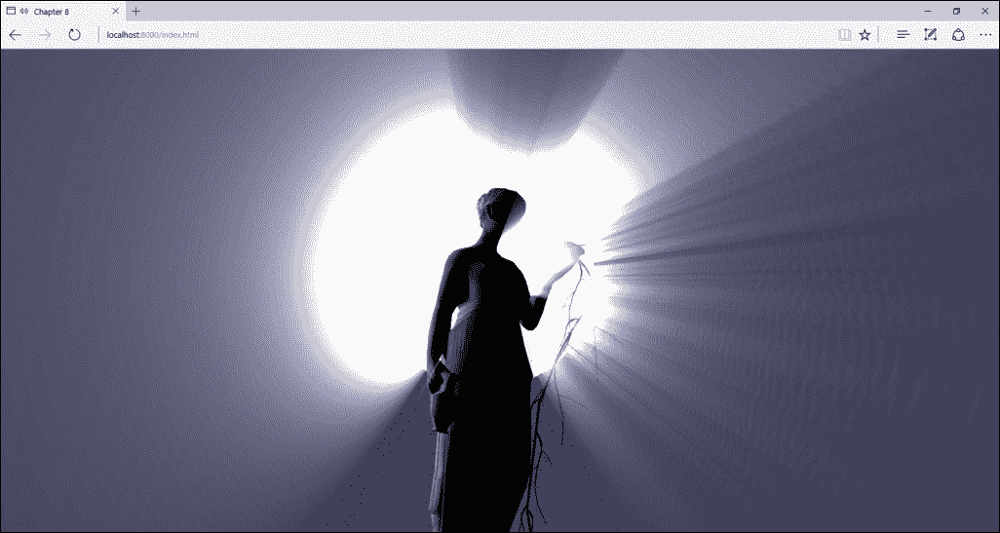

密度控制每个样本的密度（默认`0.926`），如下面的代码所示：

```js
vls.density = 0.7;
```

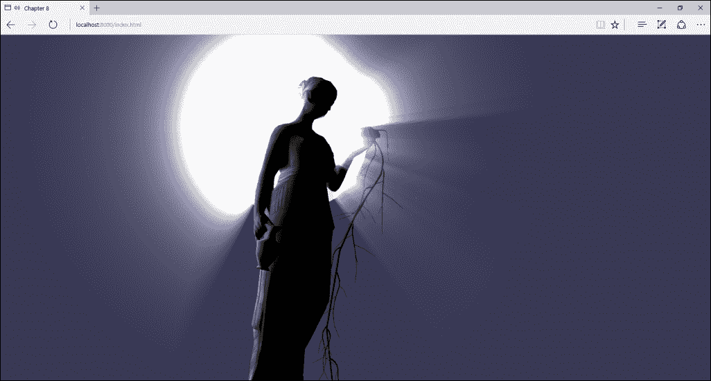

为了给你一个顺序，Babylon.js 的宅邸场景配置如下：

```js
var moon = scene.getMeshByName("Moon");
var vls = new BABYLON.VolumetricLightScatteringPostProcess(
  "vls",
  1.0,
  scene.activeCamera,
  moon,
  65,
);
vls.exposure = 0.15;
vls.weight = 0.54;
```

## SSAO 渲染管线

SSAO 效果是一个渲染管线，它计算以下五个后处理步骤：

+   传递后处理（将场景保存到纹理中）

+   SSAO 后处理

+   水平模糊后处理

+   垂直模糊后处理

+   组合后处理

SSAO 因其仅使用屏幕空间（后处理）来计算环境遮蔽而闻名，这与需要 3D 艺术家在他们的纹理中计算环境遮蔽的更经典方法形成对比。最后，SSAO 是节省纹理和项目权重的好方法（不再需要纹理）。

让我们看看这个场景中的 SSAO 效果，没有 SSAO 的场景，有 SSAO 的场景，以及最后只有 SSAO 启用的场景：

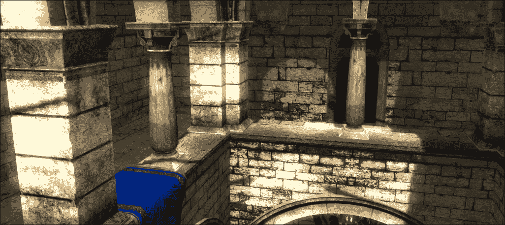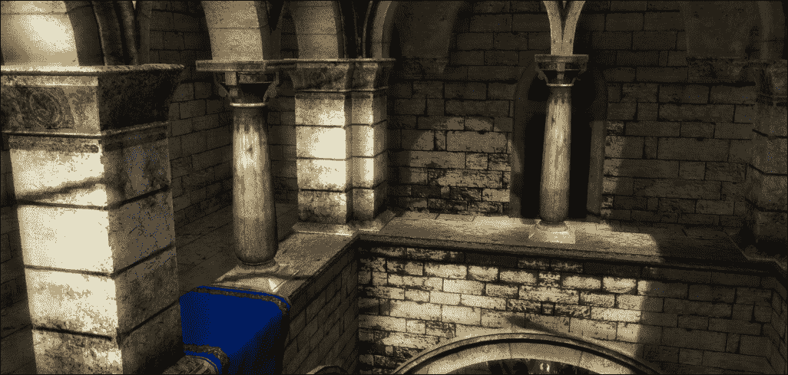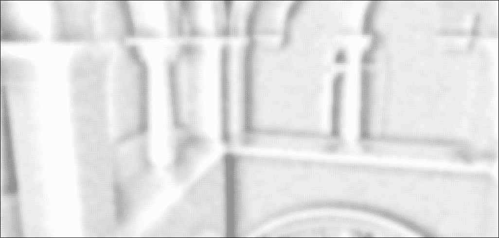

结果特别微妙；然而，它可以极大地增强场景的真实感。环境遮蔽是表示光线在其不同点到达物体的能力的方式，或者更具体地说，在 SSAO 中，是那些无法到达物体不同点的光线。

从不同的视角来看，效果可以很容易地感知，如下面的图像所示：

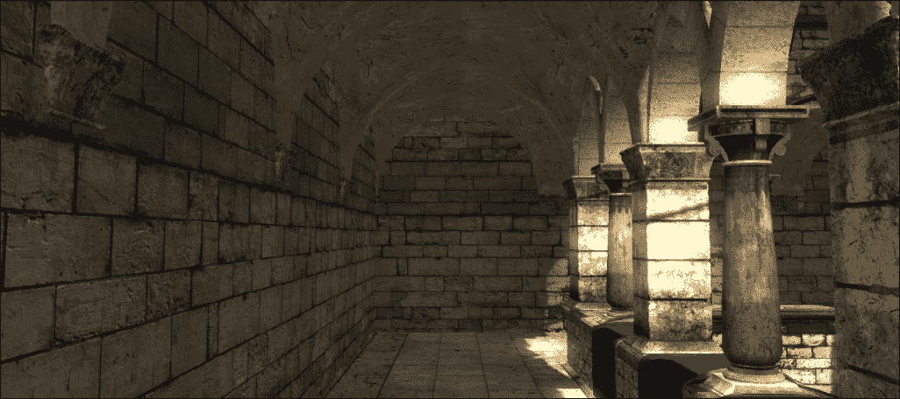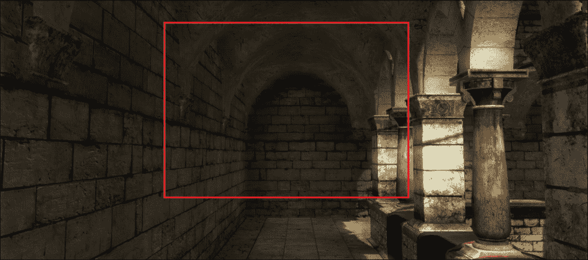

SSAO 是一个渲染管线，并且可以很容易地创建，如下所示：

```js
var ssao = new BABYLON.SSAORenderingPipeline(
  "ssao", // The name of the render pipeline
  scene, // The scene where to add the render pipeline
  1.0 // The ratio of SSAO post-process
);
// Attach the render pipeline to your camera
scene.postProcessRenderPipelineManager.attachCamerasToRenderPipeline(
  "ssao", // Name of the render pipeline
  camera // The camera to attach to
);
```

这就是全部。幸运的是，SSAO（屏幕空间模糊）、水平模糊和垂直模糊后处理可以在比屏幕分辨率低的分辨率下完成。至于 VLS 后处理，你可以传递一个对象给比率参数，如下所示：

```js
var ratio = {
  ssaoRatio: 0.25, // Size divided per 4, saves a lot of performances!
  combineRatio: 1.0 // The final output that mixes SSAO with the scene
};
var ssao = new BABYLON.SSAORenderingPipeline(
  "ssao", // The name of the render pipeline
  scene, // The scene where to add the render pipeline
  ratio // The ratio of SSAO post-process
);
```

在每个场景的函数中，你可能需要配置 SSAO 以实现完美的渲染。有几个参数你可以自定义，如下所示：

+   总强度：这控制效果的整体强度（默认`1.0`）。`.totalStrength`属性很少或稍微修改，因为它可能会创建一些伪影。

+   半径：这表示 SSAO（屏幕空间模糊）围绕分析像素的半径（默认`0.0002`）。为了计算当前像素的 A**mbient** Occlusion（环境遮蔽，简称 AO），SSAO 效果会在指定的`.radius`属性周围计算当前像素的 16 个样本。

+   区域：`.area`（默认`0.0075`）属性用于根据每个像素的遮挡差异插值 SSAO 样本。换句话说，区域用于平滑每个像素每个样本的环境遮挡。以下是一个基于线的平滑函数示例（来自维基百科）：

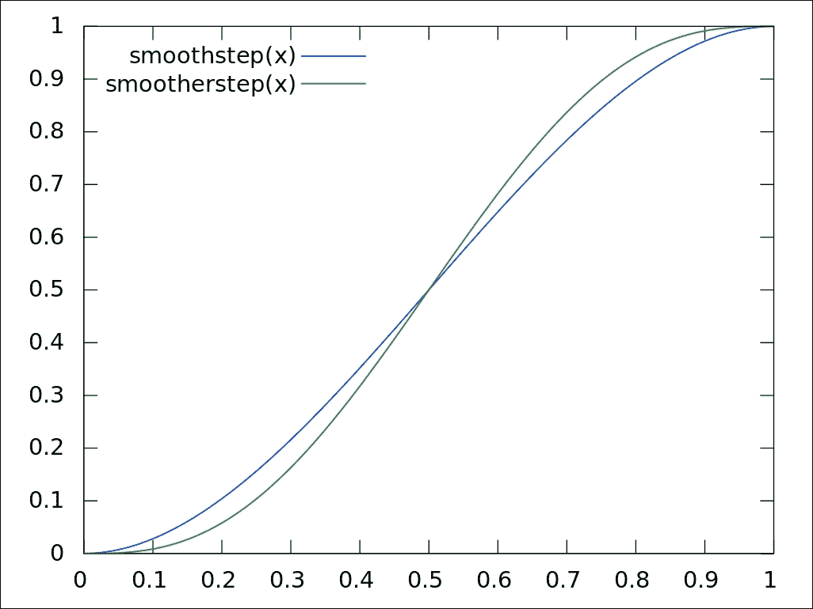

在示例文件中，你可以按**2**键禁用 SSAO，按**1**键启用 SSAO，按**3**键仅绘制 SSAO 通道。结果（按顺序）如下所示：

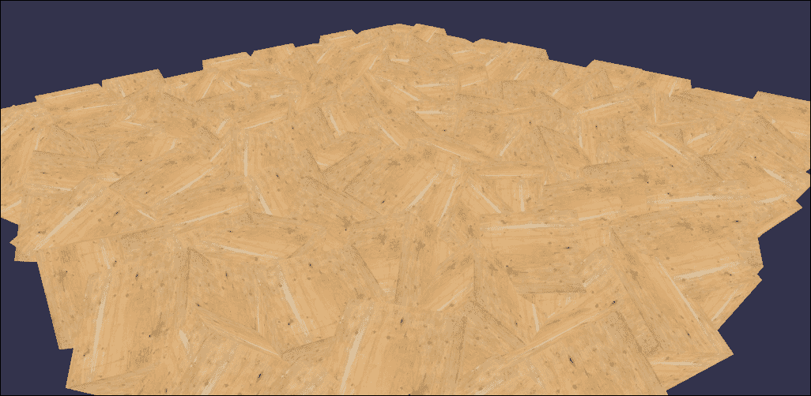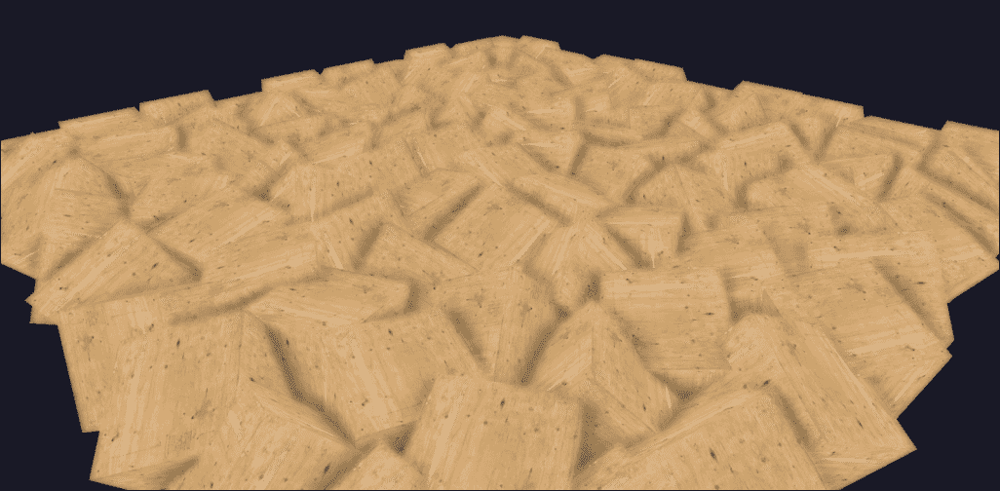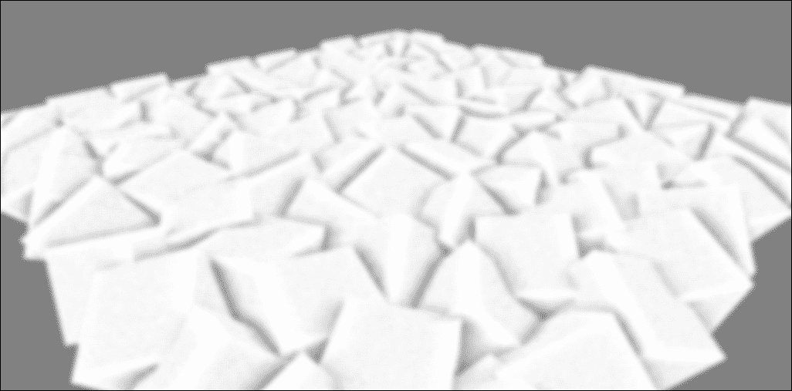

## HDR 渲染管线

**高动态范围**（**HDR**）很长时间都是一个热门词汇。这个概念特别有趣，它倾向于模拟视网膜在现实世界中的工作方式。它包括亮度的适应（刺眼）和物体高亮表面的亮度伪影。

要理解眩光的效果，想象你在一个完全黑暗的房间里。突然，有人打开了灯；你的眼睛适应亮度（泛光和模糊）所需的时间代表眩光效果。

让我们比较启用和未启用 HDR 渲染管线（HDR 会调整亮度并在高亮区域创建伪影）的同一场景，如下所示：

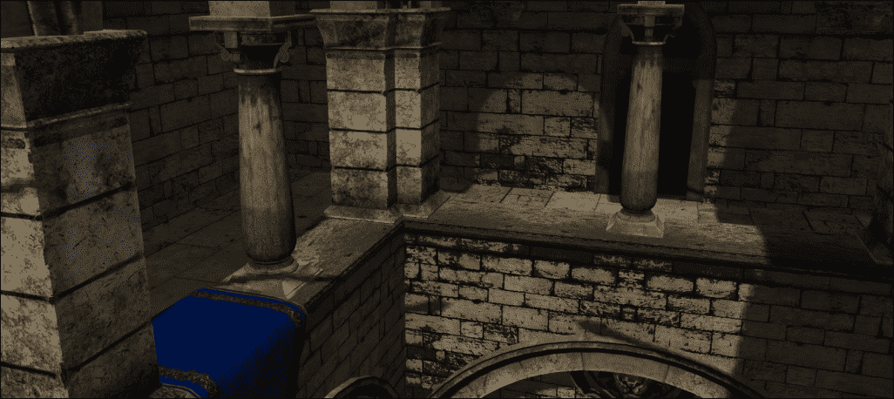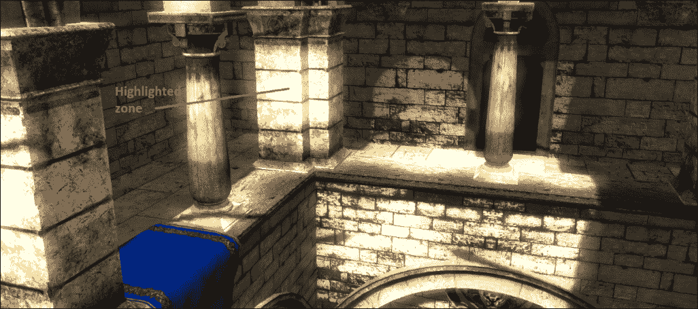

要创建 HDR 渲染管线，过程与 SSAO 渲染管线相同，如下所示：

```js
var hdr = new BABYLON.HDRRenderingPipeline(
  "hdr", // The name of the render pipeline
  scene, // The scene where to add the render pipeline
  1.0, // ratio of the render pipeline. Here, the ratio is a number
);
// Finally, attach the render pipeline to a camera
scene.postProcessRenderPipelineManager.attachCamerasToRenderPipeline(
  "hdr", // The name of the render pipeline
  camera // The camera to attach to
);
```

HDR 渲染管线可以高度定制，因为你可以根据需要定制创建伪影所需的最小亮度、创建伪影的模糊效果、亮度适应速度等。

曝光（`hdr.exposure`）控制场景的整体亮度（默认 1.0），如下所示：

```js
hdr.exposure = 1.8;
```

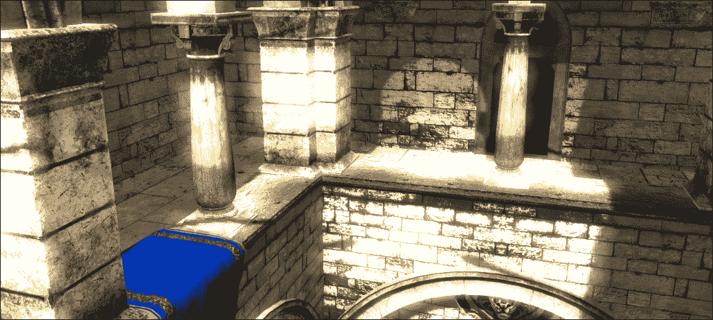

明亮阈值（`hdr.brightThreshold`）控制创建伪影所需的最小亮度（默认`0.8`），如下所示：

```js
hdr.brightThreshold = 0.2;
```


最小亮度（`hdr.minimumLuminance`）代表较暗区域的视网膜适应（默认`1.0`）。值越小（`>= 0.0`），场景越突出，如下所示：

```js
hdr.minimumLuminance = 0.0;
```

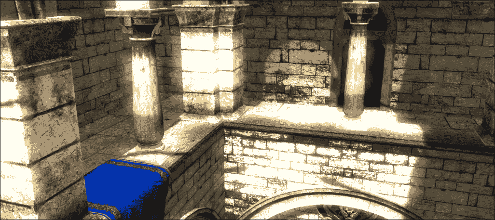

亮度降低率（`hdr.luminanceDecreaseRate`）和亮度增加率（`hdr.luminanceIncreaserate`）代表视网膜对亮度的适应速度（默认两者均为`0.5`）。值越高，适应越快。在大多数情况下，该值介于`0.5`和`1.0`之间。

高斯模糊乘数(`hdr.gaussMultiplier`)增强了模糊宽度（默认`4`）。它作用于`BABYLON.BlurPostProcess`的`.blurWidth`属性，如下所示：

```js
hdr.gaussMultiplier = 8;
```

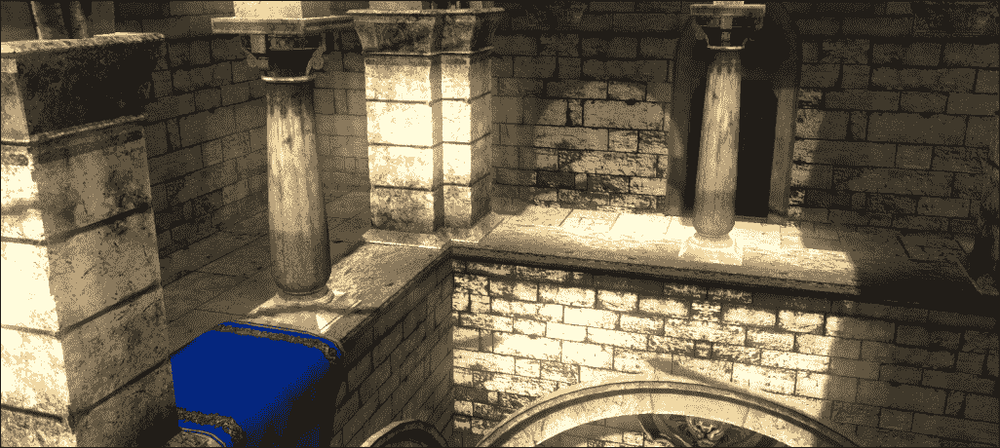

高斯系数(`hdr.gaussCoeff`)控制整体高斯模糊效果（默认`0.3`）。实际上，高斯模糊的输出是*output * gaussCoeff*，如下所示：

```js
hdr.gaussCoeff = 0.8;
```

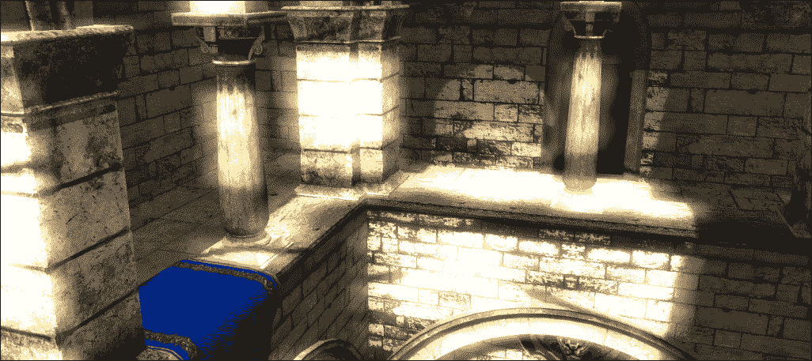

高斯标准差(`hdr.gaussStandDev`)控制效果的整体模糊强度（默认 0.8），如下所示：

```js
hdr.gaussStandDev = 0.2;
```

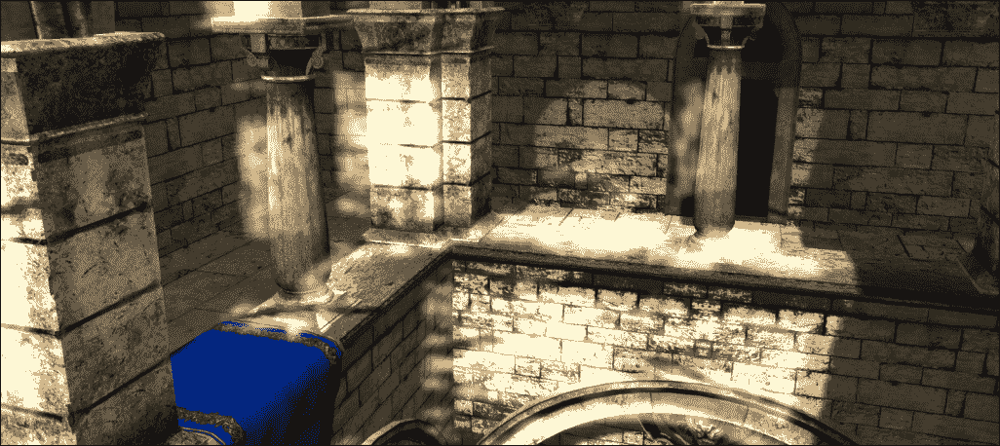

`.gausCoeff`和`.gaussStandDev`属性是相互关联的。它们必须相互平衡。为了给你一个顺序，以下场景是这样配置的：

```js
var hdr = new BABYLON.HDRRenderingPipeline("hdr", scene, 1.0);
hdr.brightThreshold = 0.5;
hdr.gaussCoeff = 0.7;
hdr.gaussMean = 1.0;
hdr.gaussStandDev = 7.5;
hdr.minimumLuminance = 0.7;
hdr.luminanceDecreaseRate = 1.0;
hdr.luminanceIncreaserate = 1.0;
hdr.exposure = 1.3;
hdr.gaussMultiplier = 4;
```

它看起来如下：

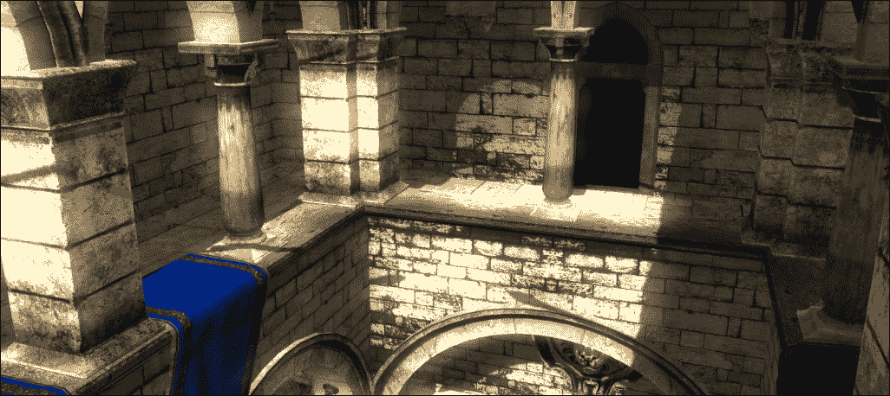

在大多数情况下，在 Babylon.js 中实现 HDR 的突出场景中，遵循高斯模糊方程，高斯标准差等于*10.0 * 高斯系数*。

# 摘要

在本章中，你学习了如何仅使用后处理来美化你的场景。Babylon.js 主页上的 Mansion 演示展示了 Volumetric Light Scattering 后处理的一个很好的应用。不幸的是，由于硬件限制，手机上没有可用的后处理。即使后处理在移动设备上不受支持，你的项目仍然可以在没有后处理渲染的情况下运行。Babylon.js 的力量在于它可以在所有设备上工作。即使某个功能在设备上不受支持，该功能也会简单地被禁用。

在下一章中，让我们以动画结束。Babylon.js 框架允许创建和管理动画。这些动画将允许你借助框架和 3D 艺术家来动画化角色、对象等！
