# 第九章。创建和播放动画

在前面的章节中，您学习了创建酷炫、美观和完整的 3D 应用程序所需的所有内容。这是最后一章，您需要学习的最后一件事是如何在场景中动画化对象。然后，最终，您将获得一个完全动态的场景。

Babylon.js 框架提供了一种无需通过代码管理即可创建动画的方法。例如，您想创建一个旋转动画，该动画将影响场景中的五个对象（节点）；Babylon.js 将允许您创建一个动画对象，您可以在五个节点之间轻松共享。在本章中，我们将涵盖以下主题：

+   使用 Babylon.js 创建动画

+   使用缓动函数实现平滑动画

+   导入和管理动画模型

# 使用 Babylon.js 创建动画

对于这个第一个主题，让我们讨论如何简单地使用代码动画化一个盒子，以及如何使用 Babylon.js 工具（如 `BABYLON.Animation` 类）创建动画。您将很快理解使用提供的工具而不是用代码处理动画的重要性。

## 使用代码动画化对象

让我们从以下场景开始（一个平面和一个盒子）：

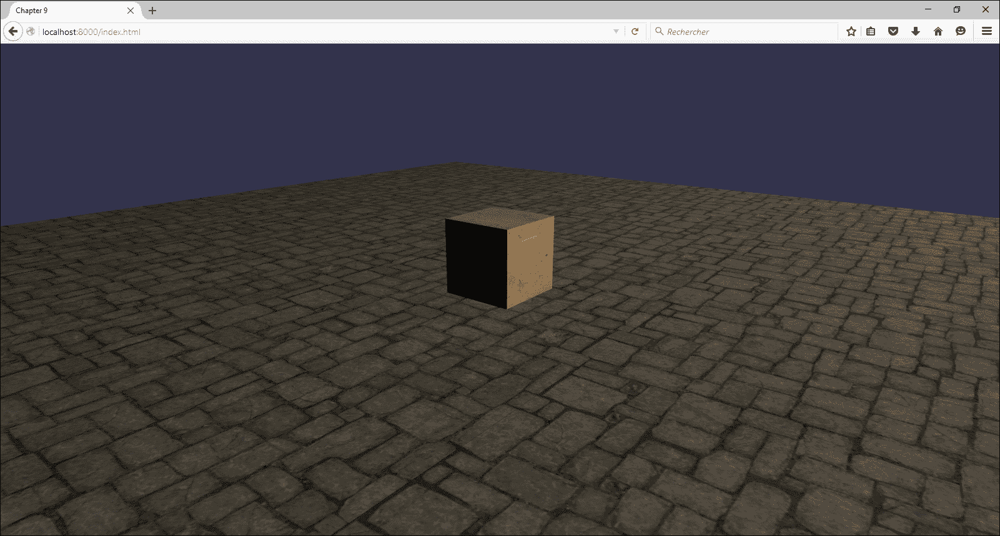

让我们让盒子围绕其中心（x = 0, y = 0, 和 z = 0）旋转。这个过程应该是增加一个值（角度）随时间变化，并设置盒子的新位置。

通常，(*x = 半径 * Cos(角度)*, *y = 0*, 和 *z = 半径 * Sin(角度)*)。

要执行此操作，您可以在场景上调用一个 `.registerBeforeRender` 函数。此函数接受一个匿名函数作为参数，并且这个匿名函数将自动在每一帧被调用，如下所示：

```js
var angle = 0.0;
var radius = 10.0;
scene.registerBeforeRender(() => {
  angle += 0.01; // Increment the angle
  // Set the new position of the box
  box.position.x = radius * Math.cos(angle);
  box.position.z = radius * Math.sin(angle);
});
```

这个函数相当简单；然而，它仅应用于盒子。如果您想通过共享相同的代码来动画化另一个对象怎么办？解决方案很简单；只需将节点作为参数传递给一个函数，该函数将在每次渲染前注册一个新的函数，如下所示：

```js
var createAnimation = function(node) {
  var angle = 0.0;
  var radius = 10.0;
  scene.registerBeforeRender(() => {
    angle += 0.01; // Increment the angle
    // Set the new position of the box
    node.position.x = radius * Math.cos(angle);
    node.position.z = radius * Math.sin(angle);
  });
}
```

如您所见，通过代码管理动画并不一定是个问题。真正的问题出现在您需要将动画与时间同步（管理动画速度）、停止或暂停动画等情况。这些功能要求您创建一个完整的管理器，而这并不是您想要做的。

下一个子主题将向您展示如何使用 Babylon.js 的动画管理器，并且不用担心时间、停止和暂停功能等。

## 使用 Babylon.js 的动画管理器

让我们使用相同的场景，仅使用 Babylon.js 的动画管理器创建一个简单的动画。您只需要理解一件事：动画的帧键。

要创建一个动画，只需使用 `BABYLON.Animation` 类并将其附加到一个节点（或多个节点）上。`BABYLON.Animation` 类并不难理解，它需要一个名称，一个要在节点上动画化的属性（不一定是节点的属性），每秒帧数，数据类型和循环模式，如下面的代码片段所示：

```js
var simpleAnimation = new BABYLON.Animation(
  "simpleAnimation", // Name of the animation
  "rotation", // The property to modify (node.rotation)
  1, // Frames per second
  BABYLON.Animation.ANIMATIONTYPE_VECTOR3, // The type of property
  BABYLON.Animation.ANIMATIONLOOPMODE_CYCLE // The loop mode
);
```

`rotation` 参数表示动画管理器将动画化附加到动画的对象的 `.rotation` 属性。旋转是 `BABYLON.Vector3` 类型，这也是为什么数据类型是 `BABYLON.Animation.ANIMATIONTYPE_VECTOR3` 的原因。最后，我们希望动画循环。

根据你正在动画化的属性（在之前的例子中是 *旋转*，它是一个 `BABYLON.Vector3` 对象），你必须提供一个有效的数据类型，它可以是以下之一：

+   `ANIMATIONTYPE_FLOAT`：当属性是 `float` 类型时。

+   `ANIMATIONTYPE_VECTOR2`：当属性是 `BABYLON.Vector2` 类型时。

+   `ANIMATIONTYPE_VECTOR3`：当属性是 `BABYLON.Vector3` 类型时。

+   `ANIMATIONTYPE_QUATERNION`：当属性是 `BABYLON.Quaternion` 类型。这是一个可以用来表示节点旋转（`node.rotationQuaternion`）的数学对象。

+   `ANIMATIONTYPE_MATRIX`：当属性是 `BABYLON.Matrix` 类型时。

+   `ANIMATIONTYPE_COLOR3`：当属性是 `BABYLON.Color3` 类型时。

在这种情况下，我们使用 `Vector3` 数据类型，因为 `.rotation` 属性是 `BABYLON.Vector3`。

下一步是创建一个键数组。键（或关键帧）代表动画属性在特定帧的状态。在之前创建的动画中，每秒帧数设置为 `1`。然后，每秒，键数组中的一个键被达到。动画的键是一个对象数组，每个对象由两个属性组成：帧号，以及根据动画化的属性，关联的值（类型为 `float`，`BABYLON.Vector2`，`BABYLON.Vector3` 等），如下所示：

```js
{
  frame: number;
  value: any;
}
```

让我们创建两个键，将盒子从位置（`x = 0`，`y = 2.5`，和 `z = 0`）转换到（`x = 10`，`y = 10`，和 `z = 10`）在第 20 帧，如下所示：

```js
var keys = [
{
  frame: 0,
  value: new BABYLON.Vector3(0, 0, 0)
},
{
  frame: 20,
  value: new BABYLON.Vector3(10, 10, 10)
}
];
```

如果每秒帧数设置为 `1`，则第二个键（`frame = 20`）意味着盒子位置将在 20 秒后到达（`x = 10`，`y = 10`，和 `z = 10`）。

让我们为 `simpleAnimation` 动画管理器设置键，如下所示：

```js
simpleAnimation.setKeys(keys);
```

最后，让我们将动画管理器附加到盒子上，并在场景中开始动画，如下所示：

```js
// Add animation to the box
// Every BABYLON.Node object has the ".animations" property
box.animations.push(simpleAnimation);
// Start animation
scene.beginAnimation(
  box, // Start animation(s) of the box
  0, // Start key. Here 0
  20, // End key. Here 20
  true, // Loop the animation
  1, // Speed ratio. Controls the speed of animation
  () => { // Callback. Called when animation finished
    console.log("Finished");
}
);
```

结果在开始时看起来类似于以下内容：

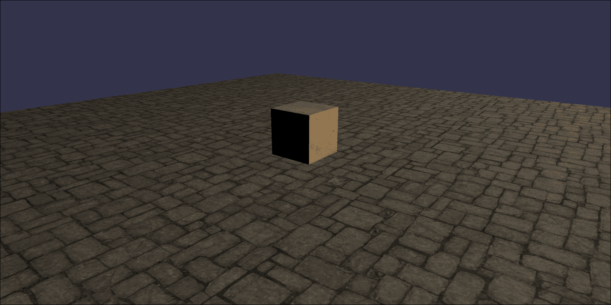

最后，一旦动画完成，结果看起来如下：

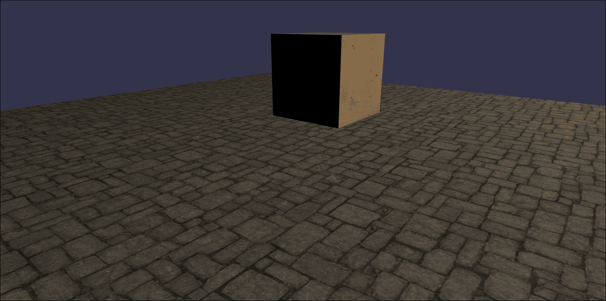

要重现之前的例子（围绕中心旋转的盒子），解决方案很简单；只需添加 360 个键，代表圆的每个度数，如下所示：

```js
// Create animation
var complexAnimation = new BABYLON.Animation(
  "boxAnimationComplex",
  "position",
  60, // 60 frames per second
  BABYLON.Animation.ANIMATIONTYPE_VECTOR3,
  BABYLON.Animation.ANIMATIONLOOPMODE_CYCLE
);
// Create keys
var complexKeys = [];
for (var i=0; i < 360; i++) {
  // Transform the degrees into radians
  var angle = BABYLON.Tools.ToRadians(i);
  complexKeys.push({
    frame: i,
    value: new BABYLON.Vector3(10 * Math.cos(angle),
    2.5,
    10 * Math.sin(angle))
  });
}
// Set the keys
complexAnimation.setKeys(complexKeys);
// Finally run the animation(s)
scene.beginAnimation(this._box, 0, 360, false, 1.0, () => {
  console.log("Animation Finished");
});
```

要控制你的动画（开始、暂停、重新开始和停止），`.beginAnimation`函数返回一个`BABYLON.Animatable`类型的对象。返回的对象是即时创建的，允许你控制你的动画。让我们考虑一个与之前相同的例子：

```js
var anim = scene.beginAnimation(this._box, 0, 360, false, 1.0, () => {
  console.log("Animation Finished");
});
// Pause animation
anim.pause();
// Start the animation (when stopped or paused)
anim.start();
// Restart animation
anim.restart();
// Stop animation
anim.stop();
// Go to a specific frame
anim.goToFrame(180);
```

## 创建一个简单的动画

第一个例子，只有两个帧，可能会很重，因为我知道你很快就会创建一个辅助工具，一次性和永久。Babylon.js 考虑到了这一点，并提供了一个静态的`CreateAndStartAnimation`函数，该函数为你创建两个帧并开始动画。让我们只使用以下函数创建相同的动画：

```js
var anim: BABYLON.Animation = BABYLON.Animation.CreateAndStartAnimation(
  "quickAnimation", // name of the animation
  box, // The mesh to animate
  "position", // The property to animate
  1, // frames per second
  20, // number of frames of the animation
  new BABYLON.Vector3(0, 0, 0), // The start value
  new BABYLON.Vector3(10, 10, 10), // The end value
  BABYLON.Animation.ANIMATIONLOOPMODE_CYCLE // The loop mode
);
```

如你所猜，这种方法由 Babylon.js 用于创建`BABYLON.InterpolateValueAction`（第七章，*在对象上定义动作*）。

## 事件管理

Babylon.js 动画的高级用法之一是在达到特定帧时调用一个函数。`BABYLON.AnimationEvent`类存在是为了允许你将一个或多个事件附加到特定帧。例如，考虑之前的例子（`complexAnimation`），如下所示：

```js
var event = new BABYLON.AnimationEvent(
  180, // The frame when the callback will be called
  () => { // The function executed when the current frame is 180
    console.log("My event was called!");
  },
  false // Only once? False, we want to call the callback every ti  me// the frame is reached
);
// Add the event to the animation
complexAnimation.addEvent(event);
```

# 使用缓动函数平滑动画

Babylon.js 动画管理的先进功能之一是使用缓动函数来平滑动画并添加行为。

要快速查看缓动函数的外观（我们不一定记得每种缓动函数），你应该点击此链接（[`easings.net/en`](http://easings.net/en)）。

## 将缓动函数应用于动画

要将缓动函数应用于动画，方法仅包括自定义已创建的动画。你只需为具有缓动函数的动画调用`.setEasingFunction`方法即可。

可用的缓动函数（与时间相关的曲线）如下所示：

+   圆形缓动：`BABYLON.CircleEase()`

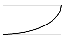

+   后退缓动：`BABYLON.BackEase(amplitude)`

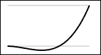

+   弹跳缓动：`BABYLON.BounceEase(bounces, bounciness)`

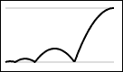

+   三次方缓动：`BABYLON.CubicEase()`

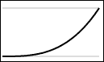

+   弹性缓动：`BABYLON.ElasticEase(oscillations, springiness)`

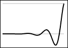

+   指数缓动：`BABYLON.ExponentialEase(exponent)`

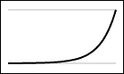

+   二次方缓动：`BABYLON.QuadraticEase()`

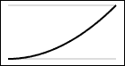

+   四次方缓动：`BABYLON.QuarticEase()`

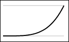

+   五次方缓动：`BABYLON.QuinticEase()`

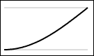

+   正弦缓动：`BABYLON.SineEase()`

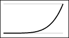

让我们从以下简单的例子开始（使用圆形缓动函数动画化盒子的旋转的.x 属性）：

```js
// Create and set easing function (circle ease)
var ease = new BABYLON.CircleEase();
easingAnimation.setEasingFunction(ease);
```

那就结束了，动画现在将遵循圆形缓动函数的公式，如下所示：

```js
// Create animation
var easingAnimation = new BABYLON.Animation(
  "easingAnimation", 
  "rotation.x", // Modify the .x property of rotation
  10, // 10 frames per second
  BABYLON.Animation.ANIMATIONTYPE_VECTOR3,
  BABYLON.Animation.ANIMATIONLOOPMODE_CYCLE
);
// Create keys
var simpleKeys = [
  {
    frame: 0,
    value: 0
  },
  {
    frame: 20,
    value: Math.PI
  },
  {
    frame: 40,
    value: 0
  }
];
// Set keys
easingAnimation.setKeys(simpleKeys);
// Push animation
this._box.animations.push(easingAnimation);
// Create and set easing function (circle ease)
var ease = new BABYLON.CircleEase();
easingAnimation.setEasingFunction(ease);
// Finally, start the animation(s) of the box
this._scene.beginAnimation(box, 0, 40, true, 1.0, () => {
  console.log("Animation Finished");
});
```

由于很难通过截图来表示动画，您可以尝试自己使用不同的缓动函数。对于所有缓动函数，方法都是相同的，除了几个缓动函数构造函数需要一些参数以进行更多定制。

现在，让我们修改缓动函数的行为。缓动函数由模式组成，如下所示：

+   `In`，当动画开始时（进入）：`BABYLON.EasingFunction.EASINGMODE_EASEIN`

+   `Out`，当动画完成时（退出）：`BABYLON.EasingFunction.EASINGMODE_EASEOUT`

+   `In & Out`，当动画开始和结束时（进入和退出）：`BABYLON.EasingFunction.EASINGMODE_EASEINOUT`

默认情况下，缓动模式设置为`In`（`BABYLON.EasingFunction.EASINGMODE_EASEIN`）。网站[`easings.net/en`](http://easings.net/en)显示了在这三种模式下缓动函数的确切外观。

要指定缓动模式，只需在动画上调用`.setEasingMode`方法，如下所示：

```js
// Create and set easing function (circle ease)
var ease = new BABYLON.CircleEase();
ease.setEasingMode(BABYLON.EasingFunction.EASINGMODE_EASEINOUT);
easingAnimation.setEasingFunction(ease);
```

## 创建您自己的缓动函数

对于关于缓动函数的最后一个子主题，让我们讨论如果 Babylon.js 中没有可用的情况下如何创建自己的缓动函数。这个过程非常简单（除了可能与您的缓动函数相关的可能的困难数学公式）。

只需创建一个继承自`BABYLON.EasingFunction`类并实现`BABYLON.IEasingFunction`接口的类。唯一要做的就是实现`.easeInCore(gradient: number)`函数，该函数接受插值值作为参数。

让我们用一个幂缓动函数的例子来创建一个示例，如下所示：

```js
export class PowerEase extends BABYLON.EasingFunction
{
  constructor(public power: number = 2) {
    // Call constructor of BABYLON.EasingFunction
    super();
  }
  public easeInCore(gradient: number): number {
    var y = Math.max(0.0, this.power);
    return Math.pow(gradient, y);
  }
}
Somewhere in your code:
// Create and set easing function (circle ease)
var customEase = new BABYLON.PowerEase(4);
customEase.setEasingMode(BABYLON.EasingFunction.EASINGMODE_EASEINOUT);
easingAnimation.setEasingFunction(customEase);
```

# 导入和管理动画模型

为了以一个酷炫的演示结束本章，让我们讨论如何动画化角色或 3D 模型，通常来说。

## 3D 动画模型是如何工作的

如果您还记得，3D 模型的每个顶点都是由顶点着色器计算并投影到屏幕上的。实际上，动画的 3D 模型（如角色）也是通过相关的骨骼层次结构（该层次结构称为**骨骼**）进行动画化的。动画的 3D 模型也称为**蒙皮网格**。在 3D 引擎中，骨骼是无形的节点，它们被动画化（`BABYLON.Animation`）并发送到与 3D 模型关联的顶点着色器。换句话说，每个骨骼的变换被发送到顶点着色器并应用于相关的顶点。

要在理论方面更进一步，顶点着色器包含以下两个额外的缓冲区：

+   骨骼的矩阵权重（Vector4，表示每个骨骼对当前顶点的*影响力*强度）。

+   骨骼的矩阵索引（Vector4，直到每个顶点四个骨骼影响）就像索引缓冲区一样，但用于骨骼。换句话说，对于每个顶点，哪些骨骼影响该顶点（骨骼变换数组中的索引）。

### 注意

**注意**：静态 3D 模型的常用缓冲区是位置（必需）、索引（必需）、法线（非必需）、UVs（纹理坐标，非必需）和颜色（非必需）。

最后，对于每个顶点，公式（在 GLSL 中）如下所示：

```js
uniform mat4 bones[NUMBER_OF_BONES]; // Sent by Babylon.js
mat4 boneTransform1 = bones[matricesIndices[0]] * matricesWeights[0];
mat4 boneTransform2 = bones[matricesIndices[1]] * matricesWeights[1];
mat4 boneTransform3 = bones[matricesIndices[2]] * matricesWeights[2];
mat4 boneTransform4 = bones[matricesIndices[3]] * matricesWeights[3];
mat4 finalTransform = transformedVertex * (
  boneTransform1 + boneTransform2 +
    boneTransform3 + boneTransform4
);
```

当艺术家使用建模软件提供的工具导出他们的 3D 模型（带有动画）时，Babylon.js 导出器（3ds Max 和 Blender）明确地将骨骼的权重缓冲区和骨骼的矩阵索引缓冲区写入导出文件，这些是数字数组。总之，对于动画 3D 模型，您不需要通过代码指定动画，导出器可以为您完成一切。让我们等到下一个子主题，学习如何动画 3D 模型。

## 导入并播放动画 3D 模型的动画

要导入一个动画 3D 模型，您必须使用`BABYLON.SceneLoader`类（第三章，*创建、加载和绘制 3D 对象在屏幕上*）来导入动画 3D 模型。实际上，`.Load`（和`.Append`）函数自动加载带有相关骨骼（节点层次结构）的动画 3D 模型，与`.ImportMesh`函数的回调提供加载的网格、粒子系统和骨骼不同，如下所示：

```js
(meshes: AbstractMesh [], particleSystems: ParticleSystem[], skeletons: Skeleton[]) => void;
```

具体来说，由于动画节点是骨骼的骨骼，`.beginAnimation`函数的目标只是与您的动画 3D 模型关联的骨骼，而不是节点本身，如下所示：

```js
// myAnimated3DModel is a BABYLON.Mesh;
var skeleton = myAnimated3DModel.skeleton; // get the skeleton
scene.beginAnimation(
  skeleton, // Target to animate
  0, // The start frame
  150, // The end frame
  true, // Loop ?
  1.0, // Speed ratio
  () => { // Animation end callback
    console.log("Animation of skeleton finished!");
  }
);
```

让我们通过以下代码片段使用`.ImportMesh`函数开始一个示例（可在示例文件中找到）：

```js
// Import an animated 3D model
BABYLON.SceneLoader.ImportMesh(
  "", // Names of the specific
  "./", // The root URL
  "dude.babylon", // The name of the scene containing the meshes
  scene, // The scene where to add the meshes
  (meshes, particleSystems, skeletons) => { // callback success
    // Simply start the animations of the skeleton associated
    // To the mesh
    this._scene.beginAnimation(skeletons[0], 0, 150, true, 1.0);
  }
);
```

### 注意

**注意**：一个动画 3D 模型可以包含多个网格。这就是为什么`ImportMesh`函数可以返回多个网格的数组，以及骨骼数组中只有一个骨骼的原因。

结果（人物正在行走，动画从帧 0 播放到 150）如下所示：

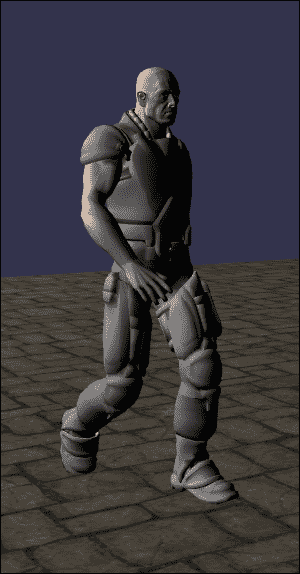

使用`.Load`函数，方法相当不同。因为成功回调只提供加载的场景，您需要找到场景中存储的骨骼。为此，只需在场景上使用`.getSkeletonByName`函数，如下所示：

```js
BABYLON.SceneLoader.Append(
  "./", // The root url
  "dude.babylon", // The name of the scene
  scene, // The scene where to append
  (scene) => { // The success callback
    // Get the skeleton
    var skeleton = this._scene.getSkeletonByName("Skeleton0");
    // Simply animate the skeleton
    scene.beginAnimation(skeleton, 0, 150, true, 1.0);
  }
);
```

使用`.Load`函数的`dude.babylon`场景的结果如下所示：

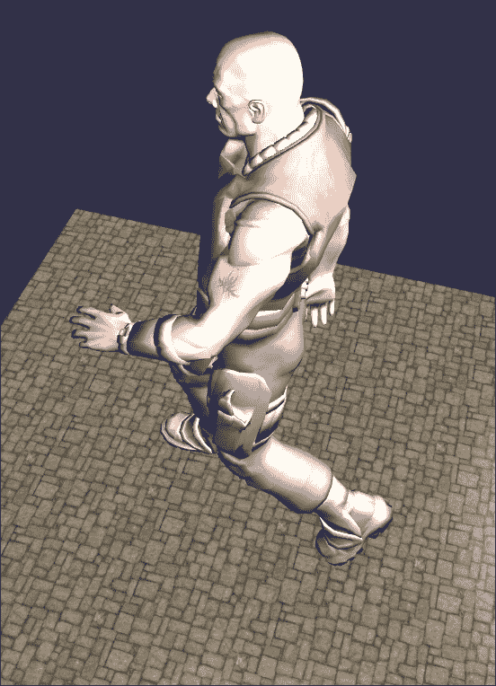

# 摘要

使用 Babylon.js 创建动画可以使您的场景更加生动。如您所见，这些功能也相当简单易用，遵循 Babylon.js 的原则：KISS 原则（保持简单，傻瓜）。

现在，在本书的结尾，你已准备好与艺术家们合作，结合 Babylon.js 所学到的所有特性。使用后处理技术，管理和定制材质，创建和管理动画，加载场景，管理动作等等！

若要更进一步，你可以查看新特性（最近发布），例如材质库（一个包含特定易于使用的材质的库，如标准材质，例如水、地形材质、PBR、熔岩等！）！其中之一的新特性应该是 Babylon.js 自动处理的程序纹理，如火焰、地面、草地等。此外，若要更进一步，你还可以查看用于特定项目（需要创建一些烟雾或火焰，以及更美丽但更昂贵的场景）的粒子系统和阴影生成器。

在 Babylon.js 中享受乐趣！
