# 第二章：让 Skype 为你工作

**Skype** ([`www.skype.com`](http://www.skype.com)) 是一款出色的软件和可靠的平台，被全球数百万用户使用，用于打电话、组织会议和相互聊天。它既用于个人通信，也用于商业用途。

Skype 的其中一个优点是它允许你与其他任何拥有 Skype 账户的用户进行免费的点对点 VoIP 通话。它还允许你以非常低廉的费率甚至免费拨打某些地区的电话号码。

此外，Skype 还可以让你通过真实电话号码接收来电或将它们转接为短信。它还允许消息转发、会议、群聊、文件传输、远程桌面演示、查看以及许多其他功能。

到目前为止，听起来 Skype 是一个出色的通信平台，确实如此。但如果我们把 Skype 用作一个自动化的代理，可以帮助完成一些工作并自动化一些业务流程，以便让我们的生活更轻松，这又是可能的吗？这是否可行？

好消息是，这确实可能。Skype 现在是微软的一部分 ([`www.microsoft.com/en-in`](https://www.microsoft.com/en-in)/)，最近在开发者大会上，推出了用于创建 Skype 交互式机器人的框架。Skype 已经有一套酷炫且极其有用的 API，这使得开发者与该服务交互相对容易，非常适合各种语音和聊天相关应用。然而，它没有专注于交互式消息自动化的 API，这就是**Bot Framework** ([`dev.botframework.com`](https://dev.botframework.com)) 出现填补空白的地方。

在本章中，我们将探讨如何使用这个框架来构建一个像虚拟**人力资源**（**HR**）助手一样的 Skype 机器人，它应该能够提供有关休假天数、通知期以及其他与人力资源相关查询的信息。

听起来很有趣！让我们开始吧。

# 如何使用 Skype 机器人

从本质上讲，Skype 机器人只是另一个 Skype 联系人；区别在于，它不是与另一个人交谈，而是一个知道如何回复你提供的输入的自动化过程。机器人可以做很多事情，比如获取新闻、查看天气、从网站检索照片或信息、开始游戏，或者为你订购食物或出租车。

任何可以转化为服务的东西都可以通过使用机器人转化为自动对话。使用 Skype，机器人几乎可以在任何平台、任何时间、从任何地方进行交互式对话。

用户可以发送 Skype 机器人请求，你的机器人可以根据接收到的内容发送有意义的反馈。Skype 机器人也可以是群聊的一部分，并将详细信息发送给该群组中的所有相关人员。

从技术角度来看，Skype 机器人的工作方式是它直接通过 Skype 机器人 API 或使用 C# 或 Node.js SDK 连接到并监听机器人平台。显然，我们将重点关注 Node.js SDK。

当用户向您的 Skype 机器人发送消息时，我们将此活动路由到为机器人定义的 **Webhook** ([`en.wikipedia.org/wiki/Webhook`](https://en.wikipedia.org/wiki/Webhook))。然后机器人将回复发送回机器人平台，平台再将它们传递给用户。Webhooks（有效的公共 URL-HTTP 消息端点）通常运行在云服务上，例如 **Microsoft Azure** ([`azure.microsoft.com`](https://azure.microsoft.com))。

Webhooks 使用 JSON 格式的请求调用。每个 JSON 对象都表示某种更新，其外观如下：

```js
[ 
{ 
   "activity" : "message", 
   "from" : "awesomeskypebot", 
   "to" : "28:2c967451-ee01-421f-92aa-1a80f9e163dc", 
   "time" : "2016-03-30T09:50:01.123Z", 
   "id" : "1443805282113", 
   "content" : "Hello from a Bot!" 
} 
] 

```

从本质上讲，机器人会经历各种阶段。最初，机器人可以添加到有限数量的用户中进行开发，这允许编辑机器人详细信息，并允许预览功能，如群聊或呼叫。在本章的示例中，我们将专注于聊天（文本交互）而不是呼叫，但了解此功能也是可能的。以下是阶段：

+   机器人创建/编辑（初始阶段）

+   机器人审查

+   机器人发布

在创建或编辑阶段之后是审查阶段，它就在发布您的机器人之前。一旦进入审查状态，您就不能在门户上编辑机器人的属性（如名称和其他属性）。重要的是要注意，机器人不能使用预览功能（如群聊或呼叫）提交。

一旦机器人的审查被接受，它就会进入发布阶段。在这个时候，任何数量的用户都可以通过机器人 URL 链接或按钮添加机器人。

最后，在发布后不久，机器人就会显示在 Skype 机器人目录中。

## 连接我们的 Skype 机器人

在掌握理论之后，我们现在深入探讨如何使用 Node.js 和 Bot Framework 开始创建我们的 Skype HR 机器人的细节。

在上一章中，我们看到了如何安装 Node.js 以及如何将我们的 Twilio 示例部署到 Azure 网站。对于我们的 Skype 机器人，我们将遵循一个非常类似的过程。

让我们首先从命令提示符创建一个本地驱动器文件夹，以便存储我们的机器人：

```js
mkdir skypebot
cd skypebot

```

假设我们已经安装了 Node.js 和 npm（如果没有，请参考第一章中的步骤，*机器人的崛起——信息传递*)，让我们创建并初始化我们的 `package.json` 文件，该文件将存储我们的机器人依赖项和定义：

```js
npm init

```

当您通过 `npm init` 选项（非常容易遵循）时，您会看到类似的内容。在某些情况下，您可能会创建一个 `index.js` 文件；然而，从现在开始，我们将使用以下截图所示的名称 `app.js`：

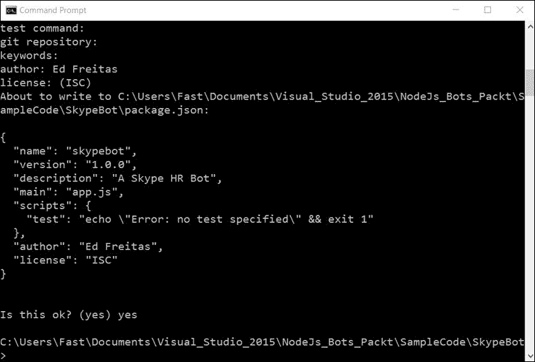

在您的项目文件夹中，您将看到结果，即您的`package.json`文件：

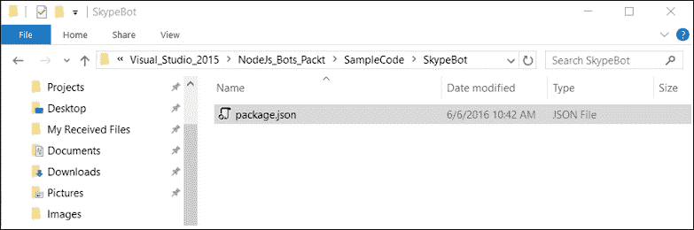

就像我们在之前的例子中所做的那样，我们将使用**Express**（[`expressjs.com`](http://expressjs.com)）作为我们的**REST** Node.js 框架。我们将安装它并将其保存到我们的`package.json`文件中，如下所示：

```js
npm install express --save

```

一旦 Express 安装完成，你应该会看到类似以下内容：

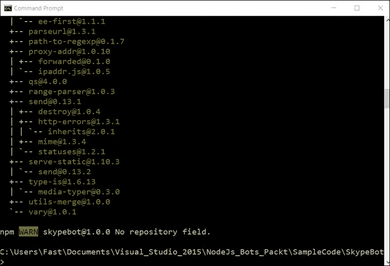

在设置好 Express 之后，接下来要做的事情是安装`BotBuilder`包，这对应于 Microsoft Bot Framework Node.js 库。我们现在就来做这件事。

为了安装它，运行以下`npm`命令：

```js
npm install --save botbuilder

```

在`BotBuilder`安装完成后，您应该在命令行中看到类似于以下截图的结果：

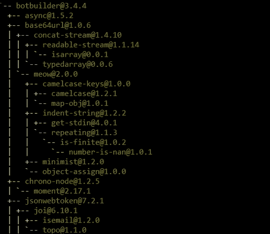

您的`package.json`应该看起来像我下面的截图所示：

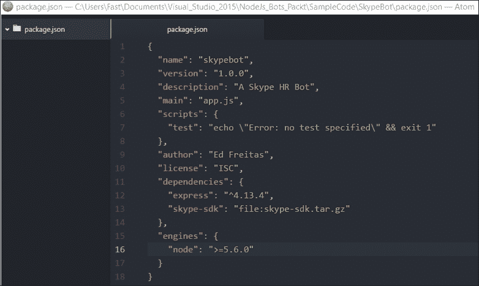

在我们的机器人全部连接好之后，我们就可以专注于创建 Express 端点和核心逻辑。

让我们创建我们的`app.js`文件，这将是我们的机器人的入口点。您可以通过在您选择的编辑器中使用的相应菜单选项来创建`app.js`文件。

我们的 Skype 机器人骨架`app.js`应该看起来像这样：

```js
var skype = require('botbuilder'); 
var express = require('express'); 

var app = express(); 

var botService = new skype.ChatConnector({ 
    appId: '', 
    appPassword: '' 
}); 

var bot = new skype.UniversalBot(botService); 

app.post('/api/messages', botService.listen()); 

bot.dialog('/', function (session) { 
  if (session.message.text.toLowerCase().indexOf('hi') >= 0){ 
    session.send('Hi ' + session.message.user.name +  
     ' thank you for your message: ' + session.message.text); 
  } else{ 
    session.send('Sorry I don't understand you...'); 
  } 
}); 

app.get('/', function (req, res) { 
  res.send('SkypeBot listening...'); 
}); 

app.listen(process.env.port, function () { 
  console.log('SkypeBot listening...'); 
}); 

```

现在，让我们将其分解成更小的部分。我们首先做的事情是使用 npm 引用我们之前安装的 Bot Framework：

```js
var skype = require('botbuilder'); 

```

一旦我们指明了这一点，我们需要引用 Express 框架，如下所示：

```js
var express = require('express');

```

一旦我们设置好所有引用，我们就可以继续创建`botService`对象并将其连接到 Azure 网站上托管的`HTTP POST`端点，Skype 机器人服务将推送传入的消息到该端点以便我们的机器人进行回复。

请注意，`botService`对象需要`APP_ID`和`APP_SECRET`变量，我们将在将机器人注册到机器人开发者门户后从 Bot Framework 获取这些变量，我们将很快进行这些步骤。

`botService`对象创建如下：

```js
var APP_ID = ''; 
var APP_SECRET = ''; 

var botService = new skype.ChatConnector({ 
    appId: APP_ID, 
    appPassword: APP_SECRET 
}); 

var bot = new skype.UniversalBot(botService); 

```

在创建好`botService`对象后，需要将其连接起来，以便 Skype 机器人知道在哪里`POST`传入的消息请求，以便它们可以被机器人处理。这是通过在`app.js`中添加以下内容来实现的，如下所示：

```js
app.post('/api/messages', botService.listen())

```

这基本上是在 Azure 网站上公开可访问的`/api/messages` HTTP 端点上注册了`botService`对象。最后，通过在`app.js`中添加以下内容，Node.js 应用程序通过监听`process.env.port`端口来公开：

```js
app.listen(process.env.port, function () { 
  console.log('SkypeBot listening...'); 
}); 

```

## 注册我们的 Skype 机器人应用程序

为了使这生效，我们需要在我们的 Bot Framework 开发者门户内注册我们的机器人。为了做到这一点，请使用您的 Microsoft 账户登录到[`dev.botframework.com/`](https://dev.botframework.com/)。您将看到以下屏幕：

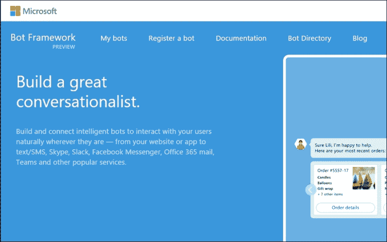

点击**注册机器人**选项以创建和注册您的 Skype 机器人。一旦完成，您将看到以下屏幕：

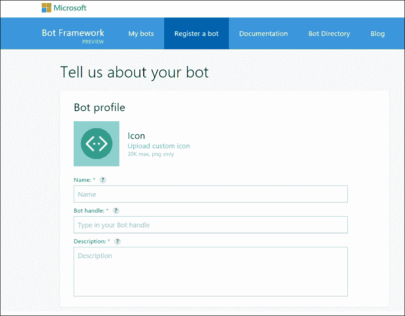

如您所见，有三个基本字段是必填的。第一个字段代表机器人的名称，它将用于在机器人目录中识别机器人（如果我们后来决定使其公开）。它不能超过 35 个字符。

第二个字段是机器人的句柄，它将用作机器人公开 URL 的一部分。它只允许字母数字和下划线字符，并且注册后不能更改。

第三个字段是机器人的描述。前 46 个字符显示在机器人目录中的机器人卡片上，其余的描述显示在机器人详情下方。

如果我们向下滚动页面，我们可以看到我们还被要求输入消息端点和应用 ID。让我们为我们的机器人添加一些详细信息。请参考以下截图：

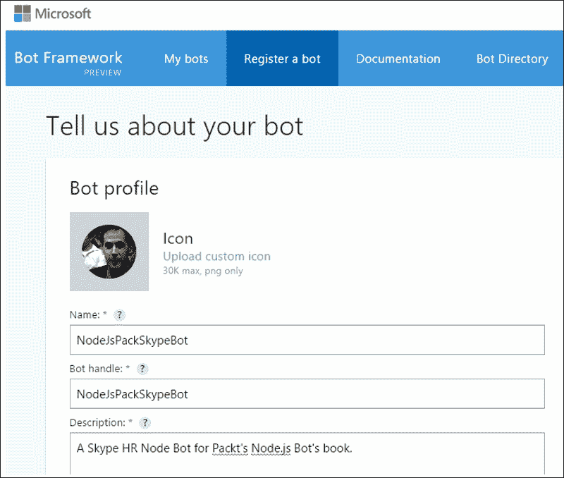

到目前为止，我们已经添加了机器人所需的三个初始字段。在这种情况下，我们将使用名称`NodeJsPacktSkypeBot`；然而，您可以使用任何其他唯一的名称。我建议在**名称**和**机器人句柄**字段中使用相同的名称。

因此，让我们向下滚动并继续，以便添加其他所需的详细信息：

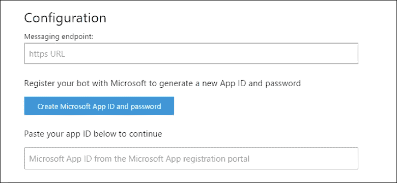

接下来我们需要添加消息端点和添加机器人的应用 ID。因此，让我们点击**创建 Microsoft 应用 ID 和密码**按钮以获取所需的 App ID。

一旦这样做，我们将得到以下结果：

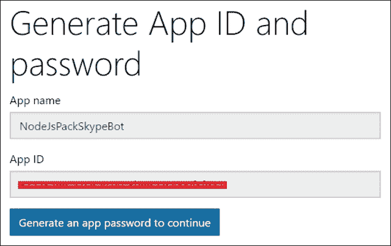

接下来我们需要做的是点击**生成应用密码以继续**按钮。一旦完成，您将看到以下屏幕：

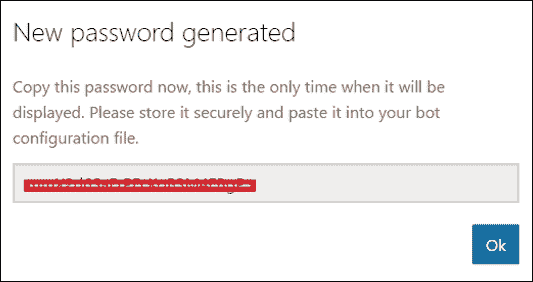

立即点击**确定**按钮，这将带您回到**生成应用 ID**和密码的屏幕。一旦到达那里，点击**完成并返回 Bot Framework**按钮：

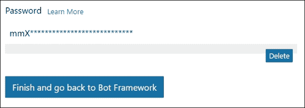

完成这些后，您将回到主注册屏幕。唯一缺少的细节将是**消息端点**和**所有者电子邮件地址**字段，如下面的截图所示：

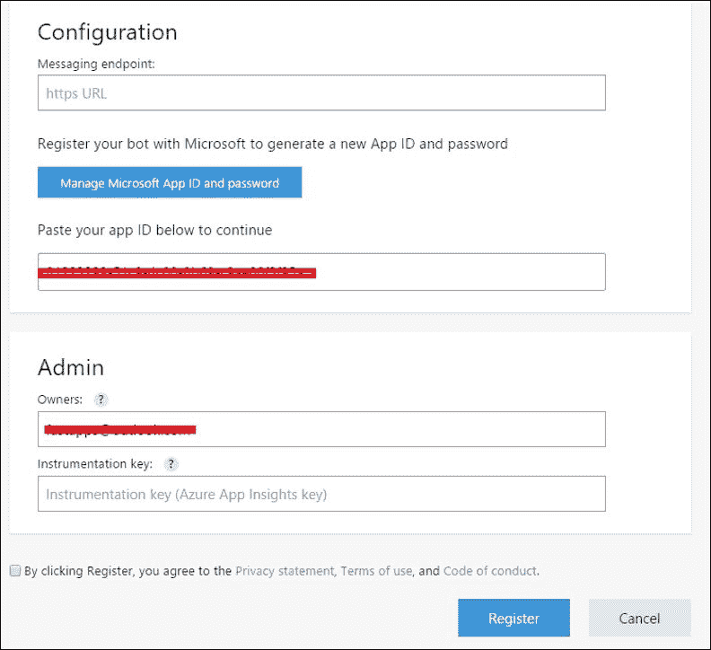

现在，让我们保持现状（我们稍后会回到这个屏幕），因为首先，我们需要将我们的机器人部署到 Azure。

就像我们在上一章中所做的那样，我们可以将我们的解决方案部署到 Azure 网站并在此处托管消息端点。因此，在我们实际填写消息端点的 URL 之前，让我们将我们的 Skype 机器人代码部署并推送到 Azure 网站以获取一个公开可访问的 URL。

假设你已经设置了准备好的 Azure 账户（如果没有，请参阅第一章，*机器人的崛起——信息传递*，了解如何进行此操作），通过在命令提示符中执行以下指令登录 Azure：

```js
azure login

```

一旦完成并提供了凭证，你将看到一个类似于以下截图的屏幕：

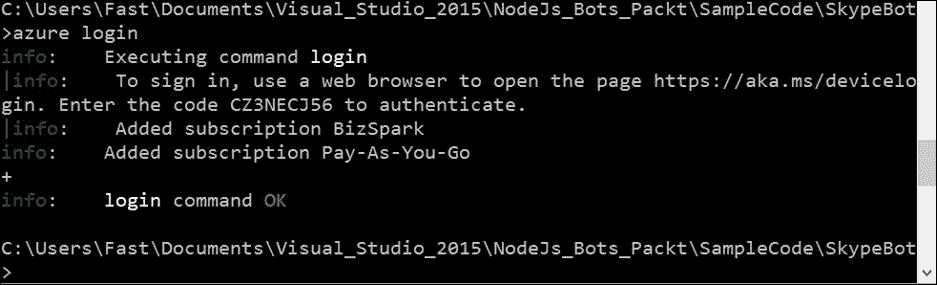

打开你的浏览器并输入控制台响应中提到的 URL。然后输入你提供的代码。一旦完成，你将看到以下内容：

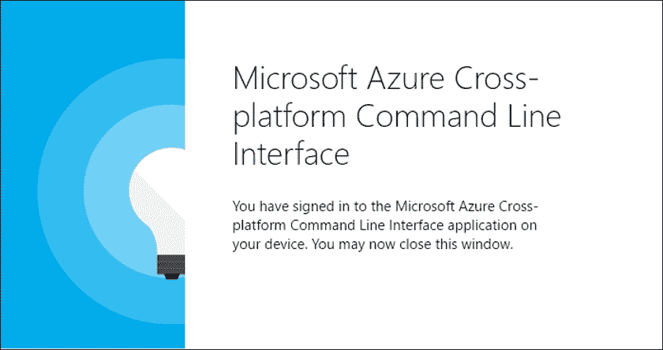

这意味着你已经成功使用命令行登录到 Azure。

下一步要做的是实际创建将托管 Skype 机器人代码的 Azure 网站服务；这可以通过在提示符中运行以下命令来完成：

```js
azure site create --git nodeskypehrbotsite

```

当你执行此命令时，你将被要求选择要将机器人部署到的 Azure 区域，如下截图所示：

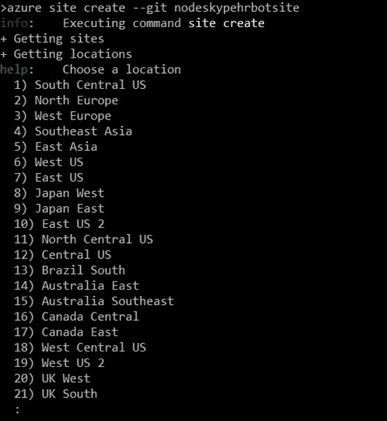

通过输入适当的数字选择离你最近的地域。完成此操作后，你将看到以下信息，表明网站已成功创建：

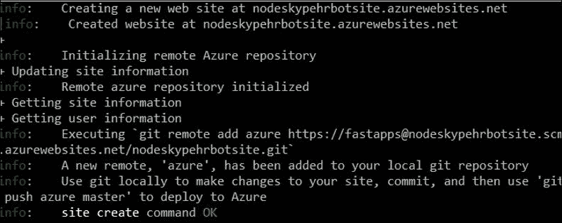

在将机器人的代码部署到 Azure 之前，首先使用你的账户登录到**Azure 门户**（[`portal.azure.com`](http://portal.azure.com)），并指定**FTP/部署**用户名和**密码**。

这可以通过进入**所有资源**，选择**nodeskypehrbotsite**，然后打开**部署凭证**刀片，最后输入**FTP/部署用户名**和**密码**来完成，如下截图所示：

一旦输入了用户名和密码，点击刀片顶部**保存**按钮。

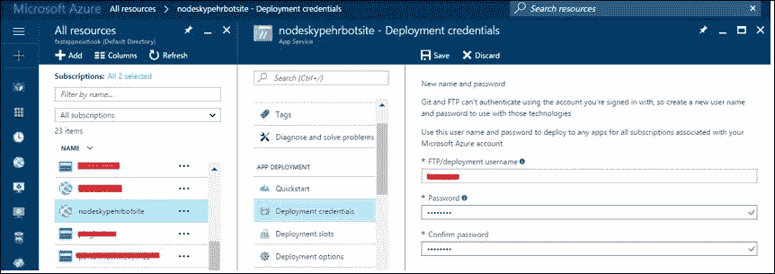

一旦完成，等待几分钟。然后我们可以按照以下方式将代码部署到 Azure 网站：

```js
git add .
git commit -m "SkypeNodeBot first commit"
git push azure master

```

一旦执行了这些命令，机器人的代码将被部署到 Azure 网站，你应该会看到一些类似于以下响应：

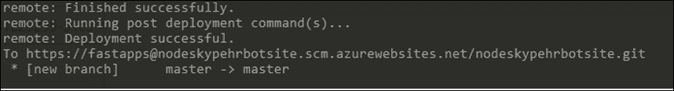

在我们的网站部署后，我们最终可以得到公开可访问的 URL，在我们的例子中将是`https://nodeskypehrbotsite.azurewebsites.net/api/messages`，前提是在我们的代码中我们定义了一个机器人将监听的`POST`端点。

这是我们需要指定为**消息端点**的 URL。

然后，我们可以回到我们最近输入了机器人 APP ID 的机器人**注册**网站屏幕，现在我们可以输入**消息端点**，如下截图所示：

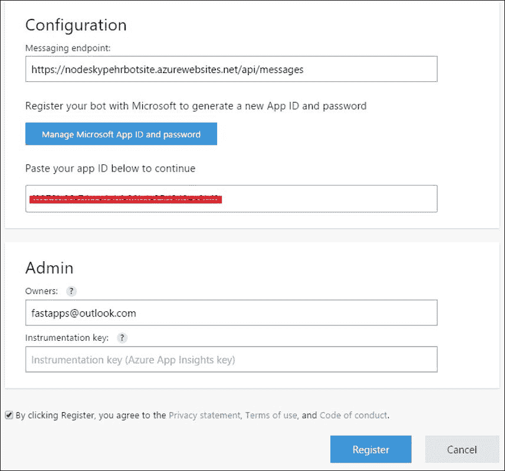

确保勾选 **隐私声明**、**使用条款** 和 **行为准则** 的选项，然后点击 **注册** 按钮，如下面的截图所示：

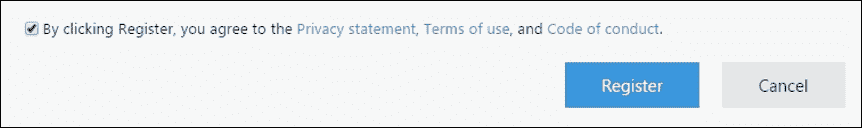

一旦你点击了 **注册** 按钮，你会收到一个弹出对话框，它会说机器人已经创建，如下面的截图所示：

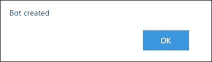

点击 **确定** 按钮继续。一旦你点击了 **确定**，你将被重定向到以下网页：

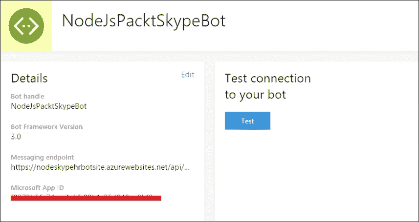

在那里，你可以通过点击 **测试** 按钮快速测试与机器人的连接。

由于我们不希望将机器人公开，因此没有必要将其 **发布** 到 Skype 机器人目录。

如果你向下滚动一点，你会找到默认启用的通道。其中之一是 **Skype**，如下面的截图所示：

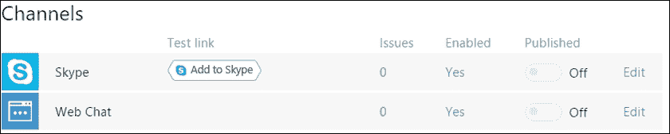

让我们点击 **添加到 Skype** 按钮来将机器人添加到我们的 Skype 联系人列表。一旦我们这样做，就会打开一个新的浏览器标签页或窗口，我们将看到以下屏幕：

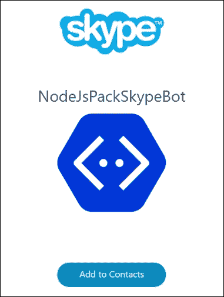

为了将机器人添加到 Skype，点击 **添加到联系人** 按钮。这将启动 Skype 应用程序并将其添加到我们的联系人列表中。

如果你的 Skype 账户与你的 Azure 账户不同（并且如果你使用 Azure 账户登录），那么将要求你注销，然后使用你的 Skype 账户登录，以便将机器人添加到你的联系人列表中。

在完成所有设置之后，让我们修改我们的代码，以添加我们的机器人 ID、应用程序 ID 和应用程序密钥。我们需要添加到代码中的机器人 ID 和应用程序 ID 是相同的，即注册机器人时输入的那个。一旦我们完成这个步骤，我们就可以将其重新发布到 Azure 网站，并对其进行测试。

我们 Skype 机器人的 `app.js` 应该现在看起来像这样：

```js
var skype = require('botbuilder'); 
var express = require('express'); 

var app = express(); 

var botService = new skype.ChatConnector({ 
    appId: '<< Your Application Id >>', 
    appPassword: '<< Your Application Password >>' 
}); 

var bot = new skype.UniversalBot(botService); 

app.post('/api/messages', botService.listen()); 

bot.dialog('/', function (session) { 
  if (session.message.text.toLowerCase().indexOf('hi') >= 0){ 
    session.send('Hi ' + session.message.user.name +  
     ' thank you for your message: ' + session.message.text); 
  } else{ 
    session.send('Sorry I don't understand you...'); 
  } 
}); 

app.get('/', function (req, res) { 
  res.send('SkypeBot listening...'); 
}); 

app.listen(process.env.port, function () { 
  console.log('SkypeBot listening...'); 
}); 

```

如果我们将更改发布到 Azure 网站，并将我们的机器人添加到 Skype 联系人列表中，使用标签 **添加到 Skype** 指示的 URL，当我们向它发送消息时，我们应该看到以下内容。

目前，机器人将回复我们提供的相同消息，并在原始消息后附加一个友好的感谢语。

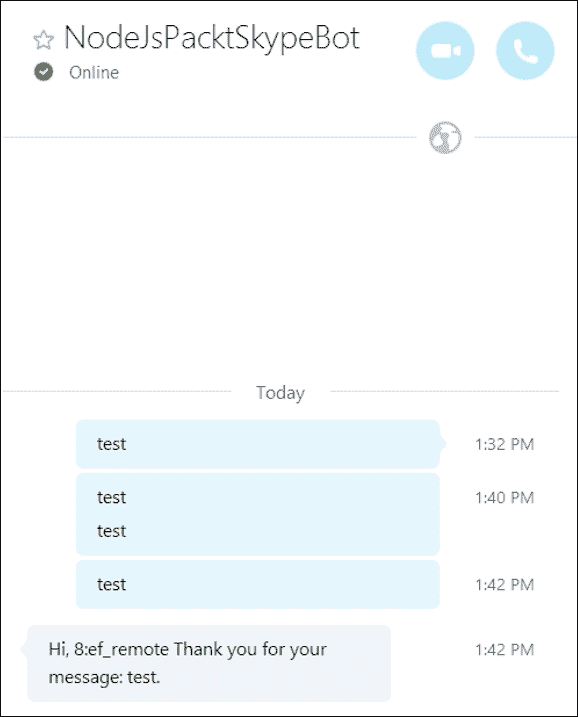

现在，让我们探索魔法实际上发生的地方。注意，**8:ef_remote** 是实际向我们的机器人发送消息的 Skype 用户的名称。

在我们的代码中，负责魔法部分的代码是 `bot.dialog` 事件。

这个事件，正如其名称明确暗示的那样，当机器人收到消息时，Skype 发送一个 `HTTP POST` 请求时会被触发。看看下面的代码片段：

```js
bot.dialog('/', function (session) { 
  if (session.message.text.toLowerCase().indexOf('hi') >= 0){ 
    session.send('Hi ' + session.message.user.name +  
     ' thank you for your message: ' + session.message.text); 
  } else{ 
    session.send('Sorry I don't understand you...'); 
  } 
}); 

```

`session`对象包含 Skype 传递给机器人应用程序的信息，它描述了已接收的会话数据以及来自谁。请注意，会话对象包含`message`和`text`等属性。

## HR Skype 机器人代理

到目前为止，我们已经能够创建并部署到 Azure 一个基本的 Skype 机器人，该机器人基本上会以相同的文本回应收到的任何消息，并在末尾附加一条感谢信息。

在上一章中，我们简要提到了我们将添加一个`BotBrain`方法，它将基本上负责对特定的消息输入给出答案。

现在，让我们扩展我们的 Skype 机器人，以创建一个基本的**人力资源**（**HR**）代理，该代理能够回答某些请求，例如检查一个人还剩下多少假期或请求病假。

HR 是一个涵盖许多主题的广阔领域，显然，可以为一个自动化的 HR 代理添加更多的逻辑。然而，由于目的是说明某种自动化通信，我们将仅限于简单地处理假期和病假请求。

由于我们已经在使用 Azure，我们将使用**表存储**（[`azure.microsoft.com/en-us/documentation/articles/storage-introduction`](https://azure.microsoft.com/en-us/documentation/articles/storage-introduction)）来定义一些数据和一些我们的机器人将根据提交的消息类型和用户提供的请求类型提供的答案。

# Azure 表存储作为后端

表存储服务使用表格格式来存储数据。每条记录代表一个实体，而列代表该实体的各种属性（表内的字段）。

每个实体都有一对键（一个**分区键**和一个**行键**）来唯一标识它。它还有一个时间戳列，表存储服务使用该列来知道实体最后更新时间（这是自动发生的，时间戳值不能被覆盖；它由服务本身内部控制）。

在 Azure 网站上可以找到关于存储和表存储服务如何工作的详细文档（[`docs.microsoft.com/en-us/azure/storage/`](https://docs.microsoft.com/en-us/azure/storage/)）。这是一个非常有价值的资源，绝对值得检查，以便更好地理解这两个服务。

尽管如此，我们将快速探索如何快速使用 Azure Table Storage。

为了在 Microsoft Azure 上开始使用存储实例，您需要使用 Microsoft 账户登录到 Azure 门户。您可以通过访问[`portal.azure.com`](http://portal.azure.com)来完成此操作。请参考以下截图：

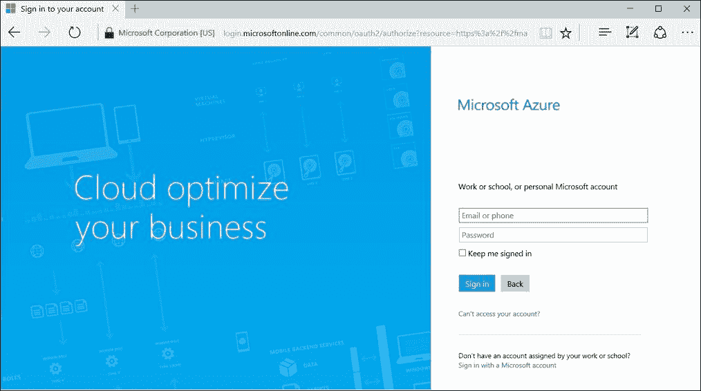

一旦您登录到 Azure 门户，您可以通过浏览 Azure 服务列表并选择**存储帐户（经典版**），如以下截图所示：

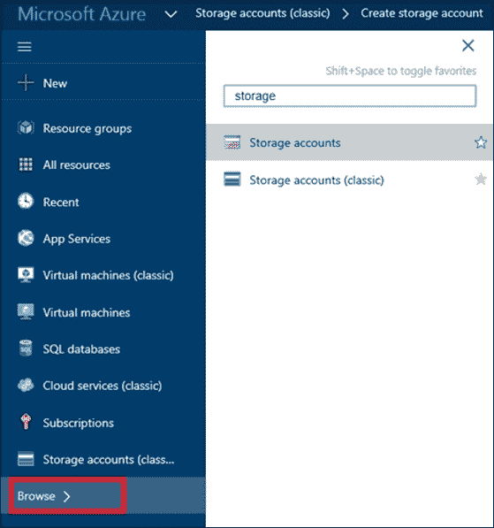

选择**存储账户（经典版）**后，你会看到以下屏幕，其中你可以添加一个新的存储账户：

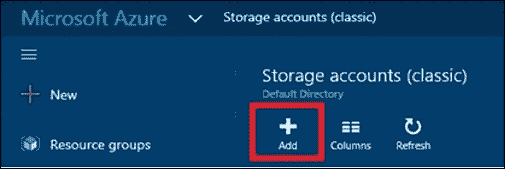

为了添加新的**存储账户（经典版）**，点击**添加**按钮。这将显示一个屏幕，你可以在这里添加账户的**名称**并选择账户将在其中托管的 Azure **位置**，如下面的截图所示：

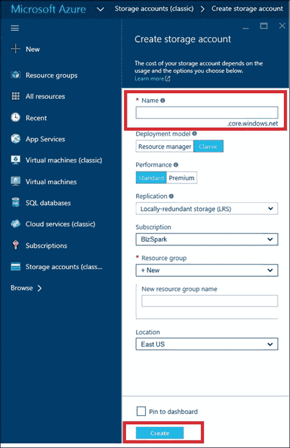

选择一个名称并选择离你最近的位置后，点击**创建**按钮。紧接着，Azure 将创建存储账户。创建后，它看起来如下。你需要你的访问密钥才能从你的代码或任何外部工具与服务交互。密钥可以通过点击**密钥**设置找到，如下面的截图所示：

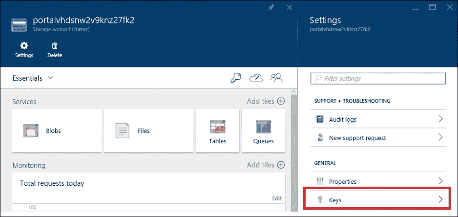

现在 Azure 存储账户已经准备好了，你可以使用一个开源且非常实用的工具，称为**Azure 存储资源管理器**（[`azurestorageexplorer.codeplex.com`](https://azurestorageexplorer.codeplex.com)），它将允许你轻松连接到你的存储账户并创建、更新、删除和查看任何存储表和数据：

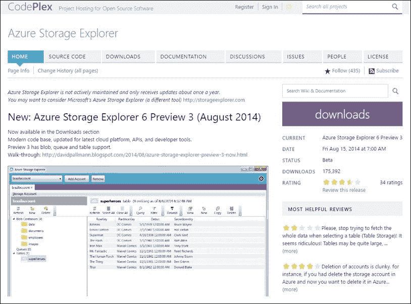

下载完 CodePlex 上的 ZIP 文件后，解压它，你会找到一个可执行文件，你可以运行它来安装这个工具。

安装向导非常容易遵循且直观，只需点击几个按钮。请注意，Azure 存储资源管理器应用程序仅在 Windows 上运行。安装后，你会看到以下文件：

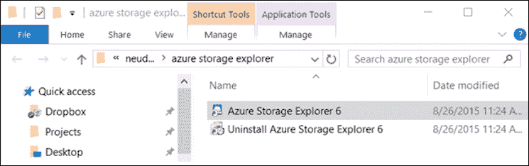

为了运行工具，双击**Azure 存储资源管理器**快捷方式。一旦应用程序运行，你需要将其与你的 Azure 存储账户连接。这可以通过点击**添加账户**按钮来完成：

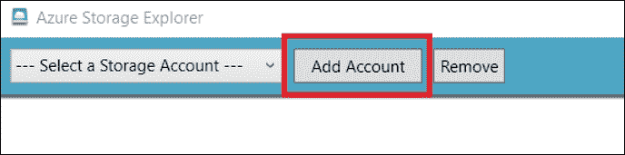

点击**添加账户**按钮后，会要求你添加你的**存储账户名称**和密钥，如下所示：

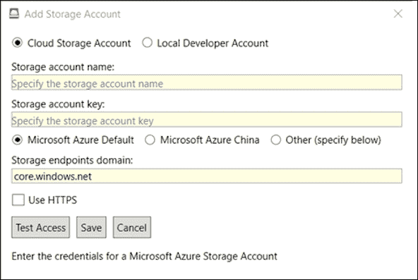

输入所需详细信息后，你应该点击**测试访问**按钮来检查连接是否成功。如果成功，你可以点击**保存**按钮。

存储这些详细信息后，下次你打开 Azure 存储资源管理器应用程序时，你将能够从**添加账户**按钮旁边的下拉菜单访问你的存储账户。

## HR 代理指南

在设置了我们的 Azure 表存储账户并了解了如何使用存储资源管理器来连接到它之后，现在让我们创建一个表格，其中包含我们的 Skype 机器人将使用的数据，以便解释请求并作为自动化的 HR 代理。听起来很令人兴奋，所以让我们卷起袖子开始吧。

我们将创建一个名为`HolidaysHRBot`的表格，其中`PartitionKey`包含 Skype 用户的名称，`RowKey`以`FirstName-LastName`的形式包含人员的全名。`PartitionKey`和`RowKey`字段都是字符串。它还将有一个名为`DaysLeft`的第三个字段，它是一个整数，代表一个人剩余可以使用的假期天数。

假设`DaysLeft`的初始值将是 25（代表有 25 天的假期可以使用）。最后，我们可以添加另一个字段来指示使用的病假天数。让我们称这个字段为`DaysSick`，并将其定义为整数，初始值设为零。

那么，让我们使用存储资源管理器创建表格并添加一些数据。请参考以下截图：

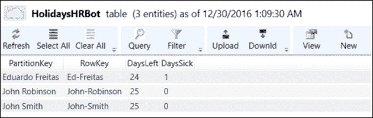

我们的人力资源代理的逻辑工作方式是，一旦用户经过验证，并提交了假期或病假请求，机器人将回复所选的选项。

因此，在定义了这些基本规则之后，让我们开发`BotBrain`方法，它可以处理这些。看起来很有趣！

## 通过代码访问 Azure 表

那么，让我们看看我们如何通过 Node.js 连接到 Azure 表存储，读取数据库表中的信息，并且进一步更新它。

为了开始，首先要做的是将 Azure 存储添加到我们的项目中作为 npm 包。这可以通过以下命令行操作完成：

```js
npm install azure-storage --save 

```

这将更新我们的`package.json`文件，添加对 Azure 存储库的引用。一旦安装了包，让我们在代码中添加对它的引用：

```js
var azure = require('azure-storage'); 

```

在添加了引用之后，我们可以继续创建`tableSvc`对象，我们将使用它来连接和与我们的`HolidaysHRBot`表进行通信。必须传递`AZURE_ACCOUNT`和`ACCOUNT_KEY`，这些可以在 Azure 门户中找到。

```js
var tableSvc = azure.createTableService(AZURE_ACCOUNT, AZURE_KEY); 

```

由于我们已经使用存储资源管理器手动向我们的表添加了数据，为了根据`PartitionKey`和`RowKey`检索数据，我们需要使用`tableSvc`对象的`retrieveEntity`方法。下面是如何操作的：

```js
tableSvc.retrieveEntity('HolidaysHRBot', 'Eduardo Freitas', 'Ed-Freitas',    
   function(error, result, response){ 
  if(!error){ 
    // result contains the entity 
  } 
}); 

```

那么，现在让我们创建一个小的用户验证方法，该方法从用户那里获取第一条消息，并在 Azure 表中检查用户是否实际存在。如果存在，机器人将执行剩余的交互式消息过程。这将是我们的`BotBrain`方法的入口点。请看以下代码片段：

```js
userVerification = function(session) { 
    session.send('Hey, let me verify your user id ' +  
      userId + ' (' + userName + '), bear with me...'); 

  tableSvc.retrieveEntity(AZURE_TABLE, userId, userName, function  
  entityQueried(error, entity) { 
    if (!error) { 
      authenticated = true; 
      userEntity = entity; 

      session.send('I have verified your id, how can I help you?' +  
        ' Type a) for Holidays, b) for Sick Leave.'); 
    } 
    else { 
      session.send('Could not find: ' + userName +  
      ', please make sure you use proper casing :)'); 
    } 
  }); 
}; 

```

我们在这里所做的是将`retrieveEntity`函数封装成一个方法，该方法根据从`AZURE_TABLE`获取的结果，向用户发送一个特定的`session.send`。

如果对于用户来说，存在与指定的`userId`（PartitionKey）和`userName`（RowKey）匹配的记录，则状态设置为已认证，并将实体`retrieved`（记录）复制到`userEntity`对象中。

## HR 代理机器人逻辑

现在让我们通过概述机器人的完整代码来闭合这个循环，如下所示：

```js
var skype = require('botbuilder'); 
var express = require('express'); 
var azure = require('azure-storage'); 

var app = express(); 

var APP_ID = '<< Your App ID >>'; 
var APP_SECRET = '<< Your App Password >>'; 

var AZURE_ACCOUNT = '<< Your Azure Account ID >>'; 
var AZURE_KEY = '<< Your Azure Account Key >>'; 
var AZURE_TABLE = 'HolidaysHRBot'; 

var tableSvc = azure.createTableService(AZURE_ACCOUNT, AZURE_KEY); 

var authenticated = false; 
var holidays = false; 
var sick = false; 
var userId = ''; 
var userName = ''; 
var userEntity = undefined; 

var botService = new skype.ChatConnector({ 
    appId: APP_ID, 
    appPassword: APP_SECRET 
}); 

var bot = new skype.UniversalBot(botService); 

app.post('/api/messages', botService.listen()); 

userVerification = function(session) { 
  session.send('Hey, let me verify your user id ' + userId + ' (' +  
    userName + '), bear with me...'); 

  tableSvc.retrieveEntity(AZURE_TABLE, userId, userName,  
  function entityQueried(error, entity) { 
    if (!error) { 
      authenticated = true; 
      userEntity = entity; 

      session.send('I have verified your id, how can I help you?' +  
        ' Type a) for Holidays, b) for Sick Leave.'); 
    } 
    else { 
      session.send('Could not find: ' + userName +  
        ', please make sure you use proper casing :)'); 
    } 
  }); 
}; 

cleanUserId = function(userId) { 
  var posi = userId.indexOf(':'); 
  return (posi > 0) ? userId.substring(posi + 1) : userId; 
}; 

BotBrain = function(session) { 
  var orig = session.message.text; 
  var content = orig.toLowerCase(); 
  var from = session.message.user.name; 

  if (authenticated) { 
    if (content === 'a)') { 
      holidays = true; 
      session.send('Please indicate how many vacation days' +  
        ' you will be requesting, i.e.: 3'); 
    } 
    else if (content === 'b)') { 
      sick = true; 
      session.send('Please indicate how many sick days' +  
        ' you will be requesting, i.e.: 2'); 
    } 
    else if (content !== 'a)' && content !== 'b)') { 
      if (holidays) { 
        session.send(userName + '(' + userId + ')' +  
          ', you have chosen to take ' + content +  
          ' holiday(s). Session ended.'); 
        sick = false; 
        authenticated = false; 
      } 
      else if (sick) { 
        session.send(userName + '(' + userId + ')' +  
          ', you have chosen to take ' + content +  
          ' sick day(s). Session ended.'); 
        holidays = false; 
        authenticated = false; 
      } 
      else if (!holidays && !sick) { 
        session.send('I can only process vacation or sick leave requests.' +     
          ' Please try again.'); 
      } 
    } 
  } 
  else { 
    authenticated = false, holidays = false, sick = false; 
    userId = '', userName = '', userEntity = undefined; 

    if (content === 'hi') { 
      session.send('Hello ' + cleanUserId(from) +  
        ', I shall verify your identify...'); 
      session.send('Can you please your provide your FirstName-LastName?' +  
        ' (please use the - between them)'); 
    } 
    else if (content !== '') { 
      userId = cleanUserId(from); 
      userName = orig; 

      if (userName.indexOf('-') > 1) { 
        userVerification(session); 
      } 
      else { 
        session.send('Hi, please provide your FirstName-LastName' +  
          ' (please use the - between them) or say hi :)'); 
      } 
    } 
  } 
}; 

bot.dialog('/', function (session) { 
  BotBrain(session); 
}); 

app.get('/', function (req, res) { 
  res.send('SkypeBot listening...'); 
}); 

//app.listen(3979, function () { 
app.listen(process.env.port, function () { 
  console.log('SkypeBot listening...'); 
}); 

```

由于我们在将机器人注册到 Skype 的过程中已经解释了代码的一些部分，并且我们也回顾了如何连接到允许机器人接收用户传入消息的 Skype API 事件，因此我们不会进一步覆盖这些部分。相反，我们将专注于`BotBrain`函数以及实际流程的流程。让我们分析一下。

首先要注意的是，当`bot.Dialog`事件被触发时，会调用`BotBrain`函数：

```js
bot.dialog('/', function (session) { 
  BotBrain(session); 
}); 

```

另一个重要的部分是，我们需要以某种方式保持状态，以便能够确定我们的机器人在与用户的对话中处于哪个阶段。

做这件事的一个相对简单的方法是使用变量来保持对话的状态或将其应用于某些部分。

我们需要知道用户何时被认证，这基本上意味着他们的 Skype ID 和名字已经与`AZURE_TABLE`中的数据进行了核对。进一步来说，我们还需要保留已认证用户的`userId`、`userName`和`userEntity`（代表表上的记录）。

也很重要的是要知道用户是否发送了`holidays`请假请求或`sick`病假请求。有了这些变量，我们可以非常简单地保持状态。

理想情况下，对于同时请求与机器人交互的多个用户，应该为每个登录或认证的用户单独保持状态。然而，这远远超出了本例的范围，我们不会涉及这一点。请看以下代码片段：

```js
var authenticated = false; 
var holidays = false; 
var sick = false; 
var userId = ''; 
var userName = ''; 
var userEntity = undefined; 

```

在解决了状态管理的问题之后，现在让我们专注于`BotBrain`函数的内部结构。让我们将其分解成更小的部分。

基本上有两个主要部分是重要的。一个是用户是否已经认证（用户已被验证存在于`AZURE_TABLE`上），另一个是用户尚未认证，这对应于对话的初始阶段：

```js
authenticated = false, holidays = false, sick = false; 
userId = '', userName = '', userEntity = undefined; 

if (content === 'hi') { 
  session.send('Hello ' + cleanUserId(from) +  
    ', I shall verify your identify...'); 
  session.send('Can you please your provide your FirstName-LastName?' +  
    ' (please use the - between them)'); 
} 
else if (content !== '') { 
  userId = cleanUserId(from); 
  userName = orig; 

  if (userName.indexOf('-') > 1) { 
    userVerification(session); 
  } 
  else { 
    session.send('Hi, please provide your FirstName-LastName' +  
      ' (please use the - between them) or say hi :)'); 
  } 
} 

```

在这里我们可以看到，为了开始对话，用户必须写一条包含单词`hi`的消息。随后，机器人会响应并要求用户以`FirstName-LastName`（应使用正确的大小写）的形式输入他们的名字。

`FirstName-LastName`将被用来查询`AZURE_TABLE`的 RowKey 并验证`userId`（用户的 Skype ID）是否与包含由`FirstName-LastName`指定的值的记录相对应。这是在`userVerification`函数中完成的。

一旦用户的身份得到验证，`authenticated`就被设置为`true`，因此机器人可以询问用户想要执行哪种类型的操作。让我们检查一下：

```js
if (content === 'a)') { 
  holidays = true; 
  session.send('Please indicate how many vacation days' +  
    ' you will be requesting, i.e.: 3'); 
} 
else if (content === 'b)') { 
  sick = true; 
  session.send('Please indicate how many sick days' +  
    ' you will be requesting, i.e.: 2'); 
} 
else if (content !== 'a)' && content !== 'b)') { 
  if (holidays) { 
     session.send(userName + '(' + userId + ')' +  
       ', you have chosen to take ' + content +  
       ' holiday(s). Session ended.'); 
     sick = false; 
     authenticated = false; 
   } 
   else if (sick) { 
     session.send(userName + '(' + userId + ')' +  
       ', you have chosen to take ' + content +  
       ' sick day(s). Session ended.'); 
     holidays = false; 
     authenticated = false; 
  } 
  else if (!holidays && !sick) { 
     session.send('I can only process vacation or sick leave requests.' +     
       ' Please try again.'); 
  } 
} 

```

一旦用户经过验证并且机器人的状态得到认证，机器人就会请求用户选择他或她是否想要申请一些假期或病假。一旦用户做出回应，每个状态就会使用名为`holidays`和`sick`的布尔变量进行存储，这些变量随后被机器人用来发送回复询问用户想要预订多少天。请查看以下截图：

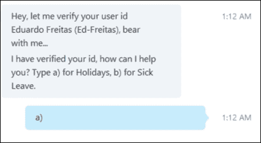

当用户提供天数时，机器人随后回复确认请求。输出如下所示：

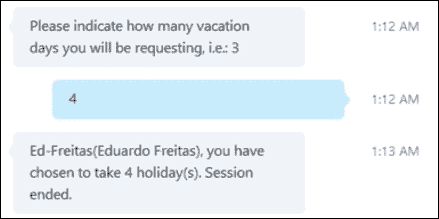

重要的是要注意，有空间添加额外的逻辑和执行更多操作，例如在输入天数请求后实际上更改`AZURE_TABLE`上的值，因此有大量的机会继续探索和扩展机器人的功能。

# 摘要

在如何连接和交互 Skype 服务以及如何创建一个利用一些基本但有趣且交互式功能来创建机器人的过程中，这是一段有趣的旅程。

我们已经了解了如何将我们的机器人设置好与 Skype 连接，如何安装相关的 npm 包，以及实现我们应用程序的基本骨架和结构。

此外，你还学会了如何创建机器人的大脑，以便执行某些任务并根据接收到的输入发送正确的回复。

如果你想要进一步扩展，一个有趣的想法是如何同时保持多个用户的状态，并添加更多交互式功能。

希望这能给你带来一些灵感，思考的素材，以及对继续探索更多实现 Skype 机器人的可能性的渴望。非常感谢阅读。
