# 第四章：Slack 引用 Bot

如果在过去一年左右的时间里，您没有生活在远离地球的遥远星系中，没有互联网连接，我确信您已经听说过 Slack（[`slack.com/`](https://slack.com/)），这是著名的团队实时消息应用和协作套件。

Slack 是从头开始构建的，易于使用且有趣。它提供了一组广泛的 API，允许开发者扩展其功能，使其更加有用。

我最喜欢的 Slack 功能之一是 Slackbot。它是一个友好的 bot，在每一个 Slack 团队中都有，用于指导用户创建他们的个人资料，并向他们解释 Slack 的工作原理。

如果您认为 Slackbot 听起来很酷，那么您会更喜欢能够构建自己的自定义 bot 的可能性，这些 bot 可以作为自动化的用户，对特定事件做出响应，并帮助您的团队完成有用的事情。

在本章中，我们将探讨如何使用 Slack 实时消息 API 来创建我们自己的自定义 Slackbot。我们将全程讲解，以便您对可能实现的内容有一个很好的了解。

到本章结束时，您应该能够轻松地创建自己的 Slackbot，并对 Slack 以及它如何帮助您的团队和您有更多的了解。

总体来说，这个过程应该非常有趣且易于遵循，所以让我们不再等待，开始吧！

# 开始

我们将构建一个 bot，它会对通用频道提供引用作为回应。想法是拥有一个 bot，在团队日常活动中激励他们，而引用无疑是获得灵感的好方法。

我们需要做的第一件事是设置我们的 bot 并在 Slack 中注册，以便使用 Slack API。

为了做到这一点，我们将使用 Slack 实时消息 API（[`api.slack.com/rtm`](https://api.slack.com/rtm)），这是一个基于 WebSocket 的 API，允许我们实时接收事件并向频道、私人组和用户发送消息。

该 API 构建得非常好，文档易于理解。我们不会直接使用 WebSocket，而是使用一个 Node.js 模块（[`www.npmjs.com/package/slackbots`](https://www.npmjs.com/package/slackbots)），这使得开发变得更加容易，使用 JavaScript。

我们需要配置我们的频道扩展并创建新的 bot。这样我们就可以获得所需的 API 令牌，以验证 Slack 并开始使用。所以，让我们卷起袖子，开始行动吧！

# 在 Slack 上注册 bot

为了将 bot 添加到您的 Slack 组织中，我们需要在以下 URL 上注册它：[`yourorganization.slack.com/services/new/bot`](https://yourorganization.slack.com/services/new/bot)。

注意，您需要将组织名称更改为您在注册 Slack 账户时使用的公司或团队名称。一旦您在浏览器中打开 URL，您将被重定向到以下屏幕：

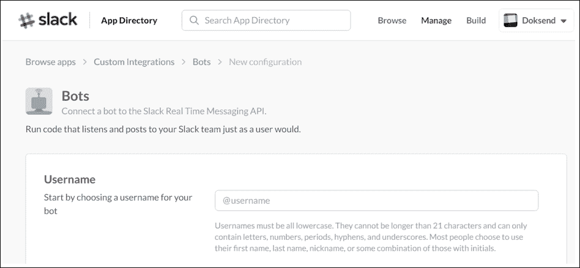

我们将把我们的机器人命名为`quotebot`。这是我们将在用户名中填写的值。注意，Slack 要求所有机器人的名称都应全部小写。

在**用户名**字段中输入名称后，点击**添加机器人集成**按钮。

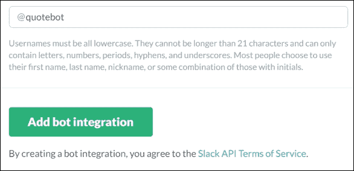

一旦完成这些操作，你将看到一个屏幕，你可以在这里进一步自定义机器人，并添加一些功能，比如图片或表情符号。这个屏幕看起来是这样的：

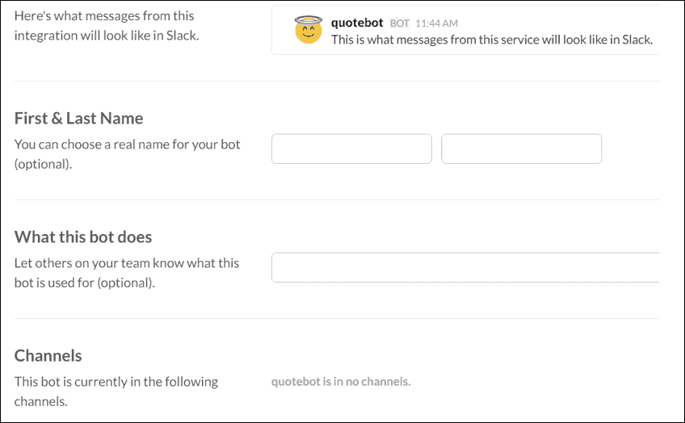

还有其他一些可用的选项可以进行自定义，但它们不适合在一个截图里展示，所以你将在到达屏幕末尾时看到它们。没有什么太复杂的。

这个屏幕还包含**API 令牌**，我们将在代码中引用它。

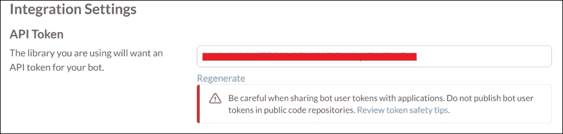

一旦你完成了必要的配置调整和更改，点击**保存集成**按钮。

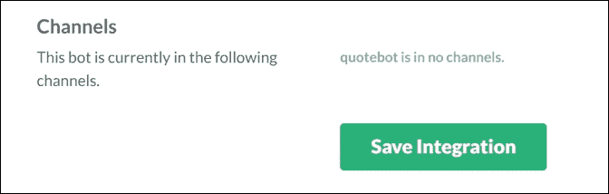

# 设置我们的 Node.js 应用程序

现在我们已经在 Slack 上注册了我们的机器人，我们就可以设置我们的 Node.js 项目，以便开始编码。

让我们继续创建我们的`package.json`文件。打开命令提示符并输入以下命令：

```js
npm init

```

在完成此操作后，按照引导配置程序进行操作，它应该看起来类似于以下截图：

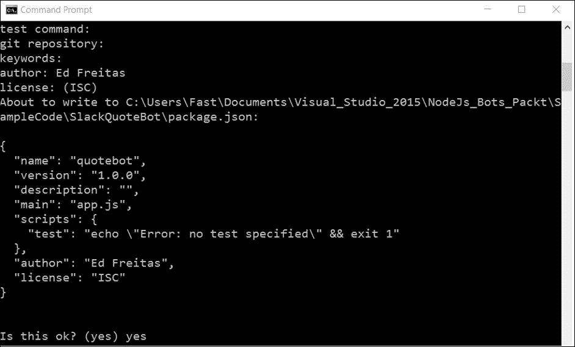

完成这个配置后，就是安装我们编写机器人所需的依赖项的时候了。

但在我们安装任何依赖项之前，让我们快速思考一下我们的机器人应该做什么。简而言之，我们的机器人必须能够检索一个引言并回复到通用频道。

有一个很棒的网站叫做*They Said So*（[`theysaidso.com/`](https://theysaidso.com/)），这是一个提供**引言即服务**（**QAAS**）的服务。可以通过易于使用的 REST API 获取多位作者的引言。

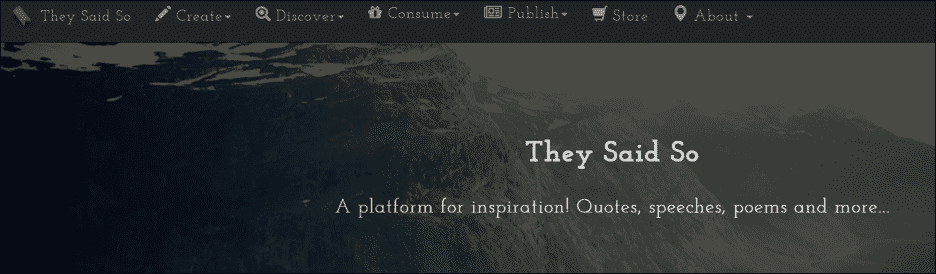

由于我们需要使用 REST 来访问此服务，让我们在我们的应用程序中包含一个 Node.js 的 REST 客户端库。就像我们在上一章中做的那样，我们将使用这个库。

为了安装这个库，从命令行执行以下指令：

```js
npm install request --save

```

现在已经完成这些操作，下一步是安装一个名为[`slackbots`](https://www.npmjs.com/package/slackbots)（[`www.npmjs.com/package/slackbots`](https://www.npmjs.com/package/slackbots)）的库，它将作为一个抽象层来处理 Slack 实时消息 API：

```js
npm install slackbots --save

```

完成此操作后，我们的`package.json`文件将更新如下：

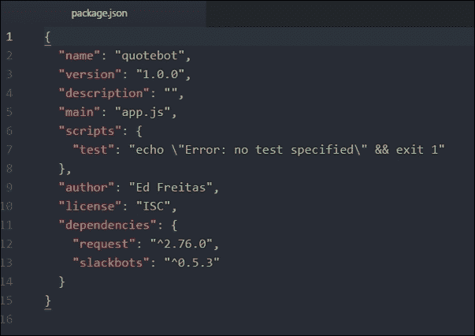

在我们的 Node.js 机器人设置全部就绪后，我们现在可以开始编写一些代码了。

# Slackbots 库基础

如前所述，为了与 Slack 实时消息 API 交互，我们将使用一个名为 `slackbots` 的 Node.js 库（npm 包）。[`www.npmjs.com/package/slackbots`](https://www.npmjs.com/package/slackbots)。

在我们编写任何代码之前，让我们通过以下简短的示例来看看这个模块提供的主要功能：

```js
var Bot = require('slackbots'); 

var settings = { 
    token: 'API TOKEN', 
    name: 'quotebot' 
}; 

var bot = new Bot(settings); 

bot.on('start', function() { 
    bot.postMessageToChannel('channel-name', 'Hi channel.'); 
    bot.postMessageToUser('a-username', 'Hi user.'); 
    bot.postMessageToGroup('a-private-group', 'Hi private group.'); 
}); 

```

在运行此代码之前，请将字符串 `channel-name`、`a-username` 和 `a-private-group` 替换为你从 Slack 组织中获取的自己的值。

你还需要将 `API TOKEN` 字符串替换为创建机器人时给你的 quotebot 令牌。现在代码应该看起来像这样：

```js
var Bot = require('slackbots'); 

var settings = { 
    token: 'xoxb-.........-R7VVJ1FI5Hzfcyt.........', 
    name: 'quotebot' 
}; 

var bot = new Bot(settings); 

bot.on('start', function() { 
    bot.postMessageToChannel('general', 'Hi channel.'); 
    bot.postMessageToUser('radkiddo', 'Hi user.'); 
    bot.postMessageToGroup('tisdoksend', 'Hi private group.'); 
}); 

```

替换这些值后，你可以从命令行运行应用程序，如下所示：

```js
Node app.js

```

如果你登录 Slack 并打开你的团队页面，当你浏览到 **#general** 频道时应该能看到这个：

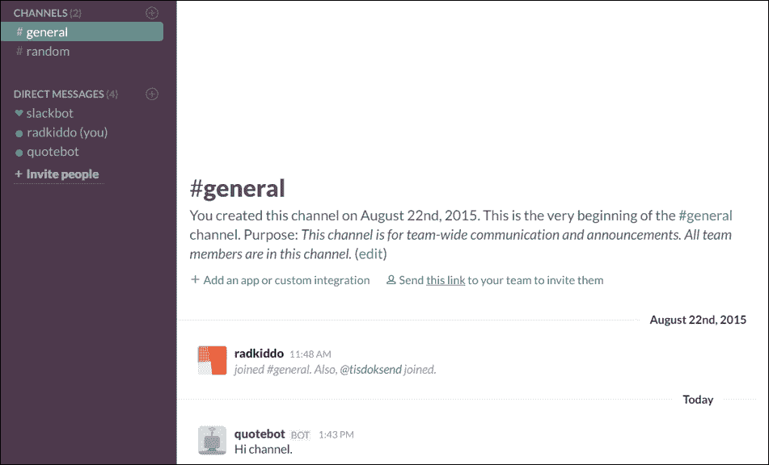

太棒了，我们的 quotebot 就这样通过它的第一条消息复活了！现在让我们将代码分解成几个部分，以便更好地理解它：

```js
var Bot = require('slackbots'); 

```

如您从前面的代码中看到的，我们首先需要做的是引入 Slackbot 构造函数。从那里我们可以实例化一个新的 `Bot` 对象并为特定事件添加回调。

在此代码中，我们使用当机器人成功连接到 Slack 服务器时触发的 `start` 事件：

```js
bot.on('start', function() { 
    bot.postMessageToChannel('general', 'Hi channel.'); 
    bot.postMessageToUser('radkiddo', 'Hi user.'); 
    bot.postMessageToGroup('tisdoksend', 'Hi private group.'); 
}); 

```

然后，我们可以使用库提供的函数，通过 `postMessageToChannel` 方法在频道中发布消息，通过 `postMessageToUser` 方法向用户发送私信，或者通过调用 `postMessageToGroup` 在私密群组对话中发送消息。

在掌握了这些基础知识之后，我们可以继续探索 [They Said So](https://theysaidso.com/) API，这对于我们构建机器人是必要的。

# The They Said So API

The They Said So 服务在其数据库中拥有大量的引语，**Quotes** API 是访问这些数据的一个非常好且方便的方式。为了使用 Quotes API，你首先需要通过此 URL 注册服务：[`theysaidso.com/register`](https://theysaidso.com/register)。

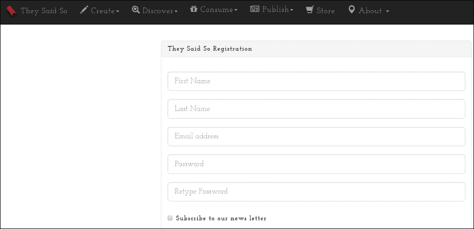

在你输入详细信息并注册后，你将收到一封自动验证电子邮件，其外观如下：

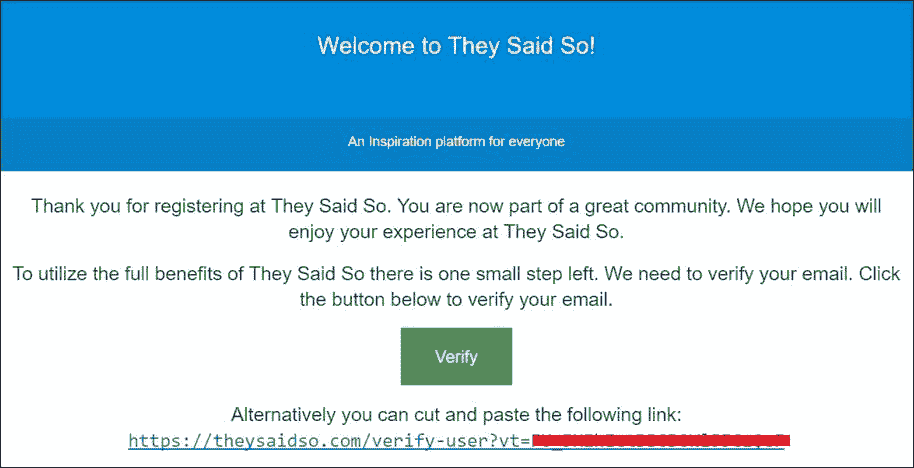

当你收到这封邮件时，只需点击 **Verify** 按钮以验证你新注册的账户并开始享受服务。

在完成这些操作后，你将很快收到这封电子邮件：

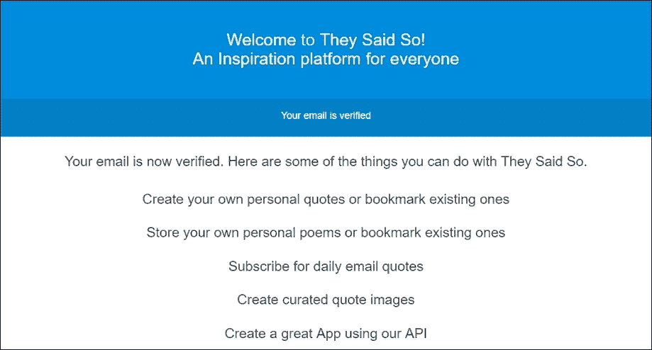

下一步是订阅 Quotes API 以开始使用它。这可以通过访问以下 URL 完成：[`theysaidso.com/api/#subscribe`](https://theysaidso.com/api/#subscribe) 或者点击收到的电子邮件中的 **Create a great App using our API** 链接。

当你打开它时，滚动到页面底部，你会在屏幕上看到以下 API 订阅计划。

在我们的案例中，因为我们正在构建一个演示应用程序，我们不会注册任何特定的付费计划，而是将通过**Mashape**（[`market.mashape.com/orthosie/they-said-so-say-it-with-style/`](https://market.mashape.com/orthosie/they-said-so-say-it-with-style/)）来使用 API。

Mashape 是一个帮助开发者提供更好的 API 和微服务的服务。许多第三方 API 都是通过 Mashape 或类似的服务提供的。

然而，如果你希望获取付费计划，你可以**注册**服务提供的任何付费 API 选项。这样做的好处是，你不需要在 Mashape 上登录就可以使用 API。

因此，当我们通过 Mashape 使用 API 时，我们可以在屏幕底部点击**使用 API**按钮。

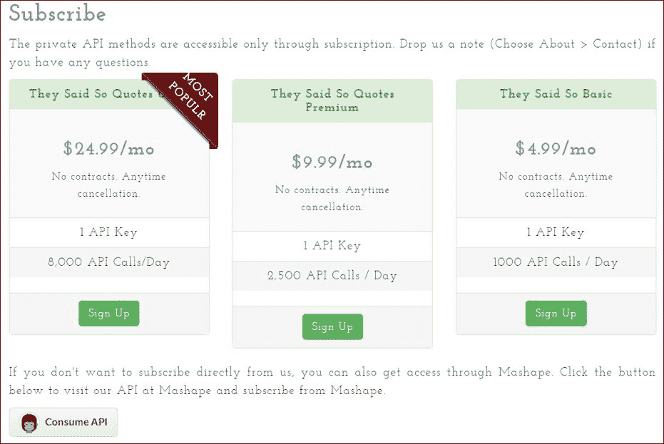

当我们点击那个按钮时，接下来我们会看到以下截图。一旦到达那里，点击**价格**选项卡。

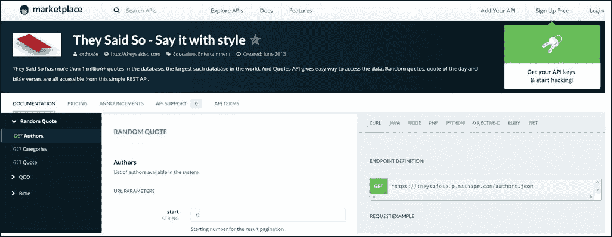

在**价格**选项卡下，在**基础**计划中，点击**订阅**按钮。

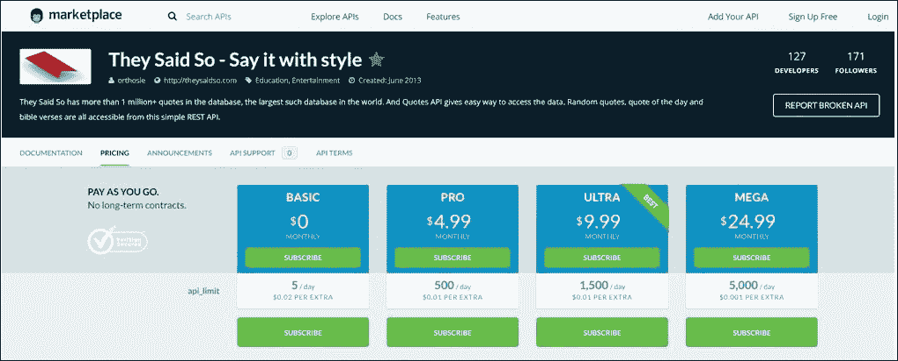

当你点击**订阅**按钮时，你会看到一个以下弹出屏幕：

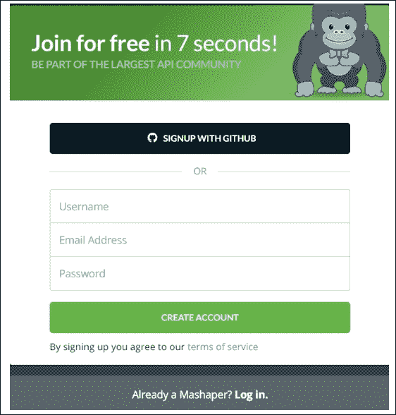

如果你有一个 GitHub 或 Mashape 账户，你可以简单地通过使用这些账户中的任何一个登录到服务来订阅 API。否则，你将不得不在 Mashape 上创建一个账户。

这个过程非常简单直接。一旦完成，我们就可以开始探索 API 并使用它了。你会在屏幕上看到以下内容：

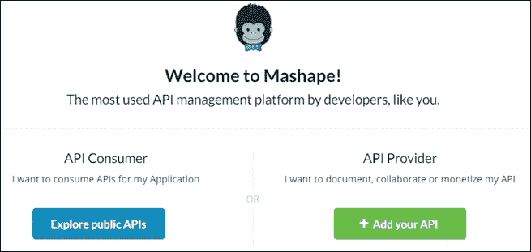

简单地点击**探索公共 API**按钮，然后点击浏览器上的后退按钮或导航到以下 URL：[`market.mashape.com/orthosie/they-said-so-say-it-with-style/`](https://market.mashape.com/orthosie/they-said-so-say-it-with-style/)以开始探索 API。那么，让我们这么做吧。

从 API 中，我们对报价部分感兴趣。我们可以通过点击屏幕左侧的**GET Quote**链接来查看它。

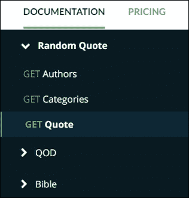

这将带我们到以下页面，我们可以看到如何构建 API 调用以获取报价：

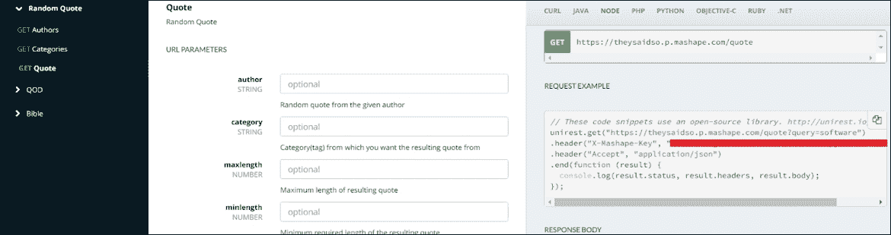

此外，还有多种编程语言的多个示例，包括使用 Unirest 库（[`unirest.io/`](http://unirest.io/)）进行 HTTP 请求的 Node.js。在我们的应用程序中，我们将使用 Request 库（[`www.npmjs.com/package/request`](https://www.npmjs.com/package/request)）代替。

注意在所有示例代码中，包括在**GET Quote**文档页面提到的 Node.js 代码中，API 令牌密钥作为`X-Mashape-Key`参数的值传递在 HTTP 请求的头部。

现在让我们看看如何使用 Request 库编写一个获取引言的小例子。

让我们创建一个名为`TestRequest.js`的新文件，这样我们就不至于将此测试代码与使用`App.js`开始编写的 quotebot 主代码混淆：

```js
var rq = require('request'); 

var token = 'Your They Said So API Key'; 

GetQuote = function() { 
  var options = { 
   url: 'https://theysaidso.p.mashape.com/quote?query=software', 
   headers: { 
      'User-Agent': 'request', 
      'X-Mashape-Key': token 
   } 
  }; 

  rq(options, function (error, response, body) { 
    if (!error && response.statusCode == 200) { 
      console.log(body); 
    } 
  }) 
}; 

GetQuote(); 

```

在运行此程序之前，请确保您已订阅**基础**计划，该计划每天包含五个通话。即使您每天超过五个请求，您仍需输入信用卡号码。

您可以始终通过以下 URL 取消订阅：[`market.mashape.com/orthosie/they-said-so-say-it-with-style/pricing`](https://market.mashape.com/orthosie/they-said-so-say-it-with-style/pricing)，在**基础**计划下点击**取消订阅**链接。

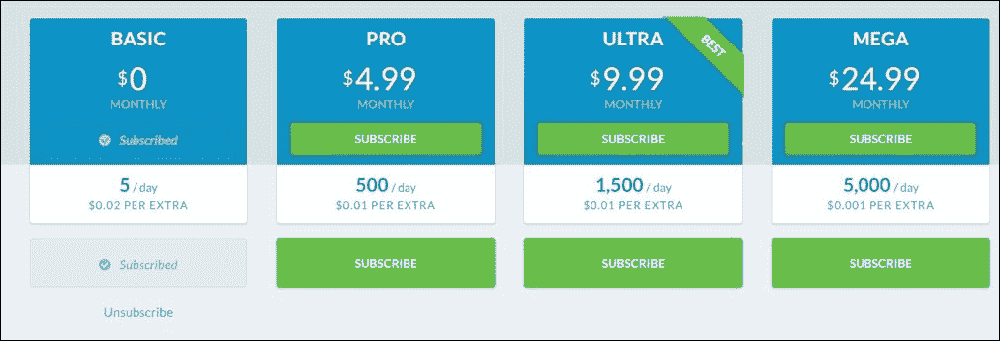

您可以从命令行按如下方式运行此脚本：

```js
Node TestRequest.js

```

这会产生以下结果：

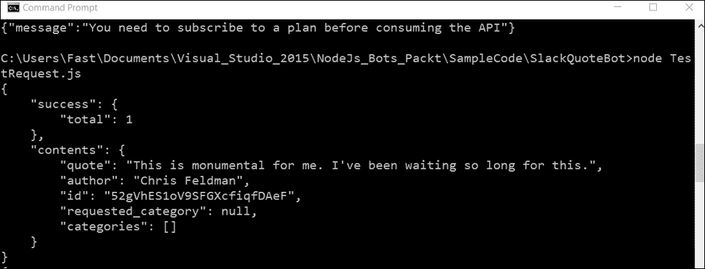

现在我们知道了如何交互这两个 API，我们可以扩展我们最初编写的代码，以创建一个完整的 quotebot。

在我们之前的代码片段中，我们使用了开始事件。从现在开始，我们还需要消息事件，它将用于拦截传入的消息，并根据该消息进行回复。

我们需要一个函数来拦截我们的 bot 可读的每个实时 API 消息。这包括几乎在安装了 bot 的任何渠道中的所有聊天消息，以及指向 bot 或其它用户的私人消息，以及实时通知，如用户在渠道中输入、编辑或删除消息，用户加入或离开渠道等等。

实时 API 消息不仅仅是聊天消息，而是我们 Slack 组织内发生的任何类型的事件。这一点很重要。

理想情况下，我们希望 bot 过滤所有这些事件，以检测提及 getquote 或 bot 名称的渠道中的公共消息，然后我们希望对此消息做出反应，通过回复从我们使用 Mashape 订阅的 API 中获取的随机引言。

理想情况下，我们希望将这些检查分成一系列操作；这正是我们需要做的。这些操作包括：

+   验证事件是否代表聊天消息

+   验证消息是否来自不同于 quotebot 的用户（以避免循环引用和循环）

+   验证消息是否提及 getquote

代码如下：

```js
onMessage = function (msg) { 
    if (isChatMsg(msg) && 
        !isFromQuoteBot(msg) && 
        isMentioningQuote(msg)) { 
        replyWithRandomQuote(bot, msg); 
    } 
}; 

```

`onMessage`函数接收一个`msg`对象作为参数。`msg`包含通过 Slack 实时 API 接收到的实时事件的所有信息。

现在让我们逐个查看每个辅助函数：

```js
isChatMsg = function (msg) { 
    return msg.type === 'message'; 
}; 

```

此函数验证实时事件是否对应于用户发送的`msg`。有了我们放置的第一个辅助函数，让我们看看第二个：

```js
isFromQuoteBot = function (msg) { 
    return msg.username === 'quotebot'; 
}; 

```

此辅助函数使我们能够查看`msg`是否来自不是 quotebot 本身的用户。

最后但同样重要的是，我们的最终辅助函数检查消息是否包含字符串`getquote`。如果没有这个验证，我们可能会陷入无限循环的引用：

```js
isMentioningQuote = function (msg) { 
    return msg.text.toLowerCase().indexOf('getquote') > -1; 
}; 

```

在完成所有辅助验证函数后，我们的随机引用回复方法将如下所示：

```js
replyWithRandomQuote = function (bot, oMsg) { 
  var options = { 
   url: 'https://theysaidso.p.mashape.com/quote?query=software', 
   headers: { 
      'User-Agent': 'request', 
      'X-Mashape-Key': token 
   } 
  }; 

  rq(options, function (error, response, body) { 

    if (!error && response.statusCode == 200) { 
      bot.postMessageToChannel(bot.channels[0].name, body); 
    } 
  }) 
}; 

```

最后，我们将通过将`onMessage`回调传递给监听事件来整合所有内容：

```js
bot.on('message', onMessage); 

```

完整的代码看起来是这样的。

```js
var Bot = require('slackbots'); 
var rq = require('request'); 

var token = ' YOUR MASHAPE API TOKEN '; 

var settings = { 
    token: 'YOUR SLACK API TOKEN', 
    name: 'quotebot' 
}; 

var bot = new Bot(settings); 

isChatMsg = function (msg) { 
    return msg.type === 'message'; 
}; 

isFromQuoteBot = function (msg) { 
    return msg.username === 'quotebot'; 
}; 

isMentioningQuote = function (msg) { 
    return msg.text.toLowerCase().indexOf('getquote') > -1; 
}; 

replyWithRandomQuote = function (bot, oMsg) { 
  var options = { 
    url: 'https://theysaidso.p.mashape.com/quote?query=software', 
    headers: { 
      'User-Agent': 'request', 
      'X-Mashape-Key': token 
    } 
  }; 

  rq(options, function (error, response, body) { 

    if (!error && response.statusCode == 200) { 
      bot.postMessageToChannel(bot.channels[0].name, body); 
    } 
  }) 
}; 

bot.on('message', function (msg) { 
    if (isChatMsg(msg) && 
        !isFromQuoteBot(msg) && 
        isMentioningQuote(msg)) { 
        replyWithRandomQuote(bot, msg); 
    } 
}); 

```

为了看到这个动作，只需在 Slack 上向 quotebot 发送包含文本`getquote`的消息：

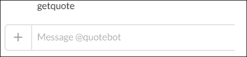

一旦你这样做，你将在**#general**频道收到以下反馈：

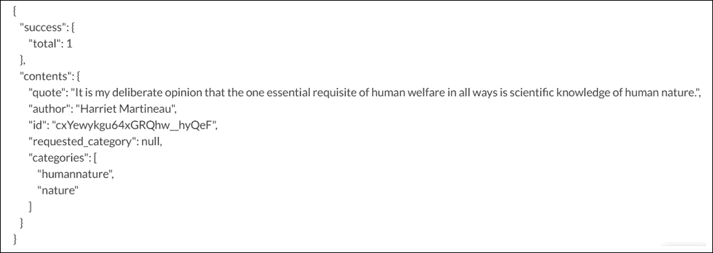

太棒了！然而，请注意，我们已经返回了完整的正文响应。

这可以进一步优化，你最终可以解析正文响应，只输出引用和作者，而不包含其他任何细节。

这完全取决于你，这是一个很好的练习，可以用来改进这段代码。此外，你还可以添加额外的代码来处理自然语言，解释更多命令，并响应不同的频道。

可能性实际上是无限的，所需要的只是时间、想象力和奉献。我们将挑战留给你们，以便进一步扩展和探索。

# 摘要

我们简要地看到了 Slack 是一个伟大的协作平台，以及与其实时 API 交互是多么的简单。

在几分钟内，你就可以拥有一个运行的小型演示机器人。

在接下来的章节中，我们将探讨其他一些现在也很受欢迎的有趣平台，这应该也会很有趣可以玩弄。

我希望你喜欢跟随这些示例，接下来的章节将涉及其他令人着迷的主题。继续享受乐趣！
