# 第五章：由 Telegram 驱动的机器人

**Telegram** ([`telegram.org/`](https://telegram.org/)) 是一款免费、基于云的移动和桌面消息应用。Telegram 引领我们进入一个以安全性和消息传递速度为重点的新时代。

Telegram 为包括 Windows、OS X、Linux 64 位和 Linux 32 位在内的平台提供客户端。Telegram 消息应用也提供网页版供使用。至于移动设备，Telegram 为 Android、iOS 和 Windows Phone 提供原生应用。

使用 Telegram，您可以发送消息、照片、视频以及任何类型的文件（如 doc、zip、mp3 等）；您还可以创建最多容纳 5,000 人的群组，或者创建频道来广播您的消息和媒体。

Telegram 的一大优点是，Telegram 消息是加密的，并且可以设置为自我销毁。在聊天或发消息时，对于那些想要更多隐私和保密的人来说，Telegram 有秘密聊天功能。这意味着只有您和收件人可以看到这些消息；其他人包括 Telegram 都无法看到。这些秘密聊天的消息不能转发，更重要的是，当您从自己这边删除这些消息时，Telegram 的秘密聊天也会从对方那边删除这些消息。

在本章中，我们将探讨如何使用 Telegram。此外，我们还将探讨如何构建一个由 Telegram 驱动的机器人，该机器人将充当我们的虚拟助手。这个虚拟助手将提供关于我们 Telegram 消息情感的信息。

听起来很棒！让我们开始吧。

# Telegram 机器人的工作原理

Telegram 机器人是一个特殊的账户，设置时不需要额外的电话号码。用户可以通过两种方式与这些机器人互动：

+   通过与他们开启聊天或将它们添加到群组中来向机器人发送消息和命令。这种沟通方式通常用于典型的聊天机器人。

+   直接从输入字段发送请求，通过输入机器人的用户名和查询。这些被称为内联机器人。

这些机器人可以通过从外部来源增强 Telegram 聊天内容、提醒或通知您新闻和翻译，以及向您提供相关信息。机器人甚至可以将志同道合的人连接起来，在 Telegram 内寻找对话伙伴。

从技术上讲，Telegram 机器人是运行在 Telegram 内部的第三方应用程序。当用户向 Telegram 机器人发送消息时，Telegram 的中继服务器会负责加密和通过 Telegram 机器人 API 进行通信。

在本章中，我们将通过开启与我们的机器人的聊天而不是调用它，专注于使用我们的 Telegram 机器人进行聊天对话（文本交互）。

## 设置 Telegram 账户

到目前为止，我们只是在谈论 Telegram 及其内部的机器人。在本节中，我们将实际开始设置我们自己的 Telegram 账户，然后是 Telegram 聊天机器人的账户。

我正在使用 Telegram 的网页版本来首先创建我的账户。打开浏览器窗口并输入 URL [`web.telegram.org/#/login`](https://web.telegram.org/#/login) 。这将启动一个 **登录** 屏幕，如图所示：

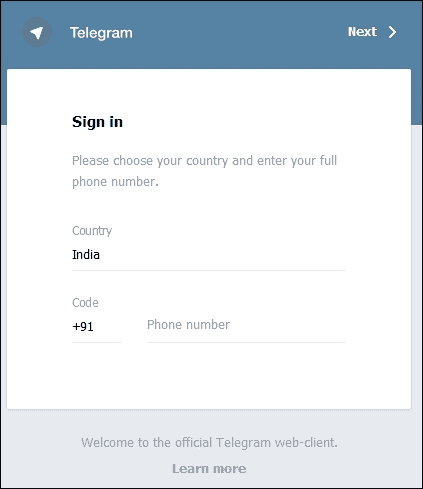

提供您的 **国家**、**代码** 和 **电话号码**。点击右上角的 **下一步 >** 链接以启动下一步，如图所示：

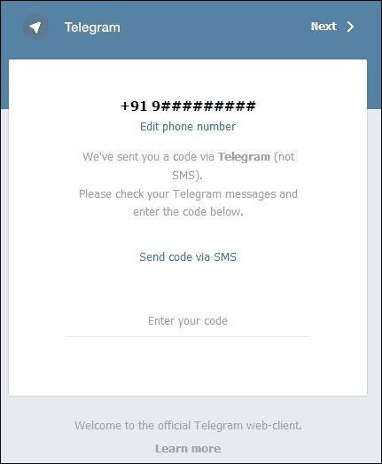

在提供的空间中输入您收到的短信代码，您就可以设置自己的 Telegram 账户了。一旦您输入了个人资料详情，您就可以通过以下屏幕开始发消息：

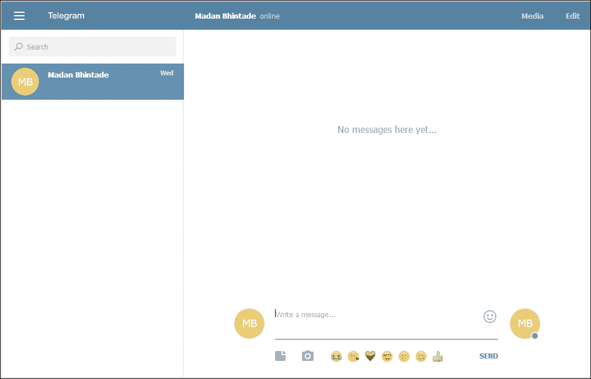

通过这种方式，我们现在已经设置了自己的 Telegram 账户。您可以从现在开始给同事发消息，也可以搜索他们。在下一节中，我们将开始构建由 Telegram 支持的机器人。

## 使用 Telegram 机器人创建机器人账户 - @BotFather

听起来很复杂！但这确实是开始使用 Telegram 机器人的最简单方法。正如我提到的，Telegram 机器人是特殊的账户，为了设置这些账户，我们将使用另一个名为 *BotFather* 的 Telegram 机器人。

这是 Telegram 为开发者特别提供的强大技术，用于创建他们自己的机器人。在这里，我们可以看到一个机器人的能力，它可以帮助我们创建其他机器人。

让我们搜索 `@Botfather` 并将其添加到我们的对话中，或者您可以直接打开 URL [`telegram.me/botfather`](https://telegram.me/botfather) 与 BotFather 开始对话。为了开始，BotFather 会自我介绍并在底部显示一个 **开始** 按钮供用户使用。

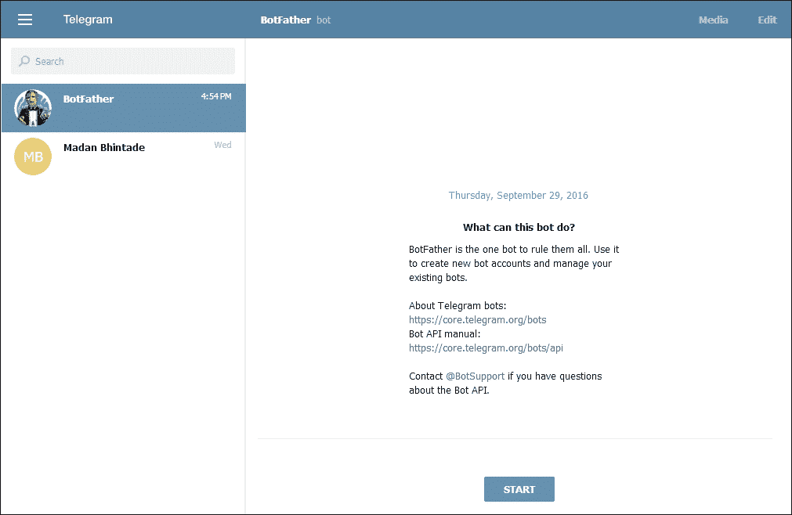

一旦您点击 **开始** 按钮，**BotFather** 将提供所有可用于创建新机器人的命令，如图所示：


现在，让我们点击与 BotFather 对话中的链接 **/newbot**。使用这个命令，BotFather 会要求我们为我们的机器人选择一个名字。

让我选择名字 `MadansNewTelegramBot`。BotFather 内部验证该名字是否可用。如果可用，BotFather 会要求为新创建的机器人提供一个用户名。我已经为我的机器人提供了一个用户名。请参考以下对话：

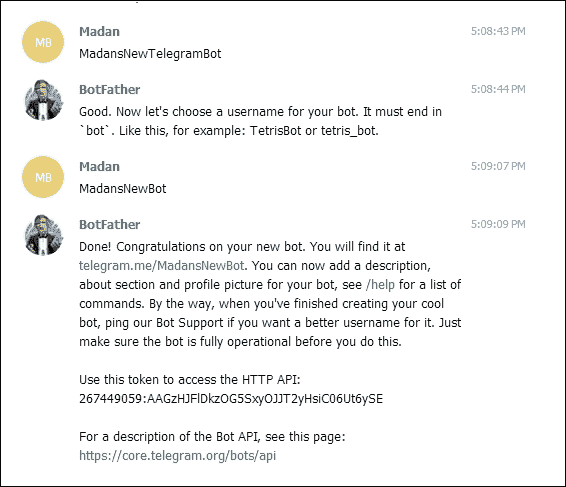

通过这种方式，BotFather 已经创建好了我们的机器人，并且还为我们提供了机器人的令牌。这个令牌将在我们将机器人与 Telegram 机器人 API 连接时使用。

现在我们可以使用这个机器人通过 URL `telegram.me/MadansNewBot` 或在搜索字段中搜索机器人的名字来进行对话，如图所示：

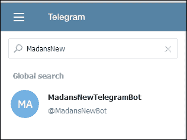

搜索一次后，你选择机器人进行进一步的对话。

为了总结到目前为止所采取的步骤，我们在 Telegram 上创建了自己的账户，并使用 BotFather 创建了一个基本的 Telegram 机器人。我们的第一个 Telegram 机器人将是一个无脑机器人，因为它内部没有构建任何智能。

在下一节中，我们将借助 Node.js 实际构建一些基本智能。我们将构建一个机器人，它会告诉我们消息的情感。但什么是情感分析？让我们花些时间来了解情感分析。

## 什么是情感分析？

简而言之，情感分析就是将给定的术语或句子分类为正面、负面或中性。这也被称为意见挖掘或推导写作或说话者的态度。

与 Telegram 相关，情感分析对于媒体监控和提取关于某些公共话题的意见可以非常有用。

情感分析可以通过基于知识的技术、统计方法以及两者的结合来实现。基于知识的技术根据词语与特定情感（如快乐、悲伤等）的亲和力对文本进行分类。统计方法利用机器学习的元素。

当表示一个术语或句子的情感时，具有负面、中性或正面情感的词语会在 -10 到 +10 的刻度上得到一个关联的数字，情感的水平或分数是在术语或句子级别确定的。

考虑到本书的范围，我们对情感分析主题进行了简短的介绍。

## 创建 Telegram 机器人

现在，让我们看看如何使用 Node.js 和 Telegram 机器人 API 来创建我们的基本 Telegram 机器人。在前一章中，我们看到了如何安装 Node.js。对于我们的 Telegram 机器人，我们将遵循一个非常类似的过程。

让我们从在本地驱动器中通过命令提示符创建一个文件夹开始，以便存储我们的机器人：

```js
mkdir telegrambot
cd telegrambot

```

假设我们已经安装了 Node.js 和 npm（如果没有，请参阅第一章 *机器人的崛起 – 传达信息* 中的步骤），让我们创建并初始化我们的 `package.json`，它将存储我们的机器人依赖项和定义：

```js
npm init

```

一旦你完成了 `npm init` 选项（这些选项非常容易遵循），你会看到类似以下的内容：

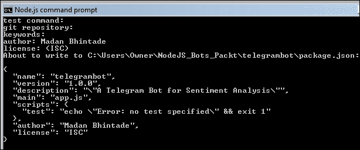

在你的项目文件夹中，你会看到结果，即你的 `package.json` 文件。

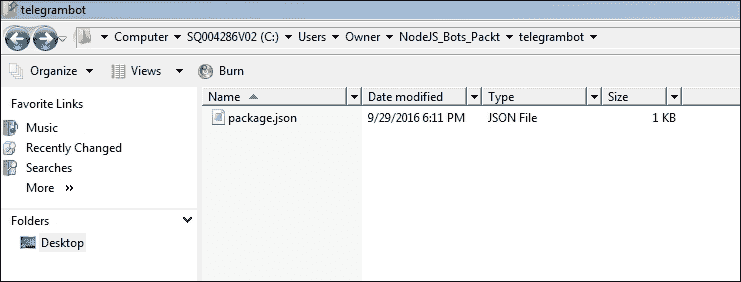

就像我们在之前的例子中所做的那样，我们将使用 **Express** ([`expressjs.com`](http://expressjs.com)) 作为我们的 **REST** Node.js 框架。我们将安装它并将其保存到我们的 `package.json` 文件中，如下所示：

```js
npm install express --save

```

一旦安装了 Express，你应该会看到类似以下的内容：

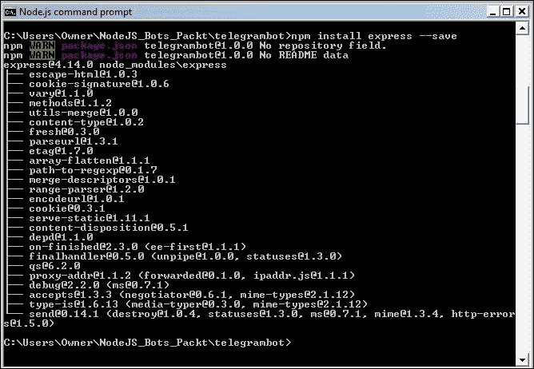

使用 Express 设置后，接下来要做的就是在项目中安装 `node-telegram-bot-api` 包。这个包可以在 [`www.npmjs.com/package/telegram-bot-api`](https://www.npmjs.com/package/telegram-bot-api) 找到。

为了安装它，运行以下 npm 命令：

```js
npm install node-telegram-bot-api --save

```

你应该会看到类似以下的内容：

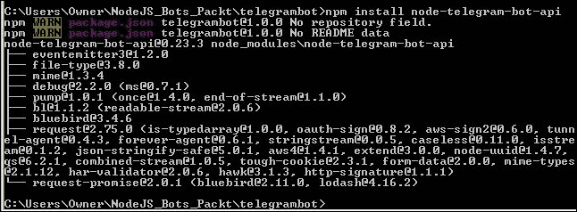

完成此操作后，接下来要做的事情是更新你的 `package.json` 以包括 `"engines"` 属性。使用文本编辑器打开 `package.json` 文件，并按以下方式更新它：

```js
"engines": {
    "node": ">=5.6.0"
}

```

你的 `package.json` 应该如下所示：

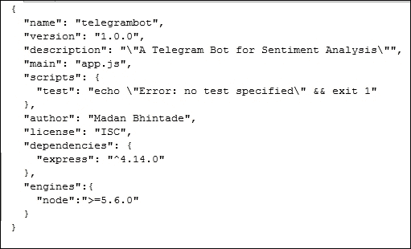

在我们的机器人全部设置完毕后，我们可以专注于创建与机器人对话的核心逻辑。让我们创建 `app.js` 文件，这将是我们的机器人的入口点。

我们的 `app.js` 应该如下所示：

```js
var telegramBot = require('node-telegram-bot-api'); 

var token ='267449059:AAGzHJFlDkzOG5SxyOJJT2yHsiC06Ut6ySE'; 

var api = new telegramBot(token, {polling: true}); 

api.onText(/\/help/, function(msg, match) { 
  var fromId = msg.from.id; 
  api.sendMessage(fromId, "I can help you in getting the sentiments of any text you send to me."); 
}); 

api.onText(/\/start/, function(msg, match) { 
  var fromId = msg.from.id; 
  api.sendMessage(fromId, "They call me MadansFirstTelegramBot. " +  
    "I can help you in getting the sentiments of any text you send to me."+ 
    "To help you i just have few commands.\n/help\n/start\n/sentiments"); 
}); 

console.log("MadansFirstTelegramBot has started. Start conversations in your Telegram."); 

```

现在让我们逐行查看代码片段。我们首先做的事情是引用我们之前使用 npm 安装的节点包。

```js
var telegramBot = require('node-telegram-bot-api'); 

```

一旦我们设置了引用，我们现在已经连接到我们的机器人。记住，BotFather 为我们的机器人提供了一个令牌，以便访问 Telegram 机器人 API；我们将在以下屏幕截图中引用相同的令牌：

```js
var token ='267449059:AAGzHJFlDkzOG5SxyOJJT2yHsiC06Ut6ySE'; 
var api = new telegramBot(token, {polling: true}); 
}); 

```

现在我们有了通过令牌和机器人 API 与我们的机器人交互的接口。让我们看看我们如何开始与机器人的对话。要启动机器人，Telegram 机器人使用命令 `/start`。输入启动命令后，我的机器人应该自我介绍，并询问我们他如何帮助我们。这是通过以下代码片段实现的：

```js
api.onText(/\/start/, function(msg, match) { 
  var fromId = msg.from.id; 
  api.sendMessage(fromId, "They call me MadansFirstTelegramBot. " +  
    "I can help you in getting the sentiments of any text you send to me."+ 
    "To help you i just have few commands.\n/help\n/start\n/sentiments"); 
}); 

```

这基本上告诉我们的机器人，如果用户发送命令 `/start`，我们的机器人将通过 `api.onText()` 方法发送消息作为响应。

现在让我们运行我们的 Node.js 程序以启动与机器人的对话。


现在让我们启动你的 Telegram 网页版账号。

## 与我们的基本 Telegram 机器人对话

使用其名称搜索我们新创建的并连接 Node.js 的机器人，如图所示：

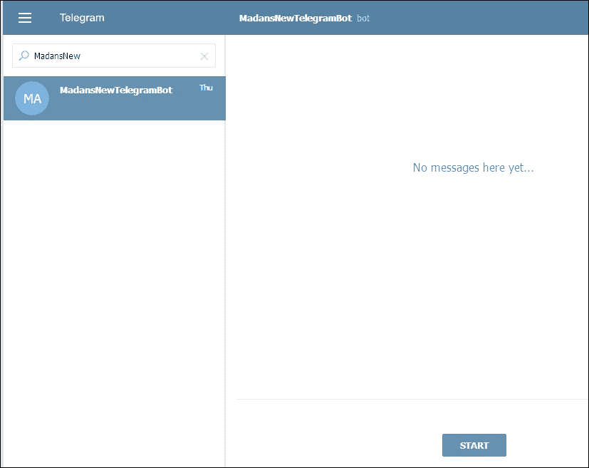

点击 **START** 按钮，并将 `/start` 命令发送到我们的机器人以开始对话。一旦你这样做，你就会看到我们的机器人已经对 `/start` 命令做出了响应。请参考以下屏幕截图：

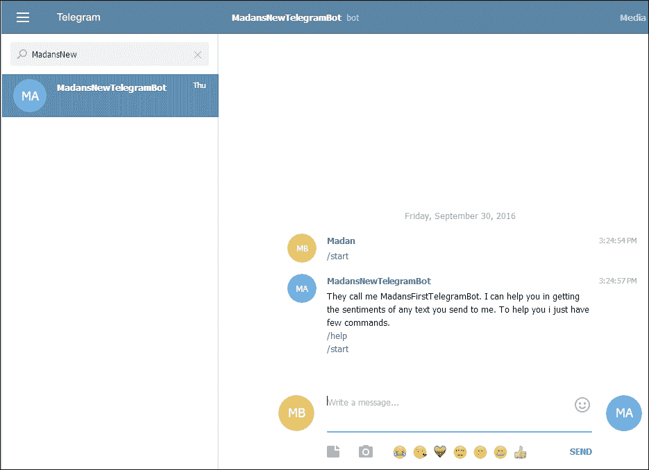

所以，无论我们在 `app.js` 中为 `/start` 命令编写了什么，它都已被执行，并且通过 Telegram 机器人 API，响应显示给了我们。

现在让我们点击 **/help** 命令或输入 `/help` 以启动我们的机器人。我们的机器人将对 `/help` 命令做出以下响应，这是我们将其集成到我们的 Node.js 程序中的。

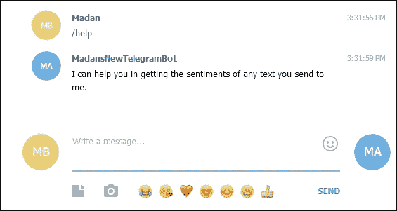

由于我们的 Node.js 程序 `app.js` 在幕后运行，我们的机器人根据 `app.js` 中编写的程序来响应我们的命令。

## 构建情感分析机器人

在构建了一个非常基础的 Telegram 机器人之后，让我们为 Telegram 构建一个情感分析机器人。在 Telegram 的上下文中，机器人对于内容或媒体监控非常有用。机器人实际上可以分类 Telegram 用户与他人分享的术语或句子。了解这一点后，我们将使用 Node.js 构建一个情感分析机器人。

对于情感分析，我们将使用 Node.js 的情感分析包。Sentiment 是一个 Node.js 模块，它使用 AFINN-111 词表对输入文本进行情感分析。这个包可以在[`www.npmjs.com/package/sentiment`](https://www.npmjs.com/package/sentiment)找到。

为了安装它，让我们确定我们的代码位置：

```js
cd C:\Users\Owner\NodeJS_Bots_Packt\telegrambot

```

然后运行以下 npm 命令：

```js
npm install sentiment --save 

```

你应该会看到类似以下的内容：


这样，我们就准备好将我们的 Node.js 代码连接起来，以使用情感分析包。让我们打开我们的 Node.js 代码，并包含以下代码行：

```js
var sentiment = require('sentiment'); 

```

如我们所知，我们的机器人有许多命令，例如`/start`和`/help`；在类似的基础上，我们还有一个用于情感分析的额外命令。这个命令是`/sentiments`。

这里的想法是，一旦你向我们的机器人发送`/sentiments`命令，机器人将确认你的意图，并要求你发送一个术语或一个句子。在收到一个术语或一个句子后，机器人将使用我们 Node.js 程序中连接的情感包进行情感分析。然后机器人将回复情感分析得分。

我们更新的`app.js`应该看起来像这样：

```js
var telegramBot = require('node-telegram-bot-api'); 
var sentiment = require('sentiment'); 

var token ='267449059:AAGzHJFlDkzOG5SxyOJJT2yHsiC06Ut6ySE'; 

var api = new telegramBot(token, {polling: true}); 

api.onText(/\/help/, function(msg, match) { 
  var fromId = msg.from.id; 
  api.sendMessage(fromId, "I can help you in getting the sentiments of any text you send to me."); 
}); 

api.onText(/\/start/, function(msg, match) { 
  var fromId = msg.from.id; 
  api.sendMessage(fromId, "They call me MadansFirstTelegramBot. " +  
    "I can help you in getting the sentiments of any text you send to me."+ 
    "To help you i just have few commands.\n/help\n/start\n/sentiments"); 
}); 

var opts = { 
  reply_markup: JSON.stringify( 
    { 
      force_reply: true 
    } 
  )}; 

//sentiment command execution is added here 
api.onText(/\/sentiments/, function(msg, match) { 
  var fromId = msg.from.id;   
  api.sendMessage(fromId, "Alright! So you need sentiments of a text from me. "+ 
    "I can help you in that. Just send me the text.", opts) 
  .then(function (sended) { 
    var chatId = sended.chat.id; 
    var messageId = sended.message_id; 
    api.onReplyToMessage(chatId, messageId, function (message) { 
      //call a function to get sentiments here... 
      var sentival = sentiment(message.text); 
      api.sendMessage(fromId,"So sentiments for your text are, Score:" + sentival.score +" Comparative:"+sentival.comparative); 
    }); 
  });                                                    
}); 

console.log("MadansFirstTelegramBot has started. Start conversations in your Telegram.");

```

现在我们来看看更新的`app.js`代码。

首先，我们在基本机器人代码中添加了对情感包的引用，如下所示：

```js
var sentiment = require('sentiment'); 

```

我们还修改了`/start`命令，以包括新的命令`/sentiments`。

然后，我们添加了当向机器人发送`/sentiments`命令时应执行的实际逻辑。在触发此命令时，机器人将确认意图，并要求你发送一些文本，一个术语或一个句子，如下所示：

```js
api.sendMessage(fromId, "Alright! So you need sentiments of a text from me. "+ 
  "I can help you in that. Just send me the text.", opts) 

```

一旦我们向机器人发送一些文本，机器人将回复我们的消息，包含已发送文本的情感分析。这个特定的逻辑如下：

```js
 api.onReplyToMessage(chatId, messageId, function (message) { 
      //call a function to get sentiments here... 
      var sentival = sentiment(message.text); 
      api.sendMessage(fromId,"So sentiments for your text are, Score:" +   
        sentival.score +" Comparative:"+sentival.comparative); 
    }); 

```

在前面的代码中，一旦机器人收到文本，就会调用`sentiment()`函数，并将文本作为`message.text`传递以获取情感。

情感分析结果以一个名为`sentival`的对象返回。这个`sentival`对象包含了已传递文本的情感得分和比较值。这些值通过以下代码行返回给用户：

```js
api.sendMessage(fromId,"So sentiments for your text are, Score:" + sentival.score +" Comparative:"+sentival.comparative); 

```

现在我们运行我们的 Node.js 程序，开始与机器人进行对话。

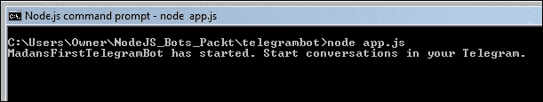

现在我们更新的代码正在运行，让我也启动我的 Telegram 网页版，并开始与我的更新版机器人进行对话。

我已经搜索并添加了我的机器人。屏幕应该看起来像这样：


点击**开始**按钮，`/start`命令将被发送到我们的机器人以开始对话。一旦完成，你会看到我们的机器人已经对`/start`命令做出了回应。`/start`命令的回应中也提到了新添加的命令`/sentiments`。请参考以下屏幕截图：

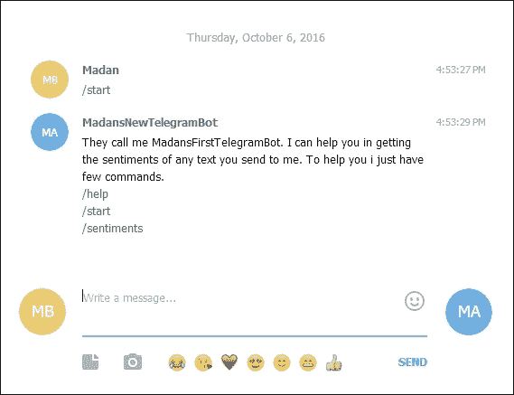

点击`/start`命令的响应中的**/sentiments**链接。这将向我们的机器人发送一个`/sentiments`命令，机器人将如下回应：

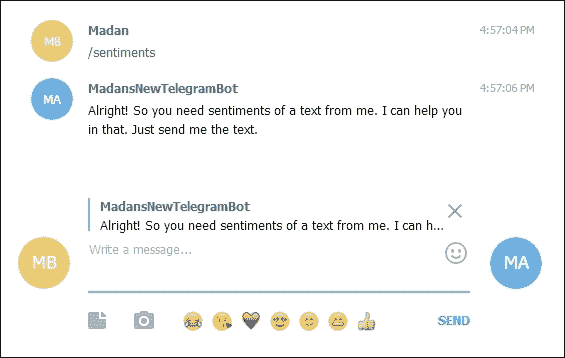

因此，这里，机器人要求用户发送文本作为消息；作为回应，机器人将分享用户发送的消息的情感。现在让我们在**写消息...**中写下消息`Bots are awesome!`，然后按回车键或点击**发送**。不要关闭机器人显示的小弹出窗口，其中包含一个关闭按钮。

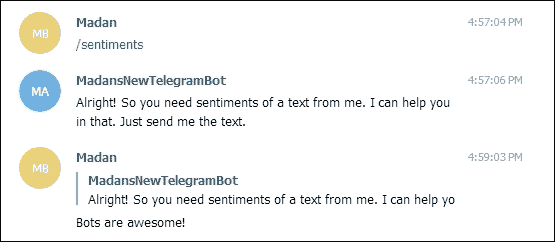

立即，机器人将回应你文本情感的分析得分和比较值，如下所示：

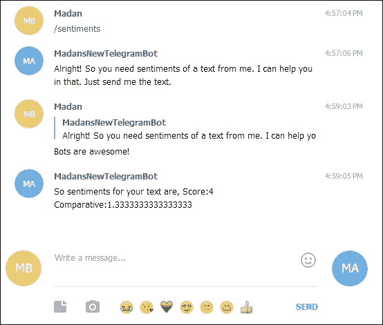

因此，我们输入了文本`Bots are awesome!`，作为回应，机器人给我们发送了一个带有**得分：4**和**比较：1.33**的情感分析结果。对于发送给机器人的文本，得分值为正值，机器人向我们展示了积极的观点。

现在要获取新术语的情感，再次向我们的机器人发送`/sentiments`命令。

机器人将再次确认意图，并要求我们分享一些文本。现在让我们发送文本`The food was very bad.`，看看机器人会返回什么。

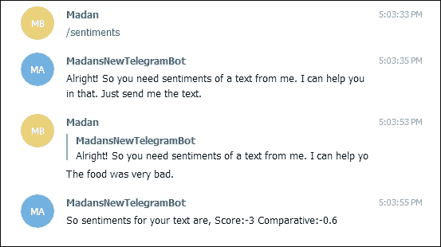

我们输入了文本`The food was very bad`。作为回应，机器人给我们发送了一个带有**得分：-3**和**比较：-0.6**的情感分析结果。这样，机器人向我们展示了文本中的负面观点。

# 摘要

我们在学习如何构建 Telegram 机器人以及如何利用内置的智能实现良好的对话体验的过程中度过了一段有趣的旅程。

总结来说，我们看到了如何为 Telegram 新手创建账户。在此基础上，我们还使用了一种有趣的方法，通过 BotFather 创建我们自己的机器人。BotFather 是一个管理所有其他 Telegram 机器人的 Telegram 机器人。

在创建我们的机器人后，我们使用 npm 包将其集成到 Node.js 程序中，并为我们的机器人聊天构建了一些基本智能。

最后，我们希望我们的机器人能够提供情感分析功能，因此我们研究了情感分析的基础知识。为了进行情感分析，我们使用了 npm 的情感分析包，并丰富了我们基本的机器人，使其能够提供情感分析。我们的机器人主要是那种需要开启聊天会话然后通过发送命令来利用机器人功能的一种类型。还有一种 Telegram 机器人类型，即内联机器人。进一步探索 Telegram 内联机器人留给了读者。

希望这一章能让你对 Telegram 机器人有所了解，以及我们如何利用 Node.js 和 Telegram 机器人 API 来增强它们，从而在 Telegram 内提供更丰富的对话体验。在下一章中，我们将探讨如何构建一个 Slack 机器人。对于那些不了解 Slack 的人来说，Slack 是一款专门为团队协作而设计的实时消息应用。我们实际上将构建一个 Slack 机器人，它将帮助我们根据用户请求在文档库中定位文档。

继续探索吧。
