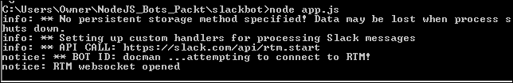

# 第六章. BotKit – Slack 的文档管理代理

在第四章，*Slack 引言机器人*，我们看到了 Slack 是如何成为一个优秀的协作平台。在协作过程中，团队可以直接在 Slack 频道中获取来自*They Said So*服务的励志引言。在本章中，我们将看到一个比仅仅获取引言更为复杂的 Slack 应用案例。在这里，我们将借助**Howdy BotKit**构建一个名为 DocMan 机器人的 Slack 机器人。DocMan 机器人应该能够根据团队成员的请求搜索文档，并提供下载链接。

我们的 Slack 机器人，DocMan，将使用 MongoDB 进行数据存储，并使用 Amazon S3 进行研究文档或文件存储。关于 MongoDB 和 Amazon S3 存储的详细信息将在本章后续部分详细说明。

太棒了！让我们开始使用 Slack 吧。

# 为您的团队设置 Slack

在本节中，我们将开始为团队设置 Slack。

打开浏览器窗口并输入 URL-- [`slack.com`](https://slack.com) 。这将启动如以下截图所示的 Slack 主页：


对于首次访问 Slack 的用户，您首先需要创建您的 Slack 账户，然后才能创建您的团队。已经在 Slack 上的用户可以点击**登录**链接。让我们看看如何创建我们自己的账户。

在**电子邮件地址**处输入您的电子邮件地址。点击**创建新团队**链接，启动下一步，如以下截图所示。Slack 将向您的电子邮件地址发送确认码。输入收到的代码。


输入您的确认码。Slack 将验证该代码，然后启动以下屏幕：


在**您的姓名**和**用户名**字段中提供您的姓名和用户名，然后点击**继续到密码**按钮，启动以下屏幕：


在**密码**处输入您的密码，然后点击**继续到团队信息**按钮，启动以下屏幕：


在**您的团队将如何使用 Slack？**和**您的共享兴趣小组有多大？**的下拉菜单中选择符合您团队目的和意图的选项。点击**继续到团队名称**按钮，启动以下屏幕：


我想将我的团队命名为 Bot Researchers，因此我在**组名称**输入字段中输入了**Bot Researchers**，然后点击**继续到团队域名**按钮，启动以下屏幕：


Slack 会验证您团队域名名的可用性。如果可用，则会显示一条消息说明这一点，如前一张截图所示。现在点击**创建团队**按钮。

下一个屏幕是**发送邀请**，我现在将跳过这一步，直接进入 Bot Researchers Slack 团队的欢迎屏幕。屏幕将如以下截图所示：


在前一张截图中，您可能已经注意到名称**slackbot**。Slack 使用名为 slackbot 的机器人来问候我们，并在有任何问题时帮助我们。这是在聊天窗口本身教育用户的一个很好的机器人应用。

我们现在已在 Slack 上注册并创建了自己的团队。现在我们将为这个团队开发我们的机器人。

## 设置 Slack 机器人

作为 botresearcher 群组成员，我希望我的机器人提供所有与机器人相关的文档信息。这个机器人被称为**DocMan**。现在，要创建 Slack 中的新机器人，只需访问位于[`botresearchers.slack.com/services/new/bot`](https://botresearchers.slack.com/services/new/bot) 的网站。

确保您已经登录到您的 Slack 群组。这里我已经登录到我的群组，[`botresearchers.slack.com`](https://botresearchers.slack.com) 。由于您已经登录，这将导航到**机器人** | **新配置**屏幕，如以下截图所示：


让我们输入**用户名**为`@docman`，然后点击**添加机器人集成**按钮。Slack 将要求为此机器人提供额外的配置信息，如以下截图所示：


看一下**集成设置**下的**API 令牌**部分。我们的机器人将使用此令牌与 API 通信。

机器人用户令牌可以连接到实时流式 API 并执行活动，例如发布消息，因此应避免在公共代码仓库中分发此令牌。

请参考以下截图。您可以在**此机器人做什么**输入字段中输入此机器人的行为参数：


这里，我已输入**提供有关机器人研究的信息和文档**。

现在点击**保存集成**按钮以保存我们的机器人的配置信息。信息将被保存，用户将在屏幕顶部收到通知。

现在，让我们通过 URL [`botresearchers.slack.com/messages`](https://botresearchers.slack.com/messages) 返回我们的群组。您将在**直接消息**部分看到**docman**。点击名称**docman**以查看聊天消息屏幕，如以下截图所示：


现在，我们的机器人正在显示其用户名为 **@docman**，描述为 **提供有关机器人研究的信息和文档**。我们是在配置时提供这些信息的。目前，这个机器人不会对我们的任何消息做出响应，因为它还没有被编程。此外，机器人的状态设置为 **离线**。

总结到目前为止，我们已经创建了我们的 Slack 群组，并创建了我们的 Slack 机器人。我们还了解了如何配置这个机器人。在下一节中，我们将看到如何将一些智能连接到我们的裸机机器人。

## Botkit 和 Slack

**Botkit** 是一个来自 **Howdy** ([`howdy.ai/botkit`](https://howdy.ai/botkit)) 的免费开源工具包，用于将机器人与 Slack 等消息平台集成。Botkit 提供了许多功能，帮助开发者构建两种类型的机器人集成，既适用于个人团队，也适用于使用 *Slack Button* 的其他团队。

## 使用 Botkit 和 Node.js 创建我们的第一个 Slack 机器人

让我们从安装 Botkit 开始，在 Node.js 中连接我们的机器人。

让我们在本地驱动器中创建一个文件夹，以便从命令提示符存储我们的机器人：

```js
mkdir slackbot
cd slackbot

```

假设我们已经安装了 Node.js 和 NPM，让我们创建并初始化我们的 `package.json`，它将存储我们的机器人依赖项和定义：

```js
npm init

```

一旦你通过了 `npm init` 选项（这些选项非常容易遵循），你将看到以下截图类似的内容：


你将在你的项目文件夹中看到结果；这是你的 `package.json` 文件：


让我们从 NPM 安装 `botkit` 包。这个包可以在 [`www.npmjs.com/package/botkit`](https://www.npmjs.com/package/botkit) 找到。

为了安装它，运行以下 `npm` 命令：

```js
npm install --save botkit

```

你应该会看到类似以下的内容：


完成这些后，下一步是更新你的 `package.json` 以包括 `"engines"` 属性。使用文本编辑器打开 `package.json` 文件，并按以下方式更新它：

```js
"engines": { 
    "node": ">=5.6.0" 
} 

```

然后，你的 `package.json` 应该看起来像这样：


让我们创建 `app.js` 文件，这是我们机器人的入口点，正如在设置节点包时提到的。

我们的 `app.js` 应该像以下代码片段所示：

```js
var Botkit = require('Botkit'); 
var os = require('os'); 

var controller = Botkit.slackbot({ 
    debug: false, 
}); 

var bot = controller.spawn({ 
    token: "<SLACK_BOT_TOKEN>" 
}).startRTM(); 

controller.hears('hello',['direct_message','direct_mention','mention'],function(bot,message) { 
  bot.reply(message,'Hello there!'); 
}); 

```

记住，我们的机器人 DocMan 仍然处于非活动状态，其状态为离线，这是我们已经在 Slack 群组中看到的。

现在，让我们运行我们的 Node.js 程序，看看它在 Slack 中的样子，并开始与我们的机器人进行基本对话：


现在，如果你查看控制台，你将看到，借助令牌，我们的机器人已经开始通过 WebSocket 与实时消息 API 进行通信。

现在我们来看看我们的 Slack 群组。现在，我们的 Slack 群组将显示我们的机器人 **@docman** 在 **直接消息** 下，状态为活跃，如下面的截图所示：


现在，我们的机器人已经准备好进行对话了。让我们对机器人说`Hello`并看看它会说什么：


我们的机器人对我们的消息做出了“Hello there!”的回应。所以，我们的机器人在 Node.js 和 Botkit 中使用实时消息 API 的连接是成功的。

现在我希望我的机器人成为 #general 通道的一部分，这是我们组的默认通道。在消息框中输入名称 `@docman` 并按回车键。立即 **slackbot** 将引导我们邀请 `@docman` 加入 #general 通道，如下面的截图所示：


点击 **邀请他们加入** 链接以将我们的机器人加入此通道。在弹出的窗口中，只需点击 **是的，邀请** 他们按钮。参考以下截图：


在邀请他们之后，Slack 通道 **#general** 将显示一个通知，说明我们的机器人已加入该组，如下面的截图所示：


这样你就可以将我们的机器人邀请到任何通道中，你还可以通过提及机器人的名称在该通道中与机器人开始对话。我在 **#general** 通道中通过一条信息读取 **@docman Hello** 的消息提及了机器人的名称。我们的机器人的回复如下所示：


## 增强我们的 DocMan 机器人

在构建了一个非常基础的 Slack 机器人之后，让我们来增强我们的 **DocMan** 机器人。假设，根据团队成员的请求，DocMan 机器人应该能够搜索特定的文档，并且能够提供下载链接。

让我来解释一下这将如何工作。Bot Researchers Slack 团队的成员将在各自的 Slack 通道内进行沟通。现在让我们假设其中一位成员需要关于研究计划清单文档的信息。该团队成员将通过提及我们的机器人名称输入一些关键词，如 `Research Planning` 或 `Checklist` 或 `Template`。DocMan 将在 MongoDB 数据库中进行关键词搜索，并展示搜索到的文档。MongoDB 将只包含这些文档的链接以及其他将被搜索的文档的元数据或属性。实际的文档将存储在 Amazon S3 存储中。

在深入细节之前，让我简单介绍一下 MongoDB 和 Amazon S3 存储的相关信息。

### 什么是 MongoDB？

日复一日，NoSQL 的使用正在飞速增长。MongoDB 就是其中之一。NoSQL 数据库类型有很多，例如 `文档存储`、`键值存储`、`列存储` 和 `图存储`，仅举几例。

MongoDB 是 NoSQL 中的文档存储类型，其中数据以 JSON 文档的形式存储。简而言之，MongoDB 是一个开源的、高度可扩展的、高性能的 NoSQL 数据库。

我使用 MongoDB 的原因是因为我想向你展示我们如何使用 MongoDB 这样的 NoSQL 数据库来通过元数据或属性值搜索和存储文档链接。然而，不要混淆我们正在搜索的文档或文件与 MongoDB 存储的材料。MongoDB 存储的就像一个单独的记录，格式为 JSON。就像我们的关系型数据库中数据存储在表和记录中一样，MongoDB 在集合和 JSON 文档中存储数据。实际的文档或文件将存储在 Amazon S3 上，而只有链接将存储在 MongoDB 中。

为了我们的 DocMan 机器人的增强，确保你根据你的机器版本（32 位或 64 位）在你的机器上安装了 MongoDB。详细的安装步骤可以从 [`docs.mongodb.com/manual/administration/install-community/`](https://docs.mongodb.com/manual/administration/install-community/) 获取。

### 我们为 DocMan 机器人使用 MongoDB 数据库

假设你在你的机器上已经安装并运行了 MongoDB，让我们按照以下步骤为我们的机器人设置一个带有示例数据的数据库。

#### MongoDB shell

使用命令提示符定位你的 MongoDB 安装中的 `bin` 目录，并使用 `mongo.exe` 运行 MongoDB shell。如果一切顺利，你将看到以下屏幕：


#### 创建数据库

让我们使用以下截图所示的命令创建一个名为 `BotDB` 的新数据库：


现在，为了验证数据库是否已创建，使用 `show dbs` 命令。你将在列表中看到 `BotDB` 的名称，如下面的截图所示：


#### 创建一个参考文档集合

为了存储文档、元数据和属性，让我们使用以下命令创建一个名为 `ReferenceDocuments` 的集合：

```js
db.createCollection("ReferenceDocuments")

```

你可以使用 `show collections` 命令来验证新创建的集合，如下面的截图所示：


#### 为我们的 DocMan 机器人创建数据

我们的 `BotResearcher` 组需要一些文档和模板用于日常使用。这些文档可以在以下截图中看到：


作为示例，我将使用 `Research Planning Checklist` 来展示我们将如何在一个 MongoDB 集合中存储该文档的元数据。请参考以下 JSON 代码以获取该文档的元数据：

```js
{ 
   "title": "Research Planning Checklist", 
   "description": "This excel sheet provides guidelines for better research plan...", 
   "version": "1.1", 
   "url": "<Document URL goes here...>", 
   "keywords": ["Plan","Research Plan","Checklist","SWOT"] 
} 

```

我们将使用以下命令在 `ReferenceDocuments` 集合中存储 `title`、`description`、`version`、`url` 和关键词：

```js
>db.ReferenceDocuments.insert({
"title": "Research Planning Checklist","description": "This excel sheet provides guidelines for better research plan...","version": "1.1","url": "<Document URL goes here...>","keywords": ["Plan","Research Plan","Checklist","SWOT"] })

```

在插入前面的记录后，你将看到以下消息作为 `WriteResult({"nInserted":1})`：


这样，我们可以为所有我们的文档在 MongoDB 中创建所有记录。

#### 搜索索引

由于文档可以通过多个关键词进行搜索，因此我们为每个文档存储关键词在一个数组中。当团队成员搜索文档时，他们将使用关键词。我们将使用以下命令对这些关键词应用索引：

```js
>db.ReferenceDocuments.createIndex({keywords:"text"})

```

执行命令后，您将看到以下输出：


#### 搜索查询

一旦我们的索引创建完成，让我们根据我们输入的关键词验证我们的搜索是否工作。让我们在 MongoDB shell 上执行以下命令：

```js
db.ReferenceDocuments.find({$text:{$search:"template"}},{limit:3})

```

执行 `search` 查询后，您应该看到以下结果：


总结一下，我们为我们的机器人创建了一个新的数据库来存储它搜索的文档的元数据。我们添加了一个新的集合并添加了一些示例文档。我们还对关键词列应用了文本索引，以便能够使用关键词进行搜索。

现在，让我们看看我们如何将数据库与 Node.js 连接起来。

### 什么是 MongoJS？

MongoJS 是一个用于连接到 MongoDB API 的 Node.JS 库。使用这个库，我们将与我们的 MongoDB 数据库建立连接并根据输入的关键词查询文档。

### 将 DocMan 机器人连接到 MongoDB

让我们回到我们的 `Slackbot` 目录并从 NPM 安装 `mongojs` 包。这个包可以在 [`www.npmjs.com/package/mongojs`](https://www.npmjs.com/package/mongojs) 找到。

为了安装它，运行以下 `npm` 命令：

```js
npm install mongojs

```

您应该会看到类似以下的内容：


让我们修改我们的 `app.js` 文件，以便我们可以通过 `Mongojs` 库访问 MongoDB API。

我们的 `app.js` 应该是这样的：

```js
var Botkit = require('Botkit'); 
var os = require('os'); 

var mongojs = require('mongojs'); 
var db = mongojs('127.0.0.1:27017/BotDB',['ReferenceDocuments']); 

var controller = Botkit.slackbot({ 
    debug: false 
}); 

var bot = controller.spawn({ 
    token: "<SLACK_BOT_TOKEN>" 
}).startRTM(); 

controller.hears('hello',['direct_message','direct_mention','mention'],function(bot,message) { 
  bot.reply(message,'Hello there!'); 

  db.ReferenceDocuments.find({title:"Newsletter Template"},function (err, docs) { 
     bot.reply(message,'I have a document with title:'+ docs[0].title); 
  }) 

}); 

```

让我们看看这个基本的代码，其中 `mongojs` 如前代码片段所示连接。我们通过以下行通过 `mongojs` 连接到 MongoDB 数据库：

```js
var mongojs = require('mongojs'); 
var db = mongojs('127.0.0.1:27017/BotDB',['ReferenceDocuments']); 

```

这里，MongoDB 在我的机器上本地托管，所以使用的名称是 `127.0.0.1`，它监听端口 `27017`。这个 IP 地址和端口对于您的机器可能不同，所以在实现您的机器人时，请确保您使用您机器的 IP 地址和端口用于 MongoDB。在 MongoDB 中，我们连接到 `BotDB` 数据库和一个名为 `ReferenceDocuments` 的集合。

要查询 `ReferenceDocuments` 中的一个文档，以下代码被使用：

```js
db.ReferenceDocuments.find({title:"Newsletter Template"},function (err, docs) { 
     bot.reply(message,'I have a document with title:'+ docs[0].title); 
  }) 

```

让我们运行修改后的代码：



回到我们的 Bot Researchers Slack 群组，通过直接消息对我们的修改后的 docman 说 `hello`。您也可以向 docman 发送提及，但这次我将使用直接消息。

当我直接向 `hello` 发送消息到 **docman** 时，docman 查询了 `BotDB` 数据库，并从 `ReferenceDocuments` 集合中返回了一个文档的标题。有关更多详细信息，请参考以下截图：


这显示了我们可以如何建立 MongoDB 连接并使用`mongojs`查询数据。

### Amazon S3 存储

**Amazon 简单存储服务**（**Amazon S3**）是来自**Amazon Web Services**（**AWS**）的基于云的数据存储系统。我们可以使用 Amazon S3 存储任何数量的数据。Amazon S3 将数据作为对象存储在桶中。一个对象可以是一个文档或文件。在我们的 DocMan 环境中，所有由 Bot Researchers 团队成员搜索的实际文档或文件都存储在 Amazon S3 中。在未来，这些文件或文档可以是任何类型，例如媒体或任何大小的办公文件。此外，每个桶都可以有访问控制，以决定谁可以访问、删除和从桶中创建对象。考虑到这些要求，Amazon S3 非常适合我们的 DocMan 文档存储。

#### Amazon S3 控制台

我有我的 Amazon AWS 账户。使用该账户，我已登录到我的 Amazon S3 控制台。此控制台在以下截图中可见：


对于 AWS 新手，可以参考[`aws.amazon.com/`](https://aws.amazon.com/)的信息。

#### 创建桶

从前面的 Amazon S3 控制台，点击**创建桶**按钮以启动**创建桶**界面，如下截图所示：


在创建我的桶时，我将其**桶名**设置为**botdocuments**，并将**区域**选为**俄勒冈州**。确保你使用的是小写字母输入**桶名**。点击**创建**按钮来创建你的桶。

你的桶将在**所有桶**表中显示：


现在点击**名称**列下显示的桶名，这样我们就可以显示一个桶视图来上传和管理此桶内的文档。

#### 将文档存储在桶中

一旦你从**所有桶**视图中选择桶名，你将看到以下屏幕：


现在，要上传此桶中的文档，点击**上传**按钮，并使用以下截图来上传文档：


我将使用拖放功能上传我的文件。一旦你拖放了你想要上传的所有文件，点击**开始上传**来上传你的文件。一旦所有文件都上传完毕，桶将显示如下：


### 标记文档为公开

仅为了演示目的，我们将将这些文档标记为公开。

这样，我们的`BotResearchers`小组可以轻松访问和从 Amazon S3 存储中下载这些文档。让我们按照以下步骤标记其中一份文档为公开。

选择一个文档，从**操作**中，在菜单中选择**公开**选项：


此选项将所选文档标记为公开。现在我们需要一个公开的 URL，以便我们可以在 MongoDB 数据库中更新此文档的 URL。要再次获取公开 URL，请选择一个文档，然后从**操作**菜单中选择**属性**菜单项。

这将显示所选文档的所有属性，如下面的截图所示：


从属性中，参考**链接**属性。这是文档的公开 URL。

以这种方式，将所有文档标记为公开并复制它们的 URL。将这些 URL 更新到我们的 MongoDB 数据库中。

### 使用 Amazon S3 文档链接更新 MongoDB 数据

让我们再次打开 Mongo shell，并使用以下命令选择`BotDB`：

```js
Use BotDB
db.ReferenceDocuments.update(
 { title: "Competitive analysis using SWOT"},
 { $set:
 {
 url: "<YOUR AMAZON S3 URL FOR THIS DOCUMENT>"
 }
 }
)

```

更新成功后，您将在 mongo shell 中看到已更新的记录数。按照相同的步骤更新所有其他文档的 URL 列，以更新它们的 Amazon S3 公开 URL。这样，从后端数据的角度来看，我们的 bot docman 就准备就绪了。

### 将所有这些连接起来

为了将所有这些连接起来，让我们修改之前的`app.js`，如下面的代码片段所示：

```js
var Botkit = require('Botkit'); 
var os = require('os'); 

var mongojs = require('mongojs'); 
var db = mongojs('127.0.0.1:27017/BotDB',['ReferenceDocuments']); 

var controller = Botkit.slackbot({ 
    debug: false 
}); 

var bot = controller.spawn({ 
    token: "<SLACK_BOT_TOKEN>" 
}).startRTM(); 

controller.hears('hello',['direct_message','direct_mention','mention'],function(bot,message) { 
  bot.reply(message,'Hello there!'); 
}); 

controller.hears(['docs','template','research documentation','documents'], 
                 ['direct_message','direct_mention','mention'],function(bot,message) { 
  bot.startConversation(message, askForKeywords); 
}); 

askForKeywords = function(response, convo) { 
  convo.ask("Pl. type the word or keywords for document search.", function(response, convo) { 
    convo.say("Awesome! Wait for a moment. Will search documents for word(s) *" + response.text +"*"); 
    searchDocuments(response, convo); 
    convo.next(); 
  }); 
} 

searchDocuments = function(response, convo) { 
var qtext ="""+response.text+""";     
    db.ReferenceDocuments.find({$text:{$search:qtext}},{},{limit:3},function (err, docs) { 
         var attachments = [];   
         docs.forEach(function(d) {  
            var attachment= { 
                "title": d.title, 
                "title_link": d.url, 
                "text": d.description, 
                "color": '#3AA3E3', 
                "footer": "From Amazon S3 | Version " +d.version                 
                };       
             attachments.push(attachment); 
           }); 

        convo.say({ 
            text: '*Document(s):*', 
            attachments: attachments, 
        }) 
    }); 
} 

db.on('error', function (err) { 
    console.log('Database error', err) 
}) 

db.on('connect', function () { 
    console.log('Database connected') 
}) 

```

### 代码理解

我已经解释了如何使用`mongojs`连接到 MongoDB。现在让我们关注如何在 docman 中实现对话体验：

```js
controller.hears(['docs','template','research documentation','documents'], 
                 ['direct_message','direct_mention','mention'],function(bot,message) { 
  bot.startConversation(message, askForKeywords); 
}); 

```

在前面的代码片段中，用户可以使用关键字`'docs'`、`'template'`、`'research documentation'`和`'documents'`与 docman 开始对话。

收到直接消息或提及后，机器人将使用`bot.startConversation()`开始对话。此函数将调用相关的对话子函数`askForKeywords()`。

机器人将要求我们提供基于哪些文档需要搜索的关键字，并将调用子函数在 MongoDB 中实际搜索文档。`askForKeywords()`的实现可以参考以下代码片段：

```js
askForKeywords = function(response, convo) { 
  convo.ask("Pl. type the word or keywords for document search.", function(response, convo) { 
    convo.say("Awesome! Wait for a moment. Will search documents for word(s) *" + response.text +"*"); 
    searchDocuments(response, convo); 
    convo.next(); 
  }); 
} 

```

在前面的代码中，`convo.next()`函数告诉我们的被调用机器人继续对话。这一步是必需的，否则我们的对话将会中断。

存在一个最终的子函数`searchDocuments()`，它实际上在 MongoDB 中搜索文档，并将前三个文档作为对话的一部分返回。

参考以下代码实现`searchDocuments()`：

```js
searchDocuments = function(response, convo) { 
var qtext ="""+response.text+""";     
    db.ReferenceDocuments.find({$text:{$search:qtext}},{},{limit:3},function (err, docs) { 
         var attachments = [];   
         docs.forEach(function(d) {  
            var attachment= { 
                "title": d.title, 
                "title_link": d.url, 
                "text": d.description, 
                "color": '#3AA3E3', 
                "footer": "From Amazon S3 | Version " +d.version                 
                };       
             attachments.push(attachment); 
           }); 

        convo.say({ 
            text: '*Document(s):*', 
            attachments: attachments, 
        }) 
    }); 
} 

```

在前面的代码中，一旦搜索查询返回数据，可能会有单个或多个文档，因此我们正在迭代结果并将它们组合成 JSON 格式。一旦完成 JSON 格式化，机器人将调用`convo.say()`函数来发送带有搜索文档的消息。

Slack 有一些关于消息和附件编写的指南。这些指南可以在[`api.slack.com/docs/messages`](https://api.slack.com/docs/messages)中查阅。

现在，让我们开始我们与增强的 Slack 机器人 docman 的伟大对话体验。

首先，在 **# general** 频道中提及 `@docman` 并输入单词 `docs`，如下截图所示：


一旦我们输入了 `docs`，docman 就会要求我们输入文档搜索的单词或关键词。

输入单词作为 `template` 并查看 **docman** 返回的内容：


当我输入了 `template` 关键词时，**docman** 回复说：


它还以 Slack 消息指南中所示的美好优雅的格式回复了搜索到的文档：


现在，从搜索结果中选择一份文档——我选择了一份标题为 **时间线文档** 的文档，并通过我们的 docman 机器人下载了 `Timeline+Document.docx`。

参考以下截图查看下载的文档：


# 摘要

因此，通过 Slack，我们构建了一个机器人，并通过将其智能化来增强了我们团队的协作体验。

总结来说，我们看到了如何从头创建一个 Slack 群组。我们还创建了一个基本的由 Botkit 连接的 Node.js 机器人，并通过邀请机器人进行了基本的直接消息和群组对话。

最后，我们的机器人根据关键词搜索了一些文档，并提供了下载相同文档的链接。

我们的 DocMan 机器人使用 MongoDB 存储文档属性以及可以用于搜索文档的关键词。此外，当用户请求下载文档时，DocMan 会从 Amazon S3 存储中检索实际文档。

希望这一章能为你提供一个端到端解决方案的概述，了解你的机器人如何搜索和定位文档，以及如何从存储位置或文档库中下载它们。你现在应该已经了解到了像 MongoDB 这样的 NoSQL 技术，以及我们如何利用它们进行关键词搜索，以及如何在 Node.js 中与像 Amazon S3 这样的存储位置连接。最重要的是，你现在应该完全清楚我们如何在 Slack 这样的消息平台上将所有这些整合在一起。

太棒了！

在下一章中，我们将探讨如何开发 IRC 机器人，以及我们如何在 Node.js 中连接它们，并帮助我们的开发者将其用于错误跟踪目的。
