# 第七章. Facebook Messenger 机器人，谁休假 - 团队的调度机器人

Facebook 推出了自己的消息平台([`developers.facebook.com/docs/messenger-platform/product-overview`](https://developers.facebook.com/docs/messenger-platform/product-overview))，这使得我们能够通过自定义机器人丰富与其他用户在消息平台上的对话体验。除了仅显示信息外，公司现在可以通过自定义机器人提供新的对话体验方式。这些机器人可以与公司的 Facebook 页面集成。有了这个，该公司的客户或员工可以轻松地在页面上查找信息，同时也可以在 Facebook Messenger 上聊天。

Facebook Messenger 平台 API 不仅可以用来发送消息，还可以用来发送链接、图片、视频、文件和图像。Facebook Messenger 有一个名为秘密消息或对话的功能。这些秘密对话目前仅在 iOS 和 Android 设备上下载的 Messenger 应用中可用。在这些对话中，我们只能发送消息、图片和贴纸。秘密对话不支持群发消息、视频、GIF、视频通话和支付。

最近，我了解到多米诺披萨可以通过 Facebook Messenger 订购！所以，只需聊天，你现在就可以选择披萨，下单，甚至处理支付。在这里，用户在聊天过程中得到了无缝的体验。

在本章中，我们将构建一个 Facebook Messenger 机器人，并增强其安排非工作时间的功能。我们的机器人还将帮助我们发现谁将在何时休假；这一切都将通过一个优雅的基于日历的用户界面来完成。

太棒了！让我们现在开始吧。

# 设置我们的 Facebook Messenger 机器人

Facebook 提供了关于如何设置机器人的优秀文档。您还可以参考[`developers.facebook.com/docs/messenger-platform/guides/quick-start`](https://developers.facebook.com/docs/messenger-platform/guides/quick-start)中提到的步骤。

我们将使用以下步骤来构建一个基本的机器人：

+   为我们的机器人创建一个 Facebook 页面

+   在 Facebook 中创建一个应用

+   在 Node.js 中创建一个基本的 Facebook Messenger 机器人，特别是在 Microsoft Azure 上

+   连接 Facebook 应用和基本机器人

让我们一步一步地开始工作在这些步骤上。

## 我们的 Facebook 基本机器人的页面

首先，登录到 Facebook。您可以使用现有的页面或创建一个新的页面。

我们将实现我们的机器人，使其能够告诉用户谁将休假以及何时休假。让我们通过导航到[`www.facebook.com/pages/create/`](https://www.facebook.com/pages/create/)创建一个名为“Who's Off”的页面。

一旦您点击 URL，您将看到以下屏幕：

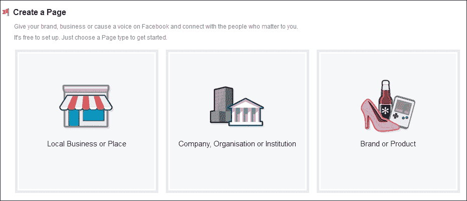

选择页面类型为**公司、组织或机构**。这将显示以下输入屏幕：

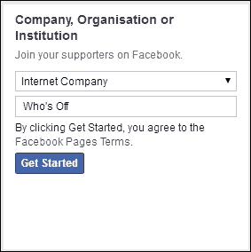

在此页面上提供有关公司类型和名称等信息。

选择**互联网公司**，并将名称设置为`Who's Off`。然后点击**开始**按钮。这将打开一个向导，用于设置公司所有其他属性，例如个人资料信息：

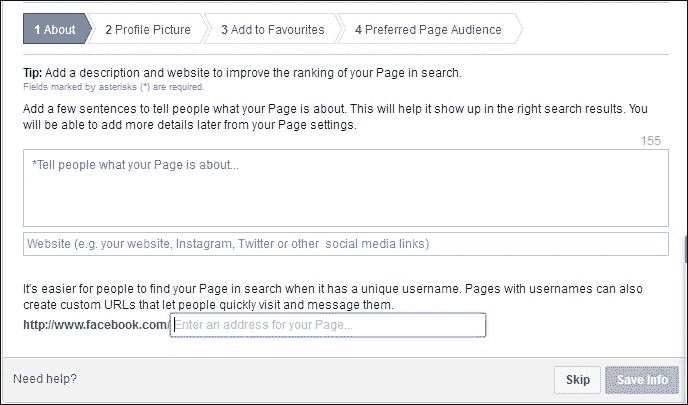

您可以跳过此向导或直接转到最后一个选项卡，**4. 偏好页面受众**，以保存信息。

这将为我们的机器人创建一个 Facebook 页面。它将如下所示：

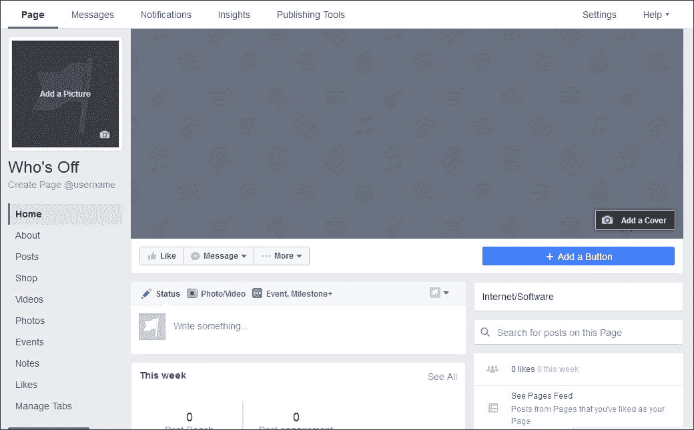

## 为我们的基本机器人创建一个 Facebook 应用

创建页面后，现在让我们通过[`developers.facebook.com/quickstarts/`](https://developers.facebook.com/quickstarts/)创建我们的机器人 Facebook 应用。这将带我们进入一个屏幕，我们可以按照以下方式配置我们的应用：

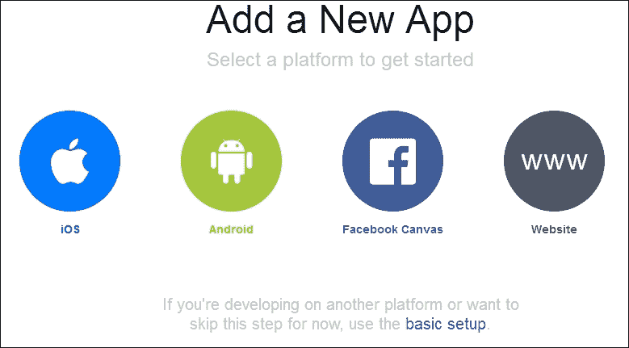

点击**基本设置**以打开弹出窗口并输入以下信息：

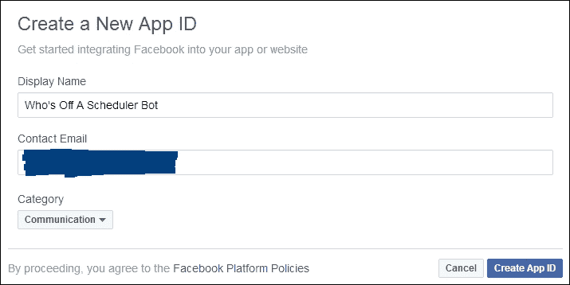

在创建应用 ID 时，将执行以下安全检查：

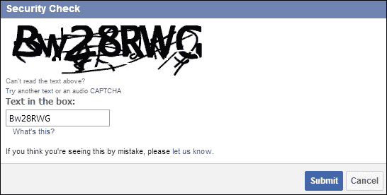

请响应**安全检查**并点击**提交**，按照此屏幕上的说明设置您的 Facebook 应用：

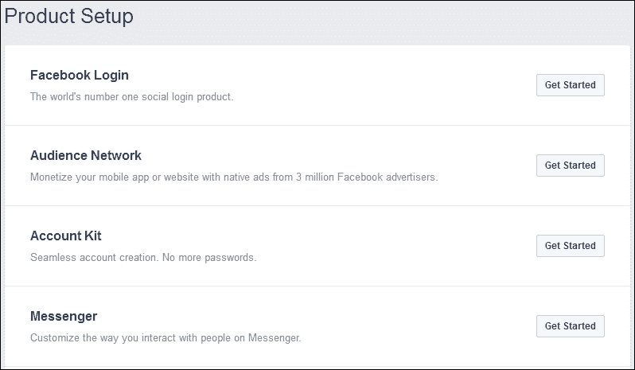

由于我们想要设置一个消息传递服务，请点击**消息传递**中的**开始**按钮。这将带您进入以下屏幕：

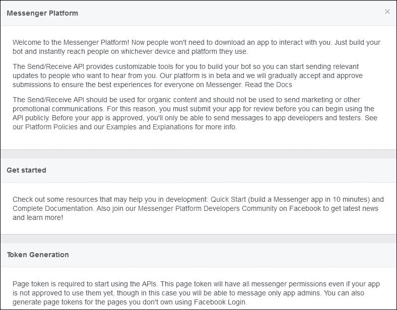

现在在页面中找到名为**令牌生成**的部分，并选择之前创建的 Facebook 页面。这将为所选页面生成一个令牌，如下所示：

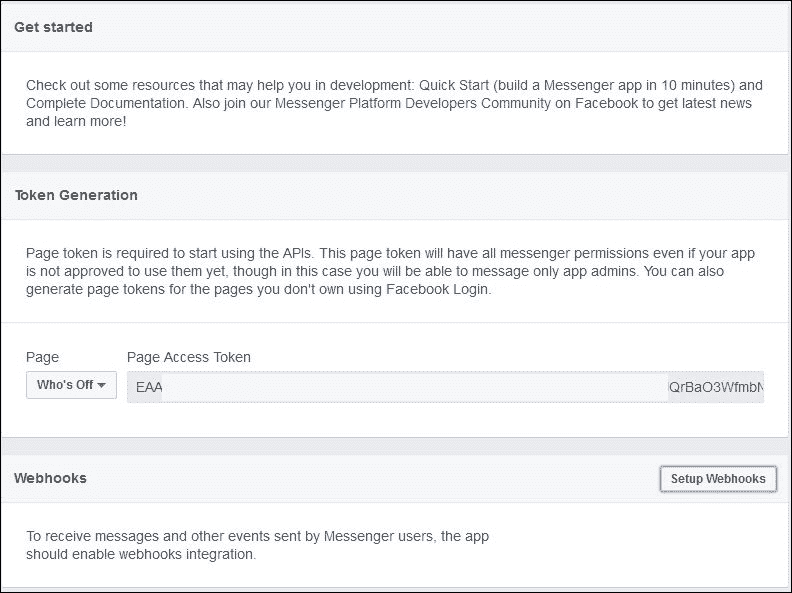

此页面令牌将在与 API 通信时使用。

为了接收用户的消息，我们的 Facebook 应用需要 Webhooks 集成。在我们设置 Webhooks 之前，让我们创建一个 Node.js Facebook Messenger 应用。Facebook Webhook 集成需要我们的机器人应用可以通过 HTTPS 访问。因此，我们需要使用 Microsoft Azure 来完成这项工作。

## 在 Azure 中设置我们的机器人服务器

如前所述，我们需要一个启用 HTTPS 的机器人服务器，以便我们可以在 Facebook 中集成它。我们将在 Microsoft Azure 中构建我们的机器人服务器。

让我们登录到 Azure 门户并定位到**应用服务**以创建一个基于 Node.js 的机器人服务器。参考以下屏幕：

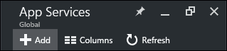

点击**添加**链接以打开以下屏幕。然后，选择**Web + Mobile**选项并搜索一个空的基于 Node.js 的 Web 应用模板，如下所示：

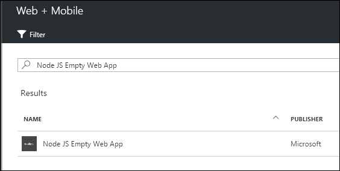

在选择模板为**Node JS Empty Web App**后，点击**创建**按钮以创建基于 Node.js 的站点。下一屏幕将要求你输入站点的名称和资源：

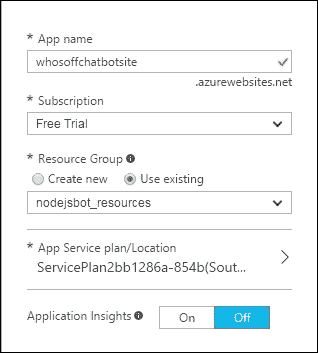

提供所需信息并点击底部的**创建**按钮以创建名为`whosoffchatbotsite.azurewebsites.net`的站点。

一旦创建，你应该会看到以下属性，使用**应用服务**中选定站点的**概览**菜单选项：

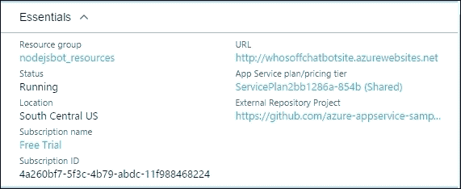

点击`http://whosoffchatbotsite.azurewebsites.net`以检查我们的初始 Node.js 站点的外观或是否存在任何问题：

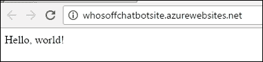

通过这种方式，我们能够在 Microsoft Azure 中创建和运行 Node.js。

在第二章，*让 Skype 为您服务*中，我们探讨了如何使用 Azure 命令行界面创建 Node.js 站点。在本章中，我们已经在 Azure 本身创建了 Node.js 站点；现在，我们将修改基本的 Node.js 站点以适应我们的机器人。

要修改基本的机器人程序，我们首先将使用 git 命令在我们的本地文件系统中克隆模板。然后，我们将对其进行修改并部署到 Microsoft Azure。

让我们从在我们的本地驱动器中创建一个文件夹开始，以便从命令提示符存储我们的机器人程序：

```js
mkdir whosoffchatbot
cd whosoffchatbot

```

现在转到新创建的目录并运行以下命令：

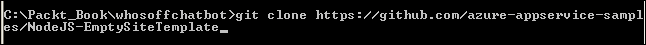

此命令将从远程 URL 克隆我们的站点到本地文件系统。一旦站点被克隆，切换到`NodeJS-EmptySiteTemplate`目录并按照以下方式运行`server.js`：

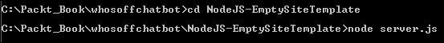

一旦克隆成功，你应该会看到 Node.js 中运行的机器人程序，如下所示：

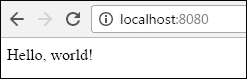

到目前为止，我们已经从一个远程 git 仓库的模板中使用了模板并将其克隆到本地文件系统中。现在，我们将为机器人程序设置自己的 git 位置。原因是，每当我们在我们的机器人程序`server.js`中进行更改时，我们也希望这些更改被部署到 Azure；我们可以使用 git 命令来完成此操作。因此，我们将在 Azure 本身为我们的机器人程序设置本地 git 仓库。

### 在 Azure 中为我们的机器人服务器设置本地 git 仓库

首先，使用**断开连接**菜单选项断开我们程序的远程 git 库：

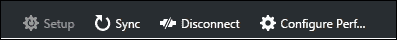

断开连接后，使用**设置**选项为我们的程序设置代码仓库，如下所示：

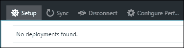

一旦点击**设置**，将启动**部署源**屏幕，如下面的截图所示。

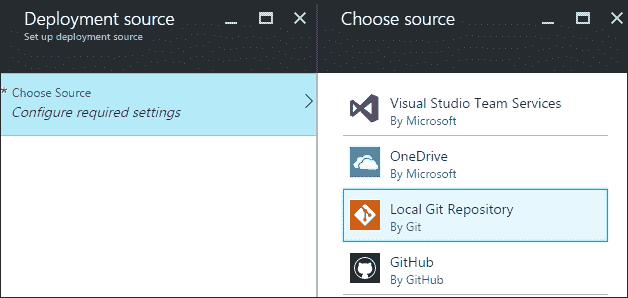

选择**本地 Git 仓库**选项为网站设置基于 git 的仓库。

现在如果您查看网站属性，您将看到已经设置了 git URL 以及 FTP 账户。我们可以使用 git 命令或 FTP 将我们的网站部署到 Azure。请参考以下截图查看新更新的属性：

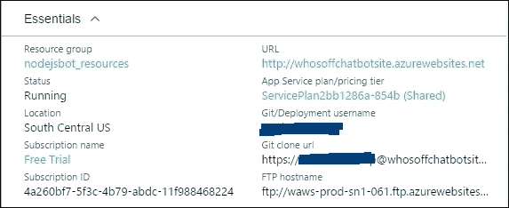

因此，我们在 Azure 中设置了一个 git 仓库，但之前从本地文件系统克隆的站点仍然指向远程 URL。让我们使用以下命令将我们的本地 git 配置指向新创建的 Azure 克隆仓库：

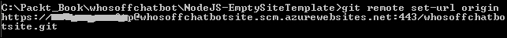

### 修改我们的机器人程序以进行 Facebook 验证

当我们在`server.js`内部克隆机器人程序代码时，以下内容会自动生成：

```js
var http = require('http'); 

http.createServer(function (req, res) { 

    res.writeHead(200, { 'Content-Type': 'text/html' }); 
    res.end('Hello, world!'); 

}).listen(process.env.PORT || 8080); 

```

现在让我们开始修改我们的代码。但在那之前，我们需要安装一些 node 模块；我们可以使用以下命令来完成：

```js
npm install express body-parser request --save

```

`body-parser` npm 模块有助于解析在`req.body`下可用的传入请求。

现在让我们打开我们的`server.js`并按以下方式修改它：

```js
var express = require('express'); 
var bodyParser = require('body-parser'); 
var request = require('request'); 
var app = express(); 

app.use(bodyParser.urlencoded({extended: false})); 
app.use(bodyParser.json()); 

app.get('/', function (req, res) { 
    res.send('This is my Facebook Messenger Bot - Whos Off Bot Server'); 
}); 

app.get('/webhook', function (req, res) { 
    if (req.query['hub.verify_token'] === 'whosoffbot_verify_token') {       
        res.status(200).send(req.query['hub.challenge']); 
    } else { 
        res.status(403).send('Invalid verify token'); 
    } 
}); 

app.listen((process.env.PORT || 8080)); 

```

让我们使用以下命令运行我们的机器人程序：

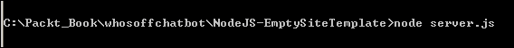

然后打开一个浏览器窗口并访问`http://localhost:8080`：

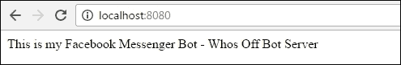

这将表明我们的 Node.js 程序运行良好。现在让我们使用 git 命令将此代码部署到 Azure。这次，所有标记为依赖项的 node 模块（使用`--save`标记），也将被推送到 Azure。有时，在推送代码时可能会遇到超时错误。但再次尝试推送代码；它应该会被部署。

我们需要执行的 git 命令如下：

```js
git add .
git commit -m "First Change to server.js"
git push origin master

```

一旦代码部署到 Azure，浏览网站并检查它是否反映了最新的更改，如下所示：

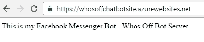

### 设置我们的机器人程序 Webhook 和 Facebook 验证

现在让我们回到我们的 Facebook 应用；我们在令牌生成处停止了。让我们在 Facebook 应用中设置 Webhooks，如下所示：

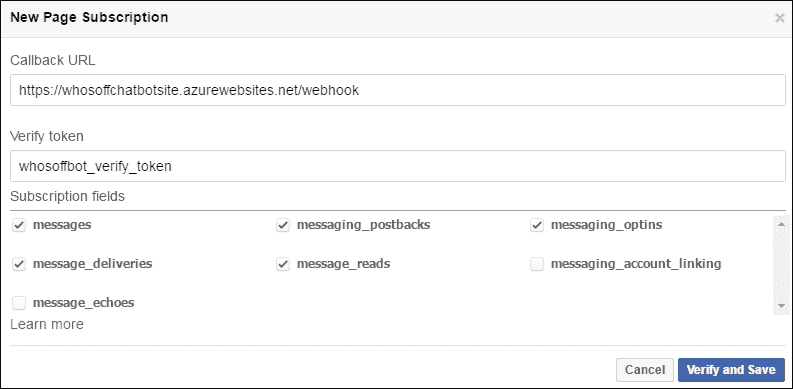

这里需要注意的几个重要事项：

+   **回调 URL**必须可以从 Facebook 访问，并且应该是 HTTPS。

+   使用 Webhook 的**回调 URL**应返回一个令牌，如**验证令牌**中所述。验证该令牌是否与我们在`server.js`中引用的令牌相同，如下所示：

```js
if (req.query['hub.verify_token'] === 'whosoffbot_verify_token') { 

```

代码中提供的`'whosoffbot_verify_token'`令牌应与 Facebook 上的令牌匹配。

一旦您的令牌被验证，您应该会看到以下屏幕：

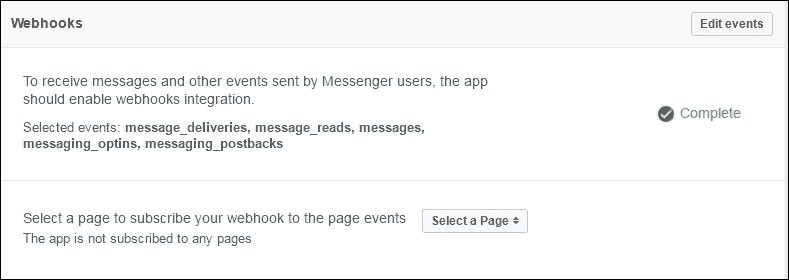

因此，Webhook 已经验证并设置，但我们需要一个页面来订阅这个 Webhook。参考以下屏幕并订阅我们最初创建的 **Who's Off** 页面：

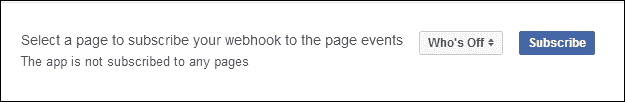

这就是我们如何将我们的基本机器人链接到 Facebook 页面。现在让我们从 Facebook 打开我们的 **Who's Off** 页面，并点击 **消息** 按钮使我们的机器人活跃。您应该在机器人名称前看到一个绿色的点，表示它处于活跃状态。有关详细信息，请参考以下截图：

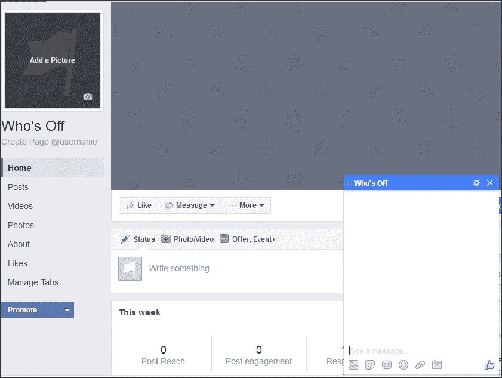

如果您尝试向这个机器人发布任何内容，它将不会做任何事情，因为我们还没有为发布命令编程 Webhooks。现在让我们让我们的机器人在一个聊天窗口中回声用户说的话。为了实现这一点，让我们在 `server.js` 中包含以下代码片段：

```js
app.post('/webhook', function (req, res) { 
   var events = req.body.entry[0].messaging; 
    for (i = 0; i < events.length; i++) { 
        var event = events[i]; 
        if (event.message && event.message.text) { 
            sendMessage(event.sender.id, {text: "Echo: " + event.message.text}); 
        } 
    } 
    res.sendStatus(200); 
}); 
function sendMessage(recipientId, message) { 
    request({ 
        url: 'https://graph.facebook.com/v2.6/me/messages', 
        qs: {access_token: <PAGE_ACCESS_TOKEN>}, 
        method: 'POST', 
        json: { 
            recipient: {id: recipientId}, 
            message: message, 
        } 
    }, function(error, response, body) { 
        if (error) { 
            console.log('Error sending message: ', error); 
        } else if (response.body.error) { 
            console.log('Error: ', response.body.error); 
        } 
    }); 
}; 

```

让我来解释这里的代码片段。当数据从一个订阅 Webhook 的页面发布时，`app.post('/webhook',function(req,res){})` 将会被调用。这将解析传入的消息，并且机器人将形成一个回声消息，并调用 `sendMessage()` 函数，通过页面访问令牌将消息发送给相同的接收者。

### 部署返回回声的修改后机器人

让我们使用 git 命令部署修改后的代码，并检查机器人是否会回声我们说的话：

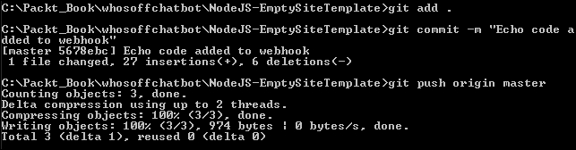

一旦部署了更新后的代码，再次点击 Facebook 页面，并按以下方式发送 Messenger 和帖子数据：

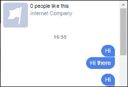

我们已经向我们的机器人发送了多次帖子，但它还没有做任何事情。让我们看看 Azure 端发生了什么，也就是说，应用程序级别是否有任何错误。

### 在 Azure 中排查我们的机器人问题

为了排除机器人不回声的问题，让我们转向我们网站的 **诊断日志** 并开始 **日志流**。日志流将显示我们的程序中是否有任何错误：

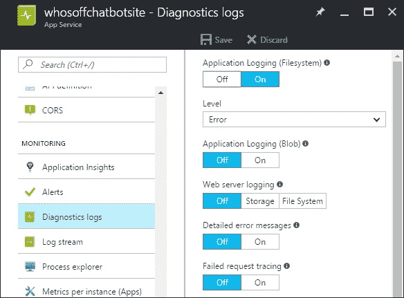

现在，让我们从 Facebook 页面向我们的机器人输入或发布任何内容，并参考日志流。您将看到行号和我们将得到的错误，如下所示：

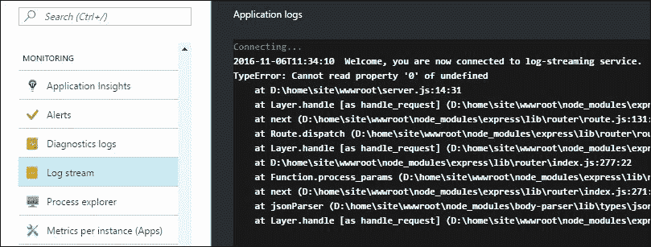

因此，我们的代码在解析输入时失败，导致出现错误。为了修复这个问题，让我们在解析时进行一个小改动。在 `urlencoded` 调用之前使用 `bodyParser`，如下所示：

```js
app.use(bodyParser.json()); 
app.use(bodyParser.urlencoded({extended: false})); 

```

再次，使用 git 命令将修改后的代码部署到 Azure，并尝试向我们的机器人发布一些内容。代码将成功运行并回声用户在聊天窗口中发布的内容，如下所示：


哇！到目前为止，我们已经能够将我们的机器人与 Facebook 页面和 Messenger 连接起来。我们还了解了如何使用 Azure 诊断来登录我们的网站，如果我们的机器人程序有问题；我们还了解了如何跟踪和修复问题。现在让我们看看我们为“谁不在”机器人构建的核心功能。

## 增强我们的“谁不在”机器人

在构建了一个非常基本的 Facebook Messenger 机器人之后，让我们增强我们的“谁不在”机器人。

假设我们的团队成员正在 Facebook Messenger 上协作。我们的机器人应该能够帮助这个团队安排会议，并且在设置会议之前也应该能够显示特定日期的忙碌情况。

现在我将向您展示，我们将为我们的机器人构建以下内容：

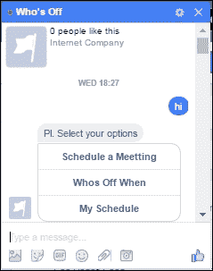

让我们深入流程，然后逐一查看代码实现。

当用户用`hi`与我们的机器人开始对话，如先前的屏幕截图所示，然后“谁不在”机器人将显示前三个选项：**安排会议**、**谁不在**和**我的日程**。

根据用户选择的选项，机器人将提示他们想要执行的操作的时间选项，例如安排会议、查看谁在特定时间不在，或查看他们的会议。请参考以下屏幕截图以了解操作流程：

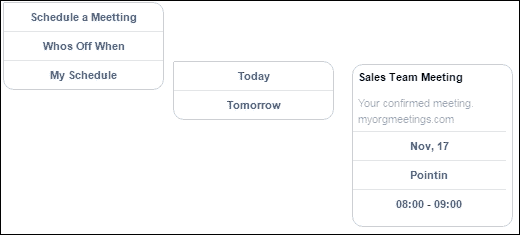

这些操作将使用**今天**和**明天**等选项来完成。根据您的选择，机器人将显示会议详情或请求您安排会议。在先前的屏幕截图中，它显示了在 Facebook Messenger 中选择的**谁不在**选项今天安排的会议。

所以从更高的层面来看，我们将：

+   通过利用消息模板来增强我们的基本机器人程序，以在 Facebook Messenger 中提供更好的对话体验；更多信息，请参阅[`developers.facebook.com/docs/messenger-platform/send-api-reference/templates`](https://developers.facebook.com/docs/messenger-platform/send-api-reference/templates)

+   在 NoSQL 数据库-DocumentDB 中存储会议信息

+   连接 DocumentDB API 和 Messenger 平台 API

### 使用“谁不在”机器人构建对话体验

我们已经看到了用户如何到达我们的 Facebook 页面并与我们的机器人开始对话。

#### 设置 Messenger 问候语

现在让我们增强这个机器人的对话体验。我们将从在用户开始对话时添加问候消息开始。按照以下步骤操作：

1.  在 Facebook 上找到您的机器人页面并点击**设置**选项：

1.  在**设置**页面，在左侧找到**消息**菜单，如下所示：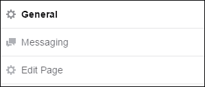

1.  选择**是**选项以**显示消息问候**，如下所示：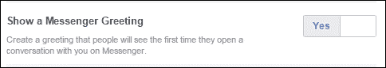

1.  提供问候文本并点击**保存**按钮以保存文本：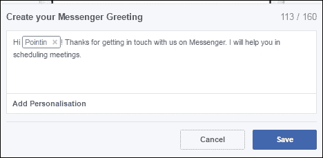

1.  返回到机器人的 Facebook 页面并开始发消息。第一次开始对话时，Who's Off 机器人将这样问候你：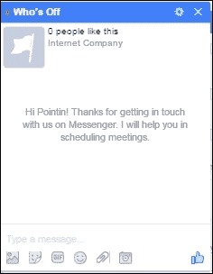

#### 显示机器人可以执行的基本选项

在对话开始时，我们的机器人将显示它可以执行的任务。用户可以选择他或她想要执行的操作。为了实现这一点，让我们按照以下方式修改`server.js`：

```js
var express = require('express'); 
var bodyParser = require('body-parser'); 
var request = require('request'); 
var app = express(); 

app.use(bodyParser.json()); 
app.use(bodyParser.urlencoded({ extended: true })); 

app.get('/', function (req, res) { 
    res.send('This is my Facebook Messenger Bot - Whos Off Bot Server'); 
}); 

// for facebook verification 
app.get('/webhook', function (req, res) { 
    if (req.query['hub.verify_token'] === 'whosoffbot_verify_token') { 
        res.status(200).send(req.query['hub.challenge']); 
    } else { 
        res.status(403).send('Invalid verify token'); 
    } 
}); 

app.post('/webhook', function (req, res) { 

    var events = req.body.entry[0].messaging; 
    for (i = 0; i < events.length; i++) { 
        var event = events[i]; 

        if (event.message && event.message.text) { 
            if (event.message.text.indexOf('hi') > -1) { 
                sendMessageWithInitialOptions(event.sender.id);                 
            }  
        } 
    }    
    res.sendStatus(200); 
}); 

function sendMessageWithInitialOptions(recipientId) { 
    messageData = { 
        'attachment': { 
            'type': 'template', 
            'payload': { 
                'template_type': 'button', 
                'text': 'Pl. Select your options', 
                'buttons': [{ 
                    'type': 'postback', 
                    'title': 'Schedule a Meetting', 
                    'payload': 'SCHEDULE A MEETING' 
                }, { 
                    'type': 'postback', 
                    'title': 'Whos Off When', 
                    'payload': 'WHOS OFF WHEN', 
                }, { 
                    'type': 'postback', 
                    'title': 'My Schedule', 
                    'payload': 'MY SCHEDULE' 
                }] 
            } 
        } 
    }; 
    sendMessage(recipientId, messageData); 
}; 

function sendMessage(recipientId, message) { 
    request({ 
        url: 'https://graph.facebook.com/v2.6/me/messages', 
        qs: { access_token: 'PAGE_ACCESS_TOKEN' }, 
        method: 'POST', 
        json: { 
            recipient: { id: recipientId }, 
            message: message, 
        } 
    }, function (error, response, body) { 
        if (error) { 
            console.log('Error sending message: ', error); 
        } else if (response.body.error) { 
            console.log('Error: ', response.body.error); 
        } 
    }); 
}; 

app.listen((process.env.PORT || 8080)); 

```

使用 git 命令将前面的代码更改推送到 Azure。一旦成功部署，通过说`hi`与机器人开始对话。Who's Off 机器人将回应它能为你做什么，如下所示：

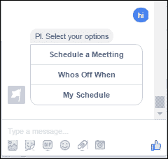

在检查我们的机器人将如何响应之后，现在让我们看看代码。

`app.post('/webhook')`函数捕获所有发送到我们的机器人的消息。所以当用户说`hi`时，会进行模式匹配，机器人会以它可以执行的操作的初始选项进行响应。这是通过以下代码行完成的：

```js
if (event.message.text.indexOf('hi') > -1) { 
   sendMessageWithInitialOptions(event.sender.id);                 
} 

```

`sendMessageWithInitialOptions()`函数实际上使用结构化消息模板准备一个格式化的消息。由于我们希望显示用户可以选择的操作，我们使用`template_type`作为`button`。每个按钮都是`postback`类型，当用户点击这些按钮之一时，我们可以捕获用户的选择并对此做出响应。

这个结构化消息随后通过`sendMessage()`函数返回给发送者。

根据用户的选择，机器人将以按钮类型显示进行响应。这是为了避免浪费最终用户的时间在输入消息或输入关键词。

到目前为止，我们已经看到了一个基本对话是如何在最终用户和机器人之间发生的。这个相同的模式将被用来进一步增强我们的机器人。

我希望你现在对如何构建和增强对话体验有了一点了解。现在让我们看看如何存储与会议相关的信息。我们将使用 DocumentDB 来存储这些信息。让我们快速看看我们如何在 Azure 平台上设置它。

### 什么是 DocumentDB？

在第六章，*BotKit - Slack 的文档管理代理*，我解释了 NoSQL。DocumentDB 也是一个 NoSQL，其中数据以 JSON 文档的形式存储，并由 Microsoft Azure 平台提供。

有关 DocumentDB 的更多详细信息，请参阅[`azure.microsoft.com/en-in/services/documentdb/`](https://azure.microsoft.com/en-in/services/documentdb/)。

### 为我们的“Who's Off”机器人设置 DocumentDB

假设您已经拥有一个微软 Azure 订阅，请按照以下步骤为您的机器人配置 DocumentDB。

#### 为 DocumentDB 创建账户 ID

让我们使用以下 Azure 门户屏幕创建一个名为`botdb`的新账户。选择**DocumentDB**作为 NoSQL API。选择合适的订阅和资源。让我们为这个账户使用现有资源。您也可以创建一个新的专用资源。一旦输入所有必要的信息，点击底部的**创建**按钮来为 DocumentDB 创建一个新的账户：

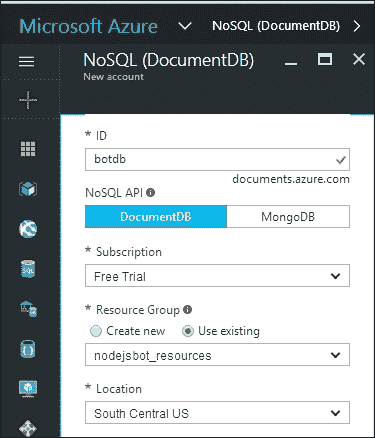

一个新创建的账户名为`botdb`，如下所示：

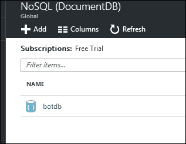

#### 创建集合和数据库

从前面截图所示的账户列表中选择一个`botdb`账户。它将显示各种菜单选项，如**属性**、**设置**、**集合**等。

在此账户下，我们需要创建一个集合来存储会议或事件数据。要创建一个新的集合，请点击以下截图所示的**添加集合**选项：

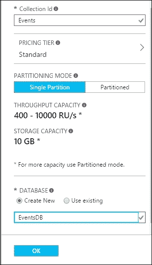

根据前面的截图，我们正在创建一个新的数据库以及名为`Events`的新集合。这个新数据库将被命名为`EventsDB`。现在我们可以使用 Node.js 程序中的 DocumentDB API 来集成这个存储。

### 连接 DocumentDB、Moment.js 和 Node.js

让我们回到`whosoffchatbot`目录，并从 npm 安装`documentdb`包。这实际上是微软 Azure DocumentDB 的 Node.js SDK。它可以在[`www.npmjs.com/package/documentdb`](https://www.npmjs.com/package/documentdb)找到。

为了安装它，运行以下 npm 命令：

```js
npm install documentdb -save

```

在存储会议时，我们将考虑以下 JSON：

```js
{ 
  "id": "8eeeb00d-5ae8-b01f-4054-cc8c3dda67f2", 
  "ownerid": "<SenderId>", 
  "owner": "<Facebook User Name>", 
  "startdatetime": 1479376800, 
  "enddatetime": 1479380400, 
  "title": "<Meeting Title>" 
} 

```

因此，当会议被添加时，为每个会议生成一个唯一的 ID 将非常棒，并且会议信息应该存储在 DocumentDB 中。为了生成这些唯一 ID，我们将使用`guid`包。这个包可以在[`www.npmjs.com/package/guid`](https://www.npmjs.com/package/guid)找到。让我们使用以下命令安装`guid`包：

```js
npm install guid -save

```

此外，所有会议的时间都将存储在 Unix 纪元或 Unix 时间中。这样做是为了简化我们的存储过程以及使用 DocumentDB 查询会议或事件数据。因此，为了启用日期到 Unix 纪元的转换，我们将使用 npm 包`moment`：

```js
npm install moment -save

```

#### 辅助函数和 Node.js

考虑到这个机器人将要开发的各项功能，我决定将一些功能移动到辅助函数中。这些函数可以归类到`utils.js`中。稍后，这些函数将在我们的主 Node.js 文件中被调用。

请参考以下代码以了解`utils.js`：

```js
var moment = require('moment'); 
var https = require('https'); 

function isvalidateInput(str) { 
    var pattern = /^\w+[a-z A-Z_]+?\@[0-9]{1,2}\:[0-9]{1,2}\w[to][0-9]{1,2}:[0-9]{1,2}$/; 
    if (str.match(pattern) == null) { 
        return false; 
    } else { 
        return true; 
    } 

}; 
exports.isvalidateInput = isvalidateInput; 

function getFormattedTime(tsfrom, tsto) { 
    var timeString = moment.unix(tsfrom).format("HH:mm") + ' - ' + moment.unix(tsto).format("HH:mm") 
    return timeString; 
}; 
exports.getFormattedTime =getFormattedTime; 

function getFormattedDay(tsfrom) { 
    var dateString = moment.unix(tsfrom).format("MMM, DD"); 
    return dateString; 
}; 
exports.getFormattedDay =getFormattedDay; 

function meeting(id,recipientId,ownername,strstartdatetime,strenddatetime,strtitle){     
     this.id=id; 
     this.ownerid=recipientId; 
     this.owner=ownername; 
     this.startdatetime=strstartdatetime; 
     this.enddatetime=strenddatetime; 
     this.title=strtitle;              
}; 
exports.meeting =meeting; 

function getUserName(uid,callback){ 
    https.get("https://graph.facebook.com/v2.6/" + uid + "?fields=first_name,last_name&access_token=<PAGE_ACCESS_TOKEN> ", function(res) {   
        var d = '';   
        var i;   
        arr = [];   
        res.on('data', function(chunk) {   
            d += chunk;   
        });   
        res.on('end', function() {   
            var e = JSON.parse(d);   
            callback(e.first_name);            
        });   
    });   
}; 
exports.getUserName =getUserName; 

```

查看前面的代码，你可能注意到 `isvalidateInput()` 函数主要验证用户是否已输入预期的会议信息。如果没有，那么在安排会议时，机器人将通过提供示例会议信息来提供帮助。此函数主要验证用户输入是否与 `Team Meeting@10:00to11:00` 模式匹配。

`getFormattedTime()` 和 `getFormattedDay()` 函数将 Unix 纪元转换为可读的日期格式。

`meeting()` 函数是在根据用户的选项创建新会议时使用的构造函数。

`getUserName()` 函数有助于根据传递给函数的接收者 ID 或用户 ID 获取 Facebook 用户的姓名。当我们存储会议时，我们也将使用此函数和 `meeting()` 函数存储接收者 ID 以及会议所有者的姓名。

#### 将所有这些连接起来

现在我们已经准备好了我们的实用程序或辅助函数以及所需的 Node.js 包，我们终于可以正确地集成我们的机器人了。让我们从代码的分解开始。

首先，我们将引用所有 npm 模块及其实例化，用于此机器人的实现。这可以在以下代码片段中看到：

```js
var express = require('express'); 
var bodyParser = require('body-parser'); 
var request = require('request'); 
var moment = require('moment'); 
var Guid = require('guid'); 
var utils = require('./utils.js'); 

var app = express(); 

app.use(bodyParser.json()); 
app.use(bodyParser.urlencoded({ extended: true })); 

```

我们还将使用以下代码片段建立与 Azure 中的 DocumentDB 数据库的连接：

```js
var DocumentClient = require('documentdb').DocumentClient; 
var host = "https://botdb.documents.azure.com:443/"; 
var masterKey = "PRIMARY KEY" 
var docclient = new DocumentClient(host, { masterKey: masterKey }); 

```

我们在 Facebook 上设置了一个 Webhook，当我们的 Webhook 收到调用时，我们的机器人应该捕获并发送初始选项。这可以通过以下代码片段中的 `sendMessageWithInitialOptions()` 函数实现：

```js
app.post('/webhook', function (req, res) { 
    var tday; 
    var events = req.body.entry[0].messaging; 
    for (i = 0; i < events.length; i++) { 
        var event = events[i]; 

        if (event.message && event.message.text) { 
             if (event.message.text.indexOf('hi') > -1) { 
                sendMessageWithInitialOptions(event.sender.id);                 
            } 

```

所以在这里，每当用户发布 `hi` 时，他或她将看到进一步操作的初始选项。

在安排会议的同时，我们期望用户以特定格式提供会议详情。根据用户发送的内容，我们将验证输入并使用 `processMeetingDetails()` 函数进一步处理它。这是通过以下代码片段实现的：

```js
else if (event.message.text.indexOf('@') > -1) { 
                if (utils.isvalidateInput(event.message.text)) { 
                    sendMessage(event.sender.id, { 'text': 'Sure! Let me set up your meeting for '+payloadm }); 
                    if (payloadm=='Today'){ 
                        tday = moment().format("MM/DD/YYYY"); 
                    } 
                    else if (payloadm=='Tomorrow'){ 
                        tday = moment().add(1, 'day').format("MM/DD/YYYY"); 
                    } 
                    processMeetingDetails(event.message.text, tday + ' ', event.sender.id); 
                } 
                else { 
                    console.log('Invalid format!'); 
                    sendMessage(event.sender.id, { 'text': 'Pl. input meeting details e.g. Team Meeting@10:00to11:00' }); 
                } 
            } 

```

根据向用户显示的选项，当用户做出回应时，回应将被捕获在 `event.postback.payload` 中。根据用户选择进一步操作的内容，我们将执行下一个选项。这是通过以下代码片段完成的：

```js
else if (event.postback && event.postback.payload) { 
            payload = event.postback.payload; 
            // Handle a payload from this sender 
            console.log(JSON.stringify(payload));           
            if (payload == 'SCHEDULE A MEETING') { 
                sendMessageWithScheduleOptions(event.sender.id); 
            } 
            else if (payload == 'SCHEDULETODAY') { 
                payloadm='Today'; 
                sendMessage(event.sender.id, { 'text': 'Pl. provide meeting details e.g. Team Meeting@10:00to11:00' }); 
            } 
            else if (payload == 'SCHEDULETOMORROW') { 
                 payloadm='Tomorrow'; 
                 sendMessage(event.sender.id, { 'text': 'Pl. provide meeting details e.g. Team Meeting@10:00to11:00' }); 
            }             
            else if (payload=='WHOS OFF WHEN'){                                
                sendMessageWithAllScheduleOptions(event.sender.id); 
            } 
            else if (payload == 'ALLSCHEDULETODAY') { 
                sendMessage(event.sender.id, 'Meeting(s) Scheduled for Today as..'); 
                var tilltonight = moment().add(1, 'day').startOf('day').unix(); 
                var startnow = moment().unix();                
                showWhosIsBusyWhen(event.sender.id, startnow, tilltonight);                
            } 
            else if (payload == 'ALLSCHEDULETOMORROW') { 
                sendMessage(event.sender.id, 'Meeting(s) Scheduled for tomorrow as..'); 
                var tilltomnight = moment().add(2, 'day').startOf('day').unix(); 
                var starttonight = moment().endOf('day').unix();                 
                showWhosIsBusyWhen(event.sender.id, starttonight, tilltomnight);                 
            } 
        } 

```

如果你查看前面的代码行，你会看到捕获的负载作为 `SCHEDULE A MEETING`、`SCHEDULETODAY` 等等。所以当用户从 Messenger 屏幕中选择这些选项时，会向我们的 Webhook 发送回执或调用，我们就能得到用户的选择。函数 `sendMessageWithScheduleOptions()` 向用户显示选项，以便安排今天的会议或明天的会议。

当用户对“何时休息”的选项做出响应时，Webhook 被调用，并执行 `sendMessageWithAllScheduleOptions()` 函数来显示选择查看谁忙碌以及何时忙碌的选项。这再次在屏幕上向最终用户显示“今天”或“明天”的选项。根据用户选择的选项，`showWhosIsBusyWhen()` 函数被调用，并带有适当的参数以获取谁忙碌以及何时忙碌的详细信息，即谁的会议在何时安排。

在构建这个机器人时，我们没有要求用户输入或键入选项；相反，我们在屏幕上显示可供选择的选项。这些选项实际上就是结构化消息模板。在向最终用户展示选项和数据时，我们使用按钮模板和列表模板。

在 `sendMessageWithInitialOptions()` 函数中，我们使用的一个模板如下：

```js
function sendMessageWithInitialOptions(recipientId) { 
    messageData = { 
        'attachment': { 
            'type': 'template', 
            'payload': { 
                'template_type': 'button', 
                'text': 'Pl. Select your options', 
                'buttons': [{ 
                    'type': 'postback', 
                    'title': 'Schedule a Meetting', 
                    'payload': 'SCHEDULE A MEETING' 
                }, { 
                    'type': 'postback', 
                    'title': 'Whos Off When', 
                    'payload': 'WHOS OFF WHEN', 
                }, { 
                    'type': 'postback', 
                    'title': 'My Schedule', 
                    'payload': 'MY SCHEDULE' 
                }] 
            } 
        } 
    }; 
    sendMessage(recipientId, messageData); 
}; 

```

前一个函数使用按钮模板和 `sendMessage()` 函数生成结构化消息，并将带有初始选项的消息显示给最终用户。

在类似的思路下，我们有一个名为 `sendMessageWithScheduleOptions()` 的函数。这个函数生成一个结构化的消息，以显示“今天”和“明天”选项，以便选择何时安排会议：

```js
function sendMessageWithScheduleOptions(recipientId) { 
    messageData = { 
        'attachment': { 
            'type': 'template', 
            'payload': { 
                'template_type': 'button', 
                'text': 'Select day to schedule a meeting', 
                'buttons': [{ 
                    'type': 'postback', 
                    'title': 'Today', 
                    'payload': 'SCHEDULETODAY' 
                }, { 
                    'type': 'postback', 
                    'title': 'Tomorrow', 
                    'payload': 'SCHEDULETOMORROW', 
                }] 
            } 
        } 
    }; 
    sendMessage(recipientId, messageData); 
}; 

```

为了处理会议数据并检查是否存在任何冲突，使用以下函数：

```js
function processMeetingDetails(str, todaysdate, recipientId) { 
    var title, stime, etime, starttime, endtime, ownername 

    //parsing input provided for extracting meeting information 
    title = str.substring(0, str.indexOf('@')); 
    stime = str.substring(title.length + 1, str.indexOf('to')) + ':00'; 
    etime = str.substring(str.indexOf('to') + 2, str.length) + ':00'; 

    starttime = moment(todaysdate + stime).unix(); 
    endtime = moment(todaysdate + etime).unix(); 

    console.log(starttime + ' to ' + endtime + ' title' + title); 
    //function to get Fb User Name 
    utils.getUserName(recipientId, function (d) { 
        ownername = d; 
        var objMeeting = new utils.meeting(Guid.raw(), recipientId, ownername, starttime, endtime, title) 
        CheckMeetingsIfExistsOrInsert(objMeeting); 
    }); 
} 

```

前一个函数提取会议详情，并将它们传递给检查是否存在任何冲突。这个函数使用 `Utils.js` 中的实用函数来获取当前用户的用户名，并检查与当前用户相关的会议冲突。如果没有冲突，则使用 `CheckMeetingsIfExistsOrInsert()` 函数安排会议：

```js
function CheckMeetingsIfExistsOrInsert(objMeeting) { 
    var querySpec = { 
        query: 'SELECT * FROM Events b WHERE  (b.ownerid= @id) and (@start between b.startdatetime and b.enddatetime)', 
        parameters: [ 
            { 
                name: '@id', 
                value: objMeeting.ownerid 
            }, 
            { 
                name: '@start', 
                value: objMeeting.startdatetime 
            } 
        ] 
    }; 

    docclient.queryDocuments('dbs/EventsDB/colls/Events', querySpec).toArray(function (err, results) { 
        console.log(objMeeting.title); 
        if (results.length === 0) { 
            console.log('No data found' + objMeeting.title); 
            var documentDefinition = { 
                'id': objMeeting.id, 
                'ownerid': objMeeting.ownerid, 
                'owner': objMeeting.owner, 
                'startdatetime': objMeeting.startdatetime, 
                'enddatetime': objMeeting.enddatetime, 
                'title': objMeeting.title 
            }; 
            docclient.createDocument('dbs/EventsDB/colls/Events', documentDefinition, function (err, document) { 
                if (err) return console.log(err); 
                console.log('Created A Meeting with id : ', document.id); 
                sendMessage(objMeeting.ownerid, { 'text': 'Meeting has been scheduled.' }); 
            }); 
        } else { 
            console.log('Data found'); 
            sendMessage(objMeeting.ownerid, { 'text': 'Meeting exists for this schedule. Pl. schedule another time.' }); 
        } 
    }); 
} 

```

这个函数查询我们的基于 DocumentDB 的数据库，并使用 `docclient.queryDocuments()` 函数检查在该时间段内是否已安排任何会议。

如果在该时间段内没有会议，则使用 `docclient.createDocument()` 函数创建一个新的会议。对于新创建的会议，默认情况下，安排会议的用户成为会议的所有者。

当用户选择“何时休息”的选项时，`showWhosIsBusyWhen()` 函数被调用，并显示所有已安排会议及其所有者和时间段的信息：

```js
function showWhosIsBusyWhen(recipientId,start, end) { 
    var querySpec = { 
        query: 'SELECT * FROM Events b WHERE  b.startdatetime<= @end and b.startdatetime>= @start ORDER BY b.startdatetime', 
        parameters: [             
            { 
                name: '@end', 
                value: end 
            }, 
            { 
                name: '@start', 
                value: start 
            } 
        ] 
    }; 
    docclient.queryDocuments('dbs/EventsDB/colls/Events', querySpec).toArray(function (err, results) { 
        if (results.length > 0) { 
            sendMessageWithMeetingsOwnerInList(recipientId, results) 
        } 
    }); 
} 

```

根据传递的日期，使用 `sendMessageWithMeetingsOwnerInList()` 函数显示已安排会议的详情及其所有者，列表中包含：

```js
function sendMessageWithMeetingsOwnerInList(recipientId, results) { 
    var card; 
    var cards = []; 
    var messageData; 

    messageData = { 
        attachment: { 
            type: 'template', 
            payload: { 
                template_type: 'generic', 
                elements: [] 
            } 
        } 
    }; 

    for (i = 0; i < results.length; i++) { 
        card = { 
            title: results[i].title, 
            item_url: 'https://myorgmeetings.com/' + results[i].id, 
            image_url: '', 
            subtitle: 'Your confirmed meeting.', 
            buttons: [ 
                { 
                    type: 'web_url', 
                    url: 'https://myorgmeetings.com/' + results[i].id, 
                    title: utils.getFormattedDay(results[i].startdatetime) 
                }, 
                 { 
                    type: 'web_url', 
                    url: 'https://myorgmeetings.com/' + results[i].id, 
                    title: results[i].owner 
                }, 
                { 
                    type: 'web_url', 
                    url: 'https://myorgmeetings.com/' + results[i].id, 
                    title: utils.getFormattedTime(results[i].startdatetime, results[i].enddatetime) 
                } 
            ] 
        }; 
        cards.push(card); 
    } 

    messageData.attachment.payload.elements = cards; 
    sendMessage(recipientId, messageData); 
}; 

```

前一个函数使用通用模板生成一系列会议，并将它们显示为卡片。

我希望你现在已经对为这个机器人所做的代码实现有一个整体的理解。我们的最终 `server.js` 应该如下所示：

```js
var express = require('express'); 
var bodyParser = require('body-parser'); 
var request = require('request'); 
var moment = require('moment'); 
var Guid = require('guid'); 
var utils = require('./utils.js'); 

var app = express(); 

app.use(bodyParser.json()); 
app.use(bodyParser.urlencoded({ extended: true })); 

var DocumentClient = require('documentdb').DocumentClient; 
var host = "https://botdb.documents.azure.com:443/"; 
var masterKey = "PRIMARY KEY" 
var docclient = new DocumentClient(host, { masterKey: masterKey }); 

var payloadm; 

app.get('/', function (req, res) { 
    res.send('This is my Facebook Messenger Bot - Whos Off Bot Server'); 
}); 

// for facebook verification 
app.get('/webhook', function (req, res) { 
    if (req.query['hub.verify_token'] === 'whosoffbot_verify_token') { 
        res.status(200).send(req.query['hub.challenge']); 
    } else { 
        res.status(403).send('Invalid verify token'); 
    } 
}); 

app.post('/webhook', function (req, res) { 
    var tday; 
    var events = req.body.entry[0].messaging; 
    for (i = 0; i < events.length; i++) { 
        var event = events[i]; 

        if (event.message && event.message.text) { 
             if (event.message.text.indexOf('hi') > -1) { 
                sendMessageWithInitialOptions(event.sender.id);                 
            }  
            else if (event.message.text.indexOf('@') > -1) { 
                if (utils.isvalidateInput(event.message.text)) { 
                    sendMessage(event.sender.id, { 'text': 'Sure! Let me set up your meeting for '+payloadm }); 
                    if (payloadm=='Today'){ 
                        tday = moment().format("MM/DD/YYYY"); 
                    } 
                    else if (payloadm=='Tomorrow'){ 
                        tday = moment().add(1, 'day').format("MM/DD/YYYY"); 
                    } 
                    processMeetingDetails(event.message.text, tday + ' ', event.sender.id); 
                } 
                else { 
                    console.log('Invalid format!'); 
                    sendMessage(event.sender.id, { 'text': 'Pl. input meeting details e.g. Team Meeting@10:00to11:00' }); 
                } 
            } 
        } 
          else if (event.postback && event.postback.payload) { 
            payload = event.postback.payload; 
            // Handle a payload from this sender 
            console.log(JSON.stringify(payload));           
            if (payload == 'SCHEDULE A MEETING') { 
                sendMessageWithScheduleOptions(event.sender.id); 
            } 
            else if (payload == 'SCHEDULETODAY') { 
                payloadm='Today'; 
                sendMessage(event.sender.id, { 'text': 'Pl. provide meeting details e.g. Team Meeting@10:00to11:00' }); 
            } 
            else if (payload == 'SCHEDULETOMORROW') { 
                 payloadm='Tomorrow'; 
                 sendMessage(event.sender.id, { 'text': 'Pl. provide meeting details e.g. Team Meeting@10:00to11:00' }); 
            }             
            else if (payload=='WHOS OFF WHEN'){                                
                sendMessageWithAllScheduleOptions(event.sender.id); 
            } 
            else if (payload == 'ALLSCHEDULETODAY') { 
                sendMessage(event.sender.id, 'Meeting(s) Scheduled for Today as..'); 
                var tilltonight = moment().add(1, 'day').startOf('day').unix(); 
                var startnow = moment().unix();                
                showWhosIsBusyWhen(event.sender.id, startnow, tilltonight);                
            } 
            else if (payload == 'ALLSCHEDULETOMORROW') { 
                sendMessage(event.sender.id, 'Meeting(s) Scheduled for tomorrow as..'); 
                var tilltomnight = moment().add(2, 'day').startOf('day').unix(); 
                var starttonight = moment().endOf('day').unix();                 
                showWhosIsBusyWhen(event.sender.id, starttonight, tilltomnight);                 
            } 
        } 

    }    
    res.sendStatus(200); 
}); 

function sendMessageWithInitialOptions(recipientId) { 
    messageData = { 
        'attachment': { 
            'type': 'template', 
            'payload': { 
                'template_type': 'button', 
                'text': 'Pl. Select your options', 
                'buttons': [{ 
                    'type': 'postback', 
                    'title': 'Schedule a Meetting', 
                    'payload': 'SCHEDULE A MEETING' 
                }, { 
                    'type': 'postback', 
                    'title': 'Whos Off When', 
                    'payload': 'WHOS OFF WHEN', 
                }, { 
                    'type': 'postback', 
                    'title': 'My Schedule', 
                    'payload': 'MY SCHEDULE' 
                }] 
            } 
        } 
    }; 
    sendMessage(recipientId, messageData); 
}; 

function sendMessageWithScheduleOptions(recipientId) { 
    messageData = { 
        'attachment': { 
            'type': 'template', 
            'payload': { 
                'template_type': 'button', 
                'text': 'Select day to schedule a meeting', 
                'buttons': [{ 
                    'type': 'postback', 
                    'title': 'Today', 
                    'payload': 'SCHEDULETODAY' 
                }, { 
                    'type': 'postback', 
                    'title': 'Tomorrow', 
                    'payload': 'SCHEDULETOMORROW', 
                }] 
            } 
        } 
    }; 
    sendMessage(recipientId, messageData); 
}; 

function processMeetingDetails(str, todaysdate, recipientId) { 
    var title, stime, etime, starttime, endtime, ownername 

    //parsing input provided for extracting meeting information 
    title = str.substring(0, str.indexOf('@')); 
    stime = str.substring(title.length + 1, str.indexOf('to')) + ':00'; 
    etime = str.substring(str.indexOf('to') + 2, str.length) + ':00'; 

    starttime = moment(todaysdate + stime).unix(); 
    endtime = moment(todaysdate + etime).unix(); 

    console.log(starttime + ' to ' + endtime + ' title' + title); 
    //function to get Fb User Name 
    utils.getUserName(recipientId, function (d) { 
        ownername = d; 
        var objMeeting = new utils.meeting(Guid.raw(), recipientId, ownername, starttime, endtime, title) 
        CheckMeetingsIfExistsOrInsert(objMeeting); 
    }); 
} 

function CheckMeetingsIfExistsOrInsert(objMeeting) { 
    var querySpec = { 
        query: 'SELECT * FROM Events b WHERE  (b.ownerid= @id) and (@start between b.startdatetime and b.enddatetime)', 
        parameters: [ 
            { 
                name: '@id', 
                value: objMeeting.ownerid 
            }, 
            { 
                name: '@start', 
                value: objMeeting.startdatetime 
            } 
        ] 
    }; 

    docclient.queryDocuments('dbs/EventsDB/colls/Events', querySpec).toArray(function (err, results) { 
        console.log(objMeeting.title); 
        if (results.length === 0) { 
            console.log('No data found' + objMeeting.title); 
            var documentDefinition = { 
                'id': objMeeting.id, 
                'ownerid': objMeeting.ownerid, 
                'owner': objMeeting.owner, 
                'startdatetime': objMeeting.startdatetime, 
                'enddatetime': objMeeting.enddatetime, 
                'title': objMeeting.title 
            }; 
            docclient.createDocument('dbs/EventsDB/colls/Events', documentDefinition, function (err, document) { 
                if (err) return console.log(err); 
                console.log('Created A Meeting with id : ', document.id); 
                sendMessage(objMeeting.ownerid, { 'text': 'Meeting has been scheduled.' }); 
            }); 
        } else { 
            console.log('Data found'); 
            sendMessage(objMeeting.ownerid, { 'text': 'Meeting exists for this schedule. Pl. schedule another time.' }); 
        } 
    }); 
} 

function sendMessageWithAllScheduleOptions(recipientId) { 
    messageData = { 
        'attachment': { 
            'type': 'template', 
            'payload': { 
                'template_type': 'button', 
                'text': 'Select your schedule for', 
                'buttons': [{ 
                    'type': 'postback', 
                    'title': 'Today', 
                    'payload': 'ALLSCHEDULETODAY' 
                }, { 
                    'type': 'postback', 
                    'title': 'Tomorrow', 
                    'payload': 'ALLSCHEDULETOMORROW',     
                }] 
            } 
        } 
    }; 
    sendMessage(recipientId, messageData); 
}; 

function showWhosIsBusyWhen(recipientId,start, end) { 
    var querySpec = { 
        query: 'SELECT * FROM Events b WHERE  b.startdatetime<= @end and b.startdatetime>= @start ORDER BY b.startdatetime', 
        parameters: [             
            { 
                name: '@end', 
                value: end 
            }, 
            { 
                name: '@start', 
                value: start 
            } 
        ] 
    }; 
    docclient.queryDocuments('dbs/EventsDB/colls/Events', querySpec).toArray(function (err, results) { 
        if (results.length > 0) { 
            sendMessageWithMeetingsOwnerInList(recipientId, results) 
        } 
    }); 
} 

function sendMessageWithMeetingsOwnerInList(recipientId, results) { 
    var card; 
    var cards = []; 
    var messageData; 

    messageData = { 
        attachment: { 
            type: 'template', 
            payload: { 
                template_type: 'generic', 
                elements: [] 
            } 
        } 
    }; 

    for (i = 0; i < results.length; i++) { 
        card = { 
            title: results[i].title, 
            item_url: 'https://myorgmeetings.com/' + results[i].id, 
            image_url: '', 
            subtitle: 'Your confirmed meeting.', 
            buttons: [ 
                { 
                    type: 'web_url', 
                    url: 'https://myorgmeetings.com/' + results[i].id, 
                    title: utils.getFormattedDay(results[i].startdatetime) 
                }, 
                 { 
                    type: 'web_url', 
                    url: 'https://myorgmeetings.com/' + results[i].id, 
                    title: results[i].owner 
                }, 
                { 
                    type: 'web_url', 
                    url: 'https://myorgmeetings.com/' + results[i].id, 
                    title: utils.getFormattedTime(results[i].startdatetime, results[i].enddatetime) 
                } 
            ] 
        }; 
        cards.push(card); 
    } 

    messageData.attachment.payload.elements = cards; 
    sendMessage(recipientId, messageData); 
}; 

function sendMessage(recipientId, message) { 
    request({ 
        url: 'https://graph.facebook.com/v2.6/me/messages', 
        qs: { access_token: 'PAGE_ACCESS_TOEKN' }, 
        method: 'POST', 
        json: { 
            recipient: { id: recipientId }, 
            message: message, 
        } 
    }, function (error, response, body) { 
        if (error) { 
            console.log('Error sending message: ', error); 
        } else if (response.body.error) { 
            console.log('Error: ', response.body.error); 
        } 
    }); 
}; 

app.listen((process.env.PORT || 8080));     

```

### 运行我们的机器人 - 何时休息机器人

在理解了代码实现并假设我们的最终代码已经在 Microsoft Azure 上运行之后，让我们从最终用户的视角来看一下我们的机器人是如何执行的。

#### 初始选项

以下截图显示了初始选项：


#### 安排会议

当用户点击**安排会议**时，我们的机器人会发送两个选项，如下所示：

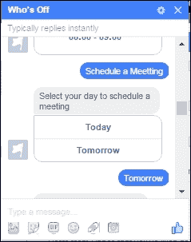

现在当用户点击**明天**时，我们的机器人会向最终用户响应一些指导性文本，例如**请提供会议详情，例如 Team Meeting@10:00to11:00**：

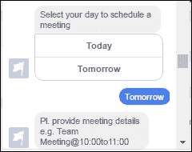

在收到指导性文本后，用户会输入会议详情，例如`Team Meeting@10:00to11:00`：

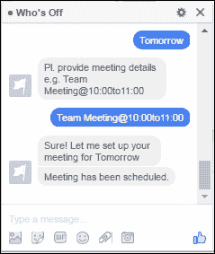

机器人检查冲突，如果没有发现冲突，会议将被安排，并且机器人会以如前截图所示的“会议已安排”的消息进行响应。

#### 何时休假

当用户选择**何时休假**的选项时，以下屏幕显示了您希望查看哪一天（**今天**或**明天**）谁在休假的选项。

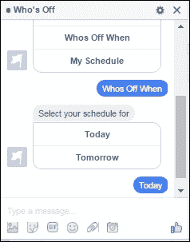

如果用户选择**今天**的选项，该天的会议将如下显示：

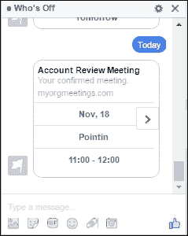

右侧的箭头显示有多个会议。只需向左滚动即可查看会议，如下所示：

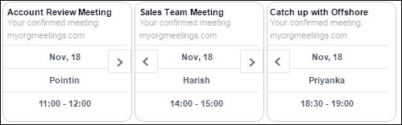

这样，我们根据个人成员安排的会议显示谁在何时忙碌。

因此，我们以这种方式实现了我们的机器人，使其能够安排我们的会议，并在 Facebook Messenger 界面中以优雅的方式显示所有安排的会议。还有一个操作尚未完成：**我的日程**。我现在将这个操作的实现留给你。

# 摘要

因此，利用 Facebook，我们构建了一个机器人并增强了我们团队的协作体验。有了这个机器人，我们的团队只需将会议详情发送到聊天窗口中的机器人，例如名称和开始和结束日期，机器人就会处理其余的事情。

总结来说，我们学习了如何创建 Facebook 页面和应用。我们还创建了一个基于 Node.js 的基本机器人，并将其部署到 Microsoft Azure 上。我们这样做是因为 Facebook Messenger 需要一个基于 HTTPS 的 Webhooks 集成。然后，我们在 Webhooks 中订阅了一个页面，以便我们的机器人页面发送的消息可以被我们的 Node.js 机器人接受。

最后，我们增强了我们的机器人以显示信息，例如谁在休假，并在 Facebook Messenger 界面中显示这些信息。

我们看到，拥有一定智能的“何时休假”机器人可以检查冲突，并据此安排会议。它还可以以 Facebook 兼容的 Messenger 模板格式向我们展示团队的日程。

此外，如果你真的想开发智能机器人，那么查看 [`wit.ai/`](https://wit.ai/) 和 [`api.ai/`](https://api.ai/) 是值得的。这些平台使我们能够开发能够更好地理解人类的聊天机器人。

希望这一章已经给你带来了构建 Facebook Messenger 机器人的惊人体验！

在下一章中，我们将探讨如何开发 IRC 机器人，以及我们如何在 Node.js 中连接它们，并帮助我们的开发者将其用于错误跟踪目的。
