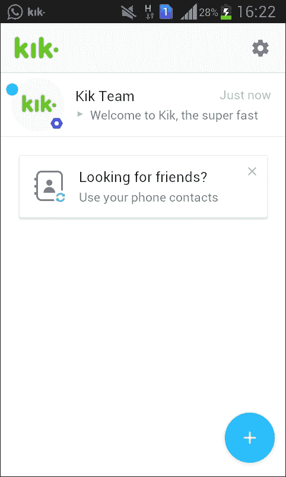

# 第九章。Kik Salesforce CRM 机器人

Kik 消息应用，或简称 Kik，是一个免费的移动消息应用。它可在 iOS、Android 和 Windows Phone 上使用。使用这个即时消息应用，用户可以发送或接收消息、照片、视频等。

Kik 之所以闻名，主要是因为它在注册时不会验证用户信息。这有助于用户保持匿名。

Kik 用户有自己的代码。使用这些代码，用户可以快速轻松地与朋友连接。用户可以扫描用户的代码并立即开始聊天。这也适用于 Kik 群组。用户可以扫描 Kik 群组的代码并轻松加入。

建立聊天通信的简单性和易用性，以及主要的是匿名性，使得 Kik 在年轻人中成为一个非常受欢迎的聊天平台。

在本章中，我们将学习如何创建一个基本的 Kik 机器人，以及如何通过将其与 Salesforce CRM 集成来增强它。

但在深入细节之前，让我们更多地了解 Salesforce CRM。

# 什么是 Salesforce？

Salesforce 是一个基于云的**客户关系管理**（**CRM**）软件解决方案，用于销售、服务、营销、分析和协作。所有这些软件解决方案都是预先构建的，并在云平台上运行。Salesforce 不需要任何 IT 人员来设置或管理。CRM 用户只需登录即可开始使用这个平台。

Salesforce 的详细信息可以在[`www.salesforce.com`](https://www.salesforce.com)找到。

# 什么是 Force.com？

Force.com 是一个**平台即服务**（**PaaS**）。这个平台由数据库、代码和用户界面等底层组件组成，开发者可以在其上创建和交付强大的企业应用。使用这个平台，开发者只需点击几下或编写一些代码就能交付强大的应用。甚至商业用户也可以通过拖放的方式开发和交付应用工作流程。

简而言之，Salesforce 及其产品和解决方案是一个客户成功平台，它改变了人们与客户连接的方式。

# Kik 移动应用

如介绍中所述，Kik 是一个免费的移动消息应用。可以从 App Store（[`itunes.apple.com/ca/app/kik/id357218860?mt=8`](https://itunes.apple.com/ca/app/kik/id357218860?mt=8)）或 Google Play Store（[`play.google.com/store/apps/details?id=kik.android&hl=en`](https://play.google.com/store/apps/details?id=kik.android&hl=en)）下载。

对于本章，我假设 Kik 移动应用已经从 App Store 或 Google Play Store 下载并安装。

我已经从 Google Play Store 安装了 Kik 应用，并在 Kik 应用上创建了账户。以下截图显示了 Kik 移动应用的外观：



Kik 没有提供网页或桌面版本的消息服务，所以我们将会使用移动端的 Kik 应用。

# Kik 机器人

Kik 机器人只是提供用户与 Kik API 协助下的自动化对话体验的程序。用户可以与这些机器人聊天以娱乐，寻求帮助，或为娱乐目的获取信息。Kik 最近发布了机器人商店。用户可以发现机器人并轻松连接它们。

# 我们的 Kik 机器人

我们的 Kik 机器人将基于 Salesforce 和 Force.com 平台，我之前已经解释过。在较高层次上，我们将遵循以下步骤为我们的机器人：

1.  开发一个基本的 Kik 机器人

1.  根据 Kik 指引增强我们的基本机器人程序以获得更丰富的对话体验

1.  在 CRM 和我们的基本机器人之间建立连接

1.  根据用户需求，从 Salesforce 获取 CRM 数据并在 Kik 应用程序中展示用户数据

## 创建我们的第一个 Kik 机器人

就像 Slack 一样，Kik 也帮助我们使用自动化代理 **Botsworth** 创建我们的机器人。让我们按照以下步骤创建我们的第一个 Kik 机器人。

### 在浏览器中使用 Kik 开发者平台

访问 [`dev.kik.com/#/home`](https://dev.kik.com/#/home)，如图所示：


URL 打开 Kik 开发者平台，该平台帮助我们创建和配置我们的 Kik 机器人。此屏幕显示了创建机器人的 Kik 代码。此代码需要使用 Kik 应用程序扫描，我们已安装并配置了我们的 Kik 账户。

### 使用移动设备上的 Kik 应用程序

在设备上打开 Kik 应用程序，从主聊天列表顶部向下拉以打开扫描仪，如图所示：


使用扫描仪扫描 [`dev.kik.com/#/home`](https://dev.kik.com/#/home) 上的 Kik 代码。

此扫描仪也可以从 Kik 应用程序的设置菜单（右上角的小齿轮图标）中找到，通过选择菜单项中的 **Kik 代码** 页面。

扫描后，Kik 的可靠机器人 **Botsworth** 将在我们的应用程序上发送一条消息，如图所示：


现在在聊天窗口本身中为 **Botsworth** 提供一个独特的机器人名称。

**Botsworth** 将创建我们的机器人，并会通过以下截图显示的相同方式通知我们：


现在，让我们回到浏览器，其中 [`dev.kik.com/#/home`](https://dev.kik.com/#/home) 页面是打开的。您会注意到新配置的机器人账户已登录到平台，并显示机器人的属性，如 **显示名称**、**管理员** 和 **API 密钥**，如图所示：


机器人的名称 **sforcebot** 和 **API 密钥** 将用于在构建对话体验时连接 Kik API。

为了接收用户的消息，我们的机器人需要**Webhooks**集成。在我们设置 Webhooks 之前，让我们在下一节中创建一个 Azure 上的 Node.js 服务器应用程序作为我们的机器人。

### 在 Azure 中设置我们的机器人服务器

让我们登录到 Azure 门户，找到 App Services 以创建一个基于 Node.js 的机器人服务器，命名为`thesfbotsite`。此服务器应用程序基于**Node JS Empty Web App**模板。请参考以下截图：


这将在 Azure 中为我们的`thesfbotsite.azurewebsites.net`服务器应用程序提供服务。

要修改基本机器人程序，我们首先将使用 git 命令在本地文件系统中克隆模板。然后我们将对其进行修改，并将其部署到 Microsoft Azure。

让我们在本地驱动器中创建一个文件夹，以便从命令提示符存储我们的机器人程序：

```js
mkdir thesfbot
cd thesfbot

```

现在将模板克隆到本地文件系统，并更改此机器人的远程 git 仓库。

如何将模板克隆到本地文件系统以及如何更改远程 git 仓库的详细步骤可以在第七章的*在 Azure 中设置我们的机器人服务器*部分找到，*Facebook Messenger Bot Who's Off - A Scheduler Bot for Teams*。

### Kik 机器人配置

在我们的机器人开始与用户互动之前，它需要进行配置。为了配置我们的机器人，我们将通过 Webhook URL 发送 POST 请求，消息将被发送到该 URL。此外，还可以在此处配置读取回执和接收打字通知等附加功能。

这可以通过发送 URL 命令或在一个简单的 Node.js 程序中编写以下代码来完成：

```js
request.post({ 
    url: "https://api.kik.com/v1/config", 
    auth: { 
       'user' : 'sforcebot', 
       'pass' : '<YOUR BOT API KEY>' 
    }, 
    json:{"webhook": "https://thesfbotsite.azurewebsites.net/incoming",  
        "features": { 
            "receiveReadReceipts": false,  
            "receiveIsTyping": false,  
            "manuallySendReadReceipts": false,  
            "receiveDeliveryReceipts": false 
        } 
    } 
}, function(error, response, body){ 
    if(error) { 
        console.log(error); 
    } else { 
        console.log(response.statusCode, body); 
    } 
}); 

```

此代码将我们的机器人`webhook`设置为 Azure 中新建站点的路径`/incoming`。

这些配置的详细信息可以在[`dev.kik.com/#/docs/messaging#configuration`](http://bit.do/dev-kik-docs-messaging-configuration)找到。

### 将我们的机器人服务器与 Kik 平台连接起来

为了我们的机器人能够与 Kik 平台交互，我们将使用 Kik Node API 库。该库可以在[`www.npmjs.com/package/@kikinteractive/kik`](https://www.npmjs.com/package/@kikinteractive/kik)找到。

让我们使用以下命令安装 Kik API 库和其他库：

```js
npm install @kikinteractive/kik  http  util --save

```

让我们按照以下方式更新我们的`server.js`文件：

```js
var util = require('util'); 
var http = require('http'); 
var Bot  = require('@kikinteractive/kik'); 
var request = require('request'); 

// Configure the bot 
var bot = new Bot({ 
    username: 'sforcebot', 
    apiKey: '<YOUR BOT API KEY>'  
}); 

bot.send(Bot.Message.text('The SForceBot Started... '), 'mbhintade'); 

bot.onTextMessage(/^hi|hello|how|hey$/i, (incoming, next) => { 
     incoming.reply('Hello,I am the SForce Bot. I provide your CRM information just by chatting.'); 
 }); 

// Set up your server and start listening 
var server = http 
  .createServer(bot.incoming()) 
  .listen(process.env.PORT || 8080); 

```

## 理解我们基本 Kik 机器人的代码

让我们看看`server.js`中的基本代码实现。

我们使用了`@kikinteractive/kik`库，以下是一行代码：

```js
var Bot = require('@kikinteractive/kik'); 

```

使用此库，我们通过提供`username`和`apikey`实例化了我们的机器人：

```js
var bot = new Bot({ 
    username: 'sforcebot', 
    apiKey: '<YOUR BOT API KEY>'  
}); 

```

当我们的机器人成功连接后，这将在 Kik 应用程序中显示。此外，我们的机器人将使用以下代码通过以下代码通知用户`mbhintade`：

```js
bot.send(Bot.Message.text('The SForceBot Started... '), 'mbhintade'); 

```

当我们向我们的机器人说 hi 或 hello 时，机器人将使用以下代码行回复我们：

```js
bot.onTextMessage(/^hi|hello|how|hey$/i, (incoming, next) => { 
     incoming.reply('Hello,I am the SForce Bot. I provide your CRM information just by chatting.'); 
 }); 

```

在前面的代码片段中，我们使用正则表达式`/^hi|hello|how|hey$/i`来找出用户发送了什么信息。之前使用的正则表达式可以描述如下：

| 字符 | 描述 |
| --- | --- |
| / | 正则表达式 |
| ^ | 匹配字符 `hi` 并非来自任何字符组 |
| &#124; | 匹配两个字符之间的任意单个单词 |
| $ | 匹配输入的结尾 |

我希望这已经为我们提供了关于我们的 Kik 机器人和其代码实现的一些基本理解。现在让我们运行我们的机器人，看看它在 Kik 移动应用中的样子。

## 运行我们的基本 Kik 机器人

让我们使用以下`git`命令部署我们的修改后的`server.js`和安装的 Node 包：

```js
git add .
git commit -m "First Change to server.js"
git push origin master

```

一旦代码部署到 Azure，请访问 URL [`thesfbotsite.azurewebsites.net`](https://thesfbotsite.azurewebsites.net) 并查看 Azure 日志流中是否有任何错误。如果代码成功，则机器人服务器将启动，我们的机器人将以活跃状态显示在 Kik 聊天中。

当机器人启动时，它显示了一条消息，“**The SForceBot Started...**”

当我用“**Hi**”问候它时，机器人回复了信息“**Hello, I am the SForce Bot. I provide your CRM information just by chatting.**”

参考以下屏幕截图：


在下一节中，我们将为有趣的用例增强我们的机器人。

## 增强我们的 Kik 机器人

在构建了一个非常基础的 Kik 机器人 *sforcebot* 之后，让我们增强我们的 Kik 机器人。

通常，销售和市场营销业务用户总是需要跟踪他们的销售和市场营销活动。他们需要跟踪自己的潜在客户和机会，并维护活动。现在，为了跟踪这些活动，他们依赖于 CRM 系统。

在下一节中，我们将实际探讨机器人如何在这样的商业用例中有效。我们的机器人现在将集成到 CRM 系统中，并将所有必要的信息直接提供给业务用户。

假设你是销售和市场营销领域的一名业务用户。现在，你希望快速轻松地查看即将到来的商业机会。假设你的组织已经使用基于云的 CRM。因此，你将与名为 sforcebot 的 Kik 机器人互动。在互动过程中，你将请求当前月份的机会。机器人知道你是谁，并将寻找你拥有的当前月份的机会。sforcebot 将收集信息，并在聊天窗口中以易于阅读的格式展示机会。

太棒了！！

### Salesforce 和我们的机器人

假设我们的商业机会数据存储在 Salesforce 中，并且我们已经登录到 Salesforce 平台。现在，从我们的机器人角度来看，我们感兴趣的是展示当前月份和下一个月的机会数据。在 Salesforce 中，我们已经为我们预配置了这些视图。

本月关闭的机会可以在以下屏幕截图中查看：


下个月即将关闭的机会可以在以下屏幕截图中看到：


在我们的机器人中，我们将根据用户的信息请求提取相同的数据。因此，现在是准备 Salesforce 和我们的机器人集成的时刻。

#### 访问 Salesforce API 的安全令牌

要从 Salesforce 获取信息，我们需要一个安全令牌。此令牌是一个与您的密码相关联的敏感的字母数字代码。每次我们更改密码时，此安全令牌也会重置。

让我们获取用于 Salesforce API 访问的安全令牌，使用 Salesforce 中的**重置安全令牌**菜单选项，操作如下：


要快速定位**重置安全令牌**选项，您可以使用 Salesforce 菜单选项左上角的快速查找/搜索选项。在先前的屏幕截图中，我输入了`Security Token`并搜索了选项，**重置安全令牌**。

点击**重置安全令牌**按钮以获取访问 Salesforce API 的新令牌。新令牌将被发送到您注册的电子邮件地址。

### 将所有连接起来

要连接 Salesforce 和 Node.js，我们将使用 Salesforce API 库 JSforce。这可以在[`www.npmjs.com/package/jsforce`](https://www.npmjs.com/package/jsforce)找到。

让我们使用以下命令安装`JSforce`库：

```js
npm install jsforce --save

```

要将所有东西连接起来，让我们修改之前的`server.js`如下：

```js
var util = require('util'); 
var http = require('http'); 
var Bot = require('@kikinteractive/kik'); 
var request = require('request'); 

var username = "<SALESFORCE_USERNAME>"; 
var password = "<SALESFORCE_PASSWORD>"; 
var accesstoken = password + '<SALESFORCE_SECURITY_TOKEN>'; 

var fromUserName; 

// Configure the bot 
var bot = new Bot({ 
  username: 'sforcebot', 
  apiKey: '<YOUR BOT API KEY>' 
}); 

var jsforce = require('jsforce'); 
var conn = new jsforce.Connection(); 

bot.onTextMessage(/^hi|hello|how|hey$/i, (incoming, next) => { 
  bot.getUserProfile(incoming.from) 
    .then((user) => { 
      fromUserName = user.username; 
      incoming.reply('Hello,I am the SForce Bot. I provide your CRM information just by chatting.'); 

      bot.send(Bot.Message.text('Select any option...') 
        .addResponseKeyboard(['Closing This Month', 'Closing Next Month']) 
        , fromUserName); 
    }); 
}); 

bot.onTextMessage(/^Closing This Month/i, (incoming, next) => { 
  incoming.reply('Opportunities for this month...!'); 
  conn.login(username, accesstoken, function (err, res) { 
    if (err) { return console.error(err); } 
    console.log(res.id); 
    var records = []; 
    var qry = "SELECT Account.Name,Name,Amount FROM Opportunity WHERE CloseDate = THIS_MONTH ORDER BY AMOUNT DESC" 
    conn.query(qry, function (err, result) { 
      if (err) { return console.error(err); } 
      rec = result.records; 
      rec.forEach(function (d) { 
        bot.send(Bot.Message.text(d.Name + ' for ' + d.Account.Name + ' worth ' + d.Amount.toLocaleString('en-US', { style: 'currency', currency: 'USD' })) 
          .addResponseKeyboard(['Closing This Month', 'Closing Next Month']), fromUserName); 
      }); 
    }); 
  }); 
}); 

bot.onTextMessage(/^Closing Next Month/i, (incoming, next) => { 
  incoming.reply('Finding your opportunities for next month...!'); 
  conn.login(username, accesstoken, function (err, res) { 
    if (err) { return console.error(err); } 
    console.log(res.id); 
    var records = []; 
    var qry = "SELECT Account.Name,Name,Amount FROM Opportunity WHERE CloseDate = NEXT_MONTH ORDER BY AMOUNT DESC" 
    conn.query(qry, function (err, result) { 
      if (err) { return console.error(err); } 
      rec = result.records; 
      rec.forEach(function (d) { 
        bot.send(Bot.Message.text(d.Name + ' for ' + d.Account.Name + ' worth ' + d.Amount.toLocaleString('en-US', { style: 'currency', currency: 'USD' })) 
          .addResponseKeyboard(['Closing This Month', 'Closing Next Month']), fromUserName); 
      }); 
    }); 
  });
}); 

// Set up your server and start listening 
var server = http 
  .createServer(bot.incoming()) 
  .listen(process.env.PORT || 8080); 

```

### 理解代码

我们已经有了基本机器人的代码理解。让我们从 Salesforce 集成角度一步一步地查看代码：

```js
var username = "<SALESFORCE_USERNAME>"; 
var password = "<SALESFORCE_PASSWORD>"; 
var accesstoken = password + '<SALESFORCE_SECURITY_TOKEN>'; 
var fromUserName; 

```

我们已经为 Salesforce 用户名和密码声明了变量。我们还声明了一个变量`accesstoken`。在访问 Salesforce API 时需要这个变量。`fromUserNam`变量用于存储用户名。当回复发起对话的用户的消息时使用。

现在我们来看看我们是如何为我们的机器人连接 Salesforce 的：

```js
var jsforce = require('jsforce'); 
var conn = new jsforce.Connection(); 

```

这些代码行使用 npm 包`jsforce`连接 Salesforce。

现在我们来看看我们是如何增强机器人的对话体验的。以下代码行有助于引导最终用户使用可能的输入选项：

```js
bot.onTextMessage(/^hi|hello|how|hey$/i, (incoming, next) => { 
  bot.getUserProfile(incoming.from) 
    .then((user) => { 
      fromUserName = user.username; 
      incoming.reply('Hello,I am the SForce Bot. I provide your CRM information just by chatting.'); 

      bot.send(Bot.Message.text('Select any option...') 
        .addResponseKeyboard(['Closing This Month', 'Closing Next Month']) 
        , fromUserName); 
    }); 
}); 

```

在前面的代码中，每当最终用户说`hi`、`hello`、`how`或`hey`时，`bot.onTextMessage()`函数就会被调用，并且机器人通过`bot.getUserProfile()`函数从`incoming`消息中获取用户名。

一旦检索到聊天用户的名称，机器人就会使用`incoming.reply()`函数向用户回复一个介绍。

除了这个回复外，sforcebot 还显示了一个带有建议回复的键盘。这种键盘响应是通过`addResponseKeyboard()`方法使用建议数组（例如`(['Closing This Month', 'Closing Next Month'])`）生成的。

为了更好地理解这一点，让我向您展示在我们的案例中建议的响应如何在 Kik 应用程序中显示：


**本月关闭**和**下月关闭**作为可能的建议响应出现，用户可以考虑。这非常直观，帮助用户轻松选择选项，而不是输入关键词进行进一步沟通。用户仍然可以输入这些关键词并继续，但显示这样的键盘可以为用户节省大量时间。这也在对话中引导了用户。

在下一节中，我们将看到从 Salesforce 查询数据的代码实现。

假设用户已经选择了一个选项，**本月关闭**。我们的机器人通过 `bot.onTextMessage(/^Closing This Month/i, (incoming, next)` 函数的帮助快速捕捉到这一信息，并开始响应。我们进行了正则表达式匹配，以了解用户选择了什么。请参考以下代码片段：

```js
bot.onTextMessage(/^Closing This Month/i, (incoming, next) => { 
  incoming.reply('Opportunities for this month...!'); 
  conn.login(username, accesstoken, function (err, res) { 
    if (err) { return console.error(err); } 
    console.log(res.id); 
    var records = []; 
    var qry = "SELECT Account.Name,Name,Amount FROM Opportunity WHERE CloseDate = THIS_MONTH ORDER BY AMOUNT DESC" 
    conn.query(qry, function (err, result) { 
      if (err) { return console.error(err); } 
      rec = result.records; 
      rec.forEach(function (d) { 
        bot.send(Bot.Message.text(d.Name + ' for ' + d.Account.Name + ' worth ' + d.Amount.toLocaleString('en-US', { style: 'currency', currency: 'USD' })) 
          .addResponseKeyboard(['Closing This Month', 'Closing Next Month']), fromUserName); 
      }); 
    }); 
  }); 
}); 

```

由于用户选择了查看本月关闭的机会，机器人将使用 `conn.login()` 和 `conn.query()` 函数登录 Salesforce 并查询数据。

在登录 Salesforce 时，JSforce 使用 SOAP 登录 API，因此我们使用 `username` 和 `accesstoken`。一旦登录建立，我们就在 Salesforce 上执行查询并获取数据。我们遍历结果并制定要发送给由 `fromUserName` 变量指定的用户的消息。

如果您注意，`qry` 变量是 Salesforce 对象查询语言 (SOQL)。您可以在 [`developer.salesforce.com/docs/atlas.en-us.soql_sosl.meta/soql_sosl/sforce_api_calls_soql_sosl_intro.htm`](https://developer.salesforce.com/docs/atlas.en-us.soql_sosl.meta/soql_sosl/sforce_api_calls_soql_sosl_intro.htm) 找到 SOQL 的更多详细信息。

在我们的查询中，SOQL 使得日期操作变得简单。要从 Salesforce 获取当前月的机会，我们只需使用 `THIS_MONTH` 和 `NEXT_MONTH` 应用过滤器。这确实使我在构建这两个用例时生活变得更加简单。SOQL 真棒！

一旦将此响应设置给用户，用户可能还对下月的机会感兴趣，因此我们在最后再次发送建议的响应。

**下月关闭**的代码实现与**本月关闭**类似。我将这两个实现都保存在了单独的函数中。这可以进一步优化。我将把这个任务留给读者。

让我们现在运行我们的机器人，看看它是如何互动并提供给我们一个出色的对话体验的。

## 运行我们的增强版 Kik Salesforce 机器人

将更新的代码部署到 Azure 并启动我们的 sforcebot 服务器。成功启动机器人后，它将在 Kik 中显示。或者您可以通过名称搜索并添加它进行聊天。一旦添加，只需说`Hi`即可查看机器人如何响应我们，如下面的截图所示：


在选择“**本月关闭**”选项时：


希望你现在已经足够了解我们如何利用 Kik 平台和 Kik 机器人来更好地与你的员工、用户和合作伙伴建立联系。

# 用于活动管理的 sforcebot

到目前为止，我们一直在消息平台中检索机会数据；我们还可以检索 Salesforce 活动数据。假设有一所大学正在使用 Salesforce 进行活动管理。这所大学希望将其活动传播到学生中，并确保在运行各种活动期间，学生与大学之间有更好的联系和参与度。

了解学生活跃在 Kik 平台上，这成为了一种非常有效的连接学生的方式。使用相同的 sforcebot，这可以轻松实现。现在，数据将来自活动，而不是机会。我正在使用以下截图来展示这个用例：


在前面的截图上，只需传递“`Campaign`”关键词，sforcebot 就会显示 Salesforce 中的活跃活动。由于这些是活动，我们不仅显示文本消息，还显示关于这些活动的图片以及它们的开始日期和结束日期。

这样，大学可以与学生建立联系，并提高他们对此类活动的参与度和参与度。

# 摘要

每个企业都希望与他们的客户、员工和合作伙伴建立联系。鉴于用户对聊天平台的参与度不断增加，这些企业可以利用类似 Kik 的消息平台来更好地建立联系。

在本章中，我们实现了 Kik 机器人 sforcebot，假设用户与 Kik 消息平台进行互动。销售和营销用户可以协作，并在正确的时间寻求正确的信息，轻松有效地跟踪他们的销售和营销活动。

首先，我们通过扫描二维码创建了一个基本的 sforcebot，并在 Node.js 中实现了它。然后我们扩展了我们的 sforcebot，并将其与 Salesforce 连接起来。现在，基于用户请求，sforcebot 在聊天界面本身提供了用户机会的信息。

我们还看到了一个大学如何使用 Kik 平台和 Salesforce 连接到他们的毕业生的例子。这样，大学可以与他们的毕业生建立联系，并在他们的学术期间传播他们正在进行的活动的信息。

我希望你在这一章中度过了一个愉快的 Kik 时光。
