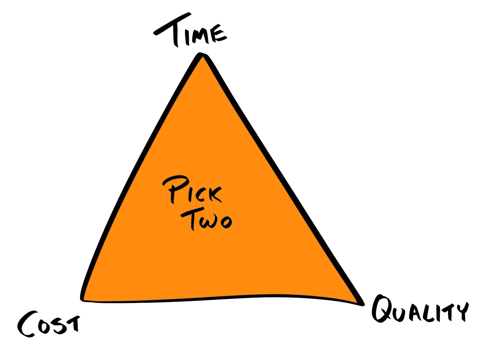
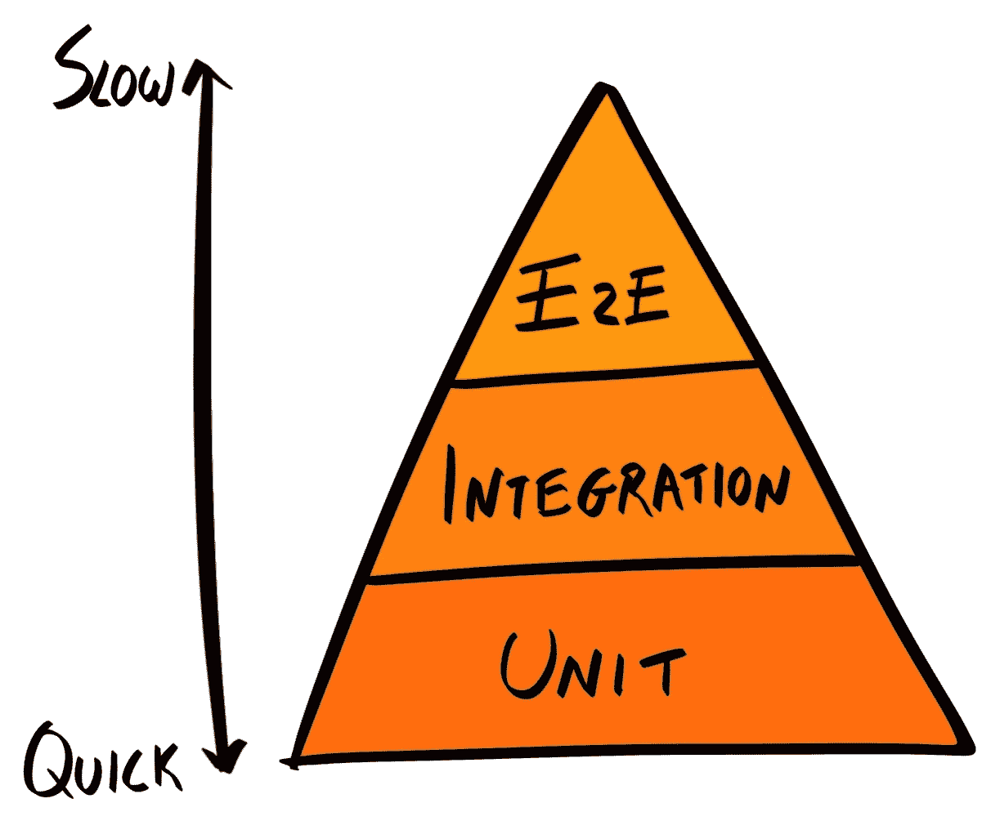

# 第一章：优质代码的重要性

区分一家好公司与一家伟大公司的因素之一就是他们的流程。在一家伟大的公司中，每个人都清楚自己应该做什么，可以期待别人做什么，公司的愿景以及工作场所的哲学。有了这个基础，员工就有自由发挥创造力和创新，在公司设定的流程和边界内工作。

当没有流程时，就会陷入混乱。开发者不知道该期待什么——需求和要求是否已经文档化？我能在哪里找到它们？他们也不会理解对他们的期望——我需要编写测试吗？这是一个**概念验证**（**PoC**）吗？我应该测试哪些边缘情况？没有流程，经理和开发者将浪费时间去追逐需求和澄清，这让他们更少的时间去发挥创造力和创新，从而在自己的工作中表现出色。

最终，混乱的环境会导致产品质量降低。在技术方面，将会有更多的**技术债务**——需要以后修复的 bug 和不效率。产品团队也会受到影响，因为能交付的功能会更少。

对于这些公司来说，最好的改进方式就是通过在技术层面上实施**测试驱动开发**（**TDD**），以及在管理层面上采用**敏捷**原则和/或实施**Scrum**框架来简单地开始实施稳健的过程。在本章中，我们将重点关注技术方面——实施 TDD。具体来说，我们将涵盖以下内容：

+   技术债务是什么？

+   技术债务的原因和后果是什么？

+   通过实施 TDD 减少技术债务

# 技术债务

软件工程 Stack Exchange（[`softwareengineering.stackexchange.com/`](https://softwareengineering.stackexchange.com/)）网站上最受欢迎的问题之一是：

*“我 90%的时间在做维护，10%的时间在做开发，这是正常的吗？”*

虽然这永远不应该被视为正常，但对于许多开发者来说，这是他们的现实。那么，为什么这么多项目最终会陷入不可维护的状态呢？毕竟，每个项目都是从一张白纸开始的。

有些人可能会说这是因为大多数程序员天生懒惰，但大多数人也都为自己的工作感到自豪，并重视质量胜过速度。其他人可能会说这是因为开发者能力不足，但即使是雇佣了非常才华横溢的技术团队的公司也会成为受害者。

我的理论是，在漫长的开发过程中，很容易在过程中做出小的让步，牺牲代码质量以节省其他资源，通常是时间。例如，你可能为了赶工期而停止编写测试，或者因为你的经理向你保证项目只是一个原型或**最小可行产品**（**MVP**）而放弃重构。这些小的让步逐渐积累。很多时候，截止日期变得越来越不合理，而 MVP 变成了公司的旗舰产品。这就是我们在这个世界上有这么多难以维护的项目的原因。

“今天的大多数软件非常像一座埃及金字塔，上面堆叠着数百万块砖头，没有结构完整性，只是通过 brute force 和成千上万的奴隶完成的。”

– Alan Kay，Smalltalk 的创造者

这些妥协，虽然当时看起来很小，但对之后编写的代码有连锁反应。这种累积效应被描述为*技术债务*的隐喻，它利用了金融债务的类比，其中你在现有债务上产生复利。

# 什么是技术债务？

技术债务是由美国计算机程序员 Ward Cunningham 创造的一个隐喻：

“一点债务可以加快开发速度，只要它能及时通过重构偿还……危险在于债务没有偿还。在不太正确的代码上花费的每一分钟都算作债务的利息。”

例如，如果你想开始自己的生意，但没有足够的个人储蓄，你可能会选择向银行贷款。在这种情况下，你现在承担了一小笔债务，以便在将来你的生意盈利时获得更大的回报。

同样，你可能会决定承担一些技术债务，以抓住**先发优势**（**FMA**），在竞争对手进入市场之前推出一个功能。债务的形式是编写不良的代码；例如，你可能会把所有内容都写在一个文件中（俗称大杂烩），没有任何模块化或测试。

在这两种情况下，债务都是基于预期将来会以利息的形式偿还。

对于开发来说，偿还债务的形式是**重构**。这是将编写不良的代码修订到可接受标准的过程，需要重新投资时间和人力。通过承担技术债务，你实际上是在现在以适度的开发速度提升换取未来的显著下降。

问题在于债务没有足够快地偿还。在某个时候，项目维护的工作量如此之大，以至于无法添加更多功能，企业可能会选择进行完全的重写。

# 技术债务的原因

在我们讨论如何应对技术债务之前，让我们首先考察一些最常见的原因：

+   **缺乏人才**：缺乏经验的开发者可能不会遵循最佳实践，编写不干净的代码。

+   **时间不足**：设定不合理的截止日期，或者在不分配额外时间的情况下添加新功能，意味着开发人员没有足够的时间遵循编写测试、进行代码审查等正确流程。

+   **士气低落**：我们不应忽视开发的人类方面。如果需求经常变化，或者要求开发人员加班，那么他们不太可能产出优质的工作。

所有这些原因都很容易得到缓解。缺乏经验的开发人员问题可以通过导师制、代码审查和一般培训来解决。通过提供更好的工作环境，可以缓解士气问题。缺乏时间的问题可以通过将项目范围缩小到更可实现的目标来解决；这可能意味着将非必要功能推迟到后续阶段。除此之外，企业可以雇佣更多员工和/或外包定义明确的模块的开发给外部承包商。

真正的问题在于不愿意解决技术债务，因为技术债务的最大原因是**现有的技术债务**。任何依赖于糟糕代码的新代码很快就会成为技术债务的一部分，并产生后续的债务。

# 债务螺旋

当你与产品经理或企业主交谈时，他们中的大多数都理解技术债务的概念；然而，我遇到的大多数经理或企业主也倾向于高估短期回报并低估长期后果。他们认为技术债务就像银行发放的个人贷款，年利率约为 3%的**年化百分比率**（**APR**）；实际上，它更像是一种收取 1500% APR 的工资日贷款。

事实上，债务隐喻并不完全准确。这是因为，与正式的贷款不同，当你产生技术债务时，你实际上不知道利率或还款期限。

技术债务可能需要一周的重构时间，你可以无限期地推迟，或者它可能在你几天后花费你几个月的时间。技术债务的影响很难预测和量化。

此外，没有保证通过产生债务，当前的一组功能实际上会更快完成。通常，技术债务的后果几乎是立即的；因此，通过匆忙，它实际上可能会在同一个开发周期内减慢你的进度。技术债务短期收益的预测和量化非常困难。从这个意义上说，产生技术债务更像是赌博而不是贷款。

# 技术债务的后果

接下来，让我们来探讨技术债务的后果。其中一些是显而易见的：

+   开发速度将减慢

+   需要更多的人力（以及因此的钱）和时间来实现同一组功能

+   更多的错误，这进而意味着用户体验更差，以及需要更多人员进行客户服务

另一方面，技术债务的人为成本往往被忽视；因此，让我们在这里花些时间讨论它。

# 技术债务导致士气低落

大多数开发者都想在可以开发新功能的**绿色地带**项目中工作，而不是继承充满错误和技术债务的遗留**棕色地带**项目。这可能会降低开发者的士气。

在某些情况下，那些在棕色地带项目上工作的人甚至可能对在绿色地带项目上工作的同事表现出敌意。这是因为新的框架、库和范式最终会取代旧的，使它们过时。那些在遗留项目上工作的人知道他们发展的技能在几年后将变得毫无价值，这使得他们在就业市场上竞争力降低。相比之下，他们的同事在更现代的框架上获得了宝贵的经验，这将增加他们的市场价值。我无法想象一个开发者会高兴地知道他们的技能正变得越来越不相关。

此外，拥有技术债务可能会在开发者和他们的经理之间引发关于最佳还款时间的分歧。通常，开发者要求立即还款，而（缺乏经验的）经理可能会试图将其推迟。

总体而言，项目中有技术债务往往会降低其开发者的士气。

# 低士气的后果

反过来，低士气会导致以下情况：

+   **低生产力**：缺乏动力的开发者更有可能工作速度慢，休息时间更长，并且对业务参与度低。

+   **低代码质量**：开发是一个创造性的过程——实现一个功能的方式不止一种。士气低落的开发者不太可能愿意找出最佳方法——他们只会选择最省力的方法。

+   **高离职率**：不快乐的开发者会寻找更好的工作，导致公司员工的高流动率。这意味着为培训开发者和将其融入团队所投入的时间是浪费的。此外，它可能导致其他员工对公司失去信心，从而产生连锁反应，导致人员流失。

一些管理者可能会辩称，业务不应对其开发者的幸福负责——他们支付他们工资是为了产生工作和价值，而不是为了快乐。虽然这是真的，但经验丰富的项目经理应该记住，一个开发团队不是一个机器——它由人组成，每个人都有自己的抱负和情感。因此，经理在做出商业决策时，明智的做法是考虑技术债务的人为成本。

# 通过重构来偿还技术债务

尽管技术债务有负面影响，但承担技术债务往往是不可避免的。在这种情况下，你必须确保决策是知情和有意识的，并记住尽快偿还债务。那么我们实际上是如何偿还债务的呢？我们通过*重构*——或者使我们的代码*更干净*——*不改变现有行为*来偿还债务。

虽然没有关于**干净**的正式定义，但以下是一些干净代码的迹象：

+   **结构良好**：代码应由模块组成，模块之间由领域分隔

+   **文档齐全**：例如，包括单元测试、内联注释、自动生成的文档和`README`文件

+   **简洁**：简洁，但不要达到混淆的程度

+   **格式良好且易于阅读**：其他开发者必须能够审查和在此代码库上工作，因此它应该易于理解，并且不应偏离既定的良好惯例太远

随着你经验的增加，你将能够检测到偏离这些迹象的代码。在编程中，我们称这些偏差为**代码恶臭**。代码恶臭是违反既定设计原则、范式和模式的代码中的弱点。虽然它们本身不是错误，但它们可能会减慢开发速度，并使代码库更容易出现错误。

因此，重构只是一个将当前代码库从有很多代码恶臭转变为更干净的过程。正如我们之前提到的，实现相同结果的方法不止一种，开发者需要富有创造力，并找出解决出现问题的最佳解决方案。

这里的重要点是开发者应该有时间进行重构；换句话说，重构应该是开发过程的核心部分，并包含开发者提供的时间估计中。

# 预防技术债务

预防胜于治疗。与其承担技术债务，不如从一开始就避免它？在这里，我们概述了一些你可以采用的简单策略来预防技术债务。

# 通知决策者

大多数决策者，尤其是那些没有技术背景的人，大大低估了技术债务的影响。此外，在他们看来，开发者并不理解偿还技术债务在人力、薪资和时间方面的商业成本。

因此，对于专业开发者来说，理解决策者的视角以及他们必须在其中工作的约束非常重要。其中一个最相关的模型是**三重约束**模型。

# 三重约束

经典的项目管理三角形（也称为三重约束或*铁三角*）提出了流行的说法“时间、质量、成本”。选择两个。三角形如下所示：



三重约束是项目管理中用于可视化任何项目约束的一个模型，并考虑如何优化一个区域会导致另一个区域受损：

+   **时间和质量**：你可以在短时间内设计和构建一个高质量的平台，但你需要雇佣很多经验丰富的开发者，这将很昂贵。

+   **时间和成本**：你可以用几个缺乏经验的开发者快速构建一个平台，但质量会很低。

+   **质量和成本**：你可以让一些缺乏经验的开发者设计和规划一个平台，这将是一个高质量的平台，但需要花费很长时间，因为他们需要时间来学习原则并应用它们。

大多数企业主要受时间和成本的限制：时间上，因为产品未能按时推出，竞争对手就有更大的机会推出类似产品并抢占**先发优势**（**FMA**）；成本上，因为公司在产品不产生任何收入的同时，仍需支付员工薪水。

为了加剧这个问题，许多经理和商业所有者更关注可触摸的、即时的结果，而不是长期回报。因此，当面临选择时，大多数决策者会选择时间和成本而不是质量。

# 三重约束的谬误

这里的谬误在于，通过忽视质量和累积债务，他们最终会大大增加时间和成本需求。

因此，开发者的责任是向产品经理和商业所有者告知累积技术债务的不可预测影响，为他们提供所有所需的信息，以便做出明智的决定。你可能想从积极的角度来处理这个问题——清理技术债务将允许未来开发新功能更快完成。

这样做是为了防止最坏的情况发生，即修复代码所需的努力大于从头开始重写。

# 拒绝开发

如果代码库糟糕到接近无法修复（这是军事俚语“Fucked Up Beyond Any Repair”的变体），那么一个更极端的方法可能是拒绝进一步开发，直到重构完成。考虑到你冒犯的是支付你薪水的人，这可能会显得有些极端。虽然这是一种逃避责任的方法，但这并不是专业开发者应该做的事情。

用罗伯特·C·马丁的《代码整洁之道》中的一个类比来重新表述：假设你是一名医生，一位患者要求你为他/她进行心脏手术以缓解喉咙痛，你会怎么做？当然，你会拒绝！患者不知道什么最适合他们，这就是为什么他们必须依赖你的专业意见。

同样，大多数业务所有者不知道从技术上讲什么最适合他们，这就是为什么他们雇佣你来为他们的业务做出最佳的技术决策。他们付钱给你不仅仅是为了编码；他们付钱给你是因为他们希望你能为业务带来价值。作为一名专业人士，你应该考虑你的行为对业务是有益还是有害，无论是短期还是长期。

业务所有者也需要信任他们的开发者的建议。如果他们不尊重他们的专业意见，那么他们最初就不应该雇佣他们。

# 不要成为英雄

然而，不合理要求的责任并不总是业务所有者的错；承诺这些要求的开发者同样有责任。

记住，业务所有者或你的经理的角色是尽可能多地从你这里得到东西。但更重要的是，你有责任告诉他们什么可行什么不可行；因此，当被要求在无法保证质量的情况下在截止日期前完成功能时，*不要接受这个截止日期*。

你可能认为业务会因为你走得更远，使不可能变为可能而感激你，但这一想法有四个问题：

1.  你可能实际上无法按时完成这个功能，而业务已经制定了一个依赖于该截止日期的策略。

1.  你已经向经理表明你愿意接受这些截止日期，因此他们下次可能会设定更紧的截止日期，即使他们不需要这么做。

1.  赶进度编写代码很可能会累积技术债务。

1.  你的同事开发者可能会怨恨你，因为他们可能不得不加班以跟上你的进度；否则，他们的经理可能会认为他们工作缓慢。这也意味着他们不得不在你赶进度编写的代码之上进行开发，使得日常工作变得不那么愉快。

有时候需要挺身而出拯救一家企业，但如果你做得太过频繁，实际上是在伤害团队。危险在于你或业务所有者都没有意识到这一点；事实上，你甚至可能会天真地庆祝取得的快速进展。

解决这个问题的方法是管理业务所有者的期望。如果你认为有 50%的几率能够按时完成乐观的截止日期，那么请要求进一步缩小范围，直到你对自己的估计更有信心。从经验来看，业务所有者宁愿提前一个月听到“不可能”而不是未能实现的“一切都会完成”的承诺。

# 定义流程

这让我回到了定义和记录流程的话题。好的代码始于良好的规划、设计和管理，并由良好的流程维护。许多之前概述的问题可以通过明确说明以下问题来减轻：

+   在某些情况下，累积技术债务是合适的，例如，为了满足法律要求，如 GDPR 合规性。

+   开发者可以期待获得时间来偿还这些债务的场合，例如，在开始下一个功能之前，或在每个季度的最后两周。

+   例如，在团队中，绿色场/棕色场项目的工作分配，可以通过轮换制度进行。

+   **完成定义** – 一系列必须满足的标准，在功能被视为“完成”之前，例如，代码通过所有测试并经过同行评审，以及文档已更新。

软件开发范式，如*敏捷*和**瀑布**，以及它们的实现，如*Scrum*和**看板**，提供了不同的方式来定义和执行这些流程。例如，在 Scrum 中，开发是在短周期内进行的（通常是每周和四周），称为**冲刺**。每个冲刺开始时，会举行会议来审查待办任务并选择本冲刺要解决的问题。每个冲刺结束时，会举行一个**回顾**会议来审查冲刺进度，并确定可以应用于后续冲刺的教训。

虽然这些范式和方法在软件开发中很流行，但它们与任何技术流程都没有耦合。相反，它们处理整个开发过程，包括收集需求规格、与客户沟通、设计、开发和部署。

因此，对开发者来说，更相关的是开发技术，这些技术指定了开发者应该如何开发一个功能。最突出的技术是 TDD。

# 测试驱动开发

测试驱动开发（Test-Driven Development，简称 TDD）是由 Kent Beck 创建的一种开发实践，它要求开发者在实现功能之前先编写测试用例。这提供了一些直接的好处：

+   它允许你验证你的代码是否按预期工作。

+   如果你先编写测试用例，然后运行它，并且它没有失败，那么这就是一个提示你再次检查测试的机会。这可能是你无意中偶然实现了这个功能，也可能是你的测试代码中存在错误。

+   由于现有功能会被现有测试覆盖，它允许测试运行者在新的代码破坏了之前功能正常运行的代码时通知你（换句话说，检测到**回归**）。这对于开发者来说尤为重要，当他们继承他们不熟悉的旧代码库时。

因此，让我们来探讨 TDD 的原则，概述其过程，并看看我们如何将其纳入我们的工作流程。

TDD 有不同的风格，例如**验收测试驱动开发**（**ATDD**），其中测试用例反映了业务设定的验收标准。另一种风格是**行为驱动开发**（**BDD**），其中测试用例用自然语言表达（也就是说，测试用例是可读的）。

# 理解 TDD 过程

TDD 包括以下步骤的快速重复：

1.  识别你特性中最小未实现的功能单元。

1.  识别一个测试用例并为它编写测试。你可能想要有覆盖 **happy path**（默认场景，不产生错误或异常）以及 **unhappy paths**（包括处理 **边缘情况**）的测试用例。

1.  运行测试并查看它失败。

1.  编写最少的代码使其通过。

1.  优化代码。

例如，如果我们想构建一个数学实用库，那么我们的 TDD 循环的第一个迭代可能看起来像这样：

在这里，我们使用 Node 的 `assert` 模块，以及 Mocha 测试框架提供的 `describe` 和 `it` 语法。我们将在第五章 Writing End-to-End Tests 中详细说明它们的语法。同时，你可以简单地将以下测试代码视为伪代码。

1.  **选择一个特性**：在这个例子中，让我们选择 `sum` 函数，它只是简单地将数字相加。

1.  **定义一个测试用例**：当使用 `15` 和 `19` 作为参数运行 `sum` 函数时，它应该返回 `34`：

```js
var assert = require('assert');
var sum = require('sum');
describe('sum', function() {
 it('should return 34 when 15 and 19 are passed in', function() {
   assert.equal(34, sum(15, 19));
 });
});
```

1.  **运行测试**：它失败了，因为我们还没有编写 `sum` 函数。

1.  **编写代码**：编写一个 `sum` 函数，使其能够通过测试：

```js
const sum = function(x, y) {
  return x + y;
}
```

1.  **优化**：不需要优化。

这完成了 TDD 流程的一个循环。在下一个循环中，我们将对同一个函数进行工作，但定义额外的测试用例：

1.  **选择一个特性**：我们将继续开发相同的 `sum` 函数。

1.  **定义一个测试用例**：这次，我们将通过提供三个参数，`56`、`32` 和 `17`，来测试它，我们期望得到的结果是 `105`：

```js
describe('sum', function() {
 ...
 it('should return 105 when 56, 32 and 17 are passed in', function() {
   assert.equal(105, sum(56, 32, 17));
 });
});
```

1.  **运行测试**：它失败了，因为我们的当前 `sum` 函数只考虑了前两个参数。

1.  编写代码：更新 `sum` 函数以考虑前三个参数：

```js
const sum = function(x, y, z) {
  return x + y + z;
}
```

1.  **优化**：通过使函数能够处理任意数量的参数来改进函数：

```js
const sum = function(...args) => [...args].reduce((x, y) => x + y, 0);
```

注意，只传递两个参数仍然可以工作，所以原始行为没有改变。

一旦完成足够多的测试用例，我们就可以继续到下一个函数，比如 `multiply`。

# 修复错误

通过遵循 TDD，错误数量应该会大幅减少；然而，没有任何流程可以保证代码无错误。总会有些边缘情况被忽略。之前，我们概述了实现新特性的 TDD 流程；现在，让我们看看如何将同样的流程应用于修复错误。

在 TDD 中，当遇到错误时，它被处理得和新增特性一样——你首先编写一个（失败的）测试来重现错误，然后更新代码直到测试通过。将错误作为测试用例记录下来确保错误在未来得到修复，防止回归。

# TDD 的好处

当你刚开始学习编码时，没有人是从编写测试开始的。这意味着对于许多开发者来说，代码中有测试是一个事后考虑的事情——如果时间允许，那是一种奢侈。但他们没有意识到的是，**每个人都会测试他们的代码**，无论是有意还是无意。

在你编写了一个函数之后，你怎么知道它是否工作？你可能打开浏览器控制台并使用一些虚拟测试参数运行函数，如果输出符合你的预期，那么你可能会假设它正在工作。但你所做的是实际上**手动测试**了一个已经实现的函数。

手动测试的优势在于它不需要前期成本——你只需运行函数并查看它是否工作。然而，缺点是它不能自动化，从长远来看会消耗更多时间。

# 避免手动测试

相反，你应该将这些手动测试正式定义为代码，形式为**单元测试**、**集成测试**和**端到端测试（E2E**）等。

正式定义测试的初始成本较高，但好处是测试现在可以自动化。正如我们将在第五章中讨论的，“编写端到端测试”，一旦测试被定义为代码，我们就可以使用**npm 脚本**在代码每次更改时自动运行它，使得未来运行测试的成本几乎为零。

事实是，你无论如何都需要测试你的代码；这只是一个选择，是现在投资时间自动化它以节省未来的时间，还是现在节省时间但未来在手动重复每个测试上浪费更多时间。

迈克·科恩（Mike Cohn）提出了**测试金字塔**的概念，它表明一个应用程序应该有很多单元测试（因为它们运行速度快且成本低），较少的集成测试，以及更少的 UI 测试，这些测试需要最多的时间和成本来定义和运行。不言而喻，手动测试应该在单元、集成和 UI 测试彻底定义之后进行：



# 测试作为规范

虽然避免手动测试是 TDD 的好处之一，但它绝对不是唯一的。开发者在实现功能后仍然可以编写他们的单元、集成和端到端测试。那么在实现之前编写测试的好处是什么？

答案是它迫使你思考你的需求并将它们分解为原子单元。然后你可以围绕一个特定的需求编写每个测试用例。最终结果是测试用例构成了你功能的规范。先编写测试有助于你围绕需求来结构化代码，而不是将需求适应到代码中。

这也有助于你遵守**你不需要它**（**YAGNI**）原则，该原则防止你实现实际上不需要的功能。

“总是在你实际上需要的时候实现事物，而不是仅仅预见你需要它们的时候。”

– Ron Jeffries，极限编程（XP）的联合创始人

最后，编写测试（以及因此的规范）迫使你思考你的函数消费者将如何使用接口与你的函数交互——是否应该将所有内容都定义为`options`对象内的属性，或者应该是一个普通的参数列表？

```js
// Using a generic options object
User.search(options) {
  return db.users.find(options.name, {
    limit: options.limit,
    skip: options.skip
  })
}

// A list of arguments
User.search(name, limit, skip) {
  return db.users.find(name, {limit, skip});
}
```

# 测试作为文档

当开发者想要使用一个工具或库时，他们通过阅读包含可尝试代码样本的文档或指南来学习，或者通过遵循教程来构建一个基本的应用程序。

测试用例本质上可以充当代码样本，并成为文档的一部分。事实上，测试是所有代码样本中最全面的一套，涵盖了应用程序关心的每一个用例。

尽管测试提供了最好的文档形式，但仅凭测试是不够的。测试用例不提供代码的上下文，例如它如何融入整体业务目标，或者传达其实施背后的理由。因此，测试应该由内联注释、自动生成的以及手动编写的文档来补充。

# 短的开发周期

由于 TDD 一次关注一个功能块，其开发周期通常非常短（几分钟到几小时）。这意味着可以快速进行小规模的增量更改并发布。

当 TDD 在软件开发方法（如 Scrum）的框架内实施时，小型的开发周期允许方法实践者捕捉团队进度的细粒度指标。

# TDD 采用困难

尽管 TDD 在开发技术中是黄金标准，但有许多障碍阻碍了其实施：

+   **缺乏经验的团队**：TDD 只有在整个开发团队采用它时才能发挥作用。许多初级开发者，尤其是自学成才的开发者，从未学习过编写测试。

    好消息是，TDD 并不难；给一天或两天的时间，开发者可以现实地了解不同类型的测试，包括如何监视函数和模拟数据。投资时间培训开发者，以便他们可以在整个雇佣期间编写更可靠的代码，这是明智的。

+   **初始开发速度较慢**：TDD 要求产品所有者创建规范文档，并要求开发者在编写任何功能性代码之前编写测试。这意味着最终产品可能需要更多的时间来完成。这回到了本章中反复出现的一个主题：现在付出代价，还是以后付出利息。如果你到目前为止一直在阅读，那么第一个选择显然是更好的。

+   **遗留代码**：许多遗留代码库没有测试，或者测试不完整；更糟糕的是，可能缺乏足够的文档来理解每个函数的设计目的是什么。我们可以编写测试来验证我们已知的功能，但我们不能确定它是否涵盖了所有情况。这是一个棘手的问题，因为 TDD 意味着你先写测试；如果你已经有了所有代码，那么它就不能是 TDD。如果代码库很大，你可以在开始重写的同时继续修复错误（在修复的同时将它们作为单元测试记录下来）。

+   **慢速测试**：TDD 只有在测试可以快速运行（几秒钟内）时才是实用的。如果测试套件需要几分钟才能运行，那么开发者将不会收到足够的快速反馈，使得这些测试变得有用。

    减少这种问题的最简单方法是将代码分解成更小的模块，并对它们分别进行测试。然而，一些测试，如大型集成和 UI 测试，不可避免地会很慢。在这些情况下，你只能在代码提交和推送时运行它们，可能通过将它们集成到持续集成（CI）系统中来实现，这将在第八章“编写单元/集成测试”中介绍。

# 不使用 TDD 的情况

虽然我鼓励你将 TDD 融入你的工作流程，但我应该声明它并不是万能的。TDD 并不能神奇地让你的代码性能更好或模块化；它只是强迫你更好地设计系统的一种技术，使系统更易于测试和维护。

此外，TDD 会带来很高的初始成本，所以有一些情况下这种投资是不明智的：

+   首先，当项目是一个**概念验证**（**PoC**）时。这是商业和开发者只关心想法是否可行，而不是其实现的地方。一旦概念被证明是可行的，商业方可能会同意为这个功能的适当开发批准额外的资源。

+   其次，当产品负责人没有定义清晰的需求（或者不想定义），或者需求每天都在变化时。这种情况比你想象的要常见，因为许多早期初创公司都在不断调整以找到合适的市场定位。不用说，这对开发者来说是个糟糕的情况，但如果你发现自己处于这种状况，那么编写测试将是浪费时间，因为需求一旦改变，测试可能就会过时。

# 摘要

在本章中，我们探讨了技术债务的原因、后果以及预防方法。然后，我们介绍了 TDD 作为一种避免技术债务的过程；我们概述了它的好处，以及如何在你的工作流程中实施它。第五章《编写端到端测试》和第六章《在 Elasticsearch 中存储数据》，我们将更深入地探讨不同类型的测试（单元测试、集成测试和端到端/验收测试）。

无论定义如何，好的代码在长期来看都比坏代码花费的时间更少。意识到这一事实并拥有从一开始就建立强大基础的纪律是明智的。你可以在薄弱的基础上建造房屋，它可能能站立一百年，但如果你在薄弱的基础上建造摩天大楼，它可能会比你想象的更快倒塌。

"始终以这样的心态编写代码：最终维护你代码的人可能是一个知道你住处的暴力狂人。"

—— 约翰·F·伍兹
