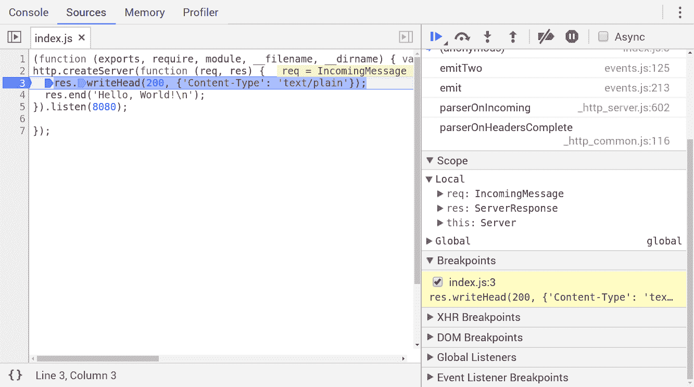
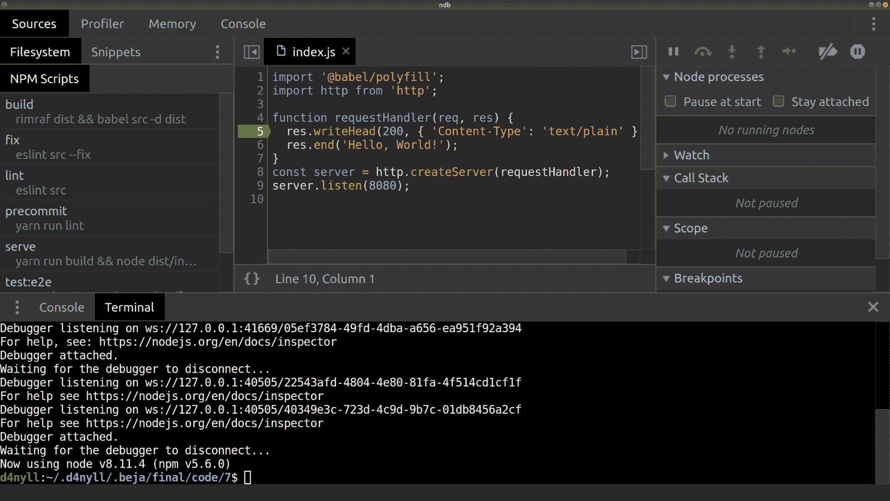
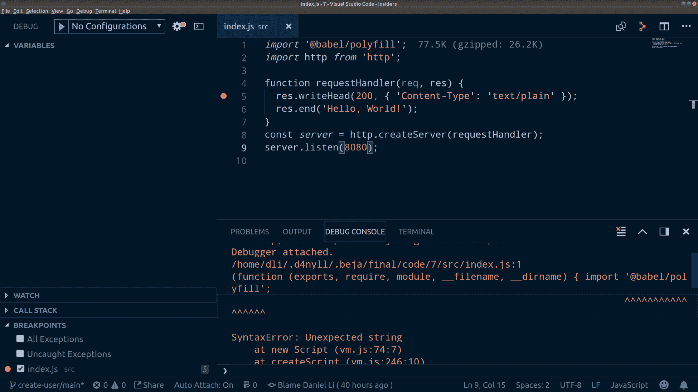
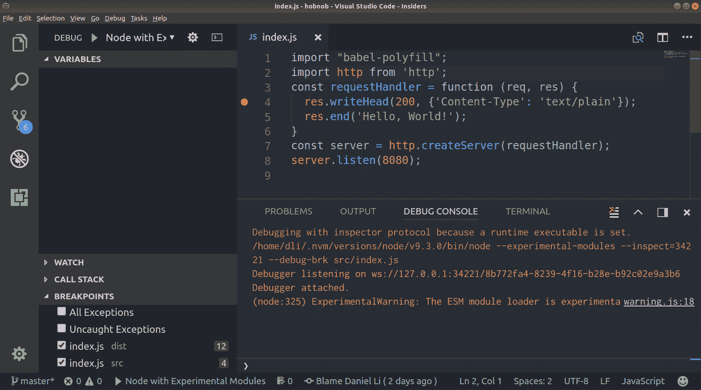
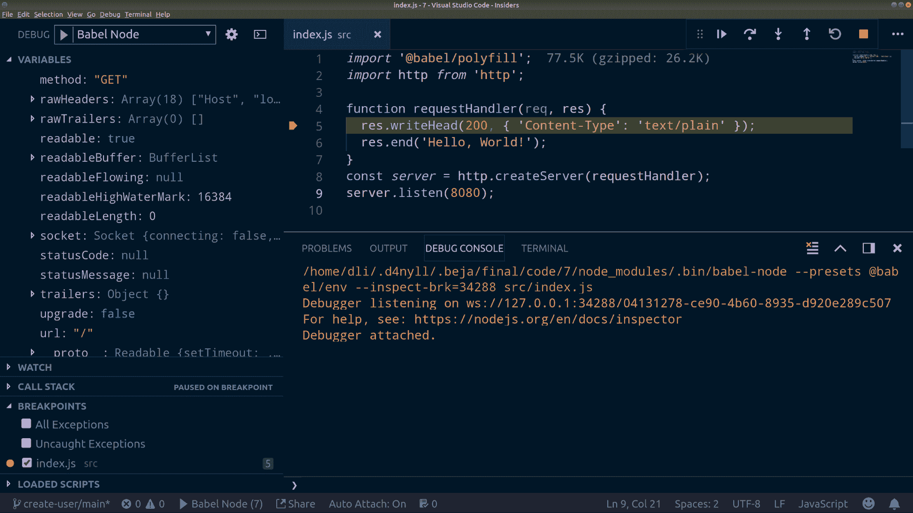

# 第五章：编写端到端测试

在上一章，第四章，*设置开发工具*中，我们成功启动了我们的项目。在本章中，我们将开始开发我们的用户目录 API，它仅由 **创建、读取、更新和删除**（**CRUD**）端点组成。

在 第一章，*良好代码的重要性*中，我们讨论了测试的重要性，并简要概述了 **测试驱动开发**（**TDD**）的原则和高级流程。但理论和实践是两件非常不同的事情。在本章中，我们将通过首先编写 **端到端**（**E2E**）测试，然后使用它们来驱动我们 API 的开发来实践 TDD 方法。具体来说，我们将做以下几件事：

+   了解不同类型的测试

+   练习实现 TDD 工作流程，特别是遵循 **红-绿-重构** 循环

+   使用 **Cucumber** 和 **Gherkin** 编写端到端测试

# 理解不同类型的测试

首先，让我们了解不同类型的测试以及它们如何适应我们项目的流程。首先要注意的是，有些测试更侧重于技术，而有些则更侧重于业务；有些测试只关注整个系统的一个非常小的部分，而有些则测试整个系统。以下是您可能会遇到的最常见测试类型的简要概述：

+   **单元测试**：这些测试应用程序中最小的可测试部分，称为**单元**。例如，如果我们有一个名为 `createUser` 的函数，我们可以编写一个单元测试来测试该函数始终返回一个承诺。

    在单元测试中，我们只关心单元的功能，*独立于外部依赖*。如果单元有外部依赖，例如数据库，我们必须用伪造的客户端替换真实的数据库客户端。这个伪造客户端必须能够充分模拟数据库的行为，以便从被测试单元的角度来看，伪造的行为与真实的数据库相同。

    我们将在稍后更详细地讨论伪造内容，但重要的是要记住，单元测试测试的是整个代码库中很小且特定的组件，使用最少的（或没有）依赖，并且不调用应用程序的其他部分（也就是说，没有**副作用**）。

+   **集成测试**：这些测试不同单元是否可以作为一个单一、更大的整体协同工作。以我们的例子继续，`createUser` 函数可能依赖于 `Auth` 模块来检查客户端是否有权限创建用户。我们可以创建一个测试用例，其中 `createUser` 使用未认证的客户端调用，并断言该函数抛出错误。

    集成测试测试两个或多个单元之间的集成，并确保它们是兼容的。在我们的例子中，如果`Auth`模块更改其响应负载的数据结构，而我们忘记更新`createUser`方法以消费这种新的数据结构，集成测试应该失败，提醒我们修复它。

+   **端到端/功能测试**：这些测试从开始到结束测试应用程序的流程，就像我们是最终消费者一样。在我们的例子中，我们会尝试通过向`/users`端点发送实际的`POST`请求来创建新用户，因为这是我们的最终用户实际上与我们 API 交互的方式。调用后，我们会检查数据库以确保确实创建了一个用户文档，并且符合预期的数据结构。

+   **用户界面**（**UI**）**测试**：对于包含前端组件的应用程序，UI 测试是模拟真实用户与 UI 交互行为的自动化测试，例如滚动和点击。您可以使用通用的浏览器自动化工具，如**Selenium**（[`www.seleniumhq.org/`](https://www.seleniumhq.org/)），或者特定于框架的工具，如**Enzyme**（[airbnb.io/enzyme/](http://airbnb.io/enzyme/)，用于 React 应用程序）。

+   **手动测试**：这些是无法自动化的测试。手动测试应尽量减少，因为它们不是确定性的，并且运行它们成本很高。除了捕获错误之外，手动测试还可以揭示不直观且/或对**用户体验**（**UX**）不利的场景。

+   **验收测试**：这些与其他已经概述的测试不同，因为它们更侧重于业务需求。它们是由业务利益相关者列出的一组业务需求（而不是功能需求），平台必须满足。例如，这样一个要求可能读作：“95%的所有访客必须在 3 秒内加载页面”。

    这不是一个纯粹的技术要求，但它推动了将要做出的技术决策。例如，开发团队现在可能需要安装分析库来收集有关所有访客网站加载时间的数据，并将优化网站优先于开发新功能。

    验收测试的部分可能以**行为驱动开发**（**BDD**）格式编写，这侧重于实际用户在与平台交互时可能采取的步骤。一个这样的要求可能读作：“给定一个用户已成功认证并且他正在产品页面上，当他点击“添加到购物车”按钮时，则该产品应添加到购物车”。然后，当这个要求通过自动化和/或手动测试得到验证时，它将通过验收测试。

    将验收测试视为开发过程的最终阶段，此时业务利益相关者接受工作已完成。

# 使用测试金字塔结构化我们的测试套件

单元测试是测试的最**细粒度**形式，因为它针对的是项目可能达到的最小细节级别。单元测试让你对应用程序的非常小部分充满信心，但它们也是运行最快的，因为它们不依赖于其他模块、数据库、文件系统或网络。

因此，你可以设置你的单元测试，每次对代码进行更改时都运行；这将在你开发过程中提供及时反馈。

随着你转向集成测试和端到端测试，粒度会降低。这些测试让你对项目更大的一部分充满信心，但它们的运行速度也更慢。

因此，当我们设计测试套件时，我们应该在编写单元、集成和端到端测试之间找到一个平衡。在第一章《良好代码的重要性》中，我们简要提到了**测试金字塔**的概念；让我们在这里应用它，并确保我们的测试套件包含大量的单元测试、较少的集成测试和最少的端到端测试。

# 当实现新功能时，首先编写端到端测试。

对 TDD 和测试金字塔的常见误解是单元测试比端到端测试更重要，你应该首先编写单元测试。这是错误的。TDD 只要求你首先编写测试，但并没有指定你必须使用的测试类型。测试金字塔只是鼓励你平衡测试套件，使其包含更多细粒度的测试；它并没有指定测试的重要性或顺序。

事实上，当实现新功能时，端到端测试是最重要的测试，应该是在构建测试套件时首先编写的测试。端到端测试模拟了最终用户如何与项目交互，通常与业务需求相关。如果你的端到端测试通过，这意味着你正在开发的功能是正常工作的。

此外，通常在编写单元测试之前是不切实际的。单元测试关注的是实现细节，但实现一组功能的方式有很多种，我们的初始解决方案通常是不够标准的。它可能需要经过多次迭代才能变得稳定。由于单元测试与它们所测试的实现紧密耦合，当实现发生变化时，单元测试就会被丢弃。

因此，在实现新功能时，应该首先编写端到端测试；单元和集成测试应该在实现确定之后编写。

最后，端到端测试和单元测试并不是相互排斥的。例如，如果你正在编写一个导出为单个实用函数的库，那么你的端到端测试**就是**你的单元测试。

这是因为您的最终用户将直接与您的单元交互，使得端到端测试和单元测试变得相同。因此，始终牢记您的目标受众，并考虑他们将如何与您的项目互动。使用适当的测试类型来定义与最终消费者的合同/接口，并使用这些测试来推动您的开发。

由于我们正在开发新功能，本章将重点介绍端到端测试。单元和集成测试将在下一章，*TDD Part II: 单元/集成测试*中介绍；而使用 Selenium 的 UI 测试将在第十五章，*使用 React 进行端到端测试*中介绍。手动测试不可编程，因此在本节末尾只简要提及。

# 遵循 TDD 工作流程

接下来，让我们考察一个典型的 TDD 工作流程，看看不同类型的测试是如何融入其中的。

# 收集业务需求

TDD 工作流程从产品经理从业务利益相关者收集**业务需求**开始，然后与技术团队协商以细化这些需求，考虑可行性、成本和时间限制。

需求的范围应该小。如果应用程序很大，产品经理应该根据重要性和紧急性对需求进行优先级排序，并将它们分组到不同的阶段。第一阶段应包含最高优先级的需求，这些需求将首先实施。

这些需求应该定义明确且无歧义，以便没有（误解）的空间。这意味着它们应该尽可能地量化。例如，与其说“应用程序必须快速加载”，不如说“应用程序必须在 iPhone 5S 上在 1 秒内加载”。

其次，需求收集阶段应该是一个涉及许多团队的联合过程。开发者、设计师、产品经理和业务所有者都提供不同的专业知识和观点。通过允许每个人对范围、时间表和整体业务战略提供反馈，这可以帮助团队设定现实的目标并避免常见的陷阱。

# 通过文档正式化需求

一旦每个人都同意当前阶段的需求，正式记录它们就非常重要。当所有相关人员都理解了需求时，他们往往会觉得没有必要写下它们；毕竟，这是一项无聊的任务，没有人愿意做。有人甚至可能会争辩说，这无必要地减缓了开发进度。然而，我们必须抵制这种诱惑，并保持纪律，因为以下原因：

+   **人们记忆力不好**：我曾在一篇在线讨论中读到一条半开玩笑的评论说“好的程序员有好的细节记忆。伟大的程序员有好的整体记忆。传奇程序员根本就没有记忆。”不要依赖你的记忆——写下需求！

+   **这可以防止误解。**

+   **规范化的需求提供了一个** **单一事实来源** (**SSoT**)：在开发过程中，变化往往是唯一的不变因素。需求的变化是不可避免的。99%的需求变更问题在于没有与所有人沟通这一变化，导致不同的团队成员拥有不同、可能冲突的需求快照。通过拥有一个充当 SSoT 的单个文档，我们可以确保每个人都能访问最新的、*并且是相同的*信息。

+   **规范化的需求可以改进**：如果有模糊不清的地方，可以修订需求的语言使其更加明确。如果有人遗漏了重要的点，他们可以添加作为附录。

最后，只有当规范保持最新时，一套正式的需求才有帮助。非常重要的一点是，应该指定一个人负责维护需求文档。否则，每个人都可能认为其他人会更新它，但最终没有人去做。过时的需求可能比没有需求更糟，如果旧版本与最新版本冲突。

然而，这并不意味着负责人必须亲自更新文档；他/她可以指派更适合的人来完成这项任务。但关键是，最终，他/她的责任是确保需求是最新的。

# 将需求细化成规范

需求概述了业务希望应用实现的高级目标，但它没有足够的细节让开发者立即开始实施。需求是不精确的，并且不容易转换为代码，而代码是非常明确的。

相反，开发者需要理解整体业务目标，当前的需求集合，并生成一套更详细的技术规范。规范应包含开发者开始实施所需的足够技术细节。

在我们的案例中，项目的整体目标是“创建一个允许用户登录并更新其配置文件的 Web 应用程序”；第一个需求可能是“创建一个具有创建新用户端点的 API 服务器”。你现在应该考虑如何构建应用程序。例如，你可能将应用程序拆分为以下模块：

+   **身份验证**：允许用户注册和登录

+   **配置文件**：允许用户编辑自己的配置文件并查看他人的配置文件

+   **数据库（s）**：用于存储用户数据

+   **API 服务器**：我们内部服务和外部消费者之间的接口

在心中牢记应用程序的结构后，我们现在可以继续编写规范。正如我们在第一章中提到的，“良好代码的重要性”，最好的规范是测试，所以让我们编写一些测试吧！

# 将测试作为规范编写

测试是最佳规范形式，因为：

+   测试可以运行，这意味着你可以通过编程方式验证你的实现是否符合规范。如果测试通过，则你的实现符合规范。

+   测试是代码的组成部分（即**规范即代码**（**SaC**））。规范变得过时的可能性较小，因为如果它确实如此，测试就会失败。

因此，我们可以将我们的技术规范编写为端到端测试，这随后推动 TDD 开发过程。

记住，单个开发者很难能够想出一套详尽的场景和边缘情况来测试；我们注定会错过一些。这就是为什么测试和代码需要由多个人检查很重要。这可能涉及以对的形式编写测试描述，实施涉及项目内外开发者的代码审查工作流程。这样做最大化了测试的价值，并确保它们覆盖了最相关的边缘情况。

# 测试驱动开发

一旦为我们的选定功能编写了第一个端到端测试，就可以开始 TDD 过程。我们现在应该运行测试，看到它失败，实现功能使其通过测试，然后进行重构。在适当的情况下，应该编写单元和集成测试，以增加对代码的信心。

对每个测试用例重复此过程，直到当前功能集完全实现。

# 编写手动测试

在我们开发功能时，产品经理也应该定义手动测试。需要手动测试，因为并非所有需求都可以自动化，有些可能需要真实用户数据（例如，可用性测试）。例如，验收标准的一部分可能是“95%的用户能在 5 秒内找到设置页面”。在这些情况下，需要进行手动测试。

虽然我们无法自动化此过程，但我们可以用一种结构化的方式将其形式化。我们不是在文本文档中写下需求，而是可以使用**测试用例管理工具**，例如 TestLink ([testlink.org](http://testlink.org/))，以及专有替代品，如 TestRail ([gurock.com/testrail/](http://www.gurock.com/testrail/))、qTest ([qasymphony.com/software-testing-tools/qtest-manager/](https://www.qasymphony.com/software-testing-tools/qtest-manager/))、Helix TCM ([perforce.com/products/helix-test-case-management](https://www.perforce.com/products/helix-test-case-management))、Hiptest ([hiptest.net](https://hiptest.net/))、PractiTest ([practitest.com](https://www.practitest.com/))等。这些测试用例管理系统帮助您定义、运行和记录测试用例。

每个测试都应该包含一组清晰、无歧义的步骤。一组测试人员，理想情况下，对该平台没有先前的了解，然后会被提供指令、预期结果，并询问是否获得的结果与预期相符。

# 探索性测试

最后，你可以简单地要求手动测试人员探索应用程序，或者自行探索 API，而不需要给他们任何要遵循的步骤。这被称为**探索性测试**，可以归类于手动测试。探索性测试的目的是识别遗漏的边缘情况，识别不直观的结果，或者找到可能破坏系统的错误。

# 维护

不可避免的是，所有应用程序，无论测试得多好，都会存在错误和改进的区域。任何工作流程的一个基本部分是允许用户报告错误、提出问题和提问。作为这一点的扩展，我们还需要一个系统来对这些问题进行分类，根据以下标准进行优先级排序：

+   **影响**：有多少用户受到影响？这些用户有多重要？

+   **易用性**：修复这个问题有多容易？

+   **紧急程度**：这个问题的时间敏感性如何？

这可以通过 GitHub 的问题跟踪器、Atlassian 的 JIRA 或类似软件等平台来完成。

当有错误报告时，应该重现并确认。一旦确认，应该编写覆盖该场景的测试用例，以防止未来出现回归。例如，如果错误是`age`字段返回浮点数，则应该编写一个测试用例来测试`age`字段始终是正整数。

# 收集需求

现在我们已经了解了工作流程，让我们将其付诸实践！

我们首先选择我们应用程序的一小部分，并定义其需求。我们选择了创建用户功能，因为许多其他功能都依赖于它。具体来说，该功能要求我们创建一个接受`POST`请求的 API 端点`/users`，并将请求的 JSON 负载（表示用户）存储到数据库中。此外，还应应用以下约束：

+   用户负载必须包括电子邮件地址和密码字段

+   用户负载可以可选地提供一个配置文件对象；否则，将为他们创建一个空配置文件。

现在我们有了需求，让我们使用名为*Cucumber*的工具编写我们的规范作为端到端测试。

# 使用 Cucumber 设置端到端测试

Cucumber 是一个自动化测试执行器，它执行用称为*Gherkin*的**领域特定语言**（**DSL**）编写的测试。Gherkin 允许你用普通语言编写测试，通常是以行为驱动的方式，这样任何人都可以阅读和理解，即使他们不是技术型的人。

Cucumber 有针对不同语言和平台的许多实现，例如 Ruby、Java、Python、C++、PHP、Groovy、Lua、Clojure、.NET，当然还有 JavaScript。JavaScript 实现作为一个 npm 包可用，所以让我们将其添加到我们的项目中：

```js
$ yarn add cucumber --dev
```

我们现在可以开始编写我们第一个功能的规范了。

# 功能、场景和步骤

要使用 Cucumber，你首先将你的平台分成多个 **特性**；然后，在特性内部，你将定义用于测试的 **场景**。对我们来说，我们可以将“创建用户”需求作为一个特性，并开始将其分解为场景，从以下内容开始：

+   如果客户端向 `/users` 发送一个空负载的 `POST` 请求，我们的 API 应该响应一个 `400 Bad Request` HTTP 状态码，并包含适当错误信息的 JSON 对象负载。

+   如果客户端向 `/users` 发送一个非 JSON 负载的 `POST` 请求，我们的 API 应该响应一个 `415 不支持媒体类型` HTTP 状态码，并包含适当错误信息的 JSON 响应负载。

+   如果客户端向 `/users` 发送一个格式错误的 JSON 负载的 `POST` 请求，我们的 API 应该响应一个 `400 Bad Request` HTTP 状态码，并包含适当错误信息的 JSON 响应负载。

我们将在稍后定义更多场景，但让我们先关注这三个，以便我们开始。

每个特性都应该使用 Gherkin 语言在其自己的 `.feature` 文件中定义。所以，我们现在就创建一个。

```js
$ cd <project-root-dir>
$ mkdir -p spec/cucumber/features/users/create
$ touch spec/cucumber/features/users/create/main.feature
```

现在，让我们将我们的创建用户特性中的场景翻译成 Gherkin。

# Gherkin 关键词

在 Gherkin 中，每行非空行都以一个 Gherkin **关键词** 开头（尽管有几个常见的例外）。当我们使用它们时，我们将更详细地介绍相关关键词，但以下是每个关键词及其用法的简要概述：

+   `Feature`: 指定特性的名称和描述。特性只是将相关的场景分组在一起的一种方式。

+   `Scenario`: 指定场景的名称和描述。

+   `Given`, `When`, `Then`, `And`, `But`: 每个场景由一个或多个 **步骤** 组成，每个步骤对应一个将由 Cucumber 执行的 JavaScript 函数。如果在执行所有步骤后没有抛出错误，则测试被认为已通过。这五个步骤关键词是等效的；你应该使用使你的测试最易读的那个。

+   `Background`: 允许你设置一个公共环境来执行所有场景。这可以节省你为所有场景定义重复的设置步骤。

+   `Scenario Outline`: 允许你为具有某些值差异的多个场景定义一个模板。这可以防止指定许多非常相似的场景/步骤。

+   `Examples`: 当使用场景概述时，`Examples` 关键词允许你指定要插入到场景概述中的值。

+   `"""`: 允许你使用 **文档字符串** 来指定多行字符串作为参数。

+   `|`: 允许你指定更复杂的数据表作为参数。

+   `@`: 允许你使用 **标签** 将相关的场景分组在一起。在标记场景之后，你可以指示 Cucumber 仅执行具有特定标签的场景，或者相反，排除具有特定标签的测试。

+   `#`: 允许你指定注释，这些注释将由 Cucumber 跳过执行。

如果你正在使用 Visual Studio Code (VSCode)，我们建议你安装名为*Cucumber (Gherkin) Full Support*的 VSCode 扩展（[github.com/alexkrechik/VSCucumberAutoComplete](https://github.com/alexkrechik/VSCucumberAutoComplete)），它提供语法高亮和代码片段支持。

# 指定我们的特性

因此，让我们通过向`spec/cucumber/features/users/create/main.feature`添加一个名称和描述来开始定义我们的特性：

```js
Feature: Create User

 Clients should be able to send a request to our API in order to create a
 user. Our API should also validate the structure of the payload and respond
 with an error if it is invalid.
```

# 编写我们的第一个场景

接下来，我们将编写我们的第一个场景和步骤。作为提醒，场景是：“如果客户端向`/users`发送一个空的`POST`请求，我们的 API 应该响应一个`400 Bad Request` HTTP 状态码，并包含一个适当的错误信息的 JSON 对象负载”。

```js
Feature: Create User

  Clients should be able to send a request to our API in order to create a
  user. Our API should also validate the structure of the payload and respond
  with an error if it is invalid.

  Scenario: Empty Payload

  If the client sends a POST request to /users with a unsupported payload, it
  should receive a response with a 4xx status code.

  When the client creates a POST request to /users
  And attaches a generic empty payload
  And sends the request
  Then our API should respond with a 400 HTTP status code
  And the payload of the response should be a JSON object
  And contains a message property which says "Payload should not be empty"
```

我们将场景分解成称为**步骤**的模块化单元，并在其前面加上 Gherkin 关键字。在这里，我们使用了关键字`When`、`Then`和`And`，尽管我们可以使用任何五个关键字中的任何一个；我们选择这些是因为它使规范更易于阅读。

通常，你可以将步骤分为三类：

+   **设置**：用于在执行动作之前设置环境。通常，你会使用`Given`关键字来定义设置步骤。

+   **动作**：用于执行动作，这通常是我们要测试的事件。你通常会使用`When`关键字来定义动作步骤。

+   **断言**：用于断言动作的实际结果是否与预期结果相同。通常，你会使用`Then`关键字来定义断言步骤。

此外，你可以使用`And`和`But`关键字将多个步骤链接在一起，使规范更易于阅读。但请记住，所有步骤关键字在功能上是等效的。

# 布局我们的步骤定义

在 Gherkin 的帮助下，我们现在已经用纯英语编写了规范。接下来，让我们尝试使用 Cucumber 来运行我们的规范。

默认情况下，Cucumber 将在项目的根目录中查找名为`features`的目录，并运行它里面找到的`.feature`文件。由于我们将`main.feature`文件放置在`spec/cucumber/features`目录中，我们应该将此路径传递给 Cucumber：

```js
$ npx cucumber-js spec/cucumber/features
UUUUUU

Warnings:
1) Scenario: Empty Payload
 ? When the client creates a POST request to /users
 Undefined.
 ? And attaches a generic empty payload
 Undefined.
 ? And sends the request
 Undefined.
 ? Then our API should respond with a 400 HTTP status code
 Undefined.
 ? And the payload of the response should be a JSON object
 Undefined.
 ? And contains a message property which says "Payload should not be 
 empty"
 Undefined.

1 scenario (1 undefined)
6 steps (6 undefined)
```

测试结果告诉我们，我们的测试是未定义的。这是因为 Cucumber 还不够聪明，无法解析纯文本规范并找出如何运行这些测试。我们必须将这些步骤链接到实际的 JavaScript 代码，在 Cucumber 的上下文中，这些代码被称为**步骤定义**。

在`features`目录旁边创建一个名为`steps`的新目录；这是我们定义所有步骤定义的地方：

```js
$ mkdir -p spec/cucumber/steps
```

在它们自己的目录中定义步骤有助于我们心理上将步骤与任何特定特性分离，并尽可能保持步骤的模块化。在`steps`目录中创建一个名为`index.js`的文件，并添加以下占位符步骤定义：

```js
import { When, Then } from 'cucumber';

When('the client creates a POST request to /users', function (callback) {
  callback(null, 'pending');
});

When('attaches a generic empty payload', function (callback) {
  callback(null, 'pending');
});

When('sends the request', function (callback) {
  callback(null, 'pending');
});

Then('our API should respond with a 400 HTTP status code', function (callback) {
  callback(null, 'pending');
});

Then('the payload of the response should be a JSON object', function (callback) {
  callback(null, 'pending');
});

Then('contains a message property which says "Payload should not be empty"', function (callback) {
  callback(null, 'pending');
});
```

如果你已经在你的编辑器上安装了 ESLint 扩展，你可能会看到 ESLint 对箭头函数和函数名提出抱怨。通常，这些问题是有效的，但在这个测试文件中并不是这样。因此，我们应该覆盖默认配置并关闭这些规则。

在`spec/`目录内，创建一个新的`.eslintrc.json`文件，并粘贴以下内容：

```js
{
  "rules": {
      "func-names": "off",
      "prefer-arrow-callback": "off"
  }
}
```

这将关闭`spec/`目录内所有文件的`func-names`和`prefer-arrow-callback`规则。

每个步骤定义由步骤关键字方法（`When`/`Then`等）组成，它接受两个参数。第一个参数是**模式**，它是一个字符串，用于将特性规范中的文本与步骤定义相匹配。第二个参数是**代码函数**，它是一个为该步骤运行的函数。

在我们的例子中，当 Cucumber 到达我们的场景中的`When the client creates a POST request to /users`步骤时，它会尝试运行与`When('the client creates a POST request to /users')`步骤定义相关联的函数，因为模式与步骤描述匹配。

# 运行我们的场景

在我们实现每个步骤定义背后的逻辑之前，让我们确保我们的设置是正常工作的。默认情况下，Cucumber 会在根级别的`features/`目录内寻找步骤定义；由于我们将定义放在了不同的目录，我们必须使用`--require`标志告诉 Cucumber 在哪里找到它们。

运行`npx cucumber-js spec/cucumber/features --require spec/cucumber/steps`以触发测试：

```js
$ npx cucumber-js spec/cucumber/features --require spec/cucumber/steps
spec/cucumber/steps/index.js:1
(function (exports, require, module, __filename, __dirname) { import { Given, When, Then } from 'cucumber';
 ^^^^^^
SyntaxError: Unexpected token import
```

它返回一个`SyntaxError: Unexpected token import`错误。这是因为我们没有在运行代码之前使用 Babel 进行代码转换，因此`import` ES6 关键字不受支持。这就是`@babel/register`包有用的地方：它允许我们指示 Cucumber 在运行步骤定义之前使用 Babel 作为编译器来处理我们的步骤定义。

首先，让我们将`@babel/register`包安装为开发依赖项：

```js
$ yarn add @babel/register --dev
```

现在，我们可以再次使用带有`--require-module`标志的`cucumber-js`运行，它应该能够找到并运行我们的步骤定义：

```js
$ npx cucumber-js spec/cucumber/features --require-module @babel/register --require spec/cucumber/steps
P-----

Warnings:
1) Scenario: Empty Payload
 ? When the client creates a POST request to /users
 Pending
 - And attaches a generic empty payload
 - And sends the request
 - Then our API should respond with a 400 HTTP status code
 - And the payload of the response should be a JSON object
 - And contains a message property which says "Payload should not be empty"

1 scenario (1 pending)
6 steps (1 pending, 5 skipped)
```

在幕后，Cucumber 会首先执行所有的步骤定义函数（`When`和`Then`等），注册代码函数，并将其与相应的模式关联。然后，它将解析并运行特性文件，尝试将字符串与已注册的步骤定义相匹配。

在这里，测试结果显示为`pending`，因为我们还没有为每个步骤定义实现代码函数，这将在下一节中完成。但在那之前，让我们首先将我们的端到端测试命令正式化为一个 npm 脚本，以节省我们所有的输入：

```js
"test:e2e": "cucumber-js spec/cucumber/features --require-module @babel/register --require spec/cucumber/steps",
```

现在我们已经为运行端到端测试设置了基础设施，现在是时候提交我们的代码了。首先，让我们创建`dev`分支：

```js
$ git branch dev
```

然后，检查新的特性分支`create-user/main`，并将我们的更改提交到仓库：

```js
$ git checkout -b create-user/main
$ git add -A
$ git commit -m "Set up infrastructure for Cucumber E2E tests"
```

# 实现步骤定义

要测试我们的 API 服务器，我们需要运行服务器本身并向其发送 HTTP 请求。在 Node.js 中发送请求有许多方法：

+   使用 Node 的本地 `http` 模块提供的 `request` 方法。

+   使用新的 Fetch Web API 语法：`fetch` 是对传统用于从客户端发起 **AJAX**（**Asynchronous JavaScript And XML**）请求的 `XMLHttpRequest` 的改进。我们可以使用 polyfills，例如 `isomorphic-fetch`（[`www.npmjs.com/package/isomorphic-fetch`](https://www.npmjs.com/package/isomorphic-fetch)），这将允许我们在服务器上使用相同的语法。

+   使用库，例如 `request`（[`www.npmjs.com/package/request`](https://www.npmjs.com/package/request)）、`superagent`（[npmjs.com/package/superagent](https://www.npmjs.com/package/superagent)）、`axios`（[npmjs.com/package/axios](https://www.npmjs.com/package/axios)）以及更多。

使用本地的 `http` 模块允许我们尽可能地进行表达，因为它在最低级别的 API 层面上工作；然而，这也意味着代码可能很冗长。使用 Fetch API 可能会提供更简单的语法，但它仍然会有很多样板代码。例如，当我们收到响应时，我们必须明确告诉我们的代码我们希望如何解析它。

对于我们的用例，使用库可能是最合适的。库更具有意见导向，但它们也节省了你重复编写相同代码的时间；例如，在大多数库中，响应负载会自动解析。在所有可用的库中，我发现 `superagent` 对于我们的测试是最合适的，因为它允许你通过链式多个步骤来组合请求。为了演示，以下是在 `superagent` 的 `README.md` 文件中给出的示例：

```js
request
  .post('/api/pet')
  .send({ name: 'Manny', species: 'cat' }) // sends a JSON post body
  .set('X-API-Key', 'foobar')
  .set('accept', 'json')
  .end((err, res) => {
    // Calling the end function will send the request
  });
```

这允许我们在一开始就启动一个请求对象，并且我们场景中的每个步骤都可以简单地修改该对象，共同组成我们发送到测试 API 服务器的最终请求。现在，让我们不耽搁，安装 `superagent`：

```js
$ yarn add superagent --dev
```

# 调用我们的端点

对于对服务器的第一次调用，我们将其分解为三个步骤：

1.  `当客户端创建一个 POST 请求到 /users`

1.  `附加一个通用的空负载`

1.  `发送请求`

在第一步中，我们将创建一个新的请求对象并将其保存为一个文件作用域的变量，使其在后续步骤中可访问。在第二步中，我们将向请求附加一个空的负载；然而，这已经是 `superagent` 的默认行为，因此我们可以简单地从函数中 `return` 而不进行任何操作。在第三步中，我们将发送请求并将响应保存到另一个变量中。

你现在应该将 `spec/cucumber/steps/index.js` 文件的开头更新为以下片段：

```js
import superagent from 'superagent';
import { When, Then } from 'cucumber';
let request;
let result;
let error;

When('the client creates a POST request to /users', function () {
  request = superagent('POST', 'localhost:8080/users');
});

When('attaches a generic empty payload', function () {
  return undefined;
});

When('sends the request', function (callback) {
  request
    .then((response) => {
      result = response.res;
      callback();
    })
    .catch((errResponse) => {
      error = errResponse.response;
      callback();
    });
});
```

我们的第三个步骤定义涉及向服务器发送请求并等待响应；这是一个异步操作。为了确保在异步操作完成之前不会运行下一个步骤，我们可以将一个`callback`函数传递给代码函数作为最后一个参数。Cucumber 将在`callback`函数被调用之前等待，然后继续到下一个步骤。在这里，我们只在结果返回并将它保存到`result`变量之后执行`callback`。

现在，当我们再次运行我们的端到端测试时，前三个步骤应该通过。

```js
$ yarn run test:e2e
...P--

Warnings:
1) Scenario: Empty Payload
  When the client creates a POST request to /users
  And attaches a generic empty payload
  And sends the request
 ? Then our API should respond with a 400 HTTP status code
 - And the payload of the response should be a JSON object - And contains a message property which says "Payload should not be empty"

1 scenario (1 pending)
6 steps (1 pending, 2 skipped, 3 passed)
```

# 断言结果

现在，让我们继续到我们的下一个步骤定义，这是一个断言步骤。在那里，我们应该断言来自我们服务器的响应应该有一个`400` HTTP 状态码：

```js
Then('our API should respond with a 400 HTTP status code', function () {
  if (error.statusCode !== 400) {
    throw new Error();
  }
});
```

现在，随着我们的 API 服务器在后台运行，再次运行我们的端到端测试。你应该看到第二步的结果从`pending`变为`failed`：

```js
$ yarn run test:e2e
...F--

Failures:
1) Scenario: Empty Payload
  When the client creates a POST request to /users
  And attaches a generic empty payload
 And sends the request
 Then our API should respond with a 400 HTTP status code
 {}
 Error
 at World.<anonymous> (spec/cucumber/steps/index.js:28:11)
 - And the payload of the response should be a JSON object
 - And contains a message property which says "Payload should not be empty"

1 scenario (1 failed)
6 steps (1 failed, 2 skipped, 3 passed)
```

它失败了，因为我们的 API 目前总是返回带有 HTTP 状态码`200`的`Hello World`字符串，无论请求是什么。但这没有什么好担心的！编写失败的测试是 TDD 工作流程的第一步；现在，我们只需要编写足够的代码来使测试通过。

要使我们的第四步通过，我们必须检查`requestHandler`函数中`req`对象的方法和路径，如果分别匹配`POST`和`/users`，我们将返回一个`400`响应。

但我们如何知道`req`对象的结构呢？我们可以使用`console.log`将其打印到控制台，但`req`和`res`等对象的结构复杂，输出将难以阅读。相反，我们应该使用调试器。

# 使用调试器进行 Node.js 调试

**调试器**是一种工具，它允许我们在特定的**断点**处暂停代码的执行，并检查在那个范围内可访问的任何变量。对我们来说，我们希望在服务器的`requestHandler`方法内部暂停执行，以便我们能够检查`req`对象。

# 使用 Chrome DevTools

所有现代浏览器都内置了调试器。Firefox 有 Firebug，Chrome 有 Chrome DevTools：



Chrome 中的调试器位于 Chrome DevTools 的“源”选项卡下。我们在第 3 行设置了一个断点，我们的脚本在那里暂停。在暂停时，我们可以访问作用域内的变量，包括局部和全局作用域，以及由于闭包而可用的作用域。它还列出了我们所有的断点，这样我们就可以轻松地激活/停用它们。

要使用 Chrome DevTools 进行 Node.js 调试，只需在运行`node`时传递`--inspect`标志，然后在 Chrome 中导航到`chrome://inspect/#devices`，并点击打开 Node 的专用 DevTools 链接，这将在一个新窗口中打开调试器。

# 使用 ndb

2018 年 7 月 22 日，Google 发布了 **ndb** ([`github.com/GoogleChromeLabs/ndb`](https://github.com/GoogleChromeLabs/ndb))，这是一个基于 Chrome DevTools 的“改进”调试器，并使用 **Puppeteer** ([github.com/GoogleChrome/puppeteer](https://github.com/GoogleChrome/puppeteer)) 通过 **DevTools Protocol** 与 **Chromium** 交互。它至少需要 Node.js v8.0.0。

你可以通过本地安装来尝试它：

```js
$ yarn add ndb --dev
```

在 Windows 上，你可能还必须安装 `windows-build-tools` 包以编译原生依赖项：

```js
$ yarn global add windows-build-tools
```

然后，你可以使用 `npx` 运行 `ndb` 二进制文件，并将弹出一个新窗口：



ndb 内置了自己的集成终端，它将连接到你从它运行的任何 node 进程。

虽然使用 Chrome DevTools 和/或 ndb 提供了几个独特的优势，例如控制台、内存和配置文件标签页的可用性，但我仍然建议使用你 IDE 或代码编辑器自带的调试器，仅仅是因为在切换不同工具时，上下文切换更少。

我建议使用 Visual Studio Code 作为 JavaScript 项目的代码编辑器，因此我们将使用 VSCode 编辑器来展示我们的工作流程；然而，你仍然可以自由使用你选择的 IDE 或编辑器。

# 使用 Visual Studio Code 调试器

在 VSCode 中打开 `src/index.js`。如果你将鼠标悬停在行号左侧，你会看到一些小的、暗淡的红色圆圈出现；你可以点击圆圈在该行设置断点。这意味着每当脚本执行并到达该行时，它将暂停在那里。这允许我们检查在那个点作用域内可用的变量。请设置第 5 行的断点。

你还可以使用 `debugger` 语句，它具有与设置断点完全相同的效果。唯一的区别是，`debugger` 语句现在将是代码的一部分，这通常不是你想要的：

```js
const requestHandler = function (req, res) {
  debugger;
  res.writeHead(200, {'Content-Type': 'text/plain'});
  res.end('Hello, World!');
}
```

在设置断点后，转到你的编辑器中的调试器标签页。点击开始调试按钮（通常看起来像“播放”按钮：►）；这将执行当前文件：



调试器抛出错误，因为它不识别 ES6 模块的 `import` 语法。这是因为我们直接在源文件上运行调试器，而不是在 Babel 生成的编译文件上。要指示 VSCode 处理模块，我们可以做以下两件事之一：

+   安装 `@babel/node` 包，并指示 VSCode 使用 `babel-node` 执行我们的文件。

+   指示 VSCode 在运行 Node 时添加 `--experimental-modules` 标志。这自 Node v8.5.0 版本以来已被支持。

要执行这些操作中的任何一个，我们需要向 VSCode 调试器添加配置。VSCode 中的配置定义为 `launch.json` 文件内的 JSON 对象。要编辑 `launch.json` 文件，点击顶部附近的齿轮按钮 ()。然后，粘贴以下 JSON 对象，它将为我们提供之前提到的所有配置，以及一个以正常方式运行程序的选择：

```js
{
  "version": "0.2.0",
  "configurations": [
    {
      "type": "node",
      "request": "launch",
      "name": "Node",
      "program": "${file}",
      "protocol": "inspector"
    },
    {
      "name": "Babel Node",
      "type": "node",
      "request": "launch",
      "runtimeExecutable": "${workspaceRoot}/node_modules/.bin/babel-
      node",
      "runtimeArgs": [
        "--presets",
        "@babel/env"
      ],
      "program": "${file}",
      "protocol": "inspector"
    },
    {
      "name": "Node with Experimental Modules",
      "type": "node",
      "request": "launch",
      "runtimeExecutable": "~/.nvm/versions/node/v8.11.4/bin/node",
      "runtimeArgs": [
        "--experimental-modules"
      ],
      "program": "${file}",
      "protocol": "inspector"
    }
  ],
  "compounds": []
}
```

现在，也请记得将 `@babel/node` 包作为开发依赖项安装：

```js
$ yarn add @babel/node --dev
```

# 保留行号

要使用 `babel-node` 与 VSCode 调试器一起使用，我们还需要在 Babel 中启用 `retainLines` 选项，以保留源代码和构建文件之间的行号。如果我们不这样做，VSCode 的调试器会在错误的行设置断点。

然而，我们只想在调试代码时保留行号；当我们构建应用程序时，我们希望它有合理的格式。为此，我们可以更新我们的 `.babelrc`，以便仅在 `BABEL_ENV` 环境变量设置为 `"debug"` 时应用 `retainLines` 选项：

```js
{
  "presets": [
    ["@babel/env", {
      "targets": {
        "node": "current"
      }
    }]
  ],
  "env": {
    "debug": {
      "retainLines": true
    }
  }
}
```

然后，再次打开 `launch.json` 文件，并将以下内容添加到 Babel Node 配置中：

```js
{
  "name": "Babel Node",
  "type": "node",
  ...
  ...
  "protocol": "inspector",
  "env": {
    "BABEL_ENV": "debug"
  }
},
```

# 检查 req 对象

现在，停止你的 API 服务器（如果你正在运行它），回到 `src/index.js`，打开调试面板，选择我们刚才定义的两个配置之一，然后点击开始调试按钮（►）。这次，你应该看到它成功：



如果你在下拉菜单中看不到配置，请尝试关闭并重新启动 Visual Studio Code。

在一个新标签页中，导航到 `localhost:8080`。这次，你不会看到我们的 `Hello, World!` 文本；这是因为我们的服务器还没有提供响应！相反，它已经暂停在我们设置的断点处。

在左侧，我们可以看到一个名为 VARIABLES 的标签页，在这里我们可以看到所有在断点处可用的本地、闭包和全局变量。当我们展开 `req` 变量时，我们会找到 `method` 和 `url` 属性，这正是我们所需要的：



我鼓励你花几分钟时间探索 `req` 和 `res` 对象的结构。

我们已经添加了几个 VSCode 调试器配置，并且应该将这些更改提交到我们的 Git 仓库。然而，VSCode 配置并不是我们创建用户功能的组成部分，应该直接提交到 `dev` 分支。

# 制作工作进行中（WIP）提交

然而，我们已经对创建用户功能做了一些更改，除非我们 `git commit` 或 `git stash` 这些更改，否则我们无法检出 `dev` 分支。理想情况下，我们应该将整个创建用户功能一起提交；在我们的 Git 历史树中保留 **工作进行中**（**WIP**）的提交是不干净的。

为了解决这个困境，我们可以使用 `git stash`，但这可能会相当令人困惑，并且你可能会丢失你的工作。相反，我们现在将提交 WIP 变更，稍后用完整的实现来修正提交。我们可以这样做，因为我们正在本地功能分支上工作，而不是永久的 `dev` 或 `master` 分支之一。这意味着只要我们不将我们的变更推送到远程仓库，其他人就不会知道关于 WIP 提交的事情。

工作流程将如下所示：

1.  在 `create-user/main` 分支上，将我们与创建用户功能相关的 WIP 变更 `git commit`。

1.  `git checkout` 到 `dev` 分支。

1.  再次添加 `@babel/node` 包。

1.  将 VSCode 调试器配置变更 `git commit` 到 `dev` 分支。

1.  `git checkout` 到 `create-user/main` 分支。

1.  将 `create-user/main` 分支 `git rebase` 到 `dev` 分支。

1.  继续工作在该功能上。

1.  运行 `git add` 和 `git commit --amend` 以在现有提交中提交我们的实现代码。

1.  运行 `yarn install` 以确保所有包都已链接，特别是那些存在于 `create-user/main` 分支但不在 `dev` 分支中的包。

按照该工作流程，我们应该执行以下命令：

```js
$ git add package.json yarn.lock spec/cucumber/steps/index.js
$ git commit -m "WIP Implement Create User with Empty Payload"
$ git checkout dev
$ yarn add @babel/node --dev
$ git add -A
$ git commit -m "Add configuration for VSCode Debugger"
$ git checkout create-user/main
$ git rebase dev
$ yarn install
```

# 断言正确的响应状态码

现在我们已经了解了如何使用调试器检查复杂对象的结构，我们准备实现检查响应状态的逻辑。为了使第二个测试通过，我们必须返回一个带有 `400` HTTP 状态码的响应。使用 TDD，我们应该编写最少的代码来使测试通过。一旦测试通过，我们就可以花一些时间重构代码，使其更加优雅。

使测试通过的最直接逻辑是简单地检查 `req` 对象的 `method` 和 `url` 是否与 `'POST'` 和 `'/users'` 完全匹配，并针对此场景返回特定的 `400` HTTP 状态码。如果不匹配，则像以前一样返回 `Hello World!` 响应。在做出更改后，`requestHandler` 函数应该看起来像这样：

```js
function requestHandler(req, res) {
  if (req.method === 'POST' && req.url === '/users') {
    res.statusCode = 400;
    res.end();
    return;
  }
  res.writeHead(200, { 'Content-Type': 'text/plain' });
  res.end('Hello, World!');
}
```

现在，重新启动我们的 API 服务器并运行端到端测试；前四个步骤现在应该通过了。

# 你不需要它（YAGNI）

注意，之前的逻辑将无差别地返回 `400` 响应，即使有效负载不为空。这是可以的，因为 TDD 流程鼓励你编写尽可能少的代码来使测试通过，到目前为止，我们只为空有效负载场景编写了一个测试。

这个背后的理由是确保你没有陷入编写不需要的代码的陷阱。这个原则被总结为短语“你不需要它”，或**YAGNI**，这是一个起源于**极限编程**（**XP**）的原则。它最初的状态是“当你真正需要的时候才实现事物，永远不要只是预见你需要它们”。你可能也听说过短语“做最简单的事情，让它尽可能工作”（**DTSTTCPW**）。

严谨并坚持这个原则会带来几个好处：

+   **它确保你遵循 TDD**：测试是在代码之前编写的。

+   **它能节省你的时间**：如果我们提前实现一个特性，在它被需要之前，可能最终发现这个特性根本不需要，或者特性已经从你实现它时的想法发生了变化，或者代码的其他部分已经改变，你需要修改你的原始实现。无论如何，你都会在无用的东西上浪费时间。

即使你“确信”无误，也要养成遵循 YAGNI 原则的习惯。

# 断言正确的响应有效载荷

下一个测试要求有效载荷是一个 JSON 对象。由于我们的服务器正在以 JSON 对象的形式回复，`Content-Type`头也应该反映这一点。因此，在我们的步骤定义中，我们应该检查这两个标准。在`spec/cucumber/steps/index.js`中更新步骤定义如下：

```js
let payload;

...

Then('the payload of the response should be a JSON object', function () {
  const response = result || error;

  // Check Content-Type header
  const contentType = response.headers['Content-Type'] || response.headers['content-type'];
  if (!contentType || !contentType.includes('application/json')) {
    throw new Error('Response not of Content-Type application/json');
  }

  // Check it is valid JSON
  try {
    payload = JSON.parse(response.text);
  } catch (e) {
    throw new Error('Response not a valid JSON object'); 
  }
});
```

现在，重启我们的 API 服务器并再次运行测试；我们应该得到一个失败的测试：

```js
$ yarn run test:e2e
....F-

...
  Then our API should respond with a 400 HTTP status code
  And the payload of the response should be a JSON object
 Error: Response not of Content-Type application/json
 at World.<anonymous> (spec/cucumber/steps/index.js:41:11)
 - And contains a message property which says "Payload should not be empty"
```

红色。绿色。重构。现在我们有一个失败的测试（红色），下一步是让它通过（绿色）。要做到这一点，我们必须将`Content-Type`头设置为`application/json`并在有效载荷中提供一个 JSON 对象。将我们的`requestHandler`函数更改为以下内容：

```js
function requestHandler(req, res) {
  if (req.method === 'POST' && req.url === '/users') {
    res.writeHead(400, { 'Content-Type': 'application/json' });
    res.end(JSON.stringify({}));
    return;
  }
  res.writeHead(200, { 'Content-Type': 'text/plain' });
  res.end('Hello, World!');
}
```

再次运行测试，前五个测试应该已经通过。

# 断言正确的响应有效载荷内容

现在，继续到最后一个测试。我们需要我们的错误对象有效载荷包含一个读取为`"Payload should not be empty"`的`message`属性。所以首先，让我们实现我们的测试：

```js
Then('contains a message property which says "Payload should not be empty"', function () {
  if (payload.message !== 'Payload should not be empty') {
    throw new Error();
  }
});
```

接下来，再次运行测试，它们应该失败。然后，为了让它通过，我们需要将一个不同的对象传递给`res.end`方法。你的`if`块现在应该看起来像这样：

```js
if (req.method === 'POST' && req.url === '/users') {
  res.writeHead(400, { 'Content-Type': 'application/json' });
  res.end(JSON.stringify({
    message: 'Payload should not be empty',
  }));
  return;
}
```

现在，当我们再次运行我们的端到端测试时，它们都应该通过：

```js
$ yarn run test:e2e
......

1 scenario (1 passed)
6 steps (6 passed)
```

# 重构

记住，TDD 过程可以用短语“红色。绿色。重构”来总结。在这里，我们编写了失败的测试（红色）并编写了一些代码来使它们通过（绿色）；因此，下一步是重构，提醒一下，这意味着重构和改进实现的质量，而不改变其外部行为。这可能意味着以下内容：

+   减少重复代码（保持 DRY）

+   提高可读性

+   使我们的代码更模块化

+   减少循环复杂度，可能通过将较大的函数分解成较小的函数

应该对我们的整个代码库进行重构，这包括测试代码和我们的应用程序代码。然而，我们的应用程序代码已经很整洁，目前没有明显的改进区域。因此，我们可以专注于改进我们的测试代码。

# 为每个场景隔离上下文

目前，我们正在将`request`、`result`、`error`和`payload`变量存储在文件作用域的最高级别。

但步骤定义可以在不同的场景中混合使用。例如，在另一个场景中，我们正在更新特定的用户，我们可能想测试当给出一个格式不正确的请求时，API 是否返回正确的状态码。在这里，我们可以重用相同的步骤定义，`"我们的 API 应该响应 400 HTTP 状态码"`，但这次，如果之前的步骤定义在不同的文件中，`error`变量可能不会被设置。

而不是使用文件作用域变量，我们可以将上下文对象传递给每个步骤，并使用它来跟踪结果。这个上下文对象将贯穿整个场景，并在每个步骤中可用。在 Cucumber 的术语中，每个场景的独立上下文被称为**世界**。上下文对象作为每个步骤中的`this`对象暴露出来。

*在*步骤定义的代码函数内部，确保你使用箭头函数，这会自动绑定`this`。

因此，我们可以将响应（无论它是成功还是错误）分配给更具通用名称的`this.response`，并对所有其他顶级文件作用域变量做同样的处理。经过这些更改后，我们应该得到以下`spec/cucumber/steps/index.js`文件：

```js
import superagent from 'superagent';
import { When, Then } from 'cucumber';

When('the client creates a POST request to /users', function () {
  this.request = superagent('POST', 'localhost:8080/users');
});

When('attaches a generic empty payload', function () {
  return undefined;
});

When('sends the request', function (callback) {
  this.request
    .then((response) => {
      this.response = response.res;
      callback();
    })
    .catch((error) => {
      this.response = error.response;
      callback();
    });
});

Then('our API should respond with a 400 HTTP status code', function () {
  if (this.response.statusCode !== 400) {
    throw new Error();
  }
});

Then('the payload of the response should be a JSON object', function () {
  // Check Content-Type header
  const contentType = this.response.headers['Content-Type'] || this.response.headers['content-type'];
  if (!contentType || !contentType.includes('application/json')) {
    throw new Error('Response not of Content-Type application/json');
  }

  // Check it is valid JSON
  try {
    this.responsePayload = JSON.parse(this.response.text);
  } catch (e) {
    throw new Error('Response not a valid JSON object');
  }
});

Then('contains a message property which says "Payload should not be empty"', function () {
  if (this.responsePayload.message !== 'Payload should not be empty') {
    throw new Error();
  }
});
```

当我们重构时，我们必须小心不要改变现有代码的行为。因此，再次运行我们的测试以确保它们仍然通过：

```js
$ yarn run test:e2e
......

1 scenario (1 passed)
6 steps (6 passed)
```

# 使失败信息更加丰富

目前，如果其中一个断言失败，我们抛出一个通用的`Error`对象：

```js
throw new Error();
```

当测试实际失败时，错误信息并不有帮助，因为它没有告诉我们实际的结果：

```js
✗ Then our API should respond with a 400 HTTP status code
   {}
   Error
       at World.<anonymous>
```

我们可以通过抛出一个`AssertionError`实例而不是仅仅抛出一个`Error`实例来改进这一点。`AssertionError`是 Node.js 提供的一个类，允许你指定期望和实际的结果。

要使用它，首先从`assert`模块中导入：

```js
import { AssertionError } from 'assert';
```

然后，将我们的步骤定义更改为以下内容：

```js
Then('our API should respond with a 400 HTTP status code', function () {
  if (this.response.statusCode !== 400) {
    throw new AssertionError({
      expected: 400,
      actual: this.response.statusCode,
    });
  }
});
```

现在，当出现错误时，错误输出信息更加丰富：

```js
 Then our API should respond with a 400 HTTP status code
       AssertionError [ERR_ASSERTION]: 200 undefined 400
           + expected - actual
           -200
           +400

           at new AssertionError (internal/errors.js:86:11)
           at World.<anonymous> (spec/cucumber/steps/index.js:27:11)
```

然而，我们可以做得更好，直接使用`assert`模块中的`equal`方法。现在，我们的步骤定义更加简洁：

```js
import assert from 'assert';
...
Then('our API should respond with a 400 HTTP status code', function () {
  assert.equal(this.response.statusCode, 400);
```

`assert.equal`如果传入的参数不相等，将自动抛出一个`AssertionError`。

现在同样对检查响应消息的步骤定义进行相同的操作：

```js
Then('contains a message property which says "Payload should not be empty"', function () {
  assert.equal(this.responsePayload.message, 'Payload should not be empty');
});
```

# 移除硬编码的值

由于我们现在只是在本地上运行这些测试，我们可以简单地硬编码我们本地 API 服务器的主机名，我们将其设置为 `http://localhost:8080/`。然而，将值硬编码到我们的代码中永远不是最佳做法，因为当我们想在不同的服务器上运行这些相同的测试时，我们必须编辑代码本身。

相反，我们可以利用环境变量，我们可以在项目根目录的 `.env` 文件中设置它们，并在运行测试时加载它们。

创建一个新的 `.env` 文件，并添加以下条目：

```js
SERVER_PROTOCOL=http
SERVER_HOSTNAME=localhost
SERVER_PORT=8080
```

接下来，我们需要将环境变量加载到我们的代码中。我们可以使用 `dotenv-cli` 包 ([`www.npmjs.com/package/dotenv-cli`](https://www.npmjs.com/package/dotenv-cli)) 来完成这个任务：

```js
$ yarn add dotenv-cli --dev
```

要使用 `dotenv-cli` 包，你只需在你想运行的命令前加上 `dotenv`，它将从 `.env` 文件中加载变量，然后运行该命令：

```js
dotenv <command with arguments>
```

因此，让我们将我们的 `serve` 和 `test:e2e` npm 脚本更改为使用 `dotenv-cli` 包。请注意，我们在 `dotenv` 加载完环境变量后，使用双横线 (`--`) 将标志传递给 `cucumber-js`：

```js
"serve": "yarn run build && dotenv node dist/index.js",
"test:e2e": "dotenv cucumber-js -- spec/cucumber/features --require-module @babel/register --require spec/cucumber/steps",
```

然后，在我们的代码中，删除硬编码的主机名，并用环境变量替换它：

```js
this.request = superagent('POST', `${process.env.SERVER_HOSTNAME}:${process.env.SERVER_PORT}/users`);
```

再次，我们应该运行测试以确保它们通过：

```js
$ yarn run test:e2e
......

1 scenario (1 passed)
6 steps (6 passed)
```

最后，使用环境变量的目的是不同的环境会有不同的设置；因此，我们不应该将 `.env` 文件跟踪到 Git 中。然而，我们确实想记录支持哪些环境变量，因此我们应该将我们的 `.env` 文件复制到一个新的 `.env.example` 文件中，并将其添加到我们的 Git 仓库中：

```js
$ cp .env .env.example
```

我们现在实现了一个新的功能，它对单个场景是功能性的；这是一个将代码提交到 Git 仓库的好时机。记住我们之前已经做了一次 WIP 提交。所以现在，我们不应该运行 `git commit`，而应该添加一个 `--amend` 标志，这将覆盖并替换我们之前的提交：

```js
$ git add -A
$ git commit --amend -m "Handle create user calls with empty payload"
```

# 验证数据类型

我们已经完成了第一个场景，所以让我们继续我们的第二个和第三个场景。作为提醒，它们如下所示：

+   如果客户端向 `/users` 发送一个非 JSON 有效负载的 `POST` 请求，我们的 API 应该返回一个 `415 Unsupported Media Type` HTTP 状态码，并包含一个适当的错误信息的 JSON 对象有效负载。

+   如果客户端向 `/users` 发送一个包含格式错误的 JSON 有效负载的 `POST` 请求，我们的 API 应该返回一个 `400 Bad Request` HTTP 状态码，并包含一个适当的错误信息的 JSON 响应有效负载。

首先，将以下场景定义添加到 `spec/cucumber/features/users/create/main.feature` 文件中：

```js
  Scenario: Payload using Unsupported Media Type

  If the client sends a POST request to /users with an payload that is 
  not JSON,
  it should receive a response with a 415 Unsupported Media Type HTTP 
  status code.

    When the client creates a POST request to /users
    And attaches a generic non-JSON payload
    And sends the request
    Then our API should respond with a 415 HTTP status code
    And the payload of the response should be a JSON object
    And contains a message property which says 'The "Content-Type" header must always be "application/json"'

  Scenario: Malformed JSON Payload

  If the client sends a POST request to /users with an payload that is 
  malformed,
  it should receive a response with a 400 Unsupported Media Type HTTP 
  status code.

    When the client creates a POST request to /users
    And attaches a generic malformed payload
    And sends the request
    Then our API should respond with a 400 HTTP status code
    And the payload of the response should be a JSON object
    And contains a message property which says "Payload should be in JSON format"
```

注意，第一步、第三步和第五步与上一个场景中的步骤完全相同；因此，Cucumber 可以重用我们已定义的步骤定义。

对于剩余的步骤，然而，我们需要实现它们对应的步骤定义。但由于它们与我们刚刚定义的步骤相似，我们可以复制并粘贴它们并进行一些小的调整。将以下步骤定义复制到 `spec/cucumber/steps/index.js` 文件中：

```js
When('attaches a generic non-JSON payload', function () {
  this.request.send('<?xml version="1.0" encoding="UTF-8" ?><email>dan@danyll.com</email>');
  this.request.set('Content-Type', 'text/xml');
});

When('attaches a generic malformed payload', function () {
  this.request.send('{"email": "dan@danyll.com", name: }');
  this.request.set('Content-Type', 'application/json');
});

Then('our API should respond with a 415 HTTP status code', function () {
  assert.equal(this.response.statusCode, 415);
});

Then('contains a message property which says \'The "Content-Type" header must always be "application/json"\'', function () {
  assert.equal(this.responsePayload.message, 'The "Content-Type" header must always be "application/json"');
});

Then('contains a message property which says "Payload should be in JSON format"', function () {
  assert.equal(this.responsePayload.message, 'Payload should be in JSON format');
});

```

现在，当我们再次运行测试时，`Payload using Unsupported Media Type` 场景的前三个步骤应该通过：

```js
$ yarn run test:e2e
.........F--

Failures:
1) Scenario: Payload using Unsupported Media Type
  When the client creates a POST request to /users
 And attaches a generic non-JSON payload
 And sends the request
 Then our API should respond with a 415 HTTP status code
 AssertionError [ERR_ASSERTION]: 400 == 415
 + expected - actual
 -400
 +415
 at World.<anonymous> (spec/cucumber/steps/index.js:35:10)
 - And the payload of the response should be a JSON object
 - And contains a message property which says "Payload should be in JSON format"

2 scenarios (1 failed, 1 passed)
12 steps (1 failed, 2 skipped, 9 passed)
```

第四个步骤失败，因为在我们代码中，我们没有特别处理负载是非 JSON 或格式不正确的对象的情况。因此，我们必须添加一些额外的逻辑来检查 `Content-Type` 标头和请求负载的实际内容，这比盲目返回 `400` 响应要复杂得多：

```js
import '@babel/polyfill';
import http from 'http';
function requestHandler(req, res) {
  if (req.method === 'POST' && req.url === '/users') {
    const payloadData = [];
    req.on('data', (data) => {
      payloadData.push(data);
    });

    req.on('end', () => {
      if (payloadData.length === 0) {
        res.writeHead(400, { 'Content-Type': 'application/json' });
        res.end(JSON.stringify({
          message: 'Payload should not be empty',
        }));
        return;
      }
      if (req.headers['content-type'] !== 'application/json') {
        res.writeHead(415, { 'Content-Type': 'application/json' });
        res.end(JSON.stringify({
          message: 'The "Content-Type" header must always be "application/json"',
        }));
        return;
      }
      try {
        const bodyString = Buffer.concat(payloadData).toString();
        JSON.parse(bodyString);
      } catch (e) {
        res.writeHead(400, { 'Content-Type': 'application/json' });
        res.end(JSON.stringify({
          message: 'Payload should be in JSON format',
        }));
      }
    });
  } else {
    res.writeHead(200, { 'Content-Type': 'text/plain' });
    res.end('Hello, World!');
  }
}
const server = http.createServer(requestHandler);
server.listen(8080);
```

对于 `POST` 和 `PUT` 请求，请求体的负载可以相当大。因此，与其一次性接收整个负载的大块数据，不如将其作为更小的单元流式传输。传递给 `requestHandler` 函数的请求对象 `req` 实现了 `ReadableStream` 接口。为了从 `POST` 和 `PUT` 请求中提取请求体，我们必须监听从流中发出的 `data` 和 `end` 事件。

每当我们的服务器接收到新的数据时，将发出 `data` 事件。传递给 `data` 事件监听器的参数是 `Buffer` 类型，它只是原始数据的一个小块。在我们的情况下，`data` 参数代表 JSON 请求负载的一小块。

然后，当流完成时，将发出 `end` 事件。正是在这里，我们检查负载是否为空，如果为空，则返回一个 `400` 错误，就像之前做的那样。但如果不是空的，我们接着检查 `Content-Type` 标头，看它是否为 `application/json`；如果不是，我们返回一个 `415` 错误。最后，为了检查 JSON 是否格式正确，我们将缓冲区数组连接起来以恢复原始负载。然后，我们尝试使用 `JSON.parse` 解析负载。如果负载可以被解析，我们不做任何事情；如果不能，这意味着负载不是有效的 JSON，我们应该返回一个 `400` 错误，正如我们在步骤中指定的那样。

最后，我们必须将 `JSON.parse()` 调用包裹在 `try`/`catch` 块中，因为如果负载不是一个可序列化为 JSON 的字符串，它将抛出一个错误：

```js
JSON.parse('<>'); // SyntaxError: Unexpected token < in JSON at position 0
```

我们再次运行测试；现在所有测试都应该通过，只有一个例外：步骤 `And contains a message property which says 'The "Content-Type" header must always be "application/json"'` 被说成是未定义的。但如果我们检查我们的步骤定义，我们肯定可以看到它确实是定义过的。那么发生了什么？

这是因为正斜杠字符 (`/`) 在 Gherkin 中有特殊含义。它指定 **替代文本**，这允许你匹配斜杠两侧的任意一个字符串。

例如，步骤定义模式 `客户端发送一个 GET/POST 请求` 将匹配以下两个步骤：

+   `` `客户端发送一个 GET 请求` ``

+   `客户端发送一个 POST 请求`

不幸的是，没有方法可以转义替代文本字符。相反，我们必须使用正则表达式来匹配此步骤定义模式到其步骤。这就像将包含的单引号替换为`/^`和`$/,`，并转义正斜杠一样：

```js
Then(/^contains a message property which says 'The "Content-Type" header must always be "application\/json"'$/, function () {
  assert.equal(this.responsePayload.message, 'The "Content-Type" header must always be "application/json"');
});
```

现在，我们所有的测试都应该通过：

```js
$ yarn run test:e2e
..................

3 scenarios (3 passed)
18 steps (18 passed)
```

为了保持一致性，将所有其他字符串模式替换为正则表达式；再次运行测试以确保它们仍然通过。

# 重构我们的测试

红色。绿色。重构。我们又回到了“绿色”阶段；因此，下一步是重构。我们将首先从测试代码开始。

# 使用场景概述

在我们的第二个场景中，我们有三个步骤与我们的第一个场景中定义的步骤非常相似。到目前为止，我们只是简单地复制粘贴这些步骤定义并对它们进行一些小的修改。在代码方面，重复或复制从来都不是好事；因此，我们可以定义一个*场景概述*，它作为一个模板场景，包含可以插入的占位符变量。例如，我们可以将这两个场景组合成一个场景概述，如下所示：

```js
Feature: Create User

  Clients should be able to send a request to our API in order to create a
  user. Our API should also validate the structure of the payload and respond
  with an error if it is invalid.

  Scenario Outline: Bad Client Requests

  If the client sends a POST request to /users with an empty payload, it
  should receive a response with a 4xx Bad Request HTTP status code.

    When the client creates a POST request to /users
    And attaches a generic <payloadType> payload
    And sends the request
    Then our API should respond with a <statusCode> HTTP status code
    And the payload of the response should be a JSON object
    And contains a message property which says <message>

  Examples:

  | payloadType | statusCode | message                                                       |
  | empty       | 400        | "Payload should not be empty"                                 |
  | non-JSON    | 415        | 'The "Content-Type" header must always be "application/json"' |
  | malformed   | 400        | "Payload should be in JSON format"                            |
```

首先，我们将关键字从`Scenario`更改为`Scenario Outline`并添加了占位符（用`<>`括起来）。然后，我们使用`Examples`关键字提供这些占位符的实际值，形式为一个**数据表**，它只是由竖线字符（`|`）分隔的值列。现在，我们的 Cucumber 规范重复性少了很多！

在每次重构步骤之后，我们应该注意确保我们没有破坏任何东西。所以再次运行我们的测试并检查它们是否仍然通过。

# 合并重复的步骤定义

同样地，我们可以在步骤定义中引入**参数**来帮助我们避免代码重复。对于字符串模式，参数可以使用花括号（`{}`）指定，其中指示变量的类型。

例如，我们的`Then our API should respond with a <statusCode> HTTP status code`步骤定义可以重新定义为以下内容：

```js
Then('our API should respond with a {int} HTTP status code', function (statusCode) {
  assert.equal(this.response.statusCode, statusCode);
});
```

在这里，我们将硬编码的`400` HTTP 状态码替换为一个占位符，`{int}`，这表示模式应该匹配一个整数。然后，我们将占位符的值传递给代码函数作为`statusCode`，然后用于执行检查。

我们也可以用正则表达式模式来做同样的事情。而不是使用花括号，我们可以通过在 RegEx 中添加捕获组来定义参数。例如，使用正则表达式模式，同样的步骤定义看起来会是这样：

```js
Then(/^our API should respond with a ([1-5]\d{2}) HTTP status code$/, function (statusCode) {
  assert.equal(this.response.statusCode, statusCode);
});
```

更新你的`spec/cucumber/steps/index.js`文件，为正则表达式模式添加组，并在你的步骤定义函数中使用这些捕获的参数。最终结果应该看起来像这样：

```js
import assert from 'assert';
import superagent from 'superagent';
import { When, Then } from 'cucumber';

When(/^the client creates a (GET|POST|PATCH|PUT|DELETE|OPTIONS|HEAD) request to ([/\w-:.]+)$/, function (method, path) {
  this.request = superagent(method, `${process.env.SERVER_HOSTNAME}:${process.env.SERVER_PORT}${path}`);
});

When(/^attaches a generic (.+) payload$/, function (payloadType) {
  switch (payloadType) {
    case 'malformed':
      this.request
        .send('{"email": "dan@danyll.com", name: }')
        .set('Content-Type', 'application/json');
      break;
    case 'non-JSON':
      this.request
        .send('<?xml version="1.0" encoding="UTF-8" ?><email>dan@danyll.com</email>')
        .set('Content-Type', 'text/xml');
      break;
    case 'empty':
    default:
  }
});

When(/^sends the request$/, function (callback) {
  this.request
    .then((response) => {
      this.response = response.res;
      callback();
    })
    .catch((error) => {
      this.response = error.response;
      callback();
    });
});

Then(/^our API should respond with a ([1-5]\d{2}) HTTP status code$/, function (statusCode) {
  assert.equal(this.response.statusCode, statusCode);
});

Then(/^the payload of the response should be a JSON object$/, function () {
  // Check Content-Type header
  const contentType = this.response.headers['Content-Type'] || this.response.headers['content-type'];
  if (!contentType || !contentType.includes('application/json')) {
    throw new Error('Response not of Content-Type application/json');
  }

  // Check it is valid JSON
  try {
    this.responsePayload = JSON.parse(this.response.text);
  } catch (e) {
    throw new Error('Response not a valid JSON object');
  }
});

Then(/^contains a message property which says (?:"|')(.*)(?:"|')$/, function (message) {
  assert.equal(this.responsePayload.message, message);
});
```

# 重构我们的应用程序

现在我们已经重构了测试，我们可以将注意力转向重构我们的应用程序代码。拥有现有的端到端测试的好处是，如果在重构过程中我们破坏了某些东西，测试将会失败，我们能够快速修复它们。

如同之前，让我们列出我们当前代码的所有问题：

+   它的可读性并不高。

+   我们必须与相当低级的结构一起工作，例如流和缓冲区。

+   我们没有考虑到性能和安全性的影响。例如，我们没有处理负载极大（甚至无限大）的情况。如果我们想确保我们服务的高可用性，这是一个需要避免的危险情况。

对于最后一个问题，我们可以在`req.on('data')`块内添加一个额外的`if`块来检查负载是否变得过大；如果是，我们可以返回一个`413 Payload Too Large`错误。在下面的示例中，我们使用了一个限制为`1e6`，即一百万，或`1,000,000`字节。

```js
const PAYLOAD_LIMIT = 1e6;
req.on('data', function (data) {
  payloadData.push(data);
  const bodyString = Buffer.concat(payloadData).toString();
  if (bodyString.length > PAYLOAD_LIMIT) {
    res.writeHead(413, { 'Content-Type': 'text/plain' });
    res.end();
    res.connection.destroy();
  }
});
```

然而，这使得代码更加难以理解。目前，我们 API 背后的功能并不多，但我们的代码已经相当长且复杂；想象一下，当我们必须实现解析 URL 路径、查询参数等的逻辑时，它将变得多么晦涩难懂。

如您所预期，这些问题已经被框架解决并优化了。因此，让我们看看我们可以使用的库，然后选择最适合我们用例的一个。

# 选择一个框架

至少，我们想要一个基本的路由器；最多，我们想要一个网络框架。在本节中，我们将关注四个最受欢迎的框架：**Express**、**Koa**、**Hapi**和**Restify**：

| **名称** | **网站** | **首次发布** | **GitHub 星标** | **描述** |
| --- | --- | --- | --- | --- |
| Express | [expressjs.com](http://expressjs.com) | 2010 年 1 月 3 日 | 39,957 | "快速、无偏见、极简主义的 Node.js 网络框架"。Express 是 Node 原生`http`模块之上的一个薄路由层，支持模板和**中间件**（在请求对象传递给处理器之前预处理请求对象的函数）。Express 是存在时间最长的，也是 Node.js 最受欢迎的框架。我们将使用 Express 作为基准，与其他库进行比较。 |
| Koa | [koajs.com](http://koajs.com/) | 2013 年 11 月 8 日 | 22,847 | 由 Express 背后的开发者 TJ Holowaychuk 创建。它与 Express 类似，但使用异步函数而不是回调。 |
| Hapi | [hapijs.com](https://hapijs.com/) | Aug, 21 2012 | 9,913 | 虽然 Express 简约，但 Hapi 自带了许多内置功能，如输入验证、缓存和身份验证；你只需在配置对象中指定该路由的设置即可。与 Express 的中间件类似，Hapi 也有请求生命周期和扩展点，你可以在这里处理请求或响应对象。Hapi 还支持插件系统，允许你将应用程序拆分为模块化部分。 |
| Restify | [restify.com](http://restify.com/) | May, 6 2011 | 8,582 | 提供微服务 API 的 REST 框架。它本质上与 Express 相同，但没有模板部分。它支持**DTrace**，这允许你找出进程使用的资源量（例如，内存、CPU 时间、文件系统 I/O 和带宽）。 |

对于基本功能，如路由，所有这些框架都绰绰有余。它们之间的区别仅在于它们的哲学和社区支持。

Express 无疑是最受欢迎的，并且拥有最多的社区支持，但它需要大量的配置和额外的中间件才能使其正常工作。另一方面，Hapi 以配置为中心的哲学非常有趣，因为它意味着我们不需要更改我们的代码或更新 10 个不同的中间件，即使功能代码被更改和优化也是如此。这是配置即代码，这是一个很好的哲学理念。

然而，当我们使用 React 开发我们的前端应用程序时，我们可能会稍后决定使用更高级的功能，例如**服务器端渲染**（**SSR**）。对于这些，我们需要确保我们使用的工具和集成是广泛使用的，这样如果遇到任何问题，就会有大量的开发者已经遇到过并解决了这些问题。否则，我们可能会浪费大量时间查看源代码来找出一个简单的问题。

因此，虽然从理论上讲 Hapi 可能是一个更好的选择，但我们将使用 Express，因为它更受欢迎，并且拥有更多的社区支持。

由于迁移到 Express 是一个复杂的过程，我建议你在继续之前提交你的代码：

```js
$ git add -A && git commit -m "Handle malformed/non-JSON payloads for POST /user"
```

# 将我们的 API 迁移到 Express

安装 Express 有两种方式：直接在代码中或通过`express-generator`应用程序生成器工具。`express-generator`工具安装了`express` CLI，我们可以用它来生成应用程序骨架。然而，我们不会使用它，因为它主要用于面向客户端的应用程序，而我们目前只是尝试构建一个服务器端 API。相反，我们将直接将`express`包添加到我们的代码中。

首先，将包添加到我们的项目中：

```js
$ yarn add express
```

现在打开你的`src/index.js`文件，将我们的`import`语句中的`http`模块替换为`express`包。同时，将当前的`http.createServer`和`server.listen`调用替换为`express`和`app.listen`。之前是这样的：

```js
...
import http from 'http';
...
const server = http.createServer(requestHandler);
server.listen(8080);
```

现在会是这样的：

```js
...
import express from 'express';
...
const app = express();
app.listen(process.env.SERVER_PORT);
```

为了帮助我们了解服务器何时成功初始化，我们应该向`app.listen`添加一个回调函数，它将在控制台输出一条消息：

```js
app.listen(process.env.SERVER_PORT, () => {
  // eslint-disable-next-line no-console
  console.log(`Hobnob API server listening on port ${process.env.SERVER_PORT}!`);
});
```

我们需要禁用 ESLint 来处理`console.log`行，因为 Airbnb 的风格指南强制执行`no-console`规则。`// eslint-disable-next-line`是一种 ESLint 能识别的特殊注释，它会导致 ESLint 禁用下一行指定的规则。如果你想要禁用注释所在的同一行，也可以使用`// eslint-disable-line`注释。

# （重新）定义路由

接下来，让我们将我们的`requestHandler`函数迁移到 Express。使用 Express，我们不再需要为所有路由定义单个请求处理器，而是可以使用`app.METHOD('path', callback)`的格式为每个路由定义请求处理器，其中`METHOD`是请求的 HTTP 方法。

因此，用`app.post`调用替换我们之前的`requestHandler`函数。这是我们的旧实现：

```js
function requestHandler(req, res) {
  if (req.method === 'POST' && req.url === '/users') {
    // Handler logic for POST /user
  } else {
    res.writeHead(200, { 'Content-Type': 'text/plain' });
    res.end('Hello, World!');
  }
}
```

这是我们的新实现：

```js
app.post('/users', (req, res) => {
  // Handler logic for POST /user
});
```

Express 传递的`req`和`res`对象与 Node 的`http`模块传递的相同；这就是为什么我们可以重用之前的相同逻辑。再次运行测试，它们应该仍然全部通过：

```js
$ yarn run test:e2e
............

2 scenarios (2 passed)
12 steps (12 passed)
```

我们使用 Express 的代码比原始示例更清晰；在这里，每个路由都在自己的块中定义。此外，如果收到对未指定路由的请求，则会自动返回`404: Not Found`响应。这些小便利之处突出了使用框架而不是编写自己的实现的好处之一。

此外，我们不再使用`res.writeHead`，而是可以使用`res.status`和`res.set`：

```js
# Without Express
res.writeHead(400, { 'Content-Type': 'application/json' });

# With Express
res.status(400);
res.set('Content-Type', 'application/json');
```

同样，我们不再使用`res.end`与`JSON.stringify`，而是可以使用 Express 提供的新的`res.json`方法。

```js
res.end(JSON.stringify({ message: 'Payload should not be empty' }));    // Without Express
res.json({ message: 'Payload should not be empty' });                   // With Express
```

# 使用 body-parser 中间件

这只是我们 Express 之旅的开始。Express 的力量在于其丰富的中间件，这些中间件是每个请求都必须通过的功能。这些中间件函数可以选择在请求到达处理器之前修改请求对象。

因此，我们不再需要使用流和缓冲区来获取我们的有效负载数据，而是可以利用一个非常流行的中间件包`body-parser`。`body-parser`提供了将请求体解析为 JavaScript 对象的能力，然后这些对象可以被我们的处理器消费。它以高效和优化的方式完成这项工作，并提供保护措施以确保有效负载不会太大。所以，让我们来安装它：

```js
$ yarn add body-parser
```

然后，将以下行添加到`src/index.js`的顶部，以指示我们的应用程序服务器使用`body-parser`包来解析任何具有 JSON 体的请求：

```js
import bodyParser from 'body-parser';
...
app.use(bodyParser.json({ limit: 1e6 }));
```

`bodyParser.json`方法返回一个中间件。在这里，我们使用`app.use()`方法来指示我们的 Express 服务器实例使用由`bodyParser.json`方法生成的中间件。中间件将解析有效负载并将其分配给`req`对象的`body`属性。我们不再需要处理流和缓冲区；我们可以直接从`req.body`获取有效负载！

在我们的`app.post('/users')`调用中，删除任何与缓冲区和流相关的代码，并将`payloadData`变量替换为`req.body`。最后，将我们第一个 if 块中的条件`req.body.length === 0`替换为`req.headers['content-length'] === '0'`。现在我们的处理器应该看起来像这样：

```js
app.post('/users', (req, res) => {
  if (req.headers['content-length'] === 0) {
    res.status(400);
    res.set('Content-Type', 'application/json');
    res.json({
      message: 'Payload should not be empty',
    });
    return;
  }
  if (req.headers['content-type'] !== 'application/json') {
    res.status(415);
    res.set('Content-Type', 'application/json');
    res.json({
      message: 'The "Content-Type" header must always be "application/json"',
    });
    return;
  }
  res.status(400);
  res.set('Content-Type', 'application/json');
  res.json({
    message: 'Payload should be in JSON format',
  });
});
```

# 运行端到端测试

但如果我们现在运行端到端测试，发送格式不正确的 JSON 的场景将会失败。这是因为`body-parser`中间件的工作方式。`bodyParser.json()`中间件将尝试解析所有请求的有效负载，这些请求的`Content-Type`头设置为`application/json`。然而，如果有效负载本身不是一个有效的 JSON 对象，中间件将抛出一个类似于以下错误：

```js
SyntaxError {
  expose: true,
  statusCode: 400,
  status: 400,
  body: '{"email": "dan@danyll.com", name: }',
  type: 'entity.parse.failed'
}
```

因此，我们需要捕获这个错误，以便提供正确的响应。错误处理也可以通过中间件来完成，但它们必须在其他中间件之后定义*，即在最后*。在错误处理器中间件中，我们需要检查抛出的错误是否由格式不正确的 JSON 有效负载引起，如果是，则发送我们之前定义的`'Payload should be in JSON format'`响应。

尝试实现这个错误处理中间件；完成之后，比较你的`src/index.js`文件与以下文件：

```js
import '@babel/polyfill';
import express from 'express';
import bodyParser from 'body-parser';

const app = express();
app.use(bodyParser.json({ limit: 1e6 }));

app.post('/users', (req, res) => {
  if (req.headers['content-length'] === '0') {
    res.status(400);
    res.set('Content-Type', 'application/json');
    res.json({
      message: 'Payload should not be empty',
    });
    return;
  }
  if (req.headers['content-type'] !== 'application/json') {
    res.status(415);
    res.set('Content-Type', 'application/json');
    res.json({
      message: 'The "Content-Type" header must always be "application/json"',
    });
  }
});

app.use((err, req, res, next) => {
 if (err instanceof SyntaxError && err.status === 400 && 'body' in err && err.type === 'entity.parse.failed') {
 res.status(400);
 res.set('Content-Type', 'application/json');
 res.json({ message: 'Payload should be in JSON format' });
 return;
 }
 next();
});
app.listen(process.env.SERVER_PORT, () => {
  // eslint-disable-next-line no-console
  console.log(`Hobnob API server listening on port ${process.env.SERVER_PORT}!`);
});
```

现在，当我们运行我们的端到端测试时，它们都应该通过：

```js
$ yarn run test:e2e
..................

3 scenarios (3 passed)
18 steps (18 passed)
```

我们现在已成功将我们的 API 迁移到 Express，并完成了我们的（漫长的）重构步骤。让我们将我们的辛勤工作提交到 Git 仓库：

```js
$ git add -A
$ git commit -m "Migrate API to Express"
```

# 将通用逻辑移动到中间件

让我们看看我们如何进一步改进我们的代码。如果你检查我们的创建用户端点处理器，你可能会注意到其逻辑可以应用于所有请求。例如，如果一个请求携带有效负载，我们期望其`Content-Type`头的值包含字符串`application/json`，*无论它击中哪个端点*。因此，我们应该将这部分逻辑提取到中间件函数中，以最大化可重用性。具体来说，这些中间件应该执行以下检查：

+   如果一个请求使用`POST`、`PUT`或`PATCH`方法，它必须携带非空的有效负载。

+   如果一个请求包含非空的有效负载，它应该设置其`Content-Type`头。如果没有设置，则响应`400 Bad Request`状态码。

+   如果一个请求设置了其`Content-Type`头，它必须包含字符串`application/json`。如果没有，则响应`415 Unsupported Media Type`状态码。

让我们将这些标准转换为 Cucumber/Gherkin 规范。由于这些是通用要求，我们应该在`spec/cucumber/features/main.feature`中创建一个新文件，并在那里定义我们的场景。尝试自己完成；完成后，与以下解决方案进行比较：

```js
Feature: General

  Scenario Outline: POST, PUT and PATCH requests should have non-empty payloads

  All POST, PUT and PATCH requests must have non-zero values for its "Content-Length" header

    When the client creates a <method> request to /users
    And attaches a generic empty payload
    And sends the request
    Then our API should respond with a 400 HTTP status code
    And the payload of the response should be a JSON object
    And contains a message property which says 'Payload should not be empty'

    Examples:
    | method |
    | POST   |
    | PATCH  |
    | PUT    |

  Scenario: Content-Type Header should be set for requests with non-empty payloads

  All requests which has non-zero values for its "Content-Length" header must have its "Content-Type" header set

    When the client creates a POST request to /users
    And attaches a generic non-JSON payload
    But without a "Content-Type" header set
    And sends the request
    Then our API should respond with a 400 HTTP status code
    And the payload of the response should be a JSON object
    And contains a message property which says 'The "Content-Type" header must be set for requests with a non-empty payload'

  Scenario: Content-Type Header should be set to application/json

  All requests which has a "Content-Type" header must set its value to contain "application/json"

    When the client creates a POST request to /users
    And attaches a generic non-JSON payload
    And sends the request
    Then our API should respond with a 415 HTTP status code
    And the payload of the response should be a JSON object
    And contains a message property which says 'The "Content-Type" header must always be "application/json"'
```

当我们运行测试时，步骤“但没有设置`Content-Type`头”显示为未定义；所以让我们实现它。这就像在 superagent 的`request`对象上运行`unset`方法一样简单：

```js
When(/^without a (?:"|')([\w-]+)(?:"|') header set$/, function (headerName) {
  this.request.unset(headerName);
});
```

运行测试并查看所有步骤现在都已定义，但其中一些失败了。红。绿。重构。我们现在处于红色阶段，所以让我们修改我们的应用程序代码，使其通过（绿色）。再次尝试自己完成它，完成后与我们的解决方案在这里进行比较：

```js
...
function checkEmptyPayload(req, res, next) {
  if (
    ['POST', 'PATCH', 'PUT'].includes(req.method)
    && req.headers['content-length'] === '0'
  ) {
    res.status(400);
    res.set('Content-Type', 'application/json');
    res.json({
      message: 'Payload should not be empty',
    });
  }
  next();
}

function checkContentTypeIsSet(req, res, next) {
  if (
    req.headers['content-length']
    && req.headers['content-length'] !== '0'
    && !req.headers['content-type']
  ) {
    res.status(400);
    res.set('Content-Type', 'application/json');
    res.json({ message: 'The "Content-Type" header must be set for requests with a non-empty payload' });
  }
  next();
}

function checkContentTypeIsJson(req, res, next) {
  if (!req.headers['content-type'].includes('application/json')) {
    res.status(415);
    res.set('Content-Type', 'application/json');
    res.json({ message: 'The "Content-Type" header must always be "application/json"' });
  }
  next();
}

app.use(checkEmptyPayload);
app.use(checkContentTypeIsSet);
app.use(checkContentTypeIsJson);
app.use(bodyParser.json({ limit: 1e6 }));

app.post('/users', (req, res, next) => { next(); });
...
```

重新运行我们的测试非常重要，以确保我们没有破坏现有的功能。在这种情况下，它们都应该通过。因此，我们唯一剩下的事情是将这次重构提交到我们的 Git 存储库：

```js
$ git add -A
$ git commit -m "Move common logic into middleware functions"
```

# 验证我们的有效载荷

到目前为止，我们一直在编写测试来确保我们的请求是有效和格式良好的；换句话说，确保它们在语法上是正确的。接下来，我们将把重点转移到编写测试用例，这些测试用例将查看有效载荷对象本身，确保有效载荷具有正确的结构，并且是语义上正确的。

# 检查必填字段

在我们的要求中，我们指定，为了创建用户账户，客户端必须提供至少`email`和`password`字段。所以，让我们为这个写一个测试。

在我们的`spec/cucumber/features/users/create/main.feature`文件中，添加以下场景概述：

```js
Scenario Outline: Bad Request Payload

  When the client creates a POST request to /users
  And attaches a Create User payload which is missing the <missingFields> field
  And sends the request
  Then our API should respond with a 400 HTTP status code
  And the payload of the response should be a JSON object
  And contains a message property which says "Payload must contain at least the email and password fields"

  Examples:

  | missingFields |
  | email         |
  | password      |
```

除了第二个步骤，“附加一个缺少`<missingFields>`字段的创建用户有效载荷”之外，其他所有步骤都已实现。缺少的步骤应该附加一个虚拟用户有效载荷，然后删除指定的属性。尝试自己实现这个步骤定义的逻辑，并将其与以下解决方案进行比较：

```js
When(/^attaches an? (.+) payload which is missing the ([a-zA-Z0-9, ]+) fields?$/, function (payloadType, missingFields) {
  const payload = {
    email: 'e@ma.il',
    password: 'password',
  };
  const fieldsToDelete = missingFields.split(',').map(s => s.trim()).filter(s => s !== '');
  fieldsToDelete.forEach(field => delete payload[field]);
  this.request
    .send(JSON.stringify(payload))
    .set('Content-Type', 'application/json');
});
```

在步骤定义中，我们首先提取变量并将`missingFields`字符串转换为数组。然后我们遍历这个数组，从有效载荷对象中删除每个属性。最后，我们将这个不完整的有效载荷作为有效载荷输入到请求中。

如果我们现在运行测试，它将失败。这是因为我们还没有在我们的创建用户处理程序中实现验证逻辑。再次尝试实现它，并在这里检查我们的解决方案：

```js
// Inside the app.post('/users') callback
app.post('/users', (req, res, next) => {
  if (
    !Object.prototype.hasOwnProperty.call(req.body, 'email')
    || !Object.prototype.hasOwnProperty.call(req.body, 'password')
  ) {
    res.status(400);
    res.set('Content-Type', 'application/json');
    res.json({ message: 'Payload must contain at least the email and password fields' });
  }
  next();
});
```

现在，我们所有的测试都将再次通过：

```js
$ yarn run test:e2e
.............................................................

10 scenarios (10 passed)
61 steps (61 passed)
```

不要忘记将这些更改提交到 Git：

```js
$ git add -A && git commit -m "Check Create User endpoint for missing fields"
```

# 检查属性类型

接下来，我们必须确保我们的`email`和`password`字段都是字符串类型，并且电子邮件地址格式正确。尝试为这个场景定义一个新的场景概述，并将其与以下解决方案进行比较：

```js
Scenario Outline: Request Payload with Properties of Unsupported Type
  When the client creates a POST request to /users
  And attaches a Create User payload where the <field> field is not a <type>
  And sends the request
  Then our API should respond with a 400 HTTP status code
  And the payload of the response should be a JSON object
  And contains a message property which says "The email and password fields must be of type string"

  Examples:
  | field    | type   |
  | email    | string |
  | password | string |
```

再次运行测试并确认有一个步骤未定义。然后，尝试自己实现步骤定义，并检查以下解决方案：

```js
When(/^attaches an? (.+) payload where the ([a-zA-Z0-9, ]+) fields? (?:is|are)(\s+not)? a ([a-zA-Z]+)$/, function (payloadType, fields, invert, type) {
  const payload = {
    email: 'e@ma.il',
    password: 'password',
  };
  const typeKey = type.toLowerCase();
  const invertKey = invert ? 'not' : 'is';
  const sampleValues = {
    string: {
      is: 'string',
      not: 10,
    },
  };
  const fieldsToModify = fields.split(',').map(s => s.trim()).filter(s => s !== '');
  fieldsToModify.forEach((field) => {
    payload[field] = sampleValues[typeKey][invertKey];
  });
  this.request
    .send(JSON.stringify(payload))
    .set('Content-Type', 'application/json');
});
```

当我们运行测试时，它失败了，因为我们还没有实现我们的应用程序来处理该场景。所以，让我们现在通过在`POST /users`请求处理器的末尾添加这个`if`块来实现它：

```js
if (
  typeof req.body.email !== 'string'
  || typeof req.body.password !== 'string'
) {
  res.status(400);
  res.set('Content-Type', 'application/json');
  res.json({ message: 'The email and password fields must be of type string' });
  return;
}
```

现在，运行测试以查看它们通过，并将我们的更改提交到 Git：

```js
$ git add -A && git commit -m "Check data type of Create User endpoint payload"
```

# 检查负载属性的格式

最后，电子邮件地址字段可能存在并且具有正确的数据类型，但它可能仍然不是一个有效的电子邮件地址。因此，最终的检查是确保电子邮件地址是有效的。你现在应该已经习惯了：在`spec/cucumber/features/users/create/main.feature`中定义一个新特性，并在这里检查解决方案：

```js
Scenario Outline: Request Payload with invalid email format

  When the client creates a POST request to /users
  And attaches a Create User payload where the email field is exactly <email>
  And sends the request
  Then our API should respond with a 400 HTTP status code
  And the payload of the response should be a JSON object
  And contains a message property which says "The email field must be a valid email."

  Examples:

  | email     |
  | a238juqy2 |
  | a@1.2.3.4 |
  | a,b,c@!!  |
```

注意，我们正在排除技术上有效的电子邮件地址（例如`a@1.2.3.4`），但对我们来说，我们只想接受更“通用”的电子邮件地址（例如`jane@gmail.com`）。

我们在这里检查多个示例，以增强我们对端点*真正*不会接受无效电子邮件的信心。理论上，我们定义的示例越多，越好，因为它增加了我们对功能的信心。然而，端到端测试运行时间相对较长；因此，我们必须在信心和速度之间找到平衡。在这里，我们指定了三个足够多样化的示例，应该覆盖大多数场景。

接下来，让我们定义步骤定义：

```js
When(/^attaches an? (.+) payload where the ([a-zA-Z0-9, ]+) fields? (?:is|are) exactly (.+)$/, function (payloadType, fields, value) {
  const payload = {
    email: 'e@ma.il',
    password: 'password',
  };
  const fieldsToModify = fields.split(',').map(s => s.trim()).filter(s => s !== '');
  fieldsToModify.forEach((field) => {
    payload[field] = value;
  });
  this.request
    .send(JSON.stringify(payload))
    .set('Content-Type', 'application/json');
});
```

运行测试并观察它们失败。然后，实现以下应用程序代码以使它们通过：

```js
if (!/^[\w.+]+@\w+\.\w+$/.test(req.body.email)) {
  res.status(400);
  res.set('Content-Type', 'application/json');
  res.json({ message: 'The email field must be a valid email.' });
  return;
}
```

再次运行测试，确保它们全部通过，然后提交你的代码：

```js
$ git add -A && git commit -m "Check validity of email for Create User endpoint"
```

# 重构我们的步骤定义

红色、绿色、重构。现在所有测试都通过了，是时候重构我们的代码了。

我们的应用程序代码虽然有些重复，但易于理解和阅读；因此，我们现在不需要重构它。然而，我们可以在测试代码中做一些改进。例如，我们在测试中将创建用户的负载硬编码到测试中；如果将其抽象成一个函数，在调用时生成负载会更好。

我们将创建一个新的`spec/cucumber/steps/utils.js`文件来存放我们的实用/支持代码。将以下内容添加到`utils.js`文件中：

```js
function getValidPayload(type) {
  const lowercaseType = type.toLowerCase();
  switch (lowercaseType) {
    case 'create user':
      return {
        email: 'e@ma.il',
        password: 'password',
      };
    default:
      return undefined;
  }
}

function convertStringToArray(string) {
  return string
    .split(',')
    .map(s => s.trim())
    .filter(s => s !== '');
}

export {
  getValidPayload,
  convertStringToArray,
};
```

导入它并在我们的测试代码中使用它。例如，`When(/^attaches an? (.+) payload where the ([a-zA-Z0-9, ]+) fields? (?:is|are) exactly (.+)$/)`步骤定义将变成这样：

```js
import { getValidPayload, convertStringToArray } from './utils';
...
When(/^attaches an? (.+) payload where the ([a-zA-Z0-9, ]+) fields? (?:is|are) exactly (.+)$/, function (payloadType, fields, value) {
  this.requestPayload = getValidPayload(payloadType);
  const fieldsToModify = convertStringToArray(fields);
  fieldsToModify.forEach((field) => {
    this.requestPayload[field] = value;
  });
  this.request
    .send(JSON.stringify(this.requestPayload))
    .set('Content-Type', 'application/json');
});
```

对所有其他使用特定端点负载的步骤定义都这样做。之后，再次运行测试并确保它们仍然全部通过（因为重构不应该修改功能），然后提交更改到 Git：

```js
$ git add -A && git commit -m "Refactor test code"
```

# 测试成功场景

我们已经涵盖了几乎所有边缘情况。现在，我们必须实现一个快乐路径场景，即我们的端点按预期被调用，并且我们实际上正在创建用户并将其存储在我们的数据库中。

让我们继续使用相同的过程，并首先定义一个场景：

```js
Scenario: Minimal Valid User

  When the client creates a POST request to /users
  And attaches a valid Create User payload
  And sends the request
  Then our API should respond with a 201 HTTP status code
  And the payload of the response should be a string
  And the payload object should be added to the database, grouped under the "user" type
```

除了第二步、第五步和最后一步之外，所有步骤都已定义。第二步可以通过使用我们的`getValidPayload`方法来获取一个有效的有效载荷来实现，如下所示：

```js
When(/^attaches a valid (.+) payload$/, function (payloadType) {
  this.requestPayload = getValidPayload(payloadType);
  this.request
    .send(JSON.stringify(this.requestPayload))
    .set('Content-Type', 'application/json');
});
```

第五步是我们已经定义的`Then('the payload of the response should be a JSON object')`步骤定义的一个变体，因此我们可以简单地修改它使其更通用：

```js
Then(/^the payload of the response should be an? ([a-zA-Z0-9, ]+)$/, function (payloadType) {
  const contentType = this.response.headers['Content-Type'] || this.response.headers['content-type'];
  if (payloadType === 'JSON object') {
    // Check Content-Type header
    if (!contentType || !contentType.includes('application/json')) {
      throw new Error('Response not of Content-Type application/json');
    }

    // Check it is valid JSON
    try {
      this.responsePayload = JSON.parse(this.response.text);
    } catch (e) {
      throw new Error('Response not a valid JSON object');
    }
  } else if (payloadType === 'string') {
    // Check Content-Type header
    if (!contentType || !contentType.includes('text/plain')) {
      throw new Error('Response not of Content-Type text/plain');
    }

    // Check it is a string
    this.responsePayload = this.response.text;
    if (typeof this.responsePayload !== 'string') {
      throw new Error('Response not a string');
    }
  }
});
```

然而，对于最后一步，我们实际上需要一个数据库来写入。但在这个章节中，我们已经取得了很大的进展。所以，让我们回顾一下到目前为止我们所做的一切，并在下一章中设置一个数据库！

# 摘要

在这一章中，我们强迫你遵循 TDD 原则来开发你的应用程序。我们使用了 Cucumber 和 Gherkin 来编写我们的端到端测试，并使用它来驱动我们第一个端点的实现。作为我们重构工作的部分，我们还迁移了我们的 API 以使用 Express 框架。

到目前为止，你应该已经将 TDD 过程深深印在你的脑海中：红。绿。重构。首先，编写测试场景，实现任何未定义的步骤，然后运行测试并观察它们失败，最后实现应用程序代码使它们通过。一旦测试通过，就在适当的地方进行重构。重复此过程。

重要的是要记住，TDD 并不要求有自测试的代码。即使不遵循 TDD，你仍然可以在之后编写测试来验证行为和捕获错误。TDD 的重点是将你的系统设计转化为一系列具体的要求，并使用这些要求来*驱动*你的开发。测试是一种前瞻性思维，而不是事后思考。

在下一章中，我们将实现我们 E2E 测试的最后一步，设置 Elasticsearch 并使用它来持久化我们的用户数据。
