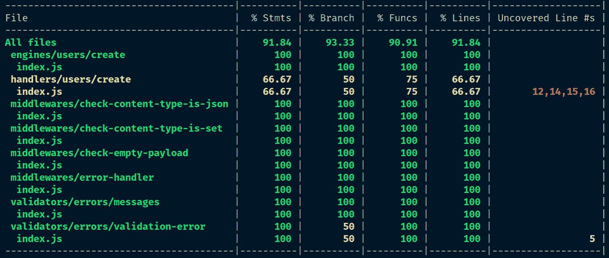

# 第八章：编写单元/集成测试

我们已经尽可能地对代码库进行了模块化，但我们有多少信心可以放在每个模块上？如果一个端到端测试失败，我们将如何定位错误的来源？我们如何知道哪个模块有缺陷？

我们需要一个更低级别的测试，它在模块级别工作，以确保它们作为独立的单元工作——我们需要**单元测试**。同样，我们也应该测试多个单元能否作为一个更大的逻辑单元良好地协同工作；为了做到这一点，我们需要实现一些**集成测试**。

通过遵循本章，您将能够做到以下事情：

+   使用**Mocha**编写单元和集成测试

+   使用**Sinon**库中的**spies**记录函数调用，并使用**stubs**模拟行为

+   使用**依赖注入**（**DI**）或**monkey patching**在单元测试中模拟依赖

+   使用**Istanbul**/**nyc**测量**测试覆盖率**

# 选择测试框架

虽然对于 JavaScript 的端到端测试只有一个**事实上的**测试框架（Cucumber），但有几个流行的单元和集成测试框架，包括 Jasmine ([jasmine.github.io](https://jasmine.github.io/))、Mocha ([mochajs.org](https://mochajs.org/))、Jest ([jestjs.io](https://jestjs.io/))和 AVA ([github.com/avajs/ava](https://github.com/avajs/ava))。

我们将在这本书中使用 Mocha，但让我们了解这个决定背后的理由。像往常一样，每个选择都有其优缺点：

+   **成熟度**：Jasmine 和 Mocha 存在时间最长，多年来一直是 JavaScript 和 Node 的唯一两个可行的测试框架。Jest 和 AVA 是新生力量。一般来说，库的成熟度与功能数量和支持水平相关。

+   **流行度**：一般来说，一个库越受欢迎，社区就越大，当事情出错时获得支持的可能性就越高。在流行度方面，让我们检查几个指标（截至 2018 年 9 月 7 日正确）：

    +   GitHub stars@ Jest（20,187），Mocha（16,165），AVA（14,633），Jasmine（13,816）

    +   曝光度（听说过它的开发者百分比）：Mocha（90.5%），Jasmine（87.2%），Jest（62.0%），AVA（23.9%）

    +   开发者满意度（使用过该工具并愿意再次使用的开发者百分比）：Jest（93.7%），Mocha（87.3%），Jasmine（79.6%），AVA（75.0%）。

+   **并行性**：Mocha 和 Jasmine 都按顺序串行运行测试（意味着一个接一个），这意味着它们可能相当慢。相反，AVA 和 Jest 默认情况下并行运行无关的测试，作为单独的进程，这使得测试运行更快，因为一个测试套件不需要等待前一个测试套件完成才能开始。

+   **背景**：Jasmine 由旧金山的软件咨询公司 Pivotal Labs 的开发者维护。Mocha 由 TJ Holowaychuk 创建，并由几位开发者维护；尽管它不是由单个公司维护，但它得到了 Sauce Labs、Segment 和 Yahoo! 等大公司的支持。AVA 由 Sindre Sorhus 于 2015 年启动，并由几位开发者维护。Jest 由 Facebook 开发，因此它拥有所有框架中最好的支持。

+   **可组合性**：Jasmine 和 Jest 将不同的工具捆绑在一个框架中，这对于快速入门来说很棒，但这意味着我们无法看到所有东西是如何结合在一起的。另一方面，Mocha 和 AVA 只是简单地运行测试，你可以使用其他库，如 `Chai`、`Sinon` 和 `nyc`，分别用于断言、模拟和覆盖率报告。

暴露和开发者满意度数据来自 2017 年的《JavaScript 状态调查》([2017.stateofjs.com/2017/testing/results](https://2017.stateofjs.com/2017/testing/results/))。

我们选择使用 Mocha 来编写这本书，因为它允许我们构建自定义的测试栈。通过这样做，它允许我们单独检查每个测试工具，这对你的理解有益。然而，一旦你了解了每个测试工具的复杂性，我确实鼓励你尝试 Jest，因为它更容易设置和使用。

# 安装 Mocha

首先，让我们将 Mocha 作为开发依赖项安装：

```js
$ yarn add mocha --dev
```

这将在 `node_modules/mocha/bin/mocha` 安装一个可执行文件 `mocha`，我们稍后可以执行它来运行我们的测试。

# 结构化我们的测试文件

接下来，我们将编写我们的单元测试，但应该把它们放在哪里呢？通常有两种方法：

+   将应用程序的所有测试放置在顶级 `test/` 目录中

+   将代码模块的单元测试放置在模块本身旁边，仅使用通用 `test` 目录进行应用程序级别的集成测试（例如，测试与外部资源如数据库的集成）

第二种方法（如下例所示）更好，因为它在文件系统中真正地将每个模块分开：

```js
$ tree
.
├── src
│   └── feature
│       ├── index.js
│       └── index.unit.test.js
└── test
 ├── db.integration.test.js
 └── app.integration.test.js
```

此外，我们将使用 `.test.js` 扩展名来表示一个文件包含测试（尽管使用 `.spec.js` 也是一个常见的约定）。我们将更加明确，并在扩展名本身中指定测试的 *类型*；也就是说，使用 `unit.test.js` 进行单元测试，使用 `integration.test.js` 进行集成测试。

# 编写我们的第一个单元测试

让我们为 `generateValidationErrorMessage` 函数编写单元测试。但首先，让我们将 `src/validators/errors/messages.js` 文件转换为其自己的目录，这样我们就可以在同一个目录中将实现和测试代码分组在一起：

```js
$ cd src/validators/errors
$ mkdir messages
$ mv messages.js messages/index.js
$ touch messages/index.unit.test.js
```

接下来，在 `index.unit.test.js` 中，导入 `assert` 库和我们的 `index.js` 文件：

```js
import assert from 'assert';
import generateValidationErrorMessage from '.';
```

现在，我们已经准备好编写我们的测试了。

# 描述预期的行为

当我们安装了 `mocha` npm 包时，它为我们提供了 `mocha` 命令来执行我们的测试。当我们运行 `mocha` 时，它将注入几个函数，包括 `describe` 和 `it`，作为全局变量注入到测试环境中。`describe` 函数允许我们将相关的测试用例分组在一起，而 `it` 函数定义了实际的测试用例。

在 `index.unit.tests.js` 中，让我们定义我们的第一个 `describe` 块：

```js
import assert from 'assert';
import generateValidationErrorMessage from '.';

describe('generateValidationErrorMessage', function () {
  it('should return the correct string when error.keyword is "required"', function () {
    const errors = [{
      keyword: 'required',
      dataPath: '.test.path',
      params: {
        missingProperty: 'property',
      },
    }];
    const actualErrorMessage = generateValidationErrorMessage(errors);
    const expectedErrorMessage = "The '.test.path.property' field is missing";
    assert.equal(actualErrorMessage, expectedErrorMessage);
  });
});
```

`describe` 和 `it` 函数都接受一个字符串作为它们的第一个参数，该参数用于描述组/测试。描述对测试结果没有影响，它只是简单地在那里，为阅读测试的人提供上下文。

`it` 函数的第二个参数是另一个函数，您将在其中定义测试的断言。如果测试失败，函数应该抛出 `AssertionError`；否则，Mocha 将假设测试应该通过。

在我们的测试中，我们创建了一个模拟的 `errors` 数组，它模仿了 Ajv 通常生成的 `errors` 数组。然后我们将数组传递给 `generateValidationErrorMessage` 函数，并捕获其返回值。最后，我们将实际输出与预期输出进行比较；如果它们匹配，则测试应该通过；否则，它应该失败。

# 覆盖测试文件的 ESLint

前面的测试代码应该已经引起了一些 ESLint 错误。这是因为我们违反了三条规则：

+   `func-names`: 非预期的未命名函数

+   `prefer-arrow-callback`: 非预期的函数表达式

+   `no-undef`: `describe` 未定义

在我们继续之前，让我们来修复这些问题。

# 理解 Mocha 中的箭头函数

我们在用 `cucumber-js` 编写 E2E 测试时已经遇到了 `func-names` 和 `prefer-arrow-callback` 规则。当时，我们需要继续使用函数表达式而不是箭头函数，因为 `cucumber-js` 在每个函数内部使用 `this` 来维护同一场景不同步骤之间的上下文。如果我们使用了箭头函数，`this` 将被绑定，在我们的情况下，绑定到全局上下文，我们就不得不回到使用文件作用域变量来在步骤之间维护状态。

事实上，Mocha 也使用 `this` 来维护一个“上下文”。然而，在 Mocha 的术语中，“上下文”并不是用来在步骤之间持久化状态的；相反，Mocha 的上下文提供了以下方法，您可以使用这些方法来控制测试的流程：

+   `this.timeout()`: 指定在将测试标记为失败之前，等待测试完成的毫秒数

+   `this.slow()`：指定测试在被认为是“慢”之前应该运行多长时间

+   `this.skip()`：跳过/中止测试

+   `this.retries()`：重试测试指定次数

给每个测试函数命名也不切实际；因此，我们应该禁用 `func-names` 和 `prefer-arrow-callback` 规则。

那么，我们如何禁用这些规则以适用于我们的测试文件？对于我们的端到端测试，我们在 `spec/` 目录中创建了一个新的 `.eslintrc.json` 文件，并将其放置在其中。这将将这些配置应用于 `spec/` 目录下的所有文件。然而，我们的测试文件并没有被分到自己的目录中，而是散布在我们所有应用程序代码之间。因此，创建一个新的 `.eslintrc.json` 文件将不起作用。

相反，我们可以在顶层 `.eslintrc.json` 中添加一个 `overrides` 属性，这允许我们覆盖匹配指定文件 glob 的文件规则。更新 `.eslintrc.json` 为以下内容：

```js
{
    "extends": "airbnb-base",
    "rules": {
        "no-underscore-dangle": "off"
    },
    "overrides": [
        {
            "files": ["*.test.js"],
            "rules": {
                "func-names": "off",
                "prefer-arrow-callback": "off"
            }
        }
    ]
}
```

这里，我们指示具有 `.test.js` 扩展名的文件应关闭 `func-names` 和 `prefer-arrow-callback` 规则。

# 指定 ESLint 环境

然而，ESLint 仍然会抱怨我们违反了 `no-undef` 规则。这是因为当我们调用 `mocha` 命令时，它将 `describe` 和 `it` 函数作为全局变量注入。然而，ESLint 并不知道这件事，并警告我们不要使用在模块内部未定义的变量。

我们可以指示 ESLint 通过指定一个 **环境** 来忽略这些未定义的全局变量。一个环境定义了预定义的全局变量。更新我们的覆盖数组条目为以下内容：

```js
{
 "files": ["*.test.js"],
 "env": {
 "mocha": true
 },
 "rules": {
 "func-names": "off",
 "prefer-arrow-callback": "off"
 }
}
```

现在，ESLint 应该不会再抱怨了！

# 运行我们的单元测试

要运行我们的测试，我们通常会运行 `npx mocha`。然而，当我们在这里尝试这样做时，我们得到了一个警告：

```js
$ npx mocha
Warning: Could not find any test files matching pattern: test
No test files found
```

这是因为，默认情况下，Mocha 将尝试在项目根目录下找到一个名为 `test` 的目录并运行其中的测试。由于我们将测试代码放置在与它们对应的模块代码旁边，我们必须通知 Mocha 这些测试文件的位置。我们可以通过将匹配我们的测试文件的 **glob** 作为 `mocha` 的第二个参数来做到这一点。尝试运行以下命令：

```js
$ npx mocha "src/**/*.test.js"
src/validators/users/errors/index.unit.test.js:1
(function (exports, require, module, __filename, __dirname) { import assert from 'assert';
 ^^^^^^
SyntaxError: Unexpected token import
 ....
```

我们遇到了另一个错误。我们在使用 `cucumber-js` 的时候已经遇到过这个问题。这个错误发生是因为 Mocha 在运行测试代码之前没有使用 Babel 进行转译。在使用 `cucumber-js` 时，我们使用了 `--require-module` 标志来引入 `@babel/register` 包，我们做了同样的事情。我们可以使用 Mocha 的 `--require` 标志来做到这一点：

```js
 $ npx mocha "src/**/*.test.js" --require @babel/register

 generateValidationErrorMessage
  should return the correct string when error.keyword is "required"

 1 passing (32ms)
```

如果你已经忘记了不同的 Babel 包（例如，`@babel/node`、`@babel/register`、`@babel/polyfill` 等），请参考 *不同版本的 Babel* 部分的 *设置开发工具* 章节中的 第六章。

注意，我们传递给 `describe` 和 `it` 的测试描述将在测试输出中显示。

# 将单元测试作为 npm 脚本运行

每次都输入完整的 `mocha` 命令可能会很麻烦。因此，我们应该创建一个与端到端测试相同的 npm 脚本。将以下内容添加到 `package.json` 文件中的 scripts 对象内：

```js
"test:unit": "mocha 'src/**/*.test.js' --require @babel/register",
```

此外，让我们也更新现有的 `test` npm 脚本来运行所有测试（单元测试和端到端测试）：

```js
"test": "yarn run test:unit && yarn run test:e2e",
```

现在，我们可以通过运行 `yarn run test:unit` 来运行我们的单元测试，并通过 `yarn run test` 运行所有测试。我们已经完成了第一个单元测试，所以让我们提交更改并继续编写更多的测试：

```js
$ git add -A && \
 git commit -m "Implement first unit test for generateValidationErrorMessage"
```

# 完成我们的第一个单元测试套件

我们只使用第一个单元测试覆盖了一个场景。因此，我们应该编写更多的测试来覆盖每个场景。尝试自己完成 `generateValidationErrorMessage` 的单元测试套件；一旦你准备好了，比较你的解决方案与以下方案：

```js
import assert from 'assert';
import generateValidationErrorMessage from '.';

describe('generateValidationErrorMessage', function () {
  it('should return the correct string when error.keyword is "required"', function () {
    const errors = [{
      keyword: 'required',
      dataPath: '.test.path',
      params: {
        missingProperty: 'property',
      },
    }];
    const actualErrorMessage = generateValidationErrorMessage(errors);
    const expectedErrorMessage = "The '.test.path.property' field is missing";
    assert.equal(actualErrorMessage, expectedErrorMessage);
  });
  it('should return the correct string when error.keyword is "type"', function () {
    const errors = [{
      keyword: 'type',
      dataPath: '.test.path',
      params: {
        type: 'string',
      },
    }];
    const actualErrorMessage = generateValidationErrorMessage(errors);
    const expectedErrorMessage = "The '.test.path' field must be of type string";
    assert.equal(actualErrorMessage, expectedErrorMessage);
  });
  it('should return the correct string when error.keyword is "format"', function () {
    const errors = [{
      keyword: 'format',
      dataPath: '.test.path',
      params: {
        format: 'email',
      },
    }];
    const actualErrorMessage = generateValidationErrorMessage(errors);
    const expectedErrorMessage = "The '.test.path' field must be a valid email";
    assert.equal(actualErrorMessage, expectedErrorMessage);
  });
  it('should return the correct string when error.keyword is "additionalProperties"', function () {
    const errors = [{
      keyword: 'additionalProperties',
      dataPath: '.test.path',
      params: {
        additionalProperty: 'email',
      },
    }];
    const actualErrorMessage = generateValidationErrorMessage(errors);
    const expectedErrorMessage = "The '.test.path' object does not support the field 'email'";
    assert.equal(actualErrorMessage, expectedErrorMessage);
  });
});

```

再次运行测试，并注意测试是如何在 `describe` 块下分组的：

```js
$ yarn run test:unit

 generateValidationErrorMessage
  should return the correct string when error.keyword is "required"
  should return the correct string when error.keyword is "type"
  should return the correct string when error.keyword is "format"
  should return the correct string when error.keyword is "additionalProperties"
  should return the correct string when error.keyword is not recognized

 5 passing (20ms)
```

我们现在已经完成了 `generateValidationErrorMessage` 的单元测试，所以让我们提交它：

```js
$ git add -A && \
 git commit -m "Complete unit tests for generateValidationErrorMessage"
```

# 单元测试 ValidationError

接下来，让我们专注于测试 `ValidationError` 类。同样，我们将把 `validation.js` 文件移动到它自己的目录中：

```js
$ cd src/validators/errors/ && \
 mkdir validation-error && \
 mv validation-error.js validation-error/index.js && \
 cd ../../../
```

现在，在 `src/validators/errors/validation-error/index.unit.test.js` 创建一个新文件来存放我们的单元测试：

```js
import assert from 'assert';
import ValidationError from '.';

describe('ValidationError', function () {
  it('should be a subclass of Error', function () {
    const validationError = new ValidationError();
    assert.equal(validationError instanceof Error, true);
  });
  describe('constructor', function () {
    it('should make the constructor parameter accessible via the `message` property of the instance', function () {
      const TEST_ERROR = 'TEST_ERROR';
      const validationError = new ValidationError(TEST_ERROR);
      assert.equal(validationError.message, TEST_ERROR);
    });
  });
});
```

运行测试并确保它们通过。然后，将其提交到仓库：

```js
$ git add -A && git commit -m "Add unit tests for ValidationError"
```

# 单元测试中间件

接下来，我们将测试我们的中间件函数，从 `checkEmptyPayload` 中间件开始。像之前一样，将中间件模块移动到它自己的目录中：

```js
$ cd src/middlewares/ && \
 mkdir check-empty-payload && \
 mv check-empty-payload.js check-empty-payload/index.js && \
 touch check-empty-payload/index.unit.test.js && \
 cd ../../
```

然后，在 `src/middlewares/check-content-type.js/index.unit.test.js` 中，构建我们第一个测试的框架：

```js
import assert from 'assert';
import checkEmptyPayload from '.';

describe('checkEmptyPayload', function () {
  describe('When req.method is not one of POST, PATCH or PUT', function () {
    it('should not modify res', function () {
      // Assert that `res` has not been modified
    });

    it('should call next() once', function () {
      // Assert that `next` has been called once
    });
  });});
```

`checkEmptyPayload` 中间件的目的确保 `POST`、`PATCH` 和 `PUT` 请求始终携带非空负载。因此，如果我们传递一个不同方法的请求，比如说 `GET`，我们应该能够断言以下内容：

+   `res` 对象没有被修改

+   `next` 函数被调用一次

# 断言深度相等

要断言 `res` 对象没有被修改，我们需要在调用 `checkEmptyPayload` 之前和之后对 `res` 对象进行深度比较。

而不是自己实现这个函数，我们可以通过使用现有的实用库来节省时间。例如，Lodash 提供了 `cloneDeep` 方法（[lodash.com/docs/#cloneDeep](https://lodash.com/docs/#cloneDeep)）用于深度克隆，以及 `isEqual` 方法（[lodash.com/docs/#isEqual](https://lodash.com/docs/#isEqual)）用于深度对象比较。

要在我们的代码中使用这些方法，我们可以从 npm 安装 `lodash` 包，它包含数百个实用方法。然而，我们不会在我们的项目中使用这些方法中的大多数；如果我们安装整个实用库，大部分代码将不会被使用。我们应该始终尽量保持尽可能精简，最小化项目的依赖数量和大小。

幸运的是，Lodash 为每个方法提供了一个独立的 npm 包，所以让我们把它们添加到我们的项目中：

```js
$ yarn add lodash.isequal lodash.clonedeep --dev
```

你可以使用一个名为 Bundlephobia 的在线工具（[bundlephobia.com](https://bundlephobia.com/)）来找出 npm 包的文件大小，而无需下载它。

例如，我们可以从[bundlephobia.com/result?p=lodash@4.17.10](https://bundlephobia.com/result?p=lodash@4.17.10)中看到，经过压缩和 gzip 处理后，`lodash`包的大小为 24.1 KB。同样，`lodash.isequal`和`lodash.clonedeep`包的大小分别为 3.7 KB 和 3.3 KB。因此，通过安装更具体的包，我们已经减少了项目中未使用的代码量 17.1 KB。

现在，让我们使用`deepClone`方法在传递给`checkEmptyPayload`之前克隆`res`对象。然后，在`checkEmptyPayload`被调用后，使用`deepEqual`来比较`res`对象及其克隆，并断言`res`对象是否已被修改。

尝试自己实现它，并将你的解决方案与我们的进行比较，如下所示：

```js
import assert from 'assert';
import deepClone from 'lodash.clonedeep';
import deepEqual from 'lodash.isequal';
import checkEmptyPayload from '.';

describe('checkEmptyPayload', function () {
 let req;
 let res;
 let next;
  describe('When req.method is not one of POST, PATCH or PUT', function    
  () {
 let clonedRes;

 beforeEach(function () {
 req = { method: 'GET' };
 res = {};
 next = spy();
 clonedRes = deepClone(res);
 checkEmptyPayload(req, res, next);
 });

    it('should not modify res', function () {
      assert(deepEqual(res, clonedRes));
    });

    it('should call next() once', function () {
      // Assert that `next` has been called
    });
  });
});
```

接下来，我们需要一种方法来断言`next`函数已被调用一次。我们可以通过使用测试间谍来实现这一点。

# 使用间谍断言函数调用

间谍是一个记录对它每次调用信息的函数。例如，我们不必将空函数分配给`next`，而是可以分配一个间谍给它。每当`next`被调用时，每次调用的信息都会存储在间谍对象中。然后我们可以使用这些信息来确定间谍被调用的次数。

生态系统中的*de facto*间谍库是 Sinon([sinonjs.org](http://sinonjs.org/))，所以让我们安装它：

```js
$ yarn add sinon --dev
```

然后，在我们的单元测试中，从`sinon`包中导入`spy`**命名导出**：

```js
import { spy } from 'sinon';
```

现在，在我们的测试函数中，不要将空函数分配给`next`，而是分配一个新的间谍：

```js
const next = spy();
```

当间谍函数被调用时，间谍会更新其一些属性以反映间谍的状态。例如，当它被调用一次时，间谍的`calledOnce`属性将被设置为`true`；如果间谍函数再次被调用，`calledOnce`属性将被设置为`false`，而`calledTwice`属性将被设置为`true`。还有许多其他有用的属性，例如`calledWith`，但让我们通过检查我们的间谍的`calledOnce`属性来更新我们的`it`块：

```js
it('should call next() once', function () {
  assert(next.calledOnce);
});
```

接下来，我们将定义更多的测试来检查当`req.method`是`POST`、`PATCH`或`PUT`之一时会发生什么。实现以下测试，这些测试检查当`content-length`头不是`0`时会发生什么：

```js
describe('checkEmptyPayload', function () {
  let req;
  let res;
  let next;
  ...
  (['POST', 'PATCH', 'PUT']).forEach((method) => {
 describe(`When req.method is ${method}`, function () {
 describe('and the content-length header is not "0"', function () {
 let clonedRes;

 beforeEach(function () {
 req = {
 method,
 headers: {
 'content-length': '1',
 },
 };
 res = {};
 next = spy();
 clonedRes = deepClone(res);
 checkEmptyPayload(req, res, next);
 });

 it('should not modify res', function () {
 assert(deepEqual(res, clonedRes));
 });

 it('should call next()', function () {
 assert(next.calledOnce);
 });
 });
 });
 });
});
```

`beforeEach`是另一个由 Mocha 注入到全局作用域的函数。`beforeEach`将在运行与`beforeEach`块相同或更低级别的每个`it`块之前运行传入它的函数。在这里，我们使用它来在每个断言之前调用`checkEmptyPayload`。

`beforeEach`是一种**钩子**函数。还有`afterEach`、`before`和`after`。通过参考[mochajs.org/#hooks](https://mochajs.org/#hooks)文档，了解如何使用它们。

接下来，当`content-type`头为`0`时，我们想要断言`res.status`、`res.set`和`res.json`方法被正确调用：

```js
describe('and the content-length header is "0"', function () {
  let resJsonReturnValue;

  beforeEach(function () {
    req = {
      method,
      headers: {
        'content-length': '0',
      },
    };
    resJsonReturnValue = {};
    res = {
      status: spy(),
      set: spy(),
      json: spy(),
    };
    next = spy();
    checkEmptyPayload(req, res, next);
  });

  describe('should call res.status()', function () {
    it('once', function () {
      assert(res.status.calledOnce);
    });
    it('with the argument 400', function () {
      assert(res.status.calledWithExactly(400));
    });
  });

  describe('should call res.set()', function () {
    it('once', function () {
      assert(res.set.calledOnce);
    });
    it('with the arguments "Content-Type" and "application/json"', function () {
      assert(res.set.calledWithExactly('Content-Type', 'application/json'));
    });
  });

  describe('should call res.json()', function () {
    it('once', function () {
      assert(res.json.calledOnce);
    });
    it('with the correct error object', function () {
      assert(res.json.calledWithExactly({ message: 'Payload should not be empty' }));
    });
  });

  it('should not call next()', function () {
    assert(next.notCalled);
  });
});
```

最后，我们需要测试`checkEmptyPayload`是否会返回`res.json()`的输出。为了做到这一点，我们需要使用另一个测试构造，称为**模拟对象**。

# 使用模拟对象模拟行为

模拟对象是模拟其他组件行为的函数。

在 Sinon 中，模拟对象是间谍对象的扩展；这意味着间谍对象所有可用的方法也同样适用于模拟对象。

在我们的测试上下文中，我们并不关心`res.json()`返回的值——我们只关心我们的`checkEmptyPayload`中间件函数能够忠实地将这个值传递回去。因此，我们可以将我们的`res.json`间谍对象转换为模拟对象，并使其返回一个对象的引用：

```js
resJsonReturnValue = {};
res = {
  status: spy(),
  set: spy(),
  json: stub().returns(resJsonReturnValue),
};
```

然后，我们可以添加另一个断言步骤来比较`checkEmptyPayload`函数返回的值和我们的`res.json`模拟对象返回的值；它们应该是严格相同的：

```js
describe('and the content-length header is "0"', function () {
  let resJsonReturnValue;
  let returnedValue;

  beforeEach(function () {
    ...
    returnedValue = checkEmptyPayload(req, res, next);
  });

  ...

  it('should return whatever res.json() returns', function () {
 assert.strictEqual(returnedValue, resJsonReturnValue);
 });

  ...
});
```

通过执行`yarn run test:unit`来运行单元测试，修复导致测试失败的任何错误，然后将单元测试提交到仓库：

```js
$ git add -A && git commit -m "Add unit tests for checkEmptyPayload middleware"
```

# 测试所有中间件函数

现在，轮到你自己编写一些单元测试了。尝试遵循相同的方法来测试`checkContentTypeIsJson`、`checkContentTypeIsSet`和`errorHandler`中间件函数。如有需要，请参考代码包。像往常一样，运行测试并提交你的代码！

一旦我们的所有中间件函数都经过了单元测试，我们将继续测试请求处理器和引擎。

# 单元测试请求处理器

首先，我们将`src/handlers/users/create.js`模块移动到它自己的目录中。然后，我们将更正`import`语句中指定的文件路径，使其指向正确的文件。最后，我们将在我们的模块旁边创建一个`index.unit.test.js`文件来存放单元测试。

让我们来看看我们请求处理器模块中的`createUser`函数。它具有以下结构：

```js
import create from '../../../engines/users/create';
function createUser(req, res, db) {
  create(req, db)
 .then(onFulfilled, onRejected)
 .catch(...)
}
```

首先，它将调用从`src/engines/users/create/index.js`导入的`create`函数。根据结果，它将在`then`块内部调用`onFulfilled`或`onRejected`回调。

虽然我们的`createUser`函数依赖于`create`函数，但在编写单元测试时，我们的测试应该只测试相关的单元，而不是它的依赖项。因此，如果我们的测试结果依赖于`create`函数，我们应该使用模拟对象来控制其行为。否则，我们的测试实际上将是一个*集成测试*。

# 模拟`create`

我们可以创建不同的模拟对象，它们返回不同的结果，每个模拟对象都模仿`create`函数可能的返回值：

```js
import { stub } from 'sinon';
import ValidationError from '../../../validators/errors/validation-error';

const createStubs = {
  success: stub().resolves({ _id: 'foo'}),
  validationError: stub().rejects(new ValidationError()),
  otherError: stub().rejects(new Error()),
}
```

现在，如果我们调用`createStubs.success()`，它将始终解析为`{ _id: 'foo'}`对象；因此，我们可以使用这个模拟对象来测试传递给`createUser`函数的`req`对象是否有效。同样，我们可以使用`createStubs.validationError()`来模拟一个情况，其中`req`对象导致`createUser`拒绝并抛出`ValidationError`。

现在，我们知道如何存根`create`函数，但我们如何在`createUser`函数内部实际替换它？在测试`createUser`函数时，我们可以在测试中更改的唯一变量是我们传递给函数的参数，而`createUser`方法只接受三个参数：`req`、`res`和`db`。

有两种方法可以实现这一点：**依赖注入**和**猴子补丁**。

# 依赖注入

依赖注入的想法是将每个依赖项都作为函数的参数。

目前，我们的`createUser`函数依赖于其参数之外的实体；这包括`create`函数和`ValidationError`类。如果我们使用依赖注入，我们会修改我们的`createUser`函数，使其具有以下结构：

```js
function createUser(req, res, db, create, ValidationError) {
  create(req)
    .then(onFulfilled, onRejected)
    .catch(...)
}
```

然后，我们就可以从我们的测试中注入以下依赖项：

```js
...
import ValidationError from '../../../validators/errors/validation-error';
import createUser from '.';

const generateCreateStubs = {
  success: () => stub().resolves({ _id: 'foo'})
}

describe('create', function () {
  describe('When called with valid request object', function (done) {
    ...
    createUser(req, res, db, generateCreateStubs.success(), ValidationError)
      .then((result) => {
        // Assertions here
      })
  })
})
```

# 猴子补丁

依赖注入的另一种方法是猴子补丁，它可以在运行时动态修改系统。在我们的例子中，我们可能想要用我们的存根函数替换`create`函数，但**仅**在我们运行测试时。

猴子补丁库的实现通常很复杂，通常涉及将模块代码读入字符串，向字符串中注入自定义代码，然后加载它。因此，被猴子补丁修改的实体将按某种方式被修改。

有几个库允许我们在运行测试时应用猴子补丁；最受欢迎的库是`rewire`（[npmjs.com/package/rewire](https://www.npmjs.com/package/rewire)）。它还有一个名为`babel-plugin-rewire`的 Babel 插件等价物（[github.com/speedskater/babel-plugin-rewire](https://github.com/speedskater/babel-plugin-rewire)）。

此插件将为正在“重连”的模块中的每个顶级文件作用域实体添加`__set__`、`__get__`和`__with__`方法。现在，我们可以使用`createUser`模块的`__set__`方法来猴子补丁我们的`create`函数，如下所示：

```js
createUser.__set__('create', createUserStubs.success)
```

`__set__`方法返回一个函数，我们可以使用它来将`create`函数恢复到其原始状态。当你想使用`create`的不同变体运行测试时，这很有用。在这种情况下，你只需在每个测试运行后简单地`revert`创建函数，然后在下一次运行开始时再次补丁它。

# 依赖注入与猴子补丁

这两种方法都有其优缺点，所以让我们比较它们的差异，看看哪一种最适合我们的用例。

# 模块化

依赖注入的好处是尽可能地将每个模块解耦，因为模块没有预定义的依赖；每个依赖项都在运行时传递（注入）。这使得单元测试变得容易得多，因为我们可以用存根替换任何依赖项，使我们的单元测试真正成为单元测试。

# 可读性

使用依赖注入（dependency injection）时，每个依赖都必须是函数的参数。因此，如果模块有 20 个依赖项，它将需要 20 个参数。这可能会使模块难以阅读。

通常，你会有一个单一的根文件，其中每个依赖都被导入、实例化和注入；然后这些依赖会被传递到子函数，以及它们的子函数，依此类推。这意味着为了找到依赖的来源，开发者必须追踪从根函数到原始注入依赖的函数调用链。这可能是三四个函数调用，也可能是十几个。

一般而言，一个项目中抽象层的数量越多，开发者阅读代码就越困难，但使用依赖注入方法时尤其如此。

使用猴子补丁，模块函数的签名可以更加简洁。只有动态依赖会被包含在函数参数列表中；实用函数和静态依赖可以在文件顶部导入。

例如，`createUser`函数的`req`、`res`和`db`参数是动态的——`req`和`res`对每个请求都不同，而`db`仅在启动时实例化。另一方面，`create`函数和`ValidationError`类是静态的——在运行代码之前，你知道它们的确切值。

因此，使用猴子补丁（monkey patching）可以提高我们应用程序代码的可读性，但代价是使我们的测试代码变得稍微复杂一些。

# 依赖第三方工具

依赖注入是一个简单的概念，实现它不需要任何第三方工具。另一方面，猴子补丁（monkey patching）难以实现，你通常会使用`babel-plugin-rewire`或类似的库。这意味着我们的测试现在将不得不依赖于`babel-plugin-rewire`包。

如果`babel-plugin-rewire`不再维护，或者维护缓慢，这可能会成为一个问题。在撰写本书时，`babel-plugin-rewire`插件仍然缺乏对 Babel 7 的支持。如果一个开发者正在使用`babel-plugin-rewire`插件，他将无法升级他们的 Babel 版本，而对于已经使用 Babel 7 的开发者来说，他们无法进行猴子补丁，直到支持实现。

# 遵循依赖注入模式

从前面的讨论来看，依赖注入似乎是一个更好的选择。可读性不应该成为太大的问题，因为我们只有两层抽象——处理程序（handlers）和引擎（engines）。因此，让我们将我们的代码迁移到使用依赖注入模式。

首先，从`src/handlers/users/create/index.js`中删除`import`语句，并将`createUser`函数的签名更改为包括`create`引擎函数和`ValidationError`类：

```js
function createUser(req, res, db, create, ValidationError) { ... }
```

现在，我们需要将这些依赖项注入到处理器中。在 `src/index.js` 中，我们已经在使用 `injectHandlerDependencies` 函数将数据库客户端注入到处理器中，所以让我们修改它以同时注入相应的引擎函数和 `ValidationError` 类。

首先，让我们在 `src/index.js` 中导入所有依赖项：

```js
import ValidationError from './validators/errors/validation-error';
import createUserHandler from './handlers/users/create';
import createUserEngine from './engines/users/create';
```

接下来，让我们创建一个处理器函数到引擎函数的映射，并将其称为 `handlerToEngineMap`。我们将这个 `handlerToEngineMap` 函数传递给 `injectHandlerDependencies` 函数，这样它就知道要注入哪个引擎：

```js
const handlerToEngineMap = new Map([
  [createUserHandler, createUserEngine],
]);
```

我们正在使用 `Map` 对象，它在 ECMAScript 2015（ES6）中引入。`Map` 是一个键值存储，其中键和值可以是任何类型——原始类型、对象、数组或函数（后两者是特殊类型的对象）。这与对象字面量不同，其中键必须是字符串或 Symbol。在这里，我们将处理器函数作为键，将引擎函数作为值存储。

在 `src/index.js` 中剩下的所有事情就是将 `handlerToEngineMap` 和 `ValidationError` 添加到 `injectHandlerDependencies` 中：

```js
app.post('/users', injectHandlerDependencies(createUserHandler, client, handlerToEngineMap, ValidationError));
```

最后，更新 `injectHandlerDependencies` 函数以将这些依赖项传递给处理器：

```js
function injectHandlerDependencies(handler, db, handlerToEngineMap, ValidationError) {
  const engine = handlerToEngineMap.get(handler);
  return (req, res) => { handler(req, res, db, engine, ValidationError); };
}
```

我们在许多文件中做了很多修改，所以你应该再次运行我们所有的现有测试，以确保我们没有破坏任何东西。你可能还希望将这些更改提交到 Git 仓库：

```js
$ git add -A && git commit -m "Implement dependency injection pattern"
```

# 承诺和 Mocha

现在，我们已经准备好回到我们的原始任务——为我们的创建用户请求处理器编写单元测试！你应该有足够的知识来自行实现处理器的单元测试，但我们在给出有关承诺的一些提示之前，想先给你一些提示。

如果我们正在测试的函数执行异步操作，没有保证异步操作会在我们的断言代码运行之前完成。例如，如果我们的 `create` 引擎函数实际上非常慢，如下所示：

```js
function createUser() {
  aVerySlowCreate()
    .then((result) => {
      res.status(201);
    });
}
```

那么以下测试将失败：

```js
describe("When create resolves with the new user's ID", function () {
  beforeEach(function () {
    createUser(req, res, db, create, ValidationError);
  });
  it('should call res.status() once', function () {
    assert(res.status.calledOnce);
  });
});
```

Mocha 可以通过两种方式处理异步代码——使用回调或承诺。由于我们通常会避免使用回调，让我们专注于与承诺一起工作。在 Mocha 中，如果我们返回一个承诺在先前的 `beforeEach` 块中，Mocha 将等待承诺解决后再运行相关的 `describe` 和 `it` 块。因此，在编写涉及异步操作的功能时，我们应该*始终返回一个承诺*。这不仅使函数更容易测试，还允许你在将来有需要时将多个承诺链接在一起。

因此，我们必须将我们的 `createUser` 函数更新为一个承诺：

```js
function createUser(req, res, db, create, ValidationError) {
  return create(req, db)
    ...
}
```

然后，确保所有的 `beforeEach` 块也返回一个承诺：

```js
beforeEach(function () {
  create = generateCreateStubs.success();
  return createUser(req, res, db, create, ValidationError);
});
```

# 处理拒绝的承诺

然而，Mocha 的另一个限制是，你无法在钩子函数中返回一个拒绝的承诺。如果你这样做，Mocha 会认为测试失败了。在这种情况下，你应该将你期望失败的函数移动到`it`块中，并在`catch`块中进行任何断言：

```js
it('should fail', function() {
  createUser(...)
    .catch(actualError => assert(actualError, expectedError))
});
```

# 完成单元测试

你现在对单元测试、Mocha 以及处理承诺有了足够的了解，可以完成创建用户处理器的单元测试。尝试自己实现它，只有在需要时才参考参考代码示例。

和往常一样，别忘了运行单元和端到端测试，以确保你没有引入任何回归，然后将更改提交到我们的仓库：

```js
$ git add -A && git commit -m "Add unit tests for Create User request handler"
```

# 对我们的引擎进行单元测试

接下来，让我们测试我们的`create`引擎函数。就像我们之前的`createUser`请求处理器一样，`src/engines/users/create/index.js`模块包含两个`import`语句，这使得测试变得困难。因此，就像之前一样，我们必须将这些依赖项提取出来，并将它们重新导入到`src/index.js`中：

```js
import createUserValidator from './validators/users/create';
...
const handlerToValidatorMap = new Map([
 [createUserHandler, createUserValidator],
]);
...
app.post('/users', injectHandlerDependencies(createUserHandler, client, handlerToEngineMap, handlerToValidatorMap, ValidationError));

```

然后，更新`injectHandlerDependencies`函数，将验证器函数注入到处理器中：

```js
function injectHandlerDependencies(
  handler, db, handlerToEngineMap, handlerToValidatorMap, ValidationError,
) {
  const engine = handlerToEngineMap.get(handler);
  const validator = handlerToValidatorMap.get(handler);
  return (req, res) => { handler(req, res, db, engine, validator, ValidationError); };
}
```

然后，在处理器内部，将验证器函数和`ValidationError`类传递给引擎函数：

```js
function createUser(req, res, db, create, validator, ValidationError) {
  return create(req, db, validator, ValidationError)
    ...
}
```

最后，更新单元测试以适应这一变化。一旦所有测试通过，将这一更改提交到 Git：

```js
$ git add -A && git commit -m "Implement dependency injection for engine"
```

一旦提交，让我们继续编写单元测试本身。只有两种情况需要测试——当验证器返回`ValidationError`时，或者当它返回`undefined`时。同样，因为我们不希望我们的单元测试依赖于验证器，所以我们将使用存根来模拟其功能。尝试自己实现它，并与我们的实现进行比较，如下所示：

```js
import assert from 'assert';
import { stub } from 'sinon';
import ValidationError from '../../../validators/errors/validation-error';
import create from '.';

describe('User Create Engine', function () {
  let req;
  let db;
  let validator;
  const dbIndexResult = {};
  beforeEach(function () {
    req = {};
    db = {
      index: stub().resolves(dbIndexResult),
    };
  });
  describe('When invoked and validator returns with undefined', function () {
    let promise;
    beforeEach(function () {
      validator = stub().returns(undefined);
      promise = create(req, db, validator, ValidationError);
      return promise;
    });
    describe('should call the validator', function () {
      it('once', function () {
        assert(validator.calledOnce);
      });
      it('with req as the only argument', function () {
        assert(validator.calledWithExactly(req));
      });
    });
    it('should relay the promise returned by db.index()', function () {
      promise.then(res => assert.strictEqual(res, dbIndexResult));
    });
  });

  describe('When validator returns with an instance of ValidationError', function () {
    it('should reject with the ValidationError returned from validator', function () {
      const validationError = new ValidationError();
      validator = stub().returns(validationError);
      return create(req, db, validator, ValidationError)
        .catch(err => assert.strictEqual(err, validationError));
    });
  });
});
```

和往常一样，运行测试并提交代码：

```js
$ git add -A && git commit -m "Implement unit tests for Create User engine"
```

# 对我们的引擎进行集成测试

到目前为止，我们一直在用单元测试改造我们的代码，这些单元测试单独测试每个单元，独立于外部依赖。然而，了解不同的单元之间是否兼容也同样重要。这就是集成测试发挥作用的地方。所以，让我们为我们的用户创建引擎添加一些集成测试，以测试其与数据库的交互。

首先，让我们更新我们的 npm 脚本以包括一个`test:integration`脚本。我们还将更新`test:unit` npm 中的 glob 文件，使其更加具体，仅选择单元测试。最后，更新`test`脚本，在单元测试之后运行集成测试：

```js
"test": "yarn run test:unit && yarn run test:integration && yarn run test:e2e",
"test:unit": "mocha 'src/**/*.unit.test.js' --require @babel/register",
"test:integration": "dotenv -e envs/test.env -e envs/.env mocha -- src/**/*.integration.test.js' --require @babel/register",
```

`dotenv mocha`部分将在加载所有环境变量后运行 Mocha。我们随后使用双横线（`--`）来向我们的*bash* shell 指示这是`dotenv`命令选项的结束；双横线之后的所有内容都将传递到`mocha`命令中，就像之前一样。

你以与单元测试相同的方式编写集成测试，唯一的区别是，你不需要存根一切，而是向你要测试的单元提供真实参数。让我们再次看看我们创建函数的签名：

```js
create(req, db, createUserValidator, ValidationError)
```

之前，我们使用了存根来模拟真实的 `db` 对象和 `createUserValidator` 函数。对于集成测试，你实际上会导入真实的验证函数并实例化一个真实的 Elasticsearch JavaScript 客户端。再次尝试自己实现集成测试，并在此处查看我们的解决方案：

```js
import assert from 'assert';
import elasticsearch from 'elasticsearch';
import ValidationError from '../../../validators/errors/validation-error';
import createUserValidator from '../../../validators/users/create';
import create from '.';

const db = new elasticsearch.Client({
  host: `${process.env.ELASTICSEARCH_PROTOCOL}://${process.env.ELASTICSEARCH_HOSTNAME}:${process.env.ELASTICSEARCH_PORT}`,
});

describe('User Create Engine', function () {
  describe('When invoked with invalid req', function () {
    it('should return promise that rejects with an instance of ValidationError', function () {
      const req = {};
      create(req, db, createUserValidator, ValidationError)
        .catch(err => assert(err instanceof ValidationError));
    });
  });
  describe('When invoked with valid req', function () {
    it('should return a success object containing the user ID', function () {
      const req = {
        body: {
          email: 'e@ma.il',
          password: 'password',
          profile: {},
        },
      };
      create(req, db, createUserValidator, ValidationError)
        .then((result) => {
          assert.equal(result.result, 'created');
          assert.equal(typeof result._id, 'string');
        });
    });
  });
});

```

再次运行所有测试以确保它们全部通过，然后将这些更改提交到仓库：

```js
$ git add -A && git commit -m "Add integration tests for Create User engine"
```

# 添加测试覆盖率

在我们的 TDD 流程开始时，我们首先编写了端到端测试，并使用它们来驱动开发。然而，对于单元和集成测试，我们实际上将它们重新整合到我们的实现中。因此，我们很可能错过了我们应该测试的一些场景。

为了解决这个问题，我们可以召唤测试覆盖率工具的帮助。测试覆盖率工具将运行你的测试并记录所有已执行的代码行；然后，它将与此源文件中的总行数进行比较，以返回一个覆盖率百分比。例如，如果我的模块包含 100 行代码，而我的测试只运行了 85 行模块代码，那么我的测试覆盖率是 85%。这可能意味着我有一些死代码，或者我错过了某些用例。一旦我知道我的某些测试没有覆盖所有代码，我就可以回过头来添加更多的测试用例。

JavaScript 的**事实上的**测试覆盖率框架是 `istanbul` ([github.com/gotwarlost/istanbul](https://github.com/gotwarlost/istanbul))。我们将通过其命令行界面 `nyc` ([github.com/istanbuljs/nyc](https://github.com/istanbuljs/nyc)) 使用 istanbul。所以，让我们安装 `nyc` 包：

```js
$ yarn add nyc --dev
```

现在，将以下 npm 脚本添加到 `package.json`：

```js
"test:unit:coverage": "nyc --reporter=html --reporter=text yarn run test:unit",
```

现在，我们可以运行 `yarn run test:unit:coverage` 来获取我们的代码覆盖率报告。因为我们指定了 `--reporter=text` 选项，`nyc` 将以文本表格格式将结果打印到标准输出：



`--reporter=html` 标志还会指示 `nyc` 创建一个 HTML 报告，该报告存储在项目根目录下的新 `coverage` 目录中。

# 阅读测试覆盖率报告

在 `coverage` 目录中，你应该找到一个 `index.html` 文件；在网页浏览器中打开它以继续：


在顶部，你可以看到不同的测试覆盖率百分比。以下是它们的含义：

+   **行数**：已运行的代码行数占总代码行数（LoC）的百分比。

+   **语句**：执行的总语句的百分比。如果你总是为每条语句使用单独的一行（正如在我们的项目中那样），那么语句和行将具有相同的值。如果你每行有多个语句（例如，`if (condition) { bar = 1; }`），那么语句将多于行，语句覆盖率可能会更低。语句覆盖率比行覆盖率更有用；行覆盖率存在是为了与以行为单位的覆盖率工具（如`lcov`）兼容。请注意，您可以通过启用`max-statements-per-line`规则来使用 ESLint 强制每行只有一个语句。

+   **分支**：将我们的代码想象成一组路径——如果满足某些条件，程序的执行将遵循某个路径；当使用不同的条件集时，执行将遵循不同的路径。这些路径在条件语句中分化成*分支*。分支覆盖率表示这些分支中有多少被覆盖。

+   **函数**：被调用的总函数的百分比。

我们可以看到，我们的整体语句覆盖率是 91.84%，这已经相当不错了。然而，我们的`handlers/users/create/index.js`文件似乎只有 66.67% 的覆盖率。让我们调查一下原因！

点击 handlers/users/create 链接，直到到达显示文件源代码的屏幕：


左侧的绿色条表示该行已被覆盖。此外，`nyc`将给出该行在整个单元测试套件运行中被执行次数的计数。例如，前面的`res.status(201)`行已被执行了 8 次。

红色条表示该行尚未执行。这可能意味着以下几种情况之一：

+   我们测试不足，没有测试所有可能的情况

+   我们的项目中有不可达的代码

任何其他覆盖率缺口都在代码本身中以黑色框内的字母表示；当您悬停在它上面时，它将提供更详细的解释。在我们的情况下，有一个字母 E，代表“未执行的 else 路径”，意味着没有测试覆盖到`create`函数拒绝时返回的不是`ValidationError`实例的情况。

在我们的情况下，这实际上突显了我们代码中的一个错误。在我们的`then`块的`onRejected`函数内部，如果错误不是`ValidationError`的实例，我们将返回`undefined`。这将实际上返回一个已解决的承诺，因此`catch`块将永远不会捕获到错误。此外，我们也没有测试`create`函数返回通用错误的情况。因此，让我们通过修复这两个问题来提高这个模块的测试覆盖率。

在我们这样做之前，让我们提交现有的更改：

```js
$ git add -A && git commit -m "Implement test coverage for unit tests"
```

# 提高测试覆盖率

首先，在 `/home/dli/.d4nyll/.beja/final/code/9/src/handlers/users/create/index.js` 文件中，将 `return undefined;` 语句更改为向下传递错误到承诺链：

```js
      return res.json({ message: err.message });
    }
    throw err;
  }).catch(() => {
    res.status(500);
```

然后，向 `src/handlers/users/create/index.unit.test.js` 添加单元测试以覆盖这个遗漏的场景：

```js
const generateCreateStubs = {
  success: () => stub().resolves({ _id: USER_ID }),
  genericError: () => stub().rejects(new Error()),
  validationError: () => stub().rejects(new ValidationError(VALIDATION_ERROR_MESSAGE)),
};
...
describe('createUser', function () {
  ...
  describe('When create rejects with an instance of Error', function () {
    beforeEach(function () {
      create = generateCreateStubs.genericError();
      return createUser(req, res, db, create, validator, ValidationError);
    });
    describe('should call res.status()', function () {
      it('once', function () {
        assert(res.status.calledOnce);
      });
      it('with the argument 500', function () {
        assert(res.status.calledWithExactly(500));
      });
    });

    describe('should call res.set()', function () {
      it('once', function () {
        assert(res.set.calledOnce);
      });
      it('with the arguments "Content-Type" and "application/json"', function () {
        assert(res.set.calledWithExactly('Content-Type', 'application/json'));
      });
    });

    describe('should call res.json()', function () {
      it('once', function () {
        assert(res.json.calledOnce);
      });
      it('with a validation error object', function () {
        assert(res.json.calledWithExactly({ message: 'Internal Server Error' }));
      });
    });
  });
});

```

现在，当我们运行 `test:unit:coverage` 脚本并再次查看报告时，你会很高兴地看到覆盖率现在是 100%！


现在，将这个重构步骤提交到你的仓库中：

```js
$ git add -A && git commit -m "Test catch block in createUser"
```

# 代码覆盖率与测试质量

如前文所述，代码覆盖率工具可以帮助你发现代码中的错误。然而，它们应该仅作为诊断工具使用；你不应该将追求 100%代码覆盖率作为一个目标本身。

这是因为代码覆盖率与测试质量无关。你可以定义覆盖 100%代码的测试用例，但如果断言是错误的，或者测试中存在错误，那么完美的覆盖率毫无意义。例如，以下测试块总是会通过，即使其中一个断言表明它应该失败：

```js
it('This will always pass', function () {
  it('Even though you may expect it to fail', function () {
    assert(true, false);
  });
});
```

这强调了代码覆盖率不能检测到坏测试的观点。相反，你应该专注于编写有意义的测试，这样当出现问题时，它们实际上会显示出错误；如果你这样做，测试覆盖率自然会保持高，你可以使用报告来改进你在测试中遗漏的内容。

# 你不必总是测试一切

在我们更新了单元测试以覆盖遗漏的 `catch` 块之后，我们的语句覆盖率现在是 100%。然而，如果我们检查我们的代码，我们会发现还有两个模块缺少单元测试：

+   `validate`：位于 `src/validators/users/create.js` 的用户验证函数

+   `injectHandlerDependencies`：位于 `src/utils/inject-handler-dependencies.js` 的实用函数

它们没有出现在覆盖率报告中，因为单元测试从未导入过这些文件。但我们是否需要为每个单元编写单元测试呢？为了回答这个问题，你应该问自己——“我对这段代码的工作有信心吗？”如果答案是“是”，那么编写额外的测试可能是不必要的。

单元的代码覆盖率不应仅基于单元测试来分析，因为可能还有使用该单元的集成和端到端测试。如果这些其他测试覆盖了单元测试没有覆盖的内容，并且测试通过，那么这应该让你有信心你的单元按预期工作。

因此，一个更有用的指标是分析所有测试的代码覆盖率，而不仅仅是单元测试。

# 统一测试覆盖率

因此，让我们添加集成和端到端测试的覆盖率脚本：

```js
"test:coverage": "nyc --reporter=html --reporter=text yarn run test",
"test:integration:coverage": "nyc --reporter=html --reporter=text yarn run test:integration",
"test:e2e:coverage": "nyc --reporter=html --reporter=text yarn run test:e2e",
```

然而，当我们运行 `test:e2e:coverage` 脚本时，覆盖率报告显示的是 `dist/` 目录下编译文件的覆盖率结果，而不是 `src/` 目录下的源文件。这是因为我们的端到端测试脚本 (`scripts/e2e.test.sh`) 在运行之前会执行 `serve` npm 脚本，将我们的代码进行转换。为了解决这个问题，让我们添加一个新的 `test:serve` 脚本，该脚本使用 `babel-node` 直接运行我们的代码：

```js
"test:serve": "dotenv -e envs/test.env -e envs/.env babel-node src/index.js",
```

然后，更新 `scripts/e2e.test.sh` 脚本，使用这个修改后的脚本而不是 `serve`：

```js
yarn run test:serve &
```

现在，当我们再次运行 `test:coverage` 或 `test:e2e:coverage` 脚本时，它将显示 `src/` 目录下文件的覆盖率，而不是 `dist/` 目录下的文件。

# 忽略文件

然而，你可能也注意到我们的步骤定义出现在了覆盖率报告中。Istanbul 还不够智能，无法判断我们的步骤定义文件是测试的一部分，而不是代码；因此，我们需要手动指导 Istanbul 忽略它们。我们可以通过添加一个 `.nycrc` 文件并指定 `exclude` 选项来实现：

```js
{
  "exclude": [
    "coverage/**",
    "packages/*/test/**",
    "test/**",
    "test{,-*}.js",
    "**/*{.,-}test.js"
    ,"**/__tests__/**",
    "**/node_modules/**",
    "dist/",
    "spec/",
    "src/**/*.test.js"
  ]
}
```

现在，当我们运行 `test:coverage` 脚本时，步骤定义文件被排除在结果之外。剩下要做的就是提交我们的代码！

```js
$ git add -A && git commit -m "Implement coverage for all tests"
```

# 完成工作

我们现在已经模块化了 Create User 功能的代码，并对其进行了测试。因此，现在是合并我们当前的 `create-user/refactor-modules` 分支到 `create-user/main` 分支的好时机。由于这也完成了 Create User 功能，我们应该将 `create-user/main` 功能分支合并回 `dev` 分支：

```js
$ git checkout create-user/main
$ git merge --no-ff create-user/refactor-modules
$ git checkout dev
$ git merge --no-ff create-user/main
```

# 摘要

在前三个章节中，我们向您展示了如何编写端到端测试，使用它们来推动您功能的开发，尽可能地对代码进行模块化，然后通过单元测试和集成测试覆盖模块来增加您对代码的信心。

在下一章中，您将需要自己实现剩余的功能。我们将概述一些您应该遵循的 API 设计原则，您始终可以参考我们的示例代码包，但下一章是您真正独立练习这个过程的时刻。

“学习是一个积极的过程。我们通过实践来学习。只有被使用的知识才能留在你的脑海中。”

- 戴尔·卡耐基，著有《如何赢得朋友与影响他人》一书
