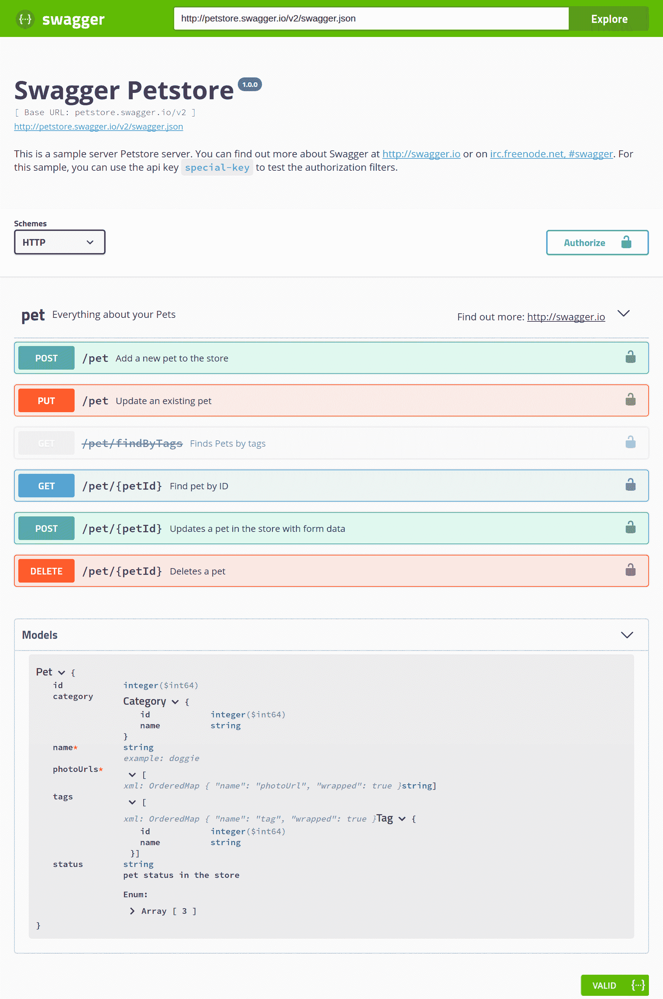
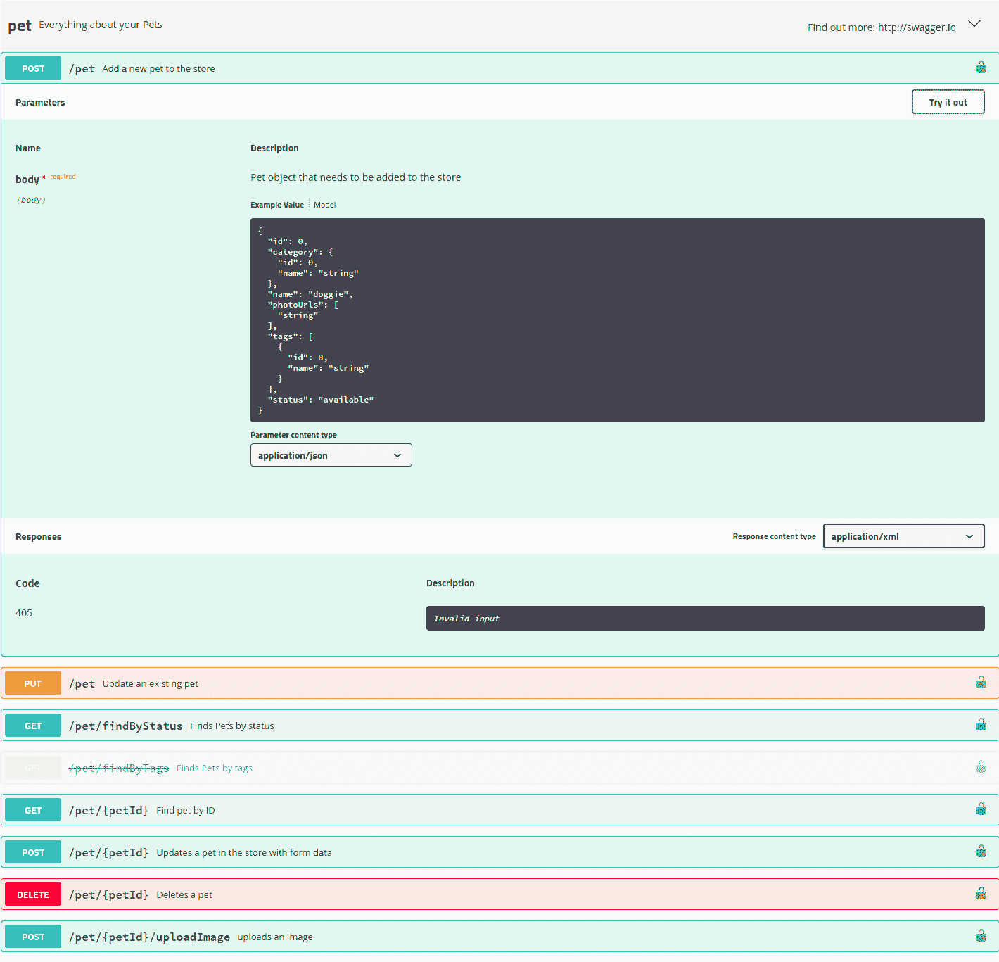
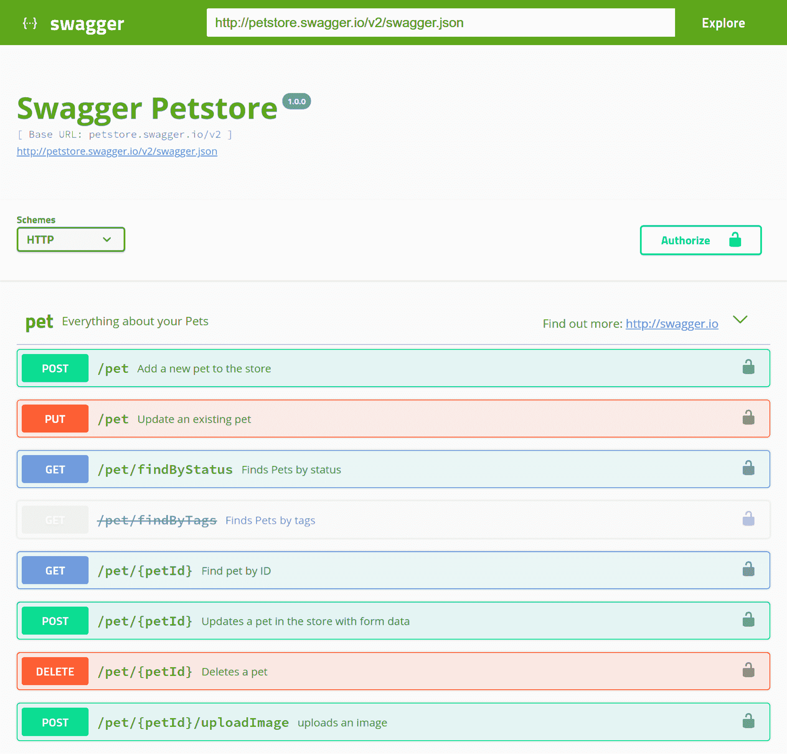
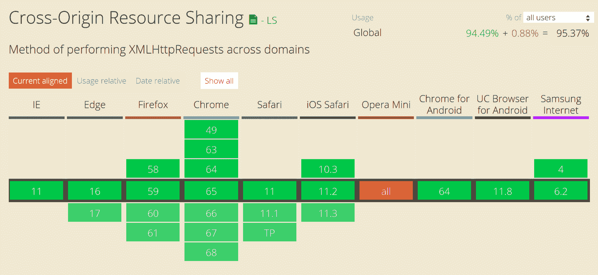
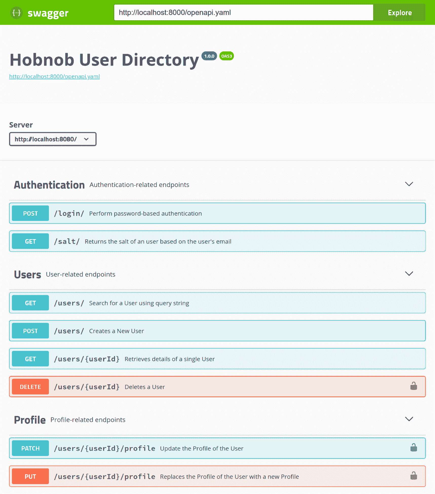

# 第十三章：记录我们的 API

到目前为止，我们一直遵循测试驱动的方法来开发我们的用户目录应用程序。我们首先编写**端到端**（**E2E**）测试，并使用它们来驱动实现代码的开发，然后添加单元测试来捕获回归。我们还讨论了编写测试是最佳文档形式，因为它提供了如何与我们的 API 交互的实际示例。

虽然我们的测试套件是最准确和最好的文档形式，但所有主要 API 的提供者也维护基于浏览器的 API 文档，您的最终用户可以将其作为网页/站点访问。这是因为：

+   并非所有 API 都是开源的，因此开发者可能无法始终访问测试。

+   理解测试套件可能需要大量的时间和精力。

+   测试缺乏**上下文**——您知道如何调用端点，但您将不得不自己弄清楚它如何适应应用程序的工作流程。

+   它是语言和框架特定的——基于浏览器的文档描述了 API 的接口，而不是实现。无论我们的 API 是用 Express、Restify、Hapi、Python 还是 Go 实现的，最终用户都不需要理解 JavaScript 就能理解这种文档形式。

如果我们只是向最终用户提供测试套件而不提供进一步指导，他们可能会因为陡峭的学习曲线而感到沮丧，并决定使用替代服务。因此，我们必须提供更用户友好的 API 文档。

API 文档通过示例描述了每个端点的功能以及调用它们的约束。好的 API 文档通常：

+   提供了我们 API 的高级概述，包括：

    +   平台的简要概述

    +   示例用例

    +   在哪里可以找到更多资源或获得支持

+   包含一个简明扼要的逐步引导游览，说明如何执行常见场景（例如创建用户，然后登录）；也就是说，需要调用哪些 API 调用，以及它们的顺序。

+   包含 API 规范，它提供了每个端点的技术参考——允许哪些参数以及它们的格式。

高级概述和引导游览的编写属于技术作家的范围。但什么是好的技术写作超出了本书的范围；相反，我们将专注于如何编写好的 API 规范。具体来说，我们将使用 OpenAPI API 规范语言来编写我们的 API 规范，然后使用一套称为 Swagger 的工具来生成交互式的基于浏览器的 API 参考。

通过遵循本章，您将：

+   了解**OpenAPI 规范**（**OAS**）

+   使用**YAML**编写您自己的 OpenAPI 规范

+   使用**Swagger UI**生成基于 Web 的 API 文档

# OpenAPI 和 Swagger 概述

**API 描述语言**（或**API 描述格式**）是描述 API 的标准格式。例如，下面的片段通知我们的 API 消费者，在调用`POST /login`端点时，他们需要提供一个包含`email`和`digest`字段的 JSON 有效负载。作为回报，他们可以期待我们的 API 以以下四种列出的状态码之一响应：

```js
paths:
  /login:
    post:
      requestBody:
        description: User Credentials
        required: true
        content:
          application/json:
            schema:
              properties:
                email:
                  type: string
                  format: email
                digest:
                  type: string
                  pattern: ^\\$2[aby]?\\$\\d{1,2}\\$[.\\/A-Za-z0-9]{53}$
      responses:
        '200':
          $ref: '#/components/responses/LoginSuccess'
        '400':
          $ref: '#/components/responses/ErrorBadRequest'
        '401':
          $ref: '#/components/responses/ErrorUnauthorized'
        '500':
          $ref: '#/components/responses/ErrorInternalServer'
```

编写 API 规范有几种好处：

+   该规范充当了我们平台与最终消费者之间的合同，这并不仅限于开发者，还包括其他内部 API。拥有合同意味着我们的 API 消费者能够在我们的 API 完成之前开发他们的集成——因为我们已经通过规范同意了我们的 API 应该如何表现——只要每个人都忠于 API 规范，集成就会成功。

+   它迫使我们设计接口。

+   我们可以创建模拟服务器。这些模拟服务器模仿真实 API 服务器的行为，但以预定义的响应进行响应。在我们的 API 完成之前，我们可以为最终消费者提供这个模拟服务器，这样他们就会知道我们的 API 应该如何响应。

+   使用开源工具（如 Dredd—[dredd.org](http://dredd.org/en/latest/)），我们可以自动测试我们的 API 服务器，以查看它是否遵守规范。

+   使用与我们的 API 服务器集成的工具，我们可以使用规范自动验证请求和响应，而无需编写额外的验证代码。

# 选择 API 规范语言

上述示例使用了一个称为**OpenAPI**（以前称为**Swagger**）的标准。在撰写本文时，还有两种其他流行的 API 规范语言，即**RAML**和**API Blueprint**。在继续之前，重要的是要注意，每种语言都有其自身的一套限制，即它如何准确地描述现有的 API，或者围绕它的工具的全面性。然而，在这三者中，OpenAPI 是最成熟的，并且拥有最好的社区支持，这就是我们将在本章中使用的规范。

# Swagger vs OpenAPI

在线阅读文章时，你经常会听到 Swagger 和 OpenAPI 这两个术语被互换使用。因此，在我们继续之前，让我们澄清这些术语。*Swagger*始于 2011 年，是一套工具，允许开发者将 API 表示为代码，以便自动生成文档和客户端 SDK。Swagger 自那时起已经经历了两个主要版本（1.0 和 2.0）。在 Swagger 2.0 发布后，Swagger 的权利被 SmartBear Software 购买，该公司决定将规范格式的权利捐赠给 Linux Foundation，在 OpenAPI 倡议下。

2016 年 1 月 1 日，Swagger 规范被更名为*OpenAPI 规范*（OAS）。从那时起，OAS 的一个新版本，3.0.0，已经发布。

OAS 2.0 与 Swagger 2.0 在名称上相同。

然而，尽管规范已被重命名为 OAS，但围绕该规范的工具仍然由 SmartBear Software 开发和维护；因此，您可能会同时听到开发者谈论 Swagger 和 OpenAPI。

简而言之，OpenAPI 是规范语言本身，而 Swagger 是一套与 OpenAPI 规范一起工作和围绕其工作的工具集。

# Swagger 工具链

因此，让我们更详细地检查 Swagger 工具链。Swagger 是一套在整个 API 生命周期中都有用的开发者工具，包括以下内容：

+   **Swagger 编辑器**：一个分屏编辑器，允许您在一侧编写规范，并在另一侧提供实时反馈

+   **Swagger UI**：从您的规范文件生成 HTML 格式的文档

+   **Swagger Codegen**：生成多种语言的客户端 SDK，使开发者能够轻松地与您的 API 交互，而无需直接调用端点

+   **Swagger Inspector**：允许您测试您的端点

除了 SmartBear Software 开发和维护的官方工具之外，还有许多社区贡献的包和框架。

# Swagger Editor

Swagger 编辑器类似于您的规范代码编辑器。它提供实时验证、代码自动完成、代码高亮和输出文档的预览。以下是 Uber API 的截图：


# Swagger UI

Swagger UI 是一个自包含的前端应用程序，它从您的规范中渲染交互式文档。您只需提供 OpenAPI 规范的公开 URL，Swagger UI 就会完成剩余的工作。以下是 Swagger Petstore 示例文档的截图：



交互式文档还有一个“现在尝试”按钮，允许您向服务器发送真实请求并查看结果，而无需离开文档页面。这简化了最终用户的流程，因为他们不需要打开像 Postman 和/或 Paw 这样的外部工具：



您可以在 [petstore.swagger.io](http://petstore.swagger.io/) 尝试一个实时演示。

# Swagger Inspector

Swagger Inspector 类似于 Postman，它是 Swagger 的一个工具——允许您调用和验证 REST、GraphQL 和 SOAP API。像 Postman 一样，它保存了您过去查询的历史记录。此外，它可以从检查结果自动生成规范。

# Swagger codegen

Swagger 能够使用您的 API 规范生成服务器存根和客户端 SDK。Swagger Codegen 支持许多语言/框架。您可以将服务器存根用作您即将构建的 API 的样板，或用作模拟服务器来展示 API 应该如何表现。您还可以使用生成的客户端 SDK 作为基础并在此基础上构建。

# 使用 OpenAPI 定义 API 规范

现在我们已经了解了 API 规范和 OpenAPI 标准是什么，以及 Swagger 提供的工具，让我们开始文档编写过程，为我们的 API 编写规范。我们将从在`src/spec/openapi/hobnob.yaml`创建一个新文件开始：

```js
$ mkdir -p spec/openapi
$ touch spec/openapi/hobnob.yaml
```

# 学习 YAML

首先要知道的是，OpenAPI 规范必须是一个有效的 JSON 文档。规范还明确允许使用 YAML，它是 JSON 的超集，可以转换为 JSON。我们将使用 YAML，因为它对人类来说更易读（因此也更容易编写），即使是非开发者也是如此。此外，你可以在 YAML 文件中添加注释，这是 JSON 无法做到的。

让我们先学习 YAML 的基本知识。我们只需要学习一些基本的语法规则来编写我们的 OpenAPI 规范。

与 JSON 一样，开始学习 YAML 的基本语法非常简单。所有 YAML 文档都以三个短横线（`---`）开始，以指示文件的开始，以三个点（`...`）结束，以指示文件的结束。

通常，在配置文件中需要表示的最常见的数据结构是键值对和列表。要表示一组键值对，只需将每个键值对写在新的行上，用冒号和空格分隔：

```js
# YAML
title: Hobnob
description: Simple publishing platform

# JSON
{
  "title": "Hobnob",
  "description": "Simple publishing platform"
}
```

通常，除非你使用特殊字符或需要明确数据类型（例如，`10`可能被解释为数字，而`yes`可能被解释为`true`），否则你不需要使用引号。为了简单和一致起见，你可能想为所有的字符串使用双引号，但在这里我们不会这样做。

要表示嵌套对象，只需将子对象缩进两个空格：

```js
# YAML
info:
  title: Hobnob
  description: Professional publishing platform

# JSON
{
  "info": {
    "title": "Hobnob",
    "description": "Professional publishing platform"
  }
}
```

要表示一个列表，将每个项目放在新的一行上，前面加上一个破折号和一个空格：

```js
# YAML
produces:
- application/json
- text/html

# JSON
{
  "produces": [
    "application/json",
    "text/html"
  ]
}
```

为了节省换行符，使用竖线（`|`）字符：

```js
# YAML
info:
  title: Hobnob
  description: |
    The professional user directory.

    Find like-mind professionals on Hobnob!

# JSON
{
  "info": {
    "title": "Hobnob",
    "description": "The professional user directory.\n\nFind like-mind professionals on Hobnob!\n"
  }
}
```

或者，为了在多行上断开文本行（使其更容易阅读），不应保留换行符，使用大于号（`>`）：

```js
# YAML
contact:
  name: >
    Barnaby Marmaduke Aloysius Benjy Cobweb Dartagnan Egbert Felix Gaspar 
    Humbert Ignatius Jayden Kasper Leroy Maximilian Neddy Obiajulu Pepin 
    Quilliam Rosencrantz Sexton Teddy Upwood Vivatma Wayland Xylon Yardley 
    Zachary Usansky

# JSON
{
  "contact": {
    "name": "Barnaby Marmaduke Aloysius Benjy Cobweb Dartagnan Egbert Felix Gaspar Humbert Ignatius Jayden Kasper Leroy Maximilian Neddy Obiajulu Pepin Quilliam Rosencrantz Sexton Teddy Upwood Vivatma Wayland
```

```js
 Xylon Yardley Zachary Usansky\n"
  }
}
```

# 根字段的概述

现在我们已经了解了 YAML 的基本知识，我们准备好编写我们的规范了。

可用的 OpenAPI 规范版本有几个。在撰写本书时，OpenAPI 规范是`3.0.0`版本，并于 2017 年 7 月 26 日正式发布。你可能会在野外找到许多 OpenAPI 2.0 规范，因为 3.0.0 在许多领域的工具支持不足。

我们将使用 OAS 3.0.0，因为它是最新版本。在这里，你可以找到 OAS 3.0.0 中所有可能的根属性概述。并非所有字段都被涵盖，并且必需字段用星号（`*`）标记：

+   `openapi*` (string): 这指定了正在使用的 OpenAPI 规范版本。我们应该指定 semver 版本；对于我们来说，我们将使用`"3.0.0"`。

+   `info*` (object): API 的元数据。

    +   `version*` (string): 为此规范编写的 API 版本。**请注意，这是 API 本身的版本，而不是 OpenAPI 规范。**

    +   `title*` (string): 您 API 的名称。

    +   `description` (string): 您 API 的简要描述。

    +   `contact` (object): 关于联系支持的信息。

        +   `name` (string): 要联系的个人/部门/组织的名称。

        +   `url` (string): 指向包含联系信息的页面的有效 URL。

        +   `email` (string): 一个有效的电子邮件地址，可以通过它发送询问。

    +   `termsOfService` (string): 指向 API 服务条款通知的有效 URL。

    +   `license` (object): API 的许可信息。

        +   `name*` (string): 许可证的名称。

        +   `url` (string): 指向许可的有效 URL。

+   `servers` (array of objects) 一个提供 API 的服务器列表。这是对 OAS 2.0 根字段`host`和`basePath`的改进，因为它允许指定多个主机。

    +   `url*` (string): 指向目标主机的有效 URL。这可能是一个相对 URL，相对于 OpenAPI 规范被提供的位置。

    +   `description` (string): 主机的简要描述。如果有多个主机被指定，这有助于区分不同的主机。

+   `paths*` (object): API 公开的所有路径和操作（例如端点）。路径对象是一个路径（例如，`/users`）和*路径项对象*的字典。路径项对象是一个包含（主要是）HTTP 动词（例如，`post`）和*操作对象*的字典。操作对象是定义端点行为的对象，例如它接受哪些参数以及它发出的响应类型：

```js
paths:
  /users:  # Path
    post:  # Operation
      ...  # Operation Object
```

+   `components` (object): 包含一组可重用对象，可用于重用。组件的目的在于最小化规范内的重复。例如，如果*多个*端点可能返回一个`401 Unauthorized`错误，错误信息为`"The Authorization header must be set"`，我们可以定义一个名为`NoAuthHeaderSet`的组件，并在响应定义中使用此对象进行重用。组件可以在规范的其他部分稍后使用 JSON 引用（`$ref`）进行引用。

    在 OAS 2.0 中，组件根字段不存在；相反，使用了`definitions`、`parameters`和`responses`根字段。在 OAS 3.0.0 中，组件不仅限于数据类型（或模式）、参数和响应，还包括示例、请求体、头、安全方案、链接和回调。

+   `security` (array of objects): 一系列在整个 API 中可接受的*安全需求对象*。安全需求对象是一个包含跨不同操作的安全方案的字典。例如，我们要求客户端在许多端点上提供一个有效的令牌；因此，我们可以在这里定义该要求，并以 DRY（Don't Repeat Yourself）的方式在每个定义中应用它。对于不需要令牌的端点，我们可以单独覆盖此要求。

+   `tags`（字符串数组）：您可以通过在操作对象内部指定字符串列表来使用标签对操作进行分组。例如，Swagger UI 可能会使用这些标签将相关的端点分组在一起。根 `tags` 属性提供了有关这些标签的元数据（例如，长描述）。

+   `externalDocs`（对象）：额外的外部文档。

现在您对根字段有了简要的了解，让我们开始编写我们的规范。为了使我们更容易上手，我们将从定义简单的字段 `info` 开始，然后转向不需要身份验证的端点。一旦我们更加熟悉，我们将定义安全方案和安全要求，并添加需要身份验证的端点的规范。

要开始，请将以下元数据添加到 `spec/openapi/hobnob.yaml`。

```js
openapi: "3.0.0"
info:
  title: Hobnob User Directory
  version: "1.0.0"
  contact:
    name: Support
    email: dan@danyll.com
servers:
  - url: http://localhost:8080/
    description: Local Development Server
tags:
  - name: Authentication
    description: Authentication-related endpoints
  - name: Users
    description: User-related endpoints
  - name: Profile
    description: Profile-related endpoints
```

# 指定 GET /salt 端点

为了简化编写完整的 API 规范的过程，让我们从最简单的端点 `GET /salt` 开始。首先，我们将添加 `paths` 根属性，指定我们定义的路径（`/salt`），然后是操作（`get`）：

```js
paths:
  /salt:
    get:
```

在 `get` 属性下，我们将定义一个 *操作对象*。操作对象的完整规范可以在 [github.com/OAI/OpenAPI-Specification/blob/master/versions/3.0.0.md#operation-object](https://github.com/OAI/OpenAPI-Specification/blob/master/versions/3.0.0.md#operation-object) 找到。对于我们的用例，我们关注以下属性：

+   `tags`：当与 Swagger UI 一起显示时，用于逻辑上分组操作。

+   `summary`：操作的简要总结。

+   `description`：对操作的更详细描述，可能包括开发者可能需要了解的细微差别。

+   `parameters`：一个 *参数对象*，描述了允许/必需的参数，以及这些参数应该如何提供（例如 URL 参数、查询字符串、头部或 cookie）。

+   `requestBody`：一个 *请求体对象*，描述了请求体（如果有）。它描述了允许的负载类型（例如，`application/json`、`text/plain`），如果它是对象，则每个属性的数据类型和格式应该是什么。

+   `responses`：一个 *响应对象*，描述了此端点可以产生的所有可能的响应。

因此，让我们从更简单的字段开始：`tags`、`summary` 和 `description`：

```js
paths:
  /salt:
    get:
      tags:
        - Authentication
      summary: Returns the salt of a user based on the user's email
      description: Even if there are no users with the specified email, this endpoint will still return with a salt. This is to prevent the API leaking information about which email addresses are used to register on the platform.
```

# 指定参数

我们的 Get Salt 端点不接受任何请求体，但它确实需要一个名为 `email` 的查询字符串参数，该参数必须设置为有效的电子邮件地址。因此，我们必须定义一个 `parameters` 属性，包含一个 *参数对象* 的列表。每个 参数对象 可以包含以下属性：

+   `name*`（字符串）：参数的名称

+   `in*`（字符串）：指定参数的位置。可能的值是 `query`、`header`、`path` 或 `cookie`。

+   `required`（布尔值）：参数是否必需。

+   `schema`（对象）：这描述了参数的结构：

```js
paths:
  /salt:
    get:
      ...
      parameters:
      - name: email
        in: query
        description: The email of the user to retrieve the salt for
        required: true
        schema:
          type: string
          format: email
```

你可能已经注意到，OpenAPI 定义模式语法看起来很像 JSON Schema。这是因为 OpenAPI 规范实际上是基于 JSON Schema 规范的第一稿。

# 指定响应

接下来，我们需要指定我们的端点可能响应的内容。这是所有操作对象的一个必需字段。响应对象是一个数字 HTTP 状态码和响应对象的映射，该响应对象应包含两个字段：

+   `description`：有效负载的简短描述

+   `content`（对象）：这指定了此端点可接受的有效的 MIME 类型（例如，`application/json`、`text/plain`），以及有效负载的预期结构：

```js
paths:
  /salt:
    get:
      ...
      responses:
        '200':
          description: Salt Retrieved
          content:
            text/plain:
              schema:
                type: string
        '400':
          description: Email query parameter not specified
          content:
            application/json:
              schema:
                properties:
                  message:
                    description: Error message
                    type: string
        '500':
          description: Internal Server Error
          content:
            application/json:
              schema:
                properties:
                  message:
                    description: Error message
                    type: string
```

为了确保我们没有忘记任何响应，我们可以检查我们的请求处理器（`src/handlers/auth/salt/retrieve/index.js`）、中间件以及我们的端到端测试。

我们现在已经使用 OpenAPI 规范语言定义了获取盐端点。让我们继续到一个稍微复杂一点的端点——创建用户——并看看我们如何指定有效负载体。

# 指定创建用户端点

使用你刚刚学到的知识，为创建用户端点指定一个新的路径、操作和操作对象，填写`tags`、`summary`、`description`和`responses`属性。你应该得到类似以下内容：

```js
paths:
  /users:
    post:
      tags:
        - Users
      summary: Creates a New User
      responses:
        '201':
          description: Created
          content:
            text/plain:
              schema:
                type: string
        '400':
          description: Bad Request
          content:
            application/json:
              schema:
                properties:
                  message:
                    description: Error message
                    type: string
        '415':
          description: Unsupported Media Type
          content:
            application/json:
              schema:
                properties:
                  message:
                    description: Error message
                    type: string
        '500':
          description: Internal Server Error
          content:
            application/json:
              schema:
                properties:
                  message:
                    description: Error message
                    type: string
```

# 指定请求体

我们的创建用户端点不接受任何参数，但它确实需要一个符合我们用户模式的 JSON 有效负载。因此，我们应该在我们的操作对象内部添加一个新的`requestBody`字段来定义这个要求。

`requestBody`字段的值应包含三个字段：

+   `description`：有效负载的简短描述。

+   `content`（对象）：这指定了此端点可接受的有效的 MIME 类型（例如，`application/json`、`text/plain`），以及有效负载的预期结构。此结构在 MIME 类型属性下定义，在子属性`schema`下，并且与 JSON schema 语法非常相似，表示为 YAML。

+   `required`（布尔值）：这指定了请求有效负载是否是必需的：

```js
paths:
  /users:
    post:
      ...
      requestBody:
        description: The New User object
        required: true
        content:
          application/json:
            schema:
              properties:
                email:
                  type: string
                  format: email
                digest:
                  type: string
                  pattern: ^\\$2[aby]?\\$\\d{1,2}\\$[.\\/A-Za-z0-9]{53}$
                profile:
                  type: object
                  properties:
                    bio:
                      type: string
                    summary:
                      type: string
                    name:
                      type: object
                      properties:
                        first:
                          type: string
                        last:
                          type: string
                        middle:
                          type: string
                  additionalProperties: false
              additionalProperties: false
              required:
               - email
               - digest
            example:
              email: e@ma.il
              digest: $2a$10$enCaroMp4gMvEmvCe4EuP.0d5FZ6yc0yUuSJ0pQTt4EO5MXvonUTm
              profile:
                bio: Daniel is a species of JavaScript developer that is commonly found in Hong Kong and London. In 2015, Daniel opened his own digital agency called Brew, which specialized in the Meteor framework.
                summary: JavaScript Developer
                name:
                  first: Daniel
                  last: Li
```

# 定义常见组件

你可能已经注意到，我们的规范并不是非常 DRY（Don't Repeat Yourself，不要重复自己）——我们反复指定了常见的响应，比如 500 内部错误。因此，在我们学习如何指定 URL 参数和我们的安全方案之前，让我们首先看看我们如何可以使用`components`根属性在单个位置定义常见实体，并在整个 OpenAPI 规范中引用它。我们将为此创建用户对象以及所有响应。

让我们首先将以下`components`部分作为根属性添加到我们的规范中：

```js
components:
  schemas:
    Profile:
      title: User Profile
      type: object
      properties:
        bio:
          type: string
        summary:
          type: string
        name:
          type: object
          properties:
            first:
              type: string
            middle:
              type: string
            last:
              type: string
      additionalProperties: false
```

现在我们可以使用引用`'#/components/schemas/Profile'`在任何我们的规范中引用这个 Profile 架构组件。换句话说，我们可以将我们的 Create User 端点的 `requestBody` 属性的定义缩短为以下内容：

```js
requestBody:
  description: The New User object
  required: true
  content:
    application/json:
      schema:
        properties:
          email:
            type: string
            format: email
          digest:
            type: string
            pattern: ^\\$2[aby]?\\$\\d{1,2}\\$[.\\/A-Za-z0-9]{53}$
          profile:
 $ref: '#/components/schemas/Profile'
        additionalProperties: false
        required:
          - email
          - digest
```

让我们再通过另一个示例。目前，我们的 `GET /salt` 端点可以响应一个 200 响应：

```js
paths:
  /salt:
    get:
      summary: ...
      description: ...
      parameters: ...
      responses:
        '200':
          description: Salt Retrieved
          content:
            text/plain:
              schema:
                type: string
        ...
```

我们可以将这个响应提取出来并定义为一个组件：

```js
components:
  schemas:
    Profile:
      title: User Profile
      ...
  responses:
 SaltRetrieved:
 description: Salt Retrieved
 content:
 text/plain:
 schema:
 type: string
```

就像之前一样，我们可以通过引用来引用 `SaltRetrieved` 响应组件：

```js
paths:
  /salt:
    get:
      summary: ...
      description: ...
      parameters: ...
      responses:
        '200':
          $ref: '#/components/responses/SaltRetrieved'
        ...
```

经过两个示例之后，你现在应该尝试尽可能多地提取出公共组件。完成后，检查代码包以查看我们的实现。

# 指定 Retrieve User 端点

现在我们已经学会了如何使用组件来减少代码重复，让我们继续指定 Get User 端点，并学习如何在 OpenAPI 中表示 URL 参数。

结果证明这非常简单——它只是一个参数，就像查询参数一样。唯一的区别是我们需要使用路径模板来指定这个参数在 URL 中的位置。例如，对于我们的 Retrieve User 端点，路径将被指定为 `/users/{userId}`。

我们还需要定义一个新的 Schema 对象，称为 `UserLimited`，它描述了一个完整的用户对象，但不包括 `digest` 字段。这是我们将在 Retrieve User 端点返回的对象的形状。最后，我们还添加了一个新的 `ErrorNotFound` 响应，以应对不存在该 ID 的用户的情况。

对架构所做的添加应类似于以下内容：

```js
...
components:
  schemas:
    ...
    UserLimited:
 title: Retrieve User Response Payload Schema
 description: An User object with the digest field removed
 properties:
 email:
 type: string
 format: email
 profile:
 $ref: '#/components/schemas/Profile'
 additionalProperties: false
 required:
 - email
 - profile
      ...
  responses:
    ...
    UserRetrieved:
 description: User Retrieved
 content:
 application/json:
 schema:
 $ref: '#/components/schemas/UserLimited'
    ...
    ErrorNotFound:
 description: Not Found
 content:
 application/json:
 schema:
 $ref: '#/components/schemas/Error'
paths:
  ...
  /users/{userId}:
 get:
 tags:
 - Users
 summary: Retrieves details of a single User
 parameters:
 - name: userId
 in: path
 description: ID of the User to retrieve
 required: true
 schema:
 type: string
 responses:
 '200':
 $ref: '#/components/responses/UserRetrieved'
 '400':
 $ref: '#/components/responses/ErrorBadRequest'
 '404':
 $ref: '#/components/responses/ErrorNotFound'
 '500':
 $ref: '#/components/responses/ErrorInternalServer'
```

# 指定 Replace Profile 端点

我们将要演示的最后一件事是描述 Replace Profile 端点。这个端点要求用户登录，并在请求中提供令牌。

但首先，让我们利用到目前为止所学的一切来定义 Replace Profile 端点的参数、请求体和响应：

```js
...
components:
 ...
 responses:
    Success:
 description: Success
    ...
    ErrorUnauthorized:
 description: Unauthorized
 content:
 application/json:
 schema:
 $ref: '#/components/schemas/Error'
    ...
  securitySchemes:
 token:
 type: http
 scheme: bearer
 bearerFormat: JWT
paths:
  /users/{userId}/profile:
 put:
 tags:
 - Profile
 summary: Replaces the Profile of the User with a new Profile
 security:
 - token: []
 parameters:
 - name: userId
 in: path
 description: ID of the User
 required: true
 schema:
 type: string
 requestBody:
 description: The New Profile object
 required: true
 content:
 application/json:
 schema:
 $ref: "#/components/schemas/Profile"
 responses:
 '200':
 $ref: '#/components/responses/Success'
 '400':
 $ref: '#/components/responses/ErrorBadRequest'
 '401':
 $ref: '#/components/responses/ErrorUnauthorized'
 '404':
 $ref: '#/components/responses/ErrorNotFound'
 '415':
 $ref: '#/components/responses/ErrorUnsupportedMediaType'
 '500':
 $ref: '#/components/responses/ErrorInternalServer'
```

这里，我们定义了两个新的响应：

+   `成功`，这只是一个没有负载的`200 成功`响应

+   `ErrorUnauthorized`，如果 `Authorization` 标头（包含我们的 JSON Web 令牌）不存在，则应该返回

新的是我们在 OpenAPI 对象根部的 `components` 下定义的 `securitySchemes`。在 OAS 中，*安全方案* 是我们的客户端进行身份验证的方法。支持的方案包括 HTTP 身份验证、API 密钥、OAuth2 和 OpenID Connect Discovery。由于我们使用 Bearer 方案在我们的 HTTP 授权头中进行身份验证，所以我们将其定义为这样。

在我们的 Operation 对象中，我们还包含了一个 `security` 属性，表明这个端点需要使用我们定义的安全方案进行身份验证，该方案称为 `token`。

# 指定其余的端点

我们到目前为止所涵盖的内容应该已经提供了足够的信息，以便您完成其余端点的 OpenAPI 规范。请尝试完成它，并参考代码包以检查我们的实现。

# 使用 Swagger UI 生成文档

现在我们有一个有效的 OpenAPI 规范，我们可以使用 Swagger UI 生成基于 Web 的 API 文档。

# 将 Swagger UI 添加到我们的仓库中

Swagger UI 源文件位于官方仓库的 `dist/` 目录中。为我们自己的规范生成文档 UI 的官方方法是下载 Swagger UI 源文件从 [github.com/swagger-api/swagger-ui/releases](https://github.com/swagger-api/swagger-ui/releases)，并在 `dist/index.html` 静态地提供页面。

然而，将 Web UI 的源代码放在与我们的 API 相同的仓库中会更受欢迎。一个简单的方法是从 [github.com/swagger-api/swagger-ui/releases](https://github.com/swagger-api/swagger-ui/releases) 下载 Swagger UI 的最新源文件，解压内容，并将 `dist/` 目录的内容复制到我们仓库内的 `docs/` 目录中。然而，这需要我们每次 Swagger UI 更新时手动更新 `docs/` 目录的内容；显然，这不是理想的做法。幸运的是，使用 **Git 子模块** 可以更干净地实现相同的功能。在我们的项目根目录中运行以下命令：

```js
$ git submodule add https://github.com/swagger-api/swagger-ui docs
```

本地情况下，这将下载 Swagger UI 仓库的全部内容，并将其保存到项目根目录下的 `docs/` 目录中。然而，在 Git 中，只有 `.gitmodules` 文件和一个小型的 `docs` 文件被跟踪：


这使我们的 Git 仓库保持清洁，并仅跟踪我们的代码（而不是第三方代码）。当我们想要更新到 Swagger UI 的最新版本时，我们只需要更新 Git `submodule`：

```js
$ git submodule update --init --recursive
```

我们可以将更新脚本作为 npm 脚本添加，以便更容易记住：

```js
"docs:update": "git submodule update --init --recursive"
```

# 使用我们的规范在 Swagger UI 中

现在我们已经将 Swagger UI 添加到我们的仓库中，下一个任务是编写一个脚本来在 Web 服务器上提供它。由于这些只是没有后端参与的静态文件，任何 Web 服务器都足够了。在这里，我们将使用 `http-server` 包。

```js
$ yarn add http-server --dev
```

默认情况下，`http-server` 包使用端口 8080，我们已经在我们的 API 中使用了这个端口。因此，我们必须使用 `-p` 标志来指定一个备用端口。然而，我们不想将此值硬编码到我们的 NPM 脚本中；相反，我们希望从环境变量 `SWAGGER_UI_PORT` 中获取它。为了实现这一点，我们需要在 `scripts/swagger-ui/serve.sh` 创建一个新的 Bash 脚本，内容如下：

```js
#!/usr/bin/env bash

source <(dotenv-export | sed 's/\\n/\n/g')
yarn run docs:update
http-server docs/dist/ -p $SWAGGER_UI_PORT
```

记得通过运行 `chmod +x scripts/swagger-ui/serve.sh` 使脚本可执行。

然后，在 `.env` 和 `.env.example` 中定义以下环境变量：

```js
SWAGGER_UI_PROTOCOL=http
SWAGGER_UI_HOSTNAME=127.0.0.1
SWAGGER_UI_PORT=8000
```

并添加一个新的 NPM 脚本来提供我们的文档：

```js
"docs:serve": "dotenv -e envs/.env ./scripts/swagger-ui/serve.sh",
```

这将下载或更新 Swagger UI 源代码，并从`docs/dist/`目录提供网站。现在，从您的浏览器导航到`http://127.0.0.1:8000`，你应该看到一个像这样的页面：



默认情况下，`dist/index.html`使用在[petstore.swagger.io/v2/swagger.json](http://petstore.swagger.io/v2/swagger.json)可用的演示规范，这就是这里显示的内容。为了使 Swagger UI 显示我们自己的 API 的文档，我们需要做以下操作：

1.  在公开可访问的位置公开`hobnob.yaml`文件。

1.  编写一个脚本，将演示 URL 替换为我们自己的。

# 从我们的 API 公开 swagger.yaml

公开`hobnob.yaml`文件就像在我们的 API 中添加一个新的端点一样简单。然而，规范文件位于`spec/openapi/hobnob.yaml`，这位于我们应用程序的`dist/`目录之外。因此，首先，我们应该修改我们的 serve 脚本，在应用程序构建后，将 OpenAPI 规范复制到`dist/`目录的根目录：

```js
"dev:serve": "yarn run build && cp spec/openapi/hobnob.yaml dist/openapi.yaml && dotenv -e envs/.env node dist/index.js",
"serve": "yarn run build && cp spec/openapi/hobnob.yaml dist/openapi.yaml && dotenv -e envs/.env pm2 start dist/index.js",
```

现在，在`src/index.js`内部，我们需要添加一个新的端点来检索和提供相同的`openapi.yaml`。将以下内容添加到`src/index.js`。

```js
import fs from 'fs';

...

app.get('/openapi.yaml', (req, res, next) => {
  fs.readFile(`${__dirname}/openapi.yaml`, (err, file) => {
    if (err) {
      res.status(500);
      res.end();
      return next();
    }
    res.write(file);
    res.end();
    return next();
  });
});
```

现在，在运行`dev:serve`脚本的同时，打开您的浏览器到`http://127.0.0.1:8080/openapi.yaml`。你应该在屏幕上看到 OpenAPI 规范。

# 启用 CORS

理论上，如果我们回到我们的 Swagger UI 页面（在`127.0.0.1:8000`），并将 URL `http://localhost:8000/openapi.yaml`粘贴到输入栏中，它应该加载带有我们自己的 API 规范的页面。然而，页面显示了一个关于**跨源资源共享**（**CORS**）的错误。


# 同源策略

由于安全原因以及为了保护最终用户，大多数浏览器强制执行**同源策略**，这意味着浏览器将阻止从同一来源（例如，`http://127.0.0.1:8000`）加载的脚本调用不同来源的服务器（例如，`http://localhost:8080`）。为了说明同源策略的重要性，请看以下示例。

假设你登录到了你的在线银行网站，`personal.bank.io`。然后，你打开一个恶意网站，`malicious.io`，该网站在`malicious.io`内部运行以下脚本：

```js
fetch('personal.bank.io/api/transfer', {
  method : "POST",
  body : JSON.stringify({
    amount : '999999',
    to: 'malicious.io'
  })
})
```

如果没有同源策略，并且这个请求被允许继续，那么你可能会损失很多钱。注意，这是一个我们之前分析过的**跨站请求伪造**（**CSRF**）攻击的变体。

# 跨源资源共享（CORS）

然而，相同的源策略也限制了像我们自己的合法用例。因此，**万维网联盟**（**W3C**）提出了**跨源资源共享**（**CORS**）规范来解决这个问题。CORS 规范概述了浏览器和服务器通过一系列 HTTP 头部相互通信的机制，以确定哪些跨源请求是被允许的。

您可以在 [w3.org/TR/cors/](https://www.w3.org/TR/cors/) 找到完整的规范。

CORS 需要客户端（浏览器）和服务器双方的支持。几乎所有的现代浏览器都支持 CORS：



您可以在 [caniuse.com/#feat=cors](https://caniuse.com/#feat=cors) 探索更多关于 CORS 的浏览器支持详情。

因此，我们唯一需要做的是设置我们的 Express 服务器以启用 CORS。为了简化操作，有一个非常方便的网站 [enable-cors.org](https://enable-cors.org/)，它提供了如何为您的特定服务器启用 CORS 的示例代码。我们可以在 [enable-cors.org/server_expressjs.html](https://enable-cors.org/server_expressjs.html) 找到 Express 的说明。我们只需要在我们的其他中间件之前添加以下中间件：

```js
app.use((req, res, next) => {
  res.header('Access-Control-Allow-Origin', '*');
  res.header('Access-Control-Allow-Headers', 'Origin, X-Requested-With, Content-Type, Accept');
  next();
});
```

`Access-Control-Allow-Origin` 头部指定了哪些来源可以发起跨站请求。在这里，我们使用全局通配符 `'*'` 允许所有来源发起跨站请求。

如果我们将他们的示例代码粘贴到 `src/index.js` 中，重新加载我们的服务器，并重新加载 Swagger UI 文档页面，CORS 问题应该得到解决，我们应该在屏幕上看到我们的 API 的详细信息：



然而，允许所有来源发起 CORS 请求等同于忽略了浏览器设置的相同源策略，正如我们所展示的，这是一个重要的策略需要保留。因此，如果可能的话，我们应该指定一个允许发起 CORS 请求的来源白名单。目前，这仅限于 Swagger UI 文档网站。

因此，我们可以更新我们的代码，将文档网站的来源添加到白名单中：

```js
res.header("Access-Control-Allow-Origin", "http://127.0.0.1:8000");
```

然而，当我们部署我们的应用程序并使我们的文档公开可用时，我们知道文档将以公开可访问的 URL 提供服务，而不是在 `127.0.0.1:8000`。因此，将来源硬编码到代码中几乎没有意义。相反，遵循我们迄今为止的方法，我们应该将来源定义为一系列环境变量，在代码中使用这些变量，并更新我们的代码以使用这些变量。

```js
res.header('Access-Control-Allow-Origin', `${process.env.SWAGGER_UI_PROTOCOL}://${process.env.SWAGGER_UI_HOSTNAME}:${process.env.SWAGGER_UI_PORT}`);
```

保存并重启您的 API 服务器，我们的 Swagger UI 文档应该仍然可以工作。

# 最后的润色

最后一个问题仍然存在——当文档页面首次加载时，它仍然默认使用演示 [petstore.swagger.io/v2/swagger.json](http://petstore.swagger.io/v2/swagger.json) URL。这对用户体验来说并不好，因为用户必须手动粘贴他们感兴趣的规范 URL。

理想情况下，我们的页面应在首次加载时加载正确的规范，并且不应有顶部栏供访客加载另一个 API 的规范。

# 替换规范 URL

为了替换演示 URL，我们将使用一个 Bash 脚本，该脚本将使用环境变量来组合我们的 `openapi.yaml` 的 URL，然后使用 `sed` 替换它。然而，我们设置的 `SERVER_*` 环境变量是内部的，并且对客户端无效。因此，我们需要添加三个额外的环境变量来保存我们的 API 服务器的外部 URL。

在 `envs/.env` 和 `envs/.env.example` 中添加以下三个环境变量：

```js
SERVER_EXTERNAL_PROTOCOL=http
SERVER_EXTERNAL_HOSTNAME=api.hobnob.jenkins
SERVER_EXTERNAL_PORT=80
```

然后，在 `scripts/swagger-ui/format.sh` 中创建一个新的文件，并赋予执行权限，然后粘贴以下脚本：

```js
#!/usr/bin/env bash

sed -i "s!https://petstore.swagger.io/v2/swagger.json!$SERVER_EXTERNAL_PROTOCOL://$SERVER_EXTERNAL_HOSTNAME:$SERVER_EXTERNAL_PORT/openapi.yaml!g" docs/dist/index.html
```

然后，也添加一个新的 NPM 脚本来调用 `format.sh` 脚本：

```js
"docs:format": "dotenv -e envs/.env ./scripts/swagger-ui/format.sh",
```

我们还必须更新我们的 `docs:update` 脚本，以便：

1.  重置在 Git 子模块中做出的任何更改。

1.  拉取最新的 Swagger UI 仓库。

1.  运行 `docs:format` 来替换 URL：

```js
"docs:update": "git submodule foreach --recursive git reset --hard && git submodule update --init --recursive && yarn run docs:format",
```

现在，运行 `yarn run docs:update` 然后重新加载我们的 Swagger UI 页面，它将默认使用我们的 API 规范而不是演示规范。

# 移除标题

最后但同样重要的是，我们需要从 Swagger UI 中移除标题。标题有一个 CSS 类名为 `topbar`。因此，为了从我们的页面中移除标题，我们可以在页面的标题中注入以下 CSS。

```js
<style>.topbar { display: none; }</style>
```

要做到这一点，我们将在 `docs/dist/index.html` 中搜索 `</head>` 关闭标签，并在其上方插入一个带有我们自己的样式标签的新换行符。这些步骤可以通过一个简单的 `sed` 脚本来实现。将其添加到 `scripts/swagger-ui/format.sh` 的末尾：

```js
sed -i '/<\/head>/i \
<style>.topbar { display: none; }<\/style>' docs/dist/index.html
```

再次运行 `yarn run docs:update && docs:serve`。现在，我们的页面将不再显示标题！

一旦你对更改满意，提交它们并将它们合并回 `dev` 和 `master` 分支。

# 部署

最后，让我们进入我们的远程服务器并部署我们的文档站点。我们通过拉取更改并安装依赖项来完成此操作。

```js
$ ssh hobnob@142.93.241.63
hobnob@hobnob:$ cd projects/hobnob/
hobnob@hobnob:$ git fetch --all
hobnob@hobnob:$ git reset --hard origin/master
hobnob@hobnob:$ yarn
```

接下来，我们还需要生成一组新的密钥，并在 `.env` 文件中设置 `SWAGGER_UI_*` 环境变量：

```js
SWAGGER_UI_PROTOCOL=http
SWAGGER_UI_HOSTNAME=docs.hobnob.social
SWAGGER_UI_PORT=80
PRIVATE_KEY="..."
PUBLIC_KEY="..."
```

然后，运行 `docs:update` 脚本来生成将被 NGINX 提供的静态文件。为了使 NGINX 能够访问这些文件，我们还应该更新 `docs` 目录的所有者和组为 `nginx`：

```js
hobnob@hobnob:$ yarn run docs:update
hobnob@hobnob:$ sudo chown -R nginx:nginx ./docs/*
```

然后，重新启动 API 服务器：

```js
hobnob@hobnob:$ npx pm2 delete 0
hobnob@hobnob:$ yarn run serve
```

此后，在 `/etc/nginx/sites-available/docs.hobnob.social` 中添加一个新的虚拟主机定义：

```js
server {
    listen 80;
    server_name docs.hobnob.social;
    root /home/hobnob/projects/hobnob/docs/dist;
    location / {
        index index.html;
    }
}
```

这将简单地要求 NGINX 在 `/home/hobnob/projects/hobnob/docs/dist` 目录下提供静态文件。然后，为了启用这个 `server` 块，将其链接到 `/etc/nginx/sites-enabled/` 目录，并重新启动 NGINX。

```js
hobnob@hobnob:$ sudo ln -s /etc/nginx/sites-available/docs.hobnob.social /etc/nginx/sites-enabled/
hobnob@hobnob:$ sudo systemctl restart nginx.service
```

最后，前往 DigitalOcean 管理面板，为 `docs.hobnob.social` 添加一个指向我们服务器的 `A` 记录：


现在，你应该能够看到我们的文档在 `docs.hobnob.social` 上！

# 摘要

在本章中，我们使用了 OpenAPI 规范格式来记录我们的 API，并使用 Swagger UI 将规范转换为用户友好的网页。

这完成了我们需要为后端代码所做的所有工作。在下一章中，我们将构建与我们的 API 交互的前端用户界面。
