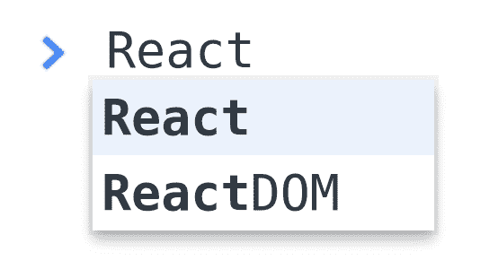
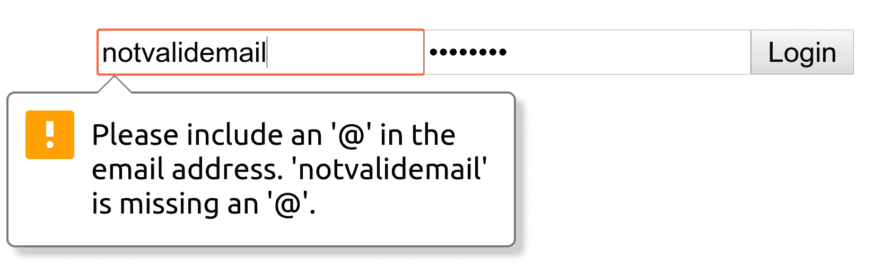
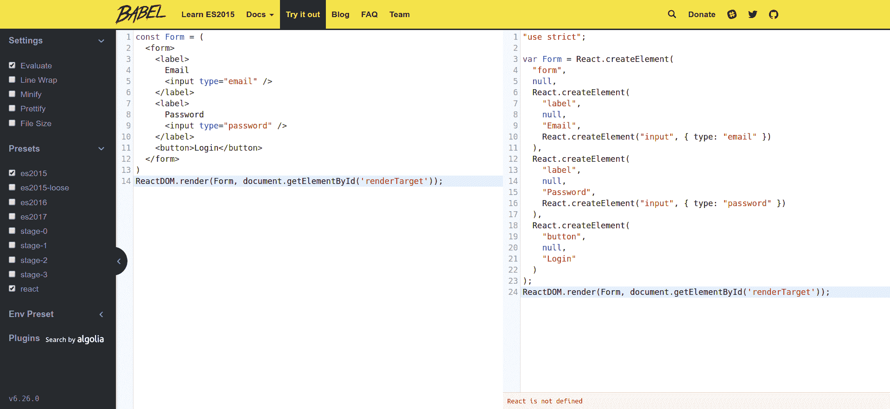
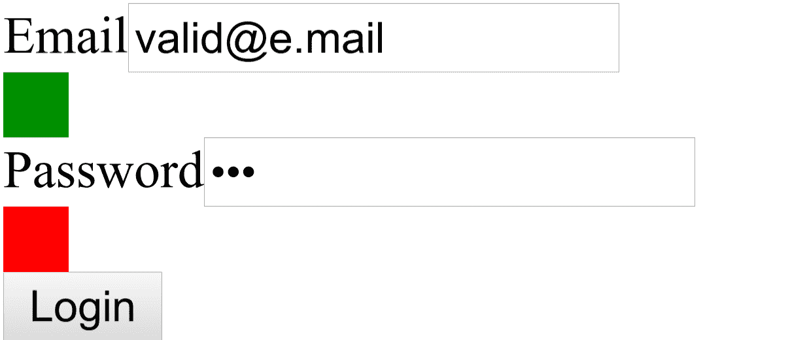
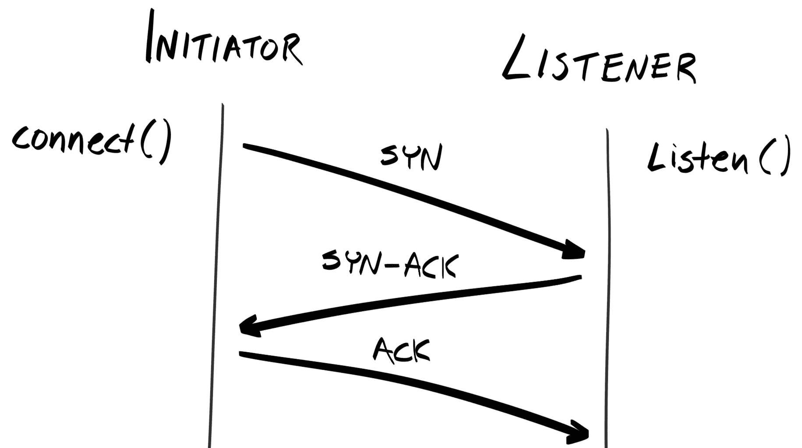

# 第十四章：使用 React 创建 UI

到目前为止，在这本书中，我们专注于后端 API 的开发；但如果没有直观的用户界面（UI）供我们的最终用户交互，我们的应用程序将是不完整的。因此，本章将专注于构建一个消耗我们 API 的 Web 应用程序。

具体来说，通过遵循本章，你将：

+   理解不同 UI 框架和库的优缺点

+   了解**React**的基础知识，包括**JSX**和**虚拟 DOM**

+   使用**Webpack**打包我们的代码

# 选择前端框架/库

如我们在第二章，“JavaScript 的现状”中已讨论的，**单页应用程序**（**SPAs**）相较于更传统的使用**客户端-服务器**架构的**多页应用程序**（**MPAs**）是一个巨大的进步。在 SPAs 中，许多传统上在服务器上完成的逻辑已经委托给了客户端。这意味着服务器上的负载将减少，应用程序可以更快地响应用户交互。因此，对于我们的客户端应用程序，我们将构建一个 SPA。现在，下一步是选择我们的 SPA 的技术栈。

# 纯 JavaScript 与框架

单页应用程序（SPAs）通常与流行的框架和库一起讨论，例如**AngularJS**/**Angular**、**React**、**Vue.js**、**Ember**和**Meteor**；但我们应该记住，SPAs 可以使用纯 HTML、CSS 和 JavaScript 编写。我们还可以选择使用实用库，例如**jQuery**，来抽象掉棘手的 Web API，例如`XMLHttpRequest`，并使我们的代码更具可读性。

然而，如果不使用框架或库，我们将不得不处理以下所有逻辑：

+   **路由**：从一个页面导航到另一个页面

+   **DOM 操作**：向页面添加/删除组件

+   **数据绑定**：保持模板与数据的更新

对于简单的获取和显示应用程序，例如用户目录，其主要逻辑是从 API 获取数据，将其替换到模板中，并渲染它，这可能还是可以管理的。但对于更复杂的应用程序，我们可能会发现自己仍然需要重新实现框架/库提供的许多功能。类似于 Express 通过抽象底层细节来简化处理 HTTP 请求和路由的方式，这些框架/库可以为我们抽象掉很多逻辑。

# 选择框架/库

可用的客户端框架/库众多，包括**Aurelia**、Ember、**Polymer**、**Backbone**、AngularJS/Angular、Vue.js、React、**Preact**、**Knockout**、jQuery、**Mithril**、**Inferno**、**Riot**、**Svelte**等等。然而，有三个框架/库占据主导地位：AngularJS/Angular、React 和 Vue.js。

让我们根据不同的因素逐一分析，以便我们能够做出明智的决定，选择最适合我们用例的库/框架。

# 流行度/社区

在 2012 年 AngularJS 发布之前，客户端 Web 应用程序框架，如 Knockout、Backbone 和 Ember 就已经存在，但 AngularJS 是第一个获得广泛采用并多年保持“最受欢迎的前端框架”称号的框架。然而，由于它是第一个，开发者很快就发现了很多令人烦恼的粗糙边缘。根据 2017 年*JavaScript 状态*调查，在所有使用过 AngularJS（版本 1）的人中，只有 32.9%的人会再次使用它。

因此，当 React 在 2013 年发布时，许多 Angular 开发者迁移到 React，这提高了 React 的知名度。React 开发者的满意度也很高，上述调查中有 93.1%的开发者表示他们会再次使用它。

2014 年，AngularJS 团队试图通过承诺完全重写 AngularJS 框架来做出回应。然而，新版本（现在称为“Angular”）与旧版本（现在称为“AngularJS”）不兼容，这意味着从 AngularJS 迁移到 Angular 需要完全重写应用程序。这引发了 Angular 社区中的强烈反对，进一步促使更多开发者转向 React。为了给 Angular 增添麻烦，Angular 2 的开发进度出现了许多延误，最终版本直到两年后的 2016 年才发布。在前端生态系统中，两年是一个非常长的时间，而那时 React 已经占据了开发者的大部分市场份额。

Vue.js 是最新加入的框架，它结合了从 Angular 和 React 中学到的经验（Vue.js 的创造者 Evan You 曾是谷歌的架构师）。自 2014 年发布以来，它在某种程度上对生态系统产生了与 React 首次发布时相同的影响。它的满意度也很高，有 91.1%的开发者表示他们会再次使用 Vue.js。

在具体数字方面，根据同一*JavaScript 状态*调查，在 23,704 名受访者中，有 14,689 人（62.0%）使用过 React，这一比例从 2016 年的 57.1%略有上升。共有 11,322 人（47.8%）使用过 AngularJS 1，这一比例从 2016 年的 63.6%下降，6,738 人（28.4%）使用过 Angular 2，这一比例从 2016 年的 20.5%上升。最大的增长者是 Vue.js，有 5,101 人（21.5%）表示他们使用过它，这一数字几乎是从 2016 年的 10.8%的两倍。

在源代码的贡献者方面，有 1,598 名开发者为 Angular 做出了贡献，1,177 名开发者为 React 做出了贡献，而只有 187 名开发者对 Vue.js 做出了贡献。

重要的是要注意，最受欢迎的框架并不意味着它是最好的框架，开发者永远不应该仅仅基于其知名度（即**炒作驱动的发展**）来选择框架。然而，一个框架越受欢迎，使用该框架的开发者就越多，因此在论坛和问答网站（如 Stack Overflow）上可能会有更多的社区支持。从企业的角度来看，这也会使招聘开发者变得更加容易。

因此，从受欢迎程度/社区/生态系统角度来看，Angular 正在衰落，Vue.js 正在崛起，但 React 仍然是明显的选择。

# 功能

当 Angular 首次推出时，它处理了路由、（双向）数据绑定和 DOM 操作。它是这一类中的第一个，并确立了客户端 Web 应用程序框架应该是什么样的标准。

然后，当 React 推出时，它重新定义了那个标准。虽然 Angular 将双向数据绑定作为杀手级特性进行推广，但 React 则将其视为一个错误源；相反，它推广了一向数据绑定。

但 React 中的最大范式转变是虚拟 DOM 和 JSX 的引入。

# 虚拟 DOM

虚拟 DOM 是真实 DOM 的简化抽象。在 React 中，开发者应该操作虚拟 DOM 而不是手动操作真实 DOM。React 会比较旧的虚拟 DOM 状态和新的状态，并计算出操作真实 DOM 的最有效方式。

DOM 操作是一个重量级操作，人类往往看不到最有效的方法。因此，让 React 自动计算出最有效的方法可以使更新 DOM 更加高效，从而实现更快、更反应灵敏的 UI。

# JSX

JSX 是一种新的语言，它编译成 JavaScript。它允许开发者使用类似 HTML 的语法定义 UI 组件。你不需要使用 `document.createElement()`、`React.createElement()` 或模板引擎，你可以用 JSX 编写你的组件。JSX 像一个模板，因为你可以在模板中添加占位符，这些占位符将被真实数据替换。区别在于 JSX 编译成纯 JavaScript，这意味着你可以在 JSX 文件中直接使用任何 JavaScript 语法。

如果你熟悉 **CSS 预处理器**，你可以将 JSX 视为 HTML 的预处理器，类似于 Sass 对 CSS 所做的那样。JSX 的引入意味着开发者有了一个更简单的方式来在代码中可视化他们的 UI 组件。

# React 之后

说到 React 改变了前端开发，这并不过分。React 引入了其他库和框架所复制的新概念。例如，Vue.js 也实现了虚拟 DOM 并在其模板中支持 JSX 语法。

然而，Angular 已经远远落后于其他框架。Angular 团队坚持“Angular 方式”，并没有与社区一起前进。我敢说，他们的最佳时期已经过去；目前他们能做的就是追赶。

# 灵活性

Angular 是一个框架，这意味着你必须承诺使用该框架构建你应用程序的全部内容。正如 Angular 团队重写 Angular 时所展示的那样，改变一个框架需要重写整个应用程序。

另一方面，React 和 Vue.js 是库，这意味着你可以将它们添加到你的项目中，并在适当的时候使用它们。你还可以添加额外的库（例如，路由器、状态管理），这些库将与 React/Vue.js 一起工作。

因此，在灵活性方面，React 和 Vue.js 是这里的赢家。

# 性能

Stefan Krause 开发并发布了一系列基准测试，使用每个框架进行一些基本操作（可在 [github.com/krausest/js-framework-benchmark](https://github.com/krausest/js-framework-benchmark) 上找到）。结果显示，React 比 Vue.js 略快，尤其是在进行部分更新时，但也消耗了略多的内存。

Angular 的性能与 React 和 Vue 相当，但消耗的内存明显更多，并且初始化时间更长。

# 跨平台

公司在选择技术栈时常见的错误是他们不一致。例如，我在一家初创公司工作过，我们共有四个项目，每个项目都使用不同的前端技术栈：AngularJS、Angular、Polymer 和 React。结果是，使用 Angular 开发的开发者无法帮助使用 React 的项目，反之亦然。一些开发者最终学习了所有框架，但代码质量很差，因为他们变成了“样样通，样样松”的人。因此，为所有前端项目保持一致的技术栈非常重要。通常，这不仅仅涉及网络应用程序，还包括原生移动和桌面应用程序。

# 使用 Ionic 的混合应用程序

在 AngularJS 发布大约 1 年后，**Ionic** 发布了。Ionic 是用于构建 **混合** 移动应用程序的框架。

实质上，你使用 Angular 构建一个网络应用程序，然后 Ionic 会使用另一个名为 **Cordova** 的工具将完整的应用程序包裹在一个 **WebView** 容器中。WebView 实际上是一个简化的网页浏览器，原生应用程序可以将其添加到自己的应用中。因此，混合应用程序基本上就是通过原生应用程序内部的浏览器来使用你的网络应用程序。使用混合应用程序，你可以“一次编写，到处运行”。

然而，由于有很多层，UI 的响应时间最初很慢，给混合应用程序带来了一种颠簸的感觉。

# 使用 React Native 和 Weex 的原生 UI

当 Facebook 在 2015 年宣布为 iOS 和 Android 提供 **React Native** 时，这是一个重大新闻。这意味着开发者现在可以使用相同的 React 原则和语法来开发网络和移动应用程序的前端。这也意味着可以共享非平台特定的逻辑，从而防止在不同语言中（Java 用于 Android 和 Swift/Objective-C 用于 iOS）对相同的逻辑进行多次实现。

这也被称作“一次学习，到处编写”，允许 React 开发者轻松地在网页开发者和移动开发者之间切换。如今，React Native 甚至可以用来构建 Windows 应用程序和虚拟现实（VR）应用程序。

对于 Vue.js，他们已经与阿里巴巴集团进行了持续的协作，开发了一个类似的跨平台 UI 库，称为 **Weex**。不久，Vue.js 也将支持使用 **NativeScript** 编写。然而，正如 Vue.js 团队自己承认的那样，Weex 仍在积极开发中，并且不像 React Native 那样经过实战检验，而 NativeScript 的支持是一个社区驱动的努力，目前尚未准备好。

因此，在跨多个平台使用相同的框架/库方面，React 拥有最成熟的工具和生态系统。

# 学习曲线

虽然这可能具有主观性，但我以及许多人发现 Angular 的学习曲线最陡峭。有许多 Angular 特有的概念，例如它们的 **digest 循环**，你必须理解这些概念才能在 Angular 中高效工作。Angular 还使用了开发者可能不熟悉的许多工具，包括：

+   **TypeScript**: 为 JavaScript 提供静态类型

+   **RxJS**: 允许你编写函数式响应式代码

+   **SystemJS**: 一个模块加载器

+   **karma**: 运行单元测试的工具

+   **量角器**: 一个端到端测试运行器，允许你运行与真实浏览器交互的测试

尽管每个工具都为应用程序带来了很多价值，但它无疑增加了 Angular 已经很陡峭的学习曲线。

相反，React 只是一个视图渲染库，因此更容易理解。基本思想是创建组件，传递一些输入，React 将生成最终视图并将其渲染到页面上。你可以以不同的方式排列这些组件，并将它们嵌套在一起，因为它们都是可组合的。你可能需要了解状态和 props 之间的区别，以及生命周期方法，但这最多只需要几个小时就可以完成。

人们说“React 学习曲线陡峭”时可能指的是其生态系统。React 生态系统是有组织的，你有很多工具，每个工具都做一件特定的事情。这通常是一件好事，但也意味着你需要花时间从不同的选项中进行选择，并且在尝试集成它们时可能会花费更多时间进行调试。

例如，你可能使用 React Router 来路由你的页面。你需要学习 Redux 或 MobX 来管理你的状态。大多数情况下，你会使用 Webpack 来打包你的应用程序。然而，许多 React 开发者也使用像 ImmutableJS、Flow、TypeScript、Karma 和 ESLint 这样的库，这些库不是强制性的工具，但常常会让新开发者感到困惑。

另一种方法是使用功能齐全的脚手架，例如 React Boilerplate ([reactboilerplate.com](http://www.reactboilerplate.com/))，它具有更平缓的学习曲线，但你仍然需要学习脚手架作者使用的约定。此外，如果脚手架存在 bug/问题，调试起来会困难得多。

在概念上，React 比 Angular 简单得多。即使是在 React 生态系统下，学习曲线仍然可控。个人而言，必须自己拼接自己的技术栈迫使你了解每个工具的作用以及它们如何与其他工具交互，这是一件好事。

Vue.js 拥有更简单的学习曲线。它不使用 JSX，而是使用更简单的类似模板的语法以及自己的领域特定语言（DSL）。它不需要 Webpack，开发者只需包含一个典型的`<script>`标签就可以启用 Vue.js。

```js
<script src="img/vue"></script>
```

因此，对于不使用框架的开发者来说，迁移到 Vue.js 更容易，因为他们可以更轻松地将 HTML 转换为类似 HTML 的模板，并逐步将整个应用程序适应 Vue.js。

# 结论

在社区、丰富性、生态系统成熟度、功能、灵活性和跨平台能力方面，React 是显而易见的选择。

目前 Vue.js 可能比 React 有优势的一点是学习曲线。然而，一两年后，我们可能会看到 Vue.js 在其他所有方面超过 React。如果不是这样，另一个框架/库可能会做到。

Angular 不太可能完全消失，因为仍然有足够的早期采用者和 Angular 的忠实支持者，这意味着我们至少还会在市场上看到 Angular 几年。但除非他们做出大幅度的不同（并且更好），否则可以安全地假设 Angular 将缓慢地退入背景，就像它之前的先驱一样。

因此，鉴于到目前为止所列出的所有原因，我们将使用 React 开发我们的客户端 Web 应用程序。

# 开始使用 React

如前所述，尽管 React 本身相当简单，但围绕它的生态系统可能会有些令人不知所措。Shopify 的前高级前端开发人员 Tessa Thorton 曾撰写了一篇名为《如何学习 Web 框架》的博客文章 ([ux.shopify.com/how-to-learn-web-frameworks-9d447cb71e68](https://ux.shopify.com/how-to-learn-web-frameworks-9d447cb71e68))。在文章中，她提醒我们：“框架的存在不是为了给人留下深刻印象或让生活变得更难。它们的存在是为了解决问题。”

这让我想起了我第一次构建的应用程序，一个 Amazon 的克隆。它完全使用纯 JavaScript 和 PHP 构建，因为我甚至不知道有框架可用！然而，有一段动画我无法正确实现，经过大量的 Google 搜索（并找到 Stack Overflow 的天堂），我最终使用了 jQuery。

对于学习如何编程来说，这不是一个坏策略。它让我理解了没有框架时可能做到的事情，并且当我使用框架时，我更加欣赏框架。

大多数教程都会要求你首先设置所有工具，然后再解释如何使用它们。我们将采取不同的方法——我们将从零开始构建我们的页面，使用最少的工具集，并在需要时引入新的概念和工具。

在下一节中，我们将使用这种方法来构建我们应用程序的注册页面。

# 什么是 React？

React 是一个用于构建面向客户端用户界面的应用程序库。原则上，它的工作方式与其他前端框架类似：它获取一些数据，将其插入某种模板中，然后将组合视图渲染到屏幕上。

# 组件

在 React 中，你构建的一切都是 *组件*。想象一下组件就像乐高积木；通过组合组件，你可以得到一个完整的用户界面。按钮可以是一个组件，输入字段可以是一个另一个组件。

许多开发者将“元素”和“组件”这两个术语互换使用。一般来说，当提到 HTML 元素时，你应该使用“元素”，当描述 React 组件时，你应该使用“组件”。

每个组件都包含自己的 HTML、CSS 和 JavaScript，因此它独立于其他组件。这包括在组件首次渲染到屏幕上时运行的函数，以及当它从视图中移除时运行的函数（这些函数统称为 *lifecycle methods*）。

组件可以组合成新的组件。例如，我们可以取两个 `HobnobInput` 组件，添加一个 `HobnobButton` 组件，然后将它们包裹在一个 `<form>` 元素内，称之为 `HobnobForm` 组件。

每个 React 应用程序都有一个单一的 **根组件**，你将 **子组件** （它们可以有它们自己的子组件）挂载到根组件中。最终，你构建了一个组件树，类似于 DOM 树。

# 虚拟 DOM

React 组件实际上存在于一个称为 *虚拟 DOM* 的空间中，这是一个作为实际 DOM 轻量级表示的对象。本质上，当页面渲染时，React 从数据和组件生成一个虚拟 DOM 对象，然后将其转换为 DOM 元素并插入到 DOM 中。

那为什么不直接将 React 组件转换为 DOM 节点呢？答案是性能。

# 虚拟 DOM 如何提高性能

HTML 是一个表示网站/应用程序结构的线性字符串表示。这个字符串本身并不传达关于层次结构或结构的信息。为了浏览器理解并渲染 HTML 表示的结构，它解析这个 HTML 并将其抽象成一个称为 **文档对象模型** 或 **DOM** 的树状表示。本质上，你的线性 HTML 标签变成了 DOM 树中的节点。

然而，这种解析相对昂贵。有许多层级的嵌套，每个节点都有许多与之关联的属性和方法。因此，如果你的应用程序包含许多（嵌套）组件，你的最终用户可能会注意到渲染中的延迟。这也适用于 DOM 操作（当你移动 DOM 中的节点时），因此最好将 DOM 操作保持在最低限度。

React 使用虚拟 DOM 的概念来最小化 DOM 操作。在 React 中，当我们尝试渲染一个组件时，React 会将相关数据传递到你的组件的 `render()` 方法中，并生成你视图的轻量级表示，这构成了虚拟 DOM 的一部分。虚拟 DOM 是一个 JavaScript 对象，它没有真实 DOM 元素所具有的所有不必要的属性和方法，因此操作它们要快得多。

如果这是页面第一次渲染，虚拟 DOM 将被转换为标记并注入到文档中。每当组件的输入发生变化时，`render()` 方法可能会再次被调用，这将产生你视图的另一个表示。React 然后找出前一个表示和当前表示之间的差异（“虚拟 DOM 的差异”），并生成应用于 DOM 的最小更改集。

这意味着如果输入的变化不需要重新渲染，那么 DOM 就不会被操作。此外，通常很难看到操作 DOM 的最高效方式，尤其是在复杂的 UI 中。React 的算法负责找到实现新 UI 状态的最有效方式。

# React 是声明式的

在传统的应用程序中，你可能需要监听数据的变化，处理它，并使用类似 jQuery 的工具自己更新 DOM。这是一种命令式风格，因为你基于数据指定 DOM 应该如何变化。例如，在用户搜索页面上，当结果返回时，看起来是这样的：

```js
listener('searchResult', function (users) {
  users
    .map(user => document.createTextNode(users.name.first + users.name.last))
    .foreach(node => document.getElementById('userList').appendChild(node))
});
```

相比之下，React 使用声明式风格，这意味着你不需要自己处理 DOM 更新。你只需声明你希望如何处理和显示数据，React 将找到一种方法来实现那种状态。

```js
<ul>
  { state.users.map(post => <li>users.name.first + users.name.last</li>) }
</ul>

listener('searchResult', function (users) {
  state.users = users;
});
```

声明式风格鼓励你编写确定性的 UI 组件，其工作只是忠实地反映状态。以这种方式完成时，当给定相同的状态对象时，UI 总是以相同的方式渲染。这使得开发者的工作变得容易得多，因为他/她只需要确保状态具有正确的值。

例如，在上面的例子中，开发者需要做的只是确保 `state.users` 数组包含最新的用户列表，并在必要时更新它。他/她永远不需要手动操作 DOM。

# React 概述

我们已经涵盖了开始使用 React 所需了解的所有内容。以下是一个简短的总结：

+   React 是一个前端框架，它接收数据并输出用户界面（UI）

+   一个 React 应用程序由相互渲染的组件组成

+   这些 React 组件对应于真实的 DOM 节点

+   React 性能良好，因为它通过使用虚拟 DOM 来最小化 DOM 操作

+   React 是声明式的；我们不需要自己处理 DOM 操作

接下来，我们将开始构建我们的注册屏幕。

# 开始一个新的仓库

我们的后端代码被封装，并且只通过 API 暴露。因此，我们的前端 Web 应用程序必须通过这个 API 与我们的后端代码交互。由于我们的后端和前端耦合良好，为我们的前端应用程序创建一个新的仓库是有意义的。

```js
$ mkdir -p ~/projects/hobnob-client
$ cd ~/projects/hobnob-client
$ git init
```

你可能想使用 ESLint 来帮助保持你的代码整洁。你可以使用之前相同的 `eslint --init` 向导来生成 `.eslintrc` 文件。然而，这次，当它问你 `Do you use React?` 时，选择 `Yes` 而不是 `No`。

# 添加一些模板代码

我们现在准备好开始！在我们的新项目目录中，创建一个新的 `index.html` 文件。在它里面，添加以下模板代码。

```js
<!DOCTYPE html>
<html lang="en">
<head>
  <meta charset="UTF-8">
  <meta name="viewport" content="width=device-width, initial-scale=1.0">
  <meta http-equiv="X-UA-Compatible" content="ie=edge">
  <title>Hobnob</title>
</head>
<body>
</body>
</html>

```

我们将使用两个库：`react` 和 `react-dom`。`react` 是一个基础包，允许你定义组件；`react-dom` 包允许你将 React 组件在虚拟 DOM 中转换为 DOM 元素，并将这些 DOM 节点挂载到 DOM 本身。

将它们分成两个包的原因是 React 不仅用于 Web 应用程序，它还可以用于 React Native 的原生应用程序，或者使用 React Canvas 在 `<canvas>` 元素中使用。React 简单地提供了一个创建可重用组件的框架，并且对那些组件的使用和渲染方式一无所知。

因此，让我们在 `index.html` 的 `<head>` 标签内添加这两个库。

```js
...
  <title>Hobnob</title>
  <script crossorigin src="img/react.production.min.js"></script>
 <script crossorigin src="img/react-dom.production.min.js"></script>
 </head>
 ...
```

这将 `React` 和 `ReactDOM` 作为全局变量暴露出来，我们可以在页面下方进一步使用。

在浏览器中打开你的 HTML 文件，并打开开发者工具。在控制台中，开始输入单词 `React`。你会看到 `React` 和 `ReactDOM` 都是可用的。



# 创建我们的第一个组件

现在我们已经设置好了一切，让我们创建我们的第一个组件！对于我们的注册表单，我们需要有一个表单元素，其中包含两个输入字段，一个注册按钮，以及一个显示错误信息的区域。在 React 中，我们可以使用 `createElement()` 方法创建一个新的 React 元素，该方法接受三个参数：

```js
React.createElement(type, [props], [...children])
```

`type` 可以是一个 HTML 标签名（例如，`div`、`span`、`form`），一个 React 组件类，或者一个 React 片段类型（稍后详细介绍后两种）。

`props` 是我们可以传递给 React 元素的属性，并且可能会以某种方式改变它。这类似于你可以在 HTML 元素上指定属性的方式。实际上，如果正在创建的元素是一个原生 HTML 元素，这些 `props` 就被用作标签属性。`props` 应该指定为一个对象。

`children`是嵌套在这个组件内部的 React 元素列表。在我们的例子中，我们会创建一个表单元素，并将我们的`input`和`button`元素嵌套在表单内部。

```js
<body>
  <script>
 const emailInput = React.createElement('input', { type: 'email' });
 const passwordInput = React.createElement('input', { type: 'password' });
 const registerButton = React.createElement('button', null, 'Register');
 const registrationForm = React.createElement('form', null, emailInput, passwordInput, registerButton);
 </script>
</body>
```

注意我们是如何将`{ type: 'email' }`作为`props`传递给`emailInput`的；这将在 DOM 上渲染为`<input type="email">`。我们还向`registerButton`元素传递了字符串`'Register'`；这将导致文本在`button`元素内部渲染，就像`<button>Register</button>`。

要将`registerForm`元素显示在页面上，我们需要使用`ReactDOM.render()`方法，它接受两个参数：

+   要渲染的组件

+   将其渲染到 DOM 元素中的 DOM 元素

因此，我们应该在 body 内部创建一个新的 HTML 元素，并使用`ReactDOM.render`将我们的 React 组件渲染到其中。

```js
<body>
  <div id="renderTarget"></div>
  <script>
    ,,,
    const registrationForm = React.createElement(...);
    ReactDOM.render(registrationForm, document.getElementById('renderTarget'));
  </script>
</body>
```

如果你将`index.html`在浏览器中打开，你会看到输入框和按钮被显示出来。


在更仔细地检查 HTML 输出后，你会发现 props 变成了 HTML 标签属性，并且传递给`createElement()`的子元素嵌套在其中。

```js
<div id="renderTarget">
  <form>
    <input type="email">
    <input type="password">
    <button>Register</button>
  </form>
</div>
```

由于我们指定了`type`为`email`，大多数浏览器会自动为我们验证字段。



# JSX

我们已经在屏幕上成功渲染了一些内容，但对于如此简单的表单来说，这已经足够多了。而且它不会变得更好。为了使每个输入元素的作用更加清晰，我们应该给每个元素附加一个标签。如果我们在这个输入的上方添加这个标签，代码看起来会更加臃肿：

```js
const emailInput = React.createElement('input', { type: 'email' });
const emailField = React.createElement('label', null, 'Email', emailInput);
const passwordInput = React.createElement('input', { type: 'password' });
const passwordField = React.createElement('label', null, 'Password', passwordInput);
const registerButton = React.createElement('button', null, 'Register');
const registrationForm = React.createElement('form', null, emailField, passwordField, registerButton);
```

一个典型的 Web 应用有成千上万的动态部分。使用`createElement`成千上万次可以使代码难以阅读，所以让我们尝试一个替代方案：*JSX*。

JSX，或**JavaScript XML**，是一种语法，允许你以 XML 格式创建 React 元素和组件。例如，我们的`registrationForm`元素在 JSX 中看起来会是这样：

```js
<form>
  <label>
    Email
    <input type="email" />
  </label>
  <label>
    Password
    <input type="password" />
  </label>
  <button>Register</button>
</form>
```

我们元素的现在结构立即变得更加清晰。但你可能会想，“但这只是 HTML！”你是对的。JSX 被设计成看起来和 HTML 一样，工作方式也类似。所以让我们尝试用新的 JSX 语法替换`registrationForm`元素，看看会发生什么：

```js
<script>
  const RegistrationForm = () => (
 <form>
 <label>
 Email
 <input type="email" />
 </label>
 <label>
 Password
 <input type="password" />
 </label>
 <button>Register</button>
 </form>
 );
  ReactDOM.render(<RegistrationForm />, document.getElementById('renderTarget'));
</script>
```

当我们在浏览器中打开`index.html`时，现在会在控制台抛出一个错误信息，显示：

```js
Uncaught SyntaxError: Unexpected token <
```

这是因为 JSX 不是有效的 JavaScript。

# 转译 JSX

如果你曾经使用过**CoffeeScript**，JSX 与它类似。你无法在浏览器中运行 CoffeeScript；你必须首先将其转换为 JavaScript。或者如果你使用过 CSS 预处理器，例如 Sass，JSX 也与之类似。Sass 中的`@include`或`@extend`等特性在 CSS 中是无效的，你必须使用预处理器将 Sass 转换为 CSS。对于 JSX 也是如此；我们必须使用转译器/预处理器将其转换为纯 JavaScript。

对于 JSX，最流行的转换器是 **Babel** 转换器，我们在开发 API 时已经使用过它。从某种意义上说，你可以将 JSX 视为新 ECMAScript 语法。一些 ECMAScript 功能在浏览器中不受支持，因此我们必须将其转换为浏览器可以理解的 JavaScript。JSX 在浏览器中不受支持，因此我们必须将其转换为浏览器支持的 JavaScript。

要查看 Babel 如何将 JSX 转换为 JavaScript，我们可以使用 Babel REPL，它可在 [babeljs.io/repl/](https://babeljs.io/repl/) 找到。打开它，并将 `<script>` 标签内的所有内容粘贴进去。你应该在右侧看到转换后的 JavaScript：



在服务器上，我们使用 Babel 将 `src/` 目录中的代码预编译到 `dist/` 目录。在客户端，我们可以在浏览器本身内部直接转换 JSX。为此，我们需要在 `<head>` 标签内包含 Babel Standalone Library 作为脚本：

```js
  ...
  <script crossorigin src="img/react-dom.production.min.js"></script>
  <script src="img/babel.min.js"></script>
</head>
...
```

我们还需要将 `<script>` 标签更改为包含属性 `type="text/babel"`。

```js
<body>
  <div id="renderTarget"></div>
  <script type="text/babel">
    ...
  </script>
</body>
```

`type="text/babel"` 属性告诉我们的浏览器不要将内部内容视为 JavaScript，而是作为纯文本。这意味着我们的 JSX 将不再抛出错误。然后，我们包含在 `<head>` 元素中的 Babel Standalone Library 将搜索任何具有类型 `text/babel` 的脚本标签，并将其转换为 JavaScript，然后执行转换后的 JavaScript。

打开你的浏览器，你应该看到我们之前看到的东西，但现在我们正在用 JSX 编写！

# 定义 React 组件

尽管我们通过使用 JSX 使我们的 React 代码变得更加清晰，但它仍然不如它本可以的那样干净和 DRY。例如，我们定义了相同的输入元素两次，尽管它们具有相同的结构。

```js
<label>
  Email
  <input type="email" />
</label>
<label>
  Password
  <input type="password" />
</label>
```

这是不理想的，以下是一些因素：

+   这可能会导致不一致。为了实现一致的用户体验，我们应该为所有组件应用一致的风格和布局，包括这些输入框。如果没有标准模板定义输入框将使这一过程变得困难。

+   更新困难。如果设计发生变化，我们需要更新所有输入框以适应新的设计，这将很难找到所有输入框的实例并更新其样式。人类容易出错，我们可能会错过一个或两个。

我们应该确保我们的 React 代码是 DRY 的；因此，我们应该定义一个独立的组件，我们可以在需要输入字段的地方重复使用它。

# 函数式和类组件

React 组件接收**props**（输入数据）并返回 React 元素（s）。在 React 中，你可以通过两种方式定义一个组件：

+   **函数式组件**

+   **类组件**

例如，我们可以使用函数式组件语法定义一个 `Input` React 组件。

```js
function Input(props) {
  return <label>{props.label}<input type={props.type} /></label>
}
```

大括号 (`{}`) 是 JSX 语法。大括号之间的一切都被评估为 JavaScript，并替换在原位。

或者，我们可以使用类语法定义相同的`Input`组件，它使用 ES6 类。

```js
class Input extends React.Component {
  render() {
    return <label>{this.props.label}<input type={this.props.type} /></label>
  }
}
```

这两种方法在功能上是等价的，可以像这样用来创建`RegistrationForm`组件：

```js
const RegistrationForm = () => (
  <form>
    <Input label="Email" type="email" />
    <Input label="Password" type="password" />
    <button>Register</button>
  </form>
);
```

在这里，我们将`label`和`type`属性传递给`Input`组件，然后我们在组件的`render`方法中使用它们。

那你应该使用哪种语法来定义 React 组件？函数组件更容易理解；毕竟，它们只是 JavaScript 函数。类组件有更复杂的语法，但支持更多功能，例如保持状态，并且可以利用不同的生命周期方法，我们很快就会介绍。因此，如果你的组件不需要这些附加功能，那么你应该优先选择函数语法而不是类语法。

# 纯组件

不论语法如何，所有 React 组件都必须是**纯的**。纯组件是这样的：

+   返回值（React 元素）是**确定的**，仅基于组件的输入（属性）。

+   组件不产生**副作用**。例如，纯组件不应该修改属性。

纯函数和函数组件很好，因为它们更容易理解和测试。因此，当我们有一个大型的或深度嵌套的组件，如我们的`Form`元素时，将它们分解成更小的纯函数组件，并使用这些组件来组合元素是良好的实践。

尝试将我们的按钮转换为其自己的（简单）组件。最终结果应该看起来像这样：

```js
function Input(props) {
  return <label>{props.label}<input type={props.type} /></label>
}
function Button(props) {
  return <button>{props.title}</button>
}
const RegistrationForm = () => (
  <form>
    <Input label="Email" type="email" />
    <Input label="Password" type="password" />
    <Button title="Register" />
  </form>
);
ReactDOM.render(<RegistrationForm />, document.getElementById('renderTarget'));
```

# 维护状态并监听事件

让我们更深入地处理`Input`组件。当用户在输入框中键入时，验证用户输入并在其旁边显示指示器将大大提升用户体验。如果输入有效，指示器可以是绿色的，如果无效，则可以是红色的。

因此，我们的`Input`组件需要：

+   监听和处理事件，以便在值变化时验证输入。

+   维护状态，以便组件可以持久化验证的结果。

目前，我们的`Input`组件是以函数组件风格定义的。这是首选的，但它功能有限；它不能保持状态。因此，让我们首先将`Input`组件转换为类组件：

```js
class Input extends React.Component {
  render() {
    return <label>{this.props.label}<input type={this.props.type} /></label>
  }
}
```

接下来，我们可以给`Input`组件的每个实例提供一个状态。在 React 中，状态简单地说是一个键值存储（即对象），它是实例内部的（私有的）。对我们来说，我们将使用状态来保存有关输入是否有效的信息。

我们可以在组件类的`constructor`方法中定义组件的初始状态，这是一个特殊的方法，当使用`new`关键字实例化类时会被调用。

```js
class Input extends React.Component {
  constructor() {
 super();
 this.state = { valid: null }
 }
  render () { ... }
}
```

我们将状态属性`valid`设置为`null`，因为在用户输入任何内容之前，我们不想说它是有效的或无效的。

接下来，我们需要向 `input` HTML 元素添加事件监听器。JSX 中的事件监听器与 HTML 中的类似，只是它们是 `camelCase` 而不是小写。例如，HTML 中的 `onchange` 监听器将是 `onChange`。事件处理器属性值应该是一个事件处理器函数。更新标签内的 `input` 元素以包含 `onChange` 属性。

```js
render() {
  return <label>{this.props.label}<input onChange={this.validate} ... /></label>
}
```

现在，每当输入值发生变化时，`this.validate` 会被调用，并将事件对象作为其唯一的参数传递。由于此方法尚不存在，我们必须现在定义它。

# 处理事件

在类方法内部，`this` 指的是 React 元素（它是 `Input` React 组件类型的实例）。因此，我们可以定义一个名为 `validate` 的方法，该方法将验证用户输入并更新状态：

```js
<script type="text/babel">
 const validator = {
 email: (email) => /\S+@\S+\.\S+/.test(email),
 password: (password) => password.length > 11 && password.length < 48
 }
  class Input extends React.Component {
    constructor() { ... }
    validate = (event) => {
 const value = event.target.value;
 const valid = validatorthis.props.type;
 this.setState({ value, valid });
 }
    render() {
      return <label>{this.props.label}<input type={this.props.type}  onChange={this.validate} /></label>
    }
  }
  ...
</script>
```

`validate` 方法从 `event.target.value` 获取输入框的值，然后使用一个外部的 `validator` 对象来实际验证该值。如果值有效，`validator` 方法将返回 `true`，如果无效，则返回 `false`。

最后，`validate` 方法使用 `setState` 方法更新状态，该方法对所有类组件都是可用的。

# `setState` 和不可变性

你应该使用 `setState` 来更新状态，而不是简单地修改现有的状态：

```js
// Bad
validate = (event) => {
  const value = event.target.value;
  const valid = validatorthis.props.type;
  this.state.value = value;
 this.state.valid = valid;
}
// Good
validate = (event) => {
  const value = event.target.value;
  const valid = validatorthis.props.type;
  this.setState({ value, valid })
}
```

最终结果是相同的：`this.state` 被更改为新值。然而，如果我们直接更新 `this.state` 对象，那么 React 必须定期轮询 `this.state` 的值以通知任何更改。这是缓慢且低效的，并且不是 React 的实现方式。相反，通过 `this.setState` 方法更改状态，它将“反应性地”通知 React 状态已更改，React 可能会选择触发视图的重新渲染。

# 渲染状态

最后，在我们的 `render` 方法中，让我们添加一个指示组件。我们将从组件的状态中读取以确定指示器的颜色。

```js
<script type="text/babel">
  ...
  function getIndicatorColor (state) {
 if (state.valid === null || state.value.length === 0) {
 return 'transparent';
 }
 return state.valid ? 'green' : 'red';
 }

  class Input extends React.Component {
    constructor() { ... }
    validate = (event) => { ... }
    render () {
      return (
        <label>
          {this.props.label}
          <input type={this.props.type} onChange={this.validate}/>
          <div className="indicator" style={{
 height: "20px",
 width: "20px",
 backgroundColor: getIndicatorColor(this.state)
 }}></div>
        </label>
      )
    }
  }
  ...
</script>
```

现在，在你的浏览器中打开 `index.html`，并尝试输入框。如果你输入了一个无效的电子邮件，或者你的密码太短/太长，指示器将显示红色。



它看起来并不漂亮，但“功能优先于形式”——一旦我们有了功能，我们再关心外观。

# 提交表单

现在我们已经准备好了表单，让我们采取下一个逻辑步骤，找出如何将数据提交到我们的 API。

我们需要做的第一件事是为表单添加一个 `onSubmit` 事件处理器。处理器是针对注册表单的，因此应该与 `RegistrationForm` 关联。定义它的最明显的地方是作为一个类方法。将 `RegistrationForm` 更新如下：

```js
class RegistrationForm extends React.Component {
  handleRegistration = (event) => {
 event.preventDefault();
 event.stopPropagation();
 }
  render() {
    return (
      <form onSubmit={this.handleRegistration}>
        <Input label="Email" type="email" />
        <Input label="Password" type="password" />
        <Button title="Register" />
      </form>
    )
  }
}
```

`this.handleRegistration` 在表单提交时被触发（例如，当用户按下注册按钮）并将事件作为其唯一的参数传递。

表单的默认行为是向表单 `action` 属性中指定的 URL 发送 HTTP 请求。在这里，我们没有指定 `action` 属性，因为我们想以不同的方式处理表单。因此，我们调用 `event.preventDefault()` 来阻止表单发送请求。我们还调用 `event.stopPropagation()` 来阻止此事件被 **捕获** 或 **冒泡**；换句话说，它阻止其他事件处理器处理它。

接下来，我们需要找出如何获取每个输入框的值，组合请求，然后将其发送到我们的 API。

# 无状态表单元素

之前，我们说每个组件的状态是组件内部的（私有的）。然而，JavaScript 中没有私有类方法。我们唯一的等效方法是闭包；因此，我们的状态并不是真正私有的。如果我们能获取到 React 元素的引用，我们也可以获取到其状态。

React 支持一个名为 **ref** 的功能。我们可以使用 `React.createRef()` 方法创建 ref，然后将该 ref 附接到任何子 DOM 元素或 React 元素上。然后我们可以通过 ref 来引用该元素。

```js
class RegistrationForm extends React.Component {
 constructor(props) {
 super(props);
 this.email = React.createRef();
 this.password = React.createRef();
 }
  handleRegistration = (event) => {
    event.preventDefault();
    event.stopPropagation();
 console.log(this.email.current);
 console.log(this.password.current);
  }
  render() {
    return (
      <form onSubmit={this.handleRegistration}>
        <Input label="Email" type="email" ref={this.email} />
        <Input label="Password" type="password" ref={this.password} />
        <Button title="Register" />
      </form>
    )
  }
}
```

在前面的代码中，在 `RegistrationForm` 的构造函数中，我们创建了两个 ref，分别赋值给 `this.email` 和 `this.password`。然后我们使用 `ref` 属性将这两个 ref 附接到两个 `Input` 元素上。

`ref` 属性是一个特殊的属性，它不会传递给子元素。

我们现在可以使用 `this.email.current` 获取到电子邮件 `Input` 元素的引用。并且我们可以使用 `this.email.current.state` 获取其 `state` 属性。尝试打开浏览器，在输入框中输入一些值并点击注册；你应该能在控制台中看到每个输入框的当前状态。

接下来，让我们更新 `handleRegistration` 方法，首先检查状态对象，看看值是否有效；如果是，提取并将它们分配给一个变量。

```js
handleRegistration = (event) => {
  event.preventDefault();
  event.stopPropagation();
  const hasValidParams = this.email.current.state.valid && this.password.current.state.valid;
 if (!hasValidParams) {
 console.error('Invalid Parameters');
 return;
 }
 const email = this.email.current.state.value;
 const password = this.password.current.state.value;
}
```

接下来，我们需要对密码进行散列，组合请求，并将其发送到我们的 API 服务器。让我们定义一个 `register` 函数，它将提供一个抽象层，并使我们的 `handleRegistration` 方法保持易于阅读。

```js
<body>
  <script type="text/babel">
 function register (email, digest) {

 // Send the credentials to the server
 const payload = { email, digest };
 const request = new Request('http://localhost:8080/users', {
 method: 'POST',
 headers: { 'Content-Type': 'application/json' },
 mode: 'cors',
 body: JSON.stringify(payload)
 })
 return fetch(request)
 .then(response => {
 if (response.status === 200) {
 return response.text();
 } else {
 throw new Error('Error creating new user');
 }
 })
 }
    ...
  </script>
</body>
```

这两个函数使用 **Fetch API** 向我们的 API 服务器发送请求（假设运行在 `http://localhost:8080/`）。

接下来，我们需要调用我们之前定义的 `register` 函数来实际验证用户。

```js
handleRegistration = (event) => {
  ...
  const email = this.email.current.state.value;
  const password = this.password.current.state.value;
  const digest = bcrypt.hashSync(password, 10));
  register(email, digest))
    .then(console.log)
    .catch(console.error) }
```

最后，我们使用 `bcrypt.hashSync` 来对密码进行散列；因此，我们需要加载 `bcryptjs` 库，我们可以通过以下网址从 RawGit CDN 获取：[`rawgit.com/dcodeIO/bcrypt.js/master/dist/bcrypt.min.js`](https://rawgit.com/dcodeIO/bcrypt.js/master/dist/bcrypt.min.js)。

```js
<head>
  ...
  <script src="img/bcrypt.min.js"></script>
</head>
<body>
  <div id="renderTarget"></div>
  <script type="text/babel">
    const bcrypt = dcodeIO.bcrypt;
    ...
  </script>
</body>
```

# 解决 CORS 问题

现在，如果我们重新加载页面，填写我们的详细信息，并按下`Register`按钮，我们将遇到一个与 CORS 相关的错误。这是因为我们的 API 服务器目前仅服务于我们的 Swagger 文档页面（在`http://localhost:8100`上）；来自其他网站的请求被拒绝。

为了解决这个问题，我们需要向 Hobnob API 提供有关我们客户端位置的信息。我们可以通过添加一些额外的环境变量来实现这一点。将以下条目添加到我们的 Hobnob API 存储库中的`envs/.env`和`envs/.env.example`文件中。

```js
CLIENT_PROTOCOL=http
CLIENT_HOSTNAME=127.0.0.1
CLIENT_PORT=8200
```

然后，我们需要将客户端的源添加到 API 应允许的源列表中。我们可以通过更新 CORS 中间件来动态设置`Access-Control-Allow-Origin`头来实现这一点。在我们的 Hobnob API 存储库的`src/index.js`内部进行以下更改：

```js
app.use((req, res, next) => {
  const {
 SWAGGER_UI_PROTOCOL, SWAGGER_UI_HOSTNAME, SWAGGER_UI_PORT,
 CLIENT_PROTOCOL, CLIENT_HOSTNAME, CLIENT_PORT,
 } = process.env;
 const allowedOrigins = [
 `${SWAGGER_UI_PROTOCOL}://${SWAGGER_UI_HOSTNAME}`,
 `${SWAGGER_UI_PROTOCOL}://${SWAGGER_UI_HOSTNAME}:${SWAGGER_UI_PORT}`,
 `${CLIENT_PROTOCOL}://${CLIENT_HOSTNAME}`,
 `${CLIENT_PROTOCOL}://${CLIENT_HOSTNAME}:${CLIENT_PORT}`,
 ];
 if (allowedOrigins.includes(req.headers.origin)) {
 res.setHeader('Access-Control-Allow-Origin', req.headers.origin);
 }
  res.header('Access-Control-Allow-Headers', 'Origin, X-Requested-With, Content-Type, Accept');
  next();
});
```

最后，回到我们的客户端应用程序，我们需要确保客户端正在指定的端口上提供服务，并且 CORS 已启用。我们可以通过使用`http-server`包提供的`-p`和`--cors`标志来实现这一点。

```js
$ http-server . -p 8200 --cors
```

现在，如果我们重新加载我们的 API 服务器和客户端，并尝试注册，我们应该得到一个成功响应。

# 禁用按钮组件

为了使用户体验更加直观，让我们在电子邮件和密码字段都有效之前禁用`Register`按钮。要做到这一点，我们需要为`RegistrationForm`组件提供一个方法，使其不仅能在表单提交时读取`Input`组件的值，还能在每次值改变后读取。

一个简单的方法是每 100 毫秒左右轮询每个组件的`valid`状态，但这将不会高效。相反，我们可以通过`onChange`属性传递一个函数到`Input`组件，该函数将在`Input`的值改变时被调用。

```js
<Input label="Email" type="email" ref={this.email} onChange={this.handleInputChange} />
<Input label="Password" type="password" ref={this.password} onChange={this.handleInputChange} />
```

然后在我们的`Input`组件的`validate`方法内部，我们会调用`this.props.onChange`:

```js
validate = (event) => {
  const value = event.target.value;
  const valid = validatorthis.props.type;
  this.setState({ value, valid }, () => {
 if (this.props.onChange) {
 this.props.onChange();
 }
 });
}
```

`setState`方法接受一个回调作为其第二个参数，该回调仅在状态更新后调用。这确保了当父组件（`RegistrationForm`）检查`Input`元素的当前状态时，它将得到更新后的状态。

现在，我们需要在`RegistrationForm`中定义`handleInputChange`方法。它应该检查两个输入是否有效，并将结果存储在`RegistrationForm`的状态中。

```js
constructor(props) {
  super(props);
  this.email = React.createRef();
  this.password = React.createRef();
  this.state = {
 valid: false
 };
}
...
handleInputChange = () => {
 this.setState({
 valid: !!(this.email.current.state.valid && this.password.current.state.valid)
 })
}
```

最后，我们需要修改我们的`Button`组件以接受一个`disabled`属性，当`true`时应该禁用按钮。

```js
function Button(props) {
  return <button disabled={props.disabled}>{props.title}</button>
}
class RegistrationForm extends React.Component {
  ...
  render() {
    return (
      <form onSubmit={this.handleRegistration}>
        ...
        <Button title="Register" disabled={!this.state.valid} />
      </form>
    )
  }
}
```

现在，刷新页面并尝试输入。现在，`Register`按钮应该被禁用，直到两个输入都有效（即，两个指示器都是绿色的）。

# 控制表单元素

您现在有一些使用属性、状态和引用的经验。然而，我们当前实现中存在几个主要缺陷：

+   我们在多个地方保存状态。这很难管理，因为我们必须记住每个状态存储在哪里。

+   我们在多个地方重复相同的州。我们在`RegistrationForm`元素以及`Input`元素中都持有`valid`状态。`RegistrationForm`的`valid`状态可以从`Input`元素的状态中推导出来。

为了防止这两个缺陷，我们应该将需要的状态存储提升到需要它的组件最近的共同祖先；对我们来说，这将是由`RegistrationForm`组件。

这就是它的工作方式。首先，我们将`Input`组件转换回无状态的、哑组件，其输出完全取决于传入的属性。我们将传递一个新的属性，`name`，这是一个用于识别输入的名称。它类似于正常`input`HTML 元素的`name`属性。我们还将更改`RegistrationForm.handleInputChange()`方法的签名，以接受输入的`name`作为其第一个参数。

```js
function Input (props) {
 return (
    <label>
      {props.label}
      <input type={props.type} value={props.value} onChange={(event) => props.onChange(props.name, event)} />
      <div className="indicator" style={{ ... }}></div>
    </label>
 )
}
```

我们的`Input`组件不再保留任何状态，也不再执行任何验证。相反，这些任务已经委托给了组件最近的共同祖先，即`RegistrationForm`组件。因此，在`RegistrationForm`内部，我们可以：

+   删除对这些 Input 组件的任何引用——因为它们不再持有任何状态，我们没有理由保留这些引用

+   更新`this.state`以保存`Input`组件的值和有效性信息。

```js
class RegistrationForm extends React.Component {
  constructor(props) {
    super(props);
    this.state = {
 email: {
 value: "",
 valid: null
 },
 password: {
 value: "",
 valid: null
 }
 };
  }
  ...
}
```

接下来，更新我们的 JSX 组件，将`value`和`valid`等状态传递给`Input`组件。我们还传递了一个`name`属性，这有助于识别元素：

```js
render() {
  return (
    <form onSubmit={this.handleRegistration}>
      <Input label="Email" type="email" name="email" value={this.state.email.value} valid={this.state.email.valid} onChange={this.handleInputChange} />
      <Input label="Password" type="password" name="password" value={this.state.password.value} valid={this.state.password.valid} onChange={this.handleInputChange} />
      <Button title="Register" disabled={!(this.state.email.valid && this.state.password.valid)} />
    </form>
  )
}
```

接下来，我们将完全重写`RegistrationForm`的`handleInputChange`方法，以验证输入并将值及其有效性存储到状态中。它将使用`Input`组件的`onChange`事件处理程序传递的`name`和`event`参数。

```js
handleInputChange = (name, event) => {
  const value = event.target.value;
 const valid = validatorname;
  this.setState({
    [name]: { value, valid }
  });
}
```

最后，我们不再需要使用 refs 来获取`Input`组件的值并验证它们，因为它们已经在状态中。因此，从我们的`handleRegistration`方法中删除这些行：

```js
handleRegistration = (event) => {
  ...
  const hasValidParams = this.state.email.valid && this.state.password.valid;
  if (!hasValidParams) { ... }
 const email = this.state.email.value;
 const password = this.state.password.value;
  ...
}
```

现在，刷新页面，一切应该都会像之前一样正常工作。

在本节中，我们已经提升了组件的状态并将它们合并到单个位置。这使得我们的状态更容易管理。然而，我们更改状态的方式是通过传递`onChange`属性。虽然这对于像这样的简单组件来说是可以的，但一旦组件深度嵌套，性能就会大大降低。一次更改可能会调用数十个函数，这是不可持续的。因此，随着我们继续开发我们的应用程序，我们将使用状态管理工具，如 Redux 或 MobX。

# 模块化 React

但现在，我们必须解决另一个紧迫的问题——我们的代码并不非常模块化。所有内容都定义在一个单独的`<script>`标签内。这不仅难以阅读，而且也不易于维护。我们无法在一个文件中定义所有组件！

此外，我们正在使用`<script>`标签包含库。因为一些库依赖于其他库（例如，`react-dom`依赖于`react`），我们必须手动确保我们的脚本按正确的顺序加载。

当我们讨论服务器端模块时，我们已经看到了 CommonJS 和 ES6 模块。然而，在使用客户端代码中的模块时，我们必须考虑其他因素，例如：

+   每个模块的大小。依赖项在应用程序运行之前下载。在服务器上，应用程序只初始化一次，之后它将长时间运行（数周到数年）。因此，下载依赖项的初始时间是一个一次性成本。然而，在客户端，每次客户端加载应用程序时都需要下载这些依赖项。因此，将应用程序及其依赖项的文件大小保持在尽可能低是非常重要的。

+   发生了多少个单独的请求？在服务器上，所有依赖项都驻留在服务器上，因此导入依赖项几乎不花费任何成本。在客户端，每次向服务器的请求都是一个新的 HTTP 请求，这需要一个新的 TCP 握手。所有这些操作都需要相对较长的时间，因此我们必须确保尽可能少地向服务器发出请求。

+   异步。我们已经在第四章“设置开发工具”中讨论了 CommonJS 模块。CommonJS 模块是同步加载的，这意味着模块是按照在运行中的文件/模块内被要求的顺序加载的。由于一个模块可能有数百个依赖项，这意味着解析和下载所有依赖项可能需要很长时间。这对于服务器应用程序来说不是问题，因为服务器应用程序在初始时间需求之后将长时间不间断地运行。在客户端，如果 A 依赖于 B，而 B 又依赖于 C，那么 C 必须在 B 下载之后才能下载，因为我们无法提前知道 B 依赖于 C。

由于这些担忧，我们需要使用不同的工具来确保我们的客户端应用程序在客户端的性能。因此，让我们花些时间来回顾它们。

# 客户端模块

当我们开发服务器端代码时，我们使用了来自[npmjs.com](https://www.npmjs.com/)注册表的包。这些包最初仅打算用于服务器端代码。很快，前端开发者意识到了所有这些服务器端包的力量，并希望在前端使用它们。

这成为一个问题，因为 CommonJS 的同步加载在浏览器上表现不佳。由于所需的模块在客户端不可用，必须在页面首次访问时下载，所以加载时间会很长。如果一个模块有一个超过 100 个模块的扩展依赖树，它必须在页面/应用程序加载之前下载 100 个模块。由于网页很少长时间打开，所以初始加载通常对最终用户来说不值得，他们可能会放弃网站。

有两种不同的解决方案来解决这个问题：

+   模块打包

+   异步模块加载

# 模块打包

而不是客户端（浏览器）解析数百个依赖项并直接从客户端下载，我们会在服务器上下载所有依赖项，将它们按正确的顺序连接成一个单一的文件（或 **bundle**），然后发送给客户端。这个包包含了应用程序和 **所有** 依赖项，可以像任何常规脚本一样加载。由于所有依赖项都在事先解析，因此消除了客户端解析依赖项所需的时间。

但是因为所有内容都压缩到一个文件中，所以生成的包可能会变得相当大，但加载时间会减少，因为客户端不需要发出数百个单独的请求；现在只需要一个。此外，如果其中一个外部服务器宕机，它不会影响我们的打包代码，因为这是由我们自己的服务器提供的。

在野外你会遇到四种不同的模块打包器：**Browserify**、**Webpack**、**Rollup** 和 **Parcel**。

# Browserify

Browserify 是第一个模块打包器，它改变了前端代码的编写方式。Browserify 会从入口点 JavaScript 文件分析并跟踪 `require` 调用，构建一个依赖项列表，下载它们，然后将所有内容打包成一个单一的 JavaScript 文件，可以通过单个 `<script>` 标签注入。模块是递归添加的，这意味着最内层的依赖项首先被添加。这确保了模块按照正确的顺序打包。

要使用它，你只需安装 `browserify` 包，并指定应用程序的入口点以及你想要放置打包文件的位置。

```js
$ npm install -g browserify
$ browserify entry.js > bundle.js
```

# Webpack

Webpack 已经基本上取代了 Browserify，成为事实上的领导者。虽然 Browserify 只做模块打包，但 Webpack 还尝试整合来自流行的 **任务运行器**（如 **Grunt** 或 **Gulp**）的功能。使用 Webpack，你可以在打包文件之前/之后预处理文件（例如，压缩 JavaScript 和转换 Sass 文件）。

Webpack 的一个突出特点是**代码拆分**。这允许你将包拆分为多个文件：那些对应用程序的初始化和功能至关重要的文件，以及那些可以稍后加载的文件。然后你可以优先传输关键代码，为用户提供更快的加载时间，并改善用户体验。非关键代码可以稍后加载，或者仅在需要时加载。

# Rollup

Browserify 和 Webpack 专注于 CommonJS 模块，并需要一个 Babel 插件来支持 ES6 模块。Rollup 默认支持原生 ES6 模块。

Rollup 也支持**摇树**，这是一个从包中消除未使用代码的功能。假设你正在导入一个支持 100 个函数的大型实用库，但你只使用了其中的四个；摇树将删除我们应用程序不需要的 96 个。这可以显著减少具有许多依赖的应用程序的包大小。

传统上，社区共识是使用 Webpack 用于应用程序，而 Rollup 用于库。这有两个原因：

+   Webpack 通常会产生更多的模板代码，因此产生的包大小明显更大，这对于库来说是不必要的。这对于 Webpack 的早期版本尤其如此，它会将每个模块包裹在其自己的函数闭包中。这不仅增加了包的大小，还降低了性能。然而，自从 Webpack 3 以来，这些模块使用称为**作用域提升**（scope hoisting）的技术被封装到一个闭包中。

+   Webpack 支持代码拆分，这对于应用程序很有用，但并不真正有助于库

然而，自从它们诞生以来，Webpack 已经增加了对摇树（tree-shaking）的支持，而 Rollup 增加了对代码拆分（code-splitting）的支持，因此这些工具之间的相似性正在增加。

# Parcel

最后，一个相对较新的工具 Parcel 出现了，其卖点是无配置设置。虽然这可能加快了初始开发，但没有配置也意味着它可能支持的功能更少，并且你对最终包的控制也更少。

# 异步模块加载

模块打包的另一种选择是在客户端异步加载模块。异步模块加载意味着不相互依赖的模块可以并行加载。这部分缓解了客户端在使用 CommonJS 时面临的缓慢启动时间。

# AMD 和 Require.js

**异步模块定义**（**AMD**）是实现异步模块加载的最受欢迎的模块规范。AMD 实际上是 CommonJS 的一个早期分支，并且也使用了`require`和`exports`语法。

正如存在用于 CommonJS 模块的模块打包器一样，也存在用于 AMD 模块的**模块加载器**。这些工具被称为加载器，因为它们直接从客户端加载模块。最受欢迎的模块加载器是**Require.js**。Require.js 为你提供了一个`define`函数，你可以用它来定义你的模块。你可以将依赖项列表作为其第一个参数传入。让我们看看一个例子：

```js
// greeter.js
define(function () {
  function helloWorld(name) {
    process.stdout.write(`hello ${name}!\n`)
  };
  return { sayHello: helloWorld }
});

// main.js
define(["./greeter.js"], function (greeter) {
  // Only ran after the `greeter` module is loaded
  greeter.sayHello("Daniel");
});
```

当`main`模块被启动时，它将首先加载`greeter`模块，并将返回的对象传递给定义`main`模块的函数。这确保了模块按正确的顺序加载。

Require.js 在后台处理这些模块的加载，如果可能的话，并行化它们。这意味着下游代码执行不会被阻塞。

# 通用模块定义

**UMD**，或**通用模块定义**，是一种旨在与 CommonJS 和 AMD 兼容的模块定义格式。它还允许你将模块导出为全局变量，你可以通过简单的`<script>`标签将其包含在你的应用程序中。

它通过将模块包裹在一个检查环境的样板代码中来实现这一点，以检测模块的使用方式，并生成正确的导出对象。

例如，前面的`greeter`示例使用 UMD 将看起来像这样：

```js
// greeter.js
(function (root, factory) {
  // Requirements are defined here
}(this, function () {
  function helloWorld(name) {
    process.stdout.write(`hello ${name}!\n`
  };
  // Whatever you return is exposed
  return {
    helloWorld: helloWorld
  }
}));

// main.js
(function (root, factory) {
  if (typeof define === 'function' && define.amd) {
    // AMD
    define(['./greeter.js'], factory);
  } else if (typeof exports === 'object') {
    // Node, CommonJS-like
    module.exports = factory(require('./greeter.js'));
  } else {
    // Browser globals (root is window)
    root.returnExports = factory(root.greeter);
  }
}(this, function (greeter) {
  greeter.sayHello("Daniel");
}));
```

# SystemJS 和 Loader 规范

**Loader 规范**([whatwg.github.io/loader/](https://whatwg.github.io/loader/))是一个正在进行的规范，它“描述了从 JavaScript 宿主环境加载 JavaScript 模块的行为”。换句话说，它描述了在浏览器和服务器上加载 JavaScript 模块的标准方式。它是 WHATWG 开发的，但尚未被采纳为活标准。

**SystemJS**是 Loader 规范在浏览器上的实现。更具体地说，SystemJS 是一个**通用动态模块加载器**。在这里，“通用”意味着它不仅可以加载 CommonJS 模块，还可以加载 ES6 模块、AMD 和全局脚本。它是通过`SystemJS.import`方法实现的，类似于适用于所有主要模块定义的通用`require`。导入`App`组件并渲染它的代码可能看起来像这样：

```js
var App = SystemJS.import('./components/App.jsx').then(App => {
  ReactDOM.render(<App />, document.getElementById('renderTarget'));
});
```

# jspm

然而，如果 SystemJS 可以从任何来源导入模块，它是如何知道模块的位置的呢？例如，如果我们执行`SystemJS.import('moment')`，SystemJS 应该从 NPM 注册表获取包吗？或者是一个自定义仓库？SystemJS 无法确定。因此，为了有效地使用 SystemJS，我们必须使用一个包管理器，它可以维护包名和它们的位置之间的映射。幸运的是，我们有**jspm**，它代表**JavaScript 包管理器**。

jspm 与 npm 和 yarn 类似，但它可以从任何地方下载模块/包，而不仅仅是 npm。此外，它将自动创建一个包含我们之前提到的所有包到位置的映射的 SystemJS 配置文件。

# 模块打包器与模块加载器

在对客户端模块周围的工具进行了简要概述之后，我们仍然面临着一个问题——我们应该使用打包器还是加载器？现状是使用模块打包器。使用加载器，你可能需要触发数百个 HTTP 请求来下载所有依赖项。即使这些操作在后台进行，也可能导致加载时间变慢。因此，使用模块打包器可能会使应用程序加载更快。

# HTTP/2

然而，一旦 HTTP/2 得到更广泛的采用，这个问题可能就不再是问题。在使用 HTTP/1.1 时，我们需要为每个我们想要检索的资源建立单独的 HTTP 和 TCP 连接，即使这些资源位于同一服务器上。建立 TCP 连接需要三次握手，这是昂贵的。



使用 HTTP/2 的多路复用功能，单个 TCP 连接可以用来发送多个 HTTP 请求。此外，可以在飞行中同时发送多个请求和响应消息。因此，如果 HTTP/2 得到广泛采用，发送多个请求将不再昂贵。

为了 HTTP/2 能够工作，它需要同时被浏览器和服务器支持。

根据 `caniuse.com` ([caniuse.com/#feat=http2](https://caniuse.com/#feat=http2))，在撰写本文时，只有 84.53% 的浏览器支持 HTTP/2。根据 W3Techs ([w3techs.com/technologies/details/ce-http2/all/all](https://w3techs.com/technologies/details/ce-http2/all/all))，在撰写本文时，HTTP/2 仅被 25.3% 的所有网站使用。因此，相当一部分浏览器使用量仍然在 HTTP/1.x 浏览器上。在这些浏览器上，我们仍然需要在每次页面加载时进行数百到数千次的 TCP 连接；这是不可接受的。因此，直到 HTTP/2 支持几乎无处不在，现状仍然是使用模块打包器以减少加载速度。

正如我们之前提到的，最成熟且广泛使用的模块打包器是 Webpack，因此在本章的剩余部分，我们将把我们的应用程序转换为使用 ES6 模块，并使用 Webpack 来处理和打包我们的应用程序。

# Webpack

我们将使用 yarn 来管理我们的依赖项，就像我们处理客户端代码一样。所以让我们启动一个新的配置文件，并将 `webpack` 包添加为开发依赖项：

```js
$ yarn init
$ vim .gitignore # Can use the same .gitignore as for our server app
$ yarn add webpack webpack-cli --dev
```

就像 Babel 一样，Webpack 会接收源文件，转换它们并将输出放在某个地方。因此，我们也创建两个目录来区分它们。

```js
$ mkdir src dist
$ mv index.html src/
```

# 组件模块化

接下来，我们将完全移除 `src/index.html` 中的所有 JavaScript 脚本。首先，移除所有依赖 `<script>` 标签，例如 React、ReactDOM、Babel 和 bcryptjs。然后，我们将使用 `yarn` 来安装它们。

```js
$ yarn add react react-dom bcryptjs
$ yarn add @babel/core @babel/preset-react @babel/preset-env @babel/plugin-proposal-class-properties --dev
```

Babel 被分割成多个更小的包。这允许开发者只使用他们需要的那个，而不包括不必要的功能。

我们现在可以通过导入它们来使用这些包，就像我们使用后端代码一样。

接下来，我们将 `index.html` 中的 JavaScript 代码拆分为单独的模块。我们将创建：

+   一个 `utils` 目录来存放可重用的实用函数。

+   一个 `components` 目录来存放所有我们的组件。

+   `index.jsx` 作为入口点。这将是我们导入整体 `App` 组件并将其使用 `ReactDOM.render()` 渲染到 DOM 上的地方。

在你的终端上运行以下命令：

```js
$ mkdir -p \
  src/utils/validator \
  src/utils/register \
  src/components/input \
  src/components/button \
  src/components/Registration-form
$ touch \
  src/index.jsx \
  src/utils/validator/index.js \
  src/utils/register/index.js \
  src/components/input/index.jsx \
  src/components/button/index.jsx \
  src/components/Registration-form/index.jsx
```

我们在这里使用 `.jsx` 扩展名来表示这个文件包含 JSX 语法。稍后，这个约定将帮助 Webpack 高效地确定它需要处理的文件。

首先，让我们将 `validator` 对象从 `src/index.html` 文件移动到 `src/utils/validator/index.js` 并导出它。

```js
const validator = {
  email: (email) => /\S+@\S+\.\S+/.test(email),
  password: (password) => password.length > 11 && password.length < 48
}
export default validator;
```

同样对 `register` 函数做同样的处理。然后，将每个组件提取到其自己的 `index.jsx` 中。例如，`src/components/button/index.jsx` 将包含以下代码。

```js
import React from 'react';
function Button(props) {
  return <button disabled={props.disabled}>{props.title}</button>
}
export default Button;
```

`src/components/input/index.jsx` 将看起来像这样：

```js
import React from 'react';
function getIndicatorColor (state) { ... }
function Input (props) { ... }
export {
 Input as default,
 getIndicatorColor,
}
```

`react` 必须导入到每个使用 React 和 JSX 的模块中。

对于具有外部依赖的 `RegistrationForm` 组件，我们可以在模块顶部 `import` 它：

```js
import React from 'react';
import bcrypt from 'bcryptjs';
import { validator } from '../../utils';
import register from '../../utils/register';
import Button from '../button/index.jsx';
import Input from '../input/index.jsx';

class RegistrationForm extends React.Component { ... }

export default RegistrationForm;
```

最后，在我们的 `src/index.jsx` 中导入 `RegistrationForm` 组件并将其渲染到 DOM 上：

```js
import React from 'react';
import ReactDOM from 'react-dom';
import RegistrationForm from './components/Registration-form/index.jsx';
ReactDOM.render(<RegistrationForm />, document.getElementById('renderTarget'));
```

# 入口/输出

如前所述，Webpack 是一个模块打包器。它将你的应用程序代码及其所有依赖项打包成一个或少数几个文件。这些文件然后可以传输到客户端并执行。更正式地说，它将许多源 **输入** 文件打包成一个或多个 **输出** 文件。使用 Webpack，开发者指定一个或多个入口点，Webpack 将遵循每个文件中的 `require` 或 `import` 语句来构建依赖项树。

Webpack 的原始卖点是其可配置性。所以让我们首先在 `webpack.config.js` 中创建一个配置文件。

```js
const webpack = require('webpack');
module.exports = {
  entry: {
    app: './src/index.jsx',
  },
  output: {
    filename: './dist/bundle.js',
  },
};
```

在 Webpack 4 中，为最常见的配置设置了合理的默认值。这意味着我们可以使用 Webpack 而不需要 `webpack.config.js`（他们将其推广为 **零配置 JavaScript**（**0CJS**））。然而，总是明确比隐晦更好，所以我们仍然会保留 `webpack.config.js`。

让我们看看运行 Webpack CLI 时会发生什么。

```js
$ npx webpack
Hash: 9100e670cdef864f62dd
Version: webpack 4.6.0
Time: 243ms
Built at: 2018-04-24 18:44:49
1 asset
Entrypoint main = main.js
[0] ./src/index.js 283 bytes {0} [built] [failed] [1 error]

ERROR in ./src/index.js
Module parse failed: Unexpected token (3:16)
You may need an appropriate loader to handle this file type.
| import RegistrationForm from './components/Registration-form';
|
| ReactDOM.render(<RegistrationForm />, document.getElementById('renderTarget'));
|
```

Webpack CLI 正在抱怨它不理解 `import` 语法。这是因为默认情况下，Webpack 只完全支持 ES5 语法，不支持 ES6 模块。为了使 Webpack 能够理解 ES6 语法，我们必须使用 `babel-loader` 包。

# 加载器

加载器是运行在源文件上的转换程序，它们是**单独**运行的。例如，你会在打包之前使用加载器将 CoffeeScript/TypeScript 转换为 ES5；在我们的例子中，我们使用它将 ES2015+ 语法和 JSX 转换为 ES5。首先，让我们使用 yarn 安装加载器。

```js
$ yarn add babel-loader --dev
```

接下来，我们将更新 `webpack.config.js` 以指示 Webpack 使用加载器。我们可以通过在 `module.rules` 属性中定义加载器规范来实现这一点。

```js
const webpack = require('webpack');

module.exports = {
  entry: { app: './src/index.jsx' },
  output: { filename: 'bundle.js' },
  module: {
    rules: [{
      test: /\.jsx?$/,
      exclude: /node_modules/,
      use: [{
        loader: 'babel-loader',
        options: {
          presets: ['@babel/preset-env', '@babel/preset-react'],
          plugins: [require('@babel/plugin-proposal-class-properties')],
        },
      }],
    }],
  },
};
```

每个加载器规范包含两个重要的子属性：

+   `test` 决定了哪些文件应该由这个加载器处理。在这里，我们使用正则表达式 `/\.jsx?$/` 来告诉 Webpack 使用此加载器处理所有扩展名为 `.jsx` 的文件。

+   `use` 指定了用于转换这些文件的加载器，以及传递给加载器的任何附加选项。在这里，我们指示 Webpack 使用我们刚刚安装的 `babel-loader` 模块，Babel 应该使用 React 和 `env` 预设，以及 Transform Class Properties 插件。

现在，当我们再次运行 `webpack` 时，你会看到 `dist/bundle.js` 正在被创建。

```js
$ npx webpack
Hash: adbe083c08891bf4d5c7
Version: webpack 4.6.0
Time: 4933ms
Built at: 2018-04-24 19:34:55
Asset Size Chunks Chunk Names
bundle.js 322 KiB 0 [emitted] [big] app
Entrypoint app [big] = bundle.js
[7] (webpack)/buildin/global.js 489 bytes {0} [built]
[73] (webpack)/buildin/module.js 497 bytes {0} [built]
[74] ./src/utils/index.js 324 bytes {0} [built]
[120] crypto (ignored) 15 bytes {0} [optional] [built]
[121] buffer (ignored) 15 bytes {0} [optional] [built]
[153] util (ignored) 15 bytes {0} [built]
[155] util (ignored) 15 bytes {0} [built]
[162] ./src/index.jsx 327 bytes {0} [built]
+ 155 hidden modules
```

它还可能打印一些有关优化构建的警告。我们现在可以忽略这些警告。

现在我们已经将 `bundle.js` 放在 `dist/` 目录的根目录下，我们应该更新我们的 `src/index.html` 以使用捆绑的脚本。将 `<script type="text/babel">...</script>` 块替换为 `<script src="img/bundle.js"></script>`。

然而，`index.html` 并没有被从 `src/` 目录复制到 `dist/` 目录。这是因为 Webpack 只处理 JavaScript (`.js` / `.mjs`)、JSON 和 WebAssembly 文件 (`.wasm`)。要复制 `index.html` 文件，我们需要另一种类型的工具，称为 **插件**。

CSS 和 HTML 模块计划在 Webpack 5 中得到支持，因此我们在这里介绍的一些插件可能在未来不再必要。

# 插件

加载器在创建包之前或期间对单个文件进行转换，"就地" 进行。相比之下，插件在加载器的输出上工作，并在创建后整体处理包。

# 复制文件

要复制我们的 `src/index.html` 文件，我们可以使用名为 Copy Webpack 插件 (`copy-webpack-plugin`)。正如其名所示，此插件将单个文件或整个目录复制到构建目录。让我们使用 yarn 安装它。

```js
$ yarn add copy-webpack-plugin --dev
```

并将插件添加到我们的 `webpack.config.js`。

```js
const webpack = require('webpack');
const CopyWebpackPlugin = require('copy-webpack-plugin');
module.exports = {
  entry: { ... },
  output: { ... },
  module: { ... },
  plugins: [
 new CopyWebpackPlugin(['src/index.html'])
 ],
};
```

`CopyWebpackPlugin` 构造函数具有以下签名：

```js
CopyWebpackPlugin([ ...patterns ], options)
```

在这里，`patterns` 指定了一组应复制的匹配文件。我们只是指定了一个单个文件。

再次运行 `webpack`，你会看到 `bundle.js` 和 `index.html` 都被写入到 `dist/` 目录。现在我们可以使用 `http-server` 包来静态地提供 `dist/` 目录。

```js
$ http-server dist/ -p 8200 --cors
```

你应该会看到与之前相同的注册表单。但现在我们的代码要模块化得多。

# 最后步骤

在我们完成之前，让我们也记录我们在 npm 脚本中运行的命令。这将在未来使构建和提供我们的应用程序更容易。

在 `package.json` 中，使用以下 `scripts` 属性定义构建步骤：

```js
"scripts": {
  "build": "rm -rf dist/ && webpack"
}
```

然后，我们将编写一个脚本来提供我们的应用程序。我们希望使用环境变量（而不是硬编码）来指定应用程序的主机和端口，因此让我们创建一个 `.env` 和一个 `.env.example` 文件，并填充以下内容：

```js
WEB_SERVER_PORT_TEST=8200
WEB_SERVER_HOST_TEST=localhost
```

然后，在 `scripts/serve.sh` 创建一个 Bash 脚本，并赋予它执行权限：

```js
$ mkdir scripts && touch scripts/serve.sh
$ chmod u+x scripts/serve.sh
```

在 Bash 脚本内部，我们将简单地加载环境变量，构建应用程序，并使用 `htttp-server` 来提供打包后的文件：

```js
#!/usr/bin/env bash
# Set environment variables from .env and set NODE_ENV to test
source <(dotenv-export | sed 's/\\n/\n/g')
export NODE_ENV=test
yarn run build
http-server dist/ -- -p $WEB_SERVER_PORT_TEST --cors
```

现在，我们只需使用 npm 脚本运行我们的 Bash 脚本：

```js
"serve": "./scripts/serve.sh"
```

# 摘要

在本章中，我们使用 React 构建了一个基本的注册表单，并使用 Webpack 进行打包。在下一章中，我们将探讨如何使用 **Selenium** 对前端应用程序进行端到端测试。
