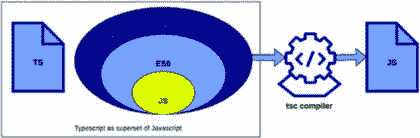
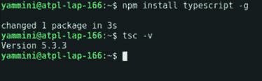
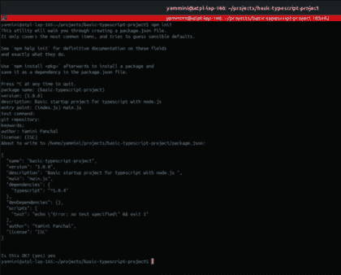
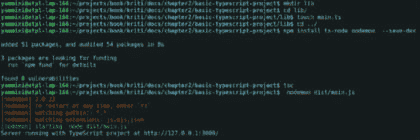

# 第二章

# TypeScript 介绍

# 介绍

在 JavaScript 中开发的应用程序数以百万计，但开发者在开发过程中面临许多问题。JavaScript 直接运行而不先编译代码。由于动态类型和缺少编译时检查，运行时错误、代码复杂性和大型代码库的维护等问题很常见。TypeScript 作为 JavaScript 的超集被引入，以解决所有这些问题。

在本章中，我们将讨论 TypeScript 的基本概念以及如何在开发应用程序时使用 TypeScript 代替 JavaScript。

# 结构

在本章中，我们将涵盖以下主题：

+   TypeScript 概述

+   TypeScript 的优势

+   TypeScript 的陷阱

+   安装 TypeScript

+   使用 TypeScript 构建基本应用程序

+   面向对象编程（OOP）概念

+   ECMAScript 特性

+   EsLint

# TypeScript 概述

TypeScript 是 JavaScript 的超集，这意味着所有 JavaScript 特性都存在，并且还包含其他额外特性。JavaScript 是一种基于对象的语言，但它不提供面向对象编程的所有概念，所以缺失的部分通过 TypeScript 来实现。TypeScript 是由微软开发和维护的开源编程语言。它于 2012 年发布，通常缩写为 TS。

在图像中显示的是 TypeScript 的表示，它作为 JavaScript 的超集，由 TypeScript 编译器（TSC）编译，然后转换为 JavaScript 代码。



**图 2.1**：TypeScript 作为 JavaScript 的超集

JavaScript 是一种解释型语言，它直接运行而不需要先编译代码。因此，如果发生任何错误，它将在运行时被检测到。TypeScript 可以轻松处理这个问题，因为它在检查数据类型时非常严格。如果使用得当，运行时出现错误的几率会减少。TypeScript 首先编译代码，然后转换代码。基本上，这里的转换意味着将 TypeScript 代码转换为 JavaScript 代码。它的默认编译器被称为`**tsc**`。TypeScript 支持所有 ES6（ECMAScript6）特性和面向对象的概念。TypeScript 是**静态检查**，这意味着它在执行代码之前检测错误。

让我们考虑一个例子：

**JS 代码**

`let name = "Jack";`

`name = 12;`

`无错误`

**TS 代码**

`let name: string = "Jack";`

`name = 12;`

`错误：类型'number'不能分配给类型'string'`

这是一个 JS 和 TS 代码的非常基础的例子。区别在于 JS 会自动考虑字符串类型，一旦分配了数字值，它就会将数字转换为字符串，因此不会产生任何错误。然而，当在涉及数字相关操作的后续代码部分中使用时，这可能会导致运行时问题。相比之下，TypeScript 在构建过程中识别此类问题，在该阶段生成错误。

# TypeScript 的优点

使用 TypeScript 有许多好处。以下是一些关键优点：

+   **开源：** TypeScript 是免费且开源的强类型检查编程语言。它可以免费轻松安装和使用。

+   **跨平台：** TypeScript 支持跨平台和跨浏览器兼容性。毕竟，一旦编译完成，它作为 JavaScript 代码运行。

+   **支持 OOP 和 ES6：** TypeScript 具有使用最强大的面向对象编程概念的能力，就像其他高级 OOP 语言（如 JAVA）一样，它为 Js 启用了这些功能。它支持类、接口、访问修饰符、抽象、继承等。它还具有使用 ES6 功能的能力，以实现更好的编码标准和可读性。

+   **错误检测器：** TypeScript 在开发应用程序时提供错误检测功能，在运行之前提供错误描述；因此，开发者可以确保节省调试时间，并使用健壮的代码进行开发。

+   **可选类型检查：** TypeScript 基本上是用于强类型检查的，但它可以是可选的，因为它允许静态以及动态检查。对于动态检查，它需要是可选的。

+   **灵活性和可维护性：** TypeScript 具有巨大的灵活性，可以与不同的 JavaScript 框架（如 React.js、Angular、Nest.js、Express.js、loopback 等）一起使用。它可以在客户端和服务器端都作为 JavaScript 使用。此外，即使不同的开发者遵循标准编码实践协作并共同工作，代码也易于维护。

+   **更好的 IDE 支持：** TypeScript 比 JavaScript 提供了更好的 IDE 支持。所有流行的 IDE 都提供了代码补全、参数提示、类型检查等功能，这使得开发更快、更高效。

# TypeScript 的陷阱

虽然 TypeScript 有多个优点，但也存在一些缺点：

+   **不适合小型应用：** TypeScript 并不适合所有应用，尤其是小型应用，因为它在不需要类型检查的简单功能实现上变得复杂，而在 JS 中则可以轻松完成。

+   **编译时间：** TypeScript 代码首先进行编译，因此在整个转换过程中需要时间，这需要编译器进行编译，而 JavaScript 不需要。

+   **学习曲线**：由于比 JavaScript 复杂一些，开发者需要投入一些时间来学习和适应语法。然而，这通常只发生在第一次。一旦开发者熟悉并适应了 TypeScript，由于 TypeScript 的优势，可以节省大量时间。

# 安装 TypeScript

TypeScript 可以通过两种方式在您的系统中安装和设置。第一种是全局安装，另一种是将它作为开发依赖项本地安装。我们可以通过在系统中预先安装的 npm 模块来安装它。

# 全局安装

当处理多个项目时，全局安装方法证明是有益的，因为它消除了对特定项目安装的需求。然而，它假设在各个项目中使用的是相同的版本。

打开终端并粘贴以下命令。它将在您的系统中安装最新版本。

`$ npm install typescript -g`

安装完成后，如果您想验证已安装 TypeScript 的版本，请粘贴以下代码：

`$ tsc -v`

前一个命令的输出将类似于 `"**版本 5.3.3**"`



**图 2.2**：TypeScript 安装

# 按项目安装

在许多情况下，需要使用不同版本的 TypeScript 来处理不同的项目，这时本地安装是必要的。

为项目创建一个文件夹，并按照以下方式本地安装：

`$ mkdir basic-typescript-project`

`$ cd  basic-typescript-project`

`$ npm install typescript  --save-dev`

这将在该项目中本地安装 TypeScript。现在我们可以开始使用 TypeScript 开发基本应用程序了。

# 使用 TypeScript 构建基本应用程序

安装完成后，转到创建的项目根目录，并按照以下步骤操作：

1.  **初始化项目**：输入以下命令将创建一个 `**package.json**` 文件以初始化 Node.js 项目，并会提示一些关于项目的信息，如项目名称、版本、描述、入口点（主文件）等。因此，按照如图 *图 2.2* 所示输入这些详细信息。

    `$ npm init`

    

    **图 2.3**：项目初始化步骤

1.  **将 TypeScript 作为开发依赖项安装**：现在运行以下命令，这将添加 TypeScript 作为开发依赖项（开发依赖）：

    `$ npm install typescript --save-dev`

1.  **将 node 作为 TypeScript 的开发依赖项安装**：在处理 Node.js 项目时，最好使用类型安装它。这将允许使用 TypeScript 使用 Node.js 的所有默认模块，例如 http、https、fs 等。

    `$ npm install @types/node --save-dev`

    在开发过程中，可以使用 `**@types/pkg_name --save-dev**` 安装任何额外的包，以便在 IDE 中提供类型定义。

1.  **创建一个** `**tsconfig.json**` **文件并定义编译器选项**：在根目录中创建一个 `**tsconfig.json**` 文件，然后按如下方式配置编译器选项：

    `{`

    `"compilerOptions": {`

    `"target": "es2019",`

    `"module": "commonjs",`

    `"moduleResolution": "node",`

    `"pretty": true,`

    `"sourceMap": true,`

    `"outDir": "./dist",`

    `"baseUrl": "./lib",`

    `"noImplicitAny": false,`

    `"esModuleInterop": true,`

    `"removeComments": true,`

    `"preserveConstEnums": true,`

    `"experimentalDecorators": true,`

    `"alwaysStrict": true,`

    `"forceConsistentCasingInFileNames": true,`

    `"emitDecoratorMetadata": true,`

    `"resolveJsonModule": true,`

    `"skipLibCheck": true`

    `},`

    `"include": [`

    `"lib/**/*.ts"`

    `],`

    `"exclude": [`

    `"node_modules"`

    `],`

    `"files": [`

    `"node_modules/@types/node/index.d.ts"`

    `]`

    `}`

    让我们逐个了解这些编译器选项，然后排除和包含 `**tsconfig.json**` 文件中的选项：

    +   `**target**`**:** 指定 ECMAScript 目标版本。默认为 `**'ES3'**`，可以设置为 `**'ES5'**`、`**'ES6'**`、`**'ES2015'**`、`**'ES2016'**`、`**'ES2017'**`、`**'ES2018'**`、`**'ES2019'**` 或 `**'ESNEXT'**`。它设置输出 JavaScript 的 JavaScript 语言版本，并包含兼容的库声明。

    +   `**module**`**:** 指定生成的模块代码。如果目标属性是 `**ES5**` 或 `**ES3**`，则默认值为 `**'commonjs'**`，否则为 `**'ES6'**`、`**'AMD'**`、`**'System'**`、`**'ES2015'**` 或 `**'ESNEXT'**`。

    +   `**moduleResolution**`**:** 指定模块解析策略为 `**'node'**`（Node.js）或 `**'classic'**`（TypeScript）。对于现代 JS，它始终设置为 `node`，否则为 `classic`。它指定 TypeScript 如何根据给定的模块指定符查找文件。

    +   `**pretty**`**:** 启用输出中的颜色和格式化，以便更容易阅读编译器错误。这可以设置为 `true` 或 `false`。

    +   `**sourceMap**`**:** 这可以启用为发出的 JavaScript 生成源映射文件，也可以不生成，它有助于调试和错误报告。

    +   `**outDir**`: 指定一个输出文件夹以存储所有转换后的文件。

    +   `**baseUrl**`**:** 指定基本目录以解析非相对模块名称，其中所有 TypeScript 文件都位于该目录。

    +   `**noImplicitAny**`: 启用对具有隐含 `any` 类型的表达式和声明的错误报告。

    +   `**esModuleInterop**`**:** 发出额外的 JavaScript 以简化对 CommonJS 模块的导入支持。这启用了 `**allowSyntheticDefaultImports**` 以实现类型兼容性。

    +   `**removeComments**`**:** 禁用输出注释，这意味着不会向输出中发出注释。

    +   `**preserveConstEnums**`**:** 禁用生成代码中删除 `**enum**` 声明。当设置为 `true` 时，`**enum**` 在运行时存在，并提供了一种通过发出枚举值而不是引用来减少应用程序运行时整体内存占用空间的方法。

    +   `**experimentalDecorators**`**:** 此选项启用在 TS 项目中使用装饰器。ES 尚未引入装饰器，因此默认情况下是禁用的。

    +   `**alwaysStrict**`**:** 确保您的文件以`**ECMAScript**`严格模式解析，并为每个源文件发出`"**use strict**"`。默认值是 false。

    +   `**forceConsistentCasingInFileNames**`**:** 确保导入中的大小写正确，不允许对同一文件的不一致大小写引用。

    +   `**emitDecoratorMetadata**`**:** 启用对发射装饰器类型元数据的实验性支持。

    +   `**resolveJsonModule**`**:** 启用导入`**.json**`文件。

    +   `**skipLibCheck**`**:** 跳过所有`**.d.ts**`文件的类型检查。

    +   `**include**`**:** 指定匹配要包含在编译中的文件的 glob 模式列表。如果`**tsconfig.json**`中没有`‘files’**`或`‘include’**`属性，编译器默认包含包含目录及其子目录中的所有文件，但排除由`‘exclude’**`指定的文件。

    +   `**exclude**`**:** 指定要排除的文件列表。`**'exclude'**`属性仅影响通过`‘include’**`属性包含的文件，不影响`**'files'**`属性。

    +   `**files**`**:** 如果**tsconfig.json**中没有`**'files'**`或`**'include'**`属性，编译器默认包含包含目录及其子目录中的所有文件，但排除由`**'exclude'**`指定的文件。当指定了`**'files'**`属性时，只包含那些文件和由`‘include’**`指定的文件。

1.  **使用 TypeScript 创建基本应用程序**：创建一个`**lib**`文件夹，并在其中创建`**main.ts**`文件，如`**tsconfig.json**`中定义的，包含`**lib**`文件夹，它编译所有.ts 文件。

    `$ mkdir lib`

    `$ cd lib`

    `$ touch main.ts`

    现在在`main.ts`文件中写下以下代码并保存：

    `import * as http from 'http';`

    `const hostname = '127.0.0.1';`

    `const port = 3000;`

    `const server = http.createServer((req, res) => {`

    `res.statusCode = 200;`

    `res.setHeader('Content-Type', 'text/plain');`

    `res.end('Hello World');`

    `});`

    `server.listen(port, hostname, () => {`

    ``console.log(`Server running with TypeScript project at`

    ``http://${hostname}:${port}/`);``

    `});`

1.  **运行 TypeScript 代码**：安装`**ts-node**`包进行编译和`**nodemon**`，以便每次文件更改时都可以自动重新加载或重新运行。这样我们就不需要在某些更改后再次运行服务器。转到根目录并输入以下命令：

    `$ npm install ts-node nodemon  --save-dev`

    `$ tsc`

    一旦运行了`**tsc**`命令，就会创建一个名为`**dist**`的新目录（我们在`**tsconfig.json**`中将其指定为 outDir）。所有 TS 文件都会编译成 JS 并放置在这个目录中。现在我们可以在指定的端口上运行应用程序，默认通常是 3000。如果端口是 3000，那么应用程序将可通过 http://127.0.0.1:3000 访问。

    `**nodemon**` 可以检测 `**dist**` 目录中的新更改，并在有更改时立即重启服务器。我们只需使用 `**nodemon**` 而不是 node 来运行服务器：

    `$ nodemon dist/main.js`

    

    **图 2.4**：编译 TypeScript 应用程序

    `**nodemon**` 可以检测 `**dist**` 目录中的更改并重新运行 `**main.js**`，但由于我们正在用 TS 编码，每次更改后都需要重新编译文件。使用 `**tsc**` 进行手动重新编译也是一个繁琐的任务。为了解决这个问题，我们可以使用监视选项，这样每次 TS 文件更改时，它都会自动编译。要使用监视模式运行 `**tsc**`，我们可以使用 `**-w**` 标志，如下所示：

    `$ tsc -w`

这样我们就可以构建一个基本的 TypeScript 应用程序。如果你想要了解更多关于 `**tsconfig.js**` 编译器选项的信息，可以访问 [`www.TypeScriptlang.org/tsconfig`](https://www.TypeScriptlang.org/tsconfig) 以获取参考。

我们已经看到了构建基本的 TypeScript 应用程序，现在我们将探讨 JavaScript 中不支持的对象导向概念。

# TypeScript 中的面向对象概念

TypeScript 支持面向对象编程，我们将学习关于类、接口、抽象、继承、封装和多态。然而，在那之前，我们需要了解 TypeScript 中的数据类型。因此，让我们看看支持的数据类型。

# 数据类型

TypeScript 有原始数据类型和非原始数据类型。原始数据类型意味着值直接赋值，也称为基本数据类型，而非原始数据类型可以是原始数据类型的引用或子类型。

# 原始数据类型

对于原始数据类型，值是直接赋值的。这些也称为基本数据类型：

+   `**String**`: 它用于文本数据，这些数据被双引号或单引号包围。例如：

    `let name:string = "Tom";`

    `name = "Jerry";`

+   `**Number**`: 它用于数值数据。它还支持十进制、二进制、十六进制和八进制数据。例如：

    `let total :number = 100;`

    `let binaryNumber :number = 0b0101;`

    `let hexaNumber :number = 0xf00d;`

    `let octalNumber :number = 0o555;`

+   `**Bigint**`: 它用于数值数据。它还支持大整数。例如：

    `let bigNumber :bigint = 200n;`

    `let anotherBigNumber :bigint = BigInt(200);`

+   `**Boolean**`: 当你需要 `**true**` 或 `**false**` 的情况时使用。例如：

    `let mute :boolean = true;`

    `mute = false;`

+   `**Null**` 和 `**Undefined**`: 它与 JavaScript 相同：**null** 表示一个没有任何对象的引用，而 **undefined** 表示类型尚未初始化。两者都是其他类型的子类型。

    `let name:undefined = undefined;`

    `let num:null = null;`

+   `**Symbol**`: 它是`**ES6**`中引入的一种新数据类型。它通过`**Symbol**`函数创建一个唯一的符号。

    `let symbolTest  = Symbol();`

# 非原始数据类型

+   `**对象**`: 它表示一个键值对，其中键是属性，值可以是任何原始类型。例如：

    `let student :Object = {id: 1, name :"Jack"}; //声明和赋值`

    `let employee :{emp_id:number, name:string};  //声明`

    `employee = {emp_id: 2, name :"Jack"};  //赋值`

+   `**数组**`: 它类似于 JavaScript 数组，可以在单个变量中存储多个元素。它可以有两种写法：

    `let colors: string[ ] = ["Black","white","Red"];`

    `let colors: Array<string>  =  ["Black","white","Red"];`

    第一种定义方式是使用元素类型后跟 [ ]（方括号）。第二种方式是使用 Array 后跟 `**<数组中元素的类型>**`。

+   `**枚举**`: 当可能的值来自一组少数固定常量值时使用枚举。它可以是有数字 `**枚举**`，字符串 `**枚举**`，异构 `**枚举**`，或任何原始类型 `**枚举**`。`**枚举**`的一个例子可以是任务的状况：

    `enum Status {`

    `"pending",`

    `"in_progress",`

    `"completed"`

    `}`

+   `**元组**`: 它表示一个具有已知数据类型的固定大小数组。例如，

    `//正确值需要匹配`

    `let tupleExample : [string,number] = ["Jack",1]`

    `//gives error`

    `let tupleExampleIncorrect : [string,number] =[1,"Jack"];`

    在这个例子中，第一个元素应该是一个字符串，第二个应该是一个数字。如果提供错误的顺序，将会抛出错误。

+   `**任意类型**`: 当值类型未知时使用特殊类型。简单来说，指定任何数据类型后，不会进行检查，也不会给出任何错误。除非没有其他选择，否则不建议使用它。

    `let data: **any** = {};`

    `data.geometry={`

    `"type": "Polygon",`

    `"coordinates": [`

    `[`

    `[123.61, -22.14], [122.38, -21.73], [121.06, -21.69]`

    `` `]`    `]`    `}`    `data.latitude = 90;`    `data.longitude = 90;` ``

`` *   `**自定义类型**`: 它允许你使用原始类型和非原始类型来定义自己的自定义类型。例如，一个类型 project 可以这样创建：          `type project = {`                    `name: string;`                    `description: string;`                    `start_time: number;`                    `owner_name: string[];`                    `};`                    `const projectData: project = {`                    `name: 'Project Management',`                    `description: 'It is about to manage any project from on board to deployment process',`                    `start_time: 1682516674343,`                    `owner_name: ["Jack", "John"]`                    `};` ``

```js` We have seen most used data types, but there are some other data types such as union, unknown, void, never, functions, and so on, which are used rarely. If you want to explore more about it, then click on this official reference **TypeScript Types** ([`www.typescriptlang.org/docs/handbook/2/everyday-types.html`](https://www.typescriptlang.org/docs/handbook/2/everyday-types.html)).    Now when we know about the data types offered, let us jump to Object Oriented Programming with TypeScript.    # Class    Class is a collection of objects which has some common properties that works as components which can be reusable. In simple terms, it is a blueprint of objects. JavaScript supports class after `**ES2015**`, so TypeScript is also allowed to use it. Class basically contains objects, constructors, and methods.    Let us take an example of a class as follows:    `export class Book {`    `private title: string;`    `private author: string;`    `private price: number;`    `constructor(title: string, author: string, price: number) {`    `this.title = title;`    `this.author = author;`    `this.price = price;`    `}`    `// Getter method for title`    `getTitle(): string {`    `return this.title;`    `}`    `// Setter method for title`    `setTitle(value: string) {`    `this.title = value;`    `}`    `// Getter method for author`    `getAuthor(): string {`    `return this.author;`    `}`    `// Setter method for author`    `setAuthor(value: string) {`    `this.author = value;`    `}`    `// Getter method for price`    `getPrice(): number {`    `return this.price;`    `}`    `// Setter method for price`    `setPrice(value: number) {`    `this.price = value;`    `}`    `displayInfo() {`    ``console.log(`Title: ${this.title}`);``    ``console.log(`Author: ${this.author}`);``    ``console.log(`Price: $${this.price}`);``    `}`    `}`    `// Create an instance of the Book class`    `const myBook = new Book('The Great Gatsby', 'F. Scott Fitzgerald', 15.99);`    `// Use getter and setter methods to update book information`    `myBook.title = 'To Kill a Mockingbird';`    `myBook.author = 'Harper Lee';`    `myBook.price = 1200.99;`    `// Display updated book information`    `myBook.displayInfo();`    Here, we have defined a class named Book. Keeping the first letter of class name as capital is a standard practice. We exported that class using keyword **export** so that it can be imported in other files. The class consists of a property called `**title**`, `**author**`, `**price**`, a `**constructor**`, and methods `**get**` and `**set**` respective properties.    A class object is created with a `**new**` keyword and followed by the class name as function and pass argument for required constructor defined. For example, `**new Book('The Great Gatsby', 'F. Scott Fitzgerald', 15.99)**`;.    In Class, `**constructor**` is called first automatically. In this case, `**constructor**` is setting the property `**name**` with the given values. We can access class properties using `**this**` keyword anywhere inside the class. In this example, each property (`**title**`, `**author**`, and `**price**`) has a corresponding getter and setter method. These methods provide controlled access to the private properties of the Book class.    The output of the preceding code would be:    `Output :`    `Title: To Kill a Mockingbird`    `Author: Harper Lee`    `Price: $1200.99`    # Inheritance    TypeScript supports inheritance in which one class can be extended by another class in which all its properties and methods are inherited from base class to derived class.    Consider the following example:    `import { Book } from './class';`    `export class EBook extends Book {`    `private format: string;`    `constructor(title: string, author: string, price: number, format: string) {`    `super(title, author, price);`    `this._format = format;`    `}`    `// Override displayInfo method to include format`    `displayInfo() {`    `super.displayInfo(); // Call base class method`    ``console.log(`Format: ${this._format}`);``    `}`    `}`    `// Create an instance of the EBook class`    `const myEBook = new EBook('The Great Gatsby', 'F. Scott Fitzgerald', 15.99, 'PDF');`    `// Display EBook information`    `myEBook.displayInfo();`    `The output would be as follows:`    `Title: To Kill a Mockingbird`    `Author: Harper Lee`    `Price: $1200.99`    `Title: The Great Gatsby`    `Author: F. Scott Fitzgerald`    `Price: $15.99`    `Format: PDF`    As per the preceding example, `**EBook**` is a child class of `**Book**` that extends all its properties and methods to derived (`**EBook**`) class. This means that `**EBook**` inherits all properties and methods from `**Book**`. The constructor of `**EBook**` takes additional parameters (`**title**`, `**author**`, `**price**`, and `**format**`) compared to the base class. It calls the constructor of the base class (`**super**`) with the title, author, and price, and initializes the `**_format**` property specific to `**EBook**`. The `**displayInfo**` method is overridden in `**EBook**` to include information about the e-book’s format. The `**super.displayInfo()**` call invokes the `**displayInfo**` method of the base class to display the book’s title, author, and price. Then, it logs the format of the e-book. This code demonstrates how to extend a base class (`**Book**`) to create a subclass (`**EBook**`) with additional properties and behavior, while also leveraging inheritance and method overriding to reuse and customize functionality from the base class.    # Access Modifiers    TypeScript has four different access modifiers for property(field) and method such as `**public**`, `**private**`, `**protected**`, and `**static**`:    *   `**Public**`: It is the default access modifier which can be used anywhere; as the name `**public**`, it can be accessed in the same class, child class, or to any other class.          `class Car {`                    `public brand: string;`                    `constructor(brand: string) {`                    `this.brand = brand;`                    `}`                    `public startEngine() {`                    ``console.log(`Starting the engine of ${this.brand} car.`);``                    `}`                    `}`                    `const myCar = new Car('Toyota');`                    `console.log(myCar.brand); // Accessing public property`                    `myCar.startEngine();      // Accessing public method`                    `Output:`                    `Toyota`                    `Starting the engine of Toyota car.`           *   `**Private**`: It is accessible only within the same class.          `class BankAccount {`                    `private balance: number;`                    `constructor(initialBalance: number) {`                    `this.balance = initialBalance;`                    `}`                    `public deposit(amount: number) {`                    `this.balance += amount;`                    `}`                    `public getBalance() {`                    `return this.balance; // Accessing private property`                    `}`                    `}`                    `const account = new BankAccount(1000);`                    `console.log(account.getBalance()); // Accessing public method`                    `account.deposit(500);             // Accessing public method`                    `console.log(account.balance);    // Error: Property 'balance' is private`           *   **Protected**: It can be accessible in the same class and all of the child classes only. In the example, the `**price**` is defined as protected, so it can be called from within the same and child class.          `class MyBook {`                    `// Public properties`                    `public title: string;`                    `public author: string;`                    `protected price: number; // Protected property`                    `constructor(title: string, author: string, price: number) {`                    `this.title = title;`                    `this.author = author;`                    `this.price = price;`                    `}`                    `}`                    `class EBook extends MyBook {`                    `private format: string;`                    `constructor(title: string, author: string, price: number, format: string) {`                    `super(title, author, price);`                    `this.format = format;`                    `}`                    `public displayInfo() {`                    ``console.log(`Price: ${this.price}`);``                    `}`                    `}`                    `// Create an instance of the Book class`                    `const myBook = new MyBook('The Great Gatsby',`                    `'F. Scott Fitzgerald', 15.99);`                    `// console.log(myBook.price); // Error: Property 'price' is protected and only accessible within the class and its subclasses`                    `// Create an instance of the EBook class`                    `const myEBook = new EBook('The Great Gatsby',`                    `'F. Scott Fitzgerald', 15.99, 'PDF');`                    `// Accessing public properties and method of EBook`                    `myEBook.displayInfo(); // Accessible`                    `Output:`                    `Price: 15.99`           *   `**Static**`: It can be used directly without creating an object of class. Properties and methods created using `**static**` belong to the class itself rather than to instances of the class.          `class User {`                    `static user_name: string = 'Jack';`                    `public static calculateWorkingHoursPerMonth(hrsPerDay: number) {`                    `return hrsPerDay * 30;`                    `}`                    `public static setUserName(name: string) {`                    `User.user_name = name;`                    `}`                    `}`                    `const user = User.user_name;`                    ``console.log(`Username = ${user}`);``                    `const totalHrs = User.calculateWorkingHoursPerMonth(8);`                    ``console.log(`Total hrs per month = ${totalHrs}`);``                    `User.setUserName("Panchal");`                    ``console.log(`Modified Username = ${User.user_name}`);``                    `Output:`                    `Username = Jack`                    `Total hrs per month = 240`                    `Modified Username = Panchal`              # Interface    Interface is an `**abstract**` and `**static**` type that represents the behavior of a class which just describes the class and not the actual implementation. It is defined by the keyword `**interface**`. For example, an interface `**IUser**` is defined as follows:    `interface IUser {`    `first_name: string;`    `last_name: string;`    `email_id: string;`    `assigned_project_code: number;`    `assigned_project_name?: string;`    `working_hrs_per_day: number;`    `}`    `const userData: IUser = {`    `first_name: 'Jack',`    `last_name: 'Panchal',`    `email_id: 'yami@gmail.com',`    `assigned_project_code: 1,`    `working_hrs_per_day: 8`    `};`    **Note**: *Using* ***I*** *to start an interface name is a standard practice*.    An optional property can be declared with a question mark (?). In the preceding example, `**assigned_project_name**` is marked as optional. `**userData**` is assigned a value to the interface in which `**assigned_project_name**` is not specified and it is not giving error but if any other property, for example, `**email_id**` is missed, TS would throw an error as follows:    `Property 'email_id' is missing in type '{ first_name: string; last_name: string; assigned_project_code: number; working_hrs_per_day: number; }' but required in type 'IUser'.`    We just saw a way to use interfaces to define an object directly. Another way is to create a class and implement the interface as follows:    `class User implements IUser {`    `first_name: string;`    `last_name: string;`    `email_id: string;`    `assigned_project_code: number;`    `assigned_project_name?: string;`    `working_hrs_per_day: number;`    `constructor(first_name: string, last_name: string) {`    `this.first_name = first_name;`    `this.last_name = last_name;`    `}`    `}`    `const newUser = new User("Jack", "Panchal");`    `newUser.email_id = 'yami@gmail.com';`    ``console.log(`User = ${JSON.stringify(newUser)}`);``    `Output:`    `User = {"first_name":"Jack","last_name":"Panchal","email_id":"yami@gmail.com"};`    In the preceding example, we are creating a class User by implementing the `**IUser**` interface. After defining the class, we are creating a user variable to create an object of the class `**user**`. This can be rewritten as:    `const user:IUser = new User("Jack", "Panchal");`    Here, we are using interface `**IUser**` to let typescript know that the variable `**user**` is of type `**IUser**` and the `**user**` can contain only those properties which are declared by the interface `**IUser**`.    # Abstraction    Abstraction is a fundamental concept which allows us to define abstract classes and methods. The methods defined this way do not specify any implementation.    Consider the following example where a `**BaseClass**` is defined as abstract using the keyword `**abstract**`. A `**setName()**` method is also defined as abstract. We can see that there is no implementation provided for this method.    `**abstract** class Book {`    `protected title: string;`    `protected author: string;`    `protected price: number;`    `constructor(title: string, author: string, price: number) {`    `this.title = title;`    `this.author = author;`    `this.price = price;`    `}`    `// Abstract method to display book information`    `**abstract displayInfo()**: void;`    `}`    Implementation of the `**displayInfo**` method is the responsibility of the classes which will extend the `**Book**` class. Now, let us create another class which extends the `**Book**` class we just created:    `// Concrete class representing a PrintedBook, extending Book`    `class PrintedBook extends Book {`    `private format: string;`    `constructor(title: string, author: string, price: number, format: string) {`    `super(title, author, price);`    `this.format = format;`    `}`    `// Implementation of abstract method to display book information`    `displayInfo(): void {`    ``console.log(`Title: ${this.title}`);``    ``console.log(`Author: ${this.author}`);``    ``console.log(`Price: $${this.price}`);``    ``console.log(`Format: ${this.format}`);``    `}`    `}`    `// Create instances of books`    `const printedBook = new PrintedBook('The Great Gatsby', 'F. Scott Fitzgerald', 15.99, 'Hardcover');`    `// Display book information`    `printedBook.displayInfo();`    Output:    `Title: The Great Gatsby`    `Author: F. Scott Fitzgerald`    `Price: $15.99`    `Format: Hardcover`    The example of the class `**PrintedBook**` did its own implementation of the `**displayInfo()**` method. Any other class which extends `**Book**` class can choose their own implementation for the method.    # Encapsulation    Encapsulation is hiding internal data and making it available only through some other way such as creating a getter function. In simple terms, it restricts visibility of all actual details of code and displays only the outer layer of code through access modifiers.    **Example:**    `class BankAccountClass {`    `private accountNumber: string;`    `private balance: number;`    `constructor(accountNumber: string, initialBalance: number) {`    `this.accountNumber = accountNumber;`    `this.balance = initialBalance;`    `}`    `deposit(amount: number): void {`    `this.balance += amount;`    ``console.log(`Deposited ${amount} into account ${this.accountNumber}. New balance: ${this.balance}`);``    `}`    `withdraw(amount: number): void {`    `if (amount > this.balance) {`    `console.log("Insufficient funds.");`    `} else {`    `this.balance -= amount;`    ``console.log(`Withdrawn ${amount} from account ${this.accountNumber}. New balance: ${this.balance}`);``    `}`    `}`    `getAccountInfo(): void {`    ``console.log(`Account Number: ${this.accountNumber}, Balance: ${this.balance}`);``    `}`    `}`    `// Create an instance of the BankAccount class`    `const myAccount = new BankAccountClass('123456789', 1000);`    `// Accessing properties and methods using encapsulation`    `myAccount.deposit(500); // Deposited 500 into account 123456789\. New balance: 1500`    `myAccount.withdraw(200); // Withdrawn 200 from account 123456789\. New balance: 1300`    `myAccount.getAccountInfo(); // Account Number: 123456789, Balance: 1300`    `// Attempting to access private members directly (will result in TypeScript compilation error)`    `// console.log(myAccount.accountNumber); // Error: Property 'accountNumber' is private and only accessible within class 'BankAccount'.`    `// console.log(myAccount.balance); // Error: Property 'balance' is private and only accessible within class 'BankAccount'.`    Output:    `Original customer details:`    `Name: John Doe, Email: john@example.com, Phone Number: 123-456-7890`    `Updated customer details:`    `Name: Jane Smith, Email: jane@example.com, Phone Number: 987-654-3210`    In the example, the `**accountNumber**` and balance properties are private, and they can only be accessed or modified within the `**BankAccount**` class itself. Encapsulation ensures that the internal state of the `**BankAccount**` object is protected, and external code cannot directly manipulate it. Instead, interactions with the object’s state are performed through well-defined methods like deposit, withdraw, and `**getAccountInfo**`, which encapsulate the underlying data and behavior.    In addition, `**accountNumber**` and balance are private members of class so that is not accessible outside of the class. If anyone tries to set value directly, then it gives an error of not being accessible; so sometimes it provides advantage of security using private members.    `// Attempting to access private members directly (will result in TypeScript compilation error)`    `console.log(myAccount.accountNumber); // Error: Property 'accountNumber' is private and only accessible within class 'BankAccount'.`    `console.log(myAccount.balance); // Error: Property 'balance' is private and only accessible within class 'BankAccount'.`    # Polymorphism    In *Polymorphism*, *Poly* means many and *morphism* means form. It is a concept that refers to the ability of objects to take on multiple forms depending on the context.    We can use polymorphism to create classes which implement the same interface or base class. Let us consider a simple example:    `// Define an interface for a printable item`    `interface IPrintable {`    `print(): void;`    `}`    Now let’s create two classes implementing the interface:    `// Implement the Printable interface for a Book class`    `class Books implements IPrintable {`    `constructor(private title: string, private author: string) { }`    `// Implement the print method from the Printable interface`    `print(): void {`    ``console.log(`Title: ${this.title}`);``    ``console.log(`Author: ${this.author}`);``    `}`    `}`    `// Implement the IPrintable interface for a Document class`    `class Documents implements IPrintable {`    `constructor(private name: string) { }`    `// Implement the print method from the Printable interface`    `print(): void {`    ``console.log(`Document Name: ${this.name}`);``    `console.log("This is a Printable document.");`    `}`    `}`    `// Create instances of Book and Document`    `const book = new Books("The Great Gatsby", "F. Scott Fitzgerald");`    `const doc = new Documents("Sample Document");`    `// Call the printItem function with different Printable items`    `book.print();`    `doc.print();`    Output:    `Title: The Great Gatsby`    `Author: F. Scott Fitzgerald`    `Document Name: Sample Document`    `This is a printable document.`    In the preceding example, both the `**Books**` and `**Documents**` classes implement the `**IPrintable**` interface, which defines a `**print()**` method. By implementing the same method with different behavior in each class, we create objects of different types that can be used interchangeably wherever an `**IPrintable**` is expected.    The `**print()**` method in each class is specific to the type of `**book**`, and the actual behavior is determined at runtime based on the specific object being used. This is an example of runtime polymorphism, where the behavior of the method is determined at runtime based on the actual type of the object, rather than at compile-time.    So, when we call `**book.print()**`, the `**print()**` method in the Books class is executed, and when we call `**Document.print()**`, the `**print()**` method in the Documents class is executed. This demonstrates the ability of objects to take on multiple forms depending on their specific implementation, which is the essence of polymorphism.    # ECMAScript Features    ECMAScript is a standard of JavaScript that was first introduced in 2015; then onwards every year in the month of June, a new version is released. Currently, ES2022 is the latest version for ECMAScript. It is the 13th edition. The name ECMAScript comes from the fact that it was developed by Ecma International, a non-profit organization that was formerly known as the European Computer Manufacturers Association (ECMA).    Let us quickly jump into the features of ECMAScript.    # Arrow Functions    Arrow Function is an anonymous function with short syntax compared to vanilla JavaScript. It does not have self-binding so cannot be used as a method or constructor. In normal JavaScript function, `"**this**"` keyword refers to the function where it is called, whereas in arrow function, `"**this**"` keyword refers to a global object or its parent object. It is also not a binding of arguments.    Syntax of arrow function is as following:    `let arrowFunction = (arg1, arg2, …argN) => {`    `statement(s)`    `}`    Let us take an example of a simple function that just adds two numbers. The normal JavaScript function would be:    `function sum (num1, num2) {`    `return num1 + num2;`    `}`    The same function in form of arrow functions can be written as:    `((num1, num2) => {`    `return num1 + num2;`    `})`    # Using this Keyword    Consider the following example:    `let projectName = "PMS";`    `let project = {`    `projectName: "Project Management System",`    `normalFunction() {`    `console.log(this.projectName, this);`    `},`    `arrowFunction: () => {`    `console.log(this.projectName, this);`    `}`    `};`    In the preceding example, we have two functions available for the variable project. See that we have `**projectName**` as variable on global scope and `**projectName**` as a property inside the project object.    If we make a call to normal function, the output would be:    `project.normalFunction();`    `// output in browser`    `Project Management System, {projectName: 'Project Management System', normalFunction: ƒ, arrowFunction: ƒ}`    The `**'this'**` keyword here refers to the object project and prints the project object.    Now let us call the arrow function:    `project.arrowFunction();`    `// Output in browser`    `undefined, Window {window: Window, self: Window, document: document, name: '', location: Location, …}`    Here, in the arrow function, the binding does not happen and the `**'this'**` keyword refers to the Window object of the browser. In the window object, there is no `**projectName**` variable, hence we got undefined as the first value in the log.    The behavior would be different for the arrow function if we run the same function in the terminal. Since there is no window object in the terminal, it outputs a blank object.    `//In Terminal`    `undefined, {}`    # Using the new Keyword    In JavaScript, the new keyword is used to create a new instance of an object. In the case of arrow function, this behavior is different. If we try to use a new keyword to create an object of an arrow function, we would get a ``**TypeError**``. The arrow functions are designed to be used as expressions rather than constructors.    `// arrow function with new keyword`    `const Task = () => {};`    `const obj = new Task(); // TypeError: Task is not a constructor`   ``` `Output:`    `VM37:2 Uncaught TypeError: Task is not a constructor at <anonymous>:2:13`    `(anonymous) @ VM37:2`    # Blocking Scopes    在 JavaScript 中，可以使用 "`**var**"` 关键字声明变量，它可以被重新声明和重新赋值，具有函数作用域，而在 ES6 中，引入了 `**let**` 和 `**const**`，它们具有不同的作用域用法。    # The let Keyword    使用 `let` 关键字声明的变量具有块级作用域，并且只能在声明它们的块中访问。这些变量可以被重新赋值，但不能被重新声明。    让我们考虑以下示例：    `let name = "Project";`    `let nameIsDeclared = true;`    `if(nameIsDeclared) {`    `let name = "PMS";`    `console.log(name);`    `}`    `console.log(name);`    `// Output`    `PMS`    `Project`    如前例所示，`name` 变量被声明并赋值为 `"**Project**"`，它具有全局作用域。之后，相同的 `name` 变量在块函数中被声明并赋值为 PMS。在这种情况下，它被重新声明，但由于作用域从全局变为块，因此不会出错。    然而，如果在同一全局作用域中重新声明，则会报错，错误信息为 `**caught SyntaxError: Identifier 'name' has already been declared**`**。**    # The const Keyword    `**const**` 关键字也有块级作用域，与 `**let**` 相同，但它不能被重新赋值为新值。它的值保持不变，正如其名称所暗示的那样。    在以下示例中，我们尝试重新赋值给 `**const**` `**name**`，这是不允许的，因此我们得到编译时错误：    `const name = "PMS";`    `name = "Project Management system";`    `Output:`    `VM1717:2 Uncaught TypeError: Assignment to constant variable.`    `at <anonymous>:2:6`    在变量持有对象的情况下，行为略有不同。我们知道 Object 是一种引用类型。如果 const 用于持有对象，则可以更改其属性，但不能用另一个对象替换整个对象。    让我们考虑以下示例：    `const Task = {`    `name: "Insert Data to database",`    `efforts_hrs: 10`    `};`    `Task.name = " Fetch Data from database";`    `console.log(Task.name);`    Output:    `Fetch Data from database`    在这种情况下，Task 的 name 属性可以被更改。    # Template Literals    ECMAScript 支持模板字符串，其语法由反引号（``**` `**``）包围的字符串。在字符串内部，我们可以使用美元 (`**$**`) 符号来放置变量或表达式，这将进行评估并打印其值。    `let name = "PMS";`    `let task = "Insert data to database";`    `console.log("Task => " + task + " and name => " + name); // without template`    ``console.log(`Task => ${task} and name => ${name}`);  // with template``    这避免了使用加号（`+`）来连接多个字符串或变量。    # Classes    ES6 允许使用面向对象的概念，类就是其中之一。一个类由对象、方法和构造函数组成。类可以用类关键字声明。    语法：    `class class_name { }`    示例：    `class Project {`    `constructor() { }`    `}`    我们在本章前面已经看到了类的详细信息。    # Promises    在引入 `**ES6**` 之前，回调用于执行或处理异步任务。`**Callback**` 是一种在实际函数执行完成后被调用的函数类型。当存在多个嵌套回调时，会创建一个称为回调地狱的情况。为了解决这个问题，引入了 `**Promises**`。    Promise 的语法如下：    `new Promise((resolve,reject) => {….});`    Promise 有以下三种状态：    *   `**pending**`: 它是初始状态，在 reject 或 resolve 状态之前。    *   `**reject**`: 它是在发生失败时所处的状态。    *   `**resolve**`: 它是在执行成功完成时所处的状态。    让我们考虑以下示例：    `const example = new Promise((resolve, reject) => {`    `try {`    `const options = {`    `body: JSON.stringify({test:"test"}),`    `headers: { 'Content-Type': 'application/json' },`    `method: 'POST',`    `};`    ``const url = `https://www.google.com`;``    `fetch(url, options)`    `.then(async (response) => {`    ``console.log(`Got response - ${await response.text()}`);``    `resolve(response);`    `})`    `.catch((err) => {`    `console.log('Catch => ', err);`    `reject(err);`    `}).finally(() => {`    `console.log("Finally");`    `});`    `} catch (error) {`    `console.log('Catch 2 => ', error);`    `reject(error);`    `}`    `});`    在前例中，当 fetch 的结果返回时，根据结果的好坏，我们可以调用 `**resolve()**` 或 `**reject()**`。正如我们所看到的，在成功的结果中，我们调用 `**resolve()**`，在捕获到错误的情况下，我们调用 `**reject()**`。    使用 Promise 的语法现在也已过时。现在，用于处理异步请求的是 `**async await**`。可以使用 `**async await**` 语法重写相同的函数，如下所示：    `async function example() { // line 1`    `try {`    `const options = {`    `body: JSON.stringify({test: "test"}),`    `headers: {'Content-Type': 'application/json'},`    `method: 'POST'`    `};`    `const url = 'https://www.google.com';`    `const response = await fetch(url, options);`    ``console.log(`Got response - ${await response.text()}`);``    `return response;`    `} catch (error) {`    `console.log('Catch => ', error);`    `throw error;`    `} finally {`    `console.log('Finally');`    `}`    `}`    要使函数使用 async-await，我们需要将函数声明为 async，就像我们在第 1 行所做的那样。现在，我们可以使用 await 对我们想要等待的调用进行操作。在前例中，我们在 `**fetch()**` 之前使用了 `**await**`。执行将等待 fetch 完成，并返回一些结果。    # Destructuring    解构允许我们将对象的属性和数组的值转换为相同的变量。    # Object Destructuring    让我们考虑以下示例来了解它是如何工作的：    `const obj = { a: 1, b: 2 };`    `const { a, b } = obj;`    `console.log(a);`    `console.log(b);`    `Output:`    `1`    `2`    在这个示例中，我们可以直接从对象的属性声明两个变量 `**a**` 和 `**b**`。    # Array Destructuring    让我们考虑以下示例来了解它是如何工作的：    `const numbers = ["1", "2", "3"];`    `const [red, yellow, green] = numbers;`    `console.log(red); // "1"`    `console.log(yellow); // "2"`    `console.log(green); // "3"`    `Output:`    `1`    `2`    `3`    在数组的情况下，值可以按照在数组中出现的顺序分配给变量。    # Default Parameters    在 ES6 中，可以通过函数的参数为任何变量设置默认值。    设置默认值的语法如下：    `function fnName(param1 = defaultValue1, /* …,*/ paramN = defaultValueN) {`    `// …`    `}`    让我们定义一个函数来添加两个值：    `function sum(num1, num2=5) {`    `let sum = num1 + num2;`    `return sum;`    `}`    前面的函数可以这样调用：    `sum(1, 3)  // 返回 4`    `sum(3)  // 返回 8`    函数可以不指定默认参数的值来调用。    # Modules    ES6 提供了导出和导入功能。在这种情况下，任何编写的 JavaScript 代码都可以作为模块从一个文件转移到另一个文件，以便作为导出从文件导出到另一个文件进行重用。    让我们创建一个名为 project.js 的文件，如下所示：    `export class Project {`    `//objects`    `//constructor`    `//methods`    `}`    使用 `export` 关键字导出 Project 类。让我们创建另一个名为 main.js 的文件，在其中我们可以导入 Project 类：    `import {Person} from './project.js'`    现在，所有属性和函数都可以在 main.js 文件中使用。这样，在 ES6 引入之后，JavaScript 中就可以使用 export-import。    # Enhanced Object Literals    在 ES6 中，可以有效地为对象创建动态属性。它还使初始化对象具有简写语法。    让我们考虑一个名为 `**getTask()**` 的函数的示例，它是在常规 JavaScript 中：    `// regular JavaScript`    `function getTask(name, hrs) {`    `return {`    `name: name,`    `hrs: hrs`    `}`    `}`    `getTask("Task 1", 10);`    `Output :`    `{name: 'Task 1', hrs: 10}`    我们可以将相同的函数重写为 `**ES6**`，如下所示：    `//ES6`    `function getTask(name, hrs) {`    `return { name, hrs };`    `}`    `getTask("Task 1", 10);`    `Output:`    `{name: 'Task 1', hrs: 10}`    现在，让我们添加一些动态属性：    `let name = "t";`    `let i = 0;`    `const task = {`    `[name + ++i]: "Add",`    `[name + ++i]: "Update",`    `[name + ++i]: "Delete"`    `};`    我们向 task 对象添加了三个更多属性作为 `**t1**`、`**t2**` 和 `**t3**`：    `console.log(task.t1);`    `console.log(task.t2);`    `console.log(task.t3);`    `Output:`    `Add`    `Update`    `Delete`    这些是 `**ES6**` 中最常用的功能。还有一些其他功能可以通过参考 ECMAScript 的官方网站来探索和使用：[`262.ecma-international.org`](https://262.ecma-international.org)。    # EsLint    EsLint 是最好的工具之一，它根据定义的规则检查 JavaScript 和 ECMAScript 代码，并突出显示不符合规则的内容。所有主要的 IDE 都支持 `**eslint**`，如果违反了该规则，开发人员会立即得到通知。这有助于节省大量的开发工作。    # Installing Eslint    要在项目中安装 `**Eslint**`，只需安装以下包：    `npm install eslint @typescript-eslint/parser`    `@typescript-eslint/eslint-plugin --save-dev`    # Configuring Eslint    让我们在项目的根目录中创建一个名为 `**.eslintrc**` 的文件。现在将以下代码保存到 `**.eslintrc**` 文件中，其中包含定义的规则和解析器选项：    `{`    `"env": {`    `"browser": true,`    `"es2021": true,`    `"node": true`    `},`    `"parser": "@typescript-eslint/parser",`    `"parserOptions": {`    `"ecmaVersion": 12,`    `"sourceType": "module"`    `},`    `"plugins": [`    `"@typescript-eslint"`    `],`    `"extends": [`    `"eslint:recommended",`    `"plugin:@typescript-eslint/recommended"`    `],`    `"rules": {`    `"@typescript-eslint/explicit-module-boundary-types": "off",`    `"@typescript-eslint/no-unused-vars": "error",`    `"no-console": "warn",`    `"indent": ["error", 2],`    `"quotes": ["error", "single"],`    `"semi": ["error", "always"]`    `}`    `}`    # Running Eslint    虽然所有 IDE 都会立即根据提供的 `**.eslintrc**` 文件评估代码，但我们也可以在终端中手动运行 `**eslint**`。    打开项目的 `**package.json**` 文件并保存以下 lint 脚本：    `"scripts": {`    `**…**`    `"**lint**"**:** "**eslint . --ext .ts**"`    `}`    现在，我们可以运行 `**lint**` 脚本：    `$ npm run lint`    **Figure 2.5:** 运行 Eslint    一些 `**Eslint**` 问题可以自动修复，我们可以通过在脚本中使用 `**-- fix**` 选项来修复这些问题：    `"scripts": {`    `**…**`    `"**lint**"**:** "**eslint . --ext .ts --fix**"`    `}`    这在存在小错误时很有用，例如缺少分号、多余的空白等。    如上所示，一些修复需要手动进行。为了演示目的，我们没有删除控制台语句，这些语句需要手动删除或添加 eslint 规则。    这就是 `**Eslint**` 在项目中用于更好开发的情况概述；如果您想了解更多关于它的信息，请参考 EsLint 文档 ([`eslint.org/docs/latest/`](https://eslint.org/docs/latest/))    之前，有一个名为 `**tslint**` 的 TypeScript linting 工具，现在已经弃用。计划是使用 `**Eslint**` 为 TypeScript 项目提供服务。路线图可以在 [`github.com/palantir/tslint/issues/4534`](https://github.com/palantir/tslint/issues/4534) 跟踪。    # Conclusion    在本章中，我们通过示例学习了基本的 TypeScript，它的安装和配置。我们学习了 OOP 概念以及 ECMAScript 提供的内容。    在下一章中，我们将学习 Express.js，这是 Node.js 中最常用的框架。Express.js 将帮助我们构建本书后续章节中需要的 API。    # Multiple Choice Questions    1.  什么是 TypeScript？     1.  A JavaScript 库用于创建用户界面     2.  A statically typed superset of JavaScript     3.  A database management system     4.  A programming language for server-side development 2.  使用 TypeScript 的以下哪个优点？     1.  它在浏览器中运行而不需要编译     2.  它强制执行严格的类型规则以提前捕获错误     3.  它提供内置的数据库连接支持     4.  它可以用于移动应用开发 3.  TypeScript 代码是如何编译成 JavaScript 的？     1.  它由浏览器解释     2.  它由
