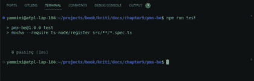
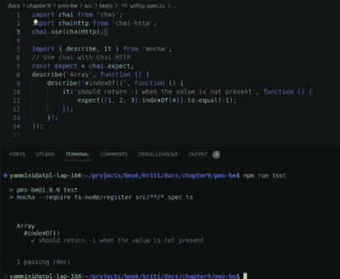
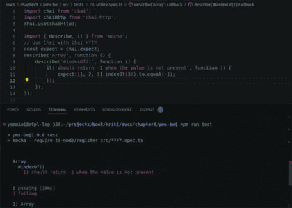
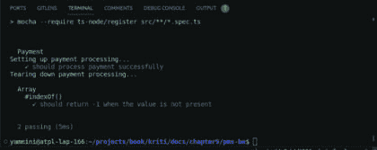
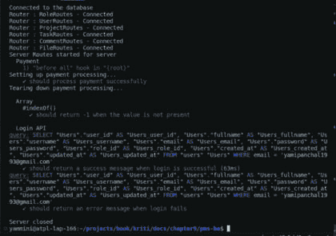
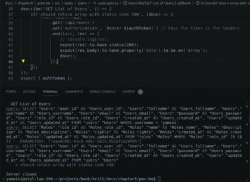
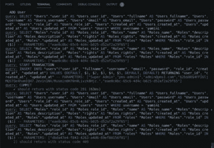
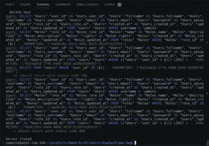

# 第九章

# 测试 API

# 介绍

Node.js 是一个多功能的运行环境，允许开发者将 JavaScript 运行在服务器端。当涉及到测试 REST API 时，Node.js 提供了众多库和工具来简化这一过程。使用 Node.js，你可以编写与你的 RESTful API 交互的自动化测试，发送 HTTP 请求，并验证响应。它提供了一个灵活且可扩展的平台来运行 API 测试，使其成为单元测试和集成测试的绝佳选择。

Node.js 还允许你利用各种测试框架和库，如 Mocha、Chai、Jest 和 Supertest。这些工具简化了测试套件的创建、断言检查和 API 端点的测试运行器。此外，Node.js 的异步特性非常适合进行 HTTP 请求和处理异步响应，这在测试 API 中至关重要。这种异步能力确保你的测试可以高效地同时处理多个请求和响应。

在本章中，我们将探讨创建测试用例和执行 API 验证的过程。

# 结构

本章将讨论以下主题：

+   单元测试概述

+   Mocha 框架

+   定义测试用例

+   验证开发的 API

# 单元测试概述

单元测试是软件开发中的基本实践，确保单个代码单元按预期工作。在 REST API 的上下文中，这意味着分别测试每个端点和相关的业务逻辑，以验证它们对不同输入和情况是否正确响应。

单元测试只是测试 REST API 的一部分。它补充了其他类型的测试，如集成测试（测试 API 的不同部分如何协同工作）和端到端测试（从用户的角度测试整个应用程序）。

单元测试是软件开发中的关键实践，但它高度特定于你正在工作的代码库。在编写单元测试用例时，重要的是要涵盖广泛的情况，以确保你的代码正确运行。以下是在编写单元测试时需要考虑的一些关键点：

+   **测试用例结构：**

    使用`**describe**`块描述测试用例正在测试的内容。使用`**it**`块创建单个测试用例。逻辑地构建你的测试，涵盖代码的各个方面。

+   **测试数据：**

    包含覆盖不同输入场景的测试数据或模拟数据。包括边缘情况、边界值和典型输入，以验证你的代码在不同情况下的行为。

+   **断言：**

    使用你的测试框架提供的断言（例如，Chai、Jest、Jasmine）来检查代码是否产生预期的结果。验证实际结果是否与预期结果相符。

+   **错误处理：**

    确保代码正确处理错误或异常。测试预期抛出异常或错误的场景。

+   **代码覆盖率：**

    争取良好的代码覆盖率，确保尽可能多的代码通过测试被执行。使用代码覆盖率工具来识别未测试的代码路径。

+   **模拟和存根：**

    使用模拟和存根来模拟外部依赖，如数据库、API 或服务。确保代码与这些依赖正确交互。

+   **积极和消极测试：**

    使用一切按预期工作的积极场景进行测试。使用可能出错且代码能够正确处理错误的消极场景进行测试。

+   **回归测试：**

    定期运行单元测试，以捕捉引入新代码更改时的回归。

+   **自动化**

    单元测试是自动化的，这意味着它们可以由测试框架自动运行，无需人工干预。

+   **快速执行**

    单元测试旨在快速执行，以便在开发过程中频繁运行。这个快速反馈循环有助于在开发早期阶段捕捉问题。

记住，单元测试应专注于单个代码单元（一个函数、方法或一个小组件），并且应该快速执行。编写全面的单元测试有助于在开发早期阶段识别和解决问题，从而产生更健壮和可维护的代码。

端到端测试另一方面评估整个应用程序从开始到结束。它模拟真实用户场景。它本质上测试用户如何与应用程序交互，包括真实数据库连接、网络连接等。如果需要连接其他应用程序，它也会连接。

在本章中，为了测试功能，我们将连接到真实数据库以获取数据。当我们使用真实数据库连接进行测试时，这理想上应该是单元测试，我们转向了更集成的测试方法。有时，这可能会被称为集成测试。

# Mocha 框架

Mocha 是一个流行的 Node.js 和网页浏览器的 JavaScript 测试框架。它为编写和运行 JavaScript 应用程序的测试用例提供了一个灵活且功能丰富的环境。Mocha 通常与 Chai 等断言库结合使用，以便在测试用例中进行断言。

Mocha 因其灵活性和在开发者中的广泛采用而受到好评，原因有很多：

+   **易用性：**

    Mocha 的语法易于学习和编写，这使得它既适合初学者也适合经验丰富的开发者。

+   **支持各种测试风格：**

    Mocha 支持不同的测试风格，如 BDD（行为驱动开发）、TDD（测试驱动开发）和 QUnit。

+   **异步测试：**

    Mocha 内置了对测试异步代码的支持，允许您使用 `**回调**`、`**承诺**` 或 `**async**`/`**await**`。

+   **钩子：**

    Mocha 提供了 `**before**`、`**after**`、`**beforeEach**` 和 `**afterEach**` 等钩子来设置和清理测试固定装置。

+   **报告系统：**

    Mocha 提供了多种内置的报告器，用于以不同格式生成测试报告和结果，以及自定义报告器的支持。

+   **并行测试执行：**

    Mocha 可以并行运行测试，这可以显著减少大型测试套件的测试执行时间。

+   **测试套件和嵌套描述：**

    您可以将测试组织成层次套件和描述块，以获得更好的结构和可读性。

+   **超时：**

    Mocha 允许您为单个测试或测试套件设置超时限制，有助于识别缓慢或阻塞的测试。

+   **测试跳过和独占性：**

    您可以使用 `**.skip**` 和 `**.only**` 跳过或专注于特定的测试或测试套件。

+   **浏览器和 Node.js 支持：**

    Mocha 既可以用于 Node.js，也可以用于网页浏览器。

Mocha 的灵活性、广泛的生态系统和活跃的社区使其成为测试 JavaScript 应用程序的流行选择，从小型库到大型复杂项目。

要使用 Mocha，您通常将其作为 npm 包安装，并用 JavaScript 或 Chai 等测试框架编写测试用例。Mocha 提供了命令行界面来运行测试，并且它可以集成到持续集成 (CI) 管道中来自动化测试。

# 安装 Mocha 和 Chai

Mocha 是一个测试框架，Chai 是一个断言库，通常一起用于测试。通过在项目根目录下使用 `**cmd**` 命令，将它们作为开发依赖项安装到我们的项目中

`**$ npm install mocha chai @types/mocha @types/chai --save-dev**`

在您成功安装 Chai 之后，让我们来探索如何利用它。Chai 是一个多功能的断言库，有效地作为您测试需求的插件。`**Chai**` 提供了三种主要风格：`**"expect**`、`**"should**` 和 `**"assert**`。您可以使用其中任何一种，但 `**"expect"**` 是最受欢迎的选择。

`const chai = require('chai');`

`const expect = chai.expect;`

`// 预期一个值等于另一个值`

`expect(5).to.equal(5);`

`// 预期一个数组包含特定元素`

`expect([1, 2, 3]).to.include(2);`

`// 预期一个值是特定数据类型`

`expect('Hello').to.be.a('string');`

`// 预期一个对象具有属性`

`expect({ name: 'John' }).to.have.property('name');`

您可以将各种方法链式调用以创建复杂的断言。`**Chai**` 提供了广泛的断言方法来检查相等性、检查属性的存在等。Chai 通常与 Mocha 等测试框架一起使用。

让我们在项目的 `**src**` 目录下创建一个名为 `**tests**` 的目录，并在其中创建一个 `**test.spec.ts**` 文件。测试文件的扩展名必须是 `**.spec.ts**`，这样工具才能将其识别为测试文件（也称为规范文件）。根据以下目录结构，您可以创建测试文件。

`**tests/**`

`├── user/`

`│   ├── user.spec.ts`

`├── common/`

`│   ├── project.spec.ts`

`├── project/`

`│   ├── user.spec.ts`

`├── common/`

`│   ├── utility.spec.ts`

`└── mocha.opts`

您可以创建一个 Mocha 配置文件 (`**mocha.opts**`)，如果您想指定 Mocha 选项。此文件是可选的，但它可以方便地配置 Mocha 的行为。以下是一个简单的示例：

`--require ts-node/register`

`--require chai/register-assert`

`--require chai/register-expect`

在添加配置后，让我们在 `**utility.spec.ts**` 文件中定义第一个基本测试用例，代码如下：

`--require chai-http/register`

在 `**tsconfig.json**` 文件中，在 `**compilerOptions**` 下添加 `**"types": ["express", "./src/custom.d.ts"]**`。

在 `**package.json**` 文件中添加以下测试脚本：

`"scripts": {`

`"test": "mocha --require ts-node/register src/**/*.spec.ts`

`src/**/**/*.spec.ts`

`",`

`…`

您可以创建一个 Mocha 配置文件 (`**mocha.opts**`)，如果您想指定 Mocha 选项。此文件是可选的，但它可以方便地配置 Mocha 的行为。以下是一个简单的示例：

目前没有定义测试用例，所以将显示 0 个通过测试。

**图 9.1:** 运行测试脚本

# 定义测试用例

在添加配置后，让我们在 `**utility.spec.ts**` 文件中定义第一个基本测试用例，代码如下：

`import chai from 'chai';`

`import chaiHttp from 'chai-http';`

`chai.use(chaiHttp);import { describe, it } from 'mocha';`

`// 使用 Chai 和 Chai HTTP`

`const expect = chai.expect;`

`describe('Array', function () {`

`describe('#indexOf()', function () {`

`it('should return -1 when the value is not present', function () {`

`expect([1, 2, 3].indexOf(4)).to.equal(-1);`

`});`

`});`

`});`

此测试用例检查 `**indexOf**` 函数是否在数组中不存在值时正确返回 `**-1**`。Chai expect 函数用于在测试用例中进行清晰和可读的断言。如果满足预期，测试将通过；否则，它将失败，并提供有关出错原因的反馈。

在 `**cmd**` 中运行测试，输入 `**$ npm run test**`，将得到以下输出：

`**数组**`

`**1) #indexOf()**`

`**✔当值不存在时应返回 -1**`

**图 9.2:** 工具成功测试用例

如果您将 expect 行更改为 `**expect([1, 2, 3].indexOf(3)).to.equal(-1)**`，则测试用例将失败，并显示以下带有红色标记的输出：

`**数组**`

`**1) #indexOf()**`

`**当值不存在时应返回 -1**`

**图 9.3:** 工具失败测试用例

`src/**/**/*.spec.ts`

# 配置应用程序

我们需要在`**express_server.ts**`文件中做一些修改。由于我们想在测试用例中连接`**express**`应用，我们需要将其导出。以下是更新后的代码：

`import express from 'express';`

`import * as bodyParser from 'body-parser';`

`import { IServerConfig } from './utils/config';`

`import * as config from '../server_config.json';`

`import { Routes } from './routes';`

`export class ExpressServer {`

`private static server = null;`

`public server_config: IServerConfig = config;`

`**public app;**`

`constructor() {`

`const port = this.server_config.port ?? 3000;`

`//初始化 express 应用`

`**this.app = express();**`

`this.app.use(bodyParser.urlencoded({ extended: false }));`

`this.app.use(bodyParser.json());`

`this.app.get('/ping', (req, res) => {`

`res.send('pong');`

`});`

`const routes = new Routes(this.app);`

`if (routes) {`

`console.log('服务器路由已启动');`

`}`

`ExpressServer.server = this.app.listen(port, () => {`

``console.log(`服务器正在端口 ${port} 上运行，进程 ID = ${process.pid}`);``

`});`

`}`

`//在未捕获异常时安全关闭 express 服务器`

`public closeServer(): void {`

`ExpressServer.server.close(() => {`

`console.log('服务器已关闭');`

`process.exit(0);`

`});`

`}`

`}`

同样，在处理测试用例时，需要连接到数据库。将`**db.ts**`文件中的代码替换为以下内容：

`import { DataSource, Repository } from 'typeorm';`

`import { IServerConfig } from './config';`

`import * as config from '../../server_config.json';`

`import { Roles } from '../components/roles/roles_entity';`

`import { Users } from '../components/users/users_entity';`

`import { Projects } from '../components/projects/projects_entity';`

`import { Tasks } from '../components/tasks/tasks_entity';`

`import { Comments } from '../components/comments/comments_entity';`

`export class DatabaseUtil {`

`private server_config: IServerConfig = config;`

`private static connection: DataSource | null = null;`

`private repositories: Record<string, Repository<any>> = {};`

`constructor() {`

`this.connectDatabase();`

`}`

`/**`

`* 建立数据库连接或返回可用的现有连接。`

`* @returns 返回数据库连接实例。`

`*/`

`public async connectDatabase(): **Promise<DataSource>** {`

`try {`

`**if (DatabaseUtil.connection) {**`

`**return Promise.resolve(DatabaseUtil.connection);**`

`**}** else {`

`const db_config = this.server_config.db_config;`

`const AppSource = new DataSource({`

`type: 'postgres',`

`host: db_config.host,`

`port: db_config.port,`

`username: db_config.username,`

`password: db_config.password,`

`database: db_config.dbname,`

`entities: [Roles, Users, Projects, Tasks, Comments,Files],`

`synchronize: true,`

`logging: true,`

`poolSize: 10`

`});`

`await AppSource.initialize();`

`DatabaseUtil.connection = AppSource;`

`console.log('已连接到数据库');`

`return DatabaseUtil.connection;`

`}`

`} catch (error) {`

`console.error('Error connecting to the database:', error);`

`}`

`}`

`/**`

`* 获取给定实体的存储库。`

`* @param entity - 需要存储库的实体。`

`* @returns 实体的存储库实例。`

`*/`

`public getRepository(entity) {`

`try {`

`// 检查是否有有效的数据库连接`

`if (DatabaseUtil.connection) {`

`const entityName = entity.name;`

`// 检查存储库实例是否已存在，如果不存在，则创建它`

`if (!this.repositories[entityName]) {`

`this.repositories[entityName] = DatabaseUtil.connection.getRepository(entity);`

`}`

`return this.repositories[entityName];`

`}`

`return null;`

`} catch (error) {`

``console.error(`Error while getRepository => ${error.message}`);``

`}`

`}`

`}`

如代码所示，我们引入了一个`**promise**`来确保测试用例仅在数据库连接建立后运行。这有助于防止可能发生的潜在错误。

如果我们想要模拟数据库连接，有可用的库来完成这项工作。其中一个这样的库是`**sinon**`，`**https://sinonjs.org/**`。

`**Sinon**`是一个用于在 JavaScript 测试中创建间谍、存根和模拟的测试库，而不是专门用于模拟数据库。它可以用来拦截和模拟函数、方法或代码库中的任何类型的操作，包括数据库操作、API 请求或任何其他外部服务交互。这使得它在编写需要隔离被测试代码部分的单元和集成测试时非常有用。

对于本章，我们感兴趣的是检查我们的 API 与真实数据库的兼容性。因此，我们不需要使用模拟数据库连接。然而，为了完整性，本章末尾添加了一个示例。

现在，将以下代码替换为`**utility.spec.ts**`文件中的导出应用在测试用例中：

`import { DatabaseUtil } from '../../utils/db';`

`import { ExpressServer } from '../../express_server';`

`import chai from 'chai';`

`import chaiHttp from 'chai-http';`

`chai.use(chaiHttp);`

`import { describe, it } from 'mocha';`

`// 使用 Chai 与 Chai HTTP`

`const expect = chai.expect;`

`let app, expressServer;`

`**before(async () => {**`

`const databaseUtil = new DatabaseUtil();`

`await databaseUtil.connectDatabase();`

`expressServer = new ExpressServer();`

`app = expressServer.app;`

`**});**`

`// 在所有测试完成后关闭服务器`

`**after(function (done) {**`

`expressServer.closeServer(done);`

`**});**`

`export { app };`

它导入必要的模块，如`**DatabaseUtil**`、`**ExpressServer**`以及测试库`**(chai and chai-http)**`。`chai.use(chaiHttp)`配置 chai 以与 HTTP 请求一起工作，使您能够发出 HTTP 请求并对它们的响应进行断言。

# 钩子

在 Mocha 等测试框架的上下文中，`**"before"**` 和 `**"after"**` 被称为测试钩子。它们用于设置和清理测试环境。以下是它们的作用：

**钩子之前** (`**before**`): 这个钩子在测试套件（使用 describe 定义）中的任何测试用例运行之前执行。它通常用于设置环境或测试所需的任何公共上下文。例如，你可能用它来建立数据库连接、初始化变量或启动服务器。

`**before(() => {**`

`// 设置测试环境`

`});`

**钩子之后** (`**after**`): 这个钩子在测试套件中的所有测试用例运行之后执行。它通常用于清理环境、释放资源或执行测试完成后必要的操作。例如，你可能用它来关闭数据库连接、关闭服务器或执行 `**清理**` 任务。

`**after(() => {**`

`// 清理测试环境`

`});`

这里是如何将 `**"before"**` 和 `**"after"**` 钩子融入到测试生命周期中的：

**所有测试之前**：`**"before"**` 钩子在套件中的任何测试用例运行之前执行。它是整个套件的单一设置。

**运行测试用例**：套件中所有的测试用例（it 块）都会被执行。

**所有测试之后**：`**"after"**` 钩子在一次所有测试用例在套件中完成后执行。它是套件的单一 `**清理**` 步骤。

这些钩子对于确保每个测试套件都有一个一致且干净的测试环境非常有用。它们有助于避免代码重复，并使管理数据库连接、服务器或其他设置和清理任务变得更容易。

也有 `**beforeEach()**` 和 `**afterEach()**` 钩子，它们分别在每个测试用例之前和之后执行。

我们可以通过另一个示例来探索钩子，例如创建一个 `**payment.spec.ts**` 文件，包含以下代码：

`import { expect } from 'chai';`

`import { describe, it } from 'mocha';`

`class Payment {`

`private amount: number;`

`private method: string;`

`constructor(amount: number, method: string) {`

`this.amount = amount;`

`this.method = method;`

`}`

`processPayment(): string {`

`// 模拟支付处理`

``return `Payment of ${this.amount} processed via ${this.method}`;``

`}`

`}`

`describe('Payment', () => {`

`let payment: Payment;`

`// 在钩子之前：这将运行在测试套件之前 before(() => {`

`console.log('正在设置支付处理…');`

`// 执行设置任务，例如，初始化支付网关`

`payment = new Payment(100, 'Credit Card');`

`});`

`// 钩子之后：这将运行在测试套件之后 after(() => {`

`console.log('正在拆除支付处理…');`

`// 执行清理任务，例如，关闭支付网关连接`

`payment = null!;`

`});`

`// 测试用例`

`it('should process payment successfully', () => {`

`// 行动`

`const result = payment.processPayment();`

`// 断言`

`expect(result).to.equal('通过信用卡处理了 100 元的支付');`

`});`

`});`

在这个例子中：

+   我们有一个具有 `**processPayment**` 方法的 Payment 类，该方法模拟处理支付交易。

+   我们使用 Mocha 的 before 钩子在测试套件之前执行设置任务。这包括初始化支付处理，例如设置支付网关。

+   我们使用 Mocha 的 after 钩子在测试套件之后执行清理任务。这包括关闭支付网关连接。

+   我们定义了一个单独的测试用例来验证支付是否成功处理。

+   在测试套件运行之前，将记录 `**"Setting up payment processing…"**` 消息，表示正在设置支付处理。

+   在测试套件运行后，将记录 `**"Tearing down payment processing…"**` 消息，表示正在拆解支付处理。

现在在终端中运行测试脚本，它将显示以下输出：

**图 9.4：带有支付的钩子示例**

# 通过测试用例验证 API

在软件开发的世界里，确保你的应用程序的 API 按预期工作至关重要。为了实现这一点，我们依赖于测试用例，这是一种结构化的方法，用于验证 API 的功能、正确性和性能。通过测试用例验证 API 涉及系统地测试 API 的各个方面，以确保其按预期行为。

# 登录测试

在 `**"tests"**` 目录下，特别是 `**"user"**` 子目录中创建一个 `**"user.spec.ts"**` 文件，并包含以下代码：

`import chai from 'chai';`

`import chaiHttp from 'chai-http';`

`chai.use(chaiHttp);`

`import { describe, it } from 'mocha';`

`// 使用 Chai 和 Chai HTTP`

`const expect = chai.expect;`

`import { app } from '../common/utility.spec';`

`let authToken; // 声明一个变量来存储认证令牌`

`describe('Login API', () => {`

`it('should return a success message when login is successful', (done) => {`

`**chai.request(app)** // 将 'app' 替换为你的 Express 应用实例`

`**.post(**'**/api/login**'**)**`

`**.send({ email:** '**yamipanchal1993@gmail.com**'**, password:** '**Abc@123456**' **})**`

`.end((err, res) => {`

`**expect(res).to.have.status(200);**`

`expect(res.body).to.have.property('status').equal('success');`

`authToken = res.body.data.accessToken; // 保存认证令牌`

`done();`

`});`

`});`

`it('should return an error message when login fails', (done) => {`

`chai.request(app)`

`.post('/api/login')`

`**.send({ email:** '**yamipanchal1993@gmail.com**'**, password:** '**wrongpassword**' **})**`

`.end((err, res) => {`

`**expect(res).to.have.status(400);**`

`**expect(res.body).to.have.property('message').equal('密码无效');**`

`done();`

`});`

`});`

`});`

`export { authToken };`

通过 `**cmd**` 通过 `**npm run**` test 运行测试用例，将提供以下输出。

`> pms-be@1.0.0 test`

`> mocha --require ts-node/register 'src/**/*.spec.ts'`

`登录 API`

`1) "**before all**" hook in "**{root}**"`

`连接到数据库`

`**✔> should return a success message when login is successful (75ms)**`

`**✔ should return an error message when login fails (46ms)**`

**图 9.5：登录测试用例**

在这里，我们为登录 API 定义了两个测试用例，第一个有有效数据，第二个有错误的密码。

+   `**describe('Login API', () => { … });**`: 这行代码使用 describe 函数定义了一个测试套件。在这种情况下，它是一个名为 `**"Login API"**` 的套件，将相关的测试用例组合在一起。

+   `**it('should return a success message when login is successful', (done) => { … });**`: 在测试套件中，使用 it 函数定义了一个单独的测试用例。这个测试用例有一个描述，解释了它要测试的内容，即当登录成功时应该返回一个成功消息。`**(done)**` 函数作为参数传递，表示这是一个异步测试，done 函数用于表示测试完成。

+   `**chai.request(app)**`: 这行代码使用 chai-http 库向 Express.js 应用程序发送 HTTP 请求。app 应替换为你的 Express 应用的实际实例。`**.post('/api/login')**`: 这行代码指定了一个 POST 请求到 `**'/api/login'**` 端点。这个端点可能负责处理用户登录。

+   `**.send({ email: 'yamipanchal1993@gmail.com', password: 'Abc@123' })**`: 这里，代码在请求体中发送一个包含电子邮件和密码值的 JSON 对象，用于登录尝试。

+   `**.end((err, res) => { … });**`: 这是在 HTTP 请求完成后执行的 `**回调函数**`。它接收两个参数：err 用于请求过程中可能发生的任何错误，res 用于服务器的响应。

+   `**expect(res).to.have.status(200);**`: 这行代码使用 Chai 的 expect 断言检查 HTTP 响应是否有状态码 200，这通常表示请求成功。

+   `**expect(res.body).to.have.property('status').equal('success');**`: 这行代码检查响应体是否包含名为 'status' 的属性，其值为 `**'success'**`。这是检查 API 响应是否表示成功操作的一种常见方式。

+   `**authToken = res.body.data.accessToken;**`: 如果登录成功，这行代码从响应中提取认证令牌并将其存储在 authToken 变量中。此令牌通常用于后续的认证请求。

+   `**done();**`: 最后，调用 `**done**` 函数来表示测试已完成。

这段代码是登录 API 返回预期状态码和消息的成功响应的测试用例。它还捕获了认证令牌，通常用于后续的认证请求。

# 用户测试列表

在同一文件中，添加以下测试用例代码以验证用户列表 API。

`describe('获取用户列表', () => {`

`it('应当返回状态码为 200 的数组', (done) => {`

`chai.request(app)`

`.get('/api/users')`

`.set('Authorization',`

`` `Bearer ${authToken}`) // 在头部传递 token ``

`.end((err, res) => {`

`// console.log(res);`

`expect(res).to.have.status(200);`

`expect(res.body).to.have.property('data').to.be.an('array');`

`done();`

`});`

`});`

`});`

`输出`

`> pms-be@1.0.0 test`

`> mocha --require ts-node/register 'src/**/*.spec.ts'`

`登录 API`

`1) "**before all**" 钩子在 "**{root}**"`

`连接到数据库`

`**✔** 应当在登录成功时返回成功消息 (75ms)`

`**✔** 应当在登录失败时返回错误消息 (46ms)`

`**获取用户列表**`

`**✔ 应当返回状态码为 200 的数组**`

`服务器关闭`

**图 9.6：用户列表获取 API 测试用例**

这里是前面代码中关键部分的详细信息：

+   `**describe('获取用户列表', () => { … });**`: 这一行定义了一个新的测试套件，描述为 `**"获取用户列表"**`。这个套件将相关的测试用例组合在一起，这些测试用例涉及获取用户列表。

+   `**it('应当返回状态码为 200 的数组', (done) => { … });**`: 在测试套件中，使用 it 函数定义了一个单独的测试用例。测试用例描述指定它应返回一个状态码为 200 的数组。(`**done**`) 函数用于指示这是一个异步测试，当测试完成时将调用 done 函数。

+   `**.get('/api/users')**`: 这一行指定了对 `**'/api/users'**` 端点的 GET 请求。这个端点可能负责获取用户列表。

+   `**.set('Authorization', Bearer ${authToken}):**` 这里，代码正在设置 HTTP 请求中的 `**"Authorization"**` 头部。它将身份验证令牌包含在头部，通常格式为 `**"Bearer <token>"**`。这是验证 API 请求的常用方法。`**authToken**` 预期将包含在成功登录期间获得的令牌（如你之前的代码片段所示）。

+   `**.end((err, res) => { … });**`: 这是当 HTTP 请求完成时执行的 `**回调函数**`。它接收两个参数：`**err**` 用于可能发生在请求期间的错误，`**res**` 用于来自服务器的响应。

+   `**expect(res).to.have.status(200);**`: 这一行使用 Chai 的 expect 断言来检查 HTTP 响应是否有状态码 200，这通常表示请求成功。这是确保服务器对成功的 `**GET**` 请求返回 200 `**OK**` 状态的常用方法。

+   `**expect(res.body).to.have.property('data').to.be.an('array');**`: 这行代码检查响应体是否包含名为 `**'data**` 的属性，并且该属性的值是一个数组。这是验证响应包含以数组形式呈现的用户列表的一种方式。

+   `**done();**`: 最后，调用 `**done**` 函数来表示测试已完成。

这段代码是一个 Express.js API 端点测试用例，用于测试获取用户列表的 GET 请求是否返回预期的状态码 (`**200**`)，并验证响应包含用户数据数组。它还在请求头中包含授权令牌进行身份验证，假设 `**authToken**` 变量包含从登录请求中获取的有效令牌。

# 添加用户测试

在同一文件中，添加以下测试用例以验证添加用户 API。

`describe('添加用户', () => {`

`it('should return with status code 201', (done) => {`

`chai.request(app)`

`.post('/api/users')`

`.set('Authorization',`

`` `Bearer ${authToken}`) // 在头部传递令牌 ``

`.send({`

`'fullname': 'Super Admin',`

`'username': 'pms-admin1',`

`'email': 'admin@pms1.com',`

`'password': 'Admin@pms1',`

`'role_id': 'dbda47e4-f843-4263-a4d6-69ef80156f81'`

`})`

`.end((err, res) => {`

`**expect(res).to.have.status(201);**`

`done();`

`});`

`});`

`it('should return with status code 409', (done) => {`

`chai.request(app)`

`.post('/api/users')`

`.set('Authorization',`

`` `Bearer ${authToken}`) // 在头部传递令牌 ``

`.send({`

`'fullname': 'Super Admin',`

`'username': 'pms-admin1',`

`'email': 'admin@pms1.com',`

`'password': 'Admin@pms1',`

`'role_id': 'dbda47e4-f843-4263-a4d6-69ef80156f81'`

`})`

`.end((err, res) => {`

`**expect(res).to.have.status(409);**`

`**expect(res.body).to.have.property('message').equal('键（username）=（pms-admin1）已存在.');**`

`done();`

`});`

`});`

`});`

`输出`

`> pms-be@1.0.0 测试`

`> mocha --require ts-node/register 'src/**/*.spec.ts'`

`登录 API`

`1) "before all" 钩子在 "{root}"`

`连接到数据库`

`**✔** 应在登录成功时返回成功消息（75ms）`

`**✔** 应在登录失败时返回错误消息（46ms）`

`获取用户列表`

`**✔** 应返回状态码 200 的数组`

`**添加用户**`

`**✔ 应返回状态码 201**`

`**✔ 应返回状态码 409（54ms）**`

`服务器关闭`

**图 9.7：添加用户 API 测试用例**

这里是前面代码关键部分的详细信息：

+   `**describe('添加用户', () => { … });**`: 这行代码定义了一个测试套件，其描述为 `**"添加用户"**`。该套件将相关的测试用例组合在一起，这些测试用例涉及添加新用户。

+   第一个测试用例：

    +   `**it('should return with status code 201', (done) => { … });**`: 这个测试用例描述表明，它正在测试添加用户是否应该返回状态码 `**201**`（已创建）。`(`**done**`) 函数用于指示这是一个异步测试，当测试完成时将调用 `**done**` 函数。

    +   `**.post('/api/users')**`: 这是一个 `**POST**` 请求到 `**'/api/users'**` 端点，可能是用于添加新用户。

    +   `**.set('Authorization', Bearer ${authToken})**`: 这行代码在 HTTP 请求中设置了一个 `**"Authorization"**` 标头，包括用于授权的认证令牌。

    +   `**.send({ … })**`: 这段代码在请求体中发送一个包含用户信息的 JSON 对象，包括用户的姓名、用户名、电子邮件、密码和角色 ID。这代表您尝试添加的数据。

    +   `**.end((err, res) => { … });**`: 当 HTTP 请求完成时执行的 `**回调**` 函数。

    +   `**expect(res).to.have.status(201);**`: 这行代码使用 Chai 的 expect 断言来检查 HTTP 响应是否具有状态码 201，表示用户创建成功。

    +   `**done();**`: 最后，调用 `**done**` 函数来表示测试已完成。

+   第二个测试用例：

    +   `**it('should return with status code 409', (done) => { … });**`: 这个测试用例描述表明，正在测试添加具有相同用户名的用户是否应该返回状态码 `**409**`（冲突）。

    +   这个测试用例的结构与第一个类似，主要区别在于预期的状态码和额外的检查：

    +   `**expect(res).to.have.status(409);**`: 这行代码检查 HTTP 响应是否具有状态码 `**409**`，表示冲突。

    +   `**expect(res.body).to.have.property('message').equal('Key (username)=(pms-admin1) already exists.');**`: 这行代码验证响应体包含一个特定的消息，表明提供的用户名已存在。

    +   `**done();**`: 如前所述，调用 `**done**` 函数来表示测试已完成。

这段代码包含两个测试用例。第一个测试用例检查是否成功添加了新用户并返回 201 状态码，而第二个测试用例检查在尝试添加具有现有用户名的用户时是否返回冲突（409 状态码），第二个测试用例还验证了响应中是否存在错误消息。

# 删除用户测试

在现有文件中，包含以下测试用例代码以验证用户删除 API 的功能。

`describe('Delete User', () => {`

`it('should return with status code 200', (done) => {`

`chai.request(app)`

`.delete('/api/users/0ddc59fe-a9ea-4060-9b39-5118fe13937d')`

`.set('Authorization',

`` `Bearer ${authToken}`) // 在头部传递令牌 ``

`.end((err, res) => {`

`expect(res).to.have.status(201);`

`done();`

`});`

`});`

`it('should return with status code 404', (done) => {`

`chai.request(app)`

`.delete('/api/users/0ddc59fe-a9ea-4060-9b39-5118fe13937d')`

``.set('Authorization', `Bearer ${authToken}`) // 在头部传递令牌``

`.end((err, res) => {`

`expect(res).to.have.status(404);`

`done();`

`});`

`});`

`});`

`输出`

`> pms-be@1.0.0 test`

`> mocha --require ts-node/register 'src/**/*.spec.ts'`

`登录 API`

`1) "{root}" 中的 "before all" 钩子`

`连接到数据库`

`**✔** 应在登录成功时返回成功消息（75ms)`

`**✔** 应在登录失败时返回错误消息（46ms)`

`获取用户列表`

`**✔** 应返回包含状态码 200 的数组`

`添加用户`

`X 应返回包含状态码 201 的数组`

`**✔** 应在 54ms 内返回状态码 409`

`**删除用户**`

`**✔ should return with status code 200**`

`**✔ should return with status code 404**`

`服务器已关闭`

**图 9.8：删除用户 API 测试用例**

在此代码中，添加用户测试用例显示失败，因为同一用户已在数据库中。同样，如果测试运行时您尝试删除的用户不存在于数据库中，删除用户测试用例可能会失败。

+   第一个测试用例：

    +   `**it('should return with status code 200', (done) => { … });**`: 此测试用例的描述表明，它正在测试成功删除用户是否应返回状态码 `**200**` (`**OK**`)。(done) 函数用于指示这是一个异步测试，当测试完成时将调用 done 函数。

    +   `**.delete('/api/users/0ddc59fe-a9ea-4060-9b39-5118fe13937d')**`: 这是一个针对特定端点 `**'**`/`**api/users/'**` 的 DELETE 请求，其中包含用户标识符（例如，`**'0ddc59fe-a9ea-4060-9b39-5118fe13937d'**`）在 URL 中。这通常表示通过其唯一标识符删除特定用户的行为。

    +   `**.set('Authorization', Bearer ${authToken})**`: 这行代码在 HTTP 请求中设置了一个 `**"Authorization"**` 标头，包括用于授权的认证令牌。

    +   `**.end((err, res) => { … });**`: 当 HTTP 请求完成时执行的 `**callback**` 函数。

    +   `**expect(res).to.have.status(201);**`: 这行代码中可能存在潜在问题。它检查 HTTP 响应是否具有状态码 `**201**`，但测试用例的描述暗示它应该期望状态码 `**200**`。这行代码应更正为 `**expect(res).to.have.status(200)**`;。

    +   `**done();**`: 最后，调用 `**done**` 函数以表示测试已完成。

+   第二个测试用例：

    +   `**it('should return with status code 404', (done) => { … });**`: 此测试用例的描述表明，它正在测试尝试删除不存在的用户是否应返回状态码 `**404 (Not Found)**`。此测试用例的结构与第一个类似，主要区别在于预期的状态码：

    +   `**expect(res).to.have.status(404);**`: 这行代码检查 HTTP 响应是否具有 404 状态码，表示请求的用户未找到。

    +   `**done();**`: 如前所述，调用 done 函数以表示测试完成。

这段代码包含两个测试用例，用于通过 Express.js API 测试用户删除功能。第一个测试用例检查是否成功删除了用户并返回了 `**200**` 状态码，第二个测试用例检查尝试删除不存在用户是否会导致返回 `**404**` 状态码。

以这种方式，您可以根据应用程序的不同部分创建不同的测试场景，包括用户管理、项目管理、任务管理和评论功能。对于这些 API 中的每一个，您都可以定义特定的测试用例。此外，您可以通过包含验证身份验证失败的案例来扩展您的测试套件，例如，当认证缺失时测试 `**401**` 状态码，当某些 API 端点未授权时测试 403 状态码。

# 模拟数据库连接

为了模拟数据库连接，我们可以使用流行的库——`**sinon**`。让我们使用 npm 安装这个库。

`npm install sinon –save-dev`

考虑如果我们有一个根据给定 ID 获取用户的函数：

`// db.ts`

`async function getUserByUserId(user_id:string) {`

`// 从数据库获取用户的实际逻辑`

`}`

`module.exports = { getUserByUserId };`

我们可以使用 sinon 来模拟这种行为 -

`const sinon = require('sinon');`

`const { expect } = require('chai');`

`const db = require('../db');`

`describe('getUserByUserId', function() {`

`it('should return mocked user data', async function() {`

`// 为 getUserByUserId 创建存根`

`const mockUser = { id: 1, name: 'Alice M' };`

`const stub = sinon.stub(db, 'getUserByUserId').resolves(mockUser);`

`// 调用函数（现在已被存根化）`

`const user = await getUserByUserId(1);`

`// 验证函数返回了模拟数据`

`expect(user).to.deep.equal(mockUser);`

`// 恢复原始函数`

`stub.restore();`

`});`

`});`

在前面的示例中，`**sinon.stub()**` 用于用返回一个解析为 `**mockUser**` 的 promise 的版本替换实际的 `**getUserByUserId()**` 函数。这个测试没有连接到实际的数据库。这样它确保了测试是隔离和可重复的。`**stub.restore()**` 在最后恢复原始函数。

# 结论

在本章中，代码示例中展示的测试用例提供了一个全面的方法来测试 Express.js API 应用程序的各个方面。这些测试用例涵盖了不同的场景，包括登录和用户管理 API。这些测试是确保 API 的可靠性、安全性和正确性的关键部分，并且它们可以帮助在开发早期阶段识别和解决问题。

通过系统地测试应用程序，您可以提高其鲁棒性并提升您软件的整体质量。

在下一章中，我们将学习如何构建和部署我们的应用程序。
