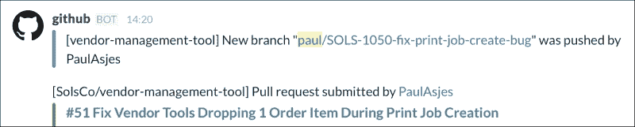
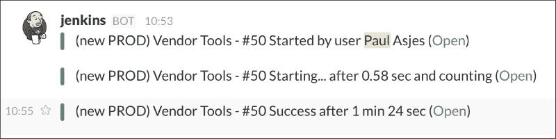

# 第一章. Slack 入门

本书将使初学者能够创建自己的 Slack 机器人，无论是为了娱乐还是专业目的。

本书最终的目标是让您将 Slack 视为一个具有巨大潜力的开发平台，而不仅仅是简单的聊天客户端。随着 Slack 在开发者社区中的流行度迅速上升，Slack 应用中包含的可能性和机会将成为任何开发者工具箱中的宝贵工具。

在本章中，我们向您介绍 Slack 及其可能性。我们将涵盖：

+   Slack 简介

+   Slack 作为平台

+   最终目标

# Slack 简介

Slack 于 2013 年 8 月推出，最初作为小型团队使用的内部沟通工具，但已迅速演变成为一个多功能的通信平台，被许多团体使用，包括开源社区和大型企业。

Slack 是一款实时消息应用，专注于团队沟通。在众多生产力应用中，Slack 通过提供与流行第三方应用的广泛集成，将自己与其他应用区分开来，并为用户提供构建自己集成平台的平台。

截至 2016 年初，Slack 每天约有 200 万用户使用，覆盖 60,000 个团队，每月发送 8 亿条消息 ([`expandedramblings.com/index.php/slack-statistics/`](http://expandedramblings.com/index.php/slack-statistics/))。一些使用 Slack 的知名公司包括 Airbnb、LinkedIn 和《纽约时报》。这项服务之所以如此受欢迎，很大程度上归功于其令人印象深刻的 99.9% 以上的正常运行时间率。使 Slack 与 HipChat 或 Skype for Business 等竞争对手区分开来的是，公司决定以应用程序程序接口（API）的形式向第三方开发者开放其平台。为了推动其作为平台的服务增长，Slack 于 2015 年 12 月承诺投资 8000 万美元用于使用其技术的软件项目 ([`fortune.com/2015/12/15/slack-app-investment-fund/`](http://fortune.com/2015/12/15/slack-app-investment-fund/))。加上公司筹集的超过 3.2 亿美元资金，可以肯定地说，Slack 将继续在未来几年内成为团队生产力领域的推动力量。

# Slack 作为平台

许多用户可能不知道的是，在 Slack 的消息客户端之下，存在一个高度可扩展的平台，可以用来创建应用程序和商业工具，这些工具可以简化开发周期，执行复杂任务，或者仅仅是很有趣。

Slack 的用户界面及其 Slack 机器人在运行中的样子

该平台或 API 可以用于将第三方服务集成到 Slack 平台中，并利用其广泛的覆盖范围和用户友好的界面。所述第三方应用程序可以通过传入 webhooks 将数据发送到 Slack，使用命令在 Slack 外部执行操作，或作为机器人用户对命令做出响应。机器人用户或机器人是最有趣的；它们之所以被称为机器人，是因为它们可以通过执行任何人类都可以执行的动作来模仿人类用户。

### 注意

Slack 机器人是运行在 Slack **实时消息**（**RTM**）平台上的软件应用程序。机器人可以以对话方式与外部应用程序或您的自定义代码进行交互。

一些更受欢迎的机器人包括 GitHub 的多任务 Hubot ([`hubot.github.com/`](https://hubot.github.com/)) 和 Meekan 的调度机器人 ([`meekan.com/slack/`](http://meekan.com/slack/))，但每天都有许多不同复杂度的机器人被开发出来。

最明显且广为人知的机器人是 Slack 自家的 Slack 机器人，用于内置的 Slack 功能，例如：

+   向 Slack 发送反馈

+   设置提醒

+   打印频道中所有用户的列表

另一个广受欢迎的机器人是 Hubot。最初由 GitHub 开发，并由 Slack 本身移植到 Slack，Hubot 可以提供有用的功能，例如 GitHub 活动跟踪，这可以帮助您了解 GitHub 仓库的最新动态。

GitHub 集成显示分支和拉取请求活动

您还可以通过 Jenkins 添加基础设施监控：

Jenkins 集成机器人，在 Slack 中显示构建自动化日志

机器人可以将 Slack 从一个简单的消息客户端转变为重要的业务工具，为使用自定义机器人的任何公司带来好处。Slack 平台的美妙之处在于任何人都可以通过几个简单的步骤创建一个功能性的机器人。

# 最终目标

完成这本书后，读者将能够构建一个复杂的 Slack 机器人，它可以执行以下任务（以及其他任务）：

+   接收和发送在 Slack 中发送的消息

+   对用户命令做出响应

+   处理自然语言

+   根据命令执行有用任务（例如，从外部来源获取数据）

+   通过 webhooks 和斜杠命令将自定义数据插入 Slack

# 摘要

本章为您概述了 Slack 是什么，为什么它值得关注，以及如何利用其平台创建众多有用的应用程序。下一章将向您展示如何构建您的第一个简单 Slack 机器人。
