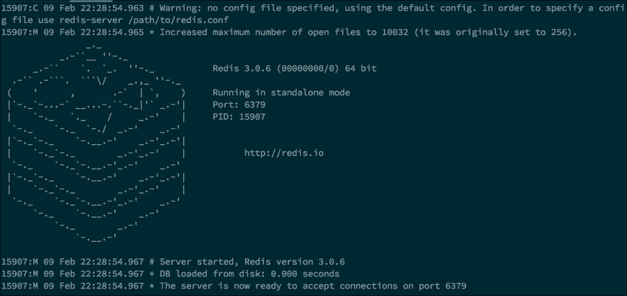
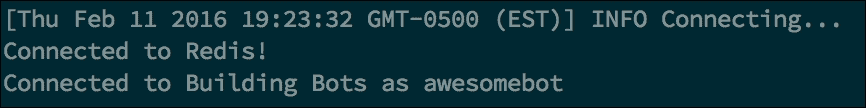
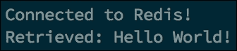
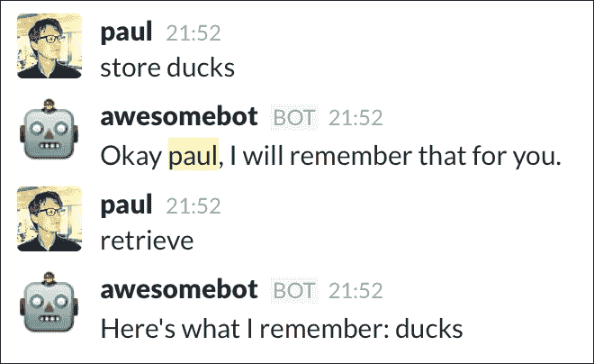
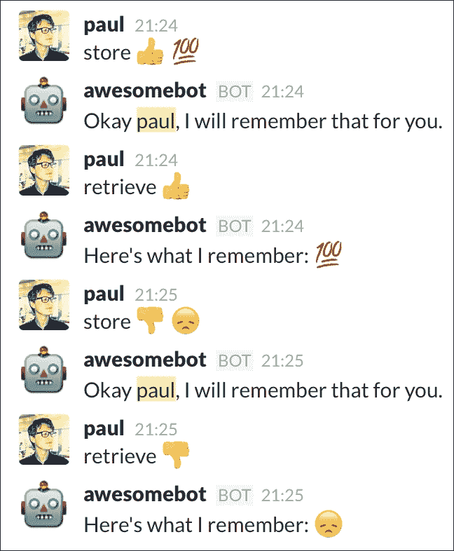
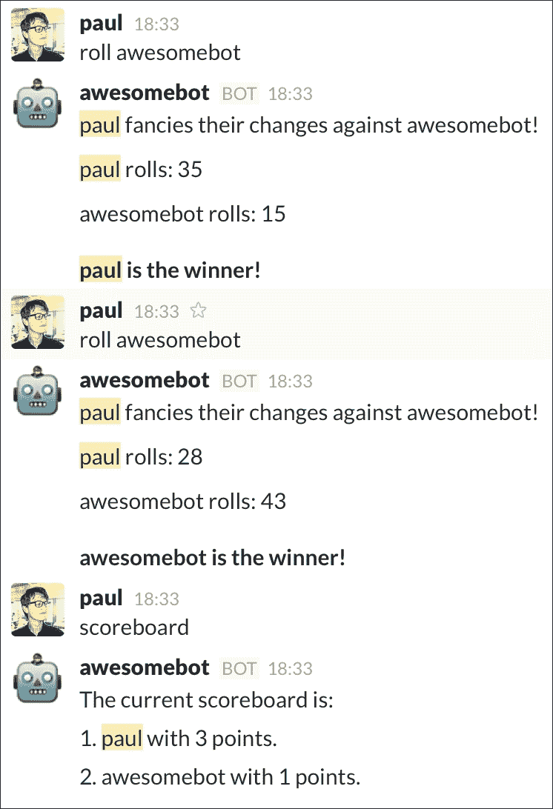
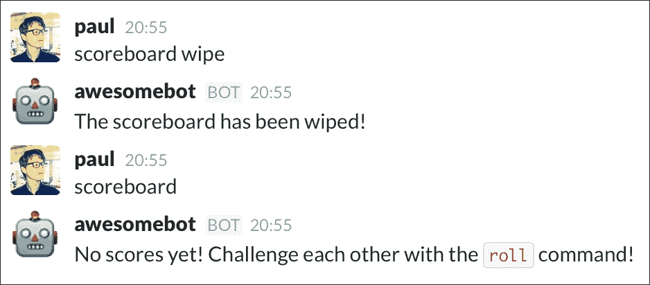
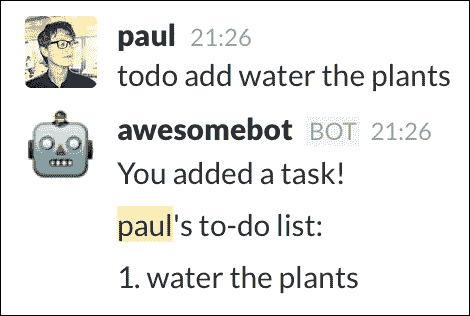
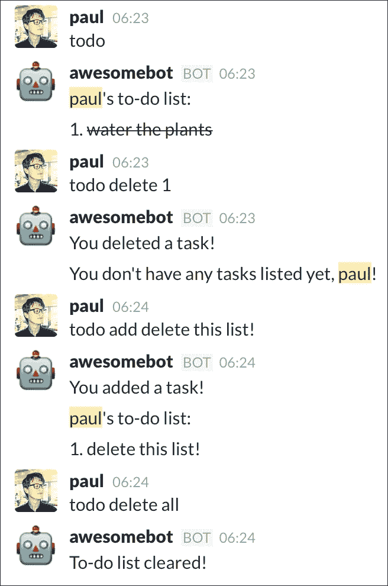

# 第四章：使用数据

现在我们已经看到了如何处理关键词、命令和 API 调用，我们将探讨构建机器人的下一个逻辑步骤：持久数据存储和检索。可以通过将数据分配给变量来在 JavaScript 中保留对数据的引用；然而，其使用仅限于程序运行时。如果程序停止或重启，我们就会丢失数据。因此，对于某些任务，需要持久数据存储。

这使得我们可以构建能够执行诸如跟踪排行榜或存储待办事项列表等任务的机器人。

在本章中，我们将介绍：

+   Redis 简介

+   连接到 Redis

+   保存和检索数据

+   最佳实践

+   错误处理

# Redis 简介

在上一章中，我们发现了如何创建一个具有竞争力的掷骰子机器人，允许用户玩“谁掷得最高”的游戏。尽管它工作得很好，但缺少的功能是某种排行榜，其中存储了每个用户的胜负，并保持了一个总体赢家列表。

这样的功能并不难实现；然而，最大的问题在于数据的存储。任何存储在 JavaScript 变量中的数据，一旦程序结束或崩溃就会丢失。因此，维护一个持久数据库将是一个更好的解决方案，我们的机器人可以从中写入和读取数据。

有许多数据库服务可供选择；你可能已经熟悉 MySQL 或 MongoDB。对于本章中的示例机器人，我们将选择一个易于设置和使用的服务。

我们将使用的数据库服务是 Redis：[`redis.io/`](http://redis.io/).

Redis 网站对这项技术的描述如下：

> *"Redis 是一个开源（BSD 许可），内存数据结构存储，用作数据库、缓存和消息代理。它支持字符串、散列、列表、集合、有序集合（带范围查询）、位图、HyperLogLogs 和地理空间索引（带半径查询）等数据结构。Redis 具有内置的复制、Lua 脚本、LRU 过期、事务和不同级别的磁盘持久性，并通过 Redis Sentinel 提供高可用性，以及通过 Redis Cluster 自动分区。"*

一个更简单的解释是，Redis 是一个高效的内存键值存储。键可以是简单的字符串、散列、列表（有序集合）、集合（无序的非重复值集合）或有序集合（有序或排名的非重复值集合）。尽管官方描述很复杂，但设置和使用 Redis 是一个快速且痛苦的过程。

Redis 的优势是其令人印象深刻的速度、跨平台通信和简单性。

### 注意

开始使用 Redis 简单，但我们只会探索 Redis 冰山一角。有关 Redis 高级使用的更多信息，请访问 Redis 网站。

有许多用各种语言编写的 Redis 客户端实现（[`redis.io/clients`](http://redis.io/clients)），但我们将使用基于 Node 的 Redis 客户端。

请记住，Redis 只是持久化数据问题的一个解决方案。其他解决方案可能包括使用 MySQL 关系型数据库或 MongoDB 非关系型数据库。

## 安装 Redis

为了连接到 Redis，我们将使用 Node Redis 包。首先，我们必须安装并运行我们的 Redis 服务器，这样 Node 就有东西可以连接了。请按照您选择的操作系统的说明进行操作。

### Mac OS X

安装 Redis 最简单的方法是通过`homebrew`包管理器。`homebrew`通过命令行轻松安装应用程序和服务。

如果您无法使用`homebrew`，请访问 Redis 快速入门指南以手动安装 Redis：([`redis.io/topics/quickstart`](http://redis.io/topics/quickstart))。

如果您不确定是否已安装 Homebrew，请打开终端并运行以下命令：

```js
which brew

```

如果没有返回任何内容，请在您的终端中运行以下命令：

```js
/usr/bin/ruby -e "$(curl –fsSL https://raw.githubusercontent.com/Homebrew/install/master/install)"

```

按照屏幕提示操作，直到成功安装`homebrew`。要安装 Redis，请运行以下命令：

```js
brew install redis

```

安装完成后，您可以在终端中使用以下命令启动 Redis 服务器：

```js
redis-server

```

### Windows

访问 Redis 的官方 Microsoft GitHub 项目并在此处获取最新版本：[`github.com/MSOpenTech/redis/releases`](https://github.com/MSOpenTech/redis/releases)。解压后，您可以通过运行`redis-server.exe`来启动服务，并通过 shell 运行`redis-cli.exe`来连接到服务器。

### Unix

请参考 Redis 快速入门页面获取在 Linux/Unix 系统上安装的说明：[`redis.io/topics/quickstart`](http://redis.io/topics/quickstart)。

安装完成后，您可以使用`redis-server`命令启动服务器，并通过`redis-cli`连接到服务器。这些命令在 OS X 上以完全相同的方式工作。

现在 Redis 已安装，启动服务，您应该会看到类似以下内容：



Redis 成功启动服务器

Redis 现在已在默认端口 6379 上启动并准备好使用。也可以使用其他端口，但默认端口对于我们的目的来说已经足够。

# 连接到 Redis

为了演示如何连接到 Redis，我们将创建一个新的机器人项目（包括在第三章中定义的`Bot`类，*增加复杂性*）。我们将首先安装 Redis Node 客户端，执行以下操作：

```js
npm install redis

```

现在，创建一个新的`index.js`文件，并粘贴以下代码：

```js
'use strict';

const redis = require('redis');
const Bot = require('./Bot');

const client = redis.createClient();

const bot = new Bot({
  token: process.env.SLACK_TOKEN,
  autoReconnect: true,
  autoMark: true
});

client.on('error', (err) => {
    console.log('Error ' + err);
});

client.on('connect', () => {
  console.log('Connected to Redis!');
});
```

此代码片段将导入 Redis 客户端并通过`createClient()`方法连接到本地实例。如果不提供任何参数，上述方法将假定服务在本地默认端口 6379 上运行。如果您想连接到不同的主机和端口组合，则可以按照以下方式提供：

```js
let client = redis.createClient(port, host);
```

### 注意

为了本书的目的，我们将使用一个不安全的 Redis 服务器。在没有身份验证或其他安全措施的情况下，任何人都可以访问和编辑连接到您的数据服务的数据。如果您打算在生产环境中使用 Redis，强烈建议您阅读有关 Redis 安全性的资料。

接下来，确保您已经在不同的终端窗口中运行了 Redis 客户端，并按照常规方式启动我们的机器人：

```js
SLACK_TOKEN=[your_token_here] node index.js

```

如果一切顺利，您应该会看到以下快乐的问候信息：



我们的 Node 应用程序已成功连接到本地 Redis 服务器

正如承诺的那样，设置和连接到 Redis 是一项简单快捷的任务。接下来，我们将查看如何实际上设置和从我们的服务器获取数据。

# 保存和检索数据

首先，让我们看看 Redis 客户端能为我们提供什么。将以下行添加到 `index.js`：

```js
client.set('hello', 'Hello World!');

client.get('hello', (err, reply) => {
  if (err) {
    console.log(err);
    return;
  }

  console.log(`Retrieved: ${reply}`);
});
```

在这个例子中，我们将使用键 `hello` 在 Redis 中设置值 "Hello world!"。在 `get` 命令中，我们指定了我们希望用来检索值的键。

### 注意

Node Redis 客户端完全是**异步**的。这意味着如果您希望处理数据，就必须为每个命令提供一个回调函数。

一个常见的错误是使用 Node Redis 客户端进行同步操作。以下是一个例子：

```js
let val = client.get('hello');
console.log('val:', val);
```

这，也许有些令人困惑，结果是：

```js
val: false

```

这是因为在向 Redis 服务器发出请求之前，`get` 函数将返回布尔值 `false`。

运行正确的代码，您应该会看到成功检索到 **Hello world!** 数据：



我们存储的值成功检索

### 小贴士

Redis 字符串的最大文件大小为 512 兆字节。如果您需要存储比这更大的内容，请考虑使用多个键/值对。

在开发 Redis 功能时，一个不错的建议是使用 Redis 客户端的内置 `print` 命令来进行简单的调试和测试：

```js
client.set('hello', 'Hello World!', redis.print);

client.get('hello', redis.print);
```

这将在终端中打印以下内容：

```js
Reply: OK
Reply: Hello World!

```

随着我们进入本章，我们将介绍 Redis 客户端提供的更多有用函数和方法。有关完整列表和文档，请访问 [`github.com/NodeRedis/node_redis`](https://github.com/NodeRedis/node_redis)。

## 连接机器人

在我们的 Redis 服务器设置完毕并覆盖了基本命令之后，让我们将所学应用到简单的机器人中。在这个例子中，我们将编写一个机器人，它根据给定的键值来*记住*一个短语。

将以下代码添加到您的 `index.js` 文件中：

```js
bot.respondTo('store', (message, channel, user) => {
  let msg = getArgs(message.text);

  client.set(user.name, msg, (err) => {
    if (err) {
      channel.send('Oops! I tried to store that but something went wrong :(');
    } else {
      channel.send(`Okay ${user.name}, I will remember that for you.`);
    }
  });
}, true);

bot.respondTo('retrieve', (message, channel, user) => {
  bot.setTypingIndicator(message.channel);

  client.get(user.name, (err, reply) => {
    if (err) {
     console.log(err);
     return;
    }

    channel.send('Here\'s what I remember: ' + reply);
  });
});
```

使用上一章中 `Bot` 类中引入的熟悉 `respondTo` 命令，我们设置我们的机器人监听关键词 `store`，然后使用消息发送者的名字作为键，将该值设置在 Redis 数据存储中。让我们看看这是如何实现的：



我们的机器人记得我们告诉它的

注意我们如何使用设置方法的回调函数来确保数据被正确保存，并在数据未保存正确时通知用户。

虽然这种行为并不十分令人印象深刻，但重要的是要认识到我们的机器人已经成功地在 Redis 数据存储中存储了值。Redis 将在本地磁盘上存储键值对，这意味着即使机器人或/和 Redis 服务器停止并重新启动，数据也会持续存在。

## 动态存储

再次，让我们增加一点复杂性。在上一个例子中，用于存储数据的键总是命令发出者的名字。在现实中，这并不实用，因为它意味着用户每次发出命令时只能存储一件事情，每次都会覆盖值。在接下来的这一节中，我们将增强我们的机器人，允许用户指定要存储的值的键，从而允许存储多个值。

删除之前的 `respondsTo` 命令，粘贴以下片段，注意高亮代码：

```js
bot.respondTo('store', (message, channel, user) => {
  let args = getArgs(message.text);

 let key = args.shift();
 let value = args.join(' ');

 client.set(key, value, (err) => {
 if (err) {
 channel.send('Oops! I tried to store something but something went wrong :(');
 } else {
 channel.send(`Okay ${user.name}, I will remember that for you.`);
 }
 });
}, true);

bot.respondTo('retrieve', (message, channel, user) => {
  bot.setTypingIndicator(message.channel);

  let key = getArgs(message.text).shift();

  client.get(key, (err, reply) => {
    if (err) {
     console.log(err);
     channel.send('Oops! I tried to retrieve something but something went wrong :(');
     return;
    }

    channel.send('Here\'s what I remember: ' + reply);
  });
});
```

在这种解释中，我们期望用户以以下格式提供命令：

```js
store [key] [value]

```

要从命令中提取键和值，我们首先使用 JavaScript 的 `Array.shift` 来移除并返回 `args` 数组的索引 0 的值。然后，通过使用 `Array.join` 收集其余的参数作为值。现在，我们将上一节学到的知识应用到存储用户定义的键和值到 Redis 实例中。

当给出 `retrieve` 命令时，我们使用相同的 `Array.shift` 技巧来提取请求的键。然后，我们将使用它来检索存储的数据。让我们看看它是如何工作的：



存储和检索多个实体

### 注意

消息文本中的表情符号将被转换为它们的文本组件。例如，点赞表情符号被转换为 `:+1`。这种转换是双向的，这意味着 Slack 将自动渲染机器人发送的任何表情文本。

## 哈希、列表和集合

到目前为止，我们为键和值使用了单一的数据类型：字符串。虽然键限制为字符串值，但 Redis 允许值是多种不同的数据类型。不同类型如下：

+   字符串

+   哈希

+   列表

+   集合

+   有序集合

我们已经熟悉字符串了，所以让我们继续列表并解释不同的数据类型。

### 哈希

哈希类似于 JavaScript 对象。然而，它们在 Redis 哈希不支持嵌套对象方面有所不同。哈希的所有属性值都将转换为字符串。以下是一个 JavaScript 对象的例子：

```js
let obj = {
  foo: 'bar',
  baz: {
    foobar: 'bazfoo'
  }
};
```

`baz` 属性包含一个对象，我们可以通过使用 `hmset` 函数将 `obj` 对象存储在 Redis 中：

```js
client.hmset('obj', obj);
```

然后，我们使用 `hgetall` 来检索数据：

```js
client.hgetall('obj', (err, object) => {
  console.log(object);
});
```

这将在我们的终端中记录以下行：

```js
{ foo: 'bar', baz: '[object Object]' }
```

Redis 首先通过调用 `Object.toString()` 函数来存储嵌套的 `baz` 对象，这意味着当我们执行 `hgetall` 函数时，返回的是字符串值。

一种解决方案是利用 JavaScript 的 `JSON` 对象在存储之前将嵌套对象序列化，然后解析从 Redis 返回的对象。观察以下示例：

```js
let obj = {
  foo: 'bar',
  baz: {
    foobar: 'bazfoo'
  }
};

function stringifyNestedObjects(obj) {
  for (let k in obj) {
    if (obj[k] instanceof Object) {
      obj[k] = JSON.stringify(obj[k]);  
    }
  }

  return obj;
}

function parseNestedObjects(obj) {
  for (let k in obj) {
    if (typeof obj[k] === 'string' || obj[k] instanceof String) {
      try {
        obj[k] = JSON.parse(obj[k]);
      } catch(e) {
        // string wasn't a stringified object, so fail silently
      }      
    }
  }

  return obj;
}

client.hmset('obj', stringifyNestedObjects(obj));

client.hgetall('obj', (err, object) => {
  console.log(parseNestedObjects(object));
});
```

执行后，我们看到记录的结果：

```js
{ foo: 'bar', baz: { foobar: 'bazfoo' } }
```

### 注意

这里给出的示例仅序列化和解析了一级嵌套的对象。为了序列化和解析深度为 *N* 的对象，请查看递归编程技术。一个很好的例子可以在 [`msdn.microsoft.com/en-us/library/wwbyhkx4(v=vs.94).aspx`](https://msdn.microsoft.com/en-us/library/wwbyhkx4(v=vs.94).aspx) 找到。

### 列表

Redis 列表在功能上与 JavaScript 数组相同。与对象一样，每个索引的值在存储时都会转换为字符串。当处理多维数组（例如，包含子数组的数组）时，`toString` 函数将在存储到 Redis 之前被调用。可以使用简单的 `Array.join(',')` 将此字符串值转换回数组。

可以使用 `lpush` 和 `rpush` 命令来存储我们的列表：

```js
client.rpush('heroes', ['batman', 'superman', 'spider-man']);
```

在前面的代码片段中，我们正在将英雄数组推送到列表的右侧。这与 JavaScript 的 `Array.push` 完全相同，其中新值被追加到现有数组中。在这种情况下，这意味着之前为空的列表现在包含我们的 `heroes` 数组。

我们可以向数组的左侧推送以向列表中添加元素：

```js
client.lpush('heroes', 'iron-man');
```

这将使我们的列表看起来像这样：

```js
[ 'iron-man', 'batman', 'superman', 'spider-man' ]
```

最后，要访问我们的 Redis 列表，我们可以使用 `lrange` 方法：

```js
client.lrange('heroes', 0, -1, (err, list) => {
  console.log(list);
});
```

传递给 `lrange` 的第二个和第三个参数是选择起始和结束位置。要返回列表中的所有元素而不是子集，我们可以提供 -1 作为结束位置。

### 集合

集合类似于 Redis 列表，但有一个非常有用的区别：集合不允许重复。考虑以下示例：

```js
client.sadd('fruits', ['apples', 'bananas', 'oranges']);
client.sadd('fruits', 'bananas');

client.smembers('fruits', (err, set) => {
  console.log(set);
});
```

在这里，我们使用 Redis 客户端的 `sadd` 来存储集合，并使用 `smembers` 来检索它。在第二行，我们尝试将 `'bananas'` 水果添加到 `'fruits'` 列表中，但由于该值已存在，`sadd` 调用将静默失败。检索到的集合与预期一致：

```js
[ 'oranges', 'apples', 'bananas' ]
```

### 注意

你可能会注意到检索到的 'fruits' 集合的顺序与存储时的顺序不同。这是因为集合是通过 `HashTable` 构建的，这意味着没有保证元素的顺序。如果你想要以特定的顺序存储你的元素，你必须使用列表或有序集合。

### 有序集合

作为列表和集合的某种混合体，有序集合具有特定的顺序且不能包含重复项。以下是一个示例：

```js
client.zadd('scores', [3, 'paul', 2, 'caitlin', 1, 'alex']);

client.zrange('scores', 0, -1, (err, set) => {
  console.log(set);
});

client.zrevrange('scores', 0, -1, 'withscores', (err, set) => {
  console.log(set);
});
```

使用 `zadd` 方法，我们指定排序集合的键和值数组。数组通过以下格式指示存储集合的顺序：

```js
[ score, value, score, value ... ]
```

`zrange` 方法使用与 `lrange` 相似的参数，我们指定要返回的集合的起始和结束位置。此方法将按升序返回集合：

```js
[ 'alex', 'caitlin', 'paul' ]
```

我们可以通过使用`zrevrange`来反转这一点。注意我们如何也提供`withscores`字符串作为参数。此参数将返回每个元素的分数：

```js
[ 'paul', '3', 'caitlin', '2', 'alex', '1' ]
```

### 注意

可以使用`withscores`参数来获取所有排序集合的检索方法。

如您可能已经意识到的，排序集合在用于跟踪游戏分数或排行榜时特别出色。考虑到这一点，让我们回顾第三章，*增加复杂性*中的“roll”机器人，并添加一个获胜者排行榜。

# 最佳实践

任何用户都应该能够通过机器人命令在 Redis 中存储数据；然而，建议您确保数据存储方法不容易被滥用。意外的滥用可能以短时间内大量不同的 Redis 调用形式发生。有关 Slack 频道垃圾邮件和补救措施的更多信息，请回顾第二章，*您的第一个机器人*。

通过限制机器人流量，我们可以确保 Redis 不会接收到过多的写入和检索操作。如果您发现 Redis 延迟不如预期，请访问此网页以帮助排查：[`redis.io/topics/latency`](http://redis.io/topics/latency)。

让我们现在看看如何通过添加 Redis 数据存储来改进熟悉的机器人行为。

首先，这是我们的`roll`命令，新的 Redis 存储代码被突出显示：

```js
bot.respondTo('roll', (message, channel, user) => {
  // get the members of the channel
  const members = bot.getMembersByChannel(channel);

  // make sure there actually members to interact with. If there
  // aren't then it usually means that the command was given in a  
  // direct message
  if (!members) {
    channel.send('You have to challenge someone in a channel, not a direct message!');
    return;
  }

  // get the arguments from the message body
  let args = getArgs(message.text);

  // if args is empty, return with a warning
  if (args.length < 1) {
    channel.send('You have to provide the name of the person you wish to challenge!');
    return;
  }

  // the user shouldn't challenge themselves
  if (args.indexOf(user.name) > -1) {
    channel.send(`Challenging yourself is probably not the best use of your or my time, ${user.name}`);
    return;
  }

  // does the opponent exist in this channel?
  if (members.indexOf(args[0]) < 0) {
    channel.send(`Sorry ${user.name}, but I either can't find ${args[0]} in this channel, or they are a bot!`);
    return;
  }

  // Roll two random numbers between 0 and 100
  let firstRoll = Math.round(Math.random() * 100);
  let secondRoll = Math.round(Math.random() * 100);

  let challenger = user.name;
  let opponent = args[0];

  // reroll in the unlikely event that it's a tie
  while (firstRoll === secondRoll) {
    secondRoll = Math.round(Math.random() * 100);
  }

  let winner = firstRoll > secondRoll ? challenger : opponent;

 client.zincrby('rollscores', 1, winner);

  // Using new line characters (\n) to format our response
  channel.send(
    `${challenger} fancies their changes against ${opponent}!\n
    ${challenger} rolls: ${firstRoll}\n
    ${opponent} rolls: ${secondRoll}\n\n
    *${winner} is the winner!*`
  );

}, true);
```

要存储用户的胜利，我们使用 Redis 客户端的`zincrby`方法，该方法将获胜者的分数增加一。注意我们如何在第二个参数中指定增加的数量。如果键（这里的获胜者姓名）在集合中不存在，它将自动创建并带有分数 0，然后按指定数量增加。

要检索计分板，请添加以下内容：

```js
bot.respondTo('scoreboard', (message, channel) => {
  client.zrevrange('rollscores', 0, -1, 'withscores', (err, set) => {
    if (err) {
      channel.send('Oops, something went wrong! Please try again later');
      return;
    }

    let scores = [];

    // format the set into something a bit easier to use
    for (let i = 0; i < set.length; i++) {
      scores.push([set[i], set[i + 1]]);
      i++;
    }

    channel.send('The current scoreboard is:');
    scores.forEach((score, index) => {
      channel.send(`${index + 1}. ${score[0]} with ${score[1]} points.`);
    });
  });
}, true);
```

一旦输入`scoreboard`命令，我们立即使用`zrevrange`方法查找反向范围。这将异步返回一个数组，其格式如下：

```js
[ NAME, SCORE, NAME2, SCORE2, NAME3, SCORE3, …]
```

接下来，我们将该数组转换为一个二维数组，通过将名称和分数拆分为嵌套数组，看起来是这样的：

```js
[ [NAME, SCORE], [NAME2, SCORE2], [NAME3, SCORE3], …]
```

以这种方式格式化数据使我们能够轻松地将姓名和分数发送到频道，前面是计分板上的位置（数组索引加一）。

Slack 中的最终结果显示了一个正常工作的计分板：



通过持久化数据存储实现的计分板

在继续下一个示例之前，让我们看看如何删除 Redis 键/值对。将您的`scoreboard`命令替换为以下内容，注意突出显示的代码：

```js
bot.respondTo('scoreboard', (message, channel, user) => {
  let args = getArgs(message.text);

 if (args[0] === 'wipe') {
 client.del('rollscores');
 channel.send('The scoreboard has been wiped!');
 return;
 }

  client.zrevrange('rollscores', 0, -1, 'withscores', (err, set) => {
    if (err) {
      channel.send('Oops, something went wrong! Please try again later');
      return;
    }

 if (set.length < 1) {
 channel.send('No scores yet! Challenge each other with the \`roll\` command!');
 return;
 }

    let scores = [];

    // format the set into something a bit easier to use
    for (let i = 0; i < set.length; i++) {
      scores.push([set[i], set[i + 1]]);
      i++;
    }

    channel.send('The current scoreboard is:');
    scores.forEach((score, index) => {
      channel.send(`${index + 1}. ${score[0]} with ${score[1]} points.`);
    });
  });
}, true);
```

现在如果输入`scoreboard wipe`命令，我们使用 Redis 客户端的`del`函数通过指定键来擦除键/值对。

我们还添加了一些错误处理，如果没有分数，它会发送错误消息：



删除数据应谨慎使用

### 注意

在现实世界的例子中，计分板和其他敏感数据结构应该只由具有管理员权限的用户删除。请记住，您可以通过检查 `user.is_admin` 属性来确认命令发送者是否是管理员。

# 简单待办示例

在了解了 Redis 的基础知识后，我们现在将创建一个简单的待办 Slack 机器人。这个机器人的目的是允许用户创建待办列表，让他们在日常生活中可以添加、完成和删除列表中的任务。

这次，我们将从一个我们想要的基本框架开始，逐步构建每个功能。首先，将这个新命令添加到您的机器人中：

```js
bot.respondTo('todo', (message, channel, user) => {
  let args = getArgs(message.text);

  switch(args[0]) {
    case 'add':

      break;

    case 'complete':

      break;

    case 'delete':

      break;

    case 'help':
      channel.send('Create tasks with \`todo add [TASK]\`, complete them with \`todo complete [TASK_NUMBER]\` and remove them with \`todo delete [TASK_NUMBER]\` or \`todo delete all\`');
      break;

    default:
      showTodos(user.name, channel);
      break;
  }
}, true);

function showTodos(name, channel) {
  client.smembers(name, (err, set) => {
    if (err || set.length < 1) {
      channel.send(`You don\'t have any tasks listed yet, ${name}!`);
      return;
    }

    channel.send(`${name}'s to-do list:`);

    set.forEach((task, index) => {
      channel.send(`${index + 1}. ${task}`);
    });
  });
}
```

机器人的行为将根据在初始 `todo` 命令之后给出的第二个命令而改变。在这种情况下，使用 `switch` 语句是理想的。我们允许五种选项：`add`、`complete`、`delete`、`help` 以及一个默认选项，当传递任何其他内容时会被触发。

`help` 和默认行为已经完成，因为它们相当直接。在后者的例子中，我们检索 Redis 集合，如果它不存在或没有项目，则发送错误，否则发送待办列表的总数。


如果没有待办事项，显示一条消息

添加待办任务是同样简单的。我们使用 Redis 集合，因为我们不希望在列表中允许重复。要添加一个项目，我们使用之前引入的 `sadd` 命令。为了使我们的 `switch` 语句不那么杂乱，所有代码都将移动到一个单独的函数中：

```js
case 'add':
  addTask(user.name, args.slice(1).join(' '), channel);
     break;
```

以及 `addTask` 函数：

```js
function addTask(name, task, channel) {
  if (task === '') {
    channel.send('Usage: \`todo add [TASK]\`');
    return;
  }

  client.sadd(name, task);
  channel.send('You added a task!');
  showTodos(name, channel);
}
```

除了前两个参数（`todo add`）之外的所有参数都将合并成一个字符串，并使用用户的名称作为键添加到我们的集合中。记住，Redis 集合中不允许重复，因此可以安全地存储任务而无需进行任何先前的检查。我们确实检查了任务参数是否为空，如果为空，则发送一个关于如何使用 "add" 函数的温和提醒。

在任务设置之后，我们显示确认信息和整个待办列表。这是我们将为每个动作实现的行为，因为展示用户已经做了什么以及它如何影响数据是一种良好的实践。

这里是一个向我们的待办列表添加任务的示例：



Redis 的集合会为我们处理索引

接下来是 `complete` 命令，它接受一个任务的编号作为参数：

```js
case 'complete':
  completeTask(user.name, parseInt(args[1], 10), channel);
  break;
```

这里是相应的 `completeTask` 函数：

```js
function completeTask(name, taskNum, channel) {
  if (Number.isNaN(taskNum)) {
    channel.send('Usage: \`todo complete [TASK_NUMBER]\`');
    return;
  }

  client.smembers(name, (err, set) => {
    if (err || set.length < 1) {
      channel.send(`You don\'t have any tasks listed yet, ${user.name}!`);
      return;
    }

    // make sure no task numbers that are out of bounds are given
    if (taskNum > set.length || taskNum <= 0) {
      channel.send('Oops, that task doesn\'t exist!');
      return;
    }

    let task = set[taskNum - 1];

    if (/~/i.test(task)) {
      channel.send('That task has already been completed!');
      return;
    }

    // remove the task from the set
    client.srem(name, task);

    // re-add the task, but with a strikethrough effect
    client.sadd(name, `~${task}~`);

    channel.send('You completed a task!');
    showTodos(name, channel);
  });
}
```

这个动作稍微复杂一些，因为我们一开始需要进行一些错误处理。首先，我们确保提供的参数是一个有效的数字，使用 ES6 的 `Number.isNaN` 方法。

### 注意

使用 ES5 的`isNaN`方法或 ES6 的`Number.isNaN`方法时要小心，因为它们可能会令人困惑。这些方法回答的问题是“值是否等于类型 NaN？”而不是“值是否为数字？”更多信息请访问[`ponyfoo.com/articles/es6-number-improvements-in-depth#numberisnan`](https://ponyfoo.com/articles/es6-number-improvements-in-depth#numberisnan)。

在从 Redis 检索集合后，我们确保任务存在，提供的数字有意义（例如，不小于 1 或大于集合的长度），并且任务尚未完成。后者是通过检查任务是否包含任何波浪号（`~`）操作符来确定的。包含波浪号作为第一个和最后一个字符的消息将在 Slack 中以删除线样式显示。

要完成任务，我们在将任务分配给`task`变量后，使用`srem`从 Redis 集合中删除该任务，然后再次以删除线样式将其添加到 Redis 中。


通过引用任务编号来完成任务

最后，让我们看看`delete`函数：

```js
case 'delete':
      removeTaskOrTodoList(user.name, args[1], channel);
      break;
```

这是相应的函数：

```js
function removeTaskOrTodoList(name, target, channel) {
  if (typeof target === 'string' && target === 'all') {
    client.del(name);
    channel.send('To-do list cleared!');
    return;
  }

  let taskNum = parseInt(target, 10);

  if (Number.isNaN(taskNum)) {
    channel.send('Usage: \`todo delete [TASK_NUMBER]\` or \`todo delete all\`');
    return;
  }

  // get the set and the exact task
  client.smembers(name, (err, set) => {
    if (err || set.length < 1) {
      channel.send(`You don\'t have any tasks to delete, ${name}!`);
      return;
    }

    if (taskNum > set.length || taskNum <= 0) {
      channel.send('Oops, that task doesn\'t exist!');
      return;
    }

    client.srem(name, set[taskNum - 1]);
    channel.send('You deleted a task!');
    showTodos(name, channel);
  });
}
```

在这个函数中需要注意的第一件事是我们如何使用一种类型的函数重载来实现两种不同的结果，这取决于传入的参数。

由于 JavaScript 是一种弱类型语言，我们可以根据`target`参数是字符串还是数字来执行不同的操作。在字符串的情况下（并且假设该字符串等于*all*），我们使用`del`命令从 Redis 中删除整个集合，清除整个待办事项列表。

在数字的情况下，我们只删除指定的任务，前提是目标是我们可以使用的有效数字（例如，不小于 1 且不大于集合的长度）。

这里是`delete`命令的多功能演示：



列出待办事项，删除一个任务，添加另一个，然后删除整个列表

# 摘要

在本章中，读者已经学习了持久化数据存储 Redis 的基础知识以及如何通过 Node Redis 客户端使用它。我们概述了为什么 Redis 非常适合与机器人一起使用，尤其是在保持分数列表或存储多个小项目时。

在下一章中，我们将介绍**自然语言处理**（**NLP**）的概念，并了解如何评估和生成用于机器人的自然语言。
