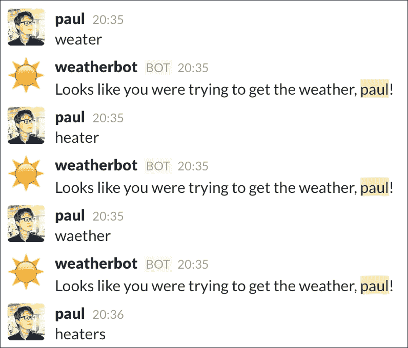

# 第五章：理解和回应自然语言

我们已经构建了能够玩游戏、存储数据和提供有用信息的机器人。下一步不是信息收集，而是处理。本章将介绍**自然语言处理**（**NLP**），并展示我们如何利用它进一步增强我们的机器人。

在本章中，我们将涵盖：

+   自然语言的简要介绍

+   节点实现

+   自然语言处理

+   自然语言生成

+   以自然的方式展示数据

# 自然语言的简要介绍

你应该始终努力使你的机器人尽可能有用。在我们迄今为止制作的机器人中，我们都是通过用户的关键词来等待明确的指令，然后按照机器人能够做到的范围内执行这些指令。如果我们能够从用户那里推断出指令，而他们实际上并没有提供关键词怎么办？这就引入了**自然语言处理**（**NLP**）。

自然语言处理可以描述为计算机科学的一个领域，它致力于理解计算机与人类（自然）语言之间的沟通和互动。

用通俗易懂的话来说，自然语言处理是计算机解释对话语言并通过执行命令或以同样对话的语气回复用户的过程。

自然语言处理（NLP）的例子包括 iPhone 的 Siri 这样的数字助手。用户可以提出问题或下达命令，并以自然语言接收答案或确认，似乎来自人类。

使用自然语言处理（NLP）的更著名的项目之一是 IBM 的 Watson 系统。2011 年，Watson 在电视节目《危险边缘》中与人类对手竞争，并赢得了第一名。

自然语言处理领域是一个庞大而复杂的领域，许多知名学术机构和大型科技公司进行了多年的研究。仅 Watson 就花费了 5 年时间，300 万美元，以及一支由学者和工程师组成的小型军队来构建。在本章中，我们将简要介绍主要概念，并给出一个实际例子。

首先，让我们退一步，看看自然语言处理如何使我们的机器人受益。如果我们构建了一个可以检索天气预报的机器人，我们可以想象命令看起来可能像这样：

```js
weather amsterdam tomorrow

```

这将返回阿姆斯特丹市的天气预报。如果机器人能够在不发出命令的情况下检索天气预报怎么办？例如，如果 Slack 用户发送消息“明天会下雨吗？”，那么机器人就会回复明天的天气预报。这就是自然语言处理（NLP）在发挥作用；它是将自然语言分解成程序可以解释为命令的指令的过程。

为了帮助我们理解自然语言处理（NLP），我们将使用一个辅助库，该库将更复杂的算法抽象化。一个好的 NLP 框架是基于 Python 语言的**自然语言****工具包**（**NLTK**），可在[`www.nltk.org/`](http://www.nltk.org/)找到。

幸运的是，一个将 NLTK 的主要功能移植到 Node 的项目已经存在了一段时间，并且已经达到了足够成熟的水平，我们可以无缝地将其与现有的 JavaScript 项目一起使用。这个库被称为 Natural ([`github.com/NaturalNode/natural`](https://github.com/NaturalNode/natural))，它将成为我们进入 NLP 世界的关键入口点。

让我们先介绍一些更常见的 NLP 算法。之后，我们将利用我们新获得的知识，通过构建一个简单的天气机器人来实现，正如之前概述的那样。

# NLP 基础

自然语言处理（NLP）的核心是通过将一段文本（也称为语料库）分割成单个片段或标记，然后对这些标记进行分析。这些标记可能是单个单词，也可能是单词缩写。让我们看看计算机如何解释这个短语：*我给植物浇水了*。

如果我们将这个语料库分割成标记，它可能看起来像这样：

```js
['I', 'have', 'watered', 'the', 'plants']
```

在我们的语料库中，单词 `the` 是不必要的，因为它并不能帮助我们理解短语的意图——同样，单词 `have` 也是如此。因此，我们应该删除这些多余的单词：

```js
['I', 'watered', 'plants']
```

已经，这开始看起来更有用。我们有一个以演员形式出现的第一人称代词（`I`），一个动作或动词（`watered`），以及一个接受者或名词（`plants`）。从这些信息中，我们可以推断出确切的动作是由谁对什么进行的。此外，通过动词 `watered` 的变化形式，我们可以确定这个动作发生在过去。考虑一下当我们对短语进行微小改变时，短语的内容和意义是如何变化的：*我们在给植物浇水*。

通过使用与之前相同的过程，我们得到以下结果：

```js
['We', 'watering', 'plant']
```

短语的意义发生了戏剧性的变化：涉及多个演员，动作是现在时态，接受者是单数。NLP 的挑战在于分析这样的细微差别，以足够高的置信度得出结论，然后根据这个结论采取行动。

就像人一样，计算机通过实践和识别模式来学习这种细微差别。一个常见的 NLP 术语是训练你的系统在语料库中识别上下文。通过向我们的系统提供大量预定义的短语，我们可以分析这些短语，并在其他语料库中寻找类似的短语。我们将在稍后更多地讨论如何使用这种训练或分类技术。

现在我们来看看如何实际执行本节开头所解释的动作，首先是将语料库分割成一系列标记，也称为**分词**。

# 分词器

首先使用 `npm init` 创建一个新的项目。将你的机器人命名为 "weatherbot"（或类似名称），并使用以下命令安装 Slack 和 Natural API：

```js
npm install @slack/client natural –save

```

将上一章中的 `Bot` 类复制到 `index.js` 文件中，并输入以下内容：

```js
'use strict';

// import the natural library
const natural = require('natural');

const Bot = require('./Bot');

// initalize the tokenizer
const tokenizer = new natural.WordTokenizer();

const bot = new Bot({
  token: process.env.SLACK_TOKEN,
  autoReconnect: true,
  autoMark: true
});

// respond to any message that comes through
bot.respondTo('', (message, channel, user) => {

  let tokenizedMessage = tokenizer.tokenize(message.text);

  bot.send(`Tokenized message: ${JSON.stringify(tokenizedMessage)}`, channel);
});
```

启动你的 Node 进程，并在 Slack 中输入一个测试短语：


返回的分词消息

通过使用分词，机器人将给定的短语拆分为短片段或**标记**，忽略标点符号和特殊字符。请注意，我们正在使用本地`JSON`对象的`stringify`方法在将其发送到频道之前将 JavaScript 数组转换为字符串。

这个特定的分词算法将通过删除标点符号并拆分单词来处理缩写词（例如，`hasn't`）。根据我们的用例，我们可能想要使用不同的算法。幸运的是，`natural`提供了三种不同的算法。每种算法对语料库返回的结果略有不同。要了解更多关于这些算法的信息，请访问`natural`的 GitHub 页面：[`github.com/NaturalNode/natural#tokenizers`](https://github.com/NaturalNode/natural#tokenizers)。

大多数这些算法使用标点符号（空格、撇号等）来分词短语，而 Treebank 算法分析缩写词（例如，`wanna`和`gimme`），将它们拆分为常规单词（在`wanna`和`gimme`的情况下，`want to`和`give me`）。让我们在下一个示例中使用 Treebank，并将初始化分词器的行替换为以下内容：

```js
const tokenizer = new natural.TreebankWordTokenizer();
```

现在，回到 Slack 并尝试发送另一条测试消息：


Treebank 算法处理缩写词的方式不同

注意这里两个重要的事情：缩写词`haven't`被拆分为两部分，即词根动词（`have`）和缩写附加部分（`not`）。此外，`cannot`这个词也被拆分为两个单独的词，这使得命令更容易处理。这也使得某些俚语词如`lemme`和`gotta`更容易处理。通过将缩写词拆分为两部分，我们可以更容易地推断出短语是积极的还是消极的。`Can`本身意味着积极；然而，如果它后面跟着`not`，它就会改变短语语境，使其变为消极。

# 词干提取器

有时候，找到词的词根或“词干”是有用的。在英语中，不规则动词的屈折形式并不罕见。通过推断动词的词根，我们可以显著减少查找短语动作所需的计算量。以动词`searching`为例；对于机器人来说，以其词根形式`search`处理这个动词会容易得多。在这里，词干提取器可以帮助我们确定这个词根。将`index.js`的内容替换为以下内容以演示词干提取器：

```js
'use strict';

// import the natural library
const natural = require('natural');

const Bot = require('./Bot');

// initialize the stemmer
const stemmer = natural.PorterStemmer;

// attach the stemmer to the prototype of String, enabling
// us to use it as a native String function
stemmer.attach();

const bot = new Bot({
  token: process.env.SLACK_TOKEN,
  autoReconnect: true,
  autoMark: true
});

// respond to any message that comes through
bot.respondTo('', (message, channel, user) => {
  let stemmedMessage = stemmer.stem(message.text);

  bot.send(`Stemmed message: ${JSON.stringify(stemmedMessage)}`, channel);
});
```

现在，让我们看看对一个词进行词干提取会返回什么：


动词的屈折形式通常与其词根不同

如预期，`searching` 提取为 `search`，但（更有趣的是）标记 `shining` 提取为 `shine`。这表明词干提取的过程不仅仅是简单地从标记的末尾移除 `-ing`。现在，我们可以分析我们的分词和词干提取语料库，并挑选出某些动词或动作。例如，在提取词干后，短语 *I went swimming* 和 *I swam* 都包含动词 `swim`，这意味着我们只需要搜索一个术语（`swim`），而不是两个（`swimming` 和 `swam`）。

词干提取也可以用于从单词中去除复数。例如，`searches` 提取为 `search`，而 `rains` 提取为 `rain`。

让我们将分词和词干提取的概念结合到一个程序中，看看其效果。再次，将 `index.js` 替换为以下内容：

```js
'use strict';

// import the natural library
const natural = require('natural');

const Bot = require('./Bot');

// initialize the stemmer
const stemmer = natural.PorterStemmer;

// attach the stemmer to the prototype of String, enabling
// us to use it as a native String function
stemmer.attach();

const bot = new Bot({
  token: process.env.SLACK_TOKEN,
  autoReconnect: true,
  autoMark: true
});

// respond to any message that comes through
bot.respondTo('', (message, channel, user) => {
  let stemmedMessage = message.text.tokenizeAndStem();

  bot.send(`Tokenize and stemmed message: ${JSON.stringify(stemmedMessage)}`, channel);
});
```

注意，我们在 `message.text` 上调用了 `tokenizeAndStem`。这看起来可能有些奇怪，直到你意识到我们在之前的代码中已经将 `tokenizeAndStem` 方法附加到了 `String` 对象的原型上，这在前面的代码中已经突出显示。

切换到 Slack 客户端，你应该会看到：


分词和词干提取以产生有用的结果

分词和词干提取的组合自动排除了非常常见的词，例如 `it` 和 `in`，从而将句子提炼成原始输入中最重要的标记。

仅使用分词和词干提取的结果，我们可以推断用户希望了解阿姆斯特丹的天气。此外，我们可以选择排除单词 `is`。这使我们只剩下 `rain amsterdam`，这对于我们进行天气 API 调用来说是足够的信息。

# 字符串距离

字符串距离测量算法是计算两个字符串之间相似度的计算。字符串 `smell` 和 `bell` 可以定义为相似的，因为它们共享三个字符。字符串 `bell` 和 `fell` 更接近，因为它们共享三个字符，并且彼此之间只有一个字符的差异。在计算字符串距离时，当测量 `fell` 和 `bell` 之间的距离时，字符串 `fell` 将比 `smell` 获得更高的排名。

NPM 包 `natural` 提供了三种不同的字符串距离计算算法：Jaro-Winkler、Dice 系数和 Levenshtein 距离。它们的主要区别可以描述如下：

+   **Dice 系数**：这计算字符串之间的差异，并将差异表示为零到一之间的值。零表示完全不同，一表示完全相同。

+   **Jaro-Winkler**：这与 Dice 系数类似，但给字符串开头的相似性赋予更大的权重。

+   **Levenshtein 距离**：这计算将一个字符串转换为另一个字符串所需的编辑或步骤数量。零步意味着字符串是相同的。

让我们使用 Levenshtein 距离算法来演示其用法：

```js
let distance = natural.LevenshteinDistance('weather', 'heater');

console.log('Distance:', distance); // distance of 10

let distance2 = natural.LevenshteinDistance('weather', 'weather');

console.log('Distance2:', distance2); // distance of 0
```

字符串距离的一个流行用途是执行模糊搜索，搜索结果返回与请求查询具有低字符串距离的值。字符串距离计算在处理包含错别字的命令时对机器人特别有用。例如，如果用户本想通过发送命令 `weather amsterdam` 请求阿姆斯特丹的天气预报，但错误地输入了 `weater amsterdam`。通过计算字符串之间的 Levenshtein 距离，我们可以对用户的意图做出合理的猜测。查看以下代码片段：

```js
bot.respondTo('', (message, channel, user) => {
  // grab the command from the message's text
  let command = message.text.split(' ')[0];

  let distance = natural.LevenshteinDistance('weather', command);

  // our typo tolerance, a higher number means a larger 
  // string distance
  let tolerance = 2;

  // if the distance between the given command and 'weather' is
  // only 2 string distance, then that's considered close enough
  if (distance <= tolerance) {
    bot.send(`Looks like you were trying to get the weather, ${user.name}!`, channel);
  }}, true);
```

下面是 Slack 上的结果：



计算字符串距离可以使你的机器人更加用户友好

在这种情况下，我们将容差设置得相当低，允许有两个错误或 `步骤` 来指示命中。在生产代码中，将容差减少到只有一个步骤是有意义的。

### 注意

在选择使用哪种字符串相似度算法时要小心，因为每种算法可能都会以不同的方式确定距离。例如，当使用 Jaro-Winkler 和 Dice 系数算法时，得分为 1 表示两个字符串完全相同。使用 Levenshtein 差异时则相反，其中 0 表示相同，数字越高表示字符串距离越大。

# 变位

变位器可以用来在单数和复数形式之间转换名词。这在生成自然语言时很有用，因为名词的复数形式可能并不明显：

```js
let inflector = new natural.NounInflector();

console.log(inflector.pluralize('virus'));
console.log(inflector.singularize('octopi'));
```

上述代码将分别输出 `viri` 和 `octopus`。

变位器还可以用来将数字转换为它们的序数形式；例如，1 变为 1st，2 变为 2nd，依此类推：

```js
let inflector = natural.CountInflector;

console.log(inflector.nth(25));
console.log(inflector.nth(42));
console.log(inflector.nth(111)); 
```

这将分别输出 `25th`、`42nd` 和 `111th`。

下面是一个简单机器人命令中使用的变位器的示例：

```js
let inflector = natural.CountInflector;

bot.respondTo('what day is it', (message, channel) => {
  let date = new Date();

  // use the ECMAScript Internationalization API to convert 
  // month numbers into names
  let locale = 'en-us';
  let month = date.toLocaleString(locale, { month: 'long' });
  bot.send(`It is the ${inflector.nth(date.getDate())} of ${month}.`, channel);
}, true);
```

现在，当被问及今天是星期几时，我们的机器人可以回答得更加自然一些：


变位可以让你的人工智能更加亲切

这引出了我们的下一个主题：如何以易于理解的方式显示数据。

# 以自然的方式显示数据

让我们构建机器人的天气功能。为此，我们将使用一个名为 **Open Weather Map** 的第三方 API。该 API 每分钟免费使用最多 60 次调用，并提供其他定价选项。要获取 API 密钥，您需要在此处注册：[`home.openweathermap.org/users/sign_up`](https://home.openweathermap.org/users/sign_up)。

### 注意

记住，你可以从命令行传递变量，例如 API 密钥到 Node。要运行天气机器人，你可以使用以下命令：

```js
SLACK_TOKEN=[YOUR_SLACK_TOKEN] WEATHER_API_KEY=[YOUR_WEATHER_KEY] nodemon index.js

```

一旦您注册并获取了您的 API 密钥，将以下代码复制并粘贴到 `index.js` 中，用您新获得的 Open Weather Map 密钥替换 `process.env.WEATHER_API_KEY`：

```js
'use strict';

// import the natural library
const natural = require('natural');

const request = require('superagent');

const Bot = require('./Bot');

const weatherURL = `http://api.openweathermap.org/data/2.5/weather?&units=metric&appid=${process.env.WEATHER_API_KEY}&q=`;

// initialize the stemmer
const stemmer = natural.PorterStemmer;

// attach the stemmer to the prototype of String, enabling
// us to use it as a native String function
stemmer.attach();

const bot = new Bot({
  token: process.env.SLACK_TOKEN,
  autoReconnect: true,
  autoMark: true
});

bot.respondTo('weather', (message, channel, user) => {
  let args = getArgs(message.text);

  let city = args.join(' ');

  getWeather(city, (error, fullName, description, temperature) => {
    if (error) {
      bot.send(error.message, channel);
      return;
    }

    bot.send(`The weather for ${fullName} is ${description} with a temperature of ${Math.round(temperature)} celsius.`, channel);
  });
}, true);

function getWeather(location, callback) {
  // make an AJAX GET call to the Open Weather Map API
  request.get(weatherURL + location)
    .end((err, res) => {
      if (err) throw err;
      let data = JSON.parse(res.text);

      if (data.cod === '404') {     
        return callback(new Error('Sorry, I can\'t find that location!')); 
      }

      console.log(data);

      let weather = [];
      data.weather.forEach((feature) => {
        weather.push(feature.description);
      });

      let description = weather.join(' and ');

      callback(data.name, description, data.main.temp);
    });
}

// Take the message text and return the arguments
function getArgs(msg) {
  return msg.split(' ').slice(1);
}
```

使用熟悉的代码，我们的机器人执行以下任务：

+   从自然包初始化词干提取器并将其附加到字符串原型

+   等待`weather`命令并使用`getWeather`函数通过**异步 JavaScript 和 XML**（**AJAX**）调用检索 Open Weather Map 的天气数据

+   向频道发送格式化的天气信息

这是机器人在行动：


一个简单的天气机器人

在收到命令和地点名称后，机器人使用地点名称作为参数向 Open Weather Map 发送 AJAX 请求。作为回报，我们得到一个看起来像这样的 JSON 响应：

```js
{ 
  coord: { lon: 4.89, lat: 52.37 },
  weather:
   [ { id: 310,
       main: 'Drizzle',
       description: 'light intensity drizzle rain',
       icon: '09n' } ],
  base: 'cmc stations',
  main: { temp: 7, pressure: 1021, humidity: 93, temp_min: 7, temp_max: 7 },
  wind: { speed: 5.1, deg: 340 },
  clouds: { all: 75 },
  dt: 1458500100,
  sys:
   { type: 1,
     id: 5204,
     message: 0.0103,
     country: 'NL',
     sunrise: 1458452421,
     sunset: 1458496543 },
  id: 2759794,
  name: 'Amsterdam',
  cod: 200 
}
```

注意，在返回的大量信息中，有地点的全称和有用的信息，如最低和最高温度。对于我们机器人的初始目的，我们将使用温度对象（`main`）、`name`属性和`weather`对象内的`description`。

现在我们有一个简单的机器人，它会对`weather`命令做出响应，让我们看看我们是否可以使用 NLP 来获得更具体的答案。

注意到 Open Weather Map 的 AJAX 调用被抽象成`getWeather`函数。这意味着我们可以为命令调用和 NLP 调用使用相同的函数。

在继续之前，我们应该讨论 NLP 技术的正确用例。

# 何时使用 NLP？

可能会诱使天气机器人监听并处理频道中发送的所有消息。这立即提出了一些问题：

+   我们如何知道发送的消息是关于天气的查询，还是完全不相关的？

+   查询的是哪个地理位置？

+   消息是问题还是陈述？例如，*阿姆斯特丹冷吗*和*阿姆斯特丹很冷*之间的区别。

虽然可能找到解决前面问题的 NLP 解决方案，但我们必须面对现实：当监听通用消息时，我们的机器人可能会至少犯上述错误中的一个。这会导致机器人提供错误信息或提供不必要的信息，从而变得令人烦恼。我们无论如何都要避免的是，机器人频繁地发送太多错误信息。

这里有一个机器人使用 NLP 并完全忽略发送信息要点的例子：


一个明显被误解的信息

如果机器人经常将你的不相关消息误认为是实际命令，你可以想象用户在启用它后很快就会禁用它。

最佳解决方案可能是创建一个具有人类水平自然语言处理能力的机器人。如果这句话没有引起你的注意，那么考虑一下，人类水平的自然语言处理被认为是人工智能的完整问题。本质上，它等同于尝试解决使计算机像人类一样智能的问题。

相反，我们应该专注于如何让我们的机器人利用现有资源尽可能好地表现。我们可以从引入一条新规则开始：将 NLP 作为机器人增强功能，而不是主要功能。

一个例子是在机器人被直接提及时才使用 NLP 技术。在 Slack 频道中提及是在公共频道中用户直接向另一个用户发送消息时发生的。这是通过在用户名前加上`@`符号来完成的。机器人也可以被提及，这意味着我们应该能够以两种方式处理天气命令：

+   用户在请求前加上命令`weather`：`weather is it raining in Amsterdam`

+   用户使用提及`@weatherbot is it raining in Amsterdam`

# 提及

为了实现第二点，我们需要重新访问我们的`Bot`类并添加提及功能。在`Bot`类的构造函数中，用以下内容替换`RTM_CONNECTION_OPENED`事件监听器块：

```js
this.slack.on(CLIENT_EVENTS.RTM.RTM_CONNECTION_OPENED, () => {
  let user = this.slack.dataStore.getUserById(this.slack.activeUserId)
  let team = this.slack.dataStore.getTeamById(this.slack.activeTeamId);

  this.name = user.name;
 this.id = user.id;

  console.log(`Connected to ${team.name} as ${user.name}`);
});
```

这里唯一的改变是将机器人的`id`添加到`this`对象中。这将有助于我们以后的操作。现在，用以下内容替换`respondTo`函数：

```js
respondTo(opts, callback, start) {
  if (!this.id) {
    // if this.id doesn't exist, wait for slack to connect
    // before continuing
    this.slack.on(CLIENT_EVENTS.RTM.RTM_CONNECTION_OPENED, () => {
      createRegex(this.id, this.keywords);
    });  
  } else {
    createRegex(this.id, this.keywords);
  }

  function createRegex(id, keywords) {
    // if opts is an object, treat it as options
    // otherwise treat it as the keywords string
    if (opts === Object(opts)) {
      opts = {
        mention: opts.mention || false,
        keywords: opts.keywords || '',
        start: start || false
      };
    } else {
      opts = {
        mention: false,
        keywords: opts,
        start: start || false
      };
    }

    // mention takes priority over start variable
    if (opts.mention) {         
      // if 'mention' is truthy, make sure the bot only 
      // responds to mentions of the bot
      opts.keywords = `<@${id}>:* ${opts.keywords}`;
    } else {
      // If 'start' is truthy, prepend the '^' anchor to instruct
      // the expression to look for matches at the beginning of
      // the string
      opts.keywords = start ? '^' + opts.keywords : opts.keywords;
    }

    // Create a new regular expression, setting the case 
    // insensitive (i) flag
    // Note: avoid using the global (g) flag
    let regex = new RegExp(opts.keywords, 'i');

    // Set the regular expression to be the key, with the callback 
    // function as the value
    keywords.set(regex, callback);
  }
}
```

我们通过首先检查`this.id`是否存在来改进了`respondTo`函数。如果没有，这意味着我们尚未成功连接到 Slack。因此，我们等待 Slack 连接（记得我们在构造函数中连接后设置了`this.id`），然后继续。这是第二次监听`RTM_CONNECTION_OPENED`事件。幸运的是，第一次发生在`Bot`类的构造函数中，这意味着这个监听器总是作为第二个触发，因为它是在之后添加的。这确保了在事件触发时`this.id`已被定义。

函数现在接受一个字符串（我们正在寻找的关键词）或一个对象作为其第一个参数。在对象的情况下，我们检查提及属性是否为真；如果是，我们创建一个故意查找提及语法的正则表达式。当收到消息时，提及具有以下结构：

`<@[USER_ID]>: [REST OF MESSAGE]`

切换回`index.js`，让我们通过替换之前的`weather`的`respondTo`块来尝试我们的新代码：

```js
bot.respondTo({ mention: true }, (message, channel, user) => {
  let args = getArgs(message.text);

  let city = args.join(' ');

  getWeather(city, (error, fullName, description, temperature) => {
    if (error) {
      bot.send(error.message, channel);
      return;
    }

    bot.send(`The weather for ${fullName} is ${description} with a temperature of ${Math.round(temperature)} celsius.`, channel);
  });
});
```

现在我们提及我们的机器人并传递一个城市名，我们得到以下结果：


提及可以用来识别特定的行为

### 注意

提及是确保发送的消息意图是命令你的机器人的有效方式。在实施自然语言解决方案时，强烈建议你使用提及。

现在有了提及，让我们看看我们将如何以自然语言处理（NLP）的方式回答与天气相关的问题。我们之前简要地讨论了分类和 NLP 系统的训练。让我们回顾一下这个话题，看看我们如何为我们的天气机器人使用它。

# 分类器

分类是将你的机器人训练成识别短语或单词模式并将其与标识符关联的过程。为此，我们使用`natural`内置的分类系统。让我们从一个简单的例子开始：

```js
const classifier = new natural.BayesClassifier();

classifier.addDocument('is it hot', ['temperature', 'question','hot']);
classifier.addDocument('is it cold', ['temperature', 'question' 'cold']);
classifier.addDocument('will it rain today', ['conditions', 'question', 'rain']);
classifier.addDocument('is it drizzling', ['conditions', 'question', 'rain']);

classifier.train();

console.log(classifier.classify('will it drizzle today'));
console.log(classifier.classify('will it be cold out'));
```

第一个日志输出：

```js
conditions,question,rain
```

第二个日志输出：

```js
temperature,question,cold
```

分类器首先提取要分类的字符串，然后通过为每个可能性分配权重来计算它与训练短语中最相似的是哪一个。

你可以使用以下代码查看权重：

```js
console.log(classifier.getClassifications('will it drizzle today'));
```

输出如下：

```js
[ { label: 'conditions,question,rain',
    value: 0.17777777777777773 },
  { label: 'temperature,question,hot', value: 0.05 },
  { label: 'temperature,question,cold', value: 0.05 } ]
```

为了获得准确可靠的结果，你必须用可能成百上千的短语来训练你的机器人。幸运的是，你还可以将训练数据 JSON 文件导入分类器。

通过在你的目录中创建一个`classifier.json`文件来保存你的分类器训练数据：

```js
classifier.save('classifier.json', (err, classifier) => {
  // the classifier is saved to the classifier.json file!
});
```

使用以下代码检索相同的文件：

```js
natural.BayesClassifier.load('classifier.json', null, (err, classifier) => {
  if (err) {
    throw err;
  }

  console.log(classifier.classify('will it drizzle today'));
});
```

现在我们尝试使用分类器来为我们的 weatherbot 提供动力。

# 使用训练好的分类器

本书包含一个包含天气训练数据的`classifier.json`文件示例。在本章的其余部分，我们将假设该文件存在，并且我们通过前面的方法加载它。

将你的`respondTo`方法调用替换为以下代码片段：

```js
let settings = {};

bot.respondTo({ mention: true }, (message, channel, user) => {
  let args = getArgs(message.text);

  if (args[0] === 'set') {
    let place = args.slice(1).join(' ');
    settings[user.name] = place

    bot.send(`Okay ${user.name}, I've set ${place} as your default location`, channel);
    return;
  }

  if (args.indexOf('in') < 0 && !settings[user.name]) {
    bot.send(`Looks like you didn\'t specify a place name, you can set a city by sending \`@weatherbot set [city name]\` or by sending \`@weatherbot ${args.join(' ')} in [city name]\``, channel);
    return;
  }

  // The city is usually preceded by the word 'in'  
  let city = args.indexOf('in') > 0 ? args.slice(args.indexOf('in') + 1) : settings[user.name];

  let option = classifier.classify(message.text).split(',');

  console.log(option);

  // Set the typing indicator as we're doing an asynchronous request
  bot.setTypingIndicator(channel);

  getWeather(city, (error, fullName, description, temperature) => {
    if (error) {
      bot.send(`Oops, an error occurred, please try again later!`, channel);
      return;
    }

    let response = '';

    switch(option[0]) {
      case 'weather':
        response = `It is currently ${description} with a temperature of ${Math.round(temperature)} celsius in ${fullName}.`;
        break;

      case 'conditions':
        response = `${fullName} is experiencing ${description} right now.`;
        break;

      case 'temperature':
        let temp = Math.round(temperature);
        let flavorText = temp > 25 ? 'hot!' : (temp < 10 ? 'cold!' : 'nice!');  

        response = `It's currently ${temp} degrees celsius in ${fullName}, that's ${flavorText}`;
    } 

    bot.send(response, channel);
  });
});
```

运行 Node 进程并向 weatherbot 提出一系列自然语言问题：


Weatherbot 现在可以理解会话语言

让我们来看看代码，看看发生了什么：

```js
let settings = {};

bot.respondTo({ mention: true }, (message, channel, user) => {
  let args = getArgs(message.text);

  if (args[0] === 'set') {
    let place = args.slice(1).join(' ');
    settings[user.name] = place

    bot.send(`Okay ${user.name}, I've set ${place} as your default location`, channel);
    return;
  }
```

首先，我们检查关键字`set`是否紧跟在`@weatherbot`提及之后。如果是，则将这些参数设置为用户的默认城市。这里我们使用了一个简单的设置对象，但可以通过使用如 Redis 这样的数据存储来改进，如第四章使用数据中所述。

你可以在以下屏幕截图中看到`set`行为的示例：


设置城市可以节省用户在每次查询时输入地点名称的时间

接下来，我们尝试找到我们想要获取天气信息的地方：

```js
if (args.indexOf('in') < 0 && !settings[user.name]) {
    bot.send(`Looks like you didn\'t specify a place name, you can set a city by sending \`@weatherbot set [city name]\` or by sending \`@weatherbot ${args.join(' ')} in [city name]\``, channel);
    return;
  }

  // The city is usually preceded by the word 'in'  
  let city = args.indexOf('in') > 0 ? args.slice(args.indexOf('in') + 1) : settings[user.name];
```

我们期望所有包含地点名称的天气查询都遵循`[条件] in [地点名称]`的模式。这意味着我们可以合理地假设所有在单词`in`之后的标记都是我们在 AJAX 调用中要使用的地点名称。

如果没有出现单词`in`并且没有设置地点名称，那么我们将发送一个包含最佳猜测示例的错误消息，说明如何使用 weatherbot。

当然，这不是检测地点名称的最佳方法——确定短语中哪一部分是地点名称是非常困难的，尤其是当涉及到的名称由多个单词组成，如`New York`或`Dar es Salaam`时。一个可能的解决方案是使用一系列城市名称分类器（本质上每个城市一个训练短语）来训练我们的机器人。其他解决方案包括 Query GeoParser [`www2009.eprints.org/239/`](http://www2009.eprints.org/239/)和斯坦福命名实体识别器[`nlp.stanford.edu/software/CRF-NER.shtml`](http://nlp.stanford.edu/software/CRF-NER.shtml)。

接下来，我们使用分类器来识别消息应关联哪些关键词：

```js
let option = classifier.classify(message.text).split(',');

  console.log(option);

  // Set the typing indicator as we're doing an 
  // asynchronous request
  bot.setTypingIndicator(channel);
```

一些分类器的短语作为第二个参数添加了一个数组，例如：

```js
classifier.addDocument('is it hot outside', ['temperature', 'question', 'hot']);
```

这意味着`classifier.classify`方法返回的值是一个以逗号分隔的字符串值。我们通过使用`Array.split`方法将其转换成 JavaScript 数组。

最后，我们设置打字指示器，这在进行异步调用时是一个好的实践：

```js
getWeather(city, (error, fullName, description, temperature) => {
    if (error) {
      bot.send(`Oops, an error occurred, please try again later!`, channel);
      return;
    }

    let response = '';

    switch(option[0]) {
      case 'weather':
        response = `It is currently ${description} with a temperature of ${Math.round(temperature)} celsius in ${fullName}.`;
        break;

      case 'conditions':
        response = `${fullName} is experiencing ${description} right now.`;
        break;

      case 'temperature':
        let temp = Math.round(temperature);
        let flavorText = temp > 25 ? 'hot!' : (temp < 10 ? 'cold!' : 'nice!');  

        response = `It's currently ${temp} degrees celsius in ${fullName}, that's ${flavorText}`;
    } 

    bot.send(response, channel);
  });
});
```

选项对象的索引 0 处的值是问题的状态，在这种情况下是消息是否与温度、状况或通用天气相关。

我们有以下选项：

+   **温度**: 将温度（摄氏度）发送到频道

+   **状况**: 将天气状况（例如，下雨和刮风）发送到频道

+   **天气**: 将状况和温度都发送到频道

理解分类和训练的底层概念对于构建更智能的机器人很重要。然而，通过使用第三方服务 wit.ai ([`wit.ai/`](https://wit.ai/))可以抽象出获取训练数据的问题。wit.ai 是由 Facebook 创建的免费服务，允许你训练短语（由 wit.ai 称为**实体**），并通过 AJAX 请求轻松快速地检索给定短语的分析。

或者，你也可以使用类似 api.ai ([`api.ai/`](https://api.ai/))或微软的 LUIS ([`www.luis.ai/`](https://www.luis.ai/))的服务。然而，请记住，尽管这些服务免费且易于使用，但并不能保证它们将来仍然是免费的，甚至可能存在。除非你试图构建需要极其精确 NLP 服务的项目，否则几乎总是更好的选择是使用开源 NLP 库创建自己的实现。这还有一个额外的优点，即可以控制和拥有自己的数据，这是在使用第三方服务时无法保证的。

现在我们知道了如何处理语言，我们应该看看如何将我们的数据转换成人类可理解的自然语言。

# 自然语言生成

自然语言可以定义为机器人的回答中的对话语气。这里的目的是不是隐藏机器人不是人类的事实，而是使信息更容易消化。

之前代码片段中的`flavorText`变量是尝试让机器人的回答听起来更自然；此外，它是一种有用的技巧，可以避免执行更复杂的处理，以便在回答中达到对话的语气。

以下是一个例子：


天气机器人的政治家式回答

注意第一个天气查询是询问是否寒冷。天气机器人通过针对每个问题做出关于温度的通用陈述来避免给出是或否的回答。

这可能看起来像是一种欺骗，但重要的是要记住 NLP 的一个非常重要的方面。*生成的语言越复杂，出错的可能性就越大。通用的回答比完全错误的回答要好。*

这个特定的问题可以通过向我们的分类器添加更多关键词和短语来解决。目前，我们的`classifier.json`文件包含与天气相关的 50 个短语；添加更多短语可以帮助我们更清楚地了解对 weatherbot 的提问。

这引出了我们在追求自然语言生成过程中一个非常重要的观点。

# 何时应该使用自然语言生成？

答案是偶尔。以 Slackbot 为例，这是 Slack 自己内部使用的机器人，用于设置新用户，以及其他一些事情。以下是 Slackbot 对新用户说的第一句话：


谦逊的机器人

立即，机器人的限制被概述出来，并且没有试图隐藏它不是人类的事实。当用于将数据密集型结构，如 JSON 对象，转换为易于理解的短语时，自然语言生成效果最佳。

图灵测试是由 Alan Turing 于 1950 年开发的一个著名测试，用于评估机器在纯文本交流中使自己与人类不可区分的能力。像 Slackbot 一样，你不应该努力使你的机器人通过图灵测试。相反，专注于你的机器人如何变得最有用，并使用自然语言生成使你的机器人尽可能易于使用。

# 诡异谷

诡异谷是一个用来描述那些行为和声音都像人类，但 somehow 稍微有些不对劲的系统的术语。这种轻微的差异实际上会导致机器人感觉更加不自然，这与我们通过自然语言生成所试图达成的目标正好相反。相反，我们应避免试图使机器人在自然语言响应中完美无缺；我们试图使机器人听起来越像人类，我们陷入诡异谷的可能性就越高。

相反，我们应该专注于使我们的机器人有用且易于使用，而不是使其响应自然。一个很好的原则是构建一个像小狗一样聪明的机器人，这是由 Matt Jones([`berglondon.com/blog/2010/09/04/b-a-s-a-a-p/`](http://berglondon.com/blog/2010/09/04/b-a-s-a-a-p/))所倡导的：

> *"制作出聪明但不过度聪明且失败的东西，并且确实，通过设计，在学习和改进的过程中展现出可爱的失败。就像小狗一样。"*

让我们扩展我们的 weatherbot，使其生成的响应听起来更加自然（但不要太自然）。

首先，编辑`getWeather`函数，使其回调调用中包含`data`作为最后一个参数：

```js
callback(null, data.name, condition, data.main.temp, data);
```

然后将`data`变量添加到我们在`respondsTo`中指定的回调函数中：

```js
getWeather(city, (error, fullName, description, temperature, data) => {
```

在`getWeather`调用中的`switch`语句中，将`weather`情况替换为以下内容：

```js
case 'weather':
        // rain is an optional variable
        let rain = data.rain ? `Rainfall in the last 3 hours has been ${data.rain['3h']} mm.` : ''

        let expression = data.clouds.all > 80 ? 'overcast' : (data.clouds.all < 25 ? 'almost completely clear' : 'patchy');
        // in case of 0 cloud cover
        expression = data.clouds.all === 0 ? 'clear skies' : expression;

        let clouds = `It's ${expression} with a cloud cover of ${data.clouds.all}%.`;

        response = `It is currently ${description} with a temperature of ${Math.round(temperature)} celsius in ${fullName}. The predicted high for today is ${Math.round(data.main.temp_max)} with a low of ${Math.round(data.main.temp_min)} celsius and ${data.main.humidity}% humidity. ${clouds} ${rain}`;
        break;
```

询问一个城市的天气现在将指示我们的机器人发送以下内容：


天气机器人现在可以对其报告更加具体

在这里，我们只是简单地从 AJAX 调用返回的 JSON 中提取数据，并将其格式化为对人类来说更易读的形式。包括降雨量，但仅当在过去的 3 小时内确实有降雨时（如果没有，则从返回的数据中省略`rain`属性）。云量以百分比表示，这对我们来说很完美，因为我们可以根据那个百分比分配预定的陈述（如`patchy`、`almost completely clear`和`clear skies`）。

在生成自然语言时，考虑如何呈现你的数据。百分比是分配口头价值的一个极好方式。例如，80 到 100%之间的任何事物都可以使用副词如`extremely`或`very`，而对于 0 到 20%的情况，我们可以使用`barely`和`very little`。

对于某些数据集，一段文字可能比列表或纯数据更容易消化。

结果是一个机器人，在对话语调中，可以对相关地区的天气进行天气预报员般的报告。

# 摘要

在本章中，我们讨论了自然语言处理（NLP）是什么以及如何利用它使机器人看起来比实际复杂得多。通过使用这些技术，自然语言可以被读取、处理并以同样自然的语调进行响应。我们还涵盖了 NLP 的限制，并了解了如何区分 NLP 的良好和不良使用。

在下一章中，我们将探讨基于 Web 的机器人的创建，这些机器人可以使用 webhooks 和 slash 命令与 Slack 进行交互。
