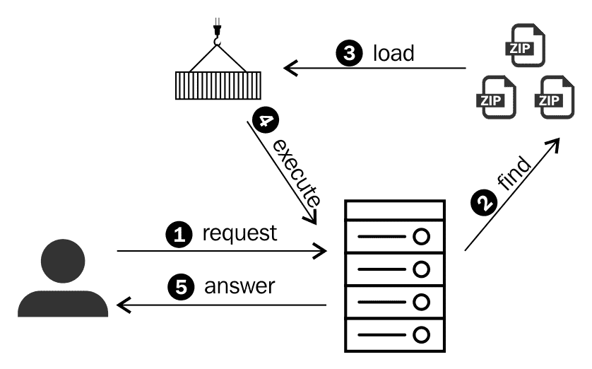
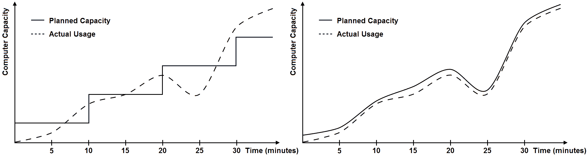
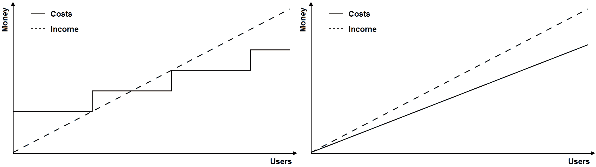

# 第一章：理解无服务器模型

无服务器是一种模型，其中开发者不需要担心服务器：配置、维护或更新都不是他们的职责。尽管这不是一个全新的概念，但如今提供的服务要强大得多，能够支持更广泛的应用。如果你想构建成本效益高且可扩展的解决方案，你应该深入了解这个主题，并理解它是如何工作的。

在本章中，我们将涵盖以下主题：

+   什么是无服务器？

+   无服务器的主要目标

+   优缺点

+   用例

在这一章之后，你将准备好开始我们的动手实践，构建一个在线商店演示应用程序，每章一个部分。

# 介绍无服务器

无服务器可以是一个模型、一种架构类型、一种模式，或者你喜欢的任何其他称呼。对我来说，无服务器是一个形容词，一个修饰**思维方式**的词。它是一种抽象你编写的代码将如何执行的方式。**无服务器思维**就是不在服务器上思考。你编写代码，进行测试，部署，这就（几乎）足够了。

无服务器是一个热门词汇。你仍然需要服务器来运行你的应用程序，但你不必过于担心它们。维护服务器不是你的职责。重点是开发和编写代码，而不是运营。

DevOps 仍然有必要，尽管作用较小。你需要自动化部署，并至少对应用程序的运行情况和成本进行最小限度的监控，但你不需要启动或停止机器以匹配使用量，也不需要替换失败的实例或为操作系统应用安全补丁。

# 无服务器思维

无服务器解决方案完全是**事件驱动的**。每次用户请求一些信息时，一个触发器会通知你的云服务提供商选择你的代码并执行它以检索答案。相比之下，传统的解决方案也用于响应请求，但代码始终处于运行状态，消耗着专门为你预留的机器资源，即使没有人使用你的系统。

在无服务器架构中，没有必要将整个代码库加载到运行机器中以处理单个请求。为了加快加载步骤，只选择必要的代码来运行。这个解决方案的小部分被引用为**函数**。因此，我们只在需要时运行函数。

虽然我们简单地称之为函数，但它通常是一个包含运行入口点及其依赖项的代码片段的压缩包。

在以下图中，无服务器模型通过一系列步骤进行说明。这是一个云服务提供商如何实现该概念的示例，尽管它不必以这种方式实现：

让我们理解前面图中显示的以下步骤：

1.  用户向由云服务提供商处理的地址发送请求。

1.  根据消息，云服务试图定位必须使用哪个包来回答请求。

1.  包（或函数）被选中并加载到 Docker 容器中。

1.  容器被执行并输出答案。

1.  答案将发送给原始用户。

无服务器模型之所以有趣，在于你只需为执行函数所需的时间付费，通常以秒的分数来衡量，而不是按小时使用。如果没有人使用你的服务，你将不支付任何费用。

此外，如果你应用程序的用户访问量突然激增，云服务将加载不同的实例来处理所有并发请求。如果其中一台云机器出现故障，另一台将自动提供，无需进行任何配置。

# 无服务器和 PaaS

无服务器架构经常被与**平台即服务**（**PaaS**）混淆。PaaS 是一种云计算模型，允许开发者无需担心基础设施即可部署应用程序。根据这个定义，它们有相同的宗旨！确实如此。无服务器架构就像是 PaaS 的重新命名，或者你也可以称之为 PaaS 的下一代。

PaaS 和无服务器之间的主要区别在于，在 PaaS 中，你不需要管理机器，但你将根据配置机器来收费，即使没有用户正在浏览你的网站。在 PaaS 中，你的代码始终在运行并等待新的请求。在无服务器中，有一个服务正在监听请求，并且只有在必要时才会触发你的代码运行。这一点在账单中得到了体现。你只需为代码执行的时间和向该监听器发出的请求数量付费。此外，无服务器在调用之间具有不可变的状态，因此对于每一次调用都是一个全新的环境。即使容器在后续调用中被重复使用，文件系统也会被更新。

# IaaS 和本地部署

除了 PaaS 之外，无服务器架构经常与**基础设施即服务**（**IaaS**）和本地部署解决方案进行比较，以展示其差异。IaaS 是另一种部署云解决方案的策略，你租用虚拟机并允许连接到它们以在虚拟操作系统中配置所需的一切。它为你提供了更大的灵活性，但同时也带来了更多的责任。你需要应用安全补丁、处理偶尔的故障，并设置新的服务器以处理使用高峰。此外，无论你使用机器 CPU 的 5%还是 100%，你都将按小时付费。

本地化是传统的解决方案类型，其中你购买物理计算机并在公司内部运行它们。这种方法提供了完全的灵活性和控制。托管自己的解决方案可能更便宜，但这仅在你的流量使用极其稳定的情况下才会发生。过度或不足配置计算机的情况很常见，以至于使用这种方法很难真正获得收益，尤其是在你需要雇佣一个团队来管理这些机器时。云服务提供商可能看起来很昂贵，但几个详细的使用案例证明，在云上运行的投资回报率（ROI）比本地化更高。使用云时，你可以从许多巨型数据中心的经济规模中受益。自行运行会暴露你的业务于一系列你永远无法预料的广泛风险和成本。

# 无服务器的主要目标

要将一项服务定义为无服务器，它必须至少具备以下特性：

+   **按需扩展**：没有过度或不足配置

+   **高可用性**：它具有容错性并且始终在线

+   **成本效益**：你永远不会为闲置的服务器付费

# 扩展性

使用 IaaS，你可以通过任何云服务实现无限的扩展性。随着你的使用增长，你只需要雇佣新的机器。你也可以根据需求的变化自动启动和停止服务器。但这并不是快速扩展的方法。当你启动一台新机器时，通常需要等待大约 5 分钟，它才能被用于处理新的请求。此外，由于启动和停止机器的成本较高，你只有在确定需要时才会这样做。因此，你的自动化流程会在采取任何行动之前等待几分钟，以确认你的需求是否发生了变化。

**无限扩展性**被用作一种方式来强调你通常可以增长，而不用担心云服务提供商是否有足够的容量提供。但这并不总是正确的。每个云服务提供商都有其限制，如果你在考虑大型应用程序，你必须考虑这些限制。例如，AWS 将特定类型的运行虚拟机（IaaS）的数量限制为 20 台，并将并发 Lambda 函数（无服务器）的数量限制为 1,000。

IaaS 能够很好地处理良好的使用变化，但它无法处理在公告或营销活动之后发生的意外高峰。使用无服务器，你的扩展性是以毫秒计，而不是以分钟计。除了可扩展性外，它扩展得非常快。此外，它按调用进行扩展，无需配置容量。

当你考虑以分钟为单位的频繁高使用率时，IaaS 在满足所需容量方面会感到困难，而无服务器可以在更短的时间内满足更高的使用率。

在下面的图表中，左侧图表显示了 IaaS 如何实现扩展性。右侧图表显示了使用无服务器解决方案满足需求的效果：

使用本地化方法，这是一个更大的问题。随着使用量的增长，必须购买和准备新的机器，但增加基础设施需要创建和批准采购订单，你需要等待新服务器到达，并且你需要给你的团队时间来配置和测试它们。这可能需要几周的时间来增长，如果公司非常大并且需要填写许多步骤和程序，甚至可能需要几个月。

# 可用性

高可用性解决方案是指对硬件故障具有容错能力的解决方案。如果一台机器出现故障，你必须保持应用程序以令人满意的表现继续运行。如果你因为停电而丢失整个数据中心，你必须有另一个数据中心的机器来保持服务在线。高可用性通常意味着复制你的整个基础设施，将每一半放置在不同的数据中心。

高可用性解决方案在 IaaS 和本地化环境中通常非常昂贵。如果你有多台机器来处理你的工作负载，将它们放置在不同的物理位置并运行负载均衡服务可能就足够了。如果一个数据中心出现故障，你将保持剩余机器的流量并扩展以补偿。然而，有些情况下，即使没有使用那些机器，你也需要额外付费。

例如，如果你有一个巨大的垂直扩展的关系型数据库，你最终可能需要支付另一台昂贵的机器作为从机，仅为了保持可用性。即使是 NoSQL 数据库，如果你在一个一致的模式下设置 MongoDB 副本集，你也将为仅作为从机而不用于减轻读请求的实例付费。

而不是运行闲置的机器，你可以将它们设置为冷启动状态，这意味着机器已经准备好了，但关闭以降低成本。然而，如果你运行一个销售产品或服务的网站，即使在短暂的停机时间内，你也可能失去客户。Web 服务器的冷启动可能需要几分钟来恢复，但数据库可能需要更多的时间。

考虑这些场景，在无服务器中，你可以免费获得高可用性。成本已经包含在你支付的使用费用中。

可用性的另一个方面是如何处理**分布式拒绝服务**（**DDoS**）攻击。当你在一个非常短的时间内接收到大量的请求时，你该如何处理？有一些工具和技术可以帮助减轻这个问题，例如，将超过特定请求速率的 IP 地址列入黑名单，但在这些工具开始工作之前，你需要扩展解决方案，并且它需要非常快速地扩展以防止可用性受损。在这方面，无服务器具有最佳的扩展速度。

# 成本效益

无法匹配流量使用与配置的量。在 IaaS 或本地部署的情况下，一般来说，CPU 和 RAM 的使用率必须始终低于 90%，机器才能被认为是健康的，理想情况下，CPU 的使用率应该低于 20%的正常流量。在这种情况下，当容量处于空闲状态时，你正在为 80%的浪费付费。为不使用的计算机资源付费是不高效的。

许多云服务提供商宣传你只需为使用的部分付费，但通常在长期（一年或更长时间）为 24 小时正常运行时间提供显著折扣。这意味着即使是在非常低流量的时段，你也需要为持续运行的机器付费。此外，即使你想关闭机器以降低成本，你也必须至少保持最小基础设施的 24/7 在线状态，以保持你的 Web 服务器和数据库始终在线。至于高可用性，你需要额外的机器来增加冗余。再次强调，这是资源的浪费。

另一个效率问题与数据库有关，尤其是关系型数据库。垂直扩展是一个非常麻烦的任务，因此关系型数据库总是根据最大峰值来配置。这意味着当大多数时间你不需要一台昂贵的机器时，你仍然需要为它付费。

在无服务器中，你不需要担心配置或空闲时间。你应该支付实际使用的 CPU 和 RAM 时间，以秒的分数计算，而不是按小时计算。如果是一个无服务器数据库，你需要永久存储数据，所以即使没有人使用你的系统，这也代表了一种成本。然而，与 CPU 时间相比，存储非常便宜。更高的成本是运行查询的数据库引擎所需的 CPU，它将根据使用时间收费，不考虑空闲时间。

无服务器系统连续运行一小时的成本比传统基础设施高得多。然而，区别在于无服务器是为具有可变使用量的应用程序设计的，你永远不会让一台机器连续一小时保持 100%的负载。无服务器的成本效率在流量平稳的网站上并不明显。

# 无服务器架构的优缺点

在本节中，我们将探讨与无服务器计算相关的各种优缺点。

# 优点

我们可以列出以下优势：

+   快速可扩展性

+   高可用性

+   资源的高效使用

+   降低运营成本

+   专注于业务，而非基础设施

+   系统安全外包

+   持续交付

+   微服务友好

+   成本模型适合初创企业

让我们跳过前三个优点，因为它们已经在之前的页面中讨论过了，让我们看看其他的。

# 降低运营成本

由于基础设施完全由云服务提供商管理，因此它降低了运营成本，因为你不必担心硬件故障、为操作系统应用安全补丁或修复网络问题。这意味着你需要花费更少的系统管理员时间来保持应用程序运行。

此外，它还有助于降低风险。如果你投资部署一项新服务，结果却失败了，你不必担心销售机器或处理你已建立的数据中心。

# 专注于业务

精益软件开发指出，你必须花时间在最终产品中增加价值的地方。在无服务器项目中，重点是业务。基础设施是第二位的。

配置大型基础设施是一项既昂贵又耗时的任务。如果您想通过**最小可行产品**（**MVP**）来验证一个想法，而又不想浪费市场时间，考虑使用无服务器架构来节省时间。有一些工具可以自动化部署，我们将在整本书中使用这些工具，并看看它们如何帮助开发者以最小的努力推出原型。如果这个想法失败了，由于没有预先支付费用，基础设施成本也会最小化。

# 系统安全

云服务提供商负责管理操作系统的安全、运行时、物理访问、网络以及所有使平台运行的相关技术。开发者仍然需要处理身份验证、授权和代码漏洞，但其余的都外包给了云提供商。如果你考虑到一个由大量专家组成的大型团队专注于实施最佳安全实践，并尽快修补新漏洞以服务他们的数百名客户，这是一个积极的特性。这就是规模经济的定义。

# 持续交付

无服务器架构基于将一个大项目拆分成数十个包，每个包由一个顶级函数表示，该函数处理请求。部署函数的新版本意味着上传一个 ZIP 文件来替换之前的版本，并更新事件配置，该配置指定了如何触发此函数。

手动执行这个任务，对于数十个函数来说是一项令人筋疲力的工作。在无服务器项目中工作，自动化是一个必不可少的特性。在这本书中，我们将使用 Serverless Framework，它帮助开发者管理和组织解决方案，使得部署任务变得像执行一条命令一样简单。有了自动化，持续交付是一个带来许多好处的功能，例如可以随时部署、缩短开发周期以及更容易回滚。

当部署自动化时，另一个相关的益处是创建不同的环境。你可以使用简单的命令创建一个新的测试环境，它是开发环境的精确副本。能够复制环境对于构建验收测试和从部署到生产的进展非常重要。

# 微服务友好

微服务是一个将在本书稍后更好地讨论的主题。简而言之，在无服务器项目中鼓励使用微服务架构。由于你的函数是单个部署单元，你可以让不同的团队在不同的用例上同时工作。你还可以在同一个项目中使用不同的编程语言，并利用新兴技术或团队技能。

# 成本模型

假设你已经使用无服务器构建了一个在线商店。平均用户会发出一些请求来查看一些产品，以及更多的请求来决定他们是否会购买。在无服务器中，单个代码单元对于给定的输入有一个可预测的执行时间。收集一些数据后，你可以预测单个用户平均的成本，并且随着你的应用程序使用量的增长，这个单位成本几乎保持不变。

知道单个用户成本是多少，并保持这个数字固定对于初创公司非常重要。这有助于决定你需要为服务收费多少，或者通过广告或销售赚取多少利润以获得利润。

在传统基础设施中，你需要预先支付费用，并且扩展你的应用程序意味着以步骤增加你的容量。因此，计算用户的单位成本是一个更困难的任务，并且是一个变量数字。

在下面的图中，左侧显示了具有阶梯式成本的传统基础设施，右侧描绘了具有线性成本的无服务器基础设施：

# 缺点

无服务器很棒，但没有技术是一劳永逸的。你应该意识到以下问题：

+   更高的延迟

+   约束

+   隐藏的低效率

+   供应商依赖

+   调试困难

+   原子部署

+   不确定性

我们现在将详细讨论这些缺点。

# 更高的延迟

无服务器是事件驱动的，因此你的代码并不是一直在运行。当一个请求被发起时，它会触发一个服务来找到你的函数，解压包，将其加载到容器中，并使其可执行。问题是这些步骤需要时间：多达几百毫秒。这个问题被称为冷启动延迟，是服务器无服务器成本效益模型和传统托管较低延迟之间的权衡。

有一些解决方案可以最小化这种性能问题。例如，你可以配置你的函数以预留更多的 RAM 内存。这会提供更快的启动和整体性能。编程语言也很重要。Java 的冷启动时间比 JavaScript（Node.js）长。

另一种解决方案是利用云服务提供商可能缓存已加载代码的事实，这意味着第一次执行会有延迟，但后续请求将受益于更小的延迟。你可以通过将大量功能聚合到一个函数中来优化无服务器函数。好处是，这个包将以更高的频率执行，并且经常跳过冷启动问题。问题是，大包加载需要更多时间，并且会导致更高的首次启动时间。

作为最后的手段，你可以安排另一个服务定期 ping 你的函数，例如每 5 分钟一次，以防止它们进入休眠状态。这将增加成本，但可以消除冷启动问题。

此外，还有一个无服务器数据库的概念，它指的是数据库完全由供应商管理的服务，并且仅按存储和执行数据库引擎的时间收费。这些解决方案很棒，但它们为你的请求增加了第二层延迟。

# 约束条件

如果你转向无服务器架构，你需要了解供应商的约束条件。例如，在 AWS 上，你不能运行超过 5 分钟的 Lambda 函数。这是有道理的，因为如果你长时间运行代码，你就是在错误地使用它。无服务器架构旨在在短时间内以成本效益的方式运行。对于持续和可预测的处理，它将非常昂贵。

AWS Lambda 的另一个约束是给定区域内所有函数的并发执行数量。亚马逊将其限制为 1,000。假设你的函数平均需要 100 毫秒来执行。在这种情况下，你可以处理每秒多达 10,000 个用户。这个限制背后的原因是避免由于编程错误可能造成的潜在跑道或递归迭代导致的过度成本。

AWS Lambda 有一个默认的 1,000 个并发执行的限制。然而，你可以向 AWS 支持中心提交案例来提高这个限制。如果你表示你的应用程序已经准备好投入生产，并且你理解其中的风险，他们可能会提高这个值。

当使用 Amazon CloudWatch（更多内容请参阅第十章[3c6f35a1-ca69-49db-ba87-f9b37af86ced.xhtml]，*测试、部署和监控*）监控 Lambda 函数时，有一个名为*节流*的选项。每个超过并发调用安全限制的调用都被计为一个节流。你可以配置 CloudWatch 警报，以便在发生这种情况时接收电子邮件。

# 隐藏的低效率

有些人将无服务器视为一种 NoOps 解决方案。这并不正确。DevOps 仍然是必要的。你不必过于担心服务器，因为它们是二等公民，重点在于你的业务。然而，添加指标和监控你的应用程序始终是一种良好的实践。扩展如此容易，以至于一个特定的功能可能会以较差的性能部署，所需时间比必要的多得多，并且永远不被注意，因为没有人在监控操作。

此外，过配或欠配也是可能的（在较小程度上），因为你需要配置你的函数，设置它将保留的 RAM 内存量以及超时执行的阈值。这是一个非常不同的配置规模，但你需要记住这一点以避免错误。

# 供应商依赖

当你构建无服务器解决方案时，你将你的业务托付给第三方供应商。你应该意识到公司会失败，你可能会遭受停机时间、安全漏洞和性能问题。此外，供应商可能会改变计费模式，增加成本，在他们的服务中引入错误，提供糟糕的文档，修改 API 迫使你升级，甚至终止服务。可能会发生许多不好的事情。

你需要权衡的是，是值得信任另一家公司，还是进行大量投资自己构建一切。在选择供应商之前进行市场搜索可以减轻这些问题。然而，你仍然需要依赖运气。例如，Parse 是一家提供具有真正优秀功能的托管服务的供应商。它在 2013 年被 Facebook 收购，由于背后有大型公司的支持，因此提供了更多的可靠性。不幸的是，Facebook 在 2016 年决定关闭所有服务器，给客户一年时间迁移到其他供应商。

供应商锁定是另一个大问题。当你使用云服务时，很可能一个特定的服务与另一个供应商的实现完全不同，从而产生两个不同的 API。如果你决定迁移，你需要重写代码。这已经是一个常见问题。如果你使用托管服务发送电子邮件，在迁移到另一个供应商之前，你需要重写部分代码。这里引起红旗的是，无服务器解决方案完全基于一个供应商，迁移整个代码库可能会更加麻烦。

为了减轻这个问题，一些工具，如 Serverless Framework，支持多个供应商，这使得在它们之间切换变得更容易。多供应商支持代表你的业务安全，并赋予竞争力。

# 调试困难

单元测试无服务器解决方案相当简单，因为你的函数所依赖的任何代码都可以分离成模块并单独进行单元测试。集成测试稍微复杂一些，因为你需要在线测试使用外部服务。

当涉及到调试以测试一个功能或修复一个错误时，这是一个完全不同的问题。你不能连接到外部服务来查看你的代码如何逐步执行。此外，那些无服务器 API 没有开源，所以你不能在内部运行它们进行测试。你所能做的就是记录步骤，这是一个缓慢的调试方法，或者提取代码并将其适应到自己的服务器上，进行本地调用。

# 原子部署

部署一个无服务器函数的新版本很容易。你更新代码，下次触发器请求此函数时，你新部署的代码将被选中运行。这意味着，在很短的时间内，同一函数的两个实例可以同时执行，但实现不同。通常，这不会成为问题，但当你处理持久存储和数据库时，你应该意识到新代码可能会以旧版本无法理解的方式插入数据。

此外，如果你要部署一个依赖于另一个函数新实现的函数，你需要小心部署这些函数的顺序。通常，自动化部署过程的工具并不能保证顺序的安全性。

这里的问题是，当前的无服务器实现认为部署是每个函数的原子过程。你不能原子性地批量部署一组函数。你可以通过在部署特定组时禁用事件源来减轻这个问题，但这意味着在部署过程中引入了停机时间。另一个选择是，对于无服务器应用程序，使用单体方法而不是微服务架构。

# 不确定性

无服务器仍然是一个相对较新的概念。早期采用者正在勇敢地进入这个领域，测试哪些可行，以及哪些模式和可以使用的技术。新兴的工具正在定义开发过程。供应商正在发布和改进新的服务。人们对未来抱有很高的期望，但未来尚未到来。当涉及到构建大型应用程序时，一些不确定性仍然让开发者感到担忧。成为先驱可能会带来回报，但也存在风险。

技术债务是一个将软件开发与金融比较的概念。短期内最容易的解决方案并不总是最好的整体解决方案。当你最初做出错误的决定时，你会在以后用额外的时间来修复它。软件并不完美。每个架构都有其优点和缺点，长期来看都会产生技术债务。问题是：无服务器将多少技术债务聚集到软件开发过程中？是更多、更少，还是与你今天使用的架构相当？

# 用例

在本节中，我们将讨论哪些用例更适合无服务器环境，哪些你应该避免。由于这个概念仍在发展，仍然有一些未映射的应用程序，你不应该受到限制。所以请自由发挥你的创造力，思考和尝试新的用例。

# 静态网站

让我们看看以下几个静态网站的例子：

+   公司网站

+   站点展示

+   博客

+   在线文档

静态托管是最简单也是最古老的免服务器托管方式。根据定义，静态网站不需要服务器端逻辑。你只需要将你的网站 URL 映射到 HTML 文件上。在这本书中，我们将使用 Amazon S3 来分发 HTML、CSS、JavaScript 和图片文件。通过使用 Amazon Route 53，你赋予 AWS 将所有域名请求路由到一个充当简单且低成本文件系统的 S3 桶的权利。

在存储系统上托管静态文件是目前最好的解决方案。它便宜、快速、可扩展、高度可用。没有任何缺点。没有冷启动功能，没有调试，没有不确定性，更换供应商也是一个简单的任务。

如果你正在考虑使用 WordPress 来构建静态网站，请重新考虑。你需要启动一个服务器来运行一个网络服务器和一个存储数据的数据库。你开始每月支付几美元来托管一个基本网站，而随着受众的增加，成本会大幅增加。为了可用性，你会添加另一台机器和一个负载均衡器，账单至少每月几十美元。此外，由于 WordPress 被广泛使用，它成为黑客攻击的大目标，你将不得不担心 WordPress 及其插件的定期安全补丁。

那么，你应该如何使用免服务器的方式来构建一个静态网站呢？如今，有数十种工具。我个人推荐**Jekyll**。你可以免费托管在 GitHub pages 上，使用**Disqus**来处理博客评论，并且可以轻松找到许多其他插件和模板。对于我的个人博客，我更喜欢使用 Amazon，因为它可靠性高，我每月只需支付几美分。如果你愿意，你还可以添加 CloudFront，这是一个**内容分发网络**（**CDN**），通过将用户近似到你的网站文件来减少延迟。

# 精简网站

一旦你学会了如何构建免服务器网站，将一个想法转化为运行中的服务会非常快，从而消除了准备基础设施的负担。遵循精益哲学，你的原型以最小的浪费和最大的速度进入市场，以验证一个概念。

# 小型电子商务网站

在本节中，我使用了限定词**小**。这是因为有许多研究将页面加载时间与客户购买的可能性相关联。几十分之一秒的延迟可能会导致销售额的损失。如前所述，免服务器托管可以降低成本，但冷启动延迟可能会增加页面渲染的时间。面向用户的应用程序必须考虑这种额外的延迟是否值得。

如果电子商务只针对一个国家的特定小众客户群销售，那么流量很可能在白天集中，而在深夜几乎为零。这种用例非常适合免服务器托管。不频繁的访问是节省成本的主要部分。

一个真实的故事描述了 Reddit 上的这个用例。零售服装公司 Betabrand 与 Valve 合作，销售一些产品以推广一款游戏。Valve 创建了一篇博客文章来宣传这笔交易，但几分钟后，网站因为无法处理大量用户的即时峰值而崩溃。Valve 撤回了文章，Betabrand 的任务是在一个周末内改善他们的基础设施。

Betabrand 通过构建一个使用无服务器的小型网站解决了这个问题。Valve 再次宣传他们，他们能够在 24 小时内处理 50 万用户，峰值达到 5000 个并发用户。文章一开始说初始成本仅为 0.07 美元，但评论中更正为后端成本 4.00 美元，以及传输大（非优化）图片的成本 80.00 美元，这对于如此高流量的情况来说仍然是一个令人印象深刻的低成本（来源：[`www.reddit.com/r/webdev/3oiilb`](https://www.reddit.com/r/webdev/3oiilb))）。

# 临时网站

在本节中，考虑仅用于短期活动（如会议）的网站，这些网站会接待大量访客。他们需要推广活动，显示日程，也许收集电子邮件、评论、照片和其他类型的数据。无服务器有助于处理规模并提供快速开发。

另一个相关的用例是票务网站。假设一场大型、受欢迎的音乐会将在午夜开始售票。你可以预期大量粉丝将同时尝试购买门票。

# 触发处理

一个常见的例子是，一个移动应用程序将图片发送到 RESTful 服务。这张图片被存储，并触发一个函数来处理它，以优化并减小其大小，为桌面、平板电脑和手机创建不同的版本。

# 聊天机器人

大多数聊天机器人非常简单，专为特定用例设计。我们不是构建聊天机器人来通过图灵测试。我们不希望它们变得如此复杂和聪明，以至于欺骗人类认为它是另一个人在说话。我们想要的只是提供一个新的用户界面，以便在特定条件下更容易与系统交互。

你可以通过使用菜单和选项的应用程序订购披萨，也可以输入一条消息，比如“我想点一份小辣味披萨”，然后快速完成你的订单。如果用户输入“今天会下雨吗？”，披萨聊天机器人回答“我理解不了。你今天想吃什么披萨？我们有 X、Y 和 Z。”这些广泛的问题留给了多用途 AI 机器人，如 Siri、Cortana 或 Alexa。

考虑到这种受限的场景，无服务器后端可能非常有用。实际上，越来越多的演示和实际应用正在使用无服务器来构建聊天机器人。

# 物联网后端

**物联网（IoT**）是一个热门话题，许多云服务提供商都提供工具，可以轻松连接大量设备。这些设备通常需要通过一系列简单消息进行通信，并需要一个后端来处理它们。考虑到这种用例，亚马逊提供了 AWS IoT 作为无服务器服务来处理消息的广播，以及 AWS Lambda 进行无服务器处理。配置和管理这些服务非常简单，因此它们正在成为物联网系统的常见选择。

# 计划事件

你可以设置代码以定期、计划的方式执行。你不需要运行一台专门的机器来每小时执行一次代码，这可能会产生一些数据库读取或小文件处理，你可以使用无服务器并节省成本。

实际上，这是一个将无服务器功能引入现有解决方案的绝佳方法，因为计划中的事件通常由分离模块中的简单任务组成。

# 大数据

越来越多的应用程序正在用无服务器工具替代传统的 Hadoop 和 Spark 等大数据工具。你不再需要管理机器集群，而是可以创建一个大数据管道，将输入转换为数据流，并将数据块加载到并发无服务器函数中。

这种方法的优点是管理成本降低且易于使用。然而，由于你有一个持续的数据处理过程，你可以预期更高的成本。此外，在 AWS 上，Lambda 函数的运行时间不能超过 5 分钟，这个限制可能迫使你在处理之前将数据块的大小减小。

# 你应该避免的内容

避免具有以下特征的应用程序：

+   需要大量 CPU 且运行时间长的任务

+   持续且具有可预测的流量

+   实时处理

+   需要多人参与的游戏

关于多人游戏，你可以构建一个无服务器后端，通过无服务器通知以极低的延迟处理玩家之间的通信。它支持回合制和卡牌游戏，但可能不适合需要持续和频繁服务器端处理的第一人称射击游戏等。

# 摘要

在本章中，你了解了无服务器模型以及它与其他传统方法的区别。你已经知道主要的好处以及它可能为你的下一个应用程序提供的优势。你也意识到没有技术是万能的。你知道你可能会遇到哪些与无服务器相关的问题以及如何减轻其中的一些问题。

现在你已经了解了无服务器模型，我们准备深入了解你可以用来构建无服务器应用程序的工具和服务。在下一章中，你将学习 AWS 提供的哪些服务可以被视为无服务器，随后将简要解释它们的工作原理以及一系列代码示例。
