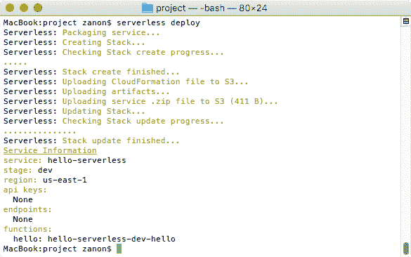

# 第三章：使用 Serverless Framework

在开发无服务器项目时，你可以将多个功能组合成一个大的 Lambda 函数，或者将每个功能拆分成它自己的小函数。如果你选择第二种方案，你最终将管理数十个不同的函数的部署，每个函数都有其自己的配置和依赖。自动化这个过程可能是一个真正的挑战，但当你使用 Serverless Framework 作为你的工作流程时，它就变得容易多了。除了处理发布过程外，该框架还帮助您构建解决方案并管理不同的环境，并为基础设施版本化提供了一种干净简洁的语法。

在本章中，你将学习如何配置和使用 Serverless Framework。我们将涵盖以下主题：

+   如何设置和使用框架

+   部署 hello-world 应用程序

+   创建端点和启用 CORS

+   配置事件以触发函数

+   访问其他 AWS 资源

在本章之后，你将学会如何构建无服务器项目后端的基本知识。

# Serverless Framework

已经开发了许多工具来帮助管理无服务器项目。Serverless Framework 目前是最受欢迎的，本书将广泛使用它。本节将帮助你配置、使用和理解它如何融入你的工作流程。

# 理解 Serverless Framework

Serverless Framework 是一个强大的 Node.js 命令行工具，而不是云服务。它的目标是帮助开发者通过简化他们使用和管理云资源的方式，提高他们的生产力。它提供了一套命令，可以帮助你快速启动一个新项目，添加函数、端点、触发器、配置权限等。总的来说，该框架将管理你的项目，自动化你的代码部署，并与许多不同的服务集成：


我们有以下输入：

+   **集成**：描述了不同的云服务将如何触发我们的 Lambda 函数

+   **配置**：为 Lambda 函数设置权限，并定义它们将在其下运行的限制（超时和 RAM 内存）

+   **插件**：通过自定义代码扩展框架功能

这是该框架提供的内容：

+   **架构**：帮助定义一个将保持我们的项目一致性的架构。

+   **部署**：自动化代码部署。你可以通过一个命令随时部署。

+   **版本化**：帮助版本化代码配置，这意味着版本化基础设施。将相同的架构复制到另一个区域或环境是一个简单的任务。

目前，它支持以下云服务提供商：AWS、Microsoft Azure、Google Cloud Platform 和 IBM OpenWhisk。从一个云迁移到另一个云是可能的，但这并不简单。该框架使用相同的命令进行管理任务，并试图使用类似的设置，但每个都需要不同的配置和设置。

另一个重要特征是，Serverless Framework 是开源的，并拥有 MIT 许可证，因此它可以免费使用，即使在商业产品中也是如此。

# 其他框架

无服务器是一种促进应用程序开发的概念，无需担心将运行这些应用程序的服务器。这是一个概念，并不指定将使用的工具，也不指定托管应用程序的云服务提供商。然而，利用这个词汇的热潮，**JAWS** 的创造者在 2015 年底将他们的项目重命名为 **Serverless Framework**，并购买了 [serverless.com](https://serverless.com) 域名。为了进一步提高他们的开源项目，他们成立了一家名为 *Serverless, Inc* 的风险投资公司。

目前，Serverless Framework 是构建通用无服务器项目的最佳工具，但**不要**将产品与概念混淆。该框架推广无服务器应用程序，但仅提供您可以使用无服务器执行的部分功能。还有许多其他服务和框架，它们具有不同的功能和目标。

例如，Apex 是另一个用于管理 AWS Lambda 函数的框架，它具有一个有趣的功能，即提供对 Go、Rust 和 Clojure 的支持，即使 Lambda 本身没有原生支持。还有数十种其他工具。更多选项，您可以查看这个精选列表：[`github.com/anaibol/awesome-serverless`](https://github.com/anaibol/awesome-serverless)。

# 安装框架

由于 Serverless Framework 使用 Node.js，您可以使用 npm 来安装它：

```js
npm install serverless@1.x --global

```

`@1.x` 后缀指示 npm 下载与 1.x 版本兼容的包。这种限制建议是因为这本书是在框架的 1.18 规范之后编写的，示例可能不与未来的 2.x 版本兼容。

Serverless Framework 需要 Node.js v6.5 或更高版本。请确保您有一个更新的版本。您可以通过运行 `node --version` 来检查。如果您需要更新 Node 版本，请考虑使用 v6.10，因为这是 AWS 用于运行 Lambda 函数的最新版本。

要确认框架已成功安装，您可以通过运行以下命令来检查其版本：

```js
 serverless --version

```

除了使用 `serverless` 命令外，您还可以使用缩写 `sls` 来使用所有命令。例如，`sls --version`。

此外，对于以两个短横线开头的每个选项，例如在 `--version` 中，总会有一个使用单个字母的更短替代选项，例如本例中的 `-v`。

# 配置框架

Serverless 框架使用 AWS SDK 来管理你的账户资源，因此所需的配置是将你的凭证设置在 SDK 可以访问它们的地方。如第二章，“AWS 入门”，所述，我们已经创建了一个用户，并将其**访问密钥**和**秘密访问密钥**设置到环境变量中。

这里缺少的是正确限制用户访问。为了学习目的，使用具有完全访问权限的管理员账户是完全可以接受的。然而，如果你正在构建真实的产品，请遵循最小权限原则，只为框架预期使用的功能设置访问权限。在上一章中，你学习了如何使用 IAM 控制台配置它（[`console.aws.amazon.com/iam`](https://console.aws.amazon.com/iam)）。

最小访问要求是**Lambda**、**CloudFormation**、**IAM**和**CloudWatch**。在设置权限时，你可以预测并授予我们样本项目中将来需要的访问权限。框架还需要访问**API Gateway**、**IoT**、**SimpleDB**和**DynamoDB**。

# 在团队中管理权限

在团队工作中，每个人都必须拥有自己的用户，以便拥有细粒度的权限集合。此外，它还允许审计和可追溯性，这两者都非常重要。审计可以阻止团队成员的不当行为，而可追溯性在不幸的情况下很有用，例如，如果你的网站遭到入侵，你可以发现入侵的源头。如果你想要这些功能，你必须配置**AWS CloudTrail**以将 AWS API 使用日志文件存储到 S3 中。

如果每个团队成员都有一个唯一的账户，你可以限制对生产环境的访问权限，仅限于一小群人。对生产环境的访问是一项重大的责任，应该只托付给有经验的人，以避免由于分心或知识不足而导致的失败。

# 创建新项目

让我们先创建一个新的文件夹来存储我们的项目数据。将其命名为`hello-serverless`并将命令提示符目录设置为该文件夹。现在，运行以下命令：

```js
serverless create --template aws-nodejs --name hello-serverless

```

看一下下面的截图：


此命令创建一个用于分组相关函数的*服务*。你可以将服务比作**领域驱动设计**（**DDD**）中定义的边界上下文。例如，在这本书中，样本应用是一个在线商店。我们可以说，将用于展示产品和处理销售的功能属于一个上下文。处理用户账户和配置文件数据的功能属于另一个上下文。我们将在第六章，“开发后端”中讨论无服务器架构。

执行命令后，将创建以下两个文件：

+   `handler.js`文件

+   `serverless.yml`文件

让我们看看每个配置的上下文，并了解它们的作用。

# handler.js 文件

此文件包含将由 AWS Lambda 执行的主要函数。对于简单示例，考虑以下代码：

```js
    module.exports.hello = (event, context, callback) => 
    {

        const response =
        {
              statusCode: 200,   
              body: JSON.stringify({
                  message: `Hello, ${event.name}!`
            })
        };

        callback(null, response);
    };

```

我们的 `response` 对象具有 `statusCode` 和 `body` 属性。当您想使用 API Gateway 触发 Lambda 函数，或者当 Lambda 配置为代理（这是在 Serverless 框架中选择的默认选项）时，此架构是必需的。与在 API Gateway 中配置头、状态码和其他参数相比，Lambda 代理设置允许将这些配置作为代码的一部分。这对于大多数用例是推荐的做法。

命名为 `hello` 的函数将被配置为我们的主要入口。它接收 `event`、`context` 和 `callback` 三个参数。`event` 变量是我们的输入数据，`callback` 是在 Lambda 执行完成后必须执行并接收错误对象作为第一个参数、`response` 对象作为第二个参数的函数，`context` 是一个提供与我们的函数执行相关的数据的对象。以下是一个 `context` 内容的示例，以 JSON 格式显示：

```js
    {
      "callbackWaitsForEmptyEventLoop": true,
      "logGroupName": "/aws/lambda/hello-serverless-dev-hello",
      "logStreamName":
        "2017/07/15/[$LATEST]01a23456bcd7890ef12gh34i56jk7890",
      "functionName": "hello-serverless-dev-hello",
      "memoryLimitInMB": "1024",
      "functionVersion": "$LATEST",
      "invokeid": "1234a567-8901-23b4-5cde-fg67h8901i23",
      "awsRequestId": "1234a567-8901-23b4-5cde-fg67h8901i23",
      "invokedFunctionArn": "arn:aws:lambda:us-east-1:1234567890:
        function:hello-serverless-dev-hello"
    }

```

在这个例子中，我们返回 `状态码 200 (OK)`，响应 `body` 将返回一个使用事件作为输入变量的消息。

# serverless.yml 文件

这是一个使用 YAML 标准的配置文件，其目的是使人类更容易阅读。YAML 的名字是一个递归缩写，意味着 *YAML Ain't Markup Language*。

当我们创建服务时，我们使用了 `aws-nodejs` 参数。它创建了一个包含以下内容的文件：

```js
    service: hello-serverless

    provider:
      name: aws
      runtime: nodejs6.10

    functions:
      hello:
        handler: handler.hello

```

让我们看看前面代码示例中描述的以下设置：

+   `service`: 这只是我们在创建服务时指定的服务名称。

+   `provider`: 这设置了云提供商和运行时。我们选择了 AWS 和可用的最新 Node.js 版本。

+   `functions`: 这里是我们定义 Lambda 函数的地方。

还有更多选项可用，但我们将根据需要介绍它们。

# 配置 Lambda 限制

在设置 `serverless.yml` 文件时，您可以配置您的函数限制。RAM 内存大小默认值为 1,024 MB。可能的值范围从 128 MB 到 1,536 MB，以 64 MB 为增量。

另一个可能的设置是 `timeout` 属性。如果您的函数超过预期时间，它将被终止。默认值为 6 秒，可能的值范围从 1 秒到 300 秒（5 分钟）：

```js
    functions:
      hello:
        handler: handler.hello
        memorySize: 128 # measured in megabytes
        timeout: 10 # measured in seconds

```

在 YAML 语法中，注释以井号 (`#`) 开头，并持续到行尾。

您也可以通过修改提供商设置来更改默认值。当您的函数未指定这些值时，将使用这些值：

```js
    provider:
      name: aws
      runtime: nodejs6.10
      memorySize: 512
      timeout: 30

```

# 部署一个服务

部署一个服务是一个简单的任务。我们只需要运行以下命令：

```js
 serverless deploy

```

您可以在以下屏幕截图中看到结果：



默认情况下，它将在名为`dev`的阶段和名为`us-east-1`的区域中部署您的函数。`阶段`用于模拟不同的环境。例如，您可以创建一个用于开发，另一个用于`生产`，或者如果您想创建版本化的 API，您可以使用一个用于`v1`，另一个用于`v2`。至于区域，它用于标识将用于托管 Lambda 函数的哪个 AWS`区域`。

这里有两个选项来更改默认值：

+   第一种方法是修改`serverless.yml`文件，如下面的代码示例所示：

```js
        provider:
          name: aws
          runtime: nodejs6.10
          stage: production
          region: eu-west-1

```

+   第二种方法是使用部署命令的参数：

```js
 serverless deploy --stage production --region eu-west-1

```

在`provider`下，您可以将配置文件设置为`dev`阶段，只有当您想部署到`生产`时，您可以使用命令行中的阶段参数来这样做。对于不同的环境使用两种不同的方法是一种避免错误的好方法。

当我们使用`deploy`命令时，即使是对于小型项目，执行也可能需要几分钟。性能问题与 CloudFormation 有关，它需要在 AWS 机器之间更新堆栈。在第一次部署函数后，我们可以使用`deploy function`命令进行代码更新，因为这个命令将简单地交换函数的 ZIP 包。由于它不需要执行任何 CloudFormation 代码，这是一种部署更改的更快方式。以下示例显示了如何使用此命令：

```js
 serverless deploy function --function hello

```

总是记得使用`deploy function`命令更新函数的代码以实现快速部署。如果您需要更新任何类型的配置，例如权限或 Lambda 限制，您需要运行`deploy`命令（不带`function`部分）。

# 调用函数

我们刚刚创建并部署了一个 Lambda 函数。现在，让我们通过以下步骤来查看这个函数如何被调用：

1.  在您的项目文件夹中，创建一个包含以下内容的`event.json`文件。此文件将作为我们的输入数据：

```js
        {
          "name": "Serverless"
        }

```

1.  下一步是调用函数并确认其按预期工作。您可以通过执行`invoke`命令来完成此操作：

```js
 serverless invoke --function hello --path event.json

```

将`event.json`文件作为输入不是强制性的。我们之所以使用它，是因为我们的示例使用输入数据来创建`response`对象。

以下截图显示了调用结果：


1.  如果您将函数部署到多个阶段/区域，您可以通过明确指定阶段/区域来调用它们。例如，看看以下命令：

```js
 serverless invoke --function hello --stage test --region eu-west-1

```

1.  最后一个观察结果是您可以本地调用函数。这个调用将使用您的机器执行函数，而不是运行托管在 AWS 上的函数。为此，只需使用`invoke local`命令：

```js
 serverless invoke local --function hello --path event.json

```

我们稍后将会看到，我们可以为 Lambda 函数授予或限制权限。然而，如果您在本地执行代码，它将不会使用配置的角色。Lambda 将在您的本地 SDK 凭据下执行，因此本地测试 Lambda 可能很有用，但您需要知道您不会使用在函数托管在 AWS 上时将使用的相同权限来测试它。

# 检索日志

当 Lambda 函数由于未处理的异常而失败时，结果将是一个通用的消息：

```js
    {
      "errorMessage": "Process exited before completing request"
    }

```

为了排除错误，我们需要检索执行日志。您可以通过将`--log`选项附加到`invoke`命令来完成此操作：

```js
 serverless invoke --function hello --log

```

这将导致类似于以下错误消息的结果：

```js
    START RequestId: 1ab23cde-4567-89f0-1234-56g7hijk8901
    Version: $LATEST2017-05-15 15:27:03.471 (-03:00) 
        1ab23cde-4567-89f0-1234-56g7hijk8901
 ReferenceError: x is not defined 
 at module.exports.hello (/var/task/handler.js:9:3)
    END RequestId: 1ab23cde-4567-89f0-1234-56g7hijk8901
    REPORT RequestId: 1ab23cde-4567-89f0-1234-
    56g7hijk8901 
    Duration: 60.26 ms
    Billed Duration: 100 ms        
    Memory Size: 128 MB      
    Max Memory Used: 17 MB

    Process exited before completing request

```

除了在调用函数时使用`--log`命令外，您还可以检索已部署但未调用新执行的 Lambda 函数的日志。此命令如下：

```js
 serverless logs --function hello

```

以下是一个包含日志消息示例的截图：


这个功能的一个问题是您*必须*指定函数名称。您无法以通用视图查看所有函数的执行情况，这在拥有数十个函数的项目中可能是理想的。

当在生产环境中运行时，使用命令行来监视日志可能会很麻烦。您可以使用`--filter string`命令来减少结果数量，只显示包含特定字符串的消息。这在查找错误消息时很有用，例如，使用`--filter Error`。

`--filter string`选项是区分大小写的。如果您想查找错误消息，请使用`--filter Error`，因为大多数异常消息将以大写字母开头的错误词开始，例如：`ReferenceError`

另一个选项是按时间过滤。您可以使用`--startTime time`来过滤仅包含最近消息。例如，您可以将“time”替换为`30m`以查看 30 分钟前发生的消息。

看一下下面的示例：

```js
 serverless logs --function hello --filter error --startTime 30m

```

此外，您还可以添加一个监听器，它会输出所有接收到的新的日志消息。在这种情况下，您需要添加`--tail`命令。

这里有一个示例：

```js
 serverless logs --function hello --tail

```

# 添加端点

端点是 API 网关暴露给互联网的地址。

以下步骤展示了如何为我们的 Lambda 示例创建端点：

1.  端点是通过在`serverless.yml`文件中设置 HTTP 事件来添加的。在以下示例中，我们指定在`my-service/resource`路径中使用的`GET` HTTP 动词将触发此 Lambda 函数：

```js
        functions:
          hello:
            handler: handler.hello
 events:
 - http: GET my-service/resource

```

1.  在编辑配置文件后，使用以下命令再次部署服务：

```js
 serverless deploy

```

看一下下面的截图：


这次，除了 Lambda 函数的更新外，`deploy`命令还将创建一个配置了先前路径和方法的 API Gateway 资源。在上一章中，我们部署了一个触发 Lambda 函数的 API Gateway 资源，这需要很多步骤。你现在看到 Serverless Framework 有多强大了吗？如果你有数十个函数和端点，一个命令就足以部署所有这些。这种自动化和易用性使得框架如此有趣。

1.  在前面的屏幕截图中，我们可以看到框架列出了创建的端点地址。它使用以下格式：

```js
https://[key].execute-api.[region].amazonaws.com/[stage]/[path]

```

1.  如果你使用浏览器打开此 URL，你将看到一个包含我们的 hello-world 消息的`response`对象。当使用 API Gateway 时，`event`变量将包含更多数据，添加有关头和请求上下文的信息。其中大部分对我们来说没有用，但我们需要使用`event`对象来找到输入数据。由于这是一个`GET`请求，我们可以在 URL 末尾添加一个查询字符串来传递变量值并检索它们，在`event`对象内部查找`queryStringParameters`属性。看看以下 URL 示例：

```js
        https://[key].execute-api.us-east-1.amazonaws.com/dev/my-service/resource?name=Serverless&foo=bar

```

`?name=Serverless&foo=bar`文件是映射到我们`event`变量`queryStringParameters`属性内的 JSON 对象的查询字符串，如下所示：

```js
        {
          "name": "Serverless",
          "foo": "bar"
        }

```

1.  由于我们现在使用 API Gateway 而不是直接调用 Lambda 函数，接收到的`event`对象将具有不同的属性。在这种情况下，我们需要调整我们的 Lambda 函数以正确处理它。以下示例使用`event.queryStringParameters.name`而不是`event.name`：

```js
        module.exports.hello = (event, context, callback) => {

          const response = {
            statusCode: 200,   
            body: JSON.stringify({
              message: `Hello, ${event.queryStringParameters.name}!`
            })
          };

          callback(null, response);
        };

```

1.  为了测试，重新部署函数，并通过查询字符串浏览端点地址。

我们将在第六章“开发后端”中介绍其他 HTTP 动词。

# 跨源资源共享

如果你尝试通过 Ajax 调用在网站内部调用此 API 地址，它将抛出异常。这是因为 API Gateway 默认没有启用**跨源资源共享**（**CORS**）。CORS 是一种机制，允许从另一个域托管在网页中请求资源。默认情况下，它是禁用的，以强制管理员仅在有意义且针对特定域时才为跨域请求提供权限。

我们正在构建一个将托管在 AWS 内部的网站，但网页将通过我们自己的域名访问，例如[www.example.com](http://www.example.com)，而不是从[www.amazonaws.com](http://www.amazonaws.com)访问。因此，我们需要启用 CORS，以允许我们的前端代码消费我们的服务。如果你有一个仅应由另一个 Lambda 或内部 AWS 服务访问的 Lambda 函数，则不需要 CORS。

要启用 CORS，我们需要修改我们的`handler.js`函数，以包含`"Access-Control-Allow-Origin"`头：

```js
    module.exports.hello = (event, context, callback) => {

      const response = {
        statusCode: 200, 
        headers: {
 "Access-Control-Allow-Origin": "https://www.example.com" },        body: JSON.stringify({
          message: "Hello, ${event.queryStringParameters.name}!"
        })
      };

      callback(null, response);
    };

```

你可以为每个函数添加仅 *一个* 原因。当我们需要支持多个来源时，这是一个问题，而且这个要求非常常见。例如，以下地址被认为是不同的来源，因为它们有不同的协议（HTTP 与 HTTPS）或不同的子域名（无与 www）：

+   `http://example.com`

+   `https://example.com`

+   `http://www.example.com`

+   `https://www.example.com`

要支持多个来源，你需要使用以下命令：

```js
 "Access-Control-Allow-Origin": "*"

```

另一种解决方案，这在传统 Web 服务器中非常常见，是根据你可以在 `event` 对象中找到的 *请求* 头部动态编写 *响应* 头部。如果其来源包含在预定义的白名单中，你可以使用相应的来源构建 `response` 对象。

# 移除服务

完成此示例后，我们可以删除我们的测试函数和 API。`remove` 命令将删除创建的所有 AWS 资源，但会保留项目文件。语法相当简单：

```js
 serverless remove

```

如果你已将服务部署到当前 `serverless.yml` 文件版本中未配置的阶段或区域，你可以使用 `--stage` 和 `--region` 选项来选择性地删除它们：

```js
 serverless remove --stage production --region eu-west-1

```

当你向 API Gateway 进行新的部署时，你会收到一个用于组成你的 API 地址的 API 密钥，例如，`https://[key].execute-api.[region].amazonaws.com`。这个密钥很重要，并将保存在我们的前端代码中。如果你删除服务并重新创建它们，将生成一个新的密钥，前端密钥需要更新。

# 超越基础

在本节中，我们将探讨我们可以使用 Serverless Framework 做些什么。

# 使用 npm 包

当你使用 Serverless Framework 部署你的 Lambda 函数时，它会创建一个包含项目文件夹内所有内容的 ZIP 文件。如果你需要使用不是 Node.js 核心模块或 AWS SDK 的模块，你只需使用 Node 的默认工作流程来添加依赖项。

看看以下步骤：

1.  创建一个 `package.json` 文件来存储你的项目依赖项，并使用 `npm install <your-module> --save` 下载你的所需模块。

1.  在你的项目目录中包含 `node_modules` 文件夹时，ZIP 文件将带有必要的依赖项部署到 AWS。

1.  在以下示例中，文件 `handle.js` 的 Lambda 函数使用了一个名为 `cat-names` 的 npm 模块：

```js
        module.exports.catNames = (event, context, callback) => {

          const catNames = require('cat-names');

          const response = {
            statusCode: 200,   
            body: JSON.stringify({
              message: catNames.random()
            })
          };

          callback(null, response);
        };

```

1.  框架会压缩项目文件夹内找到的所有内容，除了你在 `serverless.yml` 文件中配置为忽略的内容。以下示例使用 `package` 配置来移除一些在项目文件夹中常见但不应包含在 ZIP 文件中的文件：

```js
service: cat-names
        provider:
          name: aws
          runtime: nodejs6.10
        functions:
          catNames:
            handler: handler.catNames
 package:
 exclude:
 - package.json
            - event.json
            - tests/**
 - LICENSE
 - README.md

```

默认情况下，隐藏的文件和文件夹不包括在 ZIP 包中，例如，`.gitignore` 文件和 `.serverless` 文件夹，它们是 serverless 项目的组成部分，不需要显式排除。

1.  要测试，只需使用以下命令部署并调用 `catNames` 函数：

```js
 serverless deploy 
 serverless invoke --function catNames

```

# 访问其他 AWS 资源

默认情况下，Lambda 函数执行时没有任何权限。如果您想访问 S3 桶、DynamoDB 表或任何类型的 Amazon 资源，您的用户必须有权访问它们，并且您必须为您的服务明确授予权限。

此配置在 `serverless.yml` 文件中的 `provider` 标签下完成。以下示例展示了如何为 S3 桶授予权限：

```js
    provider:
      name: aws
      runtime: nodejs6.10
 iamRoleStatements:
 - Effect: "Allow"
 Action:
 - 's3:PutObject'
 - 's3:GetObject'
 Resource: "arn:aws:s3:::my-bucket-name/*"

```

要测试此语句，我们可以修改我们的 `handle.js` 文件，使用以下代码写入和读取文件：

```js
    module.exports.testPermissions = (event, context, callback) => {

      const AWS = require('aws-sdk');
      const s3 = new AWS.S3();
      const bucket = 'my-bucket-name';
      const key = 'my-file-name';
      const write = { 
        Bucket: bucket, 
        Key: key, 
        Body: 'Test' 
      };

      s3.putObject(write, (err, data) => {
        if (err) return callback(err);

        const read = { Bucket: bucket, Key: key };
        s3.getObject(read, (err, data) => {
          if (err) return callback(err);

          const response = {
            statusCode: 200,   
            body: data.Body.toString()
          };

          callback(null, response);
        });
      });
    };

```

在此示例中，我们将包含 `Test` 字符串的文件写入一个桶中，并在写入完成后，读取相同的文件并返回其内容到我们的响应中。

# 事件

Serverless Framework 当前支持以下事件：

+   **Amazon API Gateway**：通过触发 Lambda 函数通过 HTTP 消息创建 RESTful 接口

+   **Amazon S3**：当添加新文件或删除文件时触发后处理函数

+   **Amazon SNS**：使用 Lambda 函数处理 SNS 通知

+   **Schedule**：根据计划任务触发函数

+   **Amazon DynamoDB**：当向表中添加新条目时触发函数

+   **Amazon Kinesis**：使用 Lambda 函数处理 Kinesis 流

+   **Amazon Alexa**：使用 Alexa 技能触发函数

+   **AWS IoT**：处理发送到 IoT 主题的消息

+   **Amazon CloudWatch**：使用 Lambda 函数处理 CloudWatch 事件和日志消息

在此列表中，只有两个我们尚未见过的服务。第一个是 Amazon Kinesis，这是一个创建用于处理和分析由不同来源生成的流数据的服务的服务，另一个是 Amazon Alexa，这是亚马逊的智能个人助理。这两个服务都超出了本书的范围。

我们不会涵盖所有事件类型，因为列表很长，并且每个都需要不同的配置。您可以在官方文档中查看如何使用它们：[`serverless.com/framework/docs/providers/aws/events`](https://serverless.com/framework/docs/providers/aws/events)。在本章中，我们已经通过为 Lambda 函数创建端点来举例说明了 API Gateway。现在，我们将查看两个更多示例：一个用于 Amazon S3，以查看与上一章示例相比创建 S3 事件有多容易，另一个示例是**调度**触发器，这在运行计划任务时非常有用。

# S3 事件

在上一章中，我们配置了 S3，当向桶中添加新文件且其名称符合某些规则时，触发 Lambda 函数。可以使用以下配置在我们的 `serverless.yml` 文件中应用相同的配置：

```js
    functions:
      processLog:
        handler: handler.processLog
        events:
          - s3:
              bucket: my-bucket-name
              event: s3:ObjectCreated:*
              rules:
                - prefix: logs/
                - suffix: .txt

```

桶名称需要是新的。由于限制，您不能向现有桶添加事件。

# 调度事件

Lambda 执行的调度是一个对许多用例非常重要的功能。通过修改 `serverless.yml` 文件并使用 `schedule` 事件，这个设置可以很容易地通过框架完成。在下一个示例中，`processTask` 函数将每 15 分钟执行一次：

```js
    functions:
      processTask:
        handler: handler.processTask
        events:
          - schedule: rate(15 minutes)

```

此设置接受 `rate` 或 `cron` 表达式。

在以下顺序中，`cron` 语法由六个必需字段组成：`分钟 | 小时 | 月份中的日期 | 月份 | 星期几 | 年份`。在下一个示例中，`cron` 表达式用于安排一个函数在星期一到星期五上午 9:00（UTC）运行：

```js
    - schedule: cron(0 9 ? * MON-FRI *)

```

查看以下链接以获取有关此设置的更多详细信息：

[`docs.aws.amazon.com/AmazonCloudWatch/latest/events/ScheduledEvents.html`](http://docs.aws.amazon.com/AmazonCloudWatch/latest/events/ScheduledEvents.html)

# 使用 Lambda 提供 HTML 页面

一个非常常见的误解是 Lambda 只是为服务 JSON 数据而设计的。这并不正确。由于我们控制响应结果，我们可以正确设置头部来服务 HTML 内容。以下代码展示了这一点：

```js
    module.exports.hello = (event, context, callback) => {

      const html = `
        <!DOCTYPE html>
        <html>
          <head>
            <title>Page Title</title>
          </head>
          <body>
            <h1>Hello</h1>
          </body>
        </html>`;

      const response = {    
        statusCode: 200, 
        headers: {
          'Access-Control-Allow-Origin': '*',
          'Content-Type': 'text/html'
        }, 
        body: html
      };

      callback(null, response);
    };

```

这种方法对于服务器端渲染非常有用。在 第五章，*构建前端*，我们将讨论使用客户端渲染的单页应用程序和使用服务器端渲染的传统 Web 应用程序。Serverless 支持这两种模型，开发者需要根据他们的用例选择最佳选项。

# 使用配置变量

Serverless 框架允许我们在 `serverless.yml` 配置文件中使用变量。这种灵活性在集中配置时非常有用，这些配置可以在多个地方引用。

使用变量的选项有很多。让我们通过编辑我们的配置文件来尝试它们：

+   **引用环境变量**：

查看以下代码片段中使用的环境变量：

```js
        provider:
          name: aws
          runtime: nodejs6.10
          stage: ${env:DEPLOYMENT_STAGE}

```

+   **从 CLI 选项加载变量**：

查看以下代码片段中使用的局部变量：

```js
        iamRoleStatements:
          - Effect: "Allow"
             Action:
              - 's3:PutObject'
              - 's3:GetObject'
            Resource: "arn:aws:s3:::{opt:bucket-name}/*"

```

+   **将变量存储在另一个配置文件中**：

查看以下代码片段中在其他文件中定义的变量的使用情况：

```js
        functions:
          hello:
            handler: handler.hello
            events:
              - schedule: ${file(my-vars.yml):schedule}

```

# 插件

Serverless 框架提供的一个有趣的功能是它可以通过插件进行扩展。您可以使用插件来创建新的 CLI 命令或功能，这些命令将通过挂钩到现有命令来执行。

为了展示它们如何有用，我们将测试一个支持使用 TypeScript 进行 Lambda 开发的无服务器插件。当我们执行 `deploy` 命令时，该插件将编译代码并创建一个 JavaScript 版本，该版本将被压缩并由 Lambda 使用 Node.js 运行时使用。

要将此插件添加到我们的项目中，我们需要按照以下步骤进行：

1.  使用 npm 安装插件：

```js
 npm install serverless-plugin-typescript --save-dev

```

1.  将插件引用添加到我们的 `serverless.yml` 文件末尾：

```js
        plugins:
          - serverless-plugin-typescript

```

1.  编写一个 TypeScript 文件，并将其保存为 `handler.ts`，如下面的代码所示：

```js
 export async function hello(event, context, callback) {

          const response = {
            statusCode: 200,   
            body: JSON.stringify({
              message: 'Hello, TypeScript!'
            })
          };

          callback(null, response);
        }

```

1.  使用以下命令进行部署和测试：

```js
 serverless deploy
        serverless invoke --function hello

```

# 显示部署信息

如果你想知道部署了哪些函数以及它们的相关端点，你可以使用`info`命令：

```js
 serverless info

```

以下截图显示了此命令的输出：


# 搭建

搭建是一种帮助开发者的技术，它通过提供一个常见问题的示例解决方案来帮助开发者。使用*样板代码*，你可以构建一个新的项目，利用一些功能已经配置、开发和经过良好测试的事实。你开始修改解决方案以满足自己的需求，遵循比你在这个技术方面更有经验的人推荐的实践，并使用被许多人使用、测试和改进的代码。这是使用开源项目的优势。此外，这也是通过*模仿*学习新技术的一个有用方法。你通过观察别人如何解决你想要解决的问题来学习。

让我们按照以下步骤搭建一个项目：

1.  要搭建一个项目，请运行以下命令：

```js
 serverless install --url <github-project-url>

```

1.  例如，你可以运行以下命令来搭建一个用于发送电子邮件的无服务器服务：

```js
 serverless install \
          --url https://github.com/eahefnawy/serverless-mailer

```

无服务器框架团队维护了一个包含大量有用示例的列表。您可以通过访问[`github.com/serverless/examples`](https://github.com/serverless/examples)来查看。

1.  这本书的目标是构建一个示例无服务器商店。你可以在这个目标下在 GitHub 上找到所有开发的代码[`github.com/zanon-io/serverless-store`](https://github.com/zanon-io/serverless-store)。该项目也可以使用相同的命令进行搭建：

```js
 serverless install \
          --url https://github.com/zanon-io/serverless-store

```

在此命令中添加了反斜杠（`\`）字符，因为命令无法在一行中显示。这是可选的，适用于 Linux 和 macOS。在 Windows 上，相应的符号是`^`（符号）。

# 摘要

在本章中，你学习了无服务器框架是什么以及它将如何帮助我们构建无服务器应用程序。在配置框架后，你创建了一个 hello-world 服务，添加了端点，启用了 CORS，并将其部署为可通过公共 URL 访问。你还学习了如何添加 npm 包和访问 AWS 资源。

在下一章中，我们将根据无服务器概念托管前端。这将是使用 Amazon S3 完成的，我们将配置一个 CloudFront 分发，以添加一个免费的 TLS 证书来支持 HTTPS 连接。
