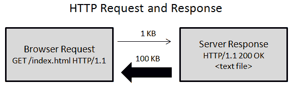
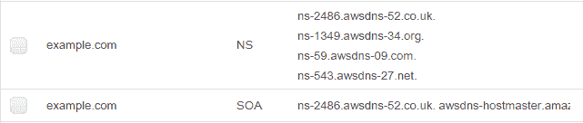

# 第四章：托管网站

前端是过渡到无服务器架构最容易的一层。您只需要一个服务来托管您网站的静态文件，用户的浏览器将下载文件，渲染页面并执行客户端 JavaScript 代码。在 AWS 上，我们将使用 Amazon S3 来托管前端页面。在本章中，您还将学习如何通过添加 CDN 和支持的 HTTPS 连接来配置和优化您的网站。

总结来说，我们将涵盖以下主题：

+   使用 Amazon S3 托管静态文件

+   配置 Route 53 以将您的域名与 S3 关联

+   使用 CloudFront 通过 CDN 提供文件服务

+   请求免费的 SSL/TLS 证书以支持 HTTPS 连接

在本章之后，您将学会如何在无服务器基础设施中托管前端。

# 使用 Amazon S3 提供静态文件服务

Amazon S3 非常有用，因为它是一个提供高可用性和可扩展性且成本低的低成本服务，无需任何管理努力。基础设施完全由 AWS 管理。在本节中，我们将使用 S3 来托管我们的网站静态文件，如 HTML、CSS、JavaScript 和图像。您将看到这是通过将文件上传到存储桶并配置 S3 以启用网站托管来完成的。

除了托管静态网站，您还可以托管复杂的应用程序。您只需要有一个清晰的关注点分离：*前端*文件（HTML/CSS/JavaScript）将托管在 S3 上，并由浏览器用于渲染网页并请求发送到*后端*代码的额外数据，该代码将由 Lambda 函数托管和执行。正如我们将在第五章，“构建前端”中讨论的，您可以将前端构建为一个单页应用程序（SPA）。这需要浏览器来渲染页面。或者，您可以使用 Lambda 来提供服务器端渲染的页面。

# 创建存储桶

在第二章，“AWS 入门”中，我们使用 CLI 创建了一个存储桶。在本节中，我们将使用管理控制台创建另一个存储桶，以便您可以看到 S3 提供的配置选项。

让我们执行以下步骤来创建一个存储桶：

1.  第一步是浏览 S3 控制台[`console.aws.amazon.com/s3`](https://console.aws.amazon.com/s3)并选择创建存储桶选项：


1.  我们正在创建一个新的存储桶来托管网站。如果您没有域名，您仍然可以使用 S3 来托管网站。您将需要通过以下格式的 URL 访问它：`http://my-bucket-name.com.s3-website-us-east-1.amazonaws.com`。如果您有一个域名，例如`example.com`，您*必须*将存储桶名称设置为与您的域名相同的名称，在这种情况下，`example.com`。您必须匹配域名和存储桶名称，以便 Route 53 能够建立关联。至于区域，请选择离您的目标受众更近的区域：


1.  设置属性屏幕允许您添加版本控制、日志记录和标签。然而，这些对于我们的示例不是必需的，可以跳过：


1.  在设置权限屏幕中，在管理公共权限下，选择授予此存储桶公共读取访问权限的选项。点击下一步继续：


1.  通过检查选定的选项并点击创建存储桶来完成：

# 启用网站托管

要在此存储桶中启用网站托管，请执行以下步骤：

1.  点击您的存储桶名称，并从第二个标签中选择属性：


1.  在静态网站托管卡中，点击禁用按钮以启用选项：


1.  现在选择使用此存储桶托管网站选项，并将索引文档和错误文档的值设置为`index.html`。此外，请注意，您可以在这张图片中看到存储桶的端点地址。在这个例子中是`http://example.com.s3-website-us-east-1.amazonaws.com`。请记下来，因为您稍后在进行测试和配置 CloudFront 分发时需要它：


1.  点击保存以完成此设置。

# 处理错误

使用 S3 处理错误有四种常见方式。我将解释您拥有的选项，但在这样做之前，让我定义一下我所说的“处理错误”是什么意思。当用户发起一个 HTTP 请求时，S3 可能无法获取答案，并将返回一个状态码来解释失败。一个可能的 HTTP 500 *内部服务器错误*可能是一个结果，但它会非常罕见和奇怪。然而，S3 返回 404 *未找到*或 403 *禁止*错误相当常见。

404 *未找到* 是当用户浏览您的网站寻找不存在的页面时返回的错误。例如，如果您有一个名为 `company.io/about` 的页面，而用户错误地浏览了 `company.io/abot`，S3 将无法找到 `abot.html` 文件并返回 404 错误。另一个例子是当您使用 JavaScript 框架创建一个 **单页应用（SPA**）时。尽管您的前端代码知道如何服务 `/about` 页面，但框架不会创建一个物理的 `about.html` 文件上传到 S3，即使浏览 `company.io/about` 也会返回 404 错误。

我们将在第五章 构建前端中讨论单页应用（SPA）。目前，请注意，一个 SPA 可以服务多个页面，但只有一个完整的 HTML 文件，名为 `index.html` 文件。

403 *禁止访问* 是当存储桶有受限权限时发生的错误。如果存储桶不允许所有人访问，或者有特定的文件有受限访问权限，将返回 403 错误。在我看来，我更喜欢将存储桶中的所有文件都视为公开。如果有页面不应该公开，显示 HTML 文件不应成问题。目标是保护 *数据* 而不是 *布局*。设置授权和数据可见性需要在服务器端处理，而不是客户端。此外，如果有必须保持私密的静态文件，例如照片，您可以将它们保存在另一个存储桶中，而不是重复使用创建来托管网站的存储桶。这些 *照片* 可以被视为 *数据*，同样，需要由后端特别关注来控制。

考虑到存储桶中的所有文件都将保持公开，并且我们不必过于担心奇怪的 S3 错误，我们现在需要处理的唯一问题是 404 错误。

# 使用重定向规则

处理单页应用（SPA）的 404 错误的一个非常常见的方法是在静态网站托管页面中使用 `ReplaceKeyPrefixWith` 选项添加重定向规则：

```js
    <RoutingRules>
      <RoutingRule>
 <Condition>
 <HttpErrorCodeReturnedEquals>
 404
 </HttpErrorCodeReturnedEquals>
 </Condition>
        <Redirect>
          <Hostname>
            example.com
          </Hostname>
 <ReplaceKeyPrefixWith>
 #!/
 </ReplaceKeyPrefixWith>
        </Redirect>
      </RoutingRule>
    </RoutingRules>

```

使用此解决方案，当用户浏览 `company.io/about` 时，地址将被替换为 `company.io/#!/about`，并返回 `index.html` 文件。如果您有一个单页应用（SPA），它能够识别需要显示的页面并正确渲染。如果页面不存在，它将能够渲染一个通用的 404 页面。此外，您还可以配置 HTML5 的 pushState 在页面加载后移除哈希符号（`#!`），但这会使页面闪烁。

这种方法的缺点是您需要在带有 `#!` 的污染 URL 和页面加载时页面闪烁之间做出选择。

# 使用错误文档

你可以设置一个带有`index.html`的错误文档，而不是设置重定向规则。这是 SPAs 的最简单解决方案。当用户请求一个没有物理`about.html`文件匹配的`/about`页面时，将加载`index.html`文件，SPA 读取地址并理解它需要提供`/about`页面的内容。

这就是我们在上一张图片中做的配置，它工作得相当好，没有在 URL 地址中污染`#!`，也没有在加载时使页面闪烁。然而，搜索引擎可能会拒绝索引你的网站，因为当浏览`/about`页面时，结果的`body`消息将使用正确的页面设置，但`status code`仍然设置为 404。如果谷歌爬虫看到 404 错误，它将理解页面不存在，页面内容可能是一个通用的错误页面。

# 委派给 CloudFront

你可以将错误文档设置为`index.html`，就像之前的解决方案一样，但使用 CloudFront 而不是 S3。CloudFront 提供了一个*自定义错误响应*设置，允许你更改`response`对象的`status code`。在这种情况下，我们可以配置 CloudFront 在 404 错误上操作，返回 S3 的`index.html`文件，并将`status code`修改为`200 *OK*`而不是返回 404。

如果你选择这样做，问题是你将返回状态码 200，即使对于不存在的页面。

# 预渲染页面

其他解决方案的另一个问题是**搜索引擎优化**（**SEO**）没有被考虑，因为它们需要在浏览器中启用 JavaScript 才能渲染正确的页面。由于大多数网络爬虫无法执行 JavaScript 代码，它们将无法索引网页。这个问题通过预渲染得到了解决。

在下一章中，你将学习如何预渲染页面。这项技术为 SPA 路由创建物理页面。例如，在一个 SPA 中，`/about`页面没有`about.html`文件，但通过预渲染，你将能够创建它。

当你预渲染所有可能的页面并将文件上传到 S3 时，就无需担心 404 错误。如果页面存在，S3 将找到它的 HTML 文件。我们仍然需要将错误文档配置为`index.html`来处理不存在的页面，但我们不需要配置 CloudFront 强制状态码 200。

# 支持 www 锚点

没有 www 锚文本的域名通常被称为*裸域名*。例如，`www.example.com`是一个带有 www 锚点的域名，而`example.com`是一个裸域名。*规范 URL*是你选择作为主要地址的选项。

在决定哪个地址应该是你的网站主地址时，你需要考虑利弊。使用裸域名的一个问题是你如果网站有 cookies，那么将静态文件放在子域名中，例如`static.example.com`，将不会得到优化，因为每个浏览器对静态文件的请求都会自动发送为`example.com`创建的 cookies。如果你的登录发生在`www.example.com`，你可以在`static.example.com`内部放置静态内容，而不必担心 cookies。

通过创建另一个域名或使用 CDN 来检索静态文件可以减轻这个问题。尽管如此，当前的潮流是放弃 www 锚点。将你的科技公司品牌化为`company.io`看起来比使用旧的`www.company.com`格式更现代。

选择你的主要地址，但支持两种格式。有些人习惯于在地址中添加 www，而有些人可能会忘记包含它。在先前的例子中，我们创建了一个没有 www 地址的域名。现在我们将创建另一个以`www.example.com`格式的存储桶，并设置静态网站托管配置，将重定向请求选项设置为指向没有 www 的地址：


# 上传静态文件

上传操作相当直接。让我们执行以下步骤来上传静态文件：

1.  首先，为了测试目的，创建一个非常简单的`index.html`文件：

```js
        <!DOCTYPE html>
        <html>
            <title>My Page</title>
        <body>
            <h1>Hosting with S3</h1>
        </body>
        </html>

```

1.  当你点击主存储桶名称时，会出现一个上传按钮。点击它：


1.  下一屏幕很简单。点击添加文件，选择`index.html`文件，然后通过点击下一步继续：


1.  在设置权限步骤中，在管理公共权限下，选择授予此对象（s）公共读取访问权限的选项：


1.  在设置属性步骤中，保持存储类为默认选项标准，因为文件会被频繁访问。同时，将加密设置为无，因为所有文件都将公开可用，因此，添加额外的安全层是不必要的，并且只会减慢你的响应速度。至于元数据字段，你不需要设置它们：


1.  最后，检查选项，并通过点击上传来确认。

1.  现在，你可以通过浏览存储桶的端点来检查它是否工作，例如，`http://example.com.s3-website-us-east-1.amazonaws.com`。

如果第一次尝试不成功，请清除浏览器缓存并再次尝试，因为在你上传文件之前测试端点时，浏览器可能会缓存表示链接无效的信息。这可能会避免短时间内进一步的请求。

# 自动化网站发布

我们已经通过 S3 控制台完成了上传我们网站前端所需的步骤。这既简单又快捷，但也很容易自动化这个任务。如果你还没有按照第二章《AWS 入门》中的说明配置 AWS CLI，请现在就配置它，看看自动化文件上传有多有用。实际上，我们要做的是将存储桶内容与本地文件夹同步。CLI 只会上传已修改的文件，这将在你的网站未来增长时使上传速度大大加快。

你可以使用以下命令上传你的文件：

```js
aws s3 sync ./path/to/folder s3://my-bucket-name --acl public-read

```

# 服务器端 gzip 文件

gzip 文件格式是 Web 上用于压缩文件并通过减少传输文件大小来提高下载速度的标准格式。它可以通过提供更小的文件来降低你和你用户的带宽成本。这种方法对加载网站时的感知性能有巨大影响。

它目前被每个主要浏览器支持。默认情况下，对于每个请求，浏览器都会添加一个`Accept-Encoding: gzip`头。如果服务器支持 gzip，则文件将以压缩形式发送。

以下图表显示了没有 gzip 支持的 HTTP 请求：



以下图表显示了使用 gzip 可以节省多少带宽。压缩后的响应通常比未压缩的文件小 10 倍：


使用这种格式，服务器需要 CPU 时间来压缩文件，用户的浏览器需要 CPU 周期来解压缩相同的文件。然而，随着现代 CPU 的发展，压缩/解压缩所需的时间远低于通过网络发送未压缩文件所花费的额外时间。即使对于低端移动设备，CPU 的速度也比移动网络快得多。

然而，有一个问题。由于我们没有在 Amazon S3 上进行服务器端处理，因此没有选项可以原生地根据请求压缩文件。你需要在上传文件并设置元数据以标识`Content-Encoding`为`gzip`之前本地压缩它们。幸运的是，如果你使用 CloudFront，你可以跳过在部署工作流程中包含此步骤的麻烦。正如我们稍后将要看到的，CloudFront 有一个选项可以自动使用 gzip 压缩所有文件。

# 设置 Route 53

Route 53 是一个 DNS 管理服务。如果你想要暴露子域名，例如`www.example.com`，则不需要使用它，但是如果你想在 S3 或 CloudFront 上托管裸域名，例如`example.com`，则确实有必要使用它。这是由于 RFC 规则：你的域名根不能有 CNAME 记录，它必须是 A 记录。

有什么区别？CNAME 和 A 记录都是帮助 DNS 系统将域名转换为 IP 地址的记录类型。虽然 CNAME 引用另一个域名，但 A 记录引用一个 IP 地址。

因此，如果您不想使用 Route 53，您可以使用自己的域名管理系统，例如 GoDaddy，添加一个 CNAME，将您的`www.example.com`域名映射到 S3 端点，例如，`www.example.com.s3-website-us-east-1.amazonaws.com`。这种配置效果良好，但您不能对`example.com`做同样的操作，因为`example.com.s3-website-us-east-1.amazonaws.com`端点的 IP 地址会频繁变化，而您的第三方域名控制器（例如本例中的 GoDaddy）不会跟随这些变化。

在这种情况下，您需要使用 Route 53，因为它将允许创建一个引用您的 S3 桶端点的 A 记录，例如`example.com.s3-website-us-east-1.amazonaws.com`。您只需说明此端点是别名，Route 53 就能跟踪正确的 IP 地址以回答 DNS 查询。

# 创建托管区域

如果您在亚马逊注册了您的域名地址，托管区域将自动创建。如果您在其他供应商处注册了您的域名，您将需要创建一个新的托管区域。

托管区域允许您配置您域的 DNS 设置。您可以设置您的裸域名和子域名托管在哪里，并配置其他参数，例如，一个*邮件交换*记录集。

要创建托管区域，请执行以下步骤：

1.  浏览 Route 53 管理控制台[`console.aws.amazon.com/route53`](https://console.aws.amazon.com/route53)。您将看到一个欢迎屏幕，点击立即开始。

1.  在下一屏幕中，点击左侧菜单中的托管区域，然后点击创建托管区域按钮：


1.  输入域名并确认：


1.  将创建一个托管区域，包含两种记录类型，即`NS`（名称服务器）和`SOA`（权威开始）：



1.  如果您已在其他供应商处注册了您的域名，您必须将 DNS 管理转移到 Route 53。这是通过更改您的域名注册商名称服务器（NS 记录）到亚马逊的名称服务器来完成的。

1.  您的注册商可能为您提供的域名控制面板中有一个选项，如管理 DNS。找到名称服务器所在的位置，并编辑它们以使用亚马逊的服务器。

# 创建记录集

现在让我们创建两个记录集，例如一个用于`example.com`，另一个用于`www.example.com`。通过以下步骤执行此操作：

1.  点击创建记录集：


1.  在第一条记录中，设置以下参数：

    +   名称：留空此字段

    +   类型：在此字段中，选择 A - IPv4 地址

    +   别名：选中此字段

    +   别名目标：此字段是一个下拉列表，您可以在其中选择您的存储桶的 S3 端点：


1.  创建另一个记录集。这次，使用以下参数值：

    +   名称：将此字段设置为`www`

    +   类型：在此字段中选择 CNAME - 规范名称

    +   别名：不选中此字段

    +   值：将此字段输入框填写为 S3 存储桶的端点：


1.  现在通过在浏览器地址栏中输入您的域名来测试您的域名。您将看到您已上传到 S3 存储桶的`index.html`文件。

如果您已将 DNS 控制权从其他供应商转移到 AWS，那么由于 DNS 缓存，您可能需要等待几分钟甚至几小时才能完成转移。只有在转移完成后，您才能看到托管在 Amazon S3 上的文件。

# 设置 CloudFront

CloudFront 作为**内容分发网络**（**CDN**）提供静态文件。在用户附近保留文件副本可以减少延迟并提高您感知的网站速度。另一个我们将在后面讨论的功能是支持 HTTPS 请求。

在下一节中，我们将创建一个 CloudFront 分发并调整 Route 53 设置以使用 CloudFront 而不是 S3 存储桶。

# 创建分发

CloudFront 分发使得将 DNS 配置（Route 53）与 CloudFront 关联起来以分发静态内容成为可能。分发需要一个源服务器来知道文件存储的位置。在我们的案例中，源将是之前配置的 S3 存储桶。

让我们执行以下步骤来创建 CloudFront 分发：

1.  浏览[`console.aws.amazon.com/cloudfront`](https://console.aws.amazon.com/cloudfront)的 CloudFront 管理控制台并点击创建分发：


1.  下一步是选择分发类型。对于我们的网站，在 Web 选项下选择入门：


1.  下一屏是一个需要我们填写的大表单。在第一个字段集中，源设置，源域名选项将提供一个 S3 端点的下拉列表。

您不应使用此处提供的端点，因为在使用此地址时，某些 S3 配置，如重定向或错误消息，将不可用。

相反，请在静态网站托管设置中的存储桶属性中使用的端点。这些 S3 端点之间的区别在于建议的端点没有存储桶区域（例如，`example.com.s3.amazonaws.com`），而我们将要使用的端点确实有区域（例如，`example.com.s3-website-us-east-1.amazonaws.com`）。在您提供源域名后，源 ID 将自动设置。请将源路径和源自定义头留空：


1.  在默认缓存行为设置中，设置以下参数：

    +   观众协议策略为 HTTP 和 HTTPS

    +   允许的 HTTP 方法为所有 HTTP 动词选项

    +   缓存的 HTTP 方法 带有 OPTIONS 选中

    +   以使用源缓存头作为对象缓存


1.  将本节中其余字段保留为默认值，除了自动压缩对象选项。此功能用于按需使用 gzip 压缩文件。正如本章已讨论的，Amazon S3 不提供自动压缩，但 CloudFront 提供。你只需要设置“是”选项：


1.  在分布设置中，设置以下参数：

    +   根据你的目标受众和愿意承担的成本（更好的性能意味着更高的成本）设置价格类别。

    +   使用裸域名和 www 域名设置替代域名（CNAMEs），域名之间用逗号分隔。

    +   在 SSL 证书中，选择默认的 CloudFront 证书（*.cloudfront.net）。一旦我们颁发自己的证书，我们将回到这个选项。

    +   将其余字段保留为默认值。


1.  现在点击创建分布。

1.  CloudFront 需要在几分钟内将分布配置复制到所有边缘点之间，但你可以在 CloudFront 控制台主页面中跟踪状态。完成后，它将显示状态为已部署。在下面的屏幕截图中，你可以看到 CloudFront 分布地址。将此链接复制到浏览器中并测试以检查它是否正常工作：


# 处理 CloudFront 缓存

默认情况下，CloudFront 将缓存所有文件 24 小时。这意味着如果你修改了 S3 存储桶中的文件，你通过 CloudFront 分布浏览时将看不到任何变化。强制在浏览器中重置缓存不会有所帮助，因为它是服务器端缓存。那么，处理缓存的推荐做法是什么？你有以下两种选择：

1.  **服务器端**：创建缓存失效请求

1.  **客户端**：在更改静态文件内容时给所有文件添加后缀

# 使服务器端缓存失效

向 CloudFront 创建缓存失效请求需要一些时间来处理，因为 CloudFront 需要联系所有边缘位置并请求它们清除各自的缓存。

由于这将是一个重复的任务，我不建议你使用 CloudFront 控制台。使用 CLI 更好。然而，目前 CloudFront 的 CLI 支持仅处于预览阶段。因此，你可能需要通过运行以下命令来启用它：

```js
 aws configure set preview.cloudfront true

```

要为所有文件（路径 `/*`）创建缓存失效请求，执行以下命令：

```js
 aws cloudfront \
      create-invalidation --distribution-id=DISTRIBUTION_ID --paths "/*"

```

你可以通过查看 CloudFront 控制台或运行以下 CLI 命令来找到你的 CloudFront 分布的`DISTRIBUTION_ID`：

```js
 aws cloudfront list-distributions

```

你可以将 `--query DistributionList.Items[0].Id` 添加到之前的命令中，以便只输出第一个分布的分布 ID。

这种解决方案需要很长时间才能使失效生效，并且它不能解决客户端缓存的问题。

# 使客户端缓存失效

当您浏览网页时，浏览器会缓存所有下载以显示页面（HTML、CSS、JavaScript、图片等）的文件，以避免在不久的将来需要相同的文件来提高性能。然而，如果您修改了一个文件的 内容，您如何告诉浏览器丢弃之前的缓存内容呢？您不能创建一个失效请求，因为这次缓存是在客户端，而不是服务器端，但您可以通过更改已修改文件的名称来强制浏览器发出新的请求。例如，您可以将文件名从`script.js`更改为`script.v2.js`，并在 HTML 页面中使用其新名称：

```js
    <script src="img/strong>"></script>

```

另一个选项是在 HTML 页面内部声明文件名时添加查询字符串，如下所示：

```js
    <script src="img/strong>"></script>

```

在这个例子中，文件名没有更改，但引用已更改，这对浏览器来说已经足够，使其认为之前的缓存已失效，并发出新的请求以获取更新的内容。

这两种策略的问题在于您无法缓存 HTML 页面。除了 HTML 页面外，所有其他数据都可以被缓存。否则，客户端将不会理解它应该下载文件依赖项的新版本。

为了上传 HTML 文件，使其永远不会被缓存，您必须在上传文件时将`Cache-Control`头设置为`no-cache`。在我们的网站上，在将本地文件夹与存储桶同步后，再次上传`index.html`文件，但这次，使用`cp`（复制）命令并添加`Cache-Control`头：

```js
 aws s3 cp index.html s3://my-bucket-name \
      --cache-control no-cache --acl public-read

```

这种策略效果相当不错，但它要求您自动化构建过程，以更改所有更改文件的文件名或查询字符串参数。在下一章中，我们将使用“Create React App”工具构建一个 React 应用。幸运的是，这个工具已经配置好了，会更改所有部署的文件名。它添加了随机字符串，例如在`main.12657c03.js`文件中。

# 将 Route 53 更新为使用 CloudFront

我们当前的记录集使用 S3 存储桶。您只需回到 Route 53，将其替换为新的 CloudFront 分发即可。对于使用 A 记录类型的裸域名，您需要在下拉菜单中选择别名选项为是，并选择 CloudFront 分发。

对于使用 CNAME 记录类型的`www`域名，选择别名选项为否。在这种情况下，复制 A 记录中可用的 CloudFront 分发地址，并将其粘贴到 CNAME 记录的框中。

# 支持 HTTPS

不幸的是，Amazon S3 不支持 HTTPS 连接，它只支持 HTTP。我们已经将 Route 53 记录集设置为使用 CloudFront 分发，但我们还没有在 CloudFront 中启用 HTTPS 支持。

但为什么我们应该支持 HTTPS 呢？现在有很多原因。让我们列举一些：

+   我们正在建立一个在线商店。我们需要处理登录和支付交易。在没有加密连接的情况下做这些事情是不安全的。很容易窃听网络并窃取敏感数据。

+   HTTP/2 是最新协议，比旧的 HTTP/1.1 版本快得多。目前，*所有*主要浏览器都支持 HTTP/2，并且*要求*HTTPS。在未加密的 HTTP 连接上支持 HTTP/2 是不可能的。

+   加密的 HTTP/2 比未加密的 HTTP/1.1 更快。Troy Hunt 在这个链接中展示了有趣的演示：[`www.troyhunt.com/i-wanna-go-fast-https-massive-speed-advantage`](https://www.troyhunt.com/i-wanna-go-fast-https-massive-speed-advantage)。在他的测试中，由于新协议的多路复用功能，使用 HTTP/2 over TLS 加载包含数百个小文件的网站比 HTTP/1.1 快 80%。

+   另一个很好的理由是隐私。在所有地方使用 HTTPS 有助于保护您的浏览数据安全。这还不够，因为您访问的网站域名将继续被暴露，但它帮助很大。您访问的页面以及您阅读或编写的内容将不会（轻易）受到损害，因为数据总是以加密的形式传输。

如果您确信并想支持 HTTPS，请按照以下步骤操作：

1.  在 Route 53 中创建一个邮件交换记录。

1.  向 AWS 请求免费 SSL/TLS 证书。

1.  编辑 CloudFront 分发以使用此新证书。

第一步，创建邮件账户是必要的，因为 AWS 只有在您证明您拥有该域名时才会发放免费 SSL/TLS 证书，并且这种验证是通过发送到`admin@example.com`电子邮件地址的链接来完成的。

# 创建邮件交换记录

在我们向 AWS 请求免费证书之前，我们需要一个处理电子邮件消息的服务。我建议使用 Zoho Mail 作为免费选项（高达 5 GB 空间）。在本节中，我们将通过执行以下步骤来了解如何配置此服务：

1.  首先，浏览[www.zoho.com/mail](http://www.zoho.com/mail)并注册一个免费的*商业*电子邮件账户。此账户将与您的域名相关联。在选择管理员账户时，选择名称`admin`。这个名称很重要，因为 AWS 将通过发送确认电子邮件到`admin@example.com`来检查您的域名所有权。

1.  在您创建账户后，您将需要确认关联域的所有权。有几种方法可以证明您的所有权，我更喜欢使用 CNAME 方法。在从列表中选择您的域名 DNS 管理器（DNS 托管提供商）选项中，选择“其他...”，因为 AWS 没有列出。现在，选择 CNAME 方法，CNAME 和目标将显示出来。您需要使用这对组合配置一个新的临时 Route 53 记录集，并完成点击“进行 CNAME 验证”按钮：


1.  验证后，确认创建`admin`账户。您可以按顺序添加其他用户。

1.  下一步是在 Route 53 中配置 MX（邮件交换）记录。复制 Zoho 提供的值：


1.  返回到 Route 53。删除用于验证 Zoho 账户的 CNAME 记录集，因为它不再必要。现在您需要使用前面的截图中的值创建一个新的 MX 类型记录集：


1.  我们完成了。您可以通过发送电子邮件到这个新地址并检查您的 Zoho 电子邮件账户中收到的电子邮件来测试它是否正常工作。

# 使用 AWS 证书管理器请求免费证书

让我们通过以下步骤来了解如何使用 AWS 证书管理器请求免费证书：

1.  在[`console.aws.amazon.com/acm/home?region=us-east-1`](https://console.aws.amazon.com/acm/home?region=us-east-1)请求 TLS 证书。

您需要位于 us-east-1，因为 CloudFront 只使用该区域的证书。

1.  在欢迎屏幕上，点击“开始”。在下一个屏幕上，输入您的裸域名和 www 版本，然后点击“审查和请求”：


1.  在下一个屏幕上，您只需点击“确认”并请求。亚马逊将通过发送电子邮件到`admin@example.com`来尝试证明您的域名所有权。如果您在上一节中正确配置了您的电子邮件账户，您将在 Zoho 收件箱中收到一封电子邮件。

1.  该电子邮件有一个确认链接，您必须点击以证明您的所有权。之后，亚马逊将颁发一个新的 TLS 证书，该证书将可用于您的账户。

您无需担心证书到期日期。AWS 将在必要时自动续订。

# 配置 CloudFront 以支持 HTTPS 连接

支持 HTTPS 的最后一步是编辑 CloudFront 分发以使用新证书。要执行此任务，请查看以下步骤：

1.  浏览 CloudFront 管理控制台[`console.aws.amazon.com/cloudfront`](https://console.aws.amazon.com/cloudfront)，并打开您的分发。

1.  在“常规”选项卡下，点击“编辑”选项。

1.  点击“自定义 SSL 证书（example.com）”选项，并使用下拉按钮选择您的域名证书：


1.  保存以返回上一页，然后点击第三个选项卡“行为”，并点击“编辑”来编辑现有行为。

1.  现在我们可以将查看器协议策略参数更改为将 HTTP 重定向到 HTTPS，以强制用户始终使用 HTTPS：


1.  更改这些设置后，CloudFront 将自动将新配置部署到所有边缘节点。

1.  等待几分钟之后，您可以通过浏览您的域名来确认 HTTPS 支持。

# 摘要

在本章中，你学习了如何配置 S3、CloudFront 和 Route 53 来托管无服务器前端解决方案。现在，你的网站已经分布在全球各地，以降低延迟并提高速度，同时提供 HTTPS 支持，使网络更加安全和私密。

在下一章中，我们将使用 React 作为单页应用（SPA）来构建我们的无服务器商店应用的前端。
