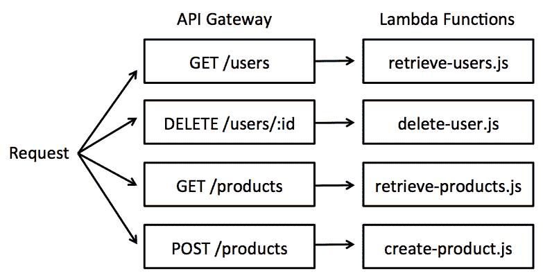
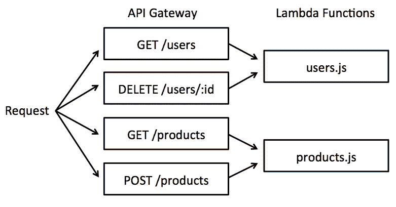
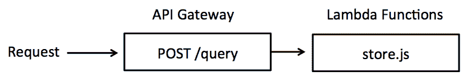
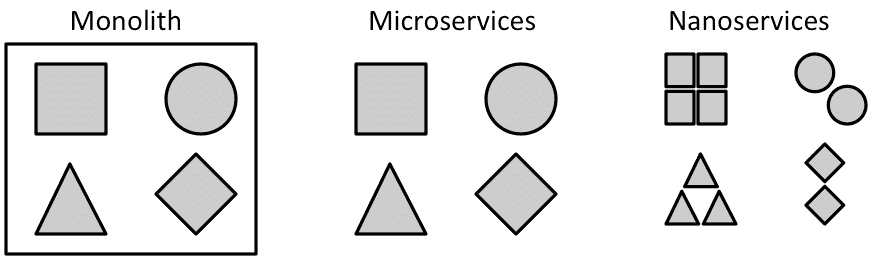
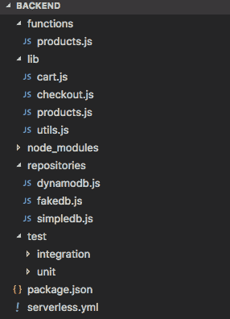
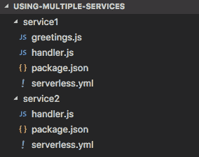

# 第六章：开发后端

在没有服务器的情况下开发后端是无服务器概念的主要驱动力，也是它如此有趣的原因。在这个模型中，范式转变是将项目分解成可以单独部署的小逻辑块，而不是一个单一的庞大应用程序。如何架构这种分离将在本章中介绍。此外，我们将继续开发我们的无服务器在线商店，使用 REST 原则构建后端。

简而言之，我们将涵盖以下主题：

+   无服务器架构概述

+   组织项目的代码

+   如何创建 RESTful 服务

在这一章之后，你将构建我们无服务器在线商店的后端。

# 定义项目架构

在本节中，我们将介绍四种不同的无服务器项目架构方法：

+   **纳米服务**：这里每个**功能**都有自己的**Lambda**函数

+   **微服务**：这里每个**Lambda**处理单个资源的**所有 HTTP 动词**

+   **单体**：这里**单个 Lambda**函数处理**所有功能**

+   **图**：这使用的是**GraphQL**标准，它是 REST API 的替代品

正如我们将看到的，每种架构方法都有其优点和缺点，没有**万能药**。你需要权衡利弊，选择你认为最适合你特定用例的方案。让我们更深入地了解它们。

# 单体与微服务

选择无服务器架构时，我们首先需要考虑的是应用程序是否仅使用一个 Lambda 函数执行（**单体**或**图**）或者它将拥有多个 Lambda 函数（**微服务**或**纳米服务**）。Lambda 函数的数量代表了它有多少个部署单元。

单体是一个包含所有功能的自包含应用程序，所有功能都在单个解决方案中开发，对代码中某一部分的修改需要整个解决方案的新部署。

微服务架构是相反的。你有多个可以单独部署的单元，每个单元负责整个解决方案的一个特定部分。要遵循微服务架构，你需要向应用程序添加模块化。你将一个大应用程序分解成一组小型服务，这些服务可以通过 HTTP 请求相互通信。

微服务使用边界上下文的概念。例如，在一个在线商店中，我们有**销售**上下文，它代表与销售产品相关的所有业务规则，还有另一个**支持**上下文，涉及与客户服务相关的功能。我们可以根据它们有不同的业务规则并且能够独立演进来分离这些关注点。支持规则的修改不应影响销售功能，因此你可以部署一个服务而不部署另一个，这使得不同的团队能够同时在不同上下文中工作。

通常，微服务提供以下好处：

+   更好的关注点分离和模块化

+   独立且频繁的部署

+   使用分离的团队更容易进行并行开发

与其他一切一样，它也伴随着一些缺点，如下所示：

+   需要更多的 DevOps 工作（但可以通过 Serverless Framework 缓解）

+   分布式系统增加了复杂性

+   之间多个服务的集成测试更困难

# 纳米服务

纳米服务是从单体应用程序中可以提取的最小部分。你可以将单体拆分为多个微服务，但这些微服务也可以进一步拆分为多个纳米服务。

例如，你可以有一个**用户**微服务，负责处理与用户相关的所有操作，如创建、检索、更新、删除、密码恢复等。*检索*用户是一个单一的功能，可以非常简单，用不到 10 行代码实现。如果你只为这一段逻辑创建一个 Lambda 函数，你就是在创建一个纳米服务。

下面的图示显示了每个公开的功能都有自己的 Lambda 函数和 HTTP 端点：



要构建这样的应用程序，我们需要配置`serverless.yml`文件，为每个函数分配其自己的端点：

```js
    functions:
      retrieveUsers:
        handler: handlers.retrieveUsers
        events:
          - http: GET users
      deleteUser:
        handler: handlers.deleteUser
        events:
          - http: DELETE users
      retrieveProducts:
        handler: handlers.retrieveProducts
        events:
          - http: GET products
      createProduct:
        handler: handlers.createProduct
        events:
          - http: POST products

```

由于简单性，这个例子忽略了在这个解决方案中所需的`OPTIONS`动词，因为在跨源请求中，浏览器在执行`POST`、`PUT`、`PATCH`和`DELETE`之前，会预先发送一个`OPTIONS`请求来检查 CORS 头。我们将在本章后面更详细地介绍这一点。

对于这种架构，我们可以列出以下优缺点：

**优点**:

+   关注点的分离允许你修改一个功能而不影响系统的其他部分。自治团队也将从最小化冲突中受益。

+   当一个函数只有一个责任时，调试问题会更容易。

**缺点**:

+   性能可能会较慢。由于某些函数很少被触发，冷启动延迟会更频繁。

+   在大型项目中，你可能会拥有数百个函数！大量的逻辑部分可能会造成弊大于利。

# 微服务

微服务模式增加了与应用程序边界上下文相关的功能模块化。在这个架构中，每个 Lambda 函数处理单个资源的所有 HTTP 动词。这通常导致每个函数有五个端点（**GET**、**POST**、**PUT**、**DELETE**、**OPTIONS**）：



上述系统可以通过`serverless.yml`文件定义为两个边界上下文，其中给定上下文的所有 HTTP 动词都引用相同的 Lambda 函数：

```js
    functions:
      users:
        handler: handlers.users
        events:
          - http: GET users
          - http: DELETE users
      products:
        handler: handlers.products
        events:
          - http: GET products
          - http: POST products

```

这种架构有以下优缺点：

**优点**:

+   结果是管理的 Lambda 函数数量减少

+   由于冷启动较少，性能可能略优于纳米服务

**缺点**:

+   调试稍微复杂一些，因为每个函数都有更多的选项和可能的输出

+   需要实现一个路由机制来正确处理每个请求

这种路由机制可以通过使用 Lambda 事件来查找 HTTP 方法以及 REST 资源的简单 `switch…case` 语句来实现：

```js
    module.exports.users = (event, context, callback) => {

      switch(`${event.httpMethod} ${event.resource}`) {
        case 'GET /users':      
          users.retrieveUsers(callback);
          break;
        case 'DELETE /users':  
          let id = JSON.parse(event.body).id;    
          users.deleteUser(id, callback);
          break;
        default:
          // handle unexpected path
      }
    };

```

# 单体

单体模式仅使用一个 Lambda 函数来处理我们应用程序的所有功能。在这种情况下，我们所有的应用程序端点都会触发同一个 Lambda 函数：



只有一个端点并不构成限制。你可以有多个端点，但此模式的目的是减少接口数量。

`serverless.yml` 文件非常简化：

```js
    functions:
      store:
        handler: handler.store
        events:
          - http: POST query

```

在这里，我们将看到一个如何在 Lambda 函数内部构建 GraphQL API 的简单示例。让我们看看以下步骤：

1.  安装 GraphQL 模块（`npm install graphql --save`）并在 `handler.js` 函数中引入它：

```js
        const { graphql, buildSchema } = require('graphql');

```

1.  下一步是描述你的数据是如何组织的。在下面的示例中，我们有一个 `ShoppingCart` 实体，它包含用户想要购买的一组 `Products`。对象键是属性名，值是其数据类型。模式是一个字符串输入，它将被 `buildSchema` 函数编译：

```js
        const schema = buildSchema(`
          type Query {
            cart: ShoppingCart
          }

          type ShoppingCart {
            products: [Product],
            promotionCode: String,
            discountPercentage: Int
          }

          type Product {
            name: String,
            code: String,
            quantity: Int,
            price: Int
          }
        `);

```

`decimal` 数据类型不是一个内置的数据类型，但你可以使用 `integer` 类型以分而不是美元来计数货币。GraphQL 提供了 `float` 数据类型，但它不适用于处理货币。

1.  现在，看看下面这个遵循定义模式的 JSON 对象：

```js
        const data = {
          "cart": {
            "products": [
              {
                "name": "Lonely Bird",
                "code": "FOO",
                "quantity": 1,
                "price": 2999
              },
              {
                "name": "Solid Friendship",
                "code": "BAR",
                "quantity": 1,
                "price": 1999
              }
            ],
            promotionCode: null,
            discountPercentage: 0
          }
        };

```

在这个例子中，整个数据集将通过 `data` 变量作为输入提供给 `graphql` 函数。然而，在实际应用中，将整个数据库加载到内存中是不可行的。在这种情况下所做的是在模式定义中定义一个解析器函数，告诉 GraphQL 引擎如何获取所需的数据，这意味着如何查询数据库。

1.  在定义了数据的结构和位置之后，你可以使用 `graphql` 查询数据。这个查询将由客户端定义，并将可在 Lambda 函数的 `event` 输入中找到。例如，考虑客户端发送的这个查询：

```js
        const query = `{
          cart {
            products {
              name
              quantity
              price
            }
            discountPercentage
          }
        }`;

```

在这个查询中，客户端想要知道所选产品的列表，但有一些信息客户端不感兴趣。例如，客户端不想知道产品的 `code` 或是否与该购物车关联的 `promotionCode`。

1.  要在 Lambda 函数中使用它，请调用 `graphql` 函数并传递 `schema`、`query` 和 `data` 参数：

```js
        module.exports.store = (event, context, callback) => {

          const query = JSON.parse(event.body);

          graphql(schema, query, data).then((resp) => {

            const response = {
              statusCode: 200, 
              body: JSON.stringify(resp)
            };

            callback(null, response);
          });
        };

```

1.  对此函数的请求将返回以下 JSON 对象：

```js
        {
          "data": {
            "cart": {
              "products": [
                {
                  "name": "Lonely Bird",
                  "quantity": 1,
                  "price": 2999
                },
                {
                  "name": "Solid Friendship",
                  "quantity": 1,
                  "price": 1999
                }
              ],
              discountPercentage: 0
            } 
          }
        }

```

使 GraphQL 强大的是其简单的语法，它允许客户端请求它确切需要的数据，并以它期望的格式接收这些数据。在这个模型中，单个请求可以获取来自多个资源的数据。它可以是一个有趣的 RESTful API 的替代品，但它也有其局限性。忽略与 REST 相关的优缺点，以下列表比较了图模式作为无服务器架构解决方案：

**优点**:

+   图查询可以更好地替代单体方法的路由机制

+   当所有端点都使用相同的 Lambda 函数时，代码将不断缓存，冷启动几乎不会发生

+   部署快速，因为只有一个函数和一个端点

**缺点**:

+   如果代码库随着太多依赖项的增长而变得太大，Lambda 的大小可能会影响性能

+   由于每个查询都有独特的执行，因此分配内存和设置超时时间要困难得多

GraphQL 有许多其他功能，需要大量的资料，但这本书的重点不是这个。为了入门，你可以在 [`graphql.org/learn`](http://graphql.org/learn) 上了解更多。

# 命名差异

Serverless Framework 的团队对无服务器架构持有相似的看法，你可以在 [`serverless.com/blog/serverless-architecture-code-patterns`](https://serverless.com/blog/serverless-architecture-code-patterns) 上查看。

然而，我所说的“纳米服务”，他们称之为“微服务”。在我看来，微服务不是一个很好的术语来描述每个单独的功能都被视为一个微服务的架构风格。微服务的概念是为了指代那些被分解成几个不同部分的单体应用程序，以便更好地处理功能和特性的管理和演进。当你有太多的部分时，这些原则就不那么容易应用了。幸运的是，Serverless Framework 使得处理数十个服务变得更加容易，但对于传统应用程序来说，当微服务过于细粒度时，维护和通信的开销超过了它的好处，为了区分，这里将其称为纳米服务。

此外，请注意，他们将我称为“微服务”的模式命名为“服务”。您可以按自己的喜好命名这些模式，但请理解这些术语可能会造成混淆。

以下图表展示了从我的角度来看，**单体**、**微服务**和**纳米服务**架构之间的区别：



# 开发后端

在对架构进行了概述之后，我们可以开始构建后端。在这个仅作为实验的示例中，我选择了单体架构，因为它减少了冷启动延迟，而且我们的后端逻辑非常小。在你的解决方案中，你需要考虑用例，权衡每个选项的利弊。

# 定义功能

在上一章中，我们开发了前端并硬编码了一些数据来显示静态页面。现在，我们将创建后端以公开前端将使用的信息。请查看以下前端视图以及它们将需要后端提供的哪些功能：

1.  **主页**：这个页面需要显示所有可用的产品列表

1.  **产品详情**：这个页面需要关于产品的详细信息，包括用户评论列表

1.  **购物车**：这个页面需要显示选定的产品，并允许用户保存或结账

1.  **注册页面**：这个页面的逻辑也将在这个第八章中实现，*保护无服务器应用程序*

1.  **登录页面**：这个页面的逻辑也将在这个第八章中实现，*保护无服务器应用程序*

1.  **页面未找到**：当 URL 无效时，无需请求后端

1.  **错误页面**：当发生错误时，这个页面不会向后端发出任何额外的请求

除了这些页面之外，我们还有一个将显示在所有页面上的 Navbar 组件，它有一个通知图标。我们将在这个第九章中实现这个功能，*处理无服务器通知*。

简而言之，我们现在需要实现以下功能：

1.  检索所有可销售的产品

1.  检索特定产品的详细信息

1.  检索用户购物车中选定的产品列表

1.  保存选定的产品列表

1.  结账购物车

为了简化，第二和第三个功能将在第一个功能的结果中提供，这意味着当用户请求所有可用产品的列表时，响应对象将带来每个产品的所有信息，以及用户是否已将该产品添加到购物车的信息。

# 组织代码

选择如何组织项目的文件是一个个人选择。你只需使用有意义的名称放置文件，这样以后更容易找到它们。在这个项目中，我使用了以下结构：



下面是关于前一张截图显示的每个文件夹的简要描述：

+   `functions`：这些是直接部署到 AWS 的 Lambda 函数。我们只有一个函数，因为我们的应用程序是一个单体。这个函数将处理与产品相关的一切。我们不需要 Lambda 函数来处理用户创建/身份验证，因为我们打算使用 Cognito 来完成这项任务。

+   `lib`：这是可以被不同 Lambda 函数使用的通用应用程序逻辑。

+   `node_modules`：这些是安装在本项目文件夹中的 Node 依赖项，并由 `package.json` 文件引用。它们将被压缩以供 Lambda 函数使用。

+   `repositories`：此文件夹包含连接数据库和定义查询的基础设施代码。它将在第七章，*使用无服务器数据库*中实现。在截图上，你可以看到我们将实现 SimpleDB 和 DynamoDB 的查询。在本章中，将使用 FakeDB 提供硬编码数据以进行测试。

+   `test`：此文件夹包含单元和集成测试文件。它将在第十章，*测试、部署和监控*中实现。

# 在其他文件夹中引用 Lambda 函数

当你使用 Serverless Framework 创建新的服务时，它将创建一个 `serverless.yml` 文件来引用一个示例函数：

```js
    functions:
      hello:
        handler: handler.hello

```

你应该注意这里的是 `handler.hello` 意味着 Serverless Framework 将尝试在 `serverless.yml` 文件相同的目录下找到一个 `handler.js` 文件，并查找导出的 `hello` 函数。当你有一个大项目时，你可能更喜欢将处理函数分离到子文件夹中。语法相当简单，`foldername/file.function`。

应注意的以下示例：

```js
    functions:
      hello:
        handler: subfolder/handler.hello
      goodbye:
        handler: lambdas/greetings.bye

```

在这个项目中，我使用了以下代码：

```js
    functions:
      products:
        handler: functions/products.handler

```

# 使用多个服务

另一点你应该注意的是，Serverless Framework 只会创建一个包含与`serverless.yml`文件同一级别或以下内容的 ZIP 文件夹。无法包含上级的依赖项。这意味着如果你的项目使用两个不同的服务，每个服务都有一个不同的`serverless.yml`文件，你无法直接在它们之间共享依赖项。

以下截图说明了具有此问题的项目示例：



`greetings.js`文件是一个简单的 Node.js 模块，只有一行代码：

```js
    module.exports.saySomething = () => 'hello';

```

`service1`和`service2`的`handler.js`文件都被实现为使用`greetings`模块返回消息：

```js
    const response = {
      statusCode: 200,
      body: JSON.stringify({
       message: greetings.saySomething()
      })
    };

```

它们之间的唯一区别在于如何加载`greetings`模块。在第一个服务中，由于它处于同一级别，我们使用以下代码进行加载：

```js
    const greetings = require('./greetings');

```

在第二个服务中，我们需要引用`service1`文件：

```js
    const greetings = require('../service1/greetings');

```

如果您在本地测试`service2`函数（`serverless invoke local --function hello`），它将无问题运行，但如果部署到 AWS，则会失败，因为 ZIP 文件将不会发布依赖项。

以下是此问题的两种解决方案：

+   避免使用多个服务。将它们聚合到一个单一的服务中，并将合并的`serverless.yml`文件放置在项目根目录。

+   使用本地 npm 包来管理公共依赖项。

尽管我更喜欢第一个选项，但第二个选项也是有效的。要创建一个本地的 npm 包，浏览到包含公共依赖项的文件夹，并运行以下命令：

```js
 npm pack

```

此命令将创建一个与为公共`npm`模块创建的格式完全相同的压缩包。

现在，在包含您的无服务器服务的文件夹中，使用以下命令本地安装包：

```js
 npm install ../path/to/pack.tgz

```

每当公共依赖项被修改时，您需要重复此过程。如果它不断更新，您可能需要将此阶段包含到您的构建工作流程中。

# 设置端点

正如我们所知，我们需要创建 API 网关端点以向世界展示我们的无服务器函数。这是在`serverless.yml`文件中完成的，以下示例显示了如何为无服务器商店创建端点：

```js
    functions:
      products:
        handler: functions/products.handler
        events:
          - http: GET products
          - http: POST cart     # create the cart (new order)
          - http: OPTIONS cart
          - http: PUT checkout  # update the order (status = sent)
          - http: OPTIONS checkout

```

在需要支持跨域请求中的`POST`、`PUT`、`PATCH`或`DELETE`动词的情况下，设置`OPTIONS`端点是强制性的。原因是浏览器使用的一种安全措施，即在发出可能修改资源的 HTTP 请求之前，它先使用`OPTIONS`进行预检请求，以检查 CORS 是否启用以及 HTTP 动词是否允许。

# RESTful API

如果您还不熟悉 RESTful API，您至少应该了解以下常见的 HTTP 动词及其用法：

+   `GET`：用于向服务器请求数据

+   `POST`：用于创建或修改资源：

    +   `POST/resource`：如果没有 ID，将创建一个新的元素

    +   `POST/resource/id`: 如果你知道 ID 并将其包含在请求中，元素将被更新，然而，它通常仅用于创建资源而不是更新资源

    +   `POST/resource/new-id`: 如果没有给定 ID 的资源，此请求必须返回一个错误

+   `PUT`: 这用于创建或修改以下资源：

    +   `PUT/resource`: 这应该返回一个错误，因为预期会有 ID

    +   `PUT/resource/id`: 这将用提供的数据替换整个对象

    +   `PUT/resource/new-id`: 如果没有给定 ID 的资源，它将被创建

+   `PATCH`: 这用于执行部分更新，而不是用给定的数据替换整个资源，它不会更新或删除与输入不匹配的属性

+   `DELETE`: 这用于删除资源，必须提供一个 ID

+   `OPTIONS`: 这返回允许的 HTTP 动词并告知是否启用了 CORS

# 路由 HTTP 动词

如前例所示，对于我们的路由策略，我们可以使用 `httpMethod` 和 `resource` 的 `switch…case` 语句来识别路径。我建议添加 `try…catch` 语句来警告客户端关于意外错误，而不是让 Lambda 吞噬这些消息。

以下示例展示了如何实现`products`函数的路由：

```js
    module.exports.handler = (event, context, callback) => {

      const userId = '1'; // TODO: retrieve from authentication headers
      try {
        switch(`${event.httpMethod} ${event.resource}`) { 
 case 'GET /products': 
            products.retrieveAll(userId, callback);
            break;
 case 'POST /cart': 
            const selectedProducts = JSON.parse(event.body).products;
            cart.saveCart(userId, selectedProducts, callback);
            break;
 case 'OPTIONS /cart': 
            utils.optionsHandler(callback);
            break;
 case 'PUT /checkout':            const id = JSON.parse(event.body).id;
            checkout.processCheckout(id, callback);
            break; 
 case 'OPTIONS /checkout': 
            utils.optionsHandler(callback);
            break;
          default:
            utils.notFoundHandler(callback);
        }
      } catch (err) {
        utils.errorHandler(err, callback);
      }
    };

```

记住你需要运行 `serverless deploy` 来创建 Lambda 函数和端点，但之后可以使用 `serverless deploy function --function products` 命令进行更快的部署。

下一节将解释如何创建 `utils` 模块来处理响应。

# 处理 HTTP 响应

通常，我们需要处理至少四种响应类型：

1.  **成功**: 当请求成功处理时，返回 HTTP `200 OK`。

1.  **错误**: 当后端发生错误时，返回 HTTP `500 内部服务器错误`。

1.  **未找到**: 当客户端请求不存在的资源时，返回 HTTP `404 未找到`。

1.  **选项**: 返回 HTTP `200 OK` 并附带此资源的允许方法。

还有许多其他的 HTTP 状态码，例如当客户端发送没有必要参数的请求时，返回 `400 错误请求`，但涵盖广泛的状态码超出了本书的范围，并且大多数状态码在大多数应用程序中都没有使用。

以下代码片段展示了如何实现这些处理程序：

```js
    const corsHeaders = { 
      'Access-Control-Allow-Origin': '*' 
    };

    module.exports.successHandler = (obj, callback) => {
      callback(null, {
        statusCode: 200,
        headers: corsHeaders,
        body: JSON.stringify(obj)
      });
    };

    module.exports.errorHandler = (err, callback) => {
      callback(null, {
        statusCode: 500,
        headers: corsHeaders,
        body: JSON.stringify({
          message: 'Internal Server Error',
          error: err.toString()
        })
      });
    };

    module.exports.notFoundHandler = (callback) => {
      callback(null, {
        statusCode: 404,
        headers: corsHeaders,
        body: JSON.stringify({ message: 'Not Found' })
      });
    };

```

关于 `OPTIONS` 动词，我们需要用状态码 `200 OK` 回应请求并设置允许的方法和头信息：

```js
    module.exports.optionsHandler = (callback) => {
      callback(null, {
        statusCode: 200,
        headers: {
          "Access-Control-Allow-Origin": "*",
          "Access-Control-Allow-Methods":
            "GET, POST, PUT, PATCH, DELETE, OPTIONS",
          "Access-Control-Allow-Headers":
            "Accept, Content-Type, Origin"
        }
      });
    };

```

# 实现 Lambda 函数

在本节中，我们将看到如何实现后端功能。在实现和部署 Lambda 函数之后，我们可以修改前端代码以向后端发送 Ajax 请求。

# 检索所有产品

此功能具有以下三个职责：

+   从产品表中检索所有产品

+   检索所有用户评论/评分并将它们与产品列表连接

+   获取用户购物车并将其与产品列表合并，以确定已选择哪些产品

这些查询将由`repository`创建和执行，其实现将在下一章第七章，*管理无服务器数据库*中定义。

到目前为止，让我们使用 FakeDB 来返回硬编码的值：

```js
    const db = require('../repositories/fakedb');
    const utils = require('./utils');

    module.exports.retrieveAll = (userId, callback) => {
      db.retrieveAllProducts(userId, (err, res) => {
        if (err) utils.errorHandler(err, callback);
        else utils.successHandler(res, callback);
      });
    };

```

在这种情况下，FakeDB 将只返回产品列表：

```js
    module.exports.retrieveAllProducts = (userId, callback) => {
      const comments = [{
        id: 1,
        username: "John Doe",
        age: "3 days ago",
        text: "I'm using this to decorate my desk. I liked it."
      }];

      const products = [{
        id: "lonely-bird",
        name: "Lonely Bird",
        image: 'https://s3.amazonaws.com/...',
        price: 29.99,
        isSelected: yes,
        comments: comments
      }];

      callback(null, products);
    };

```

# 保存购物车

此请求接收一个选定产品的列表和`UserID`作为输入。在我们的示例应用程序中，`UserID`将唯一标识购物车，这意味着每个用户只有一个购物车。

如果用户已登录，前端知道`UserID`。然而，我们不能直接从客户端接收`ID`并信任该信息是有效的。我们知道一个恶意用户可以修改 JavaScript 代码以发送另一个用户的`ID`。

为了可靠地运行，我们必须分析所有已登录用户请求头中传递的认证令牌，并检查`ID`是否正确。这一步骤将在第八章，*保护无服务器应用程序*中实现。

# 检出

处理支付是一个复杂的特性，本书不会涉及。因此，当用户尝试结账购物车时，将显示一条消息，表明这只是一个演示应用程序。

然而，我们可以使用这个特性来学习无服务器通知是如何工作的。当用户开始支付流程时，后端接收信用卡信息并请求处理支付。由于这一步骤可能需要很长时间，我们不必使用客户端进行重复请求（轮询），而是可以使用 WebSockets 在响应可用时通知用户。无服务器通知将在第九章，*处理无服务器通知*中使用物联网进行介绍。

# 摘要

在本章中，你学习了无服务器架构，如纳米服务、微服务、单体和图。对于我们的无服务器商店，我们选择了单体架构来构建后端。我们还介绍了如何构建项目的代码和构建 RESTful API。

在下一章中，你将了解 SimpleDB 无服务器数据库。由于 SimpleDB 可能不足以满足大多数应用程序的需求，我们还将学习 DynamoDB，它不是一个无服务器数据库，但需要最少的维护。
